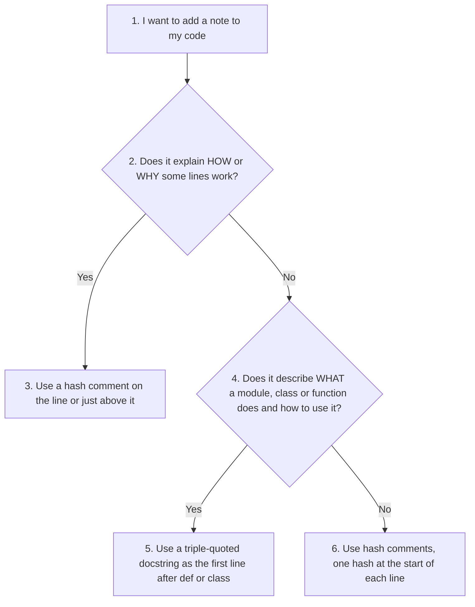
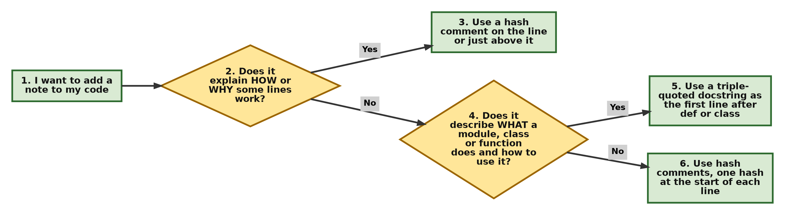
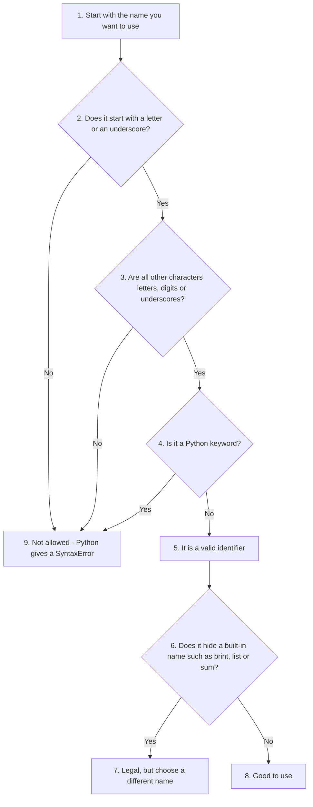
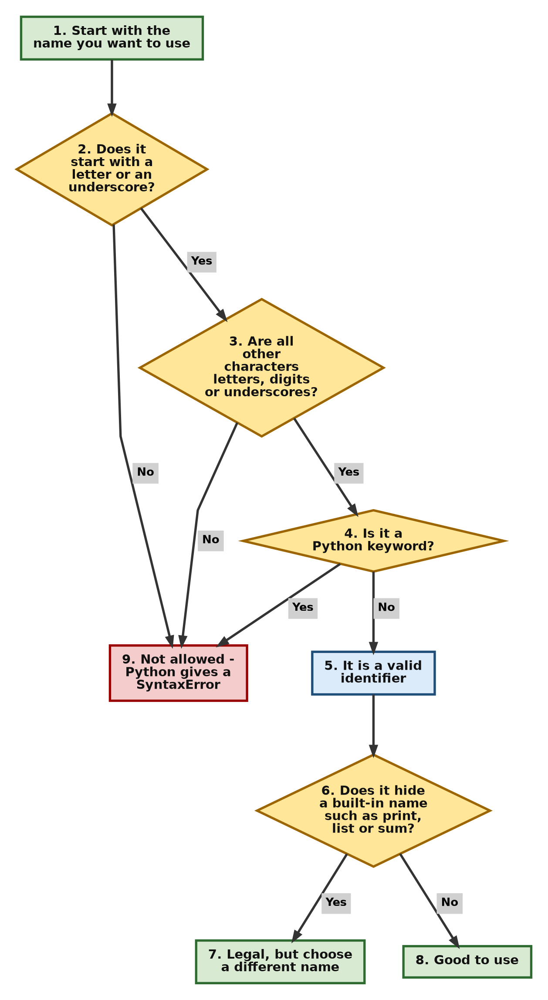
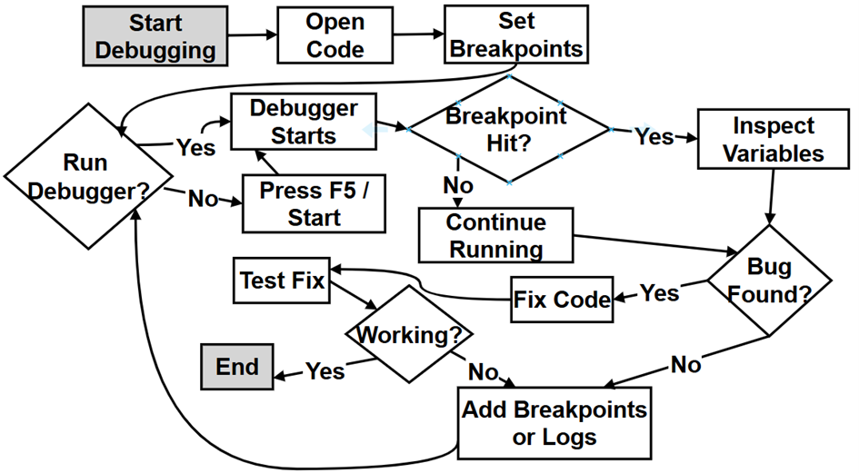
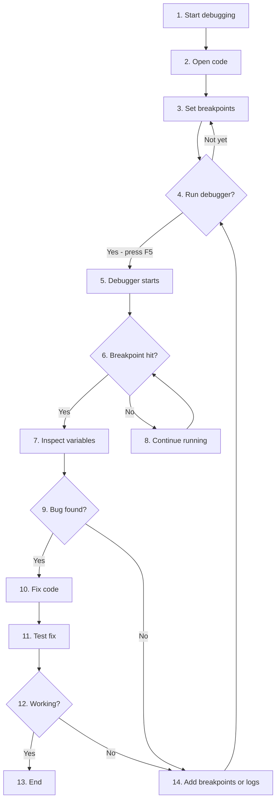
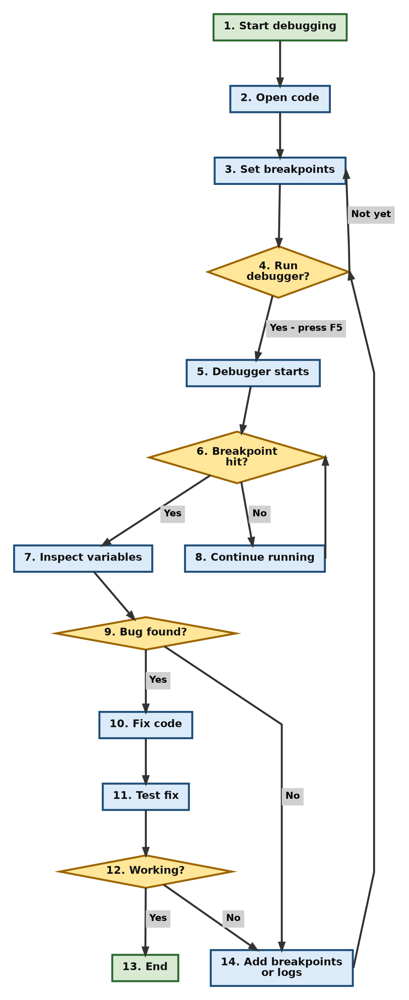

# Chapter 1: Python Basics - Comments, Identifiers, PEP 8, Keywords and Debugging

You can also visit my GitHub repository or the Google Colab notebooks by clicking the badges below

| Book Repository                                                                                                                                                                                  | Interactive Labs                                                                                                                                                           |
| ------------------------------------------------------------------------------------------------------------------------------------------------------------------------------------------------ | -------------------------------------------------------------------------------------------------------------------------------------------------------------------------- |
| [](https://github.com/ag999git/001-Python-book-2026) | [](../colab-nb) |


[](https://www.python.org/downloads/release/python-3100/)
[](https://code.visualstudio.com/)
[](https://jupyter.org/)
[](https://colab.research.google.com/)

**About this page**

This page goes with Chapter 1 of the book, *Python Basics*. The printed chapter introduces the small building blocks that every Python program is made of. This page takes those ideas further, with fuller explanations, tables, flowcharts and scripts that you can run yourself.

Here is what you will find on this page:

* **Comments** - how to leave notes in your code with the hash symbol `#`, and how triple quotes are used to write docstrings.
* **Identifiers** - the rules for naming things in Python, and the good habits that make names easy to read.
* **PEP 8** - the official style guide that most Python programmers follow, with correct and incorrect examples side by side.
* **Identifiers vs variables** - two words that are often mixed up, and how they differ.
* **Keywords** - the reserved words of Python, first grouped by concept and then in alphabetical order.
* **Debugging** - a step-by-step way to find and fix mistakes using the debugger in an IDE such as VS Code.
* **Practice questions** - a few extra questions with worked answers so you can test yourself.

Why does this matter? No matter how large a Python program is, it is built from these same pieces. Clear comments, good names and a consistent style make your code easy for others (and for your future self) to read. Knowing the keywords helps you understand Python's grammar. And debugging is a skill you will use every single day as a programmer. If some points are not fully clear on the first reading, don't worry. They will become clear as you move through the later chapters.

## Table of Contents

* [1. Comments in Python: Hash and Triple Quotes](#1-comments-in-python-hash-and-triple-quotes)
  * [1.1 Hash for Single-Line Comments](#11-hash-for-single-line-comments)
  * [1.2 Triple Quotes for Docstrings and Multi-Line Notes](#12-triple-quotes-for-docstrings-and-multi-line-notes)
  * [1.3 Side-by-Side Comparison](#13-side-by-side-comparison)
  * [1.4 Example Script: Comments and Docstrings in Action](#14-example-script-comments-and-docstrings-in-action)
  * [1.5 Which One Should I Use](#15-which-one-should-i-use)
* [2. Good Rules for Writing Identifiers in Python](#2-good-rules-for-writing-identifiers-in-python)
  * [2.1 The Legal Rules Required by Python](#21-the-legal-rules-required-by-python)
  * [2.2 Valid and Invalid Identifiers](#22-valid-and-invalid-identifiers)
  * [2.3 Good Habits Recommended but Not Required](#23-good-habits-recommended-but-not-required)
  * [2.4 Example Script: Checking Identifiers with Python](#24-example-script-checking-identifiers-with-python)
* [3. What Are PEP and PEP 8 in Python](#3-what-are-pep-and-pep-8-in-python)
  * [3.1 PEP Means Python Enhancement Proposal](#31-pep-means-python-enhancement-proposal)
  * [3.2 What Is PEP 8](#32-what-is-pep-8)
  * [3.3 PEP 8 at a Glance](#33-pep-8-at-a-glance)
  * [3.4 PEP 8 vs Non-PEP 8 Examples](#34-pep-8-vs-non-pep-8-examples)
  * [3.5 Tools That Check PEP 8 for You](#35-tools-that-check-pep-8-for-you)
* [4. Identifiers vs Variables](#4-identifiers-vs-variables)
  * [4.1 Example Script: Names, Values and Types](#41-example-script-names-values-and-types)
* [5. Python Keywords Grouped by Concept](#5-python-keywords-grouped-by-concept)
  * [5.1 Soft Keywords](#51-soft-keywords)
  * [5.2 Example Script: Ask Python for Its Keywords](#52-example-script-ask-python-for-its-keywords)
* [6. Debugging Python Scripts in an IDE](#6-debugging-python-scripts-in-an-ide)
  * [6.1 The Debugging Flowchart](#61-the-debugging-flowchart)
  * [6.2 Step-by-Step Explanation of the Debugging Flowchart](#62-step-by-step-explanation-of-the-debugging-flowchart)
  * [6.3 Practice: Debugging a Small Script](#63-practice-debugging-a-small-script)
* [7. Python Keywords Alphabetical Quick Reference](#7-python-keywords-alphabetical-quick-reference)
* [8. Practice Questions with Answers](#8-practice-questions-with-answers)
  * [Question 1: What Will This Code Print](#question-1-what-will-this-code-print)
  * [Question 2: Which of These Are Valid Identifiers](#question-2-which-of-these-are-valid-identifiers)
  * [Question 3: Rewrite the Code in PEP 8 Style](#question-3-rewrite-the-code-in-pep-8-style)
  * [Question 4: Why You Should Not Use print as a Variable Name](#question-4-why-you-should-not-use-print-as-a-variable-name)
  * [Question 5: Equality Versus Identity](#question-5-equality-versus-identity)
  * [Question 6: Is a Triple-Quoted String Always a Comment](#question-6-is-a-triple-quoted-string-always-a-comment)

## 1. Comments in Python: Hash and Triple Quotes

A **comment** is a note that you write inside your code for people to read. Python does not run it. Python gives you two ways to write such notes: the hash symbol `#` and triple quotes (`'''` or `"""`). They look similar in purpose, but they work in quite different ways, as explained below.

[Back to the Table of Contents](#table-of-contents)

### 1.1 Hash for Single-Line Comments

* A hash comment starts with `#` and continues to the end of the line.
* It is used mainly to explain the **logic**, the **steps**, or the **reasoning** inside the code.
* It helps programmers who want to **understand, debug, or modify** the code.
* Hash comments are usually scattered throughout functions and code blocks.
* You can write a comment that runs over many lines by putting `#` at the start of each line.
* The Python [interpreter](https://docs.python.org/3/glossary.html#term-interpreted) (the program that reads and runs your code) ignores these comments completely.

```python
# This whole line is a comment
price = 250          # A comment can also follow code on the same line

# A comment that needs
# more than one line
# simply repeats the hash symbol.
```

[Back to the Table of Contents](#table-of-contents)

### 1.2 Triple Quotes for Docstrings and Multi-Line Notes

* Written using triple single quotes `'''` or triple double quotes `"""`.
* Technically, triple quotes create a **multi-line string**, not a true comment. The string acts like a comment only when it is not stored in a variable or used in any other way.
* They are mainly used for **docstrings**. A [docstring](https://docs.python.org/3/glossary.html#term-docstring) is a piece of documentation for a module, class or function.
* A docstring appears as the very first statement inside a module, or immediately after a `def` or `class` line.
* It describes the **usage**, **purpose**, **arguments** (the inputs), and **return value** (the output) - in short, how someone should *use* the code.
* Python saves the docstring in a special attribute called `__doc__`. Tools such as [Sphinx](https://www.sphinx-doc.org/), [pydoc](https://docs.python.org/3/library/pydoc.html), the built-in `help()` function and most IDEs (code editors like VS Code) read it automatically.
* A docstring can also be written on a single line, for example `"""Return the sum of two numbers."""`.
* The conventions for writing good docstrings are given in [PEP 257](https://peps.python.org/pep-0257/).

[Back to the Table of Contents](#table-of-contents)

### 1.3 Side-by-Side Comparison

Table 1: Comparison of `#` comments and triple-quoted strings

| Feature / Purpose    | `#` Single-Line Comment                  | `'''` / `"""` Multi-Line String (Docstring)                     |
| -------------------- | ---------------------------------------- | --------------------------------------------------------------- |
| Syntax               | `# comment`                              | `""" comment """` or `''' comment '''`                          |
| Type                 | True comment                             | Multi-line string used as a comment or docstring                |
| Interpreter behavior | Completely ignored                       | Read as a string. Saved as the docstring if it is the first statement in a module, function or class. Otherwise it has no effect unless it is assigned or used |
| Typical use          | Explain logic or code steps              | Document modules, classes, and functions                        |
| Audience             | Programmers modifying/understanding code | Users who want to know how to use the code                      |
| Location             | Anywhere in code                         | Usually immediately after `def`, `class`, or at the top of a module |
| Extraction by tools  | Not extracted                            | Automatically extracted by documentation tools and `help()`     |
| Best for             | Inline explanations and quick notes      | Official documentation of how to use a function, class or module |
| Multi-line use       | Yes, by repeating `#` on each line       | Naturally supports multi-line formatting                        |
| Single-line use      | Yes                                      | Possible by placing opening and closing quotes on the same line |

A point to remember: the PEP 8 style guide (see [Section 3](#3-what-are-pep-and-pep-8-in-python)) recommends `#` for ordinary comments, even when they run over several lines. Keep triple quotes for docstrings.

If you as a beginner are unable to follow or understand some of the points, don't worry. They will become clear to you as you progress.

[Back to the Table of Contents](#table-of-contents)

### 1.4 Example Script: Comments and Docstrings in Action

The script below uses both kinds of comments. Notice how Python can print the docstring back to us, but has no way to show a `#` comment, because it was thrown away.

```python
"""
Module docstring: This small script shows the two ways of writing
comments in Python - the hash (#) and triple quotes.
"""

# Step 1 - Write a function that has a docstring
def area_of_rectangle(length, width):
    """Return the area of a rectangle.

    length -- the length of the rectangle
    width  -- the width of the rectangle
    """
    # Step 2 - Multiply length by width (this line is a # comment)
    area = length * width
    return area


# Step 3 - Call the function and print the result
result = area_of_rectangle(5, 3)
print("Step 3 - Area of rectangle:", result)

# Step 4 - Python keeps the docstring; we can read it with __doc__
print("Step 4 - The function's docstring is:")
print(area_of_rectangle.__doc__)

# Step 5 - A # comment is thrown away, so Python cannot show it
print("Step 5 - # comments are not stored anywhere, so there is nothing to print.")

# Step 6 - A triple-quoted string on its own line is just an unused string
"""This string is not stored in any variable, so it has no effect."""
print("Step 6 - The unused triple-quoted string above did nothing.")
```

Output:

```text
Step 3 - Area of rectangle: 15
Step 4 - The function's docstring is:
Return the area of a rectangle.

    length -- the length of the rectangle
    width  -- the width of the rectangle
    
Step 5 - # comments are not stored anywhere, so there is nothing to print.
Step 6 - The unused triple-quoted string above did nothing.
```

Note: from Python 3.13 onwards, Python removes the extra spaces at the start of each docstring line, so the two lines about `length` and `width` will appear without the leading spaces. Try `help(area_of_rectangle)` as well - it shows the same docstring in a neat format.

[Back to the Table of Contents](#table-of-contents)

### 1.5 Which One Should I Use

The flowchart below helps you decide. Follow the numbers.





[Back to the Table of Contents](#table-of-contents)

## 2. Good Rules for Writing Identifiers in Python

An **identifier** is simply a name. You use identifiers to name variables, functions, classes and modules. Some rules are *required* by Python - break them and your program will not run. Other rules are *good habits* - Python will not complain, but other programmers will find your code harder to read.

[Back to the Table of Contents](#table-of-contents)

### 2.1 The Legal Rules Required by Python

These rules are required by Python itself:

1. **Use only letters (A-Z, a-z), digits (0-9), and underscores (`_`).**
   Examples: `total_marks`, `value2`, `Student_Name`
2. **An identifier cannot start with a digit.**
   `1value` is wrong, and so is `2value`. But `value1` is OK, because the digit is not at the start.
3. **Keywords cannot be used as identifiers.**
   Keywords are words reserved by Python. Examples you *cannot* use: `for`, `while`, `if`, `break`, `class`, etc. (See [Section 5](#5-python-keywords-grouped-by-concept) for the full list.)
4. **No special symbols or spaces.**
   You cannot use names like `age@school`, `first-name`, `price$` or `first name`.
5. **Python is case-sensitive.**
   `student`, `Student` and `STUDENT` are three different names.

If you break any of these rules, Python stops with a `SyntaxError` before running your program.

A note about `print`: `print` is **not** a keyword. It is a [built-in function](https://docs.python.org/3/library/functions.html) (a function that comes ready-made with Python). Python will let you use `print` as a variable name, but you should not, because it hides the real `print` function. Question 4 in the [Practice Questions](#8-practice-questions-with-answers) shows what goes wrong.

A small extra fact: Python 3 also allows letters from other languages in names (for example `नाम = "Anurag"` works). However, most programmers stick to English letters so that everyone can read and type the code.

[Back to the Table of Contents](#table-of-contents)

### 2.2 Valid and Invalid Identifiers

Table 2: Examples of valid and invalid identifiers

| Name           | Valid? | Reason                                                    |
| -------------- | ------ | --------------------------------------------------------- |
| `total_marks`  | Yes    | Letters and underscore only                               |
| `value2`       | Yes    | The digit is not at the start                             |
| `_count`       | Yes    | An identifier may start with an underscore                |
| `Student_Name` | Yes    | Legal, but PEP 8 would prefer `student_name` for a variable |
| `2value`       | No     | Starts with a digit                                       |
| `first-name`   | No     | Hyphen `-` is not allowed (Python reads it as minus)      |
| `age@school`   | No     | `@` is a special symbol                                   |
| `price$`       | No     | `$` is a special symbol                                   |
| `first name`   | No     | Spaces are not allowed                                    |
| `for`          | No     | `for` is a keyword                                        |
| `print`        | Legal, but avoid | Hides the built-in `print` function             |

The flowchart below shows how to check a name, step by step.





[Back to the Table of Contents](#table-of-contents)

### 2.3 Good Habits Recommended but Not Required

These are not enforced by Python, but following them makes your code much easier to read:

* **Use meaningful names.** `total_marks` tells the reader far more than `tm` or `x`.
* **Use lowercase with underscores for variables and functions** (this style is called *snake_case*), for example `student_age`, `get_total()`.
* **Use capitalised words for class names** (called *PascalCase*), for example `BankAccount`.
* **Use all capitals for constants** (values that should not change), for example `MAX_SIZE = 100`.
* **Do not reuse the names of built-in functions** such as `print`, `list`, `sum`, `max`, `input` or `str`.
* **Avoid the single letters `l` (lowercase L), `O` (capital o) and `I` (capital i)** as names. They look too much like the digits `1` and `0`.
* **Keep names reasonably short.** `number_of_students` is fine; `the_total_number_of_students_in_the_class` is too long.

These habits come from PEP 8, which is explained in the next section.

[Back to the Table of Contents](#table-of-contents)

### 2.4 Example Script: Checking Identifiers with Python

Python can check names for you. The string method `isidentifier()` checks the legal rules, and `keyword.iskeyword()` checks whether a word is a keyword.

```python
import keyword

# Step 1 - A list of names we want to test
names = ["total_marks", "value2", "Student_Name", "_count",
         "2value", "first-name", "age@school", "price$", "for", "print"]

# Step 2 - Check each name one by one
print(f"{'Name':<14}{'Valid shape?':<14}{'Keyword?':<10}{'Can I use it?'}")
print("-" * 52)
for name in names:
    # isidentifier() checks the legal rules (letters, digits, underscore,
    # and no digit at the start)
    looks_valid = name.isidentifier()
    # iskeyword() checks whether the name is a reserved keyword
    is_reserved = keyword.iskeyword(name)
    # Step 3 - A name is usable only if it looks valid AND is not a keyword
    usable = looks_valid and not is_reserved
    print(f"{name:<14}{str(looks_valid):<14}{str(is_reserved):<10}{usable}")

# Step 4 - Case sensitivity: three different names, three different values
student = "Asha"
Student = "Ravi"
STUDENT = "Meena"
print("\nStep 4 - student, Student and STUDENT are three separate names:")
print(student, Student, STUDENT)
```

Output:

```text
Name          Valid shape?  Keyword?  Can I use it?
----------------------------------------------------
total_marks   True          False     True
value2        True          False     True
Student_Name  True          False     True
_count        True          False     True
2value        False         False     False
first-name    False         False     False
age@school    False         False     False
price$        False         False     False
for           True          True      False
print         True          False     True

Step 4 - student, Student and STUDENT are three separate names:
Asha Ravi Meena
```

Look at the last row of the table: Python says `print` *can* be used, because it is not a keyword. That is exactly why you have to be careful - Python will not stop you from hiding a built-in function.

[Back to the Table of Contents](#table-of-contents)

## 3. What Are PEP and PEP 8 in Python

### 3.1 PEP Means Python Enhancement Proposal

A **PEP is a document** that explains:

* **new features** to be added to Python
* **how** Python should work
* **guidelines** and **best practices** for writing Python code
* **changes** or **improvements** to the language

**Think of PEPs like a rulebook plus a suggestion box.**
They help Python stay organised, consistent, and easy to develop. Each PEP has a number, and all of them are listed on the official [PEP index](https://peps.python.org/). The very first one, [PEP 1](https://peps.python.org/pep-0001/), explains what PEPs are and how they are written.

**Simple example (analogy):**

Imagine a school where teachers write proposals to improve the rules:

* "Let's add a computer lab."
* "Let's change the uniform colour."

Python developers do the same. They write **PEPs** to propose improvements. The proposals are discussed, and the good ones are accepted and become part of Python.

[Back to the Table of Contents](#table-of-contents)

### 3.2 What Is PEP 8

You can check out the full details of PEP 8 [here](https://peps.python.org/pep-0008/).

**PEP 8 is the official Style Guide for Python code.**

PEP 8 tells Python programmers:

* how to **format** their code
* how to **name** variables, functions, and classes
* how many spaces to use
* where to put blank lines
* how to write code that is clean, readable, and consistent

**Think of PEP 8 like English grammar rules, but for Python.**
Just as grammar makes English easier to read, PEP 8 makes Python code easier for everyone to understand. A sentence with poor grammar can still be understood, and code that ignores PEP 8 still runs - but both are harder to read.

One idea from PEP 8 is worth remembering: *code is read much more often than it is written*. You write a line once, but you (and others) may read it many times while fixing or improving the program.

If you are curious, also type `import this` in Python. It prints "The Zen of Python" ([PEP 20](https://peps.python.org/pep-0020/)), a short poem of guiding ideas such as "Readability counts."

[Back to the Table of Contents](#table-of-contents)

### 3.3 PEP 8 at a Glance

Table 3: Main PEP 8 rules with correct and incorrect examples

| PEP 8 Topic                         | What It Means                                                                      | PEP 8 Example (Correct)                                                  | Non-PEP 8 Example (Incorrect)                                  |
| ----------------------------------- | ---------------------------------------------------------------------------------- | ------------------------------------------------------------------------ | -------------------------------------------------------------- |
| Indentation                         | Use 4 spaces for each level of indentation                                         | The line `print(x)` under `if x > 5:` starts with 4 spaces               | `if x > 5:print(x)` squashed on one line, or 2 or 3 spaces used |
| Tabs vs Spaces                      | Prefer spaces over tabs. Never mix the two in one file                             | 4 space characters                                                       | A tab character, or tabs and spaces mixed                      |
| Maximum Line Length                 | Keep lines of code under 79 characters (72 for comments and docstrings)            | `# Short comment line`                                                   | A very long comment or code line that runs past 79 characters and is hard to read |
| Blank Lines                         | Use blank lines to separate sections                                               | Two blank lines before and after a top-level function or class; one blank line between methods in a class | No blank lines between sections                                |
| Imports                             | Keep imports at the top of the file, one per line                                  | `import os`<br>`import sys`                                              | `import os, sys`                                               |
| Import Order                        | Standard library, then third-party, then local. Put a blank line between groups   | `import os` (standard library)<br>`import numpy` (third party)<br>`import mymodule` (local) | Random or mixed ordering                                       |
| Naming Conventions                  | Variables: snake_case<br>Classes: PascalCase<br>Constants: UPPER_CASE              | Variable: `total_amount`<br>Class: `BankAccount`<br>Constant: `MAX_SIZE` | `TotalAmount`, `bank_account` (as a class name), `maxsize`     |
| Whitespace Around Operators         | Put one space on each side of `=` and operators such as `+`. Avoid extra spaces    | `a = b + c`                                                              | `a=b+c` or `a  =  b   +  c`                                    |
| Spaces Inside Brackets              | No space just inside brackets                                                      | `print(x)`, `marks[0]`                                                   | `print( x )`, `marks[ 0 ]`                                     |
| Comments                            | Write clear comments. Start with `#` and one space                                 | `# Calculate total price`                                                | `#calc price` or obvious comments like `x = x + 1  # increment x` |
| Docstrings                          | Use triple quotes to document functions                                            | `"""Return the sum of two numbers."""`                                   | Using `#` comments instead of docstrings                       |
| Code Layout                         | Keep code clean and structured                                                     | Organised, readable code                                                 | Messy, inconsistent layout                                     |
| Boolean Comparisons                 | Check the value directly                                                           | `if is_ready:`                                                           | `if is_ready == True:`                                         |
| Compare with `None` using `is` / `is not` | Follow the Pythonic way                                                      | `if x is None:`                                                          | `if x == None:`                                                |
| Function and Variable Names         | Use lowercase_with_underscores                                                     | `get_value()`, `student_age`                                             | `GetValue()`, `StudentAge`, `studentAge`                       |
| Class Names                         | Use PascalCase                                                                     | `CarModel`                                                               | `carmodel`, `car_model`, `carModel`                            |
| Constant Names                      | Use UPPER_CASE                                                                     | `MAX_SPEED = 120`                                                        | `maxspeed = 120`                                               |
| Spacing After Commas                | Put a space after each comma                                                       | `print(1, 2, 3)`                                                         | `print(1,2,3)`                                                 |
| Single Statement per Line           | Write one statement on each line                                                   | `x = 1`<br>`y = 2`<br>(two separate lines)                               | `x = 1; y = 2` (works, but not recommended)                    |

Indentation is hard to show inside a table, so here it is as code. In the correct version each inner line starts with exactly 4 spaces:

```python
# PEP 8 (correct): 4 spaces for each level
if x > 5:
    print(x)
    if x > 10:
        print("x is also greater than 10")

# Non-PEP 8 (avoid): 2 spaces - it runs, but it is not the standard
if x > 5:
  print(x)
```

**Pythonic** is a word you will hear often. It means "written in the natural, clean style that experienced Python programmers use".

[Back to the Table of Contents](#table-of-contents)

### 3.4 PEP 8 vs Non-PEP 8 Examples

**The following Python script compares PEP 8 and non-PEP 8 style for:**

* Variables
* Functions
* Classes
* Conditionals
* Comments
* Internal (helper) names

The lines marked **CORRECT** follow PEP 8. The lines marked **AVOID** break PEP 8 on purpose so that you can compare the two. Python still runs both - style rules are about readability, not about whether code works.

```python
# ===============================================================
# PYTHON STYLE GUIDE: PEP 8 VS. NON-PEP 8
# This script demonstrates the "Pythonic" way to write code.
# The lines marked "AVOID" break PEP 8 on purpose, so that you can
# compare them with the correct style. Python still runs them.
# ===============================================================

# ---------------------------------------------------------------
# Step 1. VARIABLES: The "Identity" of your data
# Rule: Use snake_case (all lowercase with underscores)
# ---------------------------------------------------------------

# PEP 8 STYLE (CORRECT)
# This is easy to read because words are separated by underscores.
student_age = 20
total_score = 95

# CONSTANTS: Use all UPPERCASE to show this value should not change.
MAX_LIMIT = 100

# NON-PEP 8 STYLE (AVOID)
StudentAge = 20  # Avoid starting variables with Capital Letters
totalScore = 95  # This is "camelCase" - common in Java, but not Python
maxlimit = 100  # Hard to read; always use underscores to separate words

print("Step 1: Variable naming conventions demonstrated.")
print("        student_age =", student_age, "| MAX_LIMIT =", MAX_LIMIT)


# ---------------------------------------------------------------
# Step 2. FUNCTIONS: Actions your code performs
# Rule: Use snake_case and keep it readable
# ---------------------------------------------------------------

# PEP 8 STYLE (CORRECT)
# Use descriptive names and give the code space to "breathe."
def calculate_average(score1, score2, score3):
    total = score1 + score2 + score3
    return total / 3


# NON-PEP 8 STYLE (AVOID)
# Never put the logic on the same line as the 'def' statement.
def CalculateAverage(score1,score2,score3): total=score1+score2+score3;return total/3


print(f"Step 2: Average is {calculate_average(80, 90, 100)}")
print(f"        The badly written version gives the same answer: "
      f"{CalculateAverage(80, 90, 100)}")


# ---------------------------------------------------------------
# Step 3. CLASSES: Blueprints for objects
# Rule: Use PascalCase (Capitalize every word, no underscores)
# ---------------------------------------------------------------

# PEP 8 STYLE (CORRECT)
class StudentRecord:
    """Classes represent 'Things' so we capitalize them."""
    pass


class AttendanceManager:
    pass


# NON-PEP 8 STYLE (AVOID)
class studentRecord:  # Should be Capitalized
    pass


class Attendance_Manager:  # Avoid underscores in class names
    pass


print("Step 3: Class naming (PascalCase) demonstrated.")


# ---------------------------------------------------------------
# Step 4. CONDITIONALS: Decision making
# Rule: Use spaces around operators and proper indentation
# ---------------------------------------------------------------

x = 10

# PEP 8 STYLE (CORRECT)
# Space around the '>' and the '==' makes it much cleaner.
if x > 5:
    print("Step 4: x is greater than 5")
elif x == 5:
    print("Step 4: x is exactly 5")

# NON-PEP 8 STYLE (AVOID)
# Don't squash code together; it makes debugging very difficult.
if x>5: print("        x>5 (printed by the squashed, non-PEP 8 line)")


# ---------------------------------------------------------------
# Step 5. INTERNAL NAMES (Advanced)
# Rule: Start with a single underscore for internal/private use
# ---------------------------------------------------------------

# PEP 8 STYLE (CORRECT)
# This tells other programmers: "Use this only inside this script."
def _internal_utility_function():
    return "This is a hidden helper function."


print(f"Step 5: {_internal_utility_function()}")

# ===============================================================
# END OF SCRIPT: The script runs without errors. The "CORRECT"
# parts follow PEP 8; the "AVOID" parts show what not to do.
# ===============================================================
```

Output:

```text
Step 1: Variable naming conventions demonstrated.
        student_age = 20 | MAX_LIMIT = 100
Step 2: Average is 90.0
        The badly written version gives the same answer: 90.0
Step 3: Class naming (PascalCase) demonstrated.
Step 4: x is greater than 5
        x>5 (printed by the squashed, non-PEP 8 line)
Step 5: This is a hidden helper function.
```

Notice that the badly written function in Step 2 gives exactly the same answer as the good one. This proves the point: PEP 8 does not change *what* your code does. It changes how easy the code is to read.

You can run the above script in Google Colab (From Google Drive) [](https://colab.research.google.com/drive/1o0MazyhjW0tcmbxILSQXFVWrI8qp-gJ_?usp=sharing)

You can run the above script in Google Colab (Same notebook from GitHub) [](https://colab.research.google.com/github/ag999git/001-Python-book-2026/blob/main/colab-nb/01-10-python-basics.ipynb)

[Back to the Table of Contents](#table-of-contents)

### 3.5 Tools That Check PEP 8 for You

You do not have to remember every PEP 8 rule. Tools called **linters** read your code and point out style problems, and tools called **formatters** fix many of them for you automatically. Popular ones are:

* [pycodestyle](https://pycodestyle.pycqa.org/) - checks your code against PEP 8.
* [Flake8](https://flake8.pycqa.org/) - checks style and also some common mistakes.
* [Black](https://black.readthedocs.io/) - rewrites your code in a consistent style.
* [Ruff](https://docs.astral.sh/ruff/) - a very fast linter and formatter.

In VS Code you can add these through extensions, and they will underline problems as you type.

Here is a short example. Save the following badly styled code as `messy.py`:

```python
import os, sys
def CalculateAverage(a,b,c): return (a+b+c)/3
x=10
if x == None:
    print(x)
```

Step 1 - Install pycodestyle (in Google Colab, put `!` in front of each command):

```text
pip install pycodestyle
```

Step 2 - Run it on the file:

```text
python -m pycodestyle messy.py
```

Output:

```text
messy.py:1:10: E401 multiple imports on one line
messy.py:2:23: E231 missing whitespace after ','
messy.py:2:25: E231 missing whitespace after ','
messy.py:3:1: E305 expected 2 blank lines after class or function definition, found 0
messy.py:3:2: E225 missing whitespace around operator
messy.py:4:6: E711 comparison to None should be 'if cond is None:'
```

Step 3 - Read each line of the report. `messy.py:1:10` means "file `messy.py`, line 1, column 10". The code that follows (such as `E401`) is the name of the rule, and the message tells you what is wrong. Fix each problem and run the tool again until nothing is reported.

[Back to the Table of Contents](#table-of-contents)

## 4. Identifiers vs Variables

These two words are often used as if they mean the same thing, but they do not. An **identifier** is any name in your program. A **variable** is one particular use of a name: a name that refers to a value (Python calls every value an *object*). So every variable name is an identifier, but not every identifier is a variable. For example, `print` and `Car` are identifiers, but they name a function and a class, not stored data.

Table 4: Identifiers vs variables

| Feature                | Identifier                                                          | Variable                                               |
| ---------------------- | ------------------------------------------------------------------- | ------------------------------------------------------ |
| **Definition**         | A name used to identify something in Python                         | A name that refers to a value (an object) stored in memory |
| **What it represents** | Can represent variables, functions, classes, modules, etc.          | Only represents data stored in memory                  |
| **Creation**           | It is simply a name you write in code (e.g., `my_func`, `Car`)      | Created only when a value is assigned (e.g., `x = 10`) |
| **Has value?**         | Not by itself - it is only a name                                   | Yes, it refers to a value                              |
| **Has type?**          | No - the name itself has no type                                    | The value it refers to has a type (e.g., `int`). The type can change if a new value is assigned |
| **Has scope?**         | Yes - every name has a scope, which depends on where it is created  | Yes - local, global, or class-level                    |
| **Example**            | `sum`, `my_list`, `print`, `Car`                                    | `x = 5`, `name = "Anurag"`                             |
| **Error if missing?**  | Undefined identifier gives a `NameError`                            | Same, because a variable name is an identifier         |
| **Used for**           | Naming program components                                           | Storing and working with data                          |

Two terms from the table:

* **Scope** is the part of a program where a name can be used. A name created inside a function can be used only inside that function (local scope). A name created outside all functions can be used anywhere in the file (global scope). You will learn more in the chapter on functions. For more detail, see [Python Scopes and Namespaces](https://docs.python.org/3/tutorial/classes.html#python-scopes-and-namespaces).
* **Type** tells Python what kind of value something is - a whole number (`int`), a decimal number (`float`), text (`str`), and so on. You can check it with the built-in `type()` function.

[Back to the Table of Contents](#table-of-contents)

### 4.1 Example Script: Names, Values and Types

```python
# Step 1 - Create a variable: the name 'x' now refers to the value 10
x = 10
print("Step 1 - x refers to:", x)

# Step 2 - The value has a type (int), so we say x "has" that type
print("Step 2 - Type of the value x refers to:", type(x))

# Step 3 - 'greet' is an identifier too, but it names a function, not data
def greet():
    print("Hello!")

print("Step 3 - greet is a:", type(greet))
greet()

# Step 4 - Re-assign x: the same name now refers to a different value
x = "ten"
print("Step 4 - x now refers to:", x, "of type", type(x))

# Step 5 - Using a name before it is created gives a NameError
try:
    print(y)
except NameError as error:
    print("Step 5 - Error caught:", error)
```

Output:

```text
Step 1 - x refers to: 10
Step 2 - Type of the value x refers to: <class 'int'>
Step 3 - greet is a: <class 'function'>
Hello!
Step 4 - x now refers to: ten of type <class 'str'>
Step 5 - Error caught: name 'y' is not defined
```

Step 4 shows something special about Python: the same name `x` first referred to a number and then to a string. The *name* did not have a fixed type; only the *values* had types.

[Back to the Table of Contents](#table-of-contents)

## 5. Python Keywords Grouped by Concept

A **keyword** is a word that Python has reserved for its own use. Each keyword has a fixed meaning in Python's grammar, so you cannot use it as a name for your own variables or functions. Python 3.10 and later versions have **35 keywords**. Note that `True`, `False` and `None` start with a capital letter; all the others are in lowercase. You can read about them in the official [Python documentation on keywords](https://docs.python.org/3/reference/lexical_analysis.html#keywords).

The table below groups keywords by concept - logic, conditionals, loops, functions, exceptions, scope, and so on - rather than alphabetically, since that order matches how you will actually meet these ideas as you learn. If you want a fast alphabetical lookup instead, jump to [Section 7: Python Keywords Alphabetical Quick Reference](#7-python-keywords-alphabetical-quick-reference) later on this page.

Table 5: Python keywords grouped by concept

| Group                      | Keyword    | Meaning / Simple Explanation        | Example (Code)                 | Real-Life Example / Analogy                                 |
| -------------------------- | ---------- | ----------------------------------- | ------------------------------ | ----------------------------------------------------------- |
| Logic                      | `and`      | Both conditions must be true        | `if x > 0 and y > 0:`          | "I will go for a walk if it's sunny and I have free time."  |
| Logic                      | `or`       | At least one condition must be true | `if age < 18 or age > 60:`     | "I will drink tea or coffee - either one is fine."          |
| Logic                      | `not`      | Reverses a condition                | `if not is_raining:`           | "I will go out if it is not raining."                       |
| Conditionals               | `if`       | Decision-making                     | `if score >= 50:`              | "If it's your birthday, you get a gift."                    |
| Conditionals               | `elif`     | Additional condition (short for "else if") | `elif score >= 40:`     | "If not birthday, elif it's a festival, you get sweets."    |
| Conditionals               | `else`     | Runs when all conditions fail       | `else:`                        | "Otherwise, nothing special happens."                       |
| Loops                      | `for`      | Loop over a sequence                | `for n in [1, 2, 3]:`          | "Give chocolates to each student in class."                 |
| Loops                      | `while`    | Loop while condition is true        | `while count < 5:`             | "I study while it's quiet."                                 |
| Loops                      | `break`    | Stop the loop                       | `if n == 5: break`             | "Stop the game if someone gets hurt."                       |
| Loops                      | `continue` | Skip current iteration (one round of the loop) | `if n % 2 == 0: continue` | "Skip this person and move to the next."               |
| Placeholder                | `pass`     | Do nothing                          | `def func(): pass`             | A page marked "left blank on purpose" - nothing is on it, but the page is kept. |
| Functions                  | `def`      | Define a function                   | `def add(a, b):`               | Writing a recipe: "def make_tea():"                         |
| Functions                  | `return`   | Send value back                     | `return a + b`                 | At the end of the recipe: "Serve tea."                      |
| Functions                  | `lambda`   | Small anonymous (nameless) function | `square = lambda x: x * x`     | Quick rule: "Multiply by 2" without naming it.              |
| Functions                  | `yield`    | Return values one at a time         | `yield item`                   | A tree gives mangoes one by one.                            |
| Classes                    | `class`    | Define a class                      | `class Car:`                   | Blueprint for a car model.                                  |
| Modules                    | `import`   | Bring in a module                   | `import math`                  | "Bring a tool from the toolbox."                            |
| Modules                    | `from`     | Import part of a module             | `from math import sqrt`        | "Bring only the screwdriver from the toolbox."              |
| Modules                    | `as`       | Give a short name (an alias)        | `import math as m`             | "Call the screwdriver 'SD' for short."                      |
| Exceptions (errors)        | `try`      | Code that may cause an error        | `try:`                         | "Try opening the door; it might be locked."                 |
| Exceptions (errors)        | `except`   | Handle the error                    | `except ValueError:`           | "If locked, use the key."                                   |
| Exceptions (errors)        | `finally`  | Always runs                         | `finally:`                     | "Before leaving, lock the gate - always."                   |
| Exceptions (errors)        | `raise`    | Throw (cause) an error on purpose   | `raise TypeError("Wrong")`     | "Raise a complaint if rules are broken."                    |
| Exceptions (errors)        | `assert`   | Debug check                         | `assert x > 0`                 | "Check seatbelt is on before driving."                      |
| Comparison and membership  | `in`       | Check membership                    | `if "a" in "apple":`           | "Is your name in the list?"                                 |
| Comparison and membership  | `is`       | Check if same object                | `if x is None:`                | "Two cups look the same - are they the same cup?"           |
| Scope                      | `global`   | Use a global variable               | `global count`                 | Taking money from the main family wallet.                   |
| Scope                      | `nonlocal` | Use outer function variable         | `nonlocal total`               | A helper using the owner's cash drawer.                     |
| Resource handling          | `with`     | Automatic setup + cleanup           | `with open("a.txt") as f:`     | "With a washing machine, washing and rinsing happen automatically." |
| Deleting                   | `del`      | Delete variable/item                | `del numbers[0]`               | Throw away an old notebook.                                 |
| Special values             | `None`     | Represents "nothing"                | `x = None`                     | An empty seat with no one sitting.                          |
| Special values             | `True`     | Boolean true value                  | `flag = True`                  | A switch turned ON.                                         |
| Special values             | `False`    | Boolean false value                 | `flag = False`                 | A switch turned OFF.                                        |
| Asynchronous code (advanced) | `async`  | Marks a function that can pause and let other work run meanwhile | `async def fetch_data():` | A cook who puts rice on to boil and chops vegetables while waiting. |
| Asynchronous code (advanced) | `await`  | Wait for a slow task to finish without blocking other work | `data = await fetch_data()` | The cook checks the rice only when the timer rings. |

A tip about `is`: use `is` only to check whether two names point to the *same object*, most often with `None` (`if x is None:`). To check whether two values are *equal*, use `==`. Question 5 in the [Practice Questions](#8-practice-questions-with-answers) shows the difference.

[Back to the Table of Contents](#table-of-contents)

### 5.1 Soft Keywords

Python also has a few **soft keywords**. These are words that act as keywords only in certain places, and can be used as normal names everywhere else. They are:

* `match`, `case` and `_` - used in the `match` statement (added in Python 3.10), which chooses between several patterns, a bit like a set of `if` / `elif` checks.
* `type` - used to create type aliases (added in Python 3.12).

You can read more about them in the [Python documentation on soft keywords](https://docs.python.org/3/reference/lexical_analysis.html#soft-keywords). As a beginner you do not need them yet.

[Back to the Table of Contents](#table-of-contents)

### 5.2 Example Script: Ask Python for Its Keywords

You do not have to memorise the list. Python can tell you.

```python
import keyword

# Step 1 - Get the full list of keywords from Python itself
all_keywords = keyword.kwlist
print("Step 1 - Number of keywords:", len(all_keywords))

# Step 2 - Print them, a few per line, so they are easy to read
print("Step 2 - The keywords are:")
for i in range(0, len(all_keywords), 7):
    print("   ", ", ".join(all_keywords[i:i + 7]))

# Step 3 - Soft keywords (special only in certain places)
print("Step 3 - Soft keywords:", keyword.softkwlist)

# Step 4 - Test a few words
for word in ["if", "If", "print", "match"]:
    print(f"Step 4 - Is '{word}' a keyword? {keyword.iskeyword(word)}")
```

Output (Python 3.11):

```text
Step 1 - Number of keywords: 35
Step 2 - The keywords are:
    False, None, True, and, as, assert, async
    await, break, class, continue, def, del, elif
    else, except, finally, for, from, global, if
    import, in, is, lambda, nonlocal, not, or
    pass, raise, return, try, while, with, yield
Step 3 - Soft keywords: ['_', 'case', 'match']
Step 4 - Is 'if' a keyword? True
Step 4 - Is 'If' a keyword? False
Step 4 - Is 'print' a keyword? False
Step 4 - Is 'match' a keyword? False
```

In Python 3.12 and later, Step 3 also shows `'type'`. Notice that `If` (with a capital I) is not a keyword, because Python is case-sensitive, and `match` is not in the main list, because it is only a soft keyword.

[Back to the Table of Contents](#table-of-contents)

## 6. Debugging Python Scripts in an IDE

A **bug** is a mistake in a program that makes it give a wrong result or crash. **Debugging** is the process of finding and fixing such mistakes. An **IDE** (Integrated Development Environment), such as VS Code, is a code editor with extra tools built in. One of the most useful of these tools is the **debugger**, which lets you run your program slowly, pause it, and look inside it while it runs.

A few words you will meet in this section:

* **Breakpoint** - a marker you place on a line. When the program reaches that line, it pauses so that you can look around.
* **Variables panel** - a panel that shows the current value of every variable while the program is paused.
* **Watch panel** - a panel where you type the names of particular variables or expressions that you want to keep an eye on.
* **Call stack** - a list that shows which function is running right now and which function called it. It tells you "where you are" in the program.

The official guide [Python debugging in VS Code](https://code.visualstudio.com/docs/python/debugging) explains all of these in more detail.

[Back to the Table of Contents](#table-of-contents)

### 6.1 The Debugging Flowchart

The following flowchart shows how to debug a Python script.





The same cycle is shown below as a numbered Mermaid flowchart, so that you can follow each step by its number.





[Back to the Table of Contents](#table-of-contents)

### 6.2 Step-by-Step Explanation of the Debugging Flowchart

Below is a short, clear walk-through of each step in the above flowchart. It gives a typical cycle used when debugging in VS Code (or any debugger).

1. **Start Debugging**
   Begin the debugging session - open the code you want to inspect.
2. **Open Code**
   Make sure the file(s) you want to debug are visible in the editor and the correct project/folder is opened.
3. **Set Breakpoints**
   Click in the left margin next to one or more lines to place breakpoints (red dots). These tell the debugger where to pause execution.
4. **Run Debugger? (Decision)**
   Choose to start the debugger. If it is not yet started, press F5 or click *Run and Debug* to launch it.
5. **Debugger Starts**
   The program begins running under the debugger's control (a debug session is active).
6. **Breakpoint Hit? (Decision)**
   The debugger checks whether execution reaches a breakpoint:
   * Yes - go to Step 7, Inspect Variables (execution is paused).
   * No - go to Step 8, Continue Running (the program runs until the next breakpoint or the end).
7. **Inspect Variables**
   While paused, examine variable values by hovering over them, looking at the *VARIABLES* panel, or using the *WATCH* panel. Also check the *CALL STACK* to know where you are. You can then move forward one line at a time with *Step Over* (F10), or go inside a function with *Step Into* (F11).
8. **Continue Running**
   If no breakpoint was hit, let the program continue running (it may hit another breakpoint later).
9. **Bug Found? (Decision)**
   After inspection, decide whether the cause of the problem is clear:
   * Yes - go to Step 10, Fix Code.
   * No - go to Step 14, Add Breakpoints or Logs.
10. **Fix Code**
    Edit the source to correct the bug (logic error, wrong value, off-by-one, etc.). An *off-by-one* error is a very common bug where a count or a loop goes one step too far or stops one step too early.
11. **Test Fix**
    Re-run the debugger (usually by starting again with F5 or using *Restart*) to verify the change.
12. **Working? (Decision)**
    Check whether the program now behaves correctly:
    * Yes - go to Step 13, End.
    * No - go to Step 14, Add Breakpoints or Logs.
13. **End**
    Debugging is finished.
14. **Add Breakpoints or Logs**
    If the bug is not yet identified, add more breakpoints or temporary `print()` / [logging](https://docs.python.org/3/howto/logging.html) statements, then return to Step 4, Run Debugger?, to repeat the cycle.

Two more tips:

* **Print debugging.** Adding `print()` lines that show the value of a variable at each step is the simplest form of debugging. It works everywhere, even in Google Colab. Just remember to remove the extra prints when you are done.
* **The `breakpoint()` function.** If you write `breakpoint()` on a line, Python pauses there and opens a simple text debugger called [pdb](https://docs.python.org/3/library/pdb.html). Type `p count` to print the value of `count`, `n` to go to the next line, and `c` to continue.

[Back to the Table of Contents](#table-of-contents)

### 6.3 Practice: Debugging a Small Script

The script below is meant to work out the average of three marks: 70, 80 and 90. The correct answer is 80. But the script has a bug. Let us find it by following the flowchart.

**Step 1 - Store the marks**

```python
# Step 1 - Store the marks of a student in a list
marks = [70, 80, 90]
print("Step 1 - Marks:", marks)
```

**Step 2 - Add up the marks**

```python
# Step 2 - Add up all the marks
total = sum(marks)
print("Step 2 - Total:", total)
```

**Step 3 - Count the marks (this line has the bug)**

```python
# Step 3 - Count how many marks there are
count = len(marks) + 1
print("Step 3 - Count:", count)
```

**Step 4 - Work out the average**

```python
# Step 4 - Work out and show the average
average = total / count
print("Step 4 - Average:", average)
```

**The complete script with the bug**

```python
# Step 1 - Store the marks of a student in a list
marks = [70, 80, 90]
print("Step 1 - Marks:", marks)

# Step 2 - Add up all the marks
total = sum(marks)
print("Step 2 - Total:", total)

# Step 3 - Count how many marks there are
count = len(marks) + 1
print("Step 3 - Count:", count)

# Step 4 - Work out and show the average
average = total / count
print("Step 4 - Average:", average)
```

Output:

```text
Step 1 - Marks: [70, 80, 90]
Step 2 - Total: 240
Step 3 - Count: 4
Step 4 - Average: 60.0
```

**How to find the bug, following the flowchart**

1. Open the file in VS Code (flowchart Steps 1 and 2).
2. Click in the left margin next to the line `average = total / count` to set a breakpoint (Step 3).
3. Press F5 and choose *Python File* to start the debugger (Steps 4 and 5).
4. The program pauses at the breakpoint (Step 6). Look at the *VARIABLES* panel (Step 7). You will see `marks = [70, 80, 90]`, `total = 240` and `count = 4`.
5. Ask yourself: there are only 3 marks, so why is `count` equal to 4? The bug is found (Step 9) - it is the `+ 1` in Step 3 of the script.
6. Change `count = len(marks) + 1` to `count = len(marks)` (Step 10).
7. Run the script again (Steps 11 and 12). The average is now 80.0, which is correct, so debugging ends (Step 13).

Even without the debugger, the `print()` lines in the script would have given the game away: the output clearly says `Count: 4` when there are only three marks.

**The complete corrected script**

```python
# Step 1 - Store the marks of a student in a list
marks = [70, 80, 90]
print("Step 1 - Marks:", marks)

# Step 2 - Add up all the marks
total = sum(marks)
print("Step 2 - Total:", total)

# Step 3 - Count how many marks there are
count = len(marks)
print("Step 3 - Count:", count)

# Step 4 - Work out and show the average
average = total / count
print("Step 4 - Average:", average)
```

Output:

```text
Step 1 - Marks: [70, 80, 90]
Step 2 - Total: 240
Step 3 - Count: 3
Step 4 - Average: 80.0
```

[Back to the Table of Contents](#table-of-contents)

## 7. Python Keywords Alphabetical Quick Reference

The following table has 4 columns.

* The first column gives the Python keyword.
* The second column gives the meaning or a simple explanation for that keyword.
* The third column gives an example sentence (code) for that keyword.
* The fourth column gives a real-life example or analogy for that keyword.

Keywords are listed in alphabetical order, ignoring capital letters, so `False`, `None` and `True` appear in their alphabetical places.

Table 6: Python keywords in alphabetical order

| Keyword    | Meaning / Simple Explanation              | Example Sentence (Code)                         | Real-Life Example / Analogy                                              |
| ---------- | ----------------------------------------- | ----------------------------------------------- | ------------------------------------------------------------------------ |
| `and`      | True only if both conditions are true     | `if a > 0 and b > 0: print("Both positive")`    | Like saying: *I will go only if it's Saturday **and** it's not raining.* |
| `as`       | Give a temporary (short) name to something | `import math as m`                             | Like calling your friend "Raj" as "RJ" for convenience.                  |
| `assert`   | Check if something is true; stop if false | `assert age > 0`                                | Like a teacher checking "Are you sure?" before proceeding.               |
| `async`    | Mark a function that can pause while waiting for slow work | `async def fetch_data():`      | Like a cook who puts rice on to boil and chops vegetables meanwhile.     |
| `await`    | Wait for a slow task inside an `async` function | `data = await fetch_data()`               | Like the cook checking the rice only when the timer rings.               |
| `break`    | Exit a loop immediately                   | `for x in arr: break`                           | Like stopping a game in the middle.                                      |
| `class`    | Create a blueprint for objects            | `class Car: pass`                               | Like a form used to create many ID cards of the same design.             |
| `continue` | Skip the current loop step                | `if x < 0: continue`                            | Like skipping one student's turn and moving to the next.                 |
| `def`      | Define a function                         | `def greet(): pass`                             | Like defining a recipe you can use anytime.                              |
| `del`      | Delete a variable or item                 | `del x`                                         | Like throwing something away from your cupboard.                         |
| `elif`     | Extra conditions after "if" fails         | `if a > 0: ... elif a == 0: ...`                | Like: "If not bus, **else if** auto is available..."                     |
| `else`     | Runs if all conditions fail               | `if rain: ... else: ...`                        | Like: "If none of the above works, do this."                             |
| `except`   | Handle errors                             | `try: ... except: ...`                          | Like catching a falling glass before it breaks.                          |
| `False`    | Boolean false value                       | `flag = False`                                  | Like a switch turned OFF.                                                |
| `finally`  | Code that always runs                     | `finally: print("Done")`                        | Like always locking your door when leaving home.                         |
| `for`      | Loop through items                        | `for x in nums: ...`                            | Like checking names one by one in a list.                                |
| `from`     | Import a specific part of a module        | `from math import pi`                           | Like taking only one book from a library shelf.                          |
| `global`   | Declare a variable as global              | `global count`                                  | Like sharing one notebook across all family members.                     |
| `if`       | Used for conditions                       | `if score > 50: ...`                            | Like deciding "If it rains, take an umbrella."                           |
| `import`   | Bring in external modules                 | `import os`                                     | Like bringing a toolbox from another room.                               |
| `in`       | Check membership                          | `if 'a' in word: ...`                           | Like checking if your name is in a list.                                 |
| `is`       | Check object identity (the very same object) | `if a is b: ...`                             | Like checking if two cups are actually the *same* cup.                   |
| `lambda`   | Create small anonymous functions          | `f = lambda x: x * 2`                           | Like writing a one-line rule on a sticky note.                           |
| `None`     | Represents "nothing"                      | `x = None`                                      | Like an empty seat with no one sitting.                                  |
| `nonlocal` | Use a variable from the outer function    | `nonlocal x`                                    | Like borrowing your sibling's stationery.                                |
| `not`      | Negation; opposite value                  | `if not ready: ...`                             | Like saying "Not hungry."                                                |
| `or`       | True if at least one condition is true    | `if rain or snow: ...`                          | Like "I'll play if it's Saturday **or** Sunday."                         |
| `pass`     | Empty placeholder                         | `if x > 0: pass`                                | Like noting "To be decided later."                                       |
| `raise`    | Throw an error                            | `raise ValueError`                              | Like raising your hand to report a problem.                              |
| `return`   | Send back a value from a function         | `return result`                                 | Like giving back a filled form.                                          |
| `True`     | Boolean true value                        | `flag = True`                                   | Like a switch turned ON.                                                 |
| `try`      | Test risky code                           | `try: open(file)`                               | Like cautiously testing if water is hot.                                 |
| `while`    | Loop until condition becomes false        | `while x < 5: ...`                              | Like "Keep running while the timer is not finished."                     |
| `with`     | Simplify resource handling                | `with open(...) as f: ...`                      | Like using a rented car and returning it automatically.                  |
| `yield`    | Produce a value and pause the function    | `yield x`                                       | Like giving items from a box one at a time.                              |

In the examples, `...` stands for the rest of the code that would normally follow on the next lines.

[Back to the Table of Contents](#table-of-contents)

## 8. Practice Questions with Answers

These extra questions let you check your understanding of this page. Try each one yourself before reading the answer.

[Back to the Table of Contents](#table-of-contents)

### Question 1: What Will This Code Print

```python
# print("Hello")
print("World")
```

**Answer**

1. The first line starts with `#`, so the whole line is a comment. Python ignores it completely, even though it contains a `print()`.
2. The second line is ordinary code, so Python runs it.
3. So the output is only:

```text
World
```

This is a handy trick while debugging: putting `#` in front of a line "switches it off" without deleting it. This is called *commenting out* a line.

[Back to the Table of Contents](#table-of-contents)

### Question 2: Which of These Are Valid Identifiers

`_total`, `3rd_place`, `class`, `my-score`, `MyScore`, `print`

**Answer**

Check each name against the legal rules in [Section 2.1](#21-the-legal-rules-required-by-python), one at a time:

1. `_total` - starts with an underscore, rest are letters. **Valid.**
2. `3rd_place` - starts with a digit. **Invalid.**
3. `class` - a keyword. **Invalid.**
4. `my-score` - contains a hyphen. **Invalid.** Python would read it as `my` minus `score`.
5. `MyScore` - letters only. **Valid**, though PEP 8 keeps this PascalCase style for class names. A variable should be `my_score`.
6. `print` - not a keyword, so it is **legal**, but it hides the built-in `print()` function. **Avoid it.**

[Back to the Table of Contents](#table-of-contents)

### Question 3: Rewrite the Code in PEP 8 Style

```python
def AddNumbers(a,b):return a+b
if x==None:print("No value")
```

**Answer**

1. Function names should be in snake_case, so `AddNumbers` becomes `add_numbers`.
2. Put a space after each comma: `(a, b)`.
3. Put the body of the function on its own line, indented by 4 spaces.
4. Put spaces around operators: `a + b` and not `a+b`.
5. Compare with `None` using `is`, not `==`.
6. Put the body of the `if` on its own line as well.
7. Leave two blank lines after the function.

```python
def add_numbers(a, b):
    return a + b


if x is None:
    print("No value")
```

[Back to the Table of Contents](#table-of-contents)

### Question 4: Why You Should Not Use print as a Variable Name

**Answer**

1. `print` is not a keyword, so Python allows `print = 5`.
2. But after this line, the name `print` refers to the number 5 and no longer to the built-in function.
3. So the next time you try to print something, Python tries to "call" the number 5 as if it were a function, and fails.

The script below shows this happening. Because `print` is broken, the script uses `sys.stdout.write()` (another way of showing text) to report the error.

```python
# Step 1 - print works normally
print("Step 1 - print works")

# Step 2 - Accidentally use print as a variable name
print = 5

# Step 3 - Now try to use print again
try:
    print("Hello")
except TypeError as error:
    # We cannot use print here, so we write the message another way
    import sys
    sys.stdout.write("Step 3 - Error: " + str(error) + "\n")

# Step 4 - Remove our variable so the built-in print comes back
del print
print("Step 4 - print works again after del print")
```

Output:

```text
Step 1 - print works
Step 3 - Error: 'int' object is not callable
Step 4 - print works again after del print
```

[Back to the Table of Contents](#table-of-contents)

### Question 5: Equality Versus Identity

**Answer**

1. `==` asks: "Do these two things have the *same value*?"
2. `is` asks: "Are these two names pointing to the *very same object* in memory?"
3. Two lists can hold the same values and still be two separate objects.
4. Use `is` mainly to check for `None`. For everything else, use `==`.

```python
# Step 1 - Two lists with the same contents
list_a = [1, 2, 3]
list_b = [1, 2, 3]
list_c = list_a          # list_c is another name for list_a

# Step 2 - == compares the values
print("Step 2 - list_a == list_b:", list_a == list_b)

# Step 3 - is checks whether they are the very same object
print("Step 3 - list_a is list_b:", list_a is list_b)
print("Step 3 - list_a is list_c:", list_a is list_c)

# Step 4 - The right way to check for None
result = None
print("Step 4 - result is None:", result is None)
```

Output:

```text
Step 2 - list_a == list_b: True
Step 3 - list_a is list_b: False
Step 3 - list_a is list_c: True
Step 4 - result is None: True
```

This is like two cups of the same design (equal, `==`) versus one cup that you call by two names (the same object, `is`).

[Back to the Table of Contents](#table-of-contents)

### Question 6: Is a Triple-Quoted String Always a Comment

**Answer**

No.

1. A triple-quoted string is really a string, not a comment.
2. If it is the first statement inside a function, class or module, Python saves it as the docstring.
3. If it is assigned to a variable, for example `message = """Hello"""`, it is ordinary data that your program uses.
4. Only when it stands alone and is not the first statement does it behave like a comment - Python reads it and then simply does nothing with it.

This is why PEP 8 recommends `#` for comments and triple quotes for docstrings.

[Back to the Table of Contents](#table-of-contents)

---

## Table of Changes

| No. | Section / Element | In the Original File | What Was Changed (Added / Deleted / Modified) |
| --- | ----------------- | -------------------- | --------------------------------------------- |
| 1 | Page heading | `# Python Basics` | Modified to `# Chapter 1: Python Basics - Comments, Identifiers, PEP 8, Keywords and Debugging` |
| 2 | Introduction | None | Added an "About this page" introduction: what the page contains, how it links to Chapter 1, and why these topics matter |
| 3 | Badges | Repository, Colab, Python, VS Code, Jupyter and Colab badges | Kept unchanged |
| 4 | Table of Contents | Flat list of 7 links, written as `001-python-basics.md#...`. The link for Section 1 pointed to a wrong anchor (`#2-comparison-...`) and the link for Section 6 would not match its heading | Replaced by a nested list (sections and sub-sections) generated from the actual headings. Links now use plain `#anchor` form, which works on GitHub, GitBook and MkDocs. Headings were written without dashes, question marks or other symbols so that anchors are the same on GitHub and MkDocs. All links were checked |
| 5 | Back links | "Back to Table of Contents" at some places only; two were misspelt "Back toTable of Contents" | "Back to the Table of Contents" now appears at the end of every section and sub-section |
| 6 | All section headings | Headings used `####` for main sections, with bold text lines for sub-sections | Main sections changed to `##` and sub-sections to `###` so that the Table of Contents can be nested. Some headings were reworded (for example "Python Keywords - Meaning + Example in form of a Table are given below" became "Python Keywords Grouped by Concept"). Anchors therefore changed; any link from other pages to the old anchors needs updating |
| 7 | Section 1 | Two bullet lists and a comparison table | Kept all points, reworded some for clarity. Added a short introduction, a small code example of `#` comments, links for interpreter, docstring, Sphinx, pydoc and PEP 257, and a note that PEP 8 recommends `#` for comments |
| 8 | Section 1, Table 1 | Header had a stray curly quote (`''’`). "Interpreter behavior" row said the string is "ignored only if not assigned or used" | Fixed the quote. Made the "Interpreter behavior" row more precise: explained that the first string in a module, function or class is saved as the docstring |
| 9 | Section 1.4 and 1.5 | None | Added an example script (with Step comments and output) showing that docstrings are kept in `__doc__` while `#` comments are not; added a note on Python 3.13 docstring output; added a numbered Mermaid flowchart "Which One Should I Use" |
| 10 | Section 2, Rule 4 | Listed `print` as an example of a keyword that cannot be used | Corrected. `print` is a built-in function, not a keyword. Replaced it with `if` in the list and added a note explaining why `print` should still not be used as a name |
| 11 | Section 2, rules list | Rules were inside a code block; "value1 is OK" was listed as a separate rule (Rule 3) | Converted to a normal numbered list of 5 rules; "value1 is OK" merged into the rule about digits. Added "no spaces" to the special symbols rule and a note on `SyntaxError` and non-English letters |
| 12 | Section 2.2 to 2.4 | None | Added a table of valid and invalid names, a numbered Mermaid flowchart for checking a name, a list of good naming habits, and an example script using `isidentifier()` and `keyword.iskeyword()` with output |
| 13 | Section 3.1 and 3.2 | PEP and PEP 8 explanation with school analogy | Kept all text. Added links to the PEP index, PEP 1 and PEP 20 (`import this`), and the idea that code is read more often than it is written |
| 14 | Section 3.3, PEP 8 table | Whitespace row: the incorrect example `a = b + c` was identical to the correct one | Corrected the incorrect example to `a  =  b   +  c` |
| 15 | Section 3.3, PEP 8 table | Spacing After Commas: correct example was `sum(1, 2, 3)` | Changed to `print(1, 2, 3)`, because `sum(1, 2, 3)` raises a `TypeError` (`sum()` needs a list or similar) |
| 16 | Section 3.3, PEP 8 table | Single Statement per Line: the "correct" example was `x = 1;` then `y = 2`, which still used a semicolon | Corrected to `x = 1` and `y = 2` on two separate lines |
| 17 | Section 3.3, PEP 8 table | Indentation and Tabs rows showed the same text in both columns, because spaces and tabs cannot be seen in a table; table was indented with `* ` which broke its display on some sites | Rewrote these rows in words and added a separate code block showing correct and incorrect indentation. Removed the stray `* ` before the table |
| 18 | Section 3.3, PEP 8 table | Other rows | Added line length for comments (72), blank lines between methods, blank line between import groups, a new row "Spaces Inside Brackets", and put all code in backticks. The table was renumbered as Table 3 |
| 19 | Section 3.4, PEP 8 script | Sections numbered 1 to 5, list above it mentioned Loops (the script has no loop) and missed Classes; closing comment said "All code is PEP 8 compliant" | Added "Step" labels, extra print lines to show values, two blank lines around functions and classes, and a line showing that the badly written function gives the same answer. Replaced "Loops" with "Classes" and "Internal names" in the list above the script. Corrected the closing comment, since the "AVOID" lines break PEP 8 on purpose. Added the output. The Colab notebooks still hold the original script and may be updated to match |
| 20 | Section 3.5 | None | Added a section on linters and formatters (pycodestyle, Flake8, Black, Ruff) with a worked pycodestyle example and its real output |
| 21 | Section 4, Identifiers vs Variables table | Variable defined as "a memory location that stores a value"; "Has type? Yes (type of stored value)"; identifier "Has scope? Depends on what it names"; example `myFunc`; heading "\*\*Creation \*\*" had broken bold formatting | Corrected to Python's model: a variable is a name that refers to a value (object); the value has the type, and the type can change. Clarified that every name has a scope. Changed `myFunc` to `my_func` (PEP 8). Fixed the bold formatting. Added an introduction, explanations of "scope" and "type" and an example script with output |
| 22 | Section 5, keyword table | 33 keywords; no grouping shown although the text said it was grouped by concept; intro pointed to an "Appendix: Alphabetical Keyword Quick Reference" which does not exist | Added a "Group" column, added the missing keywords `async` and `await`, and pointed the intro to Section 7, which is the alphabetical table. Added an explanation of what a keyword is and that Python has 35 keywords |
| 23 | Section 5, keyword table rows | `not` analogy: "I will go out not if it's raining."; `pass` analogy: "Calling roll: Absent? ... pass."; `for` example `[1,2,3]` | Corrected `not` analogy to "I will go out if it is not raining." Replaced the `pass` analogy with a clearer one. Added PEP 8 spaces in code examples. Added short explanations for "else if", "iteration", "anonymous" and "alias" |
| 24 | Section 5.1 and 5.2 | None | Added a note on soft keywords (`match`, `case`, `_`, `type`) and a script that lists all keywords with output, plus a tip on `is` versus `==` |
| 25 | Section 6, debugging image | Link used `github.com/.../blob/...png`, which shows a web page, not an image, so it did not render | Changed to the raw image address `raw.githubusercontent.com/.../resources/Debugging-chart.png` |
| 26 | Section 6, step list | Numbering jumped (1-6, 8-10, 12-14, 16) because of the sub-bullets; "End" had no step of its own | Renumbered as Steps 1 to 14 with "End" as Step 13, and each Yes/No branch now names the step it goes to. Added the Step Over / Step Into keys and an explanation of off-by-one errors |
| 27 | Section 6, new content | None | Added explanations of bug, IDE, debugger, breakpoint, Variables, Watch and Call Stack panels (with a link to the VS Code guide); a numbered Mermaid version of the flowchart; tips on print debugging and `breakpoint()`; and a practice exercise with a buggy script given step by step, then combined, then corrected, with outputs |
| 28 | Section 7, alphabetical table | Heading "Python Keywords - Meaning, Code Example, Real-Life Analogy"; 33 keywords; code such as `while x<5` and `if score>50` without spaces | Heading changed to "Python Keywords Alphabetical Quick Reference". Added `async` and `await`. Added PEP 8 spaces and backticks to all code examples. Added a note on what `...` means |
| 29 | Section 8 | None | Added six practice questions with step-by-step answers, two of them with scripts and outputs |
| 30 | Scripts and outputs | Only one script, with no output shown | Every script on the page was run with Python 3.11 and the outputs shown are the real outputs |


