# Chapter 1: Installing and Using Jupyter Notebook with Anaconda

**About this page**

This page goes with Chapter 1 of the book, *Python Basics*. In the printed chapter you learn how to write and run your first Python programs. To do that you need a place to write code. For beginners, one of the friendliest places is **Jupyter Notebook**, and the easiest way to get it on Windows is to install **Anaconda**.

Here is what you will find on this page:

* **How Jupyter works** - the simple client-server idea behind it: your browser, a small local server, and a "kernel" that runs your Python code.
* **Installing Anaconda** on Windows, step by step, including which boxes to tick and which to leave alone.
* **Launching Jupyter Notebook**, and how to close it properly.
* **Installing Jupyter without Anaconda**, and using a **virtual environment** (an isolated space for one project's packages).
* **The Jupyter interface** - the home page (Tree View) and the notebook editor, with screenshots and a guide to every menu and toolbar button.
* **Frequently asked questions** from beginners.
* **Magic commands** - handy shortcuts such as `%time` and `%pwd` that work only inside Jupyter.
* **Advanced topics** - what happens behind the scenes when you run a cell, where Jupyter keeps its kernels, and how to find the slow parts of your code (profiling).

Why does this matter? Almost everything in this book can be tried out in a notebook. You can run a few lines, see the result straight away, change something and run it again. This quick "try and see" loop is one of the best ways to learn Python. Jupyter notebooks are also widely used in data science, teaching and research, so the skills on this page will stay useful long after this chapter. The same notebooks also run in [Google Colab](https://colab.research.google.com/), which is used throughout this book's online labs.

A note on versions: the screenshots and menu names on this page are from **Jupyter Notebook 7**, which is what current versions of Anaconda install. If you have an older installation (Notebook 6, often called the "classic" notebook), some menus look different. Where this matters, the difference is explained.

## Table of Contents

* [1. How Jupyter Notebook Works: The Client-Server Model](#1-how-jupyter-notebook-works-the-client-server-model)
  * [1.1 The Server: Jupyter Notebook Server](#11-the-server-jupyter-notebook-server)
  * [1.2 The Client: Your Web Browser](#12-the-client-your-web-browser)
  * [1.3 The Kernel](#13-the-kernel)
  * [1.4 What Happens When You Run a Cell](#14-what-happens-when-you-run-a-cell)
  * [1.5 Where Anaconda Fits In](#15-where-anaconda-fits-in)
  * [1.6 Why Use a Client-Server Model on One Computer](#16-why-use-a-client-server-model-on-one-computer)
* [2. Part 1: Installing Anaconda on Windows](#2-part-1-installing-anaconda-on-windows)
  * [2.1 Step 1: Go to the Anaconda Website](#21-step-1-go-to-the-anaconda-website)
  * [2.2 Step 2: Download the Windows Installer](#22-step-2-download-the-windows-installer)
  * [2.3 Step 3: Run the Installer](#23-step-3-run-the-installer)
  * [2.4 Step 4: The First Installer Screens](#24-step-4-the-first-installer-screens)
  * [2.5 Step 5: Choose the Installation Type](#25-step-5-choose-the-installation-type)
  * [2.6 Step 6: Choose the Install Location](#26-step-6-choose-the-install-location)
  * [2.7 Step 7: Advanced Installation Options and the PATH Checkbox](#27-step-7-advanced-installation-options-and-the-path-checkbox)
  * [2.8 Step 8: Wait for the Installation](#28-step-8-wait-for-the-installation)
  * [2.9 Step 9: Finish](#29-step-9-finish)
* [3. Part 2: Launching Jupyter Notebook](#3-part-2-launching-jupyter-notebook)
  * [3.1 Method 1: Use Anaconda Navigator](#31-method-1-use-anaconda-navigator)
  * [3.2 Method 2: Use the Anaconda Prompt](#32-method-2-use-the-anaconda-prompt)
  * [3.3 Closing Jupyter Notebook Properly](#33-closing-jupyter-notebook-properly)
* [4. Part 3: Installing Jupyter Notebook Without Anaconda (Optional)](#4-part-3-installing-jupyter-notebook-without-anaconda-optional)
  * [4.1 Step 1: Check the Python Installation](#41-step-1-check-the-python-installation)
  * [4.2 Step 2: Check That pip Is Installed](#42-step-2-check-that-pip-is-installed)
  * [4.3 Step 3: Install Jupyter Notebook](#43-step-3-install-jupyter-notebook)
  * [4.4 Step 4: Launch Jupyter Notebook](#44-step-4-launch-jupyter-notebook)
* [5. Part 4: Setting Up a Virtual Environment for Jupyter](#5-part-4-setting-up-a-virtual-environment-for-jupyter)
  * [5.1 Step 1: Create the Environment](#51-step-1-create-the-environment)
  * [5.2 Step 2: Activate the Environment](#52-step-2-activate-the-environment)
  * [5.3 Step 3: Install Jupyter Inside This Environment](#53-step-3-install-jupyter-inside-this-environment)
  * [5.4 Step 4: Launch Jupyter](#54-step-4-launch-jupyter)
  * [5.5 Step 5: Make the Environment Available as a Kernel](#55-step-5-make-the-environment-available-as-a-kernel)
  * [5.6 Step 6: Leave the Environment](#56-step-6-leave-the-environment)
* [6. Part 5: Verifying Everything Works](#6-part-5-verifying-everything-works)
* [7. Understanding the Local Server Address](#7-understanding-the-local-server-address)
  * [7.1 The http Part](#71-the-http-part)
  * [7.2 The localhost Part](#72-the-localhost-part)
  * [7.3 The Port Number 8888](#73-the-port-number-8888)
  * [7.4 The tree Part](#74-the-tree-part)
  * [7.5 The Token](#75-the-token)
  * [7.6 Putting It All Together](#76-putting-it-all-together)
* [8. The Jupyter Notebook User Interface](#8-the-jupyter-notebook-user-interface)
  * [8.1 Screen 1: The Tree View](#81-screen-1-the-tree-view)
    * [8.1.1 Parts of the Tree View](#811-parts-of-the-tree-view)
    * [8.1.2 The New Menu](#812-the-new-menu)
    * [8.1.3 The Running Tab](#813-the-running-tab)
  * [8.2 Screen 2: The Notebook Editor](#82-screen-2-the-notebook-editor)
    * [8.2.1 Parts of the Notebook Editor](#821-parts-of-the-notebook-editor)
    * [8.2.2 The Menu Bar](#822-the-menu-bar)
    * [8.2.3 The Notebook Toolbar](#823-the-notebook-toolbar)
    * [8.2.4 Kernel Status](#824-kernel-status)
    * [8.2.5 Cells](#825-cells)
    * [8.2.6 Command Mode and Edit Mode](#826-command-mode-and-edit-mode)
    * [8.2.7 The Output Area](#827-the-output-area)
    * [8.2.8 Saving, Autosave and Checkpoints](#828-saving-autosave-and-checkpoints)
  * [8.3 How the Two Screens Are Related](#83-how-the-two-screens-are-related)
* [9. Frequently Asked Beginner Questions](#9-frequently-asked-beginner-questions)
  * [9.1 Do I need Anaconda to run Jupyter Notebook?](#91-do-i-need-anaconda-to-run-jupyter-notebook)
  * [9.2 Will Jupyter run offline?](#92-will-jupyter-run-offline)
  * [9.3 Is Anaconda free?](#93-is-anaconda-free)
  * [9.4 Does Jupyter Notebook save files?](#94-does-jupyter-notebook-save-files)
  * [9.5 Can I uninstall Anaconda and keep Python?](#95-can-i-uninstall-anaconda-and-keep-python)
  * [9.6 What happens to my variables if I close the browser tab?](#96-what-happens-to-my-variables-if-i-close-the-browser-tab)
  * [9.7 Why do I get NameError when my code looks correct?](#97-why-do-i-get-nameerror-when-my-code-looks-correct)
* [10. Magic Commands](#10-magic-commands)
  * [10.1 What Are Magic Commands](#101-what-are-magic-commands)
  * [10.2 Line Magics](#102-line-magics)
  * [10.3 Cell Magics](#103-cell-magics)
  * [10.4 Trying Magic Commands Yourself](#104-trying-magic-commands-yourself)
* [11. Advanced: How a Cell Travels from Browser to Kernel](#11-advanced-how-a-cell-travels-from-browser-to-kernel)
  * [11.1 The Flowchart](#111-the-flowchart)
  * [11.2 Step-by-Step Explanation](#112-step-by-step-explanation)
  * [11.3 Where Jupyter Stores Kernels](#113-where-jupyter-stores-kernels)
* [12. Advanced: Profiling Code in Jupyter Notebook](#12-advanced-profiling-code-in-jupyter-notebook)
  * [12.1 Setting Up an Example Function](#121-setting-up-an-example-function)
  * [12.2 Timing One Line with time and timeit](#122-timing-one-line-with-time-and-timeit)
  * [12.3 Timing a Whole Cell](#123-timing-a-whole-cell)
  * [12.4 The Built-In Profiler prun](#124-the-built-in-profiler-prun)
  * [12.5 Profiling a Whole Cell with prun](#125-profiling-a-whole-cell-with-prun)
  * [12.6 Line-by-Line Timing with line_profiler](#126-line-by-line-timing-with-line_profiler)
  * [12.7 Memory Profiling with memory_profiler](#127-memory-profiling-with-memory_profiler)
  * [12.8 Visual Profiling with SnakeViz](#128-visual-profiling-with-snakeviz)
  * [12.9 Pyinstrument](#129-pyinstrument)
  * [12.10 Scalene](#1210-scalene)
  * [12.11 Tips for Profiling Notebooks Effectively](#1211-tips-for-profiling-notebooks-effectively)
  * [12.12 Quick Reference Table](#1212-quick-reference-table)
  * [12.13 Summary](#1213-summary)

## 1. How Jupyter Notebook Works: The Client-Server Model

Even though Anaconda and Jupyter Notebook run on your own computer, Jupyter works in the same way as a website. It follows a **client-server** design. A *server* is a program that waits for requests and answers them. A *client* is the program that sends the requests and shows you the answers. You can read more about the idea on [Wikipedia's client-server page](https://en.wikipedia.org/wiki/Client%E2%80%93server_model).

In Jupyter:

* **Server** = a Python program (the Jupyter Server) running in the background on your computer
* **Client** = your web browser (Chrome, Edge, Firefox)

So your computer plays **both roles at once**: it is the client and the server.

[Back to the Table of Contents](#table-of-contents)

### 1.1 The Server: Jupyter Notebook Server

When you run:

```text
jupyter notebook
```

or click **Launch** in Anaconda Navigator, a small Python program called the **Jupyter Notebook Server** starts running in the background.

This server:

* runs on your own machine
* manages your files and notebooks (opening, saving, renaming)
* starts and stops kernels, which actually run your Python code
* sends the web pages that make up the Jupyter interface
* talks to the browser using HTTP and [WebSockets](https://developer.mozilla.org/en-US/docs/Web/API/WebSockets_API) (a way for a browser and a server to keep a connection open and send messages both ways)

The server usually runs at:

```text
http://localhost:8888
```

Here `localhost` means "this computer". Your own computer is acting as the server. This address is explained in detail in [Section 7](#7-understanding-the-local-server-address).

[Back to the Table of Contents](#table-of-contents)

### 1.2 The Client: Your Web Browser

The Jupyter screen you see is just a web page that your local server provides.

The browser:

* displays your notebooks
* sends the code in a cell to the server when you run it
* receives the output (text, images, errors)
* updates the notebook on screen

So the browser is the **client**, the part you look at and click on.

[Back to the Table of Contents](#table-of-contents)

### 1.3 The Kernel

A **kernel** is a separate program running in the background that actually executes your code. For Python notebooks the kernel is called **IPython** (short for Interactive Python, see [ipython.org](https://ipython.org/)). You will often see it listed as `Python 3 (ipykernel)`.

The kernel:

* runs your Python code
* remembers your variables between cells (this memory is called the kernel's *state*)
* holds everything in memory while the notebook is open
* catches and reports errors
* produces the output that you see under each cell

Two points often surprise beginners:

* Each open notebook has its **own** kernel, so variables in one notebook are not visible in another.
* Closing the browser tab does **not** stop the kernel. It keeps running (and using memory) until you shut it down. [Section 8.1.3](#813-the-running-tab) shows how.

Jupyter is not limited to Python. There are kernels for R, Julia, Java and many other languages. The browser part stays the same; only the kernel changes.

[Back to the Table of Contents](#table-of-contents)

### 1.4 What Happens When You Run a Cell

Here is the step-by-step process inside Jupyter:

1. You type Python code in a cell in your browser.
2. The browser sends the code to the Jupyter server.
3. The server passes the code to the kernel (usually IPython).
4. The kernel executes the code.
5. The result (text, plots or errors) is sent back to the server.
6. The server sends the result to your browser.
7. The browser displays the output under the cell.

All of this normally happens in a fraction of a second.


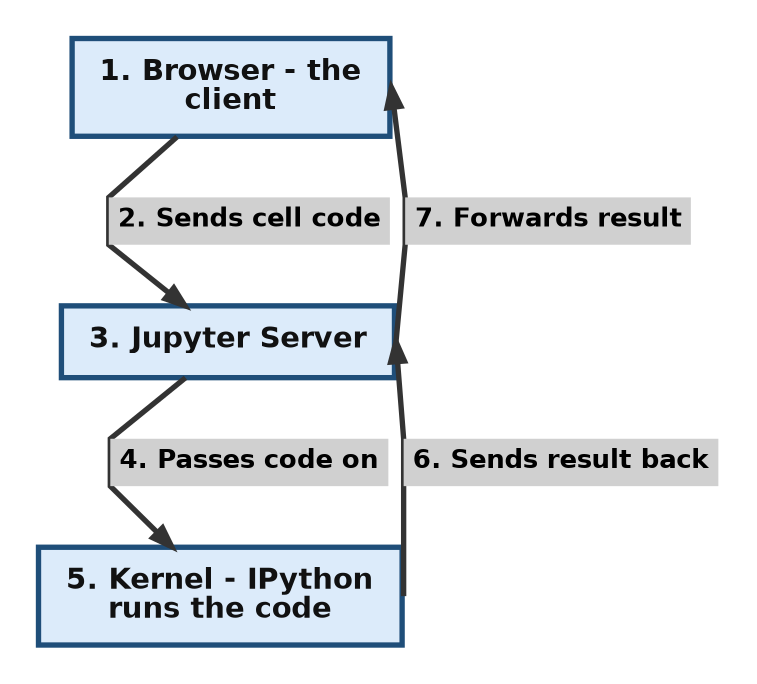

For the curious: the browser and the server talk over HTTP and WebSockets, while the server and the kernel talk using a messaging library called [ZeroMQ](https://zeromq.org/). You do not need to know these details to use Jupyter. A more detailed, twelve-step version of this flow is given in [Section 11](#11-advanced-how-a-cell-travels-from-browser-to-kernel).

[Back to the Table of Contents](#table-of-contents)

### 1.5 Where Anaconda Fits In

[Anaconda](https://www.anaconda.com/) itself is not a client-server application. It is a **distribution**, which means a bundle: Python, Jupyter, hundreds of popular packages, and some tools to manage them, all installed together.

It has two jobs here:

* it launches applications, such as Jupyter Notebook, that use the client-server model
* it manages the environments and packages that these applications need

**Anaconda Navigator**, the program you open from the Start menu:

* runs as an ordinary desktop program on your computer
* acts as a launcher for tools such as Jupyter Notebook, JupyterLab and Spyder
* starts the Jupyter Notebook server when you click **Launch**
* manages Python environments

Think of Navigator as a **control panel**, not as a server.

When you start Jupyter from Anaconda, the steps from [Section 1.4](#14-what-happens-when-you-run-a-cell) simply get two extra steps in front:

1. Anaconda starts the Jupyter Notebook server.
2. The server starts listening on a port on your machine, for example `localhost:8888`.
3. Your browser opens the Jupyter interface, and from here on the cycle in Section 1.4 takes over.

[Back to the Table of Contents](#table-of-contents)

### 1.6 Why Use a Client-Server Model on One Computer

Even though everything is on your computer, this design has real benefits:

* **Benefit 1: A browser-based interface.** You do not need a separate desktop program for editing notebooks. Any modern browser will do.
* **Benefit 2: Remote execution.** The same design works when the server is on another machine, for example [Google Colab](https://colab.research.google.com/), [JupyterHub](https://jupyter.org/hub) at a university, or a cloud server. Your browser does not care where the server is.
* **Benefit 3: More than one window.** You can open the same notebook server in several browser tabs, and even open a console that talks to the same kernel as your notebook.
* **Benefit 4: Language independence.** The kernel can be Python, R, Julia and so on, while the browser part stays the same.

[Back to the Table of Contents](#table-of-contents)

## 2. Part 1: Installing Anaconda on Windows

Anaconda is the easiest and most common way for beginners to get Python and Jupyter Notebook on Windows. One installer gives you everything. The whole process takes about 15 to 20 minutes, most of which is waiting.

The flowchart below gives the whole process at a glance. Each step is explained after it.

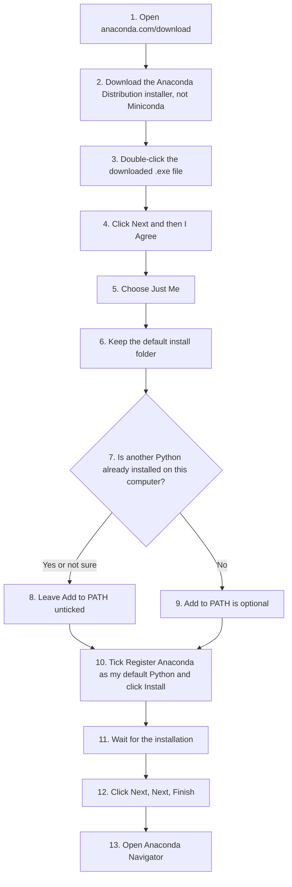

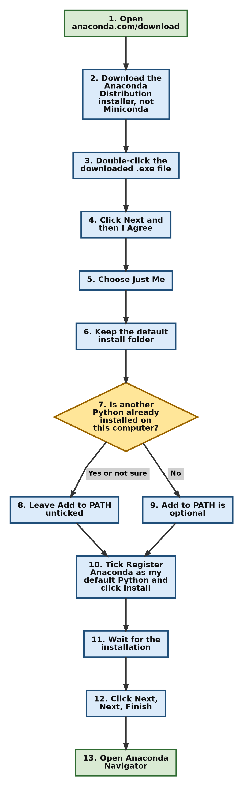

[Back to the Table of Contents](#table-of-contents)

### 2.1 Step 1: Go to the Anaconda Website

1. Open your web browser (Chrome, Edge, Firefox).
2. Go to: [https://www.anaconda.com/download](https://www.anaconda.com/download)

The page may ask you to register with your email address before showing the download links. You can register (it is free), or use the direct download link given in the next step.

[Back to the Table of Contents](#table-of-contents)

### 2.2 Step 2: Download the Windows Installer

1. Look for **Anaconda Distribution** (not Miniconda).
2. Choose the **Windows 64-Bit Graphical Installer**. The Python version that comes with it is fine; you do not need to pick one.
3. Click to download.

A file with a name like this will start downloading:

```text
Anaconda3-2026.07-1-Windows-x86_64.exe
```

The numbers in the middle (year and month of the release) will change over time. The installer is large, about 1 GB, so it may take a while on a slow connection.

> [!IMPORTANT]
> Make sure you download **Anaconda**, not **Miniconda** by mistake (unless you specifically want Miniconda).
> The Miniconda installer has a name like `Miniconda3-latest-Windows-x86_64.exe`.
> Miniconda is the minimal installer: it is small and comes with no Jupyter and almost no packages.
> The Anaconda website can be confusing because it shows Miniconda prominently.
> If you cannot find the link for Anaconda, all versions are listed at [https://repo.anaconda.com/archive/](https://repo.anaconda.com/archive/). Pick the newest file ending in `-Windows-x86_64.exe`. At the time of writing that is [Anaconda3-2026.07-1-Windows-x86_64.exe](https://repo.anaconda.com/archive/Anaconda3-2026.07-1-Windows-x86_64.exe).
> This is the full Anaconda Distribution, NOT Miniconda.

The Anaconda Distribution includes:

* Jupyter Notebook
* JupyterLab (a more advanced version of the Jupyter interface)
* Spyder (a Python code editor)
* Popular packages such as NumPy, Pandas and Matplotlib, which you will meet in later chapters
* A big installer (about 1 GB to download, several GB once installed)

[Back to the Table of Contents](#table-of-contents)

### 2.3 Step 3: Run the Installer

1. Locate the downloaded `.exe` file (usually in your **Downloads** folder).
2. Double-click it to start the installation. If Windows asks "Do you want to allow this app to make changes?", click **Yes**.

[Back to the Table of Contents](#table-of-contents)

### 2.4 Step 4: The First Installer Screens

Click **Next**, read the licence and click **I Agree**.

A note about the licence: Anaconda is free for individual learners, students and teachers. Large organisations (200 or more employees) need a paid licence for commercial use. The full details are in Anaconda's [Terms of Service](https://www.anaconda.com/legal/terms/terms-of-service).

[Back to the Table of Contents](#table-of-contents)

### 2.5 Step 5: Choose the Installation Type


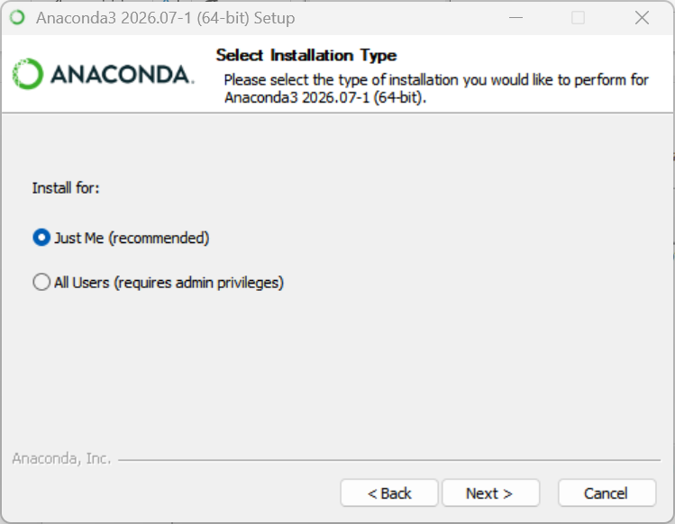

Choose:

* **Just Me (Recommended)** - unless you know how an administrator installation for all users works.
* Click **Next**.

[Back to the Table of Contents](#table-of-contents)

### 2.6 Step 6: Choose the Install Location

Leave it as the default, which will look like:

```text
C:\Users\<yourname>\anaconda3
```

Here `<yourname>` is your Windows user name. Click **Next**.

If your user name contains spaces or non-English letters, the installer may warn you. In that case choose a simple folder such as `C:\anaconda3`, because paths with spaces or special characters can cause problems for some packages.

[Back to the Table of Contents](#table-of-contents)

### 2.7 Step 7: Advanced Installation Options and the PATH Checkbox

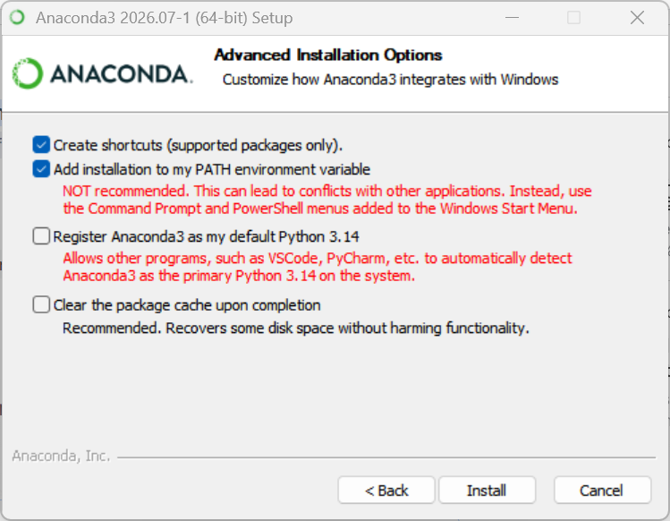

**This is the most important screen.** You will see a few checkboxes. The two that matter are:

**1. Add Anaconda3 to my PATH environment variable** - *not recommended, leave it unticked*

First, what is PATH? **PATH** is a list of folders that Windows searches when you type a command such as `python`. Whichever folder comes first in the list "wins". (For a longer explanation, see [What is the PATH environment variable](https://en.wikipedia.org/wiki/PATH_(variable)).)

> [!NOTE]
> **Why is adding Anaconda to PATH not recommended?**
> When you add Anaconda to the PATH, you are telling Windows: "Use Anaconda's Python everywhere on this computer."
> It overrides any other Python you have. Many computers already have:
> (a) Python installed from the Microsoft Store,
> (b) Python installed by Microsoft or other tools,
> (c) Python installed manually from python.org,
> (d) Python used quietly by other programs.
> If Anaconda is placed in PATH:
> (1) it becomes the default Python for your entire system,
> (2) other programs that expect a different Python may stop working,
> (3) it becomes confusing to know which Python you are actually running.

However, if you do **not** have any other version of Python on your computer, you may tick **Add Anaconda3 to my PATH environment variable**. Even if you leave it unticked, you can always use Python through the **Anaconda Prompt**, which sets everything up correctly for you.

**2. Register Anaconda3 as my default Python** - *tick this one*

This lets other programs, such as VS Code, find Anaconda's Python easily. It may be unticked by default, so check it.

The other boxes (such as creating Start menu shortcuts) can be left as they are. Click **Install**.

[Back to the Table of Contents](#table-of-contents)

### 2.8 Step 8: Wait for the Installation

This may take 5 to 15 minutes, depending on your computer. Do not close the window, even if the progress bar seems stuck for a while.

[Back to the Table of Contents](#table-of-contents)

### 2.9 Step 9: Finish

Click **Next**, then **Next** again, then **Finish**.

You're done installing Anaconda!

[Back to the Table of Contents](#table-of-contents)

## 3. Part 2: Launching Jupyter Notebook

There are two easy ways to start Jupyter Notebook.

[Back to the Table of Contents](#table-of-contents)

### 3.1 Method 1: Use Anaconda Navigator

1. Press the Windows **Start** button.
2. Search for **Anaconda Navigator**.
3. Open it. (The first start can take a minute.)
4. On the Home screen, find the **Jupyter Notebook** tile and click **Launch**.

Jupyter Notebook opens in your web browser.

[Back to the Table of Contents](#table-of-contents)

### 3.2 Method 2: Use the Anaconda Prompt

1. Click **Start**, search for **Anaconda Prompt**, and open it. You should see something like `(base) C:\Users\yourname>`. The word `(base)` means Anaconda's main environment is active.
2. Type the following command and press **Enter**:

```text
jupyter notebook
```

Jupyter Notebook opens in your browser. The Anaconda Prompt window shows some messages, similar to these (your date, time and token will be different):

```text
[I 2026-09-19 10:15:02.123 ServerApp] Jupyter Server 2.x.x is running at:
[I 2026-09-19 10:15:02.123 ServerApp] http://localhost:8888/tree?token=3f9c1a...
[I 2026-09-19 10:15:02.123 ServerApp]     http://127.0.0.1:8888/tree?token=3f9c1a...
[I 2026-09-19 10:15:02.124 ServerApp] Use Control-C to stop this server and shut down all kernels (twice to skip confirmation).
```

**Do not close this window** while you are working. This window *is* the Jupyter server. If you close it, the server stops and your notebook can no longer run code.

Jupyter starts in the folder that the prompt is in, and you can only see files inside that folder. To work in another folder, move to it first, for example:

```text
cd C:\Users\yourname\Documents\python-practice
jupyter notebook
```

You now have Jupyter Notebook installed and running!

[Back to the Table of Contents](#table-of-contents)

### 3.3 Closing Jupyter Notebook Properly

When you have finished:

1. Save your notebook (**Ctrl + S**).
2. In the notebook, choose **File > Close and Shut Down Notebook**. This stops the notebook's kernel.
3. To stop the whole server, either choose **File > Shut Down** in the Jupyter window, or go to the Anaconda Prompt window and press **Ctrl + C** (press it twice to skip the confirmation).

Just closing the browser tab does not stop anything; the server and kernels keep running in the background.

[Back to the Table of Contents](#table-of-contents)

## 4. Part 3: Installing Jupyter Notebook Without Anaconda (Optional)

If you already have Python installed (for example from [python.org](https://www.python.org/downloads/)) and do not want Anaconda, you can install Jupyter with **pip**, Python's package installer.

[Back to the Table of Contents](#table-of-contents)

### 4.1 Step 1: Check the Python Installation

Open the **Command Prompt** (Start, then search for `cmd`) and type:

```text
python --version
```

If Python is installed, you will see something like:

```text
Python 3.12.4
```

If you see an error such as `'python' is not recognized as an internal or external command`, Python is either not installed or not on the PATH. On Windows, try `py --version` instead. The `py` launcher comes with Python from python.org and works even when `python` does not. If you use `py`, write `py -m pip` in place of `pip` in the steps below.

[Back to the Table of Contents](#table-of-contents)

### 4.2 Step 2: Check That pip Is Installed

pip usually comes with Python. Check it with:

```text
pip --version
```

You should see a line starting with `pip` and a version number. If pip is missing, run `python -m ensurepip --upgrade`.

[Back to the Table of Contents](#table-of-contents)

### 4.3 Step 3: Install Jupyter Notebook

Run:

```text
pip install notebook
```

pip downloads Jupyter Notebook and everything it needs. This needs an internet connection and takes a minute or two.

[Back to the Table of Contents](#table-of-contents)

### 4.4 Step 4: Launch Jupyter Notebook

```text
jupyter notebook
```

Jupyter opens in your browser, just as in [Section 3.2](#32-method-2-use-the-anaconda-prompt). If Windows says `jupyter` is not recognized, use `python -m notebook` instead.

[Back to the Table of Contents](#table-of-contents)

## 5. Part 4: Setting Up a Virtual Environment for Jupyter

This part is optional, but it is a good habit.

A **virtual environment** is a separate, private folder of Python packages for one project. Packages you install inside it do not affect your other projects, and your other projects cannot break it. You can read more in the official [venv documentation](https://docs.python.org/3/library/venv.html).

The steps below use Python's built-in `venv` tool, from the Command Prompt. (Anaconda users can do the same with `conda create`, see the [conda documentation](https://docs.conda.io/projects/conda/en/latest/user-guide/tasks/manage-environments.html).)

[Back to the Table of Contents](#table-of-contents)

### 5.1 Step 1: Create the Environment

First move to your project folder, then run:

```text
python -m venv myenv
```

Note: in the above command, `myenv` is the name of your virtual environment. Python creates a folder with this name, containing a private copy of Python and pip.

> [!TIP]
> You can name your virtual environment anything you like.
> However, by convention it is very often named `.venv`. This is because on Linux and macOS, files and folders whose names start with a dot are hidden from normal directory listings.
> This keeps the folder out of the way, in the same way that important system and settings files are hidden.
> On Windows, a leading dot does not hide a folder; a separate "hidden" attribute has to be set for that. The name `.venv` is still commonly used on Windows, simply because it is the usual convention, and tools such as VS Code look for it.

[Back to the Table of Contents](#table-of-contents)

### 5.2 Step 2: Activate the Environment

Activating tells your command window to use the Python and pip inside `myenv`.

Windows (Command Prompt):

```text
myenv\Scripts\activate
```

Windows (PowerShell):

```text
myenv\Scripts\Activate.ps1
```

macOS and Linux:

```text
source myenv/bin/activate
```

After activation, the name of the environment appears at the start of the prompt, for example:

```text
(myenv) C:\Users\yourname\python-practice>
```

If PowerShell says that running scripts is disabled, either use the Command Prompt instead, or run `Set-ExecutionPolicy -Scope CurrentUser RemoteSigned` once and try again.

[Back to the Table of Contents](#table-of-contents)

### 5.3 Step 3: Install Jupyter Inside This Environment

```text
pip install notebook
```

This installs Jupyter only inside `myenv`.

[Back to the Table of Contents](#table-of-contents)

### 5.4 Step 4: Launch Jupyter

```text
jupyter notebook
```

Notebooks you create now run with the Python and packages inside `myenv`.

[Back to the Table of Contents](#table-of-contents)

### 5.5 Step 5: Make the Environment Available as a Kernel

Sometimes you already have Jupyter installed elsewhere (for example in Anaconda) and simply want your environment to appear as a choice in the **New** menu. To do that, with the environment activated, run:

```text
pip install ipykernel
python -m ipykernel install --user --name myenv --display-name "Python (myenv)"
```

The next time you start Jupyter, **Python (myenv)** appears in the list of kernels. This is how entries like `.venv` in the **New** menu (see [Section 8.1.2](#812-the-new-menu)) come about.

[Back to the Table of Contents](#table-of-contents)

### 5.6 Step 6: Leave the Environment

When you have finished, type:

```text
deactivate
```

The `(myenv)` label disappears from the prompt, and you are back to your normal Python.

[Back to the Table of Contents](#table-of-contents)

## 6. Part 5: Verifying Everything Works

In Jupyter:

1. On the home page, click **New** and then **Python 3 (ipykernel)**. (In some versions you click **New > Notebook** and then choose **Python 3 (ipykernel)** from a small pop-up window.) A new notebook opens in a new browser tab.
2. In the first cell, type:

```python
print("Hello Jupyter!")
```

3. Press **Shift + Enter**.

You should see:

```text
Hello Jupyter!
```

If it prints the message, your setup is working perfectly. The screenshot below shows a small test notebook with a Markdown cell, the `print()` cell above, and a cell that calculates `a + 20`.


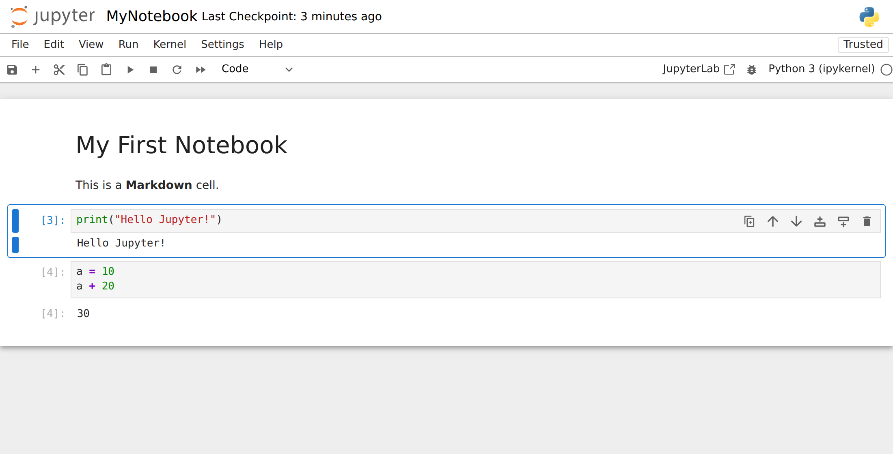

[Back to the Table of Contents](#table-of-contents)

## 7. Understanding the Local Server Address

When you start Jupyter Notebook, it automatically launches a local web server on your computer. The address you see in the browser, such as

```text
http://localhost:8888/tree
```

is the address (URL) of that local server. Here is what each part means, in simple terms.

[Back to the Table of Contents](#table-of-contents)

### 7.1 The http Part

`http://` means your browser is using **HTTP**, the same protocol (set of rules for communication) that ordinary websites use.

[Back to the Table of Contents](#table-of-contents)

### 7.2 The localhost Part

`localhost` means:

* The server is running on your **own computer**, not on the internet.
* `localhost` always refers to your own machine.
* It is the name for the special IP address `127.0.0.1`, called the **loopback address**. Messages sent to it never leave your computer. (More on [localhost](https://en.wikipedia.org/wiki/Localhost).)

So opening `localhost` is like telling your browser: "Connect to a server running on my own computer."

[Back to the Table of Contents](#table-of-contents)

### 7.3 The Port Number 8888

A computer can run many servers at the same time. Each one listens on its own numbered "door" called a **port**.

Port `8888` means:

* The Jupyter server is listening for connections on port 8888.
* If another program is already using 8888 (for example, a second Jupyter server), Jupyter picks the next free port: 8889, 8890, and so on.

So `localhost:8888` means: "Connect to the server on my computer at port 8888."

[Back to the Table of Contents](#table-of-contents)

### 7.4 The tree Part

`/tree` is the **route**, the part of the address that tells the server which page you want. `/tree` shows the file browser, which is called the **Tree View** because it shows your folders and files as a tree: folders inside folders, which you can move up and down through. From here you can open, rename, delete, or create notebooks.

When you open other things, the route changes. For example:

| Address ends with | What it shows |
| ----------------- | ------------- |
| `/tree` | The file browser (Tree View), the Jupyter home page |
| `/notebooks/MyNotebook.ipynb` | The notebook editor with `MyNotebook.ipynb` open |
| `/edit/somefile.py` | A plain text editor with `somefile.py` open |
| `/terminals/1` | Terminal number 1, a command line inside the browser |

[Back to the Table of Contents](#table-of-contents)

### 7.5 The Token

The first time Jupyter opens, the address often ends with something like `?token=3f9c1a...`. The **token** is a long random password. It makes sure that only you, and not other programs or other users of the computer, can use your notebook server. Jupyter adds it to the address automatically, so normally you never need to type it. If a browser page asks for a token, copy it from the messages in the Anaconda Prompt window.

[Back to the Table of Contents](#table-of-contents)

### 7.6 Putting It All Together

`http://localhost:8888/tree` means:

"Open the Jupyter Notebook server that is running on my own computer (`localhost`), on port `8888`, and show me the Tree View (file browser)."

This is why Jupyter works without an internet connection: the browser and the server are both on your computer. The full journey of your code from the browser to the kernel and back is described in [Section 1.4](#14-what-happens-when-you-run-a-cell).

[Back to the Table of Contents](#table-of-contents)

## 8. The Jupyter Notebook User Interface

You can think of Jupyter Notebook as having **two main screens**:

1. **Screen 1: the Tree View** (home page), where you pick or create notebooks.
2. **Screen 2: the Notebook Editor**, where you write and run code.

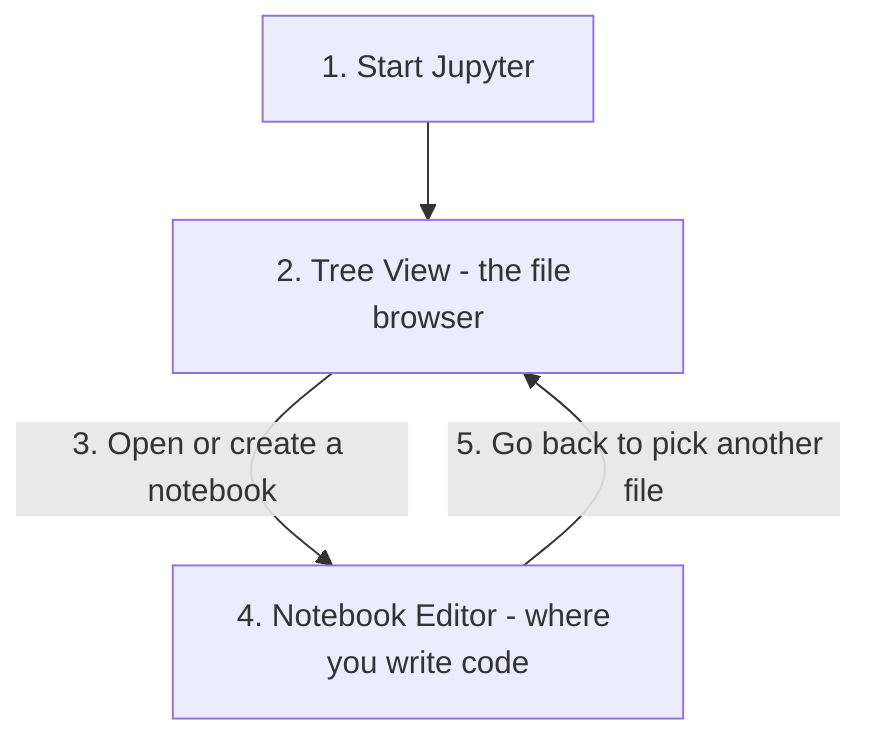

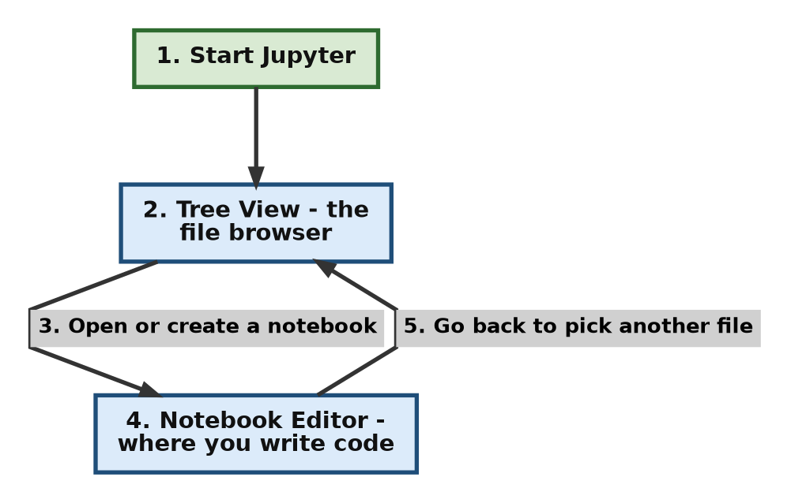

Screen 1 is the **launcher**; Screen 2 is the **work screen**. You always begin at Screen 1, unless you start Jupyter with a notebook name, for example `jupyter notebook MyNotebook.ipynb`.

The user interface (UI) may vary slightly from one computer to another, depending on the Jupyter version and on any extra extensions installed. All screenshots below are from Jupyter Notebook 7.

[Back to the Table of Contents](#table-of-contents)

### 8.1 Screen 1: The Tree View

URL: `http://localhost:8888/tree`

This is the first page Jupyter opens. It works like a simple file manager for the folder where you started Jupyter.


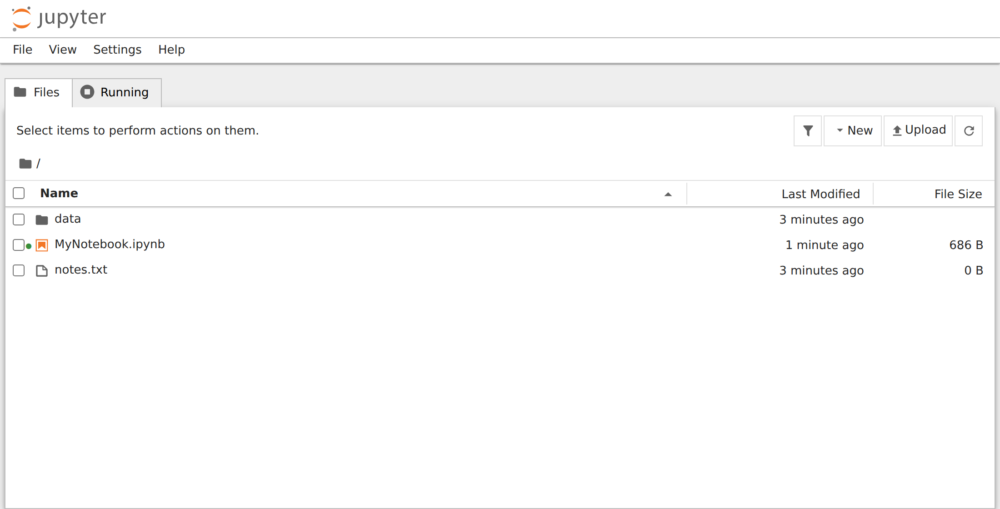


Here you can:

* browse your folders
* see files and subfolders
* create new notebooks, files and folders
* open existing notebooks
* upload files from elsewhere on your computer
* open terminals
* see and stop running notebooks

It is similar to a "home page" or "dashboard".

[Back to the Table of Contents](#table-of-contents)

#### 8.1.1 Parts of the Tree View

**1. Header and menu bar**

* The Jupyter logo at the top left. Clicking it brings you back to this page.
* A small menu bar with **File**, **View**, **Settings** and **Help**. (In the classic Notebook 6 there is no menu bar on this page.)

**2. The Files and Running tabs**

* **Files** shows your folders and files. This is the tab you use most.
* **Running** shows notebooks, terminals and kernels that are currently running. See [Section 8.1.3](#813-the-running-tab).

**3. Toolbar (top right of the file list)**

* **Filter** (funnel icon) - type part of a name to show only matching files.
* **New** - a menu to create a new notebook, terminal, console, file or folder. See [Section 8.1.2](#812-the-new-menu).
* **Upload** - copy files from your computer into the current folder.
* **Refresh** (circular arrow) - re-read the folder. This is useful when files were added from outside Jupyter.

Tip: **New > Python 3 (ipykernel)** is the quickest way to create a `.ipynb` notebook that is ready to run.

**4. Breadcrumb (current path)**

* The folder icon followed by a path, such as `/` or `/data`, shows which folder you are viewing.
* Click a folder name in the path to go back up.

**5. File and folder list (the "tree")**

* Shows all files and folders in the current folder.
* Each row shows the **name**, the **last modified** time and the **file size**.
* Click a folder to go into it. Click a notebook to open it in the editor (Screen 2).
* Tick the checkbox next to one or more items to see buttons for **Open**, **Download**, **Rename**, **Duplicate** and **Move to Trash** (delete). You can also right-click an item to get a menu with similar options.

Everything shown here comes from the folder that is being served (the folder in which Jupyter was started). You cannot go above that folder from the Tree View.

[Back to the Table of Contents](#table-of-contents)

#### 8.1.2 The New Menu

The screenshot below shows Screen 1 with the **New** button clicked. It is from here that you create things. In most cases you want a new Jupyter notebook, so you click **Python 3 (ipykernel)**. But you may choose other options as you need.


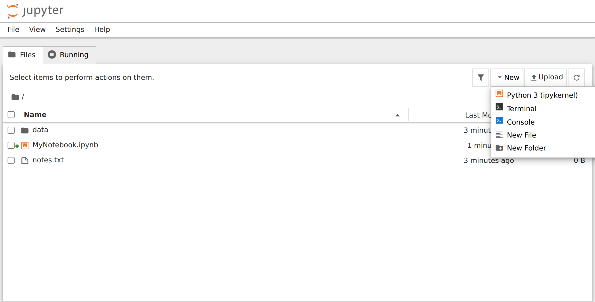

The options (these may vary from one machine to another):

| Option | What it does |
| ------ | ------------ |
| `Python 3 (ipykernel)` | Creates a new notebook that uses the default Python kernel. This is the most common choice. |
| `Terminal` | Opens a command-line terminal inside your browser. On Windows this is usually PowerShell; on macOS and Linux it is a normal shell. |
| `Console` | Opens an interactive Python console, where you type one command at a time and see the result, a bit like the Python shell (IDLE). |
| `New File` | Creates a new blank text file (`untitled.txt`) and opens it in a simple text editor in the browser. Useful for notes, settings files or documentation. |
| `New Folder` | Creates a new folder in the current directory. It helps you organise project files. |

If you have more kernels installed, each one appears at the top of the list. The screenshot below was taken on the author's computer, in the classic Notebook 6. The menu looks a little different there (**Text File** and **Folder** instead of **New File** and **New Folder**, and no **Console**), but it shows several extra kernels:


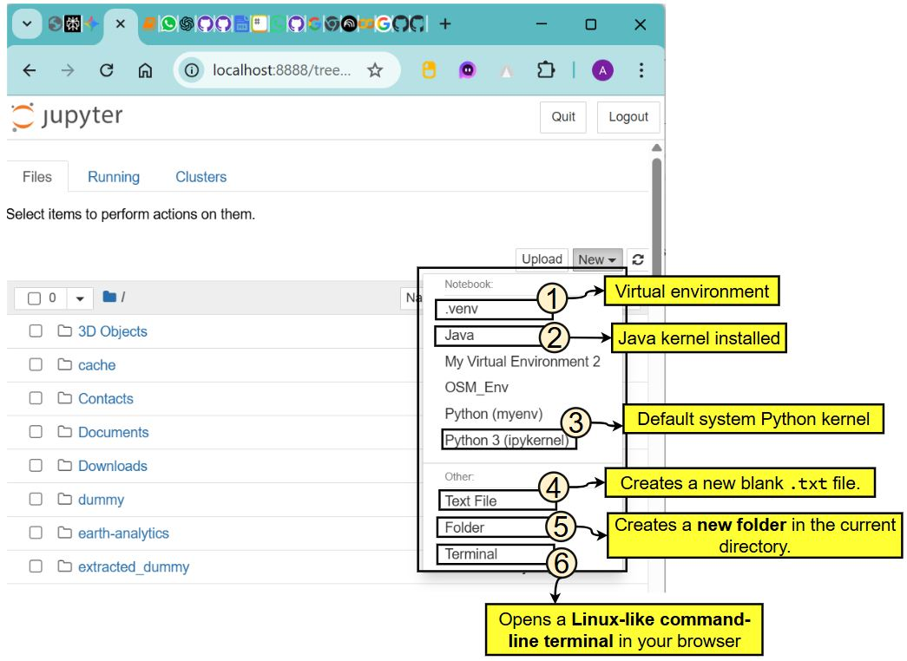

Two of these extra kernels are worth explaining:

* **`.venv`** - a virtual environment named `.venv`, created in a project folder and registered as a kernel (see [Section 5.5](#55-step-5-make-the-environment-available-as-a-kernel)). If you choose it, the notebook's cells run with the Python and packages inside `.venv`. This is useful when you want isolated packages for one project.
* **`Java`** - a Java kernel (for example [IJava](https://github.com/SpencerPark/IJava)). With it you can write and run Java code in a notebook, for example:

```java
System.out.println("Hello from Java!");
```

A few words about the default `Python 3 (ipykernel)` kernel:

* It is the default Python kernel that comes with Jupyter.
* It uses the **same Python that is running Jupyter**. If you started Jupyter from Anaconda, that is Anaconda's Python (the `base` environment); if you installed Jupyter with pip, it is that Python.
* It is the most common option for general use.

About the **Terminal**: it lets you run commands without leaving the browser, for example:

* `pip install` to install packages
* `git` commands
* activating virtual environments
* running Python scripts, such as `python myscript.py`

This is very powerful and is often used for managing environments.

[Back to the Table of Contents](#table-of-contents)

#### 8.1.3 The Running Tab

Click **Running** to see everything that is active right now:


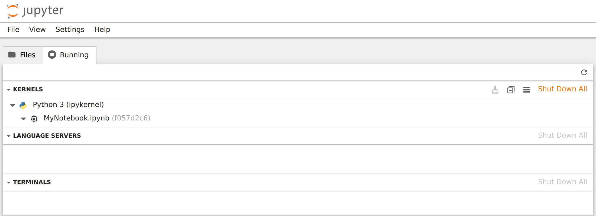


* **Kernels** - the notebooks whose kernels are running, grouped by kernel type.
* **Terminals** - any terminals you have opened.
* Other sections (such as Language Servers) may appear, depending on what is installed.

Click the shut-down button next to an item, or **Shut Down All**, to stop it and free memory.

**Why this matters:** closing a browser tab does **not** stop the kernel. If you open many notebooks and never shut them down, they keep using memory. Use this tab to tidy up.

[Back to the Table of Contents](#table-of-contents)

### 8.2 Screen 2: The Notebook Editor

URL example: `http://localhost:8888/notebooks/MyNotebook.ipynb`

This is the interactive coding screen, where you write Python code in cells, run it, and see the output.


[Back to the Table of Contents](#table-of-contents)

#### 8.2.1 Parts of the Notebook Editor

From top to bottom, the screen has:

1. **Title bar** - the Jupyter logo, the notebook's name (`MyNotebook`) and the time of the last checkpoint (save). Click the name to rename the notebook. The browser tab also shows the notebook's name.
2. **Menu bar** - File, Edit, View, Run, Kernel, Settings, Help. See [Section 8.2.2](#822-the-menu-bar).
3. **Toolbar** - icons for common actions such as Save, Run and Restart. See [Section 8.2.3](#823-the-notebook-toolbar).
4. **Kernel name and status** - at the right end of the toolbar. See [Section 8.2.4](#824-kernel-status).
5. **Cells** - the boxes where you write code or text. See [Section 8.2.5](#825-cells).
6. **Output area** - under each code cell. See [Section 8.2.7](#827-the-output-area).

[Back to the Table of Contents](#table-of-contents)

#### 8.2.2 The Menu Bar

The menu bar is the row of words at the top: **File, Edit, View, Run, Kernel, Settings, Help**. Each menu is described below, in the form of a table.

* The first column of each table gives an option that you see when you click that menu.
* The second column gives what that option does.

Only the most useful options are listed. Keyboard shortcuts are shown in brackets where they exist.


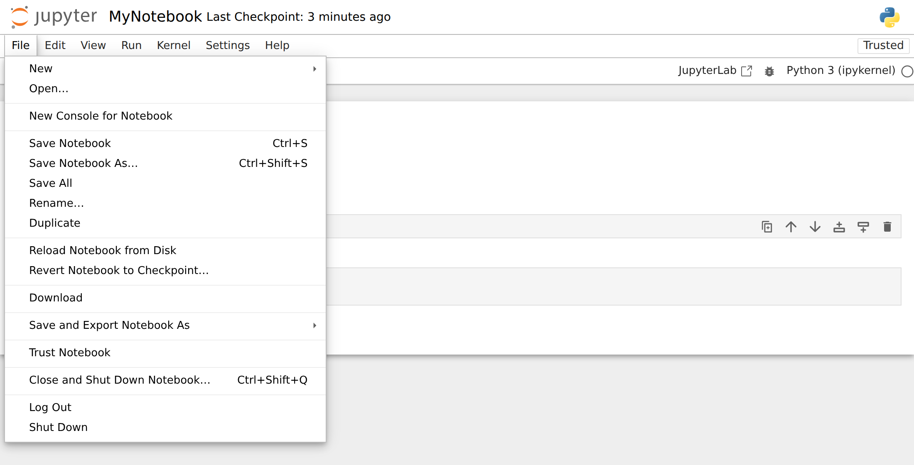


**1. File Menu**

Used for creating, saving, downloading and closing notebooks.

| Option | What it does |
| ------ | ------------ |
| New | Creates a new notebook, text file, console or terminal. |
| Open... | Opens the file browser so that you can pick a file. |
| Save Notebook (Ctrl + S) | Saves your notebook and creates a checkpoint (Jupyter also autosaves regularly). |
| Save Notebook As... (Ctrl + Shift + S) | Saves a copy under a new name. |
| Rename... | Renames your notebook file. |
| Duplicate | Creates a copy of the current notebook. Useful for backups. |
| Revert Notebook to Checkpoint... | Goes back to the last checkpoint (last manual save). See [Section 8.2.8](#828-saving-autosave-and-checkpoints). |
| Download | Downloads the notebook as a `.ipynb` file to your computer. |
| Save and Export Notebook As | Exports the notebook in another format, for example HTML, PDF, Markdown, LaTeX, or an Executable Script (a `.py` file). HTML always works; PDF needs extra software (LaTeX, or a browser engine for "Webpdf"). |
| Trust Notebook | Allows the notebook's saved HTML and JavaScript outputs to run. Only trust notebooks from people you trust. |
| Close and Shut Down Notebook... (Ctrl + Shift + Q) | Stops the notebook's kernel and closes the tab. |
| Shut Down | Stops the whole Jupyter server. |

**2. Edit Menu**

Used for editing cells (cut, copy, paste, delete) and finding text.

| Option | What it does |
| ------ | ------------ |
| Undo / Redo (Ctrl + Z / Ctrl + Y) | Undo or redo typing inside a cell. |
| Undo Cell Operation (Z) | Brings back a cell you deleted, cut or moved. |
| Cut Cell / Copy Cell / Paste Cell Below (X / C / V) | Work on entire cells, not on lines of text. |
| Delete Cell (D, D) | Removes the selected cell. (Press D twice.) |
| Move Cell Up / Move Cell Down | Changes the order of cells. |
| Split Cell (Ctrl + Shift + -) | Breaks a cell into two at the cursor. |
| Merge Cell Above / Merge Cell Below | Joins cells into one. |
| Clear Cell Output / Clear Outputs of All Cells | Removes the output shown under cells (the code stays). |
| Find... / Find and Replace... (Ctrl + F / Ctrl + H) | Searches for text in the notebook, and replaces it if you wish. |

**3. View Menu**

Controls what is shown on the screen.

| Option | What it does |
| ------ | ------------ |
| Show Header | Shows or hides the title bar at the top. |
| Toggle Zen Mode | Hides everything except the cells, for distraction-free work. |
| Table of Contents | Shows a side panel listing the headings in your Markdown cells. |
| Show Line Numbers (Shift + L) | Shows line numbers inside code cells. Very helpful when reading error messages. |
| Collapse / Expand All Code, All Outputs | Hides or shows code or outputs, to make long notebooks easier to scroll. |
| Open in JupyterLab | Opens the same notebook in JupyterLab, the more advanced interface. |

**4. Run Menu**

Used to run cells and to change the type of a cell. (In the classic Notebook 6 these options were in the **Cell** menu.)

| Option | What it does |
| ------ | ------------ |
| Run Selected Cell (Shift + Enter) | Runs the cell and moves to the next one. |
| Run Selected Cell and Insert Below (Alt + Enter) | Runs the cell and adds a new empty cell below it. |
| Run Selected Cell and Do not Advance (Ctrl + Enter) | Runs the cell and stays on it. |
| Run All Above Selected Cell / Run Selected Cell and All Below | Runs a group of cells at once. |
| Run All Cells | Runs every cell from top to bottom. |
| Restart Kernel and Run All Cells... | Starts afresh and runs everything in order. |
| Cell Type | Changes the cell to Code (Y), Markdown (M) or Raw (R). |

**5. Kernel Menu**

Controls the kernel, the program that runs your code.

| Option | What it does |
| ------ | ------------ |
| Interrupt Kernel (I, I) | Stops the code that is running right now (like Ctrl + C in a terminal). Variables are kept. |
| Restart Kernel... (0, 0) | Restarts the kernel. All variables are cleared. |
| Restart Kernel and Clear Outputs of All Cells... | Restarts and removes all outputs, giving a clean notebook. |
| Restart Kernel and Run All Cells... | Restarts the kernel and runs all cells from the beginning. |
| Reconnect to Kernel | Reconnects if the connection to the kernel was lost. |
| Shut Down Kernel | Stops the kernel for this notebook. |
| Change Kernel... | Switches to another kernel, for example another Python environment such as `.venv`, or another Python version. |

**6. Settings Menu**

| Option | What it does |
| ------ | ------------ |
| Theme | Switches between light and dark themes. |
| Autosave Documents | Turns autosave on or off (it is on by default). |
| Increase / Decrease Text Editor Font Size | Makes code larger or smaller. |
| Auto Close Brackets | Automatically types the closing bracket when you type an opening one. |

**7. Help Menu**

Provides documentation, shortcuts and references.

| Option | What it does |
| ------ | ------------ |
| Show Keyboard Shortcuts... (Ctrl + Shift + H) | Displays all Jupyter shortcuts (very useful). |
| Markdown Reference | Opens a guide to Markdown, the formatting language used in text cells. |
| Python Reference | Links to the official Python documentation. |
| IPython Reference, NumPy Reference, pandas Reference and so on | Links to the documentation of popular libraries. |
| About Jupyter Notebook | Shows the version of Jupyter Notebook you are using. |

**If you are using the classic Notebook 6**

The classic notebook has slightly different menus. This table shows where to find the old options in Notebook 7:

| Classic Notebook 6 | Jupyter Notebook 7 |
| ------------------ | ------------------ |
| File > Make a Copy | File > Duplicate |
| File > Save and Checkpoint | File > Save Notebook |
| File > Download as | File > Save and Export Notebook As |
| File > Close and Halt | File > Close and Shut Down Notebook |
| View > Toggle Header / Toggle Toolbar | View > Show Header |
| View > Cell Toolbar (Tags, Slideshow, Edit Metadata) | View > Right Sidebar (the Property Inspector), and Edit > Edit Notebook Metadata |
| Insert > Insert Cell Above / Below | Toolbar **+** button, keys **A** / **B**, or the small buttons on the selected cell |
| Cell menu (Run Cells, Run All, Cell Type, Clear Outputs) | Run menu, and Edit > Clear Outputs |
| Widgets menu | No separate menu. Interactive widgets still work if the `ipywidgets` package is installed. |
| Help > User Interface Tour | Not available |

[Back to the Table of Contents](#table-of-contents)

#### 8.2.3 The Notebook Toolbar

The toolbar is the row of small icons just below the menu bar. In the screenshot below each item has a number. The numbers match the table after it.


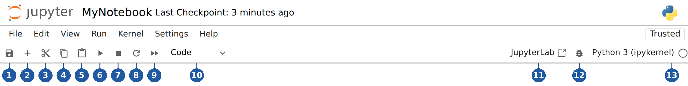


| No. | Icon / item | What it does | Shortcut |
| --- | ----------- | ------------ | -------- |
| 1 | Save (floppy disk) | Saves the notebook (`.ipynb` file) and creates a checkpoint. Your latest code, outputs and text are stored. | Ctrl + S |
| 2 | Insert cell (plus sign) | Inserts a **new empty cell below** the current cell. Useful when adding more code or notes. | B (in command mode) |
| 3 | Cut (scissors) | Removes the selected cell and keeps it on the clipboard, so that you can paste it later. | X |
| 4 | Copy (two sheets) | Copies the selected cell to the clipboard. | C |
| 5 | Paste (clipboard) | Pastes a cut or copied cell **below** the current cell. | V |
| 6 | Run (triangle) | Runs the current cell, shows the output directly below it, and moves to the next cell. | Shift + Enter |
| 7 | Interrupt (square) | Stops the cell that is running. Useful if your code is stuck, for example in an **infinite loop** (a loop that never ends). | I, I |
| 8 | Restart (circular arrow) | Restarts the kernel. Memory is cleared and all variables are lost. The notebook stays open, but the outputs you see are now out of date. | 0, 0 |
| 9 | Restart and run all (double triangle) | Restarts the kernel, then runs **every cell in order from top to bottom**. Useful for checking that your notebook works cleanly from scratch. | none |
| 10 | Cell type drop-down | Shows the type of the current cell and lets you change it: **Code** (Python code), **Markdown** (text, headings, notes) or **Raw** (plain text that is not processed). | Y, M, R |
| 11 | JupyterLab | Opens this notebook in JupyterLab. | none |
| 12 | Debugger (bug icon) | Turns on the visual debugger, which lets you pause code and inspect variables. | none |
| 13 | Kernel name and status circle | Shows which kernel the notebook uses. Click the name to change the kernel. The circle shows whether the kernel is busy. See the next section. | none |

When a cell is selected, a small **cell toolbar** also appears at its top right (you can see it in the editor screenshot above). Its buttons, from left to right, are: **duplicate cell**, **move cell up**, **move cell down**, **insert cell above**, **insert cell below**, and **delete cell**. In the classic notebook, "move up" and "move down" were on the main toolbar instead.

If you are using the classic Notebook 6, your toolbar looks like the one below. The numbers in this picture are its own and do not match the table above. Notice the **Move Cell Up** and **Move Cell Down** buttons (6 and 7), and a keyboard icon at the far right that opens the list of shortcuts.


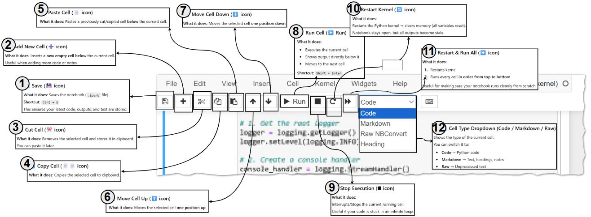


For a full list of shortcuts, use **Help > Show Keyboard Shortcuts** (Ctrl + Shift + H). In Notebook 7 you can also press **Ctrl + Shift + C** to open the **command palette**, a searchable list of every command.

[Back to the Table of Contents](#table-of-contents)

#### 8.2.4 Kernel Status

At the right end of the toolbar you see the kernel name, for example **Python 3 (ipykernel)**, and a small circle:

* **Empty circle** - the kernel is **idle** and ready.
* **Filled circle** - the kernel is **busy** running code.
* The word **Disconnected** or **No Kernel** - the kernel has stopped or cannot be reached.

While a cell is running, its number on the left shows `[*]`. When it finishes, the star is replaced by a number such as `[3]`.

Tip: if the kernel stays **busy** and your code seems stuck, click **Interrupt** (toolbar item 7). If that does not help, click **Restart** (item 8).

[Back to the Table of Contents](#table-of-contents)

#### 8.2.5 Cells

Cells are the basic building blocks of a notebook. There are two main types:

* **Code cells** contain Python code that you can run.
* **Markdown cells** contain formatted text: headings, lists, bold text, links, images and maths. (See the [Markdown guide](https://www.markdownguide.org/basic-syntax/).) Running a Markdown cell turns it into formatted text; double-click it to edit it again.

A third type, **Raw**, holds text that Jupyter leaves exactly as it is. Beginners rarely need it.

Each code cell has an **execution number** on its left, such as `[1]`, `[2]`. This tells you the order in which cells were run, which is not always the order they appear on the page. If the numbers are out of order, restarting and running all cells is a good way to check that the notebook still works from top to bottom.

The output of a code cell appears directly below it: printed text, tables, plots or error messages.

[Back to the Table of Contents](#table-of-contents)

#### 8.2.6 Command Mode and Edit Mode

Jupyter has two keyboard "modes". Knowing them makes the shortcuts much easier to use.

* **Edit mode** - you are typing *inside* a cell. You see a blinking cursor. Press **Enter** (or click inside a cell) to enter edit mode.
* **Command mode** - you are working with *whole cells*: adding, deleting, moving, changing type. There is no cursor in the cell; the selected cell is marked with a blue bar on its left. Press **Esc** to enter command mode.

(In the classic notebook, edit mode showed a **green** border around the cell and command mode a **blue** one.)

Useful shortcuts:

| Shortcut | Mode | What it does |
| -------- | ---- | ------------ |
| Esc | Edit | Go to command mode |
| Enter | Command | Go to edit mode |
| A | Command | Insert a cell **above** |
| B | Command | Insert a cell **below** |
| M | Command | Change the cell to Markdown |
| Y | Command | Change the cell to Code |
| D, D (press D twice) | Command | Delete the cell |
| Z | Command | Undo the last cell operation (for example, bring back a deleted cell) |
| Shift + Enter | Both | Run the cell and move to the next one |
| Ctrl + Enter | Both | Run the cell and stay on it |
| Alt + Enter | Both | Run the cell and insert a new cell below |
| Ctrl + Shift + H | Command | Show all keyboard shortcuts |

The most common beginner mistake is pressing **A**, **B** or **D** while in edit mode. That just types the letter into your cell. Press **Esc** first.

[Back to the Table of Contents](#table-of-contents)

#### 8.2.7 The Output Area

* Shows the results of your code: printed text, images and plots (for example from Matplotlib), HTML, tables (such as Pandas DataFrames), and error messages.
* Rich outputs are supported, including interactive widgets and JavaScript.
* If a cell ends with an expression such as `a + 20`, Jupyter shows its value automatically, next to the cell's number (for example `[2]: 30`). You do not need `print()` for the last line of a cell.

Tip: if a notebook has many large outputs and becomes slow, use **Edit > Clear Outputs of All Cells**.

The editor can also show extra panels, such as the **Table of Contents** or the **Debugger** (from the View menu). JupyterLab has more permanent side panels, and extensions can add more, such as a variable inspector.

[Back to the Table of Contents](#table-of-contents)

#### 8.2.8 Saving, Autosave and Checkpoints

* Jupyter **autosaves** your notebook every couple of minutes. You can switch this off or on in **Settings > Autosave Documents**.
* When you save manually (**Ctrl + S** or **File > Save Notebook**), Jupyter also creates a **checkpoint**, a saved snapshot of the notebook. The title bar shows "Last Checkpoint: ...". Checkpoints are stored in a hidden folder called `.ipynb_checkpoints`.
* **File > Revert Notebook to Checkpoint** takes you back to that snapshot. This is handy if you make a mess and want to go back to your last good version.
* You can download the notebook with **File > Download**, or export it to HTML, PDF or a `.py` script with **File > Save and Export Notebook As**.
* Messages such as "Saving completed", or warnings about a lost kernel connection, appear briefly at the bottom right of the screen.

[Back to the Table of Contents](#table-of-contents)

### 8.3 How the Two Screens Are Related

* The **Tree View** is the launcher: you find, create and manage files there.
* The **Notebook Editor** is the work screen: you write and run code there.
* Each notebook you open gets its own browser tab, and its own kernel.
* The **Running** tab of the Tree View shows all the kernels that are still active, so you can shut down the ones you no longer need.

[Back to the Table of Contents](#table-of-contents)

## 9. Frequently Asked Beginner Questions

### 9.1 Do I need Anaconda to run Jupyter Notebook?

No, but it makes life easier. Anaconda installs Python, Jupyter and many useful packages in one go. Without Anaconda, you can install Python from python.org and then Jupyter with `pip install notebook` (see [Section 4](#4-part-3-installing-jupyter-notebook-without-anaconda-optional)). You can also use [Google Colab](https://colab.research.google.com/), which runs notebooks in your browser with nothing to install, although it needs an internet connection and a Google account.

[Back to the Table of Contents](#table-of-contents)

### 9.2 Will Jupyter run offline?

Yes. Once it is installed, Jupyter runs entirely on your own computer (`localhost`), so no internet connection is needed. You only need the internet to install new packages or to open online help pages.

[Back to the Table of Contents](#table-of-contents)

### 9.3 Is Anaconda free?

Yes, for personal and educational use. Individual learners, students and teachers can use it free of charge. Large organisations (200 or more employees) need a paid licence for commercial use. See Anaconda's [Terms of Service](https://www.anaconda.com/legal/terms/terms-of-service) for the details.

[Back to the Table of Contents](#table-of-contents)

### 9.4 Does Jupyter Notebook save files?

Yes. Notebooks are saved as `.ipynb` files (short for "IPython Notebook") in the folder where you created them. Jupyter also autosaves every few minutes. An `.ipynb` file stores your code, your text, and the outputs. You can open it again later in Jupyter, VS Code or Google Colab.

[Back to the Table of Contents](#table-of-contents)

### 9.5 Can I uninstall Anaconda and keep Python?

Yes, if you installed Python separately. A Python that you installed on its own (for example from python.org or the Microsoft Store) is independent of Anaconda, so uninstalling Anaconda does not touch it. However, the Python that came *inside* Anaconda, together with all its packages and environments, is removed along with Anaconda. Your own notebook files (`.ipynb`) are not deleted.

[Back to the Table of Contents](#table-of-contents)

### 9.6 What happens to my variables if I close the browser tab?

Nothing, at first. The kernel keeps running in the background, so your variables are still in memory. If you open the notebook again, you can carry on. But when the kernel is restarted or shut down, or the server is stopped, all variables are lost. Your code and saved outputs remain in the `.ipynb` file; you just have to run the cells again.

[Back to the Table of Contents](#table-of-contents)

### 9.7 Why do I get NameError when my code looks correct?

Usually because a cell that creates a variable has not been run yet in this session, for example after a restart. Remember that the kernel only knows about cells that you have actually run. Use **Run > Run All Cells** to run everything in order.

[Back to the Table of Contents](#table-of-contents)

## 10. Magic Commands

### 10.1 What Are Magic Commands

**Magic commands** are special commands that start with `%` or `%%`. They are **not** part of standard Python. They are added by IPython (the kernel behind Jupyter) to make your work easier, which is why they work in Jupyter and Google Colab but not in an ordinary `.py` script. The full list is in the [IPython documentation on magic commands](https://ipython.readthedocs.io/en/stable/interactive/magics.html).

Think of magic commands as **shortcuts** or **superpowers** inside Jupyter. They help you:

* check which folder you are in
* time your code
* load and run external scripts
* run operating-system commands
* control the Jupyter environment
* display plots
* debug and profile code (find slow parts)
* save variables for use in other notebooks

There are two types.

[Back to the Table of Contents](#table-of-contents)

### 10.2 Line Magics

A **line magic** starts with **one** `%` and works on **a single line**. For example:

```python
%pwd    # print working directory (the folder Jupyter is working in)
%ls     # list the files in that folder
```

Table: Common line magic commands

| Name | Format | What it does | Simple example |
| ---- | ------ | ------------ | -------------- |
| `%pwd` | `%pwd` | Shows the current working directory (folder) | `%pwd` |
| `%ls` | `%ls` | Lists the files in the current directory | `%ls` |
| `%cd` | `%cd foldername` | Changes the current directory | `%cd data` |
| `%who` | `%who` | Lists the variables you have created | `%who` |
| `%whos` | `%whos` | Lists variables with details (type, value) | `%whos` |
| `%reset` | `%reset` | Deletes all your variables. It asks for confirmation; `-f` (force) skips the question | `%reset -f` |
| `%run` | `%run script.py` | Runs a Python script inside the notebook; its variables become available in the notebook | `%run myfile.py` |
| `%time` | `%time statement` | Measures how long one run of a statement takes | `%time x = sum(range(100000))` |
| `%timeit` | `%timeit statement` | Runs the statement many times to give an accurate average time | `%timeit x = sum(range(100000))` |
| `%matplotlib inline` | `%matplotlib inline` | Shows plots inside the notebook. In current versions this is already the default, so you rarely need it | `%matplotlib inline` |
| `%store` | `%store varname` | Saves a variable so that another notebook (or a later session) can load it with `%store -r varname` | `%store x` |
| `%history` | `%history` | Shows the commands you have run in this session | `%history` |
| `%pip` | `%pip install package` | Installs a Python package into the kernel's own environment, directly from the notebook | `%pip install numpy` |
| `%conda` | `%conda install package` | Installs a package using conda (Anaconda only) | `%conda install pandas` |

Tip: use `%pip install` rather than `!pip install` inside a notebook. The `%pip` form always installs into the Python that your kernel is using, which avoids the common "I installed it but Python still cannot find it" problem. (The `!` at the start of a line runs any operating-system command, for example `!dir` on Windows.)

[Back to the Table of Contents](#table-of-contents)

### 10.3 Cell Magics

A **cell magic** starts with **two** `%%` and applies to the **whole cell**. It must be the **very first line** of the cell. For example, this times the entire cell:

```python
%%time
x = 0
for i in range(1000000):
    x += i
```

Output (your numbers will be different):

```text
CPU times: user 65.3 ms, sys: 304 µs, total: 65.6 ms
Wall time: 65.8 ms
```

Table: Common cell magic commands

| Name | What it does | Simple example (whole cell) |
| ---- | ------------ | --------------------------- |
| `%%time` | Measures how long the entire cell takes to run once | `%%time`<br>`x = [i*i for i in range(100000)]` |
| `%%timeit` | Runs the full cell many times and gives the average time | `%%timeit`<br>`x = [i*i for i in range(100000)]` |
| `%%bash` | Runs the whole cell as Bash shell commands. Works on macOS, Linux and Colab; on Windows it needs Bash to be installed (for example Git Bash or WSL) | `%%bash`<br>`echo "Hello"`<br>`ls` |
| `%%python` | Runs the cell in a separate Python process (useful when working with more than one kernel) | `%%python`<br>`print("Hello")` |
| `%%html` | Shows the cell's contents as HTML | `%%html`<br>`<h1>Hello</h1>` |
| `%%markdown` | Shows the cell's contents as formatted Markdown | `%%markdown`<br>`# Title` |
| `%%writefile` | Writes the contents of the cell to a file | `%%writefile test.py`<br>`print("Hello")` |
| `%%capture` | Captures the output (stdout, stderr) into a variable instead of showing it | `%%capture out`<br>`print("Hidden")`<br>(later, `out.stdout` gives `'Hidden\n'`) |
| `%%latex` | Displays LaTeX maths | `%%latex`<br>`$$E = mc^2$$` |
| `%%javascript` | Runs JavaScript in the browser (in the notebook page) | `%%javascript`<br>`alert("Hi!")` |

[Back to the Table of Contents](#table-of-contents)

### 10.4 Trying Magic Commands Yourself

Try these in a new notebook, one cell at a time.

```python
# Step 1 - Create a few variables
x = 10
name = "Asha"
marks = [70, 80, 90]
```

```python
# Step 2 - List the variables you have created
%who
```

```text
marks	 name	 x	 
```

```python
# Step 3 - List them again, with details
%whos
```

```text
Variable   Type    Data/Info
----------------------------
marks      list    n=3
name       str     Asha
x          int     10
```

```python
# Step 4 - Time a single line
%time total = sum(range(100000))
```

```text
CPU times: user 686 µs, sys: 169 µs, total: 855 µs
Wall time: 857 µs
```

Here **CPU time** is the time the processor actually spent on your code, and **Wall time** is the real time that passed on the clock ("wall clock"). The sign `µs` means microseconds (millionths of a second). Your times will be different, since they depend on your computer.

[Back to the Table of Contents](#table-of-contents)

## 11. Advanced: How a Cell Travels from Browser to Kernel

This section describes, in more detail, the journey that was summarised in [Section 1.4](#14-what-happens-when-you-run-a-cell), starting from the moment you launch Jupyter from Anaconda Navigator.

[Back to the Table of Contents](#table-of-contents)

### 11.1 The Flowchart

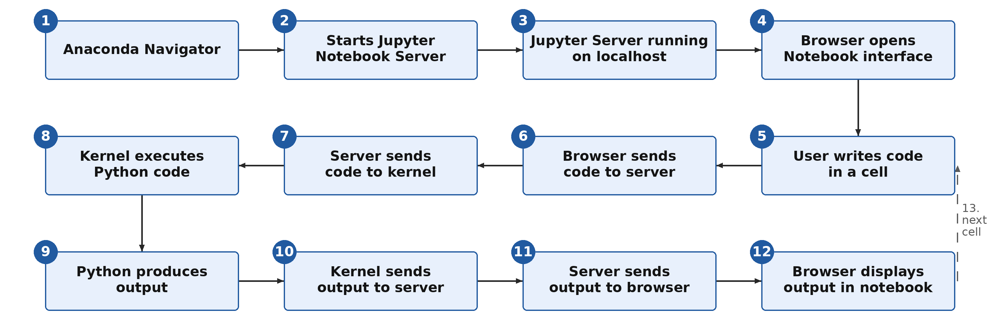


<details>
<summary>Mermaid source of this flowchart (can be pasted into draw.io)</summary>

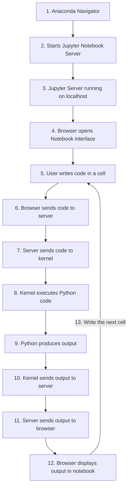

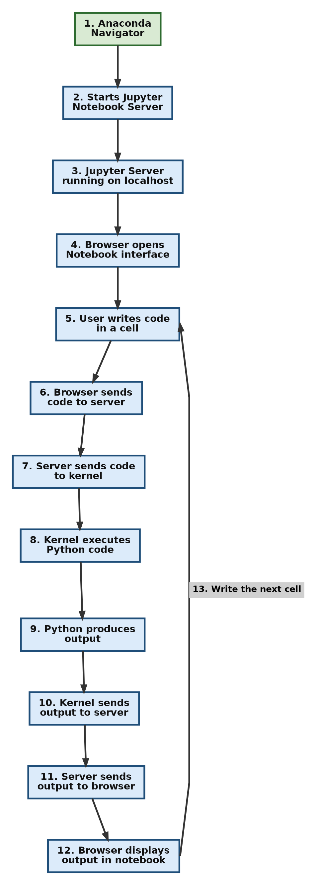

</details>

[Back to the Table of Contents](#table-of-contents)

### 11.2 Step-by-Step Explanation

#### Step 1: Anaconda Navigator

This is the graphical launcher that comes with Anaconda. You click its icon, Navigator opens, and you see tiles for applications such as Jupyter Notebook, JupyterLab and Spyder.

The whole journey starts when you launch Jupyter Notebook from here.

[Back to the Table of Contents](#table-of-contents)

#### Step 2: Navigator Starts the Notebook Server

When you click **Launch**, Navigator runs the command:

```text
jupyter notebook
```

This starts the **Jupyter Notebook Server**, a Python program running locally on your computer.

[Back to the Table of Contents](#table-of-contents)

#### Step 3: The Server Runs on localhost

The server starts at an address such as:

```text
http://localhost:8888
```

`localhost` means your own computer (see [Section 7](#7-understanding-the-local-server-address)).

This server manages:

* your notebook files
* saving and checkpoints
* communication with kernels
* security tokens
* sessions (which notebook is connected to which kernel)

[Back to the Table of Contents](#table-of-contents)

#### Step 4: The Browser Opens the Notebook Interface

After the server starts, your web browser opens automatically. It first shows the Tree View (the list of files), and later the Notebook Editor when you open a notebook.

Even though it looks like a website, the whole thing runs on your computer, not on the internet.

[Back to the Table of Contents](#table-of-contents)

#### Step 5: You Write Code in a Cell

Inside the browser, you type, for example:

```python
a = 10
a + 20
```

At this stage it is just text. Nothing happens until you run the cell.

[Back to the Table of Contents](#table-of-contents)

#### Step 6: The Browser Sends the Code to the Server

When you press **Shift + Enter**, the browser sends your code to the Jupyter server over a WebSocket connection.

In simple words, the server receives a message that says: "Run this cell, with the code: `a = 10`, `a + 20`."

[Back to the Table of Contents](#table-of-contents)

#### Step 7: The Server Sends the Code to the Kernel

The Jupyter server forwards the code to the kernel. The kernel is a separate Python process that was started with a command like:

```text
python -m ipykernel_launcher -f <connection file>
```

The "connection file" is a small file that tells the kernel how to talk to the server. The kernel is what actually executes your code.

[Back to the Table of Contents](#table-of-contents)

#### Step 8: The Kernel Executes the Code

The kernel:

* reads (parses) your Python code
* executes it
* keeps track of your variables (it now remembers that `a` is 10)
* keeps everything in memory for the rest of the session

[Back to the Table of Contents](#table-of-contents)

#### Step 9: Python Produces Output

The result of the code is:

```text
30
```

For other code, the output could be a graph, a printed message, or an error.

[Back to the Table of Contents](#table-of-contents)

#### Step 10: The Kernel Sends the Output to the Server

After running the code, the kernel sends back:

* the result
* any errors
* anything printed with `print()` (called *stdout*, the standard output)
* rich outputs such as plots, HTML and images

These are sent in a structured format called [JSON](https://www.json.org/json-en.html), a simple text format for data.

[Back to the Table of Contents](#table-of-contents)

#### Step 11: The Server Sends the Output to the Browser

The Jupyter server receives the kernel's JSON message and forwards it to your browser.

[Back to the Table of Contents](#table-of-contents)

#### Step 12: The Browser Displays the Output

The browser shows the output below your code cell, marked `[1]` or similar.

This completes the cycle:

1. You write code.
2. It travels from the browser to the server and then to the kernel.
3. The kernel executes it.
4. The result travels back.
5. The browser displays it.

Then you write the next cell (Step 13 in the flowchart), and the cycle repeats from Step 5.

[Back to the Table of Contents](#table-of-contents)

### 11.3 Where Jupyter Stores Kernels

Each kernel that Jupyter knows about is described by a **kernel specification** ("kernelspec"): a small folder containing a file called `kernel.json`. To see all the kernels on your computer and where they are stored, type this in the Anaconda Prompt (or in a notebook cell with `!` in front):

```text
jupyter kernelspec list
```

Example output on Windows (your folder names will be different):

```text
Available kernels:
  python3    C:\Users\yourname\anaconda3\share\jupyter\kernels\python3
  myenv      C:\Users\yourname\AppData\Roaming\jupyter\kernels\myenv
```

Common locations for kernels that you add yourself (for example with `python -m ipykernel install --user`):

| Operating system | Folder |
| ---------------- | ------ |
| Windows | `C:\Users\<username>\AppData\Roaming\jupyter\kernels\` |
| macOS | `~/Library/Jupyter/kernels/` |
| Linux | `~/.local/share/jupyter/kernels/` |

The default `python3` kernel usually lives inside the Python or Anaconda installation itself, as in the first line of the example output.

Each kernel folder contains:

* `kernel.json` - the settings, including the command used to start the kernel (and so the path to the Python that runs it)
* logo files (icons) such as `logo-32x32.png` and `logo-64x64.png`

For example, the `kernel.json` of the standard Python kernel looks like this:

```json
{
 "argv": [
  "python",
  "-m",
  "ipykernel_launcher",
  "-f",
  "{connection_file}"
 ],
 "display_name": "Python 3 (ipykernel)",
 "language": "python",
 "metadata": {
  "debugger": true,
  "supported_encryption": "curve"
 },
 "kernel_protocol_version": "5.5"
}
```

`argv` is the command that starts the kernel (you saw it in Step 7), and `display_name` is the name shown in the **New** menu.

[Back to the Table of Contents](#table-of-contents)

## 12. Advanced: Profiling Code in Jupyter Notebook

**Profiling** means measuring your program to find out **where it spends its time or memory**. A profiler tells you which function, or even which line, is slow. You can then spend your effort on the part that really matters, instead of guessing. Jupyter makes profiling easy, with built-in magic commands and some external tools.

This section explains the simplest and most useful ways to profile notebook cells. Start with Sections 12.2 to 12.5, which need nothing extra. The later sections use packages that you install with `%pip`.

[Back to the Table of Contents](#table-of-contents)

### 12.1 Setting Up an Example Function

All the examples below need a function to measure. Run this cell first. It defines a deliberately slow function, a faster one, and `my_function()`, which uses both.

```python
# Step 1 - A slow way to build a list of squares, using a loop and append()
def slow_squares(n):
    """Return a list of squares from 0 to n-1, built the slow way."""
    result = []
    for i in range(n):
        result.append(i * i)
    return result


# Step 2 - A faster way to do the same thing, using a list comprehension
def fast_squares(n):
    return [i * i for i in range(n)]


# Step 3 - A function that calls both, so that we have something to profile
def my_function():
    a = slow_squares(200_000)
    b = fast_squares(200_000)
    return len(a) + len(b)


print("Step 4 - my_function() returns:", my_function())
```

Output:

```text
Step 4 - my_function() returns: 400000
```

Note: `200_000` is simply the number 200000. Python lets you put underscores in numbers to make them easier to read. All timings shown below are examples from one computer; your numbers will be different. Where a report names the cell, it shows something like `<ipython-input-1-4f7946f8a935>`; in Jupyter you will see a different name, such as a temporary file path. The line numbers refer to lines in the cell above.

[Back to the Table of Contents](#table-of-contents)

### 12.2 Timing One Line with time and timeit

Measure the execution time of a **single run**:

```python
%time my_function()
```

```text
CPU times: user 7.26 ms, sys: 11.7 ms, total: 19 ms
Wall time: 19 ms
```

Measure the execution time over **many runs**:

```python
%timeit my_function()
```

```text
15.4 ms ± 397 µs per loop (mean ± std. dev. of 7 runs, 100 loops each)
```

`%timeit` automatically chooses how many times to repeat the code so that the result is accurate. The output means: the code was run 100 times in a row ("loops"), this was done 7 times ("runs"), and on average one call took 15.4 milliseconds, give or take 0.397 milliseconds. You can set the numbers yourself with `-n` (loops) and `-r` (runs):

```python
%timeit -n 10 -r 3 fast_squares(10_000)
```

```text
225 µs ± 5.28 µs per loop (mean ± std. dev. of 3 runs, 10 loops each)
```

Why do we need both? A single run (`%time`) can be affected by other things happening on your computer at that moment. `%timeit` averages many runs, so it is better for comparing two ways of doing the same thing.

[Back to the Table of Contents](#table-of-contents)

### 12.3 Timing a Whole Cell

To time an entire Jupyter cell once, put `%%time` on the first line:

```python
%%time
result = []
for i in range(10000):
    result.append(i * 2)
```

To benchmark a full cell over many runs, use `%%timeit`:

```python
%%timeit
sum([i * 2 for i in range(10000)])
```

Remember that with `%%timeit` the cell is run many times, and variables created inside it are **not** kept afterwards.

[Back to the Table of Contents](#table-of-contents)

### 12.4 The Built-In Profiler prun

`%prun` runs Python's built-in profiler, [cProfile](https://docs.python.org/3/library/profile.html), on a statement. Instead of one total time, it shows the time spent in **each function**.

```python
%prun -l 6 my_function()
```

(`-l 6` limits the report to the 6 most important lines.) The report appears below the cell (in some versions, in a separate panel at the bottom of the screen). It looks like this:

```text
         200009 function calls in 0.057 seconds

   Ordered by: internal time
   List reduced from 9 to 6 due to restriction <6>

   ncalls  tottime  percall  cumtime  percall filename:lineno(function)
        1    0.031    0.031    0.043    0.043 <ipython-input-1-4f7946f8a935>:2(slow_squares)
   200000    0.012    0.000    0.012    0.000 {method 'append' of 'list' objects}
        1    0.011    0.011    0.011    0.011 <ipython-input-1-4f7946f8a935>:12(<listcomp>)
        1    0.003    0.003    0.057    0.057 <string>:1(<module>)
        1    0.000    0.000    0.057    0.057 {built-in method builtins.exec}
        1    0.000    0.000    0.054    0.054 <ipython-input-1-4f7946f8a935>:16(my_function)
```

How to read it:

| Column | Meaning |
| ------ | ------- |
| `ncalls` | Number of calls - how many times the function was called |
| `tottime` | Total time spent inside the function itself, not counting other functions it called |
| `percall` (first) | `tottime` divided by `ncalls` |
| `cumtime` | Cumulative time - time in the function **including** everything it called |
| `percall` (second) | `cumtime` divided by the number of calls |
| `filename:lineno(function)` | Which function the row is about |

Here you can see that `slow_squares` takes the most time, and that `list.append` was called 200,000 times. The list comprehension (`<listcomp>`, in `fast_squares`) needed much less time for the same job.

[Back to the Table of Contents](#table-of-contents)

### 12.5 Profiling a Whole Cell with prun

To profile all the code in a cell, use `%%prun` on the first line:

```python
%%prun
data = []
for i in range(500000):
    data.append(i * i)
```

This is useful when you want to profile loops or several lines of code that are not inside a function.

[Back to the Table of Contents](#table-of-contents)

### 12.6 Line-by-Line Timing with line_profiler

`%prun` tells you which *function* is slow. [line_profiler](https://github.com/pyutils/line_profiler) goes one step further and tells you which *line* inside a function is slow.

Step 1 - Install it (only once):

```python
%pip install line_profiler
```

Step 2 - Load its Jupyter extension:

```python
%load_ext line_profiler
```

Step 3 - Profile a function line by line. After `-f` you give the name of the function to watch, and then the statement to run:

```python
%lprun -f slow_squares slow_squares(100_000)
```

Output:

```text
Timer unit: 1e-09 s

Total time: 0.0282243 s
File: <ipython-input-1-4f7946f8a935>
Function: slow_squares at line 2

Line #      Hits         Time  Per Hit   % Time  Line Contents
==============================================================
     2                                           def slow_squares(n):
     3                                               """Return a list of squares from 0 to n-1, built the slow way."""
     4         1        726.0    726.0      0.0      result = []
     5    100001   10499868.0    105.0     37.2      for i in range(n):
     6    100000   17723556.0    177.2     62.8          result.append(i * i)
     7         1        194.0    194.0      0.0      return result
```

`Hits` is how many times each line ran, `Time` is the total time for that line (in the timer unit, here nanoseconds), and `% Time` is the share of the total. Line 6, the `append()`, takes about 63% of the time. That is the line to improve.

[Back to the Table of Contents](#table-of-contents)

### 12.7 Memory Profiling with memory_profiler

[memory_profiler](https://pypi.org/project/memory-profiler/) shows how much memory your code uses. This is useful when you work with large lists, NumPy arrays, Pandas tables or images.

Step 1 - Install it:

```python
%pip install memory_profiler
```

Step 2 - Load its extension:

```python
%load_ext memory_profiler
```

Step 3 - Measure the peak memory of one statement with `%memit`:

```python
%memit slow_squares(1_000_000)
```

```text
peak memory: 50.26 MiB, increment: 4.23 MiB
```

`peak memory` is the most memory Python used while running the statement, and `increment` is how much extra memory the statement needed. (`MiB` is a mebibyte, about one million bytes.)

Step 4 - Line-by-line memory use with `%mprun`. There is one catch: **`%mprun` only works on functions saved in a real `.py` file**, not on functions defined in a notebook cell. If you try it on a notebook function, you get this error:

```text
ERROR: Could not find file <ipython-input-1-4f7946f8a935>
NOTE: %mprun can only be used on functions defined in physical files, and not in the IPython environment.
```

The simple way round this is to write the function to a file with `%%writefile`, then import it:

```python
%%writefile squares_module.py
def slow_squares(n):
    result = []
    for i in range(n):
        result.append(i * i)
    return result
```

```text
Writing squares_module.py
```

```python
from squares_module import slow_squares
%mprun -f slow_squares slow_squares(1_000_000)
```

```text
Filename: squares_module.py

Line #    Mem usage    Increment  Occurrences   Line Contents
=============================================================
     1     43.0 MiB     43.0 MiB           1   def slow_squares(n):
     2     43.0 MiB      0.0 MiB           1       result = []
     3     81.4 MiB     30.6 MiB     1000001       for i in range(n):
     4     81.4 MiB      7.7 MiB     1000000           result.append(i * i)
     5     81.4 MiB      0.0 MiB           1       return result
```

The `Increment` column shows how much memory each line added. Building a list of a million numbers needed almost 40 MiB.

[Back to the Table of Contents](#table-of-contents)

### 12.8 Visual Profiling with SnakeViz

[SnakeViz](https://jiffyclub.github.io/snakeviz/) turns the results of cProfile into an interactive picture, so that you can see at a glance where the time goes.

Step 1 - Install it:

```python
%pip install snakeviz
```

Step 2 - Load its extension:

```python
%load_ext snakeviz
```

Step 3 - Profile a statement:

```python
%snakeviz my_function()
```

The result appears inside the notebook as an interactive chart. Each block is a function; the wider the block, the more time was spent in it. Click a block to zoom in.

You can also save a profile to a file and open it later. `%prun -D` saves the profile, and the `snakeviz` command opens it in a new browser tab:

```python
%prun -D output.prof my_function()
```

```text
!snakeviz output.prof
```

Note that the second command keeps a small server running, so the cell shows `[*]` until you press the **Interrupt** button. That is why `%snakeviz` is usually more convenient inside a notebook.

[Back to the Table of Contents](#table-of-contents)

### 12.9 Pyinstrument

[Pyinstrument](https://pyinstrument.readthedocs.io/) shows the time spent as a clear tree of function calls, and can also produce a nice HTML report.

Step 1 - Install it:

```python
%pip install pyinstrument
```

Step 2 - Run it inside the notebook:

```python
from pyinstrument import Profiler

# Step 1 - Create a profiler and start it
prof = Profiler()
prof.start()

# Step 2 - Run the code you want to measure
my_function()

# Step 3 - Stop the profiler and print the report
prof.stop()
prof.print()
```

Output (shortened; your numbers will differ):

```text
Duration: 0.066     CPU time: 0.064

0.066 <module>  <ipython-input-1-4f7946f8a935>:1
├─ 0.063 my_function  <ipython-input-1-4f7946f8a935>:16
│  ├─ 0.051 slow_squares  <ipython-input-1-4f7946f8a935>:2
│  │  ├─ 0.030 [self]  <ipython-input-1-4f7946f8a935>
│  │  └─ 0.022 list.append  <built-in>
│  └─ 0.011 fast_squares  <ipython-input-1-4f7946f8a935>:11
│     └─ 0.011 <listcomp>  <ipython-input-1-4f7946f8a935>:12
└─ 0.003 [self]  <ipython-input-1-4f7946f8a935>
```

Read the tree from the top down: `my_function` took 0.063 seconds, of which 0.051 seconds were spent in `slow_squares` and only 0.011 seconds in `fast_squares`.

Pyinstrument also has its own magic commands. After `%load_ext pyinstrument`, you can put `%%pyinstrument` on the first line of a cell to profile the whole cell and see an interactive HTML report.

[Back to the Table of Contents](#table-of-contents)

### 12.10 Scalene

[Scalene](https://github.com/plasma-umass/scalene) is a powerful profiler that, when run from the command line, measures CPU time, memory use and even GPU (graphics card) use.

Step 1 - Install it:

```python
%pip install scalene
```

Step 2 - Load its extension:

```python
%load_ext scalene
```

Step 3 - Profile a single statement with `%scrun`, or a whole cell with `%%scalene`:

```python
%scrun my_function()
```

```python
%%scalene
my_function()
```

Scalene shows its report inside the notebook. Keep in mind that **inside Jupyter, Scalene measures only CPU and GPU time**. For memory profiling, run it from the command line on a `.py` file, for example `scalene myscript.py`. Check the Scalene documentation for the operating systems and Python versions it currently supports.

[Back to the Table of Contents](#table-of-contents)

### 12.11 Tips for Profiling Notebooks Effectively

**1. Restart the kernel before profiling.** This clears old variables and cached results, so the measurements are accurate.

**2. Profile only the function you want to improve.** Profiling a whole notebook gives too much noise, and it becomes hard to see what matters.

**3. Use `%timeit` for small operations.** It repeats the code many times, so it is more precise than a single `%time`.

**4. Use line_profiler for loops and number-crunching code.** It points to the exact line that is slow.

**5. Use memory_profiler when working with large data.** It is especially useful with Pandas, NumPy, big lists and images.

**6. Use Pyinstrument or SnakeViz for a visual picture.** Their output is easier to understand than a long table of numbers.

**7. Measure first, then change the code.** Only change code after the profiler has shown you where the slow part is, and measure again afterwards to check that your change really helped.

The flowchart below shows how to choose a tool.

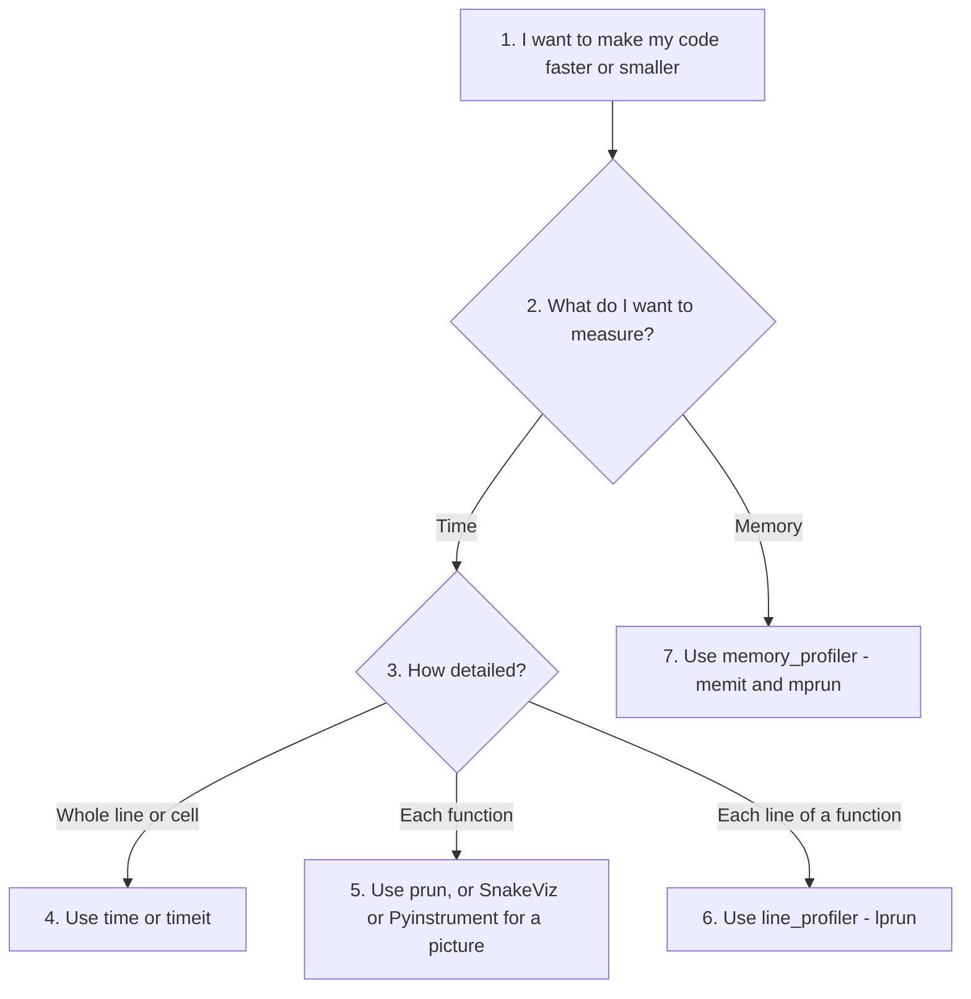

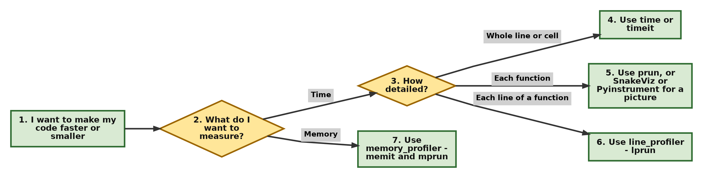

[Back to the Table of Contents](#table-of-contents)

### 12.12 Quick Reference Table

| Task | Best tool |
| ---- | --------- |
| Timing a single line once | `%time` |
| Microbenchmarking (accurate timing of small code) | `%timeit` |
| Timing a whole cell | `%%time`, `%%timeit` |
| CPU profiling, function by function | `%prun`, `%%prun` |
| Line-by-line CPU profiling | `%lprun` (line_profiler) |
| Peak memory of a statement | `%memit` (memory_profiler) |
| Line-by-line memory profiling | `%mprun` (memory_profiler, function must be in a `.py` file) |
| CPU and GPU profiling in a notebook | Scalene (`%scrun`, `%%scalene`) |
| CPU, memory and GPU profiling of a script | Scalene from the command line |
| Visual, interactive profiling | SnakeViz, Pyinstrument |

Here are all the example cells from this section together, in the order you would run them in a notebook. Each `# --- Cell n ---` line marks the start of a new cell. (A cell magic such as `%%writefile` must be the first line of its cell, so put the comment line after it or leave it out.)

```python
# --- Cell 1 --- Define the example functions
def slow_squares(n):
    """Return a list of squares from 0 to n-1, built the slow way."""
    result = []
    for i in range(n):
        result.append(i * i)
    return result


def fast_squares(n):
    return [i * i for i in range(n)]


def my_function():
    a = slow_squares(200_000)
    b = fast_squares(200_000)
    return len(a) + len(b)


print("my_function() returns:", my_function())

# --- Cell 2 --- Time one run, then many runs
%time my_function()
%timeit my_function()

# --- Cell 3 --- Function-by-function profile
%prun -l 6 my_function()

# --- Cell 4 --- Install the extra tools (only needed once)
%pip install line_profiler memory_profiler snakeviz pyinstrument

# --- Cell 5 --- Line-by-line timing
%load_ext line_profiler
%lprun -f slow_squares slow_squares(100_000)

# --- Cell 6 --- Peak memory
%load_ext memory_profiler
%memit slow_squares(1_000_000)

# --- Cell 7 --- Visual profile
%load_ext snakeviz
%snakeviz my_function()

# --- Cell 8 --- Pyinstrument
from pyinstrument import Profiler
prof = Profiler()
prof.start()
my_function()
prof.stop()
prof.print()
```

[Back to the Table of Contents](#table-of-contents)

### 12.13 Summary

Jupyter notebooks support many profiling tools.

Beginners should start with:

* `%time`
* `%timeit`
* `%prun`

Intermediate users can go on to:

* line_profiler
* memory_profiler
* SnakeViz
* Pyinstrument
* Scalene

These tools help you find slow code, memory problems and other performance bottlenecks directly inside a notebook.

[Back to the Table of Contents](#table-of-contents)

---

