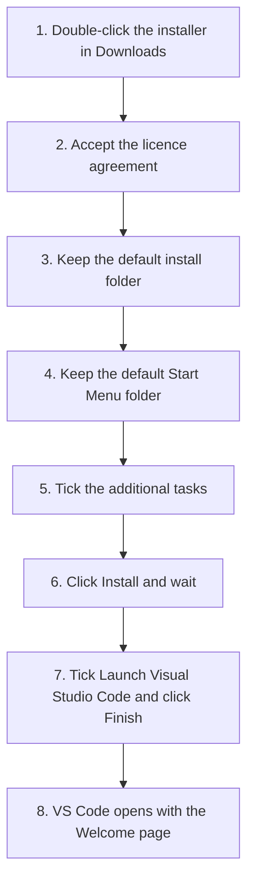
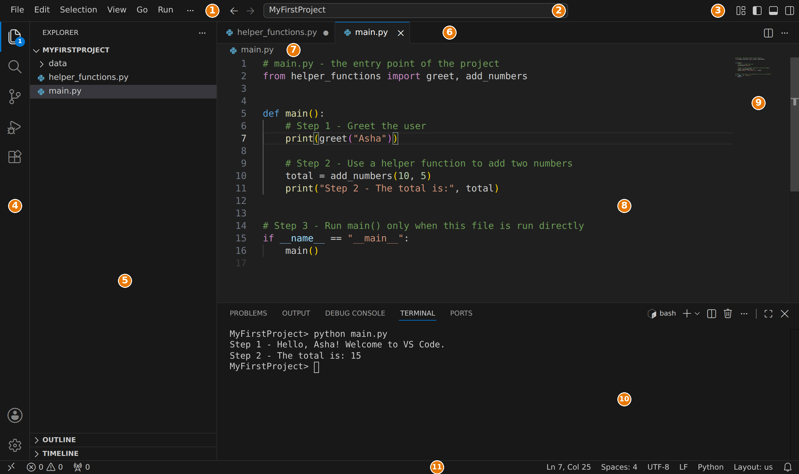
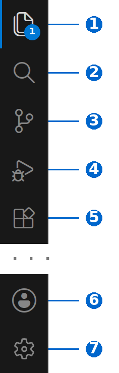
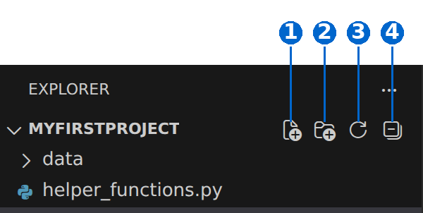
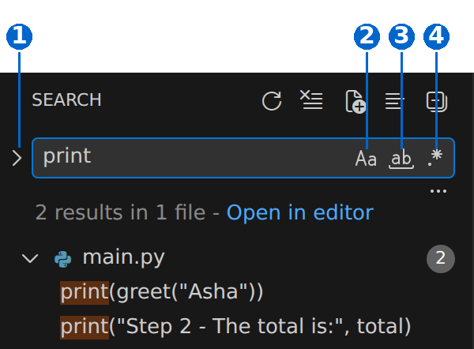
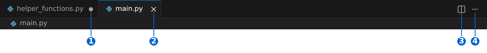
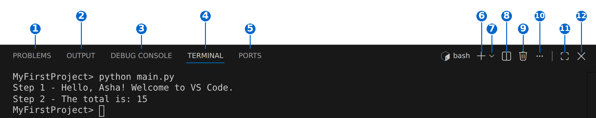
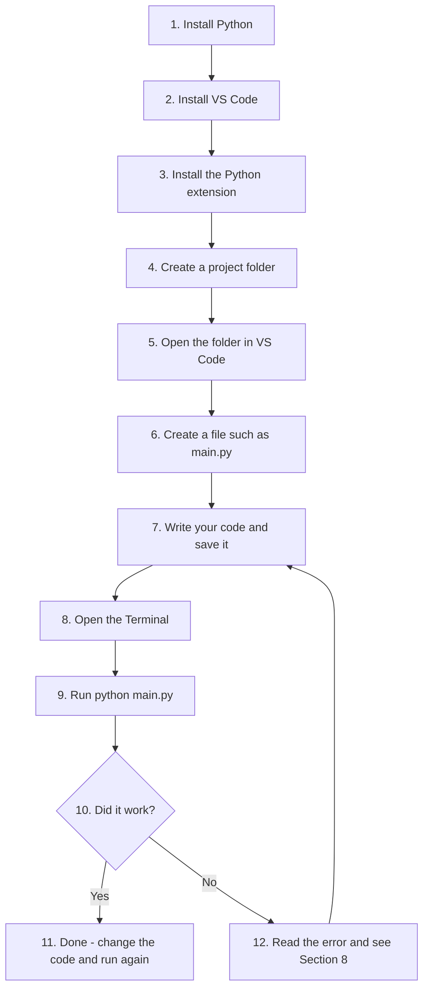
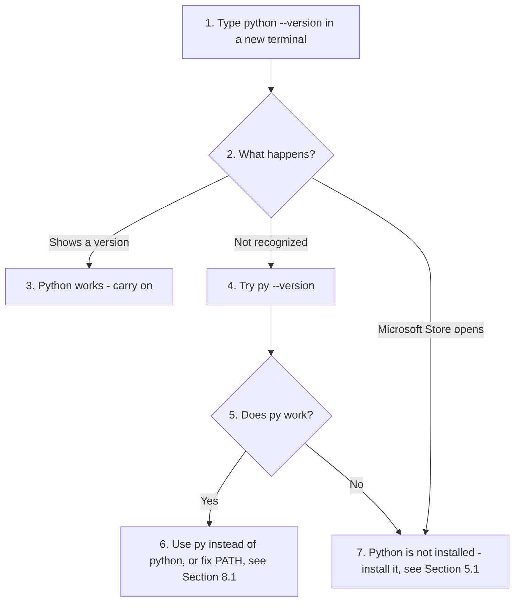
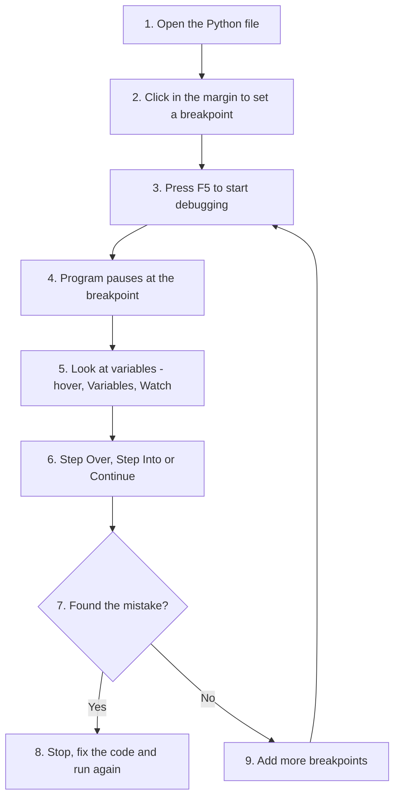

# Chapter 1: Setting Up VS Code for Python (Part 1)

**About this page**

This page goes with Chapter 1 of the book, *Python Basics*. To write and run the programs in this book you need a good place to type your code. On the previous page you met Jupyter Notebook. This page introduces the other tool used throughout the book: **Visual Studio Code**, usually called **VS Code**.

Here is what you will find on this page:

* **Installing VS Code** on Windows, step by step, with notes for macOS and Linux.
* **First-time setup**, including a few settings that make life easier for beginners.
* **A tour of the VS Code window** - the Activity Bar, Side Bar, Editor, Panel and Status Bar - with numbered screenshots.
* **Extensions** that turn VS Code into a Python tool.
* **A complete beginner workflow**: installing Python, creating a project folder, writing a file and running it.
* **Common beginner errors** and how to fix them.
* **Debugging**: pausing a program, looking at its variables and running it line by line.
* **Frequently asked questions** about VS Code, its interface, IntelliSense (auto-complete) and the Terminal.

Why does this matter? Jupyter Notebook is excellent for trying out small pieces of code. But most real Python programs are saved as `.py` files, often several of them in one project folder, and run as a whole. VS Code is one of the most popular tools for this kind of work, in colleges and in industry alike. Everything you learn here - projects, the terminal, the debugger - will be used again and again in later chapters.

VS Code is updated every month, so a few buttons or menu names on your screen may look slightly different from the screenshots here. The ideas stay the same.

## Table of Contents

* [1. VS Code Basics](#1-vs-code-basics)
  * [1.1 What Is VS Code](#11-what-is-vs-code)
  * [1.2 Downloading VS Code (Step-by-Step)](#12-downloading-vs-code-step-by-step)
  * [1.3 Installing VS Code on Windows (Step-by-Step)](#13-installing-vs-code-on-windows-step-by-step)
  * [1.4 Other Ways to Install and Other Operating Systems](#14-other-ways-to-install-and-other-operating-systems)
  * [1.5 Checking the Installation](#15-checking-the-installation)
* [2. First-Time Setup](#2-first-time-setup)
  * [2.1 What You See the First Time](#21-what-you-see-the-first-time)
  * [2.2 Useful Settings for Beginners](#22-useful-settings-for-beginners)
* [3. The VS Code Interface](#3-the-vs-code-interface)
  * [3.1 Main Parts of the Window](#31-main-parts-of-the-window)
  * [3.2 The Activity Bar](#32-the-activity-bar)
  * [3.3 The Primary Side Bar](#33-the-primary-side-bar)
  * [3.4 The Explorer View](#34-the-explorer-view)
  * [3.5 The Search View](#35-the-search-view)
  * [3.6 The Editor Area](#36-the-editor-area)
  * [3.7 The Panel](#37-the-panel)
  * [3.8 The Status Bar](#38-the-status-bar)
* [4. Important Extensions for Python Programming](#4-important-extensions-for-python-programming)
  * [4.1 Python (by Microsoft)](#41-python-by-microsoft)
  * [4.2 Pylance](#42-pylance)
  * [4.3 Python Debugger](#43-python-debugger)
  * [4.4 Jupyter](#44-jupyter)
  * [4.5 Code Runner (optional)](#45-code-runner-optional)
* [5. A Beginner's Python Workflow in VS Code](#5-a-beginners-python-workflow-in-vs-code)
  * [5.1 Step 1: Install Python](#51-step-1-install-python)
  * [5.2 Step 2: Install VS Code](#52-step-2-install-vs-code)
  * [5.3 Step 3: Install the Python Extension in VS Code](#53-step-3-install-the-python-extension-in-vs-code)
  * [5.4 Step 4: Create a Folder for Your Project](#54-step-4-create-a-folder-for-your-project)
  * [5.5 Step 5: Open the Folder in VS Code](#55-step-5-open-the-folder-in-vs-code)
  * [5.6 Step 6: Create a Python File](#56-step-6-create-a-python-file)
  * [5.7 Step 7: Write Your Code](#57-step-7-write-your-code)
  * [5.8 Step 8: Open the VS Code Terminal](#58-step-8-open-the-vs-code-terminal)
  * [5.9 Step 9: Run Your Python Script](#59-step-9-run-your-python-script)
* [6. How to Create a Python Project](#6-how-to-create-a-python-project)
  * [6.1 Step 1: Create a Folder](#61-step-1-create-a-folder)
  * [6.2 Step 2: Add Subfolders (Optional but Good Practice)](#62-step-2-add-subfolders-optional-but-good-practice)
  * [6.3 Step 3: Open the Folder in VS Code](#63-step-3-open-the-folder-in-vs-code)
  * [6.4 Step 4: Add Python Files](#64-step-4-add-python-files)
  * [6.5 Step 5: Install Required Libraries (Optional)](#65-step-5-install-required-libraries-optional)
* [7. How to Run Python Scripts in VS Code](#7-how-to-run-python-scripts-in-vs-code)
  * [7.1 Method 1: Using the Terminal (Most Recommended)](#71-method-1-using-the-terminal-most-recommended)
  * [7.2 Method 2: Using the Run Button](#72-method-2-using-the-run-button)
  * [7.3 Method 3: Using the Code Runner Extension (Optional)](#73-method-3-using-the-code-runner-extension-optional)
  * [7.4 Which Method Should I Use](#74-which-method-should-i-use)
* [8. Common Beginner Errors and Quick Fixes](#8-common-beginner-errors-and-quick-fixes)
  * [8.1 ERROR 1: "python is not recognized"](#81-error-1-python-is-not-recognized)
  * [8.2 ERROR 2: VS Code Shows "Select Python Interpreter"](#82-error-2-vs-code-shows-select-python-interpreter)
  * [8.3 ERROR 3: 'pip' Not Working](#83-error-3-pip-not-working)
  * [8.4 ERROR 4: Running the Wrong File](#84-error-4-running-the-wrong-file)
  * [8.5 ERROR 5: The VS Code Terminal Opens PowerShell](#85-error-5-the-vs-code-terminal-opens-powershell)
  * [8.6 ERROR 6: Accidentally Created a Workspace File (.code-workspace)](#86-error-6-accidentally-created-a-workspace-file-code-workspace)
  * [8.7 ERROR 7: File Saved with the Wrong Extension](#87-error-7-file-saved-with-the-wrong-extension)
* [9. Debugging Python Code in VS Code](#9-debugging-python-code-in-vs-code)
  * [9.1 What Is Debugging](#91-what-is-debugging)
  * [9.2 Make Sure the Python Extension Is Installed](#92-make-sure-the-python-extension-is-installed)
  * [9.3 Create a Small Sample File to Debug](#93-create-a-small-sample-file-to-debug)
  * [9.4 Set a Breakpoint](#94-set-a-breakpoint)
  * [9.5 Start Debugging](#95-start-debugging)
  * [9.6 The Program Stops at the Breakpoint](#96-the-program-stops-at-the-breakpoint)
  * [9.7 The Debug Toolbar](#97-the-debug-toolbar)
  * [9.8 Inspecting Variables](#98-inspecting-variables)
  * [9.9 Adding More Breakpoints](#99-adding-more-breakpoints)
  * [9.10 Example Debugging Session](#910-example-debugging-session)
* [10. Debugging Common Beginner Mistakes](#10-debugging-common-beginner-mistakes)
  * [10.1 A NameError Example](#101-a-nameerror-example)
  * [10.2 Debugging Programs That Use input()](#102-debugging-programs-that-use-input)
  * [10.3 Debug Configuration (Optional)](#103-debug-configuration-optional)
  * [10.4 Summary: VS Code Debug Steps](#104-summary-vs-code-debug-steps)
* [11. FAQ](#11-faq)
* [12. FAQ: VS Code User Interface](#12-faq-vs-code-user-interface)
  * [A. Activity Bar (Left-Most Slim Column)](#a-activity-bar-left-most-slim-column)
  * [B. Side Bar and Explorer Panel](#b-side-bar-and-explorer-panel)
  * [C. Editor Area (The Main Coding Window)](#c-editor-area-the-main-coding-window)
  * [D. Tabs Bar (Top of the Editor)](#d-tabs-bar-top-of-the-editor)
  * [E. Status Bar (Bottom Bar)](#e-status-bar-bottom-bar)
  * [F. Panel (Bottom Window for Terminal, Output, Problems)](#f-panel-bottom-window-for-terminal-output-problems)
  * [G. Terminal Panel](#g-terminal-panel)
  * [H. Problems Panel](#h-problems-panel)
  * [I. Output Panel](#i-output-panel)
  * [J. Command Palette](#j-command-palette)
  * [K. Extensions View](#k-extensions-view)
  * [L. Settings](#l-settings)
  * [M. Minimap (Tiny Map of Code on the Right Side)](#m-minimap-tiny-map-of-code-on-the-right-side)
  * [N. Breadcrumb Bar (Top of Editor)](#n-breadcrumb-bar-top-of-editor)
  * [O. Editor Layout Controls](#o-editor-layout-controls)
  * [P. Hover Tooltips and Auto Suggestions](#p-hover-tooltips-and-auto-suggestions)
  * [Q. Welcome Page](#q-welcome-page)
* [13. VS Code IntelliSense FAQ](#13-vs-code-intellisense-faq)
* [14. VS Code Terminal FAQ](#14-vs-code-terminal-faq)
* [15. Disclaimer](#15-disclaimer)

## 1. VS Code Basics

### 1.1 What Is VS Code

VS Code is best described as a **code editor that runs on your own computer** (a local desktop application). It works on Windows, macOS and Linux, and it is free.

On its own, VS Code is a smart text editor. It becomes a full Python tool once you add **extensions** (small add-on programs, see [Section 4](#4-important-extensions-for-python-programming)). With the right extensions it behaves like an **IDE** - an *Integrated Development Environment*, which means one program in which you can write, run, test and debug code.

A common source of confusion: **VS Code does not include Python.** You install Python separately (see [Section 5.1](#51-step-1-install-python)), and VS Code then uses it.

[Back to the Table of Contents](#table-of-contents)

### 1.2 Downloading VS Code (Step-by-Step)

#### Step 1: Go to the Official Website

Open your browser (Chrome, Edge, Firefox) and go to:
[https://code.visualstudio.com/](https://code.visualstudio.com/)

Always download VS Code from this official Microsoft site, never from other download websites.

[Back to the Table of Contents](#table-of-contents)

#### Step 2: Choose Your Operating System

For Windows, click **Download for Windows**.

A file with a name like this will start downloading:

```text
VSCodeUserSetup-x64-1.xxx.x.exe
```

The numbers change with every new version. `x64` means it is for ordinary 64-bit Windows computers, which is what almost all laptops and desktops use.

If your laptop has an ARM processor (for example, some newer Snapdragon laptops), go to [https://code.visualstudio.com/download](https://code.visualstudio.com/download) and choose the **User Installer** under **Arm64** instead.

[Back to the Table of Contents](#table-of-contents)

#### Step 3: Wait for the Download to Complete

When the download finishes, you will find the `.exe` file in your **Downloads** folder.

[Back to the Table of Contents](#table-of-contents)

### 1.3 Installing VS Code on Windows (Step-by-Step)

The flowchart below shows the whole installation at a glance. Each step is explained after it.



[Back to the Table of Contents](#table-of-contents)

#### Step 1: Double-Click the Installer

Open your **Downloads** folder and double-click the file:

```text
VSCodeUserSetup-x64-...
```

If Windows asks whether you want to allow the app to make changes, click **Yes**.

[Back to the Table of Contents](#table-of-contents)

#### Step 2: License Agreement

Select **I accept the agreement**, then click **Next**.

[Back to the Table of Contents](#table-of-contents)

#### Step 3: Choose the Installation Location

Beginners should leave it as it is:

```text
C:\Users\<YourName>\AppData\Local\Programs\Microsoft VS Code
```

Here `<YourName>` is your Windows user name. Click **Next**.

[Back to the Table of Contents](#table-of-contents)

#### Step 4: Start Menu Folder

The installer asks where to put the Start menu shortcut. Leave it as **Visual Studio Code** and click **Next**.

[Back to the Table of Contents](#table-of-contents)

#### Step 5: Additional Tasks (Very Important)

You will see a screen called **Select Additional Tasks** with several checkboxes. Tick these:

| Checkbox | What it does | Tick it? |
| -------- | ------------ | -------- |
| Create a desktop icon | Puts a VS Code shortcut on your desktop | Optional |
| Add "Open with Code" action to Windows Explorer file context menu | Lets you right-click any file and open it in VS Code | Yes |
| Add "Open with Code" action to Windows Explorer directory context menu | Lets you right-click any **folder** and open the whole folder in VS Code. Very handy for projects | Yes |
| Register Code as an editor for supported file types | Makes VS Code the program that opens `.py` and similar files when you double-click them | Yes |
| Add to PATH (requires shell restart) | Lets you start VS Code by typing `code` in a command window, for example `code .` to open the current folder | Yes (usually already ticked) |

A note about **PATH**: PATH is a list of folders that Windows searches when you type a command. Adding VS Code to PATH is what makes the `code` command work. It does **not** affect Python; Python has its own PATH setting, which is covered in [Section 5.1](#51-step-1-install-python). ("Requires shell restart" simply means that command windows that are already open will not know about `code` until you close and reopen them.)

Click **Next**.

[Back to the Table of Contents](#table-of-contents)

#### Step 6: Install

Check the summary on the **Ready to Install** screen, then click **Install** and wait. It usually takes less than a minute.

[Back to the Table of Contents](#table-of-contents)

#### Step 7: Launch

Tick **Launch Visual Studio Code** and click **Finish**.

[Back to the Table of Contents](#table-of-contents)

#### Step 8: VS Code Opens

VS Code starts and shows a **Welcome** page. What to do next is explained in [Section 2](#2-first-time-setup).

[Back to the Table of Contents](#table-of-contents)

### 1.4 Other Ways to Install and Other Operating Systems

**Using the command line on Windows.** If you are comfortable with the command line, you can install VS Code with Windows' own package manager, **winget**. Open Command Prompt and type:

```text
winget install -e --id Microsoft.VisualStudioCode
```

**Installer types on Windows.** The download page offers three kinds of Windows download:

| Type | Who it is for |
| ---- | ------------- |
| User Installer | Installs for your own Windows account only. No administrator permission needed. **Recommended for beginners.** |
| System Installer | Installs for all users of the computer. Needs administrator permission. |
| .zip | A portable version that you unzip and run, with no installation. Does not update itself. |

**macOS.** Download the macOS version, open the downloaded file, and drag **Visual Studio Code** into the **Applications** folder. To use the `code` command, open VS Code, press **Cmd + Shift + P**, and run **Shell Command: Install 'code' command in PATH**.

**Linux.** Download the `.deb` package (Ubuntu, Debian) or `.rpm` package (Fedora, Red Hat) and install it with your system's software installer. Full details are in the official guide [Visual Studio Code on Linux](https://code.visualstudio.com/docs/setup/linux).

[Back to the Table of Contents](#table-of-contents)

### 1.5 Checking the Installation

To check that VS Code and the `code` command are working, open a **new** Command Prompt window and type:

```text
code --version
```

You should see three lines: the version number, a long code (called the commit ID), and `x64`. For example:

```text
1.xxx.x
0a1b2c3d4e5f...
x64
```

If you see `'code' is not recognized...`, close all command windows and try again. If it still does not work, you probably unticked **Add to PATH** during installation. Run the installer again and tick it.

[Back to the Table of Contents](#table-of-contents)

## 2. First-Time Setup

### 2.1 What You See the First Time

When VS Code launches for the first time:

* It opens a **Welcome** page. This page includes:
  * a **Walkthrough** (a short "Get Started" guide),
  * a choice of **colour themes** (light or dark),
  * buttons to create a new file, open a file, or open a folder.
* It may ask **"Would you like to install the recommended extensions?"** This is optional. For Python, the extensions you need are described in [Section 4](#4-important-extensions-for-python-programming).
* When you open a folder, VS Code asks **"Do you trust the authors of the files in this folder?"** This is called **Workspace Trust**. It protects you from code in folders you downloaded from unknown sources. For your own project folders, click **Yes, I trust the authors**. For folders from unknown sources, click **No**; you can still read the files safely, but some features stay switched off. (More about [Workspace Trust](https://code.visualstudio.com/docs/editing/workspaces/workspace-trust).)
* It may ask you to sign in, for example with a Microsoft or GitHub account. Signing in is **not** needed to write and run Python code. It is only used for extra features such as syncing your settings between computers.

You can come back to the Welcome page at any time with **Help > Welcome**.

[Back to the Table of Contents](#table-of-contents)

### 2.2 Useful Settings for Beginners

Settings are opened with **File > Preferences > Settings** (or **Ctrl + ,**). Type the name of a setting in the search box at the top. These are worth changing on day one:

| Setting to search for | Suggested value | Why |
| --------------------- | --------------- | --- |
| Auto Save | `afterDelay` | Saves your files automatically, so you never run an old, unsaved version of your program |
| Font Size (Editor: Font Size) | 16 or 18 | Makes code easier to read |
| Color Theme (or press **Ctrl + K** then **Ctrl + T**) | Any theme you like | Light themes are often easier to read in bright rooms |

[Back to the Table of Contents](#table-of-contents)

## 3. The VS Code Interface

When you open a folder and a file, the VS Code window looks like the screenshot below. Each numbered part is explained in the table that follows it.




[Back to the Table of Contents](#table-of-contents)

### 3.1 Main Parts of the Window

Below is the simplest explanation of each part:

| No. | Part | What it does |
| --- | ---- | ------------ |
| 1 | **Menu Bar** | The usual menus: File, Edit, Selection, View, Go, Run, Terminal and Help. Some menus hide under the three dots (`...`) when the window is narrow. |
| 2 | **Command Center** | A search box at the top. Click it to jump to any file in your project by typing part of its name, or type `>` to search for any command. |
| 3 | **Layout controls** | Small buttons to show or hide the Side Bar, the Panel and the Secondary Side Bar, and to change the layout. |
| 4 | **Activity Bar** | The thin strip of icons on the far left. It switches what the Side Bar shows. See [Section 3.2](#32-the-activity-bar). |
| 5 | **Primary Side Bar** | Shows the view chosen in the Activity Bar, such as the Explorer (your files) or Search. See [Section 3.3](#33-the-primary-side-bar). |
| 6 | **Editor tabs** | One tab for each open file, like tabs in a browser. See [Section 3.6](#36-the-editor-area). |
| 7 | **Breadcrumbs** | Shows where you are: the folder, the file, and the function or class your cursor is in. Click any part to jump around. |
| 8 | **Editor** | The main area where you type and edit your code. |
| 9 | **Minimap** | A tiny picture of the whole file on the right. Click or drag in it to scroll quickly through long files. |
| 10 | **Panel** | The area at the bottom with the Terminal, Problems, Output and Debug Console. See [Section 3.7](#37-the-panel). |
| 11 | **Status Bar** | The strip at the very bottom with information about the current file, such as the line number, indentation and Python version. See [Section 3.8](#38-the-status-bar). |

[Back to the Table of Contents](#table-of-contents)

### 3.2 The Activity Bar

The **Activity Bar** is the thin bar on the far left. Each icon opens a different **view** in the Side Bar. Clicking the icon of the view that is already open hides the Side Bar, which gives you more room for code; click it again to bring it back.





The icons typically found here are (from top to bottom):

| No. | Icon | Name | Shortcut | What it does |
| --- | ---- | ---- | -------- | ------------ |
| 1 | Two sheets of paper | **Explorer** | Ctrl + Shift + E | Shows the files and folders of your current project (workspace). The small number on the icon, if you see one, is the count of unsaved files. |
| 2 | Magnifying glass | **Search** | Ctrl + Shift + F | Search, and replace, text across all files in your project. |
| 3 | Branch shape | **Source Control** | Ctrl + Shift + G | Manages version control for your project with Git (a tool that keeps a history of changes). You can stage, commit and manage branches. |
| 4 | Play button with a bug | **Run and Debug** | Ctrl + Shift + D | Starts and controls debugging sessions. See [Section 9](#9-debugging-python-code-in-vs-code). |
| 5 | Four squares | **Extensions** | Ctrl + Shift + X | Browse, install and manage extensions that add new features. |
| 6 | Person | **Accounts** (at the bottom) | none | Manages signed-in accounts, such as Microsoft or GitHub. |
| 7 | Gear wheel | **Manage** (at the bottom) | none | Opens Settings, Keyboard Shortcuts, Themes and other options. |

Extensions can add more icons. For example, the Python extension adds a **Testing** icon (a laboratory flask), and you may also see a **Chat** icon for AI features. You can right-click the Activity Bar to show or hide icons.

[Back to the Table of Contents](#table-of-contents)

### 3.3 The Primary Side Bar

The **Side Bar** displays the view currently selected in the Activity Bar - the Explorer, Search results, Source Control and so on. The buttons at the top of the Side Bar change depending on the view.

The two views you will use most are described below.

[Back to the Table of Contents](#table-of-contents)

### 3.4 The Explorer View

When you click **Explorer**, you see:

* your opened folder, with the files inside it,
* sections such as **Outline** (the functions and classes in the current file) and **Timeline** (the saved history of the current file) at the bottom.

This view is useful for Python beginners because you can:

* create new files,
* create folders,
* see your whole project structure at a glance.

When you move the mouse over the folder name, four small buttons appear:





| No. | Icon | Name | What it does |
| --- | ---- | ---- | ------------ |
| 1 | Sheet of paper with a plus | **New File** | Creates a new file in the selected folder. Type the name, including `.py`, and press Enter. |
| 2 | Folder with a plus | **New Folder** | Creates a new folder in the selected folder. |
| 3 | Circular arrow | **Refresh Explorer** | Reloads the file list, to show changes made outside VS Code. |
| 4 | Box with a minus | **Collapse Folders in Explorer** | Closes all open folders in the tree. |

To delete, rename, copy or move a file, **right-click** it. You can also drag files between folders.

There is also an **Open Editors** section that lists every open file. It is hidden by default; to show it, click the three dots (`...`) at the top of the Explorer and tick **Open Editors**.

[Back to the Table of Contents](#table-of-contents)

### 3.5 The Search View

The Search view looks for text in **every file** of your project at once. Type a word in the box; the results are listed below it, grouped by file. Click a result to jump to that line.





| No. | Icon | Name | Shortcut | What it does |
| --- | ---- | ---- | -------- | ------------ |
| 1 | Small arrow on the left of the box | **Toggle Replace** | none | Shows a second box, so that you can replace the text you searched for. |
| 2 | `Aa` | **Match Case** | Alt + C | Makes the search case-sensitive, so `Print` does not match `print`. |
| 3 | `ab` with a line under it | **Match Whole Word** | Alt + W | Matches only whole words, so searching `total` does not find `subtotal`. |
| 4 | `.*` | **Use Regular Expression** | Alt + R | Lets you search with regular-expression patterns (a special pattern language you will meet in a later chapter). |

To search only inside the current file, press **Ctrl + F** in the editor instead.

[Back to the Table of Contents](#table-of-contents)

### 3.6 The Editor Area

This is the main area where you view and edit your code. It has one or more open file **tabs**, like browser tabs, and a few controls.





| No. | What you see | Meaning |
| --- | ------------ | ------- |
| 1 | A dot (filled circle) on a tab | The file has changes that are **not saved yet**. Press **Ctrl + S** to save. |
| 2 | A cross (X) on a tab | Closes the file. It appears on the active tab, or when you move the mouse over a tab. |
| 3 | Two boxes side by side | **Split Editor**: shows the file twice, side by side, so that you can look at two places at once. |
| 4 | Three dots | **More Actions**: a menu with more commands, such as closing all tabs. |

When a Python file is open and the Python extension is installed, you also see a **Run** button (a triangle) at the top right of the editor. See [Section 7.2](#72-method-2-using-the-run-button).

The **Breadcrumbs** line just below the tabs and the **Minimap** on the right were described in [Section 3.1](#31-main-parts-of-the-window).

[Back to the Table of Contents](#table-of-contents)

### 3.7 The Panel

The **Panel** appears at the bottom of the window. It holds several views, and you switch between them using the tabs. Press **Ctrl + J** to show or hide the whole Panel.





| No. | Tab or button | What it does |
| --- | ------------- | ------------ |
| 1 | **Problems** | Lists errors, warnings and style issues found in your code. Click one to jump to that line. |
| 2 | **Output** | Shows messages from VS Code itself and from extensions. (Your program's output does **not** appear here; it appears in the Terminal.) |
| 3 | **Debug Console** | Used while debugging, to type Python expressions and see their values. See [Section 9.8](#98-inspecting-variables). |
| 4 | **Terminal** | A command line inside VS Code, where you run programs and install packages. See the [Terminal FAQ](#14-vs-code-terminal-faq). |
| 5 | **Ports** | Used when a program runs a web server. Beginners can ignore it. |
| 6 | **New Terminal** (plus sign) | Opens another terminal. |
| 7 | **Launch Profile** (small arrow) | Opens a new terminal of a chosen type, such as Command Prompt or PowerShell, and lets you choose the default. |
| 8 | **Split Terminal** | Shows two terminals side by side. |
| 9 | **Kill Terminal** (bin) | Closes the terminal completely. |
| 10 | **More Actions** (three dots) | More options, such as clearing the terminal. |
| 11 | **Maximize Panel** | Makes the Panel fill most of the window. Click again to restore it. |
| 12 | **Close Panel** (X) | Hides the Panel. The terminal keeps running; press **Ctrl + `** to bring it back. |

[Back to the Table of Contents](#table-of-contents)

### 3.8 The Status Bar

The **Status Bar** sits at the very bottom of the window. It shows information about the open file and project. Most items can be clicked.

| What you see (example) | Name | What it does |
| ---------------------- | ---- | ------------ |
| A branch icon with `main` | **Git branch** | Shows the current Git branch, if the folder uses Git. Click to switch or create branches. |
| A cross and a triangle with numbers, such as `0` and `3` | **Problems** | The number of errors and warnings. Click to open the Problems panel. |
| `Ln 10, Col 25` | **Cursor position** | The line and column where your cursor is. Click to go to a particular line. |
| `Spaces: 4` | **Indentation** | Shows whether the file uses spaces or tabs, and how many. Click to change it. |
| `UTF-8` | **Encoding** | The way letters are stored in the file. Leave it as UTF-8. |
| `CRLF` or `LF` | **Line endings** | How the end of each line is stored (Windows uses CRLF). Beginners can ignore it. |
| `Python` | **Language mode** | The language VS Code thinks the file is written in. Click to change it. |
| `3.12.4 64-bit` or `3.12.4 ('.venv')` | **Python interpreter** | Which Python will run your code. Appears when a Python file is open and the Python extension is installed. Click to choose another one. See [Section 8.2](#82-error-2-vs-code-shows-select-python-interpreter). |
| A bell | **Notifications** | Messages from VS Code and extensions. |

If you have installed Python and the Python extension, VS Code detects Python automatically and shows its version here.

[Back to the Table of Contents](#table-of-contents)

## 4. Important Extensions for Python Programming

Extensions add new features to VS Code. To install one:

1. Click the **Extensions** icon in the Activity Bar (or press **Ctrl + Shift + X**).
2. Type the name of the extension in the search box.
3. Check that the publisher is correct (for Python, look for **Microsoft** with a blue tick).
4. Click **Install**.

[Back to the Table of Contents](#table-of-contents)

### 4.1 Python (by Microsoft)

The most important one. It gives you:

* colour highlighting of Python code,
* a way to run scripts (the Run button),
* support for Jupyter notebooks (together with the Jupyter extension),
* auto-complete and error checking,
* a way to choose which Python to use (the interpreter).

When you install it, VS Code **automatically installs two more extensions** with it: **Pylance** and **Python Debugger**.

[Back to the Table of Contents](#table-of-contents)

### 4.2 Pylance

Pylance is the "language server" for Python. It powers **IntelliSense**: better auto-complete, pop-up help about functions, and early warnings about mistakes such as misspelt names. It is installed automatically with the Python extension. (More in the [IntelliSense FAQ](#13-vs-code-intellisense-faq).)

[Back to the Table of Contents](#table-of-contents)

### 4.3 Python Debugger

Lets you pause a program, step through it line by line, and look at its variables. Also installed automatically. See [Section 9](#9-debugging-python-code-in-vs-code).

[Back to the Table of Contents](#table-of-contents)

### 4.4 Jupyter

Lets you open and run `.ipynb` notebooks inside VS Code, in the same way as in Jupyter Notebook (see the previous page). VS Code usually suggests it the first time you open a notebook.

[Back to the Table of Contents](#table-of-contents)

### 4.5 Code Runner (optional)

Adds a button to run code with one click, for many languages. It is optional and not needed for Python, since the Python extension already has a Run button. If you use it, turn on its setting **Run In Terminal** (search for `code-runner.runInTerminal` in Settings). Otherwise it shows the output in the Output panel, where programs that use `input()` cannot receive what you type.

[Back to the Table of Contents](#table-of-contents)

## 5. A Beginner's Python Workflow in VS Code

This is the simplest workflow for complete beginners. The flowchart shows it at a glance; the steps are explained below it.



[Back to the Table of Contents](#table-of-contents)

### 5.1 Step 1: Install Python

Download Python from: [https://www.python.org/downloads/](https://www.python.org/downloads/)

On Windows there are now two ways to install Python.

**Option A: the Python install manager (recommended from Python 3.14 onwards)**

1. On the download page, click the button to download the **Python install manager**. (It is also available in the Microsoft Store, under the name **Python Install Manager**.)
2. Open the downloaded file and click **Install**.
3. Open a **new** Command Prompt and type `python`. The first time, the install manager may ask you a few questions, for example whether to add a folder to your PATH and whether to install the latest version of Python. Answer **Yes** (type `y` and press Enter).
4. When you see the Python prompt `>>>`, type `exit()` to leave it.

The install manager gives you the `python` and `py` commands, and makes it easy to install more versions later (for example `py install 3.13`). More details are in the official guide [Using Python on Windows](https://docs.python.org/3/using/windows.html).

**Option B: the traditional installer**

The traditional installer (a `.exe` file for one Python version) is still available, but it is being phased out: no new ones will be made from Python 3.16 onwards. If you use it:

1. Run the downloaded `.exe` file.
2. On the first screen, at the bottom, tick **Add python.exe to PATH** (very important).
3. Click **Install Now**.

**Check the installation**

Open a **new** Command Prompt and type:

```text
python --version
```

You should see something like:

```text
Python 3.14.7
```

(If you already installed Anaconda, as described on the previous page, you can also use Anaconda's Python in VS Code. Choose it as the interpreter, as shown in [Section 8.2](#82-error-2-vs-code-shows-select-python-interpreter).)

[Back to the Table of Contents](#table-of-contents)

### 5.2 Step 2: Install VS Code

See [Section 1](#1-vs-code-basics).

[Back to the Table of Contents](#table-of-contents)

### 5.3 Step 3: Install the Python Extension in VS Code

* Open VS Code and click the **Extensions** icon in the Activity Bar (four squares).
* Search for **Python**.
* Install the official extension from **Microsoft**.

[Back to the Table of Contents](#table-of-contents)

### 5.4 Step 4: Create a Folder for Your Project

For example:

```text
D:\Python_Projects\MyFirstProject
```

This folder will hold *all* the code files of this project. Keep one folder for each project.

Tip: avoid spaces and special characters in folder names. `MyFirstProject` or `my_first_project` is better than `My First Project!`.

[Back to the Table of Contents](#table-of-contents)

### 5.5 Step 5: Open the Folder in VS Code

In VS Code, choose **File > Open Folder** and select your folder. (If you ticked the "Open with Code" option during installation, you can also right-click the folder in File Explorer and choose **Open with Code**.)

This is important because VS Code works best with a **workspace folder** - the folder that holds your project. The Explorer, the Terminal and the Python extension all start from this folder. If VS Code asks whether you trust the authors of the files, click **Yes** (see [Section 2.1](#21-what-you-see-the-first-time)).

[Back to the Table of Contents](#table-of-contents)

### 5.6 Step 6: Create a Python File

In the Explorer:

1. Click the **New File** button (see [Section 3.4](#34-the-explorer-view)).
2. Type the name `main.py` and press **Enter**.

The name must end in `.py`, so that VS Code knows it is a Python file.

[Back to the Table of Contents](#table-of-contents)

### 5.7 Step 7: Write Your Code

Type:

```python
print("Hello World!")
```

Save the file with **Ctrl + S** (unless you have turned on Auto Save).

[Back to the Table of Contents](#table-of-contents)

### 5.8 Step 8: Open the VS Code Terminal

Shortcut:

```text
Ctrl + `
```

(The backtick key `` ` `` is usually just below the Esc key, to the left of 1.) You can also use the menu **Terminal > New Terminal**.

A terminal opens in the Panel at the bottom, already inside your project folder.

[Back to the Table of Contents](#table-of-contents)

### 5.9 Step 9: Run Your Python Script

Type:

```text
python main.py
```

and press **Enter**.

You will see:

```text
Hello World!
```

That's it - you have completed the basic workflow!

[Back to the Table of Contents](#table-of-contents)

## 6. How to Create a Python Project

Here are the recommended steps for beginners.

[Back to the Table of Contents](#table-of-contents)

### 6.1 Step 1: Create a Folder

For example:

```text
C:\Python\My_App
```

[Back to the Table of Contents](#table-of-contents)

### 6.2 Step 2: Add Subfolders (Optional but Good Practice)

A small project might look like this:

```text
My_App/
    ├── main.py
    ├── helper_functions.py
    └── data/
```

Every project with more than one file needs an **entry point** - the file you run to start the program. By convention, though it is not required, the entry point is often named `main.py`. Why do we use this name?

1. **It is clear to people and to tools.** The name `main.py` serves a clear purpose for both humans and tools.
2. **It identifies the entry point.** It immediately tells anyone reading the project (another developer, a user, or your future self) that this file contains the main logic that starts everything.
3. **It makes running the program easy.** When you run a project from the command line, you must say which file to run. A consistent name makes this simple: `python main.py`.
4. **It keeps larger projects tidy.** When a program grows and is later turned into a package (a set of files that can be installed and shared, for example with tools such as [setuptools](https://setuptools.pypa.io/)), you need to say which function starts the program. Keeping the starting code in one clearly named place makes this easy. (A related special name, `__main__.py`, is used when a whole folder is run with `python -m foldername`. You will meet packages in a later chapter.)

[Back to the Table of Contents](#table-of-contents)

### 6.3 Step 3: Open the Folder in VS Code

Choose **File > Open Folder** and select `My_App`.

[Back to the Table of Contents](#table-of-contents)

### 6.4 Step 4: Add Python Files

For example:

* `main.py` - the main program
* `helper_functions.py` - reusable functions
* `config.py` - any settings

Here is a small working example of a two-file project. First, the helper file:

```python
# helper_functions.py - small reusable functions


def greet(name):
    """Return a greeting for the given name."""
    return f"Step 1 - Hello, {name}! Welcome to VS Code."


def add_numbers(x, y):
    """Return the sum of two numbers."""
    return x + y
```

Next, the entry point, which **imports** (borrows) the functions from the helper file:

```python
# main.py - the entry point of the project
from helper_functions import greet, add_numbers


def main():
    # Step 1 - Greet the user
    print(greet("Asha"))

    # Step 2 - Use a helper function to add two numbers
    total = add_numbers(10, 5)
    print("Step 2 - The total is:", total)


# Step 3 - Run main() only when this file is run directly
if __name__ == "__main__":
    main()
```

Run it from the terminal with `python main.py`.

Output:

```text
Step 1 - Hello, Asha! Welcome to VS Code.
Step 2 - The total is: 15
```

A word about the last two lines. Python gives every file a special variable called `__name__`. When you run a file directly (`python main.py`), its `__name__` is `"__main__"`, so `main()` is called. When the same file is imported by another file, its `__name__` is its own file name instead, and `main()` is **not** called automatically. This line is a common Python habit that keeps a file both runnable and importable. You will meet it again in the chapter on modules.

Both files must be in the **same folder** for the `import` to work.

[Back to the Table of Contents](#table-of-contents)

### 6.5 Step 5: Install Required Libraries (Optional)

If your project needs extra packages, install them in the VS Code terminal:

```text
pip install requests
pip install numpy
```

If `pip` does not work, use `python -m pip install requests` instead (see [Section 8.3](#83-error-3-pip-not-working)).

[Back to the Table of Contents](#table-of-contents)

## 7. How to Run Python Scripts in VS Code

There are **three beginner methods**.

[Back to the Table of Contents](#table-of-contents)

### 7.1 Method 1: Using the Terminal (Most Recommended)

Open the terminal:

```text
Ctrl + `
```

Run:

```text
python main.py
```

Why this method is best:

* it always works,
* it is the most reliable,
* it teaches the real-world way of running programs, which you will also use outside VS Code.

[Back to the Table of Contents](#table-of-contents)

### 7.2 Method 2: Using the Run Button

When a Python file is open, VS Code shows a **Run Python File** button (a triangle) at the top right of the editor. This button appears only when the Python extension is installed.

Click it. VS Code runs the file in the Terminal, and the output appears there. The small arrow next to the button gives more choices, such as **Run Python File in Dedicated Terminal** and **Python Debugger: Debug Python File**.

You can also press **Ctrl + F5** (**Run > Run Without Debugging**).

[Back to the Table of Contents](#table-of-contents)

### 7.3 Method 3: Using the Code Runner Extension (Optional)

Install **Code Runner**; a play button appears at the top right of the editor. Click it to run the code with one click.

It is not recommended for serious work, but beginners like it. Remember to turn on its **Run In Terminal** setting, as explained in [Section 4.5](#45-code-runner-optional).

[Back to the Table of Contents](#table-of-contents)

### 7.4 Which Method Should I Use

| Method | How | Output appears in | Works with `input()` | Best for |
| ------ | --- | ----------------- | -------------------- | -------- |
| Terminal | Type `python main.py` | Terminal | Yes | Everyone; the most reliable |
| Run button | Click the triangle, or Ctrl + F5 | Terminal | Yes | Quick runs of the current file |
| Code Runner | Click its play button | Output panel (or Terminal if set) | Only with Run In Terminal on | Quick tests |

[Back to the Table of Contents](#table-of-contents)

## 8. Common Beginner Errors and Quick Fixes

These are the most common problems Indian beginners face on Windows.

The flowchart below helps with the most common one: the `python` command not working.



[Back to the Table of Contents](#table-of-contents)

### 8.1 ERROR 1: "python is not recognized"

**Cause:** Windows cannot find Python. Either Python is not installed, or it was installed without adding it to **PATH**.

**Fix, Option A:** Reinstall Python and make sure it is added to PATH. With the traditional installer, tick **Add python.exe to PATH** on the first screen. With the Python install manager, answer **Yes** when it offers to add its folder to PATH. (See [Section 5.1](#51-step-1-install-python).)

**Fix, Option B: Add Python to PATH manually.** To do so:

1. Click **Start** and search for **Edit environment variables for your account**. Open it. (This changes settings only for your own account, so no administrator permission is needed.)
2. Under **User variables**, select **Path** and click **Edit**.
3. Click **New** and add the Python folders. For the traditional installer these are:

```text
C:\Users\<YourName>\AppData\Local\Programs\Python\Python3xx\
C:\Users\<YourName>\AppData\Local\Programs\Python\Python3xx\Scripts\
```

Replace `<YourName>` with your Windows user name and `Python3xx` with your version, for example `Python313`. For the Python install manager, the folder is:

```text
C:\Users\<YourName>\AppData\Local\Python\bin
```

4. Click **OK** on every window, then **close and reopen** VS Code and all command windows.

**Quick workaround:** on Windows, `py` often works even when `python` does not. Try `py main.py` instead of `python main.py`.

**If typing `python` opens the Microsoft Store:** Windows is telling you that Python is not installed. Install it as described in [Section 5.1](#51-step-1-install-python).

[Back to the Table of Contents](#table-of-contents)

### 8.2 ERROR 2: VS Code Shows "Select Python Interpreter"

An **interpreter** is the Python program that actually runs your code. You may have more than one on your computer (for example, Python from python.org and Python from Anaconda), so VS Code needs to know which one to use.

**Fix:**

1. Open a `.py` file.
2. Click the Python version in the **Status Bar** at the bottom right (or, if nothing is shown there, press **Ctrl + Shift + P** and type **Python: Select Interpreter**).
3. Pick the correct interpreter from the list, for example:

```text
Python 3.14.7   C:\Users\YourName\AppData\Local\...
```

If your Python is not in the list, choose **Enter interpreter path...** and browse to `python.exe`.

[Back to the Table of Contents](#table-of-contents)

### 8.3 ERROR 3: 'pip' Not Working

Run pip through Python instead:

```text
python -m pip install <package>
```

For example:

```text
python -m pip install requests
```

This form also makes sure the package goes into the same Python that runs your code.

[Back to the Table of Contents](#table-of-contents)

### 8.4 ERROR 4: Running the Wrong File

Beginners often write code in one file but run another, and then wonder why nothing changed.

**Fix:** Always check the name of the file in your command:

```text
python <your current file>.py
```

Also make sure the file is **saved** (no dot on its tab) before you run it.

[Back to the Table of Contents](#table-of-contents)

### 8.5 ERROR 5: The VS Code Terminal Opens PowerShell

On Windows, the VS Code terminal opens **PowerShell** by default. This is usually fine. But PowerShell may refuse to run the script that activates a virtual environment, with a message such as "running scripts is disabled on this system".

**Fix 1 (switch to Command Prompt):** In the Panel, click the small arrow next to the **+** button and choose **Command Prompt**. To make it the default, choose **Select Default Profile** from the same menu and pick **Command Prompt**.

**Fix 2 (allow scripts in PowerShell):** Run this command once in PowerShell, then open a new terminal:

```text
Set-ExecutionPolicy -Scope CurrentUser RemoteSigned
```

[Back to the Table of Contents](#table-of-contents)

### 8.6 ERROR 6: Accidentally Created a Workspace File (.code-workspace)

A file ending in `.code-workspace` is a saved list of folders. It is harmless. Just close VS Code and reopen your project with **File > Open Folder**. You can delete the file if you do not need it.

[Back to the Table of Contents](#table-of-contents)

### 8.7 ERROR 7: File Saved with the Wrong Extension

Beginners sometimes end up with names like:

```text
main.py.txt
```

This happens especially when a file is created in Notepad. Python will not treat it as a Python file.

**Fix:** Rename it to `main.py` (right-click it in the Explorer and choose **Rename**). In Windows File Explorer, turn on **View > Show > File name extensions** so that you can always see the real ending of a file name.

[Back to the Table of Contents](#table-of-contents)

## 9. Debugging Python Code in VS Code

### 9.1 What Is Debugging

Debugging means:

* finding mistakes in your program,
* stopping the program at chosen points,
* checking the values of variables,
* running the program line by line.

The flowchart below shows the usual cycle. Each step is explained in the sections that follow.



[Back to the Table of Contents](#table-of-contents)

### 9.2 Make Sure the Python Extension Is Installed

In the Activity Bar, click **Extensions** and search for **Python**. Install the **Microsoft Python extension**. It installs the **Python Debugger** extension for you.

[Back to the Table of Contents](#table-of-contents)

### 9.3 Create a Small Sample File to Debug

Create a file called `debug_example.py` and type:

```python
# debug_example.py - a small program to practise debugging

# Step 1 - Define a function that adds two numbers
def add(x, y):
    result = x + y          # Step 2 - Put a second breakpoint here
    return result


# Step 3 - Create two variables
a = 10
b = 5
print("Step 3 - a is", a, "and b is", b)

# Step 4 - Call the function (put the first breakpoint on this line)
total = add(a, b)

# Step 5 - Show the result
print("Step 5 - The total is:->", total)
```

If you simply run it, you see:

```text
Step 3 - a is 10 and b is 5
Step 5 - The total is:-> 15
```

[Back to the Table of Contents](#table-of-contents)

### 9.4 Set a Breakpoint

A **breakpoint** tells the debugger to pause your program just **before** it runs that line.

How to set one:

1. Move your mouse to the **left margin**, just left of the line number of `total = add(a, b)`. A faint red dot appears.
2. Click. The dot turns **solid red**. That is your breakpoint.
3. To remove it, click the red dot again.

[Back to the Table of Contents](#table-of-contents)

### 9.5 Start Debugging

Click the **Run and Debug** icon in the Activity Bar (a play button with a bug), then click **Run and Debug**. Or simply press **F5**.

**First time only:** VS Code may ask you to **Select debugger** - choose **Python Debugger**. It may then ask you to select a debug configuration - choose **Python File** ("Debug the currently active Python file"). In older versions this is called **Python: Current File**.

[Back to the Table of Contents](#table-of-contents)

### 9.6 The Program Stops at the Breakpoint

The program runs until it reaches the breakpoint and then **pauses**. The line it stopped on is highlighted in yellow, with a yellow arrow in the margin. That line has **not** run yet.

Notice that the first `print()` has already run, so the Terminal shows `Step 3 - a is 10 and b is 5`, but the final line has not appeared yet.

You can now inspect everything.

[Back to the Table of Contents](#table-of-contents)

### 9.7 The Debug Toolbar

When the program is paused, a small **debug toolbar** appears at the top of the window:

| Button | Shortcut | What it does |
| ------ | -------- | ------------ |
| **Continue** (play) | F5 | Runs normally until the next breakpoint, or to the end. |
| **Step Over** (curved arrow over a dot) | F10 | Runs the current line and stops at the next one. If the line calls a function, the whole function runs without stopping inside it. |
| **Step Into** (arrow pointing down to a dot) | F11 | If the line calls a function, goes **inside** it and stops at its first line. |
| **Step Out** (arrow pointing up from a dot) | Shift + F11 | Finishes the current function and stops just after the place it was called from. |
| **Restart** (circular arrow) | Ctrl + Shift + F5 | Starts the program again from the beginning. |
| **Stop** (red square) | Shift + F5 | Ends the debugging session. |

While debugging, the Status Bar changes colour (for example to orange or blue, depending on your colour theme) to remind you that a debug session is running.

[Back to the Table of Contents](#table-of-contents)

### 9.8 Inspecting Variables

When debugging, you often want to see what your variables hold at a certain moment. VS Code gives you several ways to do this. The first four are panels in the **Run and Debug** view on the left.

**A. Variables**

This panel automatically shows the current value of all **Local** variables (variables defined inside the current function) and **Global** variables (variables defined in the main part of the file). As you step through the code, the values update, and a changed value is briefly highlighted.

**B. Watch**

When you debug code, sometimes you want to keep an eye on certain variables without adding `print()` statements or searching for them in the Variables list. The **Watch** panel lets you do exactly that.

1. Click the **Add Expression** button (a **+** sign) in the Watch panel.
2. Type the name of a **variable** (for example `total`) or an **expression** (for example `a + b`, or `len(my_list) > 5`).
3. The value is shown, and it is updated automatically every time the debugger pauses.

Watch expressions are useful to:

* track how a value changes over time,
* find logic errors (the program runs, but gives the wrong answer),
* avoid adding temporary `print()` statements,
* look inside lists, dictionaries and other objects easily.

If the Watch panel is not visible, open **View > Run** and look for the **WATCH** heading in the Side Bar.

**C. Call Stack**

This panel shows the chain of function calls that led to the current line. For example, while paused inside `add()`, it shows `add` on top and `<module>` (the main part of the file) below it. This helps you understand how the program got there.

**D. Breakpoints**

This panel lists all your breakpoints, so that you can switch them on or off. It also has a box called **Uncaught Exceptions**, which is ticked by default. It makes the debugger stop automatically at any line that causes an error (see [Section 10.1](#101-a-nameerror-example)).

**E. Debug Console**

In the **Debug Console** tab of the Panel you can type any Python expression while the program is paused, and see its value at once. For example, type `a * 2` and press Enter to see `20`. You can even change a variable, for example `b = 100`.

**F. Hover to Inspect Variables**

Simply place your mouse over any variable in the code. For example, hover over `a` and a small pop-up shows:

```text
10
```

Very useful!

[Back to the Table of Contents](#table-of-contents)

### 9.9 Adding More Breakpoints

You can add as many breakpoints as you like, on different lines. For example, add one inside the function, on the line:

```python
result = x + y
```

Now the debugger will also stop inside the function when it is called.

[Back to the Table of Contents](#table-of-contents)

### 9.10 Example Debugging Session

Here is a complete session with `debug_example.py`, with breakpoints on `total = add(a, b)` and on `result = x + y`:

| Step | You do | What you see |
| ---- | ------ | ------------ |
| 1 | Press **F5** | The program starts. The Terminal shows `Step 3 - a is 10 and b is 5`. |
| 2 | (automatic) | Execution stops at `total = add(a, b)`. Variables shows `a = 10`, `b = 5`. |
| 3 | Hover over `a` | A pop-up shows `10`. |
| 4 | Press **F11** (Step Into) | The debugger goes inside `add()`. Variables now shows `x = 10`, `y = 5`, and Call Stack shows `add`. |
| 5 | Press **F10** (Step Over) | `result = x + y` runs. Variables shows `result = 15`. |
| 6 | Press **F10** again | The `return` line runs; you are back in the main part of the file. |
| 7 | Press **F5** (Continue) | The program finishes. The Terminal shows `Step 5 - The total is:-> 15`. |

[Back to the Table of Contents](#table-of-contents)

## 10. Debugging Common Beginner Mistakes

### 10.1 A NameError Example

Here is a program with a common mistake:

```python
# name_error_example.py - a program with a mistake

def add(x, y):
    result = x + y
    return result


total = add(10, 5)
print("The total is:", total)
print(result)    # Mistake: 'result' only exists inside add()
```

The variable `result` was created inside the function `add()`, so it only exists **inside** that function. The last line tries to use it outside, where it was never defined.

If you run it with `python name_error_example.py`, you see (the folder path will be your own):

```text
The total is: 15
Traceback (most recent call last):
  File "C:\Python_Projects\MyFirstProject\name_error_example.py", line 10, in <module>
    print(result)    # Mistake: 'result' only exists inside add()
          ^^^^^^
NameError: name 'result' is not defined
```

How to read this **traceback** (Python's error report):

1. Start at the **last line**: it names the error (`NameError`) and gives the reason.
2. The line above shows the code that failed, and the `^^^^^^` marks point to the problem.
3. The `File ... line 10` part tells you where to look.

If you run the same program with the debugger (F5), it stops **on the line that caused the error**, highlights it, and shows the error message in a box. The Variables and Call Stack panels then show the state of the program at the moment of the error, which helps you understand why it failed.

The fix here is to print `total` instead of `result`, or to use the value that `add()` returns.

[Back to the Table of Contents](#table-of-contents)

### 10.2 Debugging Programs That Use input()

If your script uses `input()`, for example:

```python
name = input("Enter your name: ")
print("Hello,", name)
```

then, when you debug it, the program pauses at `input()` and waits for you to type in the **Terminal**. Click inside the Terminal, type your answer and press Enter:

```text
Enter your name: Asha
Hello, Asha
```

If nothing seems to happen while debugging, look at the Terminal - the program is probably waiting for your input.

[Back to the Table of Contents](#table-of-contents)

### 10.3 Debug Configuration (Optional)

VS Code may create a file called `.vscode/launch.json` in your project. This file stores **debug configurations** - saved instructions for how to start debugging.

Beginners do NOT need to edit it. When asked, just choose **Python File** (called **Python: Current File** in older versions), which always debugs the file that is currently open.

[Back to the Table of Contents](#table-of-contents)

### 10.4 Summary: VS Code Debug Steps

1. Open your Python file.
2. Set a breakpoint (click in the margin to get a red dot).
3. Press **F5** (Run and Debug).
4. The program pauses at the breakpoint.
5. Inspect variables (hover, Variables, Watch).
6. Step line by line (F10, F11).
7. Find and fix the mistake, then run again.

[Back to the Table of Contents](#table-of-contents)

## 11. FAQ

(Frequently Asked Questions)

[Back to the Table of Contents](#table-of-contents)

#### 1. What is VS Code?

VS Code (Visual Studio Code) is a free, lightweight code editor made by Microsoft. It is not a full, heavyweight IDE like PyCharm, but it becomes powerful when you add extensions (plug-ins).

[Back to the Table of Contents](#table-of-contents)

#### 2. Is VS Code free to download?

Yes, 100% free. You can use it forever - there is no trial period and no subscription.

[Back to the Table of Contents](#table-of-contents)

#### 3. Where should I download VS Code from?

Always download it from the official Microsoft website: [https://code.visualstudio.com/](https://code.visualstudio.com/). Never download it from third-party websites, which may bundle unwanted software.

[Back to the Table of Contents](#table-of-contents)

#### 4. What version should I download for Windows?

Choose the **User Installer (64-bit)**, which is what the big **Download for Windows** button gives you. It is the simplest and is recommended for beginners. (If your laptop has an ARM processor, choose the ARM64 User Installer instead.)

[Back to the Table of Contents](#table-of-contents)

#### 5. How do I install VS Code after downloading?

Steps:

1. Double-click the downloaded `.exe` file.
2. Accept the licence.
3. Click Next, Next, tick the additional tasks, and click Install.
4. When the installation completes, tick **Launch Visual Studio Code**.
5. Click **Finish**. That's it!

The full steps, with explanations, are in [Section 1.3](#13-installing-vs-code-on-windows-step-by-step).

[Back to the Table of Contents](#table-of-contents)

#### 6. Do I need to install Python before using VS Code?

Yes. VS Code does not include Python. Download Python from [https://www.python.org/downloads/](https://www.python.org/downloads/). If you use the traditional installer, make sure you tick **Add python.exe to PATH** (very important on Windows). If you use the newer Python install manager, answer **Yes** when it offers to update PATH. See [Section 5.1](#51-step-1-install-python). Anaconda's Python also works.

[Back to the Table of Contents](#table-of-contents)

#### 7. Do I need to add Python to PATH manually?

If you added Python to PATH during installation, no. If not, typing `python` in the terminal will not work, although the Python extension can often still find Python on its own. To fix it, either reinstall Python with the PATH option turned on, or add it by hand as shown in [Section 8.1](#81-error-1-python-is-not-recognized).

[Back to the Table of Contents](#table-of-contents)

#### 8. How do I check if Python is installed correctly?

Open Command Prompt and type:

```text
python --version
```

If it shows a version such as `Python 3.14.7`, you're good. If you see `'python' is not recognized...`, Python's PATH is not set; see [Section 8.1](#81-error-1-python-is-not-recognized).

[Back to the Table of Contents](#table-of-contents)

#### 9. How do I install Python extension in VS Code?

Open VS Code, click the **Extensions** icon in the Activity Bar, and search for **Python**. Click **Install** on the official **Microsoft** Python extension. VS Code will now:

* detect Python,
* enable debugging,
* enable IntelliSense (auto-complete),
* show errors and warnings.

[Back to the Table of Contents](#table-of-contents)

#### 10. Do I need any other extensions as a beginner?

Not required. But recommended:

* **Python** (by Microsoft), which also installs **Pylance** (better auto-complete) and **Python Debugger**,
* **Jupyter** (for notebook-style code).

[Back to the Table of Contents](#table-of-contents)

#### 11. VS Code says "Python not found". What should I do?

Try the following:

1. Close VS Code.
2. Reinstall Python with the PATH option turned on (see [Section 5.1](#51-step-1-install-python)).
3. Reopen VS Code.
4. Press **Ctrl + Shift + P** and type **Python: Select Interpreter**.
5. Choose the Python version installed on your PC.

This solves most problems.

[Back to the Table of Contents](#table-of-contents)

#### 12. Should I use VS Code or PyCharm as a beginner?

Either works, but VS Code is a good first choice because it is:

* lighter,
* easier to find your way around,
* quick to install,
* able to run well on ordinary laptops,
* easy for school and college beginners.

PyCharm is very powerful, but heavier.

[Back to the Table of Contents](#table-of-contents)

#### 13. Will VS Code slow down my computer?

No. It is one of the lighter code editors. It can become slow if you install many extensions or open very large folders, so install only the extensions you need.

[Back to the Table of Contents](#table-of-contents)

#### 14. Do I need internet to use VS Code?

Only for downloading VS Code and installing extensions and Python packages. After that, you do not need the internet to write or run code.

[Back to the Table of Contents](#table-of-contents)

#### 15. Can I run Python scripts inside VS Code?

Yes. Open your `.py` file and click the **Run** button (triangle) at the top right, or press **Ctrl + F5**. See [Section 7](#7-how-to-run-python-scripts-in-vs-code) for all the methods.

[Back to the Table of Contents](#table-of-contents)

#### 16. What if I open VS Code and see a blank screen?

You probably have no folder open. Open a folder, not just individual files:

1. Click **File > Open Folder**.
2. Select your project folder.
3. Now VS Code will show your files in the Explorer and work properly.

[Back to the Table of Contents](#table-of-contents)

#### 17. Is VS Code safe to install in college computers?

Yes. VS Code comes from Microsoft and is widely used in:

* engineering colleges,
* IITs,
* coaching institutes,
* professional companies.

On shared computers, the college may need to install it for you if you do not have permission to install software.

[Back to the Table of Contents](#table-of-contents)

#### 18. Do I need admin permission to install VS Code?

Usually no, if you download the **User Installer** version, because it installs only for your own account.

[Back to the Table of Contents](#table-of-contents)

#### 19. Why is VS Code not detecting my new Python installation?

Try these fixes:

* Restart VS Code.
* Restart Windows.
* Select the interpreter manually (**Ctrl + Shift + P**, then **Python: Select Interpreter**).
* Reinstall Python with the PATH option turned on.

[Back to the Table of Contents](#table-of-contents)

#### 20. Does VS Code automatically update?

Yes. On Windows, VS Code downloads updates in the background and asks you to restart to apply them. Updates come about once a month and are usually small and fast.

[Back to the Table of Contents](#table-of-contents)

## 12. FAQ: VS Code User Interface

Below are frequently asked questions about each major part of the VS Code window. The parts are shown in the screenshot in [Section 3](#3-the-vs-code-interface).

[Back to the Table of Contents](#table-of-contents)

### A. Activity Bar (Left-Most Slim Column)

#### What is the Activity Bar?

It's the thin vertical bar on the far left, with icons such as Explorer, Search, Source Control, Run and Debug, and Extensions. See [Section 3.2](#32-the-activity-bar).

[Back to the Table of Contents](#table-of-contents)

#### What does it do?

It switches between different "views" in the Side Bar.

[Back to the Table of Contents](#table-of-contents)

#### Can I hide or show icons?

Yes. Right-click the Activity Bar and tick or untick the icons.

[Back to the Table of Contents](#table-of-contents)

#### Can I move it to the bottom?

Yes. Open Settings, search for **Activity Bar Location**, and choose **top**, **bottom** or **hidden**. (Choose **default** to put it back on the left.)

[Back to the Table of Contents](#table-of-contents)

### B. Side Bar and Explorer Panel

#### What is the Explorer panel?

It shows all the files and folders in your project.

[Back to the Table of Contents](#table-of-contents)

#### My files are not appearing. Why?

You opened only a file, not the folder.
Fix: **File > Open Folder**.

[Back to the Table of Contents](#table-of-contents)

#### Folders look collapsed. How to expand?

Click the small arrow next to the folder name.

[Back to the Table of Contents](#table-of-contents)

#### How to create a new file or folder?

Move the mouse over the folder name at the top of the Explorer and use the buttons that appear:

* **New File**
* **New Folder**

To delete a file, right-click it and choose **Delete** (or select it and press the **Delete** key). See [Section 3.4](#34-the-explorer-view).

[Back to the Table of Contents](#table-of-contents)

### C. Editor Area (The Main Coding Window)

#### What is the Editor Area?

The big central area where your code files open.

[Back to the Table of Contents](#table-of-contents)

#### Can I open multiple files side by side?

Yes. Right-click a file tab and choose **Split Right**, or drag a tab to the right-hand side of the editor.

[Back to the Table of Contents](#table-of-contents)

#### Why do I see two or three tabs of the same file?

Usually because the editor has been **split**: each split shows its own copy of the file, and a change in one appears in the other. Close the extra split with the X on its tab.

A related feature is **Preview Mode**. When you single-click a file in the Explorer, it opens in a "preview" tab with its name in *italics*, and the next file you single-click **replaces** it. Double-click the file (or its tab) to keep it open permanently.

[Back to the Table of Contents](#table-of-contents)

#### My text is too small/large.

Press **Ctrl + +** or **Ctrl + -**. This zooms the whole window. To change only the size of the code, change **Editor: Font Size** in Settings. To go back to normal, use **View > Appearance > Reset Zoom**.

[Back to the Table of Contents](#table-of-contents)

### D. Tabs Bar (Top of the Editor)

#### What are tabs?

Each open file has its own tab. A dot on a tab means the file has unsaved changes.

[Back to the Table of Contents](#table-of-contents)

#### How to close many tabs quickly?

Right-click a tab and choose **Close All** or **Close Others**.

[Back to the Table of Contents](#table-of-contents)

#### Can I reorder tabs?

Yes. Drag them left or right.

[Back to the Table of Contents](#table-of-contents)

### E. Status Bar (Bottom Bar)

#### What is the Status Bar?

The strip at the bottom that shows useful information, such as:

* the Python version (interpreter),
* errors and warnings,
* the Git branch,
* the encoding,
* the Spaces or Tabs setting.

See [Section 3.8](#38-the-status-bar).

[Back to the Table of Contents](#table-of-contents)

#### Why is the bottom bar blue, purple, or red?

VS Code changes the colour of the Status Bar to show what mode it is in. The exact colours depend on your colour theme, but in the classic themes:

* **blue** - a folder is open (normal),
* **purple** - no folder is open,
* **orange** - a debugging session is running.

Some themes use a single colour most of the time. A red or unusual colour usually comes from a theme or an extension. (Running VS Code as an administrator is shown in the window title, not by the colour.)

[Back to the Table of Contents](#table-of-contents)

#### What does "Spaces: 4" or "Tabs: 4" mean?

It shows the indentation setting: whether pressing Tab inserts 4 spaces or a tab character. Python code should use 4 spaces. Click it to change the setting.

[Back to the Table of Contents](#table-of-contents)

#### The Python interpreter shown in the Status Bar is wrong.

Click it and select the correct `python.exe`. See [Section 8.2](#82-error-2-vs-code-shows-select-python-interpreter).

[Back to the Table of Contents](#table-of-contents)

### F. Panel (Bottom Window for Terminal, Output, Problems)

#### What is the bottom "Panel"?

A window with several tabs:

* Terminal
* Problems
* Output
* Debug Console

See [Section 3.7](#37-the-panel).

[Back to the Table of Contents](#table-of-contents)

#### My terminal disappeared!

Press **Ctrl + `** (backtick) to show or hide it. **Ctrl + J** shows or hides the whole Panel.

[Back to the Table of Contents](#table-of-contents)

#### Errors are shown under "Problems". What should I do?

Click an error, and VS Code jumps to that line. Fix the code there.

[Back to the Table of Contents](#table-of-contents)

#### "Output" tab shows nothing.

That is normal. The Output tab only shows messages from VS Code and its extensions. Use the drop-down list on the right of the Output tab to choose which extension's messages to see.

[Back to the Table of Contents](#table-of-contents)

### G. Terminal Panel

#### Where is the terminal?

In the Panel at the bottom; click the **Terminal** tab.

[Back to the Table of Contents](#table-of-contents)

#### How to open a new terminal?

Click the **+** icon on the right of the Panel, or use **Terminal > New Terminal**.

[Back to the Table of Contents](#table-of-contents)

#### Terminal shows wrong folder path.

You opened VS Code without the project folder.
Fix: **File > Open Folder**, then open a new terminal.

[Back to the Table of Contents](#table-of-contents)

#### How to change default terminal (PowerShell/CMD)?

Press **Ctrl + Shift + P** and run **Terminal: Select Default Profile**. Then choose **Command Prompt** or **PowerShell**. New terminals will use it.

[Back to the Table of Contents](#table-of-contents)

### H. Problems Panel

#### What is this panel for?

It shows:

* errors (red),
* warnings (yellow),
* syntax problems (mistakes in how the code is written).

[Back to the Table of Contents](#table-of-contents)

#### How do I fix the errors?

Click an error, and VS Code jumps to that line. Hover over the wavy underline in the code to read more about the problem.

[Back to the Table of Contents](#table-of-contents)

#### Why are there yellow warnings?

Warnings are suggestions, not errors. Your program can still run, but the warning points to something that may be a mistake, such as a variable that is never used.

[Back to the Table of Contents](#table-of-contents)

### I. Output Panel

#### What is the Output panel?

It shows log messages from VS Code and its extensions (Python, Git and so on).

[Back to the Table of Contents](#table-of-contents)

#### Why can't I see my program output here?

Your program's output appears in the **Terminal**, not in Output.

[Back to the Table of Contents](#table-of-contents)

### J. Command Palette

#### What is the Command Palette?

A powerful search box for commands, opened with **Ctrl + Shift + P** (or **F1**).

[Back to the Table of Contents](#table-of-contents)

#### What can it do?

Almost everything:

* change settings,
* search for commands,
* install extensions,
* format code,
* switch themes.

Just start typing what you want to do, for example `theme` or `interpreter`.

[Back to the Table of Contents](#table-of-contents)

#### Why does everyone say "use the Command Palette"?

Because it's the fastest way to do anything in VS Code, and you do not need to remember where a command is hidden in the menus.

[Back to the Table of Contents](#table-of-contents)

### K. Extensions View

#### Where do I find extensions?

Click the **Extensions** icon (four squares) in the Activity Bar.

[Back to the Table of Contents](#table-of-contents)

#### How do I install an extension?

Search for it, then click **Install**. Check the publisher's name before installing.

[Back to the Table of Contents](#table-of-contents)

#### VS Code is slow after installing extensions.

Disable or uninstall the extensions you do not use. In the Extensions view, click the gear icon next to an extension and choose **Disable**.

[Back to the Table of Contents](#table-of-contents)

### L. Settings

#### How do I open settings?

* Press **Ctrl + ,**
* Or use **File > Preferences > Settings**
* Or use the Command Palette: *Preferences: Open Settings (UI)*

[Back to the Table of Contents](#table-of-contents)

#### What is the difference between User and Workspace settings?

* **User** settings affect all your projects.
* **Workspace** settings affect only the folder that is currently open. They are stored in a `.vscode` folder inside the project.

[Back to the Table of Contents](#table-of-contents)

#### Can I search for any setting?

Yes. Type in the search bar at the top of the Settings page.

[Back to the Table of Contents](#table-of-contents)

### M. Minimap (Tiny Map of Code on the Right Side)

#### What is that tiny vertical map?

It's the **minimap**, which shows a zoomed-out view of your whole file. Click or drag in it to scroll quickly.

[Back to the Table of Contents](#table-of-contents)

#### Can I turn it off?

Yes. Use **View > Appearance > Minimap**, or open Settings, search for **Minimap** and untick **Editor > Minimap: Enabled**.

[Back to the Table of Contents](#table-of-contents)

### N. Breadcrumb Bar (Top of Editor)

#### What is Breadcrumbs?

The line just below the tabs that shows the file path and the current function or class.

[Back to the Table of Contents](#table-of-contents)

#### How to turn it on/off?

Use **View > Appearance > Breadcrumbs**, or run **View: Toggle Breadcrumbs** from the Command Palette.

[Back to the Table of Contents](#table-of-contents)

### O. Editor Layout Controls

#### How do I split the screen?

Right-click a tab and choose **Split Right**, OR click the **Split Editor** icon (two rectangles) at the top right of the editor.

[Back to the Table of Contents](#table-of-contents)

#### Can I drag files between splits?

Yes, drag the tab.

[Back to the Table of Contents](#table-of-contents)

### P. Hover Tooltips and Auto Suggestions

#### Why do boxes pop up when I hover my mouse?

Those are tooltips explaining variables, functions and so on. They come from IntelliSense (see [Section 13](#13-vs-code-intellisense-faq)).

[Back to the Table of Contents](#table-of-contents)

#### Can I disable them?

Yes. Open Settings, search for **Hover**, and untick **Editor > Hover: Enabled**.

[Back to the Table of Contents](#table-of-contents)

### Q. Welcome Page

#### How do I return to the Welcome screen?

**Help > Welcome**

[Back to the Table of Contents](#table-of-contents)

#### How do I disable the welcome screen?

Untick **Show welcome page on startup** at the bottom of the Welcome page. (Or, in Settings, set **Workbench: Startup Editor** to **none**.)

[Back to the Table of Contents](#table-of-contents)

## 13. VS Code IntelliSense FAQ

#### 1. What is IntelliSense?

IntelliSense is VS Code's smart auto-completion feature. It helps you by showing:

* function names,
* variable suggestions,
* lists of methods (for example, all the methods of a string after you type `name.`),
* documentation tooltips.

It saves time and prevents typing mistakes. For Python, it is provided by the **Pylance** extension.

[Back to the Table of Contents](#table-of-contents)

#### 2. Why is IntelliSense not showing up?

Common reasons:

* the Python extension is not installed,
* the wrong interpreter is selected,
* errors in your code confuse the suggestions,
* the file is not saved as `.py`.

Fix: look at the bottom right of the Status Bar and make sure it shows a Python version (for example "3.14.7"). If it does not, click there and choose your Python installation.

[Back to the Table of Contents](#table-of-contents)

#### 3. How do I manually trigger IntelliSense?

Press: **Ctrl + Space**

This opens the suggestions list even if it did not pop up automatically.

[Back to the Table of Contents](#table-of-contents)

#### 4. How do I see function details / documentation?

Hover your mouse over a function, variable or class.

VS Code will show:

* a description (taken from the docstring),
* the parameter list,
* the return type (when available).

[Back to the Table of Contents](#table-of-contents)

#### 5. IntelliSense works in one project but not another. Why?

Possible reasons:

* the two projects use different virtual environments,
* some packages are missing in one of them,
* the wrong Python interpreter is selected for that folder.

Fix: open the correct folder, then select the correct interpreter in the bottom-right corner of the Status Bar.

[Back to the Table of Contents](#table-of-contents)

#### 6. Does IntelliSense work without internet?

Yes! VS Code's IntelliSense works entirely offline, because it reads:

* the Python standard library,
* your own project code,
* the packages installed on your computer.

[Back to the Table of Contents](#table-of-contents)

#### 7. IntelliSense is slow or lagging. What can I do?

Try:

1. Restart VS Code.
2. Close heavy programs.
3. Disable unused extensions.
4. Update VS Code.
5. Update the Python extension.
6. Open only your project folder, not a huge folder such as your whole Documents folder.

[Back to the Table of Contents](#table-of-contents)

#### 8. IntelliSense doesn't detect installed libraries (like numpy). Why?

The most common cause: VS Code is using a **different Python** from the one you installed the packages into.

Fix:

1. In the VS Code Terminal, type `python --version` (or, to see the exact location, `python -c "import sys; print(sys.executable)"`).
2. Click the Python version at the bottom right of VS Code and pick the **same** Python.
3. Or install the package into the interpreter VS Code is using with `python -m pip install numpy` in a new terminal.

[Back to the Table of Contents](#table-of-contents)

#### 9. How do I get IntelliSense for project-specific files?

If VS Code does not show suggestions from your own `.py` files:

* make sure your files are inside the same project folder,
* save the files,
* restart VS Code (or run **Developer: Reload Window** from the Command Palette).

[Back to the Table of Contents](#table-of-contents)

#### 10. How do I enable/disable IntelliSense?

Go to **File > Preferences > Settings** and search for "IntelliSense" or "suggest".

You can turn these on or off:

* auto suggestions (**Editor: Quick Suggestions**),
* parameter hints (**Editor > Parameter Hints: Enabled**),
* suggestions when typing trigger characters such as `.` (**Editor: Suggest On Trigger Characters**).

[Back to the Table of Contents](#table-of-contents)

#### 11. IntelliSense shows wrong or confusing suggestions. What do I do?

Try:

* clearing the Python extension's cache: run **Python: Clear Cache and Reload Window** from the Command Palette,
* switching the language server.

The options are:

* *Pylance* (recommended, the default),
* *Jedi* (an older, simpler engine),
* *None* (turns it off).

Switch in Settings under **Python: Language Server**.

[Back to the Table of Contents](#table-of-contents)

#### 12. My IntelliSense is giving suggestions from old code. Why?

Because VS Code has cached (stored) old information about your workspace.

Fix:

* close VS Code completely,
* reopen the project folder.

Or run **Developer: Reload Window** from the Command Palette.

[Back to the Table of Contents](#table-of-contents)

#### 13. How do I get IntelliSense inside virtual environments?

Select the virtual environment's Python as the interpreter (**Python: Select Interpreter**, then choose the one inside your `.venv` or `venv` folder). VS Code then reads the packages installed in that environment. VS Code usually notices a `.venv` folder in your project and offers it automatically.

[Back to the Table of Contents](#table-of-contents)

#### 14. How do I get IntelliSense to show parameters while typing?

When typing inside the brackets of a function call, press:

**Ctrl + Shift + Space**

[Back to the Table of Contents](#table-of-contents)

#### 15. IntelliSense doesn't work with .ipynb files (Jupyter notebooks). Why?

It does work, but:

* it may be slower,
* suggestions may appear a little differently.

Make sure the **Jupyter** extension is installed and that the notebook's kernel (shown at the top right of the notebook) is the Python you expect.

[Back to the Table of Contents](#table-of-contents)

## 14. VS Code Terminal FAQ

#### 1. What is the Terminal in VS Code?

The terminal is a command-line window inside VS Code where you can:

* run Python files,
* install packages,
* create folders,
* activate virtual environments.

It works like the Windows **Command Prompt** or **PowerShell**, but built right into VS Code. On Windows it uses PowerShell by default; you can switch to Command Prompt (see question 8 below).

[Back to the Table of Contents](#table-of-contents)

#### 2. How do I open the Terminal?

There are two easy ways:

* **Method 1 (Menu):** **View > Terminal** (or **Terminal > New Terminal**)
* **Method 2 (Shortcut):**

```text
Ctrl + `
```

(The backtick key, usually just below Esc.)

[Back to the Table of Contents](#table-of-contents)

#### 3. How do I run a Python file inside the terminal?

Just type:

```text
python filename.py
```

For example:

```text
python hello.py
```

Then press **Enter**. The terminal must be in the folder that contains the file; if it opens in your project folder, it already is.

[Back to the Table of Contents](#table-of-contents)

#### 4. My terminal says "python not found". What do I do?

This means Windows cannot find Python, usually because it is not on the `PATH`.

Fix:

1. Reinstall Python (or add it to PATH by hand, see [Section 8.1](#81-error-1-python-is-not-recognized)).
2. Turn on the PATH option during installation (**Add python.exe to PATH**, or answer **Yes** in the install manager).
3. Restart VS Code, so that the terminal picks up the new PATH.

[Back to the Table of Contents](#table-of-contents)

#### 5. How do I clear the terminal?

Type:

```text
cls
```

(on Linux and macOS, `clear`), or press **Ctrl + L** in PowerShell. You can also click the three dots in the Panel and choose **Clear Terminal**.

[Back to the Table of Contents](#table-of-contents)

#### 6. Why does VS Code create a new terminal sometimes?

Because some commands open their own terminal. For example, the Run button or the debugger may open a new terminal, and each terminal can have:

* its own virtual environment,
* its own folder.

VS Code may create a new one to avoid mixing environments.

You can close unused terminals with the bin (Kill Terminal) icon.

[Back to the Table of Contents](#table-of-contents)

#### 7. How do I switch between multiple terminals?

When you have more than one terminal, a list of them appears on the right side of the Panel. Click a name to switch to it.

For example:

* `powershell`
* `cmd`
* `Python`

[Back to the Table of Contents](#table-of-contents)

#### 8. How do I change the default shell (cmd / PowerShell / Git Bash)?

Press **Ctrl + Shift + P** and run **Terminal: Select Default Profile**. (Or click the small arrow next to the **+** in the Panel and choose **Select Default Profile**.)

Choose:

* Command Prompt (cmd)
* PowerShell
* Git Bash (if Git is installed)
* WSL Ubuntu (if the Windows Subsystem for Linux is installed)

Open a new terminal to use the new default.

[Back to the Table of Contents](#table-of-contents)

#### 9. How do I run a Python virtual environment in the terminal?

If your project has a virtual environment in a folder called `venv`, run this in the VS Code terminal:

```text
.\venv\Scripts\activate
```

(On macOS and Linux: `source venv/bin/activate`.)

You should then see:

```text
(venv)
```

at the start of your command prompt. If PowerShell refuses to run the script, see [Section 8.5](#85-error-5-the-vs-code-terminal-opens-powershell). Once you have selected the environment as your interpreter, VS Code usually activates it automatically in new terminals.

[Back to the Table of Contents](#table-of-contents)

#### 10. How do I stop a running script?

Press:

```text
Ctrl + C
```

This stops the running program. It is useful when a program is stuck, for example in a loop that never ends.

[Back to the Table of Contents](#table-of-contents)

#### 11. My terminal starts in the wrong folder. Why?

VS Code starts the terminal in the folder that you opened.

Fix:

* Close VS Code.
* Reopen the correct folder using **File > Open Folder**.

Or move to the right folder with the `cd` command, for example `cd D:\Python_Projects\MyFirstProject`.

[Back to the Table of Contents](#table-of-contents)

#### 12. How do I install Python packages in the terminal?

Use pip:

```text
pip install numpy
```

The command is the same inside a virtual environment, for example:

```text
pip install requests
```

The difference is where the package goes. If a virtual environment is active (you see `(venv)` in the prompt), the package is installed only into that environment. Otherwise it goes into your main Python.

[Back to the Table of Contents](#table-of-contents)

#### 13. Can I resize the terminal window?

Yes! Click and drag the top border of the Panel up or down. You can also click **Maximize Panel** to make it fill the window.

[Back to the Table of Contents](#table-of-contents)

#### 14. Why does terminal text show random errors in red?

Terminal errors are normal and come from:

* wrong commands,
* missing packages,
* typing mistakes.

They are not random: each one explains what went wrong. For a Python error, read the **last line** of the message first; it names the error and gives the reason. Then look at the line number mentioned just above it. (See [Section 10.1](#101-a-nameerror-example) for an example.)

[Back to the Table of Contents](#table-of-contents)

#### 15. How do I copy and paste inside the terminal?

* Paste: **Ctrl + V**
* Copy: **Ctrl + C**, *but only when text is selected*

(When no text is selected, **Ctrl + C** stops the running program.) You can also right-click in the terminal to copy or paste.

[Back to the Table of Contents](#table-of-contents)

#### 16. How do I reopen a closed terminal?

Just go to **View > Terminal**, or press:

```text
Ctrl + `
```

[Back to the Table of Contents](#table-of-contents)

## 15. Disclaimer

VS Code, its extensions and Python are updated regularly, so the names of some menus, buttons and settings may change over time, and your screen may look slightly different from the screenshots on this page (for example because of a different colour theme or operating system). The steps and ideas remain the same. If something does not match, the official [VS Code documentation](https://code.visualstudio.com/docs) and the guide [Python in VS Code](https://code.visualstudio.com/docs/python/python-tutorial) are the best places to check.

[Back to the Table of Contents](#table-of-contents)

---

## Table of Changes

| No. | Section / Element | In the Original File | What Was Changed (Added / Deleted / Modified) |
| --- | ----------------- | -------------------- | --------------------------------------------- |
| 1 | Page heading and introduction | Title "VS Code Part 1"; no introduction | New title "Chapter 1: Setting Up VS Code for Python (Part 1)" and an introduction explaining what the page covers, how it links to the chapter and to the Jupyter page, and that VS Code changes monthly |
| 2 | Table of Contents | Flat list of 15 links using `003-vscode-1.md#...`; the FAQ link pointed to `#10-faq` instead of section 11 | Replaced by a nested Table of Contents (sections and sub-sections) generated from the headings. The individual FAQ questions and install steps (`####`) are left out to avoid clutter. All links use plain `#anchor` form and were checked |
| 3 | Heading structure | Many sub-sections used the same level as main sections (`## 1.1` under `## 1`), a sub-heading was written as bold text inside a list, stray empty `##` headings, and duplicate numbers (two 9.2, two 9.8.1, two 10.3) | All headings now follow `##`, `###`, `####` in order, numbered without duplicates. The empty headings were removed. Old anchors therefore changed |
| 4 | Back links | "Back to Table of Contents", at the start of some sections only | "Back to the Table of Contents" at the end of every section, sub-section and FAQ item |
| 5 | Section 1 (What is VS Code, download, install) | Short steps; Additional Tasks listed four boxes and called "Add to PATH" very important for Python users | Explained editor vs IDE, and that VS Code does not include Python. Added the ARM64 option, a numbered Mermaid chart, the Start Menu and Ready to Install screens, and a table of the actual Additional Tasks checkboxes. Corrected: "Add to PATH" only enables the `code` command and has nothing to do with Python. Added new sections on other installer types, winget, macOS, Linux, and checking the installation with `code --version` |
| 6 | Section 2 (First-time setup) | "Do you trust this author?" | Corrected to the actual Workspace Trust question ("Do you trust the authors of the files in this folder?"), with an explanation and a link. Added notes on signing in and a new table of useful beginner settings (Auto Save, font size, theme) |
| 7 | Section 3 (Interface): screenshots | Link to `VS-code-main-parts-of-UI.jpg` (in the `python-book-2026` repository, using a `blob` address, which does not display as an image); an image of a table (`VS-code-activity-bar.jpg`) | Replaced with six new numbered screenshots in the `resources` folder: the whole window, the Activity Bar, the Explorer buttons, the Search view, the editor tabs and the Panel. The Activity Bar table, which was only available as a picture, is now a real table |
| 8 | Section 3: tables | Explorer table included "Collapse All (two triangles pointing left)" and an "Open Editors" icon; Search table described Whole Word as "square box with lines" and Replace as a "left-pointing arrow"; Status Bar table said Manage is at the far right | Corrected to match current VS Code: Explorer buttons are New File, New Folder, Refresh and Collapse Folders; Open Editors is a hidden section; Whole Word is `ab` underlined; Replace is the arrow to the left of the search box. Added a numbered overview table, shortcuts, the Ports tab, the Panel buttons, and more Status Bar items including the Python interpreter |
| 9 | Section 4 (Extensions) | Python, Pylance, Jupyter, Code Runner | Added how to install an extension, the Python Debugger extension, and the fact that Pylance and Python Debugger install automatically with the Python extension. Added a warning that Code Runner cannot take `input()` unless "Run In Terminal" is turned on |
| 10 | Section 5 (Workflow) | Step 1 said to tick "Add Python to PATH"; folder path written as `D:\\Python\_Projects\\MyFirstProject` | Updated Step 1 for the new Python install manager (recommended from Python 3.14) while keeping the traditional installer and its PATH checkbox. Fixed the folder path. Added a numbered Mermaid flowchart, a folder-naming tip, where the backtick key is, and the expected output |
| 11 | Section 6 (Project) | Project tree in a `python` code block with broken `helper\_functions.py`; point 4 said the core script is named `main.py` for packaging entry points; list numbered with extra spaces | Tree fixed and shown as text. Point 4 corrected (packaging entry points name a function; the special file name is `__main__.py`). Added a working two-file example project (`main.py` and `helper_functions.py`) with Step comments, real output, and an explanation of `if __name__ == "__main__":` |
| 12 | Section 7 (Running scripts) | Three methods; the shortcut shown in a `python` code block | Kept all three. Explained the Run button's extra options and Ctrl + F5, and added a comparison table |
| 13 | Section 8 (Errors) | Error 1 fix steps started at number 2, and "Option A - Reinstall Python -> select:" was left incomplete; interpreter said to be at the bottom-left | Completed and renumbered the steps; added the user-level environment variables method, the install manager folder, the `py` workaround and the Microsoft Store case; added a Mermaid troubleshooting chart. Corrected the interpreter location to the bottom right of the Status Bar. Explained why PowerShell causes problems (script execution policy) and added its fix. Added how to show file extensions in Windows |
| 14 | Section 9 (Debugging) | Breakpoint steps said "Clicking on the red dot adds a breakpoint"; debug toolbar table with emoji arrows and without Restart and Stop; first-time configuration "Python: Current File"; Watch explanation repeated twice (9.7 and 9.8) | Corrected: clicking the red dot removes the breakpoint. Toolbar table rewritten with shortcuts, Restart and Stop. Configuration names updated (Python Debugger, Python File), with the older name kept. The two Watch sections were merged. Added Step comments and prints to `debug_example.py` with output, a Mermaid debugging cycle, the Breakpoints panel and Uncaught Exceptions, and a table walking through a full debugging session |
| 15 | Section 10 (Beginner mistakes) | NameError example of one line; said to use Call Stack and stepping to find it | Added a complete example script with its real traceback, how to read a traceback, and that the debugger stops on the failing line by default. Added the input example with output. Renumbered the duplicate 10.3 |
| 16 | Section 11 (FAQ) | 20 questions | Questions kept unchanged. Answers reformatted into lists and steps. Corrected: Q7 (VS Code can often still find Python even without PATH; the terminal cannot), Q15 (Run button location), Q17 (shared computers). Updated Q4, Q6 and Q11 for ARM64 and the Python install manager |
| 17 | Section 12 (UI FAQ) | Several answers used emoji icons; Explorer "Delete" icon; "Why do I see two or three tabs" answered with Preview Mode; status bar colours "Purple -> debug mode, Red -> admin mode"; question "The Python interpreter on the left is wrong." | Emojis removed. Corrected: there is no Delete button in the Explorer toolbar (right-click instead); duplicate tabs come from split editors, while Preview Mode replaces a tab; colours depend on the theme (classic: blue = folder open, purple = no folder, orange = debugging). The interpreter question was reworded to "shown in the Status Bar", because it is on the right. Updated the menu paths for Minimap, Breadcrumbs and Welcome |
| 18 | Section 13 (IntelliSense FAQ) | "File -> Settings"; Q13 said to activate the environment | Corrected to File > Preferences > Settings; Q13 now says to select the environment's interpreter. Added exact setting names, the command to clear the cache, and how to find which Python the terminal uses |
| 19 | Section 14 (Terminal FAQ) | Q1 said the terminal is the same as Command Prompt; Q8 menu path "Terminal -> Select Default Profile"; Q12 gave two identical commands without explanation; Q14 ended with "If you want, I can interpret any error message you have." | Q1 corrected (PowerShell is the default on Windows). Q8 corrected to the Command Palette or the Panel's drop-down. Q12 explains where packages go with and without a virtual environment. The stray sentence in Q14 was removed and replaced with advice on reading error messages. Added macOS/Linux commands where useful |
| 20 | Disclaimer | Empty heading | Added a short disclaimer about VS Code updates and links to the official documentation |
| 21 | Emojis | Emoji ticks, arrows, icons and crosses throughout | Removed throughout |
| 22 | Code blocks | Commands and outputs in `python` blocks, plain text, or inline code | Commands and outputs are now in `text` blocks, and Python code in `python` blocks. All scripts were run and the outputs shown are real |


