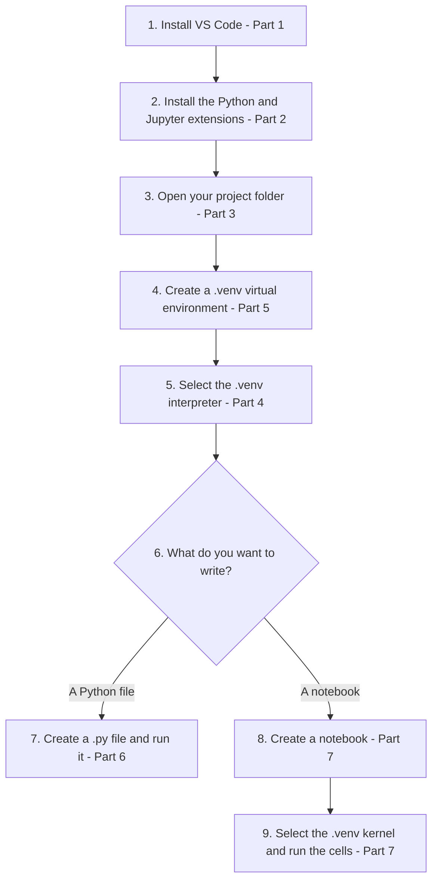
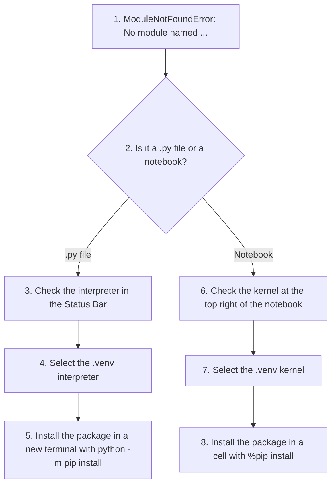

# Chapter 1: Python and Jupyter in VS Code (Part 2)

The table below gives you direct access to the course resources: (1) the full repository on GitHub, (2) interactive labs in Google Colab, (3) VS Code for working on your own computer, and (4) Jupyter Notebook for running notebooks through a local server.

| Source                                                                                                                                                                              | Run (Cloud)                                                                                                                                       | Local IDE                                                                                                                                                                    | Notebook                                                                                                                                                       |
| ----------------------------------------------------------------------------------------------------------------------------------------------------------------------------------- | ------------------------------------------------------------------------------------------------------------------------------------------------- | ---------------------------------------------------------------------------------------------------------------------------------------------------------------------------- | -------------------------------------------------------------------------------------------------------------------------------------------------------------- |
| [](https://github.com/ag999git/001-Python-book-2026) | [](../colab-nb) | [](https://code.visualstudio.com/) | [](https://jupyter.org/) |

**About this page**

This page goes with Chapter 1 of the book, *Python Basics*, and continues from **VS Code Part 1**. Part 1 explained how to install VS Code, find your way around its window, run a script and use the debugger. This page brings everything together into one **complete setup on Windows**: VS Code, Python and Jupyter notebooks working side by side.

Here is what you will find on this page:

* a quick recap of installing VS Code and the extensions you need,
* how to open a project folder and choose the right **Python interpreter**,
* how to create a **virtual environment** for a project, and why it helps,
* how to create and run a Python file,
* how to create and run **Jupyter notebooks inside VS Code**, and how to choose the notebook's **kernel**,
* how to open Jupyter in the browser from VS Code's terminal,
* the most common problems and how to fix them, and a final checklist.

Why does this matter? In this book you will write both ordinary Python files (`.py`) and notebooks (`.ipynb`). With the setup on this page you can do both in one program, using one project folder and the same set of installed packages. Getting this right once, at the start, saves a lot of confusion later, especially the common "I installed the package but Python cannot find it" problem.

## Table of Contents

* [Key Words Used on This Page](#key-words-used-on-this-page)
* [Part 1: Install VS Code](#part-1-install-vs-code)
  * [Step 1: Download VS Code](#step-1-download-vs-code)
  * [Step 2: Install VS Code](#step-2-install-vs-code)
* [Part 2: Install Required Extensions](#part-2-install-required-extensions)
  * [Step 1: Open the Extensions View](#step-1-open-the-extensions-view)
  * [Step 2: Install the Python Extension](#step-2-install-the-python-extension)
  * [Step 3: Install the Jupyter Extension](#step-3-install-the-jupyter-extension)
* [Part 3: Open Your Project Folder](#part-3-open-your-project-folder)
* [Part 4: Select the Correct Python Interpreter](#part-4-select-the-correct-python-interpreter)
  * [Step 1: Open the Command Palette](#step-1-open-the-command-palette)
  * [Step 2: Type the Command](#step-2-type-the-command)
  * [Step 3: Choose the Correct Interpreter](#step-3-choose-the-correct-interpreter)
  * [Step 4: Check the Status Bar](#step-4-check-the-status-bar)
* [Part 5: Create a Virtual Environment (Recommended)](#part-5-create-a-virtual-environment-recommended)
  * [Option A: Let VS Code Create It](#option-a-let-vs-code-create-it)
  * [Option B: Create It in the Terminal](#option-b-create-it-in-the-terminal)
  * [Step 5: Select the venv as the Interpreter](#step-5-select-the-venv-as-the-interpreter)
* [Part 6: Create a Python File in VS Code](#part-6-create-a-python-file-in-vs-code)
  * [Checking Which Python Runs Your Code](#checking-which-python-runs-your-code)
* [Part 7: Jupyter Notebooks Inside VS Code](#part-7-jupyter-notebooks-inside-vs-code)
  * [Option A: Create a New Notebook](#option-a-create-a-new-notebook)
  * [Option B: Open an Existing Notebook](#option-b-open-an-existing-notebook)
  * [Selecting the Jupyter Kernel (Important)](#selecting-the-jupyter-kernel-important)
  * [Running Notebook Cells](#running-notebook-cells)
  * [Checking the Kernel from Inside a Notebook](#checking-the-kernel-from-inside-a-notebook)
* [Part 8: Launch Jupyter in the Browser (Optional)](#part-8-launch-jupyter-in-the-browser-optional)
* [Part 9: Common Problems and Fixes](#part-9-common-problems-and-fixes)
  * [VS Code Shows the Wrong Python Version](#vs-code-shows-the-wrong-python-version)
  * [Jupyter Cannot Find the Kernel](#jupyter-cannot-find-the-kernel)
  * [Notebook Inside VS Code Uses the Wrong Environment](#notebook-inside-vs-code-uses-the-wrong-environment)
  * [PowerShell Says "Running Scripts Is Disabled on This System"](#powershell-says-running-scripts-is-disabled-on-this-system)
  * [ModuleNotFoundError Even Though I Installed the Package](#modulenotfounderror-even-though-i-installed-the-package)
  * [The .venv Folder Does Not Appear in the Interpreter List](#the-venv-folder-does-not-appear-in-the-interpreter-list)
* [Part 10: Summary Checklist](#part-10-summary-checklist)
* [Setup Complete](#setup-complete)

## Key Words Used on This Page

A few words come up again and again on this page. Here they are in plain language:

| Word | What it means |
| ---- | ------------- |
| **Interpreter** | The Python program that actually runs your code (a file called `python.exe` on Windows). You may have more than one on your computer. |
| **Virtual environment** | A private folder, usually called `.venv`, inside your project. It has its own copy of Python's settings and its own installed packages, kept separate from other projects. See the official [venv documentation](https://docs.python.org/3/library/venv.html). |
| **Package** | Extra code that you install with `pip`, such as `numpy` or `pandas`. |
| **Kernel** | The program that runs the code in a **notebook**. For Python notebooks it is a Python interpreter together with a small package called `ipykernel`. (The Jupyter pages in this chapter explain kernels in more detail.) |
| **Command Palette** | The search box for every VS Code command, opened with **Ctrl + Shift + P**. |

The key idea: **a `.py` file runs with the interpreter you select, and a notebook runs with the kernel you select.** Both should normally point to the same Python, usually your project's `.venv`.

The flowchart below shows the whole setup. Each part is explained in the sections that follow.



[Back to the Table of Contents](#table-of-contents)

## Part 1: Install VS Code

The full installation, with every screen explained, is given in **VS Code Part 1**. Here is a short recap.

[Back to the Table of Contents](#table-of-contents)

### Step 1: Download VS Code

1. Go to: [https://code.visualstudio.com](https://code.visualstudio.com)
2. Click **Download for Windows** (the blue button).

[Back to the Table of Contents](#table-of-contents)

### Step 2: Install VS Code

1. Double-click the downloaded file, `VSCodeUserSetup-x64-xxxx.exe`.
2. Accept the License Agreement, then click **Next**.
3. Keep the suggested install folder and Start Menu folder, clicking **Next** each time.
4. Important: on the **Select Additional Tasks** screen, enable these:
   * Add "Open with Code" action to Windows Explorer **file** context menu
   * Add "Open with Code" action to Windows Explorer **directory** (folder) context menu
   * Add to `PATH` (this lets you open VS Code by typing `code` in a command window)
5. Click **Next**, then **Install**.
6. Click **Finish**.

VS Code will launch.

You also need **Python** itself, because VS Code does not include it. How to install Python is explained in VS Code Part 1, in the section "Install Python".

[Back to the Table of Contents](#table-of-contents)

## Part 2: Install Required Extensions

### Step 1: Open the Extensions View

Click the **Extensions** icon in the Activity Bar on the left (it looks like four squares), or press:

```text
Ctrl + Shift + X
```

[Back to the Table of Contents](#table-of-contents)

### Step 2: Install the Python Extension

In the search box, type:

```text
Python
```

Install:

* **Python** - by **Microsoft** (blue and yellow Python logo)

This one extension also installs **Pylance** (smart auto-complete) and **Python Debugger** for you.

[Back to the Table of Contents](#table-of-contents)

### Step 3: Install the Jupyter Extension

Search for:

```text
Jupyter
```

Install:

* **Jupyter** - by **Microsoft** (orange circular logo)

This lets you open and run `.ipynb` notebooks inside VS Code. It may install a few small helper extensions along with it.

Always check that the publisher is **Microsoft** before you click Install, because other extensions with similar names exist.

[Back to the Table of Contents](#table-of-contents)

## Part 3: Open Your Project Folder

You must open a **folder**, not individual files. VS Code uses the open folder to find your files, to start the terminal in the right place, and to find the project's virtual environment.

Steps:

1. Click **File > Open Folder...**
2. Browse to your project folder, for example:

```text
C:\python-projects\my_project
```

(Create the folder first in File Explorer if it does not exist yet. Avoid spaces and special characters in folder names.)

3. Click **Select Folder**.
4. If VS Code asks "Do you trust the authors of the files in this folder?", click **Yes, I trust the authors** for your own folders.

Your folder now appears in the **Explorer** on the left.

[Back to the Table of Contents](#table-of-contents)

## Part 4: Select the Correct Python Interpreter

This is the most important step. If VS Code uses a different Python from the one where your packages are installed, you will get confusing errors such as `ModuleNotFoundError`.

If you are going to use a virtual environment (recommended), **create it first** (Part 5), and then come back to this step to select it. If you use Part 5's Option A, VS Code selects it for you.

[Back to the Table of Contents](#table-of-contents)

### Step 1: Open the Command Palette

```text
Ctrl + Shift + P
```

[Back to the Table of Contents](#table-of-contents)

### Step 2: Type the Command

```text
Python: Select Interpreter
```

Click the option when it appears. (You do not need to type all of it; `select interp` is usually enough.)

[Back to the Table of Contents](#table-of-contents)

### Step 3: Choose the Correct Interpreter

VS Code shows a list of the Pythons it has found. Pick one of:

* **Python 3.x.x ('.venv')** - the virtual environment inside your project. Choose this if you have one; it is usually marked **Recommended**.
* **Python 3.x.x 64-bit** - your main Python installation, if you are not using a virtual environment.

If the one you want is not in the list, choose **Enter interpreter path...** and browse to its `python.exe`. For a project virtual environment that is `.venv\Scripts\python.exe` inside your project folder.

[Back to the Table of Contents](#table-of-contents)

### Step 4: Check the Status Bar

The selected interpreter now shows in the **bottom-right corner** of VS Code, in the Status Bar, whenever a Python file is open. For example:

```text
3.14.7 ('.venv': venv)
```

You can click it at any time to change the interpreter. VS Code remembers the choice separately for each project folder.

[Back to the Table of Contents](#table-of-contents)

## Part 5: Create a Virtual Environment (Recommended)

A **virtual environment** keeps each project's packages separate. If one project needs an old version of a package and another needs a new one, they will not get in each other's way. It also makes it easy to start afresh: just delete the `.venv` folder and create it again.

There are two ways to create one. Option A is easier; Option B shows what happens behind the scenes, and works outside VS Code too.

[Back to the Table of Contents](#table-of-contents)

### Option A: Let VS Code Create It

1. Press **Ctrl + Shift + P** and run **Python: Create Environment**.
2. Choose **Venv**.
3. Choose the Python installation to base it on (your main Python 3).
4. If VS Code offers to install packages from a `requirements.txt` file, you can skip this for now.
5. VS Code creates a `.venv` folder in your project and **selects it as the interpreter automatically**. A notification in the bottom-right corner shows when it has finished.

[Back to the Table of Contents](#table-of-contents)

### Option B: Create It in the Terminal

#### Step 1: Open the VS Code Terminal

From the top menu:

```text
Terminal > New Terminal
```

The terminal opens at the bottom, already inside your project folder.

[Back to the Table of Contents](#table-of-contents)

#### Step 2: Create the venv

```text
python -m venv .venv
```

Here `-m venv` tells Python to run its built-in `venv` tool, and `.venv` is the name of the new folder. After a few seconds, a folder named `.venv` appears in the Explorer on the left. VS Code may also ask "We noticed a new environment has been created. Do you want to select it for the workspace folder?" Click **Yes**.

[Back to the Table of Contents](#table-of-contents)

#### Step 3: Activate the venv

Activating makes this terminal use the Python and pip from `.venv`.

In **PowerShell** (the default terminal in VS Code on Windows):

```text
.\.venv\Scripts\Activate.ps1
```

In **Command Prompt**:

```text
.venv\Scripts\activate
```

The prompt now starts with `(.venv)`. In PowerShell it looks like:

```text
(.venv) PS C:\python-projects\my_project>
```

and in Command Prompt:

```text
(.venv) C:\python-projects\my_project>
```

If PowerShell says that "running scripts is disabled on this system", see [Part 9](#part-9-common-problems-and-fixes).

Once `.venv` is selected as the interpreter (Part 4), VS Code usually activates it automatically in every new terminal, so you rarely need to do this by hand.

[Back to the Table of Contents](#table-of-contents)

#### Step 4: Install Packages in the venv

With the environment active, install the packages you need. For notebooks inside VS Code, you only need `ipykernel`:

```text
pip install ipykernel
```

If you also want to open Jupyter **in the browser** (Part 8), install these as well:

```text
pip install notebook jupyterlab
```

Or all three in one command:

```text
pip install notebook jupyterlab ipykernel
```

These packages go **only** into `.venv`, not into your main Python.

[Back to the Table of Contents](#table-of-contents)

### Step 5: Select the venv as the Interpreter

If VS Code did not select it for you, do it now: **Ctrl + Shift + P**, then **Python: Select Interpreter**, then choose the **('.venv')** entry (see [Part 4](#part-4-select-the-correct-python-interpreter)).

[Back to the Table of Contents](#table-of-contents)

## Part 6: Create a Python File in VS Code

1. In the Explorer (left), move the mouse over your folder name and click the **New File** icon (a sheet of paper with a plus sign).
2. Name it:

```text
test.py
```

3. Add code:

```python
print("Hello from VS Code!")
```

4. Run it using the **Run** button (a triangle) at the top right of the editor, OR press:

```text
Ctrl + F5
```

The output appears in the Terminal at the bottom:

```text
Hello from VS Code!
```

[Back to the Table of Contents](#table-of-contents)

### Checking Which Python Runs Your Code

Here is a more useful test. Replace the contents of `test.py` with the script below. It tells you exactly which Python is running your code, and whether it is your virtual environment.

```python
# test.py - check which Python is running this code
import sys

# Step 1 - Show the version of Python
print("Step 1 - Python version:", sys.version.split()[0])

# Step 2 - Show the full path of the python.exe being used
print("Step 2 - Python being used:", sys.executable)

# Step 3 - Check whether a virtual environment is active
# (inside a venv, sys.prefix points to the venv folder, while
#  sys.base_prefix still points to the main Python installation)
print("Step 3 - Inside a virtual environment?", sys.prefix != sys.base_prefix)
```

Run it. With the `.venv` interpreter selected, the output on Windows looks like this (your version number and folder will be different):

```text
Step 1 - Python version: 3.14.7
Step 2 - Python being used: C:\python-projects\my_project\.venv\Scripts\python.exe
Step 3 - Inside a virtual environment? True
```

If Step 2 shows a path that is **not** inside `.venv`, and Step 3 says `False`, VS Code is using your main Python. Select the `.venv` interpreter as shown in [Part 4](#part-4-select-the-correct-python-interpreter) and run it again.

[Back to the Table of Contents](#table-of-contents)

## Part 7: Jupyter Notebooks Inside VS Code

With the Jupyter extension installed, VS Code can open and run notebooks, just like Jupyter Notebook in the browser. The notebook is saved as an ordinary `.ipynb` file, so you can later open the same file in Jupyter Notebook or Google Colab.

[Back to the Table of Contents](#table-of-contents)

### Option A: Create a New Notebook

1. Press:

```text
Ctrl + Shift + P
```

2. Type:

```text
Create: New Jupyter Notebook
```

(Older versions call it **Jupyter: Create New Jupyter Notebook**. You can also use **File > New File...** and choose **Jupyter Notebook**.)

A new notebook opens, with a name like:

```text
Untitled-1.ipynb
```

3. Save it into your project folder with **Ctrl + S** and give it a proper name, such as `practice.ipynb`.

[Back to the Table of Contents](#table-of-contents)

### Option B: Open an Existing Notebook

Just click any `.ipynb` file in the Explorer sidebar.

[Back to the Table of Contents](#table-of-contents)

### Selecting the Jupyter Kernel (Important)

Before a notebook can run, you must tell VS Code which Python should run it - the **kernel**.

1. Look at the **top-right corner** of the notebook. It shows:

```text
Select Kernel
```

(or the name of the kernel that is already chosen).

2. Click it, then choose **Python Environments...**.
3. Choose the environment you want, for example:
   * **.venv (Python 3.x.x)** - your project's virtual environment (recommended), or
   * **Python 3.x.x** - your main Python installation.
4. If the chosen Python does not have `ipykernel` yet, VS Code shows a message such as "Running cells with '.venv' requires the ipykernel package". Click **Install**.

The name of the chosen kernel now appears in the top-right corner. VS Code remembers it for this notebook.

[Back to the Table of Contents](#table-of-contents)

### Running Notebook Cells

* Click the **Run** button (a triangle) to the left of the cell,
* OR press:

```text
Shift + Enter
```

(which runs the cell and moves to the next one). **Ctrl + Enter** runs the cell and stays on it. The **Run All** button at the top of the notebook runs every cell in order.

The output appears directly below the cell. The number in brackets next to the cell, such as `[1]`, shows the order in which cells were run.

To add a new cell, hover between two cells and click **+ Code** (for Python code) or **+ Markdown** (for text).

[Back to the Table of Contents](#table-of-contents)

### Checking the Kernel from Inside a Notebook

Put this code in a notebook cell and run it. It works just like the check in Part 6:

```python
# Step 1 - Find out which Python this notebook's kernel is using
import sys

print("Kernel Python version:", sys.version.split()[0])
print("Kernel Python path:", sys.executable)
```

On Windows, with the `.venv` kernel selected, the output looks like:

```text
Kernel Python version: 3.14.7
Kernel Python path: C:\python-projects\my_project\.venv\Scripts\python.exe
```

To install a package for the notebook, run this in a cell:

```python
%pip install numpy
```

`%pip` always installs into the notebook's own kernel, so the package is found straight away. (After installing, you may need to click **Restart** at the top of the notebook.)

[Back to the Table of Contents](#table-of-contents)

## Part 8: Launch Jupyter in the Browser (Optional)

You can also open the familiar browser version of Jupyter from VS Code's terminal. This needs `notebook` and/or `jupyterlab` installed (Part 5, Step 4) and the environment activated.

From the terminal:

**Jupyter Notebook:**

```text
jupyter notebook
```

**JupyterLab** (a more advanced interface with tabs and side panels):

```text
jupyter lab
```

Either command starts a local server and opens your browser at an address such as:

```text
http://localhost:8888/tree
```

(or `http://localhost:8888/lab` for JupyterLab). `localhost` means your own computer, and `8888` is the port number; the Jupyter pages of this chapter explain these in detail.

Keep the terminal open while you work. To stop the server, click in the terminal and press **Ctrl + C**.

[Back to the Table of Contents](#table-of-contents)

## Part 9: Common Problems and Fixes

The flowchart below helps you find the right fix for the most common problem: code that cannot find a package.



[Back to the Table of Contents](#table-of-contents)

### VS Code Shows the Wrong Python Version

Fix:

```text
Ctrl + Shift + P  ->  Python: Select Interpreter
```

Choose the Python version you want (or your project's `.venv`). Check the bottom-right corner of the Status Bar to confirm.

[Back to the Table of Contents](#table-of-contents)

### Jupyter Cannot Find the Kernel

This usually means the Python you want is missing the `ipykernel` package.

Fix, from a terminal with the environment activated:

```text
pip install ipykernel
```

Then, in the notebook, click **Select Kernel** again. If the environment still does not appear, click the refresh button at the top of the kernel list, or reload the window (**Ctrl + Shift + P**, then **Developer: Reload Window**).

If you also want the environment to appear as a kernel in **browser** Jupyter, register it under a name of your choice:

```text
python -m ipykernel install --user --name my_project --display-name "Python (my_project)"
```

Here `--name` is a short internal name, and `--display-name` is the name you will see in the kernel list.

[Back to the Table of Contents](#table-of-contents)

### Notebook Inside VS Code Uses the Wrong Environment

Activating an environment in the **terminal** does not change the notebook. Each notebook has its **own** kernel setting.

Fix:

1. Click the kernel name (or **Select Kernel**) at the top right of the notebook.
2. Choose **Python Environments...** and then your `.venv`.
3. If asked, install `ipykernel`.
4. Run the check from [Part 7](#part-7-jupyter-notebooks-inside-vs-code) to confirm.

If `.venv` does not appear in the list, make sure `ipykernel` is installed in it:

```text
.\.venv\Scripts\activate
pip install ipykernel
```

Then reload the window (**Developer: Reload Window**) or restart VS Code.

[Back to the Table of Contents](#table-of-contents)

### PowerShell Says "Running Scripts Is Disabled on This System"

PowerShell blocks the activation script by default on some computers.

Fix 1: Run this once in the PowerShell terminal, then open a new terminal:

```text
Set-ExecutionPolicy -Scope CurrentUser RemoteSigned
```

Fix 2: Switch the terminal to Command Prompt. Click the small arrow next to the **+** in the terminal panel and choose **Command Prompt**.

[Back to the Table of Contents](#table-of-contents)

### ModuleNotFoundError Even Though I Installed the Package

The package was installed into a different Python from the one running your code. Follow the flowchart at the start of this part. The safest way to install into the Python that VS Code is using is:

* for `.py` files: open a **new** terminal (so that `.venv` is activated) and run `python -m pip install <package>`,
* for notebooks: run `%pip install <package>` in a notebook cell.

[Back to the Table of Contents](#table-of-contents)

### The .venv Folder Does Not Appear in the Interpreter List

* Make sure you opened the **project folder** (Part 3), not just a file.
* Choose **Enter interpreter path...** and browse to `.venv\Scripts\python.exe`.
* Reload the window: **Ctrl + Shift + P**, then **Developer: Reload Window**.

[Back to the Table of Contents](#table-of-contents)

## Part 10: Summary Checklist

| Step | What to Do | Where it is explained |
| ---- | ---------- | --------------------- |
| 1 | Install VS Code (and Python) | Part 1 |
| 2 | Install the Python and Jupyter extensions | Part 2 |
| 3 | Open a folder (not just files) | Part 3 |
| 4 | Create a `.venv` virtual environment (and activate it in the terminal if needed) | Part 5 |
| 5 | Select the `.venv` Python interpreter | Part 4 |
| 6 | Install `ipykernel` (and `notebook`, `jupyterlab` for the browser) inside the venv | Part 5 |
| 7 | Create notebooks or scripts | Parts 6 and 7 |
| 8 | Select the correct kernel for each notebook | Part 7 |
| 9 | Run code, and check which Python is used | Parts 6 and 7 |

[Back to the Table of Contents](#table-of-contents)

## Setup Complete

You now have a fully working environment for Python and Jupyter inside VS Code on Windows. From here on, for each new project:

1. create a folder and open it in VS Code,
2. create a `.venv` (**Python: Create Environment**),
3. install the packages you need into it,
4. write `.py` files or notebooks, making sure the interpreter or kernel is the `.venv`.

[Back to the Table of Contents](#table-of-contents)

---


