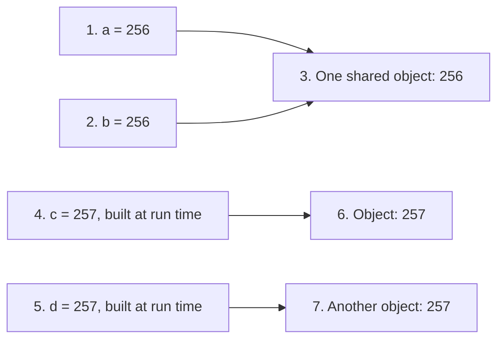
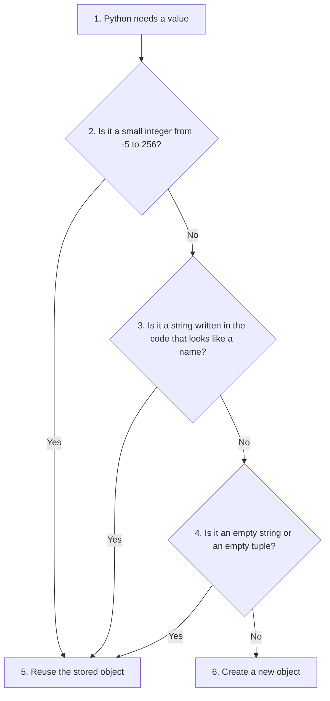
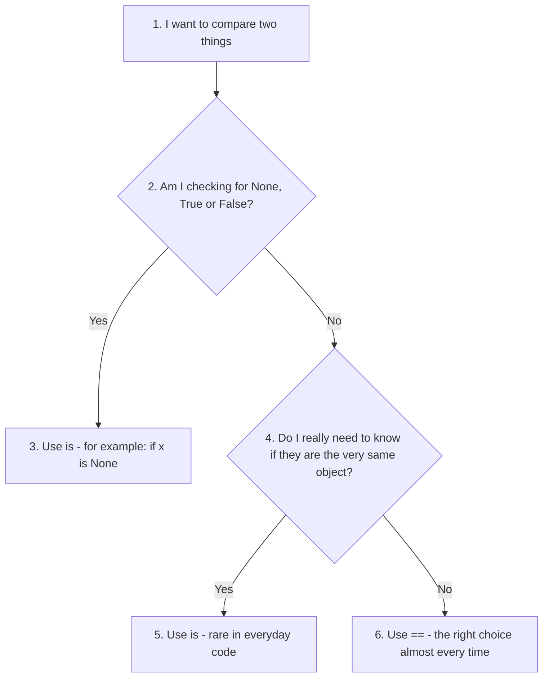

# Chapter 1: Interning in Python (Advanced Concept)

**About this page**

This page goes with Chapter 1 of the book, *Python Basics*. In the chapter you learned that a variable is a **name** that refers to a value, and you met the keywords `is` and `==`. This page looks at something that happens behind the scenes when you create values: **interning**. It explains why `is` sometimes gives surprising answers, and why you should almost always compare values with `==`.

Here is what you will find on this page:

* a short refresher on objects, **identity** and **value**, and on the difference between `is` and `==`,
* what interning is, where Python uses it, and why,
* the example script from the book, with the real outputs and an explanation of some surprising results,
* a more reliable demonstration script, with its output explained step by step,
* how to intern strings yourself with `sys.intern()`,
* the golden rule for using `is` and `==`, a decision flowchart, and some practice questions.

This is an **advanced** topic. You do not need it to write correct programs. But it explains puzzles that almost every Python learner meets sooner or later, such as "why is `a is b` True for 256 but False for 257?". If you find it hard on the first reading, skip it and come back later.

## Table of Contents

* [1. Objects, Identity and Value: A Quick Refresher](#1-objects-identity-and-value-a-quick-refresher)
* [2. What Is Interning](#2-what-is-interning)
* [3. Where Does Interning Happen](#3-where-does-interning-happen)
* [4. Why Does Python Do This](#4-why-does-python-do-this)
* [5. Example Script: How Interning Affects Identity and Equality Checks](#5-example-script-how-interning-affects-identity-and-equality-checks)
  * [5.1 The Output Depends on How You Run the Code](#51-the-output-depends-on-how-you-run-the-code)
  * [5.2 Why Examples 2 and 3 Change](#52-why-examples-2-and-3-change)
  * [5.3 Why Example 5 Is True](#53-why-example-5-is-true)
* [6. A More Reliable Demonstration](#6-a-more-reliable-demonstration)
  * [6.1 What the Output Shows, Step by Step](#61-what-the-output-shows-step-by-step)
* [7. Interning Strings Yourself with sys.intern()](#7-interning-strings-yourself-with-sysintern)
* [8. The Golden Rule for Comparing Values](#8-the-golden-rule-for-comparing-values)
* [9. Practice Questions with Answers](#9-practice-questions-with-answers)
    * [Question 1: What will this code print, and why?](#question-1-what-will-this-code-print-and-why)
    * [Question 2: Change 100 to 1000 in Question 1. What changes?](#question-2-change-100-to-1000-in-question-1-what-changes)
    * [Question 3: Why are lists never interned?](#question-3-why-are-lists-never-interned)
    * [Question 4: A friend writes `if name is "Asha":`. What would you tell them?](#question-4-a-friend-writes-if-name-is-asha-what-would-you-tell-them)
* [10. Summary](#10-summary)

## 1. Objects, Identity and Value: A Quick Refresher

Everything in Python is an **object**: a number, a string, a list, and so on. Each object lives somewhere in the computer's memory. A variable is just a **name** that points to an object. (See the official explanation of [objects, values and types](https://docs.python.org/3/reference/datamodel.html#objects-values-and-types).)

Every object has:

* an **identity** - which object it is. You can see it as a number with the built-in function `id()`. Two names with the same `id()` point to the very same object.
* a **value** - what it holds, for example `256` or `"hello"`.

Python has two ways of comparing:

| Operator | Question it asks | Compares | Example |
| -------- | ---------------- | -------- | ------- |
| `==` | "Do these have the **same value**?" | Values | `[1, 2] == [1, 2]` is `True` |
| `is` | "Are these the **very same object**?" | Identities | `[1, 2] is [1, 2]` is `False` (two separate lists) |

An everyday analogy: two copies of the same book have the same *content* (`==` is True), but they are two different *books* (`is` is False). If two friends are reading **one** book together, then it is the same book (`is` is True).

[Back to the Table of Contents](#table-of-contents)

## 2. What Is Interning

**Interning** is a memory-saving technique in which Python **reuses** certain immutable objects instead of creating a new object every time. (**Immutable** means the object can never be changed after it is created; numbers, strings and tuples are immutable, lists are not.)

Think of it like Python keeping a small **store of commonly used values**. When your program needs one of those values, Python hands out the object already in the store, instead of making a new one.

So when you create a new variable with one of those values, Python reuses the same object instead of creating a new object in memory. This improves:

1. **speed** - no time is spent making a new object, and comparing two identical objects is quick,
2. **memory use** - one object is shared instead of many copies.



In the picture, `a` and `b` point to **one** object, so `a is b` is `True`. But `c` and `d` point to **two different** objects that happen to hold the same value, so `c == d` is `True` while `c is d` is `False`. (Section 6 shows this with real code.)

A word of caution: interning is an **implementation detail** of CPython - the standard version of Python that you download from python.org. It is not part of the Python language rules, so the exact details can differ between Python versions, and between CPython and other versions of Python such as PyPy.

[Back to the Table of Contents](#table-of-contents)

## 3. Where Does Interning Happen

Python commonly interns:

1. **Small integers**, from **-5 to 256**. CPython creates these numbers once, when it starts, and always reuses them. (See the note in the [Python documentation on integers](https://docs.python.org/3/c-api/long.html#c.PyLong_FromLong).)
2. **Short strings that look like names**, especially identifiers (strings made only of letters, digits and underscores), for example `"hello"`, `"user"`, `"abc"`, when they are written directly in your code. Python also interns the names of your variables, functions and attributes.
3. **Empty immutable values**, such as the empty string `""` and the empty tuple `()`.

A few other objects exist only once in the whole program: `None`, `True` and `False`. These are called **singletons**, and they are the reason why `x is None` is the correct way to check for `None`.

| Kind of value | Shared (interned)? | Example |
| ------------- | ------------------ | ------- |
| Integer from -5 to 256 | Yes, always | `256` |
| Larger integer | No, not in general | `257`, `10000` |
| String written in the code that looks like a name | Yes | `"hello"`, `"user_1"` |
| String built while the program runs | No (unless you use `sys.intern()`) | `"".join(["hel", "lo"])` |
| Empty string, empty tuple | Yes | `""`, `()` |
| `None`, `True`, `False` | Yes, always (singletons) | `None` |
| List, dictionary, set | Never (they are mutable) | `[1, 2, 3]` |

The flowchart below shows, in simplified form, how CPython decides whether to reuse an object.



[Back to the Table of Contents](#table-of-contents)

## 4. Why Does Python Do This

Because:

1. **These values appear very often in programs.** Numbers such as 0, 1 and 100, and short names such as `"id"` or `"name"`, are used all the time.
2. **They never change (they are immutable).** Sharing a value is only safe if nobody can change it. If two variables shared one list and one of them added an item, the other would see the change too. With numbers and strings, that can never happen.
3. **Reusing them saves memory and speeds up comparisons.** Python itself uses interned strings for the names of variables, functions and attributes, and looks them up in dictionaries all the time. When two strings are the same object, Python can tell they are equal at once, without comparing them letter by letter.

[Back to the Table of Contents](#table-of-contents)

## 5. Example Script: How Interning Affects Identity and Equality Checks

The following example script shows how interning can affect the use of `is` and `==`.

```python
# Example 1: Small integer interning
a = 256
b = 256
print(a is b)  # True -> small integers are interned
print(a == b)  # True -> values are equal

# Example 2: Large integers (not interned by default)
num1 = 10000
num2 = 10000
print(num1 is num2)  # True or False -> depends on how the code is run (see below)
print(num1 == num2)  # True -> values are equal
# Explanation: 'is' checks for object identity, while '==' checks for value equality.

# Example 3: Interning does NOT affect ==, because the values
# are compared, not the object locations.
x = 1000000
y = 1000000
print(x is y)  # True or False -> depends on how the code is run (see below)
print(x == y)  # True -> values are equal

# Example 4: String interning
str1 = "hello"
str2 = "hello"
print(str1 is str2)  # True -> due to string interning
print(str1 == str2)  # True -> values are equal

# Example 5: A long string written as "a" * 1000
large_str1 = "a" * 1000
large_str2 = "a" * 1000
print(large_str1 is large_str2)  # True in CPython (see below), but do not rely on it
print(large_str1 == large_str2)  # True -> values are equal

# Example 6: Lists are not interned
list1 = [1, 2, 3]
list2 = [1, 2, 3]
print(list1 is list2)  # False -> different objects in memory
print(list1 == list2)  # True -> values are equal
```

[Back to the Table of Contents](#table-of-contents)

### 5.1 The Output Depends on How You Run the Code

This script gives **different results** depending on how it is run. Here are the real outputs from CPython (versions 3.10 to 3.13 all behave the same way).

Run as a **script file** (for example `python interning.py`, or the Run button in VS Code):

```text
True
True
True
True
True
True
True
True
True
True
False
True
```

Run in a **notebook** (Jupyter, Google Colab, or a notebook in VS Code) or typed line by line in the **interactive shell** (`>>>`):

```text
True
True
False
True
False
True
True
True
True
True
False
True
```

Side by side:

| Example | Test | Script file | Notebook or interactive shell |
| ------- | ---- | ----------- | ----------------------------- |
| 1 | `a is b` (256) | True | True |
| 2 | `num1 is num2` (10000) | **True** | **False** |
| 3 | `x is y` (1000000) | **True** | **False** |
| 4 | `str1 is str2` ("hello") | True | True |
| 5 | `large_str1 is large_str2` | True | True |
| 6 | `list1 is list2` | False | False |
| All | every `==` test | True | True |

Notice two things:

1. **Every `==` line prints `True`, however the code is run.** `==` compares values, and the values really are equal.
2. **Some `is` lines change** between a script and a notebook. That alone shows that `is` must not be used to compare numbers or strings.

[Back to the Table of Contents](#table-of-contents)

### 5.2 Why Examples 2 and 3 Change

Before running your code, Python first **compiles** it: it translates it into a simpler form called bytecode. (More about this in the glossary entry for [bytecode](https://docs.python.org/3/glossary.html#term-bytecode).) Numbers and strings written directly in the code are stored as **constants**.

* When a whole **script file** is compiled in one go, Python notices that `10000` appears twice and stores it only **once**. Both `num1` and `num2` then point to that one stored object, so `num1 is num2` is `True`. This is not interning; it is simply Python avoiding duplicate constants in one piece of compiled code.
* In a **notebook** or the **interactive shell**, each statement is compiled **separately**. The line `num1 = 10000` and the line `num2 = 10000` each get their own object, so `num1 is num2` is `False`.

So the result of `is` for large numbers depends on how your code happens to be compiled. That is exactly why it must not be relied on.

[Back to the Table of Contents](#table-of-contents)

### 5.3 Why Example 5 Is True

Python works out simple expressions such as `"a" * 1000` in advance, while compiling, and stores the result as a constant. (This is called **constant folding**.) The result is a string made only of letters, so it looks like a name, and Python interns it. Both variables therefore point to the same object.

This is why the original comment "False in some implementations" does not match what CPython actually does for this example. To see a long string that is **not** shared, the string has to be built while the program runs, as in Step 6 of the next script.

[Back to the Table of Contents](#table-of-contents)

## 6. A More Reliable Demonstration

The script below avoids the surprises of Section 5. It builds its values **while the program runs** (for example with `int("257")`), so the results are the same whether you run it as a script or in a notebook.

```python
import sys

# Step 1 - Small integers (-5 to 256) are cached: every 256 is the same object
a = int("256")          # int() builds the number while the program runs
b = int("256")
print("Step 1 - 256:  a == b ->", a == b, "| a is b ->", a is b)

# Step 2 - Just outside the cache, a new object is made each time
c = int("257")
d = int("257")
print("Step 2 - 257:  c == d ->", c == d, "| c is d ->", c is d)

# Step 3 - The same test at the lower end of the cache
e = int("-5")
f = int("-5")
g = int("-6")
h = int("-6")
print("Step 3 - -5:   e is f ->", e is f, "| -6: g is h ->", g is h)

# Step 4 - A string written in the code is interned automatically...
s1 = "hello"
# ...but a string built while the program runs is a new object
s2 = "".join(["hel", "lo"])
print("Step 4 - s1 == s2 ->", s1 == s2, "| s1 is s2 ->", s1 is s2)

# Step 5 - sys.intern() asks Python to use the interned copy
s3 = sys.intern(s2)
print("Step 5 - s1 is sys.intern(s2) ->", s1 is s3)

# Step 6 - A long string built at run time is not interned
n = 1000
long1 = "a" * n
long2 = "a" * n
print("Step 6 - long1 == long2 ->", long1 == long2, "| long1 is long2 ->", long1 is long2)

# Step 7 - Empty immutable values are shared
empty_str1 = str()              # an empty string
empty_str2 = "".join([])        # another empty string, made a different way
empty_tup1 = tuple()            # an empty tuple
empty_tup2 = tuple([])          # another empty tuple
print("Step 7 - empty strings same? ->", empty_str1 is empty_str2,
      "| empty tuples same? ->", empty_tup1 is empty_tup2)

# Step 8 - Lists are mutable, so they are never shared like this
list1 = [1, 2, 3]
list2 = [1, 2, 3]
print("Step 8 - list1 == list2 ->", list1 == list2, "| list1 is list2 ->", list1 is list2)

# Step 9 - id() shows each object's identity number; equal ids mean the same object
print("Step 9 - same id for 256?", id(a) == id(b), "| same id for 257?", id(c) == id(d))
```

Output (the same in a script, a notebook and the interactive shell, on CPython 3.10 to 3.13):

```text
Step 1 - 256:  a == b -> True | a is b -> True
Step 2 - 257:  c == d -> True | c is d -> False
Step 3 - -5:   e is f -> True | -6: g is h -> False
Step 4 - s1 == s2 -> True | s1 is s2 -> False
Step 5 - s1 is sys.intern(s2) -> True
Step 6 - long1 == long2 -> True | long1 is long2 -> False
Step 7 - empty strings same? -> True | empty tuples same? -> True
Step 8 - list1 == list2 -> True | list1 is list2 -> False
Step 9 - same id for 256? True | same id for 257? False
```

[Back to the Table of Contents](#table-of-contents)

### 6.1 What the Output Shows, Step by Step

1. **Step 1:** 256 is inside the small-integer cache (-5 to 256), so both variables get the one stored object.
2. **Step 2:** 257 is just outside the cache. Each `int("257")` makes a new object. The values are equal, but the objects are different.
3. **Step 3:** the same boundary at the other end: -5 is cached, -6 is not.
4. **Step 4:** `"hello"` written in the code is interned, but the same text built with `join()` while the program runs is a separate object.
5. **Step 5:** `sys.intern()` returns the interned copy of the string, which is the same object as `s1`.
6. **Step 6:** a long string built at run time is not interned, so two equal strings are two objects. (Compare with Example 5 in Section 5.)
7. **Step 7:** there is only ever one empty string and one empty tuple.
8. **Step 8:** lists are never shared this way, because they can be changed.
9. **Step 9:** `id()` confirms Steps 1 and 2: the two 256 variables have the same identity number, the two 257 variables do not.

In every step, `==` gives the "common-sense" answer. Only `is` changes, depending on Python's internal choices.

[Back to the Table of Contents](#table-of-contents)

## 7. Interning Strings Yourself with sys.intern()

Python lets you intern a string on purpose with [`sys.intern()`](https://docs.python.org/3/library/sys.html#sys.intern). This can save memory when a program handles **the same strings many times**, for example the same few city names or column names repeated in a large file. It can also make dictionary look-ups a little faster.

```python
import sys

# Step 1 - Build two equal strings while the program runs
city1 = "".join(["New ", "Delhi"])
city2 = "".join(["New ", "Delhi"])
print("Step 1 - Same object before interning?", city1 is city2)

# Step 2 - Intern both; Python returns one shared object
city1 = sys.intern(city1)
city2 = sys.intern(city2)
print("Step 2 - Same object after interning?", city1 is city2)
print("Step 3 - Still equal in value?", city1 == city2)
```

Output:

```text
Step 1 - Same object before interning? False
Step 2 - Same object after interning? True
Step 3 - Still equal in value? True
```

Note that `"New Delhi"` contains a space, so Python would not intern it automatically; `sys.intern()` does it anyway. For beginners, `sys.intern()` is rarely needed. It is a tool for programs that handle very large amounts of text.

[Back to the Table of Contents](#table-of-contents)

## 8. The Golden Rule for Comparing Values

* Use **`==`** to check whether two things have the **same value**. This is what you want almost every time: numbers, strings, lists, and so on.
* Use **`is`** only to check whether something is **the very same object**. In everyday code this mainly means checking for `None`: `if result is None:`. (The PEP 8 style guide recommends this; see the Python Basics page of this chapter.)
* **Never** use `is` to compare numbers or strings. As Section 5 showed, the answer can change depending on how the code is run.

Python itself warns you about this mistake. Save this as a file, for example `check.py`, and run it:

```python
x = 1000
print(x is 1000)
```

On Python 3.12 and later you see:

```text
...\check.py:2: SyntaxWarning: "is" with 'int' literal. Did you mean "=="?
  print(x is 1000)
True
```

(The start of the first line shows the folder of your file and the line number, here line 2.)

(Python 3.8 to 3.11 show a similar message: `SyntaxWarning: "is" with a literal. Did you mean "=="?`.) Python warns you even though the answer happens to be `True` here, because it could just as well be `False` in another situation.

The flowchart below sums up the rule.



[Back to the Table of Contents](#table-of-contents)

## 9. Practice Questions with Answers

These extra questions let you check your understanding of this page.

[Back to the Table of Contents](#table-of-contents)

#### Question 1: What will this code print, and why?

```python
a = int("100")
b = int("100")
print(a == b, a is b)
```

**Answer**

1. `a == b` compares values. Both are 100, so it is `True`.
2. 100 is between -5 and 256, so it comes from the small-integer cache. Both names point to the same stored object, so `a is b` is also `True`.

```text
True True
```

[Back to the Table of Contents](#table-of-contents)

#### Question 2: Change 100 to 1000 in Question 1. What changes?

**Answer**

1. `a == b` is still `True`, because the values are equal.
2. 1000 is outside the cache, and `int("1000")` builds a new object each time, so `a is b` becomes `False`.

```text
True False
```

[Back to the Table of Contents](#table-of-contents)

#### Question 3: Why are lists never interned?

**Answer**

Because lists are **mutable** (they can be changed). If two variables shared one list, changing it through one variable would also change it for the other, which would be a nasty surprise. Interning is only safe for immutable objects such as numbers, strings and tuples.

[Back to the Table of Contents](#table-of-contents)

#### Question 4: A friend writes `if name is "Asha":`. What would you tell them?

**Answer**

1. `is` checks whether two things are the same object, not whether they hold the same text.
2. If `name` came from `input()` or was built while the program runs, it will usually be a **different** object from the `"Asha"` written in the code, so the test can be `False` even when the user typed `Asha`.
3. Python even shows a `SyntaxWarning` for this line.
4. The correct test is `if name == "Asha":`.

[Back to the Table of Contents](#table-of-contents)

## 10. Summary

| Idea | Key point |
| ---- | --------- |
| Identity vs value | `is` compares identity (the same object); `==` compares value |
| Interning | Python reuses some immutable objects to save memory and time |
| What is interned | Integers from -5 to 256, name-like strings written in the code, empty string and tuple; `None`, `True`, `False` are always single |
| Not interned | Larger integers, strings built at run time (unless `sys.intern()` is used), lists and other mutable objects |
| Surprises | Large numbers written twice in a script may still be the same object, because of how the code is compiled; in notebooks they usually are not |
| Golden rule | Use `==` to compare values; use `is` only for `None` (and similar singletons) |

[Back to the Table of Contents](#table-of-contents)

---


