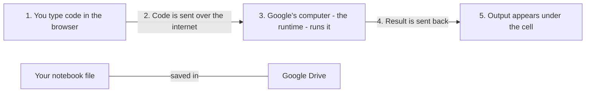
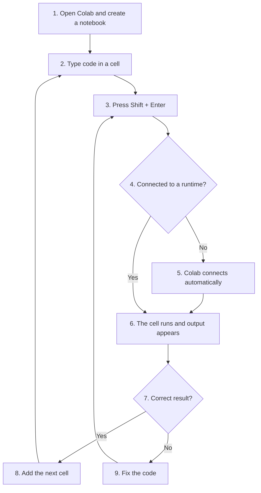
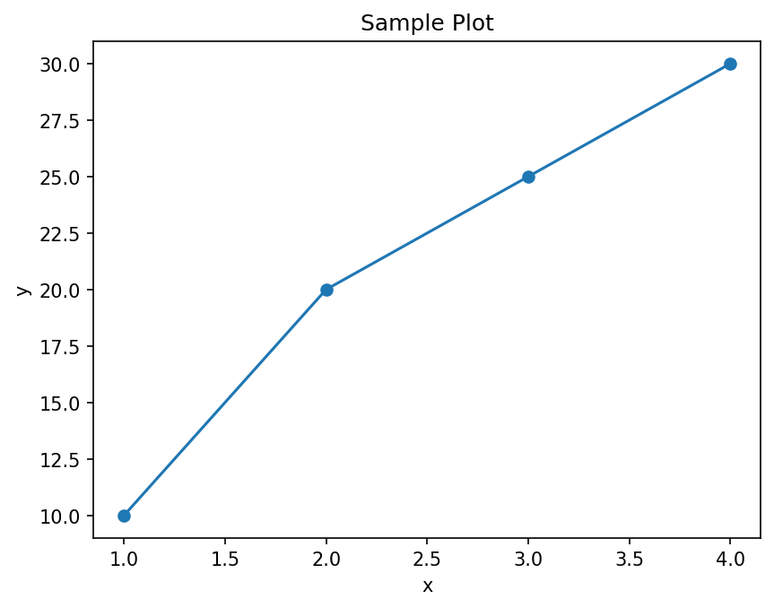

# Chapter 1: Getting Started with Google Colab

You can open a working Google Colab notebook for this chapter by clicking the badge below.

[](https://colab.research.google.com/github/ag999git/001-Python-book-2026/blob/main/colab-nb/01-10-python-basics.ipynb)

**About this page**

This page goes with Chapter 1 of the book, *Python Basics*. The earlier pages of this chapter showed two ways of running Python on your own computer: Jupyter Notebook and VS Code. This page introduces a third way that needs **no installation at all**: **Google Colab**. It runs Python notebooks inside your web browser, on Google's computers.

Here is what you will find on this page:

* **A beginner-friendly guide**: what Colab is, how to open it, how to create and run a notebook, install libraries, work with files and Google Drive, and use a GPU.
* **Frequently asked questions** about Colab, including how it compares with Jupyter Notebook and VS Code.
* **A quick cheatsheet** of the commands you will use most often.
* **Fifteen short beginner scripts** you can paste into Colab and run, each with its output.
* **A suggested beginner syllabus** for learning Python with Colab.

Why does this matter? Colab is the easiest way to start writing Python straight away, on any computer, even one where you are not allowed to install software. The interactive labs that go with this book are Colab notebooks, so everything on this page will help you use them. And because Colab uses the same notebook format (`.ipynb`) as Jupyter, what you learn here also works in Jupyter Notebook and in VS Code.

## Table of Contents

* [1. What Is Google Colab](#1-what-is-google-colab)
* [2. How to Access Google Colab](#2-how-to-access-google-colab)
  * [Method 1: Open the Colab Website (Recommended)](#method-1-open-the-colab-website-recommended)
  * [Method 2: From Google Drive](#method-2-from-google-drive)
  * [Method 3: Open a Notebook from GitHub](#method-3-open-a-notebook-from-github)
* [3. How to Create a New Notebook](#3-how-to-create-a-new-notebook)
* [4. Basic Interface Overview](#4-basic-interface-overview)
* [5. How to Run Code](#5-how-to-run-code)
* [6. How to Install Libraries](#6-how-to-install-libraries)
* [7. Uploading and Downloading Files](#7-uploading-and-downloading-files)
  * [Upload a File from Your Computer](#upload-a-file-from-your-computer)
  * [Download a File to Your Computer](#download-a-file-to-your-computer)
* [8. Connecting to Google Drive](#8-connecting-to-google-drive)
* [9. Using GPU and TPU in Colab](#9-using-gpu-and-tpu-in-colab)
  * [Turn On a GPU or TPU](#turn-on-a-gpu-or-tpu)
  * [Check If a GPU Is Available](#check-if-a-gpu-is-available)
* [10. FAQs on Google Colab](#10-faqs-on-google-colab)
* [11. Summary](#11-summary)
* [12. Google Colab Quick Cheatsheet](#12-google-colab-quick-cheatsheet)
  * [12.1 Running Code](#121-running-code)
  * [12.2 Installing Python Libraries](#122-installing-python-libraries)
  * [12.3 Uploading and Downloading Files](#123-uploading-and-downloading-files)
  * [12.4 Working with Google Drive](#124-working-with-google-drive)
  * [12.5 Saving Output Files](#125-saving-output-files)
  * [12.6 Displaying Plots](#126-displaying-plots)
  * [12.7 Importing Common Libraries](#127-importing-common-libraries)
  * [12.8 System Commands](#128-system-commands)
  * [12.9 Magic Commands](#129-magic-commands)
  * [12.10 GPU and TPU Usage](#1210-gpu-and-tpu-usage)
  * [12.11 Clearing Variables and Restarting](#1211-clearing-variables-and-restarting)
  * [12.12 Markdown Cheatsheet for Text Cells](#1212-markdown-cheatsheet-for-text-cells)
* [13. Beginner Python Scripts for Google Colab](#13-beginner-python-scripts-for-google-colab)
  * [13.1 Print a Message (Hello World)](#131-print-a-message-hello-world)
  * [13.2 Variables and Basic Math](#132-variables-and-basic-math)
  * [13.3 Getting Input from the User](#133-getting-input-from-the-user)
  * [13.4 If-Else Conditions](#134-if-else-conditions)
  * [13.5 Simple For Loop](#135-simple-for-loop)
  * [13.6 While Loop Example](#136-while-loop-example)
  * [13.7 List Basics: Create and Access Elements](#137-list-basics-create-and-access-elements)
  * [13.8 Looping Through a List](#138-looping-through-a-list)
  * [13.9 Functions: Creating and Using Them](#139-functions-creating-and-using-them)
  * [13.10 Function That Returns a Value](#1310-function-that-returns-a-value)
  * [13.11 Dictionaries: Key-Value Pairs](#1311-dictionaries-key-value-pairs)
  * [13.12 Basic String Operations](#1312-basic-string-operations)
  * [13.13 Using a for Loop with range()](#1313-using-a-for-loop-with-range)
  * [13.14 Writing a Simple Calculator](#1314-writing-a-simple-calculator)
  * [13.15 Using Try-Except (Error Handling)](#1315-using-try-except-error-handling)
  * [13.16 What These Scripts Teach](#1316-what-these-scripts-teach)
* [14. Beginner Syllabus for Python and Google Colab](#14-beginner-syllabus-for-python-and-google-colab)
  * [Module 1: Introduction to Google Colab](#module-1-introduction-to-google-colab)
  * [Module 2: Python Basics](#module-2-python-basics)
  * [Module 3: Control Flow (if, elif, else)](#module-3-control-flow-if-elif-else)
  * [Module 4: Loops (for and while)](#module-4-loops-for-and-while)
  * [Module 5: Data Structures](#module-5-data-structures)
  * [Module 6: Functions](#module-6-functions)
  * [Module 7: Error Handling (try-except)](#module-7-error-handling-try-except)
  * [Module 8: Working with Files in Colab](#module-8-working-with-files-in-colab)
  * [Module 9: Using Google Drive in Colab](#module-9-using-google-drive-in-colab)
  * [Module 10: Basic Data Visualization (No Extra Installation)](#module-10-basic-data-visualization-no-extra-installation)
  * [Module 11: Introduction to the GPU in Colab](#module-11-introduction-to-the-gpu-in-colab)
  * [Module 12: Mini Projects (Beginner Level)](#module-12-mini-projects-beginner-level)
  * [End-of-Course Outcomes](#end-of-course-outcomes)
  * [Recommended Progression (Suggested Weekly Plan)](#recommended-progression-suggested-weekly-plan)
  * [Happy Learning](#happy-learning)

## 1. What Is Google Colab

Google Colab (short for *Colaboratory*) is a free, cloud-based Jupyter Notebook environment provided by Google. It lets you write and run Python code **in your browser**, without installing Python on your computer.

* It is a **browser-based Jupyter Notebook** environment. (A notebook is a document that mixes code, its output and explanations; see the Jupyter Notebook page of this chapter.)
* It runs entirely in the **cloud**, which simply means on Google's computers (servers) rather than on yours.
* It needs **no installation** on your computer.
* It is great for:
  * learning Python,
  * data science,
  * machine learning,
  * running experiments that need a GPU or TPU (special chips that make heavy calculations much faster; see [Section 9](#9-using-gpu-and-tpu-in-colab)).

You only need a web browser (Google Chrome works best, but any modern browser will do), an internet connection, and a **Google account** (the same account you use for Gmail).

The picture below shows how Colab works. Your browser only shows the notebook; the code runs on Google's computer and the result comes back to you.



The Google computer that runs your code is called the **runtime**. It is lent to you for a while and then taken back. This is why your notebook (saved in Google Drive) is permanent, but anything stored on the runtime itself is temporary. This idea comes up again and again on this page.

[Back to the Table of Contents](#table-of-contents)

## 2. How to Access Google Colab

### Method 1: Open the Colab Website (Recommended)

Go to: [https://colab.research.google.com](https://colab.research.google.com)

Sign in with your Google account if asked. A window opens that lets you create a new notebook or open a recent one.

[Back to the Table of Contents](#table-of-contents)

### Method 2: From Google Drive

1. Open [drive.google.com](https://drive.google.com).
2. Click **New**.
3. Click **More**.
4. Choose **Google Colaboratory**.

If you do not see **Google Colaboratory** under **More**, click **Connect more apps**, search for **Colaboratory**, and install it. It will then appear in the list.

[Back to the Table of Contents](#table-of-contents)

### Method 3: Open a Notebook from GitHub

1. Open any GitHub repository page that shows a `.ipynb` notebook.
2. Click the **Open in Colab** button, if the page has one (like the badge at the top of this page).
3. OR change the web address by hand. Replace `github.com/` with `colab.research.google.com/github/`. For example:

```text
https://github.com/ag999git/001-Python-book-2026/blob/main/colab-nb/01-10-python-basics.ipynb
```

becomes:

```text
https://colab.research.google.com/github/ag999git/001-Python-book-2026/blob/main/colab-nb/01-10-python-basics.ipynb
```

(Some people use a shortcut service that works by changing `github.com` to `githubtocolab.com`. It does the same job, but it is run by a third party, not by Google.)

A notebook opened from GitHub is **not** saved in your Google Drive. To keep your changes, choose **File > Save a copy in Drive**.

[Back to the Table of Contents](#table-of-contents)

## 3. How to Create a New Notebook

From the Colab start page, click **New notebook**. Or, from any open notebook, click **File > New notebook in Drive**.

A new notebook opens with the first code cell ready. Its file name will look like:

```text
Untitled0.ipynb
```

You can rename it by clicking on the file name at the top left of the page. Keep the `.ipynb` ending.

New notebooks are saved automatically in a folder called **Colab Notebooks** in your Google Drive.

[Back to the Table of Contents](#table-of-contents)

## 4. Basic Interface Overview

Google Colab provides:

* **Code cells**, for Python code.
* **Text cells**, for explanations. They use **Markdown**, a simple way of formatting text (see [Section 12.12](#1212-markdown-cheatsheet-for-text-cells)).
* A **Run button** (a circle with a triangle, to the left of each code cell) to run that cell.
* A **Runtime menu**, for controlling the runtime - the Google computer that runs your code (run all cells, restart, change to a GPU, and so on).
* A **left sidebar** with these tools:
  * **Table of contents** - the headings in your text cells,
  * **Find and replace** (search),
  * **Variables** - the variables you have created and their values,
  * **Secrets** - a safe place to store passwords and keys (not needed by beginners),
  * **Files** - the file browser of the runtime.

The table below describes the main parts of the Colab window from top to bottom.

| Part | Where | What it does |
| ---- | ----- | ------------ |
| File name | Top left | The notebook's name. Click it to rename. |
| Menu bar | Below the name | File, Edit, View, Insert, Runtime, Tools, Help. |
| **+ Code** and **+ Text** buttons | Below the menu bar | Add a new code cell or text cell below the selected cell. |
| **Connect** button (or **RAM / Disk** bars) | Top right | Shows whether you are connected to a runtime. Before connecting it says **Connect**; once connected it shows small bars for memory (RAM) and disk space. |
| **Share** button | Top right | Share the notebook with others, like a Google Doc. |
| Cells | Middle | Your code, text and outputs. |
| Left sidebar | Left edge | Table of contents, Find and replace, Variables, Secrets, Files. |

[Back to the Table of Contents](#table-of-contents)

## 5. How to Run Code

Inside a code cell:

**Option A - Click the Run button** (the circle with a triangle, to the left of the cell).

**Option B - Press:**

```text
Shift + Enter
```

Colab runs the cell and shows the output below it.

The **first time** you run a cell, Colab has to connect to a runtime, so it may take a few seconds. The cell shows a spinning circle while it runs. After it finishes, a number in square brackets such as `[1]` appears next to it, showing the order in which cells have been run.

Useful keyboard shortcuts:

| Shortcut | What it does |
| -------- | ------------ |
| Shift + Enter | Run the cell and move to the next one |
| Ctrl + Enter | Run the cell and stay on it |
| Alt + Enter | Run the cell and insert a new code cell below |
| Ctrl + F9 | Run all cells |
| Ctrl + M, then B | Insert a code cell below |
| Ctrl + M, then A | Insert a code cell above |
| Ctrl + M, then D | Delete the cell |
| Ctrl + M, then M | Change the cell to a text cell |
| Ctrl + M, then Y | Change the cell to a code cell |

("Ctrl + M, then B" means: press Ctrl and M together, let go, then press B.) The full list is under **Tools > Keyboard shortcuts**.

The usual way of working in Colab is shown below.



[Back to the Table of Contents](#table-of-contents)

## 6. How to Install Libraries

A **library** (also called a package) is ready-made code written by other people that you can use in your own programs. Colab already includes many popular libraries:

* NumPy (numbers and arrays)
* Pandas (tables of data)
* Matplotlib (charts)
* Seaborn (nicer statistical charts)
* scikit-learn (machine learning)
* TensorFlow and PyTorch (deep learning)

To install a library that is not already there, use `pip` inside the notebook:

```python
!pip install library_name
```

For example:

```python
!pip install openpyxl
```

After installing, you can import it:

```python
import openpyxl
```

Notes:

* The `!` tells Colab to run the command in the **system shell** (the computer's command line), rather than as Python code. See question 8 in the [FAQs](#10-faqs-on-google-colab).
* You can also write `%pip install library_name`, which always installs into the Python that runs your notebook.
* If Colab shows a message with a **Restart session** button after installing, click it, then run your cells again.
* Installed libraries last only for the current session. When the runtime is reset, you must run the `!pip install` cell again. That is why it is a good idea to put all your installs in the **first cell** of the notebook.

[Back to the Table of Contents](#table-of-contents)

## 7. Uploading and Downloading Files

### Upload a File from Your Computer

```python
# Step 1 - Import Colab's file helper
from google.colab import files

# Step 2 - Show a "Choose Files" button and wait for you to pick files
uploaded = files.upload()

# Step 3 - Show the names of the files that were uploaded
for name in uploaded:
    print("Uploaded:", name)
```

When you run this cell, a **Choose Files** button appears under it. Click it and pick a file from your computer. For a file called `marks.csv`, the output looks like this:

```text
Saving marks.csv to marks.csv
Uploaded: marks.csv
```

The file is saved in the runtime's current folder, `/content`, so you can now open it by name, for example `open("marks.csv")`. You can also upload files by dragging them into the **Files** panel in the left sidebar.

[Back to the Table of Contents](#table-of-contents)

### Download a File to Your Computer

```python
from google.colab import files
files.download("filename.csv")
```

Your browser then downloads the file, just as if you had downloaded it from a website.

**Remember:** files uploaded to the runtime are **temporary**. They are deleted when the runtime is reset or disconnected. To keep files, save them in Google Drive (next section) or download them.

[Back to the Table of Contents](#table-of-contents)

## 8. Connecting to Google Drive

To use files stored in your Google Drive, you **mount** it. Mounting means attaching your Drive to the runtime so that it looks like an ordinary folder.

```python
# Step 1 - Import Colab's Drive helper
from google.colab import drive

# Step 2 - Attach (mount) your Drive at /content/drive
drive.mount('/content/drive')
```

Colab asks for permission to access your Google Drive. Click **Connect to Google Drive**, choose your account, and allow access. The output then shows:

```text
Mounted at /content/drive
```

After this, your Drive files are in the folder:

```text
/content/drive/MyDrive/
```

You can see them in the **Files** panel on the left, and use them in code. For example:

```python
# Step 3 - Write a small file into your Drive
with open("/content/drive/MyDrive/colab_test.txt", "w") as f:
    f.write("Saved from Colab")

# Step 4 - Read it back
with open("/content/drive/MyDrive/colab_test.txt") as f:
    print(f.read())
```

```text
Saved from Colab
```

Unlike files in `/content`, files you save in Drive stay there after the runtime is disconnected.

[Back to the Table of Contents](#table-of-contents)

## 9. Using GPU and TPU in Colab

A **GPU** (Graphics Processing Unit) is a chip that can do thousands of calculations at the same time. A **TPU** (Tensor Processing Unit) is a chip designed by Google especially for machine learning. Both make training machine-learning models much faster. For ordinary beginner Python programs you do **not** need them; the normal CPU is fine.

[Back to the Table of Contents](#table-of-contents)

### Turn On a GPU or TPU

1. Click **Runtime > Change runtime type**.
2. Under **Hardware accelerator**, choose a GPU option (for example **T4 GPU**) or a TPU option.
3. Click **Save**.

The runtime restarts, so you will need to run your cells again. On the free plan, GPUs and TPUs are not always available; if Colab cannot give you one, it tells you.

[Back to the Table of Contents](#table-of-contents)

### Check If a GPU Is Available

Using TensorFlow:

```python
# Step 1 - Import TensorFlow (already installed in Colab)
import tensorflow as tf

# Step 2 - List the GPUs that TensorFlow can see
gpus = tf.config.list_physical_devices('GPU')
print("GPUs found:", gpus)
```

With a GPU runtime the output looks like:

```text
GPUs found: [PhysicalDevice(name='/physical_device:GPU:0', device_type='GPU')]
```

Without a GPU, the list is empty:

```text
GPUs found: []
```

Using PyTorch:

```python
# Step 1 - Import PyTorch (already installed in Colab)
import torch

# Step 2 - Ask whether a GPU (CUDA) is available
print("GPU available:", torch.cuda.is_available())

# Step 3 - If there is one, show its name
if torch.cuda.is_available():
    print("GPU name:", torch.cuda.get_device_name(0))
```

With a T4 GPU runtime the output looks like:

```text
GPU available: True
GPU name: Tesla T4
```

You can also run `!nvidia-smi`, which prints a table about the GPU (its name, memory and current use). On a runtime without a GPU, it gives an error message instead.

[Back to the Table of Contents](#table-of-contents)

## 10. FAQs on Google Colab

Below are answers to the most common questions about Google Colab.

[Back to the Table of Contents](#table-of-contents)

#### 1. What is Google Colab?

Google Colab (Colaboratory) is a **browser-based Jupyter Notebook** hosted on Google's cloud servers. You write Python code in your browser, and Google runs the code on its machines. See [Section 1](#1-what-is-google-colab).

[Back to the Table of Contents](#table-of-contents)

#### 2. Do I need to install Python?

**No installation needed.** All Python code runs on Google's servers. Just open Colab in your browser.

[Back to the Table of Contents](#table-of-contents)

#### 3. How do I open Google Colab?

There are three ways:

* **Method 1:** go to `https://colab.research.google.com`.
* **Method 2 (from Google Drive):** **New > More > Google Colaboratory**.
* **Method 3 (from GitHub):** open a `.ipynb` notebook on GitHub and click **Open in Colab** (if available), or change the address as shown in [Section 2](#2-how-to-access-google-colab).

[Back to the Table of Contents](#table-of-contents)

#### 4. Is Google Colab free?

Yes, the basic version is free. It includes:

* free use of Google's computers to run your code,
* **free GPU and TPU** access, but only when they are available, and with limits,
* free Google Drive integration.

The free limits are not fixed and change from time to time. For more computing power and longer sessions, Google offers paid plans (Colab Pro, Pro+ and Pay As You Go). Beginners do not need them.

[Back to the Table of Contents](#table-of-contents)

#### 5. What is a notebook (`.ipynb`)?

A notebook is a file containing:

* Python code cells,
* text (Markdown) cells,
* the outputs of the code,
* charts and graphs.

The file extension is:

```text
.ipynb
```

(`ipynb` stands for "IPython Notebook". The same file can be opened in Colab, Jupyter Notebook and VS Code.)

[Back to the Table of Contents](#table-of-contents)

#### 6. How do I run code?

Inside a code cell, click the **Run** button, or press **Shift + Enter**. See [Section 5](#5-how-to-run-code) for more shortcuts.

[Back to the Table of Contents](#table-of-contents)

#### 7. How do I install Python libraries in Colab?

Use `pip` with `!`:

```python
!pip install library_name
```

For example:

```python
!pip install openpyxl
```

Many common libraries such as NumPy and Matplotlib are already installed, so check with `import` first. See [Section 6](#6-how-to-install-libraries).

[Back to the Table of Contents](#table-of-contents)

#### 8. Why is there a `!` before pip commands?

The exclamation mark tells Colab to run the line as a command in the **system shell** (the command line of the Google computer), not as Python code. `pip` is a command-line program, not a Python statement. The same trick works for other shell commands, such as `!ls` (list files).

[Back to the Table of Contents](#table-of-contents)

#### 9. How do I upload files from my computer?

Use `files.upload()`, as shown in [Section 7](#7-uploading-and-downloading-files), or drag the files into the **Files** panel on the left. You can upload CSV files, images, text files and so on. Remember that uploaded files are temporary.

[Back to the Table of Contents](#table-of-contents)

#### 10. How do I download a file?

```python
from google.colab import files
files.download("myfile.csv")
```

Or right-click the file in the **Files** panel and choose **Download**.

[Back to the Table of Contents](#table-of-contents)

#### 11. How do I access my Google Drive files?

Mount your Drive with `drive.mount('/content/drive')`, as shown in [Section 8](#8-connecting-to-google-drive). Your Drive then appears at `/content/drive/MyDrive/`.

[Back to the Table of Contents](#table-of-contents)

#### 12. Does Colab save my work automatically?

* **Yes**, if the notebook is stored in your **Google Drive**. Notebooks you create in Colab are saved automatically in the **Colab Notebooks** folder in your Drive. You can also press **Ctrl + S**.
* **No**, if you opened someone else's notebook, for example from GitHub or a shared link. Your changes are then only temporary. To keep them, click **File > Save a copy in Drive**.

Note that "saving" saves the **notebook** (your code, text and the last outputs). It does not save the runtime's memory or files; see question 14.

[Back to the Table of Contents](#table-of-contents)

#### 13. Why does Colab disconnect?

Common reasons:

* you left the notebook idle (unused) for too long,
* your code used too much memory (RAM),
* the session reached its time limit - on the free plan a session can last **at most about 12 hours**, often less,
* too many people are using Colab's free tier at that moment.

[Back to the Table of Contents](#table-of-contents)

#### 14. Will I lose everything if Colab disconnects?

You will NOT lose:

* your notebook file (it stays saved in Drive),
* files saved in your Google Drive.

You WILL lose:

* variables (everything in the runtime's memory),
* temporary files in `/content` (including uploaded files),
* libraries you installed with `pip`.

Just reconnect and run the necessary cells again (**Runtime > Run all** is a quick way).

[Back to the Table of Contents](#table-of-contents)

#### 15. Can I use Colab offline?

**No.** Colab needs an internet connection, because your code runs on Google's computers. To work offline, use Jupyter Notebook or VS Code on your own computer (see the earlier pages of this chapter).

[Back to the Table of Contents](#table-of-contents)

#### 16. Is Google Colab good for beginners?

Yes, it is excellent for beginners:

* no installation,
* very easy to use,
* free GPU access (within limits),
* works on any device with a browser, even a school or library computer,
* perfect for learning Python and machine learning.

[Back to the Table of Contents](#table-of-contents)

#### 17. Can I create Python `.py` files?

Yes, using the `%%writefile` cell magic. It must be the first line of the cell:

```python
%%writefile script.py
print("hello")
```

```text
Writing script.py
```

You can then run the file in another cell:

```python
!python script.py
```

```text
hello
```

The file is saved in the runtime's `/content` folder, so download it or save it to Drive if you want to keep it.

[Back to the Table of Contents](#table-of-contents)

#### 18. Is Colab good for machine learning?

* It is good for small and medium-sized machine-learning models.
* It is not suitable for huge datasets or very large neural networks, because of the memory and time limits.

Colab offers:

* free CPU,
* free GPU (limited),
* free TPU (limited).

[Back to the Table of Contents](#table-of-contents)

#### 19. What is the difference between Colab and Jupyter Notebook?

| Feature | Google Colab | Jupyter Notebook |
| ------- | ------------ | ---------------- |
| Installation | None | Python and Jupyter must be installed |
| Runs on | Google's cloud computers | Your own computer |
| GPU | Free GPU/TPU (limited) | Only if your computer has a suitable GPU |
| Notebook files | Saved permanently in Google Drive | Saved permanently on your computer |
| Other files and installed libraries | Temporary; lost when the runtime resets | Permanent on your computer |
| Requires internet | Yes | No |
| Time limits | Yes (idle timeout, maximum session length) | No |
| Sharing | Easy, like a Google Doc | You send the file |

Both use the same `.ipynb` file format, so a notebook can move between them.

[Back to the Table of Contents](#table-of-contents)

#### 20. Should I use Colab or VS Code?

Use **Colab** for:

* learning Python,
* machine-learning practice,
* when installing Python is difficult or not allowed.

Use **VS Code** for:

* real projects with many files,
* app development,
* offline coding,
* managing virtual environments.

Many people use both: Colab for quick experiments and learning, VS Code for larger projects.

[Back to the Table of Contents](#table-of-contents)

## 11. Summary

Google Colab is one of the easiest tools for beginners. You get:

* free Python and Jupyter notebooks,
* a free GPU (within limits),
* no installation,
* a browser-based way of working,
* easy file handling,
* Google Drive integration.

Remember the one big rule: **the notebook is saved, the runtime is temporary.** Save important files to Drive, and keep your `pip install` commands in the first cell.

Colab is perfect for learning and experimentation!

[Back to the Table of Contents](#table-of-contents)

## 12. Google Colab Quick Cheatsheet

A short, practical cheatsheet of commands and functions commonly used in Google Colab. The sections above explain each of them in more detail.

[Back to the Table of Contents](#table-of-contents)

### 12.1 Running Code

| Action | How |
| ------ | --- |
| Run a cell | Click the Run button, or press **Shift + Enter** |
| Run a cell and stay on it | **Ctrl + Enter** |
| Run a cell and insert a new one below | **Alt + Enter** |
| Run all cells | **Ctrl + F9**, or **Runtime > Run all** |

[Back to the Table of Contents](#table-of-contents)

### 12.2 Installing Python Libraries

Use pip with `!`:

```python
!pip install library_name
```

For example:

```python
!pip install numpy
!pip install pandas
!pip install matplotlib
!pip install openpyxl
```

(NumPy, Pandas and Matplotlib are already installed in Colab, so you only need these lines to install a different version.)

Upgrade a library to its newest version:

```python
!pip install --upgrade library_name
```

[Back to the Table of Contents](#table-of-contents)

### 12.3 Uploading and Downloading Files

Upload a file from your computer:

```python
from google.colab import files
files.upload()
```

Download a file from Colab:

```python
from google.colab import files
files.download("filename.csv")
```

[Back to the Table of Contents](#table-of-contents)

### 12.4 Working with Google Drive

Mount Google Drive:

```python
from google.colab import drive
drive.mount('/content/drive')
```

Your Drive appears in:

```text
/content/drive/MyDrive/
```

List the files in it:

```python
!ls /content/drive/MyDrive/
```

[Back to the Table of Contents](#table-of-contents)

### 12.5 Saving Output Files

Save text to a file:

```python
# Step 1 - Open (create) a file for writing and write some text into it
with open("output.txt", "w") as f:
    f.write("Hello Colab!")

# Step 2 - Read the file back to check it
with open("output.txt") as f:
    print(f.read())
```

```text
Hello Colab!
```

Download it:

```python
from google.colab import files
files.download("output.txt")
```

[Back to the Table of Contents](#table-of-contents)

### 12.6 Displaying Plots

A Matplotlib example:

```python
# Step 1 - Import the plotting library
import matplotlib.pyplot as plt

# Step 2 - Data: x values and matching y values
x = [1, 2, 3, 4]
y = [10, 20, 25, 30]

# Step 3 - Draw the line, with a dot at each data point
plt.plot(x, y, marker="o")

# Step 4 - Add a title and axis labels
plt.title("Sample Plot")
plt.xlabel("x")
plt.ylabel("y")

# Step 5 - Show the plot below the cell
plt.show()
```

The plot appears directly below the cell:





To save the plot as an image file, add `plt.savefig("sample_plot.png")` just before `plt.show()`.

[Back to the Table of Contents](#table-of-contents)

### 12.7 Importing Common Libraries

```python
import numpy as np
import pandas as pd
import matplotlib.pyplot as plt
import seaborn as sns
```

The short names after `as` (`np`, `pd`, `plt`, `sns`) are the usual nicknames that almost everyone uses.

[Back to the Table of Contents](#table-of-contents)

### 12.8 System Commands

| Task | Command | Example output |
| ---- | ------- | -------------- |
| List files | `!ls` | `sample_data` (a folder of example data that every new runtime has) |
| Check Python version | `!python --version` | `Python 3.x.x` |
| See the current folder | `!pwd` | `/content` |
| Change the current folder | `%cd /content` | `/content` |

Note that changing folders needs `%cd`, not `!cd`. A `!` command runs in a temporary shell that closes straight away, so `!cd` would have no lasting effect.

[Back to the Table of Contents](#table-of-contents)

### 12.9 Magic Commands

Commands that start with `%` or `%%` are called **magic commands**. They are special shortcuts added by IPython, the engine behind Jupyter and Colab. (The Jupyter Notebook page of this chapter has a longer list.)

| Command | What it does | Example |
| ------- | ------------ | ------- |
| `%%time` | Times the whole cell. It must be the **first line** of the cell, followed by the code | `%%time`<br>`total = sum(range(1_000_000))` |
| `%timeit` | Runs one line many times and gives the average time | `%timeit sum(range(1000))` |
| `!command` | Runs a shell command | `!ls` |
| `%whos` | Lists your variables with their types and values | `%whos` |
| `%cd` | Changes the current folder | `%cd /content` |
| `%%writefile` | Saves the cell's contents to a file | `%%writefile script.py` |
| `%pip` | Installs a package into the notebook's Python | `%pip install openpyxl` |

For example, this cell:

```python
%%time
total = sum(range(1_000_000))
print(total)
```

gives output like this (your times will be different):

```text
499999500000
CPU times: user 16.8 ms, sys: 0 ns, total: 16.8 ms
Wall time: 16.8 ms
```

[Back to the Table of Contents](#table-of-contents)

### 12.10 GPU and TPU Usage

Turn on a GPU or TPU:

```text
Runtime > Change runtime type > Hardware accelerator
```

Choose a **GPU** or **TPU** option, then click **Save**.

Check the GPU:

```python
!nvidia-smi
```

TensorFlow GPU check:

```python
import tensorflow as tf
print(tf.config.list_physical_devices('GPU'))
```

See [Section 9](#9-using-gpu-and-tpu-in-colab) for the outputs and the PyTorch check.

[Back to the Table of Contents](#table-of-contents)

### 12.11 Clearing Variables and Restarting

Clear all variables (the `-f` means "force", so Colab does not ask for confirmation):

```python
%reset -f
```

Restart the runtime (clears variables and installed libraries, but keeps files in `/content`):

```text
Runtime > Restart session
```

Start completely afresh (also deletes the files in `/content`):

```text
Runtime > Disconnect and delete runtime
```

[Back to the Table of Contents](#table-of-contents)

### 12.12 Markdown Cheatsheet for Text Cells

Text cells use **Markdown**. Type the Markdown in a text cell, and Colab shows the formatted result when you leave the cell. (More in the [Markdown guide](https://www.markdownguide.org/basic-syntax/).)

**Headings:**

```markdown
# Heading 1
## Heading 2
### Heading 3
```

**Bold and italic:**

```markdown
**bold**
*italic*
```

**Inline code** (a word or two shown in code style):

```markdown
`inline code`
```

**Lists:**

```markdown
- item 1
- item 2

1. first
2. second
```

**Links:**

```markdown
[Python website](https://www.python.org)
```

**A block of Python code in a text cell** (put three backticks before and after the code):

~~~markdown
```python
print("Hello")
```
~~~

**Maths** (Colab can display mathematical formulas):

```markdown
$x^2 + y^2 = z^2$
```

[Back to the Table of Contents](#table-of-contents)

## 13. Beginner Python Scripts for Google Colab

These short scripts show the basics of Python. You can paste each one into a Colab code cell and run it. Each script is followed by the output it produces.

[Back to the Table of Contents](#table-of-contents)

### 13.1 Print a Message (Hello World)

```python
# Step 1 - print() shows text on the screen
print("Hello, world! This is my first Python program!")
```

Output:

```text
Hello, world! This is my first Python program!
```

[Back to the Table of Contents](#table-of-contents)

### 13.2 Variables and Basic Math

```python
# Step 1 - Store two numbers in variables
a = 10
b = 5

# Step 2 - Do some arithmetic and store the results
sum_value = a + b
product = a * b

# Step 3 - Show the values and the results
print("a =", a)
print("b =", b)
print("Sum =", sum_value)
print("Product =", product)
```

Output:

```text
a = 10
b = 5
Sum = 15
Product = 50
```

[Back to the Table of Contents](#table-of-contents)

### 13.3 Getting Input from the User

```python
# Step 1 - input() shows a question and waits for the user to type an answer
name = input("What is your name? ")

# Step 2 - Use the answer
print("Hello", name, "welcome to Python!")
```

In Colab, a small box appears under the cell. Type your name and press **Enter**. If you type `Asha`, you see:

```text
What is your name? Asha
Hello Asha welcome to Python!
```

[Back to the Table of Contents](#table-of-contents)

### 13.4 If-Else Conditions

```python
# Step 1 - The number we want to test
number = 7

# Step 2 - % gives the remainder. An even number leaves no remainder when divided by 2
if number % 2 == 0:
    print(number, "is even")
else:
    print(number, "is odd")
```

Output:

```text
7 is odd
```

[Back to the Table of Contents](#table-of-contents)

### 13.5 Simple For Loop

```python
# Step 1 - range(1, 6) gives 1, 2, 3, 4, 5 (it stops before 6)
for i in range(1, 6):
    # Step 2 - This line runs once for each number
    print("Current number:", i)
```

Output:

```text
Current number: 1
Current number: 2
Current number: 3
Current number: 4
Current number: 5
```

[Back to the Table of Contents](#table-of-contents)

### 13.6 While Loop Example

```python
# Step 1 - Start counting at 1
count = 1

# Step 2 - Repeat as long as count is 5 or less
while count <= 5:
    print("Count =", count)
    # Step 3 - Add 1 each time; without this line the loop would never end
    count += 1
```

Output:

```text
Count = 1
Count = 2
Count = 3
Count = 4
Count = 5
```

[Back to the Table of Contents](#table-of-contents)

### 13.7 List Basics: Create and Access Elements

```python
# Step 1 - Create a list of fruits
fruits = ["apple", "banana", "mango"]

# Step 2 - Positions start at 0, so fruits[0] is the first item
print("First fruit:", fruits[0])
print("All fruits:", fruits)

# Step 3 - Add a fruit to the end of the list
fruits.append("orange")
print("Updated list:", fruits)
```

Output:

```text
First fruit: apple
All fruits: ['apple', 'banana', 'mango']
Updated list: ['apple', 'banana', 'mango', 'orange']
```

[Back to the Table of Contents](#table-of-contents)

### 13.8 Looping Through a List

```python
# Step 1 - A list of names
students = ["Aditi", "Rahul", "Neha"]

# Step 2 - Take each name from the list, one at a time
for student in students:
    print("Student name:", student)
```

Output:

```text
Student name: Aditi
Student name: Rahul
Student name: Neha
```

[Back to the Table of Contents](#table-of-contents)

### 13.9 Functions: Creating and Using Them

```python
# Step 1 - Define a function; the code inside runs only when the function is called
def greet(name):
    print("Hello", name)


# Step 2 - Call the function twice, with different names
greet("Anurag")
greet("Sam")
```

Output:

```text
Hello Anurag
Hello Sam
```

[Back to the Table of Contents](#table-of-contents)

### 13.10 Function That Returns a Value

```python
# Step 1 - This function sends a value back with return
def square(x):
    return x * x


# Step 2 - Use the returned value inside print()
print("Square of 5 is:", square(5))
```

Output:

```text
Square of 5 is: 25
```

[Back to the Table of Contents](#table-of-contents)

### 13.11 Dictionaries: Key-Value Pairs

```python
# Step 1 - Create a dictionary: each key (left) is linked to a value (right)
student = {
    "name": "Arjun",
    "age": 19,
    "course": "Python"
}

# Step 2 - Look up values using their keys
print("Name:", student["name"])
print("Age:", student["age"])
print("Course:", student["course"])
```

Output:

```text
Name: Arjun
Age: 19
Course: Python
```

[Back to the Table of Contents](#table-of-contents)

### 13.12 Basic String Operations

```python
# Step 1 - A string to work with
text = "Python Programming"

# Step 2 - String methods return a changed copy; the original is not changed
print("Uppercase:", text.upper())
print("Lowercase:", text.lower())

# Step 3 - len() counts the characters, including the space
print("Length:", len(text))
```

Output:

```text
Uppercase: PYTHON PROGRAMMING
Lowercase: python programming
Length: 18
```

[Back to the Table of Contents](#table-of-contents)

### 13.13 Using a for Loop with range()

```python
# Step 1 - range(3) gives 0, 1, 2 (it starts at 0 and stops before 3)
for i in range(3):
    print("Iteration number:", i)
```

Output:

```text
Iteration number: 0
Iteration number: 1
Iteration number: 2
```

An **iteration** is one trip round the loop.

[Back to the Table of Contents](#table-of-contents)

### 13.14 Writing a Simple Calculator

```python
# Step 1 - Two numbers to work with
x = 12
y = 4

# Step 2 - Show the four basic operations
print("Add:", x + y)         # 16
print("Subtract:", x - y)    # 8
print("Multiply:", x * y)    # 48
print("Divide:", x / y)      # 3.0 - the / operator always gives a decimal (float)
```

Output:

```text
Add: 16
Subtract: 8
Multiply: 48
Divide: 3.0
```

Notice that `12 / 4` gives `3.0`, not `3`. In Python, the `/` operator always gives a decimal number (a **float**). Use `//` if you want a whole number: `12 // 4` gives `3`.

[Back to the Table of Contents](#table-of-contents)

### 13.15 Using Try-Except (Error Handling)

```python
# Step 1 - try: run code that might fail
try:
    # int() turns the typed text into a whole number; it fails if the text is not a number
    num = int(input("Enter a number: "))
    print("You entered:", num)

# Step 2 - except: runs only if the code above caused a ValueError
except ValueError:
    print("That was not a valid number!")
```

If you type `25`:

```text
Enter a number: 25
You entered: 25
```

If you type `abc`:

```text
Enter a number: abc
That was not a valid number!
```

It is better to name the error you expect (here `ValueError`) than to write a bare `except:`. A bare `except:` catches every possible error, which can hide real mistakes in your code.

[Back to the Table of Contents](#table-of-contents)

### 13.16 What These Scripts Teach

These scripts help beginners learn:

* printing
* variables
* input
* math
* loops
* lists
* dictionaries
* functions
* string operations
* error handling

All of them work directly in **Google Colab with zero installation**.

[Back to the Table of Contents](#table-of-contents)

## 14. Beginner Syllabus for Python and Google Colab

A simple, clear syllabus designed for absolute beginners learning Python with Google Colab. Each module lists the topics to learn and some hands-on practice.

[Back to the Table of Contents](#table-of-contents)

### Module 1: Introduction to Google Colab

**Topics:**

* What is Google Colab?
* How Colab works (cloud-based Jupyter)
* Benefits (no installation, free GPU, browser-based)
* Limitations (session timeout, temporary storage)

**Hands-on:**

* Opening Colab
* Creating a new notebook
* Running a code cell
* Adding text (Markdown) cells
* Saving the notebook to Google Drive

[Back to the Table of Contents](#table-of-contents)

### Module 2: Python Basics

**Topics:**

* Printing output
* Comments (`#`)
* Variables and data types
  * `int`, `float`, `str` (string), `bool`
* Basic math operations
* Using `input()`

**Hands-on:**

* "Hello World"
* A simple calculator
* Taking user input and printing output

[Back to the Table of Contents](#table-of-contents)

### Module 3: Control Flow (if, elif, else)

**Topics:**

* Making decisions with `if`
* Boolean expressions (expressions that are either `True` or `False`)
* `elif` ladders
* Comparison operators (`==`, `!=`, `<`, `>`, `<=`, `>=`)
* Logical operators (`and`, `or`, `not`)

**Hands-on:**

* Even/odd checker
* Grade calculator
* Age eligibility logic

[Back to the Table of Contents](#table-of-contents)

### Module 4: Loops (for and while)

**Topics:**

* `for` loops with `range()`
* Looping over lists
* `while` loops
* Breaking out of loops, and skipping a step (`break`, `continue`)

**Hands-on:**

* Print the numbers 1 to 10
* Loop through a list of names
* A simple number-guessing game

[Back to the Table of Contents](#table-of-contents)

### Module 5: Data Structures

**Topics:**

* Lists
  * indexing, slicing
  * `append`, `remove`, `sort`
* Tuples (basics)
* Dictionaries
  * keys, values
  * updating entries
* Strings as sequences

**Hands-on:**

* Managing a student list
* Creating a dictionary for a student record
* Basic string methods (`upper`, `lower`, `split`, `replace`)

[Back to the Table of Contents](#table-of-contents)

### Module 6: Functions

**Topics:**

* Defining functions (`def`)
* Parameters and arguments
* Return values
* Default arguments

**Hands-on:**

* Create a simple `greet()` function
* A function to find the square of a number
* A function to calculate the price after a discount

[Back to the Table of Contents](#table-of-contents)

### Module 7: Error Handling (try-except)

**Topics:**

* Why errors happen
* Using `try` and `except`
* Handling invalid input

**Hands-on:**

* Ask the user for a number (handle wrong input)
* Safe division (avoid division by zero)

[Back to the Table of Contents](#table-of-contents)

### Module 8: Working with Files in Colab

**Topics:**

* Uploading and downloading with `google.colab.files`
* Reading text and CSV files
* Writing output files

**Hands-on:**

* Upload a file and print its contents
* Create and download a text file

[Back to the Table of Contents](#table-of-contents)

### Module 9: Using Google Drive in Colab

**Topics:**

* Mounting Google Drive
* Reading and writing files in Drive
* Moving between folders

**Hands-on:**

* Save notebook outputs to Drive
* Read a file from Drive

[Back to the Table of Contents](#table-of-contents)

### Module 10: Basic Data Visualization (No Extra Installation)

*(Using Matplotlib, which is already installed in Colab)*

**Topics:**

* Line plots
* Bar charts
* Simple scatter plots

**Hands-on:**

* Plot a sample line graph
* Visualize random numbers
* Create a simple bar chart

[Back to the Table of Contents](#table-of-contents)

### Module 11: Introduction to the GPU in Colab

**Topics:**

* What is a GPU?
* How to turn on a GPU in Colab
* Checking whether a GPU is available

**Hands-on:**

* `!nvidia-smi`
* A TensorFlow or PyTorch GPU check *(no deep machine learning yet - just checking the device)*

[Back to the Table of Contents](#table-of-contents)

### Module 12: Mini Projects (Beginner Level)

**Suggested mini projects:**

* Simple calculator app
* Student grade tracker
* To-do list using lists
* Word frequency counter
* Basic data visualization with random data
* File uploader that counts the lines in a file

[Back to the Table of Contents](#table-of-contents)

### End-of-Course Outcomes

By the end of this syllabus, students should be able to:

* use Google Colab confidently,
* write and run Python code,
* work with variables, loops, functions and conditions,
* use lists, dictionaries and strings effectively,
* handle simple errors,
* upload and download files in Colab,
* use Google Drive for saving work,
* plot basic charts,
* understand GPU basics in Google Colab.

[Back to the Table of Contents](#table-of-contents)

### Recommended Progression (Suggested Weekly Plan)

| Week | Topics covered | Modules |
| ---- | -------------- | ------- |
| Week 1 | Colab basics, print, variables, input | 1, 2 |
| Week 2 | Conditions and loops | 3, 4 |
| Week 3 | Lists, dictionaries, strings | 5 |
| Week 4 | Functions and error handling | 6, 7 |
| Week 5 | File upload/download and Google Drive | 8, 9 |
| Week 6 | Simple graphs (and a first look at the GPU) | 10, 11 |
| Week 7 | Mini projects | 12 |
| Week 8 | Revision and a final mini project | All |

[Back to the Table of Contents](#table-of-contents)

### Happy Learning

This syllabus is ideal for absolute beginners who want to learn Python interactively and easily with Google Colab.

[Back to the Table of Contents](#table-of-contents)

---

