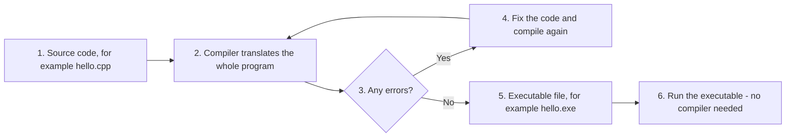
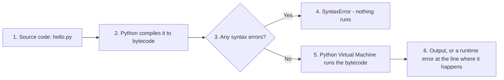
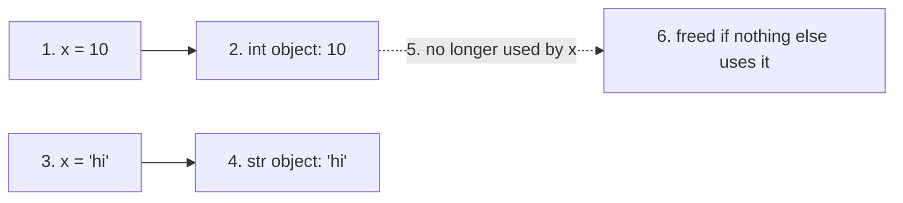
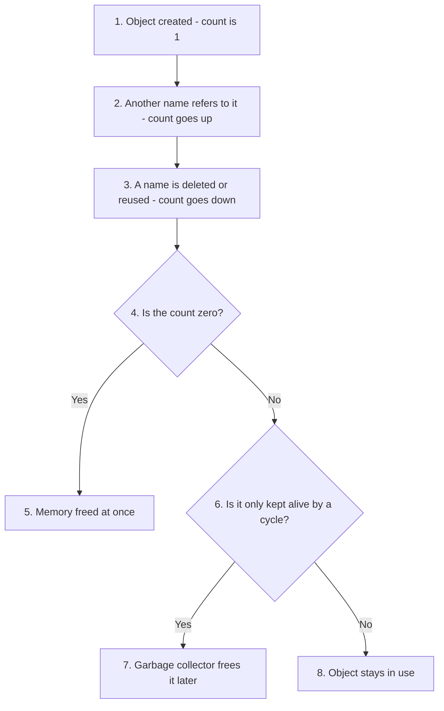
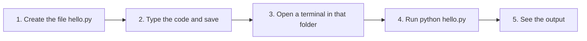

# Chapter 1: Questions and Answers

**About this page**

This page collects the conceptual questions for Chapter 1 of the book, *Python Basics*, with full answers. The printed book gives short answers; here you will find longer explanations, tables, flowcharts and small scripts that you can run yourself to see each idea in action.

The questions are grouped by topic:

1. **Compilers and interpreters** - how a program written by a person is turned into something a computer can run, and how Python does it.
2. **Python's strengths and weaknesses.**
3. **Open source, proprietary software and shareware** - explained with a simple cake-and-recipe analogy.
4. **Portability** - why the same Python program runs on Windows, macOS and Linux.
5. **Dynamic typing** - why you never have to declare the type of a variable in Python.
6. **Automatic memory management** - how Python cleans up after itself.
7. **Interactive mode and script mode** - the two ways of running Python code.
8. **Indentation, keywords and identifiers** - basic rules of writing Python code.
9. **Profiling tools** (advanced) - how to find the slow parts of a program.

These ideas explain *why* Python behaves the way it does. Understanding them now will make the later chapters easier, and will help you answer the "theory" questions that often appear in examinations and interviews.

All the scripts on this page were run with Python 3.11 and 3.13; the outputs shown are the real ones.

## Table of Contents

* [1. Compilers and Interpreters](#1-compilers-and-interpreters)
  * [What does a Compiler do? Give its characteristics and some examples of compiled languages](#what-does-a-compiler-do-give-its-characteristics-and-some-examples-of-compiled-languages)
  * [What are the Advantages of Using a Compiler?](#what-are-the-advantages-of-using-a-compiler)
  * [What is an Interpreter? Give its characteristics and example of programming languages which use interpreter.](#what-is-an-interpreter-give-its-characteristics-and-example-of-programming-languages-which-use-interpreter)
  * [How does Python actually run your code?](#how-does-python-actually-run-your-code)
  * [Give differences between Compiler and Interpreter](#give-differences-between-compiler-and-interpreter)
  * [Compare Python vs C++ / Java](#compare-python-vs-c--java)
* [2. Python's Strengths and Weaknesses](#2-pythons-strengths-and-weaknesses)
  * [What is Python good for?](#what-is-python-good-for)
  * [What are Python's Key Disadvantages (as a programming language)](#what-are-pythons-key-disadvantages-as-a-programming-language)
* [3. Open Source, Proprietary Software and Shareware](#3-open-source-proprietary-software-and-shareware)
  * [Explain Open Source vs Proprietary Software (Simple Explanation)](#explain-open-source-vs-proprietary-software-simple-explanation)
  * [What is Proprietary (Closed Source) Software?](#what-is-proprietary-closed-source-software)
  * [What is Open Source Software?](#what-is-open-source-software)
  * [What is Shareware?](#what-is-shareware)
  * [Give Comparison Table: Open Source vs Closed Source vs Free vs Paid](#give-comparison-table-open-source-vs-closed-source-vs-free-vs-paid)
* [4. Portability](#4-portability)
  * [What is Portability in Programming (Python and Other Languages)?](#what-is-portability-in-programming-python-and-other-languages)
  * [Is Python considered portable?](#is-python-considered-portable)
  * [When Python Is *Not* Automatically Portable?](#when-python-is-not-automatically-portable)
  * [How Python Developers Improve Portability?](#how-python-developers-improve-portability)
  * [Discuss portability in Other commonly used programming languages](#discuss-portability-in-other-commonly-used-programming-languages)
  * [Give summary of why Python is considered portable](#give-summary-of-why-python-is-considered-portable)
* [5. Dynamic Typing](#5-dynamic-typing)
  * [What is Dynamic Typing (Dynamic Binding) in Python?](#what-is-dynamic-typing-dynamic-binding-in-python)
  * [Give example of Dynamic Typing in Action in Python](#give-example-of-dynamic-typing-in-action-in-python)
  * [Why is it called “Dynamic Binding”?](#why-is-it-called-dynamic-binding)
  * [Give Key points about dynamic typing in Python](#give-key-points-about-dynamic-typing-in-python)
  * [Does dynamic typing mean Python mixes types freely?](#does-dynamic-typing-mean-python-mixes-types-freely)
  * [Compare: Static Typing vs Dynamic Typing (In tabular format)](#compare-static-typing-vs-dynamic-typing-in-tabular-format)
  * [Give simple definition of dynamic typing in Python](#give-simple-definition-of-dynamic-typing-in-python)
* [6. Automatic Memory Management](#6-automatic-memory-management)
  * [What is Automatic Memory Management in Python?](#what-is-automatic-memory-management-in-python)
  * [What happens to objects that refer to each other?](#what-happens-to-objects-that-refer-to-each-other)
* [7. Interactive Mode and Script Mode](#7-interactive-mode-and-script-mode)
  * [What is the Command Line Mode (Interactive Mode)?](#what-is-the-command-line-mode-interactive-mode)
  * [What is the Script Mode (Program/File Mode)? Give example](#what-is-the-script-mode-programfile-mode-give-example)
  * [Give difference between Command Line Mode versus Script Mode in Python](#give-difference-between-command-line-mode-versus-script-mode-in-python)
  * [Give differences between Command Line Mode and Script Mode (In tabular format)](#give-differences-between-command-line-mode-and-script-mode-in-tabular-format)
  * [Explain the execution of Python from a File (Script Mode) instead of the Command Line](#explain-the-execution-of-python-from-a-file-script-mode-instead-of-the-command-line)
  * [What are the steps to create and run a Python script?](#what-are-the-steps-to-create-and-run-a-python-script)
  * [Why run Python from a script?](#why-run-python-from-a-script)
  * [Compare Python Shell (Interactive Mode) vs Script Mode (In tabular format)](#compare-python-shell-interactive-mode-vs-script-mode-in-tabular-format)
* [8. Indentation, Keywords and Identifiers](#8-indentation-keywords-and-identifiers)
  * [What is Python Indentation?](#what-is-python-indentation)
  * [What are the differences between Keywords and Identifiers in Python?](#what-are-the-differences-between-keywords-and-identifiers-in-python)
  * [What are the Common Mistakes Beginners Make with Identifiers in Python?](#what-are-the-common-mistakes-beginners-make-with-identifiers-in-python)
* [9. Advanced: Profiling Tools](#9-advanced-profiling-tools)
  * [Essential Python Profiling Tools (Beginner + Intermediate Friendly)](#essential-python-profiling-tools-beginner--intermediate-friendly)
  * [Give summary of common profiling tools for Python in form of a Table](#give-summary-of-common-profiling-tools-for-python-in-form-of-a-table)

## 1. Compilers and Interpreters

Computers only understand **machine code**: long strings of numbers that the processor can carry out directly. People, on the other hand, write programs in a **high-level language** such as Python, C++ or Java, which is much closer to English. The program as written by a person is called **source code**. Something has to translate source code into instructions the computer can follow. There are two main kinds of translator: a **compiler** and an **interpreter**.

[Back to the Table of Contents](#table-of-contents)

### What does a Compiler do? Give its characteristics and some examples of compiled languages

A **compiler** converts the **entire source code** into machine code (or into another lower-level form) *before* the program is run. The result is saved, usually as an executable file, and that file is what you then run.

[Back to the Table of Contents](#table-of-contents)

#### Characteristics

- Translates the whole program at once.
- Produces an executable file (for example a `.exe` file on Windows).
- Execution is fast, because the translation has already been done.
- Many errors, such as spelling mistakes in the code (**syntax errors**) and, in many languages, type mistakes, are caught before the program runs.
- Needs recompilation whenever the code changes.

[Back to the Table of Contents](#table-of-contents)

#### Examples

- **C and C++** - compiled to machine code.
- **Go and Rust** - compiled to machine code.
- **Java** - compiled to **bytecode** first (a simpler, portable form of the program), which is then run by the **Java Virtual Machine (JVM)**. So Java uses a mix of compiling and interpreting.

The flowchart below shows the steps.



[Back to the Table of Contents](#table-of-contents)

### What are the Advantages of Using a Compiler?

* **Faster execution:** Compiled code runs faster, because it has already been translated into machine code. No time is spent on translation while the program runs.
* **Optimised code:** Compilers study the whole program and improve it (this is called **optimisation**), producing efficient machine code that uses fewer resources.
* **Early error detection:** Syntax errors, and in languages such as C++ and Java many type errors, are found during the **compilation phase**, before the program ever runs. (Logic errors - mistakes in what the program is meant to do - are still found only by testing.)
* **Portability of source code:** The same source code can be compiled for different platforms (operating system and type of processor) by using a suitable compiler for each one, often without major changes to the code.
* **Protection of source code:** You can give people the executable file without the source code. This offers a layer of protection for your work, although a determined expert can still partly reverse-engineer an executable.
* **Helpful error messages and tools:** Compilers report errors with line numbers, and work well with debugging tools.
* **No translator needed on the user's computer:** A program compiled to machine code runs on its own; the user does not need the compiler. (Java is an exception: the user needs the Java runtime, because Java is compiled to bytecode, not machine code.)
* **Abstraction:** Compilers let programmers write in a high-level language and not worry about the low-level details of the hardware.

[Back to the Table of Contents](#table-of-contents)

### What is an Interpreter? Give its characteristics and example of programming languages which use interpreter.

An **interpreter** runs the program directly, translating and carrying out the code **statement by statement** while the program is running. No separate executable file is produced.

[Back to the Table of Contents](#table-of-contents)

#### Characteristics

- No executable file is produced; you run the source code itself, through the interpreter.
- Slower execution, because the translation happens while the program runs.
- Errors that depend on what happens while the program runs (**runtime errors**, such as dividing by zero) appear only when that line is reached.
- Quick to test and change: edit a line and run again, with no build step.
- The interpreter must be installed on every computer that runs the program.

[Back to the Table of Contents](#table-of-contents)

#### Examples

- **Python**
- **JavaScript** (modern browsers also compile it on the fly for speed)
- **Ruby** and **PHP**

[Back to the Table of Contents](#table-of-contents)

### How does Python actually run your code?

This is a useful follow-up question, because Python is usually described simply as "interpreted", but the full picture is a little different.

When you run a Python program with the standard interpreter (**CPython**, the version you download from python.org):

1. Python first **compiles** your whole file into **bytecode** - a simple, low-level set of instructions. This happens automatically and very quickly; you never see a separate step.
2. The **Python Virtual Machine (PVM)**, which is part of the interpreter, then runs the bytecode instruction by instruction.
3. For modules that you import, Python saves the bytecode in a `__pycache__` folder as `.pyc` files, so that it does not have to compile them again next time.



This has an important effect that surprises many beginners: **a syntax error anywhere in a file stops the whole file from running**, even the lines before it. Try this file, saved as `syntax_demo.py`:

```python
print("Line 1 runs")
print("Line 2 runs")
print("Line 3 has a mistake"
```

Output:

```text
  File "syntax_demo.py", line 3
    print("Line 3 has a mistake"
         ^
SyntaxError: '(' was never closed
```

Lines 1 and 2 did **not** run, because Python compiles the whole file first and finds the missing bracket.

A **runtime error** is different. Here the first two lines do run, and the program stops only when it reaches the bad line. Save this as `runtime_demo.py`:

```python
print("Line 1 runs")
print("Line 2 runs")
print(10 / 0)
print("Line 4 never runs")
```

Output:

```text
Line 1 runs
Line 2 runs
Traceback (most recent call last):
  File "runtime_demo.py", line 3, in <module>
    print(10 / 0)
          ~~~^~~
ZeroDivisionError: division by zero
```

So Python is best described as **compiled to bytecode, then interpreted**. Java works in a similar way, but it compiles to bytecode as a separate, visible step, and its virtual machine is much more aggressive about speeding code up.

[Back to the Table of Contents](#table-of-contents)

### Give differences between Compiler and Interpreter

| Feature | Compiler | Interpreter |
| :--- | :--- | :--- |
| **Translation** | Translates the **entire source code** before the program runs. | Translates and runs the code **statement by statement**, while the program runs. |
| **Output** | Produces an **executable file** (for example `.exe`) that can be run again and again. | No executable file is produced; the source code is run through the interpreter each time. |
| **Execution speed** | **Faster**, because translation is already complete. | **Slower**, because translation happens during running. |
| **Error reporting** | Reports compile-time errors (often several at once) **before** the program runs. | Stops at the **first** runtime error and reports the line where it happened. (Python also reports syntax errors before running, as shown above.) |
| **Start-up time** | **Slower** to start working (a compilation step is needed first). | **Faster** to start (no separate compilation step). |
| **Development cycle** | Needs a **rebuild (recompile)** after every change to the source code. | Easier for rapid development and testing, because **no rebuild is needed**. |
| **Needed on the user's computer** | Only the executable (except for languages such as Java, which need a runtime). | The interpreter itself. |
| **Examples** | C, C++, Go, Rust (Java uses a mix). | Python, JavaScript, Ruby, PHP. |

[Back to the Table of Contents](#table-of-contents)

### Compare Python vs C++ / Java

| Feature | Python (interpreter) | C++ / Java (compiler-based) |
| ------- | -------------------- | --------------------------- |
| Translation | Compiled automatically to bytecode, then run statement by statement | Whole program compiled first (C++ to machine code; Java to bytecode, then run by the JVM) |
| Output | No executable (unless you package the program with a special tool) | C++: executable file; Java: bytecode (`.class` or `.jar` files) |
| Execution speed | Slower | Faster |
| Error detection | Syntax errors before running; most other errors (including type errors) at runtime | Syntax and type errors at compile time; others at runtime |
| Type declarations | Not needed (dynamic typing, see [Section 5](#5-dynamic-typing)) | Needed (`int x = 5;`) |
| Code length | Short and simple | Longer |
| Ideal for | Scripting, data science, AI, automation, quick development | High-performance applications, games, large systems |

[Back to the Table of Contents](#table-of-contents)

## 2. Python's Strengths and Weaknesses

### What is Python good for?

Python is good for learning and for getting things done quickly. One big reason is how it runs code:

- Python does **not** need a separate compilation step that you run yourself.
- The Python interpreter reads your code and runs it straight away.
- This makes Python:
  - easier for beginners,
  - good for experimenting,
  - useful for quick testing: change a line, run again.

Because of this, and because of its simple syntax and huge collection of libraries, Python is widely used for:

- learning programming,
- data analysis and data science (with libraries such as NumPy and pandas),
- machine learning and artificial intelligence,
- automating everyday tasks (renaming files, processing spreadsheets, and so on),
- web development (with frameworks such as Django and Flask),
- scientific research and teaching.

[Back to the Table of Contents](#table-of-contents)

### What are Python's Key Disadvantages (as a programming language)

1. **Slower execution speed:** Because Python is interpreted, it is generally slower than compiled languages such as C++ or Java, so it is less suitable on its own for performance-critical applications. (In practice, many popular Python libraries, such as NumPy, are written in C inside, which makes them fast.)

2. **Higher memory use:** Python usually uses more memory (RAM) than languages such as C, because every value is a full object with extra information attached. This can be a limit in memory-intensive tasks or on small devices.

3. **Errors found late (at runtime):** Because of dynamic typing (see [Section 5](#5-dynamic-typing)), type mistakes are often only discovered when the program runs, and only if that particular line runs. More careful testing is needed.

4. **Multithreading bottleneck (the GIL):** In the standard version of Python, the **Global Interpreter Lock (GIL)** allows only one thread to run Python code at a time. (A **thread** is one of several tasks that a program can run side by side.) So programs that do heavy calculations cannot use several processor cores through threads. Since Python 3.14 there is also an officially supported, optional **free-threaded** version of Python without the GIL, but the standard version still has it. (More in [Python support for free threading](https://docs.python.org/3/howto/free-threading-python.html).)

5. **Limited use on mobile phones and in embedded systems:** Python is not the usual choice for building mobile apps (Android and iPhone apps are normally written in Kotlin, Java or Swift), or for real-time and embedded systems where speed and small memory use are critical.

6. **Limited low-level access:** Python's high-level nature makes it hard to work directly with hardware or to write system-level software such as device drivers or operating systems.

7. **Source code is easy to read, and depends on outside packages:** Python programs are usually shared as source code, which makes the code hard to keep private. Python projects also rely heavily on packages written by other people, which must be kept up to date and checked for security problems. Large Python web applications therefore need good security practices, as do applications in any language.

[Back to the Table of Contents](#table-of-contents)

## 3. Open Source, Proprietary Software and Shareware

### Explain Open Source vs Proprietary Software (Simple Explanation)

The terms **open source**, **closed source**, **free** and **paid** are easy to understand with a simple analogy of a **cake**, **baking** and a **recipe**.

[Back to the Table of Contents](#table-of-contents)

#### 1. The Cake Analogy (Simple Version)

| In the analogy | In software |
| -------------- | ----------- |
| **Cake** | The software you can use |
| **Cake recipe** | The **source code** (the human-readable instructions written by programmers) |
| **Baking the cake** | **Compiling** the source code into a program the computer can run |
| **Price of the cake** | Whether the software is free or paid |

Keep one point in mind throughout: **open or closed** (whether you get the recipe) and **free or paid** (whether you pay for the cake) are two **separate** questions.

[Back to the Table of Contents](#table-of-contents)

### What is Proprietary (Closed Source) Software?

- You **get the cake**, but **not the recipe**.
- You can **eat** the cake (use the software), but:
  - you cannot see how it is made,
  - you cannot change it,
  - you cannot improve it,
  - you cannot fix mistakes (bugs) in it yourself.
- Even if the cake is **free of cost**, it is still **closed source** if the recipe is not given.
- The company that owns it decides who may use it and how, through a **licence** (a legal agreement you accept when installing).
- Examples:
  - Microsoft Windows
  - Adobe Photoshop
  - many commercial apps

[Back to the Table of Contents](#table-of-contents)

### What is Open Source Software?

- You get the **cake** AND the **recipe**.
- The software is released under an **open-source licence**, which allows anyone to read, use, change and share the source code, sometimes with conditions (for example, that changed versions must also be shared openly). The official definition is kept by the [Open Source Initiative](https://opensource.org/osd).
- Open-source software is usually free of cost, but it does not have to be; a company may charge for support, services or ready-made versions.
- With the source code, anyone can:
  - make their own version,
  - change or improve it,
  - fix bugs,
  - contribute the improvements back to the community.
- Examples:
  - Linux
  - Python
  - Android (based on Linux; the core system is open source, although the Google apps on most phones are not)
  - Firefox

[Back to the Table of Contents](#table-of-contents)

#### Understanding Compilation (Baking the Cake)

- Programmers write source code (the recipe).
- Before giving the software to users, they often **compile** it (bake the cake).
- Compilation turns the human-readable code into:
  - executable files,
  - binary files (files of numbers rather than text),
  - machine code.
- These are very hard to turn back into readable source code (this is called **reverse engineering**), just as a baked cake does not reveal its exact recipe.

A note about Python: Python programs are usually shared as source code (`.py` files), so the recipe comes with the cake unless the author uses special tools to hide it.

[Back to the Table of Contents](#table-of-contents)

### What is Shareware?

- **Shareware** is software that is **free to try**, but still **closed source**, and usually paid for after the trial.
- The free version may have:
  - a time limit (for example, 30 days),
  - some features switched off,
  - reminders asking you to buy it.
- Shareware is **NOT** open source, because the source code is not given.

Examples:

- WinRAR (a file compression tool that can be tried for free)
- many small commercial utilities

[Back to the Table of Contents](#table-of-contents)

### Give Comparison Table: Open Source vs Closed Source vs Free vs Paid

In this table, "free software" means software that costs nothing (sometimes called **freeware**). Be careful: many programmers use "free software" in a different sense, meaning software that gives users **freedom** to study, change and share it - "free as in freedom, not as in free food". In that sense, "free software" is very close to "open source". (See the [GNU explanation of free software](https://www.gnu.org/philosophy/free-sw.en.html).)

| Feature | Open Source | Closed Source | Free of Cost | Paid Software |
| ------- | ----------- | ------------- | ------------ | ------------- |
| Source code available | Yes | No | Depends | Depends |
| Can change the code | Yes | No | Only if open source | Only if the licence allows |
| Can share copies with others | Usually yes | No | Depends on the licence | Usually no |
| Cost | Usually free, sometimes paid | Free or paid | Free | Paid |
| Examples | Linux, Python, Firefox | Windows, MS Office | VS Code, Firefox | Photoshop, MS Office |
| Who controls the software? | The community or the developers | The company (vendor) | Depends | The vendor |
| Can users find and fix bugs themselves? | Yes | No | Only if open source | Usually no |
| Needs a licence? | Yes (an open-source licence) | Yes | Yes (every program has one, even free ones) | Yes |

(VS Code is free of cost. Its source code is open, but the ready-made VS Code that you download from Microsoft comes with Microsoft's own licence.)

[Back to the Table of Contents](#table-of-contents)

#### Summary (Quick Points)

- **Open source** = you get the recipe (source code).
- **Closed source** = you only get the cake.
- **Free software (free of cost)** = costs ₹0, but may be closed source.
- **Paid software** = you pay money, but it may still be open source.
- **Shareware** = a trial version, still closed source.
- So a piece of software can be:
  - open source and free,
  - open source and paid,
  - closed source and free,
  - closed source and paid.

Examples:

| | Free of cost | Paid |
| --- | ------------ | ---- |
| **Open source** | Python, Linux, Firefox | Red Hat Enterprise Linux (you pay for a subscription with support) |
| **Closed source** | WhatsApp, Adobe Acrobat Reader | Windows, Adobe Photoshop |

[Back to the Table of Contents](#table-of-contents)

## 4. Portability

### What is Portability in Programming (Python and Other Languages)?

- **Portability** is how easily a program, or a programming language, can be moved from one computer system or operating system to another **with little or no change**.
- A highly portable language lets the same code run on different platforms, such as:
  - Windows
  - Linux
  - macOS
  - Unix
  - mobile operating systems (Android and iOS, through special frameworks)

In simple terms: **portable code works everywhere, not just on one type of computer.**

[Back to the Table of Contents](#table-of-contents)

### Is Python considered portable?

Yes. Python is considered **highly portable**, for these reasons.

[Back to the Table of Contents](#table-of-contents)

#### 1. The Python interpreter is available on almost every platform

- The standard version of Python, **CPython**, is written in the **C** programming language, using only standard C features (C11), which almost every computer system supports.
- So Python can be built and run on almost any device for which a C compiler exists: from large servers to the tiny Raspberry Pi computer.

[Back to the Table of Contents](#table-of-contents)

#### 2. Python code usually needs no changes across platforms

For example, this code:

```python
print("Hello")
```

behaves the same on:

- Windows
- macOS
- Linux
- Raspberry Pi
- cloud servers
- mobile devices (through special apps and runtimes)

[Back to the Table of Contents](#table-of-contents)

#### 3. Python hides platform differences

Most of the time, Python hides the differences between operating systems. File handling, networking and mathematical operations work in the same way on all systems.

[Back to the Table of Contents](#table-of-contents)

#### 4. Cross-platform libraries

Many Python libraries (NumPy, pandas, Flask, Django) work the same way on all systems.

[Back to the Table of Contents](#table-of-contents)

### When Python Is *Not* Automatically Portable?

Although Python *itself* is portable, a particular script can stop being portable if it depends on:

- **operating-system-specific file paths**, such as `"C:\\Users\\name\\data.csv"` (which does not exist on macOS or Linux),
- **Windows-only modules** (for example `win32com`, which controls Windows programs),
- **Linux-only commands** (shell tools such as `grep`, `sed`, `ls`),
- **hardware-specific requirements** (a particular GPU, TPU or microcontroller),
- **installation-dependent paths or environment variables** (settings that exist only on one computer).

These reduce portability unless they are handled carefully.

[Back to the Table of Contents](#table-of-contents)

### How Python Developers Improve Portability?

Python developers improve portability by:

[Back to the Table of Contents](#table-of-contents)

#### 1. Using operating-system-independent modules

```python
import os
import pathlib
```

The modules `os`, `pathlib` and `platform` hide the differences between operating systems.

[Back to the Table of Contents](#table-of-contents)

#### 2. Recording the packages a project needs

Use a **virtual environment** for each project (an isolated set of packages; see the VS Code Part 2 page). Then list the packages in a file called `requirements.txt`, so that the same setup can be recreated on any computer:

```text
pip freeze > requirements.txt
pip install -r requirements.txt
```

The first command writes the list of installed packages into the file; the second installs them all on another computer.

[Back to the Table of Contents](#table-of-contents)

#### 3. Avoiding hard-coded file paths

Use `pathlib` or `os.path.join()` to build paths, instead of writing a fixed path such as `"C:\\Users\\name\\"`.

[Back to the Table of Contents](#table-of-contents)

#### 4. Using cross-platform libraries

Avoid features that work on only one operating system, unless they are really needed.

The script below shows these ideas in action:

```python
import platform
from pathlib import Path

# Step 1 - Find out which operating system the program is running on
print("Step 1 - Operating system:", platform.system())

# Step 2 - Build a file path without typing any slashes yourself
data_file = Path("data") / "marks.csv"
print("Step 2 - Path to the file:", data_file)

# Step 3 - Find the user's home folder on any operating system
print("Step 3 - Home folder found:", Path.home().exists())
```

On Windows the output is:

```text
Step 1 - Operating system: Windows
Step 2 - Path to the file: data\marks.csv
Step 3 - Home folder found: True
```

On Linux (and similarly on macOS) the same script prints:

```text
Step 1 - Operating system: Linux
Step 2 - Path to the file: data/marks.csv
Step 3 - Home folder found: True
```

Notice that `pathlib` automatically uses `\` on Windows and `/` on Linux and macOS. The same code works everywhere without any change.

[Back to the Table of Contents](#table-of-contents)

### Discuss portability in Other commonly used programming languages

| Language | How portable? | Why |
| -------- | ------------- | --- |
| **C / C++** | Very portable, when written with the standard libraries | The code must be recompiled for each platform, and operating-system-specific functions reduce portability. |
| **Java** | Extremely portable | Programs run on the **Java Virtual Machine (JVM)**, which exists for almost every platform: "Write once, run anywhere." |
| **JavaScript** | Very portable in web browsers | Programs that run outside the browser (with Node.js) may use operating-system-specific functions. |
| **Go** | Highly portable | One command can build programs for many operating systems (**cross-compilation**, for example with `go build` and a chosen target system). |
| **Rust** | Very portable with the standard library | Low-level or operating-system-specific code reduces portability. |
| **C#** | Now portable | It was originally Windows-only, but has been cross-platform since .NET Core (and .NET 5 and later). |

[Back to the Table of Contents](#table-of-contents)

### Give summary of why Python is considered portable

- **Portability = how easily software runs on different systems.**
- **Python is highly portable** because:
  - CPython is written in standard, portable C,
  - Python code rarely needs changes to run on another operating system,
  - its standard library and most packages work on all platforms.
- A particular program stays portable only if it avoids operating-system-specific code, such as fixed file paths.

[Back to the Table of Contents](#table-of-contents)

## 5. Dynamic Typing

### What is Dynamic Typing (Dynamic Binding) in Python?

- **Dynamic typing** means that **you do not need to declare the type of a variable before using it**.
- In Python, **a variable's type is decided while the program runs** (at **runtime**), from the value assigned to it.
- The same variable can hold **different types of data at different times**.
- Python keeps track of the types itself; the programmer does not need to state them.

[Back to the Table of Contents](#table-of-contents)

### Give example of Dynamic Typing in Action in Python

```python
# Step 1 - x starts as a whole number
x = 10
print("Step 1 - x =", x, "| type:", type(x).__name__)

# Step 2 - the same name now refers to a string
x = "hello"
print("Step 2 - x =", x, "| type:", type(x).__name__)

# Step 3 - and now to a decimal number (float)
x = 3.14
print("Step 3 - x =", x, "| type:", type(x).__name__)
```

Output:

```text
Step 1 - x = 10 | type: int
Step 2 - x = hello | type: str
Step 3 - x = 3.14 | type: float
```

(`type(x)` gives the type of the value that `x` refers to, and `.__name__` gives just its short name.)

Python does not complain, because it links the name `x` to each new value, and to that value's type, while the program runs.

[Back to the Table of Contents](#table-of-contents)

### Why is it called “Dynamic Binding”?

- **Binding** means **linking a name (variable) to a value**. Every assignment such as `x = 10` creates a binding.
- In Python, this binding happens **dynamically** - during the running of the program, not in advance.
- The interpreter keeps track of:
  - the object in memory,
  - its type (every object knows its own type),
  - which variable name refers to it.

Example:

```python
x = 10     # x -> integer object 10
x = "hi"   # x -> string object "hi"
```

`x` is *re-bound* each time: it simply points to a different object.



A note on the term: in other books, "dynamic binding" (also called **late binding**) often means something slightly different - deciding *which method to call* while the program runs, a topic you will meet in the chapters on classes. In this chapter, it means binding names to values while the program runs.

[Back to the Table of Contents](#table-of-contents)

### Give Key points about dynamic typing in Python

- Variables **do not have fixed types; values do.** A variable is just a name.
- A variable can be reassigned to a value of any type.
- Type checking happens at runtime, not before the program runs.
- This makes Python:
  - very flexible,
  - easy for beginners,
  - quick to write.

But sometimes:

- errors appear **at runtime** instead of earlier,
- large programs may need **type hints** for clarity. Type hints are optional notes about types, such as `def area(width: float) -> float:`. Python itself ignores them when running, but editors and checking tools use them to catch mistakes early. (See the [typing documentation](https://docs.python.org/3/library/typing.html).)

[Back to the Table of Contents](#table-of-contents)

### Does dynamic typing mean Python mixes types freely?

No. This is a useful follow-up question. Python is **dynamically typed**, but it is also **strongly typed**: it will not silently mix values of different types in a way that does not make sense.

```python
# Step 1 - A number and a piece of text
age = 20
message = "Age: "

# Step 2 - Python will not silently mix a str and an int
try:
    print(message + age)
except TypeError as error:
    print("Step 2 - TypeError:", error)

# Step 3 - Convert the number to text first, then join them
print("Step 3 -", message + str(age))
```

Output:

```text
Step 2 - TypeError: can only concatenate str (not "int") to str
Step 3 - Age: 20
```

So the *name* can change type freely, but each *value* keeps its own type, and you must convert values yourself (for example with `str()` or `int()`) when you mix them.

[Back to the Table of Contents](#table-of-contents)

### Compare: Static Typing vs Dynamic Typing (In tabular format)

| Feature | Static typing (e.g., C, Java) | Dynamic typing (Python) |
| ------- | ----------------------------- | ----------------------- |
| Type declared before use | Yes | No |
| Type checked | At compile time (before running) | At runtime (while running) |
| Variable type | Fixed | Can change |
| Example | `int x = 5;` | `x = 5` |
| Flexibility | Lower | Higher |
| Type errors caught | Early | Later |
| Amount of code | More | Less |

[Back to the Table of Contents](#table-of-contents)

### Give simple definition of dynamic typing in Python

Dynamic typing in Python means that the type of a variable is determined automatically at runtime, from the value assigned to it, without any type declarations.

[Back to the Table of Contents](#table-of-contents)

## 6. Automatic Memory Management

### What is Automatic Memory Management in Python?

It means that:

- Python sets aside memory for your objects (**allocation**) and gives it back (**deallocation**) automatically.
- Programmers do not need to free memory by hand, as they must in languages such as C.
- When objects are no longer needed, Python reclaims the memory they used.

[Back to the Table of Contents](#table-of-contents)

#### How Python manages memory

1. When you assign a value to a variable, Python creates an object and allocates memory for it.
2. Several variables can refer to the same object.
3. Python keeps a count of how many references point to each object. This is called **reference counting**.
4. When an object's reference count drops to **zero**, nothing can use it any more, and CPython frees its memory **straight away**.

[Back to the Table of Contents](#table-of-contents)

#### Garbage collection

- Reference counting cannot handle one special case: objects that refer to **each other** (a **reference cycle**). Their counts never reach zero, even when your program can no longer reach them.
- So Python also has a **garbage collector**, which runs from time to time, finds such unreachable groups of objects, and frees them.
- Together, these two methods prevent most memory leaks (memory that is never given back) and help programs use memory efficiently.



[Back to the Table of Contents](#table-of-contents)

#### Example

```python
x = [1, 2, 3]   # memory allocated for the list
y = x           # both variables refer to the same list
del x           # one reference removed; the list is still used by y
del y           # reference count becomes zero; the memory is freed
```

To *see* the moment an object is freed, we can use a special method, `__del__`, which Python calls just before it frees an object. (You will learn about classes and methods in a later chapter; for now, just read the comments.)

```python
# Step 1 - A small class that prints a message when Python frees it
class Box:
    def __del__(self):
        print("   (Python has freed the Box object)")


# Step 2 - Create one object and point two names at it
x = Box()
y = x
print("Step 2 - x and y refer to the same object:", x is y)

# Step 3 - Remove one name; the object is still in use through y
del x
print("Step 3 - deleted x; y still refers to the object")

# Step 4 - Remove the last name; no references are left, so it is freed at once
print("Step 4 - deleting y ...")
del y
print("Step 5 - end of program")
```

Output:

```text
Step 2 - x and y refer to the same object: True
Step 3 - deleted x; y still refers to the object
Step 4 - deleting y ...
   (Python has freed the Box object)
Step 5 - end of program
```

Notice that the object was freed only after the **last** name was deleted, and immediately at that moment.

[Back to the Table of Contents](#table-of-contents)

#### Summary

- Memory allocation and clean-up happen automatically.
- Python uses reference counting, plus a garbage collector for reference cycles.
- This makes Python easier and safer for beginners, and avoids many memory mistakes that are common in languages such as C.

[Back to the Table of Contents](#table-of-contents)

### What happens to objects that refer to each other?

This follow-up question shows the garbage collector at work. The `gc` module lets us run it by hand.

```python
import gc

# Step 1 - A class whose objects can point to each other
class Node:
    def __init__(self, name):
        self.name = name
        self.partner = None

    def __del__(self):
        print("   (freed", self.name + ")")


# Step 2 - Make two objects that point to each other (a reference cycle)
a = Node("a")
b = Node("b")
a.partner = b
b.partner = a

# Step 3 - Delete both names; each object is still referenced by the other
del a
del b
print("Step 3 - names deleted, but nothing freed yet")

# Step 4 - The garbage collector finds the cycle and frees both objects
print("Step 4 - running the garbage collector ...")
found = gc.collect()
print("Step 5 - unreachable objects found:", found)
```

Output (the number in the last line may be different in some Python versions):

```text
Step 3 - names deleted, but nothing freed yet
Step 4 - running the garbage collector ...
   (freed a)
   (freed b)
Step 5 - unreachable objects found: 2
```

In normal programs you never need to call `gc.collect()`; Python runs the garbage collector automatically.

[Back to the Table of Contents](#table-of-contents)

## 7. Interactive Mode and Script Mode

A note on names: in this book, **command line mode** and **interactive mode** mean the same thing - typing Python statements one at a time at the `>>>` prompt. This is also called the **Python shell** or **REPL** (short for Read-Evaluate-Print Loop: Python reads a line, runs it, prints the result, and waits for the next one). **Script mode** means saving the code in a `.py` file and running the whole file.

[Back to the Table of Contents](#table-of-contents)

### What is the Command Line Mode (Interactive Mode)?

- You start the Python interpreter and type code **one statement at a time**.
- Each statement runs as soon as you press Enter, and its result is shown at once.
- It is useful for:
  - testing small pieces of code,
  - learning Python,
  - trying out calculations,
  - checking an idea quickly while debugging.

[Back to the Table of Contents](#table-of-contents)

#### How to enter Interactive Mode in Python? Give examples.

Open a terminal (Command Prompt, PowerShell, or the Terminal on macOS and Linux) and type:

```text
python
```

(On Windows you can also type `py`; on macOS and Linux you may need `python3`.) Python shows its version and the `>>>` prompt.

[Back to the Table of Contents](#table-of-contents)

##### Example session

```python
>>> x = 10
>>> x + 5
15
>>> print("Hello")
Hello
```

Notice that `x + 5` shows its result even without `print()`; the interactive mode shows the value of every expression you type. For statements that take more than one line, such as an `if` or a `for`, Python shows `...` on the following lines; press Enter on an empty line to finish.

To leave interactive mode, type `exit()` and press Enter (or press **Ctrl + Z** then Enter on Windows, **Ctrl + D** on macOS and Linux).

[Back to the Table of Contents](#table-of-contents)

### What is the Script Mode (Program/File Mode)? Give example

- You write a complete Python program in a file with a `.py` extension.
- The interpreter runs the whole file, from top to bottom.
- It is useful for:
  - larger programs,
  - assignments and projects,
  - code that needs to be saved and reused,
  - automation scripts.

[Back to the Table of Contents](#table-of-contents)

#### Example

Contents of `hello.py`:

```python
print("Hello from script mode!")
```

Run it from a terminal, in the folder where the file is saved:

```text
python hello.py
```

Output:

```text
Hello from script mode!
```

In script mode, only what you `print()` is shown; unlike interactive mode, a line such as `x + 5` on its own shows nothing.

[Back to the Table of Contents](#table-of-contents)

### Give difference between Command Line Mode versus Script Mode in Python

#### Overview

- Python is an interpreted language.
- This means you can run Python code **one statement at a time** or **as a complete script**.
- Python supports two main modes of execution:
  - **Command line mode** (interactive mode, REPL),
  - **Script mode** (file mode).

[Back to the Table of Contents](#table-of-contents)

#### What happens in compiled languages (like C++ or Java)

- The programmer must:
  1. write the complete program,
  2. compile it,
  3. run the compiled output.
- Traditionally, these languages cannot run code one line at a time, so you cannot quickly test a single line without writing a full program. (Some newer tools add this; for example, Java has had an interactive tool called **JShell** since Java 9. But it is not the normal way of working in those languages, as it is in Python.)

The differences are summarised in the tables in the next question and in [the comparison of the Python shell and script mode](#compare-python-shell-interactive-mode-vs-script-mode-in-tabular-format).

[Back to the Table of Contents](#table-of-contents)

### Give differences between Command Line Mode and Script Mode (In tabular format)

| Feature | Command line mode | Script mode |
| ------- | ----------------- | ----------- |
| Execution | One statement at a time | Whole file at once |
| Usage | Quick tests, learning | Full programs, reusable code |
| Saved as a file? | No | Yes (`.py` file) |
| Typical environment | Python shell (REPL) | Code editor or IDE (such as VS Code) |
| Shows results | Automatically, after each expression | Only what you `print()` |
| Good for beginners? | Yes | Yes |
| Code that spans many lines | Awkward to type and correct | Easy |

[Back to the Table of Contents](#table-of-contents)

### Explain the execution of Python from a File (Script Mode) instead of the Command Line

#### The difference

- In **interactive mode**, Python statements are typed and run **directly at the `>>>` prompt**.
- You usually type **one statement at a time**, and the result appears immediately.
- This mode is useful for quick testing, checking logic and learning the language.

[Back to the Table of Contents](#table-of-contents)

#### What script mode adds

- Instead of typing commands one by one, you write **many lines of Python code** in a single file.
- A file that contains Python code and ends with `.py` is called a **Python script**.
- A script:
  - can contain many statements,
  - can be saved permanently,
  - can be reused or shared,
  - can be run any number of times.

[Back to the Table of Contents](#table-of-contents)

### What are the steps to create and run a Python script?



[Back to the Table of Contents](#table-of-contents)

#### 1. Create a new Python file

Create a file named:

```text
hello.py
```

(Use a code editor such as VS Code, IDLE or even Notepad, but make sure the file ends in `.py`, not `.py.txt`.)

[Back to the Table of Contents](#table-of-contents)

#### 2. Add Python code to the file

```python
print("Hello from a Python script!")
```

Save the file.

[Back to the Table of Contents](#table-of-contents)

#### 3. Run the script from the terminal or command prompt

Open a terminal in the folder where you saved the file, and type:

```text
python hello.py
```

(or `python3 hello.py` or `py hello.py`, depending on your system.) In VS Code you can also click the **Run** button.

[Back to the Table of Contents](#table-of-contents)

#### 4. Output

```text
Hello from a Python script!
```

[Back to the Table of Contents](#table-of-contents)

### Why run Python from a script?

Running Python from a `.py` file is the better choice when:

- you want to **save** your code permanently,
- the program is **long, structured, or contains many functions**,
- you need **loops**, **conditions** and **modules** spread over many lines,
- you want to **share** your program with others,
- you want to **automate tasks**, or run jobs again and again (for example every day),
- you need to work with files, networks or other programs.

Interactive mode is great for experimenting, but script mode is needed for real programs.

[Back to the Table of Contents](#table-of-contents)

### Compare Python Shell (Interactive Mode) vs Script Mode (In tabular format)

| Feature | Python shell (command line) | Python script (`.py` file) |
| ------- | --------------------------- | -------------------------- |
| Saves code | No | Yes |
| Good for trying out small pieces of code | Yes | Not ideal |
| Suitable for full programs | No | Yes |
| Can be reused later | No (you must type it again) | Yes |
| Good for automation | No | Yes |
| Execution style | One statement at a time | All at once |
| Best use for beginners | Quick testing | Writing real programs |

[Back to the Table of Contents](#table-of-contents)

#### Summary

- **Interactive mode** is best for learning and testing short pieces of code.
- **Script mode** is essential for writing full programs that you want to save and reuse.
- Both modes are important, and you will use both, depending on the task. This flexibility is one of the reasons Python is easy to learn and powerful in real-world use.

(Jupyter notebooks and Google Colab, described on the earlier pages of this chapter, combine the two: you run small pieces of code one cell at a time, like interactive mode, but the whole notebook is saved, like a script.)

[Back to the Table of Contents](#table-of-contents)

## 8. Indentation, Keywords and Identifiers

### What is Python Indentation?

#### Key ideas

- Most programming languages (C, C++, Java) use **braces `{ }`** to mark blocks of code.
- **Python does not use braces.** Instead, it uses **indentation** (spaces at the start of a line) to group statements together.

[Back to the Table of Contents](#table-of-contents)

#### How indentation works in Python

- A block starts after a line that ends with a colon `:`, and consists of the indented lines that follow. Examples of blocks:
  - inside an `if` statement,
  - inside a `for` or `while` loop,
  - inside a function or a class.
- The block ends at the first line that is **not indented** to that level.

[Back to the Table of Contents](#table-of-contents)

#### Rules about indentation

- The number of spaces is up to you (2, 3, 4 and so on).
- However, indentation must be **consistent within the same block**.
- The widely accepted standard is **4 spaces per level** ([PEP 8](https://peps.python.org/pep-0008/#indentation), the Python style guide).
- Do not mix **tabs and spaces**:
  - it can cause a `TabError` or an `IndentationError`,
  - different editors show tabs at different widths, so the code can look lined up when it is not.
  (Most code editors, including VS Code, insert 4 spaces when you press the Tab key in a Python file.)

[Back to the Table of Contents](#table-of-contents)

#### Why indentation matters

- In Python, indentation is not just formatting; it is part of the **syntax** (the grammar rules).
- Wrong indentation can change the meaning of a program, or stop it from running.
- Proper indentation improves:
  - readability,
  - code structure,
  - debugging and maintenance.

[Back to the Table of Contents](#table-of-contents)

#### Example

```python
# Step 1 - Give x a value so the example can run
x = 15

# Step 2 - The two indented lines belong to the if block
if x > 10:
    print("Large number")
    print("This is inside the block")

# Step 3 - This line is not indented, so it runs whether or not x > 10
print("This is outside the block")
```

Output:

```text
Large number
This is inside the block
This is outside the block
```

If you change the first line to `x = 5`, the condition is false, so the indented block is skipped, and the output is only:

```text
This is outside the block
```

[Back to the Table of Contents](#table-of-contents)

#### Common indentation errors

Forgetting to indent after a colon (in a file saved as `example.py`):

```python
x = 15
if x > 10:
print("Large number")
```

```text
  File "example.py", line 3
    print("Large number")
    ^^^^^
IndentationError: expected an indented block after 'if' statement on line 2
```

Indenting a line more than the lines around it:

```python
x = 15
if x > 10:
    print("Large number")
      print("Too far")
```

```text
  File "example.py", line 4
    print("Too far")
IndentationError: unexpected indent
```

Mixing a tab with spaces in the same block gives:

```text
TabError: inconsistent use of tabs and spaces in indentation
```

[Back to the Table of Contents](#table-of-contents)

### What are the differences between Keywords and Identifiers in Python?

| Feature | Keywords | Identifiers |
| ------- | -------- | ----------- |
| Definition | Reserved words with a fixed meaning in Python | Names chosen by the programmer |
| Purpose | Form the syntax and structure of the language | Name variables, functions, classes, modules and so on |
| Can you create them? | No, they are fixed by Python | Yes, you create them |
| Can you choose them freely? | No; you must use them exactly as they are | Yes, any valid name (except a keyword) |
| Examples | `if`, `else`, `for`, `while`, `class`, `def`, `import`, `return` | `x`, `total_sum`, `Student`, `calculate_area` |
| How many? | Limited: 35 keywords in current versions of Python 3 (plus a few "soft keywords" such as `match` and `case`) | Unlimited: you can create as many as you need |
| Case-sensitive? | Yes (`True` is a keyword, `true` is not) | Yes (`Value`, `value` and `VALUE` are different identifiers) |
| Role in the program | Control the flow and structure of the program | Refer to data and to your own functions and classes |
| Can they start with a digit? | Not applicable | No; identifiers cannot start with a digit |
| Can they contain symbols? | No | Only the underscore (`_`), plus letters and digits |

You can see the full list of keywords by running `import keyword` and then `print(keyword.kwlist)`. (The Python Basics page of this chapter explains every keyword.)

[Back to the Table of Contents](#table-of-contents)

### What are the Common Mistakes Beginners Make with Identifiers in Python?

The first four mistakes stop the program from running at all, with a `SyntaxError`. The last six are allowed by Python, but make programs harder to read or cause subtle bugs.

[Back to the Table of Contents](#table-of-contents)

#### 1. Starting an identifier with a number

Incorrect:

```python
2name = "John"
```

```text
SyntaxError: invalid decimal literal
```

Correct:

```python
name2 = "John"
```

[Back to the Table of Contents](#table-of-contents)

#### 2. Using spaces in identifiers

Incorrect:

```python
my name = "Alice"
```

```text
SyntaxError: invalid syntax
```

Correct:

```python
my_name = "Alice"
```

[Back to the Table of Contents](#table-of-contents)

#### 3. Using special characters (other than the underscore)

Incorrect:

```python
total$amount = 100
```

```text
SyntaxError: invalid syntax
```

Correct:

```python
total_amount = 100
```

[Back to the Table of Contents](#table-of-contents)

#### 4. Using Python keywords as identifiers

Incorrect:

```python
class = 10   # 'class' is a keyword
```

```text
SyntaxError: invalid syntax
```

Correct:

```python
class_num = 10
```

[Back to the Table of Contents](#table-of-contents)

#### 5. Mixing uppercase and lowercase by accident

Python is case-sensitive:

```python
value = 10
Value = 20     # a different identifier
print(value)   # prints 10, not 20
```

If you create `Value` but later type `value`, you are using a different variable, or get a `NameError` if it does not exist.

[Back to the Table of Contents](#table-of-contents)

#### 6. Making identifiers too short or unclear

Unclear:

```python
x = 100
```

Better:

```python
total_marks = 100
```

(Short names such as `i` or `x` are fine for loop counters and short maths; use descriptive names for everything else.)

[Back to the Table of Contents](#table-of-contents)

#### 7. Making identifiers too long or complicated

Hard to read:

```python
totalMarksOfAllStudentsInClassSectionA = 5000
```

Better:

```python
total_marks_section_a = 5000
```

(PEP 8 recommends lowercase words separated by underscores for variable names.)

[Back to the Table of Contents](#table-of-contents)

#### 8. Using inconsistent naming styles

Inconsistent:

```python
studentName = "Raj"   # camelCase
student_age = 21      # snake_case - two different styles
```

Better (pick one style and stick to it; in Python, snake_case is the standard for variables):

```python
student_name = "Raj"
student_age = 21
```

[Back to the Table of Contents](#table-of-contents)

#### 9. Using leading underscores unnecessarily

Leading underscores have special meanings in Python. A single leading underscore (`_count`) tells other programmers "this is for internal use only". A double leading underscore (`__count`) inside a class makes Python change the name behind the scenes (this is called **name mangling**, covered in the chapter on classes). Names with double underscores on both sides, such as `__name__`, are reserved for Python's own special names.

Beginners should avoid leading underscores unless they need them.

Not recommended:

```python
__count = 5
```

Better:

```python
count = 5
```

[Back to the Table of Contents](#table-of-contents)

#### 10. Using names that hide built-in functions and types

Not recommended:

```python
list = [1, 2, 3]  # hides the built-in type 'list'
```

After this line, `list(...)` no longer works in the rest of the program, because the name `list` now refers to your list. The same happens with `print`, `sum`, `max`, `input`, `str` and other built-in names.

Better:

```python
numbers = [1, 2, 3]
```

[Back to the Table of Contents](#table-of-contents)

## 9. Advanced: Profiling Tools

**Profiling** means measuring a program to find out where it spends its time or memory, so that you can speed up the parts that really matter instead of guessing. You do not need profiling while you are learning the basics; come back to this section when your programs become larger. (The Jupyter Notebook page of this chapter shows how to use several of these tools inside a notebook.)

[Back to the Table of Contents](#table-of-contents)

### Essential Python Profiling Tools (Beginner + Intermediate Friendly)

This list includes the most important, practical and widely used tools for profiling and speeding up Python code. More specialised tools are left out.

The examples below use this small program, saved as `slow.py`:

```python
# slow.py - a small program to profile

def slow_squares(n):
    # Step 1 - Build a list of squares the slow way, with a loop
    result = []
    for i in range(n):
        result.append(i * i)
    return result


def fast_squares(n):
    # Step 2 - Build the same list with a list comprehension
    return [i * i for i in range(n)]


def main():
    # Step 3 - Call both functions so that the profiler can compare them
    a = slow_squares(1_000_000)
    b = fast_squares(1_000_000)
    print("Both lists have", len(a), "and", len(b), "items")


main()
```

[Back to the Table of Contents](#table-of-contents)

#### 1. cProfile (Built-in Profiler - Most Important)

- Comes built into Python; nothing to install.
- Reports how much time each **function** takes.
- The best **first tool** for profiling any code.

Run:

```text
python -m cProfile -s cumulative slow.py
```

(`-s cumulative` sorts the report so that the functions that take the most time, including everything they call, come first.)

Output (your times will be different):

```text
Both lists have 1000000 and 1000000 items
         1000010 function calls in 0.393 seconds

   Ordered by: cumulative time

   ncalls  tottime  percall  cumtime  percall filename:lineno(function)
        1    0.000    0.000    0.393    0.393 {built-in method builtins.exec}
        1    0.019    0.019    0.393    0.393 slow.py:1(<module>)
        1    0.000    0.000    0.374    0.374 slow.py:16(main)
        1    0.220    0.220    0.287    0.287 slow.py:3(slow_squares)
        1    0.000    0.000    0.086    0.086 slow.py:11(fast_squares)
        1    0.086    0.086    0.086    0.086 slow.py:13(<listcomp>)
  1000000    0.067    0.000    0.067    0.000 {method 'append' of 'list' objects}
```

Read it like this: `ncalls` is how many times a function was called, `tottime` is the time spent inside the function itself, and `cumtime` is the time including everything it called. Here `slow_squares` took about 0.29 seconds and `fast_squares` only about 0.09 seconds, for the same result.

Save the results to a file, for use with other tools:

```text
python -m cProfile -o out.prof slow.py
```

[Back to the Table of Contents](#table-of-contents)

#### 2. pstats and SnakeViz (Visualisation for cProfile)

- `pstats` is a built-in module for reading and sorting `.prof` files.
- **SnakeViz** turns them into an interactive picture in your browser.
- This makes profiling results much easier to understand.

Install:

```text
pip install snakeviz
```

Run:

```text
snakeviz out.prof
```

[Back to the Table of Contents](#table-of-contents)

#### 3. line_profiler (Line-by-Line CPU Profiler)

- Shows **exactly which line** inside a function is slow.
- Best for loops, maths functions and data processing.

Install:

```text
pip install line_profiler
```

Mark the functions you want to measure with `@profile`:

```python
@profile
def slow_squares(n):
    ...
```

Run:

```text
kernprof -l -v slow.py
```

The `-v` option shows the results straight away. Without it, the results are saved in a file, `slow.py.lprof`, which you can view later with:

```text
python -m line_profiler slow.py.lprof
```

Note: `@profile` works only when the program is run through `kernprof`. If you run the file with plain `python`, you get a `NameError`, so remove the `@profile` lines when you have finished.

[Back to the Table of Contents](#table-of-contents)

#### 4. memory_profiler (Line-by-Line Memory Profiler)

- Shows how much memory (RAM) is used, line by line.
- Helps find memory leaks and wasteful use of memory.
- Note: this package is no longer actively maintained by its author, but it still works for simple cases.

Install:

```text
pip install memory_profiler
```

Use:

```python
from memory_profiler import profile

@profile
def func():
    ...
```

Run:

```text
python -m memory_profiler your_script.py
```

[Back to the Table of Contents](#table-of-contents)

#### 5. py-spy (Low-Overhead Sampling Profiler - Production Safe)

- Can profile a program that is **already running**, without changing or restarting it.
- It works by "sampling": it looks at what the program is doing many times a second. This adds very little extra load (**overhead**).
- Can draw **flame graphs** - pictures in which the widest bars show where the most time is spent.
- Great for finding performance problems in programs that are in real use (in **production**).

Install:

```text
pip install py-spy
```

Watch a running program, live (like the Task Manager, but for Python functions):

```text
py-spy top --pid <process_id>
```

Here `<process_id>` is the number that the operating system gives the running program (you can find it in Task Manager on Windows). To profile a program from start to finish and save a flame graph:

```text
py-spy record -o profile.svg -- python slow.py
```

(On some systems py-spy needs administrator rights.)

[Back to the Table of Contents](#table-of-contents)

#### 6. Pyinstrument (Easy-to-Read Reports)

- One of the cleanest and most beginner-friendly profilers.
- Shows the time spent as an easy-to-read tree, and can make interactive HTML reports.
- Great for teaching and classroom use.

Install:

```text
pip install pyinstrument
```

Run:

```text
pyinstrument slow.py
```

[Back to the Table of Contents](#table-of-contents)

#### 7. Scalene (Advanced CPU, Memory and GPU Profiler)

- Excellent for data science and scientific computing.
- Shows:
  - time spent in Python code versus in fast "native" code (such as C libraries),
  - memory use,
  - GPU use,
  - CPU and memory statistics line by line.

Install:

```text
pip install scalene
```

Run:

```text
scalene your_script.py
```

[Back to the Table of Contents](#table-of-contents)

#### 8. timeit (Timing Small Pieces of Code)

- Best for measuring **small pieces** of code (this is called **micro-benchmarking**).
- Built into Python.

Example:

```python
import timeit

# Step 1 - Run sum(range(1000)) 1000 times and print the total time in seconds
print(timeit.timeit("sum(range(1000))", number=1000))
```

Output (your number will be different):

```text
0.014651261000011573
```

So 1000 runs took about 0.015 seconds, or about 15 microseconds per run.

[Back to the Table of Contents](#table-of-contents)

#### 9. Yappi (Thread and Async Profiler)

- Useful when profiling:
  - programs that use several threads,
  - programs that use `asyncio` (Python's way of running many waiting tasks side by side).
- Can report statistics for each thread separately.

Install:

```text
pip install yappi
```

[Back to the Table of Contents](#table-of-contents)

### Give summary of common profiling tools for Python in form of a Table

| Tool | Type | Strength | Beginner-friendly? |
| ---- | ---- | -------- | ------------------ |
| **cProfile** | CPU (function level) | General profiling; built in | Very friendly |
| **SnakeViz** | Visualisation | Interactive picture of cProfile results | Very friendly |
| **line_profiler** | CPU (line level) | Finding slow lines | Friendly |
| **memory_profiler** | Memory (line level) | Finding memory leaks | Friendly |
| **py-spy** | Sampling | Profiling running programs in production | Somewhat friendly |
| **Pyinstrument** | CPU | Clearest reports for beginners | Very friendly |
| **Scalene** | CPU, memory and GPU | Scientific and data-science work | Friendly |
| **timeit** | Timing | Micro-benchmarks; built in | Very friendly |
| **Yappi** | CPU and concurrency | Threads and async programs | Somewhat friendly |

A good order to learn them in: `timeit` and `cProfile` first (both built in), then `Pyinstrument` or `SnakeViz` for pictures, then `line_profiler` when you need to find a single slow line.

[Back to the Table of Contents](#table-of-contents)

---


