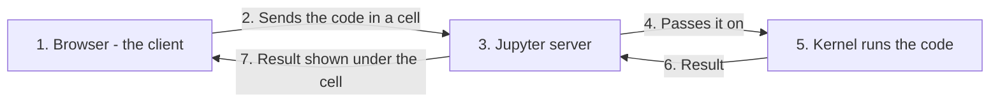
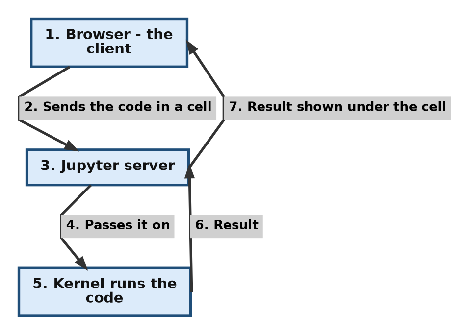

# Chapter 1: Exercise Questions and Answers

**About this page**

This page gives worked answers to the end-of-chapter exercises for Chapter 1 of the book, *Python Basics*. There are two sets of questions:

* **Exercise 1** covers the everyday basics: Python files, IDEs, the interactive and script modes, `print()`, triple-quoted strings and good names.
* **Exercise 2** covers the ideas behind Python: dynamic typing, memory management, source and object code, open-source software, the different versions (implementations) of Python, identity and `id()`, line continuation, identifiers, compiled and interpreted languages, and comments.

Each answer is short and to the point, as in the book, but many are followed by a small script with its real output, so that you can see the idea in action. The **Further study** links point to the official Python documentation, or to the longer explanations on the other pages of this chapter.

## Table of Contents

* [Exercise 1](#exercise-1)
  * [a. What is the file extension name for python scripts?](#a-what-is-the-file-extension-name-for-python-scripts)
  * [b. What is an Integrated Development Environment (IDE)? What are common IDEs for python?](#b-what-is-an-integrated-development-environment-ide-what-are-common-ides-for-python)
  * [c. What is the advantage of using Interactive mode (a.k.a. shell mode)?](#c-what-is-the-advantage-of-using-interactive-mode-aka-shell-mode)
  * [d. What does the `>>>` on python shell indicate?](#d-what-does-the--on-python-shell-indicate)
  * [e. What is script mode (a.k.a. program mode)?](#e-what-is-script-mode-aka-program-mode)
  * [f. What does the comma do when placed between items to be printed?](#f-what-does-the-comma-do-when-placed-between-items-to-be-printed)
  * [g. What are triple quoted strings in python? What are their advantage(s)?](#g-what-are-triple-quoted-strings-in-python-what-are-their-advantages)
  * [h. What are some other good naming conventions in python?](#h-what-are-some-other-good-naming-conventions-in-python)
* [Exercise 2](#exercise-2)
  * [a. What does the term “dynamic typing” mean?](#a-what-does-the-term-dynamic-typing-mean)
  * [b. What does the term “automatic memory management” mean?](#b-what-does-the-term-automatic-memory-management-mean)
  * [c. What is the difference between “source code” and “object code”?](#c-what-is-the-difference-between-source-code-and-object-code)
  * [d. What is the difference between “open source code” and “proprietary code”?](#d-what-is-the-difference-between-open-source-code-and-proprietary-code)
  * [e. What are CPython, Jython, and IronPython and how are they different?](#e-what-are-cpython-jython-and-ironpython-and-how-are-they-different)
  * [f. Is Python a case-sensitive language?](#f-is-python-a-case-sensitive-language)
  * [g. Can mutable objects change their value but keep their id()?](#g-can-mutable-objects-change-their-value-but-keep-their-id)
  * [h. When we say that Jupyter Notebook is a “server-client” application, what does it mean?](#h-when-we-say-that-jupyter-notebook-is-a-server-client-application-what-does-it-mean)
  * [i. Print is a statement in Python 2.x but it is a function in Python 3.x. Explain the difference.](#i-print-is-a-statement-in-python-2x-but-it-is-a-function-in-python-3x-explain-the-difference)
  * [j. What do the terms “explicit line continuation” and “implicit line continuation” mean?](#j-what-do-the-terms-explicit-line-continuation-and-implicit-line-continuation-mean)
  * [k. What is an “identifier” in Python? What are the common rules for writing identifiers?](#k-what-is-an-identifier-in-python-what-are-the-common-rules-for-writing-identifiers)
  * [l. What are the differences between interpreted and compiled language?](#l-what-are-the-differences-between-interpreted-and-compiled-language)
  * [m. Give point-wise Comparison between Hash (#) and triple quotes (`'''` or `"""`)](#m-give-point-wise-comparison-between-hash--and-triple-quotes--or-)

## Exercise 1

### a. What is the file extension name for python scripts?

**Answer:** The standard file extension for Python scripts is **`.py`**, for example `hello.py`.

You may also meet:

* **`.ipynb`** - Jupyter notebooks (used in Jupyter, Google Colab and VS Code),
* **`.pyw`** - Python scripts on Windows that should run without opening a console window,
* **`.pyc`** - compiled bytecode files that Python creates by itself (you do not write these).

Make sure your editor really saves the file as `.py`. A common beginner mistake, especially with Notepad, is a file called `hello.py.txt`.

* **Further study:** [Using the Python interpreter - Python documentation](https://docs.python.org/3/tutorial/interpreter.html)

[Back to the Table of Contents](#table-of-contents)

### b. What is an Integrated Development Environment (IDE)? What are common IDEs for python?

**Answer:** An **IDE** (Integrated Development Environment) is a software application that brings together, in one place, all the tools you need for writing programs. It usually includes:

* a **code editor** with colour highlighting and auto-complete, to write code,
* a way to **run** the program (and, for compiled languages, build tools that compile it),
* a **debugger**, to pause the program and find and fix errors,
* often a **terminal**, a file explorer and links to version-control tools such as Git.

**Common Python IDEs and editors include:**

* **IDLE:** Comes with Python. Simple, and good for beginners.
* **VS Code:** A very popular, lightweight and powerful code editor. With the Python extension it works as a full IDE. (See the VS Code pages of this chapter.)
* **VS Code forks:** A **fork** is a new program built by copying another program's open-source code and developing it separately. These are independent editors built on the open-source Visual Studio Code code base. Some prominent examples are:
  * (a) **Cursor** - an editor with built-in AI assistance,
  * (b) **VSCodium** - the open-source VS Code code, built and released without Microsoft's branding and data collection,
  * (c) **Google Antigravity** - Google's AI-focused development environment,
  * (d) **Windsurf** - an AI-focused editor, originally made by the company Codeium.

  (A related tool is **code-server**, which is not a fork but runs VS Code itself inside a web browser.)
* **PyCharm:** A professional-grade IDE made especially for Python.
* **Jupyter Notebook, JupyterLab and Google Colab:** Notebook environments, very popular for data science (see the Jupyter and Colab pages of this chapter).
* **Spyder** (included with Anaconda) and **Thonny** (designed for beginners) are also worth knowing.

* **Further study:** [What is an IDE? - Codecademy](https://www.codecademy.com/article/what-is-ide)

[Back to the Table of Contents](#table-of-contents)

### c. What is the advantage of using Interactive mode (a.k.a. shell mode)?

**Answer:** Interactive mode is very handy for running a single line or a small block of code and seeing the result **immediately**. It is excellent for:

* testing new ideas,
* checking how a function works (for example, `len("hello")` shows `5` at once),
* doing quick calculations,
* learning, because you get instant feedback,

all without needing to create and save a file. In interactive mode you do not even need `print()`: typing an expression such as `2 + 3` shows its value straight away.

The drawback is that nothing is saved, so for anything longer than a few lines, use script mode.

* **Further study:** [Interactive mode - Python documentation](https://docs.python.org/3/tutorial/interpreter.html#interactive-mode)

[Back to the Table of Contents](#table-of-contents)

### d. What does the `>>>` on python shell indicate?

**Answer:** The `>>>` is called the **Python prompt** (more exactly, the **primary prompt**). It shows that the Python interpreter is ready and waiting for you to type a command. When you press Enter, Python runs that command immediately and shows the result.

When a statement needs more than one line (for example after an `if` line ending in `:`), Python shows the **secondary prompt**, `...`, to say "I am waiting for the rest". Press Enter on an empty line to finish.

```python
>>> x = 5
>>> if x > 3:
...     print("big")
...
big
```

* **Further study:** [Using the Python interpreter - Python documentation](https://docs.python.org/3/tutorial/interpreter.html)

[Back to the Table of Contents](#table-of-contents)

### e. What is script mode (a.k.a. program mode)?

**Answer:** Script mode is used when you want to write a complete program. Unlike interactive mode, you type your code into a text file saved with a `.py` extension, and then run the whole file at once, for example with:

```text
python hello.py
```

This lets you:

* save your work,
* run all the code at once, as many times as you like,
* write long programs that are easy to edit,
* share your program with others so that they can run it on their own computers.

In script mode, only what you `print()` appears on the screen.

* **Further study:** [What is the Script Mode? - Chapter 1 Questions and Answers](006-question-answers1.md#what-is-the-script-mode-programfile-mode-give-example)

[Back to the Table of Contents](#table-of-contents)

### f. What does the comma do when placed between items to be printed?

**Answer:** When you use commas inside the `print()` function, they do two things:

1. They let you print several different items (such as a string and a number) in one `print()`. The items do not all have to be strings.
2. They automatically put a **single space** between the items.

**Example:** `print("Age:", 15)` prints `Age: 15`.

```python
# Step 1 - Commas separate the items; Python puts one space between them
print("Age:", 15)
print("Name:", "Asha", "| Marks:", 92.5)

# Step 2 - Joining strings with + adds no space, and needs everything to be a string
print("Age:" + str(15))

# Step 3 - sep changes the separator that the commas produce
print("2026", "09", "19", sep="-")
```

Output:

```text
Age: 15
Name: Asha | Marks: 92.5
Age:15
2026-09-19
```

The space comes from the `sep` setting of `print()`, which is a single space unless you change it.

* **Further study:** [The print() function - Python documentation](https://docs.python.org/3/library/functions.html#print)

[Back to the Table of Contents](#table-of-contents)

### g. What are triple quoted strings in python? What are their advantage(s)?

**Answer:** Triple-quoted strings are strings enclosed in three single quotes (`'''`) or three double quotes (`"""`).

**Key advantages:**

* **Multi-line strings:** A string can span several lines, exactly as typed, without needing special characters such as `\n` (the code for a new line).
* **Fewer escape characters:** You can put ordinary single quotes (`'`) and double quotes (`"`) inside them without a backslash. (You still cannot put three of the same quotes in a row inside the string, because that would end it.)
* **Docstrings:** They are the standard way to write documentation for modules, functions and classes.

```python
# Step 1 - A string that spans several lines
poem = """Roses are red,
Violets are blue."""
print(poem)

# Step 2 - Single and double quotes inside, with no backslashes needed
quote = """She said, "It's a lovely day." """
print(quote)

# Step 3 - A docstring: the first string inside a function
def greet():
    """Print a friendly greeting."""
    print("Hello!")

print(greet.__doc__)
```

Output:

```text
Roses are red,
Violets are blue.
She said, "It's a lovely day."
Print a friendly greeting.
```

(In Step 2 there is a space before the closing `"""`, so that the `"` at the end of the sentence is not joined to the closing quotes.)

* **Further study:** [Text (strings) - Python tutorial](https://docs.python.org/3/tutorial/introduction.html#text)

[Back to the Table of Contents](#table-of-contents)

### h. What are some other good naming conventions in python?

**Answer:**

* **Avoid names that are too general or too wordy.** Strike a good balance between the two.
  * Bad: `data_structure`, `my_list`, `info_map`, `dictionary_for_the_purpose_of_storing_data_representing_word_definitions`
  * Good: `user_profile`, `menu_options`, `word_definitions`
* **Don't use the single-letter names `O` (capital o), `l` (lowercase L) or `I` (capital i).** In many fonts they look almost the same as the digits `0` and `1`, which makes code hard to read. (Short names such as `i` or `x` are fine for loop counters and simple maths.)
* **When using CamelCase names, capitalise all the letters of an abbreviation**, for example `HTTPServer`, because HTTP is an abbreviation. (CamelCase, also called PascalCase, joins words by starting each with a capital letter, and is used in Python for class names.)
* **Follow the usual Python styles:** `snake_case` for variables and functions (`total_marks`), `PascalCase` for classes (`StudentRecord`), and `UPPER_CASE` for constants (`MAX_SIZE`).
* **Don't reuse the names of built-in functions** such as `list`, `str`, `sum` or `print`.

Adapted from: [Naming conventions - visualgit](https://visualgit.readthedocs.io/en/latest/pages/naming_convention.html) and [PEP 8 naming conventions](https://peps.python.org/pep-0008/#naming-conventions). (The Python Basics page of this chapter has more examples.)

[Back to the Table of Contents](#table-of-contents)

## Exercise 2

### a. What does the term “dynamic typing” mean?

**Answer:** In Python, you don't have to declare in advance what type of data a variable holds (such as an integer or a string). The type is decided automatically **at runtime** (while the program runs), from the value you assign. You can even change a variable from a number to a string later in the same program:

```python
x = 10        # x refers to an int
x = "hello"   # now x refers to a str
```

This works because in Python a variable is just a **name**; it is the **value** that has a type.

* **Further study:** [Dynamic typing - Chapter 1 Questions and Answers](006-question-answers1.md#5-dynamic-typing)

[Back to the Table of Contents](#table-of-contents)

### b. What does the term “automatic memory management” mean?

**Answer:** It means the programmer does not have to set aside (allocate) or give back (free) computer memory by hand, as in languages such as C. Python does it automatically:

1. Python keeps a count of how many names refer to each object (**reference counting**). As soon as nothing refers to an object any more, its memory is freed.
2. A built-in **garbage collector** also runs from time to time, to find and free groups of objects that refer only to each other.

This makes room for new data, and prevents many memory mistakes.

* **Further study:** [Automatic memory management - Chapter 1 Questions and Answers](006-question-answers1.md#6-automatic-memory-management) and the [gc module - Python documentation](https://docs.python.org/3/library/gc.html)

[Back to the Table of Contents](#table-of-contents)

### c. What is the difference between “source code” and “object code”?

**Answer:**

* **Source code:** The code written by a person (you) in a high-level language such as Python, C or Java. People can read and change it.
* **Object code:** The low-level code produced when a **compiler** translates source code. Strictly speaking, object code is **machine code** - instructions that the computer's processor can carry out directly - usually stored in object files (`.o` or `.obj`) that are then joined together into an executable program.

Python works a little differently: it translates source code into **bytecode**, stored in `.pyc` files. Bytecode is not run by the processor directly; it is run by the Python Virtual Machine. Bytecode is therefore sometimes described as a kind of object code, but it is not machine code.

| | Source code | Object code |
| --- | --- | --- |
| Written by | A person | A compiler (from the source code) |
| Readable by people | Yes | No |
| Run by | Needs to be translated first | The processor (machine code) |
| Example | `hello.py`, `hello.c` | `hello.o`, `hello.obj` |

* **Further study:** [Object code - Wikipedia](https://en.wikipedia.org/wiki/Object_code)

[Back to the Table of Contents](#table-of-contents)

### d. What is the difference between “open source code” and “proprietary code”?

**Answer:**

* **Open source:** The source code is published under an open-source licence, so anyone can read, change and share it, following the licence's conditions (for example, Python and Linux).
* **Proprietary (closed source):** The code is owned by a person or a company and kept private. Users cannot see or change how it works inside; they can only use the software as provided, under the owner's licence (for example, Microsoft Windows or Adobe Photoshop).

Whether software is open or closed is a separate question from whether it costs money: open-source software can be sold, and closed-source software can be free.

* **Further study:** [The Open Source Definition - Open Source Initiative](https://opensource.org/osd) and [Open source vs proprietary software - Chapter 1 Questions and Answers](006-question-answers1.md#3-open-source-proprietary-software-and-shareware)

[Back to the Table of Contents](#table-of-contents)

### e. What are CPython, Jython, and IronPython and how are they different?

**Answer:** "Python" is really a language: a set of rules that describe how Python code must be written and what it means. A program that reads and runs Python code according to these rules is called an **implementation**. Different implementations are built to run Python in different environments:

| Implementation | Written in | Runs on | Main use |
| -------------- | ---------- | ------- | -------- |
| **CPython** | C | Your computer directly | The standard version, downloaded from python.org. When people say "Python", they usually mean CPython. |
| **Jython** | Java | The Java Virtual Machine (JVM) | Using Python together with Java programs and libraries. At the time of writing it supports only the older Python 2.7. |
| **IronPython** | C# | Microsoft's .NET platform | Using Python together with .NET programs and libraries. |
| **PyPy** | Python (a restricted form of it) | Your computer directly | Speed: it uses a JIT (just-in-time) compiler, so many programs run much faster. |
| **MicroPython** | C | Microcontrollers (tiny computers in electronic devices) | Programming small electronic boards. |

The same simple Python program normally runs on all of them, but some libraries (especially those written in C) work only with CPython.

* **Further study:** [Alternative Python implementations - python.org](https://www.python.org/download/alternatives/)

[Back to the Table of Contents](#table-of-contents)

### f. Is Python a case-sensitive language?

**Answer:** **Yes.** Python treats uppercase and lowercase letters as different. For example, a variable named `Age` is completely different from a variable named `age`. This applies to variable names, function names and keywords (`True` is a keyword, `true` is not).

```python
# Step 1 - Two different variables, because the case is different
age = 20
Age = 30
print("Step 1 - age =", age, "| Age =", Age)

# Step 2 - AGE was never created, so Python reports an error
try:
    print(AGE)
except NameError as error:
    print("Step 2 - NameError:", error)
```

Output:

```text
Step 1 - age = 20 | Age = 30
Step 2 - NameError: name 'AGE' is not defined
```

* **Further study:** [Python variable names - W3Schools](https://www.w3schools.com/python/gloss_python_variable_names.asp)

[Back to the Table of Contents](#table-of-contents)

### g. Can mutable objects change their value but keep their id()?

**Answer:** **Yes.** "Mutable" means changeable. For example, you can add items to a list or remove items from it. The contents change, but it is still the same object, so its `id()` - the unique number that identifies each object (in CPython, its address in memory) - stays the same.

Immutable objects, such as numbers and strings, can never be changed. When you "change" one, Python actually creates a **new** object, with a new `id()`.

```python
# Step 1 - Create a list and note its identity
numbers = [1, 2, 3]
print("Step 1 - list:", numbers, "| id:", id(numbers))

# Step 2 - Change the list in place; the identity stays the same
numbers.append(4)
print("Step 2 - list:", numbers, "| id:", id(numbers))

# Step 3 - An integer is immutable: "changing" it creates a new object
count = 1000
old_id = id(count)
count = count + 1
print("Step 3 - same id after count + 1?", id(count) == old_id)
```

Output (the id numbers will be different on your computer):

```text
Step 1 - list: [1, 2, 3] | id: 139654492918464
Step 2 - list: [1, 2, 3, 4] | id: 139654492918464
Step 3 - same id after count + 1? False
```

* **Further study:** [Python id() - Programiz](https://www.programiz.com/python-programming/methods/built-in/id) and [the id() function - Python documentation](https://docs.python.org/3/library/functions.html#id)

[Back to the Table of Contents](#table-of-contents)

### h. When we say that Jupyter Notebook is a “server-client” application, what does it mean?

**Answer:** It means the application has two parts that talk to each other:

1. **The server:** A program running on your computer (or on a remote computer) that does the heavy lifting. It opens and saves your notebooks, and passes your Python code to a **kernel**, a separate program that actually runs the code.
2. **The client:** The web browser (such as Chrome or Firefox) where you type your code and see the results.

When you run a cell, the browser sends the code to the server, the kernel runs it, and the result is sent back to the browser to be shown under the cell.





Because of this design, the same notebook interface can work with a server on your own computer or with one far away, as in Google Colab.

* **Further study:** [How Jupyter Notebook works - the Jupyter Notebook page of this chapter](002-jupyternb.md#1-how-jupyter-notebook-works-the-client-server-model)

[Back to the Table of Contents](#table-of-contents)

### i. Print is a statement in Python 2.x but it is a function in Python 3.x. Explain the difference.

**Answer:**

* In **Python 2**, `print` was a **statement** (a keyword, like `if` or `while`), so you wrote `print "Hello"` without brackets.
* In **Python 3**, `print()` is an ordinary **built-in function**, so you **must** use brackets: `print("Hello")`.

This change makes the language more consistent (`print` now works like every other function), and it allows extra settings through **keyword arguments**, such as `sep` (what goes between the items), `end` (what goes at the end, normally a new line), `file` (where to print) and `flush`.

```python
# Step 1 - end changes what is printed after the items (normally a new line)
print("Loading", end="... ")
print("done")

# Step 2 - sep changes what goes between the items (normally a space)
print("a", "b", "c", sep=", ")
```

Output:

```text
Loading... done
a, b, c
```

If you try the old Python 2 form in Python 3, you get a helpful error:

```text
    print "Hello"
    ^^^^^^^^^^^^^
SyntaxError: Missing parentheses in call to 'print'. Did you mean print(...)?
```

* **Further study:** [Print is a function - What's New in Python 3.0](https://docs.python.org/3/whatsnew/3.0.html#print-is-a-function)

[Back to the Table of Contents](#table-of-contents)

### j. What do the terms “explicit line continuation” and “implicit line continuation” mean?

**Answer:** Normally, one Python statement goes on one line. When a statement is too long, you can continue it on the next line in two ways:

* **Explicit:** Put a backslash (`\`) at the **very end** of the line, to tell Python that the statement continues on the next line. Nothing may come after the backslash, not even a space or a comment.
* **Implicit:** Python automatically knows that a line continues if you have not yet closed a bracket: `()`, `[]` or `{}`. This is the preferred way to write long lines (PEP 8 recommends it).

```python
# Step 1 - Explicit continuation: a backslash at the very end of the line
total = 10 + 20 + \
        30 + 40
print("Step 1 - total =", total)

# Step 2 - Implicit continuation: the open bracket tells Python to keep reading
total = (10 + 20 +
         30 + 40)
print("Step 2 - total =", total)

# Step 3 - Lists, dictionaries and function calls can also span lines
fruits = [
    "apple",
    "banana",
    "mango",
]
print("Step 3 - fruits =", fruits)
```

Output:

```text
Step 1 - total = 100
Step 2 - total = 100
Step 3 - fruits = ['apple', 'banana', 'mango']
```

* **Further study:** [Explicit line joining](https://docs.python.org/3/reference/lexical_analysis.html#explicit-line-joining) and [implicit line joining](https://docs.python.org/3/reference/lexical_analysis.html#implicit-line-joining) - Python documentation

[Back to the Table of Contents](#table-of-contents)

### k. What is an “identifier” in Python? What are the common rules for writing identifiers?

**Answer:** An **identifier** is a name given to things in a program, such as variables, functions, classes and modules.

**Common rules:**

1. It can contain letters (a-z, A-Z), digits (0-9) and underscores (`_`).
2. It must **not** start with a digit.
3. It cannot be a Python keyword (such as `if`, `else` or `for`).
4. It cannot contain spaces or special symbols such as `!`, `@`, `#` or `$`.
5. It is case-sensitive: `total`, `Total` and `TOTAL` are three different identifiers.

(Python 3 also allows letters from other alphabets, such as Hindi or Greek, but most programmers use English letters so that everyone can read and type the code.) You can check a name with the string method `isidentifier()`: `"total_2".isidentifier()` gives `True`, and `"2total".isidentifier()` gives `False`.

* **Further study:** [Identifiers and keywords - Python documentation](https://docs.python.org/3/reference/lexical_analysis.html#identifiers) and the Python Basics page of this chapter

[Back to the Table of Contents](#table-of-contents)

### l. What are the differences between interpreted and compiled language?

**Answer:**

| Compiled | Interpreted |
| --- | --- |
| Faster, because the program is already translated into the native machine code of the target computer. | Slower, because the code is translated while the program runs, every time it runs. |
| Needs a separate compilation stage before the program can run. | No separate compilation stage for you to run: the code can be run directly, "on the fly". |
| Can hide the source code from the end user (which may be valuable intellectual property), because you give out a binary executable file instead of the human-readable source code. | The source code is hard to hide, because users normally receive it. |
| You must compile a different executable for each type of processor and/or operating system that the program should run on. | More portable: the same code runs anywhere the interpreter is installed. |
| Compiled programs are already turned into an executable, so they are "ready to run". | They are not "ready to run" on their own; the interpreter is needed every time. |

Python is usually called an interpreted language, although, strictly speaking, it first compiles your code to bytecode automatically and then interprets the bytecode.

* **Further study:** [Compilers and interpreters - Chapter 1 Questions and Answers](006-question-answers1.md#give-differences-between-compiler-and-interpreter)

[Back to the Table of Contents](#table-of-contents)

### m. Give point-wise Comparison between Hash (#) and triple quotes (`'''` or `"""`)

**Answer:**

**1. Hash (`#`) - single-line comments**

- Starts with `#` and continues to the end of the line.
- Used mainly for explaining the **logic**, **steps** or **reasoning** inside the code.
- Helpful for programmers who want to **understand, debug or change** the code.
- Usually scattered throughout functions and blocks of code.
- Can be used for comments that span several lines by putting `#` at the start of each line.
- Ignored completely by the Python interpreter.

**2. Triple quotes (`'''` or `"""`) - multi-line strings used as comments**

- Written using triple single quotes `'''` or triple double quotes `"""`.
- Technically they create a **multi-line string**, not a true comment. The string acts as a comment only if it is not used.
- Mainly used for **docstrings**: documentation for modules, classes and functions.
- A docstring appears as the first statement of a module, or immediately after a `def` or `class` line.
- It describes the **usage**, **purpose**, **arguments** (inputs) and **return value** (output) - in short, how to *use* the code.
- Tools such as Sphinx, pydoc, the built-in `help()` function and IDEs can read docstrings automatically.
- Can also be written on one line, as a single-line docstring.

Comparison:

| Feature / Purpose | `#` Single-line comment | `'''` / `"""` Multi-line string (docstring) |
| --- | --- | --- |
| Syntax | `# comment` | `""" comment """` or `''' comment '''` |
| Type | True comment | Multi-line string used as a comment or docstring |
| Interpreter behaviour | Completely ignored | Read as a string. Saved as the docstring if it is the first statement in a module, function or class; otherwise it has no effect unless it is assigned or used |
| Typical use | Explain logic or code steps | Document modules, classes and functions |
| Audience | Programmers changing or studying the code | Users who want to know how to use the code |
| Location | Anywhere in the code | Usually immediately after `def` or `class`, or at the top of a module |
| Read by tools | No | Yes, by documentation tools and `help()` |
| Best for | Inline explanations and quick notes | Official documentation of how to use the code |
| Multi-line use | Yes, by repeating `#` on each line | Naturally supports several lines |
| Single-line use | Yes | Possible, by putting the opening and closing quotes on the same line |

Note that the PEP 8 style guide recommends `#` for ordinary comments, even when they run over several lines, and keeps triple quotes for docstrings.

* **Further study:** [Comments in Python - the Python Basics page of this chapter](001-python-basics.md#1-comments-in-python-hash-and-triple-quotes), which also has an example script

[Back to the Table of Contents](#table-of-contents)

---

## Table of Changes

| No. | Section / Element | In the Original File | What Was Changed (Added / Deleted / Modified) |
| --- | ----------------- | -------------------- | --------------------------------------------- |
| 1 | Page heading, introduction and structure | `## Python Programming: Exercise` and `### Exercise Questions and Answers`, later `## Python Programming:` and `### Exercise 2`; questions at `####` (one at `#####`) | New title "Chapter 1: Exercise Questions and Answers", an introduction, and a clear structure: `## Exercise 1`, `## Exercise 2`, with every question at `###` |
| 2 | Table of Contents and back links | None | Added a nested Table of Contents listing every question, and "Back to the Table of Contents" at the end of every question |
| 3 | Question letters in Exercise 2 | The last question was lettered "j.", repeating an earlier "j." | Relettered "m."; the question wording itself is unchanged |
| 4 | Further study links | Several links no longer work (return "page not found"): GeeksforGeeks interactive shell, dynamic typing and line continuation pages; Programiz interactive-vs-script page; TechTarget source code page; TutorialsPoint identifiers page; Jupyter documentation architecture page. The Codecademy link had moved | Broken links replaced with the official Python documentation, the Open Source Initiative, Wikipedia, or the matching section of the other pages of this chapter. The Codecademy link was updated. Working links (W3Schools variable names, Programiz `id()`, python.org alternatives, visualgit) were kept |
| 5 | Ex. 1 a (file extension) | `.py` | Kept; added `.ipynb`, `.pyw`, `.pyc` and the `.py.txt` mistake |
| 6 | Ex. 1 b (IDE) | IDE definition; forks listed as Cursor, VSCodium, Google AntiGravity, Code-Server and Windsurf (Codeium) | Definition expanded. Explained "fork". code-server moved out of the list of forks (it runs VS Code itself in a browser; it is not a separate editor). Spelling "Antigravity" corrected. Added Jupyter, Colab, Spyder and Thonny |
| 7 | Ex. 1 c, d, e (modes and prompt) | Short answers | Kept, and added the automatic display of values, the secondary prompt `...` with an example, and how to run a script |
| 8 | Ex. 1 f (comma in print) | Answer with one example | Kept, and added a script with output comparing commas and `+`, and the `sep` setting |
| 9 | Ex. 1 g (triple quotes) | "No Escaping: you can include ... quotes ... without breaking the code" | Made precise (three quotes in a row still end the string). Added a script with output showing a multi-line string, quotes inside, and a docstring |
| 10 | Ex. 1 h (naming conventions) | "Don't use names like 'O', 'l', or 'i'" | Corrected to capital `I` (as in the source and in PEP 8); lowercase `i` is fine as a loop counter. Explained why, explained CamelCase, added the standard Python name styles and the built-in names warning, and added a PEP 8 link |
| 11 | Ex. 2 a (dynamic typing) | Answer | Kept, with a two-line example |
| 12 | Ex. 2 b (memory management) | Said the garbage collector detects unused objects | Corrected: reference counting frees most objects at once; the garbage collector handles objects that refer to each other |
| 13 | Ex. 2 c (source vs object code) | "Object code ... (often called bytecode or machine code) that the computer's processor can actually understand" | Corrected: object code is machine code produced by a compiler; Python's bytecode is run by the Python Virtual Machine, not by the processor. Added a comparison table |
| 14 | Ex. 2 d (open source vs proprietary) | Short answer | Kept; added licences and the point that open/closed is separate from free/paid |
| 15 | Ex. 2 e (CPython, Jython, IronPython) | Three bullet points | Put into a table, with what each is written in. Added that Jython supports only Python 2.7, and added PyPy and MicroPython |
| 16 | Ex. 2 f (case-sensitive) | "Yes" with example names | Kept; added a script with output showing a real `NameError` |
| 17 | Ex. 2 g (mutable objects and id()) | "its id() (the memory address)" | Clarified that `id()` is a unique identity number, which in CPython is the memory address. Added a script with output comparing a list and an integer |
| 18 | Ex. 2 h (Jupyter server-client) | Server and client | Added the kernel, how a cell travels, and a numbered Mermaid diagram |
| 19 | Ex. 2 i (print statement vs function) | Explanation | Kept; added the `sep`, `end`, `file` and `flush` settings, a script with output, and the real error from Python 2 style code |
| 20 | Ex. 2 j (line continuation) | Definitions | Kept; added that nothing may follow the backslash, and a script with output |
| 21 | Ex. 2 k (identifiers) | Four rules | Kept; added case-sensitivity, other alphabets and `isidentifier()` |
| 22 | Ex. 2 l (compiled vs interpreted) | Table | Kept, with clearer wording ("each statement had to be interpreted into machine code every time" made accurate) and a note that Python compiles to bytecode first |
| 23 | Ex. 2 m (hash vs triple quotes) | Bullet lists and table, with a stray curly quote in the table header and "Created as a string; ignored only if not assigned or used" | Kept; header fixed, the interpreter row made precise (docstrings are saved), the PEP 8 advice added, and a link to the fuller explanation on the Python Basics page |


