# Python Integers (`int`): From the Basics to Advanced Concepts

Whole numbers are everywhere in programming. We use them to count items, number the pages of a report, keep scores in a game and index the elements of a list. In Python, whole numbers belong to the data type called `int` (short for integer).

This page is part of the online material for **Chapter 2: Python Data Types**. The chapter introduces `int` along with the other built-in types. Here we look at `int` much more closely. You will learn:

* what a Python integer is and how to write one in your code,
* why Python integers can grow to any size, while integers in C, C++ and Java cannot,
* how the arithmetic and bitwise operators work, including some surprises with negative numbers,
* how to convert other values into integers, and integers into other types,
* how `int` is related to `bool`, `float` and `complex`,
* how much memory an integer uses and how fast large-number arithmetic is.

Sections marked **Advanced Concept** go beyond what a beginner needs. You can skip them on a first reading and come back later. Some of them are folded away; click the small arrow to open them.

All scripts on this page were run with Python 3.12. Most outputs will be the same on any recent version of Python 3. Where a result depends on the version, the text says so. The page ends with a few practice questions so that you can check your understanding.

## Table of Contents

* [Python Integers (`int`): From the Basics to Advanced Concepts](#python-integers-int-from-the-basics-to-advanced-concepts)
  * [Key Terms Used on This Page](#key-terms-used-on-this-page)
  * [1. What Is a Python Integer?](#1-what-is-a-python-integer)
    * [1.1 Writing Integers in Your Code](#11-writing-integers-in-your-code)
    * [1.2 Integers Are Immutable](#12-integers-are-immutable)
  * [2. Arbitrary Precision (Unlimited Size)](#2-arbitrary-precision-unlimited-size)
    * [2.1 How Python Compares with C, C++ and Java](#21-how-python-compares-with-c-c-and-java)
    * [2.2 One Practical Limit: Printing Numbers with More Than 4300 Digits](#22-one-practical-limit-printing-numbers-with-more-than-4300-digits)
  * [3. Integer Operations](#3-integer-operations)
    * [3.1 Arithmetic Operators](#31-arithmetic-operators)
    * [3.2 True Division and Floor Division](#32-true-division-and-floor-division)
    * [3.3 Floor Division with Negative Numbers](#33-floor-division-with-negative-numbers)
    * [3.4 The Remainder Operator with Negative Numbers](#34-the-remainder-operator-with-negative-numbers)
  * [4. Bitwise Operations (Advanced Feature)](#4-bitwise-operations-advanced-feature)
    * [4.1 The Bitwise Operators](#41-the-bitwise-operators)
    * [4.2 Bitwise Operators in Action](#42-bitwise-operators-in-action)
  * [5. Advanced Concept: How the Left Shift Works (Example: 10 Shifted Left by 3)](#5-advanced-concept-how-the-left-shift-works-example-10-shifted-left-by-3)
  * [6. Advanced Concept: Shifting Very Large Integers](#6-advanced-concept-shifting-very-large-integers)
  * [7. Type Conversions: Turning Other Values into int](#7-type-conversions-turning-other-values-into-int)
    * [7.1 The Conversion Script](#71-the-conversion-script)
    * [7.2 How int() Decides What to Do](#72-how-int-decides-what-to-do)
    * [7.3 int() Truncates, It Does Not Round](#73-int-truncates-it-does-not-round)
  * [8. Converting an Integer to Other Types](#8-converting-an-integer-to-other-types)
  * [9. Relationship of int with bool (Subclassing)](#9-relationship-of-int-with-bool-subclassing)
    * [9.1 What Subclass Means Here](#91-what-subclass-means-here)
    * [9.2 Truthiness: What Counts as True or False](#92-truthiness-what-counts-as-true-or-false)
    * [9.3 The Complete bool Script](#93-the-complete-bool-script)
  * [10. Interactions of int with float and complex (Type Promotion)](#10-interactions-of-int-with-float-and-complex-type-promotion)
    * [10.1 What Is Numeric Tower Widening?](#101-what-is-numeric-tower-widening)
    * [10.2 How Python Picks the Result Type](#102-how-python-picks-the-result-type)
    * [10.3 When Promotion Can Lose Information](#103-when-promotion-can-lose-information)
  * [11. Advanced Concept: Memory Usage](#11-advanced-concept-memory-usage)
    * [11.1 How Much Memory an Integer Needs](#111-how-much-memory-an-integer-needs)
    * [11.2 Measuring Integer Size with sys.getsizeof](#112-measuring-integer-size-with-sysgetsizeof)
    * [11.3 Working with Very Large Integers](#113-working-with-very-large-integers)
  * [12. Common Pitfalls](#12-common-pitfalls)
    * [12.1 Confusing True Division and Floor Division](#121-confusing-true-division-and-floor-division)
    * [12.2 Expecting Fixed-Size Integers (Python Does Not Overflow)](#122-expecting-fixed-size-integers-python-does-not-overflow)
    * [12.3 Expecting int() to Round](#123-expecting-int-to-round)
    * [12.4 Using the is Operator to Compare Numbers](#124-using-the-is-operator-to-compare-numbers)
    * [12.5 Forgetting That the Power Operator Comes Before the Minus Sign](#125-forgetting-that-the-power-operator-comes-before-the-minus-sign)
    * [12.6 Converting a Decimal String Directly to int](#126-converting-a-decimal-string-directly-to-int)
    * [12.7 Expecting a Negative Power to Give an int](#127-expecting-a-negative-power-to-give-an-int)
  * [13. Advanced Concept: Big Integer Mathematics](#13-advanced-concept-big-integer-mathematics)
  * [14. Advanced Concept: Understanding Performance of Integer Operations in Python](#14-advanced-concept-understanding-performance-of-integer-operations-in-python)
  * [15. Advanced Concept: Internal Representation (CPython)](#15-advanced-concept-internal-representation-cpython)
  * [16. Summary](#16-summary)
    * [16.1 Small Versus Large Integers](#161-small-versus-large-integers)
    * [16.2 Key Points About Python int](#162-key-points-about-python-int)
  * [17. Check Your Understanding](#17-check-your-understanding)
    * [17.1 Conceptual Questions](#171-conceptual-questions)
      * [Question 1: Floor Division with a Negative Number](#question-1-floor-division-with-a-negative-number)
      * [Question 2: Converting Binary Text with int()](#question-2-converting-binary-text-with-int)
      * [Question 3: Working Out a Left Shift by Hand](#question-3-working-out-a-left-shift-by-hand)
      * [Question 4: Adding Boolean Values](#question-4-adding-boolean-values)
      * [Question 5: A Large Integer Compared with Its Float](#question-5-a-large-integer-compared-with-its-float)
    * [17.2 Scripting Questions](#172-scripting-questions)
      * [Question 6: Show a number in binary, octal and hexadecimal, and convert it back](#question-6-show-a-number-in-binary-octal-and-hexadecimal-and-convert-it-back)
      * [Question 7: Digits of Two to the Power 1000](#question-7-digits-of-two-to-the-power-1000)

## Key Terms Used on This Page

You will meet the following technical terms on this page. Each one is explained in simple words. Follow the link if you want to learn more.

| Term | Simple meaning | Learn more |
| ---- | -------------- | ---------- |
| Integer | A whole number such as `-3`, `0` or `42`. It has no decimal part. | [Numeric types in Python](https://docs.python.org/3/library/stdtypes.html#numeric-types-int-float-complex) |
| Object | Any piece of data that Python keeps in memory. Every object has a type and a value. | [Objects, values and types](https://docs.python.org/3/reference/datamodel.html#objects-values-and-types) |
| Immutable | Cannot be changed after it is created. | [Glossary: immutable](https://docs.python.org/3/glossary.html#term-immutable) |
| Arbitrary precision | A number can have as many digits as the computer's memory allows. | [Arbitrary-precision arithmetic](https://en.wikipedia.org/wiki/Arbitrary-precision_arithmetic) |
| Binary and bit | Binary is the base-2 number system, which uses only 0 and 1. A bit is one binary digit. | [Binary number](https://en.wikipedia.org/wiki/Binary_number) |
| Bitwise operator | An operator that works on the individual bits of a number. | [Bitwise operations on integers](https://docs.python.org/3/library/stdtypes.html#bitwise-operations-on-integer-types) |
| Type conversion | Turning a value of one type into another, for example the text `"42"` into the number `42`. | [The int() function](https://docs.python.org/3/library/functions.html#int) |
| Subclass | A type that is built from another type and gets (inherits) its behaviour. | [Inheritance](https://docs.python.org/3/tutorial/classes.html#inheritance) |
| Type promotion (widening) | Python automatically turns a simpler number type into a more capable one when you mix them in arithmetic. | [Numeric types in Python](https://docs.python.org/3/library/stdtypes.html#numeric-types-int-float-complex) |
| Overflow | What happens in many languages when a number becomes too big for the space set aside for it. | [Integer overflow](https://en.wikipedia.org/wiki/Integer_overflow) |
| CPython | The standard Python that you download from python.org. It is written in the C language. | [Glossary: CPython](https://docs.python.org/3/glossary.html#term-CPython) |
| Time complexity (Big O) | A way of describing how the running time grows as the input gets bigger. `O(n)` means "grows in step with n". | [Big O notation](https://en.wikipedia.org/wiki/Big_O_notation) |
| Modular arithmetic | Arithmetic where we only keep the remainder after dividing by a fixed number, like the hours on a clock. | [Modular arithmetic](https://en.wikipedia.org/wiki/Modular_arithmetic) |
| Hash | A number that Python calculates from a value so that dictionaries and sets can find it quickly. | [Glossary: hashable](https://docs.python.org/3/glossary.html#term-hashable) |

[Back to the Table of Contents](#table-of-contents)

## 1. What Is a Python Integer?

A Python integer is an object that holds a whole number. The number can be positive, negative or zero.

* It represents whole numbers only, such as `-7`, `0` and `2026`. A number with a decimal point, such as `3.5`, is a `float`, not an `int`.
* In CPython (the standard Python), the `int` type is written in the C language. Inside Python, each integer is stored as a C structure called `PyLongObject`. Section 15 explains this structure.
* Integers are **immutable**. Any arithmetic operation creates a new integer object. It never changes the old one.

Python's `int` is one of the most capable integer types among modern programming languages. In C, C++ and Java, an integer has a fixed size. Python integers are different. They have **arbitrary precision**, which means they can grow as large as your memory allows. Python also manages their memory for you.

[Back to the Table of Contents](#table-of-contents)

### 1.1 Writing Integers in Your Code

A number typed directly into your code is called a **literal**. Python lets you write integer literals in four number systems. You can also put underscores between digits to make long numbers easier to read. Python ignores the underscores.

| How you write it | Number system | Value |
| ---------------- | ------------- | ----- |
| `255` | Decimal (base 10) | 255 |
| `0b11111111` | Binary (base 2), prefix `0b` | 255 |
| `0o377` | Octal (base 8), prefix `0o` | 255 |
| `0xFF` | Hexadecimal (base 16), prefix `0x` | 255 |
| `1_400_000_000` | Decimal with underscores | 1400000000 |

```python
# Step 1: Write the same number in four different number systems
decimal_value = 255
binary_value = 0b11111111   # 0b means binary (base 2)
octal_value = 0o377         # 0o means octal (base 8)
hex_value = 0xFF            # 0x means hexadecimal (base 16)

# Step 2: Print them. Python always shows an int in decimal by default
print("Decimal     :", decimal_value)
print("Binary      :", binary_value)
print("Octal       :", octal_value)
print("Hexadecimal :", hex_value)

# Step 3: Use underscores to make long numbers easier to read
population = 1_400_000_000
print("Population  :", population)

# Step 4: Check the type of each value
print(type(decimal_value), type(hex_value), type(population))
```

Output:

```text
Decimal     : 255
Binary      : 255
Octal       : 255
Hexadecimal : 255
Population  : 1400000000
<class 'int'> <class 'int'> <class 'int'>
```

Notice that all four literals print as `255`. The prefix only tells Python how to read what you typed. The value stored is the same.

[Back to the Table of Contents](#table-of-contents)

### 1.2 Integers Are Immutable

"Immutable" means that an integer object can never change once it is made. This can be confusing at first, because we write lines like `x = x + 5` all the time. What really happens is this:

1. Python reads the current value of `x`, which is `10`.
2. It works out `10 + 5` and creates a **new** integer object with the value `15`.
3. It makes the name `x` point to the new object.
4. The old object `10` is not changed. If nothing else uses it, Python frees its memory later.

```python
x = 10
x = x + 5   # creates a new int object; the old one is unused
```

The built-in function [`id()`](https://docs.python.org/3/library/functions.html#id) returns a number that identifies an object while it exists. We can use it to see that `x` points to a different object after the addition.

```python
# Step 1: Create an integer and note its identity (its place in memory)
x = 10
id_before = id(x)

# Step 2: "Change" x by adding 5
x = x + 5   # creates a new int object; the old one is unused
id_after = id(x)

# Step 3: Check what happened
print("x is now:", x)
print("Is x still the same object?", id_before == id_after)
```

Output:

```text
x is now: 15
Is x still the same object? False
```

[Back to the Table of Contents](#table-of-contents)

## 2. Arbitrary Precision (Unlimited Size)

Python's `int` has **no fixed upper limit**.

* It grows automatically as needed.
* It is limited only by the memory (RAM) available on your computer.

Example:

```python
# Step 1: Create a very large number (1 followed by 1000 zeros)
x = 10 ** 1000
# print(x)  # If uncommented, this prints a 1001-digit number

# Step 2: Count its digits by turning it into a string
print(len(str(x)))  # Will give the number of digits, i.e. 1001

# Step 3: It is still an ordinary int
print(type(x))

# Step 4: A smaller example that fits on one line
print(2 ** 100)
```

Output:

```text
1001
<class 'int'>
1267650600228229401496703205376
```

In languages like C, C++ and Java, an integer has a fixed size, usually 32 or 64 bits. Python instead stores a large integer as a growing list of fixed-size pieces, which Python calls "digits". Each piece is 30 bits on most modern computers. When a number needs more room, Python simply adds more pieces. Section 15 explains this in more detail.

[Back to the Table of Contents](#table-of-contents)

### 2.1 How Python Compares with C, C++ and Java

| Language | Integer type | Size | Largest value | What happens when a result is too big |
| -------- | ------------ | ---- | ------------- | ------------------------------------- |
| C / C++ | `int` (on most systems) | 32 bits | 2,147,483,647 | Overflow. For signed integers the result is undefined, so the program may give wrong answers. |
| C / C++ | `long long` | 64 bits | 9,223,372,036,854,775,807 | Same as above. |
| Java | `int` | 32 bits | 2,147,483,647 | The value wraps around to -2,147,483,648. |
| Java | `long` | 64 bits | 9,223,372,036,854,775,807 | The value wraps around to the most negative value. |
| Java | `BigInteger` | Grows as needed | Limited by memory | No overflow, but you must use this special class on purpose. |
| Python | `int` | Grows as needed | Limited by memory | No overflow. Python makes the number bigger. |

In short, a Python programmer never has to worry about an integer "running out of room".

[Back to the Table of Contents](#table-of-contents)

### 2.2 One Practical Limit: Printing Numbers with More Than 4300 Digits

There is one limit that surprises many learners. From Python 3.11 onwards (and in security updates of some older versions), Python refuses to turn an integer with more than **4300 digits** into text. This affects `str()`, `print()` and also `int()` when it reads a very long string. The limit was added because converting huge numbers to text is slow, and an attacker could send a huge number to slow down a web server on purpose.

The number itself is not limited. Only the conversion to and from text is. You can raise the limit with `sys.set_int_max_str_digits()`, or remove it by passing `0`.

```python
import sys

# Step 1: Check the current limit on int-to-text conversion
print("Current limit:", sys.get_int_max_str_digits())

# Step 2: Make a number with 5001 digits (more than the limit)
big = 10 ** 5000
print("Arithmetic still works:", big % 7)

# Step 3: Try to turn it into text
try:
    text = str(big)
except ValueError as error:
    print("ValueError:", error)

# Step 4: Raise the limit and try again
sys.set_int_max_str_digits(10000)
print("Number of digits:", len(str(big)))
```

Output:

```text
Current limit: 4300
Arithmetic still works: 2
ValueError: Exceeds the limit (4300 digits) for integer string conversion; use sys.set_int_max_str_digits() to increase the limit
Number of digits: 5001
```

Learn more: [Integer string conversion length limitation](https://docs.python.org/3/library/stdtypes.html#int-max-str-digits).

[Back to the Table of Contents](#table-of-contents)

## 3. Integer Operations

Python gives you the usual arithmetic operators, and a few that may be new to you.

[Back to the Table of Contents](#table-of-contents)

### 3.1 Arithmetic Operators

The arithmetic operators are `+`, `-`, `*`, `/`, `//`, `%` and `**`.

| Operator | Meaning | Example | Result | Type of result |
| -------- | ------- | ------- | ------ | -------------- |
| `+` | Addition | `17 + 5` | `22` | `int` |
| `-` | Subtraction | `17 - 5` | `12` | `int` |
| `*` | Multiplication | `17 * 5` | `85` | `int` |
| `/` | True division | `17 / 5` | `3.4` | Always `float` |
| `//` | Floor division | `17 // 5` | `3` | `int` |
| `%` | Remainder (modulus) | `17 % 5` | `2` | `int` |
| `**` | Power | `17 ** 2` | `289` | `int` (but `float` if the power is negative) |

Example:

```python
# Step 1: Pick two integers
a = 17
b = 5

# Step 2: Try each arithmetic operator
print(a + b)    # 22   addition
print(a - b)    # 12   subtraction
print(a * b)    # 85   multiplication
print(a / b)    # 3.4  This will print the float division result
print(a // b)   # 3    Floor division
print(a % b)    # 2    remainder (modulus)
print(a ** 2)   # 289  power

# Step 3: Check the type of each result
print(type(a / b))    # / always gives a float
print(type(a // b))   # // of two ints gives an int
```

Output:

```text
22
12
85
3.4
3
2
289
<class 'float'>
<class 'int'>
```

[Back to the Table of Contents](#table-of-contents)

### 3.2 True Division and Floor Division

Python has two division operators, and they do different jobs.

* **True division `/`** gives the exact answer. The result is always a `float`, even when the answer is a whole number. For example, `10 / 2` gives `5.0`, not `5`.
* **Floor division `//`** gives the whole-number part of the answer, **rounded down**. When both numbers are integers, the result is an `int`. For example, `17 // 5` gives `3`.

For positive numbers, "rounded down" just means "drop the decimal part". With negative numbers there is a twist, which the next section explains.

[Back to the Table of Contents](#table-of-contents)

### 3.3 Floor Division with Negative Numbers

Floor division always rounds toward **negative infinity**. In simple words, it always moves **down** the number line, to the next smaller whole number. For a negative answer, the next smaller whole number is further away from zero. So `-3.75` rounds down to `-4`, not to `-3`.

```
   -5      -4      -3.75   -3      -2
----|-------|--------*------|-------|----
            ^
            rounding down moves left, so -3.75 becomes -4
```

```python
# Step 1: True division (/) gives the exact answer as a float
print(-15 / 4)    # -3.75
print(15 / -4)    # -3.75

# Step 2: Floor division (//) rounds DOWN, toward negative infinity
print(15 // 4)    # 3   because 3.75 rounded down is 3
print(-15 // 4)   # -4  because -3.75 rounded down is -4 (not -3)
print(15 // -4)   # -4  same reason
print(-15 // -4)  # 3   because 3.75 rounded down is 3
```

Output:

```text
-3.75
-3.75
3
-4
-4
3
```

The table below sums it up.

| Expression | Exact answer (`/`) | Floor division (`//`) | Why |
| ---------- | ------------------ | --------------------- | --- |
| `15 // 4` | `3.75` | `3` | 3 is the next whole number below 3.75 |
| `-15 // 4` | `-3.75` | `-4` | -4 is the next whole number below -3.75 |
| `15 // -4` | `-3.75` | `-4` | Same as above |
| `-15 // -4` | `3.75` | `3` | The two minus signs cancel, so the answer is positive |

The flowchart shows the steps Python follows for `a // b`.

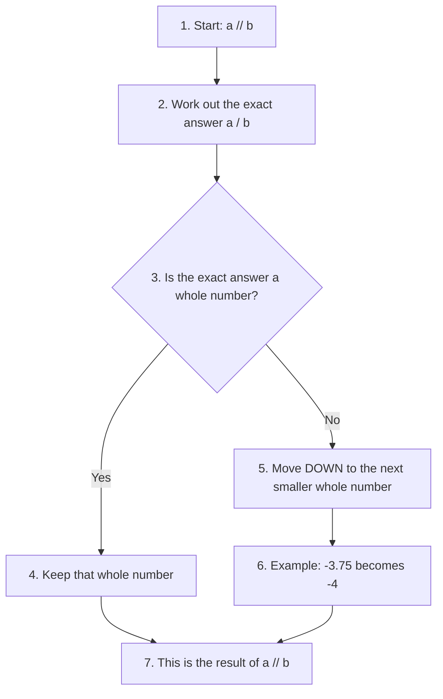

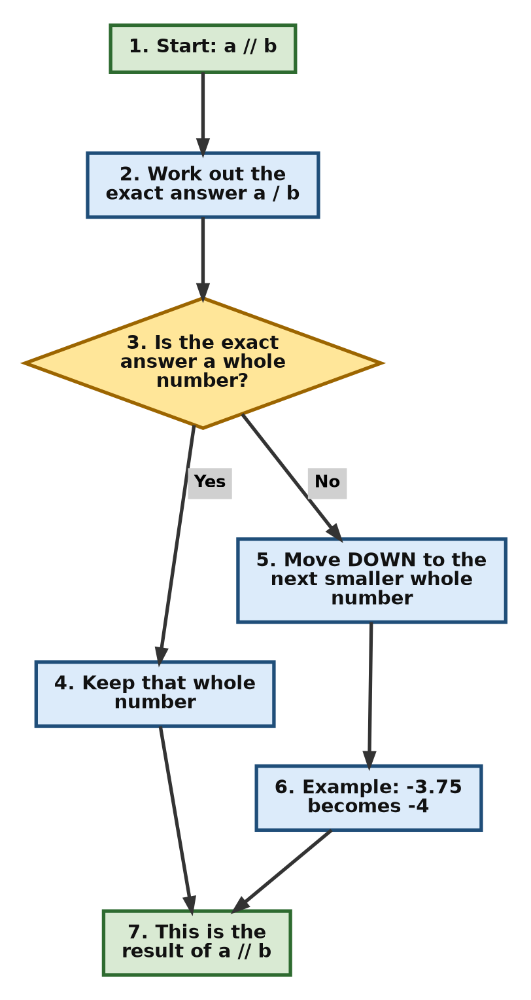

[Back to the Table of Contents](#table-of-contents)

### 3.4 The Remainder Operator with Negative Numbers

The `%` operator is linked to `//`. Python makes sure that this rule is always true:

```
a == b * (a // b) + (a % b)
```

Because `//` rounds down, the remainder `%` always has the **same sign as the number you divide by** (the divisor). For example, `-17 // 5` is `-4`, so `-17 % 5` must be `3`, because `5 * (-4) + 3 = -17`.

The built-in function [`divmod(a, b)`](https://docs.python.org/3/library/functions.html#divmod) gives both answers at once as a pair `(a // b, a % b)`.

```python
# Step 1: Remainder with positive numbers
print(17 % 5)        # 2

# Step 2: Remainder with a negative number on the left
print(-17 % 5)       # 3   the result takes the sign of the divisor (5)

# Step 3: Remainder with a negative divisor
print(17 % -5)       # -3  the result takes the sign of the divisor (-5)

# Step 4: divmod() gives quotient and remainder together
q, r = divmod(-17, 5)
print(q, r)          # -4 3

# Step 5: Check the rule a == b * (a // b) + (a % b)
a, b = -17, 5
print(a == b * (a // b) + (a % b))   # True
```

Output:

```text
2
3
-3
-4 3
True
```

[Back to the Table of Contents](#table-of-contents)

## 4. Bitwise Operations (Advanced Feature)

Every integer is stored in the computer as a pattern of bits (0s and 1s). **Bitwise operators** work directly on these bits. Beginners rarely need them. They are used in areas such as networking, graphics, hardware control and fast low-level tricks.

[Back to the Table of Contents](#table-of-contents)

### 4.1 The Bitwise Operators

Python supports all the usual bitwise operations. The examples use `a = 12` (binary `1100`) and `b = 10` (binary `1010`).

| Operator | Name | What it does | Example | Result |
| -------- | ---- | ------------ | ------- | ------ |
| `&` | Bitwise AND | Gives 1 only where **both** bits are 1 | `a & b` | `8` |
| `\|` | Bitwise OR | Gives 1 where **either** bit is 1 | `a \| b` | `14` |
| `^` | Bitwise XOR (exclusive OR) | Gives 1 where the bits are **different** | `a ^ b` | `6` |
| `~` | Bitwise NOT | Flips every bit. For integers, `~x` equals `-(x + 1)` | `~a` | `-13` |
| `<<` | Left shift | Moves all bits to the left and fills the right with zeros. Same as multiplying by `2 ** n` | `a << 2` | `48` |
| `>>` | Right shift | Moves all bits to the right and drops the bits that fall off. Same as floor dividing by `2 ** n` | `a >> 2` | `3` |

The next table shows AND, OR and XOR one bit at a time. Read each column from top to bottom.

| Place value | 8 | 4 | 2 | 1 |
| ----------- | - | - | - | - |
| `a = 12` | 1 | 1 | 0 | 0 |
| `b = 10` | 1 | 0 | 1 | 0 |
| `a & b = 8` | 1 | 0 | 0 | 0 |
| `a \| b = 14` | 1 | 1 | 1 | 0 |
| `a ^ b = 6` | 0 | 1 | 1 | 0 |

Why is `~12` equal to `-13`? Python treats negative integers as if they used the [two's complement](https://en.wikipedia.org/wiki/Two%27s_complement) system, with an unlimited supply of 1 bits on the left. Flipping every bit of `12` gives the pattern for `-13`. The simple rule to remember is `~x == -(x + 1)`.

[Back to the Table of Contents](#table-of-contents)

### 4.2 Bitwise Operators in Action

The function `format(number, "04b")` shows a number in binary, padded with zeros to at least 4 places.

```python
# Step 1: Pick two numbers and look at their binary form
a = 12   # 1100 in binary
b = 10   # 1010 in binary
print("a      =", format(a, "04b"))
print("b      =", format(b, "04b"))

# Step 2: AND, OR and XOR compare the bits one position at a time
print("a & b  =", format(a & b, "04b"), "=", a & b)    # 1 only where both are 1
print("a | b  =", format(a | b, "04b"), "=", a | b)    # 1 where either is 1
print("a ^ b  =", format(a ^ b, "04b"), "=", a ^ b)    # 1 where they differ

# Step 3: NOT flips the sign and subtracts 1, so ~a == -(a + 1)
print("~a     =", ~a)

# Step 4: Shifts move all bits left or right
print("a << 2 =", format(a << 2, "b"), "=", a << 2)   # 12 * 4
print("a >> 2 =", format(a >> 2, "b"), "=", a >> 2)   # 12 // 4

# Step 5: The example from the text
print(10 << 3)    # 80
```

Output:

```text
a      = 1100
b      = 1010
a & b  = 1000 = 8
a | b  = 1110 = 14
a ^ b  = 0110 = 6
~a     = -13
a << 2 = 110000 = 48
a >> 2 = 11 = 3
80
```

Learn more: [Bitwise operations on integer types](https://docs.python.org/3/library/stdtypes.html#bitwise-operations-on-integer-types).

[Back to the Table of Contents](#table-of-contents)

## 5. Advanced Concept: How the Left Shift Works (Example: 10 Shifted Left by 3)

<details>

<summary>Click to open this section: explanation of the bitwise operation 10 &lt;&lt; 3</summary>

The operator `<<` is the **bitwise left shift** operator. It shifts the binary form of a number **to the left** by the number of places you give it. Empty places on the right are filled with zeros.

**Step 1: Convert 10 to binary**

```
10 (decimal) = 1010 (binary)
```

This is because 10 = 8 + 2, and 8 and 2 are the place values of the two 1s in `1010`.

**Step 2: Shift left by 3 positions**

`10 << 3` means "move every bit 3 places to the left":

```
1010 << 3 = 1010000
```

Three zeros are added on the right.

**Step 3: Convert the result back to decimal**

| Place value | 64 | 32 | 16 | 8 | 4 | 2 | 1 |
| ----------- | -- | -- | -- | - | - | - | - |
| `10` | | | | 1 | 0 | 1 | 0 |
| `10 << 3` | 1 | 0 | 1 | 0 | 0 | 0 | 0 |

Binary `1010000` has 1s in the 64 place and the 16 place:

```
1×64 + 1×16 = 80
```

So:

```
10 << 3 = 80
```

**Why it works**

Each step to the left doubles a bit's place value, just as each step to the left in decimal multiplies by 10. So shifting left by `n` bits is the same as multiplying by `2ⁿ`:

```
10 << 3  =  10 × (2³)
         =  10 × 8
         =  80
```

**The same steps as a flowchart**

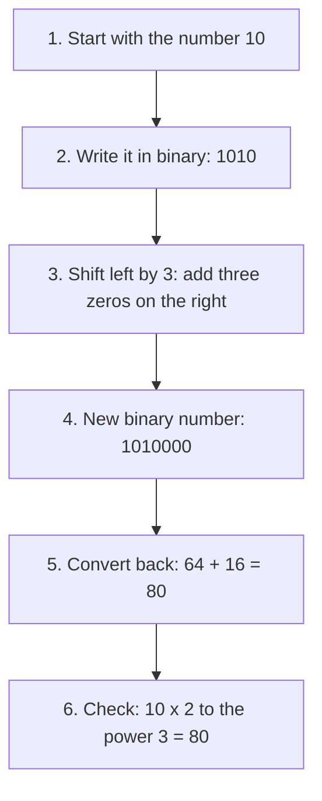

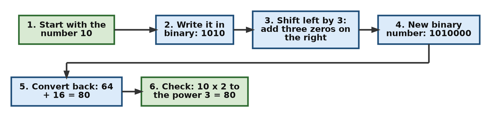

**The same steps in Python**

```python
# Step 1: Look at 10 in binary
number = 10
print("10 in binary      :", bin(number))

# Step 2: Shift it left by 3 places
shifted = number << 3
print("After << 3        :", bin(shifted))

# Step 3: Read the result as a decimal number
print("Result in decimal :", shifted)

# Step 4: Check that shifting left by 3 is the same as multiplying by 2**3
print("10 * 2**3         :", number * 2 ** 3)
```

Output:

```text
10 in binary      : 0b1010
After << 3        : 0b1010000
Result in decimal : 80
10 * 2**3         : 80
```

**Final answer**

```
10 << 3 = 80
```

</details>

[Back to the Table of Contents](#table-of-contents)

## 6. Advanced Concept: Shifting Very Large Integers

<details>

<summary>Click to open this section: what does "Large integers can be shifted arbitrarily because Python supports arbitrary precision" mean?</summary>

Let us understand the statement: **"Large integers can be shifted arbitrarily because Python supports arbitrary precision."**

**Step 1: What is arbitrary precision?**

* In many languages (C, C++, Java), integers have a **fixed number of bits**, for example 32 or 64.
* This means numbers have a maximum possible size.
* Shifting such a number too far can cause:
  * overflow (the result is too big to fit),
  * loss of bits (bits fall off the left end and disappear),
  * wrap-around (a big positive number suddenly becomes negative),
  * undefined behaviour (in C and C++, the language does not say what the result should be, so anything may happen).

Python is different:

* Python integers have **no fixed size limit**.
* They grow automatically to any size, limited only by the available memory.

**Step 2: What does "shifted arbitrarily" mean?**

* The left shift `<<` adds zeros to the right side of a binary number, so the number gets longer.
* In fixed-size languages, shifting too far is impossible or unsafe. In C, for example, shifting a 32-bit number by 32 or more places is undefined.
* **In Python, you can shift a number by any number of bits**, even thousands or millions.

```python
x = 5
y = x << 1000    # shift by 1000 bits
```

This works normally in Python.

**Step 3: Example of a large shift**

```python
# Step 1: Shift 1 left by 200 bits (the same as 2 ** 200)
x = 1
y = x << 200
print(y)

# Step 2: Shift 5 left by 1000 bits. No overflow happens
z = 5 << 1000
print("Digits in z:", len(str(z)))
print("Bits in z  :", z.bit_length())

# Step 3: Shift back by 1000 bits and we get 5 again
print("z >> 1000  :", z >> 1000)
```

Output:

```text
1606938044258990275541962092341162602522202993782792835301376
Digits in z: 302
Bits in z  : 1003
z >> 1000  : 5
```

The first line is `2 ** 200`, a 61-digit number. Python handles it, and the much bigger `5 << 1000`, without any trouble because it makes the integer bigger as needed. Shifting back with `>>` returns the original `5`, which shows that no bits were lost.

**Step 4: Why Python can do this**

* A left shift creates a longer binary number.
* Python does not limit integers to 32 or 64 bits.
* It creates a larger integer object whenever one is needed.
* Therefore, no overflow occurs.

**Summary**

* Python integers can grow to any size. This is called **arbitrary precision**.
* A left shift (`<<`) can be done by any number of places.
* Python automatically sets aside more memory to store the larger integer.
* This is why **large integers can be shifted arbitrarily** in Python.

</details>

[Back to the Table of Contents](#table-of-contents)

## 7. Type Conversions: Turning Other Values into int

The built-in function [`int()`](https://docs.python.org/3/library/functions.html#int) converts a value into an integer. It accepts:

* a string that holds a whole number (spaces at either end and a single `+` or `-` sign are allowed),
* a string written in another base, if you also tell `int()` the base,
* a float (the part after the decimal point is cut off),
* a bool (`True` becomes `1`, `False` becomes `0`).

If the value cannot be converted, `int()` raises an exception. It raises `ValueError` when the type is right but the text is wrong, such as `int("abc")`. It raises `TypeError` when the type itself cannot be converted, such as `int(None)`.

[Back to the Table of Contents](#table-of-contents)

### 7.1 The Conversion Script

```python
# Step 1: Strings that hold whole numbers
print(int("123"))     # string to int because "123" is a valid integer representation
print(int(" 456 "))   # string with whitespace to int
print(int("-42"))     # negative string to int because "-42" is a valid integer representation
print(int("+99"))     # positive string to int because "+99" is a valid integer representation
print(int("007"))     # string with leading zeros to int because "007" is a valid integer representation

# Step 2: Strings written in other bases (tell int() the base)
print(int("0b101", 2))    # binary string to int because "0b101" is a valid binary representation
print(int("0o77", 8))     # octal string to int because "0o77" is a valid octal representation
print(int("0x1A", 16))    # hexadecimal string to int because "0x1A" is a valid hexadecimal representation
print(int("101", 2))      # the prefix is optional when the base is given
print(int("0x1A", 0))     # base 0 means "read the base from the prefix"

# Step 3: Floats (the part after the decimal point is cut off)
print(int(3.14))      # float -> int (truncates) because 3.14 is a float
print(int(-3.99))     # truncates toward zero, so the answer is -3
print(int(1e3))       # scientific notation float to int (truncates) because 1e3 is a float

# Step 4: Booleans
print(int(True))      # 1 Since True is 1
print(int(False))     # 0 Since False is 0

# Step 5: Values that cannot be converted raise an exception
bad_values = ["", "abc", "3.5", None, [], [1, 2]]
for value in bad_values:
    try:
        int(value)
    except (ValueError, TypeError) as error:
        print(repr(value), "->", type(error).__name__)
```

Output:

```text
123
456
-42
99
7
5
63
26
5
26
3
-3
1000
1
0
'' -> ValueError
'abc' -> ValueError
'3.5' -> ValueError
None -> TypeError
[] -> TypeError
[1, 2] -> TypeError
```

A few points to note:

* When you pass a base, the prefix (`0b`, `0o`, `0x`) is optional. `int("101", 2)` and `int("0b101", 2)` both give `5`.
* Without a base, `int()` assumes base 10. So `int("0b101")` fails with `ValueError`, because `b` is not a decimal digit.
* Base `0` is special. It tells `int()` to work out the base from the prefix, just as Python does when it reads your code.
* `int("3.5")` fails because a decimal point is not allowed in the text. Use `int(float("3.5"))` instead.

[Back to the Table of Contents](#table-of-contents)

### 7.2 How int() Decides What to Do

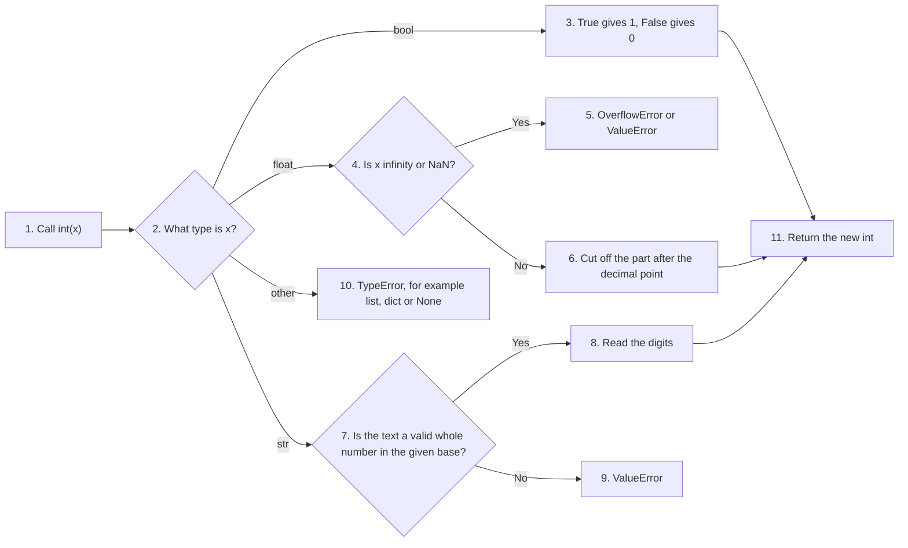

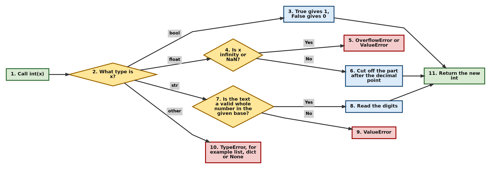

Branch numbers: the bool branch is step 3, the float branch is steps 4 to 6, the string branch is steps 7 to 9 and the other branch is step 10. The three successful branches meet again at step 11.

[Back to the Table of Contents](#table-of-contents)

### 7.3 int() Truncates, It Does Not Round

When `int()` converts a float, it simply cuts off (truncates) everything after the decimal point. This always moves the number **toward zero**.

| Value | `int(value)` | `//` style rounding (down) | `round(value)` |
| ----- | ------------ | -------------------------- | -------------- |
| `3.14` | `3` | `3` | `3` |
| `3.99` | `3` | `3` | `4` |
| `-3.99` | `-3` | `-4` | `-4` |

Notice the last row. `int(-3.99)` gives `-3` (toward zero), but floor division style rounding gives `-4` (down). Keep this difference in mind when you work with negative numbers.

[Back to the Table of Contents](#table-of-contents)

## 8. Converting an Integer to Other Types

An integer can be turned into a float, a complex number or a string. It can also be shown as text in binary, octal or hexadecimal.

```python
# Step 1: int to float and complex
print(float(5))     # 5.0 because int can be converted to float
print(complex(3))   # (3+0j) int promoted to complex

# Step 2: int to string
print(str(123))         # "123" int to string (print does not show the quotes)
print(repr(str(123)))   # '123' repr() shows the quotes, so we can see it is a string

# Step 3: int to text in other bases
print(bin(10))      # 0b1010
print(oct(10))      # 0o12
print(hex(255))     # 0xff
```

Output:

```text
5.0
(3+0j)
123
'123'
0b1010
0o12
0xff
```

| Function | What it gives | Example | Result |
| -------- | ------------- | ------- | ------ |
| `float(x)` | A float | `float(5)` | `5.0` |
| `complex(x)` | A complex number | `complex(3)` | `(3+0j)` |
| `str(x)` | Decimal text | `str(123)` | `'123'` |
| `bin(x)` | Binary text | `bin(10)` | `'0b1010'` |
| `oct(x)` | Octal text | `oct(10)` | `'0o12'` |
| `hex(x)` | Hexadecimal text | `hex(255)` | `'0xff'` |

Note that `print()` shows a string without its quotes. The quotes in the last column only remind you that the result is a string.

[Back to the Table of Contents](#table-of-contents)

## 9. Relationship of int with bool (Subclassing)

In Python:

```
bool is a subclass of int
```

This means:

* `True` behaves as `1`
* `False` behaves as `0`

[Back to the Table of Contents](#table-of-contents)

### 9.1 What Subclass Means Here

A **subclass** is a type that is built on top of another type. It gets all the behaviour of the parent type and may add some of its own. Because `bool` is built on top of `int`:

* `True` and `False` are real integers. You can add them, multiply them and use them anywhere an `int` is expected.
* `isinstance(True, int)` returns `True`.
* `bool` adds its own way of printing. `print(True)` shows `True`, not `1`.

A common use is counting. Because `True` counts as 1, `sum()` of a list of True/False values tells you how many are `True`.

[Back to the Table of Contents](#table-of-contents)

### 9.2 Truthiness: What Counts as True or False

Python can treat any value as true or false, for example in an `if` statement. The function `bool()` shows you which one it is. The rule is simple: **zero and empty things are false; almost everything else is true.**

| Treated as `False` | Treated as `True` |
| ------------------ | ----------------- |
| `False`, `None` | `True` |
| `0`, `0.0`, `0j` | Any non-zero number, such as `1`, `-1`, `0.1` |
| `""` (empty string) | Any non-empty string, such as `"Hello"` or even `" "` |
| `[]`, `()`, `{}`, `set()`, `range(0)` | Any non-empty list, tuple, dictionary or set |
| | Most other objects, such as `object()` |

Learn more: [Truth value testing](https://docs.python.org/3/library/stdtypes.html#truth-value-testing).

[Back to the Table of Contents](#table-of-contents)

### 9.3 The Complete bool Script

The script below explores the link between `bool` and `int` from many angles. It is grouped into steps so that it is easier to follow.

```python
# Step 1: bool is a subclass of int
print(issubclass(bool, int))   # True Since bool is a subclass of int
print(isinstance(True, int))   # True Since True is an instance of int
print(isinstance(False, int))  # True Since False is an instance of int
print(True.__class__)          # <class 'bool'> Since True is an instance of bool
print(False.__class__)         # <class 'bool'> Since False is an instance of bool

# Step 2: Arithmetic with True (1) and False (0)
print(True + 1)                # 2 Since True is 1
print(False + 1)               # 1 Since False is 0
print(True * 10)               # 10 Since True is 1
print(False * 10)              # 0 Since False is 0
print(sum([True, False, True, True]))  # 3 Since True is 1 and False is 0
print(divmod(5, True))         # (5, 0) Since divmod returns quotient and remainder
#print(divmod(5, False))       # Raises ZeroDivisionError Since dividing by False (zero) is not allowed
try:
    print(divmod(5, False))
except ZeroDivisionError:
    print("Cannot divide by False (zero)")
print(pow(2, True))            # 2 Since 2 raised to the power of True (1) is 2
print(pow(2, False))           # 1 Since 2 raised to the power of False (0) is 1
print(abs(True))               # 1 Since absolute value of True (1) is 1
print(abs(False))              # 0 Since absolute value of False (0) is 0
print(round(True))             # 1 Since rounding True (1) is 1
print(round(False))            # 0 Since rounding False (0) is 0

# Step 3: Converting between bool and other types
print(int(True))               # 1 Since True is 1
print(int(False))              # 0 Since False is 0
print(float(True))             # 1.0 Since float conversion of True (1) is 1.0
print(float(False))            # 0.0 Since float conversion of False (0) is 0.0
print(complex(True))           # (1+0j) Since complex conversion of True (1) is (1+0j)
print(complex(False))          # 0j Since complex conversion of False (0) is 0j
print(str(True))               # True  (str() gives the text 'True'; print shows it without quotes)
print(str(False))              # False (str() gives the text 'False')
print(repr(True))              # True  (repr() also gives the text 'True')
print(repr(False))             # False
print(bin(int(True)))          # 0b1 binary form of 1
print(bin(int(False)))         # 0b0 binary form of 0
print(hex(int(True)))          # 0x1 hexadecimal form of 1
print(hex(int(False)))         # 0x0 hexadecimal form of 0
print(oct(int(True)))          # 0o1 octal form of 1
print(oct(int(False)))         # 0o0 octal form of 0

# Step 4: Truthiness - what bool() says about other values
print(bool(1))                 # True Since 1 is non-zero
print(bool(0))                 # False Since 0 is zero
print(bool(-1))                # True Since -1 is non-zero
print(bool(0.0))               # False Since 0.0 is zero
print(bool(0.1))               # True Since 0.1 is non-zero
print(bool([]))                # False Since empty list is False
print(bool([1, 2, 3]))         # True Since non-empty list is True
print(bool(""))                # False Since empty string is False
print(bool("Hello"))           # True Since non-empty string is True
print(bool(None))              # False Since None is False
print(bool(object()))          # True Since object instance is True

# Step 5: Comparing bool with int
print(True == 1)               # True Since True is 1
print(False == 0)              # True Since False is 0
print(True  is  1)             # False Since True and 1 are different objects
print(False  is  0)            # False Since False and 0 are different objects
print(True > False)            # True Since True is greater than False
print(False < True)            # True Since False is less than True
print(hash(True))              # 1 Since hash(True) returns 1
print(hash(False))             # 0 Since hash(False) returns 0

# Step 6: Bitwise methods and bit length
print(True.__and__(False))     # False Since True AND False is False
print(True.__or__(False))      # True Since True OR False is True
print(True.__xor__(False))     # True Since True XOR False is True
print(False.__and__(True))     # False Since False AND True is False
print(False.__or__(True))      # True Since False OR True is True
print(False.__xor__(True))     # True Since False XOR True is True
print(True.bit_length())       # 1 Since bit length of 1 is 1
print(False.bit_length())      # 0 Since bit length of 0 is 0

# Step 7: bool values inside collections
print((True, False))           # (True, False) Since this is a tuple containing True and False
print([True, False])           # [True, False] Since this is a list containing True and False
print({True: "yes", False: "no"})   # {True: 'yes', False: 'no'} Since this is a dictionary with boolean keys
print({True, False})           # {False, True} Since this is a set containing True and False
print(len({True, False}))      # 2 Since the set has two elements
print(sorted([False, True, True, False]))   # [False, False, True, True] Since the list is sorted
print([True, False, True].count(True))      # 2 Count of True in the list
print([True, False, True].count(False))     # 1 Count of False in the list
print([True, False, True].index(False))     # 1 Index of first occurrence of False

# Step 8: bool with built-in functions all(), any(), map(), filter() and zip()
print(all([True, True, True]))     # True Since all elements are True
print(all([True, False, True]))    # False Since not all elements are True
print(any([False, False, False]))  # False Since no elements are True
print(any([False, True, False]))   # True Since at least one element is True
print(map(int, [True, False, True]))           # <map object ...> Since map returns a map object
print(list(map(int, [True, False, True])))     # [1, 0, 1] Since list converts map to a list
print(filter(bool, [0, 1, "", "Hello", [], [1]]))         # <filter object ...> Since filter returns a filter object
print(list(filter(bool, [0, 1, "", "Hello", [], [1]])))   # [1, 'Hello', [1]] Since list converts filter to a list
print(zip([True, False], [1, 0]))              # <zip object ...> Since zip returns a zip object
print(list(zip([True, False], [1, 0])))        # [(True, 1), (False, 0)] Since list converts zip to a list
```

Output:

```text
True
True
True
<class 'bool'>
<class 'bool'>
2
1
10
0
3
(5, 0)
Cannot divide by False (zero)
2
1
1
0
1
0
1
0
1.0
0.0
(1+0j)
0j
True
False
True
False
0b1
0b0
0x1
0x0
0o1
0o0
True
False
True
False
True
False
True
False
True
False
True
True
True
False
False
True
True
1
0
False
True
True
False
True
True
1
0
(True, False)
[True, False]
{True: 'yes', False: 'no'}
{False, True}
2
[False, False, True, True]
2
1
1
True
False
False
True
<map object at 0x7f6d5d03b7c0>
[1, 0, 1]
<filter object at 0x7f6d5d03b7f0>
[1, 'Hello', [1]]
<zip object at 0x7f6d5d046980>
[(True, 1), (False, 0)]
```

Some notes on this output:

* The lines `print(True  is  1)` and `print(False  is  0)` print `False`. The `is` operator checks whether two names point to the **same object**, and `True` and `1` are different objects even though they are equal in value. Python 3.8 and later also prints a `SyntaxWarning` for these two lines, suggesting that you meant `==`. The warning is a helpful hint, not an error. To compare values, always use `==`.
* `map()`, `filter()` and `zip()` do not build a list straight away. They return a special object that produces values only when asked. That is why printing them shows something like `<map object at 0x7f4058436a40>`. The number after `at` is a memory address and will be different on your computer. Wrap them in `list()` to see the values.
* `{True, False}` prints as `{False, True}`. A set has no fixed order, and here Python happens to show `False` (0) first.

[Back to the Table of Contents](#table-of-contents)

## 10. Interactions of int with float and complex (Type Promotion)

Python uses numeric tower widening:

```
int → float → complex
```

Examples:

```python
# Step 1: int + float gives a float
result = 5 + 2.5
print(result, type(result))    # 7.5 int promoted to float

# Step 2: int + complex gives a complex
result = 5 + 2j
print(result, type(result))    # (5+2j) int promoted to complex

# Step 3: float + complex also gives a complex
result = 1.5 + 2j
print(result, type(result))

# Step 4: int + int stays an int
result = 5 + 2
print(result, type(result))
```

Output:

```text
7.5 <class 'float'>
(5+2j) <class 'complex'>
(1.5+2j) <class 'complex'>
7 <class 'int'>
```

[Back to the Table of Contents](#table-of-contents)

### 10.1 What Is Numeric Tower Widening?

When Python does arithmetic with numbers of **different types**, it first converts ("promotes") the simpler type into the more capable type, so that the operation makes sense.

Python follows this order:

`int → float → complex`

This order is called the **numeric tower**. Think of it as a staircase. A number can always climb up the stairs:

* every `int` can be written as a `float` (for example, `5` as `5.0`),
* every `float` can be written as a `complex` number (for example, `2.5` as `2.5+0j`).

Going down the stairs is not automatic, because information could be lost. For example, `2.5` cannot become an `int` without losing the `.5`. So Python never does that on its own. You must ask for it with `int()`.

Learn more: [Numeric types](https://docs.python.org/3/library/stdtypes.html#numeric-types-int-float-complex) and the [numbers module](https://docs.python.org/3/library/numbers.html).

[Back to the Table of Contents](#table-of-contents)

### 10.2 How Python Picks the Result Type

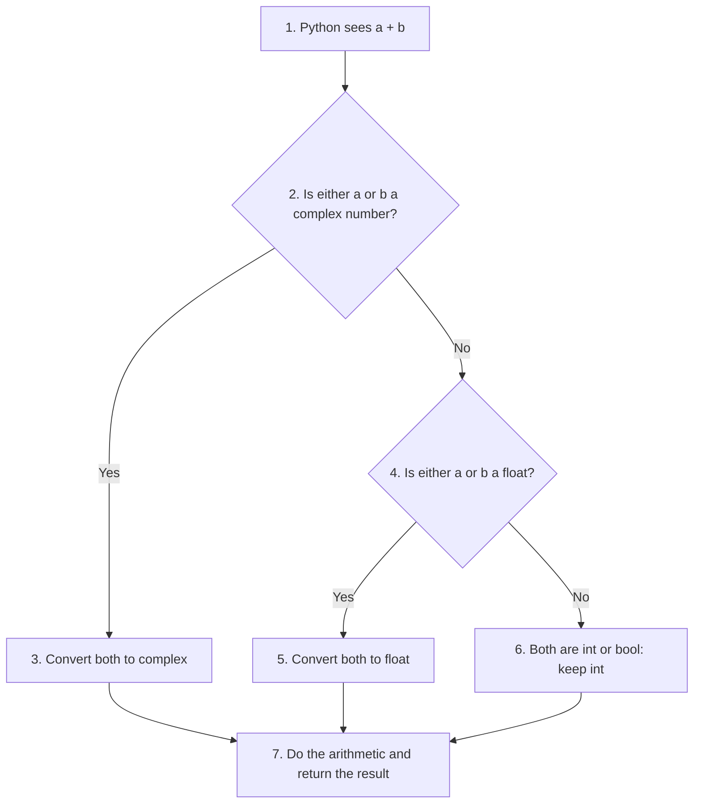

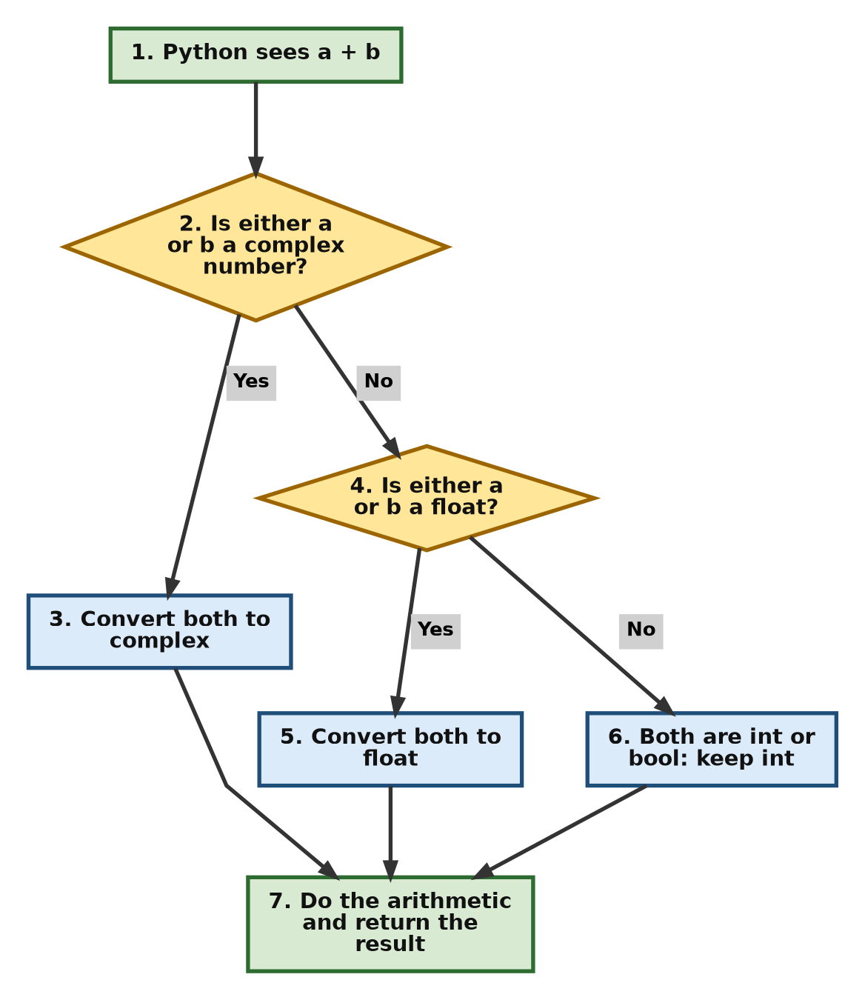

| Left operand | Right operand | Result type | Example | Result |
| ------------ | ------------- | ----------- | ------- | ------ |
| `int` | `int` | `int` | `5 + 2` | `7` |
| `int` | `float` | `float` | `5 + 2.5` | `7.5` |
| `int` | `complex` | `complex` | `5 + 2j` | `(5+2j)` |
| `float` | `complex` | `complex` | `1.5 + 2j` | `(1.5+2j)` |
| `bool` | `int` | `int` | `True + 1` | `2` |

Remember that `/` is an exception. It always gives a float, even for two integers.

[Back to the Table of Contents](#table-of-contents)

### 10.3 When Promotion Can Lose Information

Promotion from `int` to `float` is usually safe, but not always. A `float` has a fixed size (64 bits), so:

* it can store every whole number exactly only up to `2 ** 53`, which is 9,007,199,254,740,992. Beyond that, some integers cannot be stored exactly, and the float is rounded to the nearest value it can hold,
* it cannot hold numbers larger than about 1.8 × 10³⁰⁸ at all. Converting a bigger integer raises `OverflowError`.

```python
# Step 1: A float can hold whole numbers exactly only up to 2**53
n = 2 ** 53 + 1
print("int value  :", n)
print("as a float :", float(n))          # the last digit changes
print("equal?     :", n == float(n))     # False

# Step 2: Mixing a huge int with a float can fail
big = 10 ** 400
try:
    print(big + 1.0)
except OverflowError as error:
    print("OverflowError:", error)

# Step 3: Keep everything as int when you need exact answers
print(big + 1 > big)    # True
```

Output:

```text
int value  : 9007199254740993
as a float : 9007199254740992.0
equal?     : False
OverflowError: int too large to convert to float
True
```

So when you need exact answers with large numbers, keep all the values as integers. Learn more: [Floating-point arithmetic: issues and limitations](https://docs.python.org/3/tutorial/floatingpoint.html).

[Back to the Table of Contents](#table-of-contents)

## 11. Advanced Concept: Memory Usage

The memory an integer uses grows with the size of the number.

[Back to the Table of Contents](#table-of-contents)

### 11.1 How Much Memory an Integer Needs

On a 64-bit computer running Python 3.12, the size of an integer is roughly:

```
24 bytes + 4 bytes for every 30-bit "digit"
```

* The 24 bytes hold the information that every integer object needs: a reference count (how many names use the object), a pointer to its type (`int`) and a record of its length and sign.
* Each 30-bit "digit" is stored in 4 bytes (32 bits). Python uses only 30 of the 32 bits, which makes its arithmetic easier.
* Even `0` and `1` use one digit, so the smallest integer takes 28 bytes.

For example, `10 ** 100` needs 333 bits. That is 12 digits of 30 bits each (12 × 30 = 360 ≥ 333). So its size is 24 + 12 × 4 = 72 bytes.

Older versions give slightly different numbers. In Python 3.11, for example, `sys.getsizeof(0)` returns 24. The general idea (a fixed part plus a bit more for each digit) is the same in every version.

[Back to the Table of Contents](#table-of-contents)

### 11.2 Measuring Integer Size with sys.getsizeof

The function [`sys.getsizeof()`](https://docs.python.org/3/library/sys.html#sys.getsizeof) returns the size of an object in bytes. The method `bit_length()` returns how many bits a number needs, without the sign.

```python
import sys

# Step 1: Pick integers of different sizes
values = [0, 1, 2**30, 2**60, 10**100, -10**100, int("9" * 1000)]
labels = ["0", "1", "2**30", "2**60", "10**100", "-10**100", "9 repeated 1000 times"]

# Step 2: For each value, show its size in bits and bytes
for label, value in zip(labels, values):
    bits = abs(value).bit_length()          # how many binary digits the number needs
    chunks = max(1, (bits + 29) // 30)      # how many 30-bit "digits" Python stores
    size = sys.getsizeof(value)             # total size of the object in bytes
    print(f"{label:>22} | bits: {bits:5} | 30-bit digits: {chunks:4} | bytes: {size}")
```

Output:

```text
                     0 | bits:     0 | 30-bit digits:    1 | bytes: 28
                     1 | bits:     1 | 30-bit digits:    1 | bytes: 28
                 2**30 | bits:    31 | 30-bit digits:    2 | bytes: 32
                 2**60 | bits:    61 | 30-bit digits:    3 | bytes: 36
               10**100 | bits:   333 | 30-bit digits:   12 | bytes: 72
              -10**100 | bits:   333 | 30-bit digits:   12 | bytes: 72
 9 repeated 1000 times | bits:  3322 | 30-bit digits:  111 | bytes: 468
```

Notice that a negative number uses the same memory as the matching positive number. Python stores the sign separately.

[Back to the Table of Contents](#table-of-contents)

### 11.3 Working with Very Large Integers

The next script tries many operations on very large integers. Printing a 1000-digit number would fill the screen, so Step 1 creates a small helper function called `short()`. It shows the first 10 digits, the last 10 digits and how many digits there are in total. Small numbers are printed in full.

```python
import sys

# Step 1: A small helper so huge numbers fit on one line.
# It shows the first 10 and last 10 digits and the total digit count.
def short(n):
    """Return a short description of a (possibly huge) integer."""
    text = str(n)
    sign = "-" if text.startswith("-") else ""
    digits = text.lstrip("-")
    if len(digits) <= 25:
        return text
    return f"{sign}{digits[:10]}...{digits[-10:]} ({len(digits)} digits)"

# Step 2: Size of large integers in memory
print(sys.getsizeof(10**100))      # Gives size of a large integer in bytes
print(sys.getsizeof(-10**100))     # Gives size of a large negative integer in bytes

# Step 3: Arithmetic with very large integers
print(short(10**1000))             # A very large integer
print(short(-10**1000))            # A very large negative integer
print(short(10**1000 + 10**999))   # Addition of large integers
print(short(10**1000 - 10**999))   # Subtraction of large integers
print(short(10**1000 * 10**999))   # Multiplication of large integers
print(10**1000 // 10**999)         # Floor division of large integers
print(10**1000 % 10**999)          # Modulus of large integers
print(short(pow(10**100, 2)))      # Power of a large integer
print(divmod(10**1000, 10**999))   # Divmod of large integers

# Step 4: Comparison, hash and abs
print(10**1000 == 10**1000)        # Equality comparison of large integers
print(10**1000 > 10**999)          # Greater than comparison of large integers
print(10**1000 < 10**999)          # Less than comparison of large integers
print(hash(10**1000))              # Hash of a large integer
print(short(abs(-10**1000)))       # Absolute value of a large negative integer

# Step 5: Binary, octal and hexadecimal text
print(bin(10**10))                 # Binary representation of a large integer
print(oct(10**10))                 # Octal representation of a large integer
print(hex(10**10))                 # Hexadecimal representation of a large integer

# Step 6: Creating large integers from strings and floats
print(int("123456789012345678901234567890"))      # String to large int conversion
print(int("-123456789012345678901234567890"))     # String to large negative int conversion
print(int(" 456789012345678901234567890 "))       # String with whitespace to large int conversion
print(int(1e20))                                  # Float to large int conversion (truncates)
print(short(int("0b" + "1"*100, 2)))              # Large binary string to int conversion with base
print(short(int("0o" + "7"*100, 8)))              # Large octal string to int conversion with base
print(short(int("0x" + "F"*100, 16)))             # Large hexadecimal string to int conversion with base
print(short(int("+" + "9"*100)))                  # Large positive string to int conversion
print(short(int("-" + "9"*100)))                  # Large negative string to int conversion
print(int("0"*100 + "1"))                         # Large string with leading zeros to int conversion

# Step 7: Working with a 1000-digit number made from a string
big = int("9"*1000)
print(sys.getsizeof(big))          # Size of a very large integer created from string
print(short(big + 1))              # Addition with a very large integer
print(short(big * 2))              # Multiplication with a very large integer
print(short(big // 3))             # Floor division with a very large integer
print(big % 7)                     # Modulus with a very large integer
print(short(pow(int("9"*500), 2))) # Power of a very large integer created from string
q, r = divmod(big, 8)              # Divmod with a very large integer
print(short(q), r)
print(big == int("9"*1000))        # Equality comparison of very large integers
print(big > int("8"*1000))         # Greater than comparison of very large integers
print(big < int("10"*999))         # Less than comparison of very large integers
print(hash(big))                   # Hash of a very large integer created from string
print(short(abs(-big)))            # Absolute value of a very large negative integer
print(bin(int("9"*20)))            # Binary representation of a 20-digit integer
print(oct(int("9"*20)))            # Octal representation of a 20-digit integer
print(hex(int("9"*20)))            # Hexadecimal representation of a 20-digit integer

# Step 8: Conversions that fail (each one is caught so the script keeps running)
tests = [
    ("int('')", lambda: int("")),
    ("int('abc')", lambda: int("abc")),
    ("int(None)", lambda: int(None)),
    ("int([])", lambda: int([])),
    ("int([1, 2])", lambda: int([1, 2])),
    ("int({1: 'a'})", lambda: int({1: 'a'})),
    ("int('0b2', 2)", lambda: int("0b2", 2)),
    ("int('0o8', 8)", lambda: int("0o8", 8)),
    ("int('0xG', 16)", lambda: int("0xG", 16)),
    ("int('12AB', 10)", lambda: int("12AB", 10)),
    ("int('++123')", lambda: int("++123")),
    ("int('--123')", lambda: int("--123")),
    ("int('00A7')", lambda: int("00A7")),
    ("int(1e400)", lambda: int(1e400)),
    ("int('0b' + '1'*100)", lambda: int("0b" + "1"*100)),
]
for text, attempt in tests:
    try:
        attempt()
        print(f"{text:22} -> worked")
    except (ValueError, TypeError, OverflowError) as error:
        print(f"{text:22} -> {type(error).__name__}")
```

Output:

```text
72
72
1000000000...0000000000 (1001 digits)
-1000000000...0000000000 (1001 digits)
1100000000...0000000000 (1001 digits)
9000000000...0000000000 (1000 digits)
1000000000...0000000000 (2000 digits)
10
0
1000000000...0000000000 (201 digits)
(10, 0)
True
True
False
88588427293594263
1000000000...0000000000 (1001 digits)
0b1001010100000010111110010000000000
0o112402762000
0x2540be400
123456789012345678901234567890
-123456789012345678901234567890
456789012345678901234567890
100000000000000000000
1267650600...6703205375 (31 digits)
2037035976...6183397375 (91 digits)
2582249878...2747493375 (121 digits)
9999999999...9999999999 (100 digits)
-9999999999...9999999999 (100 digits)
1
468
1000000000...0000000000 (1001 digits)
1999999999...9999999998 (1001 digits)
3333333333...3333333333 (1000 digits)
3
9999999999...0000000001 (1000 digits)
1249999999...9999999999 (1000 digits) 7
True
True
True
88588427293594262
9999999999...9999999999 (1000 digits)
0b1010110101111000111010111100010110101100011000011111111111111111111
0o12657072742654303777777
0x56bc75e2d630fffff
int('')                -> ValueError
int('abc')             -> ValueError
int(None)              -> TypeError
int([])                -> TypeError
int([1, 2])            -> TypeError
int({1: 'a'})          -> TypeError
int('0b2', 2)          -> ValueError
int('0o8', 8)          -> ValueError
int('0xG', 16)         -> ValueError
int('12AB', 10)        -> ValueError
int('++123')           -> ValueError
int('--123')           -> ValueError
int('00A7')            -> ValueError
int(1e400)             -> OverflowError
int('0b' + '1'*100)    -> ValueError
```

Points to note:

* All the arithmetic is exact. There is no rounding and no overflow, however many digits there are.
* `int(1e20)` works, but `int(1e400)` fails. The reason is that `1e400` is too big for a float, so Python stores it as infinity, and infinity cannot become an integer.
* `int("0b" + "1"*100)` fails because no base is given, so `int()` expects decimal digits. With base `2` (Step 6) the same text works.
* The hash of a large integer is a smaller number that Python calculates from it. It stays the same every time you run the script.

[Back to the Table of Contents](#table-of-contents)

## 12. Common Pitfalls

These are mistakes that learners often make with integers.

[Back to the Table of Contents](#table-of-contents)

### 12.1 Confusing True Division and Floor Division

`/` always gives a float. `//` gives a whole number, rounded down.

```python
print(5 / 2)    # 2.5 float
print(5 // 2)   # 2 int
```

Output:

```text
2.5
2
```

[Back to the Table of Contents](#table-of-contents)

### 12.2 Expecting Fixed-Size Integers (Python Does Not Overflow)

If you have used C or Java, you may expect a large result to overflow. In Python it does not.

```python
print(2**200)   # 1606938044258990275541962092341162602522202993782792835301376
```

Output:

```text
1606938044258990275541962092341162602522202993782792835301376
```

[Back to the Table of Contents](#table-of-contents)

### 12.3 Expecting int() to Round

`int()` cuts off the decimal part. It does not round to the nearest whole number.

```python
import math

# Step 1: int() simply cuts off the decimal part
print(int(2.9))          # 2  (not 3)
print(int(-2.9))         # -2 (toward zero)

# Step 2: Use round(), math.floor() or math.ceil() when you need them
print(round(2.9))        # 3  nearest whole number
print(math.floor(-2.9))  # -3 always down
print(math.ceil(2.1))    # 3  always up
```

Output:

```text
2
-2
3
-3
3
```

[Back to the Table of Contents](#table-of-contents)

### 12.4 Using the is Operator to Compare Numbers

`==` asks "do these have the same value?". `is` asks "are these the very same object?". Two equal numbers may be stored as two separate objects, so `is` can give `False` even when the values are equal. Always use `==` to compare numbers.

```python
# Step 1: Make two equal numbers at run time
x = int("1000")
y = int("1000")

# Step 2: == compares values, is compares objects
print(x == y)    # True  - same value
print(x is y)    # False - two different objects
```

Output:

```text
True
False
```

[Back to the Table of Contents](#table-of-contents)

### 12.5 Forgetting That the Power Operator Comes Before the Minus Sign

In Python, `**` is worked out **before** a minus sign placed in front of a number. So `-2 ** 2` means `-(2 ** 2)`. Use brackets when you mean "minus two, squared".

```python
print(-2 ** 2)     # -4  because ** is done before the minus sign
print((-2) ** 2)   # 4   brackets make the minus part of the number
```

Output:

```text
-4
4
```

Learn more: [Operator precedence](https://docs.python.org/3/reference/expressions.html#operator-precedence).

[Back to the Table of Contents](#table-of-contents)

### 12.6 Converting a Decimal String Directly to int

`int()` cannot read a string that contains a decimal point.

```python
# Step 1: int() cannot read a decimal point in a string
try:
    int("3.5")
except ValueError as error:
    print("ValueError:", error)

# Step 2: Convert to float first, then to int
print(int(float("3.5")))   # 3
```

Output:

```text
ValueError: invalid literal for int() with base 10: '3.5'
3
```

[Back to the Table of Contents](#table-of-contents)

### 12.7 Expecting a Negative Power to Give an int

An integer raised to a negative power is a fraction, so Python returns a float.

```python
print(2 ** 3)     # 8    int
print(2 ** -1)    # 0.5  float, because 1/2 is not a whole number
print(type(2 ** -1))
```

Output:

```text
8
0.5
<class 'float'>
```

[Back to the Table of Contents](#table-of-contents)

## 13. Advanced Concept: Big Integer Mathematics

<details>

<summary>Click to open this section: big integer mathematics</summary>

Because Python integers are exact at any size, Python is a good tool for number work such as cryptography, number theory and puzzles. Python's `int` supports:

* exact big integer arithmetic,
* modular arithmetic (working with remainders),
* number-theory functions in the built-in [`math`](https://docs.python.org/3/library/math.html) module and in outside libraries such as [SymPy](https://www.sympy.org/).

**Fast modular exponentiation with pow()**

The built-in [`pow()`](https://docs.python.org/3/library/functions.html#pow) function takes an optional third argument:

```python
pow(a, b, mod)  # fast modular exponentiation: same answer as (a ** b) % mod
```

It works out `(a ** b) % mod` without ever building the full value of `a ** b`. Instead, it takes the remainder after every step, so the numbers stay small. This matters a lot in cryptography, where `b` can have hundreds of digits.

**Examples**

```python
import math

# Step 1: Modular exponentiation - the last three digits of 7 ** 222
print(pow(7, 222, 1000))     # fast: never builds the full 188-digit number
print((7 ** 222) % 1000)     # slow way: builds the huge number first, same answer

# Step 2: Modular inverse (Python 3.8+): find x so that (3 * x) % 7 == 1
x = pow(3, -1, 7)
print(x, (3 * x) % 7)

# Step 3: Greatest common divisor and least common multiple
print(math.gcd(84, 36))      # 12
print(math.lcm(4, 6))        # 12 (Python 3.9+)

# Step 4: Exact integer square root of a huge number
n = 2 * 10 ** 40
print(math.isqrt(n))         # the first 21 digits of the square root of 2

# Step 5: Factorials and combinations stay exact
print(math.factorial(30))    # 30! = 1 x 2 x 3 x ... x 30
print(math.comb(100, 50))    # ways to choose 50 items out of 100
```

Output:

```text
49
49
5 1
12
12
141421356237309504880
265252859812191058636308480000000
100891344545564193334812497256
```

How to read this output:

* `49` means the last three digits of `7 ** 222` are `049`. Both methods agree, but `pow(7, 222, 1000)` never had to build the 188-digit number.
* `5 1` means `pow(3, -1, 7)` found `5`, and indeed `(3 × 5) % 7 = 15 % 7 = 1`. The number 5 is called the **modular inverse** of 3.
* `math.isqrt(2 * 10 ** 40)` gives `141421356237309504880`, which are the first 21 digits of the square root of 2 (1.41421356...). This is exact whole-number arithmetic. A float would give only about 16 correct digits.

**Summary**

* Python `int` is **arbitrary precision**, immutable and very flexible.
* It is written in C and stores large numbers as a list of 30-bit pieces.
* It supports caching of small numbers, bitwise operations, type widening and conversion.
* It is much safer to use than the fixed-size integers of compiled languages, because it never overflows.

</details>

[Back to the Table of Contents](#table-of-contents)

## 14. Advanced Concept: Understanding Performance of Integer Operations in Python

<details>

<summary>Click to open this section: performance of small and large integers</summary>

Python's `int` is very powerful because it supports **arbitrary precision**. Integers can grow to any size. But speed differs between **small** and **large** integers because of the way they are stored and processed inside Python.

**Part 1: Small integers are fast, partly because of caching**

* When CPython starts, it creates the integers from **-5 to 256** once and keeps them ready. This store is called a **cache**.
* Whenever your program needs an integer in this range, Python hands out the ready-made object. It does **not** create a new one.

Example:

```python
a = 100
b = 100
a is b     # True — both refer to the same cached object
```

**Why this is fast:**

* No memory has to be set aside.
* No new object has to be created.
* Python simply returns a reference to the cached integer.

Small numbers such as loop counters and list positions are used all the time, so this saves a lot of work.

The flowchart shows what Python does when it needs an integer.

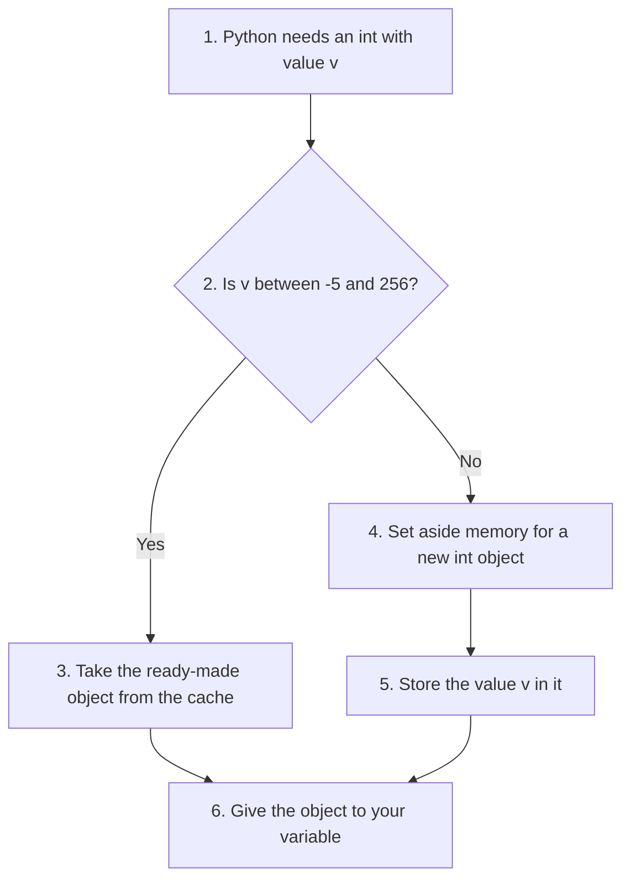

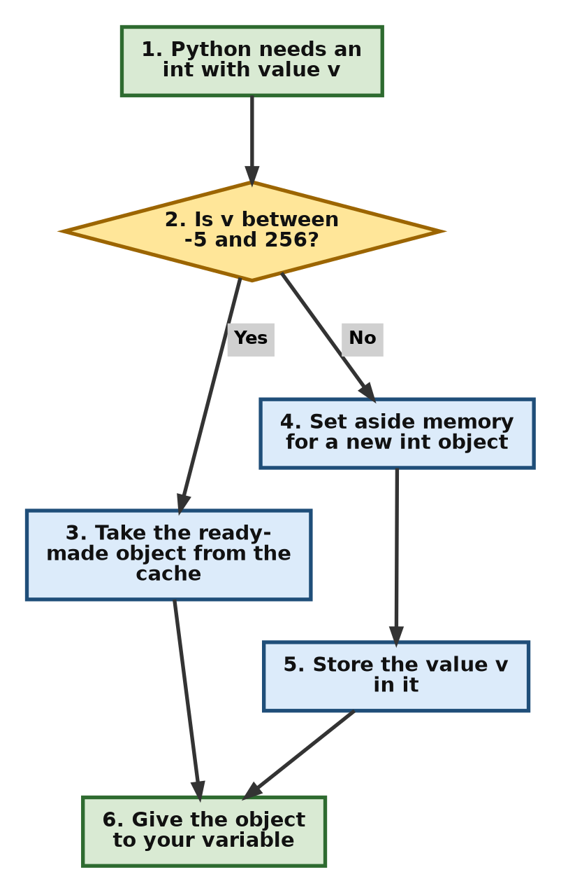

The script below shows the cache at work. It uses `int("100")` instead of the literal `100` on purpose. When the same literal appears twice in one script, Python may reuse one object for both, even for large numbers, which would hide the effect we want to see.

```python
# Step 1: Two small numbers made at run time
a = int("100")
b = int("100")
print("100 : same object?", a is b)    # True - both come from the cache

# Step 2: Two larger numbers made at run time
c = int("1000")
d = int("1000")
print("1000: same object?", c is d)    # False - two separate objects

# Step 3: The values are equal in both cases
print("Values equal?", a == b, c == d)
```

Output:

```text
100 : same object? True
1000: same object? False
Values equal? True True
```

The cache is a detail of CPython, not a rule of the Python language. Never write programs that depend on it. Use `==`, not `is`, to compare numbers.

**Part 2: Large integers take more time**

A small integer fits in one 30-bit piece, and the processor can handle it in one step. When integers get large (hundreds or thousands of digits):

* They no longer fit in a single piece.
* Python stores them as a **list of 30-bit pieces** (15-bit pieces on some older or unusual builds).
* Arithmetic has to work through **many pieces**, not just one.

So a very large integer behaves more like a long list of numbers than like a single number.

**Time complexity overview**

In the table, **n is the number of 30-bit pieces** in the number, not the number of decimal digits. One piece holds about 9 decimal digits.

| Operation | Time complexity | Reason |
| --------- | --------------- | ------ |
| Addition, subtraction | **O(n)** | Each piece is visited once, carrying from one piece to the next |
| Comparison | **O(1)** to **O(n)** | Python first compares the signs and lengths. Only if they match does it compare piece by piece, starting from the most significant end |
| Multiplication (smaller numbers) | **O(n²)** | Schoolbook method: every piece of one number is multiplied by every piece of the other |
| Multiplication (large numbers) | **O(n^1.585)** | Karatsuba method, which Python switches to automatically |
| Division and remainder | About **O(n²)** | Long division, piece by piece |
| Converting to or from decimal text | About **O(n²)** | This is why the 4300-digit limit exists (see section 2.2). Python 3.12 added faster methods for very large numbers |

**Part 3: Multiplication uses a faster method for large numbers**

CPython picks the multiplication method based on the size of the numbers.

*a) Schoolbook multiplication (smaller numbers)*

* This is the method you learned at school: multiply each piece by each piece and add up the results.
* Time complexity: **O(n²)**. Doubling the length makes it about four times slower.

*b) Karatsuba multiplication (large numbers)*

* CPython switches to the [Karatsuba algorithm](https://en.wikipedia.org/wiki/Karatsuba_algorithm) when **both** numbers have about **70 or more** 30-bit pieces. That is roughly 630 or more decimal digits.
* Karatsuba splits each number into two halves. With a clever trick it needs **three** half-size multiplications instead of four, and it repeats this trick on each half.
* Time complexity: **O(n^1.585)**. For very large numbers this is much faster than O(n²).

CPython's `int` does **not** use FFT-based methods (such as the Schönhage–Strassen algorithm). These are faster still for numbers with many thousands of digits. If you need that speed, the outside library [gmpy2](https://pypi.org/project/gmpy2/) provides it. Python's own [`decimal`](https://docs.python.org/3/library/decimal.html) module also uses a fast transform-based method for very large numbers.

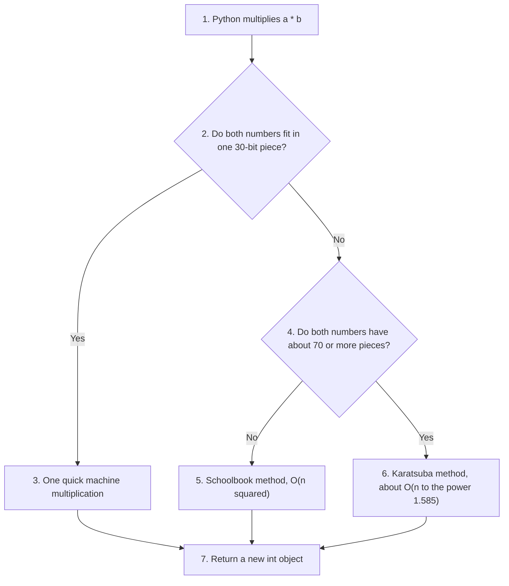

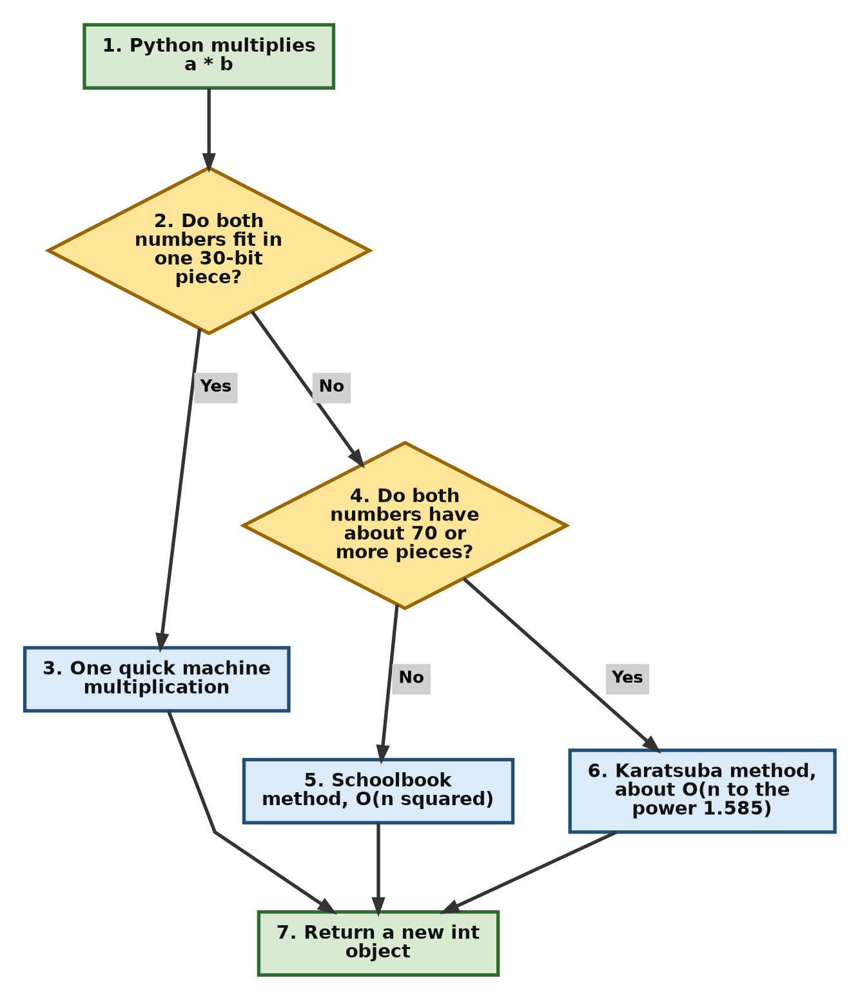

</details>

[Back to the Table of Contents](#table-of-contents)

## 15. Advanced Concept: Internal Representation (CPython)

CPython stores every integer in a C structure called `PyLongObject`. In simple terms, it holds:

```
PyLongObject:
    - reference count (how many names or objects use this integer)
    - type information (a pointer that says "this is an int")
    - the sign and the number of "digits" (pieces)
    - the digits themselves, each in base 2^30 (or 2^15, depending on the build)
```

Key notes:

* The "digits" are base-2³⁰ pieces on most modern systems. Each piece holds a value from 0 to 2³⁰ − 1 (1,073,741,823) and is kept in 4 bytes.
* Small integers use one piece. Large integers use many pieces.
* So working with huge numbers is slower, but it is always exact. There is no overflow.

You can ask Python how integers are stored on your own computer with [`sys.int_info`](https://docs.python.org/3/library/sys.html#sys.int_info):

```python
import sys

# Step 1: Ask Python how it stores integers on this computer
print(sys.int_info)

# Step 2: Work out how many 30-bit "digits" 2**100 needs
n = 2 ** 100
bits = n.bit_length()
chunks = (bits + 29) // 30      # divide by 30 and round up
print("bits needed   :", bits)
print("30-bit digits :", chunks)
print("size in bytes :", sys.getsizeof(n))
```

Output:

```text
sys.int_info(bits_per_digit=30, sizeof_digit=4, default_max_str_digits=4300, str_digits_check_threshold=640)
bits needed   : 101
30-bit digits : 4
size in bytes : 40
```

Here `bits_per_digit=30` confirms 30-bit pieces and `sizeof_digit=4` confirms 4 bytes for each piece. The number `2 ** 100` needs 101 bits, which fit in 4 pieces (4 × 30 = 120 bits). Its size is 24 + 4 × 4 = 40 bytes.

Learn more: [Integer objects in the Python/C API](https://docs.python.org/3/c-api/long.html).

[Back to the Table of Contents](#table-of-contents)

## 16. Summary

[Back to the Table of Contents](#table-of-contents)

### 16.1 Small Versus Large Integers

* **Small integers** are very fast. The ones from -5 to 256 are even reused from a cache.
* **Large integers** need more memory and are handled piece by piece, so they are slower.
* Python automatically chooses the multiplication method based on size:
  * schoolbook multiplication for smaller numbers,
  * Karatsuba multiplication for large numbers.

This combination lets Python support huge integers while keeping performance as good as possible.

[Back to the Table of Contents](#table-of-contents)

### 16.2 Key Points About Python int

| Topic | Key point |
| ----- | --------- |
| Size | No fixed limit. An `int` grows as needed and never overflows. |
| Immutability | Every operation creates a new object. The old one is never changed. |
| Literals | Decimal, binary (`0b`), octal (`0o`) and hexadecimal (`0x`), with optional underscores. |
| Division | `/` always gives a float. `//` rounds down, toward negative infinity. |
| Remainder | `%` has the same sign as the divisor. |
| Conversion | `int()` truncates floats toward zero and needs a base for text such as `"0b101"`. |
| `bool` | A subclass of `int`. `True` is 1 and `False` is 0. |
| Promotion | `int → float → complex`. Very large integers can lose precision or overflow when turned into floats. |
| Memory | About 24 bytes plus 4 bytes for every 30 bits of the number (Python 3.12, 64-bit). |
| Speed | Small numbers are fast. Large numbers use slower multi-piece arithmetic, with Karatsuba for big multiplications. |
| Text limit | Numbers with more than 4300 digits cannot be turned into text unless you raise the limit (Python 3.11+). |

[Back to the Table of Contents](#table-of-contents)

## 17. Check Your Understanding

Try each question yourself before you read the answer.

[Back to the Table of Contents](#table-of-contents)

### 17.1 Conceptual Questions

[Back to the Table of Contents](#table-of-contents)

#### Question 1: Floor Division with a Negative Number

What does `print(7 // 2, -7 // 2)` show, and why?

**Answer:** It shows `3 -4`.

1. The exact value of `7 / 2` is `3.5`. Rounding down gives `3`.
2. The exact value of `-7 / 2` is `-3.5`. Rounding **down** means moving toward negative infinity, so the answer is `-4`, not `-3`.
3. `print()` separates the two values with a space.

```python
print(7 // 2, -7 // 2)
```

Output:

```text
3 -4
```

Follow-up question: what is `-7 % 2`? (Answer: `1`, because `2 * (-4) + 1 = -7`.)

[Back to the Table of Contents](#table-of-contents)

#### Question 2: Converting Binary Text with int()

Why does `int("0b101")` fail while `int("0b101", 2)` works?

**Answer:**

1. Without a second argument, `int()` assumes the text is in base 10.
2. In base 10, only the digits 0 to 9 are allowed (with an optional sign). The letter `b` is not a decimal digit, so Python raises `ValueError`.
3. With base `2`, `int()` knows it is reading binary. It accepts the optional `0b` prefix and reads `101` as 1×4 + 0×2 + 1×1 = 5.
4. `int("0b101", 0)` also works, because base `0` tells Python to work out the base from the prefix.

[Back to the Table of Contents](#table-of-contents)

#### Question 3: Working Out a Left Shift by Hand

Without running any code, work out `3 << 4`.

**Answer:** `48`.

1. Write 3 in binary: `11`.
2. Shift left by 4 places, which means adding four zeros on the right: `110000`.
3. Convert back to decimal: 1×32 + 1×16 = 48.
4. Check with the shortcut: `3 × 2⁴ = 3 × 16 = 48`.

[Back to the Table of Contents](#table-of-contents)

#### Question 4: Adding Boolean Values

What is the value and the type of `True + True + False`?

**Answer:** The value is `2` and the type is `int`.

1. `bool` is a subclass of `int`, so `True` counts as `1` and `False` counts as `0`.
2. `1 + 1 + 0 = 2`.
3. Adding two bools gives a plain `int`, not a `bool`. So `type(True + True + False)` is `<class 'int'>`.

[Back to the Table of Contents](#table-of-contents)

#### Question 5: A Large Integer Compared with Its Float

Why is `(2 ** 53 + 1) == float(2 ** 53 + 1)` equal to `False`?

**Answer:**

1. `2 ** 53 + 1` is the exact integer `9007199254740993`.
2. A float has only 53 bits for the digits of a number. It cannot store `9007199254740993` exactly.
3. So `float()` rounds it to the nearest value it can store, which is `9007199254740992.0`.
4. The integer and the rounded float differ by 1, so `==` gives `False`.

This shows why you should keep large whole numbers as `int` when you need exact answers (see section 10.3).

[Back to the Table of Contents](#table-of-contents)

### 17.2 Scripting Questions

[Back to the Table of Contents](#table-of-contents)

#### Question 6: Show a number in binary, octal and hexadecimal, and convert it back

Write a script that takes the number 2026 and prints it in binary, octal and hexadecimal. It should also print how many bits the number needs, and convert the binary text back to an integer to check the work.

**Answer:**

```python
# Step 1: Choose the number to study
number = 2026

# Step 2: Show it in binary, octal and hexadecimal
print("Decimal     :", number)
print("Binary      :", bin(number))
print("Octal       :", oct(number))
print("Hexadecimal :", hex(number))

# Step 3: Show how many bits it needs
print("Bits needed :", number.bit_length())

# Step 4: Convert the binary text back to an int to check our work
back = int(bin(number), 2)
print("Back again  :", back, "| matches:", back == number)
```

Output:

```text
Decimal     : 2026
Binary      : 0b11111101010
Octal       : 0o3752
Hexadecimal : 0x7ea
Bits needed : 11
Back again  : 2026 | matches: True
```

[Back to the Table of Contents](#table-of-contents)

#### Question 7: Digits of Two to the Power 1000

Write a script that works out `2 ** 1000`, counts how many digits it has, and finds the sum of those digits.

**Answer:**

```python
# Step 1: Work out 2 to the power 1000 (exact, no overflow)
value = 2 ** 1000

# Step 2: Turn it into text so we can look at each digit
text = str(value)
print("Number of digits:", len(text))

# Step 3: Add up the digits one by one
total = 0
for ch in text:
    total = total + int(ch)    # int("7") gives 7
print("Sum of digits   :", total)

# Step 4: The same sum in one line
print("One-line check  :", sum(int(ch) for ch in text))
```

Output:

```text
Number of digits: 302
Sum of digits   : 1366
One-line check  : 1366
```

In C or Java, `2 ** 1000` would not fit in any built-in integer type. In Python it is just another `int`.

[Back to the Table of Contents](#table-of-contents)

