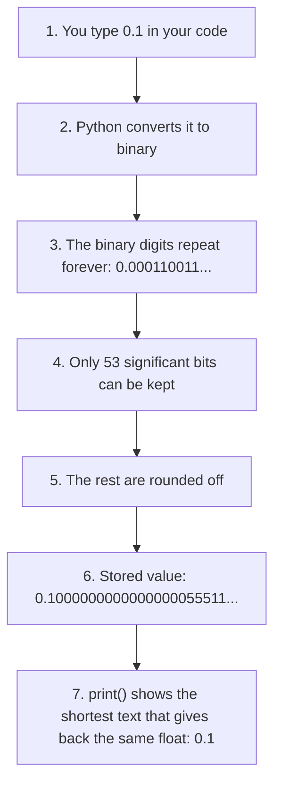
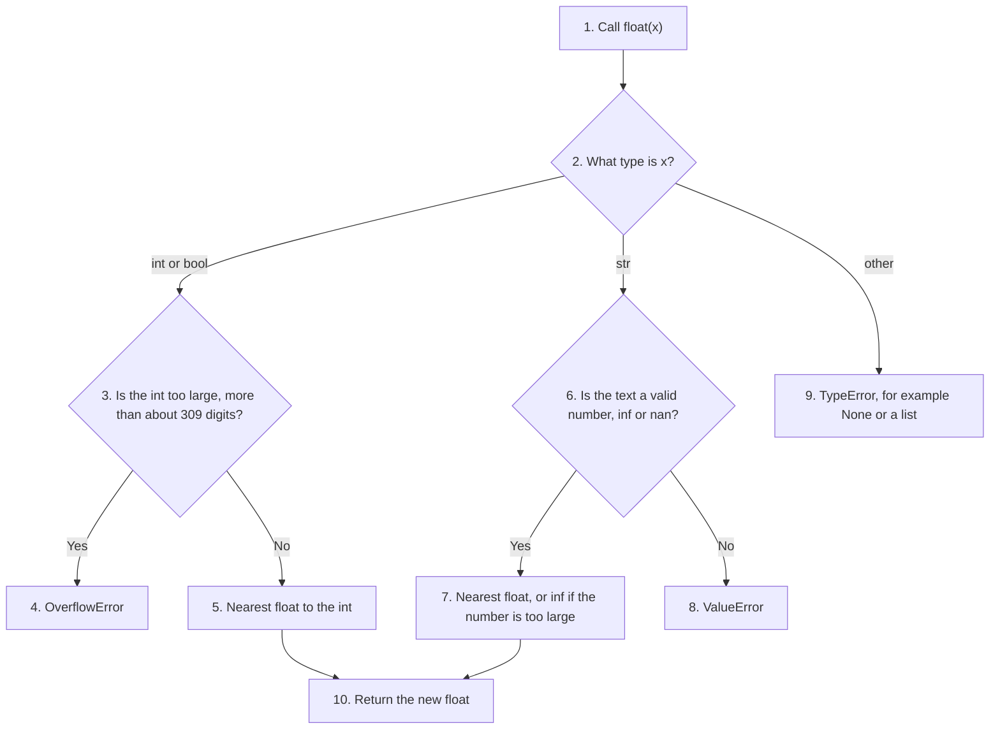
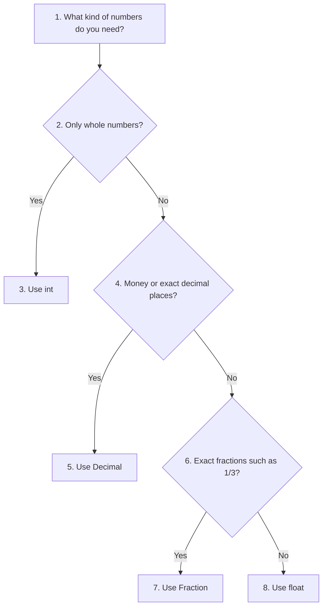
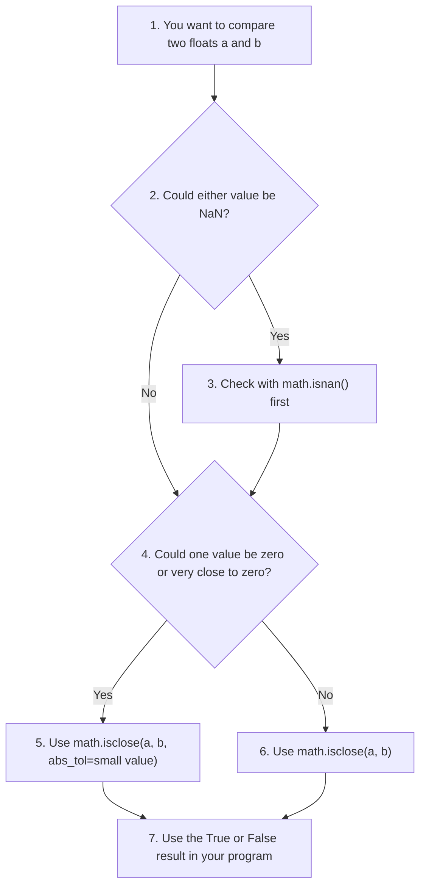
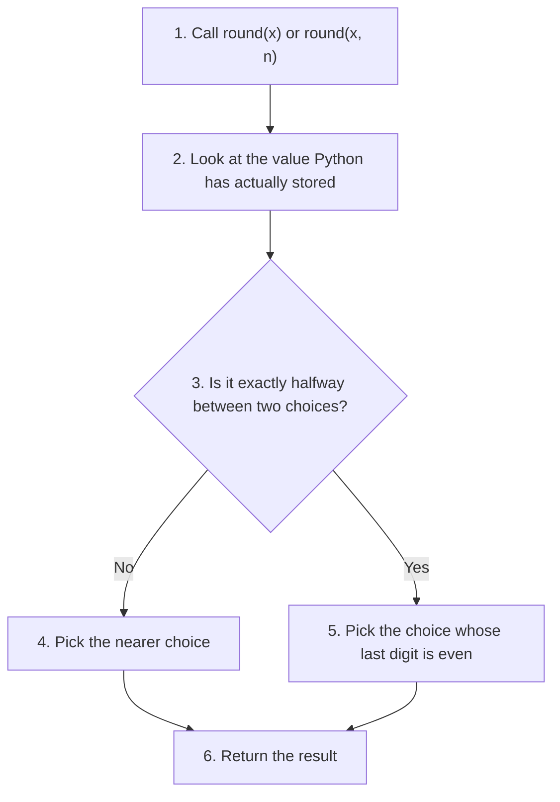

# Python Floating-Point Numbers (`float`): Notes, Example Scripts and Quiz

Whole numbers are not enough for most real-world work. A price of 49.99, a body temperature of 98.6, the value of pi (3.14159...) and the speed of light (3 × 10⁸ m/s) all need numbers with a fractional part. In Python, such numbers belong to the data type called `float`, short for **floating-point number**.

This page is part of the online material for **Chapter 2: Python Data Types**. The chapter introduces `float` along with `int`, `bool`, `complex` and `str`. This page goes into much more depth. It has three parts:

* **Part A: Detailed Notes.** What a float is, how Python stores it, why some decimal numbers cannot be stored exactly, the special values `inf`, `nan` and `-0.0`, conversions, common mistakes and good habits.
* **Part B: Example Scripts.** Eight blocks of short scripts that show floats in action, each with its output.
* **Part C: Quiz.** Twenty-five questions from beginner to advanced level, each followed by its answer.

Floats are used in almost every Python program that measures, calculates or analyses something: science, engineering, statistics, graphics, games and machine learning. Understanding their strengths and their limits will save you from some of the most common bugs in programming.

Sections marked **Advanced** go beyond what a beginner needs. You can skip them on a first reading. All scripts on this page were run with Python 3.12. Where a result depends on the Python version, the text says so. A companion page on integers is available here: [Python Integers (int)](001-ch2-python-data-types.md).

## Table of Contents

* [Python Floating-Point Numbers (`float`): Notes, Example Scripts and Quiz](#python-floating-point-numbers-float-notes-example-scripts-and-quiz)
  * [Key Terms Used on This Page](#key-terms-used-on-this-page)
  * [Part A: Detailed Notes on Python float](#part-a-detailed-notes-on-python-float)
    * [1. What Is a Float?](#1-what-is-a-float)
      * [1.1 How Python Stores a Float (Advanced)](#11-how-python-stores-a-float-advanced)
    * [2. Writing Floats in Python](#2-writing-floats-in-python)
      * [2.1 Decimal Notation](#21-decimal-notation)
      * [2.2 Scientific Notation](#22-scientific-notation)
      * [2.3 Whole Numbers with a Decimal Point](#23-whole-numbers-with-a-decimal-point)
      * [2.4 All the Examples in One Script](#24-all-the-examples-in-one-script)
    * [3. Basic Float Operations](#3-basic-float-operations)
    * [4. Implicit Type Conversion (Type Promotion)](#4-implicit-type-conversion-type-promotion)
    * [5. Float Precision](#5-float-precision)
      * [5.1 Why 0.1 Cannot Be Stored Exactly](#51-why-01-cannot-be-stored-exactly)
      * [5.2 Checking the Limits with sys.float_info](#52-checking-the-limits-with-sysfloat_info)
    * [6. Special Float Values (IEEE-754)](#6-special-float-values-ieee-754)
      * [6.1 Infinity](#61-infinity)
      * [6.2 Not-a-Number (NaN)](#62-not-a-number-nan)
      * [6.3 Negative Zero](#63-negative-zero)
      * [6.4 All the Special Values in One Script](#64-all-the-special-values-in-one-script)
    * [7. Converting Other Types to Float](#7-converting-other-types-to-float)
      * [7.1 int to float](#71-int-to-float)
      * [7.2 string to float](#72-string-to-float)
      * [7.3 bool to float](#73-bool-to-float)
      * [7.4 All the Conversions in One Script](#74-all-the-conversions-in-one-script)
    * [8. Floats vs Decimal vs Fraction (Advanced)](#8-floats-vs-decimal-vs-fraction-advanced)
      * [8.1 decimal.Decimal](#81-decimaldecimal)
      * [8.2 fractions.Fraction](#82-fractionsfraction)
      * [8.3 Comparing the Three Types](#83-comparing-the-three-types)
    * [9. Common Float Pitfalls](#9-common-float-pitfalls)
      * [9.1 Pitfall A: Precision Issues](#91-pitfall-a-precision-issues)
      * [9.2 Pitfall B: Accumulation Errors in Loops](#92-pitfall-b-accumulation-errors-in-loops)
      * [9.3 Pitfall C: Converting Very Large Integers](#93-pitfall-c-converting-very-large-integers)
      * [9.4 Pitfall D: Comparing Floats with ==](#94-pitfall-d-comparing-floats-with-)
      * [9.5 Pitfall E: Rounding Values That Look Like a Tie](#95-pitfall-e-rounding-values-that-look-like-a-tie)
      * [9.6 All the Pitfalls in One Script](#96-all-the-pitfalls-in-one-script)
    * [10. Best Practices for Students](#10-best-practices-for-students)
      * [10.1 Using math.isclose() Correctly](#101-using-mathisclose-correctly)
    * [11. Summary](#11-summary)
  * [Part B: Python Example Scripts Showing the Usage of float](#part-b-python-example-scripts-showing-the-usage-of-float)
    * [Block 1: Basic Floats and Arithmetic](#block-1-basic-floats-and-arithmetic)
    * [Block 2: abs(), repr() and str()](#block-2-abs-repr-and-str)
    * [Block 3: type(), isinstance() and format()](#block-3-type-isinstance-and-format)
    * [Block 4: is_integer() and round()](#block-4-is_integer-and-round)
    * [Block 5: pow() and Arithmetic with Infinity and NaN](#block-5-pow-and-arithmetic-with-infinity-and-nan)
    * [Block 6: sys.getsizeof() and hash() for Floats](#block-6-sysgetsizeof-and-hash-for-floats)
    * [Block 7: The float() Constructor, float.hex() and float.fromhex()](#block-7-the-float-constructor-floathex-and-floatfromhex)
    * [Block 8: Special float Methods: is_integer() and Final Tests](#block-8-special-float-methods-is_integer-and-final-tests)
  * [Part C: Python Float Quiz (Q&A Format)](#part-c-python-float-quiz-qa-format)
    * [Beginner Level (Q&A)](#beginner-level-qa)
    * [Intermediate Level (Q&A)](#intermediate-level-qa)
    * [Advanced Level (Q&A)](#advanced-level-qa)
    * [Extra Challenge (Q&A)](#extra-challenge-qa)

## Key Terms Used on This Page

You will meet the following technical terms on this page. Each one is explained in simple words. Follow the link if you want to learn more.

| Term | Simple meaning | Learn more |
| ---- | -------------- | ---------- |
| Floating-point number | A number with a fractional part, stored as significant digits plus a power of 2. The decimal point "floats" to wherever it is needed. | [Floating-point arithmetic](https://en.wikipedia.org/wiki/Floating-point_arithmetic) |
| IEEE-754 | The worldwide standard that says how computers store and calculate with floating-point numbers. | [IEEE 754](https://en.wikipedia.org/wiki/IEEE_754) |
| Double precision | The 64-bit version of IEEE-754. Every Python float uses it. | [Double-precision format](https://en.wikipedia.org/wiki/Double-precision_floating-point_format) |
| Binary | The base-2 number system, which uses only the digits 0 and 1. Computers store all numbers in binary. | [Binary number](https://en.wikipedia.org/wiki/Binary_number) |
| Mantissa (significand) | The part of a float that holds its significant digits. | [Significand](https://en.wikipedia.org/wiki/Significand) |
| Exponent | The part of a float that says where the point goes, as a power of 2. | [Double-precision format](https://en.wikipedia.org/wiki/Double-precision_floating-point_format) |
| Precision | How many significant digits a number can hold. A Python float holds about 15 to 17 decimal digits. | [Floating-point issues and limitations](https://docs.python.org/3/tutorial/floatingpoint.html) |
| Scientific notation | Writing a number as a value times a power of 10. In Python, `3.5e2` means 3.5 × 10². | [Scientific notation](https://en.wikipedia.org/wiki/Scientific_notation) |
| Infinity (`inf`) | A special float value that is larger than every other number. | [float() function](https://docs.python.org/3/library/functions.html#float) |
| NaN | "Not a Number". A special float value for results that have no sensible answer, such as infinity minus infinity. | [NaN](https://en.wikipedia.org/wiki/NaN) |
| Negative zero (`-0.0`) | A zero that remembers it came from the negative side. It equals `0.0`. | [Signed zero](https://en.wikipedia.org/wiki/Signed_zero) |
| Overflow | A result that is too large to store. For floats it usually becomes `inf`. | [Arithmetic overflow](https://en.wikipedia.org/wiki/Arithmetic_overflow) |
| Underflow | A result that is too close to zero to store. For floats it becomes `0.0`. | [Arithmetic underflow](https://en.wikipedia.org/wiki/Arithmetic_underflow) |
| Subnormal number | A very tiny float, smaller than the normal range, stored with fewer significant digits. | [Subnormal number](https://en.wikipedia.org/wiki/Subnormal_number) |
| Banker's rounding | Rounding a value that is exactly halfway to the nearest **even** digit. Python's `round()` uses it. | [Round half to even](https://en.wikipedia.org/wiki/Rounding#Rounding_half_to_even) |
| Hexadecimal | The base-16 number system, with digits 0 to 9 and a to f. | [Hexadecimal](https://en.wikipedia.org/wiki/Hexadecimal) |
| Hash | A number that Python calculates from a value so that dictionaries and sets can find it quickly. | [Hashing of numeric types](https://docs.python.org/3/library/stdtypes.html#hashing-of-numeric-types) |
| `Decimal` | A type in the `decimal` module for exact decimal arithmetic, useful for money. | [decimal module](https://docs.python.org/3/library/decimal.html) |
| `Fraction` | A type in the `fractions` module for exact fractions such as 1/3. | [fractions module](https://docs.python.org/3/library/fractions.html) |

[Back to the Table of Contents](#table-of-contents)

## Part A: Detailed Notes on Python float

The `float` type in Python represents **floating-point numbers**, that is, real numbers that contain a decimal point or are written in scientific notation.

These notes explain:

* what floats are,
* how Python stores them,
* their precision limits,
* operations, conversions and common pitfalls,
* advanced numerical behaviour,
* best practices for students.

[Back to the Table of Contents](#table-of-contents)

### 1. What Is a Float?

* A `float` represents a **real number**, which may have a fractional part.
* Examples:

  ```python
  3.14
  -0.5
  2.0
  ```

* Inside the computer, Python floats follow the **IEEE-754 double-precision** format. This is a worldwide standard, so a float behaves the same way on almost every computer.
* This means floats are stored in **binary** (base 2), not in decimal (base 10). This one fact explains most of the surprises you will meet on this page.

```python
# Step 1: A few floats
a = 3.14
b = -0.5
c = 2.0

# Step 2: Check their type
print(a, type(a))
print(b, type(b))
print(c, type(c))

# Step 3: 2 and 2.0 are equal in value but have different types
print(2 == 2.0)
print(type(2), type(2.0))
```

Output:

```text
3.14 <class 'float'>
-0.5 <class 'float'>
2.0 <class 'float'>
True
<class 'int'> <class 'float'>
```

Notice that `2 == 2.0` is `True`, even though `2` is an `int` and `2.0` is a `float`. The values are equal; only the types differ.

[Back to the Table of Contents](#table-of-contents)

#### 1.1 How Python Stores a Float (Advanced)

Every Python float takes exactly **64 bits** (8 bytes) for its value. The 64 bits are split into three parts:

| Part | Bits | What it stores |
| ---- | ---- | -------------- |
| Sign | 1 | 0 for positive, 1 for negative |
| Exponent | 11 | The power of 2, which says where the point goes |
| Fraction (mantissa) | 52 | The significant digits. A hidden leading 1 adds one more bit, giving 53 bits of precision |

The value is worked out like this:

```
value = (sign) × 1.fraction × 2^(exponent - 1023)
```

For example, `3.75` is stored as `+1.875 × 2¹`. You can see this with `float.hex(3.75)`, which Block 8 in Part B explains.

This design is like scientific notation, but in base 2. It lets a float hold both very large numbers (up to about 1.8 × 10³⁰⁸) and very small ones (down to about 5 × 10⁻³²⁴). The price is that it has only 53 binary digits of precision, which is about 15 to 17 decimal digits.

[Back to the Table of Contents](#table-of-contents)

### 2. Writing Floats in Python

A number typed directly into your code is called a **literal**. A float literal must contain a decimal point, or an `e` for scientific notation, or both.

[Back to the Table of Contents](#table-of-contents)

#### 2.1 Decimal Notation

```python
x = 3.75
y = 0.001
```

[Back to the Table of Contents](#table-of-contents)

#### 2.2 Scientific Notation

Use `e` or `E` to mean "× 10 to the power":

```python
x = 3.5e2     # 3.5 × 10² = 350.0
y = 4.2e-3    # 4.2 × 10⁻³ = 0.0042
```

| You write | It means | Value |
| --------- | -------- | ----- |
| `3.5e2` | 3.5 × 10² | `350.0` |
| `4.2e-3` | 4.2 × 10⁻³ | `0.0042` |
| `6.02E23` | 6.02 × 10²³ | `6.02e+23` |
| `1e0` | 1 × 10⁰ | `1.0` |

A number written with `e` is always a float, even if it has no decimal point. So `2e3` is `2000.0`, not `2000`.

[Back to the Table of Contents](#table-of-contents)

#### 2.3 Whole Numbers with a Decimal Point

A whole number written with a decimal point automatically becomes a float:

```python
5.0     # float
```

`5` is an `int`, but `5.0` is a `float`.

[Back to the Table of Contents](#table-of-contents)

#### 2.4 All the Examples in One Script

The script below brings the examples together and adds a few other valid ways of writing floats.

```python
# Step 1: Decimal notation
x = 3.75
y = 0.001
print(x, y)

# Step 2: Scientific notation (e or E means "times 10 to the power")
x = 3.5e2     # 3.5 × 10² = 350.0
y = 4.2e-3    # 4.2 × 10⁻³ = 0.0042
print(x, y)

# Step 3: A whole number with a decimal point is a float
z = 5.0
print(z, type(z))

# Step 4: Other valid ways of writing floats
print(5.)          # the digits after the point may be left out
print(.5)          # the 0 before the point may be left out
print(1_000.25)    # underscores make long numbers easier to read

# Step 5: Python switches to scientific notation for very big or very small floats
print(12345678901234567890.0)
print(0.00001)
```

Output:

```text
3.75 0.001
350.0 0.0042
5.0 <class 'float'>
5.0
0.5
1000.25
1.2345678901234567e+19
1e-05
```

Look at the last two lines of output. When a float is very large (10¹⁶ or more) or very small (less than 0.0001), Python prints it in scientific notation.

[Back to the Table of Contents](#table-of-contents)

### 3. Basic Float Operations

| Operator | Meaning | Example (`a = 5.5`, `b = 2.0`) | Result |
| -------- | ------- | ------------------------------ | ------ |
| `+` | Addition | `a + b` | `7.5` |
| `-` | Subtraction | `a - b` | `3.5` |
| `*` | Multiplication | `a * b` | `11.0` |
| `/` | Division | `a / b` | `2.75` |
| `**` | Power | `a ** 2` | `30.25` |
| `//` | Floor division | `a // b` | `2.0` |
| `%` | Remainder | `a % b` | `1.5` |

```python
# Step 1: Two floats
a = 5.5
b = 2.0

# Step 2: The arithmetic operators
print(a + b)    # 7.5
print(a - b)    # 3.5
print(a * b)    # 11.0
print(a / b)    # 2.75
print(a ** 2)   # 30.25
print(a // b)   # 2.0  (floor division still gives a float)
print(a % b)    # 1.5  (remainder: 5.5 - 2.0 * 2 = 1.5)

# Step 3: Division always produces a float, even for integers
print(5 / 2)    # 2.5
print(6 / 2)    # 3.0, not 3
```

Output:

```text
7.5
3.5
11.0
2.75
30.25
2.0
1.5
2.5
3.0
```

**Division always produces a float**, even for two integers. So `6 / 2` gives `3.0`, not `3`. Also note that `//` and `%` give a float whenever either number is a float.

[Back to the Table of Contents](#table-of-contents)

### 4. Implicit Type Conversion (Type Promotion)

When an `int` and a `float` are used together:

* the `int` is converted to a `float` first,
* so the result is a `float`.

```python
# Step 1: int and float together give a float
print(5 + 2.5)    # 7.5
print(3 * 2.0)    # 6.0

# Step 2: Check the type of the result
print(type(3 * 2.0))
```

Output:

```text
7.5
6.0
<class 'float'>
```

This follows the numeric tower:

```
int → float → complex
```

Python always converts the simpler type to the more capable one, never the other way round. For a detailed explanation with a flowchart, see [Interactions of int with float and complex](001-ch2-python-data-types.md#10-interactions-of-int-with-float-and-complex-type-promotion) on the integers page.

[Back to the Table of Contents](#table-of-contents)

### 5. Float Precision

* Python floats have **53 bits** of precision. That is about 15 to 17 significant decimal digits.
* Any digits beyond that are rounded off.

Example:

```python
x = 1.234567890123456789
print(x)
```

Output:

```text
1.2345678901234567
```

We typed 19 significant digits, but only 17 survived. The rest were rounded away.

[Back to the Table of Contents](#table-of-contents)

#### 5.1 Why 0.1 Cannot Be Stored Exactly

In decimal, the fraction 1/3 cannot be written exactly. It goes on forever: 0.3333... In the same way, many simple decimal numbers go on forever in **binary**. 0.1 is one of them.

To turn a decimal fraction into binary, we multiply it by 2 again and again. Each time, the whole-number part (0 or 1) is the next binary digit.

| Step | Calculation | Whole part (binary digit) | Fraction carried forward |
| ---- | ----------- | ------------------------- | ------------------------ |
| 1 | 0.1 × 2 = 0.2 | 0 | 0.2 |
| 2 | 0.2 × 2 = 0.4 | 0 | 0.4 |
| 3 | 0.4 × 2 = 0.8 | 0 | 0.8 |
| 4 | 0.8 × 2 = 1.6 | 1 | 0.6 |
| 5 | 0.6 × 2 = 1.2 | 1 | 0.2 |
| 6 | 0.2 × 2 = 0.4 | 0 | 0.4 (same as step 2, so the pattern repeats) |

So 0.1 in binary is `0.0001100110011001100...`, with `0011` repeating forever. A float can keep only 53 significant bits, so Python cuts the pattern off and rounds it. The stored value is very slightly more than 0.1.



Step 7 explains why `print(0.1)` still shows `0.1`. Python hides the tiny error when it prints a single number. The error shows up only after arithmetic, as in `0.1 + 0.2`, which prints `0.30000000000000004`.

Learn more: [Floating-point arithmetic: issues and limitations](https://docs.python.org/3/tutorial/floatingpoint.html).

[Back to the Table of Contents](#table-of-contents)

#### 5.2 Checking the Limits with sys.float_info

The `Decimal` type can show the exact value a float holds. The object [`sys.float_info`](https://docs.python.org/3/library/sys.html#sys.float_info) tells you the limits of floats on your computer.

```python
import sys
from decimal import Decimal

# Step 1: More digits than a float can hold
x = 1.234567890123456789
print(x)

# Step 2: The exact value Python really stores for 0.1
print(Decimal(0.1))

# Step 3: Facts about floats on this computer
print("Significant bits   :", sys.float_info.mant_dig)
print("Safe decimal digits:", sys.float_info.dig)
print("Largest float      :", sys.float_info.max)
print("Smallest normal    :", sys.float_info.min)
print("Machine epsilon    :", sys.float_info.epsilon)
```

Output:

```text
1.2345678901234567
0.1000000000000000055511151231257827021181583404541015625
Significant bits   : 53
Safe decimal digits: 15
Largest float      : 1.7976931348623157e+308
Smallest normal    : 2.2250738585072014e-308
Machine epsilon    : 2.220446049250313e-16
```

* **Significant bits: 53.** This is the precision of every float.
* **Safe decimal digits: 15.** Any decimal number with up to 15 significant digits survives a trip into a float and back unchanged.
* **Machine epsilon** is the gap between `1.0` and the next larger float. It gives an idea of the smallest relative error you can expect.

[Back to the Table of Contents](#table-of-contents)

### 6. Special Float Values (IEEE-754)

The IEEE-754 standard includes a few special values. Python supports all of them.

[Back to the Table of Contents](#table-of-contents)

#### 6.1 Infinity

```python
float('inf')
float('-inf')
```

Infinity is larger than every other float, and negative infinity is smaller than every other float. You get infinity when a result is too big to store (overflow), for example `1e308 * 10`.

[Back to the Table of Contents](#table-of-contents)

#### 6.2 Not-a-Number (NaN)

```python
float('nan')
```

NaN stands for "Not a Number". It is the result of a calculation that has no sensible answer, such as `inf - inf` or `inf * 0`.

NaN has special comparison rules:

```python
float('nan') == float('nan')   # False
```

NaN is not equal to anything, not even to itself. So never test for NaN with `==`. Use `math.isnan()` instead.

[Back to the Table of Contents](#table-of-contents)

#### 6.3 Negative Zero

IEEE-754 also has a negative zero, written `-0.0`. You get it, for example, from `-1 / float('inf')` or from `-1 * 0.0`. `-0.0 == 0.0` is `True`, so you rarely notice it. It matters mainly in some advanced mathematical functions.

[Back to the Table of Contents](#table-of-contents)

#### 6.4 All the Special Values in One Script

```python
import math

# Step 1: Create the special values
pos_inf = float('inf')
neg_inf = float('-inf')
not_a_number = float('nan')
print(pos_inf, neg_inf, not_a_number)

# Step 2: Results that are too big become infinity
print(1e308 * 10)

# Step 3: NaN is not equal to anything, even itself
print(not_a_number == not_a_number)   # False

# Step 4: The right way to test for these values
print(math.isinf(pos_inf))            # True
print(math.isnan(not_a_number))       # True
print(math.isfinite(2.5))             # True

# Step 5: Negative zero
neg_zero = -0.0
print(neg_zero)                       # -0.0
print(neg_zero == 0.0)                # True
print(math.copysign(1, neg_zero))     # -1.0 shows the hidden minus sign
```

Output:

```text
inf -inf nan
inf
False
True
True
True
-0.0
True
-1.0
```

The table sums up the main rules. Part B, Blocks 5 and 8, shows many more examples.

| Expression | Result | Why |
| ---------- | ------ | --- |
| `1e308 * 10` | `inf` | Too big to store (overflow) |
| `inf + 1` | `inf` | Infinity plus anything finite is still infinity |
| `inf - inf` | `nan` | No sensible answer |
| `inf * 0` | `nan` | No sensible answer |
| `nan + 1` | `nan` | NaN spreads to every result that uses it |
| `nan == nan` | `False` | NaN is never equal to anything |
| `nan ** 0` | `1.0` | IEEE-754 rule: anything to the power 0 is 1 |
| `-1 / inf` | `-0.0` | A negative number divided by infinity gives negative zero |

[Back to the Table of Contents](#table-of-contents)

### 7. Converting Other Types to Float

The built-in function [`float()`](https://docs.python.org/3/library/functions.html#float) converts other values to floats.

[Back to the Table of Contents](#table-of-contents)

#### 7.1 int to float

```python
float(5)   # 5.0
```

A very large integer (more than about 309 digits) cannot be converted. Python raises `OverflowError`.

[Back to the Table of Contents](#table-of-contents)

#### 7.2 string to float

```python
float("3.14")   # 3.14
float("2.5e3")  # 2500.0
```

The string may have spaces at either end, a `+` or `-` sign, underscores between digits, and the words `inf`, `infinity` or `nan` in any mix of upper and lower case. A string for a number that is too big, such as `"1e400"`, gives `inf` rather than an error.

[Back to the Table of Contents](#table-of-contents)

#### 7.3 bool to float

```python
float(True)   # 1.0
float(False)  # 0.0
```

[Back to the Table of Contents](#table-of-contents)

#### 7.4 All the Conversions in One Script

```python
# Step 1: int → float
print(float(5))          # 5.0

# Step 2: string → float
print(float("3.14"))     # 3.14
print(float("2.5e3"))    # 2500.0
print(float("  7.25 "))  # 7.25  spaces at the ends are ignored
print(float("1_000.5"))  # 1000.5 underscores between digits are allowed
print(float("Infinity")) # inf   upper or lower case both work

# Step 3: bool → float
print(float(True))       # 1.0
print(float(False))      # 0.0

# Step 4: Things that cannot be converted
for value in ["abc", "3,5", "", None, [1.5]]:
    try:
        float(value)
    except (ValueError, TypeError) as error:
        print(repr(value), "->", type(error).__name__)

# Step 5: An int that is too big for a float
try:
    float(10 ** 400)
except OverflowError as error:
    print("OverflowError:", error)
```

Output:

```text
5.0
3.14
2500.0
7.25
1000.5
inf
1.0
0.0
'abc' -> ValueError
'3,5' -> ValueError
'' -> ValueError
None -> TypeError
[1.5] -> TypeError
OverflowError: int too large to convert to float
```

Note that `float("3,5")` fails. Python always uses a point, never a comma, as the decimal separator.

The flowchart shows how `float()` decides what to do.



Branch numbers: the int branch is steps 3 to 5, the string branch is steps 6 to 8 and the other branch is step 9. The two successful branches meet at step 10.

[Back to the Table of Contents](#table-of-contents)

### 8. Floats vs Decimal vs Fraction (Advanced)

Floats are fast, but they are **not exact** for many values, as section 5 showed. Python has two other number types for when you need exact answers.

[Back to the Table of Contents](#table-of-contents)

#### 8.1 decimal.Decimal

For exact decimal arithmetic, use `decimal.Decimal`:

```python
from decimal import Decimal
Decimal('0.1') + Decimal('0.2')   # exact 0.3
```

Always create a `Decimal` from a **string**, such as `Decimal('0.1')`. If you write `Decimal(0.1)`, the float `0.1` is created first, and its tiny error is copied into the `Decimal`.

[Back to the Table of Contents](#table-of-contents)

#### 8.2 fractions.Fraction

For rational numbers (fractions), use `fractions.Fraction`:

```python
from fractions import Fraction
Fraction(1, 3) + Fraction(1, 6)   # 1/2
```

[Back to the Table of Contents](#table-of-contents)

#### 8.3 Comparing the Three Types

```python
from decimal import Decimal
from fractions import Fraction

# Step 1: float gives a tiny error
print(0.1 + 0.2)                         # 0.30000000000000004

# Step 2: Decimal gives the exact decimal answer
print(Decimal('0.1') + Decimal('0.2'))   # exact 0.3

# Step 3: Create Decimals from strings, not from floats
print(Decimal(0.1))    # the float's error is copied into the Decimal

# Step 4: Fraction keeps exact fractions such as 1/3
print(Fraction(1, 3) + Fraction(1, 6))   # 1/2
print(Fraction(1, 3) * 3)                # 1

# Step 5: A float cannot hold 1/3 exactly
print(1 / 3)                 # the digits stop after 16 places
print(Fraction(1 / 3))       # the exact fraction the float really holds
```

Output:

```text
0.30000000000000004
0.3
0.1000000000000000055511151231257827021181583404541015625
1/2
1
0.3333333333333333
6004799503160661/18014398509481984
```

| Feature | `float` | `Decimal` | `Fraction` |
| ------- | ------- | --------- | ---------- |
| Where it comes from | Built in | `decimal` module | `fractions` module |
| How it stores numbers | Binary, 53 bits | Decimal digits (28 by default, can be changed) | Exact numerator and denominator |
| Is `0.1` exact? | No | Yes | Yes |
| Is `1/3` exact? | No | No | Yes |
| Speed | Very fast (done by the processor) | Slower | Slowest |
| Good for | Science, engineering, graphics, measurements | Money, banking, anything that must match hand calculations | Exact fractions, probability, maths teaching |



[Back to the Table of Contents](#table-of-contents)

### 9. Common Float Pitfalls

These are the mistakes that learners most often make with floats. The combined script at the end of this section shows all of them.

[Back to the Table of Contents](#table-of-contents)

#### 9.1 Pitfall A: Precision Issues

```python
0.1 * 3      # 0.30000000000000004
```

The stored value of 0.1 is slightly too large, and multiplying by 3 makes the error big enough to show.

[Back to the Table of Contents](#table-of-contents)

#### 9.2 Pitfall B: Accumulation Errors in Loops

```python
x = 0
for i in range(1000):
    x += 0.1
print(x)      # not exactly 100.0
```

Output:

```text
99.9999999999986
```

Each addition adds a tiny rounding error. After 1000 additions, the errors have built up.

[Back to the Table of Contents](#table-of-contents)

#### 9.3 Pitfall C: Converting Very Large Integers

```python
float(10**100)   # loses precision
```

A float keeps only about 16 significant digits, so the other 85 digits of this 101-digit number are lost. The result prints as `1e+100`, which looks right, but converting it back to `int` shows that the value has changed (see the combined script below).

[Back to the Table of Contents](#table-of-contents)

#### 9.4 Pitfall D: Comparing Floats with ==

```python
0.1 + 0.2 == 0.3   # False
```

Two calculations that should give the same answer may differ in the last binary digit. Use `math.isclose()` instead (see section 10).

[Back to the Table of Contents](#table-of-contents)

#### 9.5 Pitfall E: Rounding Values That Look Like a Tie

```python
round(2.675, 2)   # 2.67, not 2.68
```

2.675 is actually stored as 2.67499999..., which is just below the halfway point. So it rounds down. Part B, Block 4 explains `round()` in detail.

[Back to the Table of Contents](#table-of-contents)

#### 9.6 All the Pitfalls in One Script

```python
import math

# Step 1 (Pitfall A): Precision issues
print(0.1 * 3)      # 0.30000000000000004

# Step 2 (Pitfall B): Accumulation errors in loops
x = 0
for i in range(1000):
    x += 0.1
print(x)            # not exactly 100.0

# Step 3 (Pitfall C): Converting very large integers
big = 10 ** 100
print(float(big))                  # looks fine...
print(int(float(big)) == big)      # ...but the value has changed
print(int(float(big)))             # the value the float really holds

# Step 4 (Pitfall D): Comparing floats with ==
print(0.1 + 0.2 == 0.3)                  # False
print(math.isclose(0.1 + 0.2, 0.3))      # True

# Step 5 (Pitfall E): round() on a value that looks like a tie
print(round(2.675, 2))             # 2.67, not 2.68
```

Output:

```text
0.30000000000000004
99.9999999999986
1e+100
False
10000000000000000159028911097599180468360808563945281389781327557747838772170381060813469985856815104
False
True
2.67
```

[Back to the Table of Contents](#table-of-contents)

### 10. Best Practices for Students

* Use floats for:
  * physics, engineering and continuous mathematics,
  * percentages and statistics,
  * measurements such as length, weight and temperature.

* Use `Decimal` for:
  * money, including interest calculations on money,
  * banking systems,
  * exact decimal maths.

* Use `Fraction` for:
  * exact rational arithmetic,
  * symbolic maths.

* For float comparison, always prefer:

  ```python
  math.isclose(a, b)
  ```

* To add up many floats accurately, use `math.fsum()` instead of a loop.
* To test for special values, use `math.isnan()`, `math.isinf()` and `math.isfinite()`, never `==`.
* To show a float neatly, format it, for example `format(x, '.2f')` or `f"{x:.2f}"`, rather than rounding the stored value.

[Back to the Table of Contents](#table-of-contents)

#### 10.1 Using math.isclose() Correctly

[`math.isclose(a, b)`](https://docs.python.org/3/library/math.html#math.isclose) returns `True` if `a` and `b` agree to about 9 significant digits. This is a **relative** test: it compares the difference with the size of the numbers. Near zero, a relative test does not work, because any difference is large compared with zero. In that case, add an **absolute** tolerance with `abs_tol`.

```python
import math

# Step 1: The default check compares relative size (about 9 matching digits)
print(math.isclose(0.1 + 0.2, 0.3))             # True
print(math.isclose(1000000.0, 1000000.1))       # False: differ in 8th digit

# Step 2: Near zero, a relative check fails
print(math.isclose(1e-10, 0.0))                 # False

# Step 3: Add an absolute tolerance when one value may be zero
print(math.isclose(1e-10, 0.0, abs_tol=1e-9))   # True

# Step 4: math.fsum() adds many floats accurately
values = [0.1] * 10
print(sum(values))         # 1.0 in Python 3.12+, 0.9999999999999999 before
print(math.fsum(values))   # 1.0 in every version
```

Output:

```text
True
False
False
True
1.0
1.0
```

Note the last two lines. From Python 3.12, the built-in `sum()` adds floats more carefully, so it also gives `1.0` here. In older versions it gives `0.9999999999999999`. `math.fsum()` is accurate in every version.



[Back to the Table of Contents](#table-of-contents)

### 11. Summary

* `float` stores real numbers using **binary floating-point** (IEEE-754 double precision, 64 bits).
* It supports decimal notation and scientific notation.
* It has **limited precision**: 53 bits, about 15 to 17 significant digits.
* Many decimal values, such as 0.1, cannot be represented exactly.
* It has special values: `inf`, `-inf`, `nan` and `-0.0`.
* Use `math.isclose()`, `Decimal` or `Fraction` to avoid precision problems.
* Floats are ideal for real-world numerical computation, but not for exact arithmetic such as money.

[Back to the Table of Contents](#table-of-contents)

## Part B: Python Example Scripts Showing the Usage of float

Given below are 8 blocks of scripts showing how the float data type works in Python. How to read them:

* Every `print()` line shows a label followed by `->` and then the value, like this: `label-> value`.
* The expected output is given in a hash comment (`#`), either on the same line or on the line just below the code. It uses the same `# label-> actual_output` format.
* Wherever necessary, extra hash comments below the code line explain the output.
* The scripts are divided into Steps (`# Step 1`, `# Step 2` and so on) so that you can follow them in order.
* The complete output of each block is given after the script.
* In a few cases, such as the hash of NaN, the output may vary from system to system. The comments point these out.
* Some of the concepts, methods and functions used may be advanced. You may skip them on a first reading.
* Ideally you should copy and paste each block into Python and check the output for yourself.

[Back to the Table of Contents](#table-of-contents)

### Block 1: Basic Floats and Arithmetic

This block covers:

* float literals,
* scientific notation,
* the basic operators,
* floor division and remainder (modulus), including one surprising result.

```python
# Step 1: Float literals (numbers written with a decimal point)
print("8.72->", 8.72)  # 8.72-> 8.72
print("-0.0045->", -0.0045)  # -0.0045-> -0.0045

# Step 2: Scientific notation (e or E means "times 10 to the power")
print("4.0e2->", 4.0e2)  # 4.0e2-> 400.0
# 4.0 x 10**2 = 400.0

print("6.91E-3->", 6.91E-3)  # 6.91E-3-> 0.00691
# 6.91 x 10**-3 = 0.00691

# Step 3: The basic arithmetic operators
print("1.8 + 3.7->", 1.8 + 3.7)  # 1.8 + 3.7-> 5.5
print("9.0 - 4.6->", 9.0 - 4.6)  # 9.0 - 4.6-> 4.4
print("3.5 * 2.0->", 3.5 * 2.0)  # 3.5 * 2.0-> 7.0
print("12.6 / 3.15->", 12.6 / 3.15)  # 12.6 / 3.15-> 4.0
# Division always produces float, even if result is whole number.

# Step 4: Floor division (//) and remainder (%) with floats
print("9.6 // 2.4->", 9.6 // 2.4)  # 9.6 // 2.4-> 4.0
# Floor division gives the floor of the result, but here the result is exact.
# With a float operand the answer is a float (4.0), not an int (4).

print("9.6 % 2.4->", 9.6 % 2.4)  # 9.6 % 2.4-> 0.0
# Because 2.4 * 4 = 9.6, remainder is exactly 0.0.

print("7.5 // 2->", 7.5 // 2)  # 7.5 // 2-> 3.0
# 7.5 / 2 = 3.75, rounded down to 3.0

print("7.5 % 2->", 7.5 % 2)  # 7.5 % 2-> 1.5
# 2 * 3.0 = 6.0 and 7.5 - 6.0 = 1.5

# Step 5: A surprise caused by the way floats are stored
print("1.0 // 0.1->", 1.0 // 0.1)  # 1.0 // 0.1-> 9.0
# You might expect 10.0. The stored value of 0.1 is slightly MORE than 0.1,
# so 0.1 fits into 1.0 only 9 whole times.

print("1.0 % 0.1->", 1.0 % 0.1)  # 1.0 % 0.1-> 0.09999999999999995
# The remainder is what is left over after those 9 whole times.
```

Output:

```text
8.72-> 8.72
-0.0045-> -0.0045
4.0e2-> 400.0
6.91E-3-> 0.00691
1.8 + 3.7-> 5.5
9.0 - 4.6-> 4.4
3.5 * 2.0-> 7.0
12.6 / 3.15-> 4.0
9.6 // 2.4-> 4.0
9.6 % 2.4-> 0.0
7.5 // 2-> 3.0
7.5 % 2-> 1.5
1.0 // 0.1-> 9.0
1.0 % 0.1-> 0.09999999999999995
```

The last two results surprise many people. Because `0.1` is stored as a value slightly larger than 0.1, it fits into `1.0` only 9 whole times, and the remainder is almost `0.1`. This is one more reason to be careful with `//` and `%` on floats.

[Back to the Table of Contents](#table-of-contents)

### Block 2: abs(), repr() and str()

This block covers:

* how floats are shown as text,
* a float rounding issue,
* how NaN and infinity are shown.

```python
# Step 1: abs() gives the distance from zero (the value without its sign)
print("abs(-7.8)->", abs(-7.8))  # abs(-7.8)-> 7.8
print("abs(float('nan'))->", abs(float('nan')))  # abs(float('nan'))-> nan
# abs() of NaN is still NaN because NaN is "not a number" at all

print("abs(float('-inf'))->", abs(float('-inf')))  # abs(float('-inf'))-> inf
# | -∞ | = ∞

# Step 2: repr() gives the text a programmer would type to get the same value
print("repr(8.72)->", repr(8.72))  # repr(8.72)-> 8.72
print("repr(float('nan'))->", repr(float('nan')))  # repr(float('nan'))-> nan
print("repr(float('inf'))->", repr(float('inf')))  # repr(float('inf'))-> inf
print("repr(float('-inf'))->", repr(float('-inf')))  # repr(float('-inf'))-> -inf

# Step 3: Rounding - sometimes the result is exact, sometimes not
print("repr(0.15 + 0.35)->", repr(0.15 + 0.35))  # repr(0.15 + 0.35)-> 0.5
# Here the tiny rounding errors cancel out, so the result prints as 0.5.

print("repr(0.1 + 0.2)->", repr(0.1 + 0.2))  # repr(0.1 + 0.2)-> 0.30000000000000004
# This is the classic case where the rounding errors do NOT cancel out.

# Step 4: str() gives the text meant for people reading the output
print("str(8.72)->", str(8.72))  # str(8.72)-> 8.72
print("str(float('nan'))->", str(float('nan')))  # str(float('nan'))-> nan
print("str(float('inf'))->", str(float('inf')))  # str(float('inf'))-> inf
print("str(float('-inf'))->", str(float('-inf')))  # str(float('-inf'))-> -inf
# For floats, str() and repr() give the same text in Python 3.
```

Output:

```text
abs(-7.8)-> 7.8
abs(float('nan'))-> nan
abs(float('-inf'))-> inf
repr(8.72)-> 8.72
repr(float('nan'))-> nan
repr(float('inf'))-> inf
repr(float('-inf'))-> -inf
repr(0.15 + 0.35)-> 0.5
repr(0.1 + 0.2)-> 0.30000000000000004
str(8.72)-> 8.72
str(float('nan'))-> nan
str(float('inf'))-> inf
str(float('-inf'))-> -inf
```

`repr()` gives text meant for programmers, and `str()` gives text meant for people. For floats in Python 3 they give the same result: the shortest text that turns back into exactly the same float.

[Back to the Table of Contents](#table-of-contents)

### Block 3: type(), isinstance() and format()

This block covers:

* checking the type of a float,
* formatting floats as text with a fixed number of decimal places, in scientific notation, with thousands separators and as a percentage.

```python
# Step 1: type() tells you the type of a value
print("type(8.72)->", type(8.72))  # type(8.72)-> <class 'float'>
print("type(float('nan'))->", type(float('nan')))  # type(float('nan'))-> <class 'float'>
print("type(float('inf'))->", type(float('inf')))  # type(float('inf'))-> <class 'float'>
print("type(float('-inf'))->", type(float('-inf')))  # type(float('-inf'))-> <class 'float'>
# nan, inf and -inf are ordinary float values.

# Step 2: isinstance() checks whether a value belongs to a type
print("isinstance(8.72, float)->", isinstance(8.72, float))  # isinstance(8.72, float)-> True
print("isinstance(15, float)->", isinstance(15, float))  # isinstance(15, float)-> False
# Integers are not floats.

print("isinstance(float('nan'), float)->", isinstance(float('nan'), float))
# isinstance(float('nan'), float)-> True

print("isinstance(float('inf'), float)->", isinstance(float('inf'), float))
# isinstance(float('inf'), float)-> True

print("isinstance(float('-inf'), float)->", isinstance(float('-inf'), float))
# isinstance(float('-inf'), float)-> True

# Step 3: format() turns a float into neatly formatted text
print("format(6.2831, '.2f')->", format(6.2831, '.2f'))  # format(6.2831, '.2f')-> 6.28
# Rounded to 2 decimal places.

print("format(4.8, 'e')->", format(4.8, 'e'))  # format(4.8, 'e')-> 4.800000e+00
# Scientific notation format.

print("format(1234567.891, ',.2f')->", format(1234567.891, ',.2f'))  # format(1234567.891, ',.2f')-> 1,234,567.89
# Comma as thousands separator, 2 decimal places.

print("format(0.256, '.1%')->", format(0.256, '.1%'))  # format(0.256, '.1%')-> 25.6%
# Multiplied by 100 and shown as a percentage with 1 decimal place.

print("format(float('inf'), 'f')->", format(float('inf'), 'f'))  # format(float('inf'), 'f')-> inf
print("format(float('-inf'), 'f')->", format(float('-inf'), 'f'))  # format(float('-inf'), 'f')-> -inf
print("format(float('nan'), 'f')->", format(float('nan'), 'f'))  # format(float('nan'), 'f')-> nan
```

Output:

```text
type(8.72)-> <class 'float'>
type(float('nan'))-> <class 'float'>
type(float('inf'))-> <class 'float'>
type(float('-inf'))-> <class 'float'>
isinstance(8.72, float)-> True
isinstance(15, float)-> False
isinstance(float('nan'), float)-> True
isinstance(float('inf'), float)-> True
isinstance(float('-inf'), float)-> True
format(6.2831, '.2f')-> 6.28
format(4.8, 'e')-> 4.800000e+00
format(1234567.891, ',.2f')-> 1,234,567.89
format(0.256, '.1%')-> 25.6%
format(float('inf'), 'f')-> inf
format(float('-inf'), 'f')-> -inf
format(float('nan'), 'f')-> nan
```

`format()` only changes how the number is **shown**. The stored value stays the same. The codes such as `.2f` and `e` are part of Python's [format specification mini-language](https://docs.python.org/3/library/string.html#format-specification-mini-language).

| Format code | Meaning | Example | Result |
| ----------- | ------- | ------- | ------ |
| `.2f` | Fixed point, 2 decimal places | `format(6.2831, '.2f')` | `6.28` |
| `e` | Scientific notation, 6 decimal places | `format(4.8, 'e')` | `4.800000e+00` |
| `,.2f` | Thousands separator and 2 decimal places | `format(1234567.891, ',.2f')` | `1,234,567.89` |
| `.1%` | Percentage, 1 decimal place | `format(0.256, '.1%')` | `25.6%` |

[Back to the Table of Contents](#table-of-contents)

### Block 4: is_integer() and round()

This block covers:

* floats that hold whole-number values,
* the rules of rounding,
* banker's rounding (round half to even).

```python
# Step 1: is_integer() checks whether a float has no fractional part
print("(5.0).is_integer()->", (5.0).is_integer())  # (5.0).is_integer()-> True
# 5.0 is exactly an integer value.

print("(5.67).is_integer()->", (5.67).is_integer())  # (5.67).is_integer()-> False
print("(0.0).is_integer()->", (0.0).is_integer())  # (0.0).is_integer()-> True
# Zero is considered an integer.

print("(-4.0).is_integer()->", (-4.0).is_integer())  # (-4.0).is_integer()-> True
print("(-4.75).is_integer()->", (-4.75).is_integer())  # (-4.75).is_integer()-> False

# Step 2: round() with and without the number of decimal places
print("round(6.2831)->", round(6.2831))  # round(6.2831)-> 6
# Rounded to nearest integer. With one argument, round() returns an int.

print("round(6.2831, 2)->", round(6.2831, 2))  # round(6.2831, 2)-> 6.28
print("round(6.2831, 3)->", round(6.2831, 3))  # round(6.2831, 3)-> 6.283
# With two arguments, round() returns a float.

# Step 3: Rounding negative numbers
print("round(-3.75)->", round(-3.75))  # round(-3.75)-> -4
# -3.75 is closer to -4 (distance 0.25) than to -3 (distance 0.75), so it rounds to -4.
# This is ordinary rounding to the nearest whole number; no tie is involved.

print("round(-3.75, 1)->", round(-3.75, 1))  # round(-3.75, 1)-> -3.8
# Rounded to 1 decimal place. -3.75 is exactly halfway between -3.7 and -3.8.
# Python uses "Banker's rounding" (round half to even): it picks -3.8,
# because 8 is even.

# Step 4: Banker's rounding with whole numbers
print("round(0.5)->", round(0.5))  # round(0.5)-> 0
print("round(1.5)->", round(1.5))  # round(1.5)-> 2
print("round(2.5)->", round(2.5))  # round(2.5)-> 2
print("round(3.5)->", round(3.5))  # round(3.5)-> 4
# Each value is exactly halfway, so Python picks the even neighbour.

# Step 5: A surprise - the stored value is not always exactly halfway
print("round(2.675, 2)->", round(2.675, 2))  # round(2.675, 2)-> 2.67
# 2.675 is stored as 2.67499999999999982236431605997495353221893310546875,
# which is slightly below the halfway point, so it rounds down.
```

Output:

```text
(5.0).is_integer()-> True
(5.67).is_integer()-> False
(0.0).is_integer()-> True
(-4.0).is_integer()-> True
(-4.75).is_integer()-> False
round(6.2831)-> 6
round(6.2831, 2)-> 6.28
round(6.2831, 3)-> 6.283
round(-3.75)-> -4
round(-3.75, 1)-> -3.8
round(0.5)-> 0
round(1.5)-> 2
round(2.5)-> 2
round(3.5)-> 4
round(2.675, 2)-> 2.67
```

**How round() decides**

Most people learn at school to round a half **up** (2.5 becomes 3). Python instead rounds a half to the nearest **even** digit (2.5 becomes 2, 3.5 becomes 4). This is called banker's rounding. When you round many numbers, rounding halves always up makes totals drift upwards. Rounding to even pushes half of them up and half down, so the errors cancel out.



Step 2 is the key to the `round(2.675, 2)` surprise. The stored value is slightly less than 2.675, so at step 3 it is **not** exactly halfway, and step 4 picks the nearer choice, 2.67.

Learn more: [round() in the Python documentation](https://docs.python.org/3/library/functions.html#round).

[Back to the Table of Contents](#table-of-contents)

### Block 5: pow() and Arithmetic with Infinity and NaN

This block covers:

* negative powers,
* the rules for infinity,
* the behaviour of negative infinity,
* how NaN spreads through calculations.

```python
# --- pow() function examples ---

# Step 1: Ordinary powers
print("pow(3.0, 4.0)->", pow(3.0, 4.0))
# pow(3.0, 4.0)-> 81.0
# 3^4 = 81

print("pow(3.0, -4.0)->", pow(3.0, -4.0))
# pow(3.0, -4.0)-> 0.012345679012345678
# Negative exponent → reciprocal of 3^4, that is 1 / 81

# Step 2: Powers of infinity
print("pow(float('inf'), 2)->", pow(float('inf'), 2))
# pow(float('inf'), 2)-> inf

print("pow(float('-inf'), 2)->", pow(float('-inf'), 2))
# pow(float('-inf'), 2)-> inf
# Negative infinity squared becomes positive infinity.

print("pow(float('inf'), -1)->", pow(float('inf'), -1))
# pow(float('inf'), -1)-> 0.0
# 1 / infinity → 0

print("pow(float('-inf'), -1)->", pow(float('-inf'), -1))
# pow(float('-inf'), -1)-> -0.0
# 1 / (negative infinity) → negative zero (a valid IEEE-754 value)

# --- Infinity & NaN interactions ---

# Step 3: Operations that have no sensible answer give NaN
print("float('inf') + float('-inf')->", float('inf') + float('-inf'))
# float('inf') + float('-inf')-> nan
# inf - inf is undefined → NaN.

print("float('inf') * 0->", float('inf') * 0)
# float('inf') * 0-> nan
# Infinity times zero is undefined.

print("float('inf') / float('inf')->", float('inf') / float('inf'))
# float('inf') / float('inf')-> nan

print("float('-inf') / float('-inf')->", float('-inf') / float('-inf'))
# float('-inf') / float('-inf')-> nan

print("float('inf') - float('inf')->", float('inf') - float('inf'))
# float('inf') - float('inf')-> nan

print("float('-inf') + float('inf')->", float('-inf') + float('inf'))
# float('-inf') + float('inf')-> nan

# Step 4: Once a NaN appears, it spreads to every result that uses it
print("float('nan') + 1->", float('nan') + 1)
# float('nan') + 1-> nan

print("float('nan') * 2->", float('nan') * 2)
# float('nan') * 2-> nan

print("float('nan') ** 2->", float('nan') ** 2)
# float('nan') ** 2-> nan

print("float('nan') ** 0->", float('nan') ** 0)
# float('nan') ** 0-> 1.0
# Any number (including NaN) raised to power 0 is 1 (IEEE-754 rule).

# Step 5: The ** operator follows the same rules as pow()
print("float('inf') ** 2->", float('inf') ** 2)
# float('inf') ** 2-> inf

print("float('-inf') ** 2->", float('-inf') ** 2)
# float('-inf') ** 2-> inf

print("float('inf') ** -1->", float('inf') ** -1)
# float('inf') ** -1-> 0.0

print("float('-inf') ** -1->", float('-inf') ** -1)
# float('-inf') ** -1-> -0.0
# Negative infinity with negative exponent produces -0.0 (IEEE-754 negative zero).
```

Output:

```text
pow(3.0, 4.0)-> 81.0
pow(3.0, -4.0)-> 0.012345679012345678
pow(float('inf'), 2)-> inf
pow(float('-inf'), 2)-> inf
pow(float('inf'), -1)-> 0.0
pow(float('-inf'), -1)-> -0.0
float('inf') + float('-inf')-> nan
float('inf') * 0-> nan
float('inf') / float('inf')-> nan
float('-inf') / float('-inf')-> nan
float('inf') - float('inf')-> nan
float('-inf') + float('inf')-> nan
float('nan') + 1-> nan
float('nan') * 2-> nan
float('nan') ** 2-> nan
float('nan') ** 0-> 1.0
float('inf') ** 2-> inf
float('-inf') ** 2-> inf
float('inf') ** -1-> 0.0
float('-inf') ** -1-> -0.0
```

[Back to the Table of Contents](#table-of-contents)

### Block 6: sys.getsizeof() and hash() for Floats

This block covers:

* `sys.getsizeof()`, which shows the memory a float uses,
* why that size never changes,
* how `hash()` behaves for floats, including NaN,
* hashing of negative zero,
* IEEE-754 explanations where needed.

```python
# --- Using sys.getsizeof() to examine memory consumption of floats ---

import sys

# Step 1: Every float takes the same amount of memory
print("sys.getsizeof(0.1)->", sys.getsizeof(0.1))
# sys.getsizeof(0.1)-> 24
# All Python floats take 24 bytes (CPython, 64-bit), regardless of value:
# 8 bytes for the reference count, 8 bytes for the type pointer
# and 8 bytes for the number itself.

print("sys.getsizeof(0.0)->", sys.getsizeof(0.0))
# sys.getsizeof(0.0)-> 24

print("sys.getsizeof(1.0)->", sys.getsizeof(1.0))
# sys.getsizeof(1.0)-> 24

print("sys.getsizeof(9876543210.0)->", sys.getsizeof(9876543210.0))
# sys.getsizeof(9876543210.0)-> 24
# Large floats don't take extra space (unlike ints).

print("sys.getsizeof(-9876543210.0)->", sys.getsizeof(-9876543210.0))
# sys.getsizeof(-9876543210.0)-> 24

print("sys.getsizeof(1.7976931348623157e+308)->", sys.getsizeof(1.7976931348623157e+308))
# sys.getsizeof(1.7976931348623157e+308)-> 24
# Maximum finite IEEE-754 float.

print("sys.getsizeof(5e-324)->", sys.getsizeof(5e-324))
# sys.getsizeof(5e-324)-> 24
# Smallest positive subnormal float.

# Step 2: Compare with integers, whose size grows with the value
print("sys.getsizeof(10**100)->", sys.getsizeof(10**100))
# sys.getsizeof(10**100)-> 72

# --- Using hash() on floats ---

# Step 3: Hash values of ordinary floats
print("hash(2.71)->", hash(2.71))
# hash(2.71)-> 1637148536541722626
# Float hashes are NOT randomized: the value is the same every time you run
# the script (on a 64-bit system). Only str and bytes hashes are randomized.

print("hash(2.0) == hash(2)->", hash(2.0) == hash(2))
# hash(2.0) == hash(2)-> True
# Equal numbers always have equal hashes, even if their types differ.

# Step 4: Negative zero
print("hash(0.0)->", hash(0.0))
# hash(0.0)-> 0

print("hash(-0.0)->", hash(-0.0))
# hash(-0.0)-> 0
# -0.0 == 0.0 is True, so both must have the same hash.

# Step 5: NaN and infinity
print("hash(float('nan'))->", hash(float('nan')))
# hash(float('nan'))-> <value may vary>
# NaN is hashable but not equal to itself. Since Python 3.10, the hash of a
# NaN depends on the object's identity, so it changes from run to run.

print("hash(float('inf'))->", hash(float('inf')))
# hash(float('inf'))-> 314159
# Always the same, because inf is a special constant (the digits of pi!).

print("hash(float('-inf'))->", hash(float('-inf')))
# hash(float('-inf'))-> -314159
# Negative infinity hashes to negative of infinity's hash.
```

Output:

```text
sys.getsizeof(0.1)-> 24
sys.getsizeof(0.0)-> 24
sys.getsizeof(1.0)-> 24
sys.getsizeof(9876543210.0)-> 24
sys.getsizeof(-9876543210.0)-> 24
sys.getsizeof(1.7976931348623157e+308)-> 24
sys.getsizeof(5e-324)-> 24
sys.getsizeof(10**100)-> 72
hash(2.71)-> 1637148536541722626
hash(2.0) == hash(2)-> True
hash(0.0)-> 0
hash(-0.0)-> 0
hash(float('nan'))-> 8772842786841
hash(float('inf'))-> 314159
hash(float('-inf'))-> -314159
```

**Why the size never changes:** every float stores its value in the same 64-bit format, whatever the value is. So every float object takes the same 24 bytes. An `int` is different, because it grows as the number grows (see the [integers page](001-ch2-python-data-types.md)).

**Why hashes matter:** dictionaries and sets use hashes to find items quickly. Python makes sure that numbers which are equal have equal hashes. That is why `hash(2.0) == hash(2)` and `hash(-0.0) == hash(0.0)`. It also means `2` and `2.0` count as the same key in a dictionary.

**Note on NaN:** the value printed for `hash(float('nan'))` will be different on your computer and may change every time you run the script. In Python 3.9 and earlier it was always `0`.

[Back to the Table of Contents](#table-of-contents)

### Block 7: The float() Constructor, float.hex() and float.fromhex()

This block covers:

* creating floats with `float()`,
* comparing NaN and infinity,
* `float.hex()`, which shows the exact stored value in hexadecimal,
* `float.fromhex()`, which does the reverse,
* invalid inputs and the errors they cause.

```python
# --- Using float() constructor ---

# Step 1: Converting numbers and text to float
print("float(12)->", float(12))
# float(12)-> 12.0
# Integer → float conversion.

print("float('4.56789')->", float("4.56789"))
# float('4.56789')-> 4.56789

print("float('nan')->", float('nan'))
# float('nan')-> nan

print("float('inf')->", float('inf'))
# float('inf')-> inf

print("float('-inf')->", float('-inf'))
# float('-inf')-> -inf

print("float(True)->", float(True))
# float(True)-> 1.0

print("float(False)->", float(False))
# float(False)-> 0.0

# Step 2: Text for a number that is too big becomes infinity
print("float('1e309')->", float('1e309'))
# float('1e309')-> inf
# Overflow → becomes positive infinity.

print("float('-1e309')->", float('-1e309'))
# float('-1e309')-> -inf

# --- Comparing NaN and Infinity ---

# Step 3: NaN is never equal to anything
print("float('nan') == float('nan')->", float('nan') == float('nan'))
# float('nan') == float('nan')-> False
# NaN is never equal to anything, not even itself.

print("float('nan') != float('nan')->", float('nan') != float('nan'))
# float('nan') != float('nan')-> True

# Step 4: Infinity is bigger (or smaller) than every finite float
print("float('inf') > 1e308->", float('inf') > 1e308)
# float('inf') > 1e308-> True

print("float('-inf') < -1e308->", float('-inf') < -1e308)
# float('-inf') < -1e308-> True

# (Arithmetic with infinity and NaN is covered in Block 5.)

# --- float.hex() ---

# Step 5: float.hex() shows the exact stored value in hexadecimal
print("float.hex(4.56789)->", float.hex(4.56789))
# float.hex(4.56789)-> 0x1.24584f4c6e6dap+2
# Hexadecimal string representing the same float.

print("float.hex(-3.25)->", float.hex(-3.25))
# float.hex(-3.25)-> -0x1.a000000000000p+1
# -3.25 = -1.625 x 2**1, and 0.625 is 0xa/16 in hexadecimal.

print("float.hex(0.0)->", float.hex(0.0))
# float.hex(0.0)-> 0x0.0p+0

print("float.hex(float('inf'))->", float.hex(float('inf')))
# float.hex(float('inf'))-> inf

print("float.hex(float('-inf'))->", float.hex(float('-inf')))
# float.hex(float('-inf'))-> -inf

print("float.hex(float('nan'))->", float.hex(float('nan')))
# float.hex(float('nan'))-> nan

# --- float.fromhex() (Hex → Decimal float) ---

# Step 6: float.fromhex() turns hexadecimal text back into a float
print("float.fromhex('0x1.91eb86p+1')->", float.fromhex('0x1.91eb86p+1'))
# float.fromhex('0x1.91eb86p+1')-> 3.140000104904175
# This hex string holds only 24 significant bits (like a 32-bit float),
# so it gives a rough value of 3.14, not a full-precision number.

print("float.fromhex('0x1.921fb54442d18p+1')->", float.fromhex('0x1.921fb54442d18p+1'))
# float.fromhex('0x1.921fb54442d18p+1')-> 3.141592653589793
# This is the full 53-bit value of π, the same as math.pi.

print("float.fromhex('-0x1.4p+2')->", float.fromhex('-0x1.4p+2'))
# float.fromhex('-0x1.4p+2')-> -5.0

print("float.fromhex('0x0.0p+0')->", float.fromhex('0x0.0p+0'))
# float.fromhex('0x0.0p+0')-> 0.0

# --- INVALID HEX FLOAT STRINGS (Kept for teaching/ learning purpose) ---
# Step 7: Each line below raises an error, so we run them inside try/except
# float.fromhex('0x1.0p+inf')   # Error: exponent cannot be 'inf'
# float.fromhex('-0x1.0p+inf')  # Error: exponent cannot be 'inf'
# float.fromhex('0x1.0p+nan')   # Error: exponent cannot be 'nan'
# float("abc")                  # Error: invalid literal
# float(None)                   # Error: None cannot convert to float
# float([])                     # Error: list cannot convert to float
tests = [
    ("float.fromhex('0x1.0p+inf')", lambda: float.fromhex('0x1.0p+inf')),
    ("float.fromhex('-0x1.0p+inf')", lambda: float.fromhex('-0x1.0p+inf')),
    ("float.fromhex('0x1.0p+nan')", lambda: float.fromhex('0x1.0p+nan')),
    ("float('abc')", lambda: float("abc")),
    ("float(None)", lambda: float(None)),
    ("float([])", lambda: float([])),
]
for text, attempt in tests:
    try:
        attempt()
    except (ValueError, TypeError) as error:
        print(text, "->", type(error).__name__)
```

Output:

```text
float(12)-> 12.0
float('4.56789')-> 4.56789
float('nan')-> nan
float('inf')-> inf
float('-inf')-> -inf
float(True)-> 1.0
float(False)-> 0.0
float('1e309')-> inf
float('-1e309')-> -inf
float('nan') == float('nan')-> False
float('nan') != float('nan')-> True
float('inf') > 1e308-> True
float('-inf') < -1e308-> True
float.hex(4.56789)-> 0x1.24584f4c6e6dap+2
float.hex(-3.25)-> -0x1.a000000000000p+1
float.hex(0.0)-> 0x0.0p+0
float.hex(float('inf'))-> inf
float.hex(float('-inf'))-> -inf
float.hex(float('nan'))-> nan
float.fromhex('0x1.91eb86p+1')-> 3.140000104904175
float.fromhex('0x1.921fb54442d18p+1')-> 3.141592653589793
float.fromhex('-0x1.4p+2')-> -5.0
float.fromhex('0x0.0p+0')-> 0.0
float.fromhex('0x1.0p+inf') -> ValueError
float.fromhex('-0x1.0p+inf') -> ValueError
float.fromhex('0x1.0p+nan') -> ValueError
float('abc') -> ValueError
float(None) -> TypeError
float([]) -> TypeError
```

**How to read a hex float such as `-0x1.a000000000000p+1`**

1. The sign `-` means the number is negative.
2. `0x` means the digits that follow are hexadecimal.
3. `1.a000000000000` is the mantissa. In hexadecimal, `a` is 10, so `.a` is 10/16 = 0.625, and the mantissa is 1.625.
4. `p+1` means "times 2 to the power 1".
5. So the value is -1.625 × 2¹ = -3.25.

Hex floats are useful because they show exactly what is stored, with no rounding from converting to decimal. Learn more: [float.hex()](https://docs.python.org/3/library/stdtypes.html#float.hex).

[Back to the Table of Contents](#table-of-contents)

### Block 8: Special float Methods: is_integer() and Final Tests

This block covers:

* `is_integer()` with the special values,
* looking inside floats with `float.hex()` and converting back with `float.fromhex()`,
* a final set of tests on NaN and infinity.

```python
# --- is_integer() with special IEEE-754 values ---

# Step 1: NaN and infinity are never integers
print("float('nan').is_integer()->", float('nan').is_integer())
# float('nan').is_integer()-> False
# NaN is not an integer.

print("float('inf').is_integer()->", float('inf').is_integer())
# float('inf').is_integer()-> False
# Infinity is not an integer.

print("float('-inf').is_integer()->", float('-inf').is_integer())
# float('-inf').is_integer()-> False

# --- float.hex() to view internal binary exponent/mantissa representation ---

# Step 2: Look inside two floats
print("float.hex(3.75)->", float.hex(3.75))
# float.hex(3.75)-> 0x1.e000000000000p+1
# 3.75 = 1.875 x 2**1. In hexadecimal, 0.875 = 14/16 = 0xe/16, so the digits are 1.e

print("float.hex(-7.5)->", float.hex(-7.5))
# float.hex(-7.5)-> -0x1.e000000000000p+2
# -7.5 = -1.875 x 2**2. Same digits as 3.75, only the sign and exponent change.

# (float.hex() of 0.0, inf, -inf and nan is shown in Block 7.)

# --- float.fromhex() tests (reverse conversion) ---

# Step 3: Convert the hex text back and get the original values
print("float.fromhex('0x1.e000000000000p+1')->", float.fromhex('0x1.e000000000000p+1'))
# float.fromhex('0x1.e000000000000p+1')-> 3.75

print("float.fromhex('-0x1.e000000000000p+2')->", float.fromhex('-0x1.e000000000000p+2'))
# float.fromhex('-0x1.e000000000000p+2')-> -7.5

# --- Final demonstration: NaN propagation & special rules ---

# Step 4: NaN spreads through every calculation
print("float('nan') + 100->", float('nan') + 100)
# float('nan') + 100-> nan

print("float('nan') - float('nan')->", float('nan') - float('nan'))
# float('nan') - float('nan')-> nan

print("float('nan') * float('nan')->", float('nan') * float('nan'))
# float('nan') * float('nan')-> nan

print("float('nan') / 5->", float('nan') / 5)
# float('nan') / 5-> nan

# Step 5: Some results with infinity are well defined
print("float('inf') * float('-inf')->", float('inf') * float('-inf'))
# float('inf') * float('-inf')-> -inf
# Infinity * negative infinity = negative infinity (well-defined)

# Step 6: Anything to the power 0 is 1.0
print("float('inf') ** 0->", float('inf') ** 0)
# float('inf') ** 0-> 1.0
# ANY number^0 = 1 by rule (even inf).

print("float('nan') ** 0->", float('nan') ** 0)
# float('nan') ** 0-> 1.0
# IEEE-754 rule: x**0 = 1 for all x, even NaN.

print("0.0 ** 0->", 0.0 ** 0)
# 0.0 ** 0-> 1.0
# Python chooses the common convention: 0^0 = 1.

# --- End of all float demonstrations ---
```

Output:

```text
float('nan').is_integer()-> False
float('inf').is_integer()-> False
float('-inf').is_integer()-> False
float.hex(3.75)-> 0x1.e000000000000p+1
float.hex(-7.5)-> -0x1.e000000000000p+2
float.fromhex('0x1.e000000000000p+1')-> 3.75
float.fromhex('-0x1.e000000000000p+2')-> -7.5
float('nan') + 100-> nan
float('nan') - float('nan')-> nan
float('nan') * float('nan')-> nan
float('nan') / 5-> nan
float('inf') * float('-inf')-> -inf
float('inf') ** 0-> 1.0
float('nan') ** 0-> 1.0
0.0 ** 0-> 1.0
```

[Back to the Table of Contents](#table-of-contents)

## Part C: Python Float Quiz (Q&A Format)

This quiz includes beginner, intermediate and advanced questions. Each question is followed immediately by its answer. Try to answer each question yourself before you read the answer.

[Back to the Table of Contents](#table-of-contents)

### Beginner Level (Q&A)

[Back to the Table of Contents](#table-of-contents)

#### Q1. Which of the following are floats in Python?

a) `0.5`  
b) `5.0`  
c) `0.75`  
d) `2e3`  
e) All of the above

**Answer:** e) All of the above

1. `0.5`, `5.0` and `0.75` contain a decimal point, so they are floats.
2. `2e3` uses scientific notation. Any number written with `e` is a float, so `2e3` is `2000.0`.

[Back to the Table of Contents](#table-of-contents)

#### Q2. What is the output of:

```python
print(3.0 + 2)
```

**Answer:** `5.0`

1. `3.0` is a float and `2` is an int.
2. The integer `2` is promoted to float, giving `2.0`.
3. `3.0 + 2.0 = 5.0`, and the result is a float.

```text
5.0
```

[Back to the Table of Contents](#table-of-contents)

#### Q3. How do you write “0.004” in scientific notation?

a) `0.4e-2`  
b) `4e-3`  
c) `4E-3`  
d) b and c

**Answer:** d) b and c

1. In scientific notation, the number before the power of 10 should be at least 1 and less than 10.
2. 0.004 = 4 × 10⁻³, so the answer is `4e-3`.
3. `e` and `E` mean the same thing in Python, so `4E-3` is also correct.
4. Option a) `0.4e-2` does equal 0.004, and Python accepts it. But 0.4 is less than 1, so it is not proper scientific notation.

[Back to the Table of Contents](#table-of-contents)

#### Q4. What is the type of the result?

```python
x = 5 / 2
```

a) int  
b) float  
c) depends

**Answer:** b) float

The `/` operator always gives a float, even when both numbers are integers. Here `x` is `2.5`. Even `6 / 2` would give the float `3.0`.

[Back to the Table of Contents](#table-of-contents)

#### Q5. Which expressions produce floats?

a) `10 / 5`  
b) `10 // 5`  
c) `10.0 // 3`  
d) `10.0 / 3`  
e) `float(2)`

**Answer:** a, c, d, e

1. a) `/` always gives a float, so `10 / 5` is `2.0`.
2. b) `//` with two integers gives an integer, so `10 // 5` is `2`. This is the only one that is not a float.
3. c) `//` gives a float whenever either number is a float. `10.0 // 3` is `3.0`.
4. d) `/` always gives a float, so `10.0 / 3` is `3.3333333333333335`.
5. e) `float(2)` converts the integer to the float `2.0`.

You can check this with `type()`:

```python
# Step 1: Work out each expression
print(10 / 5, type(10 / 5))
print(10 // 5, type(10 // 5))
print(10.0 // 3, type(10.0 // 3))
print(10.0 / 3, type(10.0 / 3))
print(float(2), type(float(2)))
```

Output:

```text
2.0 <class 'float'>
2 <class 'int'>
3.0 <class 'float'>
3.3333333333333335 <class 'float'>
2.0 <class 'float'>
```

[Back to the Table of Contents](#table-of-contents)

#### Q6. What does the following print?

```python
x = 0.1
y = 0.2
print(x + y)
```

**Answer:** `0.30000000000000004`

```text
0.30000000000000004
```

1. Neither 0.1 nor 0.2 can be stored exactly in binary floating-point. Each is stored as a value very slightly different from what we typed.
2. When they are added, the small errors combine.
3. The result is the float just above the float closest to 0.3, so Python prints `0.30000000000000004`.

Section 5.1 of Part A explains why 0.1 cannot be stored exactly.

[Back to the Table of Contents](#table-of-contents)

### Intermediate Level (Q&A)

[Back to the Table of Contents](#table-of-contents)

#### Q7. Predict output:

```python
print(3.5e2)
print(3.5e-2)
```

**Answer:**

```text
350.0
0.035
```

1. `3.5e2` means 3.5 × 10² = 3.5 × 100 = 350.0.
2. `3.5e-2` means 3.5 × 10⁻² = 3.5 ÷ 100 = 0.035.

[Back to the Table of Contents](#table-of-contents)

#### Q8. Convert the string `"2.75"` to float.

**Answer:**

```python
float("2.75")
```

A complete script that also checks the result:

```python
# Step 1: Start with the text
text = "2.75"

# Step 2: Convert it
value = float("2.75")

# Step 3: Check the result
print(value, type(value))
print(value * 2)   # now we can do arithmetic with it
```

Output:

```text
2.75 <class 'float'>
5.5
```

[Back to the Table of Contents](#table-of-contents)

#### Q9. What does this print?

```python
print(float("nan") == float("nan"))
```

**Answer:** `False`

```text
False
```

NaN is never equal to anything, not even itself (IEEE-754 rule). To test whether a value is NaN, use `math.isnan(x)`.

[Back to the Table of Contents](#table-of-contents)

#### Q10. True or False? Floats can exactly represent all decimals.

**Answer:** **False**

Binary floating-point cannot represent values like 0.1 exactly. Only fractions whose denominator is a power of 2, such as 0.5 (1/2), 0.25 (1/4) and 0.375 (3/8), can be stored exactly.

[Back to the Table of Contents](#table-of-contents)

#### Q11. What is wrong with this?

```python
0.1 + 0.2 == 0.3
```

**Answer:** Floating-point rounding makes a direct comparison with `==` unreliable. This expression gives `False`.

Correct method:

```python
import math
math.isclose(0.1 + 0.2, 0.3)
```

Step by step:

```python
import math

# Step 1: The direct comparison fails
print(0.1 + 0.2 == 0.3)

# Step 2: Look at the actual values
print(repr(0.1 + 0.2), repr(0.3))

# Step 3: Compare with a tolerance instead
print(math.isclose(0.1 + 0.2, 0.3))
```

Output:

```text
False
0.30000000000000004 0.3
True
```

[Back to the Table of Contents](#table-of-contents)

#### Q12. Fill in the blank:

Binary floating-point numbers cannot exactly represent __________.

**Answer:**

**Most decimal fractions** (for example 0.1, 0.2 and 0.3).

A decimal fraction can be stored exactly only if it can be written as a whole number divided by a power of 2. For example, 0.75 = 3/4 is exact, but 0.1 = 1/10 is not, because 10 is not a power of 2.

[Back to the Table of Contents](#table-of-contents)

### Advanced Level (Q&A)

[Back to the Table of Contents](#table-of-contents)

#### Q13. Why does Python use IEEE-754 double precision for floats?

**Answer:**

* **Standard across CPUs.** Almost every processor made today supports IEEE-754.
* **Fast hardware implementations.** The processor does float arithmetic directly in its circuits, so it is very fast.
* **Good balance of speed and precision.** 64 bits give about 15 to 17 significant digits and a huge range, which is enough for most work.
* **Portable across platforms.** A float calculation gives the same result on Windows, macOS, Linux and phones.

[Back to the Table of Contents](#table-of-contents)

#### Q14. What happens when executing:

```python
x = float(10**100)
```

**Answer:**

1. Python converts the huge integer (101 digits) into a float.
2. A float's mantissa has only 53 bits, about 15 to 17 significant digits, so it cannot hold all 101 digits.
3. Precision is lost. The float holds the nearest value it can store.
4. So the number becomes an approximation. It prints as `1e+100`, but it is not exactly 10¹⁰⁰.

```python
# Step 1: Convert a huge int to float
x = float(10**100)
print(x)

# Step 2: Convert it back and compare
print(int(x) == 10**100)

# Step 3: See the value the float really holds
print(int(x))
```

Output:

```text
1e+100
False
10000000000000000159028911097599180468360808563945281389781327557747838772170381060813469985856815104
```

[Back to the Table of Contents](#table-of-contents)

#### Q15. Difference between:

```python
float('inf')
float('-inf')
float('nan')
```

**Answer:**

* `inf` is positive infinity. It is larger than every other float.
* `-inf` is negative infinity. It is smaller than every other float.
* `nan` is Not-a-Number, the result of an invalid calculation, such as `inf - inf` or `inf * 0`. (Note that in Python, `0.0 / 0.0` raises `ZeroDivisionError` instead of giving NaN.)

```python
import math

# Step 1: Create the three special values
values = [float('inf'), float('-inf'), float('nan')]

# Step 2: Test each one
for v in values:
    print(v, "| isinf:", math.isinf(v), "| isnan:", math.isnan(v), "| equal to itself:", v == v)
```

Output:

```text
inf | isinf: True | isnan: False | equal to itself: True
-inf | isinf: True | isnan: False | equal to itself: True
nan | isinf: False | isnan: True | equal to itself: False
```

[Back to the Table of Contents](#table-of-contents)

#### Q16. Evaluate:

```python
print(1e308 * 10)
print(1e-324 / 10)
```

**Answer:**

* `1e308 * 10` gives `inf`. The result, 10³⁰⁹, is larger than the biggest float (about 1.8 × 10³⁰⁸). This is **overflow**.
* `1e-324 / 10` gives `0.0`. This is **underflow**: the value is too close to zero to store.

In fact, the underflow happens even before the division. The smallest positive float is about 5 × 10⁻³²⁴, so Python already turns the literal `1e-324` into `0.0`. Then `0.0 / 10` is `0.0`.

```python
print(1e308 * 10)
print(1e-324 / 10)

# Follow-up: the literal 1e-324 is already too small to store
print(1e-324)
print(5e-324)      # smallest positive float
print(5e-324 / 2)  # half of it rounds to 0.0
```

Output:

```text
inf
0.0
0.0
5e-324
0.0
```

[Back to the Table of Contents](#table-of-contents)

#### Q17. Why is `0.1 + 0.4 == 0.5` True but `0.1 + 0.2 == 0.3` False?

**Answer:**

1. None of 0.1, 0.2, 0.3 or 0.4 can be stored exactly. Each is stored as the nearest binary value.
2. When two floats are added, the exact sum is rounded to the nearest float.
3. For `0.1 + 0.4`, the rounded sum lands exactly on 0.5, which is stored exactly (0.5 = 1/2). So the comparison is `True`.
4. For `0.1 + 0.2`, the rounded sum lands on the float **just above** the one Python uses for 0.3. The two stored values differ in the last bit, so the comparison is `False`.
5. In short, their internal binary approximations differ, and each operation rounds in its own way. Whether the errors happen to cancel out is a matter of luck. So never rely on `==` with floats.

```python
from decimal import Decimal

# Step 1: The two comparisons
print(0.1 + 0.4 == 0.5)
print(0.1 + 0.2 == 0.3)

# Step 2: Look at the exact stored values
print(Decimal(0.1 + 0.2))
print(Decimal(0.3))
```

Output:

```text
True
False
0.3000000000000000444089209850062616169452667236328125
0.299999999999999988897769753748434595763683319091796875
```

[Back to the Table of Contents](#table-of-contents)

#### Q18. Why is:

```python
float('nan') != float('nan')
```

always True?

**Answer:**

IEEE-754 rule: NaN is **unordered**. It is not equal to, less than or greater than anything, including itself. So `==`, `<` and `>` all give `False`, and `!=` gives `True`.

```python
nan = float('nan')
print(nan != nan)
print(nan == nan, nan < 1, nan > 1)
```

Output:

```text
True
False False False
```

This rule gives a simple way to spot NaN: `x != x` is `True` only when `x` is NaN. In practice, `math.isnan(x)` is clearer.

[Back to the Table of Contents](#table-of-contents)

#### Q19. Rewrite `0.1 + 0.2` exactly using Decimal.

**Answer:**

```python
from decimal import Decimal
Decimal('0.1') + Decimal('0.2')
```

With `print()` added, the output is:

```text
0.3
```

Create each `Decimal` from a string. `Decimal(0.1) + Decimal(0.2)` would copy the float errors and would not give exactly `0.3`.

[Back to the Table of Contents](#table-of-contents)

#### Q20. Give an example of accumulated float error in loops.

**Answer:**

```python
x = 0
for i in range(1000):
    x += 0.1
print(x)
```

Output:

```text
99.9999999999986
```

The output is not 100.0 because the rounding error of each addition compounds (builds up) over the 1000 steps. To add many floats accurately, use `math.fsum()`.

[Back to the Table of Contents](#table-of-contents)

### Extra Challenge (Q&A)

[Back to the Table of Contents](#table-of-contents)

#### Q21. Write code to compare float addition, Decimal, and isclose().

**Answer:**

```python
from decimal import Decimal
import math

# Step 1: Plain float addition
print(0.1 + 0.2)

# Step 2: Exact decimal addition
print(Decimal('0.1') + Decimal('0.2'))

# Step 3: Float comparison with a tolerance
print(math.isclose(0.1 + 0.2, 0.3))
```

Output:

```text
0.30000000000000004
0.3
True
```

1. Float addition gives a tiny error.
2. `Decimal` gives the exact decimal answer.
3. `math.isclose()` tells us that the float answer is close enough to 0.3.

[Back to the Table of Contents](#table-of-contents)

#### Q22. Why are floats stored in binary inside the CPU?

**Answer:**

* Hardware supports binary arithmetic natively. A circuit only needs to tell "on" from "off", which is 1 and 0.
* This makes operations faster.
* The circuits are simpler than those needed for decimal floating-point.
* But it leads to the decimal representation issues seen on this page, such as 0.1 not being exact.

[Back to the Table of Contents](#table-of-contents)

#### Q23. Explain catastrophic cancellation with an example.

**Answer:**

```python
# Step 1: A huge number and a tiny one
a = 1e16
b = 1

# Step 2: Add and then subtract the huge number
print(a + b - a)

# Step 3: See why - adding 1 did not change a at all
print(a + b == a)

# Step 4: Change the order and the answer is right
print(a - a + b)

# Step 5: True catastrophic cancellation - subtracting two nearly equal numbers
x = 1 + 1e-15      # we hope this is 1.000000000000001
print(x - 1)       # the exact answer would be 1e-15
```

Output:

```text
0.0
True
1.0
1.1102230246251565e-15
```

Steps 1 to 4 show what happens with the original example:

1. Expected: `1`. Actual: `0.0`.
2. At 1e16, neighbouring floats are 2 apart, so the float cannot hold 1e16 + 1. Adding a tiny number to a huge one loses the low-order bits, and the `1` disappears completely. This effect is often called **absorption**.
3. Subtracting `a` then cancels the huge parts and leaves nothing.
4. Changing the order to `a - a + b` gives the correct `1.0`.

Step 5 shows **catastrophic cancellation** in its classic form. When you subtract two nearly equal numbers, the matching leading digits cancel out. What is left is made mostly of the rounding error. Here the exact answer is 1e-15, but the result is about 1.11e-15, which is 11 percent wrong. Learn more: [Catastrophic cancellation](https://en.wikipedia.org/wiki/Catastrophic_cancellation).

[Back to the Table of Contents](#table-of-contents)

#### Q24. What happens when converting a very large integer to float?

**Answer:**

* If the integer is too large (more than about 1.8 × 10³⁰⁸), Python raises `OverflowError`. It does **not** give `inf`.
* Otherwise, it becomes an imprecise approximation.
* The mantissa stores only the first 15 to 17 significant digits.

```python
# Step 1: A large int that fits (approximately)
print(float(2**100))
print(float(2**53 + 1))    # 9007199254740993 cannot be stored exactly

# Step 2: An int that is too large
try:
    print(float(10**400))
except OverflowError as error:
    print("OverflowError:", error)

# Step 3: Compare with text, which does become inf
print(float("1e400"))
```

Output:

```text
1.2676506002282294e+30
9007199254740992.0
OverflowError: int too large to convert to float
inf
```

Note the difference: converting a huge **integer** raises `OverflowError`, but converting the **text** `"1e400"` gives `inf`.

[Back to the Table of Contents](#table-of-contents)

#### Q25. Show unsafe vs safe float summation.

**Answer:**

```python
import math

nums = [0.1] * 10000

print(sum(nums))       # unsafe before Python 3.12: rounding accumulates
print(math.fsum(nums)) # safe: high-precision summation
```

Output in Python 3.12 and later:

```text
1000.0
1000.0
```

Output in Python 3.11 and earlier:

```text
1000.0000000001588
1000.0
```

1. `sum()` in Python 3.11 and earlier adds the numbers one by one, and the rounding errors build up.
2. From Python 3.12, `sum()` uses a more careful method for floats, so it gives `1000.0` here too.
3. `math.fsum()` keeps track of the lost low-order digits and gives the correctly rounded result in every version. So it remains the safe choice.
4. A hand-written loop such as `x += 0.1` is still unsafe in every version (see Q20).

[Back to the Table of Contents](#table-of-contents)


