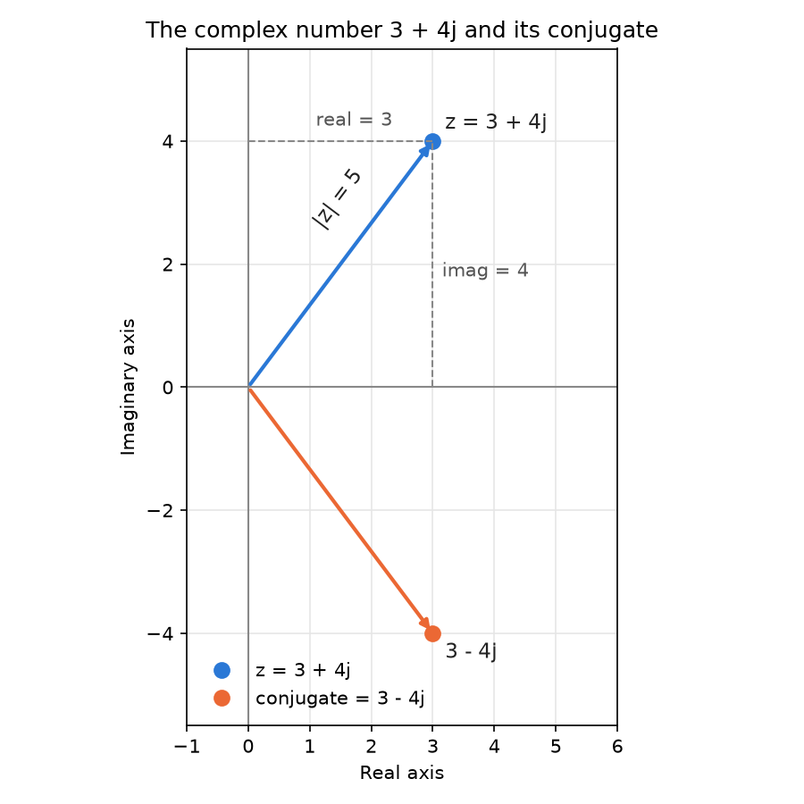
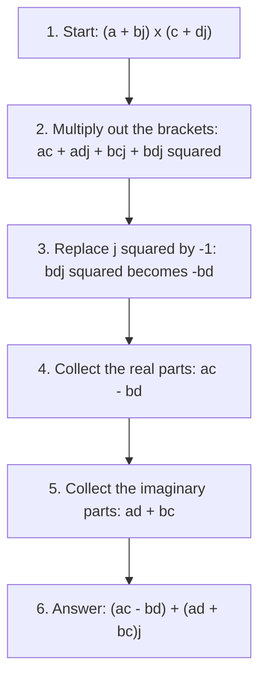
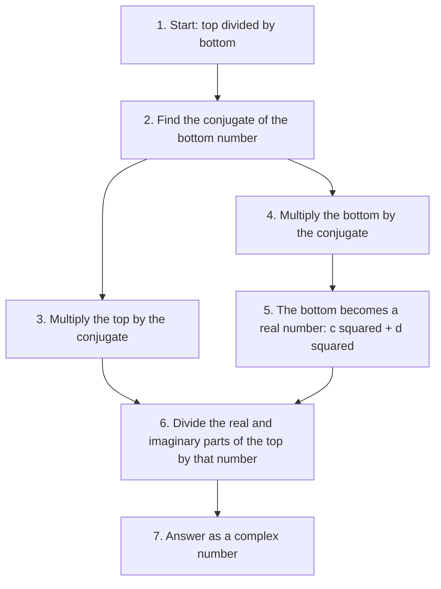
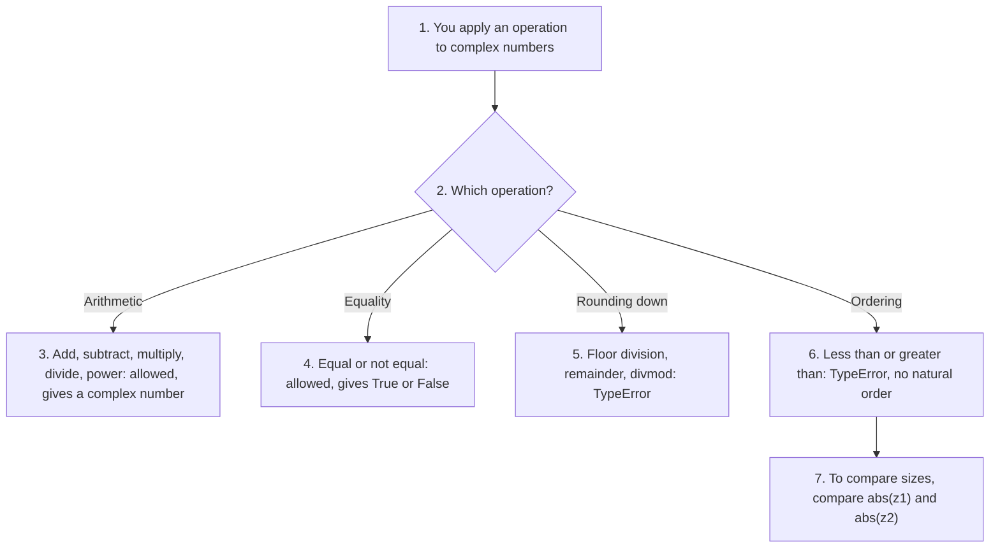

# Complex Numbers in Python (`complex`): A Beginner's Guide with Examples

Most numbers we use every day sit on a single line: 3, -2.5, 100. A **complex number** is different. It has **two parts**, a real part and an imaginary part, so it needs two values to describe it. Complex numbers sound difficult, but Python makes them easy. They are built into the language, so you do not need to install or import anything to use them.

This page is part of the online material for **Chapter 2: Python Data Types**. Python has three built-in number types: `int` (whole numbers), `float` (numbers with a decimal point) and `complex`. This page covers the third one. It has three parts:

* **Part A: Beginner's Guide.** What a complex number is, why it is useful, how to create one, its useful properties and the basic operations, with worked examples by hand.
* **Part B: Examples.** Short scripts that show complex numbers in action, each with its output, and one combined script at the end.
* **Part C: Check Your Understanding.** Practice questions with step-by-step answers.

You do not need much mathematics to follow this page. If you know how to multiply out brackets, such as (a + b)(c + d), you have all the maths you need. Companion pages cover [integers](001-ch2-python-data-types.md) and [floats](002-ch2-float-data.md).

## Table of Contents

* [Complex Numbers in Python (`complex`): A Beginner's Guide with Examples](#complex-numbers-in-python-complex-a-beginners-guide-with-examples)
  * [Key Terms Used on This Page](#key-terms-used-on-this-page)
  * [Part A: Beginners Guide to Complex Numbers in Python](#part-a-beginners-guide-to-complex-numbers-in-python)
    * [1. What Is a Complex Number?](#1-what-is-a-complex-number)
    * [2. Why Complex Numbers?](#2-why-complex-numbers)
    * [3. How to Create Them](#3-how-to-create-them)
    * [4. Useful Properties](#4-useful-properties)
      * [4.1 How the Magnitude Is Worked Out](#41-how-the-magnitude-is-worked-out)
    * [5. Basic Operations](#5-basic-operations)
      * [5.1 How Multiplication Works by Hand](#51-how-multiplication-works-by-hand)
      * [5.2 How Division Works by Hand](#52-how-division-works-by-hand)
      * [5.3 Multiplying by j Turns a Number](#53-multiplying-by-j-turns-a-number)
    * [6. Example](#6-example)
    * [7. Summary](#7-summary)
  * [Part B: Simple Guide to Complex Numbers in Python (Examples)](#part-b-simple-guide-to-complex-numbers-in-python-examples)
    * [1. Creating Complex Numbers](#1-creating-complex-numbers)
    * [2. Accessing Parts](#2-accessing-parts)
    * [3. Magnitude and Power](#3-magnitude-and-power)
    * [4. Arithmetic](#4-arithmetic)
    * [5. Unsupported Operations (Error Examples)](#5-unsupported-operations-error-examples)
    * [6. Large Complex Numbers](#6-large-complex-numbers)
    * [7. The cmath Module (Advanced)](#7-the-cmath-module-advanced)
    * [8. All the Examples in One Script](#8-all-the-examples-in-one-script)
  * [Part C: Check Your Understanding](#part-c-check-your-understanding)
    * [Question 1: The Type of an Imaginary Number](#question-1-the-type-of-an-imaginary-number)
    * [Question 2: The Parts of complex(7)](#question-2-the-parts-of-complex7)
    * [Question 3: Multiplying by Hand](#question-3-multiplying-by-hand)
    * [Question 4: Comparing Complex Numbers](#question-4-comparing-complex-numbers)
    * [Question 5: Creating a Complex Number from Text](#question-5-creating-a-complex-number-from-text)
    * [Question 6: Solving a Quadratic Equation](#question-6-solving-a-quadratic-equation)
    * [Question 7: Polar Form and Back](#question-7-polar-form-and-back)

## Key Terms Used on This Page

| Term | Simple meaning | Learn more |
| ---- | -------------- | ---------- |
| Complex number | A number with two parts, written as `a + bj`, where `a` is the real part and `b` is the imaginary part. | [Complex number](https://en.wikipedia.org/wiki/Complex_number) |
| Real part | The ordinary number part, `a` in `a + bj`. | [Complex number](https://en.wikipedia.org/wiki/Complex_number) |
| Imaginary part | The number that multiplies `j`, `b` in `a + bj`. | [Complex number](https://en.wikipedia.org/wiki/Complex_number) |
| Imaginary unit (`j`) | A special number whose square is -1. So `j` is √-1. Mathematicians usually call it `i`; Python calls it `j`. | [Imaginary unit](https://en.wikipedia.org/wiki/Imaginary_unit) |
| Conjugate | The same complex number with the sign of the imaginary part flipped. The conjugate of `3 + 4j` is `3 - 4j`. | [Complex conjugate](https://en.wikipedia.org/wiki/Complex_conjugate) |
| Magnitude (modulus) | The distance of a complex number from zero. `abs()` gives it. | [Absolute value of a complex number](https://en.wikipedia.org/wiki/Absolute_value#Complex_numbers) |
| Complex plane | A graph where the real part is measured across and the imaginary part is measured up and down. | [Complex plane](https://en.wikipedia.org/wiki/Complex_plane) |
| Polar form | Describing a complex number by its magnitude and its angle, instead of its two parts. | [Polar form](https://en.wikipedia.org/wiki/Complex_number#Polar_form) |
| Radian | A unit for measuring angles. A full turn is 2π radians, or 360 degrees. | [Radian](https://en.wikipedia.org/wiki/Radian) |
| Literal | A value typed directly into your code, such as `3 + 4j`. | [Imaginary literals](https://docs.python.org/3/reference/lexical_analysis.html#imaginary-literals) |
| `cmath` | Python's built-in module of maths functions for complex numbers. | [cmath module](https://docs.python.org/3/library/cmath.html) |
| `TypeError` | The error Python raises when an operation cannot be used with a type of value. | [TypeError](https://docs.python.org/3/library/exceptions.html#TypeError) |

[Back to the Table of Contents](#table-of-contents)

## Part A: Beginners Guide to Complex Numbers in Python

Complex numbers let us work with quantities that have **two parts**:

* a **real part**,
* an **imaginary part** (using **j** for √-1 in Python).

Example:

```python
z = 3 + 4j
```

Here `3` is the real part and `4` is the imaginary part.

[Back to the Table of Contents](#table-of-contents)

### 1. What Is a Complex Number?

No ordinary number, when multiplied by itself, gives a negative answer. 2 × 2 = 4 and (-2) × (-2) = 4. So the equation x² = -1 has no ordinary answer. Mathematicians solved this by inventing a new number whose square is -1. Python calls this number `j`:

```
j × j = -1,  so  j = √-1
```

A complex number combines an ordinary (real) number with a multiple of `j`:

```
z = a + bj
    │    └── imaginary part (b), multiplied by j
    └─────── real part (a)
```

**Why `j` and not `i`?** In mathematics books the imaginary unit is usually written `i`. Electrical engineers use `j` instead, because `i` already stands for electric current. Python follows the engineers' custom.

**A picture helps.** You can think of a complex number as a point on a graph called the **complex plane**. The real part is the distance across, and the imaginary part is the distance up (or down, if it is negative). The picture below shows `3 + 4j` and its conjugate `3 - 4j`.



The picture was drawn with the script below. It uses the [Matplotlib](https://matplotlib.org/) library, which you can install with `pip install matplotlib`. Running it saves the file `complex-plane-3-4j.png` in the current folder.

```python
import matplotlib
matplotlib.use("Agg")            # draw to a file, not to a window
import matplotlib.pyplot as plt

# Step 1: The complex number and its conjugate
z = 3 + 4j
zc = z.conjugate()               # 3 - 4j

# Step 2: Set up the drawing area
fig, ax = plt.subplots(figsize=(6, 6))
ax.axhline(0, color="#888888", linewidth=1)   # real axis
ax.axvline(0, color="#888888", linewidth=1)   # imaginary axis
ax.grid(color="#e6e6e6", linewidth=0.8)
ax.set_xlim(-1, 6)
ax.set_ylim(-5.5, 5.5)
ax.set_aspect("equal")

# Step 3: Draw an arrow from 0 to z; its length is abs(z)
ax.annotate("", xy=(z.real, z.imag), xytext=(0, 0),
            arrowprops=dict(arrowstyle="-|>", color="#2a78d6", linewidth=2))
ax.plot(z.real, z.imag, "o", color="#2a78d6", markersize=8, label="z = 3 + 4j")
ax.text(z.real + 0.2, z.imag + 0.2, "z = 3 + 4j", color="#222222", fontsize=11)
ax.text(1.0, 2.6, "|z| = 5", color="#222222", fontsize=11, rotation=53)

# Step 4: Dashed guide lines show the real part (3) and imaginary part (4)
ax.plot([z.real, z.real], [0, z.imag], "--", color="#888888", linewidth=1)
ax.plot([0, z.real], [z.imag, z.imag], "--", color="#888888", linewidth=1)
ax.text(z.real + 0.15, 1.8, "imag = 4", color="#555555", fontsize=10)
ax.text(1.1, z.imag + 0.25, "real = 3", color="#555555", fontsize=10)

# Step 5: Draw the conjugate, which is the mirror image of z in the real axis
ax.annotate("", xy=(zc.real, zc.imag), xytext=(0, 0),
            arrowprops=dict(arrowstyle="-|>", color="#eb6834", linewidth=2))
ax.plot(zc.real, zc.imag, "o", color="#eb6834", markersize=8, label="conjugate = 3 - 4j")
ax.text(zc.real + 0.2, zc.imag - 0.4, "3 - 4j", color="#222222", fontsize=11)

# Step 6: Labels, legend and saving the picture
ax.set_xlabel("Real axis")
ax.set_ylabel("Imaginary axis")
ax.set_title("The complex number 3 + 4j and its conjugate")
ax.legend(loc="lower left", frameon=False)
fig.tight_layout()
fig.savefig("complex-plane-3-4j.png", dpi=150, facecolor="white")
print("Saved complex-plane-3-4j.png")
```

Output:

```text
Saved complex-plane-3-4j.png
```

[Back to the Table of Contents](#table-of-contents)

### 2. Why Complex Numbers?

They are used in:

| Field | How complex numbers help |
| ----- | ------------------------ |
| Electricity | Alternating current (AC) rises and falls like a wave. One complex number can hold both the size of a voltage or current and its timing (phase). |
| Engineering | Control systems, vibrations and bridges are studied with complex numbers to find out whether a system is stable. |
| Signal processing | Sound, music, radio and images are broken into waves using the [Fourier transform](https://en.wikipedia.org/wiki/Fourier_transform), which works with complex numbers. |
| Physics | Waves, light and quantum mechanics are all described with complex numbers. |
| Computer graphics | Multiplying by a complex number turns (rotates) a point, which is handy in 2D graphics. Fractal pictures such as the [Mandelbrot set](https://en.wikipedia.org/wiki/Mandelbrot_set) are made from complex numbers. |
| Mathematics | Equations such as x² + 2x + 5 = 0, which have no ordinary answer, have complex answers (see Question 6 in Part C). |

[Back to the Table of Contents](#table-of-contents)

### 3. How to Create Them

```python
z = 3 + 4j
w = complex(5, 2)   # same as 5 + 2j
```

There are two main ways:

1. **Write it directly** (a literal): `3 + 4j`. The `j` must come straight after a number, with no space and no `*`. Write `1j` for `j` on its own, because a bare `j` is just a variable name.
2. **Use the [`complex()`](https://docs.python.org/3/library/functions.html#complex) function**: `complex(real, imag)`. If you leave out the second value, the imaginary part is 0. You can also pass a string such as `"3+4j"`, but it must not contain spaces around the `+`.

```python
# Step 1: Write a complex number directly (a literal)
z = 3 + 4j
print("z ->", z)
# (3+4j)

# Step 2: Build one with the complex() function
w = complex(5, 2)   # same as 5 + 2j
print("w ->", w)
# (5+2j)

# Step 3: Check the type
print("type(z) ->", type(z))
# <class 'complex'>

# Step 4: Other ways to create complex numbers
print("4j ->", 4j)                          # only an imaginary part
# 4j
print("1j * 1j ->", 1j * 1j)                # j squared is -1
# (-1+0j)
print("complex(6) ->", complex(6))          # only a real part
# (6+0j)
print("complex('3+4j') ->", complex('3+4j'))   # from a string (no spaces allowed)
# (3+4j)
```

Output:

```text
z -> (3+4j)
w -> (5+2j)
type(z) -> <class 'complex'>
4j -> 4j
1j * 1j -> (-1+0j)
complex(6) -> (6+0j)
complex('3+4j') -> (3+4j)
```

Notice how Python prints complex numbers. When there is a real part, it puts the number in brackets, such as `(3+4j)`. When the real part is exactly 0, it leaves out the brackets and the zero, such as `4j`.

[Back to the Table of Contents](#table-of-contents)

### 4. Useful Properties

```python
z.real      # real part
z.imag      # imaginary part
z.conjugate()
abs(z)      # magnitude
```

| Property or function | What it gives | Result for `z = 3 + 4j` |
| -------------------- | ------------- | ----------------------- |
| `z.real` | The real part, always a float | `3.0` |
| `z.imag` | The imaginary part, always a float | `4.0` |
| `z.conjugate()` | The conjugate: the imaginary part with its sign flipped | `(3-4j)` |
| `abs(z)` | The magnitude: the distance from 0 on the complex plane | `5.0` |

Note that `real` and `imag` are written without brackets (they are attributes, or stored values), while `conjugate()` needs brackets (it is a method, which does some work). Writing `z.conjugate` without brackets does not give the conjugate.

```python
# Step 1: Create a complex number
z = 3 + 4j

# Step 2: Read its two parts
print("z.real ->", z.real)
# 3.0
print("z.imag ->", z.imag)
# 4.0

# Step 3: Get the conjugate (the sign of the imaginary part is flipped)
print("z.conjugate() ->", z.conjugate())
# (3-4j)

# Step 4: Get the magnitude (distance from zero)
print("abs(z) ->", abs(z))
# 5.0

# Step 5: Check the magnitude by hand, using Pythagoras
print("(3**2 + 4**2) ** 0.5 ->", (3**2 + 4**2) ** 0.5)
# 5.0
```

Output:

```text
z.real -> 3.0
z.imag -> 4.0
z.conjugate() -> (3-4j)
abs(z) -> 5.0
(3**2 + 4**2) ** 0.5 -> 5.0
```

[Back to the Table of Contents](#table-of-contents)

#### 4.1 How the Magnitude Is Worked Out

Look at the picture in section 1. The real part (3), the imaginary part (4) and the arrow from 0 to `z` form a right-angled triangle. The magnitude is the length of the arrow, so we can find it with [Pythagoras' theorem](https://en.wikipedia.org/wiki/Pythagorean_theorem):

1. Square the real part: 3² = 9.
2. Square the imaginary part: 4² = 16.
3. Add them: 9 + 16 = 25.
4. Take the square root: √25 = 5.

So `abs(3 + 4j)` is `5.0`. The general rule is `abs(a + bj) = √(a² + b²)`. The magnitude is always a float and never negative.

[Back to the Table of Contents](#table-of-contents)

### 5. Basic Operations

```python
z + w
z - w
z * w
z / w
```

| Operation | Rule for `(a + bj)` and `(c + dj)` | Example with `z = 3 + 4j`, `w = 5 + 2j` |
| --------- | ---------------------------------- | --------------------------------------- |
| Add | `(a + c) + (b + d)j` | `(8+6j)` |
| Subtract | `(a - c) + (b - d)j` | `(-2+2j)` |
| Multiply | `(ac - bd) + (ad + bc)j` | `(7+26j)` |
| Divide | `((ac + bd) + (bc - ad)j) / (c² + d²)` | `(0.793103448275862+0.48275862068965514j)` |

You do not need to remember these rules. Python applies them for you. The next two sections show where they come from.

```python
# Step 1: Two complex numbers
z = 3 + 4j
w = 5 + 2j

# Step 2: The four basic operations
print("z + w ->", z + w)
# (8+6j)
print("z - w ->", z - w)
# (-2+2j)
print("z * w ->", z * w)
# (7+26j)
print("z / w ->", z / w)
# (0.793103448275862+0.48275862068965514j)

# Step 3: Powers work too
print("z ** 2 ->", z ** 2)
# (-7+24j)

# Step 4: Mixing with int and float gives a complex result
print("z + 2 ->", z + 2)
# (5+4j)
print("z * 0.5 ->", z * 0.5)
# (1.5+2j)

# Step 5: Multiplying by 1j turns the number a quarter turn (90 degrees)
print("z * 1j ->", z * 1j)
# (-4+3j)
```

Output:

```text
z + w -> (8+6j)
z - w -> (-2+2j)
z * w -> (7+26j)
z / w -> (0.793103448275862+0.48275862068965514j)
z ** 2 -> (-7+24j)
z + 2 -> (5+4j)
z * 0.5 -> (1.5+2j)
z * 1j -> (-4+3j)
```

When you mix a complex number with an `int` or a `float`, the result is always complex. Python follows the order `int → float → complex` (see [type promotion](001-ch2-python-data-types.md#10-interactions-of-int-with-float-and-complex-type-promotion) on the integers page).

[Back to the Table of Contents](#table-of-contents)

#### 5.1 How Multiplication Works by Hand

Multiply out the brackets as usual, then replace `j × j` by -1. For `z * w = (3 + 4j)(5 + 2j)`:

1. First × first: 3 × 5 = 15.
2. First × second: 3 × 2j = 6j.
3. Second × first: 4j × 5 = 20j.
4. Second × second: 4j × 2j = 8j² = 8 × (-1) = -8.
5. Add the real parts: 15 - 8 = 7.
6. Add the imaginary parts: 6j + 20j = 26j.
7. Answer: 7 + 26j, which matches Python's `(7+26j)`.



[Back to the Table of Contents](#table-of-contents)

#### 5.2 How Division Works by Hand

We cannot divide by a complex number directly. The trick is to multiply the top and the bottom by the **conjugate** of the bottom number. This turns the bottom into an ordinary real number. For `z / w = (3 + 4j) / (5 + 2j)`:

1. The conjugate of the bottom, `5 + 2j`, is `5 - 2j`.
2. Top: (3 + 4j)(5 - 2j) = 15 - 6j + 20j - 8j² = 15 + 14j + 8 = 23 + 14j.
3. Bottom: (5 + 2j)(5 - 2j) = 25 - 4j² = 25 + 4 = 29. The `j` has gone.
4. Divide each part by 29: 23/29 = 0.7931... and 14/29 = 0.4827...
5. Answer: about 0.793 + 0.483j, which matches Python's result.



Steps 3 and 4 can be done in either order. They meet again at step 6.

[Back to the Table of Contents](#table-of-contents)

#### 5.3 Multiplying by j Turns a Number

The last line of the script shows a neat fact. `(3 + 4j) * 1j` gives `(-4+3j)`. On the complex plane, multiplying by `1j` turns a point a quarter turn (90 degrees) anticlockwise around 0, without changing its distance from 0. This is why complex numbers are handy for rotations in graphics and engineering.

[Back to the Table of Contents](#table-of-contents)

### 6. Example

```python
z = 3 + 4j
print(z.real)        # 3.0
print(z.imag)        # 4.0
print(abs(z))        # 5.0
```

Output:

```text
3.0
4.0
5.0
```

Even though we typed the whole numbers 3 and 4, `real` and `imag` are always floats. That is why the output shows `3.0` and `4.0`.

[Back to the Table of Contents](#table-of-contents)

### 7. Summary

Complex numbers are simple in Python, built into the language, and very useful for engineering and science.

* A complex number has a real part and an imaginary part: `a + bj`, where `j` is √-1.
* Create one with a literal such as `3 + 4j` or with `complex(3, 4)`.
* `z.real`, `z.imag`, `z.conjugate()` and `abs(z)` give its parts, conjugate and magnitude.
* `+`, `-`, `*`, `/` and `**` all work. Python applies the rules for you.
* Mixing a complex number with an `int` or `float` gives a complex result.

[Back to the Table of Contents](#table-of-contents)

## Part B: Simple Guide to Complex Numbers in Python (Examples)

Each block below is a short script. The expected output is shown in a hash comment (`#`) just below each `print()` line, and the complete output is given after the script. Every block runs on its own, so you can copy and paste any of them into Python. A combined script with all the blocks is given at the end.

[Back to the Table of Contents](#table-of-contents)

### 1. Creating Complex Numbers

```python
# Step 1: A number with only an imaginary part
print("5j ->", 5j)
# 5j

# Step 2: A number with both parts
print("3 + 7j ->", 3 + 7j)
# (3+7j)

# Step 3: complex(real, imag)
print("complex(10, -4) ->", complex(10, -4))
# (10-4j)

# Step 4: complex() with only a real part
print("complex(6) ->", complex(6))
# (6+0j)
```

Output:

```text
5j -> 5j
3 + 7j -> (3+7j)
complex(10, -4) -> (10-4j)
complex(6) -> (6+0j)
```

[Back to the Table of Contents](#table-of-contents)

### 2. Accessing Parts

```python
# Step 1: Create the number
z = complex(10, -4)
print("z ->", z)
# (10-4j)

# Step 2: The real part (always a float)
print("z.real ->", z.real)
# 10.0

# Step 3: The imaginary part (always a float)
print("z.imag ->", z.imag)
# -4.0

# Step 4: The conjugate (the imaginary part changes sign)
print("z.conjugate() ->", z.conjugate())
# (10+4j)
```

Output:

```text
z -> (10-4j)
z.real -> 10.0
z.imag -> -4.0
z.conjugate() -> (10+4j)
```

[Back to the Table of Contents](#table-of-contents)

### 3. Magnitude and Power

```python
z = complex(10, -4)   # defined again so this block runs on its own

# Step 1: Magnitude = square root of (real² + imag²) = square root of 116
print("abs(z) ->", abs(z))
# 10.770329614269007

# Step 2: Square the number
print("pow(z, 2) ->", pow(z, 2))
# (84-80j)
# (10 - 4j)² = 100 - 80j + 16j² = 100 - 80j - 16 = 84 - 80j
```

Output:

```text
abs(z) -> 10.770329614269007
pow(z, 2) -> (84-80j)
```

How the magnitude is worked out:

1. Square the real part: 10² = 100.
2. Square the imaginary part: (-4)² = 16.
3. Add them: 100 + 16 = 116.
4. Take the square root: √116 = 10.770329614269007.

[Back to the Table of Contents](#table-of-contents)

### 4. Arithmetic

```python
# Step 1: Two complex numbers
z1 = complex(10, -4)
z2 = complex(-3, 2)

# Step 2: Add and subtract (work on each part separately)
print("z1 + z2 ->", z1 + z2)
# (7-2j)

print("z1 - z2 ->", z1 - z2)
# (13-6j)

# Step 3: Multiply
print("z1 * z2 ->", z1 * z2)
# (-22+32j)

# Step 4: Divide
print("z1 / z2 ->", z1 / z2)
# (-2.9230769230769234-0.6153846153846153j)
```

Output:

```text
z1 + z2 -> (7-2j)
z1 - z2 -> (13-6j)
z1 * z2 -> (-22+32j)
z1 / z2 -> (-2.9230769230769234-0.6153846153846153j)
```

Working by hand, as in Part A:

| Operation | Working | Result |
| --------- | ------- | ------ |
| `z1 + z2` | (10 + (-3)) + ((-4) + 2)j | `7 - 2j` |
| `z1 - z2` | (10 - (-3)) + ((-4) - 2)j | `13 - 6j` |
| `z1 * z2` | (10)(-3) + (10)(2j) + (-4j)(-3) + (-4j)(2j) = -30 + 20j + 12j + 8 | `-22 + 32j` |
| `z1 / z2` | Multiply top and bottom by -3 - 2j. Top: -30 - 20j + 12j - 8 = -38 - 8j. Bottom: 9 + 4 = 13. So -38/13 - (8/13)j | `-2.923... - 0.615...j` |

[Back to the Table of Contents](#table-of-contents)

### 5. Unsupported Operations (Error Examples)

Some operations make no sense for complex numbers, so Python raises a `TypeError`:

* **Floor division `//`, remainder `%` and `divmod()`** need rounding down to a whole number. There is no single "down" direction on a flat plane, so they are not defined.
* **`<`, `>`, `<=` and `>=`** need one number to be bigger than the other. Complex numbers are points on a plane, not on a line, so there is no natural order. Is `1j` bigger or smaller than `1`? Neither.
* **`==` and `!=`** work, because two complex numbers are equal when both parts are equal.

```python
z1 = complex(10, -4)  # defined again so this block runs on its own
z2 = complex(-3, 2)   # defined again so this block runs on its own

# Step 1: These operations are not allowed for complex numbers
# print(z1 // z2)  # TypeError
# print(z1 % z2)   # TypeError
# print(divmod(z1, z2))  # TypeError
# print(z1 > z2)   # TypeError
# print(z1 < z2)   # TypeError

# Step 2: Run each one safely and show the error
tests = [
    ("z1 // z2", lambda: z1 // z2),
    ("z1 % z2", lambda: z1 % z2),
    ("divmod(z1, z2)", lambda: divmod(z1, z2)),
    ("z1 > z2", lambda: z1 > z2),
    ("z1 < z2", lambda: z1 < z2),
]
for text, attempt in tests:
    try:
        attempt()
    except TypeError:
        print(text, "-> TypeError")

# Step 3: Testing for equality is allowed
print("z1 == z2 ->", z1 == z2)
# False

print("z1 != z2 ->", z1 != z2)
# True

# Step 4: To compare sizes, compare the magnitudes instead
print("abs(z1) > abs(z2) ->", abs(z1) > abs(z2))
# True
```

Output:

```text
z1 // z2 -> TypeError
z1 % z2 -> TypeError
divmod(z1, z2) -> TypeError
z1 > z2 -> TypeError
z1 < z2 -> TypeError
z1 == z2 -> False
z1 != z2 -> True
abs(z1) > abs(z2) -> True
```

If you need to know which of two complex numbers is "bigger", decide what you mean. Usually it is the distance from 0, so compare `abs()` values, as in Step 4.



[Back to the Table of Contents](#table-of-contents)

### 6. Large Complex Numbers

```python
import sys

# Step 1: A complex number with large parts
large = complex(5e12, -8e12)

# Step 2: Its size in memory
print("sys.getsizeof(large) ->", sys.getsizeof(large))
# 32
# Every complex number takes 32 bytes on 64-bit CPython, whatever its value.

# Step 3: Arithmetic with large values
print("large + large ->", large + large)
# (10000000000000-16000000000000j)
# That is 1e13 - 1.6e13j. Python writes out the digits because each part
# has fewer than 17 digits.

print("large - large ->", large - large)
# 0j

print("large * large ->", large * large)
# (-3.9e+25-8e+25j)

print("large / large ->", large / large)
# (1-0j)
# The imaginary part is -0.0 (negative zero), so Python shows "-0j".
# It is equal to (1+0j).
```

Output:

```text
sys.getsizeof(large) -> 32
large + large -> (10000000000000-16000000000000j)
large - large -> 0j
large * large -> (-3.9e+25-8e+25j)
large / large -> (1-0j)
```

Points to note:

* A complex number is stored as **two floats**, one for each part. So every complex number takes the same 32 bytes, whatever its value. Unlike an `int`, it does not grow.
* Because the parts are floats, complex numbers share the limits of floats: about 15 to 17 significant digits, and a largest value of about 1.8 × 10³⁰⁸ for each part. See the [floats page](002-ch2-float-data.md) for details.

[Back to the Table of Contents](#table-of-contents)

### 7. The cmath Module (Advanced)

The `math` module works only with real numbers. For complex numbers, Python has the [`cmath`](https://docs.python.org/3/library/cmath.html) module. It has complex versions of `sqrt()`, `exp()`, `log()`, `sin()` and so on, plus functions for **polar form**. In polar form, a complex number is described by its magnitude (distance from 0) and its angle (measured anticlockwise from the positive real axis, in radians).

```python
import cmath
import math

# Step 1: math.sqrt() cannot take the square root of a negative number
try:
    math.sqrt(-1)
except ValueError as error:
    print("math.sqrt(-1) -> ValueError:", error)

# Step 2: cmath.sqrt() can, and gives a complex answer
print("cmath.sqrt(-1) ->", cmath.sqrt(-1))
# 1j
print("cmath.sqrt(-16) ->", cmath.sqrt(-16))
# 4j

# Step 3: Polar form - magnitude and angle
z = 3 + 4j
r, theta = cmath.polar(z)
print("cmath.polar(z) ->", (r, theta))
# (5.0, 0.9272952180016122)
print("angle in degrees ->", math.degrees(theta))
# 53.13010235415598

# Step 4: Back from polar form to the usual form
print("cmath.rect(r, theta) ->", cmath.rect(r, theta))
# (3.0000000000000004+3.9999999999999996j)
# The tiny errors come from float rounding (see the float page).
```

Output:

```text
math.sqrt(-1) -> ValueError: math domain error
cmath.sqrt(-1) -> 1j
cmath.sqrt(-16) -> 4j
cmath.polar(z) -> (5.0, 0.9272952180016122)
angle in degrees -> 53.13010235415598
cmath.rect(r, theta) -> (3.0000000000000004+3.9999999999999996j)
```

For `3 + 4j`, the magnitude is 5 and the angle is about 0.927 radians, or about 53.13 degrees. You can see this angle in the picture in section 1 of Part A.

[Back to the Table of Contents](#table-of-contents)

### 8. All the Examples in One Script

This script joins blocks 1 to 7 into a single program. Lines that repeated a variable only so that a block could run on its own have been left out, and the imports are placed at the top.

```python
import cmath
import math
import sys

# ===== Part 1. Creating complex numbers =====
# Step 1: A number with only an imaginary part
print("5j ->", 5j)
# 5j

# Step 2: A number with both parts
print("3 + 7j ->", 3 + 7j)
# (3+7j)

# Step 3: complex(real, imag)
print("complex(10, -4) ->", complex(10, -4))
# (10-4j)

# Step 4: complex() with only a real part
print("complex(6) ->", complex(6))
# (6+0j)

# ===== Part 2. Accessing parts =====
# Step 1: Create the number
z = complex(10, -4)
print("z ->", z)
# (10-4j)

# Step 2: The real part (always a float)
print("z.real ->", z.real)
# 10.0

# Step 3: The imaginary part (always a float)
print("z.imag ->", z.imag)
# -4.0

# Step 4: The conjugate (the imaginary part changes sign)
print("z.conjugate() ->", z.conjugate())
# (10+4j)

# ===== Part 3. Magnitude and power =====
# Step 1: Magnitude = square root of (real² + imag²) = square root of 116
print("abs(z) ->", abs(z))
# 10.770329614269007

# Step 2: Square the number
print("pow(z, 2) ->", pow(z, 2))
# (84-80j)
# (10 - 4j)² = 100 - 80j + 16j² = 100 - 80j - 16 = 84 - 80j

# ===== Part 4. Arithmetic =====
# Step 1: Two complex numbers
z1 = complex(10, -4)
z2 = complex(-3, 2)

# Step 2: Add and subtract (work on each part separately)
print("z1 + z2 ->", z1 + z2)
# (7-2j)

print("z1 - z2 ->", z1 - z2)
# (13-6j)

# Step 3: Multiply
print("z1 * z2 ->", z1 * z2)
# (-22+32j)

# Step 4: Divide
print("z1 / z2 ->", z1 / z2)
# (-2.9230769230769234-0.6153846153846153j)

# ===== Part 5. Unsupported operations =====
# Step 1: These operations are not allowed for complex numbers
# print(z1 // z2)  # TypeError
# print(z1 % z2)   # TypeError
# print(divmod(z1, z2))  # TypeError
# print(z1 > z2)   # TypeError
# print(z1 < z2)   # TypeError

# Step 2: Run each one safely and show the error
tests = [
    ("z1 // z2", lambda: z1 // z2),
    ("z1 % z2", lambda: z1 % z2),
    ("divmod(z1, z2)", lambda: divmod(z1, z2)),
    ("z1 > z2", lambda: z1 > z2),
    ("z1 < z2", lambda: z1 < z2),
]
for text, attempt in tests:
    try:
        attempt()
    except TypeError:
        print(text, "-> TypeError")

# Step 3: Testing for equality is allowed
print("z1 == z2 ->", z1 == z2)
# False

print("z1 != z2 ->", z1 != z2)
# True

# Step 4: To compare sizes, compare the magnitudes instead
print("abs(z1) > abs(z2) ->", abs(z1) > abs(z2))
# True

# ===== Part 6. Large complex numbers =====
# Step 1: A complex number with large parts
large = complex(5e12, -8e12)

# Step 2: Its size in memory
print("sys.getsizeof(large) ->", sys.getsizeof(large))
# 32
# Every complex number takes 32 bytes on 64-bit CPython, whatever its value.

# Step 3: Arithmetic with large values
print("large + large ->", large + large)
# (10000000000000-16000000000000j)
# That is 1e13 - 1.6e13j. Python writes out the digits because each part
# has fewer than 17 digits.

print("large - large ->", large - large)
# 0j

print("large * large ->", large * large)
# (-3.9e+25-8e+25j)

print("large / large ->", large / large)
# (1-0j)
# The imaginary part is -0.0 (negative zero), so Python shows "-0j".
# It is equal to (1+0j).

# ===== Part 7. The cmath module =====
# Step 1: math.sqrt() cannot take the square root of a negative number
try:
    math.sqrt(-1)
except ValueError as error:
    print("math.sqrt(-1) -> ValueError:", error)

# Step 2: cmath.sqrt() can, and gives a complex answer
print("cmath.sqrt(-1) ->", cmath.sqrt(-1))
# 1j
print("cmath.sqrt(-16) ->", cmath.sqrt(-16))
# 4j

# Step 3: Polar form - magnitude and angle
z = 3 + 4j
r, theta = cmath.polar(z)
print("cmath.polar(z) ->", (r, theta))
# (5.0, 0.9272952180016122)
print("angle in degrees ->", math.degrees(theta))
# 53.13010235415598

# Step 4: Back from polar form to the usual form
print("cmath.rect(r, theta) ->", cmath.rect(r, theta))
# (3.0000000000000004+3.9999999999999996j)
# The tiny errors come from float rounding (see the float page).
```

Output:

```text
5j -> 5j
3 + 7j -> (3+7j)
complex(10, -4) -> (10-4j)
complex(6) -> (6+0j)
z -> (10-4j)
z.real -> 10.0
z.imag -> -4.0
z.conjugate() -> (10+4j)
abs(z) -> 10.770329614269007
pow(z, 2) -> (84-80j)
z1 + z2 -> (7-2j)
z1 - z2 -> (13-6j)
z1 * z2 -> (-22+32j)
z1 / z2 -> (-2.9230769230769234-0.6153846153846153j)
z1 // z2 -> TypeError
z1 % z2 -> TypeError
divmod(z1, z2) -> TypeError
z1 > z2 -> TypeError
z1 < z2 -> TypeError
z1 == z2 -> False
z1 != z2 -> True
abs(z1) > abs(z2) -> True
sys.getsizeof(large) -> 32
large + large -> (10000000000000-16000000000000j)
large - large -> 0j
large * large -> (-3.9e+25-8e+25j)
large / large -> (1-0j)
math.sqrt(-1) -> ValueError: math domain error
cmath.sqrt(-1) -> 1j
cmath.sqrt(-16) -> 4j
cmath.polar(z) -> (5.0, 0.9272952180016122)
angle in degrees -> 53.13010235415598
cmath.rect(r, theta) -> (3.0000000000000004+3.9999999999999996j)
```

[Back to the Table of Contents](#table-of-contents)

## Part C: Check Your Understanding

Try each question yourself before you read the answer.

[Back to the Table of Contents](#table-of-contents)

### Question 1: The Type of an Imaginary Number

What does `print(type(2j))` show? Is `3 + 0j` an `int` or a `complex`?

**Answer:**

1. Any number written with `j` is a complex number, even with no real part. So `type(2j)` is `<class 'complex'>`.
2. `3 + 0j` is also complex. Its imaginary part is 0, but the type is decided by how the number was made, not by its value.

```python
print(type(2j))
print(type(3 + 0j))
```

Output:

```text
<class 'complex'>
<class 'complex'>
```

[Back to the Table of Contents](#table-of-contents)

### Question 2: The Parts of complex(7)

What are the real and imaginary parts of `complex(7)`, and what type are they?

**Answer:**

1. With only one value, `complex()` uses it as the real part and sets the imaginary part to 0.
2. So `complex(7)` is `(7+0j)`.
3. The parts are always stored as floats, so `real` is `7.0` and `imag` is `0.0`.

```python
z = complex(7)
print(z)
print(z.real, z.imag)
print(type(z.real), type(z.imag))
```

Output:

```text
(7+0j)
7.0 0.0
<class 'float'> <class 'float'>
```

[Back to the Table of Contents](#table-of-contents)

### Question 3: Multiplying by Hand

Without running any code, work out `(2 + 3j) * (4 - 1j)`.

**Answer:** `11 + 10j`

1. 2 × 4 = 8.
2. 2 × (-1j) = -2j.
3. 3j × 4 = 12j.
4. 3j × (-1j) = -3j² = -3 × (-1) = 3.
5. Real parts: 8 + 3 = 11.
6. Imaginary parts: -2j + 12j = 10j.
7. Answer: 11 + 10j.

Check with Python:

```python
print((2 + 3j) * (4 - 1j))
```

Output:

```text
(11+10j)
```

[Back to the Table of Contents](#table-of-contents)

### Question 4: Comparing Complex Numbers

Why does `(3 + 4j) > (1 + 1j)` raise an error? How can you tell which number is further from 0?

**Answer:**

1. `>` needs the numbers to have an order, as points on a line do.
2. Complex numbers are points on a plane. There is no natural way to say that one point is "greater" than another, so Python raises `TypeError`.
3. To compare distances from 0, compare the magnitudes: `abs(3 + 4j)` is 5.0 and `abs(1 + 1j)` is about 1.414.

```python
a = 3 + 4j
b = 1 + 1j
try:
    print(a > b)
except TypeError as error:
    print("TypeError:", error)
print(abs(a), abs(b), abs(a) > abs(b))
```

Output:

```text
TypeError: '>' not supported between instances of 'complex' and 'complex'
5.0 1.4142135623730951 True
```

[Back to the Table of Contents](#table-of-contents)

### Question 5: Creating a Complex Number from Text

Why does `complex("3 + 4j")` fail while `complex("3+4j")` works?

**Answer:**

1. When `complex()` reads a string, it expects the number written without spaces inside it.
2. Spaces at the two ends are allowed, and so are brackets around the whole number.
3. Spaces around the `+` are not allowed, so `"3 + 4j"` raises `ValueError`.

```python
for text in ["3+4j", "3 + 4j", "(3+4j)", " 3+4j "]:
    try:
        print(repr(text), "->", complex(text))
    except ValueError:
        print(repr(text), "-> ValueError")
```

Output:

```text
'3+4j' -> (3+4j)
'3 + 4j' -> ValueError
'(3+4j)' -> (3+4j)
' 3+4j ' -> (3+4j)
```

[Back to the Table of Contents](#table-of-contents)

### Question 6: Solving a Quadratic Equation

Write a script that solves x² + 2x + 5 = 0 using the quadratic formula, x = (-b ± √(b² - 4ac)) / 2a.

**Answer:**

The discriminant b² - 4ac is negative here, so `math.sqrt()` would fail. `cmath.sqrt()` gives a complex square root, and the roots come out as complex numbers.

```python
import cmath

# Step 1: The coefficients of x² + 2x + 5 = 0
a, b, c = 1, 2, 5

# Step 2: Work out the discriminant b² - 4ac
d = b ** 2 - 4 * a * c
print("Discriminant:", d)

# Step 3: Take its square root with cmath (works even when d is negative)
root_d = cmath.sqrt(d)
print("Square root of discriminant:", root_d)

# Step 4: Use the quadratic formula for both roots
x1 = (-b + root_d) / (2 * a)
x2 = (-b - root_d) / (2 * a)
print("x1 =", x1)
print("x2 =", x2)

# Step 5: Check each root by putting it back into the equation
print("Check x1:", a * x1 ** 2 + b * x1 + c)
print("Check x2:", a * x2 ** 2 + b * x2 + c)
```

Output:

```text
Discriminant: -16
Square root of discriminant: 4j
x1 = (-1+2j)
x2 = (-1-2j)
Check x1: 0j
Check x2: 0j
```

The two roots are `-1 + 2j` and `-1 - 2j`. They are conjugates of each other, which always happens when a quadratic with real coefficients has complex roots.

[Back to the Table of Contents](#table-of-contents)

### Question 7: Polar Form and Back

Write a script that finds the magnitude and angle of `1 + 1j`, shows the angle in degrees, and rebuilds the number from its polar form.

**Answer:**

```python
import cmath
import math

# Step 1: The number to study
z = 1 + 1j

# Step 2: Magnitude and angle
r, theta = cmath.polar(z)
print("Magnitude:", r)
print("Angle (radians):", theta)
print("Angle (degrees):", math.degrees(theta))

# Step 3: Rebuild the number from its polar form
back = cmath.rect(r, theta)
print("Rebuilt:", back)

# Step 4: Compare, allowing for tiny float errors
print("Close to the original?", cmath.isclose(back, z))
```

Output:

```text
Magnitude: 1.4142135623730951
Angle (radians): 0.7853981633974483
Angle (degrees): 45.0
Rebuilt: (1.0000000000000002+1j)
Close to the original? True
```

1. The magnitude is √(1² + 1²) = √2 ≈ 1.414.
2. The point `1 + 1j` lies exactly halfway between the real and imaginary axes, so its angle is 45 degrees (π/4 radians).
3. The rebuilt number differs from `1 + 1j` in the last digit because of float rounding. That is why the check uses `cmath.isclose()` instead of `==`.

[Back to the Table of Contents](#table-of-contents)


