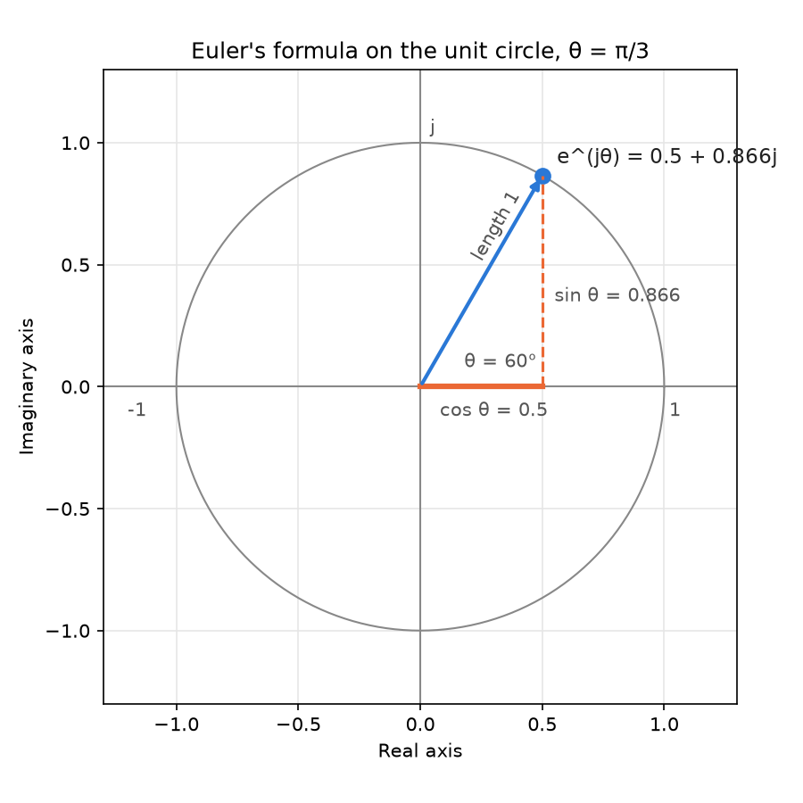
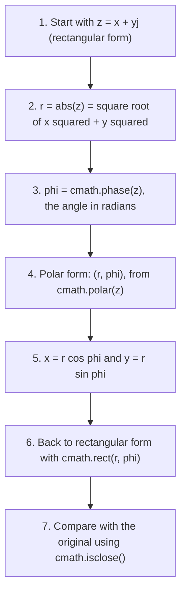
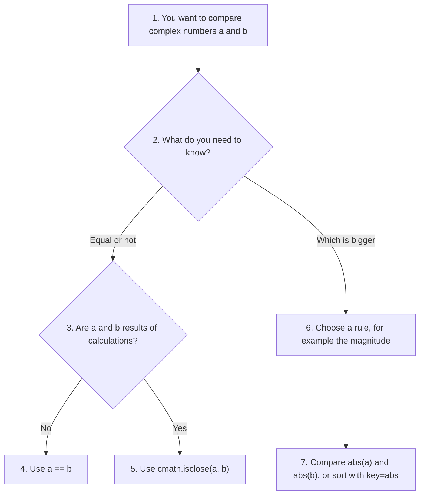
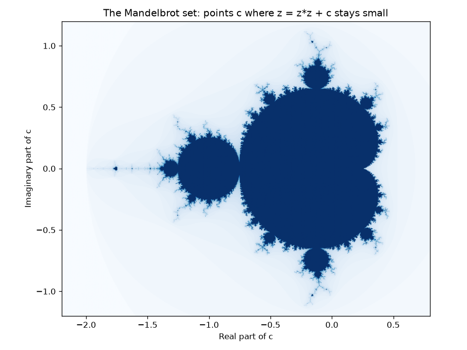

# Complex Numbers in Python: An Advanced Guide

Python provides **built-in support** for complex numbers. In many programming languages, complex numbers come from a separate library that you must add. Python includes a full complex number type, `complex`, in the core language, so it is ready to use without any import.

This page is part of the online material for **Chapter 2: Python Data Types**. It follows on from the [beginner's guide to complex numbers](003-ch2-complex-numbers-basics.md), which explains what a complex number is and how to do basic arithmetic with one. If you are new to complex numbers, read that page first.

This guide goes further. It covers:

* how Python stores a complex number inside the computer,
* the polar form and Euler's formula, with the `cmath` module,
* what happens with special float values such as infinity and NaN (IEEE-754 behaviour) and other edge cases,
* how to compare complex numbers safely,
* real uses in electrical engineering, signal processing and fractals, including NumPy,
* performance notes.

Part A explains the ideas. Part B gives four worked example scripts and a combined script. Part C has practice questions with step-by-step answers. All scripts were run with Python 3.12 and NumPy 2.5.

## Table of Contents

* [Complex Numbers in Python: An Advanced Guide](#complex-numbers-in-python-an-advanced-guide)
  * [Key Terms Used on This Page](#key-terms-used-on-this-page)
  * [Part A: Advanced Guide to Complex Numbers in Python](#part-a-advanced-guide-to-complex-numbers-in-python)
    * [1. Representation of Complex Numbers](#1-representation-of-complex-numbers)
      * [1.1 Example](#11-example)
      * [1.2 How Python Stores a Complex Number](#12-how-python-stores-a-complex-number)
    * [2. Creating Complex Numbers](#2-creating-complex-numbers)
      * [2.1 Direct Literal](#21-direct-literal)
      * [2.2 Using the complex() Constructor](#22-using-the-complex-constructor)
      * [2.3 Imaginary-Only Values](#23-imaginary-only-values)
      * [2.4 From a String](#24-from-a-string)
      * [2.5 All the Ways in One Script](#25-all-the-ways-in-one-script)
    * [3. Basic Operations](#3-basic-operations)
      * [3.1 Magnitude (Absolute Value)](#31-magnitude-absolute-value)
      * [3.2 Conjugate](#32-conjugate)
      * [3.3 All the Operations in One Script](#33-all-the-operations-in-one-script)
    * [4. Euler's Formula and Polar Representation](#4-eulers-formula-and-polar-representation)
      * [4.1 Rectangular and Polar Forms](#41-rectangular-and-polar-forms)
      * [4.2 Euler's Formula](#42-eulers-formula)
      * [4.3 Polar Operations with cmath](#43-polar-operations-with-cmath)
    * [5. IEEE-754 Behavior and Edge Cases](#5-ieee-754-behavior-and-edge-cases)
      * [5.1 Special Values and How to Check for Them](#51-special-values-and-how-to-check-for-them)
      * [5.2 Overflow, Underflow and Other Surprises](#52-overflow-underflow-and-other-surprises)
      * [5.3 Negative Zero and Branch Cuts (Advanced)](#53-negative-zero-and-branch-cuts-advanced)
    * [6. Comparison of Complex Numbers](#6-comparison-of-complex-numbers)
    * [7. Useful Scientific Applications](#7-useful-scientific-applications)
      * [7.1 Example: Impedance of an AC Circuit](#71-example-impedance-of-an-ac-circuit)
      * [7.2 Example: The Fast Fourier Transform](#72-example-the-fast-fourier-transform)
      * [7.3 Example: The Mandelbrot Set](#73-example-the-mandelbrot-set)
    * [8. Performance Notes](#8-performance-notes)
    * [9. Summary Table](#9-summary-table)
  * [Part B: Advanced Complex Number Examples in Python](#part-b-advanced-complex-number-examples-in-python)
    * [1. Euler's Formula](#1-eulers-formula)
    * [2. Polar and Rectangular Forms](#2-polar-and-rectangular-forms)
    * [3. IEEE-754 Special Values (inf, nan)](#3-ieee-754-special-values-inf-nan)
    * [4. NumPy Complex Arithmetic](#4-numpy-complex-arithmetic)
    * [5. All the Examples in One Script](#5-all-the-examples-in-one-script)
  * [Part C: Check Your Understanding](#part-c-check-your-understanding)
    * [Question 1: Euler's Identity in Python](#question-1-eulers-identity-in-python)
    * [Question 2: Infinity Times j](#question-2-infinity-times-j)
    * [Question 3: The Angle of a Negative Number](#question-3-the-angle-of-a-negative-number)
    * [Question 4: Magnitudes, Angles and Sorting](#question-4-magnitudes-angles-and-sorting)
    * [Question 5: Turning a Point with Complex Multiplication](#question-5-turning-a-point-with-complex-multiplication)

## Key Terms Used on This Page

| Term | Simple meaning | Learn more |
| ---- | -------------- | ---------- |
| Rectangular form | Writing a complex number by its two parts, `x + yj`. Also called Cartesian form. | [Complex number](https://en.wikipedia.org/wiki/Complex_number) |
| Polar form | Writing a complex number by its distance from 0 (magnitude) and its direction (angle). | [Polar form](https://en.wikipedia.org/wiki/Complex_number#Polar_form) |
| Magnitude | The distance from 0 to the number on the complex plane. `abs(z)` gives it. | [Absolute value](https://en.wikipedia.org/wiki/Absolute_value#Complex_numbers) |
| Phase (angle, argument) | The angle between the positive real axis and the line to the number, measured anticlockwise in radians. | [Argument](https://en.wikipedia.org/wiki/Argument_(complex_analysis)) |
| Radian | A unit for angles. π radians = 180 degrees. | [Radian](https://en.wikipedia.org/wiki/Radian) |
| `e` | A mathematical constant, about 2.71828, that appears naturally in growth and waves. | [e (mathematical constant)](https://en.wikipedia.org/wiki/E_(mathematical_constant)) |
| Euler's formula | e^(jθ) = cos θ + j sin θ. It links the exponential function with angles. | [Euler's formula](https://en.wikipedia.org/wiki/Euler%27s_formula) |
| Unit circle | The circle of all complex numbers with magnitude 1. | [Unit circle](https://en.wikipedia.org/wiki/Unit_circle) |
| IEEE-754 | The standard that says how computers store floats, including the special values `inf` and `nan`. | [IEEE 754](https://en.wikipedia.org/wiki/IEEE_754) |
| Overflow and underflow | A result too large to store (it becomes `inf`) or too close to zero to store (it becomes `0.0`). | [Arithmetic overflow](https://en.wikipedia.org/wiki/Arithmetic_overflow) |
| Branch cut | A line on the complex plane where a function such as a square root jumps from one value to another. | [Branch point](https://en.wikipedia.org/wiki/Branch_point) |
| `cmath` | Python's built-in module of maths functions for complex numbers. | [cmath module](https://docs.python.org/3/library/cmath.html) |
| NumPy | A widely used add-on library for fast work with large arrays of numbers. Install it with `pip install numpy`. | [NumPy](https://numpy.org/) |
| Vectorized operation | One operation applied to a whole array at once, with the loop running in fast compiled code. | [NumPy: what is NumPy?](https://numpy.org/doc/stable/user/whatisnumpy.html) |
| Impedance | The total opposition that an AC circuit offers to current. It is a complex number. | [Electrical impedance](https://en.wikipedia.org/wiki/Electrical_impedance) |
| FFT | Fast Fourier Transform: a quick way to split a signal into the waves (frequencies) that make it up. | [Fast Fourier transform](https://en.wikipedia.org/wiki/Fast_Fourier_transform) |

[Back to the Table of Contents](#table-of-contents)

## Part A: Advanced Guide to Complex Numbers in Python

This guide covers complex numbers from the basics to advanced internals, IEEE-754 behaviour, edge cases and scientific computing applications.

[Back to the Table of Contents](#table-of-contents)

### 1. Representation of Complex Numbers

A complex number in Python is written as:

```
x + yj
```

Where:

* **x** = real part (you may type an int or a float, but Python always stores it as a float),
* **y** = imaginary part (you may type an int or a float, but Python always stores it as a float),
* **j** = imaginary unit, √(-1).

Python uses **j** instead of the mathematical **i**, following the custom of electrical engineers, who use `i` for electric current.

[Back to the Table of Contents](#table-of-contents)

#### 1.1 Example

```python
z = 3 + 4j
z.real   # 3.0
z.imag   # 4.0
```

[Back to the Table of Contents](#table-of-contents)

#### 1.2 How Python Stores a Complex Number

Internally, Python stores a complex number as **two 64-bit floats**, one for each part. In CPython (the standard Python, written in C), this is a small C structure with two `double` values. This has some important effects:

* Every complex number takes the same amount of memory, whatever its value.
* Each part has the same precision as a float: about 15 to 17 significant digits. The results are fast and usually very accurate, but they are not exact (see the [floats page](002-ch2-float-data.md)).
* Each part can hold the special float values `inf`, `-inf`, `nan` and `-0.0` (see section 5).
* Like `int` and `float`, a complex number is **immutable**: `z.real = 5` is not allowed. You must create a new number instead.

```python
import sys

# Step 1: Create a complex number from two whole numbers
z = 3 + 4j

# Step 2: Both parts come back as floats
print("z.real ->", z.real)
# 3.0
print("z.imag ->", z.imag)
# 4.0
print("type(z.real) ->", type(z.real))
# <class 'float'>

# Step 3: Every complex number uses the same amount of memory
print("sys.getsizeof(z) ->", sys.getsizeof(z))
# 32
print("sys.getsizeof(1e300 + 1e300j) ->", sys.getsizeof(1e300 + 1e300j))
# 32
# 16 bytes hold the two floats (8 bytes each); the other 16 bytes are the
# bookkeeping that every Python object carries.
```

Output:

```text
z.real -> 3.0
z.imag -> 4.0
type(z.real) -> <class 'float'>
sys.getsizeof(z) -> 32
sys.getsizeof(1e300 + 1e300j) -> 32
```

[Back to the Table of Contents](#table-of-contents)

### 2. Creating Complex Numbers

There are several ways to create a complex number. Sections 2.1 to 2.4 show each one, and section 2.5 puts them together in a script.

[Back to the Table of Contents](#table-of-contents)

#### 2.1 Direct Literal

```python
z = 3 + 4j
```

Strictly speaking, Python reads `3 + 4j` as the integer `3` plus the imaginary number `4j`. The result is the complex number `(3+4j)`.

[Back to the Table of Contents](#table-of-contents)

#### 2.2 Using the complex() Constructor

```python
complex(3, 4)   # same as 3+4j
```

`complex(real, imag)` builds the number from its two parts. If you leave out `imag`, it is 0. Learn more: [complex()](https://docs.python.org/3/library/functions.html#complex).

[Back to the Table of Contents](#table-of-contents)

#### 2.3 Imaginary-Only Values

```python
z = 5j
```

This number has a real part of 0. The `j` must follow a number directly, so write `1j`, not `j`, for the imaginary unit itself.

[Back to the Table of Contents](#table-of-contents)

#### 2.4 From a String

`complex()` also accepts a string such as `'3+4j'`. There must be no spaces around the `+` or `-` sign. Scientific notation and the words `inf` and `nan` are allowed.

[Back to the Table of Contents](#table-of-contents)

#### 2.5 All the Ways in One Script

```python
# Step 1: Direct literal
z = 3 + 4j
print("3 + 4j ->", z)
# (3+4j)

# Step 2: The complex() constructor
print("complex(3, 4) ->", complex(3, 4))
# (3+4j)
print("complex(3) ->", complex(3))
# (3+0j)

# Step 3: Imaginary-only values
z = 5j
print("5j ->", z)
# 5j

# Step 4: From a string (no spaces inside the number)
print("complex('3+4j') ->", complex('3+4j'))
# (3+4j)
print("complex('-2.5e3-1j') ->", complex('-2.5e3-1j'))
# (-2500-1j)

# Step 5: Parts can themselves be floats, including special values
print("complex(1.5, -0.25) ->", complex(1.5, -0.25))
# (1.5-0.25j)
print("complex('inf+nanj') ->", complex('inf+nanj'))
# (inf+nanj)
```

Output:

```text
3 + 4j -> (3+4j)
complex(3, 4) -> (3+4j)
complex(3) -> (3+0j)
5j -> 5j
complex('3+4j') -> (3+4j)
complex('-2.5e3-1j') -> (-2500-1j)
complex(1.5, -0.25) -> (1.5-0.25j)
complex('inf+nanj') -> (inf+nanj)
```

Note how `complex('-2.5e3-1j')` prints as `(-2500-1j)`. Python shows each part in the shortest form that gives back the same float, and it drops `.0` from whole-number parts.

[Back to the Table of Contents](#table-of-contents)

### 3. Basic Operations

Python supports all the common arithmetic operators:

```python
(3 + 4j) + (1 + 2j)
(3 + 4j) - (1 + 2j)
(3 + 4j) * (1 + 2j)
(3 + 4j) / (1 + 2j)
```

| Expression | Result | How it is worked out |
| ---------- | ------ | -------------------- |
| `(3 + 4j) + (1 + 2j)` | `(4+6j)` | Add the real parts and the imaginary parts separately |
| `(3 + 4j) - (1 + 2j)` | `(2+2j)` | Subtract the parts separately |
| `(3 + 4j) * (1 + 2j)` | `(-5+10j)` | 3 + 6j + 4j + 8j² = 3 + 10j - 8 |
| `(3 + 4j) / (1 + 2j)` | `(2.2-0.4j)` | Multiply top and bottom by the conjugate 1 - 2j: (11 - 2j) / 5 |

The worked steps for multiplication and division are explained in detail on the [beginner's page](003-ch2-complex-numbers-basics.md#5-basic-operations).

[Back to the Table of Contents](#table-of-contents)

#### 3.1 Magnitude (Absolute Value)

```python
abs(3 + 4j)   # 5.0
```

The magnitude is √(3² + 4²) = √25 = 5. It is the length of the line from 0 to the point (3, 4) on the complex plane.

[Back to the Table of Contents](#table-of-contents)

#### 3.2 Conjugate

```python
(3 + 4j).conjugate()   # 3 - 4j
```

Python prints the result as `(3-4j)`. The conjugate is the mirror image of the number in the real axis. A useful fact: a number times its own conjugate is always a real number, `a² + b²`. This is the trick used to divide complex numbers.

[Back to the Table of Contents](#table-of-contents)

#### 3.3 All the Operations in One Script

```python
# Step 1: Two complex numbers
z = 3 + 4j
w = 1 + 2j

# Step 2: The four arithmetic operations
print("z + w ->", z + w)
# (4+6j)
print("z - w ->", z - w)
# (2+2j)
print("z * w ->", z * w)
# (-5+10j)
print("z / w ->", z / w)
# (2.2-0.4j)

# Step 3: Power
print("z ** 2 ->", z ** 2)
# (-7+24j)

# Step 4: Magnitude (absolute value)
print("abs(3 + 4j) ->", abs(3 + 4j))
# 5.0

# Step 5: Conjugate
print("(3 + 4j).conjugate() ->", (3 + 4j).conjugate())
# (3-4j)

# Step 6: A number times its conjugate is always real: a² + b²
print("z * z.conjugate() ->", z * z.conjugate())
# (25+0j)
```

Output:

```text
z + w -> (4+6j)
z - w -> (2+2j)
z * w -> (-5+10j)
z / w -> (2.2-0.4j)
z ** 2 -> (-7+24j)
abs(3 + 4j) -> 5.0
(3 + 4j).conjugate() -> (3-4j)
z * z.conjugate() -> (25+0j)
```

[Back to the Table of Contents](#table-of-contents)

### 4. Euler's Formula and Polar Representation

So far we have described a complex number by its two parts. This is the **rectangular form**. There is a second way, the **polar form**, which describes the same point by how far it is from 0 and in which direction.

[Back to the Table of Contents](#table-of-contents)

#### 4.1 Rectangular and Polar Forms

| Form | Written as | For `3 + 4j` | Best for |
| ---- | ---------- | ------------ | -------- |
| Rectangular | `x + yj` | x = 3, y = 4 | Adding and subtracting |
| Polar | `(r, φ)`: magnitude `r` and angle `φ` (phi) | r = 5, φ ≈ 0.9273 radians (53.13°) | Multiplying, dividing, powers and rotations |

The two forms are linked by simple rules:

| From rectangular to polar | From polar to rectangular |
| ------------------------- | ------------------------- |
| r = √(x² + y²), which is `abs(z)` | x = r cos φ |
| φ = the angle of the point (x, y), which is `cmath.phase(z)` | y = r sin φ |

Polar form makes multiplication easy: **multiply the magnitudes and add the angles**. For example, multiplying by `1j` (magnitude 1, angle 90°) turns any number a quarter turn without changing its size.

[Back to the Table of Contents](#table-of-contents)

#### 4.2 Euler's Formula

Euler's formula connects the number `e` (about 2.71828) with angles:

```
e^(jθ) = cos θ + j sin θ
```

In words: raising `e` to the power `jθ` gives the point on the **unit circle** (the circle of radius 1 around 0) at angle θ. Its real part is cos θ and its imaginary part is sin θ.



Because of this formula, every complex number can be written as:

```
z = r × e^(jφ)
```

where `r` is its magnitude and `φ` is its angle. When θ = π (180°), the formula gives e^(jπ) = -1, or **e^(jπ) + 1 = 0**. This is known as Euler's identity. It links five of the most important numbers in mathematics: e, j, π, 1 and 0.

The picture above was drawn with this script (it needs [Matplotlib](https://matplotlib.org/): `pip install matplotlib`):

```python
import cmath
import math
import matplotlib
matplotlib.use("Agg")                 # draw to a file, not to a window
import matplotlib.pyplot as plt

# Step 1: The point e^(j*theta) for theta = 60 degrees (pi/3 radians)
theta = math.pi / 3
z = cmath.exp(1j * theta)             # same as cos(theta) + j sin(theta)

# Step 2: Points on the unit circle (all numbers with magnitude 1)
angles = [2 * math.pi * k / 360 for k in range(361)]
circle = [cmath.exp(1j * a) for a in angles]

# Step 3: Set up the drawing
fig, ax = plt.subplots(figsize=(6, 6))
ax.plot([p.real for p in circle], [p.imag for p in circle], color="#888888", linewidth=1)
ax.axhline(0, color="#888888", linewidth=1)
ax.axvline(0, color="#888888", linewidth=1)
ax.set_xlim(-1.3, 1.3)
ax.set_ylim(-1.3, 1.3)
ax.set_aspect("equal")
ax.grid(color="#e6e6e6", linewidth=0.8)

# Step 4: Arrow from 0 to z, and dashed lines for cos and sin
ax.annotate("", xy=(z.real, z.imag), xytext=(0, 0),
            arrowprops=dict(arrowstyle="-|>", color="#2a78d6", linewidth=2))
ax.plot(z.real, z.imag, "o", color="#2a78d6", markersize=8)
ax.plot([z.real, z.real], [0, z.imag], "--", color="#eb6834", linewidth=1.5)
ax.plot([0, z.real], [0, 0], "-", color="#eb6834", linewidth=3)
ax.text(z.real + 0.06, z.imag + 0.05, "e^(jθ) = 0.5 + 0.866j", fontsize=11, color="#222222")
ax.text(0.08, -0.12, "cos θ = 0.5", fontsize=10, color="#555555")
ax.text(z.real + 0.05, 0.35, "sin θ = 0.866", fontsize=10, color="#555555")
ax.text(0.18, 0.08, "θ = 60°", fontsize=10, color="#555555")
ax.text(0.2, 0.52, "length 1", fontsize=10, color="#555555", rotation=60)
ax.text(1.02, -0.12, "1", fontsize=10, color="#555555")
ax.text(-1.2, -0.12, "-1", fontsize=10, color="#555555")
ax.text(0.04, 1.04, "j", fontsize=10, color="#555555")

# Step 5: Labels and saving
ax.set_xlabel("Real axis")
ax.set_ylabel("Imaginary axis")
ax.set_title("Euler's formula on the unit circle, θ = π/3")
fig.tight_layout()
fig.savefig("euler-unit-circle.png", dpi=150, facecolor="white")
print("Saved euler-unit-circle.png")
```

Output:

```text
Saved euler-unit-circle.png
```

[Back to the Table of Contents](#table-of-contents)

#### 4.3 Polar Operations with cmath

Python supports polar operations through the [`cmath`](https://docs.python.org/3/library/cmath.html) module:

```python
import cmath

r, phi = cmath.polar(3 + 4j)
z = cmath.rect(r, phi)   # converts back to rectangular form
```

| Function | What it does |
| -------- | ------------ |
| `cmath.polar(z)` | Returns the pair `(r, phi)`: magnitude and angle in radians |
| `cmath.phase(z)` | Returns just the angle, between -π and π |
| `cmath.rect(r, phi)` | Builds the rectangular form from magnitude and angle |
| `cmath.exp(z)` | Returns e to the power z |

```python
import cmath
import math

# Step 1: Rectangular form -> polar form
r, phi = cmath.polar(3 + 4j)
print("r ->", r)
# 5.0
print("phi (radians) ->", phi)
# 0.9272952180016122
print("phi (degrees) ->", math.degrees(phi))
# 53.13010235415598

# Step 2: The same values from separate functions
print("abs(3 + 4j) ->", abs(3 + 4j))
# 5.0
print("cmath.phase(3 + 4j) ->", cmath.phase(3 + 4j))
# 0.9272952180016122

# Step 3: Polar form -> rectangular form
z = cmath.rect(r, phi)   # converts back to rectangular form
print("cmath.rect(r, phi) ->", z)
# (3.0000000000000004+3.9999999999999996j)

# Step 4: Euler's formula gives the same result: r * e^(j*phi)
print("r * cmath.exp(1j * phi) ->", r * cmath.exp(1j * phi))
# (3.0000000000000004+3.9999999999999996j)

# Step 5: The rebuilt number is equal to 3 + 4j within float rounding
print("cmath.isclose(z, 3 + 4j) ->", cmath.isclose(z, 3 + 4j))
# True
```

Output:

```text
r -> 5.0
phi (radians) -> 0.9272952180016122
phi (degrees) -> 53.13010235415598
abs(3 + 4j) -> 5.0
cmath.phase(3 + 4j) -> 0.9272952180016122
cmath.rect(r, phi) -> (3.0000000000000004+3.9999999999999996j)
r * cmath.exp(1j * phi) -> (3.0000000000000004+3.9999999999999996j)
cmath.isclose(z, 3 + 4j) -> True
```

The rebuilt number is not exactly `3 + 4j`, because the angle and the cos and sin values are rounded floats. That is why Step 5 uses `cmath.isclose()`.



[Back to the Table of Contents](#table-of-contents)

### 5. IEEE-754 Behavior and Edge Cases

Because the two parts of a complex number are **double-precision floats**, complex numbers inherit all the special behaviour of floats:

* **infinite parts**, such as `inf + infj`,
* **nan values** (Not a Number),
* **underflow and overflow**,
* **negative zero** (`-0.0`).

On top of this, complex arithmetic mixes the two parts, so a special value in one part can spread to the other part in surprising ways.

[Back to the Table of Contents](#table-of-contents)

#### 5.1 Special Values and How to Check for Them

Example:

```python
complex(float('inf'), 2)
complex(1, float('nan'))
```

You can check each part with the `math` module:

```python
math.isinf(z.real)
math.isnan(z.imag)
```

or check the whole number at once with `cmath.isinf()`, `cmath.isnan()` and `cmath.isfinite()`. `cmath.isinf(z)` is `True` if either part is infinite, and `cmath.isnan(z)` is `True` if either part is NaN.

```python
import math
import cmath

# Step 1: Complex numbers that hold special float values
z = complex(float('inf'), 2)
w = complex(1, float('nan'))
print("z ->", z)
# (inf+2j)
print("w ->", w)
# (1+nanj)

# Step 2: Check each part with the math module
print("math.isinf(z.real) ->", math.isinf(z.real))
# True
print("math.isnan(w.imag) ->", math.isnan(w.imag))
# True

# Step 3: Or check the whole number at once with the cmath module
print("cmath.isinf(z) ->", cmath.isinf(z))
# True
print("cmath.isnan(w) ->", cmath.isnan(w))
# True
print("cmath.isfinite(3 + 4j) ->", cmath.isfinite(3 + 4j))
# True

# Step 4: NaN makes == fail, even for the same value
print("w == w ->", w == w)
# False
```

Output:

```text
z -> (inf+2j)
w -> (1+nanj)
math.isinf(z.real) -> True
math.isnan(w.imag) -> True
cmath.isinf(z) -> True
cmath.isnan(w) -> True
cmath.isfinite(3 + 4j) -> True
w == w -> False
```

[Back to the Table of Contents](#table-of-contents)

#### 5.2 Overflow, Underflow and Other Surprises

```python
# Step 1: Overflow - a part that grows too big becomes inf
big = complex(1e308, 1e308)
print("big * 2 ->", big * 2)
# (inf+infj)

# Step 2: abs() can overflow even when both parts are finite
try:
    abs(complex(1.5e308, 1.5e308))
except OverflowError as error:
    print("abs(...) -> OverflowError:", error)

# Step 3: Infinity times j gives a NaN part
print("complex(float('inf'), 0) * 1j ->", complex(float('inf'), 0) * 1j)
# (nan+infj)
# Working: (inf + 0j)(0 + 1j) = (inf*0 - 0*1) + (inf*1 + 0*0)j = nan + infj

# Step 4: abs() is inf if either part is inf, even if the other is nan
print("abs(complex(float('inf'), float('nan'))) ->", abs(complex(float('inf'), float('nan'))))
# inf

# Step 5: Dividing by zero is an error, not inf
try:
    (1 + 2j) / 0
except ZeroDivisionError as error:
    print("(1 + 2j) / 0 -> ZeroDivisionError:", error)

# Step 6: Underflow - a part that is too small becomes 0.0
print("complex(1e-200, 1) * 1e-200 ->", complex(1e-200, 1) * 1e-200)
# 1e-200j
# The real part 1e-400 is too small for a float, so it becomes 0.0 and Python
# prints only the imaginary part.
```

Output:

```text
big * 2 -> (inf+infj)
abs(...) -> OverflowError: absolute value too large
complex(float('inf'), 0) * 1j -> (nan+infj)
abs(complex(float('inf'), float('nan'))) -> inf
(1 + 2j) / 0 -> ZeroDivisionError: complex division by zero
complex(1e-200, 1) * 1e-200 -> 1e-200j
```

| Case | Result | Why |
| ---- | ------ | --- |
| `complex(1e308, 1e308) * 2` | `(inf+infj)` | Each part is larger than the biggest float (overflow) |
| `abs(complex(1.5e308, 1.5e308))` | `OverflowError` | The magnitude, about 2.1 × 10³⁰⁸, is too large, even though both parts fit |
| `complex(float('inf'), 0) * 1j` | `(nan+infj)` | The multiplication rule needs inf × 0, which is NaN |
| `abs(complex(inf, nan))` | `inf` | By the IEEE-754 rule, the magnitude is infinite if either part is infinite |
| `(1 + 2j) / 0` | `ZeroDivisionError` | Python does not return `inf` for complex division by zero |
| `complex(1e-200, 1) * 1e-200` | `1e-200j` | The real part, 1e-400, is too small to store (underflow) |

[Back to the Table of Contents](#table-of-contents)

#### 5.3 Negative Zero and Branch Cuts (Advanced)

`0.0` and `-0.0` are equal, but some `cmath` functions treat them differently. The square root function has a **branch cut** along the negative real axis. Just above the axis (imaginary part `+0.0`), the square root of -4 is `2j`. Just below it (imaginary part `-0.0`), it is `-2j`. Both are correct square roots, because (2j)² = (-2j)² = -4. The sign of zero tells Python which side of the cut you came from.

```python
import cmath

# Step 1: Negative zero in the imaginary part
a = complex(-4, 0.0)
b = complex(-4, -0.0)
print("a == b ->", a == b)
# True

# Step 2: ...but some cmath functions tell them apart
print("cmath.sqrt(a) ->", cmath.sqrt(a))
# 2j
print("cmath.sqrt(b) ->", cmath.sqrt(b))
# -2j
print("cmath.phase(a) ->", cmath.phase(a))
# 3.141592653589793
print("cmath.phase(b) ->", cmath.phase(b))
# -3.141592653589793
```

Output:

```text
a == b -> True
cmath.sqrt(a) -> 2j
cmath.sqrt(b) -> -2j
cmath.phase(a) -> 3.141592653589793
cmath.phase(b) -> -3.141592653589793
```

[Back to the Table of Contents](#table-of-contents)

### 6. Comparison of Complex Numbers

Python **does not** allow ordering comparisons:

```python
3+4j < 2+1j   # TypeError
```

But equality works:

```python
(3+4j) == (3+4j)  # True
```

Why? Ordinary numbers lie on a line, so one is always bigger than the other. Complex numbers lie on a plane, and there is no natural way to put the points of a plane in order. Is `1j` bigger than `1`? There is no sensible answer, so Python refuses to guess.

Points to remember:

1. `<`, `>`, `<=` and `>=` raise `TypeError`.
2. `==` and `!=` work, even across types: `(3+0j) == 3` is `True`, and equal numbers have equal hashes, so they count as the same key in a dictionary.
3. Results of calculations carry float rounding errors, so compare them with [`cmath.isclose()`](https://docs.python.org/3/library/cmath.html#cmath.isclose), not with `==`.
4. To sort complex numbers, choose a rule yourself, for example `sorted(nums, key=abs)` to sort by magnitude.

```python
import cmath

# Step 1: Ordering comparisons raise TypeError
try:
    3+4j < 2+1j
except TypeError as error:
    print("3+4j < 2+1j -> TypeError:", error)

# Step 2: Equality works
print("(3+4j) == (3+4j) ->", (3+4j) == (3+4j))
# True

# Step 3: Equality also works across types
print("(3+0j) == 3 ->", (3+0j) == 3)
# True
print("hash(3+0j) == hash(3) ->", hash(3+0j) == hash(3))
# True

# Step 4: Results of calculations should be compared with a tolerance
z = cmath.rect(2, cmath.pi / 2)
print("z ->", z)
# (1.2246467991473532e-16+2j)
print("z == 2j ->", z == 2j)
# False
print("cmath.isclose(z, 2j) ->", cmath.isclose(z, 2j))
# True
print("cmath.isclose(z, 2j, abs_tol=1e-12) ->", cmath.isclose(z, 2j, abs_tol=1e-12))
# True

# Step 5: To sort, choose what to sort by, such as the magnitude
nums = [3+4j, 1+1j, -6+0j, 2j]
print("sorted(nums, key=abs) ->", sorted(nums, key=abs))
# [(1+1j), 2j, (3+4j), (-6+0j)]
```

Output:

```text
3+4j < 2+1j -> TypeError: '<' not supported between instances of 'complex' and 'complex'
(3+4j) == (3+4j) -> True
(3+0j) == 3 -> True
hash(3+0j) == hash(3) -> True
z -> (1.2246467991473532e-16+2j)
z == 2j -> False
cmath.isclose(z, 2j) -> True
cmath.isclose(z, 2j, abs_tol=1e-12) -> True
sorted(nums, key=abs) -> [(1+1j), 2j, (3+4j), (-6+0j)]
```

In Step 5, the magnitudes of `3+4j`, `1+1j`, `-6+0j` and `2j` are 5, about 1.414, 6 and 2. So the sorted order is `1+1j`, `2j`, `3+4j`, `-6+0j`.



[Back to the Table of Contents](#table-of-contents)

### 7. Useful Scientific Applications

Complex numbers appear in:

| Field | How complex numbers are used |
| ----- | ---------------------------- |
| Electrical engineering (impedance) | The opposition of resistors, coils and capacitors to alternating current is a complex number. Circuits can then be solved with ordinary algebra (section 7.1). |
| Signal processing (FFT) | The FFT splits sound, radio or image signals into their frequencies. Each result is a complex number giving the strength and timing of one frequency (section 7.2). |
| Quantum mechanics | The state of a particle is described by complex numbers called amplitudes. |
| Control systems | Engineers study complex "poles" to check whether a system, such as a drone or a thermostat, will stay steady or shake itself apart. |
| Fractals (Mandelbrot set) | Repeating the rule z = z² + c on complex numbers draws famous fractal pictures (section 7.3). |
| Machine learning algorithms | Some methods work on data after an FFT, and some special neural networks use complex values, for example for radio and audio signals. |

Example: the FFT uses complex numbers heavily:

```python
import numpy as np
np.fft.fft([1,2,3])
```

[Back to the Table of Contents](#table-of-contents)

#### 7.1 Example: Impedance of an AC Circuit

A resistor, a coil (inductor) and a capacitor are connected in series to the 230 V, 50 Hz mains supply. Each part's opposition to current is written as a complex number:

* Resistor: `R` (real only).
* Coil: `jωL` (positive imaginary part).
* Capacitor: `1 / (jωC)` (negative imaginary part).

Here ω (omega) = 2πf is the angular frequency. In a series circuit, the impedances simply add up.

```python
import cmath
import math

# Step 1: The parts of a simple AC circuit (resistor, coil and capacitor in series)
R = 100          # resistance in ohms
L = 0.5          # inductance in henries
C = 10e-6        # capacitance in farads
f = 50           # mains frequency in hertz
V = 230          # supply voltage in volts

# Step 2: Angular frequency: omega = 2 * pi * f
omega = 2 * math.pi * f
print("omega ->", round(omega, 3))
# 314.159

# Step 3: Impedance of each part as a complex number
Z_R = complex(R, 0)                 # a resistor only has a real part
Z_L = 1j * omega * L                # a coil has a positive imaginary part
Z_C = 1 / (1j * omega * C)          # a capacitor has a negative imaginary part
print("Z_L ->", Z_L)
# 157.07963267948966j
print("Z_C ->", Z_C)
# -318.30988618379064j

# Step 4: In a series circuit, impedances simply add up
Z = Z_R + Z_L + Z_C
print("Z ->", Z)
# (100-161.23025350430098j)

# Step 5: Size of the impedance and the phase angle
print("abs(Z) ohms ->", round(abs(Z), 2))
# 189.72
print("phase degrees ->", round(math.degrees(cmath.phase(Z)), 2))
# -58.19

# Step 6: Ohm's law with complex numbers: I = V / Z
I = V / Z
print("current amps ->", round(abs(I), 3))
# 1.212
```

Output:

```text
omega -> 314.159
Z_L -> 157.07963267948966j
Z_C -> -318.30988618379064j
Z -> (100-161.23025350430098j)
abs(Z) ohms -> 189.72
phase degrees -> -58.19
current amps -> 1.212
```

The magnitude, about 190 ohms, tells us how strongly the circuit opposes the current. The negative phase angle tells us that the current runs ahead of the voltage by about 58 degrees, because the capacitor has more effect than the coil at this frequency. One complex number carries both facts.

[Back to the Table of Contents](#table-of-contents)

#### 7.2 Example: The Fast Fourier Transform

The FFT takes a list of samples of a signal and returns one complex number for each frequency. The magnitude of each complex number shows how strong that frequency is in the signal.

```python
import numpy as np

# Step 1: The example from the text
print("np.fft.fft([1, 2, 3]) ->", np.fft.fft([1, 2, 3]))
# [ 6. +0.j        -1.5+0.8660254j -1.5-0.8660254j]

# Step 2: A clearer example - 8 samples of a wave that repeats 2 times
n = np.arange(8)
signal = np.cos(2 * np.pi * 2 * n / 8)
print("signal ->", np.round(signal, 3) + 0.0)
# [ 1.  0. -1.  0.  1.  0. -1.  0.]
# Adding 0.0 turns any -0.0 (negative zero) into 0.0 so the output is tidy.

# Step 3: Take the FFT and round away tiny float errors
spectrum = np.round(np.fft.fft(signal), 3) + 0.0
print("spectrum ->", spectrum)
# [0.+0.j 0.+0.j 4.+0.j 0.+0.j 0.+0.j 0.+0.j 4.+0.j 0.+0.j]

# Step 4: The size of each value shows which frequencies are present
print("magnitudes ->", np.abs(spectrum))
# [0. 0. 4. 0. 0. 0. 4. 0.]
```

Output:

```text
np.fft.fft([1, 2, 3]) -> [ 6. +0.j        -1.5+0.8660254j -1.5-0.8660254j]
signal -> [ 1.  0. -1.  0.  1.  0. -1.  0.]
spectrum -> [0.+0.j 0.+0.j 4.+0.j 0.+0.j 0.+0.j 0.+0.j 4.+0.j 0.+0.j]
magnitudes -> [0. 0. 4. 0. 0. 0. 4. 0.]
```

How to read the results:

1. For `[1, 2, 3]`, the first value, `6`, is simply the sum of the samples. The other two values are conjugates of each other, which always happens when the input is made of real numbers.
2. In Step 2, the signal is a wave that repeats exactly 2 times in 8 samples.
3. In Step 4, the only large magnitudes are at position 2 (the wave repeats 2 times) and at position 6, its mirror image (8 - 2 = 6). The FFT has found the frequency of the wave.

[Back to the Table of Contents](#table-of-contents)

#### 7.3 Example: The Mandelbrot Set

The Mandelbrot set is drawn with one very simple rule. For each complex number `c`, start with `z = 0` and repeat `z = z*z + c` many times. If `z` stays small (its magnitude never goes above 2), then `c` is in the set. The script below needs no extra libraries. It prints `#` for points in the set.

```python
# Step 1: A function that tests one point c
def in_mandelbrot(c, max_steps=30):
    """Return True if z = z*z + c stays small for max_steps steps."""
    z = 0j
    for step in range(max_steps):
        z = z * z + c          # the whole rule is just this one line
        if abs(z) > 2:         # once |z| passes 2 it will run off to infinity
            return False
    return True

# Step 2: Test a grid of points and print '#' for points inside the set
for row in range(21):
    y = 1.2 - row * 0.12                     # imaginary part, top to bottom
    line = ""
    for col in range(64):
        x = -2.1 + col * 0.0445              # real part, left to right
        line += "#" if in_mandelbrot(complex(x, y)) else "."
    print(line)
```

Output:

```text
................................................................
................................................................
.............................................#..................
............................................###.................
..........................................######................
...................................##.#############.............
...................................###################..........
................................#########################.......
.....................########..#########################........
....................##########.#########################........
...###################################################..........
....................##########.#########################........
.....................########..#########################........
................................#########################.......
...................................###################..........
...................................##.#############.............
..........................................######................
............................................###.................
.............................................#..................
................................................................
................................................................
```

The same idea with NumPy and Matplotlib draws a detailed picture. The colour shows how quickly each point escapes; the dark area is the set itself.



```python
import numpy as np
import matplotlib
matplotlib.use("Agg")
import matplotlib.pyplot as plt

# Step 1: A grid of complex numbers c covering the picture
width, height, max_steps = 800, 600, 60
x = np.linspace(-2.2, 0.8, width)
y = np.linspace(-1.2, 1.2, height)
c = x[np.newaxis, :] + 1j * y[:, np.newaxis]    # one complex number per pixel

# Step 2: Run z = z*z + c for every pixel at once (NumPy does this in C)
z = np.zeros_like(c)
escape = np.full(c.shape, max_steps)            # step at which each point escapes
for step in range(max_steps):
    still_inside = escape == max_steps
    z[still_inside] = z[still_inside] ** 2 + c[still_inside]
    escaped_now = still_inside & (np.abs(z) > 2)
    escape[escaped_now] = step

# Step 3: Colour each pixel by how quickly it escaped (dark = never escaped)
fig, ax = plt.subplots(figsize=(8, 6))
ax.imshow(escape, extent=(-2.2, 0.8, -1.2, 1.2), origin="lower", cmap="Blues")
ax.set_xlabel("Real part of c")
ax.set_ylabel("Imaginary part of c")
ax.set_title("The Mandelbrot set: points c where z = z*z + c stays small")
fig.tight_layout()
fig.savefig("mandelbrot-set.png", dpi=120, facecolor="white")
print("Saved mandelbrot-set.png")
```

Output:

```text
Saved mandelbrot-set.png
```

[Back to the Table of Contents](#table-of-contents)

### 8. Performance Notes

* Complex arithmetic is implemented in C inside CPython, so a single operation such as `z * w` is **fast**.
* But a Python loop that handles numbers one at a time is slowed down by the Python interpreter itself, which does extra work for every step of the loop.
* NumPy uses **vectorized** complex operations. One command works on a whole array, and the loop runs inside compiled C code. This is **much faster** for scientific workloads with thousands or millions of numbers.
* A NumPy complex number (`complex128`) takes 16 bytes, just the two floats, while a Python `complex` object takes 32 bytes.

The script below squares one million complex numbers both ways.

```python
import timeit
import numpy as np

# Step 1: One million complex numbers, as a Python list and as a NumPy array
n = 1_000_000
py_list = [complex(k, 1) for k in range(n)]
np_array = np.array(py_list)

# Step 2: Square every number with a plain Python loop.
# timeit runs the code 5 times and we keep the fastest run.
py_time = min(timeit.repeat(lambda: [z * z for z in py_list], number=1, repeat=5))

# Step 3: Square every number with one NumPy operation
np_time = min(timeit.repeat(lambda: np_array * np_array, number=1, repeat=5))

py_result = [z * z for z in py_list]
np_result = np_array * np_array

# Step 4: Check that both give the same answers, then compare the times
print("Same results?", np.allclose(py_result, np_result))
print(f"Python loop : {py_time:.4f} seconds")
print(f"NumPy       : {np_time:.4f} seconds")
print(f"NumPy was about {py_time / np_time:.0f} times faster")
```

Sample output (your times will differ, depending on your computer):

```text
Same results? True
Python loop : 0.0353 seconds
NumPy       : 0.0014 seconds
NumPy was about 26 times faster
```

[Back to the Table of Contents](#table-of-contents)

### 9. Summary Table

| Operation | Python code | Result for `z = 3 + 4j` |
| --------- | ----------- | ----------------------- |
| Create | `3+4j`, `complex(3,4)`, `complex('3+4j')` | `(3+4j)` |
| Real part | `z.real` | `3.0` |
| Imag part | `z.imag` | `4.0` |
| Conjugate | `z.conjugate()` | `(3-4j)` |
| Magnitude | `abs(z)` | `5.0` |
| Angle (phase) | `cmath.phase(z)` | `0.9272952180016122` |
| Polar form | `cmath.polar(z)` | `(5.0, 0.9272952180016122)` |
| Rectangular form | `cmath.rect(r,phi)` | about `(3+4j)` |
| e to a complex power | `cmath.exp(z)` | e^(3+4j) |
| Check for inf or nan | `cmath.isinf(z)`, `cmath.isnan(z)` | `False`, `False` |
| Compare results safely | `cmath.isclose(a, b)` | `True` or `False` |
| Sort by size | `sorted(nums, key=abs)` | A sorted list |
| Fast arrays | `numpy.array([...])` | A NumPy array of `complex128` |

[Back to the Table of Contents](#table-of-contents)

## Part B: Advanced Complex Number Examples in Python

Each block below runs on its own. The expected output is shown in a hash comment below each `print()` line, and the full output follows each script. Block 4 needs NumPy (`pip install numpy`). A combined script is given at the end.

[Back to the Table of Contents](#table-of-contents)

### 1. Euler's Formula

```python
import cmath

# Step 1: Choose an angle: pi/3 radians is 60 degrees
theta = cmath.pi / 3

# Step 2: Left side of Euler's formula, e^(j*theta)
value = cmath.exp(1j * theta)
print("exp(jθ) ->", value)
# (0.5000000000000001+0.8660254037844386j)

# Step 3: Right side of Euler's formula, cos(theta) + j sin(theta)
print("cosθ + j sinθ ->", cmath.cos(theta) + 1j*cmath.sin(theta))
# (0.5000000000000001+0.8660254037844386j)
# Both sides agree. cos 60° = 0.5 and sin 60° = 0.866...

# Step 4: Euler's identity, e^(j*pi) + 1 = 0
print("exp(jπ) + 1 ->", cmath.exp(1j * cmath.pi) + 1)
# 1.2246467991473532e-16j
# Not exactly 0, because pi itself is stored as a rounded float.
```

Output:

```text
exp(jθ) -> (0.5000000000000001+0.8660254037844386j)
cosθ + j sinθ -> (0.5000000000000001+0.8660254037844386j)
exp(jπ) + 1 -> 1.2246467991473532e-16j
```

[Back to the Table of Contents](#table-of-contents)

### 2. Polar and Rectangular Forms

```python
import cmath

# Step 1: A number in rectangular form
z = 4 + 4j

# Step 2: Convert to polar form: (magnitude, angle in radians)
r, ang = cmath.polar(z)
print("polar(z) ->", (r, ang))
# (5.656854249492381, 0.7853981633974483)
# r = √(4² + 4²) = √32 = 5.6568..., and the angle is 45° = π/4 = 0.7853...

# Step 3: Convert back to rectangular form
z2 = cmath.rect(r, ang)
print("rect(r, ang) ->", z2)
# (4.000000000000001+4j)
# The tiny error in the real part comes from float rounding.

# Step 4: Compare with a tolerance, not with ==
print("z2 == z ->", z2 == z)
# False
print("cmath.isclose(z2, z) ->", cmath.isclose(z2, z))
# True
```

Output:

```text
polar(z) -> (5.656854249492381, 0.7853981633974483)
rect(r, ang) -> (4.000000000000001+4j)
z2 == z -> False
cmath.isclose(z2, z) -> True
```

[Back to the Table of Contents](#table-of-contents)

### 3. IEEE-754 Special Values (inf, nan)

```python
# Step 1: Two complex numbers holding special float values
a = complex(float("inf"), 5)
b = complex(3, float("nan"))

print("a ->", a)
# (inf+5j)

print("b ->", b)
# (3+nanj)

# Step 2: Adding works part by part: inf + 3 = inf, 5 + nan = nan
print("a + b ->", a + b)
# (inf+nanj)

# Step 3: The magnitude of a number with an infinite part is infinite
print("abs(a) ->", abs(a))
# inf
```

Output:

```text
a -> (inf+5j)
b -> (3+nanj)
a + b -> (inf+nanj)
abs(a) -> inf
```

[Back to the Table of Contents](#table-of-contents)

### 4. NumPy Complex Arithmetic

```python
import numpy as np

# Step 1: Two NumPy arrays of complex numbers
arr1 = np.array([1+2j, 3+4j, -2+5j])
arr2 = np.array([2-1j, 0+3j, 4+4j])

# Step 2: Arithmetic works element by element
print("arr1 + arr2 ->", arr1 + arr2)
# [3.+1.j 3.+7.j 2.+9.j]

print("arr1 * arr2 ->", arr1 * arr2)
# [  4. +3.j -12. +9.j -28.+12.j]

# Step 3: Magnitude of every element at once
print("np.abs(arr1) ->", np.abs(arr1))
# [2.23606798 5.         5.38516481]

# Step 4: The Fast Fourier Transform returns complex numbers
print("FFT ->", np.fft.fft([1,2,3]))
# [ 6. +0.j        -1.5+0.8660254j -1.5-0.8660254j]
```

Output:

```text
arr1 + arr2 -> [3.+1.j 3.+7.j 2.+9.j]
arr1 * arr2 -> [  4. +3.j -12. +9.j -28.+12.j]
np.abs(arr1) -> [2.23606798 5.         5.38516481]
FFT -> [ 6. +0.j        -1.5+0.8660254j -1.5-0.8660254j]
```

Working for `arr1 * arr2`, element by element:

| Element | Working | Result |
| ------- | ------- | ------ |
| 1st | (1 + 2j)(2 - 1j) = 2 - 1j + 4j - 2j² = 2 + 3j + 2 | `4 + 3j` |
| 2nd | (3 + 4j)(0 + 3j) = 9j + 12j² = 9j - 12 | `-12 + 9j` |
| 3rd | (-2 + 5j)(4 + 4j) = -8 - 8j + 20j + 20j² = -8 + 12j - 20 | `-28 + 12j` |

NumPy prints complex arrays in its own style, such as `3.+1.j`. The exact spacing can change a little between NumPy versions.

[Back to the Table of Contents](#table-of-contents)

### 5. All the Examples in One Script

```python
import cmath
import numpy as np

# ===== Part 1. Euler's formula =====
# Step 1: Choose an angle: pi/3 radians is 60 degrees
theta = cmath.pi / 3

# Step 2: Left side of Euler's formula, e^(j*theta)
value = cmath.exp(1j * theta)
print("exp(jθ) ->", value)
# (0.5000000000000001+0.8660254037844386j)

# Step 3: Right side of Euler's formula, cos(theta) + j sin(theta)
print("cosθ + j sinθ ->", cmath.cos(theta) + 1j*cmath.sin(theta))
# (0.5000000000000001+0.8660254037844386j)
# Both sides agree. cos 60° = 0.5 and sin 60° = 0.866...

# Step 4: Euler's identity, e^(j*pi) + 1 = 0
print("exp(jπ) + 1 ->", cmath.exp(1j * cmath.pi) + 1)
# 1.2246467991473532e-16j
# Not exactly 0, because pi itself is stored as a rounded float.

# ===== Part 2. Polar and rectangular forms =====
# Step 1: A number in rectangular form
z = 4 + 4j

# Step 2: Convert to polar form: (magnitude, angle in radians)
r, ang = cmath.polar(z)
print("polar(z) ->", (r, ang))
# (5.656854249492381, 0.7853981633974483)
# r = √(4² + 4²) = √32 = 5.6568..., and the angle is 45° = π/4 = 0.7853...

# Step 3: Convert back to rectangular form
z2 = cmath.rect(r, ang)
print("rect(r, ang) ->", z2)
# (4.000000000000001+4j)
# The tiny error in the real part comes from float rounding.

# Step 4: Compare with a tolerance, not with ==
print("z2 == z ->", z2 == z)
# False
print("cmath.isclose(z2, z) ->", cmath.isclose(z2, z))
# True

# ===== Part 3. IEEE-754 special values =====
# Step 1: Two complex numbers holding special float values
a = complex(float("inf"), 5)
b = complex(3, float("nan"))

print("a ->", a)
# (inf+5j)

print("b ->", b)
# (3+nanj)

# Step 2: Adding works part by part: inf + 3 = inf, 5 + nan = nan
print("a + b ->", a + b)
# (inf+nanj)

# Step 3: The magnitude of a number with an infinite part is infinite
print("abs(a) ->", abs(a))
# inf

# ===== Part 4. NumPy complex arithmetic =====
# Step 1: Two NumPy arrays of complex numbers
arr1 = np.array([1+2j, 3+4j, -2+5j])
arr2 = np.array([2-1j, 0+3j, 4+4j])

# Step 2: Arithmetic works element by element
print("arr1 + arr2 ->", arr1 + arr2)
# [3.+1.j 3.+7.j 2.+9.j]

print("arr1 * arr2 ->", arr1 * arr2)
# [  4. +3.j -12. +9.j -28.+12.j]

# Step 3: Magnitude of every element at once
print("np.abs(arr1) ->", np.abs(arr1))
# [2.23606798 5.         5.38516481]

# Step 4: The Fast Fourier Transform returns complex numbers
print("FFT ->", np.fft.fft([1,2,3]))
# [ 6. +0.j        -1.5+0.8660254j -1.5-0.8660254j]
```

Output:

```text
exp(jθ) -> (0.5000000000000001+0.8660254037844386j)
cosθ + j sinθ -> (0.5000000000000001+0.8660254037844386j)
exp(jπ) + 1 -> 1.2246467991473532e-16j
polar(z) -> (5.656854249492381, 0.7853981633974483)
rect(r, ang) -> (4.000000000000001+4j)
z2 == z -> False
cmath.isclose(z2, z) -> True
a -> (inf+5j)
b -> (3+nanj)
a + b -> (inf+nanj)
abs(a) -> inf
arr1 + arr2 -> [3.+1.j 3.+7.j 2.+9.j]
arr1 * arr2 -> [  4. +3.j -12. +9.j -28.+12.j]
np.abs(arr1) -> [2.23606798 5.         5.38516481]
FFT -> [ 6. +0.j        -1.5+0.8660254j -1.5-0.8660254j]
```

[Back to the Table of Contents](#table-of-contents)

## Part C: Check Your Understanding

Try each question yourself before you read the answer.

[Back to the Table of Contents](#table-of-contents)

### Question 1: Euler's Identity in Python

Euler's identity says e^(jπ) + 1 = 0. Why does `cmath.exp(1j * cmath.pi) + 1` not print `0`?

**Answer:**

1. `cmath.pi` is not exactly π. It is the nearest 64-bit float to π.
2. So `cmath.exp(1j * cmath.pi)` is the point on the unit circle at an angle very slightly different from 180°.
3. Its imaginary part is therefore a tiny number, about 1.22 × 10⁻¹⁶, instead of 0.
4. The result is correct to about 16 decimal places. Check it with a tolerance, not with `==`.

```python
import cmath
print(cmath.exp(1j * cmath.pi) + 1)
print(abs(cmath.exp(1j * cmath.pi) + 1) < 1e-15)
```

Output:

```text
1.2246467991473532e-16j
True
```

[Back to the Table of Contents](#table-of-contents)

### Question 2: Infinity Times j

Why does `complex(float('inf'), 0) * 1j` give `(nan+infj)` and not `infj`?

**Answer:**

1. Python multiplies (a + bj)(c + dj) as (ac - bd) + (ad + bc)j.
2. Here a = inf, b = 0, c = 0, d = 1.
3. Real part: ac - bd = inf × 0 - 0 × 1. By the IEEE-754 rules, inf × 0 is NaN, so the real part is NaN.
4. Imaginary part: ad + bc = inf × 1 + 0 × 0 = inf.
5. So the result is `(nan+infj)`. The formula does not know that we only wanted to turn infinity by 90 degrees.

```text
(nan+infj)
```

[Back to the Table of Contents](#table-of-contents)

### Question 3: The Angle of a Negative Number

What does `cmath.polar(-2 + 0j)` return? What changes if the imaginary part is `-0.0`?

**Answer:**

1. The magnitude of -2 is 2.
2. The point -2 lies on the negative real axis, at 180°, which is π radians. So the answer is `(2.0, 3.141592653589793)`.
3. With an imaginary part of `-0.0`, the point is treated as lying just **below** the axis, so the angle is -π instead of π. Both describe the same direction.

```python
import cmath
print(cmath.polar(-2 + 0j))
print(cmath.polar(complex(-2, -0.0)))
```

Output:

```text
(2.0, 3.141592653589793)
(2.0, -3.141592653589793)
```

[Back to the Table of Contents](#table-of-contents)

### Question 4: Magnitudes, Angles and Sorting

Write a script that prints the magnitude and angle (in degrees) of the numbers `3+4j`, `-1+1j`, `-2-2j`, `5j` and `-6+0j`, and then sorts them by magnitude.

**Answer:**

```python
import cmath
import math

# Step 1: The numbers to study
numbers = [3 + 4j, -1 + 1j, -2 - 2j, 5j, -6 + 0j]

# Step 2: Show the magnitude and angle of each one
for z in numbers:
    r, phi = cmath.polar(z)
    print(f"{str(z):>8}  magnitude = {r:6.3f}  angle = {math.degrees(phi):8.2f} degrees")

# Step 3: Sort them by magnitude (distance from 0)
print("Sorted by magnitude:", sorted(numbers, key=abs))
```

Output:

```text
  (3+4j)  magnitude =  5.000  angle =    53.13 degrees
 (-1+1j)  magnitude =  1.414  angle =   135.00 degrees
 (-2-2j)  magnitude =  2.828  angle =  -135.00 degrees
      5j  magnitude =  5.000  angle =    90.00 degrees
 (-6+0j)  magnitude =  6.000  angle =   180.00 degrees
Sorted by magnitude: [(-1+1j), (-2-2j), (3+4j), 5j, (-6+0j)]
```

Notes:

1. Angles run from -180° to 180°. Numbers below the real axis, such as `-2-2j`, have negative angles.
2. `3+4j` and `5j` both have magnitude 5. Python's sort keeps equal items in their original order, so `3+4j` stays before `5j`.

[Back to the Table of Contents](#table-of-contents)

### Question 5: Turning a Point with Complex Multiplication

Write a script that turns the point (2, 1) about the origin by 90 degrees and by 45 degrees, using complex multiplication.

**Answer:**

In polar form, multiplication adds the angles and multiplies the magnitudes. So multiplying by a number of magnitude 1 and angle θ turns a point by θ without changing its distance from the origin.

```python
import cmath

# Step 1: The point (2, 1) written as a complex number
point = 2 + 1j

# Step 2: A "turning number" of magnitude 1 for each angle
turn_90 = cmath.rect(1, cmath.pi / 2)     # almost exactly 1j
turn_45 = cmath.rect(1, cmath.pi / 4)

# Step 3: Multiply to turn the point about the origin
p90 = point * turn_90
p45 = point * turn_45
print("Turned 90 degrees:", complex(round(p90.real, 6), round(p90.imag, 6)))
print("Turned 45 degrees:", complex(round(p45.real, 6), round(p45.imag, 6)))

# Step 4: Turning does not change the distance from the origin
print("Distances:", round(abs(point), 6), round(abs(p90), 6), round(abs(p45), 6))
```

Output:

```text
Turned 90 degrees: (-1+2j)
Turned 45 degrees: (0.707107+2.12132j)
Distances: 2.236068 2.236068 2.236068
```

The results are rounded to 6 decimal places to hide tiny float errors. Turning (2, 1) by 90 degrees gives (-1, 2), and all three points are the same distance, √5 ≈ 2.236, from the origin.

[Back to the Table of Contents](#table-of-contents)


