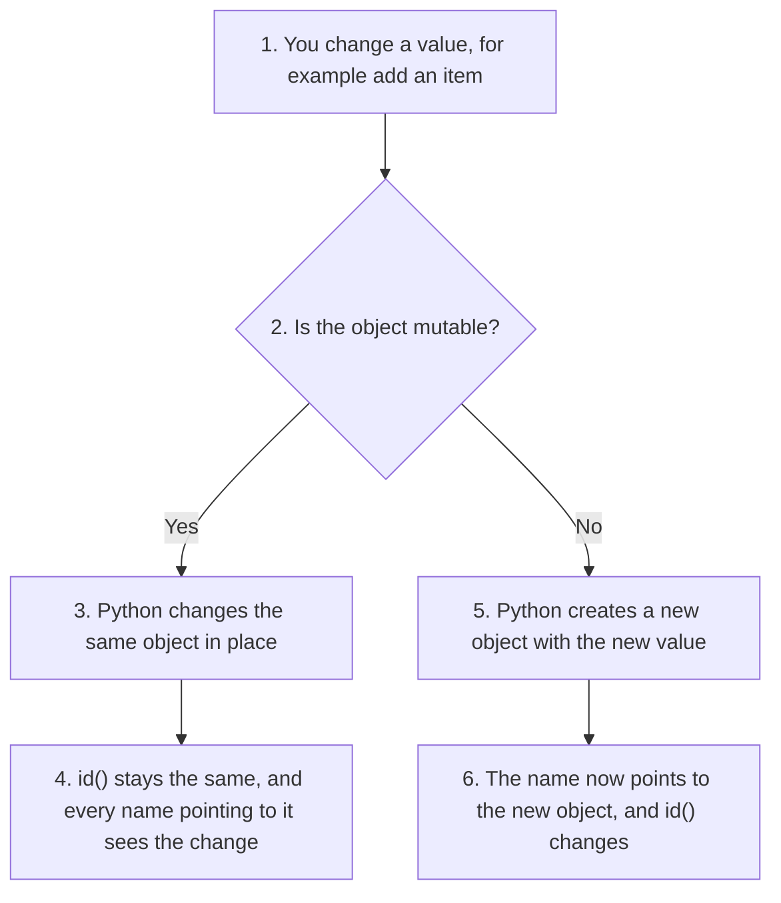
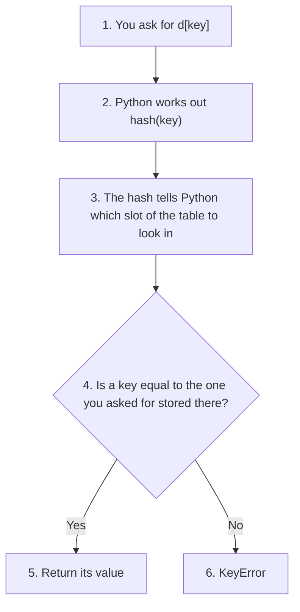
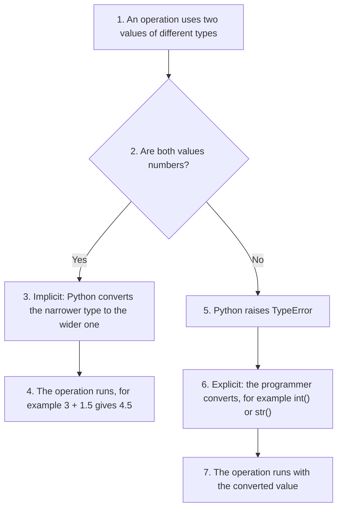
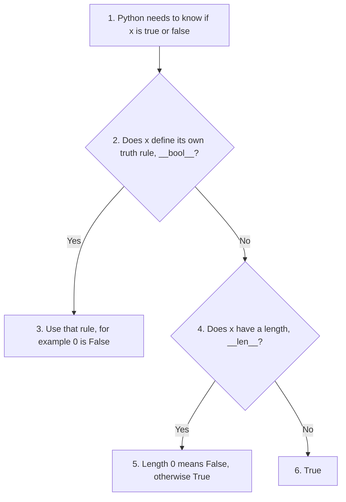
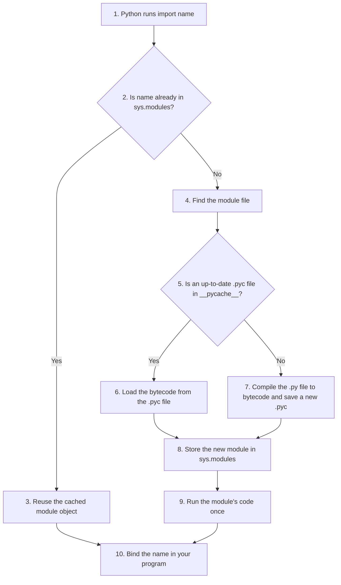

# More Conceptual Questions on Chapter 2: Python Basics II

This page brings together 40 conceptual questions on **Chapter 2: Python Data Types**. A conceptual question asks **why** Python works the way it does, not just **how** to write the code. If you understand the reasons, you will remember the rules longer and make fewer mistakes.

The questions cover the main ideas of the chapter:

* mutable and immutable objects,
* numbers: `int`, `float` and `complex`,
* `bool`, `None` and truth values,
* sequences: strings, lists and tuples,
* dictionaries and sets,
* user input and type conversion,
* modules, packages and imports,
* good habits for writing clear, "Pythonic" code.

Each answer starts with a short explanation. Most answers then show a small script with its output, so you can see the idea in action. Some also have a table, a flowchart or a follow-up question. Try to answer each question yourself before reading the answer. All scripts were run with Python 3.12.

Detailed notes on the number types are on the companion pages for [integers](001-ch2-python-data-types.md), [floats](002-ch2-float-data.md) and [complex numbers](003-ch2-complex-numbers-basics.md).

## Table of Contents

* [More Conceptual Questions on Chapter 2: Python Basics II](#more-conceptual-questions-on-chapter-2-python-basics-ii)
  * [Key Terms Used on This Page](#key-terms-used-on-this-page)
  * [Part 1: Mutability and Numbers](#part-1-mutability-and-numbers)
    * [1. Why are Python integers called immutable objects?](#1-why-are-python-integers-called-immutable-objects)
    * [2. What is the difference between mutable and immutable objects in Python?](#2-what-is-the-difference-between-mutable-and-immutable-objects-in-python)
    * [3. Why does the expression 5 / 2 return a float in Python?](#3-why-does-the-expression-5--2-return-a-float-in-python)
    * [4. What is mixed arithmetic in Python?](#4-what-is-mixed-arithmetic-in-python)
    * [5. Why are floating-point numbers not always exact in Python?](#5-why-are-floating-point-numbers-not-always-exact-in-python)
    * [6. Why is direct comparison of floating-point numbers often unsafe?](#6-why-is-direct-comparison-of-floating-point-numbers-often-unsafe)
  * [Part 2: Complex Numbers and Booleans](#part-2-complex-numbers-and-booleans)
    * [7. Why does Python use j instead of i for complex numbers?](#7-why-does-python-use-j-instead-of-i-for-complex-numbers)
    * [8. Why can complex numbers not be compared using < or >?](#8-why-can-complex-numbers-not-be-compared-using--or-)
    * [9. Why must Boolean values in Python be written as `True` and `False`?](#9-why-must-boolean-values-in-python-be-written-as-true-and-false)
  * [Part 3: Sequences: Strings, Lists and Tuples](#part-3-sequences-strings-lists-and-tuples)
    * [10. Why are strings considered sequences in Python?](#10-why-are-strings-considered-sequences-in-python)
    * [11. What is the significance of negative indexing in Python strings and lists?](#11-what-is-the-significance-of-negative-indexing-in-python-strings-and-lists)
    * [12. Why does slicing exclude the ending index in Python?](#12-why-does-slicing-exclude-the-ending-index-in-python)
    * [13. Why are lists more flexible than tuples in Python?](#13-why-are-lists-more-flexible-than-tuples-in-python)
    * [14. Why are tuples considered safer than lists in some situations?](#14-why-are-tuples-considered-safer-than-lists-in-some-situations)
    * [15. Why must a single-element tuple contain a trailing comma?](#15-why-must-a-single-element-tuple-contain-a-trailing-comma)
  * [Part 4: Dictionaries, Sets and None](#part-4-dictionaries-sets-and-none)
    * [16. Why are dictionaries called mappings?](#16-why-are-dictionaries-called-mappings)
    * [17. Why must dictionary keys be immutable?](#17-why-must-dictionary-keys-be-immutable)
    * [18. Why are sets unordered collections?](#18-why-are-sets-unordered-collections)
    * [19. Why are duplicate items automatically removed in a set?](#19-why-are-duplicate-items-automatically-removed-in-a-set)
    * [20. Why can lists not be stored inside sets?](#20-why-can-lists-not-be-stored-inside-sets)
    * [21. What is the conceptual importance of the value None in Python?](#21-what-is-the-conceptual-importance-of-the-value-none-in-python)
    * [22. Why is `is None` preferred over `== None`?](#22-why-is-is-none-preferred-over--none)
  * [Part 5: Input and Type Conversion](#part-5-input-and-type-conversion)
    * [23. Why does `input()` always return a string?](#23-why-does-input-always-return-a-string)
    * [24. Why does Python prefer explicit type casting instead of automatic guessing?](#24-why-does-python-prefer-explicit-type-casting-instead-of-automatic-guessing)
    * [25. What is the difference between implicit and explicit type conversion?](#25-what-is-the-difference-between-implicit-and-explicit-type-conversion)
    * [26. Why is converting a `float` to an integer called narrowing conversion?](#26-why-is-converting-a-float-to-an-integer-called-narrowing-conversion)
  * [Part 6: Truth Values](#part-6-truth-values)
    * [27. Why are empty containers considered False in Boolean contexts?](#27-why-are-empty-containers-considered-false-in-boolean-contexts)
    * [28. Why is `if my_list:` considered better than `if len(my_list) > 0:`?](#28-why-is-if-my_list-considered-better-than-if-lenmy_list--0)
  * [Part 7: Modules and Packages](#part-7-modules-and-packages)
    * [29. Why are modules important in Python programming?](#29-why-are-modules-important-in-python-programming)
    * [30. What is the difference between a module, package, and library in Python?](#30-what-is-the-difference-between-a-module-package-and-library-in-python)
    * [31. Why is the dot operator important when using modules?](#31-why-is-the-dot-operator-important-when-using-modules)
    * [32. Why does Python cache imported modules in `sys.modules`?](#32-why-does-python-cache-imported-modules-in-sysmodules)
    * [33. Why does Python compile modules into bytecode files?](#33-why-does-python-compile-modules-into-bytecode-files)
  * [Part 8: Good Practice and Program Design](#part-8-good-practice-and-program-design)
    * [34. Why is consistent naming convention important in Python?](#34-why-is-consistent-naming-convention-important-in-python)
    * [35. Why are strings immutable even though they support many operations?](#35-why-are-strings-immutable-even-though-they-support-many-operations)
    * [36. Why are Python lists often compared with arrays in C++?](#36-why-are-python-lists-often-compared-with-arrays-in-c)
    * [37. Why are aliases commonly used while importing modules?](#37-why-are-aliases-commonly-used-while-importing-modules)
    * [38. Why are truthy and falsy values considered an important Python feature?](#38-why-are-truthy-and-falsy-values-considered-an-important-python-feature)
    * [39. Why are immutable objects generally safer in concurrent or shared environments?](#39-why-are-immutable-objects-generally-safer-in-concurrent-or-shared-environments)
    * [40. Why is writing “Pythonic” code considered important in professional programming?](#40-why-is-writing-pythonic-code-considered-important-in-professional-programming)

## Key Terms Used on This Page

| Term | Simple meaning | Learn more |
| ---- | -------------- | ---------- |
| Object | Any piece of data Python keeps in memory. Every object has a type, a value and an identity. | [Objects, values and types](https://docs.python.org/3/reference/datamodel.html#objects-values-and-types) |
| Identity | A number that identifies one object while it exists. `id()` returns it. | [id()](https://docs.python.org/3/library/functions.html#id) |
| Mutable | Can be changed after it is created, for example a list. | [Glossary: mutable](https://docs.python.org/3/glossary.html#term-mutable) |
| Immutable | Cannot be changed after it is created, for example an int, a string or a tuple. | [Glossary: immutable](https://docs.python.org/3/glossary.html#term-immutable) |
| Hash, hashable | A hash is a number worked out from a value. A hashable object has a hash that never changes, so it can be a dictionary key or a set element. | [Glossary: hashable](https://docs.python.org/3/glossary.html#term-hashable) |
| Sequence | An ordered collection whose items can be reached by position (index), such as a string, list or tuple. | [Sequence types](https://docs.python.org/3/library/stdtypes.html#sequence-types-list-tuple-range) |
| Mapping | A collection that links keys to values, such as a dictionary. | [Mapping types](https://docs.python.org/3/library/stdtypes.html#mapping-types-dict) |
| Truthy and falsy | Values that count as true or false in a condition. | [Truth value testing](https://docs.python.org/3/library/stdtypes.html#truth-value-testing) |
| Type conversion (casting) | Turning a value of one type into another, such as `int("42")`. | [Built-in functions](https://docs.python.org/3/library/functions.html) |
| Singleton | A type that has only one object. `None` is the only object of type `NoneType`. | [The None object](https://docs.python.org/3/library/constants.html#None) |
| Module, package | A module is one `.py` file. A package is a folder of modules. | [Modules tutorial](https://docs.python.org/3/tutorial/modules.html) |
| Bytecode | The simple instructions that Python turns your code into before running it. | [Glossary: bytecode](https://docs.python.org/3/glossary.html#term-bytecode) |
| PEP 8 | The official style guide for Python code. | [PEP 8](https://peps.python.org/pep-0008/) |
| Pythonic | Written in the clear, simple style that experienced Python programmers prefer. | [Glossary: Pythonic](https://docs.python.org/3/glossary.html#term-Pythonic) |

[Back to the Table of Contents](#table-of-contents)

## Part 1: Mutability and Numbers

[Back to the Table of Contents](#table-of-contents)

### 1. Why are Python integers called immutable objects?

In Python, an integer object cannot be changed after it is created. If you assign a new value to an integer variable, Python makes the variable point to a different integer object instead of changing the old one. This can be checked with the `id()` function: the identity of the object changes after the new assignment. (In CPython, the standard Python, `id()` is the object's address in memory.) Immutability makes integers safer and easier to manage internally. It also lets Python optimise memory, for example by reusing one object for each small integer from -5 to 256.

What happens in `x = x + 1`:

1. Python reads the value of `x`.
2. It works out the new value and creates a **new** integer object for it.
3. It points the name `x` at the new object.
4. The old object is not changed. If nothing else uses it, Python frees its memory later.

```python
# Step 1: Create an integer and note its identity
x = 1000
print("x =", x)
old_id = id(x)

# Step 2: "Change" x by adding 1
x = x + 1
print("x =", x)

# Step 3: Compare identities - x now points to a different object
print("Same object as before?", id(x) == old_id)

# Step 4: Integers have no methods that change them in place
try:
    x.real = 5
except AttributeError as error:
    print("AttributeError:", error)
```

Output:

```text
x = 1000
x = 1001
Same object as before? False
AttributeError: attribute 'real' of 'int' objects is not writable
```

[Back to the Table of Contents](#table-of-contents)

### 2. What is the difference between mutable and immutable objects in Python?

Mutable objects can be changed after they are created, while immutable objects cannot. For example, a list is mutable because items can be added or removed, but a tuple or a string is immutable. A mutable object keeps the same identity when it is changed. With an immutable object, any operation that seems to change it actually creates a new object. Understanding mutability is important because it affects memory behaviour, how function arguments behave, and how safe a program is.

| Mutable (can change) | Immutable (cannot change) |
| -------------------- | ------------------------- |
| `list` | `int`, `float`, `complex`, `bool` |
| `dict` | `str` |
| `set` | `tuple`, `frozenset` |
| Most objects of classes you write yourself | `None` |

```python
# Step 1: A list is mutable - it changes in place and keeps its identity
fruits = ["apple", "banana"]
before = id(fruits)
fruits.append("cherry")
print(fruits, "| same object:", id(fruits) == before)

# Step 2: A string is immutable - "changing" it makes a new object
word = "hello"
before = id(word)
word = word + "!"
print(word, "| same object:", id(word) == before)

# Step 3: A tuple cannot be changed at all
point = (3, 4)
try:
    point[0] = 10
except TypeError as error:
    print("TypeError:", error)
```

Output:

```text
['apple', 'banana', 'cherry'] | same object: True
hello! | same object: False
TypeError: 'tuple' object does not support item assignment
```



[Back to the Table of Contents](#table-of-contents)

### 3. Why does the expression 5 / 2 return a float in Python?

In Python 3, the division operator `/` always performs floating-point division. Even when both operands are integers, the result is a floating-point number. Therefore, `5 / 2` returns `2.5` instead of `2`. This avoids accidentally losing the fractional part and gives the mathematically correct answer. If you want a whole-number answer, use floor division `//` instead.

```python
print(5 / 2, type(5 / 2))     # true division always gives a float
print(6 / 2, type(6 / 2))     # even when the answer is a whole number
print(5 // 2, type(5 // 2))   # floor division of two ints gives an int
```

Output:

```text
2.5 <class 'float'>
3.0 <class 'float'>
2 <class 'int'>
```

Note: in the old Python 2, `5 / 2` gave `2`. Python 3 changed this because it caused many hidden bugs.

[Back to the Table of Contents](#table-of-contents)

### 4. What is mixed arithmetic in Python?

Mixed arithmetic occurs when an arithmetic operation uses operands of different numeric types. Python automatically converts the narrower type into the wider type before doing the operation. For example, when an integer and a float are added, the integer is converted to a float. This process is called implicit type conversion or type promotion. It lets arithmetic work smoothly without explicit casting in many cases.

The order from narrower to wider is:

```
bool → int → float → complex
```

```python
# Step 1: int + float -> float
print(5 + 2.5, type(5 + 2.5))

# Step 2: bool + int -> int (True counts as 1)
print(True + 2, type(True + 2))

# Step 3: float + complex -> complex
print(1.5 + 2j, type(1.5 + 2j))

# Step 4: str + int is NOT mixed arithmetic - Python refuses
try:
    "5" + 2
except TypeError as error:
    print("TypeError:", error)
```

Output:

```text
7.5 <class 'float'>
3 <class 'int'>
(1.5+2j) <class 'complex'>
TypeError: can only concatenate str (not "int") to str
```

Mixed arithmetic works only between **number** types. A string and a number are not mixed automatically, as the last line shows. See question 24.

[Back to the Table of Contents](#table-of-contents)

### 5. Why are floating-point numbers not always exact in Python?

Floating-point numbers are stored inside the computer as binary (base-2) fractions. Many decimal numbers, such as `0.1` and `0.2`, cannot be written exactly in binary, just as 1/3 cannot be written exactly in decimal (0.3333...). So Python stores the nearest binary value it can, and small rounding errors can appear in calculations. This is why `0.1 + 0.2` gives `0.30000000000000004`. The same thing happens in almost every programming language that uses binary floating-point numbers.

```python
from decimal import Decimal

# Step 1: The famous example
print(0.1 + 0.2)

# Step 2: The exact value Python really stores for 0.1
print(Decimal(0.1))
```

Output:

```text
0.30000000000000004
0.1000000000000000055511151231257827021181583404541015625
```

The second line shows the exact value stored for `0.1`. It is very slightly more than 0.1. For a full explanation, see [why 0.1 cannot be stored exactly](002-ch2-float-data.md#51-why-01-cannot-be-stored-exactly) on the floats page.

[Back to the Table of Contents](#table-of-contents)

### 6. Why is direct comparison of floating-point numbers often unsafe?

Floating-point calculations may contain tiny rounding errors because of the binary representation. So two values that are mathematically equal may not be exactly equal inside the computer. For example, `0.1 + 0.2 == 0.3` evaluates to `False`. A safer approach is to use `math.isclose()`, which checks whether two numbers are approximately equal within a small tolerance.

```python
import math

# Step 1: Direct comparison fails
print(0.1 + 0.2 == 0.3)

# Step 2: The difference is tiny but not zero
print(abs((0.1 + 0.2) - 0.3))

# Step 3: Compare with a tolerance instead
print(math.isclose(0.1 + 0.2, 0.3))
```

Output:

```text
False
5.551115123125783e-17
True
```

Follow-up: `math.isclose()` compares the difference with the size of the numbers. Near zero, add an absolute tolerance, for example `math.isclose(x, 0.0, abs_tol=1e-9)`.

[Back to the Table of Contents](#table-of-contents)

## Part 2: Complex Numbers and Booleans

[Back to the Table of Contents](#table-of-contents)

### 7. Why does Python use j instead of i for complex numbers?

Python follows the engineering custom, where the imaginary unit (√-1) is written as `j`. In electrical engineering, the letter `i` is used for electric current, so `j` is used instead. Therefore, a complex number in Python is written as something like `3 + 4j`. Python supports arithmetic on complex numbers directly, without needing any external library.

```python
# Step 1: A complex number with j
z = 3 + 4j
print(z, type(z))

# Step 2: Arithmetic works directly, with no import
print(z * (1 - 2j))

# Step 3: j on its own is just a name, not the imaginary unit
try:
    print(3 + 4 * j)
except NameError as error:
    print("NameError:", error)
```

Output:

```text
(3+4j) <class 'complex'>
(11-2j)
NameError: name 'j' is not defined
```

Note that `j` must come straight after a number. On its own, `j` is just a variable name. Write `1j` for the imaginary unit itself.

[Back to the Table of Contents](#table-of-contents)

### 8. Why can complex numbers not be compared using < or >?

Complex numbers do not have a natural order like real numbers. Real numbers lie on a line, so one is always to the left or right of another. Complex numbers are points on a plane, and there is no sensible way to say which point is "greater". Therefore, Python raises a `TypeError` if you try a comparison like `3+4j > 2+1j`. However, complex numbers can still be tested for equality using `==`.

```python
a = 3 + 4j
b = 2 + 1j

# Step 1: Ordering comparisons are not allowed
try:
    print(a > b)
except TypeError as error:
    print("TypeError:", error)

# Step 2: Equality is allowed
print(a == b, a == 3 + 4j)

# Step 3: To compare sizes, compare magnitudes (distance from 0)
print(abs(a), abs(b), abs(a) > abs(b))
```

Output:

```text
TypeError: '>' not supported between instances of 'complex' and 'complex'
False True
5.0 2.23606797749979 True
```

If you need to know which number is "bigger", decide what you mean. Usually it is the distance from 0, which `abs()` gives.

[Back to the Table of Contents](#table-of-contents)

### 9. Why must Boolean values in Python be written as `True` and `False`?

Python is case-sensitive, which means it treats uppercase and lowercase letters as different. `True` and `False` are the only two Boolean values, and they are keywords of the language. `true` and `false` are just ordinary names. Unless you define them yourself, using them gives a `NameError`. `True` and `False` belong to the built-in type `bool`. They are used everywhere in conditions, loops and logical expressions.

```python
# Step 1: True and False are values of type bool
print(True, type(True))

# Step 2: true (lower case) is just an undefined name
try:
    print(true)
except NameError as error:
    print("NameError:", error)

# Step 3: A bool is used in conditions
age = 20
print(age >= 18)
```

Output:

```text
True <class 'bool'>
NameError: name 'true' is not defined
True
```

[Back to the Table of Contents](#table-of-contents)

## Part 3: Sequences: Strings, Lists and Tuples

[Back to the Table of Contents](#table-of-contents)

### 10. Why are strings considered sequences in Python?

A string is a sequence because it stores characters in a fixed order. Every character has an index (position) starting from `0`. Since strings are sequences, they support indexing, slicing, iteration (going through the items one by one) and `len()`. This lets programmers work with text easily. Strings also support concatenation (joining with `+`) and repetition (with `*`).

| Index | 0 | 1 | 2 | 3 | 4 | 5 |
| ----- | - | - | - | - | - | - |
| Character in `"Python"` | P | y | t | h | o | n |
| Negative index | -6 | -5 | -4 | -3 | -2 | -1 |

```python
s = "Python"

# Step 1: Indexing - each character has a position
print(s[0], s[5])

# Step 2: Length
print(len(s))

# Step 3: Slicing
print(s[0:3])

# Step 4: Iteration - visiting each character in order
for ch in s:
    print(ch, end=" ")
print()

# Step 5: Concatenation and repetition
print(s + "3", "ab" * 3)
```

Output:

```text
P n
6
Pyt
P y t h o n 
Python3 ababab
```

[Back to the Table of Contents](#table-of-contents)

### 11. What is the significance of negative indexing in Python strings and lists?

Negative indexing lets you reach items from the end of a sequence. Index `-1` refers to the last item, and `-2` refers to the second last. This makes many operations easier and more readable. Instead of working out the last position with `len(s) - 1`, you can simply write `s[-1]`.

```python
s = "Python"
nums = [10, 20, 30, 40]

# Step 1: Negative indexes count from the end
print(s[-1], s[-2])
print(nums[-1], nums[-2])

# Step 2: The long way gives the same answer
print(s[len(s) - 1])
```

Output:

```text
n o
40 30
n
```

A simple rule: a negative index `-k` means the same as `len(s) - k`.

[Back to the Table of Contents](#table-of-contents)

### 12. Why does slicing exclude the ending index in Python?

In Python slicing, the starting index is included and the ending index is excluded. This makes the length of a slice easy to calculate: it is `end - start` (for a normal slice with step 1 that stays inside the sequence). It also makes slices easy to join without overlaps: `s[:k] + s[k:]` always gives back the whole of `s`. The same rule applies to strings, lists, tuples and `range()`.

```python
s = "Python"

# Step 1: The slice s[2:5] takes positions 2, 3 and 4
print(s[2:5], len(s[2:5]))      # 5 - 2 = 3 characters

# Step 2: Two slices that meet at the same index join with no overlap
print(s[:3] + s[3:])
print(s[:3] + s[3:] == s)
```

Output:

```text
tho 3
Python
True
```

Think of the indexes as marking the gaps **between** characters. `s[2:5]` cuts at gap 2 and gap 5, and keeps what lies between them.

[Back to the Table of Contents](#table-of-contents)

### 13. Why are lists more flexible than tuples in Python?

Lists are mutable, which means items can be added, removed or changed after the list is created. Tuples are immutable and cannot be changed once created. Because they can change, lists suit collections of data that grow or shrink while the program runs. Tuples are safer for fixed collections that should not change by accident. Lists also have many methods that change them, such as `append()`, `remove()` and `extend()`.

```python
# Step 1: Lists can grow, shrink and change
items = [1, 2, 3]
items.append(4)
items.remove(2)
items.extend([5, 6])
items[0] = 100
print(items)

# Step 2: Tuples cannot
t = (1, 2, 3)
try:
    t.append(4)
except AttributeError as error:
    print("AttributeError:", error)
```

Output:

```text
[100, 3, 4, 5, 6]
AttributeError: 'tuple' object has no attribute 'append'
```

| Feature | List | Tuple |
| ------- | ---- | ----- |
| Written as | `[1, 2, 3]` | `(1, 2, 3)` |
| Can be changed | Yes | No |
| Methods that change it | `append()`, `remove()`, `extend()`, `sort()` and more | None |
| Can be a dictionary key | No | Yes, if all its items are hashable |
| Typical use | A collection that changes | A fixed record, such as a date or a point |

[Back to the Table of Contents](#table-of-contents)

### 14. Why are tuples considered safer than lists in some situations?

Tuples cannot be changed after they are created, which prevents accidental changes to important data. Because they are immutable, tuples are also hashable, as long as every item inside them is hashable. This lets tuples be used as dictionary keys or set elements. Their immutability also makes programs easier to reason about, because the data in a tuple stays the same throughout the program.

```python
# Step 1: A tuple of immutable values can be a dictionary key
distances = {("Delhi", "Ranchi"): 1200}
print(distances[("Delhi", "Ranchi")])

# Step 2: A list cannot
try:
    bad = {["Delhi", "Ranchi"]: 1200}
except TypeError as error:
    print("TypeError:", error)

# Step 3: A tuple that contains a list is not hashable either
try:
    hash((1, [2, 3]))
except TypeError as error:
    print("TypeError:", error)
```

Output:

```text
1200
TypeError: unhashable type: 'list'
TypeError: unhashable type: 'list'
```

The last example shows the condition in the answer: a tuple that holds a list is still a tuple, but it is not hashable, because the list inside it could change.

[Back to the Table of Contents](#table-of-contents)

### 15. Why must a single-element tuple contain a trailing comma?

Brackets alone do not create a tuple in Python. It is the **comma** that makes a tuple. Therefore, `('apple')` is just the string `'apple'` inside brackets, while `('apple',)` (with a trailing comma) is a tuple. Brackets are also used for grouping in expressions such as `(2 + 3) * 4`, so without the comma Python could not tell the two uses apart.

```python
print(type(('apple')))     # just a string in brackets
print(type(('apple',)))    # a tuple with one item
print(type('apple',))      # the comma here separates function arguments
t = 'apple',               # the comma alone makes a tuple
print(t, type(t))
print(type(()))            # the empty tuple is the one exception
```

Output:

```text
<class 'str'>
<class 'tuple'>
<class 'str'>
('apple',) <class 'tuple'>
<class 'tuple'>
```

The empty tuple `()` is the one case where brackets alone make a tuple.

[Back to the Table of Contents](#table-of-contents)

## Part 4: Dictionaries, Sets and None

[Back to the Table of Contents](#table-of-contents)

### 16. Why are dictionaries called mappings?

A dictionary maps (links) keys to values. Each key works like a label used to find its value quickly. This is like a mathematical function, where each input maps to one output. Dictionaries are very fast because they use hashing internally to find keys. They are widely used for storing structured, labelled data.

```python
# Step 1: Each key maps to a value
capitals = {"India": "New Delhi", "Japan": "Tokyo"}

# Step 2: Look up a value by its key
print(capitals["Japan"])

# Step 3: get() returns a default when the key is missing
print(capitals.get("France", "not known"))

# Step 4: Add a new mapping
capitals["France"] = "Paris"
print(capitals)
```

Output:

```text
Tokyo
not known
{'India': 'New Delhi', 'Japan': 'Tokyo', 'France': 'Paris'}
```

[Back to the Table of Contents](#table-of-contents)

### 17. Why must dictionary keys be immutable?

Dictionary keys are stored using hash values worked out from the key objects. If a key could change, its contents and its hash could change after it was stored, and the dictionary would look for it in the wrong place. Immutable objects such as strings, integers and tuples of immutable items have hash values that never change. Therefore, Python allows only **hashable** objects as dictionary keys. In practice these are mostly immutable objects.

How a lookup such as `d["a"]` works:



If the key could change after being stored, its hash at step 2 would no longer point to the slot where it was stored, and the lookup would fail.

```python
# Step 1: Strings, numbers and tuples work as keys
d = {"a": 1, 2: "two", (3, 4): "pair"}
print(d)

# Step 2: A list does not - it is unhashable
try:
    d[[5, 6]] = "list"
except TypeError as error:
    print("TypeError:", error)

# Step 3: An object of your own class is allowed, because by default it is
# hashed by identity, not by its contents
class Box:
    pass

b = Box()
d[b] = "box"
print(d[b])
```

Output:

```text
{'a': 1, 2: 'two', (3, 4): 'pair'}
TypeError: unhashable type: 'list'
box
```

Follow-up: the precise rule is "keys must be hashable", not "keys must be immutable". The two usually go together, but Step 3 shows an exception. An object of a class you write yourself is mutable, yet it can be a key, because by default Python hashes it by its identity, which never changes.

[Back to the Table of Contents](#table-of-contents)

### 18. Why are sets unordered collections?

Sets are designed for fast membership testing and for keeping items unique, not for keeping them in order. Internally, a set uses hashing to decide where to store each item, instead of storing items one after another. Because of this, the items have no fixed positions. Therefore, sets do not support indexing or slicing.

```python
colours = {"red", "green", "blue"}

# Step 1: Fast membership test
print("red" in colours)

# Step 2: No indexing
try:
    print(colours[0])
except TypeError as error:
    print("TypeError:", error)
```

Output:

```text
True
TypeError: 'set' object is not subscriptable
```

The order in which a set prints may differ from the order in which you added the items, and may differ between runs for strings. Never rely on it.

[Back to the Table of Contents](#table-of-contents)

### 19. Why are duplicate items automatically removed in a set?

A set represents a mathematical collection of unique elements. When a duplicate value is added, Python keeps only one copy. This is useful for removing repeated data and for operations such as union and intersection. Sets are commonly used for membership testing and removing duplicates.

```python
# Step 1: Duplicates disappear
marks = [70, 85, 70, 90, 85]
unique = set(marks)
print(unique, len(unique))

# Step 2: Set operations
a = {1, 2, 3}
b = {2, 3, 4}
print(a | b)     # union: in either set
print(a & b)     # intersection: in both sets
```

Output:

```text
{90, 85, 70} 3
{1, 2, 3, 4}
{2, 3}
```

Python checks for a duplicate by working out the new item's hash and then testing it with `==` against what is already stored. If an equal item is found, the new one is not added.

[Back to the Table of Contents](#table-of-contents)

### 20. Why can lists not be stored inside sets?

Lists are mutable objects and therefore unhashable. Since sets use hashing internally, every element of a set must have a hash value that never changes. If mutable objects like lists were allowed, their contents could change after being added, which would break the set's internal structure. Hence Python raises a `TypeError` if you try.

```python
# Step 1: A list inside a set fails
try:
    s = {[1, 2], [3, 4]}
except TypeError as error:
    print("TypeError:", error)

# Step 2: Use tuples instead - they are immutable and hashable
s = {(1, 2), (3, 4)}
print(s)

# Step 3: A frozenset is an immutable set, so it can go inside a set
groups = {frozenset({1, 2}), frozenset({3})}
print(len(groups))
```

Output:

```text
TypeError: unhashable type: 'list'
{(1, 2), (3, 4)}
2
```

If you need a set of groups, use tuples, or `frozenset` (an immutable version of a set), as shown in Steps 2 and 3.

[Back to the Table of Contents](#table-of-contents)

### 21. What is the conceptual importance of the value None in Python?

`None` represents the absence of a meaningful value. It is not the same as `0`, an empty string or `False`. Python uses `None` for placeholder variables, for optional parameters that were not given, and as the result of functions that do not return a value. It has its own type, called `NoneType`, and it is the only object of that type.

```python
# Step 1: None has its own type
print(None, type(None))

# Step 2: A function with no return statement returns None
def greet():
    print("Hello")

result = greet()
print(result)

# Step 3: None is not 0, not "" and not False
print(None == 0, None == "", None == False)

# Step 4: But it counts as false in a condition
print(bool(None))
```

Output:

```text
None <class 'NoneType'>
Hello
None
False False False
False
```

Note the difference in the last two lines: `None` is not **equal** to `False`, but it **counts as** false in a condition.

[Back to the Table of Contents](#table-of-contents)

### 22. Why is `is None` preferred over `== None`?

The operator `is` checks object identity (whether two names point to the very same object), not whether two values are equal. Since `None` is a singleton, there is only one `None` object in a program, so the identity test is the most accurate and Pythonic check. Using `==` may call a comparison method written for a custom class, which can give misleading results. Therefore, the standard practice is to use `is None` and `is not None`. The PEP 8 style guide also recommends this.

```python
# Step 1: A class whose == always says True
class Strange:
    def __eq__(self, other):
        return True

x = Strange()

# Step 2: == is fooled, but is is not
print(x == None)     # True - misleading
print(x is None)     # False - correct

# Step 3: The normal pattern
value = None
if value is None:
    print("No value yet")
```

Output:

```text
True
False
No value yet
```

[Back to the Table of Contents](#table-of-contents)

## Part 5: Input and Type Conversion

[Back to the Table of Contents](#table-of-contents)

### 23. Why does `input()` always return a string?

The `input()` function reads the raw text that the user types on the keyboard. Everything typed on a keyboard arrives as characters, so Python returns the result as a string. Python cannot know whether `25` is meant as a number, an age, or part of a name. If numeric data is needed, the programmer must convert it with a function such as `int()` or `float()`. This avoids wrong guesses about what the user meant.

```python
# In a real program this would be: age_text = input("Enter your age: ")
# Here we pretend the user typed 25, so the script can run on its own.
age_text = "25"

# Step 1: input() gives a string
print(type(age_text))

# Step 2: String "arithmetic" joins text instead of adding
print(age_text + "5")

# Step 3: Convert first, then do arithmetic
age = int(age_text)
print(age + 5)
```

Output:

```text
<class 'str'>
255
30
```

A complete interactive version looks like this:

```python
age_text = input("Enter your age: ")   # the user types 25
age = int(age_text)                    # convert the text to a number
print("In five years you will be", age + 5)
```

A sample run:

```text
Enter your age: 25
In five years you will be 30
```

If the user types something that is not a whole number, such as `twenty`, `int()` raises a `ValueError`. Handling that safely is covered in the chapter on exceptions.

[Back to the Table of Contents](#table-of-contents)

### 24. Why does Python prefer explicit type casting instead of automatic guessing?

Python follows the principle **"Explicit is better than implicit."** This is one line of the *Zen of Python*, a short list of design ideas that you can read by typing `import this` in Python. Automatic guessing can lead to hidden bugs and confusing behaviour. For example, should `"5" + 5` give `"55"` or `10`? Therefore, Python refuses to combine incompatible types such as strings and integers. The programmer must state the conversion clearly with functions such as `int()` or `str()`. This makes code easier to read and more reliable.

```python
# Step 1: Python refuses to guess
try:
    print("5" + 5)
except TypeError as error:
    print("TypeError:", error)

# Step 2: You state what you mean
print("5" + str(5))    # joining text: 55
print(int("5") + 5)    # adding numbers: 10
```

Output:

```text
TypeError: can only concatenate str (not "int") to str
55
10
```

[Back to the Table of Contents](#table-of-contents)

### 25. What is the difference between implicit and explicit type conversion?

Implicit type conversion is done automatically by Python when it is safe and logical. For example, when an integer and a float are added, Python converts the integer into a float. Explicit conversion is done by the programmer on purpose, using casting functions such as `int()`, `float()` and `str()`. Explicit conversion is needed when Python cannot safely guess what you want.

| | Implicit conversion | Explicit conversion |
| - | ------------------- | ------------------- |
| Who does it | Python, automatically | The programmer |
| When | Mixing number types, such as `int` and `float` | Whenever you choose, for example text to number |
| Example | `3 + 1.5` gives `4.5` | `int("42")` gives `42` |
| Can lose information? | No, it only goes to a wider type | Yes, for example `int(7.9)` gives `7` |

```python
# Step 1: Implicit - Python converts 3 to 3.0 on its own
print(3 + 1.5)

# Step 2: Explicit - the programmer converts on purpose
print(int("42") + 1)
print(float("2.5") * 2)
print(str(99) + " marks")
```

Output:

```text
4.5
43
5.0
99 marks
```



[Back to the Table of Contents](#table-of-contents)

### 26. Why is converting a `float` to an integer called narrowing conversion?

Converting a float to an integer removes the fractional part of the number. An `int` cannot hold a fractional part, so the conversion goes from a "wider" type to a "narrower" one, and some information is lost. That is why it is called a narrowing conversion. For example, `int(7.9)` gives `7`. The decimal part is cut off (truncated), not rounded. For negative numbers, cutting off moves toward zero, so `int(-7.9)` gives `-7`.

```python
import math

print(int(7.9))          # 7   decimal part cut off
print(int(-7.9))         # -7  cut off toward zero, not rounded down
print(round(7.9))        # 8   round() rounds to the nearest whole number
print(math.floor(-7.9))  # -8  floor() always rounds down
```

Output:

```text
7
-7
8
-8
```

| Function | 7.9 | -7.9 | What it does |
| -------- | --- | ---- | ------------ |
| `int()` | 7 | -7 | Cuts off the decimal part (toward zero) |
| `round()` | 8 | -8 | Nearest whole number |
| `math.floor()` | 7 | -8 | Always down |
| `math.ceil()` | 8 | -7 | Always up |

[Back to the Table of Contents](#table-of-contents)

## Part 6: Truth Values

[Back to the Table of Contents](#table-of-contents)

### 27. Why are empty containers considered False in Boolean contexts?

In a condition, such as after `if` or `while`, Python treats every object as either true or false. Empty containers such as empty lists, strings, dictionaries and sets are treated as `False`. Non-empty ones are treated as `True`. The same goes for numbers: zero is false and any other number is true. This allows short, readable conditions such as `if my_list:`, without comparing the length yourself.

```python
# Step 1: Empty containers are false; non-empty ones are true
for value in [[], [0], "", "0", {}, {"a": 1}, set(), 0, 0.0, None]:
    print(repr(value), "->", bool(value))
```

Output:

```text
[] -> False
[0] -> True
'' -> False
'0' -> True
{} -> False
{'a': 1} -> True
set() -> False
0 -> False
0.0 -> False
None -> False
```

Notice that `[0]` and `"0"` are **true**. They are not empty: one holds a zero and the other holds the character "0".



[Back to the Table of Contents](#table-of-contents)

### 28. Why is `if my_list:` considered better than `if len(my_list) > 0:`?

The shorter form is more readable and follows the Pythonic style. Python already knows how to treat a container as true or false, so checking the length yourself is unnecessary in most cases. Using the truth value directly also reduces clutter and makes the code clearer. PEP 8 recommends this style.

```python
tasks = []

# Step 1: The Pythonic way
if tasks:
    print("You have tasks")
else:
    print("No tasks")

# Step 2: The longer way gives the same result
if len(tasks) > 0:
    print("You have tasks")
else:
    print("No tasks")

# Step 3: A caution - None and [] are both false
tasks = None
if not tasks:
    print("Empty or missing")
if tasks is None:
    print("Missing, not just empty")
```

Output:

```text
No tasks
No tasks
Empty or missing
Missing, not just empty
```

Follow-up: `if my_list:` is false for **both** an empty list and `None`. When you need to tell "missing" from "empty", test `is None` first, as in Step 3.

[Back to the Table of Contents](#table-of-contents)

## Part 7: Modules and Packages

[Back to the Table of Contents](#table-of-contents)

### 29. Why are modules important in Python programming?

Modules split large programs into smaller files that are easier to manage. This makes code easier to read, test, debug and reuse. Modules also prevent duplication, because commonly used functions can be written once and imported into many programs. Modular programming is essential for building large software that is easy to maintain.

Example: a small module and a program that uses it. Save both files in the same folder.

File `greetings.py`:

```python
"""greetings.py - a small module with two reusable functions."""

def hello(name):
    return f"Hello, {name}!"

def goodbye(name):
    return f"Goodbye, {name}. See you soon."
```

File `main.py`:

```python
# Step 1: Import our own module (greetings.py must be in the same folder)
import greetings

# Step 2: Use its functions with the dot operator
print(greetings.hello("Asha"))
print(greetings.goodbye("Asha"))
```

Output of `python main.py`:

```text
Hello, Asha!
Goodbye, Asha. See you soon.
```

[Back to the Table of Contents](#table-of-contents)

### 30. What is the difference between a module, package, and library in Python?

A module is a single Python file with the extension `.py`. A package is a folder that contains related modules, and usually an `__init__.py` file that marks it as a package. A library is a broader term for a collection of packages and modules designed for a particular purpose. Libraries such as NumPy and pandas contain many packages and modules inside them.

| Term | What it is | Example |
| ---- | ---------- | ------- |
| Module | One `.py` file | `greetings.py`, `math`, `random` |
| Package | A folder of modules, usually with `__init__.py` | `email`, `json`, `urllib` |
| Library | A collection of packages and modules for one purpose (an informal term) | NumPy, pandas, Matplotlib |

```python
import math
import email

# Step 1: math is a single module (built into Python)
print(type(math))

# Step 2: email is a package - it has a __path__ (a folder of modules)
print(hasattr(math, "__path__"), hasattr(email, "__path__"))

# Step 3: Modules inside a package are reached with a dot
import email.message
print(email.message.__name__)
```

Output:

```text
<class 'module'>
False True
email.message
```

A package has a `__path__` attribute that lists the folder of its modules. A plain module does not.

[Back to the Table of Contents](#table-of-contents)

### 31. Why is the dot operator important when using modules?

The dot operator lets you reach the functions, classes and values stored inside a module. It tells Python to "go inside" the module and fetch a particular item. For example, `math.sqrt()` reaches the `sqrt` function inside the `math` module. Without the dot, Python would not know where to find the name.

```python
import math

print(math.sqrt(16))    # a function inside the math module
print(math.pi)          # a value inside the math module

# Without the module name, Python does not know where sqrt lives
try:
    print(sqrt(16))
except NameError as error:
    print("NameError:", error)
```

Output:

```text
4.0
3.141592653589793
NameError: name 'sqrt' is not defined
```

The dot also keeps names apart: `math.sqrt` and `cmath.sqrt` are two different functions, and the module name tells Python which one you mean.

[Back to the Table of Contents](#table-of-contents)

### 32. Why does Python cache imported modules in `sys.modules`?

Caching stops the same module from being loaded again and again while the program runs. The first time a module is imported, Python stores it in the dictionary `sys.modules`. Later imports reuse the stored module object instead of reading the file again. This saves time, keeps one shared copy of the module, and helps with circular imports (two modules that import each other).

```python
import sys

# Step 1: Import a module that has not been used yet
print("statistics" in sys.modules)
import statistics
print("statistics" in sys.modules)

# Step 2: A second import gives back the same cached object
first = sys.modules["statistics"]
import statistics
print(statistics is first)
```

Output:

```text
False
True
True
```



Python stores the module in `sys.modules` (step 8) just before running its code (step 9). So if two modules import each other, the second import finds the half-built module in the cache instead of starting an endless loop.

If you edit a module while a program is running, a new `import` will not pick up the change, because of the cache. `importlib.reload()` forces a fresh load.

[Back to the Table of Contents](#table-of-contents)

### 33. Why does Python compile modules into bytecode files?

Python first turns source code into **bytecode**, a list of simple instructions that the Python Virtual Machine (the part of Python that runs programs) can carry out efficiently. For imported modules, the bytecode is saved in `.pyc` files inside a `__pycache__` folder. Using these files speeds up later imports, because Python does not need to compile an unchanged module again. Note that it makes **loading** faster, not running: the bytecode runs at the same speed either way.

```python
import importlib.util
import dis

# Step 1: Where Python would store the bytecode for a module called greetings.py
print(importlib.util.cache_from_source("greetings.py"))

# Step 2: A peek at bytecode - the simple instructions Python really runs
def add(a, b):
    return a + b

dis.dis(add)
```

Output:

```text
__pycache__/greetings.cpython-312.pyc
  8           0 RESUME                   0

  9           2 LOAD_FAST                0 (a)
              4 LOAD_FAST                1 (b)
              6 BINARY_OP                0 (+)
             10 RETURN_VALUE
```

1. The first line shows where the bytecode for `greetings.py` would be saved. The name includes the Python version (`cpython-312`), so different versions can keep their own files side by side.
2. The rest is the bytecode for the small `add()` function, shown with the `dis` (disassembler) module. Each line is one simple instruction, such as "load `a`", "load `b`", "add". The exact instructions change between Python versions.

When the program in question 29 was run, Python created a `__pycache__` folder next to `greetings.py`. The file `main.py` itself is not cached, because it was run directly rather than imported.

[Back to the Table of Contents](#table-of-contents)

## Part 8: Good Practice and Program Design

[Back to the Table of Contents](#table-of-contents)

### 34. Why is consistent naming convention important in Python?

Consistent naming makes code easier to read and maintain. Python programmers widely follow the [PEP 8](https://peps.python.org/pep-0008/#naming-conventions) conventions, such as `snake_case` for variables and functions and `PascalCase` for classes. Good names make programs easier to understand, especially when many people work on the same code. They also avoid confusion and improve code quality.

| Kind of name | Convention | Example |
| ------------ | ---------- | ------- |
| Variable | `snake_case` (lower case, words joined by `_`) | `total_marks` |
| Function | `snake_case` | `calculate_average()` |
| Class | `PascalCase` (each word starts with a capital) | `StudentRecord` |
| Constant | `UPPER_CASE` | `MAX_SPEED` |
| Module | Short, lower case | `greetings.py` |
| "Internal" name | Starts with `_` | `_helper()` |

[Back to the Table of Contents](#table-of-contents)

### 35. Why are strings immutable even though they support many operations?

String operations and methods never change the original string. Instead, they create and return a new string. Immutability allows strings to be hashable, so they can be dictionary keys, and lets them be shared safely between different parts of a program. It also lets Python optimise memory, for example by reusing one object for identical short strings, and it makes programs more secure, since a string that was checked cannot be changed afterwards.

```python
s = "python"

# Step 1: A method returns a NEW string
t = s.upper()
print(s, t)

# Step 2: You cannot change a character in place
try:
    s[0] = "P"
except TypeError as error:
    print("TypeError:", error)

# Step 3: Build a new string instead
s = "P" + s[1:]
print(s)
```

Output:

```text
python PYTHON
TypeError: 'str' object does not support item assignment
Python
```

[Back to the Table of Contents](#table-of-contents)

### 36. Why are Python lists often compared with arrays in C++?

Both lists and arrays store collections of items in order, and both support indexing and iteration. However, Python lists are more flexible. They can store items of different types, while a C++ array stores items of only one type. Python lists also grow and shrink automatically. A plain C++ array has a fixed size (C++ offers `std::vector` for a growable array).

```python
# Step 1: A list can hold values of different types
mixed = [42, "hello", 3.14, [1, 2]]
print(mixed)

# Step 2: It grows as needed
mixed.append(True)
print(len(mixed))
```

Output:

```text
[42, 'hello', 3.14, [1, 2]]
5
```

| Feature | C++ array | C++ `std::vector` | Python list |
| ------- | --------- | ----------------- | ----------- |
| Keeps items in order | Yes | Yes | Yes |
| Indexing with `[ ]` | Yes | Yes | Yes, including negative indexes |
| Size can change | No | Yes | Yes |
| Items of different types | No | No | Yes |
| What is stored | The values themselves | The values themselves | References (pointers) to objects |

The last row explains the flexibility: a Python list stores references to objects, and a reference can point to an object of any type.

[Back to the Table of Contents](#table-of-contents)

### 37. Why are aliases commonly used while importing modules?

Aliases give shorter, more convenient names to modules that are used often. For example, programmers commonly write `import numpy as np`. This saves typing and makes mathematical or scientific code easier to read. Aliases are especially useful when module names are long. Some aliases, such as `np` for NumPy and `pd` for pandas, are so common that every Python programmer recognises them.

```python
import numpy as np
import datetime as dt

print(np.sqrt(49))
print(dt.date(2026, 1, 26).strftime("%d %B %Y"))
```

Output:

```text
7.0
26 January 2026
```

This script needs NumPy (`pip install numpy`).

[Back to the Table of Contents](#table-of-contents)

### 38. Why are truthy and falsy values considered an important Python feature?

Truthy and falsy values make Python code short and expressive. Instead of writing long comparisons, programmers can use objects directly in conditions. For example, a non-empty string automatically behaves as `True`. This makes many common tasks simpler and adds to Python's clean style.

```python
# Step 1: Use a value directly in a condition
name = ""
if not name:
    print("Please enter your name")

# Step 2: A handy pattern: use a default when a value is empty
display_name = name or "Guest"
print(display_name)
```

Output:

```text
Please enter your name
Guest
```

The `or` in Step 2 returns the first truthy value, so an empty name is replaced by `"Guest"`. See question 27 for the full list of falsy values.

[Back to the Table of Contents](#table-of-contents)

### 39. Why are immutable objects generally safer in concurrent or shared environments?

Immutable objects cannot be changed after they are created, so different parts of a program can share them without fear of accidental changes. This reduces bugs in programs that do several things at once (multi-threaded or parallel programs). Since immutable data stays constant, it is also easier to reason about how the program behaves. Many modern programming styles encourage immutability for this reason.

```python
# Step 1: A shared list can be changed by anyone who holds it
settings = ["dark mode"]
backup = settings            # both names point to the SAME list
backup.append("large font")
print(settings)              # the original changed too

# Step 2: A shared tuple cannot be changed, so it is always safe
settings = ("dark mode",)
backup = settings
backup = backup + ("large font",)   # makes a NEW tuple
print(settings, backup)
```

Output:

```text
['dark mode', 'large font']
('dark mode',) ('dark mode', 'large font')
```

In Step 1, changing `backup` also changed `settings`, because both names point to the same list. With a tuple this surprise cannot happen.

[Back to the Table of Contents](#table-of-contents)

### 40. Why is writing “Pythonic” code considered important in professional programming?

Pythonic code follows the design ideas and conventions of the Python community. Such code is usually cleaner, shorter and easier to read and maintain. Following Pythonic practices helps teams work together, because programmers can quickly understand each other's code. It also cuts out unnecessary complexity and encourages elegant solutions.

```python
names = ["Asha", "Ravi", "Meena"]

# Step 1: Not very Pythonic
for i in range(len(names)):
    print(i + 1, names[i])

# Step 2: Pythonic - enumerate() gives the position and the item together
for number, name in enumerate(names, start=1):
    print(number, name)

# Step 3: Pythonic - a list comprehension builds a new list in one line
lengths = [len(name) for name in names]
print(lengths)
```

Output:

```text
1 Asha
2 Ravi
3 Meena
1 Asha
2 Ravi
3 Meena
[4, 4, 5]
```

Both loops print the same thing, but the `enumerate()` version says clearly what it does and cannot go wrong with the index arithmetic.

[Back to the Table of Contents](#table-of-contents)


