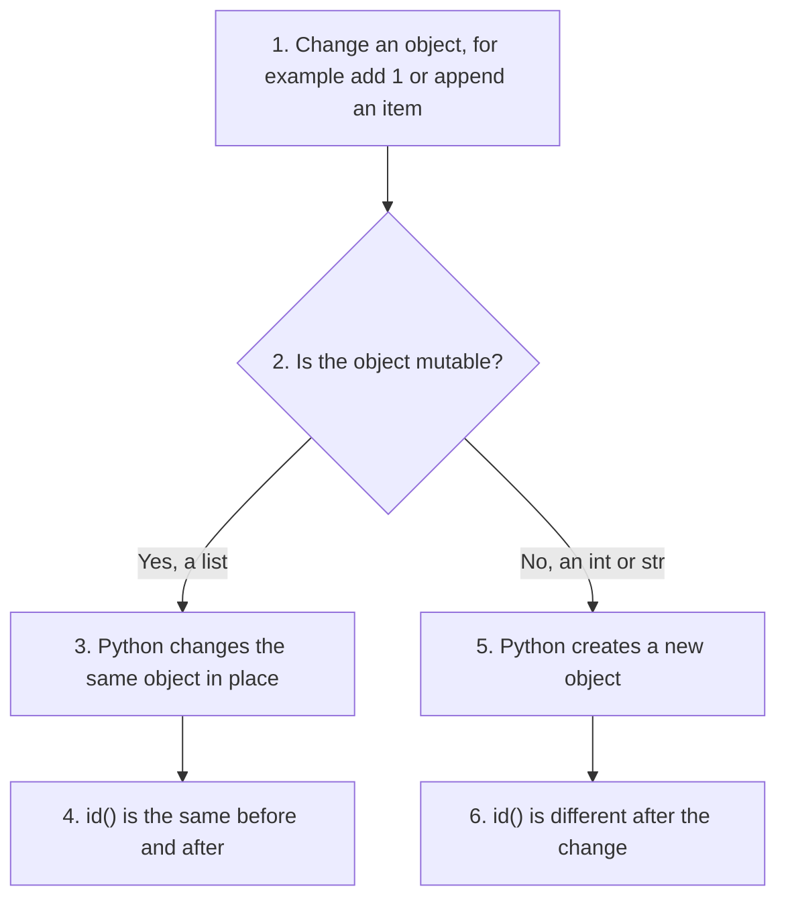
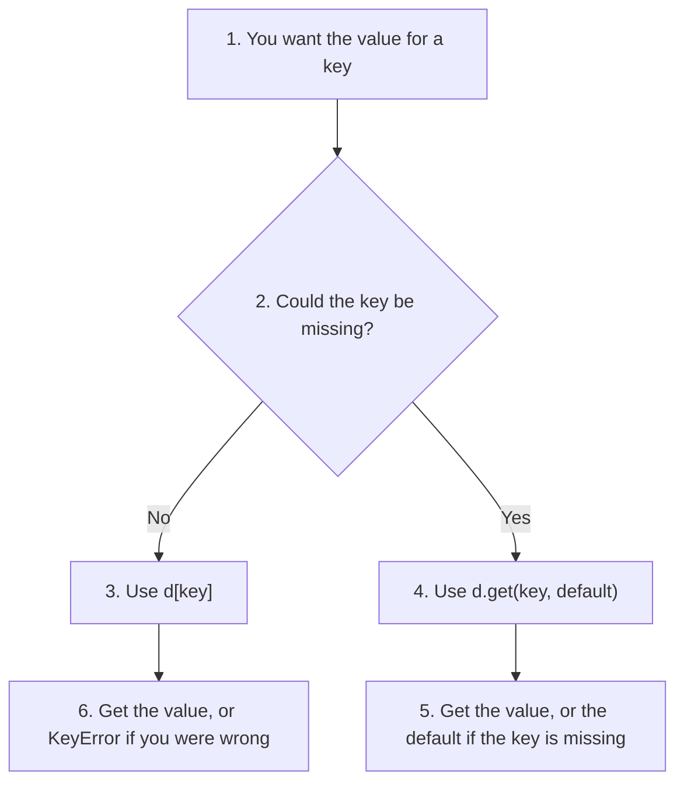
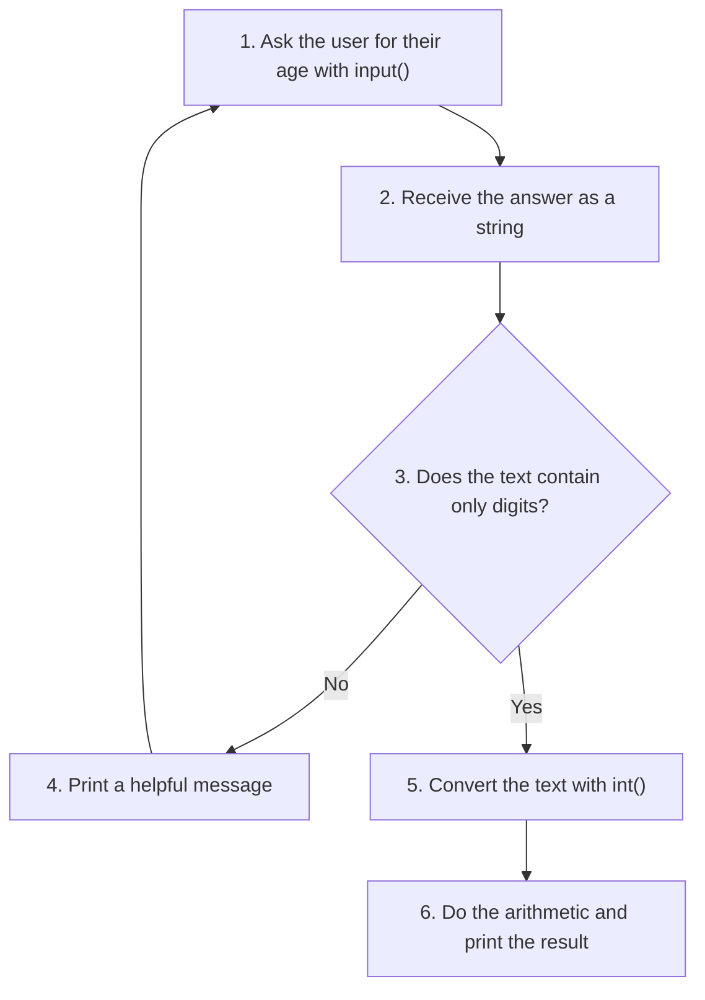
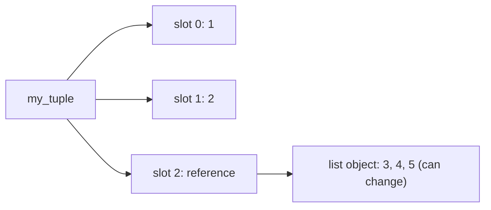

# Script Writing Questions and Answers: Python Basics II

This page has 40 script writing questions on **Chapter 2: Python Data Types**, each with a complete answer. The conceptual questions for this chapter ask *why* Python behaves as it does. These questions ask you to *show* it with a short program.

The scripts cover:

* numbers, Booleans and type conversion,
* strings, lists and tuples,
* dictionaries and sets,
* `None`,
* truth values,
* modules and imports,
* naming conventions.

**How to use this page.** Read the question and try to write the script yourself first. Then compare it with the answer. Each answer has:

1. a short explanation of the idea and the plan of the script,
2. the script, with `# Step` comments that you can follow in order,
3. the output, exactly as Python printed it,
4. where useful, a table, a flowchart or a follow-up question.

All scripts were run with Python 3.12. A few outputs change from one computer or run to another, such as memory IDs and the order of items in a set. The text points these out. For the reasons behind each idea, see the companion page of [conceptual questions](005-2-ch2-more-conceptual-qa.md).

## Table of Contents

* [Script Writing Questions and Answers: Python Basics II](#script-writing-questions-and-answers-python-basics-ii)
  * [Key Terms Used on This Page](#key-terms-used-on-this-page)
  * [Part 1: Numbers and Booleans](#part-1-numbers-and-booleans)
    * [1. Write a Python script to demonstrate that integers are immutable objects. Your script should display the value and memory ID of an integer before and after modification.](#1-write-a-python-script-to-demonstrate-that-integers-are-immutable-objects-your-script-should-display-the-value-and-memory-id-of-an-integer-before-and-after-modification)
    * [2. Write a Python script that demonstrates implicit type conversion during mixed arithmetic between an integer and a float.](#2-write-a-python-script-that-demonstrates-implicit-type-conversion-during-mixed-arithmetic-between-an-integer-and-a-float)
    * [3. Write a Python script to show floating-point precision problems using 0.1 and 0.2. Also compare the values safely using the math module.](#3-write-a-python-script-to-show-floating-point-precision-problems-using-01-and-02-also-compare-the-values-safely-using-the-math-module)
    * [4. Write a Python script to create complex numbers using different methods and display their real part, imaginary part, conjugate, and magnitude.](#4-write-a-python-script-to-create-complex-numbers-using-different-methods-and-display-their-real-part-imaginary-part-conjugate-and-magnitude)
    * [5. Write a Python script that demonstrates valid and invalid Boolean values and naming conventions for Boolean variables.](#5-write-a-python-script-that-demonstrates-valid-and-invalid-boolean-values-and-naming-conventions-for-boolean-variables)
  * [Part 2: Strings, Lists and Tuples](#part-2-strings-lists-and-tuples)
    * [6. Write a Python script to demonstrate indexing, slicing, concatenation, and repetition operations on strings.](#6-write-a-python-script-to-demonstrate-indexing-slicing-concatenation-and-repetition-operations-on-strings)
    * [7. Write a Python script to demonstrate that strings are immutable objects.](#7-write-a-python-script-to-demonstrate-that-strings-are-immutable-objects)
    * [8. Write a Python script that creates a list of mixed data types and performs indexing, slicing, appending, removing, and membership testing.](#8-write-a-python-script-that-creates-a-list-of-mixed-data-types-and-performs-indexing-slicing-appending-removing-and-membership-testing)
    * [9. Write a Python script that demonstrates mutability of lists using the id() function.](#9-write-a-python-script-that-demonstrates-mutability-of-lists-using-the-id-function)
    * [10. Write a Python script to demonstrate tuple creation, indexing, slicing, and tuple unpacking.](#10-write-a-python-script-to-demonstrate-tuple-creation-indexing-slicing-and-tuple-unpacking)
    * [11. Write a Python script that demonstrates the difference between a single-item tuple and a normal string inside parentheses.](#11-write-a-python-script-that-demonstrates-the-difference-between-a-single-item-tuple-and-a-normal-string-inside-parentheses)
  * [Part 3: Dictionaries and Sets](#part-3-dictionaries-and-sets)
    * [12. Write a Python script to create a dictionary of student details and perform adding, updating, deleting, and safe retrieval operations.](#12-write-a-python-script-to-create-a-dictionary-of-student-details-and-perform-adding-updating-deleting-and-safe-retrieval-operations)
    * [13. Write a Python script that demonstrates dictionary methods such as keys(), values(), and items().](#13-write-a-python-script-that-demonstrates-dictionary-methods-such-as-keys-values-and-items)
    * [14. Write a Python script to create sets from a string and a list. Show that duplicate values are automatically removed.](#14-write-a-python-script-to-create-sets-from-a-string-and-a-list-show-that-duplicate-values-are-automatically-removed)
    * [15. Write a Python script that demonstrates union, intersection, and difference operations on sets.](#15-write-a-python-script-that-demonstrates-union-intersection-and-difference-operations-on-sets)
    * [16. Write a Python script that demonstrates why lists cannot be added to a set. Use comments to explain the error.](#16-write-a-python-script-that-demonstrates-why-lists-cannot-be-added-to-a-set-use-comments-to-explain-the-error)
  * [Part 4: None](#part-4-none)
    * [17. Write a Python script to demonstrate the use of None as a placeholder value.](#17-write-a-python-script-to-demonstrate-the-use-of-none-as-a-placeholder-value)
    * [18. Write a Python script to demonstrate that functions without a return statement automatically return None.](#18-write-a-python-script-to-demonstrate-that-functions-without-a-return-statement-automatically-return-none)
    * [19. Write a Python script that compares None with False, 0, and an empty string.](#19-write-a-python-script-that-compares-none-with-false-0-and-an-empty-string)
  * [Part 5: Type Conversion and Input](#part-5-type-conversion-and-input)
    * [20. Write a Python script that demonstrates explicit type conversion using int(), float(), and str().](#20-write-a-python-script-that-demonstrates-explicit-type-conversion-using-int-float-and-str)
    * [21. Write a Python script that demonstrates narrowing and widening type conversions.](#21-write-a-python-script-that-demonstrates-narrowing-and-widening-type-conversions)
    * [22. Write a Python script that demonstrates conversion of numbers into hexadecimal and octal representations.](#22-write-a-python-script-that-demonstrates-conversion-of-numbers-into-hexadecimal-and-octal-representations)
    * [23. Write a Python script that accepts age input from the user and converts it into an integer before using it in arithmetic.](#23-write-a-python-script-that-accepts-age-input-from-the-user-and-converts-it-into-an-integer-before-using-it-in-arithmetic)
  * [Part 6: Truth Values](#part-6-truth-values)
    * [24. Write a Python script that demonstrates truthy and falsy values in Python using bool().](#24-write-a-python-script-that-demonstrates-truthy-and-falsy-values-in-python-using-bool)
    * [25. Write a Python script that checks whether a list is empty using the Pythonic approach.](#25-write-a-python-script-that-checks-whether-a-list-is-empty-using-the-pythonic-approach)
    * [26. Write a Python script to demonstrate good and bad practices for Boolean comparisons.](#26-write-a-python-script-to-demonstrate-good-and-bad-practices-for-boolean-comparisons)
  * [Part 7: Modules and Imports](#part-7-modules-and-imports)
    * [27. Write a Python script that imports the math module and uses its attributes and methods.](#27-write-a-python-script-that-imports-the-math-module-and-uses-its-attributes-and-methods)
    * [28. Write a Python script that imports only sqrt and pi from the math module and uses them directly.](#28-write-a-python-script-that-imports-only-sqrt-and-pi-from-the-math-module-and-uses-them-directly)
    * [29. Write a Python script that demonstrates module aliasing using the math module.](#29-write-a-python-script-that-demonstrates-module-aliasing-using-the-math-module)
    * [30. Write a Python script that uses dir() to display all attributes and methods of a module.](#30-write-a-python-script-that-uses-dir-to-display-all-attributes-and-methods-of-a-module)
  * [Part 8: Working with Containers](#part-8-working-with-containers)
    * [31. Write a Python script that demonstrates conversion of a list into a tuple and a tuple into a list.](#31-write-a-python-script-that-demonstrates-conversion-of-a-list-into-a-tuple-and-a-tuple-into-a-list)
    * [32. Write a Python script that demonstrates conversion of a dictionary into a set.](#32-write-a-python-script-that-demonstrates-conversion-of-a-dictionary-into-a-set)
    * [33. Write a Python script that demonstrates membership testing using the in operator on strings, lists, dictionaries, and sets.](#33-write-a-python-script-that-demonstrates-membership-testing-using-the-in-operator-on-strings-lists-dictionaries-and-sets)
    * [34. Write a Python script that creates a list of None values using list multiplication.](#34-write-a-python-script-that-creates-a-list-of-none-values-using-list-multiplication)
    * [35. Write a Python script that demonstrates the difference between list concatenation and string concatenation.](#35-write-a-python-script-that-demonstrates-the-difference-between-list-concatenation-and-string-concatenation)
    * [36. Write a Python script that demonstrates why Python does not automatically combine strings and integers.](#36-write-a-python-script-that-demonstrates-why-python-does-not-automatically-combine-strings-and-integers)
    * [37. Write a Python script to demonstrate that tuples can contain mutable objects like lists. Modify the internal list and observe the result.](#37-write-a-python-script-to-demonstrate-that-tuples-can-contain-mutable-objects-like-lists-modify-the-internal-list-and-observe-the-result)
  * [Part 9: Built-in Modules, Sets and Naming](#part-9-built-in-modules-sets-and-naming)
    * [38. Write a Python script that demonstrates use of sys.builtin_module_names.](#38-write-a-python-script-that-demonstrates-use-of-sysbuiltin_module_names)
    * [39. Write a Python script that demonstrates safe removal of items from a set using discard().](#39-write-a-python-script-that-demonstrates-safe-removal-of-items-from-a-set-using-discard)
    * [40. Write a Python script that demonstrates the use of proper Python naming conventions for variables, constants, classes, and modules.](#40-write-a-python-script-that-demonstrates-the-use-of-proper-python-naming-conventions-for-variables-constants-classes-and-modules)

## Key Terms Used on This Page

| Term | Simple meaning | Learn more |
| ---- | -------------- | ---------- |
| Script | A file of Python code that runs from top to bottom. | [Using the Python interpreter](https://docs.python.org/3/tutorial/interpreter.html) |
| Mutable, immutable | Can or cannot be changed after it is created. | [Glossary: mutable](https://docs.python.org/3/glossary.html#term-mutable) |
| `id()` | Returns a number that identifies an object while it exists. In CPython it is the memory address. | [id()](https://docs.python.org/3/library/functions.html#id) |
| Hashable | Has a fixed hash value, so it can be a dictionary key or a set element. | [Glossary: hashable](https://docs.python.org/3/glossary.html#term-hashable) |
| Type conversion (casting) | Turning a value of one type into another, such as `int("12")`. | [Built-in functions](https://docs.python.org/3/library/functions.html) |
| Implicit, explicit | Done automatically by Python, or done on purpose by the programmer. | [Numeric types](https://docs.python.org/3/library/stdtypes.html#numeric-types-int-float-complex) |
| Truthy, falsy | Values that count as true or false in a condition. | [Truth value testing](https://docs.python.org/3/library/stdtypes.html#truth-value-testing) |
| Unpacking | Putting the items of a sequence into separate variables in one step. | [Tuples and sequences](https://docs.python.org/3/tutorial/datastructures.html#tuples-and-sequences) |
| Exception, `try`/`except` | An error that stops a program, and the way to catch it so the program can carry on. Several scripts use it to show an error safely. | [Errors and exceptions](https://docs.python.org/3/tutorial/errors.html) |
| Module, alias | A file of Python code you can import, and a shorter name given to it with `as`. | [Modules](https://docs.python.org/3/tutorial/modules.html) |
| PEP 8 | The official style guide for Python code, including naming rules. | [PEP 8](https://peps.python.org/pep-0008/) |

[Back to the Table of Contents](#table-of-contents)

## Part 1: Numbers and Booleans

[Back to the Table of Contents](#table-of-contents)

### 1. Write a Python script to demonstrate that integers are immutable objects. Your script should display the value and memory ID of an integer before and after modification.

**Plan:**

1. Create an integer and print its value and `id()`.
2. Save the ID so it can be compared later.
3. "Modify" the integer with `x = x + 5`.
4. Print the new value and ID, and compare the two IDs.

```python
# Demonstrates immutability of integers in Python

# Step 1: Create an integer object
x = 10

# Step 2: Print value and memory ID before modification
print("Before modification:")
print("Value of x:", x)
print("ID of x:", id(x))
old_id = id(x)                # remember the old ID so we can compare later

# Step 3: Modify the integer
# Since integers are immutable, Python creates a NEW object
x = x + 5

# Step 4: Print value and memory ID after modification
print("\nAfter modification:")
print("Value of x:", x)
print("ID of x:", id(x))

# Step 5: Compare the two IDs directly
print("\nSame object as before?", id(x) == old_id)

# The ID changes because integers cannot be modified in-place
```

Sample output (the ID numbers will be different on your computer):

```text
Before modification:
Value of x: 10
ID of x: 11755976

After modification:
Value of x: 15
ID of x: 11756136

Same object as before? False
```

The IDs differ because `x = x + 5` does not change the object `10`. It creates a new object `15` and moves the name `x` to it. The last line confirms this without needing to read the long ID numbers.

[Back to the Table of Contents](#table-of-contents)

### 2. Write a Python script that demonstrates implicit type conversion during mixed arithmetic between an integer and a float.

**Plan:**

1. Create one `int` and one `float`, and print their types.
2. Add them and print the result and its type.
3. Show that the result is a float even when the answer is a whole number.

```python
# Demonstrates implicit type conversion in Python

# Step 1: An integer variable and a float variable
num1 = 5
num2 = 2.5
print("Type of num1:", type(num1))
print("Type of num2:", type(num2))

# Step 2: Add them - Python automatically converts the integer to float
result = num1 + num2

# Step 3: Print result and type
print("Result:", result)
print("Type of result:", type(result))

# Step 4: Even when the answer is a whole number, the result stays a float
print("4 + 1.0 =", 4 + 1.0, type(4 + 1.0))

# Since float is a wider type than int,
# Python converts 5 to 5.0 automatically
```

Output:

```text
Type of num1: <class 'int'>
Type of num2: <class 'float'>
Result: 7.5
Type of result: <class 'float'>
4 + 1.0 = 5.0 <class 'float'>
```

Python never converts the other way (float to int) automatically, because that could lose the decimal part. The order of promotion is `bool → int → float → complex`.

[Back to the Table of Contents](#table-of-contents)

### 3. Write a Python script to show floating-point precision problems using 0.1 and 0.2. Also compare the values safely using the math module.

**Plan:**

1. Add 0.1 and 0.2 and print the result.
2. Compare it with 0.3 using `==`.
3. Compare it again using `math.isclose()`.
4. Print the size of the error.

```python
# Step 1: Import math module
import math

# Step 2: Floating-point addition
result = 0.1 + 0.2

# Step 3: Print actual result
print("0.1 + 0.2 =", result)

# Step 4: Direct comparison may fail
print("Direct comparison:", result == 0.3)

# Step 5: Safe comparison using math.isclose()
print("Using math.isclose():", math.isclose(result, 0.3))

# Step 6: See how small the error really is
print("Difference:", abs(result - 0.3))

# Floating-point numbers are stored in binary internally,
# therefore some decimal numbers cannot be represented exactly
```

Output:

```text
0.1 + 0.2 = 0.30000000000000004
Direct comparison: False
Using math.isclose(): True
Difference: 5.551115123125783e-17
```

The error is about 0.00000000000000006, far too small to matter in most programs, but enough to make `==` fail. [`math.isclose()`](https://docs.python.org/3/library/math.html#math.isclose) treats two numbers as equal when they agree to about 9 significant digits. For more detail, see the [floats page](002-ch2-float-data.md).

[Back to the Table of Contents](#table-of-contents)

### 4. Write a Python script to create complex numbers using different methods and display their real part, imaginary part, conjugate, and magnitude.

**Plan:**

1. Create three complex numbers: with a literal, with `complex()`, and with only an imaginary part.
2. Print the real part, imaginary part, conjugate and magnitude of the first one.
3. Print the parts of the other two.

```python
# Step 1: Create complex numbers in three ways
z1 = 3 + 4j              # Method 1: Direct creation
z2 = complex(5, 6)       # Method 2: Using complex() function
z3 = 7j                  # Method 3: Imaginary-only number

# Step 2: Display details of z1
print("Complex number:", z1)
print("Real part:", z1.real)
print("Imaginary part:", z1.imag)
print("Conjugate:", z1.conjugate())
print("Magnitude:", abs(z1))

# Step 3: Display the other complex numbers and their parts
print("\nSecond complex number:", z2)
print("Real part:", z2.real, "| Imaginary part:", z2.imag)
print("\nThird complex number:", z3)
print("Real part:", z3.real, "| Imaginary part:", z3.imag)

# abs() calculates the magnitude using:
# sqrt(real^2 + imaginary^2) = sqrt(3^2 + 4^2) = sqrt(25) = 5.0
```

Output:

```text
Complex number: (3+4j)
Real part: 3.0
Imaginary part: 4.0
Conjugate: (3-4j)
Magnitude: 5.0

Second complex number: (5+6j)
Real part: 5.0 | Imaginary part: 6.0

Third complex number: 7j
Real part: 0.0 | Imaginary part: 7.0
```

| Property | Code | Result for `3 + 4j` |
| -------- | ---- | ------------------- |
| Real part | `z1.real` | `3.0` (always a float) |
| Imaginary part | `z1.imag` | `4.0` (always a float) |
| Conjugate | `z1.conjugate()` | `(3-4j)`, the sign of the imaginary part flipped |
| Magnitude | `abs(z1)` | `5.0`, the distance from 0 |

See the [complex numbers page](003-ch2-complex-numbers-basics.md) for more.

[Back to the Table of Contents](#table-of-contents)

### 5. Write a Python script that demonstrates valid and invalid Boolean values and naming conventions for Boolean variables.

**Plan:**

1. Create Boolean variables with `True` and `False`, using names that start with `is_`, `has_` or `can_`.
2. Print their values and type.
3. Show that lower-case `true` is not a Boolean value.
4. Show that a comparison also produces a Boolean.

```python
# Step 1: Valid Boolean values (True and False start with a capital letter)
is_logged_in = True
has_permission = False
can_upload = True

# Step 2: Print Boolean values
print(is_logged_in)
print(has_permission)
print(can_upload)

# Step 3: Print the type
print(type(is_logged_in))

# Step 4: Invalid Boolean values - true and false are just undefined names
try:
    is_admin = true
except NameError as error:
    print("NameError:", error)

# Step 5: A Boolean is also produced by a comparison
age = 20
is_adult = age >= 18
print("is_adult:", is_adult)

# Boolean naming convention usually uses prefixes like:
# is_, has_, can_, should_
# so the name reads like a yes/no question: "is logged in?", "has permission?"
```

Output:

```text
True
False
True
<class 'bool'>
NameError: name 'true' is not defined
is_adult: True
```

`True` and `False` are keywords and must start with a capital letter. `true` is just a name that has not been defined, so Python raises a `NameError`. The `try`/`except` block catches the error so the script can carry on and show it.

[Back to the Table of Contents](#table-of-contents)

## Part 2: Strings, Lists and Tuples

[Back to the Table of Contents](#table-of-contents)

### 6. Write a Python script to demonstrate indexing, slicing, concatenation, and repetition operations on strings.

**Plan:** create one string, then show each operation in turn.

| Index | 0 | 1 | 2 | 3 | 4 | 5 | 6 | 7 | 8 | 9 | 10 | 11 | 12 |
| ----- | - | - | - | - | - | - | - | - | - | - | -- | -- | -- |
| Character | P | y | t | h | o | n | (space) | B | a | s | i | c | s |

```python
# Step 1: Create a string
message = "Python Basics"

# Step 2: Indexing - one character by its position
print("First character:", message[0])
print("Last character:", message[-1])

# Step 3: Slicing - a range of characters (end index not included)
print("Slice [0:6]:", message[0:6])
print("Slice [7:]:", message[7:])

# Step 4: Concatenation - joining strings with +
new_message = message + " Part 2"
print("Concatenated string:", new_message)

# Step 5: Repetition - repeating a string with *
print("Repeated string:")
print(message * 3)

# Step 6: Repetition with a separator is often more readable
print(" | ".join([message] * 3))

# Strings are sequences,
# therefore indexing and slicing are supported
```

Output:

```text
First character: P
Last character: s
Slice [0:6]: Python
Slice [7:]: Basics
Concatenated string: Python Basics Part 2
Repeated string:
Python BasicsPython BasicsPython Basics
Python Basics | Python Basics | Python Basics
```

| Operation | Example | Result |
| --------- | ------- | ------ |
| Indexing | `message[0]`, `message[-1]` | One character |
| Slicing | `message[0:6]` | Characters 0 to 5 (the end index is not included) |
| Concatenation | `message + " Part 2"` | A new, longer string |
| Repetition | `message * 3` | The string three times, with nothing in between |

[Back to the Table of Contents](#table-of-contents)

### 7. Write a Python script to demonstrate that strings are immutable objects.

**Plan:**

1. Create a string and give it a second name, `original`.
2. Print its value and ID.
3. "Modify" it by adding more text, and print the new value and ID.
4. Show that the original string has not changed.
5. Show that changing a single character is not allowed.

```python
# Step 1: Create a string and keep a second name for it
text = "hello"
original = text        # a second name for the same object

# Step 2: Print original string and ID
print("Original string:", text)
print("Original ID:", id(text))

# Step 3: "Modify" the string
# Python creates a NEW string object
text = text + " world"

# Step 4: Print modified string and ID
print("\nModified string:", text)
print("Modified ID:", id(text))

# Step 5: The original object is unchanged
print("\nOriginal is still:", original)
print("Same object?", text is original)

# Step 6: Changing a character in place is not allowed
try:
    text[0] = "H"
except TypeError as error:
    print("TypeError:", error)

# Different IDs show that strings are immutable
```

Sample output (the ID numbers will be different on your computer):

```text
Original string: hello
Original ID: 140498873229616

Modified string: hello world
Modified ID: 140498873351920

Original is still: hello
Same object? False
TypeError: 'str' object does not support item assignment
```

Keeping a second name (`original`) for the first string makes the test reliable. It also shows the key point clearly: the old string still exists, unchanged, next to the new one.

[Back to the Table of Contents](#table-of-contents)

### 8. Write a Python script that creates a list of mixed data types and performs indexing, slicing, appending, removing, and membership testing.

**Plan:** create a list that holds an `int`, a `str`, a `float` and a `bool`, then show each operation in turn, printing the list after each change.

```python
# Step 1: Create a mixed list
my_list = [10, "apple", 3.5, True]

# Step 2: Print list
print("Original list:", my_list)

# Step 3: Indexing
print("First item:", my_list[0])

# Step 4: Slicing
print("Slice [1:3]:", my_list[1:3])

# Step 5: Append new item (added at the end)
my_list.append("Python")
print("After append:", my_list)

# Step 6: Remove an item (the first item equal to True)
my_list.remove(True)
print("After remove:", my_list)

# Step 7: Membership test
print("Is 'apple' present?", "apple" in my_list)
print("Is 'mango' present?", "mango" in my_list)

# Lists are mutable and can store mixed data types
```

Output:

```text
Original list: [10, 'apple', 3.5, True]
First item: 10
Slice [1:3]: ['apple', 3.5]
After append: [10, 'apple', 3.5, True, 'Python']
After remove: [10, 'apple', 3.5, 'Python']
Is 'apple' present? True
Is 'mango' present? False
```

A caution about `remove(True)`: it removes the **first item equal to** `True`. Because `True == 1` in Python, if the list also held the number `1` before `True`, the `1` would be removed instead.

[Back to the Table of Contents](#table-of-contents)

### 9. Write a Python script that demonstrates mutability of lists using the id() function.

**Plan:**

1. Create a list and print it with its ID.
2. Change it in place with `append()`.
3. Print it again with its ID, and compare the two IDs.

```python
# Step 1: Create a list
numbers = [1, 2, 3]

# Step 2: Print original list and ID
print("Before append:")
print(numbers)
print("ID:", id(numbers))
old_id = id(numbers)

# Step 3: Modify list in-place
numbers.append(4)

# Step 4: Print modified list and ID
print("\nAfter append:")
print(numbers)
print("ID:", id(numbers))

# Step 5: Compare the IDs
print("\nSame object as before?", id(numbers) == old_id)

# ID remains same because list is mutable
```

Sample output (the ID number will be different on your computer):

```text
Before append:
[1, 2, 3]
ID: 140214831598400

After append:
[1, 2, 3, 4]
ID: 140214831598400

Same object as before? True
```

Compare this with questions 1 and 7. The list keeps its ID when changed, but the integer and the string got new IDs.



[Back to the Table of Contents](#table-of-contents)

### 10. Write a Python script to demonstrate tuple creation, indexing, slicing, and tuple unpacking.

**Plan:** create a tuple of a student's details, read items by index and slice, then unpack all three items into separate variables.

```python
# Step 1: Create a tuple
student = ("Alice", 21, "Physics")

# Step 2: Indexing
print("Name:", student[0])

# Step 3: Slicing (a slice of a tuple is also a tuple)
print("Slice [1:3]:", student[1:3])

# Step 4: Tuple unpacking - one variable for each item, in order
name, age, subject = student

# Step 5: Print unpacked values
print("\nUnpacked values:")
print(name)
print(age)
print(subject)

# Step 6: The number of variables must match the number of items
try:
    name, age = student
except ValueError as error:
    print("\nValueError:", error)

# Tuples are immutable sequences
```

Output:

```text
Name: Alice
Slice [1:3]: (21, 'Physics')

Unpacked values:
Alice
21
Physics

ValueError: too many values to unpack (expected 2)
```

Unpacking puts the first item into the first variable, the second into the second, and so on. The number of variables must match the number of items, as Step 6 shows.

[Back to the Table of Contents](#table-of-contents)

### 11. Write a Python script that demonstrates the difference between a single-item tuple and a normal string inside parentheses.

**Plan:** create `("apple",)` and `("apple")`, then print the value, type and length of each.

```python
# Step 1: Single-item tuple (note the comma)
single_tuple = ("apple",)

# Step 2: String inside parentheses (no comma)
not_tuple = ("apple")

# Step 3: Print values and types
print(single_tuple)
print(type(single_tuple))

print(not_tuple)
print(type(not_tuple))

# Step 4: The lengths show the difference clearly
print("len(single_tuple):", len(single_tuple))   # 1 item
print("len(not_tuple):", len(not_tuple))         # 5 characters

# The comma is what actually creates the tuple
```

Output:

```text
('apple',)
<class 'tuple'>
apple
<class 'str'>
len(single_tuple): 1
len(not_tuple): 5
```

The lengths make the difference easy to see. The tuple holds **one item** (the word), while the string is made of **five characters**.

[Back to the Table of Contents](#table-of-contents)

## Part 3: Dictionaries and Sets

[Back to the Table of Contents](#table-of-contents)

### 12. Write a Python script to create a dictionary of student details and perform adding, updating, deleting, and safe retrieval operations.

**Plan:**

1. Create the dictionary and print it.
2. Add a key, update a value and delete a key.
3. Read a missing key safely with `get()`, with and without a default.
4. Show what happens with `[]` for comparison.
5. Print the final dictionary.

```python
# Step 1: Create dictionary
student = {
    "name": "Alice",
    "age": 20,
    "course": "Maths"
}

# Step 2: Print original dictionary
print("Original dictionary:")
print(student)

# Step 3: Add new key-value pair
student["year"] = 2026

# Step 4: Update existing value
student["name"] = "Bob"

# Step 5: Delete a key-value pair
del student["course"]

# Step 6: Safe retrieval using get()
# get() returns None (or a default you give) instead of raising KeyError
print("\nCourse:", student.get("course"))
print("Course:", student.get("course", "Not enrolled"))

# Step 7: Unsafe retrieval with [] raises KeyError for a missing key
try:
    print(student["course"])
except KeyError as error:
    print("KeyError:", error)

# Step 8: Final dictionary
print("\nUpdated dictionary:")
print(student)

# Dictionaries are mutable containers
```

Output:

```text
Original dictionary:
{'name': 'Alice', 'age': 20, 'course': 'Maths'}

Course: None
Course: Not enrolled
KeyError: 'course'

Updated dictionary:
{'name': 'Bob', 'age': 20, 'year': 2026}
```

| Operation | Code | What happens |
| --------- | ---- | ------------ |
| Add | `student["year"] = 2026` | A new key is created |
| Update | `student["name"] = "Bob"` | The key exists, so its value is replaced |
| Delete | `del student["course"]` | The key and its value are removed |
| Safe read | `student.get("course")` | Returns `None` (or your default) if the key is missing |
| Unsafe read | `student["course"]` | Raises `KeyError` if the key is missing |



[Back to the Table of Contents](#table-of-contents)

### 13. Write a Python script that demonstrates dictionary methods such as keys(), values(), and items().

**Plan:** create a dictionary, print the result of each method, then use `items()` in a loop.

```python
# Step 1: Create dictionary
employee = {
    "id": 101,
    "name": "John",
    "department": "HR"
}

# Step 2: Display keys
print("Keys:")
print(employee.keys())

# Step 3: Display values
print("\nValues:")
print(employee.values())

# Step 4: Display items
print("\nItems:")
print(employee.items())

# Step 5: items() is most useful in a loop
print("\nLooping over items():")
for key, value in employee.items():
    print(key, "->", value)

# items() returns key-value pairs as tuples
```

Output:

```text
Keys:
dict_keys(['id', 'name', 'department'])

Values:
dict_values([101, 'John', 'HR'])

Items:
dict_items([('id', 101), ('name', 'John'), ('department', 'HR')])

Looping over items():
id -> 101
name -> John
department -> HR
```

| Method | Gives | Typical use |
| ------ | ----- | ----------- |
| `keys()` | All the keys | Check or list the keys |
| `values()` | All the values | Add up or search the values |
| `items()` | `(key, value)` pairs | Loop over keys and values together |

These methods return live "views" (`dict_keys`, `dict_values`, `dict_items`). If the dictionary changes, the views show the change. Wrap one in `list()` if you need an ordinary list.

[Back to the Table of Contents](#table-of-contents)

### 14. Write a Python script to create sets from a string and a list. Show that duplicate values are automatically removed.

**Plan:** make one set from the word `"programming"` and one from a list with repeated numbers, then compare the sizes before and after.

```python
# Step 1: Create set from string (each character becomes one element)
char_set = set("programming")

# Step 2: Create set from list
number_set = set([1, 2, 2, 3, 4, 4, 5])

# Step 3: Print sets
print("Character set:")
print(char_set)

print("\nNumber set:")
print(number_set)

# Step 4: Compare sizes before and after removing duplicates
print("\nCharacters in 'programming':", len("programming"))
print("Unique characters:", len(char_set))
print("Items in list:", len([1, 2, 2, 3, 4, 4, 5]))
print("Unique numbers:", len(number_set))

# Sets automatically remove duplicate values
```

Sample output (the order of the characters may be different on your computer and may change between runs):

```text
Character set:
{'n', 'r', 'g', 'i', 'a', 'm', 'o', 'p'}

Number set:
{1, 2, 3, 4, 5}

Characters in 'programming': 11
Unique characters: 8
Items in list: 7
Unique numbers: 5
```

"programming" has 11 characters, but only 8 different ones: the extra `r`, `g` and `m` were dropped. A set has no fixed order, so do not rely on the order it prints in. Use `sorted(char_set)` when you need a fixed order.

[Back to the Table of Contents](#table-of-contents)

### 15. Write a Python script that demonstrates union, intersection, and difference operations on sets.

**Plan:** create two overlapping sets, then show each operation first with a method and then with an operator.

```python
# Step 1: Create two sets
A = {1, 2, 3, 4}
B = {3, 4, 5, 6}

# Step 2: Union - items in A or B or both
print("Union:")
print(A.union(B))

# Step 3: Intersection - items in both A and B
print("\nIntersection:")
print(A.intersection(B))

# Step 4: Difference - items in A but not in B
print("\nDifference A-B:")
print(A.difference(B))

# Step 5: The same operations with operators
print("\nUsing operators:")
print("A | B =", A | B)
print("A & B =", A & B)
print("A - B =", A - B)
print("B - A =", B - A)

# Sets are useful for mathematical operations
```

Output:

```text
Union:
{1, 2, 3, 4, 5, 6}

Intersection:
{3, 4}

Difference A-B:
{1, 2}

Using operators:
A | B = {1, 2, 3, 4, 5, 6}
A & B = {3, 4}
A - B = {1, 2}
B - A = {5, 6}
```

| Element | In A? | In B? | A ∪ B | A ∩ B | A - B | B - A |
| ------- | ----- | ----- | ----- | ----- | ----- | ----- |
| 1 | Yes | No | Yes | No | Yes | No |
| 2 | Yes | No | Yes | No | Yes | No |
| 3 | Yes | Yes | Yes | Yes | No | No |
| 4 | Yes | Yes | Yes | Yes | No | No |
| 5 | No | Yes | Yes | No | No | Yes |
| 6 | No | Yes | Yes | No | No | Yes |

Note that difference depends on the order: `A - B` and `B - A` are different.

[Back to the Table of Contents](#table-of-contents)

### 16. Write a Python script that demonstrates why lists cannot be added to a set. Use comments to explain the error.

**Plan:**

1. Try to create a set that holds a list, inside `try`/`except`, and print the error.
2. Try again with the `add()` method.
3. Show that a tuple with the same values works.

```python
# Step 1: Lists are mutable objects
my_list = [1, 2, 3]

# Step 2: Try to put the list in a set
# This produces a TypeError because lists are mutable
# and therefore unhashable
try:
    invalid_set = {my_list}
except TypeError as error:
    print("TypeError:", error)

print("Lists cannot be added to sets because they are mutable.")
print("Set elements must be hashable (in practice, usually immutable).")

# Step 3: The same happens with add()
numbers = {10, 20}
try:
    numbers.add(my_list)
except TypeError as error:
    print("TypeError:", error)

# Step 4: A tuple holds the same values and is allowed
valid_set = {tuple(my_list)}
print("Using a tuple instead:", valid_set)
```

Output:

```text
TypeError: unhashable type: 'list'
Lists cannot be added to sets because they are mutable.
Set elements must be hashable (in practice, usually immutable).
TypeError: unhashable type: 'list'
Using a tuple instead: {(1, 2, 3)}
```

Why: a set finds its items by their hash value. A list can change after it is added, so its hash could change and the set could no longer find it. Python therefore refuses to hash lists at all ("unhashable type"). A tuple cannot change, so it is allowed.

[Back to the Table of Contents](#table-of-contents)

## Part 4: None

[Back to the Table of Contents](#table-of-contents)

### 17. Write a Python script to demonstrate the use of None as a placeholder value.

**Plan:** start a variable as `None`, check it with `is None`, give it a real value later, and check again with `is not None`.

```python
# Step 1: Placeholder variable
temperature = None

# Step 2: Print initial value
print("Initial temperature:", temperature)

# Step 3: Check whether value is assigned
if temperature is None:
    print("Temperature value has not been assigned yet.")

# Step 4: Later assign a value
temperature = 28

# Step 5: Print updated value
print("Updated temperature:", temperature)

# Step 6: Check again
if temperature is not None:
    print("Temperature is now available.")

# None represents absence of meaningful value
```

Output:

```text
Initial temperature: None
Temperature value has not been assigned yet.
Updated temperature: 28
Temperature is now available.
```

Always test for `None` with `is None` or `is not None`, not with `==`.

[Back to the Table of Contents](#table-of-contents)

### 18. Write a Python script to demonstrate that functions without a return statement automatically return None.

**Plan:** write a function with no `return`, call it, and print what it gives back. Then show that a `return` with no value also gives `None`.

```python
# Step 1: Define a function without return statement
def greet():
    print("Hello student")

# Step 2: Call function and store result
result = greet()

# Step 3: Print returned value and its type
print("Returned value:", result)
print("Type:", type(result))

# Step 4: A bare return statement also gives None
def check():
    return

print("check() returned:", check())

# Python automatically returns None
# when a function does not explicitly return a value
```

Output:

```text
Hello student
Returned value: None
Type: <class 'NoneType'>
check() returned: None
```

Note the order of the output. `Hello student` appears first because it is printed **inside** the function while it runs. Only after that does the script print the value that came back.

[Back to the Table of Contents](#table-of-contents)

### 19. Write a Python script that compares None with False, 0, and an empty string.

**Plan:** compare `None` with each value using `==`, then show that all of them still count as false in a condition.

```python
# Step 1: Compare None with False
print("None == False:", None == False)

# Step 2: Compare None with zero
print("None == 0:", None == 0)

# Step 3: Compare None with empty string
print('None == "":', None == "")

# Step 4: None is equal only to itself
print("None == None:", None == None)
print("None is None:", None is None)

# Step 5: All four values count as false in a condition
print("bool values:", bool(None), bool(False), bool(0), bool(""))

# None is different from all these values
# It represents absence of value
```

Output:

```text
None == False: False
None == 0: False
None == "": False
None == None: True
None is None: True
bool values: False False False False
```

| Value | Equal to `None`? | Counts as false in a condition? |
| ----- | ---------------- | ------------------------------- |
| `False` | No | Yes |
| `0` | No | Yes |
| `""` | No | Yes |
| `None` | Yes | Yes |

So `None`, `False`, `0` and `""` all behave as false in an `if`, but they are four different values.

[Back to the Table of Contents](#table-of-contents)

## Part 5: Type Conversion and Input

[Back to the Table of Contents](#table-of-contents)

### 20. Write a Python script that demonstrates explicit type conversion using int(), float(), and str().

**Plan:** show each conversion with a small example, then show a conversion that fails.

```python
# Step 1: String to integer conversion
x = "12"
print(int(x) + 5)

# Step 2: Integer to float conversion
num = 10
print(float(num))

# Step 3: Integer to string conversion
age = 25
print("Age is " + str(age))

# Step 4: String to float conversion
price = "49.99"
print(float(price) * 2)

# Step 5: A conversion that fails
try:
    int("twelve")
except ValueError as error:
    print("ValueError:", error)

# Explicit casting is done manually by programmer
```

Output:

```text
17
10.0
Age is 25
99.98
ValueError: invalid literal for int() with base 10: 'twelve'
```

| Function | Converts to | Example | Result |
| -------- | ----------- | ------- | ------ |
| `int()` | Whole number | `int("12")` | `12` |
| `float()` | Decimal number | `float(10)` | `10.0` |
| `str()` | Text | `str(25)` | `"25"` |

A conversion fails with `ValueError` when the text does not look like the number type you asked for.

[Back to the Table of Contents](#table-of-contents)

### 21. Write a Python script that demonstrates narrowing and widening type conversions.

**Plan:**

1. Widening: convert an `int` to a `float` and show that nothing is lost.
2. Narrowing: convert a `float` to an `int` and show how much is lost.
3. Show that `int()` cuts off the decimal part rather than rounding.

```python
# Step 1: Widening conversion - integer converted to float
x = 10
wide_value = float(x)

print("Widening conversion:")
print(wide_value)
print("Back to int gives the same value:", int(wide_value) == x)

# Step 2: Narrowing conversion - float converted to integer
pi_value = 3.14159
narrow_value = int(pi_value)

print("\nNarrowing conversion:")
print(narrow_value)
print("Information lost:", pi_value - narrow_value)

# Step 3: int() cuts off the decimal part, it does not round
print("\nint(2.99) =", int(2.99))
print("round(2.99) =", round(2.99))

# Narrowing may lose information
# because decimal part is removed
```

Output:

```text
Widening conversion:
10.0
Back to int gives the same value: True

Narrowing conversion:
3
Information lost: 0.14158999999999988

int(2.99) = 2
round(2.99) = 3
```

| Conversion | Example | Information lost? |
| ---------- | ------- | ----------------- |
| Widening (int → float) | `float(10)` gives `10.0` | No (for ordinary sizes of numbers) |
| Narrowing (float → int) | `int(3.14159)` gives `3` | Yes, the decimal part |

The "information lost" line shows `0.14158999999999988` rather than `0.14159`. This tiny difference is the usual float rounding described in question 3.

[Back to the Table of Contents](#table-of-contents)

### 22. Write a Python script that demonstrates conversion of numbers into hexadecimal and octal representations.

**Plan:** convert 64 to hexadecimal, octal and binary, show that the results are strings, and convert two of them back.

```python
# Step 1: Integer value
number = 64

# Step 2: Convert to hexadecimal (base 16)
print("Hexadecimal:", hex(number))

# Step 3: Convert to octal (base 8)
print("Octal:", oct(number))

# Step 4: Convert to binary (base 2)
print("Binary:", bin(number))

# Step 5: The results are strings
print("Type of hex(number):", type(hex(number)))

# Step 6: Convert back to an integer with int(text, base)
print("Back from hex:", int("0x40", 16))
print("Back from octal:", int("0o100", 8))

# hex() and oct() return strings
# representing the number in different bases
```

Output:

```text
Hexadecimal: 0x40
Octal: 0o100
Binary: 0b1000000
Type of hex(number): <class 'str'>
Back from hex: 64
Back from octal: 64
```

| Base | Function | Prefix | 64 is written as | Why |
| ---- | -------- | ------ | ---------------- | --- |
| 16 (hexadecimal) | `hex()` | `0x` | `0x40` | 4 × 16 = 64 |
| 8 (octal) | `oct()` | `0o` | `0o100` | 1 × 8² = 64 |
| 2 (binary) | `bin()` | `0b` | `0b1000000` | 1 × 2⁶ = 64 |

[Back to the Table of Contents](#table-of-contents)

### 23. Write a Python script that accepts age input from the user and converts it into an integer before using it in arithmetic.

**Plan:**

1. Read the age with `input()`. The result is a string.
2. Convert it with `int()`.
3. Use it in arithmetic.

```python
# Step 1: Take input from user (always a string)
age = input("Enter your age: ")

# Step 2: Convert string input into integer
age = int(age)

# Step 3: Perform arithmetic
print("Next year your age will be:", age + 1)

# input() always returns a string,
# therefore conversion is necessary
```

Sample run (the user types `20`):

```text
Enter your age: 20
Next year your age will be: 21
```

Without Step 2, `age + 1` would fail with a `TypeError`, because Python cannot add a string and a number.

**Follow-up: what if the user types something that is not a number?** Then `int()` raises a `ValueError` and the program stops. The version below keeps asking until it gets a whole number.

```python
# Step 1: Keep asking until the user types a whole number
while True:
    text = input("Enter your age: ")
    if text.strip().isdigit():          # only digits (after removing spaces)?
        age = int(text)
        break
    print("Please type a whole number, for example 25.")

# Step 2: Use the number
print("Next year your age will be:", age + 1)
```

Sample run (the user first types `twenty`, then `25`):

```text
Enter your age: twenty
Please type a whole number, for example 25.
Enter your age: 25
Next year your age will be: 26
```



[Back to the Table of Contents](#table-of-contents)

## Part 6: Truth Values

[Back to the Table of Contents](#table-of-contents)

### 24. Write a Python script that demonstrates truthy and falsy values in Python using bool().

**Plan:** pass an empty and a non-empty example of each type to `bool()`, labelling each line, then show three values that surprise many learners.

```python
# Step 1: Numbers
print("bool(0):", bool(0))
print("bool(10):", bool(10))

# Step 2: Strings
print('bool(""):', bool(""))
print('bool("Python"):', bool("Python"))

# Step 3: Lists
print("bool([]):", bool([]))
print("bool([1, 2]):", bool([1, 2]))

# Step 4: Dictionaries
print("bool({}):", bool({}))
print('bool({"a": 1}):', bool({"a": 1}))

# Step 5: None
print("bool(None):", bool(None))

# Step 6: Two surprises - these are truthy because they are not empty
print('bool("0"):', bool("0"))
print('bool(" "):', bool(" "))
print("bool([0]):", bool([0]))

# Empty containers are falsy
# Non-empty containers are truthy
```

Output:

```text
bool(0): False
bool(10): True
bool(""): False
bool("Python"): True
bool([]): False
bool([1, 2]): True
bool({}): False
bool({"a": 1}): True
bool(None): False
bool("0"): True
bool(" "): True
bool([0]): True
```

| Type | Falsy (counts as False) | Truthy (counts as True) |
| ---- | ----------------------- | ----------------------- |
| Numbers | `0`, `0.0` | Any other number, such as `10` or `-1` |
| Strings | `""` | Any other string, even `"0"` or `" "` |
| Lists | `[]` | Any list with items, even `[0]` |
| Dictionaries | `{}` | Any dictionary with items |
| Special | `None`, `False` | `True` |

[Back to the Table of Contents](#table-of-contents)

### 25. Write a Python script that checks whether a list is empty using the Pythonic approach.

**Plan:** put the check in a small function so it can be tested with both a full list and an empty one.

```python
# Step 1: Write the check once, as a function
def describe(items):
    # Pythonic way to check emptiness
    if items:
        print(items, "-> List contains items")
    else:
        print(items, "-> List is empty")

# Step 2: Test it with a full list and an empty list
describe([10, 20, 30])
describe([])

# Empty lists evaluate to False
# Non-empty lists evaluate to True
```

Output:

```text
[10, 20, 30] -> List contains items
[] -> List is empty
```

`if items:` is the Pythonic check. It is shorter than `if len(items) > 0:` and works for any container: lists, strings, dictionaries and sets.

[Back to the Table of Contents](#table-of-contents)

### 26. Write a Python script to demonstrate good and bad practices for Boolean comparisons.

**Plan:** show the long way (`== True`) and the Pythonic way, then the `not` form, then a case where `== True` gives a misleading answer.

```python
# Step 1: Boolean variable
is_active = True

# Step 2: Non-Pythonic approach
if is_active == True:
    print("Using explicit comparison")

# Step 3: Better Pythonic approach
if is_active:
    print("Using direct truth-value testing")

# Step 4: For the opposite case, use not
is_blocked = False
if not is_blocked:
    print("User is not blocked")

# Step 5: Why == True can mislead - a truthy value is not equal to True
count = 5
print("count == True:", count == True)   # False, because 5 is not 1
print("bool(count):", bool(count))       # True, because 5 is not zero

# Pythonic code is shorter and more readable
```

Output:

```text
Using explicit comparison
Using direct truth-value testing
User is not blocked
count == True: False
bool(count): True
```

| Instead of | Write |
| ---------- | ----- |
| `if is_active == True:` | `if is_active:` |
| `if is_active == False:` | `if not is_active:` |
| `if value == None:` | `if value is None:` |

Step 5 shows why `== True` is more than a matter of style. `5` is truthy, but it is not equal to `True` (which is 1). So `if count == True:` would skip the block even though `count` has a value.

[Back to the Table of Contents](#table-of-contents)

## Part 7: Modules and Imports

[Back to the Table of Contents](#table-of-contents)

### 27. Write a Python script that imports the math module and uses its attributes and methods.

**Plan:** import `math`, print two of its values (attributes), then call three of its functions.

```python
# Step 1: Import math module
import math

# Step 2: Access module attributes (values)
print("Value of pi:", math.pi)
print("Value of e:", math.e)

# Step 3: Access module functions
print("Square root of 49:", math.sqrt(49))
print("5 factorial:", math.factorial(5))
print("Floor of 7.8:", math.floor(7.8))

# Dot operator is used to access
# module attributes and functions
```

Output:

```text
Value of pi: 3.141592653589793
Value of e: 2.718281828459045
Square root of 49: 7.0
5 factorial: 120
Floor of 7.8: 7
```

`math.pi` and `math.e` are values stored in the module, so there are no brackets. `math.sqrt()`, `math.factorial()` and `math.floor()` are functions, so they need brackets. Strictly speaking, the functions of a module are called *functions*, not *methods*. "Method" is the name for a function that belongs to an object, such as `list.append()`.

[Back to the Table of Contents](#table-of-contents)

### 28. Write a Python script that imports only sqrt and pi from the math module and uses them directly.

**Plan:** use `from math import sqrt, pi`, call them without a prefix, and show that the name `math` itself is not available.

```python
# Step 1: Import specific items from math module
from math import sqrt, pi

# Step 2: Use imported items directly
print("Square root:", sqrt(64))
print("Pi value:", pi)

# Step 3: The module name itself was not imported
try:
    print(math.pi)
except NameError as error:
    print("NameError:", error)

# No module prefix is required
# because specific items were imported
```

Output:

```text
Square root: 8.0
Pi value: 3.141592653589793
NameError: name 'math' is not defined
```

| Import style | How you use it | Name created in your program |
| ------------ | -------------- | ---------------------------- |
| `import math` | `math.sqrt(64)` | `math` |
| `from math import sqrt, pi` | `sqrt(64)` | `sqrt`, `pi` |
| `import math as m` | `m.sqrt(64)` | `m` |

[Back to the Table of Contents](#table-of-contents)

### 29. Write a Python script that demonstrates module aliasing using the math module.

**Plan:** import `math` as `m`, use `m`, and show that `m` and `math` are the same module object.

```python
# Step 1: Import math module with alias
import math as m

# Step 2: Use alias instead of original name
print("Value of pi:", m.pi)
print("Square root of 81:", m.sqrt(81))

# Step 3: The alias is the same module object
import math
print("m is math:", m is math)

# Aliasing shortens long module names
```

Output:

```text
Value of pi: 3.141592653589793
Square root of 81: 9.0
m is math: True
```

An alias is just a second name for the same module. Well-known aliases include `np` for NumPy and `pd` for pandas.

[Back to the Table of Contents](#table-of-contents)

### 30. Write a Python script that uses dir() to display all attributes and methods of a module.

**Plan:** `print(dir(os))` prints a list of about 400 names, which is hard to read. So the script counts the names, prints the first ten, filters out "private" names that start with `_`, and searches for names containing a word. The full list is one uncommented line away.

```python
# Step 1: Import os module
import os

# Step 2: Get all attributes and functions as a list of names
names = dir(os)
print("Number of names:", len(names))

# Step 3: Show the first 10 names
print("First 10:", names[:10])

# Step 4: Leave out the "private" names that start with _
public = [name for name in names if not name.startswith("_")]
print("Public names:", len(public))

# Step 5: Search for names that contain a word
print("Names with 'dir':", [name for name in public if "dir" in name])

# To see the complete list, uncomment the next line:
# print(dir(os))

# dir() returns names available inside module
```

Sample output (Linux, Python 3.12; the names and counts differ on Windows and macOS and between Python versions):

```text
Number of names: 402
First 10: ['CLD_CONTINUED', 'CLD_DUMPED', 'CLD_EXITED', 'CLD_KILLED', 'CLD_STOPPED', 'CLD_TRAPPED', 'CLONE_FILES', 'CLONE_FS', 'CLONE_NEWCGROUP', 'CLONE_NEWIPC']
Public names: 384
Names with 'dir': ['chdir', 'curdir', 'fchdir', 'listdir', 'makedirs', 'mkdir', 'pardir', 'removedirs', 'rmdir', 'scandir', 'supports_dir_fd']
```

`dir()` works on any object, not just modules. Try `dir(str)` to see every string method.

[Back to the Table of Contents](#table-of-contents)

## Part 8: Working with Containers

[Back to the Table of Contents](#table-of-contents)

### 31. Write a Python script that demonstrates conversion of a list into a tuple and a tuple into a list.

**Plan:** convert a list to a tuple and back, printing each result and its type, then show that the new list is a separate copy.

```python
# Step 1: Original list
numbers_list = [1, 2, 3]

# Step 2: Convert list to tuple
numbers_tuple = tuple(numbers_list)

print(numbers_tuple)
print(type(numbers_tuple))

# Step 3: Convert tuple back to list
new_list = list(numbers_tuple)

print(new_list)
print(type(new_list))

# Step 4: The new list is a separate copy
new_list.append(4)
print("new_list:", new_list, "| numbers_list:", numbers_list)

# Conversion functions are useful
# when changing container types
```

Output:

```text
(1, 2, 3)
<class 'tuple'>
[1, 2, 3]
<class 'list'>
new_list: [1, 2, 3, 4] | numbers_list: [1, 2, 3]
```

A common use: convert a list to a tuple when you need to use it as a dictionary key or to protect it from changes, and convert a tuple to a list when you need to change it.

[Back to the Table of Contents](#table-of-contents)

### 32. Write a Python script that demonstrates conversion of a dictionary into a set.

**Plan:** convert the dictionary with `set()`, then show how to get a set of values or of key-value pairs instead.

```python
# Step 1: Create dictionary
student = {
    "name": "Alice",
    "age": 20,
    "course": "Physics"
}

# Step 2: Convert dictionary into set
# Only keys are included
student_set = set(student)

# Step 3: Print result
print(student_set)

# Step 4: To get a set of values or of pairs, say so explicitly
print(set(student.values()))
print(set(student.items()))

# set(dictionary) converts only keys
```

Sample output (the order inside each set may be different on your computer):

```text
{'course', 'age', 'name'}
{'Alice', 20, 'Physics'}
{('age', 20), ('name', 'Alice'), ('course', 'Physics')}
```

Looping over a dictionary, or passing it to `set()`, `list()` or `sorted()`, always works on its **keys**. Use `.values()` or `.items()` when you want something else.

[Back to the Table of Contents](#table-of-contents)

### 33. Write a Python script that demonstrates membership testing using the in operator on strings, lists, dictionaries, and sets.

**Plan:** use `in` once on each type, labelling each line, and add `not in` at the end.

```python
# Step 1: String membership (looks for a substring)
print('"Py" in "Python":', "Py" in "Python")

# Step 2: List membership
print("10 in [5, 10, 15]:", 10 in [5, 10, 15])

# Step 3: Dictionary membership checks keys
student = {"name": "Alice", "age": 20}
print('"name" in student:', "name" in student)
print('"Alice" in student:', "Alice" in student)
print('"Alice" in student.values():', "Alice" in student.values())

# Step 4: Set membership
print("3 in {1, 2, 3, 4}:", 3 in {1, 2, 3, 4})

# Step 5: not in gives the opposite answer
print("7 not in [5, 10, 15]:", 7 not in [5, 10, 15])

# 'in' operator checks existence of element
```

Output:

```text
"Py" in "Python": True
10 in [5, 10, 15]: True
"name" in student: True
"Alice" in student: False
"Alice" in student.values(): True
3 in {1, 2, 3, 4}: True
7 not in [5, 10, 15]: True
```

| Container | `x in container` checks | Example |
| --------- | ----------------------- | ------- |
| String | Whether `x` is a substring | `"Py" in "Python"` |
| List, tuple | Whether any item equals `x` | `10 in [5, 10, 15]` |
| Dictionary | Whether `x` is a **key** | `"name" in student` |
| Set | Whether `x` is an element | `3 in {1, 2, 3, 4}` |

Membership in a set or a dictionary is very fast, even for millions of items, because it uses hashing. In a list, Python has to check the items one by one.

[Back to the Table of Contents](#table-of-contents)

### 34. Write a Python script that creates a list of None values using list multiplication.

**Plan:** make a list of five `None` values, fill some positions later, and count the empty ones.

```python
# Step 1: Create list containing None values
placeholder_list = [None] * 5

# Step 2: Print list and its length
print(placeholder_list)
print("Length:", len(placeholder_list))

# Step 3: Fill some positions later
placeholder_list[0] = "Monday"
placeholder_list[2] = "Wednesday"
print(placeholder_list)

# Step 4: Count positions still empty
print("Still empty:", placeholder_list.count(None))

# Useful when reserving positions
# for future data insertion
```

Output:

```text
[None, None, None, None, None]
Length: 5
['Monday', None, 'Wednesday', None, None]
Still empty: 3
```

A caution: `[None] * 5` is safe because `None` is immutable. Do not use the same trick with a mutable item. `[[]] * 3` creates **one** list shared three times, so changing one changes all three. Use `[[] for _ in range(3)]` instead.

[Back to the Table of Contents](#table-of-contents)

### 35. Write a Python script that demonstrates the difference between list concatenation and string concatenation.

**Plan:** join two strings, join two lists, show that the originals are unchanged, and show that a string and a list cannot be joined.

```python
# Step 1: String concatenation
str1 = "Hello"
str2 = "World"
print(str1 + " " + str2)

# Step 2: List concatenation
list1 = [1, 2]
list2 = [3, 4]
print(list1 + list2)

# Step 3: Both create a NEW object; the originals are unchanged
print(str1, list1)

# Step 4: A string and a list cannot be joined with +
try:
    print(str1 + list1)
except TypeError as error:
    print("TypeError:", error)

# + joins sequences together
# but behaviour depends on data type
```

Output:

```text
Hello World
[1, 2, 3, 4]
Hello [1, 2]
TypeError: can only concatenate str (not "list") to str
```

The `+` operator does the same kind of job for both types: it makes a new sequence containing the first one followed by the second. The difference is in what is joined (characters or items). Both sides must be the same type.

[Back to the Table of Contents](#table-of-contents)

### 36. Write a Python script that demonstrates why Python does not automatically combine strings and integers.

**Plan:** try `"Age is " + age` inside `try`/`except`, then show three correct ways.

```python
# Step 1: Integer variable
age = 20

# Step 2: Joining a string and an int produces TypeError
# because Python does not implicitly
# convert numbers into strings
try:
    print("Age is " + age)
except TypeError as error:
    print("TypeError:", error)

# Step 3: Correct approach using explicit conversion
print("Age is " + str(age))

# Step 4: Two other common ways
print("Age is", age)          # print() puts a space between items
print(f"Age is {age}")        # an f-string converts the value for you

# Python prefers explicit type conversion
```

Output:

```text
TypeError: can only concatenate str (not "int") to str
Age is 20
Age is 20
Age is 20
```

Python refuses because the meaning is unclear: should `"5" + 5` give `"55"` or `10`? Python's rule is "explicit is better than implicit", so you must say what you mean with `str()`, `int()` or an f-string.

[Back to the Table of Contents](#table-of-contents)

### 37. Write a Python script to demonstrate that tuples can contain mutable objects like lists. Modify the internal list and observe the result.

**Plan:**

1. Create a tuple that holds a list, and note its ID.
2. Append to the inner list and print the tuple.
3. Show that the tuple is still the same object.
4. Show that replacing an item of the tuple is not allowed, and that the tuple cannot be hashed.

```python
# Step 1: Tuple containing a list
my_tuple = (1, 2, [3, 4])

# Step 2: Print original tuple and ID
print("Original tuple:", my_tuple)
old_id = id(my_tuple)

# Step 3: Modify list inside tuple
my_tuple[2].append(5)

# Step 4: Print modified tuple
print("Modified tuple:", my_tuple)
print("Same tuple object?", id(my_tuple) == old_id)

# Step 5: Replacing an item of the tuple is still not allowed
try:
    my_tuple[2] = [9, 9]
except TypeError as error:
    print("TypeError:", error)

# Step 6: Because it holds a list, this tuple cannot be hashed
try:
    hash(my_tuple)
except TypeError as error:
    print("TypeError:", error)

# Tuple itself is immutable,
# but mutable objects inside it can change
```

Output:

```text
Original tuple: (1, 2, [3, 4])
Modified tuple: (1, 2, [3, 4, 5])
Same tuple object? True
TypeError: 'tuple' object does not support item assignment
TypeError: unhashable type: 'list'
```

The tuple does not store the list itself. It stores a **reference** (a pointer) to it. The tuple's references can never change, but the list they point to can:



[Back to the Table of Contents](#table-of-contents)

## Part 9: Built-in Modules, Sets and Naming

[Back to the Table of Contents](#table-of-contents)

### 38. Write a Python script that demonstrates use of sys.builtin_module_names.

**Plan:** print the tuple of built-in module names, then count them and check two names.

```python
# Step 1: Import sys module
import sys

# Step 2: Display built-in module names
print(sys.builtin_module_names)

# Step 3: How many there are, and a quick check for two of them
print("\nNumber of built-in modules:", len(sys.builtin_module_names))
print("'sys' is built in:", "sys" in sys.builtin_module_names)
print("'json' is built in:", "json" in sys.builtin_module_names)

# Python interpreter contains many built-in modules
# already compiled into the language
```

Sample output (Linux, Python 3.12; the list is different on other systems and versions):

```text
('_abc', '_ast', '_bisect', '_blake2', '_codecs', '_collections', '_csv', '_datetime', '_elementtree', '_functools', '_heapq', '_imp', '_io', '_locale', '_md5', '_opcode', '_operator', '_pickle', '_posixsubprocess', '_random', '_sha1', '_sha2', '_sha3', '_signal', '_socket', '_sre', '_stat', '_statistics', '_string', '_struct', '_symtable', '_thread', '_tokenize', '_tracemalloc', '_typing', '_warnings', '_weakref', 'array', 'atexit', 'binascii', 'builtins', 'cmath', 'errno', 'faulthandler', 'fcntl', 'gc', 'grp', 'itertools', 'marshal', 'math', 'posix', 'pwd', 'pyexpat', 'select', 'spwd', 'sys', 'syslog', 'time', 'unicodedata', 'zlib')

Number of built-in modules: 60
'sys' is built in: True
'json' is built in: False
```

A **built-in** module is compiled into the Python program itself, so it does not exist as a separate file. `sys` is always built in. Many other standard modules, such as `json`, are ordinary `.py` files in the standard library. Both kinds are imported in exactly the same way.

[Back to the Table of Contents](#table-of-contents)

### 39. Write a Python script that demonstrates safe removal of items from a set using discard().

**Plan:** discard an item that exists and one that does not, print the set, then show that `remove()` behaves differently.

```python
# Step 1: Create a set
fruits = {"apple", "banana", "mango"}

# Step 2: Remove existing item
fruits.discard("banana")

# Step 3: Attempt to remove missing item - no error
fruits.discard("orange")

# Step 4: Print final set (sorted so the order is always the same)
print(sorted(fruits))

# Step 5: Compare with remove(), which raises KeyError for a missing item
try:
    fruits.remove("orange")
except KeyError as error:
    print("remove() raised KeyError:", error)

# discard() does not raise error
# if item is absent
```

Output:

```text
['apple', 'mango']
remove() raised KeyError: 'orange'
```

| Method | Item present | Item missing |
| ------ | ------------ | ------------ |
| `discard(x)` | Removes it | Does nothing |
| `remove(x)` | Removes it | Raises `KeyError` |

Use `discard()` when a missing item is normal, and `remove()` when a missing item would mean a bug that you want to hear about.

[Back to the Table of Contents](#table-of-contents)

### 40. Write a Python script that demonstrates the use of proper Python naming conventions for variables, constants, classes, and modules.

**Plan:** create one example of each kind of name, following [PEP 8](https://peps.python.org/pep-0008/#naming-conventions), and print them.

```python
# File name (module) using short lower-case words, e.g. student_records.py

# Step 1: Variable name using snake_case
student_age = 21

# Step 2: Constant name using UPPER_SNAKE_CASE
MAX_RETRY_LIMIT = 5

# Step 3: Function name using snake_case
def calculate_grade(marks):
    return "Pass" if marks >= 40 else "Fail"

# Step 4: Class name using PascalCase
class StudentProfile:
    pass

# Step 5: Boolean name that reads like a yes/no question
is_enrolled = True

# Step 6: Print values
print(student_age)
print(MAX_RETRY_LIMIT)
print(calculate_grade(72))
print(StudentProfile)
print(is_enrolled)

# Python naming conventions improve readability
# and make code more maintainable
```

Output:

```text
21
5
Pass
<class '__main__.StudentProfile'>
True
```

| Kind of name | Convention | Example |
| ------------ | ---------- | ------- |
| Module (file) | Short, lower case, underscores if needed | `student_records.py` |
| Variable | `snake_case` | `student_age` |
| Function | `snake_case` | `calculate_grade()` |
| Constant | `UPPER_SNAKE_CASE` | `MAX_RETRY_LIMIT` |
| Class | `PascalCase` | `StudentProfile` |
| Boolean | `snake_case`, starting with `is_`, `has_` or `can_` | `is_enrolled` |

Python does not enforce these rules. A constant can still be changed. The conventions are a promise between programmers that makes code easier to read.

[Back to the Table of Contents](#table-of-contents)


