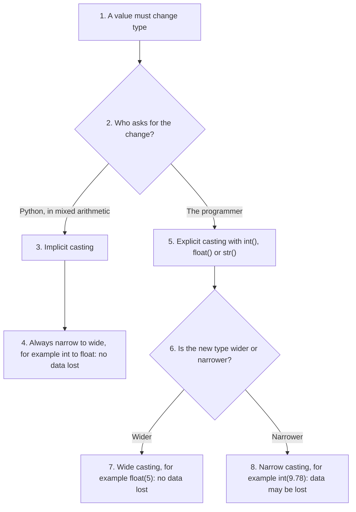
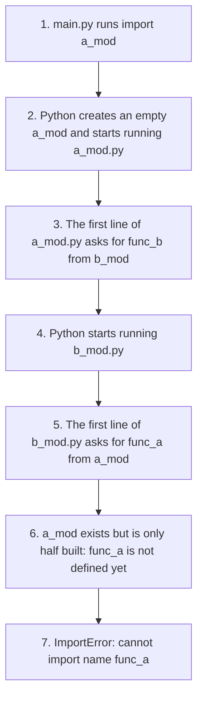
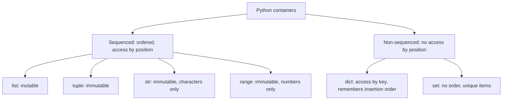
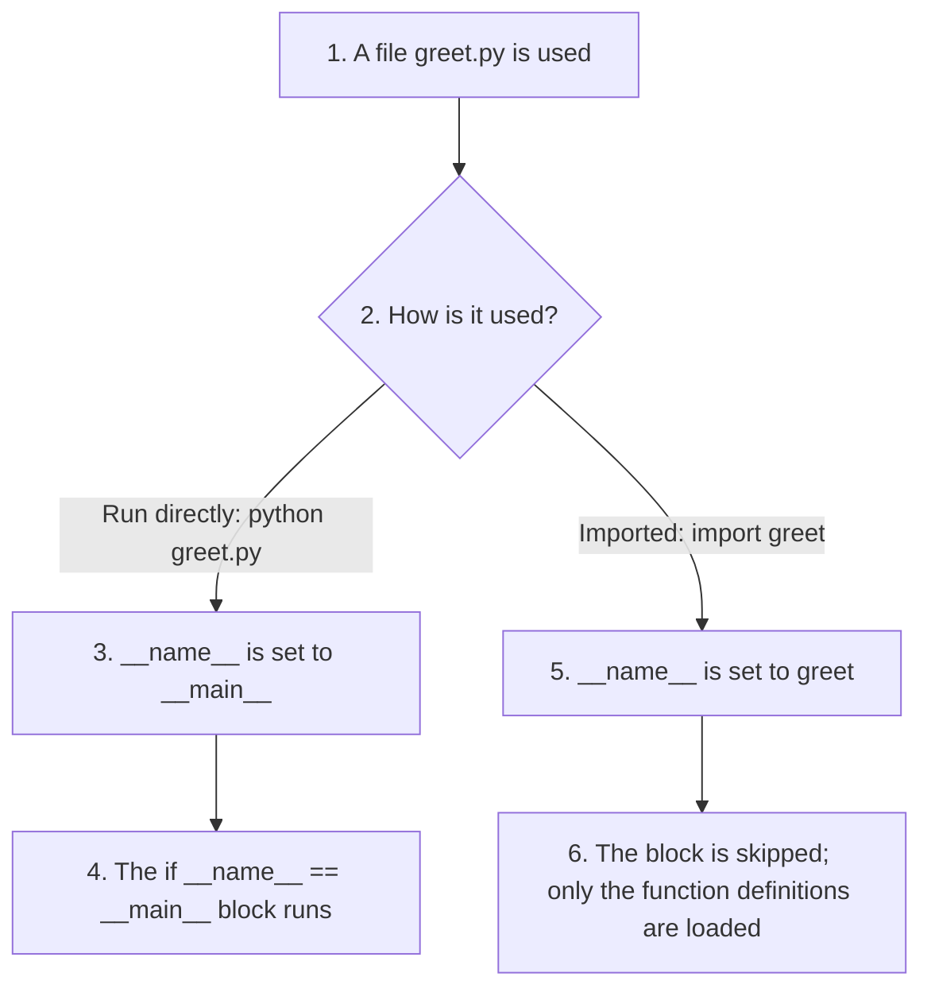

# End-of-Chapter Questions and Answers: Chapter 2, Python Basics II

This page gives full answers to the end-of-chapter questions (a to v) of **Chapter 2: Python Data Types**. The questions cover the whole chapter:

* numbers, literals and variables,
* strings and indexing,
* type casting (converting between types),
* `None`,
* containers: lists, tuples, dictionaries and sets,
* mutable and immutable objects,
* modules, imports and `pip`,
* running programs from the command line.

The printed book has space only for short answers. Here each answer is explained step by step, with short scripts and their real output, and with tables and flowcharts where they help. Try each question yourself first, then read the answer. All scripts were run with Python 3.12.

More practice on the same topics is on the pages of [conceptual questions](005-2-ch2-more-conceptual-qa.md) and [script writing questions](005-3-ch2-scripting-qa.md).

## Table of Contents

* [End-of-Chapter Questions and Answers: Chapter 2, Python Basics II](#end-of-chapter-questions-and-answers-chapter-2-python-basics-ii)
  * [Key Terms Used on This Page](#key-terms-used-on-this-page)
  * [a. What is the difference between a numeric literal and a numeric variable?](#a-what-is-the-difference-between-a-numeric-literal-and-a-numeric-variable)
  * [b. How does one convert a number to a string?](#b-how-does-one-convert-a-number-to-a-string)
  * [c. How does one modify a string in place?](#c-how-does-one-modify-a-string-in-place)
  * [d. Best practices for using `import` in a module + Recommended import order](#d-best-practices-for-using-import-in-a-module--recommended-import-order)
    * [d.1 Recommended Import Order (PEP 8)](#d1-recommended-import-order-pep-8)
    * [d.2 Additional Best Practices](#d2-additional-best-practices)
  * [e. Explain type casting, implicit & explicit casting, narrow & wide casting. Give example of data loss.](#e-explain-type-casting-implicit--explicit-casting-narrow--wide-casting-give-example-of-data-loss)
    * [e.1 Type Casting](#e1-type-casting)
    * [e.2 Explicit Casting (done by the programmer)](#e2-explicit-casting-done-by-the-programmer)
    * [e.3 Implicit Casting (done automatically by Python)](#e3-implicit-casting-done-automatically-by-python)
    * [e.4 Narrow Casting (possible data loss)](#e4-narrow-casting-possible-data-loss)
    * [e.5 Wide Casting (no data loss)](#e5-wide-casting-no-data-loss)
    * [e.6 All the Examples in One Script](#e6-all-the-examples-in-one-script)
  * [f. What is the type of data when you divide an integer by another integer?](#f-what-is-the-type-of-data-when-you-divide-an-integer-by-another-integer)
  * [g. What are circular dependencies and circular imports?](#g-what-are-circular-dependencies-and-circular-imports)
    * [g.1 Circular Dependency](#g1-circular-dependency)
    * [g.2 Circular Import Example](#g2-circular-import-example)
    * [g.3 How to Avoid Circular Imports](#g3-how-to-avoid-circular-imports)
  * [h. What are command-line applications? How do you run them? Examples?](#h-what-are-command-line-applications-how-do-you-run-them-examples)
    * [h.1 Examples](#h1-examples)
    * [h.2 Where to Type the Commands](#h2-where-to-type-the-commands)
    * [h.3 Run in a Terminal or Anaconda Prompt](#h3-run-in-a-terminal-or-anaconda-prompt)
    * [h.4 Run in Jupyter Notebook](#h4-run-in-jupyter-notebook)
  * [i. What is the value of the None type data type?](#i-what-is-the-value-of-the-none-type-data-type)
  * [j. Sequenced vs Non-sequenced containers in Python](#j-sequenced-vs-non-sequenced-containers-in-python)
    * [j.1 Sequenced Containers](#j1-sequenced-containers)
    * [j.2 Non-sequenced Containers](#j2-non-sequenced-containers)
  * [k. Why can we think of a tuple as a “read-only list”?](#k-why-can-we-think-of-a-tuple-as-a-read-only-list)
  * [l. Why must dictionary keys be unique?](#l-why-must-dictionary-keys-be-unique)
  * [m. Why is a Python dictionary called a “mapping”?](#m-why-is-a-python-dictionary-called-a-mapping)
  * [n. Why can’t you get a key from a value in a dictionary?](#n-why-cant-you-get-a-key-from-a-value-in-a-dictionary)
  * [o. What are mutable and immutable objects?](#o-what-are-mutable-and-immutable-objects)
    * [o.1 Mutable Objects (can change)](#o1-mutable-objects-can-change)
    * [o.2 Immutable Objects (cannot change)](#o2-immutable-objects-cannot-change)
    * [o.3 Both in One Script](#o3-both-in-one-script)
  * [p. What do “modular programming” and “runnable code” mean?](#p-what-do-modular-programming-and-runnable-code-mean)
    * [p.1 Modular Programming](#p1-modular-programming)
    * [p.2 Runnable Code](#p2-runnable-code)
    * [p.3 Controlling Runnable Code with `__name__`](#p3-controlling-runnable-code-with-__name__)
  * [q. Difference between attributes/methods of a module vs normal variables/functions](#q-difference-between-attributesmethods-of-a-module-vs-normal-variablesfunctions)
    * [q.1 Inside a Module](#q1-inside-a-module)
    * [q.2 Difference](#q2-difference)
  * [r. Difference between literal string and string variable](#r-difference-between-literal-string-and-string-variable)
  * [s. Explain positive and negative indexing in strings. What does index -1 mean?](#s-explain-positive-and-negative-indexing-in-strings-what-does-index--1-mean)
    * [s.1 Positive Indexing (left to right)](#s1-positive-indexing-left-to-right)
    * [s.2 Negative Indexing (right to left)](#s2-negative-indexing-right-to-left)
    * [s.3 Example](#s3-example)
  * [t. What are binary literals in Python?](#t-what-are-binary-literals-in-python)
  * [u. What is “dead code” or “unreachable code”?](#u-what-is-dead-code-or-unreachable-code)
  * [v. What is the `pip` command used for?](#v-what-is-the-pip-command-used-for)

## Key Terms Used on This Page

| Term | Simple meaning | Learn more |
| ---- | -------------- | ---------- |
| Literal | A value written directly in the code, such as `42` or `"Hello"`. | [Literals](https://docs.python.org/3/reference/lexical_analysis.html#literals) |
| Variable | A name that refers to a value stored in memory. | [Python tutorial: numbers](https://docs.python.org/3/tutorial/introduction.html#numbers) |
| Immutable, mutable | Cannot be changed after creation (such as `str`), or can be changed (such as `list`). | [Glossary: immutable](https://docs.python.org/3/glossary.html#term-immutable) |
| Type casting | Converting a value from one type to another. | [Built-in functions](https://docs.python.org/3/library/functions.html) |
| Module | A `.py` file whose code can be imported and reused by other files. | [Modules](https://docs.python.org/3/tutorial/modules.html) |
| Namespace | A separate "space" of names, so that the same name can mean different things in different modules. | [Namespaces](https://docs.python.org/3/tutorial/classes.html#python-scopes-and-namespaces) |
| PEP 8 | The official style guide for Python code. | [PEP 8](https://peps.python.org/pep-0008/) |
| Third-party package | Code written by other people that you install with `pip`, such as NumPy. | [PyPI](https://pypi.org/) |
| Command line (terminal) | A window where you type commands instead of clicking. | [Command-line interface](https://en.wikipedia.org/wiki/Command-line_interface) |
| Hashable | Has a fixed hash value, so it can be a dictionary key. | [Glossary: hashable](https://docs.python.org/3/glossary.html#term-hashable) |

[Back to the Table of Contents](#table-of-contents)

## a. What is the difference between a numeric literal and a numeric variable?

**Answer:**

* A **numeric literal** is an actual number written *directly* in the program, such as `42`, `3.14` or `0b1010`. Its value is fixed; `42` always means forty-two.
* A **numeric variable** is a *name* that refers to a number stored in memory. The name can later refer to a different number.

In `x = 42`:

1. Python reads the literal `42` and creates an integer object with that value.
2. It creates the name `x` and makes it refer to that object.
3. From now on, you can use `x` wherever you want that number.

**Example:**

```python
x = 42  # x is a numeric variable
# 42 is a numeric literal
```

A longer script:

```python
# Step 1: 42 is a numeric literal - the number written directly in the code
# Step 2: x is a numeric variable - a name that now refers to that number
x = 42  # x is a numeric variable
# 42 is a numeric literal

# Step 3: The same literal can be given to many variables
y = 42
print("x =", x, "| y =", y)

# Step 4: A variable can be changed to refer to another number; a literal cannot change
x = x + 8
print("x now =", x)

# Step 5: Numeric literals come in several forms
print(3.14, 2e3, 0b1010, 0xFF, 1_000_000, 3 + 4j)
```

Output:

```text
x = 42 | y = 42
x now = 50
3.14 2000.0 10 255 1000000 (3+4j)
```

| Literal | Kind of number | Value |
| ------- | -------------- | ----- |
| `42` | Integer | 42 |
| `3.14` | Float | 3.14 |
| `2e3` | Float in scientific notation | 2000.0 |
| `0b1010` | Integer in binary | 10 |
| `0xFF` | Integer in hexadecimal | 255 |
| `1_000_000` | Integer with underscores for readability | 1000000 |
| `3 + 4j` | Complex number | (3+4j) |

[Back to the Table of Contents](#table-of-contents)

## b. How does one convert a number to a string?

Use the built-in **`str()`** constructor. A constructor is a function that builds a new object of a type; `str()` builds a string.

```python
# Step 1: Start with a number
num = 55

# Step 2: Convert it to a string with str()
text = str(num)

# Step 3: Check the value and the type
print(text)          # Output: 55  (print shows a string without quotes)
print(repr(text))    # Output: '55' (repr shows the quotes)
print(type(text))    # Output: <class 'str'>

# Step 4: Now it can be joined with other text
print("Roll number: " + text)

# Step 5: Other ways to turn a number into text
print(f"Roll number: {num}")          # f-string
print(format(3.14159, ".2f"))         # formatted to 2 decimal places
```

Output:

```text
55
'55'
<class 'str'>
Roll number: 55
Roll number: 55
3.14
```

Note that `print(text)` shows `55` without quotes, even though `text` is a string. `print()` always shows text without its quotes. Use `repr()` or `type()` when you want to be sure that a value is a string.

Why convert? Because Python will not join a string and a number with `+` (see question e). After `str()`, the number becomes text and can be joined. An f-string does the conversion for you.

[Back to the Table of Contents](#table-of-contents)

## c. How does one modify a string in place?

**Answer:**

You **cannot** modify a string in place, because **strings are immutable**.

To "modify" a string, you must create a **new** one:

1. Take the parts of the old string that you want to keep (with slicing).
2. Join them with the new parts.
3. Give the result a name. It may be the same name as before.

**Example:**

```python
# Step 1: Create a string
s = "hello"

# Step 2: Try to change one character in place - this fails
try:
    s[0] = "H"
except TypeError as error:
    print("TypeError:", error)   # strings are immutable

# Step 3: Correct way - build a NEW string and give it the same name
s = "H" + s[1:]
print(s)   # Hello

# Step 4: String methods also return new strings
print(s.replace("l", "L"))
print(s)   # the original is unchanged
```

Output:

```text
TypeError: 'str' object does not support item assignment
Hello
HeLLo
Hello
```

String methods such as `replace()`, `upper()` and `strip()` follow the same rule. They return a new string and leave the original unchanged.

[Back to the Table of Contents](#table-of-contents)

## d. Best practices for using `import` in a module + Recommended import order

[Back to the Table of Contents](#table-of-contents)

### d.1 Recommended Import Order (PEP 8)

1. **Standard library modules** (they come with Python, such as `os` and `sys`)
2. **Third-party modules** (installed with `pip`, such as `numpy` and `requests`)
3. **Local or project modules** (files you wrote yourself)

Put a blank line between the three groups.

**Example:**

```python
# 1. Standard library
import os
import sys

# 2. Third-party libraries
import numpy as np
import requests

# 3. Local modules
import my_utils
import student_database
```

This example is for layout only. It will run only if NumPy and requests are installed and your own files `my_utils.py` and `student_database.py` exist.

The order makes it easy to see at a glance what a file depends on: what comes with Python, what must be installed, and what is part of your own project.

[Back to the Table of Contents](#table-of-contents)

### d.2 Additional Best Practices

* **Avoid `from module import *`.** It copies every public name from the module into your file. You cannot tell where a name came from, and a name can silently replace one you already had (see the script below).
* **Use explicit imports for clarity**, such as `import math` or `from math import sqrt`.
* **Group imports at the top of the file**, after any comment or docstring at the start of the module.
* **Keep imports alphabetically sorted** within each group (optional but recommended). A tool called [isort](https://pycqa.github.io/isort/) can do this for you.
* **Import one module per line**: `import os` and `import sys` on separate lines, not `import os, sys`.

The danger of `from module import *`:

```python
# Step 1: A "star import" copies every public name from math into our program
from math import *

# Step 2: math has its own pow(), which now hides the built-in pow()
print(pow(2, 3))     # 8.0 - math.pow always returns a float

# Step 3: With an explicit import, it is always clear which one you mean
import math
import builtins
print(math.pow(2, 3))        # 8.0 from the math module
print(builtins.pow(2, 3))    # 8 from the built-in function
```

Output:

```text
8.0
8.0
8
```

After `from math import *`, the name `pow` means `math.pow`, which always returns a float. Code later in the file that expected the built-in `pow()` now gets `8.0` instead of `8`, with no warning.

[Back to the Table of Contents](#table-of-contents)

## e. Explain type casting, implicit & explicit casting, narrow & wide casting. Give example of data loss.

[Back to the Table of Contents](#table-of-contents)

### e.1 Type Casting

**Type casting** means converting one data type to another, for example turning the text `"123"` into the number `123`.

| Kind | Who does it | Example | Data lost? |
| ---- | ----------- | ------- | ---------- |
| Explicit | The programmer | `int("123")` | Depends on the conversion |
| Implicit | Python, automatically | `5 + 2.0`: the `5` becomes `5.0` | No |
| Wide (widening) | Either | `float(5)` gives `5.0` | No |
| Narrow (narrowing) | The programmer | `int(9.78)` gives `9` | Yes |

[Back to the Table of Contents](#table-of-contents)

### e.2 Explicit Casting (done by the programmer)

```python
x = "123"
y = int(x)
# Explicit cast string → int
```

You call a conversion function such as `int()`, `float()` or `str()` on purpose.

[Back to the Table of Contents](#table-of-contents)

### e.3 Implicit Casting (done automatically by Python)

```python
x = 5  # x is of type int
y = 2.0  # y is float
z = x + y
# x remains as 5, i.e. an int
# But in the expression (x + y), x is promoted to float first and then added to y
print(z)  # Gives a float 7.0
```

Python converts the narrower type to the wider type only while it works out the expression. The variable `x` itself stays an `int`.

[Back to the Table of Contents](#table-of-contents)

### e.4 Narrow Casting (possible data loss)

```python
val = int(9.78)
print(val)  # 9 → decimal part lost
```

`int()` cuts off the decimal part. It does not round, so `9.78` becomes `9`, not `10`. This is the **data loss** that the question asks about.

[Back to the Table of Contents](#table-of-contents)

### e.5 Wide Casting (no data loss)

```python
val = float(5)
print(val)  # 5.0
```

[Back to the Table of Contents](#table-of-contents)

### e.6 All the Examples in One Script

The script also shows a second, less obvious example of data loss. A float holds only about 16 significant digits, so a very large integer changes when it is turned into a float.

```python
# Step 1: Explicit casting (done by the programmer)
x = "123"
y = int(x)          # Explicit cast string -> int
print("Explicit:", y, type(y))

# Step 2: Implicit casting (done automatically by Python)
x = 5               # x is of type int
y = 2.0             # y is float
z = x + y
# x remains as 5, i.e. an int.
# But in the expression (x + y), x is promoted to float first and then added to y
print("Implicit:", z, type(z))     # Gives a float 7.0
print("x is still:", x, type(x))

# Step 3: Narrow casting (possible data loss)
val = int(9.78)
print("Narrow:", val)   # 9 -> decimal part lost

# Step 4: Wide casting (no data loss)
val = float(5)
print("Wide:", val)     # 5.0

# Step 5: A second example of data loss - a very large int into a float
big = 12345678901234567890
print("Big int:     ", big)
print("As a float:  ", int(float(big)))   # the last digits have changed
```

Output:

```text
Explicit: 123 <class 'int'>
Implicit: 7.0 <class 'float'>
x is still: 5 <class 'int'>
Narrow: 9
Wide: 5.0
Big int:      12345678901234567890
As a float:   12345678901234567168
```



[Back to the Table of Contents](#table-of-contents)

## f. What is the type of data when you divide an integer by another integer?

**Always float**, when you use the `/` operator.

```python
print(type(7 / 2))  # <class 'float'>
```

```python
# Step 1: True division of two integers always gives a float
print(type(7 / 2))   # <class 'float'>
print(7 / 2)         # 3.5
print(8 / 2)         # 4.0 - still a float, even though the answer is whole

# Step 2: Floor division of two integers gives an int
print(type(7 // 2))  # <class 'int'>
print(7 // 2)        # 3
```

Output:

```text
<class 'float'>
3.5
4.0
<class 'int'>
3
```

| Expression | Name of operator | Result | Type of result |
| ---------- | ---------------- | ------ | -------------- |
| `7 / 2` | True division | `3.5` | `float` |
| `8 / 2` | True division | `4.0` | `float` (even for a whole-number answer) |
| `7 // 2` | Floor division | `3` | `int` |
| `8 // 2` | Floor division | `4` | `int` |

[Back to the Table of Contents](#table-of-contents)

## g. What are circular dependencies and circular imports?

[Back to the Table of Contents](#table-of-contents)

### g.1 Circular Dependency

A circular dependency is when:

* Module A requires Module B, and
* Module B requires Module A.

A **circular import** is what happens in the code when each module imports the other.

[Back to the Table of Contents](#table-of-contents)

### g.2 Circular Import Example

In the simplest form, the two files just import each other:

`a.py`

```python
import b    # importing b in a.py
```

`b.py`

```python
import a    # importing a in b.py
```

Python does **not** get stuck or loop forever here, because it remembers modules that are already being imported (in `sys.modules`). The real problem appears when one module tries to use a **name** from the other before that name has been created. Then Python stops with an `ImportError` or an `AttributeError`. This example shows the error. Save the three files in one folder and run `main.py`:

File `a_mod.py`:

```python
# a_mod.py
from b_mod import func_b      # a_mod needs something from b_mod

def func_a():
    return "A"
```

File `b_mod.py`:

```python
# b_mod.py
from a_mod import func_a      # b_mod needs something from a_mod

def func_b():
    return "B"
```

File `main.py`:

```python
# main.py - try to import a module that is part of a circle
try:
    import a_mod
except ImportError as error:
    print("ImportError:", error)
```

Output (the path at the end shows where the file is on your computer):

```text
ImportError: cannot import name 'func_a' from partially initialized module 'a_mod' (most likely due to a circular import) (path/to/your/folder/a_mod.py)
```

What happens, step by step:



[Back to the Table of Contents](#table-of-contents)

### g.3 How to Avoid Circular Imports

* **Redesign the modules** so that the dependency goes one way only. Often the shared code can move into a third module that both of them import. This is the best fix.
* **Combine the modules** if they are so closely linked that they belong together.
* **Move imports inside functions**, so that the import happens only when the function runs, after both modules have finished loading. This is a quick fix, shown below.

File `a_mod.py`:

```python
# a_mod.py (fixed)
def func_a():
    return "A"

def use_b():
    from b_mod import func_b      # import moved inside the function
    return "a_mod used " + func_b()
```

File `b_mod.py`:

```python
# b_mod.py (fixed)
def func_b():
    return "B"

def use_a():
    from a_mod import func_a      # import moved inside the function
    return "b_mod used " + func_a()
```

File `main.py`:

```python
# main.py - both modules now import without trouble
import a_mod
import b_mod

print(a_mod.use_b())
print(b_mod.use_a())
```

Output:

```text
a_mod used B
b_mod used A
```

[Back to the Table of Contents](#table-of-contents)

## h. What are command-line applications? How do you run them? Examples?

**Answer:**

A **command-line application** is a program that you run by typing its name, and sometimes some extra words (called arguments), in a terminal window. It has no buttons or menus. It reads what you type and prints its results as text.

[Back to the Table of Contents](#table-of-contents)

### h.1 Examples

| Command | What it does |
| ------- | ------------ |
| `python` | Runs Python programs, or starts the interactive Python shell |
| `pip` | Installs and manages Python packages (see question v) |
| `git` | Keeps track of versions of your code |
| `conda` | Manages Anaconda packages and environments |
| `ipconfig` (Windows) / `ifconfig` or `ip addr` (Linux, macOS) | Shows your computer's network settings |
| `ping` | Checks whether another computer on the network replies |

[Back to the Table of Contents](#table-of-contents)

### h.2 Where to Type the Commands

| System | Terminal to use |
| ------ | --------------- |
| Windows | Command Prompt, PowerShell or Anaconda Prompt (search for it in the Start menu) |
| macOS | Terminal (in Applications, Utilities) |
| Linux | Terminal |
| VS Code | The built-in terminal (View menu, Terminal) |
| Jupyter Notebook | A code cell, with the command starting with `!` or `%` |

[Back to the Table of Contents](#table-of-contents)

### h.3 Run in a Terminal or Anaconda Prompt

1. Open the terminal.
2. Go to the folder that holds your script with the `cd` command, for example `cd Documents\python`.
3. Type the command and press Enter.

```text
python myscript.py
pip install numpy
```

On Windows, if `python` is not found, try `py myscript.py`. On macOS and Linux, you may need `python3`.

For example, with this `myscript.py`:

```python
# myscript.py - a tiny command-line program
import sys

print("Hello from myscript.py")
print("Python version:", sys.version.split()[0])
```

Running `python myscript.py` prints (the version number depends on your Python):

```text
Hello from myscript.py
Python version: 3.12.3
```

[Back to the Table of Contents](#table-of-contents)

### h.4 Run in Jupyter Notebook

Prefix the command with `!` to send it to the system's command line:

```python
!pip install numpy
!python myscript.py
```

For installing packages, the "magic" command `%pip` is better than `!pip`, because it always installs into the same Python that your notebook is using:

```python
%pip install numpy
```

[Back to the Table of Contents](#table-of-contents)

## i. What is the value of the None type data type?

The `NoneType` data type has only **one value**: `None`. It represents **no value**, **empty** or **missing data**.

```python
x = None
print(type(x))  # <class 'NoneType'>
```

A longer script:

```python
# Step 1: None is the one and only value of the type NoneType
x = None
print(x)
print(type(x))  # <class 'NoneType'>

# Step 2: A function that has nothing to give back returns None
result = print("printing...")    # print() itself returns None
print(result)

# Step 3: Test for None with "is"
print(x is None)
```

Output:

```text
None
<class 'NoneType'>
printing...
None
True
```

Step 2 shows a common surprise. `print()` shows text on the screen, but the value it **returns** is `None`. Any function without a `return` statement also returns `None`.

[Back to the Table of Contents](#table-of-contents)

## j. Sequenced vs Non-sequenced containers in Python

[Back to the Table of Contents](#table-of-contents)

### j.1 Sequenced Containers

* Order is maintained.
* Items can be accessed by index (position number).
* They support slicing.

Examples:

* `list`
* `tuple`
* `str`
* `range`

[Back to the Table of Contents](#table-of-contents)

### j.2 Non-sequenced Containers

* Items cannot be accessed by index (position number).
* No slicing.

Examples:

* `dict`: items are reached by **key**. Since Python 3.7, a dictionary does remember the order in which keys were added, but you still cannot ask for "the item at position 0".
* `set`: no order at all, and no indexing. Items are only checked for membership.

```python
# Step 1: Sequenced containers can be indexed
print([10, 20, 30][0], (10, 20, 30)[1], "abc"[2], range(5)[3])

# Step 2: A dictionary keeps insertion order, but is looked up by key, not position
d = {"b": 2, "a": 1}
print(list(d))          # ['b', 'a'] - the order you inserted them
print(d["a"])           # look up by key
try:
    d[0]
except KeyError as error:
    print("KeyError:", error)   # 0 is treated as a key, not a position

# Step 3: A set has no order and no indexing
numbers = {1, 2, 3}
try:
    numbers[0]
except TypeError as error:
    print("TypeError:", error)
```

Output:

```text
10 20 c 3
['b', 'a']
1
KeyError: 0
TypeError: 'set' object is not subscriptable
```



[Back to the Table of Contents](#table-of-contents)

## k. Why can we think of a tuple as a “read-only list”?

Because:

* Tuples are ordered, like lists.
* Tuples support indexing and slicing.
* Tuples support iteration (going through the items with a `for` loop).
* But tuples **cannot be modified**: they are immutable.

So you can read a tuple in every way you can read a list, but you cannot write to it.

```python
# Step 1: A tuple and a list with the same items
colours_list = ["red", "green", "blue"]
colours_tuple = ("red", "green", "blue")

# Step 2: Both are ordered, both support indexing and iteration
print(colours_list[1], colours_tuple[1])
for c in colours_tuple:
    print(c, end=" ")
print()

# Step 3: Only the list can be changed
colours_list[0] = "yellow"
print(colours_list)
try:
    colours_tuple[0] = "yellow"
except TypeError as error:
    print("TypeError:", error)
```

Output:

```text
green green
red green blue 
['yellow', 'green', 'blue']
TypeError: 'tuple' object does not support item assignment
```

The comparison is not perfect. A tuple has only two methods, `count()` and `index()`, while a list has many. And if a tuple holds a mutable object, such as a list, that inner object can still change.

[Back to the Table of Contents](#table-of-contents)

## l. Why must dictionary keys be unique?

Because dictionaries look up values by **key**, and a lookup must return **exactly one** value.

If duplicate keys existed, Python would not know which value to return.

So Python enforces the rule for you: if you use the same key twice, the second value simply **replaces** the first. There is no error.

```python
# Step 1: Write the same key twice
marks = {"Asha": 70, "Ravi": 65, "Asha": 90}

# Step 2: Python keeps only one "Asha" - the last value wins
print(marks)
print(len(marks))

# Step 3: Assigning to an existing key replaces its value
marks["Ravi"] = 80
print(marks["Ravi"])
```

Output:

```text
{'Asha': 90, 'Ravi': 65}
2
80
```

Values do not have to be unique. Many keys may share the same value.

[Back to the Table of Contents](#table-of-contents)

## m. Why is a Python dictionary called a “mapping”?

Because it **maps** each key to a value:

```text
key → value
```

This is just like a mapping (function) in mathematics:

```text
f(x) = y
```

| Mathematics | Dictionary |
| ----------- | ---------- |
| Input `x` | Key |
| Output `y` | Value |
| Each input gives exactly one output | Each key has exactly one value |
| Two inputs may give the same output | Two keys may have the same value |

For example, in `capitals = {"India": "New Delhi", "Japan": "Tokyo"}`, the key `"India"` maps to the value `"New Delhi"`. Python's documentation lists `dict` under [mapping types](https://docs.python.org/3/library/stdtypes.html#mapping-types-dict).

[Back to the Table of Contents](#table-of-contents)

## n. Why can’t you get a key from a value in a dictionary?

A dictionary is built for **one direction** only: from key to value. There is no direct lookup from value to key, because:

* Values may **not be unique**, so a reverse lookup could have more than one answer.
* Values do not have to be hashable, so they cannot be indexed the way keys are.
* The only way to go from value to key is to **search** through every item, which is slow for a large dictionary.

**Example:**

```python
d = {"a": 10, "b": 10}
```

Which key belongs to the value 10? Both `"a"` and `"b"` have the value 10, so the answer is ambiguous.

You **can** still find keys by searching, as the script shows. If all the values are unique, you can also build a second, reversed dictionary.

```python
d = {"a": 10, "b": 10, "c": 20}

# Step 1: Key -> value is a direct lookup
print(d["a"])

# Step 2: Value -> key needs a search through every item
keys_for_10 = [key for key, value in d.items() if value == 10]
print(keys_for_10)       # two keys have the value 10

# Step 3: If the values are unique, you can build a reversed dictionary
prices = {"pen": 10, "book": 250}
reverse = {value: key for key, value in prices.items()}
print(reverse[250])
```

Output:

```text
10
['a', 'b']
book
```

[Back to the Table of Contents](#table-of-contents)

## o. What are mutable and immutable objects?

[Back to the Table of Contents](#table-of-contents)

### o.1 Mutable Objects (can change)

* `list`
* `dict`
* `set`

```python
lst = [1, 2]
lst.append(3)  # allowed
```

[Back to the Table of Contents](#table-of-contents)

### o.2 Immutable Objects (cannot change)

* `int`
* `float`
* `str`
* `tuple`

Also `bool`, `complex`, `frozenset` and `None`.

```python
s = "hello"
# s[0] = "H"   # Not allowed
```

[Back to the Table of Contents](#table-of-contents)

### o.3 Both in One Script

```python
# Step 1: Mutable - a list can be changed in place
lst = [1, 2]
lst.append(3)   # allowed
print(lst)

# Step 2: Immutable - a string cannot be changed in place
s = "hello"
try:
    s[0] = "H"   # not allowed
except TypeError as error:
    print("TypeError:", error)
```

Output:

```text
[1, 2, 3]
TypeError: 'str' object does not support item assignment
```

Why it matters: only immutable (hashable) objects can be dictionary keys or set items, and a mutable object shared by two names can be changed through either name.

[Back to the Table of Contents](#table-of-contents)

## p. What do “modular programming” and “runnable code” mean?

[Back to the Table of Contents](#table-of-contents)

### p.1 Modular Programming

Modular programming means breaking a big program into smaller, reusable files called **modules**. Each module handles one job, for example one for reading data, one for calculations and one for printing reports. This makes the program easier to understand, test, fix and reuse.

[Back to the Table of Contents](#table-of-contents)

### p.2 Runnable Code

Runnable code is code at the top level of a module (not inside a function or class). It **runs as soon as the module is imported**.

**Example:**

Suppose you have a file `mymodule.py` whose contents are as follows:

```python
# Inside mymodule.py
print("Hello World!")
```

Now in another file, say `test.py`, you import the module `mymodule.py` as follows:

```python
# Inside test.py
import mymodule
```

The moment you import `mymodule`, the line `print("Hello World!")` is executed and you get this output:

```text
Hello World!
```

[Back to the Table of Contents](#table-of-contents)

### p.3 Controlling Runnable Code with `__name__`

Usually, you do not want a module to print things or start work just because it was imported. Python gives every module a variable called `__name__`. When the file is run directly, `__name__` is `"__main__"`. When it is imported, `__name__` is the module's name. So code placed under `if __name__ == "__main__":` runs only when the file is run directly.

File `greet.py`:

```python
# greet.py - a module that is safe to import

def greet(name):
    return f"Hello, {name}!"

# Step 1: This block runs only when greet.py is run directly,
# not when it is imported by another file
if __name__ == "__main__":
    print("Running greet.py directly")
    print(greet("World"))
```

Running `python greet.py` directly prints:

```text
Running greet.py directly
Hello, World!
```

File `test2.py`:

```python
# test2.py
import greet                  # nothing is printed during the import
print(greet.greet("Asha"))    # we choose when to use the function
```

Running `python test2.py` prints only:

```text
Hello, Asha!
```



[Back to the Table of Contents](#table-of-contents)

## q. Difference between attributes/methods of a module vs normal variables/functions

[Back to the Table of Contents](#table-of-contents)

### q.1 Inside a Module

```python
import math
print(math.pi)  # pi is an attribute of the math module
print(math.sqrt(25))  # sqrt() is a function of the math module
```

The names inside a module are usually called its **attributes**. Its functions, such as `sqrt()`, are strictly called *functions*, not *methods*. The word "method" is used for a function that belongs to an object, such as `list.append()`.

[Back to the Table of Contents](#table-of-contents)

### q.2 Difference

| Module attributes and functions | Normal variables and functions |
| ------------------------------- | ------------------------------ |
| Are *namespaced*: reached with dot notation, such as `math.pi` | Are used by their name alone, such as `pi` |
| Are loaded through the import system | Are created when your own file runs |
| Can live in separate files and be reused by many programs | Exist only within the program (file) where they are defined, unless another file imports it |

Because each module has its own namespace, the same name can be used in both places without a clash:

```python
import math

# Step 1: Names inside a module are reached with the dot
print(math.pi)          # pi is an attribute (a value) of the math module
print(math.sqrt(25))    # sqrt() is a function of the math module

# Step 2: A normal variable and function, defined in this file
pi = 3.14
def sqrt(n):
    return "my own sqrt of " + str(n)

# Step 3: They do not clash with the module's names
print(pi, math.pi)
print(sqrt(25), math.sqrt(25))
```

Output:

```text
3.141592653589793
5.0
3.14 3.141592653589793
my own sqrt of 25 5.0
```

[Back to the Table of Contents](#table-of-contents)

## r. Difference between literal string and string variable

**Literal string:** text written directly in quotes.

```python
"Hello"    # literal string
```

**String variable:** a name that refers to a string.

```python
msg = "Hello"    # msg is a string variable
```

Both give you a string. The difference is **how they appear in the code**. A literal is the value itself, and it never changes. A variable is a name, and it can later refer to a different string.

```python
# Step 1: A literal string is text written directly in quotes
print("Hello")          # "Hello" is a literal string

# Step 2: A string variable is a name that refers to a string
msg = "Hello"           # msg is a string variable
print(msg)

# Step 3: A variable can later refer to a different string
msg = "Goodbye"
print(msg)
```

Output:

```text
Hello
Hello
Goodbye
```

[Back to the Table of Contents](#table-of-contents)

## s. Explain positive and negative indexing in strings. What does index -1 mean?

[Back to the Table of Contents](#table-of-contents)

### s.1 Positive Indexing (left to right)

```text
H  e  l  l  o
0  1  2  3  4
```

The first character has index 0, and the last has index `len(s) - 1`.

[Back to the Table of Contents](#table-of-contents)

### s.2 Negative Indexing (right to left)

```text
 H  e  l  l  o
-5 -4 -3 -2 -1
```

* Index `-1` means the **last character**.
* Index `-2` means the second last, and so on.

| Character | H | e | l | l | o |
| --------- | - | - | - | - | - |
| Positive index | 0 | 1 | 2 | 3 | 4 |
| Negative index | -5 | -4 | -3 | -2 | -1 |

[Back to the Table of Contents](#table-of-contents)

### s.3 Example

```python
s = "Hello"

# Step 1: Positive indexes count from the left, starting at 0
print(s[0], s[4])

# Step 2: Negative indexes count from the right, starting at -1
print(s[-1])   # gives o which is the last character at index [-1]
print(s[-5])   # gives H, the first character

# Step 3: -1 is a shortcut for len(s) - 1
print(s[len(s) - 1])
```

Output:

```text
H o
o
H
o
```

A negative index `-k` always means the same as `len(s) - k`. So `-1` is a short way of writing `len(s) - 1`. The same indexing works for lists and tuples.

[Back to the Table of Contents](#table-of-contents)

## t. What are binary literals in Python?

Binary literals are numbers written in **binary** (base 2, using only the digits 0 and 1), with the prefix **`0b`** or **`0B`**.

```python
print(0b1010)       # 10
print(bin(10))      # 0b1010 - so binary 0b1010 is the same as decimal 10
print(type(bin(10)))    # bin() returns a string
print(0B1111)       # 15 - capital B also works
print(0b1010 + 1)   # 11 - a binary literal is an ordinary int
```

Output:

```text
10
0b1010
<class 'str'>
15
11
```

How `0b1010` becomes 10:

| Binary digit | 1 | 0 | 1 | 0 |
| ------------ | - | - | - | - |
| Place value | 8 | 4 | 2 | 1 |
| Contribution | 8 | 0 | 2 | 0 |

8 + 0 + 2 + 0 = 10. A binary literal is an ordinary `int`; the prefix only tells Python how to read what you typed. In the same way, `0o` starts an octal literal and `0x` a hexadecimal one.

[Back to the Table of Contents](#table-of-contents)

## u. What is “dead code” or “unreachable code”?

Dead code is code that **will never execute**, whatever input the program gets.

**Example:**

```python
def f():
    return
    print("I will never run")  # dead code
```

`return` ends the function immediately, so the line after it can never be reached.

```python
# Step 1: Code after return never runs
def f():
    return "done"
    print("I will never run")   # dead code

print(f())

# Step 2: Code in a branch whose condition is always False never runs
DEBUG = False
if DEBUG:
    print("Debug information")   # unreachable while DEBUG is False
print("End of program")
```

Output:

```text
done
End of program
```

Common causes of dead code:

1. Lines after `return`, `break`, `continue` or `raise` in the same block.
2. An `if` whose condition can never be true.
3. Old functions that nothing calls any more.

Dead code does no harm to the result, but it confuses readers and often hides a bug. Delete it. Code editors such as VS Code usually show unreachable code in a faded colour.

[Back to the Table of Contents](#table-of-contents)

## v. What is the `pip` command used for?

**pip = Python Package Installer.**

It is used to install, update and remove Python packages. By default it downloads them from the [Python Package Index (PyPI)](https://pypi.org/), a free online store of hundreds of thousands of packages.

**Examples** (type these in a terminal, not inside Python):

```text
pip install numpy
pip install requests
pip uninstall pandas
pip list
```

| Command | What it does |
| ------- | ------------ |
| `pip install numpy` | Downloads and installs NumPy |
| `pip install --upgrade numpy` | Updates NumPy to the newest version |
| `pip uninstall pandas` | Removes pandas (it asks you to confirm with `y`) |
| `pip list` | Lists all installed packages and their versions |
| `pip show numpy` | Shows details of one package |
| `pip --version` | Shows which pip, and which Python, you are using |

Tips:

* If your computer has more than one Python, `python -m pip install numpy` makes sure the package goes into the Python you actually run.
* In Anaconda, you can also use `conda install numpy`.
* In a Jupyter notebook, use `%pip install numpy` (see question h).

[Back to the Table of Contents](#table-of-contents)

