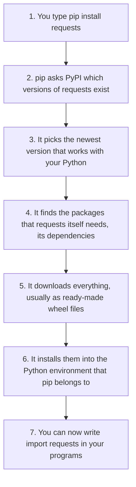
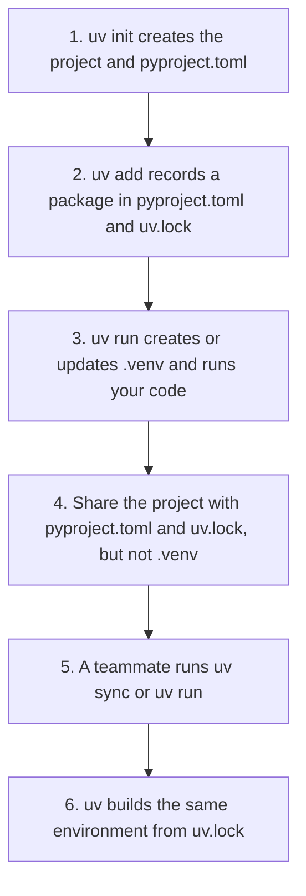
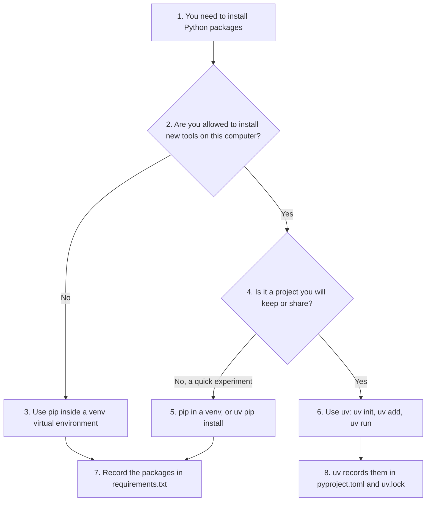
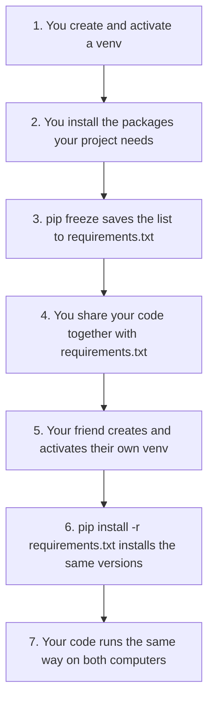

# Beyond the Textbook: Installing and Managing Python Packages with pip, uv and requirements.txt

Python comes with a large **standard library**: modules such as `math`, `random` and `os` that are ready to use as soon as Python is installed. But much of Python's real power comes from **packages** written by other people: NumPy and pandas for data, Matplotlib for charts, Flask and Django for websites, and hundreds of thousands more. They live on the [Python Package Index (PyPI)](https://pypi.org/), a free online store of Python packages.

Chapter 2 shows how to `import` modules. This page goes beyond the textbook and explains how to **get** the packages you want to import, and how to keep them organised. It covers three topics:

1. **`pip`**, the standard tool for installing packages, and **virtual environments**, which keep each project's packages separate.
2. **`uv`**, a newer and much faster tool that does the job of `pip`, `venv` and several other tools in one.
3. **`requirements.txt`**, the classic way to record the packages a project needs, so that someone else can set up the same project.

All the commands on this page are typed in a **terminal** (Command Prompt, PowerShell or Anaconda Prompt on Windows; Terminal on macOS and Linux), not at the Python `>>>` prompt. The terminal sessions shown are real runs. Your version numbers will usually be newer, because packages are updated all the time.

## Table of Contents

* [Beyond the Textbook: Installing and Managing Python Packages with pip, uv and requirements.txt](#beyond-the-textbook-installing-and-managing-python-packages-with-pip-uv-and-requirementstxt)
  * [Key Terms Used on This Page](#key-terms-used-on-this-page)
  * [1. Study `pip` (short for "Pip Installs Packages"), the Standard Package Manager for Python](#1-study-pip-short-for-pip-installs-packages-the-standard-package-manager-for-python)
    * [1.1 What is `pip`?](#11-what-is-pip)
    * [1.2 Common Commands (The Basics)](#12-common-commands-the-basics)
    * [1.3 Virtual Environments](#13-virtual-environments)
    * [1.4 Common Errors and How to Fix Them](#14-common-errors-and-how-to-fix-them)
    * [1.5 Dos and Don'ts](#15-dos-and-donts)
  * [2. The Modern Alternative: `uv`](#2-the-modern-alternative-uv)
    * [2.1 Introduction to `uv`](#21-introduction-to-uv)
    * [2.2 Installing `uv`](#22-installing-uv)
    * [2.3 Common Commands](#23-common-commands)
    * [2.4 A Complete `uv` Project, Step by Step](#24-a-complete-uv-project-step-by-step)
    * [2.5 Common Errors and Fixes](#25-common-errors-and-fixes)
    * [2.6 Dos and Don'ts](#26-dos-and-donts)
    * [2.7 Comparison Table: `pip` vs `uv`](#27-comparison-table-pip-vs-uv)
  * [3. What is `requirements.txt`](#3-what-is-requirementstxt)
    * [3.1 Understanding `requirements.txt`](#31-understanding-requirementstxt)
    * [3.2 Common Commands](#32-common-commands)
    * [3.3 Common Usage and Syntax](#33-common-usage-and-syntax)
    * [3.4 Common Errors and Fixes](#34-common-errors-and-fixes)
    * [3.5 Dos and Don'ts](#35-dos-and-donts)
    * [3.6 Modern Alternatives (The "New Standards")](#36-modern-alternatives-the-new-standards)
    * [3.7 Summary](#37-summary)

## Key Terms Used on This Page

| Term | Simple meaning | Learn more |
| ---- | -------------- | ---------- |
| Package (library) | A collection of Python modules that someone has shared, such as `requests` or `numpy`. | [Python Packaging User Guide](https://packaging.python.org/en/latest/) |
| PyPI | The Python Package Index, the online store from which `pip` and `uv` download packages. | [pypi.org](https://pypi.org/) |
| Package manager | A tool that downloads, installs, updates and removes packages for you. | [Package manager](https://en.wikipedia.org/wiki/Package_manager) |
| Dependency | A package that another package needs in order to work. `requests`, for example, depends on `urllib3`. | [Glossary](https://packaging.python.org/en/latest/glossary/) |
| Virtual environment | A separate folder with its own copy of Python's package space, used by one project only. | [venv](https://docs.python.org/3/library/venv.html) |
| PATH | The list of folders where your computer looks for programs when you type a command. | [PATH variable](https://en.wikipedia.org/wiki/PATH_(variable)) |
| Version pinning | Writing down one exact version of a package, such as `requests==2.34.2`. | [Version specifiers](https://packaging.python.org/en/latest/specifications/version-specifiers/) |
| Lock file | A file that records the exact version of every package in a project, including dependencies of dependencies. | [PEP 751](https://peps.python.org/pep-0751/) |
| `pyproject.toml` | The standard settings file of a modern Python project: its name, version and dependencies. | [Writing your pyproject.toml](https://packaging.python.org/en/latest/guides/writing-pyproject-toml/) |
| Wheel | A ready-to-install package file (ending in `.whl`) that needs no building. | [Glossary: wheel](https://packaging.python.org/en/latest/glossary/#term-Wheel) |
| Rust | A fast programming language. `uv` is written in Rust, which is one reason it is so quick. | [rust-lang.org](https://www.rust-lang.org/) |

[Back to the Table of Contents](#table-of-contents)

## 1. Study `pip` (short for "Pip Installs Packages"), the Standard Package Manager for Python

[Back to the Table of Contents](#table-of-contents)

### 1.1 What is `pip`?

`pip` (Pip Installs Packages) is the tool that lets you download and install libraries that other people have written, like `pandas` for data or `flask` for websites. It comes with Python, so if you have Python you almost certainly have `pip`. (The name is a joke: the "P" in "Pip" stands for "Pip" itself.)

> **Analogy:** If Python is the smartphone, `pip` is the **App Store**. It is how you get new features that did not come with the phone.

What happens when you type `pip install requests`:



Step 6 is important: `pip` installs into **one particular Python**. If your computer has more than one Python, or you use virtual environments (section 1.3), always check which one you are installing into.

[Back to the Table of Contents](#table-of-contents)

### 1.2 Common Commands (The Basics)

| Goal | Command |
| ---- | ------- |
| Install a package | `pip install <package_name>` |
| Install a particular version | `pip install <package_name>==<version>` |
| Upgrade a package | `pip install --upgrade <package_name>` |
| Uninstall a package | `pip uninstall <package_name>` |
| List everything installed | `pip list` |
| Show details of one package | `pip show <package_name>` |
| Save your list for others | `pip freeze > requirements.txt` |
| Install everything on a list | `pip install -r requirements.txt` |
| Check that installed packages work together | `pip check` |
| See which pip (and which Python) you are using | `pip --version` |

Replace `<package_name>` with the real name, without the angle brackets, for example `pip install pandas`.

**Tip:** writing `python -m pip` instead of `pip`, for example `python -m pip install pandas`, makes sure that the package goes into the same Python that runs when you type `python`. It also works when the plain `pip` command is not found. On Windows you can use `py -m pip`.

[Back to the Table of Contents](#table-of-contents)

### 1.3 Virtual Environments

A **virtual environment** is a private package space for one project. Think of these as "project rooms". Installing everything globally is like throwing all your clothes in one giant pile; a virtual environment gives you a separate closet for every project. Then project A can use pandas 2 while project B still uses pandas 1, and neither gets in the other's way.

Python has a built-in tool for this, called [`venv`](https://docs.python.org/3/library/venv.html). The steps are:

1. Go to your project folder in the terminal.
2. Create the environment: `python -m venv .venv` (this makes a folder called `.venv`).
3. **Activate** it, so that `python` and `pip` now mean the ones inside `.venv`.
4. Install packages. They go into `.venv` only.
5. When you are finished, type `deactivate`.

| System | Command to activate |
| ------ | ------------------- |
| Windows, Command Prompt | `.venv\Scripts\activate` |
| Windows, PowerShell | `.venv\Scripts\Activate.ps1` |
| macOS and Linux | `source .venv/bin/activate` |

A real session on Linux. The `$` is the prompt; you type what follows it. After activation, the prompt starts with `(.venv)` to remind you that the environment is active:

```text
$ mkdir myproj
$ cd myproj
$ python -m venv .venv
$ source .venv/bin/activate
(.venv) $ python -m pip install requests
Installing collected packages: urllib3, idna, charset_normalizer, certifi, requests
Successfully installed certifi-2026.7.22 charset_normalizer-3.5.1 idna-3.20 requests-2.34.2 urllib3-2.8.0
(.venv) $ pip list
Package            Version
------------------ ---------
certifi            2026.7.22
charset-normalizer 3.5.1
idna               3.20
pip                24.0
requests           2.34.2
urllib3            2.8.0
(.venv) $ deactivate
$
```

(Before the last two lines, `pip` also prints several `Collecting ...` and `Downloading ...` lines while it works. They are left out here to save space.)

Notice that asking for one package, `requests`, installed five. The other four are its dependencies. `pip` found and installed them automatically.

On Windows the same session looks like this, with `.venv\Scripts\activate` in place of the `source` line:

```text
C:\Users\YourName\myproj> python -m venv .venv
C:\Users\YourName\myproj> .venv\Scripts\activate
(.venv) C:\Users\YourName\myproj> python -m pip install requests
```

If you use Anaconda, `conda create` and `conda activate` do the same job with conda environments.

[Back to the Table of Contents](#table-of-contents)

### 1.4 Common Errors and How to Fix Them

| Error message | Cause | Fix |
| ------------- | ----- | --- |
| `'pip' is not recognized as an internal or external command` | Python's folder was not added to your system's `PATH` during installation, so the computer cannot find `pip`. | Use `python -m pip install ...` (or `py -m pip install ...` on Windows). Or reinstall Python and tick the box **"Add Python to PATH"**. |
| `Permission denied` (or `EACCES`) | You are trying to install into a folder that only administrators can change. | Use a **virtual environment** (best). Or install just for yourself with `pip install --user <package_name>`. |
| `error: externally-managed-environment` | Newer Linux systems and Homebrew Python on macOS protect the system's own Python from `pip` (a rule called [PEP 668](https://peps.python.org/pep-0668/)). | Create and activate a virtual environment, then install. Do not force it with `--break-system-packages`. |
| `WARNING: You are using pip version X; however, version Y is available.` | A newer `pip` has been released. | This is just a friendly reminder, not an error. Run `python -m pip install --upgrade pip` to update the tool itself. |
| `ModuleNotFoundError: No module named 'requests'` when you run your program | The package was installed into a different Python or environment from the one running your program. | Activate the right environment, or install with `python -m pip` using the same `python` that runs your program. |

[Back to the Table of Contents](#table-of-contents)

### 1.5 Dos and Don'ts

**Dos:**

* **Use virtual environments (`venv`)** for every project, as described in section 1.3.
* **Check the spelling.** `pip install request` (singular) is a different package from `pip install requests` (plural). Criminals sometimes upload harmful packages with names one letter away from popular ones, hoping for typing mistakes. Copy the name from the package's page on [PyPI](https://pypi.org/) if you are unsure.
* **Use `python -m pip`** when you have more than one Python on your computer.

**Don'ts:**

* **Don't use `sudo pip`.** If you are on macOS or Linux, never run `pip` with `sudo` (administrator rights). It can break your operating system's built-in Python, which the system itself depends on.
* **Don't ignore `requirements.txt`.** If you are sharing code with a friend, always include this file so they can install exactly what you used (see section 3).

[Back to the Table of Contents](#table-of-contents)

## 2. The Modern Alternative: `uv`

[Back to the Table of Contents](#table-of-contents)

### 2.1 Introduction to `uv`

**`uv`** is an extremely fast Python package and project manager, written in Rust by the company [Astral](https://astral.sh/). It first appeared in 2024 and has been taken up very quickly; many professional teams now use it in place of the older tools. It replaces several tools (`pip`, `venv`, `pyenv`, `pipx` and `pip-tools`) with one single program.

**Why are people switching to `uv`?**

* **Speed:** Its makers measure it as **10 to 100 times faster** than `pip`, especially when the packages are already in its cache.
* **Automatic virtual environments:** It creates and uses a project's environment for you, without any "activate" step.
* **Disk space:** It keeps one **global cache** of downloaded packages. If you have five projects using pandas, `uv` stores pandas once and links it into each project, where `pip` would install five separate copies.
* **Python versions:** It can download and install Python itself, in whichever version a project needs.
* **Lock files:** It records the exact version of every package in a file called `uv.lock`, so that every computer gets the same set.

[Back to the Table of Contents](#table-of-contents)

### 2.2 Installing `uv`

`uv` does not come with Python, so you install it once. The official ways are:

| System | Command |
| ------ | ------- |
| Windows (PowerShell) | `powershell -ExecutionPolicy ByPass -c "irm https://astral.sh/uv/install.ps1 \| iex"` |
| Windows (WinGet) | `winget install --id=astral-sh.uv -e` |
| macOS and Linux | `curl -LsSf https://astral.sh/uv/install.sh \| sh` |
| macOS (Homebrew) | `brew install uv` |
| Any system with Python | `pip install uv` or `pipx install uv` |

After installing, close and reopen the terminal, then check with `uv --version`. See the [uv installation guide](https://docs.astral.sh/uv/getting-started/installation/) for details.

[Back to the Table of Contents](#table-of-contents)

### 2.3 Common Commands

| Command | What it does |
| ------- | ------------ |
| `uv init <name>` | Creates a new project folder with a `pyproject.toml` file, a starter `main.py` and a few other files. |
| `uv add <package>` | Installs a package AND adds it to your project file automatically. |
| `uv remove <package>` | Uninstalls a package and removes it from your project file. |
| `uv run <script.py>` | Runs your code in the project's virtual environment, creating or updating it first if needed. There is no need to "activate" anything. |
| `uv sync` | Makes the environment match `uv.lock` exactly. A teammate runs this after downloading your project. |
| `uv tree` | Shows your packages and the packages they depend on, as a tree. |
| `uv python install 3.12` | Downloads and installs a specific version of Python itself. |
| `uv pip install -r requirements.txt` | A "compatibility mode" that works like the old `pip` command, only faster. |
| `uvx <tool>` | Runs a command-line tool, such as the code checker `ruff`, without adding it to your project. |

[Back to the Table of Contents](#table-of-contents)

### 2.4 A Complete `uv` Project, Step by Step

This is a real session on Linux. The lines starting with `$` are what you type; everything else is what `uv` prints. The output on Windows is the same apart from the prompt and the folder names.

**Step 1: Create a project.**

```text
$ uv init hello --python 3.12
Initialized project `hello` at `/home/yourname/hello`
$ cd hello
```

The new folder contains `pyproject.toml`, `main.py`, `README.md`, `.python-version` (which records the Python version) and `.gitignore`. The file `pyproject.toml` looks like this:

```toml
[project]
name = "hello"
version = "0.1.0"
description = "Add your description here"
readme = "README.md"
requires-python = ">=3.12"
dependencies = []
```

**Step 2: Run the starter program.** The first `uv run` creates the virtual environment `.venv` by itself:

```text
$ uv run main.py
Using CPython 3.12.3 interpreter at: /usr/bin/python3.12
Creating virtual environment at: .venv
Hello from hello!
```

**Step 3: Add a package.**

```text
$ uv add requests
Resolved 6 packages in 332ms
Prepared 5 packages in 61ms
Installed 5 packages in 3ms
 + certifi==2026.7.22
 + charset-normalizer==3.5.1
 + idna==3.20
 + requests==2.34.2
 + urllib3==2.8.0
```

"Installed 5 packages in 3ms" shows the speed. `uv` also wrote the new dependency into `pyproject.toml`:

```toml
dependencies = [
    "requests>=2.34.2",
]
```

and created `uv.lock`, which records the exact version of all five packages.

**Step 4: Use the package.** Change `main.py` to:

```python
import requests


def main():
    print("Hello from hello!")
    print("requests version:", requests.__version__)


if __name__ == "__main__":
    main()
```

and run it:

```text
$ uv run main.py
Hello from hello!
requests version: 2.34.2
```

**Step 5: See what is installed.**

```text
$ uv tree
Resolved 6 packages in 2ms
hello v0.1.0
└── requests v2.34.2
    ├── certifi v2026.7.22
    ├── charset-normalizer v3.5.1
    ├── idna v3.20
    └── urllib3 v2.8.0
```



[Back to the Table of Contents](#table-of-contents)

### 2.5 Common Errors and Fixes

| Error | Cause | Fix |
| ----- | ----- | --- |
| `Failed to build ...` with a message such as `fatal error: Python.h: No such file or directory` | The package has parts written in C that must be compiled (built) on your computer, and the build tools or Python's C header files are missing. | First check whether a newer version of the package offers a ready-made wheel for your system. Otherwise, on Windows install *Visual Studio Build Tools*; on Ubuntu Linux run `sudo apt install build-essential python3-dev`. |
| `error: No interpreter found for Python 3.x in managed installations or search path` | `uv` cannot find the Python version the project asks for, and is not allowed to download one. | Run `uv python install 3.x` to let `uv` download it for you. |
| `ImportError: attempted relative import with no known parent package` | A file inside a package folder, using an import such as `from .helpers import x`, was run directly as a script. | Run it as a module from the **root folder** of your project (where `pyproject.toml` is): `uv run python -m mypackage.main`. |
| ``error: No `pyproject.toml` found in current directory or any parent directory`` | A project command such as `uv add` was run outside the project folder. | `cd` into the project folder first, or create a project with `uv init`. |

[Back to the Table of Contents](#table-of-contents)

### 2.6 Dos and Don'ts

**Do:**

* **Use `uv run`.** Stop worrying about `source .venv/bin/activate`. Just type `uv run python script.py` (or `uv run script.py`) and it will use the right environment every time.
* **Commit `uv.lock`.** If you use Git, always upload the `uv.lock` file along with `pyproject.toml`. This ensures your teammates get the *exact* same versions as you. Do **not** upload the `.venv` folder; `uv init` already lists it in `.gitignore`.
* **Use `uvx` for tools.** Want to use a tool like `ruff` or `black` without installing it into your project? Use `uvx ruff check .`. It runs the tool in a separate, temporary environment on your own computer, and caches it for next time.

**Don't:**

* **Don't mix `pip` and `uv` in one project.** Once you start a project with `uv`, avoid `pip install`. A package installed with `pip` is not recorded in `pyproject.toml` or `uv.lock`, so your teammates will not get it, and `uv sync` may remove it. Use `uv add`, or `uv pip install` if you really need pip-style commands.
* **Prefer `uv add` to editing `pyproject.toml` by hand.** `uv add` checks that the new package works with the ones you already have, and updates `uv.lock` at the same time. If you do edit the file yourself, run `uv lock` or `uv sync` afterwards.

[Back to the Table of Contents](#table-of-contents)

### 2.7 Comparison Table: `pip` vs `uv`

| Feature | `pip` | `uv` |
| ------- | ----- | ---- |
| Written in | Python | Rust (much faster) |
| Comes with Python | Yes | No, installed once separately |
| Environment management | Manual (`python -m venv`, then activate) | Automatic |
| Python versions | You install Python yourself | Can install Python for you |
| Lock files | Not traditionally. Recent versions add an experimental [`pip lock`](https://pip.pypa.io/en/stable/cli/pip_lock/) command; otherwise `requirements.txt` or `pip-tools` | Yes, `uv.lock` built in |
| Project file | Not needed | `pyproject.toml` |
| Works with `requirements.txt` | Yes | Yes, through `uv pip` and `uv export` |
| Best for | Learning, quick installs, systems where you cannot add new tools | New projects, teams, anything where speed and repeatable setups matter |



[Back to the Table of Contents](#table-of-contents)

## 3. What is `requirements.txt`

[Back to the Table of Contents](#table-of-contents)

### 3.1 Understanding `requirements.txt`

A `requirements.txt` file is a simple text file that lists all the external libraries (packages) your project needs to run, usually one per line with a version number.

> **Analogy:** If your Python project is a **recipe**, `requirements.txt` is the **shopping list**. It makes sure that anyone else trying to cook your dish buys the same ingredients and brands you used.

[Back to the Table of Contents](#table-of-contents)

### 3.2 Common Commands

| Goal | Command |
| ---- | ------- |
| Create the list | `pip freeze > requirements.txt` |
| Install from the list | `pip install -r requirements.txt` |
| Check that the installed packages work together | `pip check` |

*Note: the `>` symbol in the first command tells the computer: "Take the output of `pip freeze` and save it into this file."* If the file already exists, it is replaced.

`pip check` does not read `requirements.txt`. It looks at the packages already installed and reports any whose dependencies are missing or have the wrong version. When everything is fine, it prints `No broken requirements found.`

A real session, inside the virtual environment created in section 1.3:

```text
(.venv) $ pip freeze
certifi==2026.7.22
charset-normalizer==3.5.1
idna==3.20
requests==2.34.2
urllib3==2.8.0
(.venv) $ pip freeze > requirements.txt
(.venv) $ pip check
No broken requirements found.
```

The second command prints nothing on the screen, because its output went into the file. The file `requirements.txt` now contains exactly the five lines shown by the first command.



[Back to the Table of Contents](#table-of-contents)

### 3.3 Common Usage and Syntax

In your `requirements.txt`, you will see lines like these:

| Line | Meaning |
| ---- | ------- |
| `requests==2.34.2` | Use **exactly** this version |
| `numpy>=1.26.0` | Use this version **or anything newer** |
| `pandas` | Use **any** version; normally the newest that works with your Python |
| `django>=5.0,<6.0` | Any version from 5.0 up to, but not including, 6.0 |
| `flask~=3.1` | A "compatible" version: 3.1 or newer, but below 4.0 |
| `# data tools` | A comment, ignored by `pip` |

**Best practice:** for an application that you run or share, using `==` (version pinning) is the safest way to make sure your code does not break when a library updates six months later. `pip freeze` pins every package in this way automatically.

[Back to the Table of Contents](#table-of-contents)

### 3.4 Common Errors and Fixes

| Error | Cause | Fix |
| ----- | ----- | --- |
| `ERROR: Could not find a version that satisfies the requirement requests==99.0` followed by `ERROR: No matching distribution found for requests==99.0` | A typo in the package name, or a version number that does not exist or does not support your Python version. | Check the spelling and the available versions on [PyPI.org](https://pypi.org). The error message itself lists the versions that do exist. |
| `ERROR: Could not open requirements file: [Errno 2] No such file or directory: 'requirements.txt'` | You are running the command in the wrong folder. | Use `dir` (Windows) or `ls` (macOS, Linux) to check that you are in the same folder as the file, and `cd` there if not. |
| The "dirty" freeze: dozens of packages in the file that your project does not use | You ran `pip freeze` in your global Python instead of in a virtual environment, so it listed everything ever installed on the computer. | Always use a **virtual environment**, so the list contains only what this project needs. |

[Back to the Table of Contents](#table-of-contents)

### 3.5 Dos and Don'ts

**Dos:**

* **Keep it at the root.** Always place `requirements.txt` in the top-level folder of your project.
* **Include it in Git.** Always `git add requirements.txt` so your teammates can use it.
* **Use it for deployment.** Many hosting services, such as Render, Heroku and Streamlit Community Cloud, look for this file to know which packages to install for your app. GitHub also reads it to show your project's dependencies and warn you about packages with known security problems.

**Don'ts:**

* **Don't name it something else.** While you *can* name it `libs.txt`, everyone expects `requirements.txt`. Stick to the standard.
* **Don't put Python itself in there.** This file is only for *packages*. The Python version is recorded separately, for example in `pyproject.toml` (`requires-python = ">=3.12"`) or a `.python-version` file.

[Back to the Table of Contents](#table-of-contents)

### 3.6 Modern Alternatives (The "New Standards")

While `requirements.txt` is the classic way, the industry is moving towards more complete systems:

1. **`pyproject.toml` (the official standard project file):** this is now the recommended place to record a project's name, version and dependencies in one file. Both `uv` and `pip` understand it.
2. **`uv.lock` (with `uv`):** if you use `uv`, it creates a `uv.lock` file. This goes further than `requirements.txt`, because it records the exact version of every package, including the dependencies of dependencies, and a fingerprint (hash) of each file. Every computer then installs the same set, so versions cannot quietly "drift" apart.
3. **`pylock.toml` (the new shared standard):** [PEP 751](https://peps.python.org/pep-0751/) (2025) defines one lock file format that any tool can read and write. `uv` can export it, and `pip` has an experimental `pip lock` command that creates it.
4. **`Pipfile`:** used by the tool `pipenv`, though it is losing popularity to `uv`.

`requirements.txt` is not going away, though. It is simple, every tool understands it, and `uv` can create one from a `uv` project with `uv export --format requirements-txt`.

[Back to the Table of Contents](#table-of-contents)

### 3.7 Summary

* **`pip freeze > requirements.txt`** = "Save my list"
* **`pip install -r requirements.txt`** = "Load the list"
* Do both **inside a virtual environment**, so the list contains only this project's packages.
* With `uv`, the same jobs are done by **`uv add`** (which saves the list automatically) and **`uv sync`** (which loads it).

[Back to the Table of Contents](#table-of-contents)


