# Chapter 3: Operators in Python - Conceptual Questions and Answers

An **operator** is a symbol that tells Python to do something with one or more values. The `+` in `2 + 3` is an operator. So is the `=` in `x = 5` and the `in` in `'a' in 'cat'`. Almost every line of Python you write uses at least one operator, so it is worth learning them well.

This page goes with **Chapter 3 (Operators)** of the book. The printed chapter gives the questions in short form. Here you will find full answers, worked examples, small scripts with their output, and a few extra follow-up questions to test your understanding.

The page covers:

- the assignment operator `=` and why it is not the "equals" sign of mathematics,
- comparison operators such as `==`, `!=`, `<` and `>`,
- membership operators `in` and `not in`,
- identity operators `is` and `is not`,
- floor division `//` and the remainder (modulo) operator `%`, including the tricky case of negative numbers.

Every script on this page can be copied and run as it is. Try to guess the output before you look at the answer. That is the fastest way to learn.

## Table of Contents

- [Before You Start: A Few Key Terms](#before-you-start-a-few-key-terms)
- [Conceptual Questions](#conceptual-questions)
  - [a. What does "assignment" mean in Python? What is the assignment operator?](#a-what-does-assignment-mean-in-python-what-is-the-assignment-operator)
  - [b. Why is `=` an assignment operator, not a mathematical "equals to" symbol?](#b-why-is--an-assignment-operator-not-a-mathematical-equals-to-symbol)
  - [c. Explain membership operators `in` and `not in`.](#c-explain-membership-operators-in-and-not-in)
  - [d. What is the difference between `==` and `is`?](#d-what-is-the-difference-between--and-is)
  - [e. Why can you "assign to a variable" but not "assign to a literal"?](#e-why-can-you-assign-to-a-variable-but-not-assign-to-a-literal)
  - [f. What is floor division? What is its operator?](#f-what-is-floor-division-what-is-its-operator)
  - [g. If dividend is positive but divisor is negative, is remainder positive or negative?](#g-if-dividend-is-positive-but-divisor-is-negative-is-remainder-positive-or-negative)
  - [h. List the six comparison operators in Python.](#h-list-the-six-comparison-operators-in-python)
  - [i. What are identity and membership operators?](#i-what-are-identity-and-membership-operators)
  - [j. Why is it important to understand object identity in Python?](#j-why-is-it-important-to-understand-object-identity-in-python)
  - [k. Why must you be careful using `%` on negative numbers?](#k-why-must-you-be-careful-using--on-negative-numbers)
- [Summary Table](#summary-table)
- [Complete Practice Script](#complete-practice-script)

---

## Before You Start: A Few Key Terms

These words appear again and again on this page. Read them once now, and come back here whenever a word is not clear.

| Term | Simple meaning | Learn more |
| --- | --- | --- |
| Object | Any piece of data Python keeps in memory, such as the number `10`, the text `"Alice"` or the list `[1, 2]`. | [Objects, values and types](https://docs.python.org/3/reference/datamodel.html#objects-values-and-types) |
| Variable (name) | A label that points to an object. It does not hold the object itself. | [Python names and binding](https://docs.python.org/3/reference/executionmodel.html#naming-and-binding) |
| Binding | Connecting a name to an object. `x = 10` binds the name `x` to the object `10`. | [Assignment statements](https://docs.python.org/3/reference/simple_stmts.html#assignment-statements) |
| Literal | A fixed value written directly in code, such as `5`, `3.14`, `"hello"` or `[1, 2]`. | [Literals](https://docs.python.org/3/reference/lexical_analysis.html#literals) |
| Operand | The value an operator works on. In `7 + 2`, the operands are `7` and `2`. | [Operator (programming)](https://en.wikipedia.org/wiki/Operator_(computer_programming)) |
| Collection | A single object that holds many values, such as a string, list, tuple, set or dictionary. | [Built-in types](https://docs.python.org/3/library/stdtypes.html) |
| Mutable / Immutable | A mutable object can be changed after it is created (lists, dictionaries, sets). An immutable object cannot (numbers, strings, tuples). | [Mutable and immutable objects](https://docs.python.org/3/glossary.html#term-mutable) |
| Boolean | A value that is either `True` or `False`. | [Boolean values](https://docs.python.org/3/library/stdtypes.html#boolean-type-bool) |
| Dividend and divisor | In `7 / 2`, `7` is the dividend (the number being divided) and `2` is the divisor (the number you divide by). | [Division (Wikipedia)](https://en.wikipedia.org/wiki/Division_(mathematics)) |
| Quotient and remainder | In `7 / 2`, the whole-number quotient is `3` and the remainder is `1`, because `7 = 2 x 3 + 1`. | [Remainder (Wikipedia)](https://en.wikipedia.org/wiki/Remainder) |

[Back to the Table of Contents](#table-of-contents)

---

## Conceptual Questions

The questions below are the same as in the printed book. Each answer explains the idea in steps, shows an example script, and gives the output you should see.

[Back to the Table of Contents](#table-of-contents)

---

### a. What does "assignment" mean in Python? What is the assignment operator?

**Answer**

- **Assignment** means giving a name to a value so that you can use it later.
- Python uses the **assignment operator** `=` for this. The name goes on the left and the value goes on the right.
- Strictly speaking, Python does not put the value "inside" the variable like a box. It creates the value as an **object** in memory and then makes the variable a **name that points to** that object. This is called **binding**.

**How Python carries out `x = 10`, step by step**

1. Python looks at the right side first and works out its value. Here it is simply `10`.
2. Python creates (or finds) an object in memory for the value `10`.
3. Python binds the name `x` on the left side to that object.
4. From now on, whenever you write `x`, Python gives you the object `10`.

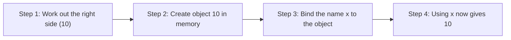

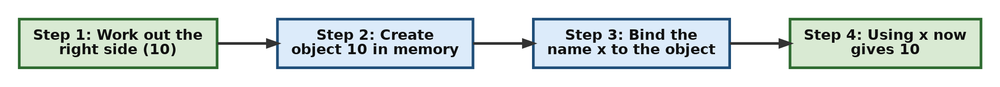

**Example**

```python
# Step 1: Assign simple values to two names
x = 10          # the name x now points to the object 10
name = "Alice"  # the name 'name' now points to the text "Alice"

# Step 2: Use the names
print(x)
print(name)

# Step 3: The right side is worked out FIRST, then assigned
y = x + 5       # Python first calculates x + 5 (which is 15), then binds y to 15
print(y)

# Step 4: A name can be re-assigned to a new value at any time
x = 20          # x now points to a new object, 20. The old value 10 is no longer used by x.
print(x)
```

**Output**

```text
10
Alice
15
20
```

**Follow-up question:** What will `a = b = 0` do?

It assigns the same value to both names in one line. Python works out `0` and binds both `a` and `b` to it.

```python
# Step 1: Assign one value to two names at once (chained assignment)
a = b = 0
print(a, b)

# Step 2: Assign two values to two names at once (multiple assignment)
p, q = 3, 4
print(p, q)
```

```text
0 0
3 4
```

[Back to the Table of Contents](#table-of-contents)

---

### b. Why is `=` an assignment operator, not a mathematical "equals to" symbol?

**Answer**

- In mathematics, `=` makes a **statement**: "the left side and the right side are equal". It is true or false, and it works in both directions (`x = 5` means the same as `5 = x`).
- In Python, `=` is an **instruction**: "take the value on the right and bind it to the name on the left". It works in **one direction only**, from right to left.
- It does **not** compare anything, and it does not give back `True` or `False`. It only creates a binding.
- To compare two values, Python uses a different operator: `==` (two equal signs).

**Example**

```python
x = 5        # means "store 5 in x" (bind the name x to 5)
```

**A line that makes no sense in maths but is perfectly fine in Python**

In maths, `x = x + 1` can never be true, because no number is equal to itself plus one. In Python it is one of the most common lines you will write. It means "take the current value of `x`, add 1, and bind `x` to the result".

```python
# Step 1: Start with x = 5
x = 5
print("Before:", x)

# Step 2: Right side is worked out first (5 + 1 = 6), then x is re-bound to 6
x = x + 1
print("After:", x)

# Step 3: Compare values with == (this gives True or False)
print(x == 6)
print(x == 5)
```

**Output**

```text
Before: 5
After: 6
True
False
```

**Quick comparison**

| Symbol | Name | What it does | Gives back |
| --- | --- | --- | --- |
| `=` | Assignment operator | Binds a name to a value | Nothing (it is a statement) |
| `==` | Equality operator | Checks whether two values are the same | `True` or `False` |

[Back to the Table of Contents](#table-of-contents)

---

### c. Explain membership operators `in` and `not in`.

**Answer**

- Membership operators check whether a value is present inside a **collection**, such as a string, list, tuple, set or dictionary.
- `in` gives `True` if the value is found, and `False` if it is not.
- `not in` is the opposite. It gives `True` if the value is **not** found.
- For a **string**, `in` checks for a piece of text (a substring), not only a single character. So `'at' in 'cat'` is `True`.
- For a **dictionary**, `in` checks the **keys**, not the values. If you want to search the values, use `.values()`.

**Example**

```python
'a' in 'cat'          # True
5 in [1, 2, 3, 5]     # True
'a' not in ['x','y']  # True
```

For dictionaries, `in` checks **keys**, not values.

```python
'apple' in {'a': 'apple'}     # False
'a' in {'a': 'apple'}         # True
```

**Script with output**

```python
# Step 1: Membership in a string (looks for a piece of text)
print('a' in 'cat')          # 'a' is a character in 'cat'
print('at' in 'cat')         # 'at' appears in 'cat' as a group
print('ct' in 'cat')         # 'c' and 't' are there, but not next to each other

# Step 2: Membership in a list
print(5 in [1, 2, 3, 5])

# Step 3: Using 'not in'
print('a' not in ['x', 'y'])

# Step 4: Membership in a dictionary checks KEYS only
fruits = {'a': 'apple'}
print('apple' in fruits)             # 'apple' is a value, not a key
print('a' in fruits)                 # 'a' is a key
print('apple' in fruits.values())    # search the values instead
```

**Output**

```text
True
True
False
True
True
False
True
True
```

**How Python decides**

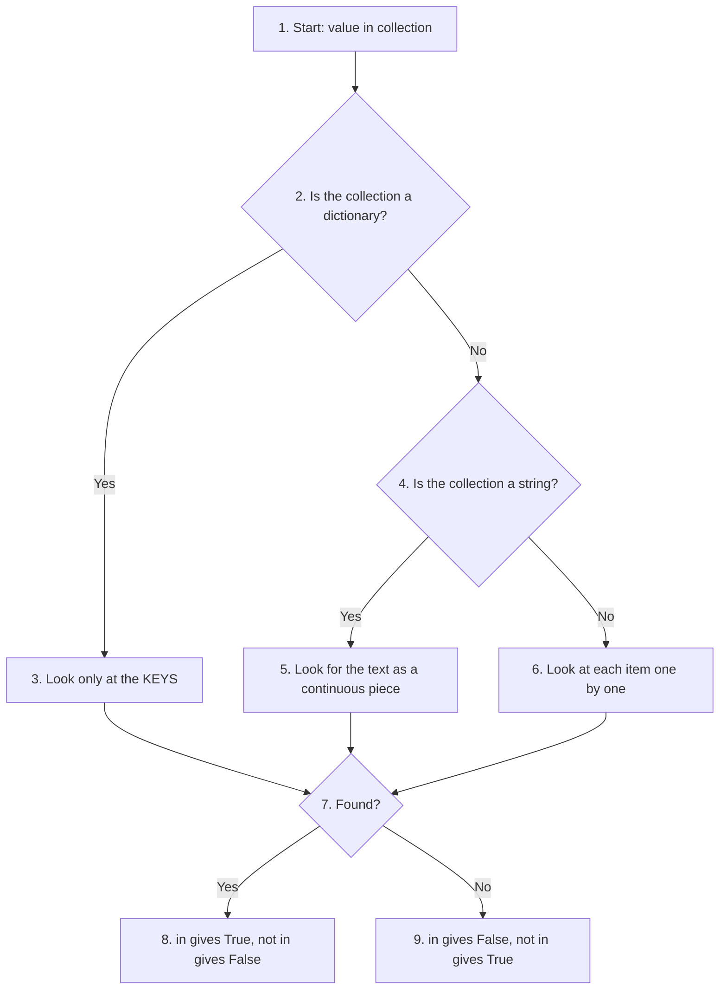

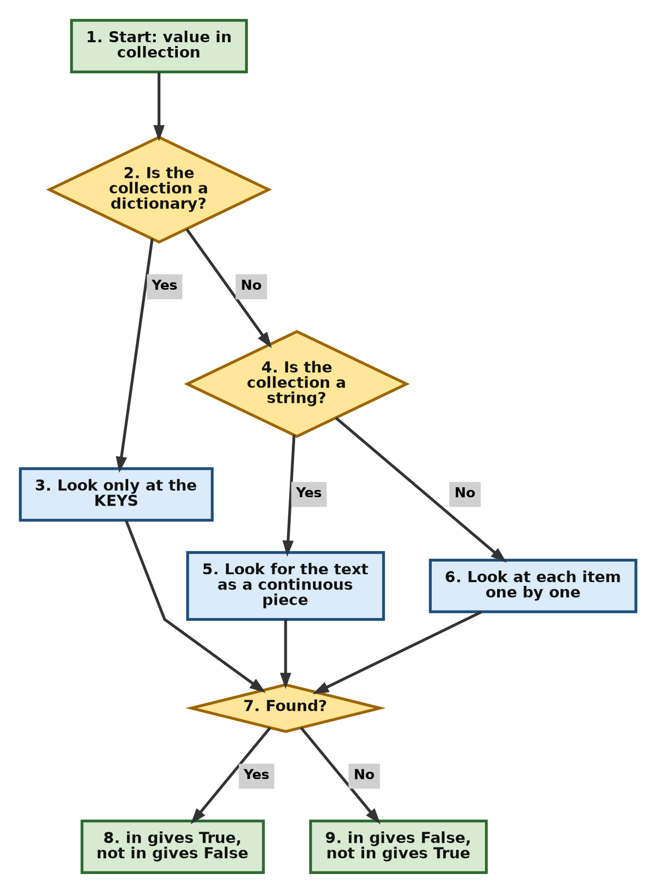

**Follow-up question:** What does `'A' in 'cat'` give, and why?

It gives `False`. Python treats upper-case and lower-case letters as different characters, so `'A'` is not the same as `'a'`.

[Back to the Table of Contents](#table-of-contents)

---

### d. What is the difference between `==` and `is`?

**Answer**

- `==` checks **value equality**. It asks: "Do these two things have the same contents?"
- `is` checks **identity**. It asks: "Are these two names pointing to the very same object in memory?"
- Two objects can have equal values and still be two separate objects. Think of two printed copies of the same book. The words are the same (`==` is `True`), but they are two different books (`is` is `False`).
- You can see an object's identity with the built-in function [`id()`](https://docs.python.org/3/library/functions.html#id). If `a is b` is `True`, then `id(a)` and `id(b)` are the same number.

**Example**

```python
a = [1, 2, 3]
b = [1, 2, 3]
c = a

a == b   # True  (same values)
a is b   # False (different objects)
a is c   # True  (same object)
```

**What memory looks like**

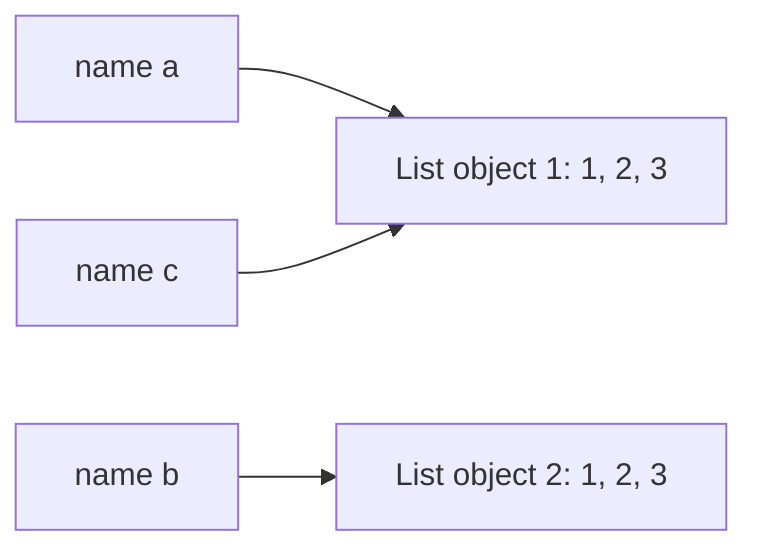

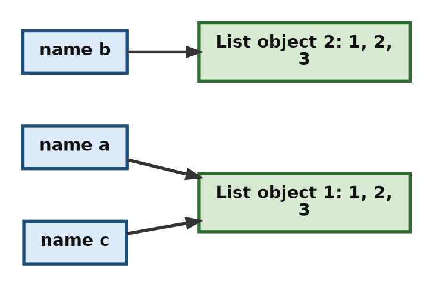

Here `a` and `c` point to the same list, while `b` points to a different list that only looks the same.

**Script with output**

```python
# Step 1: Create two separate lists with the same values
a = [1, 2, 3]
b = [1, 2, 3]

# Step 2: Make c another name for the SAME list as a
c = a

# Step 3: Compare values with ==
print("a == b :", a == b)

# Step 4: Compare identity with is
print("a is b :", a is b)
print("a is c :", a is c)

# Step 5: Confirm using id()
print("Same id for a and c?", id(a) == id(c))
print("Same id for a and b?", id(a) == id(b))
```

**Output**

```text
a == b : True
a is b : False
a is c : True
Same id for a and c? True
Same id for a and b? False
```

**When should you use `is`?**

- Use `==` whenever you want to compare values. This is what you need almost all of the time.
- Use `is` mainly to check for `None`, as in `if result is None:`. `None` is a single special object, so checking its identity is both correct and clear.
- Do not use `is` to compare numbers or strings. Python sometimes reuses the same object for small numbers and short strings, so `is` may give `True` in one case and `False` in another that looks almost the same. Newer versions of Python even show a `SyntaxWarning` if you write something like `x is 5`.

[Back to the Table of Contents](#table-of-contents)

---

### e. Why can you "assign to a variable" but not "assign to a literal"?

**Answer**

- A **variable** is a name. Its whole job is to point to a value, and it can be pointed at a new value at any time.
- A **literal** (like `5`, `"hello"` or `[1, 2]`) **is** a value. It is not a name, so there is nothing to bind. It would also make no sense to change what `5` means.
- Assignment always needs a **name on the left** and a **value on the right**. If the left side is not a name, Python stops with a `SyntaxError` before running any of your code.

**Invalid**

```python
5 = x     # Error
```

**Valid**

```python
x = 5     # variable can store 5
```

**The error you will see**

If you run `5 = x`, Python 3.10 or later shows:

```text
    5 = x
    ^
SyntaxError: cannot assign to literal here. Maybe you meant '==' instead of '='?
```

Notice the helpful hint at the end. Python guesses that you may have wanted to compare with `==`.

**Follow-up question:** Is `x + 1 = 5` allowed?

No. The left side `x + 1` is an expression (a calculation), not a name. Python reports:

```text
SyntaxError: cannot assign to expression here. Maybe you meant '==' instead of '='?
```

The correct way is to keep the name alone on the left: `x = 5 - 1`.

[Back to the Table of Contents](#table-of-contents)

---

### f. What is floor division? What is its operator?

**Answer**

- Floor division divides one number by another and then **rounds the result down** to a whole number.
- "Down" means towards **negative infinity**, that is, to the left on the number line. It does not simply chop off the decimal part.
- In exact terms, the result is the **largest integer less than or equal to the true result**.
- Operator: `//`.

**Steps to work out `a // b` by hand**

1. Divide normally: find `a / b`.
2. If the answer is already a whole number, that is your result.
3. If not, move **left** on the number line to the nearest whole number. That is your result.

**Example**

```python
7 // 2    # 3
7 // -2   # -4  (floors toward negative infinity)
```

- `7 / 2 = 3.5`. Moving left from 3.5, the nearest whole number is **3**.
- `7 / -2 = -3.5`. Moving left from -3.5, the nearest whole number is **-4**, not -3. This surprises many beginners.

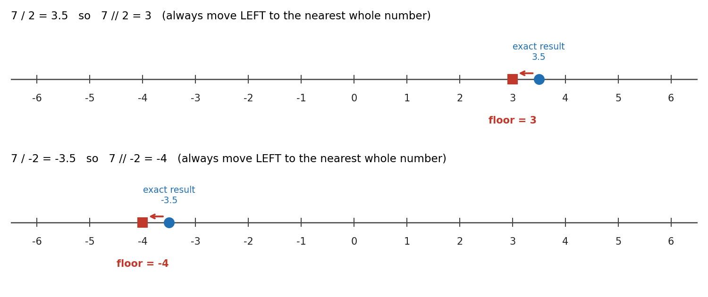

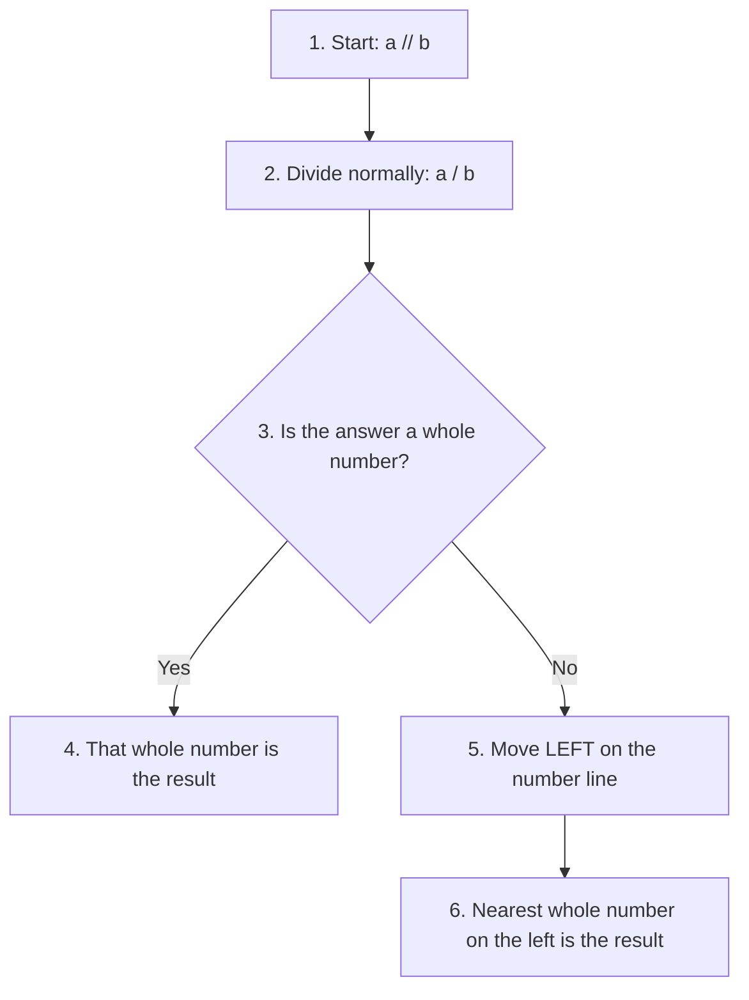

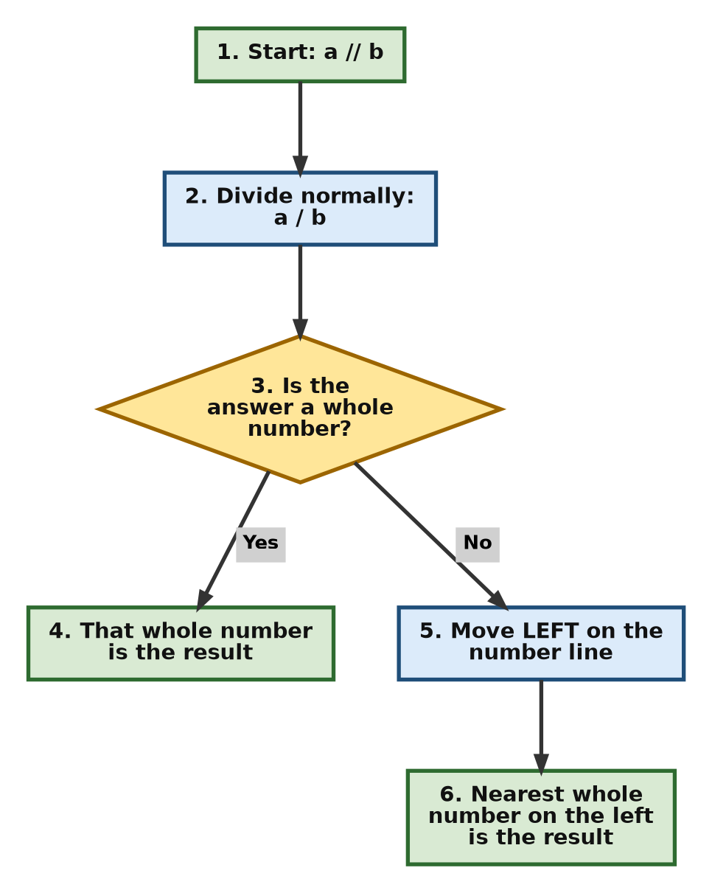

**Script with output**

```python
# Step 1: Ordinary division always gives a float (decimal number)
print(7 / 2)

# Step 2: Floor division with two positive numbers
print(7 // 2)

# Step 3: Floor division with one negative number (rounds DOWN, i.e. to the left)
print(7 // -2)
print(-7 // 2)

# Step 4: If either number is a float, the result is a float, but still floored
print(7.0 // 2)
print(7 // -2.0)
```

**Output**

```text
3.5
3
-4
-4
3.0
-4.0
```

Note from Step 4: when a float is involved, `//` still rounds down, but the answer is shown as a float (`3.0`, not `3`).

**Follow-up question:** What is the difference between `/` and `//`?

| Operator | Name | Result for `7` and `2` | Result for `7` and `-2` | Type of result |
| --- | --- | --- | --- | --- |
| `/` | True division | `3.5` | `-3.5` | Always `float` |
| `//` | Floor division | `3` | `-4` | `int` if both operands are `int`, otherwise `float` |

[Back to the Table of Contents](#table-of-contents)

---

### g. If dividend is positive but divisor is negative, is remainder positive or negative?

**Answer**

- In Python, **the remainder has the same sign as the divisor**.
- So if the divisor is **negative**, the remainder is **negative** (or zero, if the division is exact).
- This is because Python's `//` and `%` always follow one rule together:

  **dividend = divisor x (dividend // divisor) + (dividend % divisor)**

  Since `//` rounds down, the remainder has to "make up the difference", and that forces it to take the sign of the divisor.

**Example**

```python
7 % -3   # -2
```

**Working it out step by step for `7 % -3`**

1. Divide normally: `7 / -3 = -2.33...`
2. Floor it (move left): `7 // -3 = -3`
3. Multiply back, divisor times quotient: `-3 x -3 = 9`
4. Subtract from the dividend: `7 - 9 = -2`
5. So `7 % -3 = -2`. The remainder is negative, like the divisor.

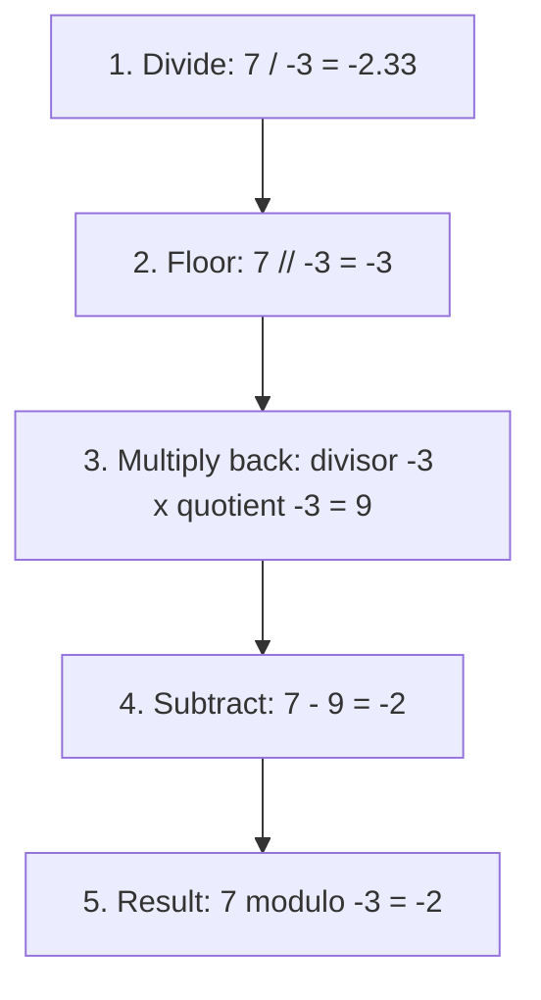

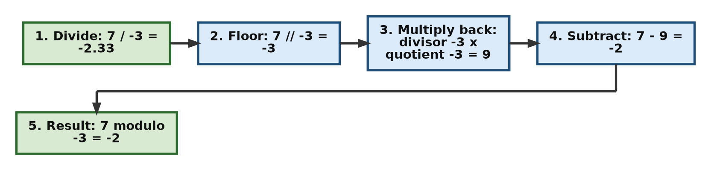

**Script with output**

```python
# Step 1: Positive dividend, negative divisor
dividend = 7
divisor = -3

# Step 2: Find quotient (floor division) and remainder
quotient = dividend // divisor
remainder = dividend % divisor
print("Quotient :", quotient)
print("Remainder:", remainder)

# Step 3: Check the rule: dividend == divisor * quotient + remainder
print("Check    :", divisor * quotient + remainder == dividend)

# Step 4: When the division is exact, the remainder is simply 0
print("6 % -3   =", 6 % -3)
```

**Output**

```text
Quotient : -3
Remainder: -2
Check    : True
6 % -3   = 0
```

**Follow-up question:** Is there a quick way to get both the quotient and the remainder?

Yes. The built-in function [`divmod()`](https://docs.python.org/3/library/functions.html#divmod) returns both as a pair. `divmod(7, -3)` gives `(-3, -2)`.

[Back to the Table of Contents](#table-of-contents)

---

### h. List the six comparison operators in Python.

**Answer**

Comparison operators compare two values and always give back a Boolean: `True` or `False`.

| Operator | Meaning | Example | Result |
| --- | --- | --- | --- |
| `==` | Equal to | `5 == 5` | `True` |
| `!=` | Not equal to | `5 != 3` | `True` |
| `>` | Greater than | `5 > 3` | `True` |
| `<` | Less than | `5 < 3` | `False` |
| `>=` | Greater than or equal to | `5 >= 5` | `True` |
| `<=` | Less than or equal to | `3 <= 2` | `False` |

**Script with output**

```python
# Step 1: Pick two numbers
a = 5
b = 3

# Step 2: Try all six comparison operators
print("a == b :", a == b)
print("a != b :", a != b)
print("a > b  :", a > b)
print("a < b  :", a < b)
print("a >= b :", a >= b)
print("a <= b :", a <= b)
```

**Output**

```text
a == b : False
a != b : True
a > b  : True
a < b  : False
a >= b : True
a <= b : False
```

**Follow-up questions**

1. **Can you chain comparisons?** Yes. `1 < x < 10` means "`x` is greater than 1 **and** less than 10". With `x = 15` it gives `False`. With `x = 5` it gives `True`.
2. **Is `5 == 5.0` true?** Yes. An integer and a float with the same value are equal, so it gives `True`.
3. **Can you compare strings?** Yes. Strings are compared letter by letter in dictionary (alphabetical) order, so `'apple' < 'banana'` is `True`. Note that all upper-case letters come before all lower-case letters, so `'Z' < 'a'` is also `True`.

[Back to the Table of Contents](#table-of-contents)

---

### i. What are identity and membership operators?

**Answer**

- **Identity operators** (`is`, `is not`)
  Check whether two variables refer to the **same object** in memory.

- **Membership operators** (`in`, `not in`)
  Check whether a value exists inside a **collection**.

| Group | Operators | Question it answers | Example | Result |
| --- | --- | --- | --- | --- |
| Identity | `is`, `is not` | Are these the same object? | `x is None` (when `x = None`) | `True` |
| Membership | `in`, `not in` | Is this value inside that collection? | `3 in [1, 2, 3]` | `True` |

Both groups always give back `True` or `False`. See [question c](#c-explain-membership-operators-in-and-not-in) for more on membership and [question d](#d-what-is-the-difference-between--and-is) for more on identity.

**Script with output**

```python
# Step 1: Identity operators
result = None
print(result is None)        # result points to the single None object
print(result is not None)

# Step 2: Membership operators
colours = ['red', 'green', 'blue']
print('green' in colours)
print('pink' not in colours)
```

**Output**

```text
True
False
True
True
```

[Back to the Table of Contents](#table-of-contents)

---

### j. Why is it important to understand object identity in Python?

**Answer**

- Because Python variables store **references** to objects, not the objects themselves. A reference is like an address that tells Python where the object lives in memory.
- When you write `b = a`, Python does **not** make a copy. It only gives the same object a second name.
- With **mutable** objects (lists, dictionaries, sets), a change made through one name is seen through every other name. If you do not expect this, it causes bugs that are hard to find.
- With **immutable** objects (numbers, strings, tuples), this problem does not arise, because the object itself can never change. "Changing" the value always creates a new object.

**Example**

```python
a = [1, 2]
b = a
b.append(3)
print(a)   # [1, 2, 3]  (both refer to same list)
```

**Script with output**

```python
# Step 1: Two names for one list
a = [1, 2]
b = a              # b is NOT a copy; it is another name for the same list
b.append(3)        # change the list through b
print("a:", a)     # a sees the change too
print("b:", b)

# Step 2: Make a real copy when you want a separate list
c = a.copy()       # c is a new list with the same values
c.append(4)        # changing c does not touch a
print("a:", a)
print("c:", c)

# Step 3: Immutable objects behave differently
x = 5
y = x
y = y + 1          # this creates a NEW object 6 and binds y to it
print("x:", x)     # x still points to 5
print("y:", y)
```

**Output**

```text
a: [1, 2, 3]
b: [1, 2, 3]
a: [1, 2, 3]
c: [1, 2, 3, 4]
x: 5
y: 6
```

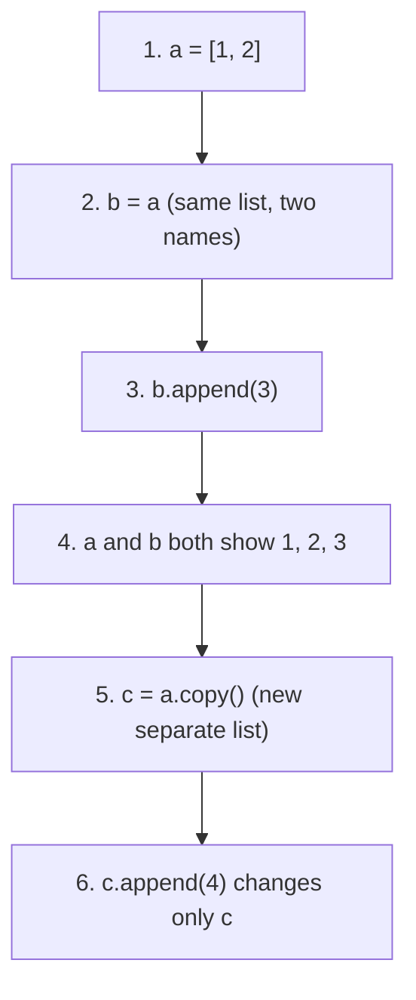

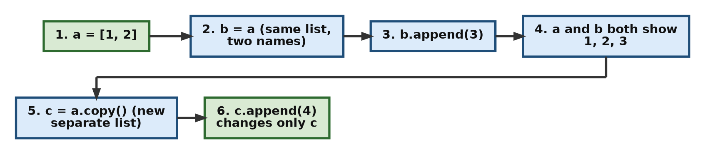

**Follow-up question:** How can you check whether two names share one object?

Use `a is b`, or compare `id(a)` with `id(b)`. If the result is `True`, a change through one name will be seen through the other.

[Back to the Table of Contents](#table-of-contents)

---

### k. Why must you be careful using `%` on negative numbers?

**Answer**

- Because in Python,
  **a % b always has the sign of b (the divisor)**.
- Many other languages, such as C, Java and JavaScript, follow a different rule: there the remainder takes the sign of the **dividend** (the first number). So the same calculation can give a different answer in a different language.
- If you move code from another language to Python, or check a result with a calculator, you may be surprised.

**Example**

```python
-7 % 3    # 2
7 % -3    # -2
```

This differs from languages like C, where the sign follows the **dividend**. For example, in C, `-7 % 3` gives `-1`, but in Python it gives `2`.

**All four sign combinations**

| Numbers (dividend, divisor) | `//` result | `%` result | Check: divisor x quotient + remainder |
| --- | --- | --- | --- |
| `7` and `3` | `7 // 3 = 2` | `7 % 3 = 1` | `3 x 2 + 1 = 7` |
| `-7` and `3` | `-7 // 3 = -3` | `-7 % 3 = 2` | `3 x (-3) + 2 = -7` |
| `7` and `-3` | `7 // -3 = -3` | `7 % -3 = -2` | `-3 x (-3) + (-2) = 7` |
| `-7` and `-3` | `-7 // -3 = 2` | `-7 % -3 = -1` | `-3 x 2 + (-1) = -7` |

Look at the `%` column: the remainder always has the same sign as the divisor (the second number).

**Script with output**

```python
# Step 1: List all four sign combinations of 7 and 3
pairs = [(7, 3), (-7, 3), (7, -3), (-7, -3)]

# Step 2: For each pair, print floor division and remainder
for a, b in pairs:
    print(a, "//", b, "=", a // b, "   ", a, "%", b, "=", a % b)
```

**Output**

```text
7 // 3 = 2     7 % 3 = 1
-7 // 3 = -3     -7 % 3 = 2
7 // -3 = -3     7 % -3 = -2
-7 // -3 = 2     -7 % -3 = -1
```

**Follow-up question:** What if you want the C-style result, where the sign follows the dividend?

Use [`math.fmod()`](https://docs.python.org/3/library/math.html#math.fmod). For example, `math.fmod(-7, 3)` gives `-1.0` and `math.fmod(7, -3)` gives `1.0`. Note that it always returns a float.

**A practical use of Python's rule**

Because `x % n` is never negative when `n` is positive, it is very handy for "wrap-around" problems. For example, `-1 % 7` gives `6`. If the days of the week are numbered 0 to 6, going one day back from day 0 correctly lands on day 6.

[Back to the Table of Contents](#table-of-contents)

---

## Summary Table

| Concept | Explanation | Example |
| --- | --- | --- |
| Assignment | Using `=` to bind a name to a value | `x = 10` |
| `=` vs `==` | `=` assigns, `==` compares and gives `True` or `False` | `x == 10` gives `True` |
| Membership operators | `in`, `not in` test whether a value is present in a collection (keys only, for a dictionary) | `'a' in 'cat'` gives `True` |
| Identity operators | `is`, `is not` test whether two names point to the same object | `a is c` |
| Floor division | `//` divides and rounds down (towards negative infinity) | `7 // -2` gives `-4` |
| Modulo sign rule | The remainder from `%` has the sign of the divisor | `7 % -3` gives `-2` |
| Comparison operators | `==`, `!=`, `<`, `>`, `<=`, `>=` compare two values | `5 >= 5` gives `True` |

[Back to the Table of Contents](#table-of-contents)

---

## Complete Practice Script

This script brings together the main examples from this page. Run it and compare your output with the output given below it.

```python
"""
Chapter 3: Operators - practice script.
Covers membership, identity, floor division and modulo.
"""

# Step 1: Membership examples
print('a' in 'cat')
print(5 in [1, 2, 3, 5])
print('a' not in ['x', 'y'])

# Step 2: Identity examples
a = [1, 2, 3]
b = [1, 2, 3]
c = a                # c is another name for the same list as a
print(a == b)   # True
print(a is b)   # False
print(a is c)   # True

# Step 3: Floor division and modulo
print(7 // 2)
print(7 // -2)
print(7 % -3)
print(-7 % 3)
```

**Output**

```text
True
True
True
True
False
True
3
-4
-2
2
```

[Back to the Table of Contents](#table-of-contents)

---

