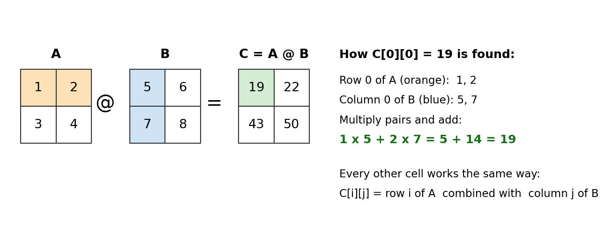
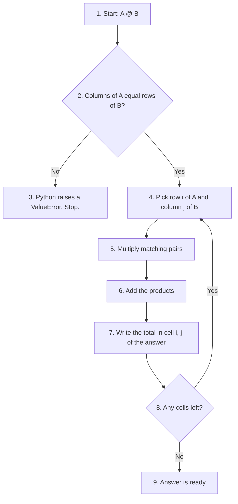
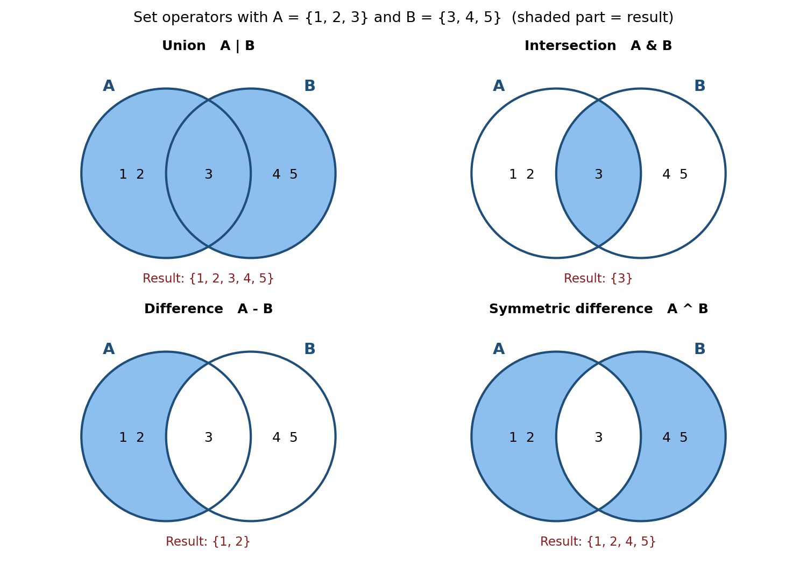
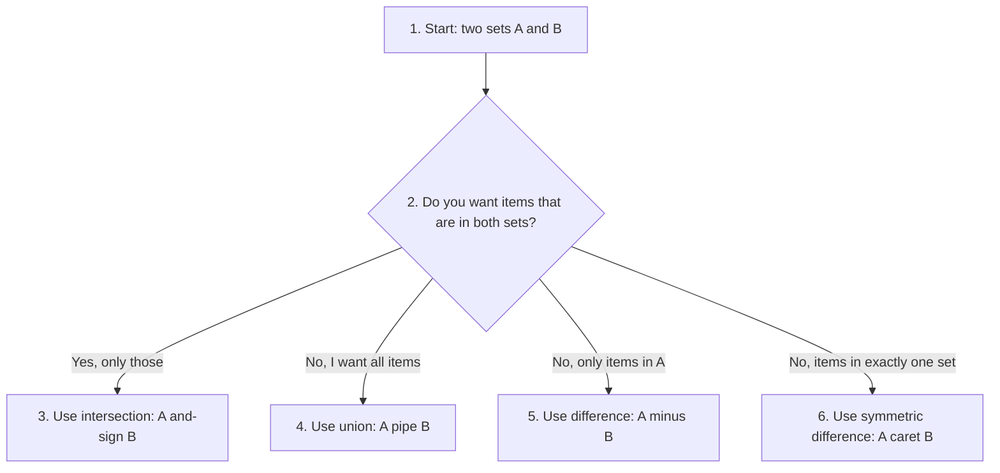

# Chapter 3: Beyond the Text - Matrix Multiplication and Set Operators

Chapter 3 of the book covers the operators you will use every day: arithmetic, assignment, comparison, logical, membership and identity operators. Python has a few more operators that the chapter does not cover in detail. This page looks at two of them:

1. The **matrix multiplication operator** `@`, which is used a lot in data science, machine learning and graphics, mostly with the NumPy library.
2. The **set operators** `|`, `&`, `-` and `^`, which let you combine and compare sets with a single symbol, the same way you would in school mathematics.

Both topics show an important idea about Python operators. The same symbol can do different jobs depending on the type of data it works on. For example, `-` subtracts numbers but finds the "difference" of two sets. And `@` does nothing at all for plain lists, but multiplies matrices when you use NumPy arrays.

Each section explains the idea in simple steps, gives scripts with `# Step` comments, and shows the output you should see. A combined script is given at the end of each section so that you can run everything in one go.

## Table of Contents

- [Before You Start: A Few Key Terms](#before-you-start-a-few-key-terms)
- [1. Matrix Multiplication Operator (@)](#1-matrix-multiplication-operator-)
  - [What Is a Matrix?](#what-is-a-matrix)
  - [How Matrix Multiplication Works](#how-matrix-multiplication-works)
  - [The Script, Step by Step](#the-script-step-by-step)
  - [Complete Script for the @ Operator](#complete-script-for-the--operator)
  - [@ Is Not the Same as *](#-is-not-the-same-as-)
  - [Common Errors with @](#common-errors-with-)
  - [Follow-up Questions on @](#follow-up-questions-on-)
- [2. Set Operators](#2-set-operators)
  - [What Is a Set?](#what-is-a-set)
  - [The Four Set Operators at a Glance](#the-four-set-operators-at-a-glance)
  - [The Script, Operator by Operator](#the-script-operator-by-operator)
  - [Complete Script for Set Operators](#complete-script-for-set-operators)
  - [Operators vs Set Methods](#operators-vs-set-methods)
  - [Follow-up Questions on Set Operators](#follow-up-questions-on-set-operators)
- [Summary Table](#summary-table)

---

## Before You Start: A Few Key Terms

| Term | Simple meaning | Learn more |
| --- | --- | --- |
| Matrix | A grid of numbers arranged in rows and columns, like a small table. The plural is "matrices". | [Matrix (Wikipedia)](https://en.wikipedia.org/wiki/Matrix_(mathematics)) |
| Vector | A single row (or column) of numbers, such as `[5, 6]`. | [Vector (Wikipedia)](https://en.wikipedia.org/wiki/Row_and_column_vectors) |
| Shape | The size of a matrix, written as (rows, columns). A matrix with 2 rows and 3 columns has shape (2, 3). | [NumPy shape](https://numpy.org/doc/stable/reference/generated/numpy.ndarray.shape.html) |
| NumPy | A free, widely used Python library for fast work with numbers, arrays and matrices. It is not part of standard Python and has to be installed. | [NumPy: the absolute basics](https://numpy.org/doc/stable/user/absolute_beginners.html) |
| NumPy array | NumPy's version of a list. It holds numbers in rows and columns and supports fast maths on the whole grid at once. | [NumPy arrays](https://numpy.org/doc/stable/user/absolute_beginners.html#what-is-an-array) |
| Library (module) | Ready-made code written by others that you bring into your program with `import`. | [Python modules](https://docs.python.org/3/tutorial/modules.html) |
| Set | A collection of unique items with no fixed order, written with curly braces, such as `{1, 2, 3}`. | [Python sets](https://docs.python.org/3/tutorial/datastructures.html#sets) |
| Venn diagram | A picture of overlapping circles used to show how groups share items. | [Venn diagram (Wikipedia)](https://en.wikipedia.org/wiki/Venn_diagram) |
| Iterable | Anything you can loop over with `for`, such as a list, tuple, string or set. | [Iterable (Python glossary)](https://docs.python.org/3/glossary.html#term-iterable) |

[Back to the Table of Contents](#table-of-contents)

---

## 1. Matrix Multiplication Operator (@)

> Operator (@) was introduced in Python 3.5. It is useful for matrix and vector multiplications especially in NumPy. Study Matrix Multiplication Operator (`@`)

**Before you run the scripts in this section**

NumPy does not come with Python. If you have not installed it yet, open a terminal (Command Prompt on Windows) and type:

```text
pip install numpy
```

If you use Anaconda, Google Colab or Jupyter from Anaconda, NumPy is already installed.

[Back to the Table of Contents](#table-of-contents)

---

### What Is a Matrix?

A matrix is simply a grid of numbers. The matrix below has 2 rows and 2 columns, so its shape is (2, 2).

```text
A = | 1  2 |    <- row 0
    | 3  4 |    <- row 1
      ^  ^
  col 0  col 1
```

In Python you could store it as a list of lists, `[[1, 2], [3, 4]]`. But plain lists do not know how to do matrix maths. So we turn the list into a **NumPy array** with `np.array(...)`. NumPy arrays understand the `@` operator.

A **vector** is a single line of numbers, such as `v = [5, 6]`. In NumPy, a vector is a one-dimensional array.

[Back to the Table of Contents](#table-of-contents)

---

### How Matrix Multiplication Works

Matrix multiplication is **not** done by multiplying matching cells. Instead, each cell of the answer is made by combining a **row** of the first matrix with a **column** of the second matrix.

**Steps to find one cell of `C = A @ B`**

1. Pick a row from `A` and a column from `B`.
2. Multiply the first number of the row by the first number of the column, the second by the second, and so on.
3. Add all these products together.
4. Write the total in the answer at the same row and column position.
5. Repeat for every row of `A` and every column of `B`.



**Working out `A @ B` by hand**

With `A = [[1, 2], [3, 4]]` and `B = [[5, 6], [7, 8]]`:

| Cell of C | Row of A | Column of B | Calculation | Value |
| --- | --- | --- | --- | --- |
| C[0][0] | row 0: 1, 2 | column 0: 5, 7 | 1 x 5 + 2 x 7 = 5 + 14 | 19 |
| C[0][1] | row 0: 1, 2 | column 1: 6, 8 | 1 x 6 + 2 x 8 = 6 + 16 | 22 |
| C[1][0] | row 1: 3, 4 | column 0: 5, 7 | 3 x 5 + 4 x 7 = 15 + 28 | 43 |
| C[1][1] | row 1: 3, 4 | column 1: 6, 8 | 3 x 6 + 4 x 8 = 18 + 32 | 50 |

So `A @ B` is `[[19, 22], [43, 50]]`.

**Working out `M @ v` by hand (matrix times vector)**

With `M = [[1, 2], [3, 4]]` and `v = [5, 6]`, each row of `M` is combined with the whole vector:

| Row of M | Calculation | Value |
| --- | --- | --- |
| row 0: 1, 2 | 1 x 5 + 2 x 6 = 5 + 12 | 17 |
| row 1: 3, 4 | 3 x 5 + 4 x 6 = 15 + 24 | 39 |

So `M @ v` is `[17, 39]`.

**The size rule**

Matrix multiplication only works when the sizes fit together:

- For **matrix @ matrix**, the number of **columns in the first** matrix must equal the number of **rows in the second** matrix.
- For **matrix @ vector**, the number of **columns in the matrix** must equal the number of **elements in the vector**.
- The answer has the rows of the first matrix and the columns of the second. A (2, 3) matrix `@` a (3, 2) matrix gives a (2, 2) matrix.



[Back to the Table of Contents](#table-of-contents)

---

### The Script, Step by Step

**Step 1: Import NumPy**

```python
# Step 1: Import NumPy and give it the short name np (a common habit among Python programmers)
import numpy as np
```

**Step 2: Matrix-matrix multiplication**

```python
import numpy as np

# Step 2a: Create two 2 x 2 matrices as NumPy arrays
A = np.array([[1, 2], [3, 4]])
B = np.array([[5, 6], [7, 8]])

# Step 2b: Multiply them with the @ operator
C = A @ B

# Step 2c: Show the inputs and the result
print("Matrix A:\n", A)
print("Matrix B:\n", B)
print("Result of A @ B:\n", C)
```

**Output**

```text
Matrix A:
 [[1 2]
 [3 4]]
Matrix B:
 [[5 6]
 [7 8]]
Result of A @ B:
 [[19 22]
 [43 50]]
```

The result matches the hand calculation above. Note that NumPy prints arrays without commas, and the small space at the start of the first row comes from `print()` putting a space between its two items.

**Step 3: Matrix-vector multiplication**

```python
import numpy as np

# Step 3a: Create a 2 x 2 matrix and a vector of 2 numbers
M = np.array([[1, 2], [3, 4]])
v = np.array([5, 6])

# Step 3b: Multiply the matrix by the vector
result = M @ v

# Step 3c: Show the inputs and the result
print("Matrix M:\n", M)
print("Vector v:\n", v)
print("Result of M @ v:\n", result)
```

**Output**

```text
Matrix M:
 [[1 2]
 [3 4]]
Vector v:
 [5 6]
Result of M @ v:
 [17 39]
```

Again, the answer `[17 39]` matches the hand calculation. Notice that the result is a vector, not a matrix.

[Back to the Table of Contents](#table-of-contents)

---

### Complete Script for the @ Operator

```python
"""
Matrix Multiplication Operator (@)

This script shows how the @ operator multiplies:
  1. a matrix by a matrix
  2. a matrix by a vector

Points to remember:
  - The @ operator is available in Python 3.5 and later.
  - Plain Python lists do NOT support @. We use NumPy arrays instead.
    NumPy is also much faster for this kind of work.
  - The sizes must fit:
      matrix @ matrix -> columns of the first = rows of the second
      matrix @ vector -> columns of the matrix = number of elements in the vector
"""

# Step 1: Import NumPy
import numpy as np

# Step 2: Matrix-matrix multiplication
A = np.array([[1, 2], [3, 4]])
B = np.array([[5, 6], [7, 8]])
C = A @ B                        # each cell = a row of A combined with a column of B
print("Matrix A:\n", A)
print("Matrix B:\n", B)
print("Result of A @ B:\n", C)   # expected [[19 22] [43 50]]

# Step 3: Matrix-vector multiplication
M = np.array([[1, 2], [3, 4]])
v = np.array([5, 6])
result = M @ v                   # each value = a row of M combined with v
print("Matrix M:\n", M)
print("Vector v:\n", v)
print("Result of M @ v:\n", result)   # expected [17 39]
```

**Output**

```text
Matrix A:
 [[1 2]
 [3 4]]
Matrix B:
 [[5 6]
 [7 8]]
Result of A @ B:
 [[19 22]
 [43 50]]
Matrix M:
 [[1 2]
 [3 4]]
Vector v:
 [5 6]
Result of M @ v:
 [17 39]
```

[Back to the Table of Contents](#table-of-contents)

---

### @ Is Not the Same as *

This is the most common mix-up for beginners.

- `A * B` multiplies **matching cells** only (top-left with top-left, and so on). This is called **element-wise** multiplication.
- `A @ B` does real **matrix multiplication** (rows combined with columns).

```python
import numpy as np

# Step 1: Create the same two matrices
A = np.array([[1, 2], [3, 4]])
B = np.array([[5, 6], [7, 8]])

# Step 2: Element-wise multiplication with *
print("A * B (cell by cell):\n", A * B)

# Step 3: Matrix multiplication with @
print("A @ B (rows x columns):\n", A @ B)
```

**Output**

```text
A * B (cell by cell):
 [[ 5 12]
 [21 32]]
A @ B (rows x columns):
 [[19 22]
 [43 50]]
```

| Operator | Name | How the top-left cell is found | Top-left value |
| --- | --- | --- | --- |
| `*` | Element-wise multiplication | 1 x 5 | 5 |
| `@` | Matrix multiplication | 1 x 5 + 2 x 7 | 19 |

[Back to the Table of Contents](#table-of-contents)

---

### Common Errors with @

**Error 1: Using `@` on plain Python lists**

```python
# Step 1: Try @ on two ordinary lists (this does not work)
A = [[1, 2], [3, 4]]
B = [[5, 6], [7, 8]]
C = A @ B
```

```text
TypeError: unsupported operand type(s) for @: 'list' and 'list'
```

Python itself defines the `@` symbol, but it leaves the actual work to the data type. Lists do not provide it, so Python raises an error. The fix is to convert the lists with `np.array(...)`.

**Error 2: Sizes that do not fit**

```python
import numpy as np

# Step 1: A (2, 3) matrix, which has 3 columns
P = np.array([[1, 2, 3], [4, 5, 6]])

# Step 2: Try P @ P. P has 3 columns, but P has only 2 rows, so the sizes do not fit
print(P @ P)
```

```text
ValueError: matmul: Input operand 1 has a mismatch in its core dimension 0, with gufunc signature (n?,k),(k,m?)->(n?,m?) (size 2 is different from 3)
```

The message is long, but the last part is what matters: "size 2 is different from 3". The first matrix has 3 columns and the second has only 2 rows. The exact wording may differ slightly between NumPy versions.

You can always check sizes before multiplying with `.shape`:

```python
import numpy as np

# Step 1: Create a (2, 3) matrix and a (3, 2) matrix
P = np.array([[1, 2, 3], [4, 5, 6]])
Q = np.array([[7, 8], [9, 10], [11, 12]])

# Step 2: Check their shapes
print("Shape of P:", P.shape)
print("Shape of Q:", Q.shape)

# Step 3: 3 columns in P = 3 rows in Q, so P @ Q works
R = P @ Q
print("P @ Q:\n", R)
print("Shape of P @ Q:", R.shape)
```

```text
Shape of P: (2, 3)
Shape of Q: (3, 2)
P @ Q:
 [[ 58  64]
 [139 154]]
Shape of P @ Q: (2, 2)
```

[Back to the Table of Contents](#table-of-contents)

---

### Follow-up Questions on @

**1. Is `A @ B` the same as `B @ A`?**

Usually not. Order matters in matrix multiplication. With the matrices above, `A @ B` is `[[19 22] [43 50]]` but `B @ A` is `[[23 34] [31 46]]`.

**2. What does `@` do with two vectors?**

It multiplies matching numbers and adds them up, giving a single number. This is called the **dot product**. For example, `np.array([1, 2, 3]) @ np.array([4, 5, 6])` gives `1 x 4 + 2 x 5 + 3 x 6 = 32`. See [dot product (Wikipedia)](https://en.wikipedia.org/wiki/Dot_product).

**3. Is there another way to write `A @ B` in NumPy?**

Yes. `np.matmul(A, B)` gives the same result. The `@` operator was added to Python so that such code is shorter and easier to read.

**4. Where is `@` used in real life?**

In machine learning (for example, inside neural networks), in computer graphics (to rotate and scale pictures), and in statistics and engineering calculations.

[Back to the Table of Contents](#table-of-contents)

---

## 2. Set Operators

> There are also set operators in Python. Python supports the following set operators:- (1) |   union (2) &   intersection (3) -   difference (4) ^   symmetric difference. Study these set operators in Python

[Back to the Table of Contents](#table-of-contents)

---

### What Is a Set?

A **set** is a collection of items where:

- each item appears **only once** (duplicates are removed automatically),
- the items have **no fixed order**, so you cannot use an index like `s[0]`.

```python
# Step 1: Create a set with a repeated value
s = {1, 2, 2, 3, 3, 3}

# Step 2: Print it. The repeats have gone.
print(s)
```

```text
{1, 2, 3}
```

Sets work just like the sets you studied in school mathematics. The set operators on this page are the Python versions of union, intersection and difference.

[Back to the Table of Contents](#table-of-contents)

---

### The Four Set Operators at a Glance

We will use the same two sets throughout:

```text
set_a = {1, 2, 3}
set_b = {3, 4, 5}
```

| Operator | Name | Plain meaning | Result for `set_a` and `set_b` |
| --- | --- | --- | --- |
| `\|` | Union | Everything that is in A **or** B (or both) | `{1, 2, 3, 4, 5}` |
| `&` | Intersection | Only what is in **both** A and B | `{3}` |
| `-` | Difference | What is in A but **not** in B | `{1, 2}` |
| `^` | Symmetric difference | What is in A or B, but **not in both** | `{1, 2, 4, 5}` |

In the Venn diagrams below, the shaded part is the result of each operator.



**Which operator do I need?**



In the chart, "and-sign" means `&`, "pipe" means `|` and "caret" means `^`.

[Back to the Table of Contents](#table-of-contents)

---

### The Script, Operator by Operator

**Step 1: Create the two sets**

```python
# Step 1: Create two sets that share one item (the number 3)
set_a = {1, 2, 3}
set_b = {3, 4, 5}
print("set_a:", set_a)
print("set_b:", set_b)
```

```text
set_a: {1, 2, 3}
set_b: {3, 4, 5}
```

**Step 2: Union with `|`**

Union collects every item from both sets. The shared item `3` appears only once, because a set never holds duplicates.

```python
set_a = {1, 2, 3}
set_b = {3, 4, 5}

# Step 2: Union - all items from both sets
union_set = set_a | set_b
print("Union:", union_set)
```

```text
Union: {1, 2, 3, 4, 5}
```

**Step 3: Intersection with `&`**

Intersection keeps only the items found in both sets.

```python
set_a = {1, 2, 3}
set_b = {3, 4, 5}

# Step 3: Intersection - only the items common to both sets
intersection_set = set_a & set_b
print("Intersection:", intersection_set)
```

```text
Intersection: {3}
```

**Step 4: Difference with `-`**

Difference starts with the first set and removes anything that is also in the second set. The order matters: `set_a - set_b` is not the same as `set_b - set_a`.

```python
set_a = {1, 2, 3}
set_b = {3, 4, 5}

# Step 4a: Items in set_a that are not in set_b
difference_set = set_a - set_b
print("Difference (A - B):", difference_set)

# Step 4b: Reverse the order - items in set_b that are not in set_a
print("Difference (B - A):", set_b - set_a)
```

```text
Difference (A - B): {1, 2}
Difference (B - A): {4, 5}
```

**Step 5: Symmetric difference with `^`**

Symmetric difference keeps items that are in one set or the other, but drops the items they share. It is the same as "union minus intersection".

```python
set_a = {1, 2, 3}
set_b = {3, 4, 5}

# Step 5a: Symmetric difference - items in exactly one of the two sets
symmetric_diff_set = set_a ^ set_b
print("Symmetric Difference:", symmetric_diff_set)

# Step 5b: Check: union minus intersection gives the same answer
print("(A | B) - (A & B):", (set_a | set_b) - (set_a & set_b))
```

```text
Symmetric Difference: {1, 2, 4, 5}
(A | B) - (A & B): {1, 2, 4, 5}
```

[Back to the Table of Contents](#table-of-contents)

---

### Complete Script for Set Operators

```python
"""
Set Operators
Sets support:

|   union                 - items in A or B (or both)
&   intersection          - items in both A and B
-   difference            - items in A but not in B
^   symmetric difference  - items in A or B, but not in both

Note: a set has no fixed order. For small whole numbers Python usually
prints them in increasing order, but you should not depend on that.
"""

# Step 1: Create two sets
set_a = {1, 2, 3}
set_b = {3, 4, 5}
print("set_a:", set_a)
print("set_b:", set_b)

# Step 2: Union
union_set = set_a | set_b
print("Union:", union_set)                    # {1, 2, 3, 4, 5}

# Step 3: Intersection
intersection_set = set_a & set_b
print("Intersection:", intersection_set)      # {3}

# Step 4: Difference (order matters)
difference_set = set_a - set_b
print("Difference (A - B):", difference_set)  # {1, 2}
print("Difference (B - A):", set_b - set_a)   # {4, 5}

# Step 5: Symmetric difference
symmetric_diff_set = set_a ^ set_b
print("Symmetric Difference:", symmetric_diff_set)   # {1, 2, 4, 5}
```

**Output**

```text
set_a: {1, 2, 3}
set_b: {3, 4, 5}
Union: {1, 2, 3, 4, 5}
Intersection: {3}
Difference (A - B): {1, 2}
Difference (B - A): {4, 5}
Symmetric Difference: {1, 2, 4, 5}
```

[Back to the Table of Contents](#table-of-contents)

---

### Operators vs Set Methods

Each set operator has a matching **method** (a function that belongs to the set). They give the same result.

| Operator | Method | Example |
| --- | --- | --- |
| `a \| b` | `a.union(b)` | `{1, 2, 3, 4, 5}` |
| `a & b` | `a.intersection(b)` | `{3}` |
| `a - b` | `a.difference(b)` | `{1, 2}` |
| `a ^ b` | `a.symmetric_difference(b)` | `{1, 2, 4, 5}` |

There is one useful difference. The **operators need a set on both sides**, but the **methods accept any iterable**, such as a list.

```python
set_a = {1, 2, 3}

# Step 1: The method accepts a list
print(set_a.union([7, 8]))

# Step 2: The operator does not accept a list
print(set_a | [7, 8])
```

```text
{1, 2, 3, 7, 8}
TypeError: unsupported operand type(s) for |: 'set' and 'list'
```

To use the operator, convert the list first: `set_a | set([7, 8])`.

You can read more about these methods in the [official documentation on set types](https://docs.python.org/3/library/stdtypes.html#set-types-set-frozenset).

[Back to the Table of Contents](#table-of-contents)

---

### Follow-up Questions on Set Operators

**1. Does the order of the sets matter?**

For `|`, `&` and `^`, no. `A | B` is the same as `B | A`. For `-`, yes. `A - B` gives `{1, 2}` but `B - A` gives `{4, 5}`.

**2. Can you update a set in place?**

Yes. Each operator has a shorter form that changes the set on the left: `|=`, `&=`, `-=` and `^=`. For example, after `set_a |= {9}`, `set_a` becomes `{1, 2, 3, 9}`.

**3. Why does `|` also mean something else in Python?**

With whole numbers, `|`, `&` and `^` are **bitwise** operators that work on the binary digits of a number (for example, `5 | 3` gives `7`). With sets, the same symbols mean union, intersection and symmetric difference. Python picks the meaning based on the type of data. See [bitwise operators](https://wiki.python.org/moin/BitwiseOperators) if you want to know more.

**4. A practical example**

A school has two clubs. Who is in the chess club, the music club, or both?

```python
# Step 1: Members of each club
chess = {"Asha", "Ravi", "Meena"}
music = {"Ravi", "John"}

# Step 2: Students in both clubs
print("In both clubs:", chess & music)

# Step 3: Students only in chess
print("Chess only:", chess - music)

# Step 4: Total number of different students in the two clubs
print("Total students:", len(chess | music))
```

```text
In both clubs: {'Ravi'}
Chess only: {'Asha', 'Meena'}
Total students: 4
```

The names in "Chess only" may come out in a different order on your computer, for example `{'Meena', 'Asha'}`. That is normal, because a set has no fixed order.

[Back to the Table of Contents](#table-of-contents)

---

## Summary Table

| Operator | Works on | Name | What it does | Example | Result |
| --- | --- | --- | --- | --- | --- |
| `@` | NumPy arrays | Matrix multiplication | Combines rows of the first with columns of the second | `[[1, 2], [3, 4]] @ [[5, 6], [7, 8]]` (as arrays) | `[[19, 22], [43, 50]]` |
| `\|` | Sets | Union | All items from both sets | `{1, 2, 3} \| {3, 4, 5}` | `{1, 2, 3, 4, 5}` |
| `&` | Sets | Intersection | Items common to both sets | `{1, 2, 3} & {3, 4, 5}` | `{3}` |
| `-` | Sets | Difference | Items in the first set but not the second | `{1, 2, 3} - {3, 4, 5}` | `{1, 2}` |
| `^` | Sets | Symmetric difference | Items in exactly one of the two sets | `{1, 2, 3} ^ {3, 4, 5}` | `{1, 2, 4, 5}` |

[Back to the Table of Contents](#table-of-contents)

---


