# Chapter 4: Flow Control - Conceptual Questions and Answers

A Python script does not always run straight from the first line to the last. It can make choices, repeat work, skip steps and jump out of a task early. The rules that decide *which line runs next* are called **flow control**. They are the part of a program that turns a plain list of instructions into something that can think and react.

Chapter 4 of the book introduces the tools of flow control: `if`, `elif` and `else`, the `match` statement, `while` and `for` loops, `range()`, and the transfer statements `break`, `continue`, `pass` and `return`. This page goes deeper. It collects forty conceptual questions, grouped into four parts, and answers each one in detail. Most answers include a short script with its output, so you can see the idea at work and not just read about it. Some answers also have flowcharts, tables and follow-up questions.

The four parts build on each other:

1. **Part I** looks at the basic idea of program flow and at "truthiness", the way Python decides whether a value counts as true or false.
2. **Part II** covers decision-making: `if`-`elif`-`else` chains and the newer `match`-`case` statement.
3. **Part III** covers loops: `for`, `while`, `range()`, `break`, `continue`, `pass` and the loop `else` clause.
4. **Part IV** moves to ideas used by working programmers, such as the iterator protocol, the walrus operator, dead code, and newer features added in Python 3.10 and 3.11.

Flow control is used in almost every Python program you will ever write or read. Whether you later work with files, data, web pages or games, these same few building blocks decide what your program does and when. Time spent here pays off in every later chapter.

## Table of Contents

- [Chapter 4: Flow Control - Conceptual Questions and Answers](#chapter-4-flow-control---conceptual-questions-and-answers)
  - [How to Use This Page](#how-to-use-this-page)
  - [Key Terms at a Glance](#key-terms-at-a-glance)
  - [I. Foundations of Program Flow: Sequence, Selection, Iteration and Truthiness](#i-foundations-of-program-flow-sequence-selection-iteration-and-truthiness)
    - [Q1. The ATM Analogy: From Sequence to Loop](#q1-the-atm-analogy-from-sequence-to-loop)
    - [Q2. Missing Exit Condition: The Infinite Loop](#q2-missing-exit-condition-the-infinite-loop)
    - [Q3. Transfer Statements versus Selection and Iteration](#q3-transfer-statements-versus-selection-and-iteration)
    - [Q4. Selection as the Decision-Maker](#q4-selection-as-the-decision-maker)
    - [Q5. Sequential Flow as the Standard Path](#q5-sequential-flow-as-the-standard-path)
    - [Q6. What Is Truthiness?](#q6-what-is-truthiness)
    - [Q7. Non-Zero Numbers Are True](#q7-non-zero-numbers-are-true)
    - [Q8. Negative Numbers versus None and Empty Lists](#q8-negative-numbers-versus-none-and-empty-lists)
    - [Q9. Using Empty Containers to End a Loop](#q9-using-empty-containers-to-end-a-loop)
    - [Q10. The Risks of Relying on Truthiness](#q10-the-risks-of-relying-on-truthiness)
  - [II. Advanced Selection: Conditionals and Pattern Matching](#ii-advanced-selection-conditionals-and-pattern-matching)
    - [Q1. The Rule of One in if-elif-else](#q1-the-rule-of-one-in-if-elif-else)
    - [Q2. Why the Order of elif Matters](#q2-why-the-order-of-elif-matters)
    - [Q3. Indentation and the Dangling else Problem](#q3-indentation-and-the-dangling-else-problem)
    - [Q4. The else Block as a Catch-All](#q4-the-else-block-as-a-catch-all)
    - [Q5. One-Way Decision versus Binary Selection](#q5-one-way-decision-versus-binary-selection)
    - [Q6. match-case versus if-elif Chains](#q6-match-case-versus-if-elif-chains)
    - [Q7. Guard Conditions in match-case](#q7-guard-conditions-in-match-case)
    - [Q8. The Wildcard _ in match-case](#q8-the-wildcard-_-in-match-case)
    - [Q9. The Risks of Deep Nesting](#q9-the-risks-of-deep-nesting)
    - [Q10. Using and / or to Flatten the Teenager Check](#q10-using-and--or-to-flatten-the-teenager-check)
  - [III. Iterative Logic and Loop Control Tools](#iii-iterative-logic-and-loop-control-tools)
    - [Q1. while Loops versus for Loops](#q1-while-loops-versus-for-loops)
    - [Q2. How range() Saves Memory](#q2-how-range-saves-memory)
    - [Q3. The "Up To But Not Including" Rule](#q3-the-up-to-but-not-including-rule)
    - [Q4. The step Parameter of range()](#q4-the-step-parameter-of-range)
    - [Q5. Simulating a do...until Loop](#q5-simulating-a-dountil-loop)
    - [Q6. break versus continue](#q6-break-versus-continue)
    - [Q7. The pass Statement](#q7-the-pass-statement)
    - [Q8. The else Clause on a Loop](#q8-the-else-clause-on-a-loop)
    - [Q9. A Search Using for...else](#q9-a-search-using-forelse)
    - [Q10. Nested for Loops and Each-to-Each Comparison](#q10-nested-for-loops-and-each-to-each-comparison)
  - [IV. Beyond the Basics: Advanced Paradigms and Best Practices](#iv-beyond-the-basics-advanced-paradigms-and-best-practices)
    - [Q1. The Iterator Protocol](#q1-the-iterator-protocol)
    - [Q2. The Walrus Operator in while Loops](#q2-the-walrus-operator-in-while-loops)
    - [Q3. Dead Code and How Tools Find It](#q3-dead-code-and-how-tools-find-it)
    - [Q4. EAFP versus LBYL](#q4-eafp-versus-lbyl)
    - [Q5. Speed of for-range versus a while Counter](#q5-speed-of-for-range-versus-a-while-counter)
    - [Q6. Comparison Chaining and Maintainability](#q6-comparison-chaining-and-maintainability)
    - [Q7. Redundant else after Exhaustive Conditions](#q7-redundant-else-after-exhaustive-conditions)
    - [Q8. isdigit() as a Validation Filter](#q8-isdigit-as-a-validation-filter)
    - [Q9. Fine-Grained Error Locations in Python 3.11](#q9-fine-grained-error-locations-in-python-311)
    - [Q10. ExceptionGroup and except* in Python 3.11](#q10-exceptiongroup-and-except-in-python-311)
  - [Quick Revision Summary](#quick-revision-summary)

## How to Use This Page

- Read the question first and try to answer it in your own words before you read the answer.
- Type the scripts yourself and run them. Change the values and see what happens. This is the fastest way to learn.
- The scripts need **Python 3.10 or later** for `match`-`case`, and **Python 3.11 or later** for the examples on `ExceptionGroup`, `except*` and the improved error messages. Everything else works on any recent Python 3.
- Words in the "Key Terms" table below are used again and again on this page. Come back to the table whenever a word is unclear. The links lead to fuller explanations for readers who want more detail.

[Back to the Table of Contents](#table-of-contents)

## Key Terms at a Glance

| Term | Meaning in simple words | Learn more |
|---|---|---|
| Flow control | The rules that decide which line of code runs next. | [Python Tutorial: More Control Flow Tools](https://docs.python.org/3/tutorial/controlflow.html) |
| Sequential flow | Lines run one after another, top to bottom, each exactly once. | [Wikipedia: Control flow](https://en.wikipedia.org/wiki/Control_flow) |
| Selection | Choosing one path out of several (`if`, `elif`, `else`, `match`). | [The if statement](https://docs.python.org/3/reference/compound_stmts.html#the-if-statement) |
| Iteration | Repeating a block of code (a loop: `for` or `while`). | [Wikipedia: Iteration](https://en.wikipedia.org/wiki/Iteration#Computing) |
| Boolean | A value that is either `True` or `False`. | [Boolean type](https://docs.python.org/3/library/stdtypes.html#boolean-type-bool) |
| Boolean expression | Any expression that Python can judge as true or false, such as `age > 18`. | [Comparisons](https://docs.python.org/3/library/stdtypes.html#comparisons) |
| Truthiness | Python's habit of treating *any* value as true or false when it is used as a condition. | [Truth Value Testing](https://docs.python.org/3/library/stdtypes.html#truth-value-testing) |
| Infinite loop | A loop whose exit condition is never met, so it never stops on its own. | [Wikipedia: Infinite loop](https://en.wikipedia.org/wiki/Infinite_loop) |
| Transfer statement | A statement that sends the flow somewhere else at once: `break`, `continue`, `return`. | [break and continue](https://docs.python.org/3/tutorial/controlflow.html#break-and-continue-statements) |
| Pattern matching | Comparing a value against a list of shapes or values with `match`-`case`. | [PEP 636: Pattern Matching Tutorial](https://peps.python.org/pep-0636/) |
| Iterable | Any object a `for` loop can walk through: a string, list, range, file and so on. | [Glossary: iterable](https://docs.python.org/3/glossary.html#term-iterable) |
| Iterator | The helper object that hands out the items of an iterable one by one. | [Glossary: iterator](https://docs.python.org/3/glossary.html#term-iterator) |
| Exception | An error that happens while the program is running, such as `ValueError`. | [Errors and Exceptions](https://docs.python.org/3/tutorial/errors.html) |
| Traceback | The error report Python prints when an exception is not handled. | [traceback module](https://docs.python.org/3/library/traceback.html) |
| Short-circuit evaluation | With `and` / `or`, Python stops checking as soon as the answer is known. | [Boolean operations](https://docs.python.org/3/reference/expressions.html#boolean-operations) |

[Back to the Table of Contents](#table-of-contents)

## I. Foundations of Program Flow: Sequence, Selection, Iteration and Truthiness

Every program, however large, is built from a few simple patterns: doing things in order, choosing between paths, and repeating work. This part looks at those patterns through the example of an ATM (cash machine). It then explains truthiness, the rule Python uses to decide whether a value counts as "true" or "false" in a condition.

The picture below shows the three building blocks of flow, plus the transfer statements that can change the flow midway.

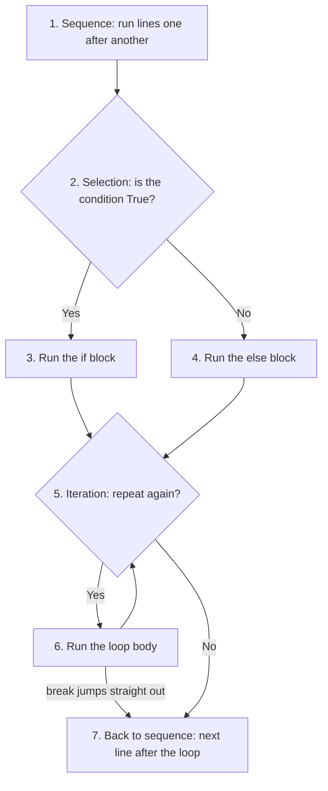
```mermaid
flowchart TD
    A1["1. Sequence: run lines one after another"] --> A2{"2. Selection: is the condition True?"}
    A2 -- "Yes" --> A3["3. Run the if block"]
    A2 -- "No" --> A4["4. Run the else block"]
    A3 --> A5{"5. Iteration: repeat again?"}
    A4 --> A5
    A5 -- "Yes" --> A6["6. Run the loop body"]
    A6 -- "break jumps straight out" --> A7
    A6 --> A5
    A5 -- "No" --> A7["7. Back to sequence: next line after the loop"]
```

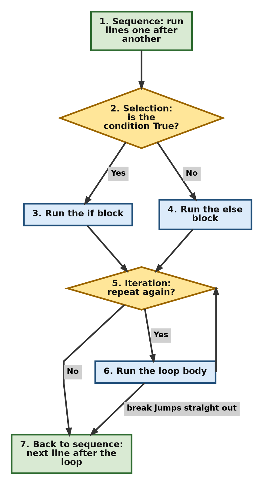

[Back to the Table of Contents](#table-of-contents)

### Q1. The ATM Analogy: From Sequence to Loop

1.  **How does the ATM analogy illustrate the transition from sequential execution to iterative flow, and why is this transition significant for program logic?**

**Answer**

The ATM analogy shows that simple tasks, like inserting a card or entering a PIN, are *sequential*: each step happens once, in a fixed order. Counting out the cash is different. The machine does not know in advance how many notes it will need. So it keeps moving one note to the dispenser *while* the total counted is still less than the amount asked for. This is *iterative* flow.

In a purely sequential model, every step happens exactly once in a fixed order. That works for "insert card, enter PIN". It does not work for "count out the right number of notes", because the number of steps changes with every customer.

The move from sequence to iteration matters because it lets one small, reusable block of code handle any amount of data. Without a loop, a programmer would have to write a separate, hard-coded list of instructions for Rs 500, another for Rs 1,000, another for Rs 1,500, and so on. With a loop, the same three or four lines handle every withdrawal.

**Steps the ATM follows**

1. Read the card and check the PIN (sequence).
2. Ask for the amount (sequence).
3. Set the "counted" total to 0.
4. Check: is the counted total less than the amount asked for?
5. If yes, move one note and add its value to the total. Go back to Step 4.
6. If no, stop counting and hand over the cash (back to sequence).

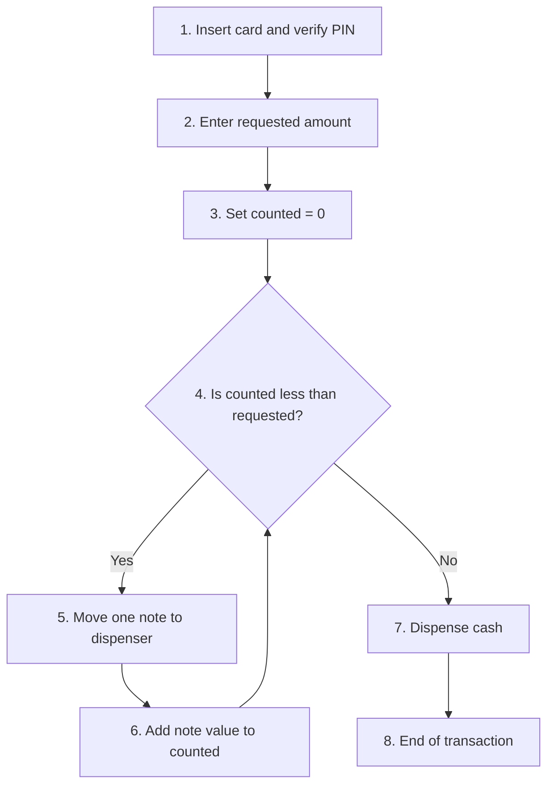
```mermaid
flowchart TD
    B1["1. Insert card and verify PIN"] --> B2["2. Enter requested amount"]
    B2 --> B3["3. Set counted = 0"]
    B3 --> B4{"4. Is counted less than requested?"}
    B4 -- "Yes" --> B5["5. Move one note to dispenser"]
    B5 --> B6["6. Add note value to counted"]
    B6 --> B4
    B4 -- "No" --> B7["7. Dispense cash"]
    B7 --> B8["8. End of transaction"]
```

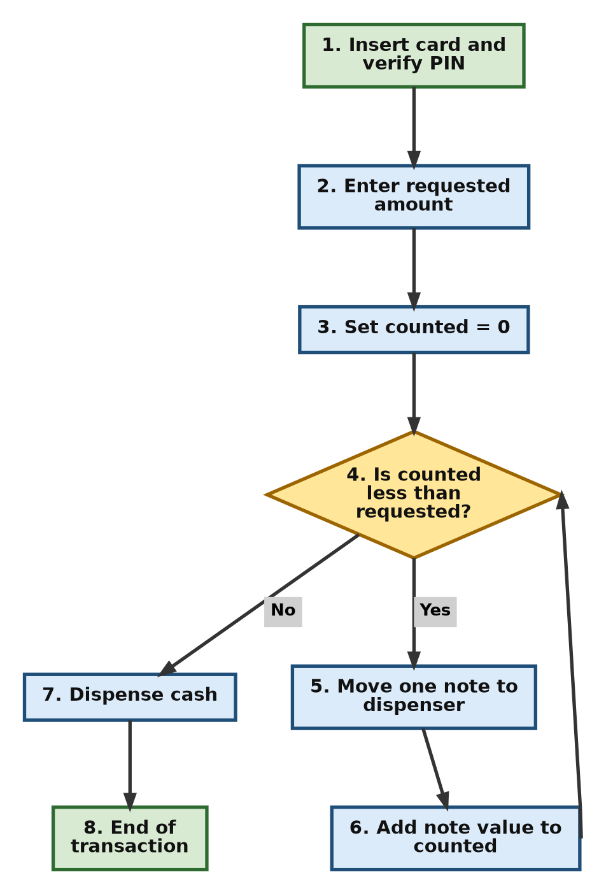

**Script**

```python
# ATM note-counting: sequence first, then a loop

# Step 1 - Sequential part: each line runs once, top to bottom
print("Card inserted")
print("PIN verified")

# Step 2 - Set up the values the loop needs
requested = 2500      # amount the customer asked for
note_value = 500      # the ATM dispenses only 500-rupee notes
counted = 0           # nothing counted yet
notes = 0

# Step 3 - Iterative part: repeat while less than the requested sum is counted
while counted < requested:
    counted = counted + note_value   # move one note to the dispenser
    notes = notes + 1
    print(f"Note {notes} moved -> total counted = {counted}")

# Step 4 - Back to sequential flow once the loop ends
print(f"Please collect Rs {counted} ({notes} notes)")
print("Thank you")
```

**Output**

```text
Card inserted
PIN verified
Note 1 moved -> total counted = 500
Note 2 moved -> total counted = 1000
Note 3 moved -> total counted = 1500
Note 4 moved -> total counted = 2000
Note 5 moved -> total counted = 2500
Please collect Rs 2500 (5 notes)
Thank you
```

Change `requested` to `1000` or `4500` and run it again. The loop code does not change at all, yet it handles the new amount. That is the whole point of iteration.

**Follow-up question:** What happens if the customer asks for Rs 2,300 and the machine has only 500-rupee notes?

*Answer:* The loop keeps going while `counted < 2300`. After four notes the total is 2000, which is still less, so it adds a fifth note and stops at 2500. The customer would get more than asked for. A real ATM prevents this by checking, *before* the loop starts, that the amount is a multiple of the note value (for example with `if requested % note_value != 0:`). This is a good example of selection and iteration working together.

[Back to the Table of Contents](#table-of-contents)

### Q2. Missing Exit Condition: The Infinite Loop

2.  **What are the specific consequences if a programmer fails to define a clear exit condition within an iterative structure like an ATM's note-counting loop?**

**Answer**

If a loop has no clear exit condition, or if its condition can never become false, the program enters an **infinite loop**. The loop repeats again and again because the stopping rule is never met.

In the ATM example, this could mean the machine keeps trying to dispense notes until it physically runs out of cash or the system crashes. That would cause serious logical and financial errors: wrong amounts paid out, a customer charged the wrong sum, and a machine out of service.

In an ordinary Python script, an infinite loop shows up in these ways:

- The program never finishes and appears to "hang" or freeze.
- One CPU core stays busy at or near 100 percent, so the computer may slow down or its fan may speed up.
- If the loop keeps adding items to a list, memory use keeps growing until the program crashes.
- If the loop prints something, the screen fills with the same lines over and over.

You then have to stop the program by hand. In a terminal or in IDLE, press **Ctrl+C**. Python stops the program and raises a [`KeyboardInterrupt`](https://docs.python.org/3/library/exceptions.html#KeyboardInterrupt). In Jupyter Notebook, use the "Interrupt the kernel" (stop) button.

The screenshot below shows this in a terminal. The file `infinite_loop.py` holds a loop with no way out. After it had run for a couple of seconds, Ctrl+C was pressed. The terminal shows `^C` where the keys were pressed, and Python reports a `KeyboardInterrupt` along with the line it was running at that moment.

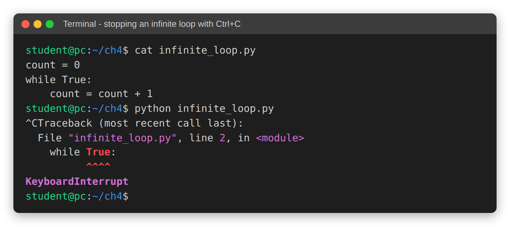

On Windows, the prompt at the start of each line looks different (for example `C:\Users\student>`), but the message from Python is the same.

**Common causes of an infinite loop**

| Cause | Example | Fix |
|---|---|---|
| The control variable is never updated | `while counted < requested:` with no `counted = counted + ...` line inside | Update the variable inside the loop |
| The update moves the wrong way | `x = 10` and `while x > 0: x = x + 1` | Make the update move towards the exit (`x = x - 1`) |
| The condition can never be false | `while True:` with no `break` inside | Add an `if ...: break` |
| `continue` skips the update line | The `x = x + 1` line comes *after* a `continue` | Update the variable *before* `continue` (see Q6 in Part III) |

**Script**

The first loop below has the bug: the line that adds to `counted` is missing. A safety guard is added only so that this demo stops by itself. The second loop is the fixed version.

```python
# A loop whose exit condition is never met, with a safety guard added
# so that this demo stops on its own.

# Step 1 - Set up
requested = 2500
counted = 0
rounds = 0

# Step 2 - The bug: we forgot to add the note value to 'counted'
while counted < requested:
    rounds = rounds + 1
    # counted = counted + 500   <-- the missing update line

    # Step 3 - Safety guard (only for this demo)
    if rounds == 5:
        print("Stopped after 5 rounds. 'counted' is still", counted)
        break

# Step 4 - The fixed version
counted = 0
while counted < requested:
    counted = counted + 500      # the update line makes the condition change
print("Fixed loop ended. counted =", counted)
```

**Output**

```text
Stopped after 5 rounds. 'counted' is still 0
Fixed loop ended. counted = 2500
```

**Follow-up question:** Is every infinite loop a mistake?

*Answer:* No. Some programs are meant to run forever: a web server waiting for visitors, a game waiting for key presses, or the ATM's main menu waiting for the next customer. These use `while True:` on purpose. The difference is that they always have a planned way out, such as a `break` when the user chooses "Exit", or a shutdown command. An infinite loop is a bug only when nobody planned it.

[Back to the Table of Contents](#table-of-contents)

### Q3. Transfer Statements versus Selection and Iteration

3.  **In the "Three Building Blocks of Flow," how do Transfer Statements differ from Selection and Iteration in terms of their impact on the script's path?**

**Answer**

Selection creates *branches* and iteration creates *cycles*. Transfer statements such as `break`, `continue` and `return` are different: they act as *redirects*. They change the planned flow in the middle of a block.

- **Selection** decides *which* path to take at a fork in the road.
- **Iteration** decides *how many times* to walk a path.
- **Transfer statements** let the program jump out of a loop, skip the rest of one round, or leave a function early, as soon as some condition is met.

This gives the programmer fine control. You can handle a special case, or take a shortcut once the answer is found, without waiting for the loop to reach its natural end. For example, once a search has found what it was looking for, there is no need to check the remaining items.

| Statement | Where it is used | What it does | Everyday picture |
|---|---|---|---|
| `break` | Inside a loop | Ends the whole loop at once; flow goes to the first line after the loop | Leaving a queue and going home |
| `continue` | Inside a loop | Ends only the current round; flow goes back to the top of the loop | Skipping one song on a playlist |
| `return` | Inside a function | Ends the function (and any loop inside it) and sends a value back | Handing in your answer sheet early |

Note that `pass` is often listed with these, but it is *not* a transfer statement. It does nothing and does not change the flow at all (see Q7 in Part III).

**Script**

```python
# break, continue and return side by side

# Step 1 - continue: skip one round, keep looping
print("continue demo:")
for n in range(1, 6):
    if n == 3:
        continue          # skip 3, go back to the top of the loop
    print(" ", n)

# Step 2 - break: leave the loop completely
print("break demo:")
for n in range(1, 6):
    if n == 3:
        break             # stop the whole loop at 3
    print(" ", n)

# Step 3 - return: leave the function (and its loop) at once
def first_even(numbers):
    for n in numbers:
        if n % 2 == 0:
            return n      # found it, exit the function right here
    return None           # runs only if no even number was found

print("return demo:", first_even([7, 9, 4, 6]))
```

**Output**

```text
continue demo:
  1
  2
  4
  5
break demo:
  1
  2
return demo: 4
```

Notice that `first_even()` returned `4` and never even looked at `6`. The `return` statement ended the loop and the function in one step.

[Back to the Table of Contents](#table-of-contents)

### Q4. Selection as the Decision-Maker

4.  **Why is the "Selection" building block considered the primary mechanism for decision-making within a Python script?**

**Answer**

Selection, written mainly with `if`, `elif` and `else`, is the main way a program makes decisions. It works by testing a Boolean expression, a question whose answer is `True` or `False`, and then choosing the direction of the program based on that answer.

This lets a script look at the current situation and react to it. For example, an ATM checks whether the customer has enough money. If not, it takes the error path and shows "Insufficient Funds". If yes, it takes the success path and dispenses the cash.

Without selection, a program would always follow the same fixed path, whatever the input. It would do exactly the same thing for a customer with Rs 10 in the bank and a customer with Rs 10 lakh. Such a program could not validate input, handle errors, or respond to what the user does. It would be of little use for any real task that involves logic or conditions.

**Steps in a selection**

1. Python evaluates the condition (for example `amount > balance`).
2. The result is either `True` or `False`.
3. If `True`, Python runs the indented block under `if`.
4. If `False`, Python skips that block and runs the `else` block, if there is one.
5. After either block, both paths meet again and the program continues.

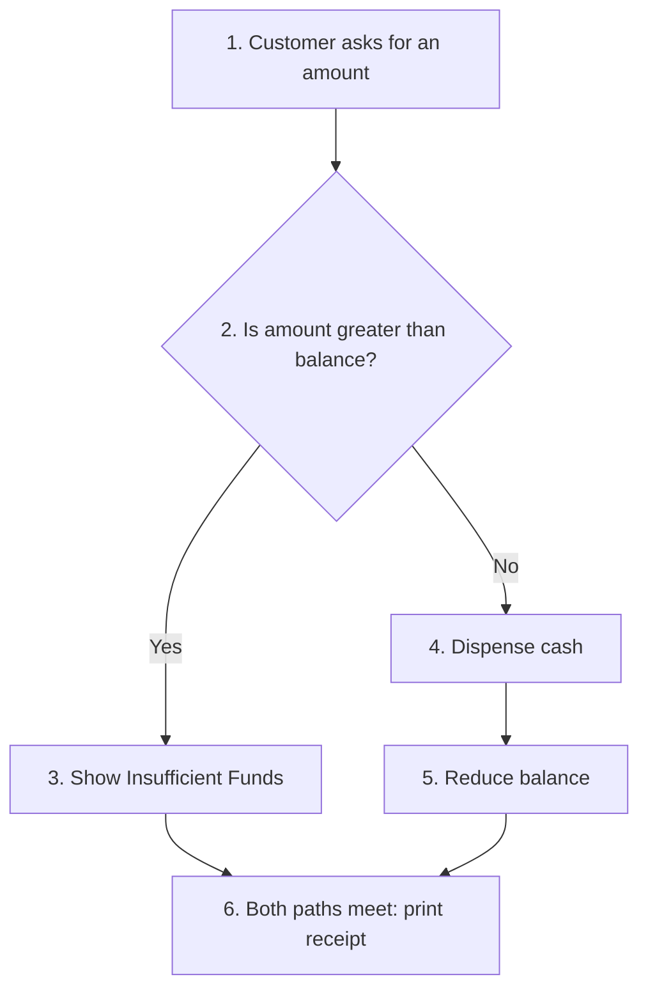
```mermaid
flowchart TD
    C1["1. Customer asks for an amount"] --> C2{"2. Is amount greater than balance?"}
    C2 -- "Yes" --> C3["3. Show Insufficient Funds"]
    C2 -- "No" --> C4["4. Dispense cash"]
    C4 --> C5["5. Reduce balance"]
    C3 --> C6["6. Both paths meet: print receipt"]
    C5 --> C6
```

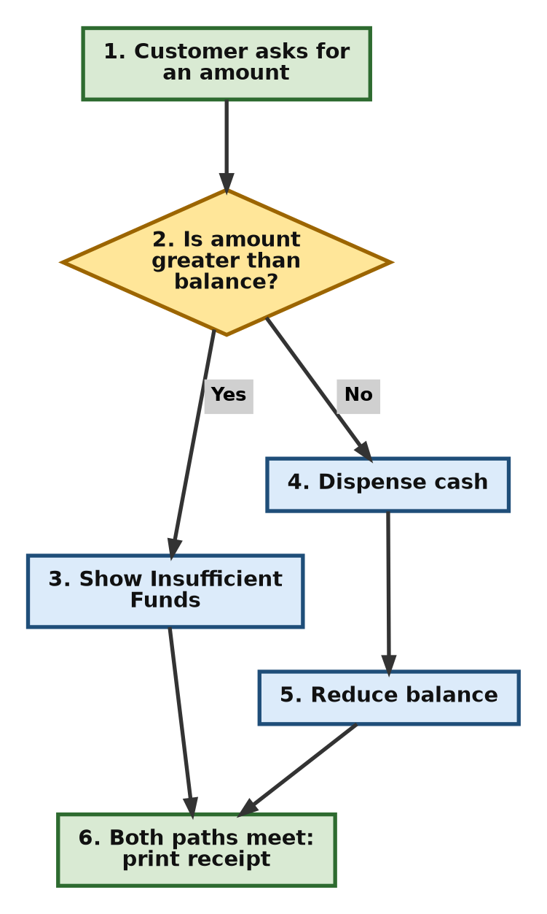

**Script**

```python
# Selection: the same code takes different paths for different data

def withdraw(balance, amount):
    # Step 1 - Test the condition
    if amount > balance:
        # Step 2a - Error path
        print(f"Asked {amount}, balance {balance}: Insufficient Funds")
    else:
        # Step 2b - Success path
        balance = balance - amount
        print(f"Asked {amount}: dispensed. New balance {balance}")
    # Step 3 - Both paths meet here again
    return balance

withdraw(1000, 1500)
withdraw(1000, 400)
```

**Output**

```text
Asked 1500, balance 1000: Insufficient Funds
Asked 400: dispensed. New balance 600
```

The same function, with the same code, gave two different results because the data was different. That is what "decision-making" means in a program.

[Back to the Table of Contents](#table-of-contents)

### Q5. Sequential Flow as the Standard Path

5.  **How does sequential flow serve as the "Standard Path" for Python execution, and what role does it play when selection or iteration concludes?**

**Answer**

Sequential flow is the natural, top-to-bottom way Python runs code. One line must finish completely before the next one begins, just like working through a simple to-do list.

It is the *default* or "standard path". Selection and iteration are *detours* from it, used when the task needs a decision or a repetition. When a detour ends, the program returns to the standard path:

- When an `if`/`elif`/`else` block finishes, Python goes to the first line after the whole selection structure.
- When a loop's condition becomes false (or a `break` runs), Python goes to the first line after the loop.

How does Python know where "after the structure" is? By indentation. The first line that is *not* indented under the `if` or the loop is where the sequence resumes. The main story of the script then carries on from there.

**Script**

```python
# Flow returns to the sequence after a selection and a loop

print("Line A - start")                 # Step 1 - sequence

x = 7
if x > 5:                               # Step 2 - selection
    print("Line B - inside the if block")

for i in range(2):                      # Step 3 - iteration
    print("Line C - loop round", i)

print("Line D - first unindented line after the loop")   # Step 4 - back to sequence
```

**Output**

```text
Line A - start
Line B - inside the if block
Line C - loop round 0
Line C - loop round 1
Line D - first unindented line after the loop
```

**Follow-up question:** If `x` were `3` instead of `7`, which lines would be printed?

*Answer:* Line A, then Line C twice, then Line D. Line B is skipped because `3 > 5` is `False`, but the sequence still continues from the next unindented line.

[Back to the Table of Contents](#table-of-contents)

### Q6. What Is Truthiness?

6.  **Explain the concept of "Truthiness" in Python and how it differs from a strict Boolean evaluation of True and False.**

**Answer**

In a strict Boolean system, a condition must be exactly `True` or `False`. Python is more flexible. When you use *any* value as a condition (after `if`, `while`, `and`, `or` or `not`), Python decides whether that value counts as true ("truthy") or false ("falsy"). This decision depends on the *content* of the value, not on its type. This idea is called **truthiness**.

The rule is easy to remember: **empty or zero means False; everything else means True.**

Some languages, such as Java, accept only real Boolean values in a condition. Writing `if (name)` for a string is an error there; you must write something like `if (!name.isEmpty())`. Python lets you simply write `if name:`.

**The falsy values**

These are the values that Python treats as `False`. Almost every other value is truthy.

| Group | Falsy values |
|---|---|
| The constants | `False`, `None` |
| Zero of any number type | `0`, `0.0`, `0j` |
| Empty sequences and collections | `""` (empty string), `[]`, `()`, `{}`, `set()`, `range(0)` |

You can check any value with the built-in [`bool()`](https://docs.python.org/3/library/functions.html#bool) function. The full rules are in the Python docs under [Truth Value Testing](https://docs.python.org/3/library/stdtypes.html#truth-value-testing).

Truthiness makes code short and easy to read. For example, `while s1:` keeps running as long as the string `s1` has characters in it. It stops by itself the moment the string becomes empty.

**Script**

```python
# Truthiness: what bool() says about different values

# Step 1 - A mix of values to test
values = [True, False, 0, 1, -10, 0.0, 3.5, "", "hi", " ", [], [0], (), {}, None]

# Step 2 - Print each value and its truth value
for v in values:
    print(f"{v!r:>6} -> {bool(v)}")

# Step 3 - Using truthiness directly in a loop
s1 = "abcdef"
while s1:                  # runs while s1 is not empty
    print("s1 =", repr(s1))
    s1 = s1[2:]            # drop the first two characters
print("Loop ended because s1 is now", repr(s1))
```

**Output**

```text
  True -> True
 False -> False
     0 -> False
     1 -> True
   -10 -> True
   0.0 -> False
   3.5 -> True
    '' -> False
  'hi' -> True
   ' ' -> True
    [] -> False
   [0] -> True
    () -> False
    {} -> False
  None -> False
s1 = 'abcdef'
s1 = 'cdef'
s1 = 'ef'
Loop ended because s1 is now ''
```

Two results are worth a second look. The string `' '` (a single space) is **truthy**, because it is not empty: it contains one character. The list `[0]` is also **truthy**, because the list holds one item, even though that item is zero.

[Back to the Table of Contents](#table-of-contents)

### Q7. Non-Zero Numbers Are True

7.  **How does Python's treatment of non-zero numbers as True simplify the logic of conditional branching compared to more restrictive languages?**

**Answer**

Python treats every non-zero number as `True`. This includes negative numbers like `-10` and small decimals like `0.001`. Only zero (`0`, `0.0`) counts as `False`.

Because of this, you can use a numeric variable directly as a condition. In a stricter language such as Java, you must write a full comparison like `if (x != 0)`. In Python, `if x:` is enough.

This cuts down on extra code (often called "boilerplate") and makes the programmer's intention clear. It is especially handy when a variable stands for a count or an amount, where "zero" naturally means "nothing there". For example:

```python
items_in_cart = 3
if items_in_cart:
    print("Proceed to checkout")
```

reads almost like plain English: "if there are items in the cart, proceed".

**Script**

```python
# Non-zero numbers are True, zero is False

for x in [5, -10, 0, 0.0, 0.001]:
    # Step 1 - Short form (Pythonic)
    short = "runs" if x else "skipped"
    # Step 2 - Long form (explicit comparison) gives the same answer
    long = "runs" if x != 0 else "skipped"
    print(f"x = {x:>6}: 'if x:' {short:7} | 'if x != 0:' {long}")
```

**Output**

```text
x =      5: 'if x:' runs    | 'if x != 0:' runs
x =    -10: 'if x:' runs    | 'if x != 0:' runs
x =      0: 'if x:' skipped | 'if x != 0:' skipped
x =    0.0: 'if x:' skipped | 'if x != 0:' skipped
x =  0.001: 'if x:' runs    | 'if x != 0:' runs
```

Both forms always agree. The short form is simply less to type and less to read.

**Follow-up question:** When should you still write the full comparison `x != 0`?

*Answer:* When zero is a *normal, valid value* and you are really asking a different question. For example, if you want to know whether a temperature has been recorded at all, `if temp:` would wrongly treat a reading of 0 degrees as "no reading". In that case, write `if temp is not None:`. Q10 below looks at this trap in more detail.

[Back to the Table of Contents](#table-of-contents)

### Q8. Negative Numbers versus None and Empty Lists

8.  **Contrast the Boolean evaluation of a negative number with the evaluation of None and an empty list [] in a Python flow control context.**

**Answer**

In Python, a negative number is **truthy** because it is not zero. So a block under `if -5:` will run.

`None` and an empty list `[]` are **falsy**. `None` means "no value at all", and `[]` means "a container with nothing in it". Both make the flow skip the `if` block, or move to the `else` block if there is one.

This difference is very useful when processing data. It lets a script tell apart:

- a variable that holds a real measurement, even a negative one such as `-5` degrees, and
- a variable that is empty or was never given a value.

| Value | What it usually means | Truthy or falsy? | Does `if value:` run? |
|---|---|---|---|
| `-5` | A real reading below zero | Truthy | Yes |
| `12` | A real reading above zero | Truthy | Yes |
| `0` | A real reading of exactly zero | Falsy | No (be careful, see Q10) |
| `None` | No reading was taken | Falsy | No |
| `[]` | A list of readings that is empty | Falsy | No |

**Script**

```python
# A valid negative reading versus missing data

readings = [-5, None, [], 12]

for r in readings:
    # Step 1 - Truthiness test
    if r:
        print(f"{r!r:>5}: truthy -> process it")
    else:
        print(f"{r!r:>5}: falsy  -> skip it")
```

**Output**

```text
   -5: truthy -> process it
 None: falsy  -> skip it
   []: falsy  -> skip it
   12: truthy -> process it
```

[Back to the Table of Contents](#table-of-contents)

### Q9. Using Empty Containers to End a Loop

9.  **Analyze why the "Truthiness" of empty containers is a "Pythonic" way to handle loop termination, using the example of string slicing.**

**Answer**

The word "Pythonic" means "written in the natural style that experienced Python programmers prefer". One such style is to let the container itself control the loop.

Take the loop `while s1:`. Inside it, the statement `s1 = s1[2:]` removes the first two characters each time round. (The slice `s1[2:]` means "from index 2 to the end".) Sooner or later the string becomes empty, `""`. Python treats an empty string as `False`, so the loop ends cleanly and on its own.

**Steps**

1. Python checks `s1`. It is not empty, so it counts as `True` and the loop body runs.
2. The body prints or uses `s1`.
3. `s1 = s1[2:]` makes the string two characters shorter.
4. Back to Step 1. When `s1` finally becomes `""`, it counts as `False` and the loop stops.

**Trace table** for `s1 = "abcdef"`

| Round | `s1` at the check | Truthy? | `s1` after `s1 = s1[2:]` |
|---|---|---|---|
| 1 | `'abcdef'` | Yes | `'cdef'` |
| 2 | `'cdef'` | Yes | `'ef'` |
| 3 | `'ef'` | Yes | `''` |
| 4 | `''` | No, loop ends | - |

The output of this loop is shown in the script in Q6 above.

This style is preferred over writing `while len(s1) > 0:` because it is shorter and lets the data speak for itself. Python's official style guide, [PEP 8](https://peps.python.org/pep-0008/#programming-recommendations), recommends it too: for sequences, use the fact that empty sequences are false (`if not seq:`) instead of `if len(seq) == 0:`.

What if the string has an odd number of characters, like `"abcde"`? Slicing past the end of a string does not cause an error in Python. `"e"[2:]` simply gives `""`, so the loop still ends safely.

[Back to the Table of Contents](#table-of-contents)

### Q10. The Risks of Relying on Truthiness

10.  **What are the potential risks of relying on Python's flexible truthiness if a developer is not careful with variable initialization?**

**Answer**

Truthiness is convenient, but it can cause code to run when it should not, or to be skipped when it should run. This happens when what *looks* empty to a person is *not* empty to Python, or the other way round. There are two common traps.

**Trap 1: a value that looks empty but is truthy.** A string that contains only a space, `" "`, looks blank on screen. But a space is still a character, so the string is not empty and counts as `True`. A loop or `if` that depends on it may run when it should have stopped. The fix is to clean the value first, for example with `.strip()`, which removes spaces from both ends.

**Trap 2: a real value that is falsy.** The number `0` is a perfectly valid value, such as a test score of zero or a temperature of 0 degrees. But `if score:` treats it as `False`, exactly as if the score were missing. The fix is to test for "missing" directly with `is None`.

To avoid such silent logical errors, make sure the value you test really represents the state you mean:

- Use `None` (not `0` or `""`) to mean "no data yet".
- Test for missing data with `if value is None:` rather than `if not value:`.
- Clean text input with `.strip()` before testing it.

**Script**

```python
# Two traps with truthiness

# Trap 1 - a string holding only a space looks empty but is truthy
name = " "
if name:
    print("Trap 1: name looks filled in:", repr(name))
if name.strip():                 # strip() removes spaces first
    print("never printed")
else:
    print("Trap 1 fixed with strip(): name is really blank")

# Trap 2 - a real value of 0 is falsy
score = 0                        # the student really scored 0
if not score:
    print("Trap 2: 'if not score' wrongly says score is missing")
if score is None:
    print("never printed")
else:
    print("Trap 2 fixed with 'is None': score is present and equals", score)
```

**Output**

```text
Trap 1: name looks filled in: ' '
Trap 1 fixed with strip(): name is really blank
Trap 2: 'if not score' wrongly says score is missing
Trap 2 fixed with 'is None': score is present and equals 0
```

**Follow-up question:** Why do we write `score is None` and not `score == None`?

*Answer:* There is only ever one `None` object in a running Python program, so `is` (which checks "is this the very same object?") is the correct and safest test. PEP 8 recommends `is None` and `is not None`.

With the basic building blocks and truthiness in place, the next part looks at decision-making in more depth: long `if`-`elif` chains and the newer `match`-`case` statement.

[Back to the Table of Contents](#table-of-contents)

## II. Advanced Selection: Conditionals and Pattern Matching

Python's tools for making choices have grown over time, from the basic `if` statement to the newer `match`-`case` statement added in Python 3.10. Each step has aimed at the same goal: handling more complex decisions while keeping the code clear. Used well, these tools let you build decision logic that runs efficiently and is easy for people to read and maintain.

[Back to the Table of Contents](#table-of-contents)

### Q1. The Rule of One in if-elif-else

1.  **Explain the "Rule of One" in Python's if-elif-else structure and its impact on performance and logic.**

**Answer**

The "Rule of One" says that in a chain of `if`-`elif`-`else` statements, **only one block ever runs**: the first one whose condition is `True`. As soon as Python finds it, it runs that block and skips every block below it, without even testing their conditions.

This has two effects.

- **Performance:** Python stops testing as soon as it finds a match. The remaining conditions are never evaluated, so no time is wasted on them.
- **Logic:** The branches are *mutually exclusive*, meaning at most one of them can happen. Even if several conditions could be true at the same time, the program follows only one path: the first one in the order written.

**Steps Python follows**

1. Test the `if` condition. If it is `True`, run its block and jump to Step 4.
2. Otherwise, test each `elif` condition in turn, top to bottom. Run the first one that is `True`, then jump to Step 4.
3. If none was `True`, run the `else` block (if there is one).
4. Continue with the first line after the whole chain.

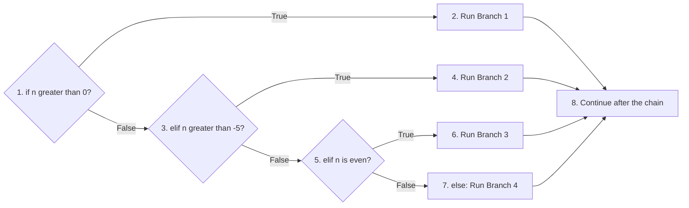
```mermaid
flowchart LR
    D1{"1. if n greater than 0?"} -- "True" --> D2["2. Run Branch 1"]
    D1 -- "False" --> D3{"3. elif n greater than -5?"}
    D3 -- "True" --> D4["4. Run Branch 2"]
    D3 -- "False" --> D5{"5. elif n is even?"}
    D5 -- "True" --> D6["6. Run Branch 3"]
    D5 -- "False" --> D7["7. else: Run Branch 4"]
    D2 --> D8["8. Continue after the chain"]
    D4 --> D8
    D6 --> D8
    D7 --> D8
```

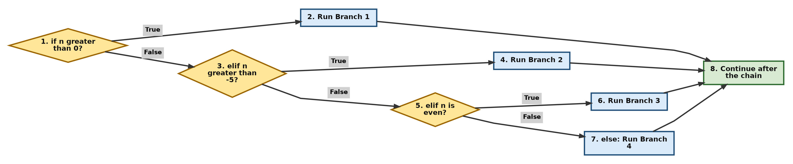

**Script**

```python
# Rule of One: only the first True branch runs

def check(n):
    print(f"n = {n}")
    # Step 1 - Python tests the conditions from top to bottom
    if n > 0:
        print("  Branch 1: positive")
    elif n > -5:
        print("  Branch 2: between -5 and 0")
    elif n % 2 == 0:
        print("  Branch 3: even")
    else:
        print("  Branch 4: everything else")
    # Step 2 - Only one branch has run; flow continues here

check(8)     # 8 is positive AND even, but only Branch 1 runs
check(-2)    # -2 fits Branch 2 and Branch 3; only Branch 2 runs
check(-8)
check(-7)
```

**Output**

```text
n = 8
  Branch 1: positive
n = -2
  Branch 2: between -5 and 0
n = -8
  Branch 3: even
n = -7
  Branch 4: everything else
```

**Follow-up question:** What would change if all four tests were written as separate `if` statements, with no `elif`?

*Answer:* Each `if` would then be tested on its own, and more than one block could run. For `n = 8`, both "positive" and "even" would be printed. Use an `elif` chain when you want exactly one outcome; use separate `if` statements when several outcomes may apply together.

[Back to the Table of Contents](#table-of-contents)

### Q2. Why the Order of elif Matters

2.  **Evaluate why the order of elif statements is critical for logic, particularly when dealing with numerical ranges or overlapping conditions.**

**Answer**

Python tests `elif` conditions one by one, from top to bottom, and the first match wins. So a broad condition placed early can "hide" (or *shadow*) a narrower condition placed later.

For example, suppose a script checks `if score > 50:` *before* `elif score > 90:`. A student who scores 95 meets the first condition (95 is more than 50). That block runs and prints "Pass". The "A Grade" block is never reached, so no student can ever get an A.

To avoid this, arrange overlapping conditions from the **most specific** (or highest value) to the **most general**.

**Steps to order conditions correctly**

1. List all the ranges or cases you need.
2. Ask: "Is one case completely inside another?" For example, every score above 90 is also above 50.
3. Put the narrower case (above 90) first.
4. Put the wider case (above 50) after it.
5. Finish with `else` for everything that is left.

**Script**

```python
# Wrong order vs right order of elif

score = 95

# Step 1 - Wrong order: the general test comes first
if score > 50:
    print("Wrong order:", "Pass")
elif score > 90:
    print("Wrong order:", "A Grade")      # can never run for scores above 90

# Step 2 - Right order: the most specific (highest) test comes first
if score > 90:
    print("Right order:", "A Grade")
elif score > 50:
    print("Right order:", "Pass")
else:
    print("Right order:", "Fail")
```

**Output**

```text
Wrong order: Pass
Right order: A Grade
```

| Score | Wrong order gives | Right order gives |
|---|---|---|
| 95 | Pass | A Grade |
| 70 | Pass | Pass |
| 30 | (nothing printed) | Fail |

[Back to the Table of Contents](#table-of-contents)

### Q3. Indentation and the Dangling else Problem

3.  **Describe how Python's use of indentation as syntax prevents the "dangling else" problem found in C-style languages.**

**Answer**

In C, Java and similar languages, an `else` placed after two nested `if` statements can be ambiguous. Which `if` does it belong to? The language rule is that it attaches to the *nearest* `if`, even if the programmer's indentation suggests otherwise. If the programmer meant something else and did not add braces `{}`, the program behaves wrongly. This is known as the [dangling else](https://en.wikipedia.org/wiki/Dangling_else) problem.

Python removes the problem completely because **indentation is part of the syntax**. The `else` belongs to the `if` it is lined up with, and nothing else. This forces the programmer to show the structure of the logic clearly. What the code *looks like* is exactly how it *runs*, which greatly reduces mistakes in nested conditions.

Here is the problem in C. The indentation suggests the `else` belongs to the outer `if`, but C attaches it to the inner one:

```c
/* C code: misleading indentation */
if (a > 0)
    if (b > 0)
        printf("both positive");
else                                /* actually belongs to if (b > 0) */
    printf("a is not positive");
```

In Python, you choose the meaning by where you place `else`.

**Script**

```python
# The position of 'else' decides which 'if' it belongs to

a, b = 5, -1

# Version 1 - else lined up with the INNER if
if a > 0:
    if b > 0:
        print("V1: both positive")
    else:
        print("V1: a positive, b not positive")

# Version 2 - else lined up with the OUTER if
if a > 0:
    if b > 0:
        print("V2: both positive")
else:
    print("V2: a is not positive")

print("V2 printed nothing above, because a > 0 and b is not > 0")
```

**Output**

```text
V1: a positive, b not positive
V2 printed nothing above, because a > 0 and b is not > 0
```

The only difference between the two versions is the position of `else`, yet they behave differently. In Python, there is never any doubt about which `if` an `else` belongs to.

[Back to the Table of Contents](#table-of-contents)

### Q4. The else Block as a Catch-All

4.  **What is the function of the else block as a "Catch-All," and why does it lack a Boolean expression?**

**Answer**

The `else` block is a safety net. It handles every case that was *not* covered by the `if` and `elif` conditions above it.

It has no condition of its own because it does not need one. Its rule is simply: "run me if everything above me was `False`". Writing a condition for it would be pointless, since reaching `else` already tells us that all earlier tests failed.

This makes `else` the right place for fallback behaviour and error messages. It makes sure the program always has a defined path, even when the input is something the programmer did not expect.

**Script**

```python
# else as the catch-all

for choice in ["1", "2", "9"]:
    # Step 1 - Test the known options
    if choice == "1":
        print(choice, "-> Check balance")
    elif choice == "2":
        print(choice, "-> Withdraw cash")
    # Step 2 - Anything else lands here (no condition needed)
    else:
        print(choice, "-> Invalid option, try again")
```

**Output**

```text
1 -> Check balance
2 -> Withdraw cash
9 -> Invalid option, try again
```

**Follow-up question:** Is it a syntax error to write `else x > 5:`?

*Answer:* Yes. Python will report a `SyntaxError`. If you need another condition, use `elif x > 5:` instead.

[Back to the Table of Contents](#table-of-contents)

### Q5. One-Way Decision versus Binary Selection

5.  **How does the "One-Way" decision (omitting the else clause) differ from the "Binary Selection" model in practical application?**

**Answer**

A **one-way decision** is an `if` with no `else`. It is used when an action is needed only when a condition is `True`, and nothing special should happen otherwise. For example, an air conditioner switches on only when `temp > 25`. If the temperature is lower, the program just carries on.

**Binary selection** is the `if`-`else` form. It is used when there are always exactly two possible outcomes and one of them must happen. For example, a whole number is either "Even" or "Odd", never both and never neither.

The one-way `if` is simpler and a natural fit for monitoring systems, where the normal state is "keep going" and action is needed only now and then. Adding an empty or pointless `else` there would only add clutter.

| Feature | One-way (`if` only) | Binary (`if`-`else`) |
|---|---|---|
| Number of outcomes | Action or no action | Always one of two actions |
| When condition is `False` | Nothing special happens | The `else` block runs |
| Typical use | Alerts, warnings, switching a device on | Even/odd, pass/fail, yes/no |

**Script**

```python
# One-way decision vs binary selection

# Step 1 - One-way: act only when the condition is True
for temp in [22, 31]:
    print(f"Temperature {temp}")
    if temp > 25:
        print("  AC switched ON")
    print("  Monitoring continues")      # runs every time

# Step 2 - Binary: exactly one of two outcomes
for n in [4, 7]:
    if n % 2 == 0:
        print(n, "is Even")
    else:
        print(n, "is Odd")
```

**Output**

```text
Temperature 22
  Monitoring continues
Temperature 31
  AC switched ON
  Monitoring continues
4 is Even
7 is Odd
```

[Back to the Table of Contents](#table-of-contents)

### Q6. match-case versus if-elif Chains

6.  **Compare the efficiency and readability of match-case statements (Python 3.10+) against traditional if-elif chains for menu-driven applications.**

**Answer**

The `match`-`case` statement, officially called **structural pattern matching**, was added in Python 3.10. For menu-driven programs it is often cleaner than a long `if`-`elif` chain.

**Readability.** In an `if`-`elif` chain you repeat the variable name in every test: `if choice == "1"`, `elif choice == "2"`, and so on. With `match`, you write the variable (the *subject*) once, and then simply list the possible values (the *patterns*). The code reads like a menu. You can also group several values in one case with `|`, meaning "or", as in `case "3" | "4":`.

**Efficiency.** For simple menus, `match`-`case` is *not* noticeably faster than an `if`-`elif` chain. Python still checks the cases one by one, from top to bottom, and stops at the first match, just like `elif`. So the choice between them should be made on clarity, not speed.

**Where `match` really shines** is in matching the *structure* of data, not just single values. For example, `case (x, y):` can check that a value is a pair and unpack it into two variables in one step. This is hard to write neatly with `if` statements. The [Pattern Matching Tutorial (PEP 636)](https://peps.python.org/pep-0636/) has many such examples.

| Point | `if`-`elif`-`else` | `match`-`case` |
|---|---|---|
| Python version | All versions | 3.10 and later |
| Subject written | In every condition | Once, after `match` |
| Several values in one branch | `choice == "3" or choice == "4"` | `case "3" \| "4":` |
| Catch-all | `else:` | `case _:` |
| Speed for simple menus | About the same | About the same |
| Can test any Boolean condition | Yes, directly | Only through a guard (`case x if ...`) |
| Can unpack structures (lists, tuples, objects) | No, needs extra code | Yes |

**Script**

```python
# The same menu written two ways (match needs Python 3.10 or later)

def menu_if(choice):
    if choice == "1":
        return "Check balance"
    elif choice == "2":
        return "Withdraw cash"
    elif choice == "3" or choice == "4":
        return "Deposit"
    else:
        return "Invalid option"

def menu_match(choice):
    match choice:                  # Step 1 - the subject is written once
        case "1":                  # Step 2 - each case is a pattern
            return "Check balance"
        case "2":
            return "Withdraw cash"
        case "3" | "4":            # Step 3 - '|' means "either of these"
            return "Deposit"
        case _:                    # Step 4 - wildcard catches everything else
            return "Invalid option"

for c in ["1", "2", "4", "x"]:
    print(f"{c}: if-elif -> {menu_if(c):14} | match -> {menu_match(c)}")
```

**Output**

```text
1: if-elif -> Check balance  | match -> Check balance
2: if-elif -> Withdraw cash  | match -> Withdraw cash
4: if-elif -> Deposit        | match -> Deposit
x: if-elif -> Invalid option | match -> Invalid option
```

Both functions always give the same answer. The `match` version is simply easier to scan.

[Back to the Table of Contents](#table-of-contents)

### Q7. Guard Conditions in match-case

7.  **Evaluate the "Guard" condition (using if inside a case) and its impact on the flexibility of structural pattern matching.**

**Answer**

A **guard** is an extra `if` test written at the end of a `case` line. The case is chosen only if the pattern matches *and* the guard is `True`. If the guard is `False`, Python moves on to try the next case.

For example, in `case char if char.isalpha():`, the pattern `char` is a *capture pattern*. A capture pattern matches any value and stores it in the variable `char`. The guard `if char.isalpha()` then filters it, so this case is used only when the value is a letter.

Guards give `match` great flexibility. One `match` statement can handle simple value checks and more complex tests side by side, such as checking that a string is a single character with `len(char) == 1`.

**Steps Python follows for each case**

1. Try the pattern. If it does not match, go to the next case.
2. If it matches, store any captured values in their variables.
3. Test the guard. If `True`, run this case's block and finish.
4. If the guard is `False`, go on to the next case.

**Script**

```python
# Guards: an extra 'if' check on a case

def classify(char):
    match char:
        # Step 1 - capture the value in 'c', then apply the guard
        case c if len(c) != 1:
            return "not a single character"
        case c if c.isalpha():
            return "a letter"
        case c if c.isdigit():
            return "a digit"
        # Step 2 - wildcard for everything that got past the guards
        case _:
            return "a symbol or space"

for item in ["A", "7", "#", "AB", ""]:
    print(f"{item!r:5} -> {classify(item)}")
```

**Output**

```text
'A'   -> a letter
'7'   -> a digit
'#'   -> a symbol or space
'AB'  -> not a single character
''    -> not a single character
```

**Follow-up question:** What happens if you write a bare capture pattern, such as `case c:` with no guard, and then add more cases after it?

*Answer:* Python refuses to run the program. A bare capture pattern matches everything, so every case after it could never be reached. Python reports this before running:

```text
SyntaxError: name capture 'c' makes remaining patterns unreachable
```

A guard fixes this because it can fail and let Python move on to the next case.

[Back to the Table of Contents](#table-of-contents)

### Q8. The Wildcard _ in match-case

8.  **Explain the role of the Wildcard _ in a match-case statement and how it mirrors the else block in an if structure.**

**Answer**

In a `match` statement, the underscore `_` is the **wildcard pattern**. It matches absolutely anything and, unlike a capture pattern, does not store the value in a variable. It does the same job as `else` in an `if` chain: it is the catch-all.

If none of the earlier cases matches, the `case _:` block runs. This makes sure unexpected input is handled. It is good practice to include a wildcard case in menu-driven programs, so the user gets a helpful message when they press a wrong key or choose an invalid option.

Note what happens *without* a wildcard: if nothing matches, Python raises no error. The `match` statement simply does nothing, and the program carries on silently. The user may be left wondering why nothing happened.

**Script**

```python
# What happens with and without the wildcard

def no_wildcard(key):
    match key:
        case "q":
            print(key, "-> Quit")
        case "h":
            print(key, "-> Help")
    print("  (end of no_wildcard)")

def with_wildcard(key):
    match key:
        case "q":
            print(key, "-> Quit")
        case "h":
            print(key, "-> Help")
        case _:
            print(key, "-> Unknown key, press h for help")

no_wildcard("z")     # nothing matches, nothing is printed by match
with_wildcard("z")
```

**Output**

```text
  (end of no_wildcard)
z -> Unknown key, press h for help
```

The wildcard case must be the **last** case. Like `case c:` in Q7, it matches everything, so any case placed after it could never run.

[Back to the Table of Contents](#table-of-contents)

### Q9. The Risks of Deep Nesting

9.  **What are the risks associated with "Deep Nesting" of conditionals, and what is the primary "Rule of Thumb" to avoid it?**

**Answer**

Deep nesting happens when `if`-`else` blocks are placed inside one another, several levels deep. Each level pushes the code further to the right. The result is code that "drifts" across the screen and is hard to follow. To understand a line deep inside, the reader must remember every condition above it. Mistakes become easy to make and hard to spot.

The main rule of thumb is: **if the code has become hard to read because of too much indentation, restructure it.** Common ways to do this are:

- Use `elif` instead of an `if` inside an `else`.
- Combine conditions with logical operators such as `and` and `or` (see Q10).
- Inside a function, handle each problem case first and `return` early. This is often called a **guard clause**. The main work then sits at the bottom, with no extra indentation.

These changes "flatten" the structure. The conditions become *peers* (equals, side by side) rather than parent and child, which makes the design much easier to read and maintain.

**Script**

```python
# Deep nesting vs a flat version (same logic)

def can_withdraw_nested(card_ok, pin_ok, balance, amount):
    if card_ok:
        if pin_ok:
            if amount <= balance:
                return "Cash dispensed"
            else:
                return "Insufficient funds"
        else:
            return "Wrong PIN"
    else:
        return "Card rejected"

def can_withdraw_flat(card_ok, pin_ok, balance, amount):
    # Each problem is handled first and the function returns at once
    if not card_ok:
        return "Card rejected"
    if not pin_ok:
        return "Wrong PIN"
    if amount > balance:
        return "Insufficient funds"
    return "Cash dispensed"

tests = [(True, True, 1000, 500), (True, False, 1000, 500),
         (False, True, 1000, 500), (True, True, 100, 500)]
for t in tests:
    print(can_withdraw_nested(*t), "|", can_withdraw_flat(*t))
```

(The `*t` in the last line unpacks the tuple `t` into four separate arguments.)

**Output**

```text
Cash dispensed | Cash dispensed
Wrong PIN | Wrong PIN
Card rejected | Card rejected
Insufficient funds | Insufficient funds
```

Both functions give identical results, but the flat version has no line indented more than one level inside the function, and each check can be read on its own.

[Back to the Table of Contents](#table-of-contents)

### Q10. Using and / or to Flatten the Teenager Check

10.  **How do Logical Operators like and and or help in refactoring nested "Teenager" logic into a single line?**

**Answer**

Logical operators let you join several conditions into one expression. For a teenager check, you need a lower limit (older than 12) and an upper limit (younger than 20). With `and`, both fit in one line: `if age > 12 and age < 20:`.

This replaces a nested version, where one `if` sits inside another. The indentation drops by a level and the "teenager" rule is clear at a glance.

Python goes one step further with **comparison chaining**: you can write `if 12 < age < 20:`. This reads just like the maths notation you learnt at school. It means exactly the same as `12 < age and age < 20`, with the small bonus that `age` is evaluated only once (see Q6 in Part IV).

**Script**

```python
# Three ways to write the same "teenager" test

age = 15

# Step 1 - Nested version
if age > 12:
    if age < 20:
        print("Nested:   teenager")

# Step 2 - Using 'and'
if age > 12 and age < 20:
    print("With and: teenager")

# Step 3 - Comparison chaining
if 12 < age < 20:
    print("Chained:  teenager")
```

**Output**

```text
Nested:   teenager
With and: teenager
Chained:  teenager
```

**Follow-up question:** How would you use `or` to check that someone is *not* a teenager?

*Answer:* `if age <= 12 or age >= 20:`. Only one side needs to be true. You could also write `if not (12 < age < 20):`.

While decision-making structures allow for branching paths, iterative logic provides the engine for repetitive tasks, allowing scripts to process large amounts of data through loops.

[Back to the Table of Contents](#table-of-contents)

## III. Iterative Logic and Loop Control Tools

Some tasks must be repeated a known number of times, like printing the numbers 1 to 10. Others must go on until something happens, like asking for a password until the right one is typed. The first kind is called **definite iteration** and the second **indefinite iteration**. Knowing which one you face, and so choosing between a `for` loop and a `while` loop, is one of the most important design decisions in a program.

[Back to the Table of Contents](#table-of-contents)

### Q1. while Loops versus for Loops

1.  **Synthesize the primary differences between while and for loops in terms of iteration type and control mechanism.**

**Answer**

A `for` loop performs **definite iteration**. It runs once for each item in a collection, such as a string, a list or a `range()`. The number of rounds is set by the size of the collection.

A `while` loop performs **indefinite iteration**. The number of rounds depends on a Boolean condition, which Python checks again before every round. The loop keeps going as long as the condition is `True`, however many rounds that takes.

The two also differ in who moves the loop forward. A `for` loop moves to the next item by itself. In a `while` loop, the programmer must update the control variable by hand, for example with `x = x + 1`. If this update is forgotten, the condition never changes and the result is an infinite loop.

| Point | `for` loop | `while` loop |
|---|---|---|
| Type of iteration | Definite: one round per item | Indefinite: until the condition is `False` |
| What drives it | A collection (string, list, `range`, file...) | A Boolean condition |
| Moving to the next round | Automatic | Programmer must update a variable |
| Risk of infinite loop | Very low | Higher, if the update is forgotten |
| Best for | "Do this for each item" or "do this N times" | "Keep doing this until something happens" |

**Script**

```python
# The same count done with for and with while

# Step 1 - for loop: Python moves to the next item by itself
print("for loop:")
for x in range(1, 4):
    print("  x =", x)

# Step 2 - while loop: we must set up, test and update the variable ourselves
print("while loop:")
x = 1                  # set up
while x < 4:           # test
    print("  x =", x)
    x = x + 1          # update (forget this line and the loop never ends)

# Step 3 - A while loop where the number of rounds is not known in advance
balance = 1000
withdrawals = 0
while balance >= 300:
    balance = balance - 300
    withdrawals = withdrawals + 1
print(f"Made {withdrawals} withdrawals of 300, balance left {balance}")
```

**Output**

```text
for loop:
  x = 1
  x = 2
  x = 3
while loop:
  x = 1
  x = 2
  x = 3
Made 3 withdrawals of 300, balance left 100
```

**Follow-up question:** Can every `for` loop be rewritten as a `while` loop?

*Answer:* Yes, as Step 2 above shows, but the `while` version needs more lines and gives more room for mistakes. A useful habit: if you know what you are looping over, use `for`; if you only know when to stop, use `while`.

[Back to the Table of Contents](#table-of-contents)

### Q2. How range() Saves Memory

2.  **Deeply examine the range() function's memory efficiency and how it differs from a standard Python list.**

**Answer**

`range()` is very memory-efficient because it does not store all its numbers. It stores only three values: `start`, `stop` and `step`. It works out each number only when it is asked for.

So `range(1000000)` takes the same small amount of memory as `range(10)`. A list of one million numbers, in contrast, must hold a reference to each of the million numbers, and each number is itself a separate object in memory.

This makes `range()` the natural choice for counting loops and number sequences where memory matters.

A `range` is sometimes compared to a *generator*, because both produce values on demand. But a `range` is really a **lazy sequence** and it can do much more than a generator:

- You can ask for its length: `len(range(10))`.
- You can index it: `range(10)[3]` gives `3`.
- You can slice it: `range(10)[2:5]` gives `range(2, 5)`.
- You can test membership quickly: `999 in range(1000000)` is worked out by arithmetic, not by searching.
- You can loop over the same `range` again and again. A generator is used up after one pass.

| Point | `range(1_000_000)` | `list(range(1_000_000))` | Generator expression |
|---|---|---|---|
| Stores all values in memory | No | Yes | No |
| Memory used | Small and fixed | Grows with size | Small |
| `len()`, indexing, slicing | Yes | Yes | No |
| Can be looped over more than once | Yes | Yes | No |
| Can be changed (add or remove items) | No | Yes | No |

(Writing `1_000_000` with underscores is allowed in Python. The underscores only make large numbers easier to read.)

**Script**

```python
import sys

# Step 1 - Build a range and a list with the same one million numbers
r = range(1_000_000)
lst = list(r)

# Step 2 - Compare the memory each object takes
print("range object size:", sys.getsizeof(r), "bytes")
print("list object size :", sys.getsizeof(lst), "bytes (plus the int objects inside it)")

# Step 3 - A range still behaves like a sequence
print("len(r)      =", len(r))
print("r[10]       =", r[10])
print("r[-1]       =", r[-1])
print("999 in r    =", 999 in r)
print("r[2:6]      =", r[2:6])
print("list(r[2:6]) =", list(r[2:6]))

# Step 4 - Unlike a generator, a range can be used again and again
small = range(3)
print("first pass :", list(small))
print("second pass:", list(small))
gen = (n for n in range(3))
print("generator first pass :", list(gen))
print("generator second pass:", list(gen))
```

**Output**

```text
range object size: 48 bytes
list object size : 8000056 bytes (plus the int objects inside it)
len(r)      = 1000000
r[10]       = 10
r[-1]       = 999999
999 in r    = True
r[2:6]      = range(2, 6)
list(r[2:6]) = [2, 3, 4, 5]
first pass : [0, 1, 2]
second pass: [0, 1, 2]
generator first pass : [0, 1, 2]
generator second pass: []
```

The exact byte counts may differ slightly on your computer or Python version, but the gap will be just as large: a few dozen bytes for the `range`, and about 8 MB for the list (before even counting the number objects themselves). The function [`sys.getsizeof()`](https://docs.python.org/3/library/sys.html#sys.getsizeof) reports the size of an object in bytes.

[Back to the Table of Contents](#table-of-contents)

### Q3. The "Up To But Not Including" Rule

3.  **Explain the "Up To But Not Including" rule for the stop parameter in the range() function and why it is beneficial.**

**Answer**

The `stop` value of `range()` is *never* included. `range(0, 5)` gives `0, 1, 2, 3, 4`. It stops just before 5.

This may seem odd at first, but it fits perfectly with Python's **zero-based indexing**: the first item of a list is at index 0, not 1. A list with 5 items has valid indexes 0 to 4. So `range(len(my_list))` gives exactly the right indexes, with no need to subtract 1 from the length. If `range()` included the stop value, the loop would try to use index 5 and crash with an `IndexError`.

The rule has two other handy results:

- `range(a, b)` always contains exactly `b - a` numbers. `range(3, 8)` has 8 - 3 = 5 numbers.
- Ranges join neatly end to end. `range(0, 5)` and `range(5, 10)` together cover 0 to 9 with no gap and no overlap.

**Script**

```python
# range(len(...)) gives exactly the valid indexes

fruits = ["apple", "mango", "kiwi", "plum", "fig"]

# Step 1 - The length is 5, the valid indexes are 0 to 4
print("len =", len(fruits))
print("indexes:", list(range(len(fruits))))

# Step 2 - Use the indexes to walk through the list
for i in range(len(fruits)):
    print(i, fruits[i])

# Step 3 - range(a, b) always gives b - a numbers
print("range(3, 8) has", len(range(3, 8)), "numbers:", list(range(3, 8)))
```

**Output**

```text
len = 5
indexes: [0, 1, 2, 3, 4]
0 apple
1 mango
2 kiwi
3 plum
4 fig
range(3, 8) has 5 numbers: [3, 4, 5, 6, 7]
```

**Follow-up question:** Is `for i in range(len(fruits)):` the best way to get both the index and the item?

*Answer:* It works, but Python has a neater tool for this: `for i, fruit in enumerate(fruits):`. The built-in [`enumerate()`](https://docs.python.org/3/library/functions.html#enumerate) gives you the index and the item together.

[Back to the Table of Contents](#table-of-contents)

### Q4. The step Parameter of range()

4.  **How does the step parameter in range(start, stop, step) facilitate complex progressions like counting backwards or skipping values?**

**Answer**

The `step` value sets the gap between one number and the next. This lets `range()` produce any *arithmetic progression* (a series where each number differs from the previous one by the same amount), not just 0, 1, 2, 3...

- A **positive step** counts upwards. `range(0, 10, 2)` skips every other number and gives the even digits `0, 2, 4, 6, 8`.
- A **negative step** counts downwards. `range(10, 0, -1)` gives a countdown from 10 to 1. The stop value 0 is again not included.

If the step points the "wrong way", for example trying to go from 1 up to 5 with a step of -1, there are simply no numbers to produce. `range()` returns an empty sequence and raises no error. A loop over it just runs zero times.

The one value `step` cannot take is **zero**, since the range would never move. `range(1, 5, 0)` raises a `ValueError`.

**Steps to build a range**

1. Choose where to start (`start`).
2. Choose where to stop; this value itself is left out (`stop`).
3. Choose the jump size and direction (`step`): positive to go up, negative to go down.
4. Check that the step direction actually leads from `start` towards `stop`.

**Script**

```python
# The step argument

print("Even digits      :", list(range(0, 10, 2)))
print("Countdown        :", list(range(10, 0, -1)))
print("Down in 3s       :", list(range(20, 0, -3)))
print("Wrong direction  :", list(range(1, 5, -1)))   # empty, no error

# A step of 0 is not allowed
try:
    range(1, 5, 0)
except ValueError as err:
    print("Step of 0        : ValueError:", err)
```

**Output**

```text
Even digits      : [0, 2, 4, 6, 8]
Countdown        : [10, 9, 8, 7, 6, 5, 4, 3, 2, 1]
Down in 3s       : [20, 17, 14, 11, 8, 5, 2]
Wrong direction  : []
Step of 0        : ValueError: range() arg 3 must not be zero
```

**Follow-up question:** How would you write a countdown from 10 to 0, *including* 0?

*Answer:* `range(10, -1, -1)`. Since the stop value is left out, it must be one step beyond 0, which is -1.

[Back to the Table of Contents](#table-of-contents)

### Q5. Simulating a do...until Loop

5.  **Analyze the simulation of a do...until loop in Python and why the while True: pattern is required.**

**Answer**

Some languages have a `do...until` (or `do...while`) loop. Its body always runs **at least once**, and the test comes at the *end*. Python has no such loop. An ordinary `while` loop tests its condition *before* the first round, so its body might never run at all.

To get the same effect, Python programmers use the `while True:` pattern:

1. `while True:` starts a loop whose condition is always true, so the body is sure to run the first time.
2. The body does its work, for example asking the user for input.
3. At the bottom, an `if` tests whether the job is done. If it is, `break` ends the loop.
4. Otherwise the loop goes round again.

This is often called an **input trap**, because the user is caught in the loop and asked again and again until they type something valid. A check such as `isdigit()` decides when the input is good enough to `break` out. The user is always prompted at least once.

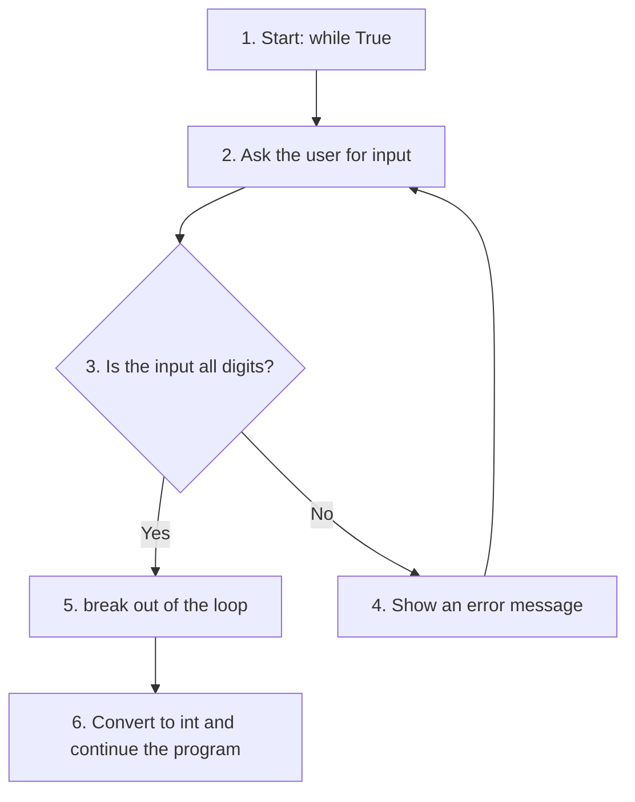
```mermaid
flowchart TD
    E1["1. Start: while True"] --> E2["2. Ask the user for input"]
    E2 --> E3{"3. Is the input all digits?"}
    E3 -- "Yes" --> E5["5. break out of the loop"]
    E3 -- "No" --> E4["4. Show an error message"]
    E4 --> E2
    E5 --> E6["6. Convert to int and continue the program"]
```

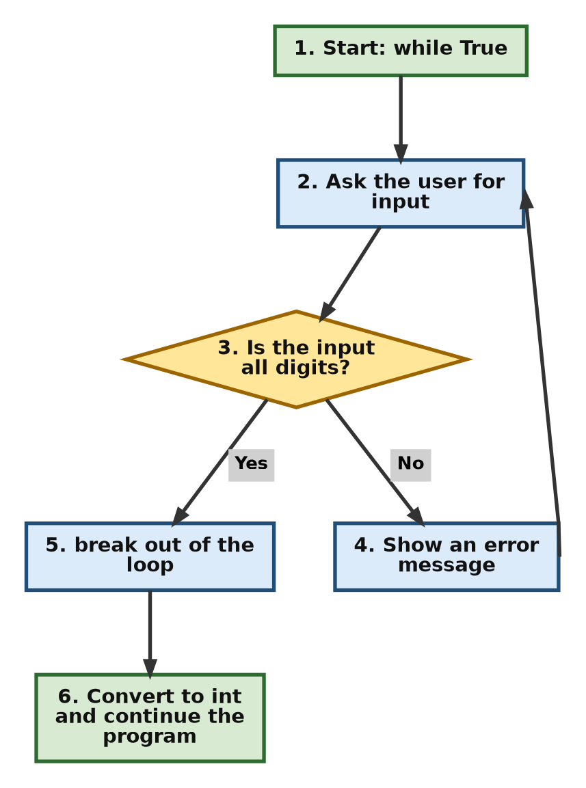

**Script**

```python
# Simulating do...until with while True

# Step 1 - Start a loop that has no exit condition of its own
while True:
    # Step 2 - The body always runs at least once
    my_age = input("Enter your age in years: ")

    # Step 3 - The "until" test sits at the bottom
    if my_age.isdigit():
        break                              # valid input, leave the loop

    # Step 4 - Only reached when the input was not valid
    print("Please type whole numbers only, like 25.")

# Step 5 - Safe to convert now
age = int(my_age)
print("Next year you will be", age + 1)
```

**Output** (a sample run; the text after each colon is what the user typed)

```text
Enter your age in years: twenty
Please type whole numbers only, like 25.
Enter your age in years: -5
Please type whole numbers only, like 25.
Enter your age in years: 25
Next year you will be 26
```

Notice that `-5` was rejected. The minus sign is not a digit, so `"-5".isdigit()` is `False`. For an age, that is what we want. Q8 in Part IV looks more closely at what `isdigit()` does and does not accept.

[Back to the Table of Contents](#table-of-contents)

### Q6. break versus continue

6.  **Differentiate between the "Emergency Exit" of break and the "Skip Button" of continue in a loop environment.**

**Answer**

`break` is the **emergency exit**. It ends the whole loop at once. The flow jumps straight to the first line after the loop body, no matter what the loop's condition says and no matter how many items are left.

`continue` is the **skip button**. It ends only the *current* round. Any code below `continue` in the loop body is skipped for this round, and Python goes back to the top of the loop. In a `for` loop, it moves to the next item. In a `while` loop, it checks the condition again.

| Point | `break` | `continue` |
|---|---|---|
| What ends | The whole loop | Only the current round |
| Where the flow goes next | First line after the loop | Top of the loop (next item or condition check) |
| Remaining rounds | Never run | Still run |
| Loop's `else` block (see Q8) | Skipped | Still runs if the loop ends normally |

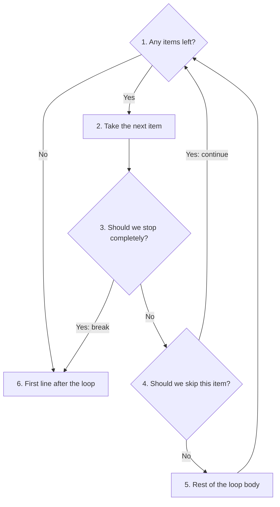
```mermaid
flowchart TD
    F1{"1. Any items left?"} -- "Yes" --> F2["2. Take the next item"]
    F1 -- "No" --> F9["6. First line after the loop"]
    F2 --> F3{"3. Should we stop completely?"}
    F3 -- "Yes: break" --> F9
    F3 -- "No" --> F4{"4. Should we skip this item?"}
    F4 -- "Yes: continue" --> F1
    F4 -- "No" --> F5["5. Rest of the loop body"]
    F5 --> F1
```

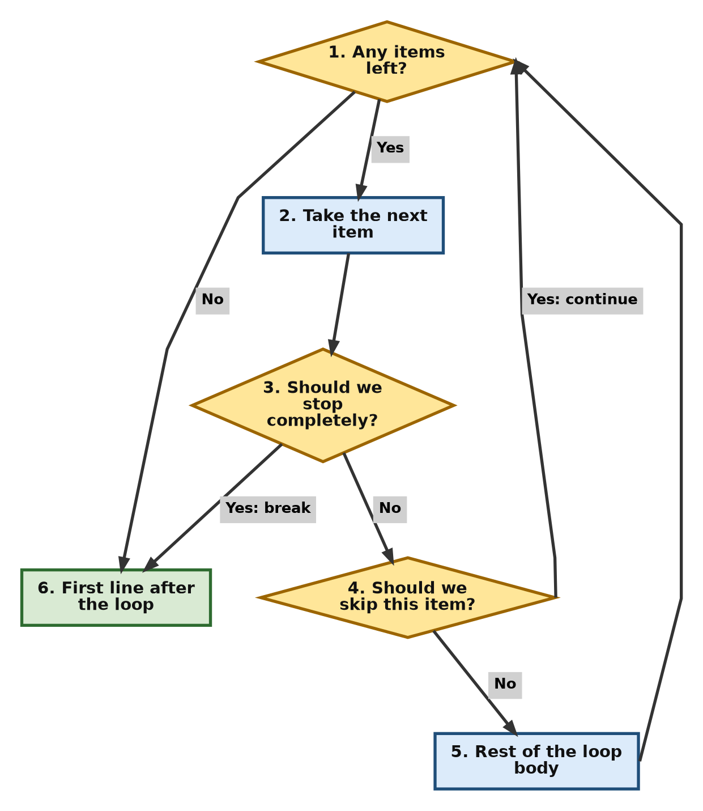

**Script**

```python
# break vs continue in the same loop

# Step 1 - continue skips the negative numbers
print("continue:")
for n in [4, -2, 7, -1, 9]:
    if n < 0:
        continue
    print("  processed", n)

# Step 2 - break stops at the first negative number
print("break:")
for n in [4, -2, 7, -1, 9]:
    if n < 0:
        print("  negative found, stopping")
        break
    print("  processed", n)

# Step 3 - With while, update the counter BEFORE continue
print("while with continue:")
i = 0
while i < 5:
    i = i + 1           # updated first, so continue cannot cause an endless loop
    if i == 3:
        continue
    print("  i =", i)
```

**Output**

```text
continue:
  processed 4
  processed 7
  processed 9
break:
  processed 4
  negative found, stopping
while with continue:
  i = 1
  i = 2
  i = 4
  i = 5
```

**Follow-up question:** In Step 3, what would happen if the line `i = i + 1` were moved to the *bottom* of the loop body, after the `print()`?

*Answer:* When `i` reached 3, `continue` would jump back to the top *before* `i` was increased. `i` would stay at 3 for ever and the loop would never end. With `while` loops, always make sure `continue` cannot skip the update line.

[Back to the Table of Contents](#table-of-contents)

### Q7. The pass Statement

7.  **What is the practical utility of the pass statement, and how does it prevent a script from crashing during the development phase.**

**Answer**

`pass` is a *null operation*: it tells Python to do absolutely nothing. It exists because Python's grammar requires every `if`, `elif`, `else`, `while`, `for`, `def` and `class` line to be followed by an indented block of at least one statement. An empty block is a syntax error.

This matters most in the "skeleton" stage of writing a program. You may know that a function, a loop or a branch is needed, but not yet have written its code. Leaving the block empty would stop the whole file from running with an `IndentationError` (a kind of `SyntaxError`). Putting `pass` there satisfies Python's rules without changing what the program does, so you can run and test the parts you have finished.

**Script**

```python
# pass keeps an unfinished program runnable

def calculate_interest(amount):
    pass                 # TODO: write the formula later

for choice in ["1", "2"]:
    if choice == "1":
        print("Balance shown")
    elif choice == "2":
        pass             # withdrawal feature not written yet

result = calculate_interest(1000)
print("calculate_interest returned", result)
print("Program finished without errors")
```

**Output**

```text
Balance shown
calculate_interest returned None
Program finished without errors
```

A function whose body is only `pass` returns `None`, because it never reaches a `return` statement.

Here is what happens if you leave the `elif` block empty instead:

```python
if choice == "1":
    print("Balance shown")
elif choice == "2":
                         # nothing here
print("Done")
```

```text
IndentationError: expected an indented block after 'elif' statement on line 3
```

**Follow-up question:** How is `pass` different from `continue`?

*Answer:* `pass` does nothing and the flow carries on to the very next line. `continue` skips the rest of the loop body and jumps back to the top of the loop. Swapping one for the other can change what a loop does.

[Back to the Table of Contents](#table-of-contents)

### Q8. The else Clause on a Loop

8.  **Explain the unique logic of the else clause in a Python loop and the specific condition under which it is skipped.**

**Answer**

Python lets you attach an `else` block to a `for` loop or a `while` loop. This `else` is best thought of as a **"no break" block** or completion block. It runs only if the loop reaches **natural completion**:

- for a `while` loop, when its condition becomes `False`;
- for a `for` loop, when it has used up all its items.

It also runs if the loop never went round at all, for example a `for` loop over an empty list, because that loop also ended without a `break`.

The key rule: if the loop is ended by a **forced stop**, that is a `break` statement, the `else` block is **skipped** entirely. The flow jumps right past the `else` to the first line after it. (A `return` inside the loop, or an unhandled error, also leaves without running the `else`.)

This makes loop `else` a useful tool for code that should run only when the loop was *not* interrupted.

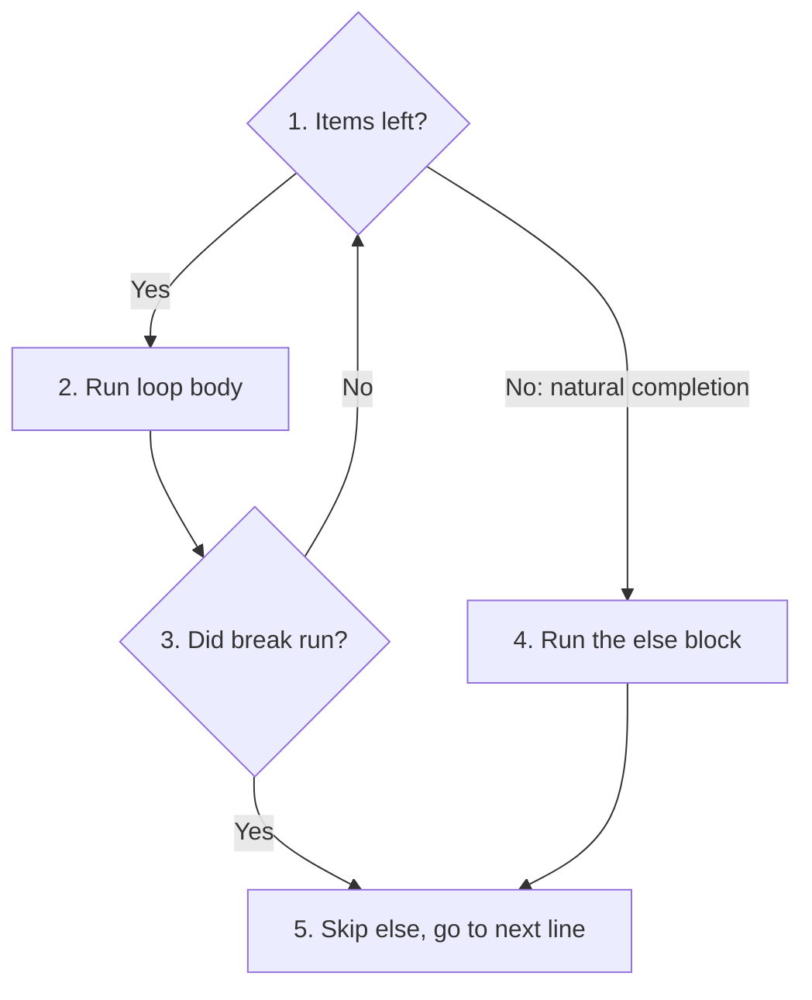
```mermaid
flowchart TD
    G1{"1. Items left?"} -- "Yes" --> G2["2. Run loop body"]
    G2 --> G3{"3. Did break run?"}
    G3 -- "No" --> G1
    G3 -- "Yes" --> G5["5. Skip else, go to next line"]
    G1 -- "No: natural completion" --> G4["4. Run the else block"]
    G4 --> G5
```

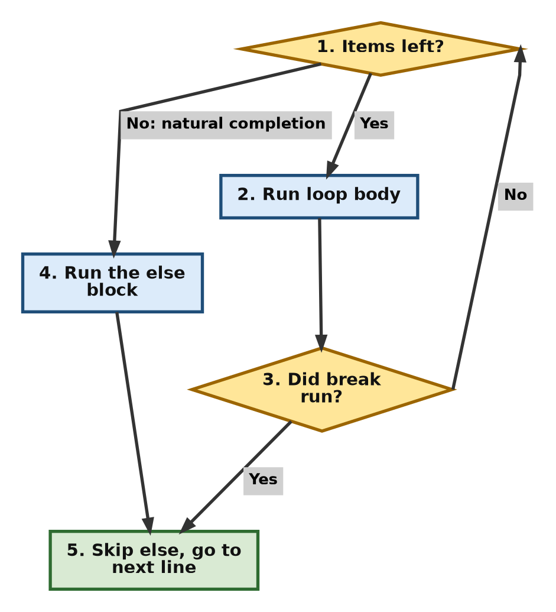

**Script**

```python
# When does the loop's else run?

def run(numbers, label):
    print(label)
    for n in numbers:
        if n == 0:
            print("  zero found, break")
            break
        print("  saw", n)
    else:
        print("  else block ran (no break happened)")

run([1, 2, 3], "Case 1 - natural completion:")
run([1, 0, 3], "Case 2 - stopped by break:")
run([],        "Case 3 - loop body never ran:")
```

**Output**

```text
Case 1 - natural completion:
  saw 1
  saw 2
  saw 3
  else block ran (no break happened)
Case 2 - stopped by break:
  saw 1
  zero found, break
Case 3 - loop body never ran:
  else block ran (no break happened)
```

[Back to the Table of Contents](#table-of-contents)

### Q9. A Search Using for...else

9.  **Identify a practical search-based use case for the while...else or for...else construct.**

**Answer**

The most common use of a loop `else` is a **search**, where you need to act only if the item was *not* found.

For example, to search a string for the letter `'z'`, loop through its characters and `break` as soon as a `'z'` turns up. If the loop finishes without hitting that `break`, the `else` block runs and prints a message such as "No 'z' was found."

Without loop `else`, you would need a separate **flag variable** (a `True`/`False` variable that remembers whether the item was found), and an extra `if` after the loop to check it. The `for...else` form removes the need for that flag.

**Steps**

1. Go through the items one by one.
2. If the current item is the one you want, report it and `break`.
3. If the loop reaches the end with no `break`, the `else` block reports "not found".

**Script**

```python
# Searching with for...else

# Step 1 - The data to search
words = ["python", "puzzle", "loop"]

for text in words:
    # Step 2 - Look at each character
    for ch in text:
        if ch == "z":
            print(f"'{text}': found a 'z'")
            break
    # Step 3 - Runs only when the inner loop did NOT break
    else:
        print(f"'{text}': no 'z' was found")

# Step 4 - The same search with a flag variable, for comparison
text = "python"
found = False
for ch in text:
    if ch == "z":
        found = True
        break
if not found:
    print(f"Flag version - '{text}': no 'z' was found")
```

**Output**

```text
'python': no 'z' was found
'puzzle': found a 'z'
'loop': no 'z' was found
Flag version - 'python': no 'z' was found
```

Note that the `else` here is lined up with the inner `for`, not with an `if`. Its indentation tells Python which loop it belongs to. Also note that "puzzle" has two z's, but the message appears only once, because `break` stops the search at the first one.

**Follow-up question:** Python already has the `in` operator. Why not just write `if "z" in text:`?

*Answer:* For a simple yes/no check, `in` is indeed the better choice. Loop `else` is useful when the search needs more than a simple equality test (for example, "find the first number greater than 100 that is also even"), or when you must do some work on each item while searching.

[Back to the Table of Contents](#table-of-contents)

### Q10. Nested for Loops and Each-to-Each Comparison

10.  **Describe the execution order of Nested for loops and how they are used for "Each-to-Each" comparisons.**

**Answer**

Nested loops work like the hands of a clock. The inner loop is the minute hand, and it must go all the way round before the outer loop, the hour hand, moves on by one step.

**Steps**

1. The outer loop picks its first item.
2. The inner loop runs through *all* of its items for that one outer item.
3. When the inner loop finishes, the outer loop picks its next item.
4. The inner loop starts again from its own first item.
5. This repeats until the outer loop has no items left.

This pattern is used for **each-to-each** comparisons, such as comparing every character of `str1` with every character of `str2` to find matches.

Nested loops are powerful, but they get slow quickly. The total number of rounds is the *product* of the two lengths. Two strings of 3 characters need 3 x 3 = 9 comparisons. Two lists of 1,000 items need 1,000 x 1,000 = one million comparisons. In computing, this growth is described as O(n²) or [quadratic time](https://en.wikipedia.org/wiki/Time_complexity#Quadratic_time).

**Script**

```python
# Nested loops: the inner loop finishes before the outer one moves on

str1 = "abc"
str2 = "cab"
count = 0

# Step 1 - Outer loop takes one character of str1
for c1 in str1:
    # Step 2 - Inner loop compares it with every character of str2
    for c2 in str2:
        count = count + 1
        result = "MATCH" if c1 == c2 else "-"
        print(f"compare {c1} with {c2}: {result}")

# Step 3 - Total comparisons = len(str1) * len(str2)
print("Total comparisons:", count, "=", len(str1), "x", len(str2))
```

**Output**

```text
compare a with c: -
compare a with a: MATCH
compare a with b: -
compare b with c: -
compare b with a: -
compare b with b: MATCH
compare c with c: MATCH
compare c with a: -
compare c with b: -
Total comparisons: 9 = 3 x 3
```

| Outer item (`c1`) | Inner loop visits (`c2`) | Matches in this round |
|---|---|---|
| `a` | `c`, `a`, `b` | 1 |
| `b` | `c`, `a`, `b` | 1 |
| `c` | `c`, `a`, `b` | 1 |

Advanced design choices and professional best practices often go beyond the core syntax. The final part looks at the protocols that work behind the scenes, and at newer features that make Python's flow control more flexible.

[Back to the Table of Contents](#table-of-contents)

## IV. Beyond the Basics: Advanced Paradigms and Best Practices

In modern Python, flow control is about more than `if` and `while`. It connects with performance, with the *iterator protocol* that powers every `for` loop, and with newer syntax designed to make code sturdier and more "Pythonic" in professional work. The questions in this part are a step up from the rest of the chapter. Do not worry if some ideas feel new; each one is explained from the ground up.

[Back to the Table of Contents](#table-of-contents)

### Q1. The Iterator Protocol

1.  **Explain the "Iterator Protocol" and how the iter() and next() functions allow for loops to traverse custom objects.**

**Answer**

A *protocol* in Python is simply an agreed set of methods that an object provides so other code can work with it. The **iterator protocol** is the agreement that lets a `for` loop "talk" to any collection.

Here is what a `for` loop does behind the scenes:

1. When the loop starts, it calls `iter()` on the object. This creates an **iterator**, a helper object that keeps track of the current position in the sequence.
2. Before each round, the loop calls `next()` on that iterator to get the next item.
3. The item is stored in the loop variable and the loop body runs.
4. When there are no items left, `next()` raises a `StopIteration` exception. The loop catches it quietly and ends. This is the signal that the data has run out.

Because of this protocol, Python can loop over strings and lists, and also over *any* object you create yourself, as long as it follows the rules:

- An **iterable** (something you can loop over) provides an `__iter__()` method that returns an iterator.
- An **iterator** provides a `__next__()` method that returns the next item or raises `StopIteration`. It also provides `__iter__()`, which simply returns the iterator itself.

(Method names with double underscores on both sides, like `__iter__`, are called "dunder" or *special methods*. Python calls them for you in certain situations. See [Special method names](https://docs.python.org/3/reference/datamodel.html#special-method-names).)

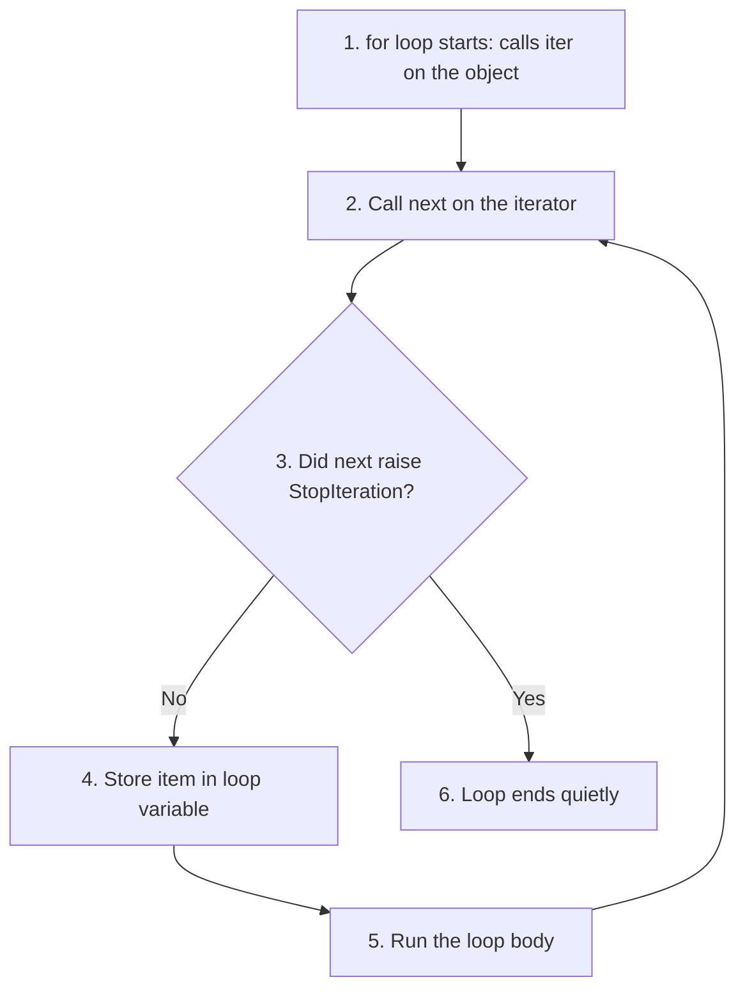
```mermaid
flowchart TD
    H1["1. for loop starts: calls iter on the object"] --> H2["2. Call next on the iterator"]
    H2 --> H3{"3. Did next raise StopIteration?"}
    H3 -- "No" --> H4["4. Store item in loop variable"]
    H4 --> H5["5. Run the loop body"]
    H5 --> H2
    H3 -- "Yes" --> H6["6. Loop ends quietly"]
```

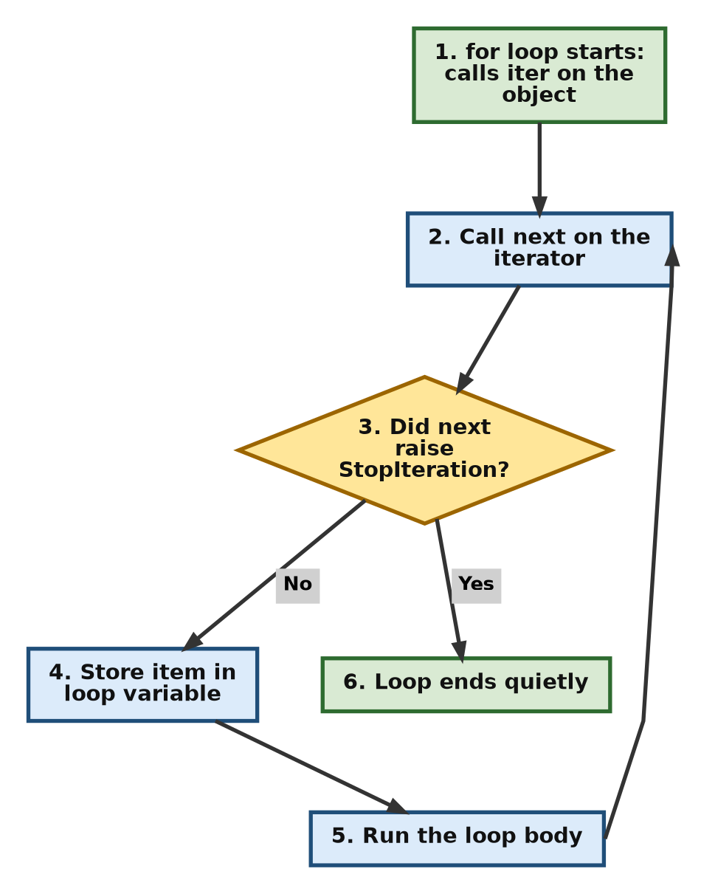

**Script**

```python
# What a for loop does behind the scenes

# Step 1 - Get an iterator from the string
word = "abc"
it = iter(word)

# Step 2 - Ask for items one at a time with next()
print(next(it))
print(next(it))
print(next(it))

# Step 3 - When items run out, next() raises StopIteration
try:
    next(it)
except StopIteration:
    print("StopIteration raised - a for loop would stop here")

# Step 4 - A custom object that a for loop can walk through
class Countdown:
    """Counts down from 'start' to 1."""

    def __init__(self, start):
        self.current = start

    def __iter__(self):
        # The object is its own iterator, so it returns itself
        return self

    def __next__(self):
        if self.current <= 0:
            raise StopIteration        # tells the for loop to stop
        value = self.current
        self.current = self.current - 1
        return value

# Step 5 - The for loop calls iter() and next() for us
for n in Countdown(3):
    print("Countdown:", n)
```

**Output**

```text
a
b
c
StopIteration raised - a for loop would stop here
Countdown: 3
Countdown: 2
Countdown: 1
```

Classes are covered later in the book. For now, just notice that `Countdown` works in a `for` loop only because it has the two methods `__iter__` and `__next__`. You can read more in the [Python Tutorial: Iterators](https://docs.python.org/3/tutorial/classes.html#iterators).

[Back to the Table of Contents](#table-of-contents)

### Q2. The Walrus Operator in while Loops

2.  **Discuss the "Walrus Operator" (:=) and how it can streamline while loop conditions by combining assignment and expression evaluation.**

**Answer**

The operator `:=` was added in Python 3.8. Its official name is the **assignment expression**, but it is widely called the "walrus operator" because `:=` looks a bit like a walrus's eyes and tusks lying on its side. (See [PEP 572](https://peps.python.org/pep-0572/).)

An ordinary `=` is a *statement*: it stores a value but cannot be used inside a condition. The walrus `:=` stores a value **and** hands that value back, so it can be used inside a condition.

In a `while` loop, this is handy for a pattern like:

```python
while (data := file.read(1024)):
    ...
```

This single line does three things: it reads up to 1,024 characters from the file, stores them in `data`, and checks whether `data` is non-empty. At the end of the file, `read()` returns an empty string, which is falsy, so the loop stops.

Without the walrus operator, you must read once *before* the loop and again at the *bottom* of the loop. Writing the same line twice is repetitive, and if the two copies ever differ (for example, one is changed and the other is forgotten), a bug appears.

**Script**

The script uses [`io.StringIO`](https://docs.python.org/3/library/io.html#io.StringIO), which behaves like a text file but lives in memory, so the example runs without needing a real file on your computer.

```python
# Reading data in chunks, with and without the walrus operator
import io

# Step 1 - A fake "file" in memory so the example runs anywhere
text = "ABCDEFGHIJ"

# Step 2 - Without walrus: read before the loop AND at the bottom
f = io.StringIO(text)
chunk = f.read(4)
while chunk:
    print("without walrus:", chunk)
    chunk = f.read(4)            # the same line written a second time

# Step 3 - With walrus: read and test in one place
f = io.StringIO(text)
while (chunk := f.read(4)):      # assign, then test the value
    print("with walrus   :", chunk)
```

**Output**

```text
without walrus: ABCD
without walrus: EFGH
without walrus: IJ
with walrus   : ABCD
with walrus   : EFGH
with walrus   : IJ
```

**Follow-up question:** Why are the brackets around `chunk := f.read(4)` a good idea?

*Answer:* In this simple case they are optional, but when the walrus is part of a larger condition, the brackets are needed. For example, `while (n := len(data)) > 10:` stores the length in `n` and then compares it. Without brackets, `n := len(data) > 10` would store `True` or `False` in `n` instead. Using brackets every time is a safe habit.

[Back to the Table of Contents](#table-of-contents)

### Q3. Dead Code and How Tools Find It

3.  **Analyze the professional concept of "Dead Code" from an architectural perspective, focusing on how static analysis tools identify unreachable logic.**

**Answer**

**Dead code** (also called *unreachable code*) is any part of a script that can never run. It does no harm while the program runs, but it confuses anyone reading the code later. They may spend time trying to understand, test or fix lines that never do anything.

There are two common kinds:

1. **Code after a transfer statement** ("post-termination code"): any line placed right after `return`, `break`, `continue` or `raise` in the same block. The flow has already left, so those lines can never be reached.
2. **Logically shadowed code**: a condition that can never be true because an earlier condition always catches it first. For example, `elif x > 10:` placed after `if x > 0:` is dead, because every number above 10 is also above 0 (see Q2 in Part II).

**Static analysis tools** examine code *without running it*. They are good at finding the first kind. [Pylint](https://pylint.readthedocs.io/) reports it as warning [`W0101: unreachable`](https://pylint.readthedocs.io/en/stable/user_guide/messages/warning/unreachable.html), and many code editors such as VS Code and PyCharm grey out or underline such lines. Tools such as [Vulture](https://github.com/jendrikseipp/vulture) look for functions, variables and imports that are never used anywhere.

The second kind is much harder for tools to spot, because it depends on the *meaning* of the conditions, not just their position. General tools like Pylint will usually *not* catch it. It is found mainly through careful reading, code review and testing with a range of input values.

Removing dead code keeps a codebase clean, so that every line has a real, reachable purpose.

**Script**

```python
# Two kinds of dead code

def grade(x):
    if x > 0:
        return "positive"
    elif x > 10:              # dead: any x > 10 was already caught above
        return "big"
    return "zero or negative"

def total(items):
    result = sum(items)
    return result
    print("Total is", result) # dead: nothing after return ever runs

print(grade(50))
print(total([1, 2, 3]))
```

**Output**

```text
positive
6
```

Note that `grade(50)` returned "positive", never "big", and the message "Total is 6" was never printed.

**What Pylint reports** (run `pip install pylint`, then `pylint dead_code.py` in a terminal; only the relevant lines are shown)

```text
dead_code.py:13:4: W0101: Unreachable code (unreachable)
```

Pylint found the line after `return` (line 13), but it said nothing about the dead `elif x > 10:` branch. This shows why tools help but cannot replace careful thinking.

[Back to the Table of Contents](#table-of-contents)

### Q4. EAFP versus LBYL

4.  **Contrast the "EAFP" (Easier to Ask Forgiveness than Permission) and "LBYL" (Look Before You Leap) programming styles.**

**Answer**

These are two ways of dealing with actions that might fail.

**LBYL (Look Before You Leap)** means checking first that an action is safe, and only then doing it. For example, `if my_age.isdigit():` before calling `int(my_age)`.

**EAFP (Easier to Ask Forgiveness than Permission)** means just trying the action inside a `try` block, and handling the error in an `except` block if it fails. This is often called the more "Pythonic" style. Both terms are defined in the official [Python Glossary: EAFP](https://docs.python.org/3/glossary.html#term-EAFP) and [LBYL](https://docs.python.org/3/glossary.html#term-LBYL).

LBYL is easy to understand, but EAFP is often sturdier in Python, for two reasons:

- **The check may not match the action.** Your test and Python's own rules may disagree. In the script below, `isdigit()` rejects `"-7"` and `" 8 "`, yet `int()` would happily convert both. With EAFP, the action itself decides, so there is no mismatch.
- **Things can change between the check and the action.** This is called a [race condition](https://en.wikipedia.org/wiki/Race_condition) or "time-of-check to time-of-use" problem. For example, a program checks that a file exists, but another program deletes it a split second before the file is opened. The check passed, yet the action still fails. This is a real risk with files, networks and programs that do several things at once (multi-threaded programs). EAFP avoids it because there is no gap between checking and acting.

EAFP is also efficient when failures are rare, since the normal case needs no extra check. When failures are common, LBYL can be quicker, because handling an exception costs more than a simple `if`.

| Point | LBYL | EAFP |
|---|---|---|
| Pattern | `if check: do_it()` | `try: do_it()` / `except SomeError:` |
| Style | Common in C and Java | Common and preferred in Python |
| Check matches the action exactly | Not always | Yes, the action is the check |
| Safe against race conditions | No | Yes |
| Fast when failures are rare | Good | Very good |
| Fast when failures are frequent | Very good | Good |

**Script**

```python
# LBYL and EAFP for the same job

def to_int_lbyl(text):
    # Look Before You Leap: check first, then act
    if text.isdigit():
        return int(text)
    return None

def to_int_eafp(text):
    # Easier to Ask Forgiveness than Permission: act, handle the failure
    try:
        return int(text)
    except ValueError:
        return None

for t in ["42", "-7", " 8 ", "4.5", "abc"]:
    print(f"{t!r:7} LBYL -> {to_int_lbyl(t)!s:5} EAFP -> {to_int_eafp(t)}")
```

**Output**

```text
'42'    LBYL -> 42    EAFP -> 42
'-7'    LBYL -> None  EAFP -> -7
' 8 '   LBYL -> None  EAFP -> 8
'4.5'   LBYL -> None  EAFP -> None
'abc'   LBYL -> None  EAFP -> None
```

The two styles agree on `"42"`, `"4.5"` and `"abc"`, but not on `"-7"` or `" 8 "`. The `int()` function allows a minus sign and spaces around the number, while `isdigit()` does not.

[Back to the Table of Contents](#table-of-contents)

### Q5. Speed of for-range versus a while Counter

5.  **Evaluate the performance impact of using range() in a loop versus manually incrementing a counter in a while loop.**

**Answer**

A `for` loop with `range()` is usually faster than a `while` loop with a counter that you increase by hand (`x += 1`).

The reason lies in how Python runs your code. Python first turns your script into small instructions called [bytecode](https://docs.python.org/3/glossary.html#term-bytecode), which the interpreter then carries out one by one.

- In a `for` loop over `range()`, producing the next number happens inside `range`'s own code, which is written in the C language and runs very fast. Each round needs only a few bytecode instructions.
- In a `while` loop, each round must load `x`, compare it with the limit, jump, load `x` again, add 1 and store the result. That is several extra bytecode instructions every single round, all carried out by the slower interpreter.

For a small loop the difference does not matter. For loops that run millions of times, as in data processing, the `for` loop's automatic stepping saves a noticeable amount of time. It is also shorter and cannot become an infinite loop through a forgotten update. You can see the actual bytecode yourself with the [`dis`](https://docs.python.org/3/library/dis.html) module.

**Script**

The script uses the [`timeit`](https://docs.python.org/3/library/timeit.html) module, which runs a piece of code several times and measures how long it takes.

```python
# Timing a for loop against a while loop
import timeit

def with_for():
    total = 0
    for x in range(1_000_000):
        total += x
    return total

def with_while():
    total = 0
    x = 0
    while x < 1_000_000:
        total += x
        x += 1
    return total

# Step 1 - Both give the same answer
print("same result:", with_for() == with_while())

# Step 2 - Run each 10 times and time it
t_for = timeit.timeit(with_for, number=10)
t_while = timeit.timeit(with_while, number=10)
print(f"for + range : {t_for:.2f} s")
print(f"while       : {t_while:.2f} s")
print(f"while took about {t_while / t_for:.1f} times as long")
```

**Output** (a sample run; your times will be different, depending on your computer and Python version)

```text
same result: True
for + range : 0.29 s
while       : 0.49 s
while took about 1.7 times as long
```

**Follow-up question:** Is `for` always faster, then?

*Answer:* For simple counting, almost always. But speed is not the only reason to choose a loop. If you do not know in advance how many rounds are needed, a `while` loop is the correct tool, and clear, correct code matters more than a small gain in speed.

[Back to the Table of Contents](#table-of-contents)

### Q6. Comparison Chaining and Maintainability

6.  **How does the use of "Comparison Chaining" improve code maintainability in professional mathematical scripts?**

**Answer**

**Comparison chaining** means writing several comparisons in one line, such as `if 0 < x < 100:`. Python reads it as `0 < x and x < 100`.

It makes code easier to maintain because it lowers the amount of thinking a reader must do. Instead of reading two separate conditions joined by `and`, and checking that they share the same variable, the reader sees one familiar mathematical range. This matches the way ranges are written in textbooks and specifications.

It also lowers the chance of mistakes when the code is updated. When someone later changes the range limits in a complex scientific or financial program, there is only one expression to edit, and the variable name appears only once, so there is less risk of typing the wrong variable in one half of the test.

There is also a small technical bonus: in a chain, the middle value is worked out **only once**. If that value comes from a function call, the function runs once, not twice. The script below shows this.

**Script**

```python
# Chained comparison vs 'and'

calls = 0
def middle():
    global calls
    calls = calls + 1
    return 50

# Step 1 - With 'and', middle() is called twice
calls = 0
print("and version    :", 0 < middle() and middle() < 100, "| calls =", calls)

# Step 2 - With chaining, middle() is called once
calls = 0
print("chained version:", 0 < middle() < 100, "| calls =", calls)
```

(The line `global calls` lets the function change the variable `calls` that lives outside it. Functions and `global` are covered in a later chapter.)

**Output**

```text
and version    : True | calls = 2
chained version: True | calls = 1
```

**Follow-up question:** What does `1 < 3 > 2` give?

*Answer:* `True`, because it means `1 < 3 and 3 > 2`, and both parts are true. Chains like this are legal, but they are hard to read. Keep chains in one direction, such as `a < b < c`, so they look like normal maths. The rules are in the Python docs under [Comparisons](https://docs.python.org/3/reference/expressions.html#comparisons).

[Back to the Table of Contents](#table-of-contents)

### Q7. Redundant else after Exhaustive Conditions

7.  **Describe the hazard of "Redundant Logic" in else blocks following a complete set of mathematically exhaustive conditions.**

**Answer**

Redundant logic occurs when an `else` block follows a set of `if`/`elif` conditions that already cover every possible case. A classic example is checking whether a number is greater than zero, less than zero, or equal to zero. For whole numbers, one of those three must be true, so an `else` after them can never run.

Professionals avoid this because it creates a dead code path (see Q3). Future maintainers may waste time wondering what strange edge case that `else` was meant to handle.

The usual fix is simple: turn the last `elif` into the `else`. Instead of `elif x == 0:` followed by a dead `else`, write just `else:` for the "zero" case.

There is one surprising exception worth knowing. For decimal numbers (`float`), Python has a special value called **NaN** ("Not a Number"), created by `float("nan")`. It is the result of undefined sums such as infinity minus infinity. NaN is not greater than, not less than, and not even equal to zero, or to anything else, including itself. So with floats, the "impossible" `else` *can* run. If your data might contain NaN, it is better to test for it openly with [`math.isnan()`](https://docs.python.org/3/library/math.html#math.isnan) than to leave a mysterious `else` behind.

**Script**

```python
# Is the final else really unreachable?

def sign(x):
    if x > 0:
        return "positive"
    elif x < 0:
        return "negative"
    elif x == 0:
        return "zero"
    else:
        return "not a number at all"

for value in [5, -3, 0, float("nan")]:
    print(value, "->", sign(value))
```

**Output**

```text
5 -> positive
-3 -> negative
0 -> zero
nan -> not a number at all
```

For whole numbers the `else` is truly dead. For `nan` it runs. Either way, the lesson is the same: every branch you write should have a clear, known purpose.

[Back to the Table of Contents](#table-of-contents)

### Q8. isdigit() as a Validation Filter

8.  **How does the isdigit() method function as a flow control "Filter" in data validation loops?**

**Answer**

The string method [`isdigit()`](https://docs.python.org/3/library/stdtypes.html#str.isdigit) returns `True` if a string is not empty and every character in it is a digit. Otherwise it returns `False`.

In a simulated `do...until` loop (see Q5 in Part III), this makes `isdigit()` a **filter**. It separates valid input, like `"25"`, from bad input, like letters or symbols. Using it as the condition for `break`, the program moves on only once the data has been checked. This prevents most `ValueError` crashes when the text is later converted with `int()`.

It is important to know the limits of this filter:

- **It rejects some valid numbers.** A minus sign, a decimal point and spaces are not digits. So `"-5"`, `"3.5"` and `" 42"` all fail. `isdigit()` is therefore suitable for whole numbers of zero or more, such as an age, but not for negative numbers or for input meant for `float()`.
- **It rejects the empty string.** If the user just presses Enter, `"".isdigit()` is `False`, which is what we want.
- **It accepts a few characters that `int()` cannot convert.** Some special Unicode characters count as digits, such as the superscript `²`. So `"²".isdigit()` is `True`, but `int("²")` still raises a `ValueError`.

For a stricter check, [`isdecimal()`](https://docs.python.org/3/library/stdtypes.html#str.isdecimal) accepts only characters that `int()` can convert. For full safety, many programmers combine the filter with EAFP (see Q4): use `try`/`except ValueError` around the conversion.

**Script**

```python
# What isdigit() accepts and rejects

samples = ["25", "007", "-5", "3.5", " 42", "", "²"]
for s in samples:
    ok = s.isdigit()
    if ok:
        try:
            result = int(s)
        except ValueError:
            result = "ValueError!"
    else:
        result = "rejected by the filter"
    print(f"{s!r:6} isdigit={ok!s:5} -> {result}")
```

**Output**

```text
'25'   isdigit=True  -> 25
'007'  isdigit=True  -> 7
'-5'   isdigit=False -> rejected by the filter
'3.5'  isdigit=False -> rejected by the filter
' 42'  isdigit=False -> rejected by the filter
''     isdigit=False -> rejected by the filter
'²'    isdigit=True  -> ValueError!
```

| Input | `isdigit()` | `int()` works? | Good filter result? |
|---|---|---|---|
| `"25"` | True | Yes | Yes |
| `"-5"` | False | Yes | Rejects a valid integer |
| `"3.5"` | False | No | Yes (for whole numbers) |
| `""` | False | No | Yes |
| `"²"` | True | No | Lets bad input through |

[Back to the Table of Contents](#table-of-contents)

### Q9. Fine-Grained Error Locations in Python 3.11

9.  **Analyze how Python 3.11's "Fine-grained Error Locations" in tracebacks assist in debugging complex flow control structures.**

**Answer**

Python 3.11 improved its error reports (tracebacks). They now point to the **exact part of a line** that caused the error, not just the line number. This feature comes from [PEP 657](https://peps.python.org/pep-0657/).

This is a big help when debugging complex `if` statements. Take a line like:

```python
if result_a / result_b > 10 and data['key'] == 0:
```

Two different things could go wrong on this line: dividing by zero, or looking up a dictionary key that does not exist. Older versions of Python only told you the line number, and you had to work out which part failed. Python 3.11 draws marks (`~` and `^`) under the exact expression that failed. This lets you see at once which part of a compound condition is at fault, and makes the debugging of flow logic much quicker.

**Steps to read a Python 3.11 traceback**

1. Read the **last line** first. It names the error type and gives a short message.
2. Look at the `File ..., line ...` line to find where it happened.
3. Look at the code line shown, and at the `~` and `^` marks under it. The `^` marks point to the exact operation that failed; the `~` marks show the parts that operation was working on.

**Script 1: missing dictionary key**

```python
result_a = 60
result_b = 5
data = {"name": "Asha"}          # note: there is no 'key' in this dictionary

# 60 / 5 = 12, and 12 > 10 is True, so Python goes on to check data['key']
if result_a / result_b > 10 and data['key'] == 0:
    print("condition met")
```

**Output** (Python 3.11)

```text
Traceback (most recent call last):
  File "traceback_demo.py", line 6, in <module>
    if result_a / result_b > 10 and data['key'] == 0:
                                    ~~~~^^^^^^^
KeyError: 'key'
```

**Script 2: division by zero** (the same script with `result_b = 0`)

**Output** (Python 3.11)

```text
Traceback (most recent call last):
  File "traceback_demo.py", line 6, in <module>
    if result_a / result_b > 10 and data['key'] == 0:
       ~~~~~~~~~^~~~~~~~~~
ZeroDivisionError: division by zero
```

The line of code is the same in both cases, but the marks clearly show which part failed. In Python 3.10 and earlier, both reports would show only the line, with no marks. Newer versions (3.13 and later) also add colour to tracebacks in the terminal.

The screenshot below shows both scripts run in a terminal with Python 3.13. The part that failed is shown in red, and the error name in bold, which makes the failing part of the line even easier to spot.

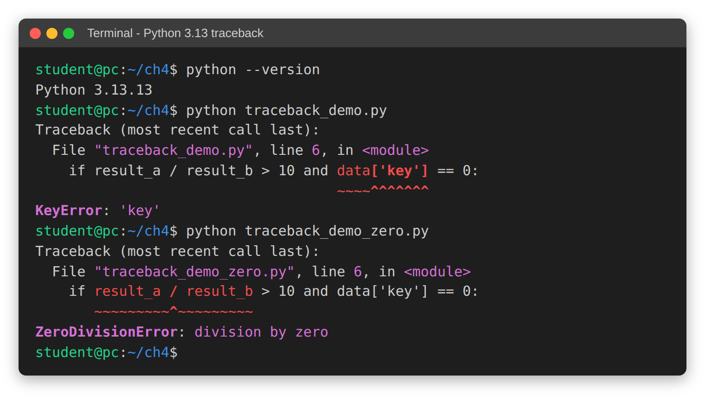

**Follow-up question:** In Script 1, what happens if you change `result_a` to `50`?

*Answer:* No error at all, and nothing is printed. `50 / 5` is `10`, and `10 > 10` is `False`. Because of short-circuit evaluation, once the left side of `and` is `False`, Python does not check the right side, so `data['key']` is never looked up. A hidden bug like this may stay unnoticed until the data changes, which is why testing with several values is important.

[Back to the Table of Contents](#table-of-contents)

### Q10. ExceptionGroup and except* in Python 3.11

10.  **Evaluate the impact of ExceptionGroup and except\* (Python 3.11+) as a new paradigm for "multi-branch" flow control in asynchronous tasks.**

**Answer**

Python 3.11 added [`ExceptionGroup`](https://docs.python.org/3/library/exceptions.html#ExceptionGroup) and the `except*` syntax. Together they create a new kind of multi-branch flow control, made for handling **several errors that happen at the same time**. (See [PEP 654](https://peps.python.org/pep-0654/).)

Why is this needed? In *asynchronous* programs, several tasks run side by side, for example downloading ten web pages at once. (The word "asynchronous" means the tasks do not wait for each other to finish.) Two or three of them might fail at the same moment, each with a different error. An ordinary `try`...`except` can deal with only **one** exception: the first `except` clause that matches handles it, and the handling ends there. The other errors would be lost.

An `ExceptionGroup` bundles several exceptions together into one object. With `except*`:

- **Each** `except*` clause takes out the part of the group that matches its type.
- **More than one** `except*` clause can run for the same group, one after another.
- Any exceptions left over after all clauses have run are raised again, so none are silently ignored.

This is a real change in design. It lets the program respond to a whole *bundle* of failures, instead of being limited to a single, straight-line error-handling path. It is essential for sturdy modern programs. In practice, you meet it most often with [`asyncio.TaskGroup`](https://docs.python.org/3/library/asyncio-task.html#task-groups), which runs several tasks together and collects all their failures into one `ExceptionGroup`.

| Point | `except` | `except*` |
|---|---|---|
| Handles | One exception | A group of exceptions |
| How many clauses can run | Only one | Several, one per matching type |
| Python version | All | 3.11 and later |
| Typical use | Ordinary code | Tasks running at the same time |

**Script 1: the basic idea**

```python
# Handling several errors at once (Python 3.11 or later)

# Step 1 - Pretend three tasks failed at the same time
errors = ExceptionGroup("three tasks failed", [
    ValueError("task 1: bad value"),
    TypeError("task 2: wrong type"),
    ValueError("task 3: another bad value"),
])

# Step 2 - Each except* clause takes its own share of the group
try:
    raise errors
except* ValueError as group:
    print("ValueError handler got", len(group.exceptions), "errors:")
    for e in group.exceptions:
        print("  -", e)
except* TypeError as group:
    print("TypeError handler got", len(group.exceptions), "error:")
    for e in group.exceptions:
        print("  -", e)

# Step 3 - Program carries on after all handlers have run
print("All errors handled, program continues")
```

**Output**

```text
ValueError handler got 2 errors:
  - task 1: bad value
  - task 3: another bad value
TypeError handler got 1 error:
  - task 2: wrong type
All errors handled, program continues
```

Both handlers ran. With a plain `except`, only one of them could have run.

**Script 2: a real use with asyncio**

This script is for readers who want to see where `except*` is used in practice. `async`, `await` and `asyncio` are advanced topics. Here it is enough to know that the three `fetch` tasks run at the same time.

```python
# Real use: asyncio.TaskGroup collects the failures of tasks run together
import asyncio

async def fetch(name, fail_with=None):
    await asyncio.sleep(0.1)          # pretend to wait for a network reply
    if fail_with:
        raise fail_with
    print(f"{name}: done")

async def main():
    try:
        # Step 1 - Start three tasks together
        async with asyncio.TaskGroup() as tg:
            tg.create_task(fetch("A"))
            tg.create_task(fetch("B", ValueError("B got bad data")))
            tg.create_task(fetch("C", ConnectionError("C lost the network")))
    # Step 2 - Handle each kind of failure separately
    except* ValueError as g:
        print("Data problem   :", [str(e) for e in g.exceptions])
    except* ConnectionError as g:
        print("Network problem:", [str(e) for e in g.exceptions])

asyncio.run(main())
```

**Output**

```text
A: done
Data problem   : ['B got bad data']
Network problem: ['C lost the network']
```

[Back to the Table of Contents](#table-of-contents)

## Quick Revision Summary

| Topic | Key idea to remember |
|---|---|
| Three building blocks | Sequence (in order), selection (choose a path), iteration (repeat) |
| Transfer statements | `break` leaves a loop, `continue` skips a round, `return` leaves a function |
| Truthiness | Empty or zero means `False`; everything else means `True` |
| Testing for missing data | Use `is None`, not `not value` |
| Rule of One | In an `if`-`elif`-`else` chain, only the first `True` branch runs |
| Order of `elif` | Most specific condition first, most general last |
| `else` | Catch-all with no condition of its own |
| `match`-`case` | Cleaner menus; `\|` for "or"; `case _:` as the catch-all; guards add an `if` |
| Deep nesting | Flatten with `elif`, `and` / `or`, and early `return` |
| `for` vs `while` | `for` for "each item" or "N times"; `while` for "until something happens" |
| `range()` | Stop value not included; stores only start, stop and step |
| `do...until` | `while True:` with an `if ...: break` at the bottom |
| `pass` | Does nothing; fills an empty block |
| Loop `else` | Runs only if the loop was not ended by `break` |
| Nested loops | Inner loop completes fully for each outer round; cost = product of lengths |
| Iterator protocol | `iter()` gets an iterator; `next()` gets items until `StopIteration` |
| Walrus `:=` | Assign and test in the same expression |
| EAFP vs LBYL | Try and handle the error, or check first |
| Python 3.11 tracebacks | `~` and `^` marks show the exact failing part of a line |
| `except*` | Several handlers can run for one `ExceptionGroup` |

[Back to the Table of Contents](#table-of-contents)

