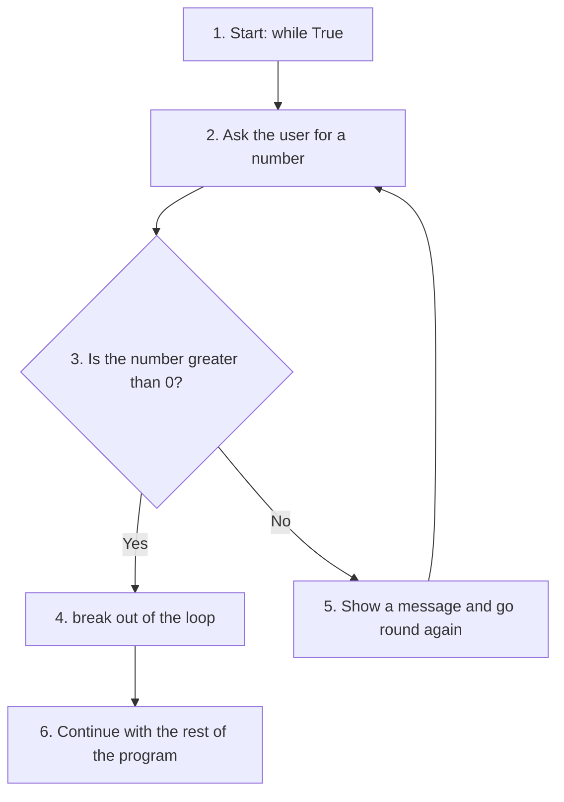
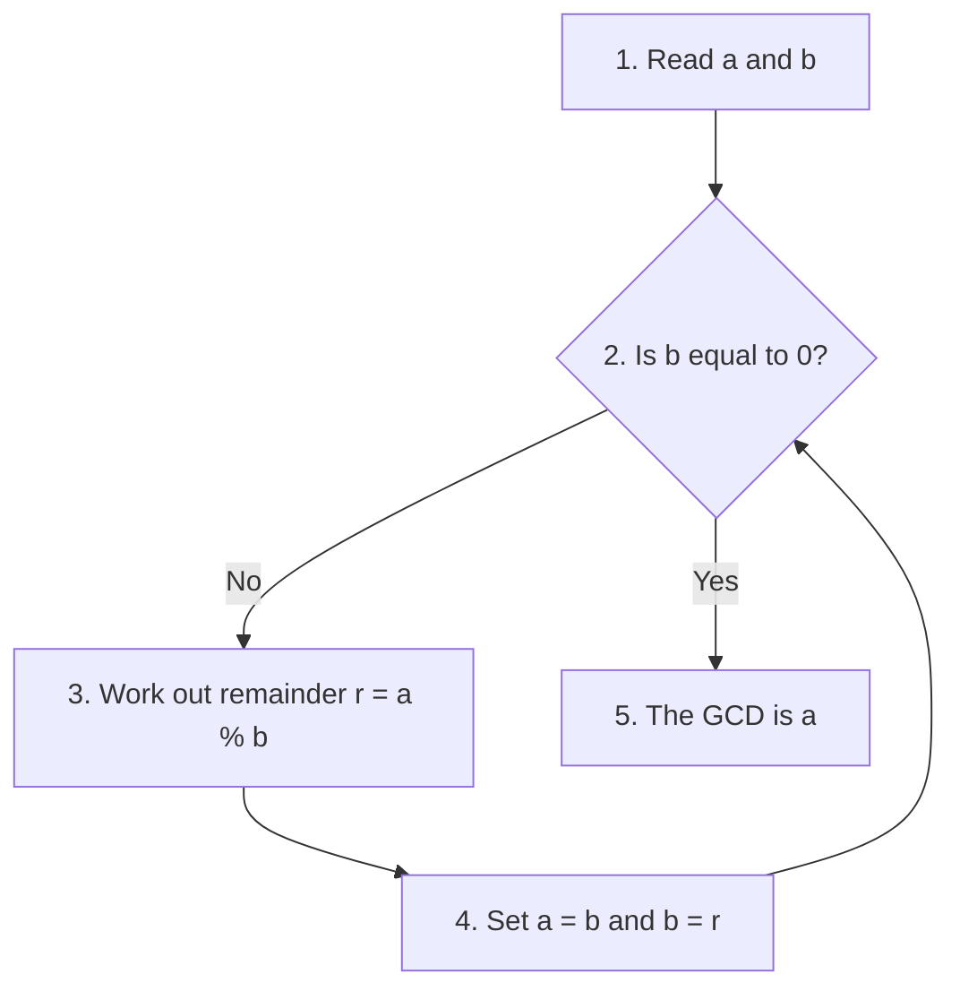
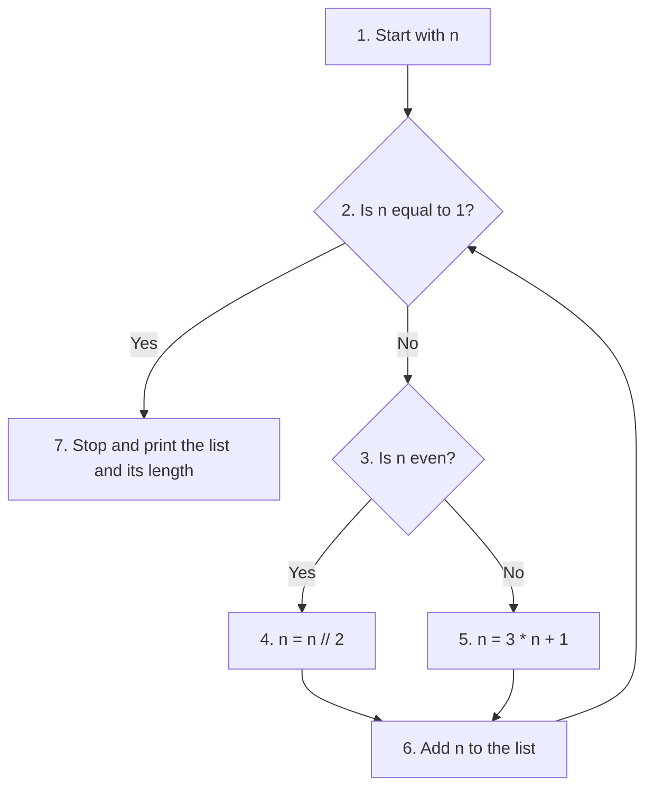
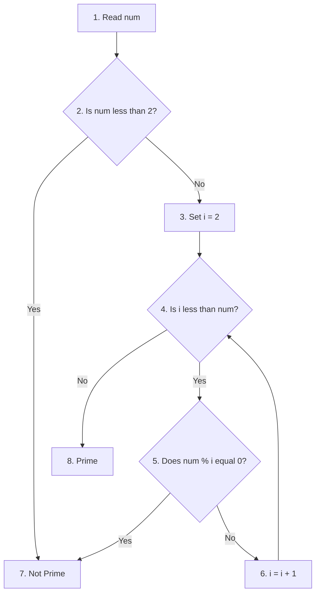

# Chapter 4: Flow Control - Questions and Answers

This page holds the answers to the end-of-chapter questions of Chapter 4 (Flow Control). It has two parts:

1. **Conceptual questions.** These test your understanding of the ideas behind flow control: how Python decides whether something is true, how to avoid deeply nested `if` statements, how to build a `do...until` loop, when to use `for` and when to use `while`, and more.
2. **Programming exercises.** These ask you to write short scripts: checking a range, testing for even or odd, adding up a series, finding a GCD, Armstrong numbers, the hailstone sequence, prime numbers, and the sum of digits.

Flow control is what lets a program make choices and repeat work. Without it, a script could only run its lines once, from top to bottom. Nearly every useful Python program depends on the tools covered here: `if`, `elif`, `else`, `for`, `while`, `range()`, `break`, `continue` and `pass`. The exercises on this page use these tools in small, complete programs, so they are good practice before moving on to later chapters.

Each answer explains the idea step by step. The scripts have `# Step` comments so you can follow the logic line by line, and each script is followed by its output. Where a script asks for input, the output shows a sample run, with the values typed by the user shown after the prompt.

For forty more in-depth conceptual questions on this chapter, see [Chapter 4: Flow Control - Conceptual Questions and Answers](03-2-ch4-conceptual-qa.md).

## Table of Contents

- [Chapter 4: Flow Control - Questions and Answers](#chapter-4-flow-control---questions-and-answers)
  - [Key Terms Used on This Page](#key-terms-used-on-this-page)
  - [Conceptual Questions and Answers](#conceptual-questions-and-answers)
    - [a. Python interprets non-zero values as True](#a-python-interprets-non-zero-values-as-true)
    - [b. What are nested if-else statements? How can you avoid them?](#b-what-are-nested-if-else-statements-how-can-you-avoid-them)
    - [c. Logical operators can help avoid nested if-else statements. How?](#c-logical-operators-can-help-avoid-nested-if-else-statements-how)
    - [d. Python does not have do...until syntax. How to implement it?](#d-python-does-not-have-dountil-syntax-how-to-implement-it)
    - [e. What is the use of the pass statement?](#e-what-is-the-use-of-the-pass-statement)
    - [f. Definite vs. Indefinite loops](#f-definite-vs-indefinite-loops)
    - [g. What is an infinite loop?](#g-what-is-an-infinite-loop)
    - [h. Nested for loops for comparing two collections](#h-nested-for-loops-for-comparing-two-collections)
    - [i. When should you use `while` versus `for`?](#i-when-should-you-use-while-versus-for)
    - [j. `range()` creates arithmetic progressions](#j-range-creates-arithmetic-progressions)
    - [Additional Questions](#additional-questions)
      - [k. What is short-circuit evaluation?](#k-what-is-short-circuit-evaluation)
      - [l. What is the purpose of continue?](#l-what-is-the-purpose-of-continue)
  - [Programming Exercises - Questions and Answers](#programming-exercises---questions-and-answers)
    - [a. Write a Python program to test whether a number is between 1000 and 2000.](#a-write-a-python-program-to-test-whether-a-number-is-between-1000-and-2000)
    - [b. Program to check whether a number is even or odd.](#b-program-to-check-whether-a-number-is-even-or-odd)
    - [c. Compute the sum: 1/2 + 2/3 + 3/4 + ... + n/(n+1)](#c-compute-the-sum-12--23--34----nn1)
    - [d. Generator for numbers divisible by 3 and 5 between 0 and 100.](#d-generator-for-numbers-divisible-by-3-and-5-between-0-and-100)
    - [e. GCD using Euclidean Algorithm.](#e-gcd-using-euclidean-algorithm)
    - [f. Armstrong numbers between 1 and 1000.](#f-armstrong-numbers-between-1-and-1000)
    - [g. Hailstone sequence - iterative and recursive.](#g-hailstone-sequence---iterative-and-recursive)
      - [Iterative Method](#iterative-method)
      - [Recursive Method](#recursive-method)
    - [h. Check for Prime](#h-check-for-prime)
    - [i. Sum of digits of a number](#i-sum-of-digits-of-a-number)

## Key Terms Used on This Page

| Term | Meaning in simple words | Learn more |
|---|---|---|
| Boolean context | Any place where Python needs a True/False answer, such as after `if` or `while`. | [Truth Value Testing](https://docs.python.org/3/library/stdtypes.html#truth-value-testing) |
| Truthy / falsy | A value that Python treats as `True` (truthy) or as `False` (falsy) in a Boolean context. | [Truth Value Testing](https://docs.python.org/3/library/stdtypes.html#truth-value-testing) |
| Logical operators | `and`, `or` and `not`, used to combine or reverse conditions. | [Boolean operations](https://docs.python.org/3/reference/expressions.html#boolean-operations) |
| Short-circuit evaluation | Python stops checking a condition as soon as the final answer is known. | [Boolean operations](https://docs.python.org/3/reference/expressions.html#boolean-operations) |
| `%` (modulo) | Gives the remainder after division. `17 % 5` is `2`. | [Numeric operations](https://docs.python.org/3/library/stdtypes.html#numeric-types-int-float-complex) |
| `//` (floor division) | Divides and drops the fraction. `17 // 5` is `3`. | [Numeric operations](https://docs.python.org/3/library/stdtypes.html#numeric-types-int-float-complex) |
| Definite loop | A loop that runs a known number of times (usually `for`). | [The for statement](https://docs.python.org/3/tutorial/controlflow.html#for-statements) |
| Indefinite loop | A loop that runs until a condition changes (usually `while`). | [The while statement](https://docs.python.org/3/reference/compound_stmts.html#the-while-statement) |
| Infinite loop | A loop that never stops by itself. | [Wikipedia: Infinite loop](https://en.wikipedia.org/wiki/Infinite_loop) |
| Generator | A function that uses `yield` to hand out values one at a time instead of all at once. | [Python Tutorial: Generators](https://docs.python.org/3/tutorial/classes.html#generators) |
| Recursion | A function that solves a problem by calling itself on a smaller version of it. | [Wikipedia: Recursion (computer science)](https://en.wikipedia.org/wiki/Recursion_(computer_science)) |
| Floating-point number | A number with a decimal point (`float`). Stored in binary, so tiny rounding errors can appear. | [Floating-Point Arithmetic](https://docs.python.org/3/tutorial/floatingpoint.html) |

[Back to the Table of Contents](#table-of-contents)

## Conceptual Questions and Answers

[Back to the Table of Contents](#table-of-contents)

### a. Python interprets non-zero values as True

**Answer**

In Python, any non-zero number, positive or negative, is treated as **True** in a Boolean context. Only zero (`0`, `0.0`) is treated as **False**.

A "Boolean context" is any place where Python expects a True/False answer, for example right after `if` or `while`. You do not have to write `if x != 0:`. Writing `if x:` is enough, and Python works out the rest.

**Steps Python follows for `if -5:`**

1. Python needs a True/False answer, but it has been given the number `-5`.
2. It asks: "Is this number zero?"
3. `-5` is not zero, so it counts as `True`.
4. The indented block runs.

**Script**

```python
# Which values count as True?

# Step 1 - Negative and positive numbers are True
if -5:
    print("Negative numbers are True")

if 10:
    print("Positive numbers are also True")

# Step 2 - Zero is False, so this block is skipped
if 0:
    print("This will not print because 0 is False")

# Step 3 - Check a few values directly with bool()
for value in [-5, 10, 0, 0.0, 0.25]:
    print(f"bool({value}) = {bool(value)}")
```

**Output**

```text
Negative numbers are True
Positive numbers are also True
bool(-5) = True
bool(10) = True
bool(0) = False
bool(0.0) = False
bool(0.25) = True
```

The built-in function `bool()` shows you how Python will judge any value.

The same idea applies to other kinds of values. The rule to remember is: **empty or zero means False; everything else means True.**

| Value | Treated as |
|---|---|
| Any non-zero number: `-5`, `10`, `0.25` | True |
| `0`, `0.0` | False |
| Non-empty string, list, tuple or dictionary: `"hi"`, `[1]` | True |
| Empty string, list, tuple or dictionary: `""`, `[]`, `()`, `{}` | False |
| `None` | False |

**Follow-up question:** Is the string `"0"` True or False?

*Answer:* True. It is a string with one character in it, so it is not empty. Only the *number* `0` is False.

[Back to the Table of Contents](#table-of-contents)

### b. What are nested if-else statements? How can you avoid them?

**Answer**

A nested if-else means placing one `if`-`else` block inside another. The inner block is checked only when the outer condition has already been met.

Nesting works, but each extra level pushes the code further to the right. After two or three levels, the code becomes hard to read, and it is easy to lose track of which `else` belongs to which `if`.

You can avoid nesting in two main ways:

1. **Logical operators** (`and`, `or`, `not`) combine two tests into one line.
2. **`elif`** lets you list the different cases one below the other, at the same level, instead of one inside another.

Here is a short nested example:

```python
age = 16
if age >= 13:
    if age < 18:
        print("Teenager")
```

The same logic without nesting, using `and`:

```python
age = 16
if age >= 13 and age < 18:
    print("Teenager")
```

Both print `Teenager`. The second version says the same thing in one condition.

**Script**

This script shows a full nested if-else (with `else` parts) next to a flat version using `and` and `elif`, and tests both with three ages.

```python
# Nested if-else versus a flat version

# Step 1 - Try three different ages
for age in [10, 16, 25]:

    # Step 2 - Nested version: an if-else inside another if-else
    if age >= 13:
        if age < 18:
            nested = "Teenager"
        else:
            nested = "Adult"
    else:
        nested = "Child"

    # Step 3 - Flat version using 'and' and elif
    if age >= 13 and age < 18:
        flat = "Teenager"
    elif age >= 18:
        flat = "Adult"
    else:
        flat = "Child"

    print(f"age {age}: nested -> {nested:8} flat -> {flat}")
```

**Output**

```text
age 10: nested -> Child    flat -> Child
age 16: nested -> Teenager flat -> Teenager
age 25: nested -> Adult    flat -> Adult
```

Both versions always agree, but the flat one is easier to read: each case sits on its own line at the same level.

Python also allows **comparison chaining**, which is even shorter: `if 13 <= age < 18:` means exactly the same as `if age >= 13 and age < 18:`.

[Back to the Table of Contents](#table-of-contents)

### c. Logical operators can help avoid nested if-else statements. How?

**Answer**

Logical operators like `and`, `or` and `not` combine conditions, so you don't need an inner `if` block for each extra test.

- **`and`**: the whole condition is True only if **both** parts are True. It replaces an `if` inside another `if`.
- **`or`**: the whole condition is True if **at least one** part is True. It replaces two separate `if` blocks that do the same thing.
- **`not`**: reverses the result. `not True` is `False`, and `not False` is `True`.

| A | B | `A and B` | `A or B` | `not A` |
|---|---|---|---|---|
| True | True | True | True | False |
| True | False | False | True | False |
| False | True | False | True | True |
| False | False | False | False | True |

For example, "pass but not distinction" needs two tests: the score must be at least 50, **and** it must be below 90. Written with nesting, this would need an `if` inside an `if`. With `and`, it fits in one line.

**Script**

```python
# Logical operators replace inner if blocks

# Step 1 - 'and': both conditions must be True
for score in [45, 75, 95]:
    if score >= 50 and score < 90:
        print(score, "-> Pass but not distinction")
    else:
        print(score, "-> Not in the 50 to 89 range")

# Step 2 - 'or': at least one condition must be True
day = "Sunday"
if day == "Saturday" or day == "Sunday":
    print(day, "-> Weekend")

# Step 3 - 'not': reverses True and False
is_raining = False
if not is_raining:
    print("No rain -> go for a walk")
```

**Output**

```text
45 -> Not in the 50 to 89 range
75 -> Pass but not distinction
95 -> Not in the 50 to 89 range
Sunday -> Weekend
No rain -> go for a walk
```

[Back to the Table of Contents](#table-of-contents)

### d. Python does not have do...until syntax. How to implement it?

**Answer**

Some languages have a `do...until` loop. Its body always runs **at least once**, and the test to stop comes at the **end** of each round. Python has no such loop. An ordinary `while` loop tests its condition *before* each round, so its body might not run at all.

To get the same effect in Python, use a `while True` loop with a `break` when the condition becomes true:

1. `while True:` starts a loop that would run for ever on its own, so the body is sure to run the first time.
2. The body does its work, for example reading a number from the user.
3. At the bottom, an `if` checks the "until" condition.
4. If the condition is True, `break` ends the loop.
5. If not, the loop goes round again.



**Script 1: the basic pattern**

```python
# do...until: ask for a number UNTIL a positive number is entered

# Step 1 - Start a loop that has no condition of its own
while True:
    # Step 2 - The body always runs at least once
    x = int(input("Enter a number: "))

    # Step 3 - The "until" test is at the bottom
    if x > 0:
        break                    # condition met, leave the loop

    # Step 4 - Reached only when the number was not positive
    print("That is not positive. Try again.")

# Step 5 - The program continues after the loop
print("You entered", x)
```

**Output** (sample run)

```text
Enter a number: -4
That is not positive. Try again.
Enter a number: 0
That is not positive. Try again.
Enter a number: 7
You entered 7
```

**Script 2: a safer version**

Script 1 crashes if the user types something that is not a whole number, such as `abc`:

```text
ValueError: invalid literal for int() with base 10: 'abc'
```

Script 2 catches that error with `try` and `except` and asks again instead of crashing. (`try`/`except` is explained in the chapter on exceptions; here it simply means "try to convert; if that fails, run the `except` block".)

```python
# A safer version that also rejects text such as "abc"

while True:
    # Step 1 - Read the input as text first
    text = input("Enter a positive whole number: ")

    # Step 2 - Try to convert it; handle bad input instead of crashing
    try:
        x = int(text)
    except ValueError:
        print("That is not a whole number. Try again.")
        continue                 # go back to the top of the loop

    # Step 3 - The "until" test
    if x > 0:
        break
    print("That is not positive. Try again.")

print("You entered", x)
```

**Output** (sample run)

```text
Enter a positive whole number: abc
That is not a whole number. Try again.
Enter a positive whole number: -2
That is not positive. Try again.
Enter a positive whole number: 12
You entered 12
```

[Back to the Table of Contents](#table-of-contents)

### e. What is the use of the pass statement?

**Answer**

`pass` is a placeholder. It is used when Python's rules require a statement but you don't want to do anything yet.

Python requires every `if`, `else`, `for`, `while`, `def` and `class` line to be followed by an indented block with at least one statement. If you leave the block empty, Python stops with an `IndentationError` before running anything. `pass` fills the gap. It does nothing at all, so the program's behaviour does not change.

This is most useful while you are still building a program. You can write the outline first, put `pass` where the details will go, and test the finished parts straight away.

**Script**

```python
# pass as a placeholder

# Step 1 - A loop whose body will be written later
for i in range(5):
    pass  # TODO: implement later

# Step 2 - A function that is planned but not written yet
def print_receipt():
    pass

# Step 3 - The program still runs without errors
print_receipt()
print("Loop finished. Last value of i:", i)
print("Program ran without errors")
```

**Output**

```text
Loop finished. Last value of i: 4
Program ran without errors
```

The loop really did run five times (the last value of `i` is 4), even though its body did nothing.

**Follow-up question:** What happens if you leave out `pass` and write nothing inside the loop?

*Answer:* Python refuses to run the file and reports an error such as `IndentationError: expected an indented block after 'for' statement on line 4`.

[Back to the Table of Contents](#table-of-contents)

### f. Definite vs. Indefinite loops

**Answer**

- **for loop (definite)**: the number of iterations (rounds) is known before the loop starts. It runs once for each item in a list, string or `range()`.
- **while loop (indefinite)**: the number of iterations is not known in advance. It keeps running as long as a condition stays True.

| Point | Definite loop (`for`) | Indefinite loop (`while`) |
|---|---|---|
| Number of rounds known in advance? | Yes | No |
| What controls it | The number of items | A condition |
| Everyday example | Marking attendance for each student in a list | Filling a bucket until it is full |
| Moving to the next round | Automatic | You must change something inside the loop |

**Script**

```python
# Definite loop versus indefinite loop

# Step 1 - Definite: the loop runs once for each item (3 items -> 3 rounds)
colours = ["red", "green", "blue"]
for c in colours:
    print("for loop colour:", c)

# Step 2 - Indefinite: we do not know in advance how many rounds it takes
#          to double 1 until it passes 100
value = 1
rounds = 0
while value <= 100:
    value = value * 2
    rounds = rounds + 1
print(f"while loop needed {rounds} rounds; value is now {value}")
```

**Output**

```text
for loop colour: red
for loop colour: green
for loop colour: blue
while loop needed 7 rounds; value is now 128
```

[Back to the Table of Contents](#table-of-contents)

### g. What is an infinite loop?

**Answer**

A loop that **never stops** by itself is an infinite loop. This happens when the loop's condition always stays True. Usually it is a mistake, such as forgetting to change the loop variable inside a `while` loop.

```python
while True:
    print("This will run forever (use Ctrl+C to stop)")
```

If you run this, the same line is printed again and again until you stop the program by hand. In a terminal or IDLE, press **Ctrl+C**. In Jupyter Notebook, click the stop (interrupt) button.

**Common causes and fixes**

| Cause | Example | Fix |
|---|---|---|
| The loop variable is never changed | `while n < 10:` with no `n = n + 1` inside | Change the variable inside the loop |
| The change goes the wrong way | `while n > 0: n = n + 1` | Move towards the exit: `n = n - 1` |
| `while True:` with no `break` | The example above | Add an `if ...: break` |

Not every infinite loop is a mistake. Menus, games and servers often use `while True:` on purpose, with a `break` for when the user chooses to quit.

**Script**

This version adds a safety counter so that it stops by itself after three rounds.

```python
# An infinite loop, stopped here by a safety counter

count = 0
while True:
    print("This would run forever (use Ctrl+C to stop)")
    count = count + 1

    # Safety counter - only so this demo ends by itself
    if count == 3:
        print("Stopped by the safety counter after", count, "rounds")
        break
```

**Output**

```text
This would run forever (use Ctrl+C to stop)
This would run forever (use Ctrl+C to stop)
This would run forever (use Ctrl+C to stop)
Stopped by the safety counter after 3 rounds
```

[Back to the Table of Contents](#table-of-contents)

### h. Nested for loops for comparing two collections

**Answer**

Nested `for` loops are used when you want to compare each item of one collection with every item of another.

**Steps**

1. The outer loop takes the first item of the first collection.
2. The inner loop runs through **all** the items of the second collection, comparing each one with that item.
3. When the inner loop finishes, the outer loop moves to its next item.
4. The inner loop starts again from the beginning.
5. This goes on until the outer loop runs out of items.

So the total number of comparisons is the length of the first collection multiplied by the length of the second. For two 3-letter words, that is 3 x 3 = 9 comparisons.

**Script**

```python
# Compare every character of s1 with every character of s2

s1 = "cat"
s2 = "hat"

# Step 1 - Outer loop: take one character from s1
for ch1 in s1:
    # Step 2 - Inner loop: compare it with each character of s2
    for ch2 in s2:
        print(f"  comparing {ch1} with {ch2}")
        # Step 3 - Report a match
        if ch1 == ch2:
            print(ch1, "matched")
```

**Output**

```text
  comparing c with h
  comparing c with a
  comparing c with t
  comparing a with h
  comparing a with a
a matched
  comparing a with t
  comparing t with h
  comparing t with a
  comparing t with t
t matched
```

| Outer `ch1` | Inner `ch2` values compared | Match found |
|---|---|---|
| `c` | `h`, `a`, `t` | none |
| `a` | `h`, `a`, `t` | `a` |
| `t` | `h`, `a`, `t` | `t` |

**Follow-up question:** How could you find the common letters without nested loops?

*Answer:* Convert both strings to sets and use `&` (intersection): `set("cat") & set("hat")` gives `{'a', 't'}`. Sets are covered in a later chapter.

[Back to the Table of Contents](#table-of-contents)

### i. When should you use `while` versus `for`?

**Answer**

- Use **for** when the number of iterations is known, or when you are going through a collection (a list, string, `range()` and so on).
- Use **while** when the repetition depends on a condition, and you cannot tell in advance how many rounds it will take.

A simple test: if you can finish the sentence "do this **for each** ...", use `for`. If the sentence is "keep doing this **until** ...", use `while`.

**Script**

```python
# for: the number of rounds is known
for day in ["Mon", "Tue", "Wed"]:
    print("Attendance marked for", day)

# while: repeat until a condition changes
savings = 0
months = 0
while savings < 5000:
    savings = savings + 1200     # save 1200 each month
    months = months + 1
print(f"Target reached after {months} months, savings = {savings}")
```

**Output**

```text
Attendance marked for Mon
Attendance marked for Tue
Attendance marked for Wed
Target reached after 5 months, savings = 6000
```

The number of months was not written anywhere in the code. The `while` loop found it by repeating until the target was reached.

[Back to the Table of Contents](#table-of-contents)

### j. `range()` creates arithmetic progressions

**Answer**

`range()` produces a sequence of whole numbers with a fixed step between them. Such a sequence is called an **arithmetic progression**: each number differs from the one before it by the same amount.

It can be called in three ways:

| Form | Meaning | Example | Numbers produced |
|---|---|---|---|
| `range(stop)` | From 0 up to `stop`, but not including it | `range(5)` | 0, 1, 2, 3, 4 |
| `range(start, stop)` | From `start` up to `stop`, not including `stop` | `range(1, 6)` | 1, 2, 3, 4, 5 |
| `range(start, stop, step)` | From `start`, jumping by `step`, stopping before `stop` | `range(2, 10, 2)` | 2, 4, 6, 8 |

Remember: the `stop` value is **never** included. A negative `step` counts downwards.

`range()` does not store all its numbers in memory. It works out each number only when the loop asks for it, so even `range(1000000)` uses very little memory.

**Script**

```python
# range(start, stop, step) makes arithmetic progressions

# Step 1 - Start at 2, stop before 10, jump by 2
for n in range(2, 10, 2):
    print(n)

# Step 2 - More progressions, shown as lists
print("range(5)          ->", list(range(5)))
print("range(1, 6)       ->", list(range(1, 6)))
print("range(5, 50, 10)  ->", list(range(5, 50, 10)))
print("range(10, 0, -3)  ->", list(range(10, 0, -3)))
```

**Output**

```text
2
4
6
8
range(5)          -> [0, 1, 2, 3, 4]
range(1, 6)       -> [1, 2, 3, 4, 5]
range(5, 50, 10)  -> [5, 15, 25, 35, 45]
range(10, 0, -3)  -> [10, 7, 4, 1]
```

`list()` is used here only to show all the numbers at once. In a `for` loop you do not need it.

[Back to the Table of Contents](#table-of-contents)

### Additional Questions

[Back to the Table of Contents](#table-of-contents)

#### k. What is short-circuit evaluation?

**Answer**

Python stops evaluating a condition as soon as the result is known. This is called **short-circuit evaluation**.

- With **`and`**: if the left side is False, the whole thing must be False, so Python does not even look at the right side.
- With **`or`**: if the left side is True, the whole thing must be True, so again the right side is skipped.

This is not just a speed trick. It lets you write a safety check on the left that protects a risky operation on the right. In the example below, `x != 0` is checked first. Because it is False, Python never tries `10/x`, so there is no "division by zero" error.

**Steps for `x != 0 and (10/x) > 1` when `x = 0`**

1. Python checks the left side: `0 != 0` is False.
2. With `and`, one False part makes the whole result False.
3. Python stops here. `10/x` is never calculated.
4. The `if` block is skipped and the program carries on without an error.

**Script**

```python
# Short-circuit evaluation protects us from dividing by zero

x = 0

# Step 1 - 'x != 0' is False, so Python never works out 10/x
if x != 0 and (10/x) > 1:
    print("Won't run")
print("No error: 10/x was never calculated")

# Step 2 - Swap the order and the division runs first, causing an error
try:
    if (10/x) > 1 and x != 0:
        print("Won't run either")
except ZeroDivisionError as err:
    print("Order swapped -> ZeroDivisionError:", err)

# Step 3 - 'or' stops as soon as it finds a True value
name = ""
display = name or "Guest"        # name is empty (False), so "Guest" is used
print("Hello,", display)
```

**Output**

```text
No error: 10/x was never calculated
Order swapped -> ZeroDivisionError: division by zero
Hello, Guest
```

Step 2 shows why the order matters: put the safety check **first**.

[Back to the Table of Contents](#table-of-contents)

#### l. What is the purpose of continue?

**Answer**

`continue` skips the rest of the current loop iteration (round) and jumps straight back to the top of the loop for the next round. The loop itself does **not** end.

Compare it with `break`, which ends the whole loop at once.

| Statement | What it ends | What happens next |
|---|---|---|
| `continue` | Only the current round | The loop goes on with the next item |
| `break` | The whole loop | The first line after the loop runs |

**Script**

```python
# continue skips the rest of one round

for i in range(5):
    # Step 1 - When i is 2, skip the print below and go to the next i
    if i == 2:
        continue
    # Step 2 - Runs for every other value of i
    print(i)
```

**Output**

```text
0
1
3
4
```

The number 2 is missing because `continue` skipped the `print(i)` line in that round.

**Follow-up question:** What would the output be if `continue` were replaced by `break`?

*Answer:* Only `0` and `1`. The loop would end completely when `i` reached 2.

[Back to the Table of Contents](#table-of-contents)

## Programming Exercises - Questions and Answers

The scripts below read their input with `input()`. Whatever the user types comes in as text, so `int()` is used to turn it into a whole number. If you type something that is not a whole number, such as `abc` or `4.5`, `int()` raises a `ValueError` and the program stops. Question (d) of the conceptual questions shows how to guard against this.

[Back to the Table of Contents](#table-of-contents)

### a. Write a Python program to test whether a number is between 1000 and 2000.

**Answer**

**Steps**

1. Read a number from the user and convert it to an integer.
2. Check whether it is at least 1000 **and** at most 2000.
3. Print the matching message.

Python lets you write both checks in one chained comparison: `1000 <= num <= 2000`. It means the same as `num >= 1000 and num <= 2000`. Here, "between" includes both 1000 and 2000. If you want to leave them out, use `<` instead of `<=`.

**Script**

```python
# Is the number between 1000 and 2000 (both included)?

# Step 1 - Read the number and convert the text to an integer
num = int(input("Enter a number: "))

# Step 2 - One chained comparison checks both limits
if 1000 <= num <= 2000:
    print("The number is between 1000 and 2000.")
else:
    print("The number is NOT between 1000 and 2000.")
```

**Output** (three sample runs)

```text
Enter a number: 1500
The number is between 1000 and 2000.
```

```text
Enter a number: 2000
The number is between 1000 and 2000.
```

```text
Enter a number: 999
The number is NOT between 1000 and 2000.
```

[Back to the Table of Contents](#table-of-contents)

### b. Program to check whether a number is even or odd.

**Answer**

A number is **even** if it divides by 2 with nothing left over, and **odd** otherwise. The `%` operator (modulo) gives the remainder after division, so `num % 2` is `0` for even numbers and `1` for odd numbers.

**Steps**

1. Read the number.
2. Work out the remainder when it is divided by 2.
3. If the remainder is 0, it is even; otherwise it is odd.

**Script**

```python
# Even or odd?

# Step 1 - Read the number
num = int(input("Enter a number: "))

# Step 2 - Find the remainder after dividing by 2
remainder = num % 2
print("Remainder after dividing by 2:", remainder)

# Step 3 - Remainder 0 means even, otherwise odd
if remainder == 0:
    print("Even number")
else:
    print("Odd number")
```

**Output** (three sample runs)

```text
Enter a number: 14
Remainder after dividing by 2: 0
Even number
```

```text
Enter a number: 7
Remainder after dividing by 2: 1
Odd number
```

```text
Enter a number: -3
Remainder after dividing by 2: 1
Odd number
```

Negative numbers work too. In Python, `-3 % 2` gives `1` (not `-1`), because the result of `%` always has the same sign as the number you divide by.

[Back to the Table of Contents](#table-of-contents)

### c. Compute the sum: 1/2 + 2/3 + 3/4 + ... + n/(n+1)

**Answer**

Each term of the series has the form `i / (i + 1)`, where `i` goes from 1 up to `n`. So a `for` loop over `range(1, n + 1)` produces every value of `i` we need. Note the `n + 1`: since `range()` stops *before* its stop value, we must write `n + 1` to include `n` itself.

**Steps**

1. Read `n`.
2. Set a running total to 0.
3. For each `i` from 1 to `n`, work out `i / (i + 1)` and add it to the total.
4. Print the total.

**Trace table** for `n = 5`

| `i` | Term `i/(i+1)` | Running total |
|---|---|---|
| 1 | 1/2 = 0.5000 | 0.5000 |
| 2 | 2/3 = 0.6667 | 1.1667 |
| 3 | 3/4 = 0.7500 | 1.9167 |
| 4 | 4/5 = 0.8000 | 2.7167 |
| 5 | 5/6 = 0.8333 | 3.5500 |

**Script**

```python
# Sum of the series 1/2 + 2/3 + 3/4 + ... + n/(n+1)

# Step 1 - Read n
n = int(input("Enter n: "))

# Step 2 - Start the running total at 0
total = 0

# Step 3 - Add one term for each i from 1 to n
for i in range(1, n + 1):
    term = i / (i + 1)
    total += term                      # same as total = total + term
    print(f"i = {i}: term = {i}/{i + 1} = {term:.4f}, running total = {total:.4f}")

# Step 4 - Show the final answer
print("Sum =", total)
print(f"Sum rounded to 4 places = {total:.4f}")
```

**Output** (sample run)

```text
Enter n: 5
i = 1: term = 1/2 = 0.5000, running total = 0.5000
i = 2: term = 2/3 = 0.6667, running total = 1.1667
i = 3: term = 3/4 = 0.7500, running total = 1.9167
i = 4: term = 4/5 = 0.8000, running total = 2.7167
i = 5: term = 5/6 = 0.8333, running total = 3.5500
Sum = 3.5500000000000003
Sum rounded to 4 places = 3.5500
```

Why `3.5500000000000003` and not `3.55`? Computers store decimal numbers in binary, and most fractions such as 2/3 cannot be stored exactly. Tiny rounding errors build up as the terms are added. This is normal and happens in every programming language. The usual fix is to round the result when you display it, as the last line does with `:.4f` (four places after the decimal point). You can read more in the Python tutorial: [Floating-Point Arithmetic: Issues and Limitations](https://docs.python.org/3/tutorial/floatingpoint.html).

[Back to the Table of Contents](#table-of-contents)

### d. Generator for numbers divisible by 3 and 5 between 0 and 100.

**Answer**

A number is divisible by 3 if `num % 3 == 0`, and by 5 if `num % 5 == 0`. We need both, so the two tests are joined with `and`.

The question asks for a **generator**. A generator is a special kind of function. Instead of building a whole list and returning it at the end, it uses the keyword `yield` to hand back **one value at a time**, pausing after each one until the next value is asked for. This saves memory when there are many values. Generators are covered in more detail in a later chapter; see also the [Python Tutorial: Generators](https://docs.python.org/3/tutorial/classes.html#generators).

**Steps**

1. Loop through every number from 0 to 100. (`range(101)` is used, because the stop value is not included.)
2. For each number, check whether it divides by 3 **and** by 5 with no remainder.
3. If it does, `yield` it.
4. Outside the function, collect the values with a `for` loop or with `list()`.

**Script**

```python
# Numbers from 0 to 100 that are divisible by both 3 and 5

# Step 1 - A generator function: 'yield' hands back one number at a time
def divisible_by_3_and_5():
    for num in range(101):                      # 0, 1, 2, ..., 100
        if num % 3 == 0 and num % 5 == 0:       # no remainder for 3 AND for 5
            yield num

# Step 2 - Take the numbers one by one with a for loop
for value in divisible_by_3_and_5():
    print("found:", value)

# Step 3 - Or collect them all into a list in one go
print(list(divisible_by_3_and_5()))
```

**Output**

```text
found: 0
found: 15
found: 30
found: 45
found: 60
found: 75
found: 90
[0, 15, 30, 45, 60, 75, 90]
```

Note that 0 is included: 0 divided by any number leaves no remainder, so it counts as divisible by both 3 and 5. If you want to start from 1, use `range(1, 101)`.

**Follow-up question:** Can you get the same numbers without testing every value?

*Answer:* Yes. A number divisible by both 3 and 5 is a multiple of 15 (because 3 x 5 = 15 and they have no common factor). So `range(0, 101, 15)` gives the answer directly:

```python
# Numbers divisible by both 3 and 5 are exactly the multiples of 15
print(list(range(0, 101, 15)))
```

```text
[0, 15, 30, 45, 60, 75, 90]
```

[Back to the Table of Contents](#table-of-contents)

### e. GCD using Euclidean Algorithm.

**Answer**

The **GCD** (Greatest Common Divisor), also called the HCF (Highest Common Factor), of two numbers is the largest number that divides both of them exactly. For example, the GCD of 48 and 18 is 6.

The **Euclidean algorithm** is a quick way to find it, known for over 2,000 years. It rests on one fact: the GCD of `a` and `b` is the same as the GCD of `b` and the remainder of `a` divided by `b`. So we keep replacing the pair `(a, b)` with `(b, a % b)`. The numbers get smaller each time. When `b` becomes 0, `a` is the GCD. (More: [Wikipedia: Euclidean algorithm](https://en.wikipedia.org/wiki/Euclidean_algorithm).)

**Steps**

1. Start with the two numbers `a` and `b`.
2. If `b` is 0, stop: the answer is `a`.
3. Otherwise, work out the remainder `a % b`.
4. Make the new `a` equal to the old `b`, and the new `b` equal to the remainder.
5. Go back to Step 2.



The line `a, b = b, a % b` does Step 4 in one go. Python works out both values on the right side first, and only then stores them in `a` and `b`. This is called **tuple unpacking** or simultaneous assignment. If you wrote `a = b` and then `b = a % b` on separate lines, the second line would use the *new* `a`, and the answer would be wrong.

**Script**

```python
# Greatest Common Divisor (GCD) by Euclid's method

def gcd(a, b):
    # Step 1 - Repeat while the second number is not zero
    while b != 0:
        # Step 2 - Show the numbers for this round
        print(f"  a = {a}, b = {b}, a % b = {a % b}")
        # Step 3 - Replace (a, b) with (b, remainder of a divided by b)
        a, b = b, a % b
    # Step 4 - When b becomes 0, a holds the GCD
    return a

x = int(input("Enter first number: "))
y = int(input("Enter second number: "))

print("GCD =", gcd(x, y))
```

**Output** (two sample runs)

```text
Enter first number: 48
Enter second number: 18
  a = 48, b = 18, a % b = 12
  a = 18, b = 12, a % b = 6
  a = 12, b = 6, a % b = 0
GCD = 6
```

```text
Enter first number: 17
Enter second number: 5
  a = 17, b = 5, a % b = 2
  a = 5, b = 2, a % b = 1
  a = 2, b = 1, a % b = 0
GCD = 1
```

A GCD of 1 means the two numbers have no common factor other than 1.

**Follow-up question:** Does Python have a ready-made GCD function?

*Answer:* Yes. `import math` and then `math.gcd(48, 18)` returns `6`. See [math.gcd](https://docs.python.org/3/library/math.html#math.gcd). Writing it yourself is still good practice with `while` loops.

[Back to the Table of Contents](#table-of-contents)

### f. Armstrong numbers between 1 and 1000.

**Answer**

An **Armstrong number** (also called a *narcissistic number*) is a number that equals the sum of its own digits, each raised to the power of the number of digits.

For example, 153 has 3 digits, and 1<sup>3</sup> + 5<sup>3</sup> + 3<sup>3</sup> = 1 + 125 + 27 = 153. So 153 is an Armstrong number. Every single-digit number (1 to 9) is also an Armstrong number, since, for example, 7<sup>1</sup> = 7. (More: [Wikipedia: Narcissistic number](https://en.wikipedia.org/wiki/Narcissistic_number).)

**Steps**

1. Turn the number into a string, so that each digit can be taken one at a time.
2. Count the digits. This count is the power to use.
3. Raise each digit to that power and add up the results.
4. If the total equals the original number, it is an Armstrong number.
5. Repeat this check for every number from 1 to 1000.

In the script, `sum(int(d) ** n for d in digits)` does Steps 3 in one line. It goes through each digit `d`, turns it back into a number with `int(d)`, raises it to the power `n` with `**`, and adds all the results with `sum()`.

**Script**

```python
# Armstrong numbers from 1 to 1000

def is_armstrong(num):
    # Step 1 - Turn the number into text so we can take its digits one by one
    digits = str(num)
    # Step 2 - Count the digits; this is the power we will use
    n = len(digits)
    # Step 3 - Raise each digit to that power and add the results
    total = sum(int(d) ** n for d in digits)
    # Step 4 - It is an Armstrong number if the total equals the number
    return total == num

# Step 5 - Check every number from 1 to 1000
result = []
for i in range(1, 1001):
    if is_armstrong(i):
        result.append(i)

print("Armstrong numbers 1-1000:", result)

# Step 6 - Show the working for one example
num = 153
parts = [f"{d}^3" for d in str(num)]
cubes = [str(int(d) ** 3) for d in str(num)]
print(num, "=", " + ".join(parts), "=", " + ".join(cubes), "=", sum(int(d) ** 3 for d in str(num)))
```

**Output**

```text
Armstrong numbers 1-1000: [1, 2, 3, 4, 5, 6, 7, 8, 9, 153, 370, 371, 407]
153 = 1^3 + 5^3 + 3^3 = 1 + 125 + 27 = 153
```

| Number | Digits | Working | Total | Armstrong? |
|---|---|---|---|---|
| 153 | 3 | 1 + 125 + 27 | 153 | Yes |
| 370 | 3 | 27 + 343 + 0 | 370 | Yes |
| 371 | 3 | 27 + 343 + 1 | 371 | Yes |
| 407 | 3 | 64 + 0 + 343 | 407 | Yes |
| 154 | 3 | 1 + 125 + 64 | 190 | No |

[Back to the Table of Contents](#table-of-contents)

### g. Hailstone sequence - iterative and recursive.

The hailstone sequence is (1) Pick a positive integer n as the start. (2) If n is even, divide it by 2 (3) If n is odd, multiply it by 3 and add 1. (4) Continue this process until n is 1.

The number n goes up and down but eventually ends at 1.

Write a python script which takes a random number between 50 and 100 and generate its hailstone sequence.
Note:- This problem can be solved both by iterative and recursive methods. Write scripts for both. The script should also print the number of items generated. For example
No of items in hailstone series for n = 68 -> 14
Hailstone list for 68 is-> `[34, 17, 52, 26, 13, 40, 20, 10, 5, 16, 8, 4, 2, 1]`

**Answer**

The sequence is called "hailstone" because the numbers rise and fall again and again, like hailstones being tossed up and down inside a cloud before they finally fall to the ground.

Notice from the example in the question that the list for 68 starts at 34. The starting number itself is **not** part of the list; the list holds the numbers *generated* from it, ending with 1. That gives 14 items for 68. The scripts below follow this same rule, so their output matches the example exactly.

A note on "eventually ends at 1": every starting number that anyone has ever tested does reach 1. But nobody has yet *proved* that this is true for every positive integer. This famous unsolved problem is called the [Collatz conjecture](https://en.wikipedia.org/wiki/Collatz_conjecture). For numbers between 50 and 100, the sequence always reaches 1.

**Steps**

1. Start with a number `n`.
2. If `n` is 1, stop.
3. If `n` is even, the next number is `n // 2`.
4. If `n` is odd, the next number is `3 * n + 1`.
5. Add the next number to the list, make it the new `n`, and go back to Step 2.



**Trace table** for `n = 68` (first few rounds)

| Round | `n` at start | Even or odd? | Rule used | Next `n` (added to list) |
|---|---|---|---|---|
| 1 | 68 | Even | 68 // 2 | 34 |
| 2 | 34 | Even | 34 // 2 | 17 |
| 3 | 17 | Odd | 3 x 17 + 1 | 52 |
| 4 | 52 | Even | 52 // 2 | 26 |
| 5 | 26 | Even | 26 // 2 | 13 |
| 6 | 13 | Odd | 3 x 13 + 1 | 40 |

Both scripts use `//` (floor division) instead of `/`. With `/`, Python would give a decimal such as `34.0`, and the list would fill up with decimals. `//` keeps every number whole. `random.randint(50, 100)` picks a random whole number from 50 to 100, with **both** ends included. (See [random.randint](https://docs.python.org/3/library/random.html#random.randint).)

[Back to the Table of Contents](#table-of-contents)

#### Iterative Method

An *iterative* solution uses a loop. Here a `while` loop repeats the rule until `n` becomes 1.

```python
# Hailstone sequence - iterative method (uses a while loop)
import random

def hailstone_iterative(n):
    """Return the hailstone numbers that come AFTER n, ending with 1."""
    sequence = []                      # Step 1 - empty list to collect the numbers
    while n != 1:                      # Step 2 - repeat until n reaches 1
        if n % 2 == 0:                 # Step 3 - even: divide by 2
            n = n // 2                 #          (// keeps the answer a whole number)
        else:                          # Step 4 - odd: multiply by 3 and add 1
            n = 3 * n + 1
        sequence.append(n)             # Step 5 - store the new number
    return sequence

# Step 6 - Check the function with the example from the question
seq = hailstone_iterative(68)
print("No of items in hailstone series for n = 68 ->", len(seq))
print("Hailstone list for 68 is->", seq)

# Step 7 - Now use a random starting number between 50 and 100
n = random.randint(50, 100)            # both 50 and 100 can be chosen
seq = hailstone_iterative(n)
print(f"No of items in hailstone series for n = {n} ->", len(seq))
print(f"Hailstone list for {n} is->", seq)
```

**Output** (sample run; the last two lines change each time, because the starting number is random)

```text
No of items in hailstone series for n = 68 -> 14
Hailstone list for 68 is-> [34, 17, 52, 26, 13, 40, 20, 10, 5, 16, 8, 4, 2, 1]
No of items in hailstone series for n = 93 -> 17
Hailstone list for 93 is-> [280, 140, 70, 35, 106, 53, 160, 80, 40, 20, 10, 5, 16, 8, 4, 2, 1]
```

[Back to the Table of Contents](#table-of-contents)

#### Recursive Method

A *recursive* solution uses a function that calls itself. Each call works out just **one** next number, and then hands the rest of the job to a new call of the same function with that smaller task. Every recursive function needs a **base case**: a point where it stops calling itself. Here the base case is `n == 1`.

The list `seq` is passed along from call to call, so every call adds to the same list. The default value is `None` rather than `[]` on purpose: a default list in Python is created only once and would be shared by every separate call of the function, so numbers from an earlier sequence would be mixed into the next one. Using `None` and creating a fresh list inside the function avoids this.

```python
# Hailstone sequence - recursive method (the function calls itself)
import random

def hailstone_recursive(n, seq=None):
    """Return the hailstone numbers that come AFTER n, ending with 1."""
    # Step 1 - On the first call, create a new empty list
    if seq is None:
        seq = []
    # Step 2 - Base case: when n is 1 there is nothing more to do
    if n == 1:
        return seq
    # Step 3 - Work out the next number
    if n % 2 == 0:
        next_n = n // 2
    else:
        next_n = 3 * n + 1
    # Step 4 - Store it, then let the function handle the rest of the sequence
    seq.append(next_n)
    return hailstone_recursive(next_n, seq)

# Step 5 - Check with the example from the question
seq = hailstone_recursive(68)
print("No of items in hailstone series for n = 68 ->", len(seq))
print("Hailstone list for 68 is->", seq)

# Step 6 - A random starting number between 50 and 100
n = random.randint(50, 100)
seq = hailstone_recursive(n)
print(f"No of items in hailstone series for n = {n} ->", len(seq))
print(f"Hailstone list for {n} is->", seq)
```

**Output** (sample run; the last two lines change each time)

```text
No of items in hailstone series for n = 68 -> 14
Hailstone list for 68 is-> [34, 17, 52, 26, 13, 40, 20, 10, 5, 16, 8, 4, 2, 1]
No of items in hailstone series for n = 53 -> 11
Hailstone list for 53 is-> [160, 80, 40, 20, 10, 5, 16, 8, 4, 2, 1]
```

| Point | Iterative method | Recursive method |
|---|---|---|
| How it repeats | A `while` loop | The function calls itself |
| How it stops | The loop condition `n != 1` becomes False | The base case `n == 1` returns the list |
| Memory use | Low | Each call waits in memory until the calls after it finish |
| Limit | None in practice | Python allows about 1,000 nested calls by default (see [sys.getrecursionlimit](https://docs.python.org/3/library/sys.html#sys.getrecursionlimit)) |
| Which is easier to read | Often the loop, for beginners | Close to the way the rule is described in words |

For numbers from 50 to 100, the longest sequence has only a little over 100 items, so the recursion limit is never a problem here.

**Follow-up question:** Which starting number from 50 to 100 gives the longest sequence?

*Answer:* 97, with 118 items. You can check with one line: `max(range(50, 101), key=lambda n: len(hailstone_iterative(n)))`.

[Back to the Table of Contents](#table-of-contents)

### h. Check for Prime

**Answer**

A **prime number** is a whole number greater than 1 that has exactly two divisors: 1 and itself. For example, 2, 3, 5, 7, 11 and 29 are prime. The number 91 is not prime, because 91 = 7 x 13. The numbers 0 and 1, and all negative numbers, are not prime.

**Steps**

1. Read the number.
2. If it is less than 2, it is not prime.
3. Otherwise, try dividing it by every number from 2 up to one less than itself.
4. If any division leaves no remainder, a divisor has been found: the number is not prime. Stop looking (`break`).
5. If no divisor is found, the number is prime.



**Script 1: the basic method**

The variable `is_prime` is a **flag**: a `True`/`False` variable that remembers what the loop found. It starts as `True` ("prime until proved otherwise") and is set to `False` as soon as a divisor turns up.

```python
# Is the number prime? (the original method)

# Step 1 - Read the number
num = int(input("Enter number: "))

# Step 2 - Assume it is prime until we find a divisor
is_prime = True

# Step 3 - Numbers below 2 (0, 1 and negatives) are not prime
if num < 2:
    is_prime = False
else:
    # Step 4 - Try every possible divisor from 2 up to num - 1
    for i in range(2, num):
        if num % i == 0:
            print(f"{num} is divisible by {i}")
            is_prime = False
            break                       # one divisor is enough, stop looking

# Step 5 - Report the result
print("Prime" if is_prime else "Not Prime")
```

The last line uses a **conditional expression**: `"Prime" if is_prime else "Not Prime"` picks the first text when `is_prime` is True and the second one when it is False.

**Output** (three sample runs)

```text
Enter number: 29
Prime
```

```text
Enter number: 91
91 is divisible by 7
Not Prime
```

```text
Enter number: 1
Not Prime
```

**Script 2: a faster method**

Script 1 is correct but slow for large numbers, because it may try almost every number below `num`. There is a shortcut. If a number has a divisor bigger than its square root, it must also have a matching divisor smaller than its square root (for example, 91 = 7 x 13, and 7 is below the square root of 91, which is about 9.5). So it is enough to test divisors only while `i * i <= num`. For a number like 7919, that means about 88 tests instead of about 7,900.

```python
# A faster prime check: test divisors only up to the square root

def is_prime(num):
    # Step 1 - Numbers below 2 are not prime
    if num < 2:
        return False
    # Step 2 - Try divisors 2, 3, 4, ... while i * i is not bigger than num
    i = 2
    while i * i <= num:
        if num % i == 0:
            return False                # found a divisor, so not prime
        i = i + 1
    # Step 3 - No divisor found
    return True

# Step 4 - Test a few numbers
for n in [1, 2, 29, 91, 97, 7919]:
    print(n, "->", "Prime" if is_prime(n) else "Not Prime")

# Step 5 - List all primes below 50
print("Primes below 50:", [n for n in range(50) if is_prime(n)])
```

**Output**

```text
1 -> Not Prime
2 -> Prime
29 -> Prime
91 -> Not Prime
97 -> Prime
7919 -> Prime
Primes below 50: [2, 3, 5, 7, 11, 13, 17, 19, 23, 29, 31, 37, 41, 43, 47]
```

**Follow-up question:** How could Script 1 use a loop `else` instead of the `is_prime` flag?

*Answer:* Put an `else:` under the `for` loop (lined up with `for`). It runs only if the loop finishes without a `break`, which is exactly when no divisor was found:

```python
for i in range(2, num):
    if num % i == 0:
        print("Not Prime")
        break
else:
    print("Prime")
```

(This version still needs the separate check for numbers below 2.)

[Back to the Table of Contents](#table-of-contents)

### i. Sum of digits of a number

**Answer**

There are two common ways to add up the digits of a number.

**Method 1: treat the number as text.** Keep the input as a string. Go through it one character at a time, turn each character into an integer, and add them up. This is what the original answer does.

**Steps (Method 1)**

1. Read the input, but do **not** convert it with `int()`. Keep it as a string, such as `"4096"`.
2. Go through each character: `"4"`, `"0"`, `"9"`, `"6"`.
3. Convert each one to a number with `int()` and add them: 4 + 0 + 9 + 6 = 19.

**Script 1**

```python
# Sum of the digits of a number (original method)

# Step 1 - Keep the input as text, so we can go through it character by character
num = input("Enter number: ")

# Step 2 - Turn each character into an int and add them all up
total = sum(int(d) for d in num)

print("Sum of digits:", total)
```

**Output** (sample run)

```text
Enter number: 4096
Sum of digits: 19
```

This method has one weakness. If the user types a negative number such as `-52`, the program tries to turn the minus sign into an integer and stops with an error:

```text
ValueError: invalid literal for int() with base 10: '-'
```

**Method 2: use arithmetic.** This way uses a `while` loop and fits the theme of this chapter well. Two facts about whole numbers make it work:

- `num % 10` gives the **last digit** (the remainder after dividing by 10). For 4096, that is 6.
- `num // 10` **removes** the last digit. For 4096, that gives 409.

**Steps (Method 2)**

1. Read the number, convert it to an integer, and use `abs()` to drop any minus sign.
2. While the number is greater than 0:
3. Take the last digit with `% 10`.
4. Add it to the total.
5. Remove the last digit with `// 10`, and go back to Step 2.

**Trace table** for 4096

| Round | Number at start | Last digit (`% 10`) | Total | Number left (`// 10`) |
|---|---|---|---|---|
| 1 | 4096 | 6 | 6 | 409 |
| 2 | 409 | 9 | 15 | 40 |
| 3 | 40 | 0 | 15 | 4 |
| 4 | 4 | 4 | 19 | 0 |

**Script 2**

```python
# Sum of digits using only arithmetic and a while loop

# Step 1 - Read the number; abs() removes a minus sign if there is one
num = abs(int(input("Enter number: ")))
total = 0

# Step 2 - Repeat until no digits are left
while num > 0:
    digit = num % 10                   # Step 3 - last digit (remainder after dividing by 10)
    total = total + digit              # Step 4 - add it to the total
    num = num // 10                    # Step 5 - drop the last digit
    print(f"  took digit {digit}, total = {total}, number left = {num}")

print("Sum of digits:", total)
```

**Output** (two sample runs)

```text
Enter number: 4096
  took digit 6, total = 6, number left = 409
  took digit 9, total = 15, number left = 40
  took digit 0, total = 15, number left = 4
  took digit 4, total = 19, number left = 0
Sum of digits: 19
```

```text
Enter number: -52
  took digit 2, total = 2, number left = 5
  took digit 5, total = 7, number left = 0
Sum of digits: 7
```

[Back to the Table of Contents](#table-of-contents)


