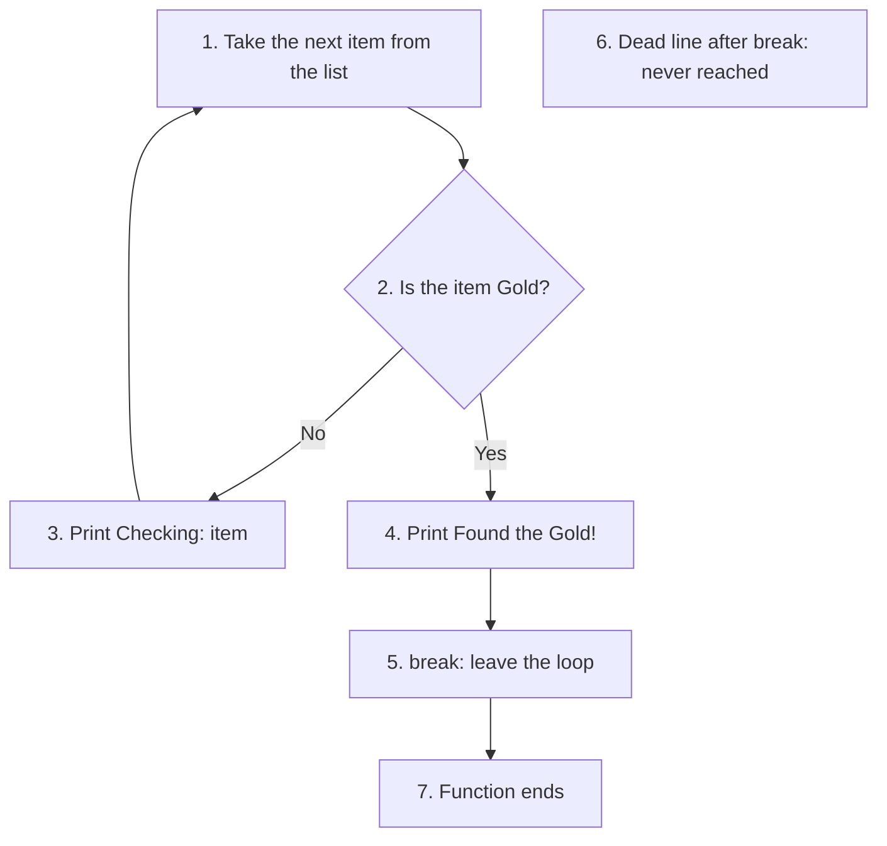
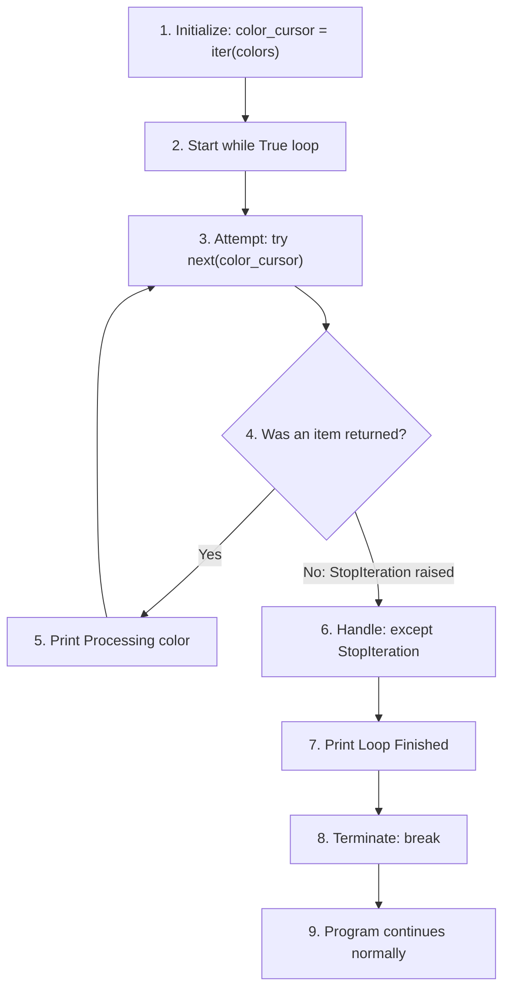

# Chapter 4: Flow Control - Beyond the Text Solutions

Chapter 4 of the book ends with "Beyond the Text" problems. These take you a little past what the chapter covers, so that you explore ideas you will meet again and again in real Python work. This page gives the solutions to two of them:

1. **Unreachable (dead) code:** lines of a script that can never run, how they get there, and how to find and remove them.
2. **The iterator protocol:** what a `for` loop really does behind the scenes, shown by writing a loop *without* using the word `for`.

Both topics are about flow control, the subject of Chapter 4. The first shows what happens when statements like `return`, `break` and `raise` send the flow away before some lines get a chance to run. The second shows how Python's `for` loop moves from one item to the next. Understanding both will help you write cleaner loops and spot bugs faster.

Each solution explains the idea step by step. The scripts have `# Step` comments, and every script is followed by its output.

## Table of Contents

- [Chapter 4: Flow Control - Beyond the Text Solutions](#chapter-4-flow-control---beyond-the-text-solutions)
  - [Key Terms Used on This Page](#key-terms-used-on-this-page)
  - [1. Unreachable (Dead) Code](#1-unreachable-dead-code)
    - [Types of Unreachable Code](#types-of-unreachable-code)
    - [Example Script: How Dead Code Creeps In](#example-script-how-dead-code-creeps-in)
    - [Tools That Spot Dead Code](#tools-that-spot-dead-code)
    - [Using finally for Cleanup Code](#using-finally-for-cleanup-code)
  - [2. The Iterator Protocol: The "No-For-Loop" Challenge](#2-the-iterator-protocol-the-no-for-loop-challenge)
    - [The Assignment](#the-assignment)
    - [Iterables and Iterators Explained](#iterables-and-iterators-explained)
    - [Solution Script](#solution-script)
    - [Comparing with an Ordinary for Loop](#comparing-with-an-ordinary-for-loop)
    - [Exploring Further](#exploring-further)
    - [Follow-up Questions](#follow-up-questions)

## Key Terms Used on This Page

| Term | Meaning in simple words | Learn more |
|---|---|---|
| Dead code / unreachable code | Lines that can never run, however the program is used. | [Wikipedia: Unreachable code](https://en.wikipedia.org/wiki/Unreachable_code) |
| Exception | An error raised while the program is running, such as `ValueError` or `StopIteration`. | [Errors and Exceptions](https://docs.python.org/3/tutorial/errors.html) |
| `raise` | A statement that creates an exception on purpose. | [The raise statement](https://docs.python.org/3/reference/simple_stmts.html#the-raise-statement) |
| `try` / `except` / `finally` | Blocks that let a program catch an exception (`except`) and run cleanup code no matter what (`finally`). | [Handling Exceptions](https://docs.python.org/3/tutorial/errors.html#handling-exceptions) |
| Static analysis / linter | A tool that reads your code *without running it* and points out likely problems. | [Pylint](https://pylint.readthedocs.io/) |
| Iterable | Anything a `for` loop can go through: a list, string, tuple, dictionary, `range()` and so on. | [Glossary: iterable](https://docs.python.org/3/glossary.html#term-iterable) |
| Iterator | An object that hands out the items of an iterable one at a time and remembers where it is. | [Glossary: iterator](https://docs.python.org/3/glossary.html#term-iterator) |
| `iter()` | Built-in function that makes an iterator from an iterable. | [iter()](https://docs.python.org/3/library/functions.html#iter) |
| `next()` | Built-in function that gets the next item from an iterator. | [next()](https://docs.python.org/3/library/functions.html#next) |
| `StopIteration` | The exception `next()` raises when an iterator has no items left. | [StopIteration](https://docs.python.org/3/library/exceptions.html#StopIteration) |

[Back to the Table of Contents](#table-of-contents)

## 1. Unreachable (Dead) Code

**Dead code** (also called **unreachable code**) is any part of a script that can never run. Python does not treat it as an error. The program runs normally and simply never reaches those lines.

That sounds harmless, but it causes real trouble:

- **It misleads readers.** Someone reading the code assumes every line does something. They may waste time trying to understand, test or fix lines that never run.
- **It hides bugs.** Often the dead line was *meant* to run, such as a log message or a cleanup step. The program then quietly skips something important.
- **It clutters the code** and makes it harder to maintain.

Dead code usually appears when a statement sends the flow somewhere else before the following lines get their turn. The statements that do this are `return`, `break`, `continue` and `raise`. It can also appear when a condition can never be true.

[Back to the Table of Contents](#table-of-contents)

### Types of Unreachable Code

The following table compares the common types of unreachable code.

| Type | Mechanism | Common Cause | How to Fix |
|---|---|---|---|
| Post-Return | The `return` statement exits a function immediately. | Placing cleanup code or logging after the `return`. | Move the code before the `return`, or use a `finally` block if the code is inside a `try` statement. |
| Post-Break | The `break` statement exits a loop immediately. | Writing code at the bottom of a loop body, after the `break`, in the same block. | Make sure the `break` is the final statement in its conditional branch. |
| Post-Continue | The `continue` statement jumps straight back to the top of the loop. | Writing code after `continue` in the same block. | Move the code before the `continue`. |
| Logical Gap | An `if` or `elif` condition that can never be met (for example `if False:`). | Hard-coded flags or conflicting logic (for example `if x > 5 and x < 2:`). | Review the Boolean logic, or remove the block if the feature is no longer needed. |
| Post-Raise | An exception is raised, stopping the current flow at once. | Writing code after a `raise` statement in the same block. Even if the error is later caught by a `try`/`except` elsewhere, the lines after `raise` are still skipped. | Move the code before the `raise`, or put it in the `except` block that handles the error. |

**Steps to check a block for dead code**

1. Find every `return`, `break`, `continue` and `raise` in the block.
2. Look at the lines that come *after* it and are indented at the *same level*. Those lines can never run.
3. Look at each `if` and `elif` condition. Ask: "Is there any value that makes this True?" If not, the block under it is dead.
4. Either move the dead lines to a place where they will run, or delete them.

[Back to the Table of Contents](#table-of-contents)

### Example Script: How Dead Code Creeps In

The following script shows four ways dead code can enter a script. Each dead line is marked with a `# DEAD CODE` comment.

```python
# Four ways dead code can creep into a script

# --- EXAMPLE 1: DEAD CODE AFTER RETURN ---
def check_weather(is_sunny):
    if is_sunny:
        return "Wear sunglasses!"      # Step 1 - the function exits here when it is sunny
        # DEAD CODE: Python leaves the function the moment it reaches 'return'.
        # VS Code usually greys out the next line to show it can never run.
        print("This message is invisible.")

    return "Stay inside."              # Step 2 - reached only when it is NOT sunny

# --- EXAMPLE 2: DEAD CODE AFTER BREAK ---
def find_treasure(items):
    for item in items:
        if item == "Gold":             # Step 1 - stop searching once Gold is found
            print("Found the Gold!")
            break
            # DEAD CODE: 'break' jumps straight out of the loop.
            print("I am trapped behind the break statement.")
        print(f"Checking: {item}")     # Step 2 - runs for every item before Gold

# --- EXAMPLE 3: A LOGICAL GAP (a condition that can never be True) ---
def classify(x):
    if x > 5 and x < 2:                # Step 1 - no number is both above 5 and below 2
        return "impossible"            # DEAD CODE: this line can never run
    return "normal"

# --- EXAMPLE 4: DEAD CODE AFTER RAISE ---
def withdraw(balance, amount):
    if amount > balance:
        raise ValueError("Insufficient funds")   # Step 1 - the error stops the function here
        print("Sorry, not enough money.")        # DEAD CODE: never printed
    return balance - amount

# --- FUNCTION CALLS (running the examples) ---

print("--- Weather Test ---")
print(check_weather(True))             # prints "Wear sunglasses!"
print(check_weather(False))            # prints "Stay inside."

print("\n--- Treasure Test ---")
bag_of_items = ["Stone", "Stick", "Gold", "Silver"]
find_treasure(bag_of_items)
# "Silver" is never checked, because the loop stopped at "Gold".

print("\n--- Logical Gap Test ---")
for value in [1, 3, 7]:
    print(value, "->", classify(value))

print("\n--- Raise Test ---")
print("Balance after withdrawing 300:", withdraw(1000, 300))
try:
    withdraw(1000, 5000)
except ValueError as err:
    print("Error caught:", err)
```

**Output**

```text
--- Weather Test ---
Wear sunglasses!
Stay inside.

--- Treasure Test ---
Checking: Stone
Checking: Stick
Found the Gold!

--- Logical Gap Test ---
1 -> normal
3 -> normal
7 -> normal

--- Raise Test ---
Balance after withdrawing 300: 700
Error caught: Insufficient funds
```

**What the output tells us**

- **Weather Test:** "This message is invisible." never appears, because `return` ended the function first.
- **Treasure Test:** "I am trapped behind the break statement." never appears. Notice also that "Checking: Gold" and "Checking: Silver" are missing. When "Gold" is found, `break` ends the loop before the `print(f"Checking: {item}")` line is reached, and "Silver" is never looked at.
- **Logical Gap Test:** "impossible" is never returned, whatever number we try. No number can be greater than 5 and less than 2 at the same time.
- **Raise Test:** "Sorry, not enough money." never appears. `raise` stopped the function, and the error was caught outside it, by the `try`/`except` in the main program.

The flowchart below shows the path through `find_treasure()`. Notice that no arrow ever leads into box 6, the dead line.



[Back to the Table of Contents](#table-of-contents)

### Tools That Spot Dead Code

You do not have to find dead code by eye alone.

- **Code editors.** VS Code, with the Python extension installed, greys out (dims) lines it knows can never run. If you hover the mouse over such a line, it shows the message "Code is unreachable". PyCharm does something similar.
- **Linters.** A *linter* is a tool that reads your code without running it and reports likely problems. [Pylint](https://pylint.readthedocs.io/) reports dead lines as warning [`W0101: unreachable`](https://pylint.readthedocs.io/en/stable/user_guide/messages/warning/unreachable.html).

Here is what Pylint says about the example script above, saved as `dead_code.py`. (Install it once with `pip install pylint`, then run `pylint dead_code.py` in a terminal. Only the relevant lines are shown.)

```text
dead_code.py:9:8: W0101: Unreachable code (unreachable)
dead_code.py:20:12: W0101: Unreachable code (unreachable)
dead_code.py:33:8: W0101: Unreachable code (unreachable)
```

The three numbers after each file name are the line number, the column and the warning code. Pylint found the dead lines after `return` (line 9), `break` (line 20) and `raise` (line 33).

It did **not** report the logical gap in Example 3 (line 26). Tools can easily see that nothing runs after a `return`, because that depends only on the *position* of the lines. But whether `x > 5 and x < 2` can ever be true depends on the *meaning* of the condition, and most tools do not check that. Logical gaps are usually found by careful reading, code review and testing with several different values.

| Type of dead code | Greyed out in VS Code? | Reported by Pylint? |
|---|---|---|
| After `return`, `break`, `continue` or `raise` | Yes | Yes (W0101) |
| Under `if False:` | Yes | No (Pylint gives a different warning, W0125, about using a constant as a condition) |
| Logical gap such as `if x > 5 and x < 2:` | No | No |

[Back to the Table of Contents](#table-of-contents)

### Using finally for Cleanup Code

The table above suggests using a `finally` block for code that must run even when a function returns early. Code in a `finally` block runs when the `try` block is left, *for any reason*: after a normal finish, after a `return`, or after an error. So cleanup placed there can never become dead code.

**Steps**

1. Put the main work inside a `try` block.
2. Put the cleanup (closing a file, printing a log line and so on) inside `finally`.
3. When `return` runs in the `try` block, Python first runs the `finally` block, and only then leaves the function.

```python
# Cleanup that must run even though the function returns early

def read_setting(name):
    print(f"Opening settings to look for '{name}'")
    try:
        if name == "theme":
            return "dark"              # Step 1 - the function wants to leave here
        return "unknown"
    finally:
        # Step 2 - a finally block runs before the function really exits
        print("Closing settings")

print("Result:", read_setting("theme"))
```

**Output**

```text
Opening settings to look for 'theme'
Closing settings
Result: dark
```

"Closing settings" is printed *before* "Result: dark". This shows that the `finally` block ran after `return "dark"` but before the function actually handed back its value.

**Follow-up question:** Is the line after `return` the only thing that can become dead in Example 1?

*Answer:* In `check_weather()`, the last line `return "Stay inside."` is *not* dead: it runs whenever `is_sunny` is `False`, as the second call in the script shows. A line is dead only if **no** input can ever reach it. Always check with more than one input before deciding a line is dead.

[Back to the Table of Contents](#table-of-contents)

## 2. The Iterator Protocol: The "No-For-Loop" Challenge

This is the solution to the Beyond Text problem given in Chapter 4 Flow Control.

In Python, we often use `for` loops to go through lists or strings. But have you ever wondered how the `for` loop actually "talks" to the list? It uses the **Iterator Protocol**.

The task is to study (1) Iterable (2) Iterators (3) Using the `iter()` function to create an iterator. (4) Understand how to use the `next()` function to grab the next item.

[Back to the Table of Contents](#table-of-contents)

### The Assignment

**Assignment: The "No-For-Loop" Challenge**

**Objective**

Your goal is to simulate how Python's for loop works "under the hood." You will process a collection of items manually by managing the data pointer yourself.

**The Task**

Write a Python script that iterates through a list of three colors: **"Red"**, **"Green"**, and **"Blue"**. You must print each color individually, but there is a catch: **You are not to use the `for` keyword.**

**Constraints & Rules**

* **No `for` loops:** You must use a `while True:` loop to handle the repetition.
* **Manual Tracking:** Use the `iter()` function to initialize an iterator object from your list.
* **Manual Retrieval:** Use the `next()` function to retrieve each item from the iterator.
* **Error Handling:** You must use a `try...except` block to catch the specific exception that Python raises when it runs out of items.
* **Clean Exit:** When the end of the list is reached, print a "Loop Finished" message and use `break` to exit the loop gracefully.

**Implementation Hints**

1. **The Iterator:** Think of the list as a book and the result of `iter()` as a bookmark that remembers the current page.
2. **The Trigger:** When `next()` is called on an empty iterator, it doesn't return None; it gives an error called `StopIteration`.
3. **The Safety Net:** Your except block should specifically look for `StopIteration` to know exactly when to stop the while loop.

The expected **identical logic** to be used is:

1. **Initialize** the pointer (iter).
2. **Attempt** the action (try + next).
3. **Handle** the boundary condition (except StopIteration).
4. **Terminate** the process (break).

[Back to the Table of Contents](#table-of-contents)

### Iterables and Iterators Explained

Before writing the solution, it helps to be clear about two words that sound alike but mean different things.

An **iterable** is any collection you can go through one item at a time: a list, a string, a tuple, a dictionary, a `range()`. Think of it as the **book**. It holds all the pages, but it does not know which page you are reading.

An **iterator** is a helper object that walks through an iterable. Think of it as the **bookmark**. It remembers where you are, and each time you ask, it moves on by one page and tells you what is on it.

| Point | Iterable (the book) | Iterator (the bookmark) |
|---|---|---|
| Examples | `["Red", "Green", "Blue"]`, `"hello"`, `range(5)` | The object returned by `iter(colors)` |
| Holds the data | Yes | No, it points into the iterable |
| Remembers a position | No | Yes |
| How you get one | Create it: `colors = [...]` | Ask for one: `iter(colors)` |
| Works with `next()`? | No (raises `TypeError`) | Yes |
| Can be used again from the start? | Yes, as often as you like | No, once it reaches the end it stays finished |

Two built-in functions connect them:

- **`iter(iterable)`** creates a new iterator (bookmark) for the iterable, placed before the first item.
- **`next(iterator)`** returns the item at the bookmark and moves the bookmark on by one. When there are no items left, it does not return `None`. Instead it raises an exception called **`StopIteration`**.

This agreement between iterables, iterators, `iter()` and `next()` is called the **iterator protocol**. (A *protocol* here just means an agreed set of rules that objects follow so that other code can work with them.) Every `for` loop in Python relies on it.

[Back to the Table of Contents](#table-of-contents)

### Solution Script

The solution follows the four-step logic of the assignment exactly:

1. **Initialize** the pointer: `color_cursor = iter(colors)`.
2. **Attempt** the action: inside `try`, call `next(color_cursor)` and print the colour.
3. **Handle** the boundary condition: `except StopIteration` catches the signal that the list has run out.
4. **Terminate** the process: print "Loop Finished" and `break` out of the `while True` loop.



```python
# --- BEYOND TEXT: MANUAL ITERATION ---

# Step 1 - The iterable (the data)
colors = ["Red", "Green", "Blue"]      # a list of three colours

# Step 2 - Initialize: create the iterator (the pointer, or bookmark)
# iter() returns a 'list_iterator' object that remembers its position.
color_cursor = iter(colors)            # the bookmark starts before the first item
print("Iterator type:", type(color_cursor).__name__)

print("Starting Manual Loop...")
print("-" * 20)

# Step 3 - Repeat with while True (in place of a for loop)
while True:
    try:
        # Step 4 - Attempt: next() returns the item at the bookmark
        #          and moves the bookmark on by one
        current_color = next(color_cursor)
        print(f"Processing color: {current_color}")

    except StopIteration:
        # Step 5 - Handle: next() raises StopIteration when no items are left
        print("-" * 20)
        print("Loop Finished")
        # Step 6 - Terminate: leave the while loop
        break

print("Program continues normally...")
```

**Output**

```text
Iterator type: list_iterator
Starting Manual Loop...
--------------------
Processing color: Red
Processing color: Green
Processing color: Blue
--------------------
Loop Finished
Program continues normally...
```

**Trace table**

| Round | `next(color_cursor)` gives | What happens |
|---|---|---|
| 1 | `"Red"` | Prints "Processing color: Red" |
| 2 | `"Green"` | Prints "Processing color: Green" |
| 3 | `"Blue"` | Prints "Processing color: Blue" |
| 4 | Raises `StopIteration` | The `except` block prints "Loop Finished" and `break` ends the loop |

Note that the loop has no condition of its own (`while True`). The only way out is the `break` inside the `except` block. Without that `break`, the loop would call `next()` again and again, catching `StopIteration` every time, and would never end.

[Back to the Table of Contents](#table-of-contents)

### Comparing with an Ordinary for Loop

Here is the same job done with a normal `for` loop:

```python
# The same job done by an ordinary for loop
colors = ["Red", "Green", "Blue"]

for current_color in colors:           # iter() and next() are called for us
    print(f"Processing color: {current_color}")
print("Loop Finished")
```

**Output**

```text
Processing color: Red
Processing color: Green
Processing color: Blue
Loop Finished
```

Behind the scenes, the `for` loop does exactly what our manual script does:

| Step | Manual version | What the `for` loop does for you |
|---|---|---|
| Initialize | `color_cursor = iter(colors)` | Calls `iter(colors)` when the loop starts |
| Attempt | `current_color = next(color_cursor)` | Calls `next()` before each round and stores the item in `current_color` |
| Handle | `except StopIteration:` | Catches `StopIteration` quietly |
| Terminate | `break` | Ends the loop and moves to the next line |

So the `for` loop is a short, safe way of writing the four-step pattern. You will almost always use `for` in real programs. The value of the manual version is that it shows *how* `for` works.

[Back to the Table of Contents](#table-of-contents)

### Exploring Further

This script tries out several things about iterables and iterators that are worth knowing.

```python
# Exploring iterables and iterators

colors = ["Red", "Green", "Blue"]

# Step 1 - A list is an iterable, but it is NOT an iterator
try:
    next(colors)
except TypeError as err:
    print("next(colors) ->", "TypeError:", err)

# Step 2 - iter() turns the list into an iterator
cursor = iter(colors)
print("First next():", next(cursor))
print("Second next():", next(cursor))

# Step 3 - The list itself is unchanged; only the bookmark has moved
print("The list is still:", colors)

# Step 4 - A second iterator has its own, separate bookmark
other = iter(colors)
print("New iterator starts again at:", next(other))

# Step 5 - The first iterator carries on from where it stopped
print("Third next() on the first iterator:", next(cursor))

# Step 6 - An iterator that is used up stays used up
print("Items left in the first iterator:", list(cursor))

# Step 7 - next() can return a default value instead of raising StopIteration
print("next(cursor, 'No more') ->", next(cursor, "No more"))

# Step 8 - Strings, tuples, dictionaries and ranges are iterables too
word_cursor = iter("Hi!")
print("From a string:", next(word_cursor), next(word_cursor), next(word_cursor))
marks = {"Asha": 91, "Ravi": 78}
print("From a dictionary (keys):", list(iter(marks)))
```

**Output**

```text
next(colors) -> TypeError: 'list' object is not an iterator
First next(): Red
Second next(): Green
The list is still: ['Red', 'Green', 'Blue']
New iterator starts again at: Red
Third next() on the first iterator: Blue
Items left in the first iterator: []
next(cursor, 'No more') -> No more
From a string: H i !
From a dictionary (keys): ['Asha', 'Ravi']
```

**What this shows**

- You cannot call `next()` on a list directly. You must first make an iterator with `iter()`.
- Taking items from an iterator does not change the list.
- Each call to `iter()` makes a brand-new bookmark, starting at the beginning.
- Once an iterator reaches the end, it stays empty. To go through the list again, make a new iterator.
- `next(iterator, default)` returns `default` instead of raising `StopIteration` when the items run out.
- Going through a dictionary gives its keys.

[Back to the Table of Contents](#table-of-contents)

### Follow-up Questions

**1. Why does `next()` raise an exception at the end instead of simply returning `None`?**

*Answer:* Because `None` could be a real item in the list. For example, in `[3, None, 7]`, if `next()` returned `None` to mean "finished", the loop would stop early at the second item. An exception is a signal that cannot be confused with any item.

**2. What would happen if you moved `color_cursor = iter(colors)` inside the `while True:` loop?**

*Answer:* A new bookmark would be created at the start of every round, always pointing at the first item. The loop would print "Processing color: Red" for ever and never reach `StopIteration`. This is why the "Initialize" step must come *before* the loop.

**3. Could the solution use a `while` loop with a counter instead, such as `while i < len(colors):`?**

*Answer:* Yes, for a list. But that works only for collections that support positions (indexes) and `len()`. Many iterables, such as files being read line by line, or generators, have no length and no indexes. The `iter()`/`next()` pattern works for all of them, which is exactly why Python's `for` loop is built on it.

**4. How could you write the challenge solution more briefly while still not using `for`?**

*Answer:* Use the default value of `next()`, together with the walrus operator `:=` (Python 3.8 and later), which assigns a value and tests it in one step:

```python
colors = ["Red", "Green", "Blue"]
color_cursor = iter(colors)
while (current_color := next(color_cursor, None)) is not None:
    print(f"Processing color: {current_color}")
print("Loop Finished")
```

This gives the same result for this list. But, as Question 1 explains, it would stop early if the list itself contained `None`. The `try`/`except StopIteration` version is the safer general pattern, and it is the one the assignment asks for.

[Back to the Table of Contents](#table-of-contents)


