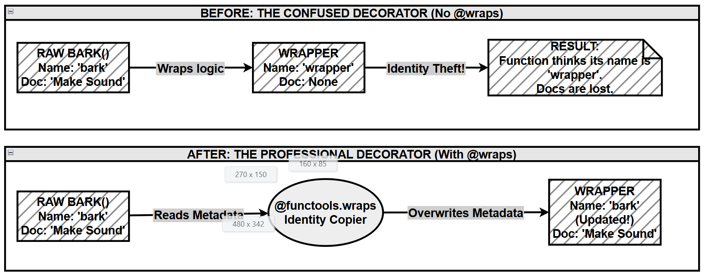

# Chapter 6.9 — Using `functools.wraps` in Decorators

## What this page covers

This page explains **`functools.wraps`**, a small but important tool from Python's standard `functools` module that every decorator-writer should know. It builds directly on the earlier sections of Chapter 6, which introduced decorators — functions that wrap other functions to add extra behaviour (logging, timing, access checks, and so on).

The problem `functools.wraps` solves is simple to state but easy to miss as a beginner: **when you wrap a function with a decorator, Python "forgets" the original function's name, docstring, and other metadata — unless you tell it not to.** This page shows you exactly what goes wrong, why it happens, and how `functools.wraps` fixes it, using two worked examples you can run yourself.

By the end of this page you should be able to:
- Explain, in your own words, why a decorated function can lose its identity.
- Use `@functools.wraps(func)` correctly in your own decorators.
- Recognise the "manual" way of preserving metadata, and understand why `functools.wraps` is the better option.

---

## 1. What is `functools`?

`functools` is a module in the Python standard library (so no `pip install` is needed — just `import functools`). It provides tools for working with **higher-order functions**: functions that operate *on* other functions, for example by modifying them, wrapping them, or combining them.

`functools` is useful well beyond decorators. Here are the tools you'll run into most often:

| Function | Purpose | Typical use case |
|---|---|---|
| `wraps` | Preserves a function's identity (name, docstring, etc.) when it's wrapped by a decorator | Writing well-behaved decorators |
| `lru_cache` | Caches a function's return values so repeated calls with the same arguments are instant | Speeding up expensive or recursive functions |
| `partial` | Creates a new function with some arguments "pre-filled" | Simplifying a function call that's repeated with the same fixed arguments |
| `reduce` | Applies a function cumulatively to the items of an iterable, reducing it to a single value | Totals, running products, combining a list into one result |
| `total_ordering` | Fills in the missing comparison methods (`<`, `<=`, `>`, `>=`) for a class, given just two | Making custom objects sortable without writing every comparison by hand |

This chapter focuses only on `wraps`, since it's the one you'll use every single time you write a decorator.

---

## 2. Why `functools.wraps` matters for decorators

When you apply a decorator, the **original function gets wrapped by another function** — usually one just called `wrapper`. If you're not careful, Python ends up "forgetting" some important facts about the original function, including:

- its **name**
- its **docstring**
- its **help documentation**

`functools.wraps()` copies this metadata from the original function onto the wrapper function, so that from the outside, the decorated function still looks and behaves like itself.

### Why does this happen at all?

Every Python function is an object, and like any object it carries metadata — think of it as the function's **ID card**:

| Attribute | What it stores | Example |
|---|---|---|
| `__name__` | The function's name | `"bark"` |
| `__doc__` | The docstring | `"""This function makes a sound."""` |
| `__annotations__` | Type hints (parameter and return types) | `{'food': str}` |
| `__module__` | Which file/module the function was defined in | `"__main__"` |

Here's the part that trips up most beginners: `@decorator` syntax is just shorthand. Writing

```python
@my_decorator
def bark():
    ...
```

is exactly the same as writing:

```python
def bark():
    ...
bark = my_decorator(bark)
```

`my_decorator(bark)` runs, and whatever it *returns* — typically the inner `wrapper` function — is what gets **reassigned** to the name `bark`. From that point on, the name `bark` no longer points at your original code; it points at `wrapper`. So if a debugger, a documentation tool, or `help()` inspects `bark`, it sees `wrapper`'s ID card, not the original function's.

### The fix: `functools.wraps` as an "identity copier"

`@functools.wraps(func)` acts like an identity copier. Placed just above your inner `wrapper` function, it copies key attributes — including `__name__`, `__doc__`, `__module__`, and `__wrapped__` (a reference back to the original function) — from the *original* function (`func`) onto the `wrapper`. The result: your decorated function keeps looking like itself from the outside, even though it's technically running extra code underneath.

---

## 3. Example 1: Seeing the identity loss (and the fix)

### Case A — Without `functools.wraps` (identity is lost)

```python
# NOTE: functools is not imported here on purpose,
# so you can see what goes wrong without it.

# --- THE DECORATOR ---
def my_decorator(func):
    # This inner function is what actually replaces `bark`
    # once the decorator runs. Notice there is no "identity
    # copier" applied to it yet.
    def wrapper(*args, **kwargs):
        # *args and **kwargs let wrapper accept ANY arguments,
        # so this decorator works on functions with any signature.
        print("--- Start of Wrapper ---")
        result = func(*args, **kwargs)   # call the original function
        print("--- End of Wrapper ---")
        return result
    return wrapper   # the decorator hands back `wrapper`, not `bark`

# --- THE FUNCTION BEING DECORATED ---
@my_decorator
def bark():
    """Make Sound"""   # docstring: explains what the function does
    print("Woof!")

# --- CHECKING THE DAMAGE ---
print(f"1. Function Name: {bark.__name__}")
# Expected if nothing were lost: bark
# Actual: wrapper   <-- the identity has been overwritten

print(f"2. Function Doc:  {bark.__doc__}")
# Expected: Make Sound
# Actual: None   <-- the docstring is gone too
```

**For beginners:** nothing here is "broken" in the sense of causing an error — `bark()` still runs and still prints `"Woof!"`. The problem is invisible until something inspects the function's metadata: a debugger, a documentation generator like Sphinx, an IDE's autocomplete/tooltip, or a teammate calling `help(bark)`. In a small script this may not matter; in a real codebase with many decorators, it makes bugs much harder to track down, because every traceback and every `help()` call points to a generic `wrapper` instead of the function you actually meant.

### Case B — With `functools.wraps` (identity is retained)

```python
import functools

# --- THE DECORATOR ---
def my_decorator(func):
    @functools.wraps(func)   # copies bark's ID card onto wrapper
    def wrapper(*args, **kwargs):
        print("--- Start of Wrapper ---")
        result = func(*args, **kwargs)
        print("--- End of Wrapper ---")
        return result
    return wrapper

# --- THE FUNCTION BEING DECORATED ---
@my_decorator
def bark():                # the function we are decorating
    """Make Sound"""       # docstring — now preserved thanks to wraps
    print("Woof!")

# --- CHECKING THE FIX ---
print(f"1. Function Name: {bark.__name__}")
# Expected: bark | Actual: bark  (fixed, thanks to functools.wraps)

print(f"2. Function Doc:  {bark.__doc__}")
# Expected: Make Sound | Actual: Make Sound  (fixed)

print("-" * 20)
bark()
# Still shows the wrapper's print statements (that's the whole
# point of a decorator!) — but bark's name and docstring are correct.
```

### Before vs. after, at a glance

| Feature tested | Without `functools.wraps` | With `functools.wraps` |
|---|---|---|
| `bark.__name__` | `"wrapper"` — the generic mask | `"bark"` — the correct name |
| `bark.__doc__` | `None` — docstring lost | `"Make Sound"` — docstring preserved |
| Debug tracebacks | Point to `wrapper` | Point to `bark` |
| `help(bark)` | Shows generic wrapper info | Shows the real `bark` documentation |


### Diagram shows situation without and with using functools




---

## 4. Example 2: The manual approach (and why `functools.wraps` is better)

Before `functools.wraps` existed (or if you ever need to see what it's doing under the hood), you could fix the identity problem by hand, by copying each attribute across yourself.

### Case A — Manual identity copying

```python
def food_safety_check(func):
    def wrapper(food_type):
        prohibited_foods = ["Chocolate", "Cakes", "Ice Cream", "Onions"]
        if food_type in prohibited_foods:
            print(f"ALERT: {food_type} is dangerous for pets! Action blocked.")
            # No return here, so this branch implicitly returns None.
        else:
            print(f"{food_type} is safe.")
            return func(food_type)   # only run the real function if it's safe

    # --- MANUAL IDENTITY COPIER ---
    # This is exactly what @functools.wraps(func) would do for us,
    # spelled out one attribute at a time.
    wrapper.__name__ = func.__name__
    wrapper.__doc__ = func.__doc__
    wrapper.__module__ = func.__module__

    return wrapper

@food_safety_check
def feed_pet(food):
    """Feeds the pet the specified food item."""
    print(f"Eating the {food} now. Yum!")

# --- TEST ---
print(f"Function Name: {feed_pet.__name__}")  # "feed_pet"
print(f"Function Doc:  {feed_pet.__doc__}")   # "Feeds the pet..."
```

This works, but it's easy to forget an attribute (there are more than the three shown here, such as `__annotations__` and `__wrapped__`), and it's three extra lines to write in *every single decorator you ever create*.

### Case B — The `functools.wraps` way

```python
import functools

def food_safety_check(func):
    @functools.wraps(func)   # does everything Case A did manually, in one line
    def wrapper(food_type):
        prohibited_foods = ["Chocolate", "Cakes", "Ice Cream", "Onions"]
        if food_type in prohibited_foods:
            print(f"ALERT: {food_type} is dangerous for pets! Action blocked.")
        else:
            print(f"{food_type} is safe.")
            return func(food_type)   # run the original function
    return wrapper

@food_safety_check
def feed_pet(food):
    """Feeds the pet the specified food item."""
    print(f"Eating the {food} now. Yum!")

# --- USAGE ---
feed_pet("Carrot")     # allowed -> prints "Carrot is safe." then "Eating the Carrot now. Yum!"
feed_pet("Chocolate")  # blocked -> prints the ALERT message only
```

**For beginners:** the *behaviour* of `feed_pet` is identical in both cases — the only difference is that Case B keeps `feed_pet.__name__` and `feed_pet.__doc__` intact, using one decorator line instead of three manual assignments. That's the entire value proposition of `functools.wraps`: same result, less code, nothing to forget.

---

## 5. Quick recap

- A decorator replaces your original function with a `wrapper` function — that's how decorators add behaviour.
- Without help, the `wrapper` function's own metadata (`__name__`, `__doc__`, etc.) shows up instead of the original function's.
- `@functools.wraps(func)`, placed directly above your `wrapper` definition, copies the original function's metadata onto `wrapper` automatically.
- **Rule of thumb:** if you're writing a decorator with an inner `wrapper` function, add `@functools.wraps(func)` above it. There's essentially no downside, and it will save you (or someone using your code) a confusing debugging session later.

