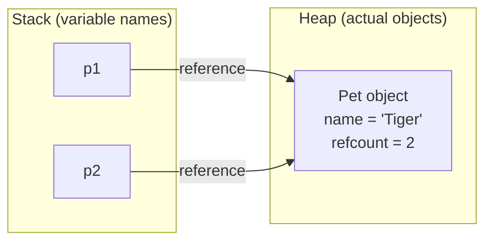
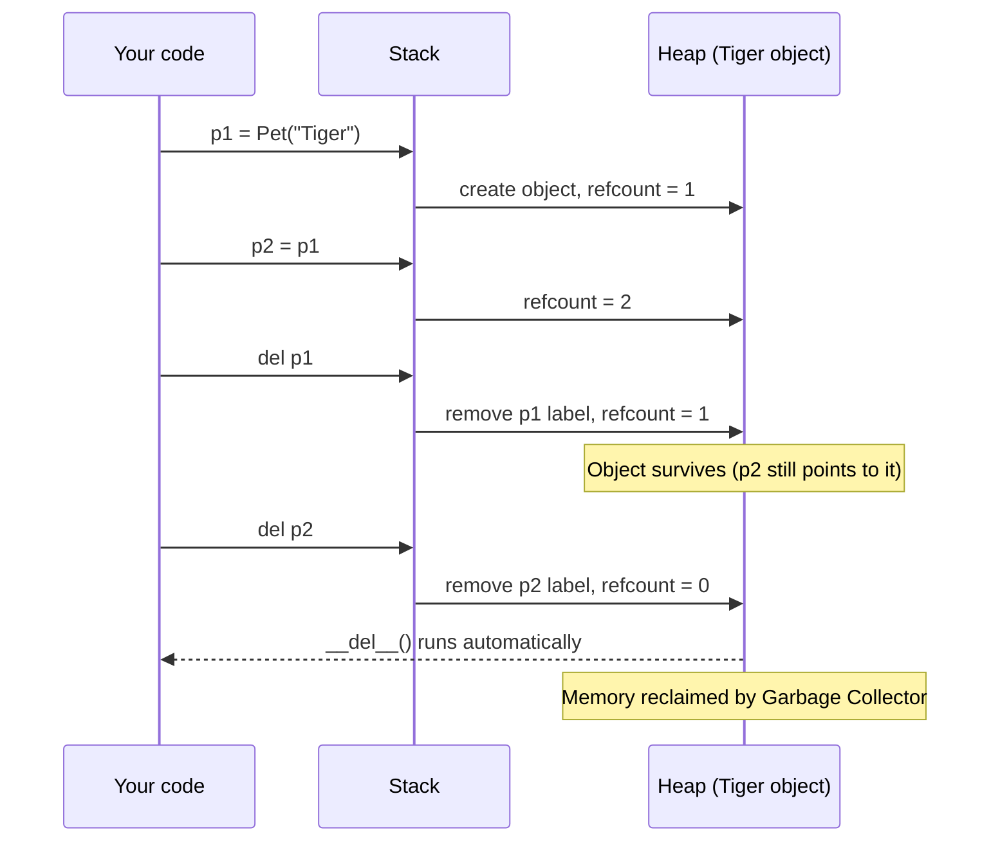
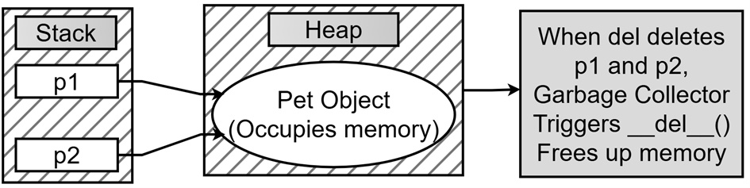
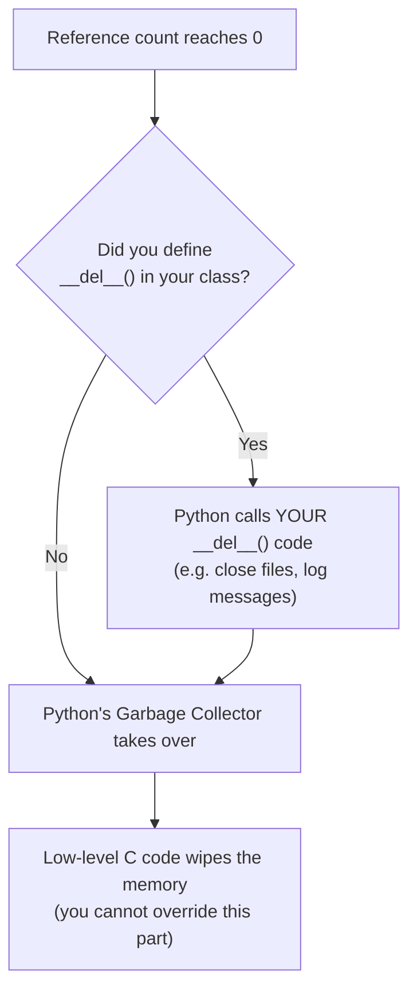

# Chapter 7.6 — How `del` and `__del__()` Really Work

## What this page covers

This page explains one of the most misunderstood pairs of features in Python: the **`del` keyword** and the **`__del__()` destructor method**. It builds on earlier Chapter 7 material about objects and `self` by going one level deeper — into *where* objects actually live in memory, and what happens to that memory when your program stops using them.

The core misconception this page corrects: **`del` does not delete objects.** It only removes a *name* that points to an object. The object itself is only cleaned up automatically, later, by Python's garbage collector — and only once nothing points to it anymore. Understanding this distinction matters for every Python programmer, not just OOP users, because it explains real bugs you'll eventually run into: objects that "won't go away" because something you forgot about still references them, or files/database connections that don't close when you expect.

By the end of this page you should be able to:
- Explain the difference between the **Stack** (names) and the **Heap** (objects), and how they're linked.
- Explain why `del p1` doesn't destroy an object if another variable still refers to it.
- Predict when `__del__()` will run, using **reference counting**.
- Use `sys.getrefcount()` correctly, including its "off by one" quirk.

---

## 1. Background: where do Python objects actually live?

Every value your program creates — a number, a string, or an instance of your own class — lives in one of two conceptual places:

| Memory area | What it stores | Analogy |
|---|---|---|
| **The Heap** | The actual objects — their real data (e.g. a `Pet`'s `name`, `breed`, etc.) | A large warehouse where the goods are physically stored |
| **The Stack** | The *names* of your variables (`p1`, `p2`, ...), each one just a pointer to a location on the Heap | A shelf of labelled tags, each tag pointing to a shelf in the warehouse |

A variable name in the Stack doesn't hold the object itself — it holds the **memory address** of the object on the Heap. This link between a name and an object is called a **reference**.



In the diagram above, `p1` and `p2` are two different *names*, but both point at the **same single object** on the Heap. This is exactly what happens when you write `p2 = p1` — you're not copying the `Pet`, you're just creating a second label for the same warehouse shelf.

---

## 2. What `del` actually does

`del p1` does **one thing only**: it removes the `p1` label from the Stack — cutting the wire between the name `p1` and whatever it was pointing to. It does **not** touch the object on the Heap.

- If `p1` was the *only* reference to that object, the object is now unreachable — nothing in your program can get to it anymore, and it becomes eligible for cleanup.
- If another name (like `p2`) still points to the same object, the object survives untouched. Only the `p1` label is gone.

This is why `del` is best thought of as **"forget this name"**, not **"destroy this object."** The object is only actually removed from memory once the very last reference to it is gone.

---

## 3. `__del__()`: the destructor, and when it really runs

Python keeps a running count of how many references point to each object — its **reference count**. `__del__()` is a special method (the **destructor**) that Python calls automatically, but only at one specific moment: **the instant an object's reference count drops to zero.**

| Concept | `del` (the keyword) | `__del__()` (the method) |
|---|---|---|
| What it operates on | A **name/label** in the Stack | The **object** on the Heap |
| Who triggers it | You, manually, whenever you write `del x` | Python automatically, when refcount hits 0 |
| What it does | Unbinds one name from an object | Runs your cleanup code, right before the object's memory is reclaimed |
| Can you call it directly? | N/A — it's a statement, not a function | Technically yes, but you almost never should — let Python call it |

A useful way to think of it: `__del__()` is a **patient** method. It doesn't fire the moment you type `del p1` — it waits until the *very last* link to that object is broken, however many `del` statements (or reassignments, or the variable going out of scope) that takes.

> **Timing note:** you can rely on `__del__()` eventually running once the refcount hits zero, but not on it running *immediately* — Python's garbage collector may briefly delay it if it's busy with other work. This is one reason `__del__()` is a poor place to put critical cleanup logic (use a context manager / `with` statement for anything that truly must happen on time, such as closing a file).

---

## 4. Counting references with `sys.getrefcount()`

`sys.getrefcount(obj)` tells you how many references currently point to `obj`. There's one gotcha every beginner hits: **the number it returns is always one higher than you'd expect.** That's because passing `obj` into `getrefcount()` as an argument creates one more *temporary* reference for the duration of the call itself. In practice, you subtract 1 from the result to get the "real" count.

---

## 5. The full script, with explanatory comments

```python
import sys   # needed for sys.getrefcount(), which counts references to an object

class Pet:
    def __init__(self, name):
        self.name = name
        print(f"Pet object-> {self.name} allocated memory in the Heap")

    def __del__(self):
        # Python calls this automatically -- and ONLY -- when this
        # object's reference count reaches zero. You never call it yourself.
        print(f"Reference count is 0. Memory for Pet {self.name} is freed")


# 1. Create the original object p1
p1 = Pet("Tiger")               # refcount for the "Tiger" object is now 1
count = sys.getrefcount(p1) - 1  # subtract 1 to cancel out getrefcount()'s own temporary reference
print(f"Count on creating p1-> {count}")   # Count on creating p1-> 1

# 2. Create an alias of p1 called p2
p2 = p1   # p2 is NOT a copy -- it's a second name pointing at the SAME object
print(f"Count after alias p2 (p1 + p2):-> {sys.getrefcount(p1) - 1}")   # -> 2

# 3. Delete the first reference, p1
del p1
# This only removes the NAME 'p1'. The object itself is untouched,
# because p2 still points to it -- so __del__() does NOT run here.
print("p1 is gone, but the object survives because p2 still points to it.")
print(f"Object Count-> {sys.getrefcount(p2) - 1}")   # -> 1

# 4. Delete the second (and final) reference, p2
del p2
# Now the refcount hits 0 -- Python triggers __del__() automatically,
# right here, and the "Reference count is 0..." message prints.
print("End of script.")
```

### Expected output

```text
Pet object-> Tiger allocated memory in the Heap
Count on creating p1-> 1
Count after alias p2 (p1 + p2):-> 2
p1 is gone, but the object survives because p2 still points to it.
Object Count-> 1
Reference count is 0. Memory for Pet Tiger is freed
End of script.
```

### Reference count at each step

| Action | What happens to the reference count? | Does `__del__()` run? |
|---|---|---|
| `p1 = Pet("Tiger")` | Count becomes **1** | No |
| `p2 = p1` | Count becomes **2** | No |
| `del p1` | Count becomes **1** | No — `p2` still holds a reference |
| `del p2` | Count becomes **0** | **Yes** — memory is released |



### Another way of visualizing how `__del__()` operates is as follows:



---

## 6. What happens when you override `__del__()`

Overriding `__del__()` in your own class does **not** give you control over memory management itself — it just lets you "hook in" with your own cleanup code at the exact moment right before Python frees the memory. The full sequence looks like this:




## Note about overriding **del**()

When you "override" **del**, you aren't replacing Python's ability to delete memory.

When the reference count hits zero, the following sequence takes place:

1. **The Trigger:** is when the reference count for your object reaches zero. (Meaning all references to the object have been deleted.)
2. **The User's Turn:** Python looks at your class. It sees you have overridden **del**. It calls your method first. This allows you to close files, log messages, or clean up your own data.
3. **The System's Turn:** Once _your_ code in **del** finishes running, Python’s internal **Garbage Collector** takes over. It performs the actual "low-level" work of clearing the bits and bytes from the RAM (the Heap).
4. **You don't "kill" the process:** Overriding **del** does not stop Python from reclaiming memory. It just allows you to "hook" into the moment right before it happens.
5. **Automatic Execution:** You never have to manually call **del**. The interpreter handles the call automatically.
6. **The Final Step:** Python's internal memory management is written in **C**. After your Python-level **del** finishes, the C-level code (which you cannot override) actually wipes the memory address.


## A few important guarantees:

1. **You never call `__del__()` yourself.** The interpreter calls it automatically, only once, only when the refcount hits zero.
2. **Your `__del__()` code runs first**, giving you a chance to do cleanup (closing files, logging, releasing external resources).
3. **After your code finishes**, Python's internal Garbage Collector — implemented in C — does the actual low-level work of clearing the memory. This final step is not something you can intercept or override.
4. **Overriding `__del__()` never stops or delays memory being reclaimed** — it just adds your own code to run immediately beforehand.

---

## 7. Quick recap

- Objects live on the **Heap**; variable names live on the **Stack** and merely *point to* objects.
- `del name` removes a **name**, not an object. The object is only cleaned up once **every** name pointing to it has been removed.
- `__del__()` is Python's automatic destructor — it runs exactly once, exactly when an object's reference count hits zero, and you should never call it directly.
- `sys.getrefcount(obj)` is handy for learning/debugging, but always **subtract 1** from its result, since calling the function itself adds a temporary reference.
- Overriding `__del__()` lets you add your own cleanup step, but the actual memory-freeing is always handled afterwards by Python's C-level Garbage Collector, which you cannot override.


