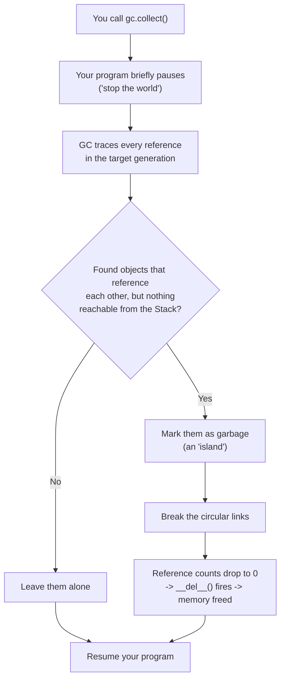

# Chapter 7 — Research Question: Circular References and the Garbage Collector

## What this page covers

This page is a research-question deep dive for Chapter 7 (Object-Oriented Programming), building directly on the earlier pages about `id()`/`self` and `del`/`__del__()`. Those pages showed that Python normally frees an object's memory the moment its **reference count** hits zero. This page tackles the one important case where that simple rule *breaks down*: when two objects reference each other in a loop, called a **circular reference**.

This matters for every Python programmer, not just advanced ones, because circular references are easy to create by accident — for example, a parent object that keeps a link to its child, and a child object that keeps a link back to its parent. Understanding how Python detects and cleans up these cases (and how to force it manually with `gc.collect()`) will help you reason about memory usage in any program that builds linked or nested objects.

By the end of this page you should be able to:
- Explain, in your own words, why reference counting alone cannot clean up a circular reference.
- Trace through a script to see exactly why deleting the "outer" labels doesn't immediately free the objects.
- Explain what `gc.collect()` does differently, and when you might want to call it yourself.

---

## Research Question 1: What is a circular reference in Python?

> Explain why it poses a challenge to the standard reference-counting mechanism, and how Python's Garbage Collector handles it.

### Answer

A **circular reference** occurs when two (or more) objects hold references to each other, directly or indirectly.

| Term | Meaning |
|---|---|
| **The problem** | If Object A points to Object B, and Object B points back to Object A, neither object's reference count can ever reach zero through normal deletion — even after every *external* label (`dog`, `cat`) has been deleted. |
| **The result** | The two objects form what this page calls an **"island of isolation"**: unreachable from your code, but not eligible for cleanup, because the standard reference counter only sees that *something* still points to them — it doesn't check whether that "something" is itself unreachable. |
| **The solution** | Python has a second, backup mechanism: the **Generational Garbage Collector** (`gc` module). It periodically scans memory for exactly this kind of island, and — unlike simple reference counting — is able to recognise and break these mutual links, freeing the memory. |


The dotted arrows above show the links that `del dog` and `del cat` remove. Notice that even after both are deleted, the solid arrows — `Tiger.friend → Kitty` and `Kitty.friend → Tiger` — remain, keeping both objects alive as far as reference counting is concerned.

---

## The script: building and breaking a circular reference

```python
import gc    # gives us access to Python's Generational Garbage Collector
import sys   # needed for sys.getrefcount(), to inspect reference counts

class Pet:
    def __init__(self, name):
        self.name = name
        self.friend = None   # will later be set to point at another Pet
        print(f"--- Pet object-> {self.name} is created.")

    def __del__(self):
        # This only prints once the object's reference count reaches 0.
        # For a circular reference, that means it only prints once the
        # Garbage Collector has broken the circle -- NOT when you call del.
        print(f"--- [CLEANUP] Memory for {self.name} finally cleared.")


# 1. Create two independent objects
dog = Pet("Tiger")
cat = Pet("Kitty")

# 2. Create the circular link: each object now references the other
dog.friend = cat   # Tiger.friend -> Kitty
cat.friend = dog   # Kitty.friend -> Tiger  (this closes the circle)

# At this point, Tiger has TWO references pointing at it:
#   1) the 'dog' label in the Stack
#   2) the 'cat.friend' attribute, stored inside the Kitty object
print(f"Tiger's Ref Count: {sys.getrefcount(dog) - 1}")   # Expect 2

# 3. Delete the external labels
print("ACTION: Deleting external labels 'dog' and 'cat'...")
del dog
del cat
# IMPORTANT: Tiger and Kitty are NOT freed yet! Each object is still
# holding a reference to the other (Tiger.friend and Kitty.friend),
# so both reference counts are stuck at 1, not 0.
print("Labels are gone, but __del__ was not called yet (Deadlock).")

# 4. Force the Garbage Collector to hunt for the 'island' and break it
print("ACTION: Forcing Garbage Collection...")
gc.collect()
# The GC traces every reference it can find. It notices that Tiger and
# Kitty are only reachable from EACH OTHER, not from anything in your
# running program -- so it breaks the link, both counts drop to 0,
# and __del__() fires for both objects, right here.
print("End of Script.")
```

### Expected output

```text
--- Pet object-> Tiger is created.
--- Pet object-> Kitty is created.
Tiger's Ref Count: 2
ACTION: Deleting external labels 'dog' and 'cat'...
Labels are gone, but __del__ was not called yet (Deadlock).
ACTION: Forcing Garbage Collection...
--- [CLEANUP] Memory for Tiger finally cleared.
--- [CLEANUP] Memory for Kitty finally cleared.
End of Script.
```

(The exact order of the two `[CLEANUP]` lines can vary — the GC doesn't guarantee which of the two linked objects it reports as cleared first.)

---

## Why doesn't `del dog` free Tiger?

Python's primary memory-management rule is simple: an object is only deleted once its reference count hits **0**. In this script, Tiger's reference count starts at two:

| # | Reference | Where it lives |
|---|---|---|
| 1 | The label `dog` | In the Stack |
| 2 | The attribute `cat.friend` | Inside the `Kitty` object, on the Heap |

Running `del dog` removes only reference #1. The count drops from 2 to 1 — not 0 — so Python's rule says Tiger must stay in memory.

### The deadlock

This is the "Catch-22" at the heart of the problem:

1. To delete **Tiger**, his reference count must reach 0.
2. To make it reach 0, the link inside **Kitty** (`cat.friend`) must be removed.
3. To remove that link, **Kitty** herself would need to be deleted.
4. To delete **Kitty**, *her* reference count must reach 0.
5. But **Tiger** is still holding a reference to **Kitty** (`dog.friend`)!

Each object is quietly keeping the other alive. Neither can be freed by reference counting alone, because neither one's count will ever drop to zero on its own.

### How this becomes a memory leak

A memory leak happens when memory is **occupied** but **unreachable** — exactly the situation here. After `del dog` and `del cat`:

- **The labels are gone.** You can no longer write `dog.name` anywhere in your script — as far as your code is concerned, the objects don't exist.
- **The objects remain.** Because Tiger and Kitty still point to each other, their reference counts are stuck at 1, not 0.
- **The leak.** They continue sitting in the Heap (RAM), consuming memory, with no way for your code to reach them or ask them to go away. If this pattern repeats — say, inside a loop that runs thousands of times — the memory used by these orphaned "islands" keeps growing, and your program can eventually run out of RAM.

---

## Summary so far

| Idea | In one line |
|---|---|
| Mutual life support | In a circular reference, each object effectively keeps the other's reference count above zero. |
| Island of isolation | Once the external labels are deleted, the linked objects become unreachable to your code, but still "alive" by reference-count rules. |
| The fail-safe | Python's Generational Garbage Collector periodically scans for these islands and breaks the circle — but it runs far less often, and more slowly, than ordinary reference counting. |

---

## How `gc.collect()` works

While the reference counter handles routine, everyday cleanup instantly, `gc.collect()` is the specialist tool for exactly the "island of isolation" problem above — cases the reference counter cannot resolve on its own.

### Generational collection: the "triple scan"

Scanning *every* object in memory on *every* check would make Python far too slow. Instead, the Garbage Collector buckets objects into three generations, based on how long they've survived previous scans:

| Generation | Nickname | Who lives here |
|---|---|---|
| **Generation 0** | The Nursery | Brand-new objects, just created |
| **Generation 1** | Middle-aged | Objects that survived one GC scan |
| **Generation 2** | The Old Guard | Objects that have survived multiple scans |

This design rests on one observation from real-world programs: **most objects die young** (a temporary variable inside a function, for instance). So the GC checks Generation 0 most often, and only occasionally checks the older, more stable generations — saving a lot of unnecessary work.

### The mechanism, step by step



1. **Detection:** calling `gc.collect()` briefly pauses your running program.
2. **Tracing:** the GC walks through every object in the generation it's checking, following every reference ("arrow") it can find.
3. **Island hunting:** if it finds a cluster of objects that reference each other, but that cluster isn't reachable from anything in the Stack (no external label), it flags the whole cluster as garbage.
4. **The wipe:** it breaks the circular links itself, which finally drops the affected reference counts to zero — triggering `__del__()` for each object and freeing their memory on the Heap.

### Why call `gc.collect()` manually?

Python normally runs this process automatically once the number of objects in Generation 0 crosses an internal threshold. Calling it yourself is mainly useful in a few specific situations:

- **Memory-intensive tasks:** right after a large calculation finishes, or a big database connection closes, if you want that RAM back immediately rather than waiting for the automatic trigger.
- **Cleaning up islands inside loops:** to make sure circular references created during one loop iteration are purged before the next iteration starts, keeping memory usage flat instead of creeping upward.
- **Debugging:** `gc.collect()` returns the number of objects it just cleared, so you can use it to check exactly how many unreachable objects were sitting in memory.

### Summary

| Idea | In one line |
|---|---|
| "Stop the world" | Every call to `gc.collect()` briefly pauses your running code while it scans. |
| Reference counting ≠ GC | `del` and reference counting happen instantly, on every line; `gc.collect()` is a separate, occasional process for the harder, circular-reference cases. |
| Return value | `gc.collect()` returns an integer — e.g. `found = gc.collect()` tells you exactly how many objects were just cleared away. |
| Generational logic | Objects that survive a scan get "promoted" to the next generation, based on the idea that most objects die young and older objects are worth checking less often. |


