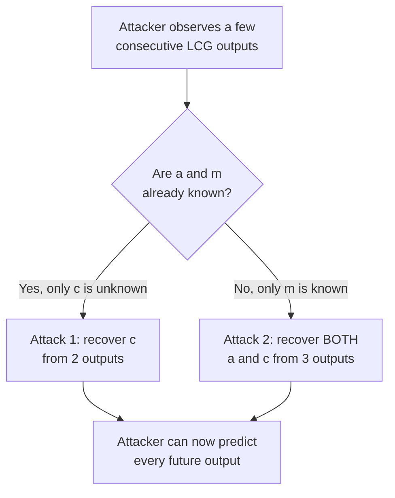

# Chapter 7 — Research Question: Breaking a Linear Congruential Generator (LCG)

## What this page covers

This page is a research-level deep dive that connects two topics from earlier in the book: Python classes (Chapter 7) and random number generation. It looks at a specific, well-known weakness in a simple kind of random number generator called a **Linear Congruential Generator (LCG)**, and shows — with working Python code — exactly how someone who sees just a handful of "random" numbers produced by an LCG can mathematically work backwards and predict every number it will ever produce next.

This is relevant beyond pure math curiosity: LCGs are simple, fast, and still used in places where speed matters more than security — such as simulations, games, and some older or lightweight system libraries. The mistake beginners (and sometimes real systems) make is assuming *any* "random-looking" number generator is safe to use for things like passwords, tokens, or session IDs. This page demonstrates concretely why that assumption is dangerous for an LCG specifically, and why cryptographic applications need generators designed for security, not just for producing numbers that merely *look* random.

**A few terms used throughout, explained simply:**
- **Pseudorandom Number Generator (PRNG)** — an algorithm that produces a sequence of numbers that *looks* random, but is actually fully determined by a starting value (the seed) and a fixed formula. ([Wikipedia: Pseudorandom number generator](https://en.wikipedia.org/wiki/Pseudorandom_number_generator))
- **Modulus / `mod` (`%`)** — the remainder left over after division. E.g. `17 mod 5` is `2`, because `17 ÷ 5` leaves a remainder of 2. ([Wikipedia: Modular arithmetic](https://en.wikipedia.org/wiki/Modular_arithmetic))
- **Congruence (`≡`)** — a way of saying "these two numbers give the same remainder when divided by some modulus," which is the mathematical language LCGs are naturally described in.
- **Modular Multiplicative Inverse** — the modular arithmetic equivalent of "dividing" by a number, used because ordinary division doesn't work the same way once you're working with remainders (explained further in Step 2 below).

---

## Research Question

> In the context of the Linear Congruential Generator (LCG), how does the mathematical relationship between successive outputs (X<sub>n</sub>, X<sub>n+1</sub>, X<sub>n+2</sub>) allow an observer to reverse-engineer hidden parameters like the multiplier (`a`) and increment (`c`)? Discuss the implications of this predictability for security-sensitive applications, and demonstrate the "break" using a Python-based reconstruction script.

---

## Answer

### Background: how an LCG actually works

An LCG generates each new number entirely from the previous one, using one simple formula:

$$X_{n+1} = (a \cdot X_n + c) \bmod m$$

| Symbol | Meaning |
|---|---|
| $X_n$ | The current number in the sequence |
| $X_{n+1}$ | The next number, generated from $X_n$ |
| $a$ | The **multiplier** — a fixed constant |
| $c$ | The **increment** — another fixed constant |
| $m$ | The **modulus** — keeps every output within the range $[0, m-1]$ |

Everything about the sequence — every future "random" number — is completely determined by the starting seed and these three fixed constants ($a$, $c$, $m$). Nothing about it is genuinely unpredictable; it only *looks* unpredictable if you don't know $a$, $c$, and $m$.

### The mathematical vulnerability

Because the formula above is **linear** (no squaring, no exponentials — just multiplication and addition), seeing just a few consecutive outputs is enough to set up simple equations and solve for the hidden constants. There are two attack scenarios, depending on how much the attacker already knows:



#### Attack 1 — Finding `c` (when `a` and `m` are already known)

With just two consecutive outputs, $X_0$ and $X_1$, we can rearrange the LCG formula to isolate $c$:

$$c \equiv (X_1 - a \cdot X_0) \pmod m$$

**In plain terms, step by step:**
1. Take the known next value, $X_1$.
2. Subtract $a \times X_0$ from it.
3. Apply `mod m` to bring the result back into the valid range $[0, m-1]$ — this is exactly what Python's `%` operator does for us automatically.

#### Attack 2 — Finding both `a` and `c` (when only `m` is known)

This is the harder, more general case, and needs **three** consecutive outputs, $X_0$, $X_1$, $X_2$. We start with the LCG formula written out twice:

1. $X_1 \equiv a \cdot X_0 + c \pmod m$
2. $X_2 \equiv a \cdot X_1 + c \pmod m$

**Step 1 — eliminate `c` by subtracting the two equations:**

$$X_2 - X_1 \equiv a \cdot (X_1 - X_0) \pmod m$$

This leaves a single equation with only one unknown, $a$ — exactly what we need.

**Step 2 — isolate `a`.** In ordinary algebra, you'd just divide both sides by $(X_1 - X_0)$. But **modular arithmetic doesn't support regular division** — instead, "dividing" by a number means multiplying by its **modular multiplicative inverse**: a special value that behaves like "1 divided by that number," but calculated so the result still makes sense within the `mod m` system. In Python (3.8 and later), this is calculated with a single call: `pow(diff_x, -1, m)`.

**Step 3 — solve for `a`:**

$$a \equiv (X_2 - X_1) \times \text{inverse}(X_1 - X_0) \pmod m$$

**Step 4 — solve for `c`**, now that `a` is known, by plugging it back into the original Attack 1 formula.

*(One technical caveat: a modular inverse only exists if $(X_1 - X_0)$ and $m$ share no common factors other than 1 — a condition called being "coprime." If this fails, the script below reports that the inverse doesn't exist, rather than silently producing a wrong answer.)*

### Summary table

| Scenario | What's known beforehand | What's recovered | Outputs needed |
|---|---|---|---|
| Attack 1 | `a` and `m` | `c` | 2 consecutive outputs |
| Attack 2 | Only `m` | Both `a` and `c` | 3 consecutive outputs |

### Implications for security-sensitive applications

This research demonstrates a clear, practical conclusion: **an LCG is not cryptographically secure.** If an attacker can observe just three "random" values generated by a system using an LCG — for example, three session tokens, three password reset codes, or three shuffled card orders — they can mathematically recover the generator's hidden internal constants, and from that point on, correctly predict **every single value it will ever produce**, without ever needing to guess.

This is precisely why real cryptographic systems (generating passwords, encryption keys, security tokens, etc.) never rely on a plain LCG. Instead, they use generators specifically designed to resist exactly this kind of mathematical attack, such as Python's own [`secrets` module](https://docs.python.org/3/library/secrets.html), built for security-sensitive randomness, as opposed to the general-purpose `random` module (whose default generator, incidentally, is a more sophisticated PRNG called the Mersenne Twister — not an LCG — but which is *still* not considered cryptographically secure and shouldn't be used for security purposes either).

---

## The Python script: "The LCG Breaker"

This script does three things: defines a simple `LCG` class that generates numbers exactly the way described above, implements the two "breaker" functions derived in the math above, and then runs both attacks against a sample sequence of outputs to prove they work.

```python
class LCG:
    """A simple Linear Congruential Generator, following the formula:
    X(n+1) = (a * X(n) + c) mod m
    """
    def __init__(self, seed, a=1103515245, c=12345, m=2**31):
        # Step 1: Store the starting seed and the three fixed constants
        # that control the whole sequence.
        self.state = seed
        self.a = a
        self.c = c
        self.m = m

    def next(self):
        # Step 2: Apply the LCG formula to produce the next number,
        # and remember it as the new current state for next time.
        self.state = (self.state * self.a + self.c) % self.m
        return self.state


# --- BREAKER FUNCTIONS (the "attack" logic) ---

def break_lcg_find_c(x0, x1, a, m):
    """Attack 1: recovers c, when a and m are already known,
    using just two consecutive outputs (x0, x1)."""
    # Step 1: Rearranged LCG formula -- see "Attack 1" above.
    c = (x1 - a * x0) % m
    return c


def break_lcg_find_a_and_c(x0, x1, x2, m):
    """Attack 2: recovers BOTH a and c, when only m is known,
    using three consecutive outputs (x0, x1, x2)."""
    # Step 1: Subtract the two LCG equations to eliminate c,
    # leaving a single equation in terms of 'a' only.
    diff_y = (x2 - x1) % m
    diff_x = (x1 - x0) % m

    # Step 2: To "divide" by diff_x under modular arithmetic, we need
    # its modular multiplicative inverse rather than ordinary division.
    # Python 3.8+ provides this directly via pow(value, -1, modulus).
    try:
        inv_diff_x = pow(diff_x, -1, m)

        # Step 3: Solve for 'a' using the inverse we just found.
        recovered_a = (diff_y * inv_diff_x) % m

        # Step 4: Now that 'a' is known, plug it back into the Attack 1
        # formula to recover 'c' as well.
        recovered_c = (x1 - recovered_a * x0) % m
        return recovered_a, recovered_c
    except ValueError:
        # This triggers if diff_x and m share a common factor, meaning
        # no modular inverse exists for this particular pair of numbers.
        return None, "Inverse does not exist (GCD != 1)"


# --- TESTING THE ATTACK ---

# A sequence of outputs an attacker might have observed --
# note the attacker does NOT need to know 'a' or 'c' in advance for Attack 2.
outputs = [829870797, 1533044610, 1478614675]
m_val = 2 ** 31
a_val = 1103515245   # only needed for Attack 1, which assumes 'a' is known

print("--- Attack 1: Finding c (assumes a and m are already known) ---")
found_c = break_lcg_find_c(outputs[0], outputs[1], a_val, m_val)
print(f"Recovered c: {found_c}")

print("\n--- Attack 2: Finding a and c (only m is known) ---")
found_a, found_c2 = break_lcg_find_a_and_c(outputs[0], outputs[1], outputs[2], m_val)
print(f"Recovered a: {found_a}")
print(f"Recovered c: {found_c2}")

# --- PROOF: use the recovered constants to predict the NEXT output ---
# If the attack genuinely worked, feeding the recovered a and c into a
# fresh LCG (seeded with the last known output) should correctly predict
# outputs the attacker never actually saw.
print("\n--- Proof: predicting a future output using recovered a and c ---")
cracked_generator = LCG(seed=outputs[2], a=found_a, c=found_c2, m=m_val)
predicted_next = cracked_generator.next()
print(f"Predicted next output: {predicted_next}")
```

### Expected output

```text
--- Attack 1: Finding c (assumes a and m are already known) ---
Recovered c: 12345

--- Attack 2: Finding a and c (only m is known) ---
Recovered a: 1103515245
Recovered c: 12345

--- Proof: predicting a future output using recovered a and c ---
Predicted next output: <a specific number, fully determined by the recovered a and c>
```

Both attacks correctly recover the LCG's real hidden constants (`a = 1103515245`, `c = 12345` — the same defaults used to build the original generator), confirmed by seeing them come back exactly as expected. The final "proof" step goes one step further: it builds a brand-new `LCG` object using only the recovered constants, and uses it to predict a value the attacker never actually saw — demonstrating the real-world danger described above.

---

## Quick recap

- An LCG generates every output from a simple, fully linear formula: $X_{n+1} = (a \cdot X_n + c) \bmod m$.
- Because the formula is linear, just 2–3 consecutive outputs give an observer enough information to mathematically solve for the hidden constants `a` and `c`, using nothing more advanced than modular arithmetic.
- Modular arithmetic requires a **modular multiplicative inverse** in place of ordinary division — in Python, `pow(value, -1, modulus)` computes this directly.
- Once `a` and `c` are recovered, every future value the generator will ever produce becomes fully predictable — which is exactly why LCGs must never be used for passwords, tokens, or any other security-sensitive randomness.
- Python's [`secrets` module](https://docs.python.org/3/library/secrets.html) exists specifically for cases where unpredictability actually matters.

