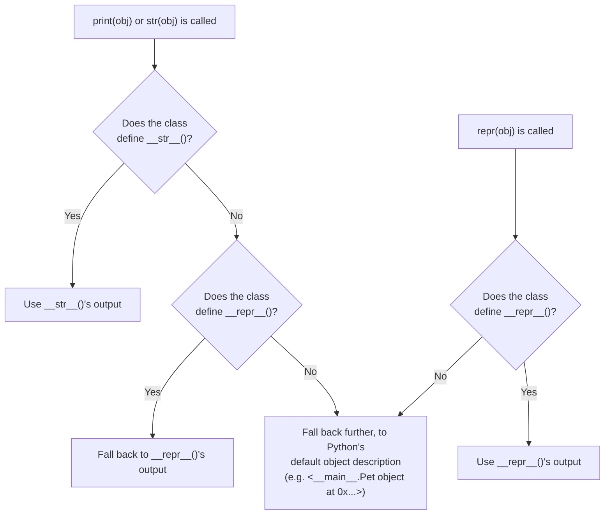
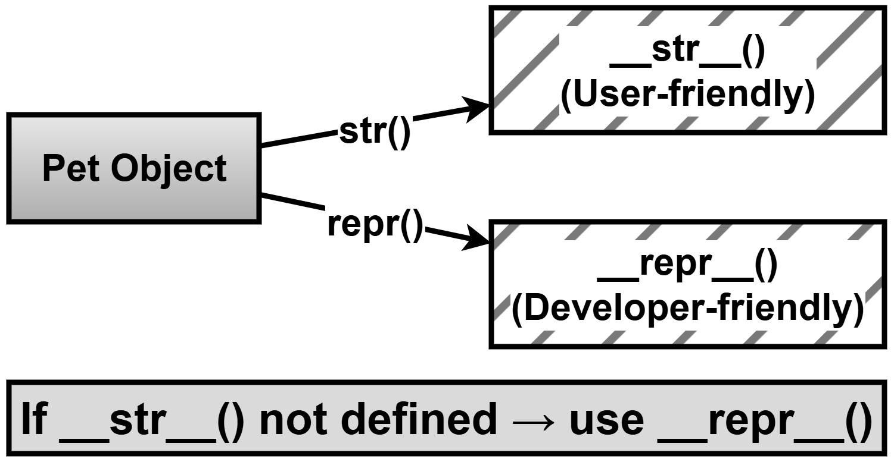

# Chapter 7 — Research Question: `str()` versus `repr()`

## What this page covers

This page is a research-question deep dive for Chapter 7, following on from the earlier material on `__init__` and other dunder ("double underscore") methods. It investigates two special methods that control how an object is converted into text: `__str__()` and `__repr__()`. Earlier in the book you learned how to give an object a readable string form using `__str__()` — this page explains the *other* method Python offers for the same general purpose, why both exist, and what happens when only one of them is defined.

This is relevant to every Python programmer, not just those writing complex classes, because it affects two things you'll do constantly: **showing information to a user** (`print()`) and **debugging your own code** (inspecting objects in a console, in logs, or in error messages). Choosing the right method — or understanding what happens when you only define one — changes what actually shows up in each of those situations.

**A quick note on terms used below:**
- **Dunder method** — a method with a name that starts and ends with double underscores (e.g. `__init__`, `__str__`), which Python calls automatically in specific situations rather than you calling it directly. (Covered in more detail on the "OOP Conceptual Questions" page, Q7.)
- **Instance variable** — a piece of data stored individually on one specific object (e.g. `self.name`). (Covered on the same page, Q6.)

---

## Research Question

> Investigate the difference between `__str__()` and `__repr__()` methods in Python classes. When should each method be used? What happens when only one of them is defined?

### Follow-up questions worth exploring alongside the original

The original research question focuses on the case where `__repr__()` is defined but `__str__()` is not. To fully understand the relationship between the two methods, it's worth also asking:
- *What happens if only `__str__()` is defined, but `__repr__()` is not?*
- *What happens if **neither** is defined at all?*

Both are answered below, alongside the original two cases from the book, so you can see the complete picture in one place.

---

## Key differences

| | `__str__()` | `__repr__()` |
|---|---|---|
| Triggered by | The built-in `str()` function, and by `print()` | The built-in `repr()` function |
| Purpose | A **user-friendly (informal)** description | An **official (formal)** description |
| Intended audience | End users reading output | Developers — debugging, logging, inspecting data |
| Ideal content | Something pleasant and readable, e.g. `"Tommy is a Dog"` | Ideally, something precise enough that it hints at how the object was built, e.g. `"Pet(name='Tommy', animal_type='Dog')"` |

### The important fallback rule

If a class defines `__repr__()` but does **not** define `__str__()`, then calling `str()` (or `print()`) will automatically **fall back to using `__repr__()` instead.** Python only does this substitution in one direction — `__repr__()` is treated as the more fundamental, "always available" representation.



Notice the asymmetry: `repr()` **never** falls back to `__str__()`. Only `str()`/`print()` are willing to fall back to `__repr__()`. This is why defining `__repr__()` alone still gives you working, sensible output everywhere, while defining `__str__()` alone leaves `repr()` using Python's generic, not-very-useful default.

---

## Task instructions (from the book)

1. Create a class `Pet` with attributes like `name` and `type`.
2. Implement both `__str__()` and `__repr__()` methods.
3. Observe outputs of `print(object)`, `str(object)`, and `repr(object)`.
4. Remove the `__str__()` method and observe the change.
5. Write your conclusions.

---

## Case 1 — Both `__str__()` and `__repr__()` are defined

```python
# Example demonstrating __str__() and __repr__()
class Pet:
    def __init__(self, name, animal_type):
        # Step 1: Store both pieces of data on this specific object.
        self.name = name
        self.animal_type = animal_type

    def __repr__(self):
        # Step 2: The "official" representation, aimed at developers.
        # Good practice: write it so it LOOKS like valid Python code
        # that could recreate this exact object, e.g. by copy-pasting
        # it back into a Pet(...) call.
        return f"Pet(name='{self.name}', animal_type='{self.animal_type}')"

    def __str__(self):
        # Step 3: The "friendly" representation, aimed at end users --
        # this is what print() and str() will use.
        return f"{self.name} is a {self.animal_type}"


# Step 4: Create an object to test all three ways of converting it to text.
pet1 = Pet("Tommy", "Dog")

print("Using print():", pet1)        # Calls __str__()
# Output: Using print(): Tommy is a Dog

print("Using str():", str(pet1))     # Also calls __str__()
# Output: Using str(): Tommy is a Dog

print("Using repr():", repr(pet1))   # Calls __repr__()
# Output: Using repr(): Pet(name='Tommy', animal_type='Dog')
```

**What this shows:** when both methods are defined, each one is used exactly where you'd expect — `print()`/`str()` use the friendly version, and `repr()` uses the formal, developer-oriented version.

---

## Case 2 — Only `__repr__()` is defined (`__str__()` is missing)

```python
class Pet:
    def __init__(self, name, animal_type):
        self.name = name
        self.animal_type = animal_type

    def __repr__(self):
        # Step 1: Only the "official" representation is provided here --
        # there is no __str__() method in this version of the class at all.
        return f"Pet(name='{self.name}', animal_type='{self.animal_type}')"


pet1 = Pet("Tommy", "Dog")

print(pet1)          # Step 2: No __str__() exists, so Python falls back to __repr__()
# Output: Pet(name='Tommy', animal_type='Dog')

print(str(pet1))     # Step 3: str() falls back to __repr__() for the same reason
# Output: Pet(name='Tommy', animal_type='Dog')

print(repr(pet1))    # Step 4: repr() was always going to use __repr__() directly
# Output: Pet(name='Tommy', animal_type='Dog')
```

**What this shows:** removing `__str__()` doesn't cause an error or blank output — Python quietly falls back to `__repr__()` everywhere, so all three lines print the same, more "formal-looking" text.

---

## Case 3 — Only `__str__()` is defined (`__repr__()` is missing)

*(This case wasn't in the original book exercise, but directly answers one of the natural follow-up questions above — what happens in the opposite situation?)*

```python
class Pet:
    def __init__(self, name, animal_type):
        self.name = name
        self.animal_type = animal_type

    def __str__(self):
        # Step 1: Only the "friendly" representation is provided here --
        # there is no __repr__() method in this version of the class.
        return f"{self.name} is a {self.animal_type}"


pet1 = Pet("Tommy", "Dog")

print(pet1)          # Step 2: __str__() exists, so it's used directly.
# Output: Tommy is a Dog

print(str(pet1))     # Step 3: Same as above -- str() uses __str__() directly.
# Output: Tommy is a Dog

print(repr(pet1))    # Step 4: repr() does NOT fall back to __str__() --
                      # with no __repr__() defined, Python uses its own
                      # generic built-in default instead.
# Output: <__main__.Pet object at 0x7f9c1a2b3c40>   (the exact address will vary)
```

**What this shows:** the fallback relationship only goes one way. Defining `__str__()` alone does *not* give `repr()` anything useful to fall back to — you're left with Python's generic `<ClassName object at 0x...>` message, which reveals almost nothing about the object's actual data.

---

## Case 4 — Neither method is defined

*(A second natural follow-up: what if you define neither?)*

```python
class Pet:
    def __init__(self, name, animal_type):
        self.name = name
        self.animal_type = animal_type
    # No __str__() and no __repr__() defined at all.


pet1 = Pet("Tommy", "Dog")

print(pet1)
# Output: <__main__.Pet object at 0x7f9c1a2b3c40>   (generic default)

print(repr(pet1))
# Output: <__main__.Pet object at 0x7f9c1a2b3c40>   (same generic default)
```

**What this shows:** with neither method defined, both `print()`/`str()` and `repr()` fall all the way back to Python's own built-in default — a message that only tells you the class name and the object's memory address (see the earlier chapter page on `id()` and `self` for more on what that address means), with none of the object's actual data visible.

---


**The following figure shows how str() and repr() interact:**



## Comparing all four cases

| Case | `__str__()` defined? | `__repr__()` defined? | `print(obj)` shows | `repr(obj)` shows |
|---|---|---|---|---|
| 1 | Yes | Yes | The friendly `__str__()` text | The formal `__repr__()` text |
| 2 | No | Yes | Falls back to `__repr__()` text | The formal `__repr__()` text |
| 3 | Yes | No | The friendly `__str__()` text | Python's generic default (no fallback) |
| 4 | No | No | Python's generic default | Python's generic default |

---

## Conclusions

- **`__str__()` and `__repr__()` serve two different audiences** — `__str__()` for people reading output casually, `__repr__()` for developers who need precise, debuggable information.
- **The fallback only runs one way.** If you only have time to implement one of the two, `__repr__()` is the safer choice, because `print()`/`str()` will automatically fall back to it — but the reverse is not true; `repr()` never falls back to `__str__()`.
- **A well-written `__repr__()` is genuinely useful for debugging.** A common convention is to write it so that it looks like valid Python code that could recreate the object (as in the examples above), which makes debugging output far more informative than a generic default.
- **If neither method is defined**, Python's own generic fallback (`<ClassName object at 0x...>`) is technically valid, but it reveals nothing about the object's actual data — which is exactly why defining at least `__repr__()` is considered good practice for any class you expect to inspect, log, or debug.

([Python docs: `object.__repr__`](https://docs.python.org/3/reference/datamodel.html#object.__repr__), [Python docs: `object.__str__`](https://docs.python.org/3/reference/datamodel.html#object.__str__))
