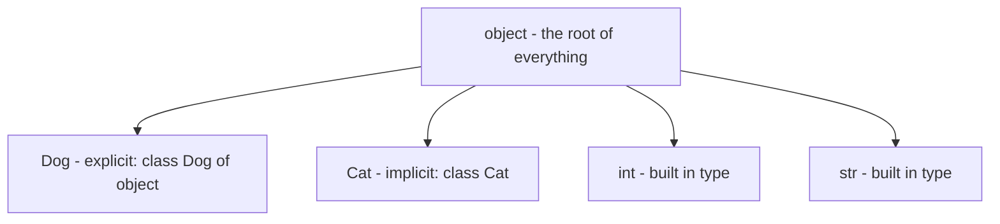
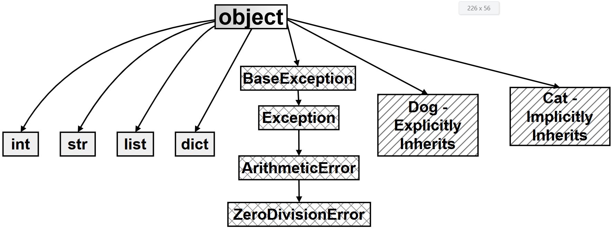

# Chapter 7.14 — Research Question: Implicit Inheritance from `object`

## What this page covers

This page is a research-question deep dive for Chapter 7, and answers a question many beginners never think to ask: **if you write a class without explicitly inheriting from anything, does it inherit from *nothing*?** The surprising (and important) answer is no — every single class in Python, including ones you write yourself and Python's own built-in types like `int` and `str`, automatically inherits from a common ancestor class called `object`.

This matters because it explains where a lot of "free" behaviour comes from. You've probably noticed that even a class you define with just `pass` and nothing else can still be printed, compared with `==`, and inspected with `dir()` — none of which you wrote yourself. This page explains exactly where that behaviour comes from, and gives you the tools (`__mro__`, `issubclass()`) to prove it for yourself, on any class, at any time.

**A few terms used throughout, explained simply:**
- **Base class / parent class** — a class that another class inherits from. ([Python docs: Inheritance](https://docs.python.org/3/tutorial/classes.html#inheritance))
- **Inheritance** — when one class automatically gains the attributes and methods of another class, without having to rewrite them.
- **MRO (Method Resolution Order)** — the specific order Python searches through a class's ancestors when looking for a method or attribute. ([Python docs: `__mro__`](https://docs.python.org/3/library/stdtypes.html#class.__mro__))
- **Dunder method** — a method named with double underscores on both sides (e.g. `__init__`, `__repr__`), called automatically by Python in specific situations. (Covered in more depth on the "OOP Conceptual Questions" page, Q7.)

---

## Research Question

**Part A: Universal Ancestry and Implicit Inheritance**
> Investigate the role of the `object` class as the ultimate base class in Python's type hierarchy. How does the "Implicit Inheritance" of `object` provide every Python entity — whether a user-defined class or a primitive type like `int` and `str` — with its fundamental capabilities (such as identity, string representation, and memory allocation)?

**Part B: Programmatic Proof and the MRO**
> How do the `__mro__` (Method Resolution Order) attribute and the `issubclass()` function prove this architecture? Explain why Python 3 made inheritance from `object` implicit, and identify which essential "dunder" methods are inherited even by an empty class.

### Follow-up questions worth exploring alongside the original

- *Does `object` itself inherit from anything?* (Answered directly by the script below — see the "root itself" test.)
- *If two unrelated classes, like `Dog` and `str`, both ultimately inherit from `object`, does that mean you can compare a `Dog` and a `str` meaningfully?* (Short answer: no — shared ancestry from `object` guarantees a *minimum* set of common capabilities, like being printable or comparable for identity, but it doesn't make unrelated types behave the same way in practice. This is worth exploring hands-on once you've worked through the script below.)

---

## Part A: The foundation of every entity

In Python, **everything is an object** — not just instances of classes you define, but numbers, strings, functions, even classes themselves. This is made possible by a "single root" hierarchy: the built-in class `object` sits at the very top, and every other class, no matter how it's defined, ultimately traces back to it.

By inheriting from `object`, every class automatically gains a baseline set of low-level capabilities, without you ever having to write them yourself:

| Capability | Provided by | What it gives every object |
|---|---|---|
| Memory allocation | `__new__` | Handles the actual, physical creation of the object in memory |
| A default string form | `__repr__` | A fallback way to display the object, e.g. `<__main__.Cat object at 0x...>` (see the earlier page on `str()` vs. `repr()` for more) |
| Identity comparison | `__eq__` | A default way to check whether two references point at the same object |
| Attribute listing | `__dir__` | Powers the built-in `dir()` function, letting you inspect what an object has |

This shared foundation is what gives integers, strings, and your own custom classes a common "DNA" — it's why the Python interpreter can treat wildly different kinds of data uniformly at a low level, even though they behave very differently at a higher level.

---

## Part B: Proving the hierarchy

### The MRO proof

The **Method Resolution Order (MRO)** is the exact path Python follows when searching for a method or attribute on an object — starting with the object's own class, then working outward through its ancestors, in a fixed, well-defined order. You can inspect it directly via a class's `__mro__` attribute, or by calling `.mro()` on the class.

**The key finding:** no matter how deep or complex a class's inheritance chain is, **the very last stop on the MRO is always `<class 'object'>`.** Every path leads back to the same root.

### Why Python 3 made inheritance from `object` implicit

In older Python 2 code, you'd sometimes see classes written two different ways:

```python
class Dog(object):   # "New-style" class -- explicit inheritance from object
    pass

class Cat:            # "Old-style" class in Python 2 -- did NOT inherit from object!
    pass
```

In Python 2, these two forms were genuinely different — old-style classes lacked several modern OOP features. **Python 3 removed that distinction entirely.** Writing `class Cat:` in Python 3 is now simply shorthand for `class Cat(object):` — inheritance from `object` happens automatically and implicitly, every single time, whether you write it out or not. This was done to simplify the language's syntax, and to guarantee that every class, without exception, benefits from modern OOP features like properties, descriptors, and consistent default behaviour.

### Inherited dunder methods, even on an empty class

An empty class — just `class Cat: pass`, with nothing else in it — still automatically possesses more than 20 methods, inherited entirely from `object`. A few of the most important:

| Method | What it does |
|---|---|
| `__init__` | The constructor — called automatically when a new object is created (see the "OOP Conceptual Questions" page, Q5) |
| `__repr__` | Provides the default, developer-facing text form of the object |
| `__eq__` | Powers the `==` comparison operator |
| `__dir__` | Powers the built-in `dir()` function |
| `__hash__` | Allows the object to be used as a dictionary key or stored in a set |
| `__class__` | Lets you find out which class an object belongs to at runtime |

You can see the complete list yourself at any time with `dir(object)`.

---

## Visualizing the hierarchy




## Another diagram

The following flowchart shows the hierarchy of some inbuilt and user created classes. Note:- Exceptions as a class are discussed in the chapter on exceptions



Whether a class explicitly writes `(object)`, writes nothing at all, or is one of Python's own built-in types, the destination is always the same single root.

---

## The script: proving the hierarchy for yourself

This script defines a helper function that inspects any class's ancestry, then runs it against a user-defined class with explicit inheritance, one with implicit inheritance, two built-in types, and `object` itself.

```python
class Dog(object):
    # Step 1: Explicit inheritance -- written out by hand, exactly the
    # way all Python 2 "new-style" classes had to be written.
    pass

class Cat:
    # Step 2: Implicit inheritance -- in Python 3 this is EXACTLY
    # equivalent to "class Cat(object): pass", just without writing
    # "(object)" out by hand.
    pass


def deep_dive_ancestry(cls):
    """Inspects and prints a class's ancestry, proving it ultimately
    traces back to 'object', no matter how it was defined."""
    print(f"--- Deep Dive: {cls.__name__} ---")

    # Step 3: Show this class's DIRECT parent(s) only (not the whole chain).
    print(f"Direct Parents (__bases__): {cls.__bases__}")

    # Step 4: Show the FULL ancestry chain, in the exact order Python
    # would search it when looking for a method -- this is the MRO.
    print("Full MRO Path:")
    for i, ancestor in enumerate(cls.mro()):
        print(f"  Level {i}: {ancestor}")

    # Step 5: A direct, boolean proof: is this class a descendant of object?
    # (issubclass(X, X) is also always True -- a class counts as a
    # "subclass" of itself.)
    print(f"Is it a descendant of 'object'? {issubclass(cls, object)}")

    # Step 6: Special case -- if we're inspecting 'object' itself, show
    # how many total methods/attributes it provides to everything else.
    if cls == object:
        print(f"Total methods in 'object' root: {len(dir(cls))}")

    print("-" * 40)
    # Uncomment the next line if you want to see the actual method names:
    # print(f"Methods inherited from object: {dir(object)}")


# --- Test 1: a user-defined class with EXPLICIT inheritance ---
deep_dive_ancestry(Dog)
# Output:
# --- Deep Dive: Dog ---
# Direct Parents (__bases__): (<class 'object'>,)
# Full MRO Path:
#   Level 0: <class '__main__.Dog'>
#   Level 1: <class 'object'>
# Is it a descendant of 'object'? True
# ----------------------------------------

# --- Test 2: a user-defined class with IMPLICIT inheritance ---
deep_dive_ancestry(Cat)
# Output:
# --- Deep Dive: Cat ---
# Direct Parents (__bases__): (<class 'object'>,)
# Full MRO Path:
#   Level 0: <class '__main__.Cat'>
#   Level 1: <class 'object'>
# Is it a descendant of 'object'? True
# ----------------------------------------
# Notice this output is IDENTICAL in shape to Dog's -- proving explicit
# and implicit inheritance really do produce the exact same result.

# --- Test 3: a built-in type, int ---
deep_dive_ancestry(int)
# Output:
# --- Deep Dive: int ---
# Direct Parents (__bases__): (<class 'object'>,)
# Full MRO Path:
#   Level 0: <class 'int'>
#   Level 1: <class 'object'>
# Is it a descendant of 'object'? True
# ----------------------------------------

# --- Test 4: another built-in type, str ---
deep_dive_ancestry(str)
# Output:
# --- Deep Dive: str ---
# Direct Parents (__bases__): (<class 'object'>,)
# Full MRO Path:
#   Level 0: <class 'str'>
#   Level 1: <class 'object'>
# Is it a descendant of 'object'? True
# ----------------------------------------

# --- Test 5: the root itself ---
deep_dive_ancestry(object)
# Output:
# --- Deep Dive: object ---
# Direct Parents (__bases__): ()
# Full MRO Path:
#   Level 0: <class 'object'>
# Is it a descendant of 'object'? True
# ----------------------------------------
# Notice __bases__ is EMPTY here -- object is the one and only class
# in the entire hierarchy that has no parent at all.
```

### What the results prove, side by side

| Class tested | Direct parent | MRO depth | Descendant of `object`? |
|---|---|---|---|
| `Dog` (explicit `(object)`) | `object` | 2 levels | True |
| `Cat` (implicit) | `object` | 2 levels | True |
| `int` (built-in) | `object` | 2 levels | True |
| `str` (built-in) | `object` | 2 levels | True |
| `object` itself | *(none)* | 1 level | True (a class always counts as a descendant of itself) |

The identical shape of every result — regardless of whether the class was user-defined, built-in, written with explicit inheritance, or written with none at all — is the actual proof behind Part A and Part B of the research question.

---

## Quick recap

- **Every class in Python 3 ultimately inherits from `object`**, whether that inheritance is written out explicitly (`class Dog(object):`) or left implicit (`class Cat:`) — the two are functionally identical.
- **The MRO always ends at `object`**, no matter how long or complex a class's inheritance chain is — it's the guaranteed final stop.
- **This shared ancestry is why even an empty class already has 20+ working methods**, including `__init__`, `__repr__`, `__eq__`, and `__hash__`, without you writing a single line of code for them.
- **`issubclass(cls, object)`** is a simple, direct way to confirm this relationship for any class, and always returns `True`.
- Python 3 made this inheritance implicit specifically to remove the old Python 2 distinction between "new-style" and "old-style" classes, guaranteeing every class gets full, modern OOP behaviour by default.

*(Note: exceptions are also classes with their own inheritance chain, ultimately rooted in `BaseException` rather than directly in `object` — this is covered separately in the chapter on exceptions.)*


