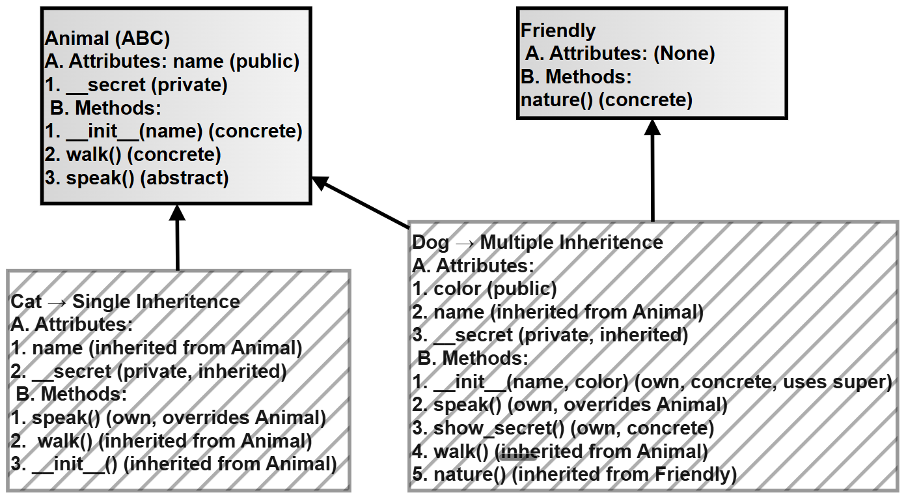

# Chapter 8 — Research Assignment: Animal Management System (Inheritance in Practice)

## What this page covers

This page is a hands-on design assignment for Chapter 8, and works as a capstone for everything Chapter 7 covered about classes and objects. Instead of testing one concept at a time, it asks you to build a small, realistic system — an **Animal Management System** — that brings together almost every major OOP idea from the book at once: abstract base classes, inheritance (including *multiple* inheritance), method overriding, polymorphism, encapsulation, and type checking.

This kind of assignment is genuinely representative of real Python OOP work: production code rarely demonstrates one concept in isolation the way a single exercise does — it combines several of them to model something meaningful, exactly like the `Animal`/`Dog`/`Cat` system built here. Working through it carefully is a good check of whether the individual concepts from earlier chapters have actually connected together into a working mental model.

**A few terms used throughout, explained simply, with links for more detail:**
- **Abstract Base Class (ABC)** — a class that isn't meant to be used directly to create objects; instead, it defines a required "shape" that its subclasses must follow. ([Python docs: `abc` module](https://docs.python.org/3/library/abc.html))
- **Abstract method** — a method declared in an ABC with no real implementation, forcing every subclass to provide its own version, or Python will refuse to let you create an object of that subclass at all.
- **Multiple inheritance** — when a class inherits from more than one parent class at once (here, `Dog` inherits from both `Animal` and `Friendly`).
- **Polymorphism** — the ability to call the *same* method name on different types of objects, and have each one respond in its own way. ([Python docs: Polymorphism overview](https://docs.python.org/3/tutorial/classes.html))
- **Dynamic binding** — Python deciding *which* version of an overridden method to actually run, at the moment the method is called, based on the real type of the object — not decided in advance.
- **MRO (Method Resolution Order)** — covered in more depth on the previous page, "Implicit Inheritance from `object`."

---

## PART A: Class Design


### 1. Create an Abstract Base Class

- Create a class `Animal` using `ABC`
- Include:
  - `__init__(self, name)`
  - A **private attribute** `__secret`
  - A concrete method `walk()`
  - An **abstract method** `speak()`

### 2. Create an Additional Class

- Create a class `Friendly`
- Include method:
  - `nature()` → prints behaviour of the animal

### 3. Create Derived Classes

**A. Class `Dog`**
- Inherit from both `Animal` and `Friendly`
- Add attribute `color`
- Implement:
  - Constructor using `super()` (**constructor chaining**)
  - Override `speak()`
  - Method `show_secret()` to access private variable

**B. Class `Cat`**
- Inherit from `Animal`
- Override `speak()`

---

## PART B: Functional Requirements


Write code to demonstrate the following:

1. **Code Reuse** — Call `walk()` method using object of `Dog` and `Cat`
2. **Method Overriding** — Show that `Dog` and `Cat` override `speak()`
3. **Polymorphism (Dynamic Binding)** — Create a list of animals; use a loop to call `speak()` for each object
4. **Use of `super()`** — Ensure parent constructor is called from child
5. **Multiple Inheritance** — Call `nature()` method using `Dog`
6. **Encapsulation (Private Members)** — Access private variable using a method inside the class
7. **Type Checking** — Use `isinstance()` and `issubclass()`
8. **Method Resolution Order (MRO)** — Print `__mro__` of class `Dog`

### A follow-up question worth exploring

The assignment has `Cat` inherit from `Animal` only, while `Dog` inherits from both `Animal` and `Friendly`. As a follow-up exercise: **what would `Cat.__mro__` look like compared to `Dog.__mro__`?** Try predicting it before running the code — then check your answer against the script's output below. (Hint: since `Cat` only has one parent, its MRO will be shorter than `Dog`'s.)

---

## Visualizing the class hierarchy


*(This diagram uses plain `graph TD` syntax with simple boxes and arrows only — no subgraphs, no styled/labeled edges, no special characters in labels — so it should paste cleanly into draw.io via Extras → Edit Diagram.)*

Notice `Dog` has **two** arrows pointing into it — one from `Animal`, one from `Friendly` — this is exactly what multiple inheritance looks like: a single class combining behaviour from two separate parents at once.

---

## SOLUTION

The script below implements every requirement from Part A and Part B, with comments added at each step explaining what's happening and why. (One small fix from the original: the code comment inside `Dog.speak()` was cut off mid-sentence in the source file — it's completed below.)

```python
from abc import ABC, abstractmethod

# --- STEP 1: The Abstract Base Class ---
class Animal(ABC):
    def __init__(self, name):
        self.name = name
        # A "private" attribute (see the earlier page on encapsulation
        # and name mangling for the full explanation of the double
        # underscore here).
        self.__secret = "I am hidden"

    def walk(self):
        # A CONCRETE method -- fully implemented here, and automatically
        # available to every subclass without them writing any code for it.
        print(f"{self.name} is walking")

    @abstractmethod
    def speak(self):
        # An ABSTRACT method -- deliberately left with no real
        # implementation. Because Animal is an ABC, Python will refuse
        # to let you create an Animal(...) object directly, AND will
        # refuse to let you create a subclass object unless that
        # subclass provides its own speak() method.
        pass


# --- STEP 2: A second, unrelated parent class ---
class Friendly:
    # This class has nothing to do with Animal -- it exists purely to
    # demonstrate MULTIPLE INHERITANCE once Dog inherits from both.
    def nature(self):
        print("I am friendly and love to socialize!")


# --- STEP 3: Dog -- inherits from BOTH Animal and Friendly ---
class Dog(Animal, Friendly):

    def __init__(self, name, color):
        # CONSTRUCTOR CHAINING: rather than repeating "self.name = name"
        # here, we call the parent class's own __init__ and let IT set
        # up the shared attribute. This avoids duplicating logic, and
        # means any future changes to Animal.__init__ automatically
        # apply to Dog too.
        super().__init__(name)
        self.color = color   # Dog-specific attribute, not shared with Cat

    def speak(self):
        # METHOD OVERRIDING: this provides Dog's own required
        # implementation of the abstract speak() method declared in
        # Animal. Without this method, Python would refuse to let us
        # create a Dog object at all.
        print(f"{self.name} says Bark!")

    def show_secret(self):
        # Accessing the "private" __secret attribute from INSIDE a
        # subclass method, using its real, name-mangled identity:
        # _Animal__secret (mangled using the class it was DEFINED in,
        # which is Animal, not Dog).
        print(self._Animal__secret)


# --- STEP 4: Cat -- inherits from Animal only (single inheritance) ---
class Cat(Animal):

    def speak(self):
        # Cat's own required implementation of speak() -- a completely
        # different message from Dog's, even though the method name
        # and the way it's called are identical. This is the basis of
        # polymorphism, demonstrated further down.
        print(f"{self.name} says Meow!")


# ============================================================
# DEMONSTRATION OF ALL REQUIRED CONCEPTS
# ============================================================

d = Dog("Tommy", "Black")
c = Cat("Kitty")

# --- 1. Code reuse ---
d.walk()   # -> Tommy is walking
c.walk()   # -> Kitty is walking
# Neither Dog nor Cat defines its own walk() method -- both automatically
# reuse the single implementation inherited from Animal.

# --- 2. Method overriding ---
d.speak()  # -> Tommy says Bark!
c.speak()  # -> Kitty says Meow!
# Both classes provide their OWN version of speak(), overriding the
# abstract placeholder from Animal.

# --- 3. Polymorphism (dynamic binding) ---
pets = [d, c]
for p in pets:
    p.speak()
# Output:
#   Tommy says Bark!
#   Kitty says Meow!
# The SAME line of code, p.speak(), produces different output depending
# on the real type of each object -- Python decides which speak() to
# run at the moment the loop reaches that object, not in advance.

# --- 4. Multiple inheritance ---
d.nature()
# -> I am friendly and love to socialize!
# Dog has access to nature() even though it's defined on Friendly, not
# Animal -- proof that Dog is genuinely combining behaviour from BOTH
# of its parent classes at once.

# --- 5. Private access (encapsulation) ---
d.show_secret()
# -> I am hidden
# The private __secret attribute, originally set inside Animal.__init__,
# is still reachable -- but only through a method, and only using its
# real mangled name, never as a plain d.__secret from outside the class.

# --- 6. isinstance() and issubclass() ---
print(isinstance(d, Dog))       # True  -- d really is a Dog
print(isinstance(d, Animal))    # True  -- Dog IS-A Animal, via inheritance
print(isinstance(c, Cat))       # True  -- c really is a Cat
print(issubclass(Dog, Animal))  # True  -- checks the CLASS relationship,
                                 #          not a specific object

# --- 7. Method Resolution Order (MRO) ---
print(Dog.__mro__)
# Output:
# (<class '__main__.Dog'>, <class '__main__.Animal'>,
#  <class '__main__.Friendly'>, <class 'object'>)
# This is the exact order Python searches when looking for a method on
# a Dog object: Dog itself first, then Animal, then Friendly, and
# finally object -- the shared root every class ultimately traces back to
# (see the previous chapter page on implicit inheritance from 'object').

# --- Follow-up: compare with Cat's MRO ---
print(Cat.__mro__)
# Output:
# (<class '__main__.Cat'>, <class '__main__.Animal'>, <class 'object'>)
# Cat's MRO is SHORTER than Dog's, because Cat only has one parent
# (Animal), while Dog has two (Animal and Friendly).
```

---

## PART C: Concept summary table

The table below maps every requirement from Part A/B to the specific tool used, with a plain-language explanation added for each.

| Property | Description | Key idea | Syntax / tool | Example from the script | Output behaviour |
|---|---|---|---|---|---|
| Code Reuse | A subclass uses a method it never wrote itself | No need to rewrite shared logic | Inheritance | `d.walk()` | Runs `Animal.walk()` |
| Overriding | A subclass redefines a method with the same name | The child's version takes priority | Same method name, redefined in the subclass | `d.speak()` | The `Dog` version runs, not `Animal`'s |
| Polymorphism | The same method call behaves differently per object | Decided at runtime, not in advance | Same method name across different classes | `p.speak()` in the loop | Different output for `Dog` vs. `Cat` |
| `super()` | Calls the parent class's own version of a method | Extends, rather than replaces, parent logic | `super().__init__(...)` | `Dog.__init__` | Both parent and child setup logic run |
| MRO | The exact order Python searches for a method | Avoids ambiguity in multiple inheritance | `cls.__mro__` | `Dog.__mro__` | Shows the full lookup chain |
| ABC | Forces subclasses to implement specific methods | A blueprint that can't be built directly | `ABC`, `@abstractmethod` | `Animal.speak()` | Subclasses **must** override it |
| Encapsulation (private) | Restricts casual access to an attribute | Name mangling | `__var` | `self._Animal__secret` | Access only via a defined method |
| `isinstance()` | Checks whether a specific object belongs to a class | A runtime, per-object check | `isinstance()` | `isinstance(d, Dog)` | `True` / `False` |
| `issubclass()` | Checks whether one class inherits from another | A class-level relationship check | `issubclass()` | `issubclass(Dog, Animal)` | `True` / `False` |
| Constructor chaining | Parent and child both run their own setup logic | Proper, non-duplicated initialization | `super().__init__(...)` | `Dog.__init__` | Both `Animal.__init__` and `Dog.__init__` run |
| Dynamic Binding | The specific method version is resolved at call time | A "late," runtime decision | Underlies polymorphism | Looping over `pets` | The correct `speak()` is always called |

---

### The following flowchart shows the parent and the derived classes

It also shows the attributes and methods of each class.




## Quick recap

- An **Abstract Base Class** (`Animal`) defines a required shape — including at least one `@abstractmethod` — that every subclass must fill in before it can be used to create real objects.
- **`super()`** lets a subclass reuse its parent's setup logic (constructor chaining) instead of duplicating it.
- **Multiple inheritance** (`Dog(Animal, Friendly)`) lets one class combine behaviour from more than one parent, and the **MRO** is what guarantees Python knows exactly which parent to check, and in what order, if there's ever a naming clash.
- **Polymorphism and dynamic binding** mean the same line of code (`p.speak()`) can correctly trigger different behaviour, depending on the real type of the object it's called on, decided at the moment the call happens.
- **`isinstance()`** checks a specific object; **`issubclass()`** checks the relationship between two classes — they answer related but different questions.
- Private attributes (`__secret`) are still technically reachable via name mangling, but the *intended* way to access them is always through a method defined inside the class, as `show_secret()` demonstrates.


