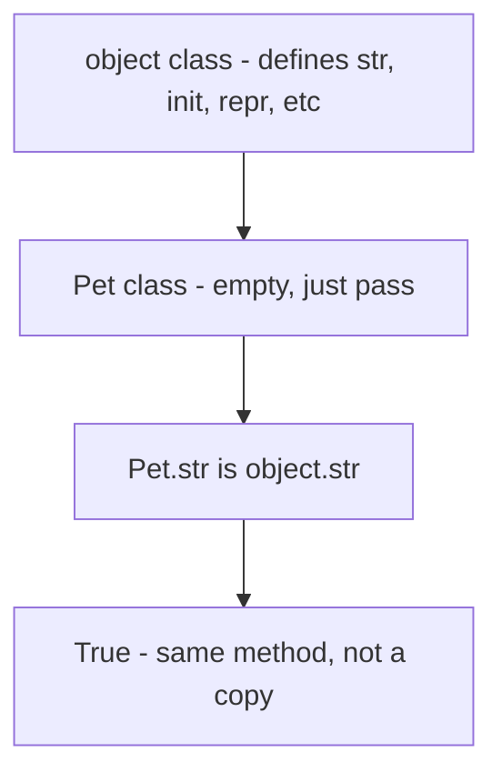

# Chapter 8 — Exercise: Inspecting `object`'s Built-in Methods

## What this page covers

This page is a short, hands-on exercise for Chapter 8, and follows directly on from the earlier research page on implicit inheritance from `object`. That page *explained* that every Python class automatically inherits a set of methods from `object`. This page makes that fact concrete: it shows you how to actually **list** those inherited methods yourself using a built-in function, and how to **prove**, with a simple identity check, that a class you define — even a completely empty one — really is using `object`'s own methods rather than some private copy of its own.

This is a useful, practical skill beyond the exercise itself: `dir()` is a tool you'll reach for constantly while learning Python, any time you want to know "what can I actually do with this object?" — especially useful when exploring an unfamiliar library or debugging.

**A few terms used throughout, explained simply:**
- **`dir()`** — a built-in function that returns a list of the names of all attributes and methods available on an object or class. ([Python docs: `dir()`](https://docs.python.org/3/library/functions.html#dir))
- **Identity check (`is`)** — the `is` operator checks whether two names refer to the *exact same object in memory*, not merely two objects that happen to look equal. (See the earlier chapter page, "Proving That `self` Is Just the Object Itself," for a deeper dive into what "the same object in memory" actually means.)
- **`is` vs. `==`** — `==` asks *"do these two things have equal values?"*; `is` asks the stricter question, *"are these two things literally the same object?"* This distinction matters a lot for this exercise, since we specifically want to prove `Pet.__str__` and `object.__str__` are the exact same method, not just two methods that behave the same way.

---

## Problem Statement


1. Write code to list all attributes and methods available in the `object` class using an appropriate built-in function.
2. Create an object of class `Pet`. Write a statement to check whether the `Pet` class uses the same `__str__` method as provided by the `object` class.

### What the solution script needs to do, step by step

1. Use a built-in function to retrieve a complete list of all attributes and methods provided by the `object` class. Print this list in a numbered format (e.g., `01. __init__`, `02. __str__`, etc.) to see the "default features" every Python object starts with.
2. Define a simple, empty class named `Pet`, using the `pass` statement.
3. Create an instance of `Pet`.
4. Perform an identity check (using the `is` operator) to prove that `Pet` is using the *exact same* `__str__` method defined in the `object` class — even though you never explicitly wrote one yourself.

### A follow-up question worth exploring

The original exercise checks `__str__` specifically. As a natural extension: **is this true for every inherited method, or could some of them differ?** Try checking `Pet.__init__ is object.__init__` and `Pet.__repr__ is object.__repr__` as well — both should also be `True` for an empty class, for exactly the same reason `__str__` is. This is explored directly in the extended script below.

---

## Understanding the check, visually




Because `Pet` never defines its own `__str__`, Python doesn't create a separate copy of `object`'s version for `Pet` to use — it simply reuses the *exact same* method object. That's precisely what the `is` check below confirms.

---

## The script

```python
# --- STEP 1: List every method/attribute inherited from 'object' ---
print("\n--- Methods provided by the 'object' class ---")

# dir() returns a list of every attribute and method name available on
# the thing you pass it -- here, the 'object' class itself.
methods = dir(object)

for i, method in enumerate(methods, 1):
    # enumerate(methods, 1) numbers the list starting from 1, rather
    # than the default of 0, matching the "01. __init__" style
    # requested in the exercise.
    print(f"{i}. {method}", end='')
    # end='' stops print() from adding a newline after each entry,
    # so the whole list prints on one continuous line instead of
    # one method name per line.

# Output (one continuous line):
# 1. __class__ 2. __delattr__ 3. __dir__ 4. __doc__ 5. __eq__
# 6. __format__ 7. __ge__ 8. __getattribute__ 9. __gt__ 10. __hash__
# 11. __init__ 12. __init_subclass__ 13. __le__ 14. __lt__ 15. __ne__
# 16. __new__ 17. __reduce__ 18. __reduce_ex__ 19. __repr__
# 20. __setattr__ 21. __sizeof__ 22. __str__ 23. __subclasshook__

print()   # Step 1b: print a blank line, purely to separate the two
          # sections of output that follow.


# --- STEP 2: Define a completely empty class ---
class Pet:
    # 'pass' means this class body is deliberately empty -- Pet adds
    # NOTHING of its own. Every single capability it has comes purely
    # from its automatic, implicit inheritance from 'object' (see the
    # earlier chapter page, "Implicit Inheritance from object").
    pass


# --- STEP 3: Create an instance of Pet ---
p = Pet()


# --- STEP 4: Prove Pet reuses object's __str__, using an identity check ---
# We compare Pet.__str__ (accessed via the CLASS, not the instance) to
# object.__str__ using 'is', not '==', because we specifically want to
# know if these are the exact same method object in memory -- not just
# two methods that happen to behave the same way.
print(f"Does Pet inherit __str__ from object? {Pet.__str__ is object.__str__}")
# Output: Does Pet inherit __str__ from object? True


# --- FOLLOW-UP: does this hold true for OTHER inherited methods too? ---
print(f"Does Pet inherit __init__ from object? {Pet.__init__ is object.__init__}")
# Output: Does Pet inherit __init__ from object? True

print(f"Does Pet inherit __repr__ from object? {Pet.__repr__ is object.__repr__}")
# Output: Does Pet inherit __repr__ from object? True

# All three checks return True, for the same underlying reason: Pet
# never overrides any of these methods, so Python never creates a
# separate copy for Pet at all -- it simply reuses object's originals,
# every time.
```

### Why this proof actually works

It's worth being precise about *why* the `is` check succeeds here, since it's easy to assume Python somehow "copies" methods down into subclasses — it doesn't:

1. When you write `class Pet: pass`, Python does not generate a personal `__str__` method for `Pet`.
2. When you later access `Pet.__str__`, Python searches `Pet`'s own namespace first, doesn't find anything there, and then follows the MRO (Method Resolution Order — see the earlier chapter page on implicit inheritance) up to `object`, where it *does* find `__str__`.
3. What gets returned is a direct reference to `object`'s own `__str__` method — not a new copy, not a clone, the literal same method object that `object` itself uses.
4. That's exactly why `Pet.__str__ is object.__str__` evaluates to `True`: both names are pointing at the identical method in memory.

If `Pet` *had* defined its own `__str__`, this check would instead return `False` — Python would find `Pet`'s own version first during the search and never need to look any further up the chain.

---

## Quick recap

- **`dir(object)`** lists every attribute and method the root `object` class provides — the baseline every Python class starts with, whether it inherits explicitly or implicitly.
- **`enumerate(iterable, 1)`** is a clean way to number a list starting from 1 instead of 0, useful any time you want human-friendly numbering in output.
- **`is` checks identity** (the exact same object in memory), which makes it the right tool for proving *inheritance* specifically — as opposed to `==`, which only checks whether two things behave equally.
- **An empty class (`class Pet: pass`) still fully works**, printing, comparing, and hashing correctly, because it transparently reuses `object`'s own methods rather than needing any of its own.
- This same identity relationship (`ClassName.method is object.method`) holds for *any* method a subclass hasn't overridden — not just `__str__` — as the follow-up checks in the script above confirm.

