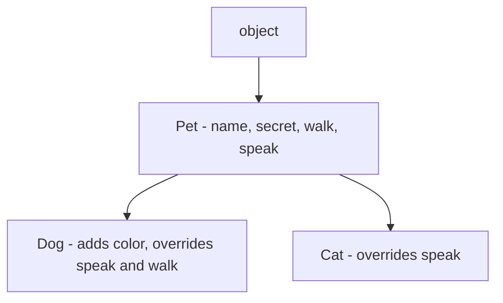

# Chapter 8.30 — Assignment: The Eleven Properties of Inheritance

## What this page covers

This page is a comprehensive design assignment for Chapter 8, and functions as a full review of everything the book has covered about inheritance so far. Rather than testing one property in isolation, it asks you to build a single small system — `Pet`, `Dog`, and `Cat` — that simultaneously demonstrates eleven distinct properties of inheritance: from the basic "is-a" relationship, all the way through to more subtle ideas like dynamic binding and maintainability.

This is worth working through carefully, because these eleven properties aren't eleven separate topics to memorize — they're eleven different *consequences* of the same underlying mechanism (inheritance), and seeing them all demonstrated in one shared piece of code is the best way to understand how they connect to each other in practice.

**A few terms used throughout, explained simply, with links for more detail:**
- **Is-A relationship** — a way of describing inheritance in plain English: "a `Dog` *is a* `Pet`" is true precisely because `Dog` inherits from `Pet`.
- **DRY Principle** — "Don't Repeat Yourself," a general programming principle that inheritance directly supports, by letting a child class reuse a parent's code instead of copying it. ([Wikipedia: DRY](https://en.wikipedia.org/wiki/Don%27t_repeat_yourself))
- **C3 Linearization** — the specific algorithm Python actually uses internally to calculate the MRO (Method Resolution Order) for classes with multiple inheritance. You don't need to know the algorithm's details to use Python — just that `.__mro__` shows you its result. ([Python docs: MRO](https://docs.python.org/3/library/stdtypes.html#class.__mro__))
- **Object lifecycle** — the sequence an object goes through from creation (`__init__` running) through use, to eventual cleanup (see the earlier chapter page on `del` and `__del__()`).

*(Several of these terms — `super()`, MRO, encapsulation, polymorphism, dynamic binding — are also covered in the two earlier Chapter 8 pages on the Animal Management System and implicit inheritance from `object`; this page assumes familiarity with both.)*

---

## Problem Statement

*(Kept exactly as set in the assignment.)*

> Design a Python program that demonstrates all major properties of inheritance, including: (1) Is-A relationship, (2) Code reuse, (3) Method Resolution Order (MRO), (4) Overriding, (5) Polymorphism, (6) `super()`, (7) Constructor behavior, (8) Dynamic binding, (9) Encapsulation, (10) Extensibility, (11) Maintainability.

### What the given script needs to do

**1. Create a base class `Pet`**, including:
- Attribute: `name`
- Private attribute: `__secret`
- Methods: `walk()` (prints a message), `speak()` (generic message), and a constructor `__init__()`

**2. Create a derived class `Dog`**, which:
- Inherits from `Pet`
- Adds attribute `color`
- Overrides `speak()` and `walk()`
- Uses `super()` in both the constructor and in `walk()`

**3. Create a derived class `Cat`**, which:
- Inherits from `Pet`
- Overrides `speak()`

**The script must also demonstrate**, one by one: is-a relationship, code reuse, overriding, polymorphism, `super()` usage, constructor behavior, MRO, encapsulation, dynamic binding, extensibility, and maintainability.

### A follow-up question worth exploring

The assignment demonstrates *single-level* inheritance (`Pet → Dog`, `Pet → Cat`). As a natural extension: **what changes if you add a third level** — for example, a `Puppy` class that inherits from `Dog`? Specifically, predict what `Puppy.__mro__` would look like, and whether calling `super().__init__()` inside `Puppy` would still correctly reach all the way back to `Pet`'s constructor. (This connects to row 13 of the summary table below, "Reusability Across Levels," which the original script doesn't fully demonstrate with actual code — a good exercise is to extend the script yourself with a `Puppy` class and confirm your prediction.)

---

## Visualizing the hierarchy




Unlike the earlier Animal Management System assignment, `Dog` and `Cat` each have **only one** parent here (`Pet`) — this is single inheritance, not multiple inheritance, which is why the MRO for both classes will be shorter and simpler.

---

## The script

```python
# ============================================================
# BASE CLASS: Pet
# ============================================================
class Pet:
    def __init__(self, name):
        # Step 1: Store the shared attribute every Pet needs.
        self.name = name
        # Step 2: A "private" attribute (see the earlier chapter page
        # on encapsulation and name mangling for the full explanation).
        self.__secret = "Hidden"
        # Step 3: A print statement purely so we can SEE, in the output,
        # exactly when this constructor runs -- useful for understanding
        # constructor chaining once Dog and Cat objects are created.
        print("Pet constructor called")

    def walk(self):
        # Step 4: A concrete method, fully usable by every subclass
        # without them writing any code of their own -- this is CODE REUSE.
        print(f"{self.name} is walking (Pet method)")

    def speak(self):
        # Step 5: A generic placeholder, meant to be OVERRIDDEN by
        # subclasses with more specific behaviour.
        print(f"{self.name} makes a sound (Pet method)")

    def show_secret(self):
        # Step 6: The intended, controlled way to access the private
        # attribute from outside -- using its real, name-mangled identity.
        print("Accessing private:", self._Pet__secret)


# ============================================================
# DERIVED CLASS: Dog  (IS-A Pet)
# ============================================================
class Dog(Pet):

    def __init__(self, name, color):
        print("Dog constructor called")
        # Step 7: CONSTRUCTOR CHAINING -- let Pet's own __init__ handle
        # the shared setup (name, __secret) instead of repeating it here.
        super().__init__(name)
        # Step 8: EXTENSIBILITY -- Dog adds a brand-new attribute that
        # Pet never had, without needing to modify Pet at all.
        self.color = color

    def speak(self):
        # Step 9: OVERRIDING -- Dog's own version of speak() completely
        # replaces Pet's generic one when called on a Dog object.
        print(f"{self.name} says Bark!")

    def walk(self):
        # Step 10: OVERRIDING + super() together -- Dog adds its own
        # behaviour FIRST, then explicitly calls Pet's original walk()
        # afterwards, rather than replacing it outright.
        print(f"{self.name} walks like a dog")
        super().walk()


# ============================================================
# DERIVED CLASS: Cat  (IS-A Pet)
# ============================================================
class Cat(Pet):

    def speak(self):
        # Step 11: OVERRIDING -- a different message from Dog's, even
        # though the method name and calling syntax are identical.
        print(f"{self.name} says Meow!")
    # Note: Cat does NOT define its own __init__ or walk() -- it
    # simply reuses Pet's versions of both, completely unchanged.


# ============================================================
# OBJECT CREATION
# ============================================================
d = Dog("Tommy", "Black")
c = Cat("Kitty")

# --- 1. Code Reuse ---
d.walk()   # -> Dog walks like a dog, THEN Tommy is walking (Pet method)
c.walk()   # -> Kitty is walking (Pet method) -- Cat reuses Pet's walk() untouched

# --- 2. Overriding ---
d.speak()  # -> Tommy says Bark!
c.speak()  # -> Kitty says Meow!

# --- 3. Polymorphism + Dynamic Binding ---
pets = [d, c]
for p in pets:
    p.speak()   # The correct speak() is chosen at runtime, per object.

# --- 4. Encapsulation ---
d.show_secret()   # -> Accessing private: Hidden

# --- 5. isinstance() -> Is-A check ---
print(isinstance(d, Dog))   # True
print(isinstance(d, Pet))   # True -- confirms the Is-A relationship

# --- 6. issubclass() ---
print(issubclass(Dog, Pet))   # True
print(issubclass(Cat, Pet))   # True
print(issubclass(Dog, Cat))   # False -- Dog and Cat are siblings, not related to each other

# --- 7. MRO (Method Resolution Order) ---
print("Dog MRO:", Dog.__mro__)   # (Dog, Pet, object)
print("Cat MRO:", Cat.__mro__)   # (Cat, Pet, object)

# --- 8. Constructor Behavior ---
# Dog's constructor explicitly calls Pet's constructor via super().
# Cat has NO constructor of its own at all -- so creating a Cat object
# runs Pet's __init__ directly, with no extra step in between.

# --- 9. Maintainability ---
# If Pet.walk() is changed in the future, BOTH Dog (via its super().walk()
# call) and Cat (which reuses it directly) automatically pick up that
# change -- no need to update Dog or Cat individually.

# --- 10. Extensibility ---
print(d.color)   # -> Black
# New attributes/methods can be added to Dog or Cat without ever
# needing to modify Pet.
```

### Expected output

```text
Pet constructor called
Dog constructor called
Pet constructor called
Tommy walks like a dog
Tommy is walking (Pet method)
Kitty is walking (Pet method)
Tommy says Bark!
Kitty says Meow!
Tommy says Bark!
Kitty says Meow!
Accessing private: Hidden
True
True
True
True
False
Dog MRO: (<class '__main__.Dog'>, <class '__main__.Pet'>, <class 'object'>)
Cat MRO: (<class '__main__.Cat'>, <class '__main__.Pet'>, <class 'object'>)
Black
```

Notice the very first two lines: `"Pet constructor called"` prints for **both** `d = Dog(...)` and `c = Cat(...)` — proof that every `Pet` subclass, whether or not it defines its own `__init__`, always ends up running `Pet.__init__` somewhere in the process (directly for `Cat`, via `super()` for `Dog`).

---

## Summary table: the eleven (plus related) properties of inheritance

| S. No | Property | Simple meaning | Technical description | Example from the script | Output / behaviour | Related concept |
|---|---|---|---|---|---|---|
| 1 | Is-A Relationship | One class is a type of another | Establishes an inheritance hierarchy | `Dog(Pet)` | A `Dog` is always treated as a `Pet` too | OOP design |
| 2 | Code Reuse | Reusing existing code instead of rewriting it | The child automatically inherits methods/attributes | `c.walk()` | Runs `Pet.walk()` directly | DRY principle |
| 3 | Implicit Method Lookup | Python searches automatically when a method isn't found locally | If a method isn't defined on the child, Python checks the parent next | `Cat` has no `__init__` | `Pet`'s constructor runs instead | MRO |
| 4 | Method Resolution Order (MRO) | The exact search order Python follows for methods | A well-defined, linear lookup order | `Dog.__mro__` | `(Dog, Pet, object)` | C3 Linearization |
| 5 | Polymorphism | Same method name, different behaviour per class | Overridden differently in each subclass | `speak()` | `Dog` → "Bark", `Cat` → "Meow" | Dynamic binding |
| 6 | Overriding | A child replaces a parent's method | The child defines a method with the same name | `Dog.speak()` | The child's version runs, not the parent's | Runtime behaviour |
| 7 | `super()` Usage | Explicitly calling the parent's version of a method | Used to reach and run parent logic from inside a child | `super().__init__()` | Both parent and child setup logic run | Constructor chaining |
| 8 | Constructor Behavior | How objects get initialized | Depends on whether the subclass defines its own `__init__` | `Dog` (has one) vs. `Cat` (doesn't) | Different call paths, same end result | Object lifecycle |
| 9 | Dynamic Binding | The method to run is decided at the moment it's called | Resolved at runtime, based on the object's real type | Looping over `pets` | The correct `speak()` always runs | Polymorphism |
| 10 | Extensibility | Adding new features without touching existing code | The child adds new attributes/methods of its own | `color` on `Dog` | New functionality, `Pet` untouched | Design flexibility |
| 11 | Encapsulation Support | Keeping data protected, even across inheritance | Private variables still work via name mangling in subclasses | `__secret` | Accessed only via `_Pet__secret` | Data hiding |
| 12 | Hierarchy Formation | Classes can form multi-level chains | Builds a tree-like class structure | `Pet → Dog → Puppy` (see follow-up question above) | A multi-level relationship | System design |
| 13 | Reusability Across Levels | A class can use features from any ancestor, not just its direct parent | Multi-level inheritance still reaches every ancestor | `Puppy` reusing `Pet.walk()` | Deep reuse, several levels up | MRO |
| 14 | Maintainability | Easy to keep code correct as it grows | Changing the parent automatically updates every subclass | Modifying `Pet.walk()` | Every subclass reflects the change immediately | Clean code |

---

## Quick recap

- All eleven properties named in the problem statement are really different **angles on the same mechanism** — a subclass automatically gaining, extending, or selectively replacing behaviour from its parent.
- **Code reuse and extensibility are two sides of the same coin**: a subclass can use what it inherits unchanged (`Cat.walk()`), extend it (`Dog.walk()`, which calls `super().walk()` and adds more), or override it entirely (`speak()` in both).
- **Constructor behaviour varies deliberately**: `Dog` explicitly chains to `Pet`'s constructor via `super()`; `Cat`, having no constructor of its own, reaches `Pet`'s constructor automatically, with no extra code needed.
- **Maintainability is the practical payoff** of all the other properties combined — because `Dog` and `Cat` both rely on `Pet` rather than duplicating its code, a single change to `Pet` propagates correctly to both, with no risk of the two classes drifting out of sync.
- Rows 12–13 of the table (multi-level hierarchies, deep reuse) point toward the natural next experiment: extending this script with a `Puppy(Dog)` class, as suggested in the follow-up question above.


