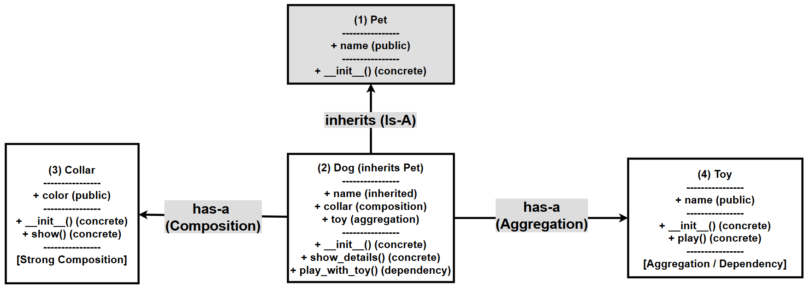

# Chapter 8.40 — Assignment: Building Composition, Aggregation, and Dependency (Pet, Dog, Collar, Toy)

## What this page covers

This page is the hands-on companion to the previous page, "Has-A Relationships: Composition, Aggregation, and Dependency," which explained the three relationship types conceptually. This page asks you to actually **build** a small system — `Pet`, `Dog`, `Collar`, and `Toy` — that demonstrates all three relationships working together in one program, alongside the `Dog`-inherits-from-`Pet` Is-A relationship from earlier in the chapter.

Working through this assignment is a good test of whether the conceptual distinctions from the previous page have actually "clicked": by the end, you should be able to look at any two related classes in your own code and confidently say which of the three Has-A relationships (or whether an Is-A relationship) best describes them — and explain *why*, not just recite the definition.

*(If any of the terms Composition, Aggregation, or Dependency are unfamiliar, the previous chapter page covers each in depth before this assignment builds on them.)*

---

## Objective

In this exercise, you will:
- Understand different forms of **Has-A relationships**
- Implement **composition, aggregation, and dependency**
- Analyse **ownership and lifecycle of objects**
- Design a system using **`Pet`, `Dog`, `Collar`, and `Toy` classes**

---

## Problem Statement


You are required to design a small system involving pets and their accessories. Your implementation must demonstrate the following:

### PART A: Class Design

1. Create the following classes: `Pet` (base class), `Dog` (derived from `Pet`), `Collar`, `Toy`.

### PART B: Composition (Strong Has-A)

2. Implement **Composition** such that:
   - A `Dog` **creates its own Collar internally**
   - The Collar should NOT be passed from outside
   - Add attributes to Collar (e.g., color)
   - Provide a method in Collar to display its details

   *Hint: Create the Collar object inside `Dog.__init__()`*

### PART C: Aggregation (Weak Has-A)

3. Implement **Aggregation** such that:
   - A `Toy` object is created **outside** the `Dog` class
   - The `Dog` receives this Toy as a parameter
   - Store the Toy inside `Dog`

   *Hint: Pass Toy as an argument to Dog's constructor*

### PART D: Dependency (Uses-A)

4. Implement **Dependency** such that:
   - `Dog` has a method that accepts a `Toy` as a parameter
   - `Dog` uses the Toy temporarily (without storing it)

   *Hint: Method like `play_with_toy(self, toy)`*

### PART E: Functionality

5. Your program must:
   - Create at least: one `Collar` (internally via `Dog`), and two `Toy` objects (externally)
   - Create a `Dog` object
   - Demonstrate: accessing the `Collar` (composition), accessing the stored `Toy` (aggregation), and using another `Toy` temporarily (dependency)

### PART F: Conceptual Questions (Must Answer in Comments)

6. Answer the following inside your code as comments:
   - Why is `Collar` an example of composition?
   - Why is `Toy` an example of aggregation?
   - What makes dependency different from aggregation?
   - What happens to `Collar` if `Dog` is deleted? What happens to `Toy`?

### PART G: Advanced Task (Very Important)

7. Modify your program so that the same `Toy` is shared between **two** `Dog` objects. Explain (in comments) what type of relationship this now represents, and why it is *not* composition.

### Expected Outcome

Your program should clearly demonstrate strong ownership (composition), weak ownership (aggregation), and temporary usage (dependency).

### A follow-up question worth exploring

Part G asks you to share one `Toy` between two `Dog`s. As a natural extension: **what would happen if you tried to do the same thing with `Collar` instead — i.e., give the same `Collar` object to two different `Dog`s?** Nothing in Python would *stop* you from writing `d2.collar = d1.collar` — but doing so would go directly against the whole point of composition. This is explored directly at the end of the script below.

---

## Visualizing the relationships


## ANSWER (Solution)

The solution uses four classes, each demonstrating a different concept:

| No. | Class | Concept |
|---|---|---|
| 1 | `Pet` | Base class (Is-A relationship with `Dog`) |
| 2 | `Dog` | Main class — combines all the relationships together |
| 3 | `Collar` | Composition |
| 4 | `Toy` | Aggregation *and* Dependency (used both ways, at different points) |

### The script

```python
# ============================================================
# A. CLASS DEFINITIONS
# ============================================================

class Collar:
    # Step 1: A simple component class, designed to be used for
    # COMPOSITION -- it will only ever be created FROM INSIDE Dog,
    # never independently, and never shared between dogs.
    def __init__(self, color):
        self.color = color

    def show(self):
        print(f"Collar color: {self.color}")


class Toy:
    # Step 2: An independent class, designed to be used for BOTH
    # aggregation (stored long-term) and dependency (used briefly),
    # depending on HOW a Dog method chooses to use it.
    def __init__(self, name):
        self.name = name

    def play(self):
        print(f"Playing with {self.name}")


class Pet:
    # Step 3: The base class for the IS-A relationship covered
    # earlier in this chapter -- Dog will inherit from this.
    def __init__(self, name):
        self.name = name


class Dog(Pet):
    def __init__(self, name, toy):
        # Step 4: Constructor chaining -- reuse Pet's own setup logic
        # for the shared 'name' attribute (see the earlier chapter
        # pages on inheritance and super()).
        super().__init__(name)

        # Step 5: COMPOSITION (Strong Has-A).
        # The Collar is created RIGHT HERE, inside Dog's own
        # constructor. No Collar object exists anywhere else in the
        # program before this line runs, and this exact Collar object
        # will never be shared with any other Dog.
        self.collar = Collar("Red")

        # Step 6: AGGREGATION (Weak Has-A).
        # 'toy' already existed BEFORE this Dog was created -- it was
        # built somewhere else and simply handed in as a parameter.
        # Dog stores a reference to it, but does not own it exclusively.
        self.toy = toy

    def show_details(self):
        # Step 7: Demonstrates accessing BOTH the composed object
        # (Collar) and the aggregated object (Toy) via the Dog.
        print(f"Dog Name: {self.name}")

        print("Collar details (Composition):")
        self.collar.show()

        print("Toy details (Aggregation):")
        print(f"Toy name: {self.toy.name}")

    def play_with_toy(self, toy):
        # Step 8: DEPENDENCY (Uses-A).
        # Notice this 'toy' parameter is COMPLETELY SEPARATE from
        # self.toy above -- it's a different toy, used only for the
        # duration of this one method call, and never stored as
        # self.<anything> anywhere in this method.
        print(f"{self.name} is playing...")
        toy.play()


# ============================================================
# B. MAIN PROGRAM
# ============================================================

# Step 9: Create toys EXTERNALLY, independently of any Dog --
# this is what makes them eligible for aggregation in the first place.
t1 = Toy("Ball")
t2 = Toy("Bone")

# Step 10: Create a Dog, handing it t1 (aggregation) -- notice Dog's
# Collar is NOT created here; it's created automatically, internally,
# the moment Dog.__init__ runs (composition).
d1 = Dog("Tommy", t1)

d1.show_details()
# Output:
# Dog Name: Tommy
# Collar details (Composition):
# Collar color: Red
# Toy details (Aggregation):
# Toy name: Ball

print("\nDependency Example:")
d1.play_with_toy(t2)
# Output:
# Dependency Example:
# Tommy is playing...
# Playing with Bone
# Notice: t2 was never stored anywhere on d1 -- confirm this yourself
# with: print(hasattr(d1, "toy2"))  ->  False (there's no such attribute)

# ============================================================
# Step 11: ADVANCED TASK -- SHARING A TOY BETWEEN TWO DOGS
# ============================================================
d2 = Dog("Bruno", t1)   # Bruno is given the SAME t1 that Tommy already has.

print("Shared Toy Example:")
print(d1.name, "has toy:", d1.toy.name)
print(d2.name, "has toy:", d2.toy.name)
# Both dogs report the same toy name -- and in fact, d1.toy and d2.toy
# are the exact same object in memory (you can confirm this yourself
# with: print(d1.toy is d2.toy)  ->  True), which is only possible
# because Toy is aggregated, not composed.

# ============================================================
# Step 12: FOLLOW-UP -- what if we tried this with Collar instead?
# ============================================================
print("\nFollow-up: sharing a Collar (going against composition)")
d2.collar = d1.collar   # Python allows this -- nothing stops you syntactically.
print(d1.name, "collar is d2's collar?", d1.collar is d2.collar)   # -> True

# This "works" in the sense that Python doesn't raise an error, but it
# violates the DESIGN INTENT of composition: Collar was meant to be
# created privately, once, per Dog. Sharing it like this means Bruno's
# Collar is no longer really "his own" -- exactly the kind of mistake
# composition, as a design pattern, is meant to help you avoid making.


# ============================================================
# C. CONCEPTUAL ANSWERS (AS COMMENTS)
# ============================================================

# 1. Collar is composition because:
#    - It is created INSIDE Dog's own constructor, not passed in
#    - It cannot logically exist independently of its specific Dog
#    - It is never shared with other Dog objects (by design)

# 2. Toy is aggregation because:
#    - It is created OUTSIDE Dog, before the Dog even exists
#    - It can exist independently of any particular Dog
#    - The SAME Toy object can be legitimately shared between multiple Dogs

# 3. Dependency vs. Aggregation:
#    - Aggregation STORES the object as a lasting attribute (self.toy)
#    - Dependency only USES the object temporarily, inside one method
#      call, and never stores it as an attribute at all

# 4. If a Dog object is deleted:
#    - Its Collar is deleted along with it (strong ownership --
#      nothing else in the program was referencing that Collar)
#    - Its Toy still exists, as long as something else (like the
#      original t1/t2 variables, or another Dog) still refers to it

# 5. Shared Toy (the Advanced Task):
#    - The same Toy object is now referenced by TWO different Dogs
#    - This is AGGREGATION, not composition, precisely because
#      ownership is not exclusive -- deleting one Dog does not affect
#      the shared Toy at all
```


## The following diagram shows the relationships between the classes for the above script



---

## Quick recap

- This assignment combines **all four relationship types** covered in this chapter into a single working system: `Dog` **is-a** `Pet` (inheritance), **has-a** `Collar` by composition, **has-a** `Toy` by aggregation, and temporarily **uses-a** `Toy` by dependency inside `play_with_toy()`.
- **The same class (`Toy`) can participate in two different relationship types** depending on how it's used — stored long-term as `self.toy` (aggregation), or passed briefly into a method without being stored (dependency). The relationship type describes *how a specific piece of code uses an object*, not some fixed property of the class itself.
- **Composition is a design intention, not a hard rule Python enforces.** As the follow-up task shows, Python will happily let you write `d2.collar = d1.collar`, sharing what was meant to be an exclusively-owned object — the "strength" of composition comes from how you choose to design and use your classes, not from any technical barrier Python puts in your way.
- **`is` (identity comparison)** is a handy way to directly confirm sharing, as used above with `d1.toy is d2.toy` — see the earlier chapter pages on `id()`/`self` and `object` methods for more on how identity checks work.


