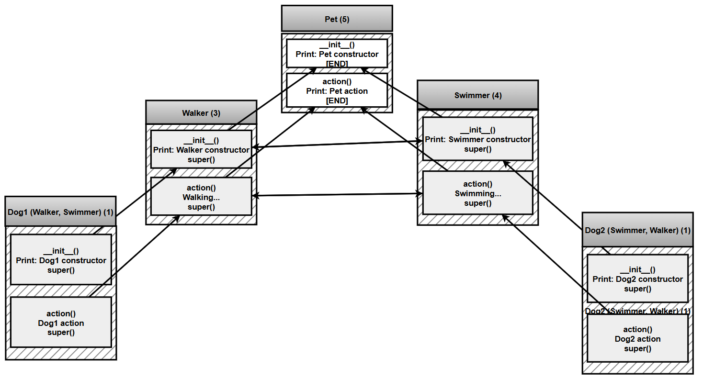

# Chapter 8 — `super()` in Multiple Inheritance and the Diamond Problem

## What this page covers

This page dives into one of the trickier consequences of multiple inheritance: what `super()` actually does once a class has more than one parent. Earlier chapter pages showed `super()` in *single* inheritance, where it simply calls the one parent class's method. This page shows that in *multiple* inheritance, that simple mental model breaks down — and replaces it with the correct one: `super()` doesn't mean "call my parent," it means **"call whoever comes next in the MRO."**

This distinction becomes essential the moment you build a **diamond-shaped** class hierarchy — a very common real-world pattern where two classes share a common ancestor, and a third class inherits from both of them. Without understanding how Python's MRO resolves this, it's easy to accidentally call a shared ancestor's method twice, or to be confused about the order things run in. This page walks through exactly how Python avoids that problem.

**A few terms used throughout, explained simply:**
- **MRO (Method Resolution Order)** — the exact order Python searches through a class's ancestors. Covered in depth on the earlier chapter page, "Implicit Inheritance from `object`."
- **Diamond problem** — the classic ambiguity that arises when two parent classes share a common grandparent, and it's unclear how many times (and in what order) that grandparent's code should run. ([Wikipedia: Diamond problem](https://en.wikipedia.org/wiki/Multiple_inheritance#The_diamond_problem))
- **Cooperative inheritance** — a design style where every class in a hierarchy calls `super()`, allowing the whole chain to run correctly and exactly once per class, no matter how the hierarchy is shaped.

---

## Core idea

**In single inheritance:** `super()` usually calls the immediate parent, simply because with only one ancestor, the MRO has nowhere else to point.

**In multiple inheritance:** `super()` calls **the next class in the MRO** — which may or may not be the class's "direct parent" in the way you'd expect from looking at the class definition alone. This is the single most important idea on this page, and it's worth restating: **`super()` does not mean "go to my parent." It means "go to whoever is next in the MRO."**

---

## Why this matters

Following the MRO instead of a fixed "parent" relationship gives multiple inheritance three important guarantees:

- **Each class runs exactly once** — even if it's a shared ancestor of several other classes in the hierarchy.
- **No duplicate calls** — especially important in diamond-shaped hierarchies (see below), where a naive approach could easily call a shared ancestor's constructor twice.
- **Cooperative inheritance becomes possible** — every class plays its part by calling `super()`, and the whole chain runs correctly, in the right order, without any single class needing to know about the others in advance.

---

## The diamond structure

A very common shape in multiple inheritance looks like this: two classes (`Walker` and `Swimmer`) both inherit from the same base class (`Pet`), and a further class (`Dog`) inherits from both of them.


The shape gives this pattern its name: `Pet` sits at the top, `Walker` and `Swimmer` form the two "sides," and `Dog` sits at the bottom — a diamond. The natural question this raises: **when `Dog` is created, does `Pet.__init__` run once, or twice (once via each side)?** The rules below explain exactly how Python guarantees it only ever runs once.

---

## Correct way using `super()` (cooperative design)

### Rule 1: It follows the MRO, not the hierarchy tree

`super()` never means "my direct parent" in multiple inheritance — it means "next in line," where the line is the class's specific MRO, calculated by Python. Two classes with the *same* set of parents, but listed in a *different order*, will have genuinely different MROs (this is demonstrated directly by `Dog1` vs. `Dog2` in the script below).

### Rule 2: All classes must cooperate

For the chain to work correctly, **every class involved must call `super().__init__()`** (or `super().<method_name>()`, for whichever method is being chained). If even one class in the chain skips this call, the chain breaks at that point, and any classes further along the MRO never get their turn to run.

### Rule 3: The method should exist in all classes being chained

If a method is designed to be chained with `super()`, every class in the MRO needs to either implement that method itself, or safely allow the chain to continue by calling `super()` inside its own version. If neither is true, the chain breaks.

**Why does this rule exist?** Because `super()` blindly does one thing: *"call the next class in the MRO."* It does **not** check in advance whether that next class actually has the method you're calling — it simply tries.

**What happens if the method is missing?** If, at any point in the chain, code calls `super().action()`, but the next class in the MRO doesn't define `action()` at all (and doesn't inherit it from further up either), Python raises:

```text
AttributeError: 'super' object has no attribute 'action'
```

### Rule 4: Avoid direct parent calls

**Don't do this (bad):**
```python
Pet.__init__(self)
```

**Do this instead (good):**
```python
super().__init__()
```

Calling `Pet.__init__(self)` directly bypasses the MRO entirely — it hardcodes exactly which class runs next, which defeats the entire purpose of cooperative inheritance and can easily lead to a shared ancestor's method running more than once in a diamond hierarchy.

---

<details>
<summary>Problem statement and solution: use of <code>super()</code> and MRO in Multiple Inheritance</summary>

## Problem statement and solution to use of `super()` and MRO in Multiple Inheritance


### Problem Statement

You are required to design a Python program to demonstrate how `super()` works in **multiple inheritance**, and how Python uses **Method Resolution Order (MRO)** to control execution.

### Part A: Class Design

1. A base class `Pet` with:
   - A constructor that prints: `"Pet constructor"`
   - A method `action()` that prints: `"Pet action"`

2. Two parent classes:

   **(a) `Walker`**
   - Inherits from `Pet`
   - Constructor should: print `"Walker constructor"`, then call the parent constructor using `super()`
   - Method `action()`: print `"Walking..."`, then call the next method using `super()`

   **(b) `Swimmer`**
   - Same structure as `Walker`, but with output replaced by `"Swimming..."`

### Part B: Multiple Inheritance

Create two child classes:

**(a) `Dog1`**
- Inherits from `Walker, Swimmer`
- Constructor: print `"Dog1 constructor"`, then call `super()`
- Method `action()`: print `"Dog1 action"`, then call `super()`

**(b) `Dog2`**
- Inherits from `Swimmer, Walker`
- Same structure as `Dog1`

### Part C: Execution

Write code to:
1. Print the MRO of both classes: `Dog1.__mro__`, `Dog2.__mro__`
2. Create objects: `d1 = Dog1()`, `d2 = Dog2()`
3. Call: `d1.action()`, `d2.action()`

</details>

### A follow-up question worth exploring

The original assignment only checks `Dog1.__mro__` and `Dog2.__mro__` after creating the objects. As a natural extension: **before running the script, try to predict both MROs and both `action()` output orders from the class definitions alone**, based purely on the order `Walker`/`Swimmer` are listed in each class's parentheses. Then compare your predictions against the actual output below. (Hint: the rule is straightforward once you see it — Python always checks the classes in the exact order they're listed, left to right, before moving up to their shared ancestor.)

---

## The script

```python
# ============================================================
# BASE CLASS
# ============================================================
class Pet:
    def __init__(self):
        # Step 1: This runs once, no matter how many "paths" lead to
        # it in a diamond hierarchy -- the MRO guarantees this.
        print("Pet constructor")

    def action(self):
        print("Pet action")


# ============================================================
# FIRST PARENT (one side of the diamond)
# ============================================================
class Walker(Pet):
    def __init__(self):
        print("Walker constructor")
        # Step 2: Calls whoever is NEXT in the MRO -- which, for a
        # plain Walker object on its own, would be Pet. But when Walker
        # is combined with Swimmer inside Dog1/Dog2 below, "next in
        # the MRO" can mean something different -- see Rule 1 above.
        super().__init__()

    def action(self):
        print("Walking...")
        super().action()   # Continue the MRO chain, don't call Pet directly.


# ============================================================
# SECOND PARENT (the other side of the diamond)
# ============================================================
class Swimmer(Pet):
    def __init__(self):
        print("Swimmer constructor")
        super().__init__()

    def action(self):
        print("Swimming...")
        super().action()


# ============================================================
# CHILD CLASS 1 -- lists Walker FIRST
# ============================================================
class Dog1(Walker, Swimmer):
    def __init__(self):
        print("Dog1 constructor")
        # Step 3: super() here does NOT necessarily mean Walker's
        # __init__ specifically -- it means "whoever comes next in
        # Dog1's own MRO," which happens to be Walker in this case,
        # because Walker was listed FIRST in "class Dog1(Walker, Swimmer)".
        super().__init__()
        # Full MRO for this class: Dog1 -> Walker -> Swimmer -> Pet -> object

    def action(self):
        print("Dog1 action")
        super().action()


# ============================================================
# CHILD CLASS 2 -- lists Swimmer FIRST (reversed order)
# ============================================================
class Dog2(Swimmer, Walker):
    def __init__(self):
        print("Dog2 constructor")
        super().__init__()
        # Full MRO for this class: Dog2 -> Swimmer -> Walker -> Pet -> object

    def action(self):
        print("Dog2 action")
        super().action()


# ============================================================
# TESTING Dog1
# ============================================================
print("<---- Dog1 Execution ---->")

d1 = Dog1()
# Expected output when the object is created:
# Dog1 constructor
# Walker constructor
# Swimmer constructor
# Pet constructor

print("--- Calling action() ---")
d1.action()
# Expected output:
# Dog1 action
# Walking...
# Swimming...
# Pet action

print(Dog1.__mro__)
# Output: (<class '__main__.Dog1'>, <class '__main__.Walker'>,
#          <class '__main__.Swimmer'>, <class '__main__.Pet'>,
#          <class 'object'>)
# This confirms Dog1's MRO is: Dog1 -> Walker -> Swimmer -> Pet -> object.


# ============================================================
# TESTING Dog2
# ============================================================
print("\n<---- Dog2 Execution ---->")

d2 = Dog2()
# Expected output when the object is created:
# Dog2 constructor
# Swimmer constructor
# Walker constructor
# Pet constructor

print("--- Calling action() ---")
d2.action()
# Expected output:
# Dog2 action
# Swimming...
# Walking...
# Pet action

print(Dog2.__mro__)
# Output: (<class '__main__.Dog2'>, <class '__main__.Swimmer'>,
#          <class '__main__.Walker'>, <class '__main__.Pet'>,
#          <class 'object'>)
# Confirms Dog2's MRO is the MIRROR of Dog1's: Dog2 -> Swimmer -> Walker -> Pet -> object,
# simply because "class Dog2(Swimmer, Walker)" lists them in the opposite order.
```

> **Key Insight:** `super()` does not mean "go to parent" — it means "go to the next class in the MRO."

---

## Constructor flow for `Dog1`, visualized


**Why this order?** Because `Dog1`'s MRO is `Dog1 → Walker → Swimmer → Pet → object`, and each `__init__` call chains to `super().__init__()`, which walks straight down this exact sequence, one step at a time.

## Method flow for `Dog1.action()`, visualized


Each class contributes its message exactly once, in MRO order — **no duplication**, even though `Pet` is technically an ancestor reachable through *two* different paths (via `Walker` and via `Swimmer`). This is the diamond problem being correctly resolved: without the MRO's cooperation rules, a naive design might have printed `"Pet action"` (or run `Pet.__init__`) twice.

---

## Flow chart (Alternate)

\*\*The following diagram shows how the MRO works for `__init__()` and `super()`




## Quick recap

- In multiple inheritance, **`super()` always means "next in the MRO," never "my direct parent."**
- **Cooperative inheritance** — every class calling `super()` — is what guarantees a shared ancestor (like `Pet` in this diamond) runs exactly once, no matter how many paths lead to it.
- **The order classes are listed in a class definition directly determines the MRO** — `Dog1(Walker, Swimmer)` and `Dog2(Swimmer, Walker)` produce genuinely different, mirror-image MROs and execution orders, even though both classes have the exact same two parents.
- **Never call a parent's method directly** (e.g. `Pet.__init__(self)`) in a cooperative multiple-inheritance design — always use `super()`, or you risk breaking the chain or causing duplicate calls.
- If a method used with `super()` chaining is missing anywhere along the MRO, Python raises an `AttributeError` at that exact point — it doesn't check ahead of time, it simply tries and fails when it gets there.


