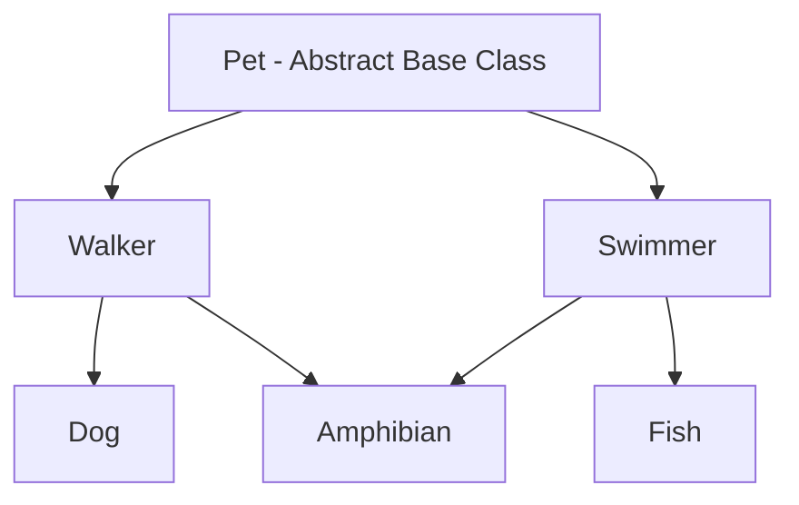

# Chapter 8.60 — Project: Designing a Robust Pet System Using Abstract Classes

## What this page covers

This page is a good project for Chapter 8, combining two ideas that were previously covered separately: **Abstract Base Classes (ABCs)**, which enforce that certain methods *must* be implemented by subclasses, and **`super()`/MRO in multiple inheritance**, covered on the previous page. Together, they let you design a system where you can *guarantee* every pet type in your program correctly implements the required behaviour, while still combining behaviours flexibly through inheritance — here, a pet that both walks and swims.

This combination is very common in real software design: ABCs are how you enforce "every class in this system must follow the same contract," while multiple inheritance (used carefully, with `super()`) is how you let classes mix and match reusable pieces of behaviour without duplicating code. Seeing both work together on one project is a good test of whether the last several chapter pages have connected into a working mental model.

**A few terms used throughout, explained simply, with links to earlier pages for more detail:**
- **Abstract Base Class (ABC)** and **abstract method** — covered in the earlier "Animal Management System" page; a quick summary: an ABC defines required methods that subclasses *must* implement, and Python refuses to let you create an object from a class that hasn't implemented all of them.
- **MRO (Method Resolution Order)** and **`super()` in multiple inheritance** — covered in full on the previous page, "`super()` in Multiple Inheritance and the Diamond Problem."

---

## Problem Statement

Design a system where:
- All pets must implement: `speak()` and `move()`
- Some pets: walk, swim, or do both (multiple inheritance)

### Requirements

**1. Create Abstract Base Class `Pet`**
- Methods: `speak()` → abstract, `move()` → abstract

**2. Create classes**
- **`Dog`** — `speak` → Bark, `move` → Walk
- **`Fish`** — `speak` → (silent or "blub"), `move` → Swim

**3. Multiple Inheritance**

Create `class Amphibian(Walker, Swimmer)`, which should:
- Walk **and** Swim
- Use `super()` properly

**4. Enforce rules**
- Use `ABC` and `@abstractmethod`
- Ensure incomplete classes cannot be instantiated

**5. Show output**
- Create objects, call methods, print MRO

### A follow-up question worth exploring

The script below defines `Dog(Walker)` and `Fish(Swimmer)` as single-inheritance classes, and `Amphibian(Walker, Swimmer)` as the one multiple-inheritance class. As a natural extension: **what would happen if you tried to create a class `FlyingFish(Swimmer, Walker)` — the same two parents as `Amphibian`, but listed in reverse order?** Based on the previous chapter page's diamond-problem rules, predict what `FlyingFish.__mro__` and the order of its `move()` output would look like, *before* checking your answer by actually writing and running the class yourself.

---

## Visualizing the hierarchy




Notice `Amphibian` forms exactly the same diamond shape covered on the previous page (`Pet` → `Walker`/`Swimmer` → `Amphibian`), while `Dog` and `Fish` are simpler, single-inheritance branches off to the side.

---

## The script

```python
from abc import ABC, abstractmethod

# ============================================================
# A. ABSTRACT BASE CLASS
# ============================================================
class Pet(ABC):

    @abstractmethod
    def speak(self):
        # Step 1: No real implementation here -- every subclass MUST
        # provide its own speak(), or Python will refuse to let you
        # create an object from that subclass at all.
        pass

    @abstractmethod
    def move(self):
        # Step 2: Same rule for move(). Note that even though this is
        # "abstract," it still has a real (empty) body -- this matters
        # later, because super().move() can still safely reach this
        # method without causing an error; it just does nothing.
        pass


# ============================================================
# B. WALKER CLASS -- a reusable "can walk" building block
# ============================================================
class Walker(Pet):

    def move(self):
        # Step 3: Walker provides a concrete move(), satisfying part of
        # Pet's requirement -- but Walker still doesn't implement
        # speak(), so Walker itself remains abstract and can't be
        # instantiated directly on its own.
        print("Walking...")
        super().move()   # Continue the MRO chain (see the previous page).


# ============================================================
# C. SWIMMER CLASS -- a reusable "can swim" building block
# ============================================================
class Swimmer(Pet):

    def move(self):
        print("Swimming...")
        super().move()


# ============================================================
# D. DOG CLASS -- single inheritance from Walker
# ============================================================
class Dog(Walker):

    def speak(self):
        # Step 4: Dog provides the LAST missing piece (speak()) --
        # between Dog and Walker together, both of Pet's abstract
        # methods are now implemented, so Dog CAN be instantiated.
        print("Dog barks")

    def move(self):
        print("Dog moves")
        super().move()   # Hands off to Walker's move() next.


# ============================================================
# E. FISH CLASS -- single inheritance from Swimmer
# ============================================================
class Fish(Swimmer):

    def speak(self):
        print("Fish makes sound")

    def move(self):
        print("Fish moves")
        super().move()


# ============================================================
# F. TESTING Dog and Fish
# ============================================================
print("MRO for Dog:", Dog.__mro__)
# Output: (<class '__main__.Dog'>, <class '__main__.Walker'>,
#          <class '__main__.Pet'>, <class 'object'>)

d = Dog()
d.speak()   # -> Dog barks
d.move()
# Output:
# Dog moves
# Walking...
# (Pet.move() runs last in the chain too, but since its body is just
# 'pass', it produces no visible output.)

print("\nMRO for Fish:", Fish.__mro__)
# Output: (<class '__main__.Fish'>, <class '__main__.Swimmer'>,
#          <class '__main__.Pet'>, <class 'object'>)

f = Fish()
f.speak()   # -> Fish makes sound
f.move()
# Output:
# Fish moves
# Swimming...


# ============================================================
# G. MULTIPLE INHERITANCE -- Amphibian can do BOTH
# ============================================================
class Amphibian(Walker, Swimmer):

    def speak(self):
        print("Amphibian sound")

    def move(self):
        # Step 5: Amphibian's move() kicks off a chain that will pass
        # through BOTH Walker and Swimmer, thanks to super() following
        # the MRO rather than a single fixed "parent" -- exactly the
        # cooperative inheritance pattern from the previous page.
        print("Amphibian moves")
        super().move()


# ============================================================
# H. TESTING Amphibian
# ============================================================
print("\nMRO for Amphibian:", Amphibian.__mro__)
# Output: (<class '__main__.Amphibian'>, <class '__main__.Walker'>,
#          <class '__main__.Swimmer'>, <class '__main__.Pet'>,
#          <class 'object'>)

a = Amphibian()
a.speak()   # -> Amphibian sound
a.move()
# Output:
# Amphibian moves
# Walking...
# Swimming...
# Notice BOTH Walker's and Swimmer's move() logic run, in MRO order,
# from a single super() call chain -- Pet is only reached once at the
# very end, exactly as the diamond-problem rules from the previous
# page guarantee.


# ============================================================
# I. PROVING THE ENFORCEMENT RULE
# ============================================================
try:
    p = Pet()   # Attempting to create a Pet object directly.
except TypeError as e:
    print(f"\nCannot create Pet directly: {e}")
# Output:
# Cannot create Pet directly: Can't instantiate abstract class Pet
# with abstract methods move, speak
# This confirms Requirement 4: Python actively PREVENTS creating an
# object from an incomplete class, at the moment of creation --
# not later, when a missing method happens to be called.
```

---

## Comparison: basic abstraction (using `NotImplementedError`) vs. the `ABC` module

Before Python's `abc` module existed, developers sometimes simulated "abstract" methods by writing a regular method that simply raised `NotImplementedError` if a subclass forgot to override it — but this is a much weaker guarantee than a true ABC, as the table below shows.

| Feature | Basic abstraction (`NotImplementedError`) | `ABC` module |
|---|---|---|
| Enforcement | Weak — nothing stops you from creating the object | Strong — Python actively refuses to create the object |
| When the error appears | Only at **runtime**, the moment the missing method is actually called | Immediately at **instantiation** — before you ever get a chance to call anything |
| Standard practice | No | Yes |
| Used in industry | Rare | Very common |

The key practical difference, demonstrated by Section I of the script above: with a true `ABC`, forgetting to implement `speak()` or `move()` is caught the instant you try to create the object — you never get a broken object that fails unpredictably later, deep inside your program.

---

## Role of the key components

| Concept | Role |
|---|---|
| Abstract class (`Pet`) | Defines the *rules* — which methods every pet-like class must provide |
| Child class (`Dog`, `Fish`, `Amphibian`) | Implements the actual *behaviour* that fulfils those rules |
| `super()` | *Chains* execution from one class to the next, following the MRO |
| MRO | *Controls the order* in which that chain runs, resolving the diamond problem safely |

---

## Quick recap

- An **Abstract Base Class** (`Pet`) defines a required contract (`speak()`, `move()`) that every usable subclass must satisfy — and Python enforces this at object-creation time, not later.
- **`Walker` and `Swimmer` are reusable building blocks**: each implements one piece of the required behaviour (`move()`), but neither implements `speak()` on its own, so neither can be instantiated directly by itself.
- **`Dog` and `Fish` use single inheritance** to combine one building block (`Walker` or `Swimmer`) with their own `speak()`, completing the contract.
- **`Amphibian` uses multiple inheritance** to combine *both* building blocks at once, and its `move()` chain correctly runs through `Walker`, then `Swimmer`, then `Pet` — each exactly once — because of the cooperative `super()`/MRO pattern from the previous page.
- **The `ABC` module's enforcement happens at instantiation**, which is strictly safer than the older `NotImplementedError` convention, where a missing method could silently exist in your program until the exact moment it happened to be called.


