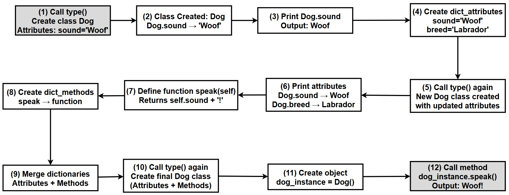

# Chapter 8.90 — Metaclasses, Part 1: Basic Concepts

## What this page covers

This page pulls back one more curtain in Python's object model — the earlier chapter page on `__new__()` vs. `__init__()` explained the two-step process behind creating an *object* from a *class*. This page asks the natural next question: **if objects are created by classes, what creates the classes themselves?** The answer is a **metaclass** — and understanding this reveals that in Python, classes aren't special, hardcoded language constructs; they're just another kind of object, created the same way any other object is.

This is genuinely advanced material — most Python code you'll ever write doesn't need to touch metaclasses directly. But understanding that they exist, and roughly how they work, deepens your understanding of *why* Python behaves the way it does at a fundamental level, and explains where frameworks that do "seemingly magical" things (like Django's ORM, or certain plugin systems) actually get their power from.

**A few terms used throughout, explained simply, with links for more detail:**
- **Metaclass** — a class whose job is to create other classes, in exactly the same way a regular class's job is to create objects.
- **`type()`** — Python's own built-in metaclass; the thing that creates every ordinary class you've ever written, whether you realized it or not. ([Python docs: `type()`](https://docs.python.org/3/library/functions.html#type))
- **`bases`** — a technical term for "the parent classes a new class inherits from," referenced below as the second argument to `type()`.

---

## 1. What is a metaclass? (Simple definition)

> A **metaclass** is a class that **creates other classes.**

This might sound circular at first, so it helps to compare it directly to something you already know: a regular class creates objects (`dog = Dog()` — the `Dog` class creates the `dog` object). A **metaclass** does the exact same job, one level up: it creates **classes** (`Dog = type(...)` — the `type` metaclass creates the `Dog` class).

---

## 2. Understanding the hierarchy

There are two levels of "creation" happening in every Python program, whether you notice it or not:

1. **Metaclass → creates → Class** (e.g., `type` creates `Dog`)
2. **Class → creates → Object** (e.g., `Dog` creates `dog`)


---

## What happens behind the scenes when you create a class

Suppose you write a completely ordinary class, without ever mentioning metaclasses:

```python
class Dog:
    sound = "Woof"
```

It might not be obvious, but **this line is secretly using a metaclass already** — Python's own built-in `type`. Writing `class Dog:` is really just a clean, readable shorthand for calling `type(...)` directly, in almost the same way that (as covered on an earlier page) writing `class Cat:` is shorthand for `class Cat(object):`.

### Core idea

- Python internally uses `type()` to create every class you define.
- The `class` keyword you already know is simply a **simplified, readable way** of doing the exact same thing `type()` does directly.

### What the script below demonstrates

1. How a simple class (`Dog`) is quietly equivalent to a `type()` call underneath.
2. How to **manually create a class**, using `type()` directly instead of the `class` keyword.
3. How to add **attributes** (like `sound`, `breed`) and **methods** (like `speak()`) this way.
4. How to create a real, working **object** from a class that was built entirely at runtime, with `type()`.

### `type()`'s three arguments

`type(class_name, bases, dictionary)` takes exactly three arguments:

| Argument | Meaning |
|---|---|
| `class_name` | The name of the new class, as a string (e.g. `"Dog"`) |
| `bases` | A tuple of parent classes to inherit from (an empty tuple `()` means no explicit inheritance — though every class still implicitly inherits from `object`, as covered in the earlier chapter page on implicit inheritance) |
| `dictionary` | A regular Python dictionary containing the new class's attributes and methods, as `{name: value}` pairs |

### Why this matters

- It helps you understand how Python actually works *internally*, rather than treating the `class` keyword as unexplainable magic.
- It's genuinely used in frameworks, dynamic class creation (building a class at runtime, based on configuration or user input), and other advanced programming techniques.

### Key takeaway

> A class in Python is just an object — created by `type()` — and you can create one manually yourself, if you ever need to.

---

## 3. Basic example

### Step 1 — creating a class normally, without `type()`

```python
class Dog:   # The familiar, readable way
    sound = "Woof"
```

### Step 2 — creating the exact same kind of class using `type()` directly

```python
# type() lets you build a class AT RUNTIME, which is useful in cases
# where you need to generate classes dynamically -- based on user
# input, configuration files, or other data your program only knows
# about while it's actually running (not while you're writing the code).

# --- Step 1: The simplest possible version -- name + no parents + one attribute ---
Dog = type("Dog", (), {"sound": "Woof"})
print(Dog.sound)   # -> Woof
# We just created a class named "Dog", with NO base classes (empty
# tuple), and one class attribute, "sound", set to "Woof" -- entirely
# without ever writing the word "class".

# --- Step 2: Add a second attribute the same way ---
dict_attributes = {"sound": "Woof", "breed": "Labrador"}
Dog = type("Dog", (), dict_attributes)
print(Dog.sound)   # -> Woof
print(Dog.breed)   # -> Labrador

# --- Step 3: Add a METHOD, not just plain attributes ---
def speak(self):
    # This is a completely ordinary function, defined outside any
    # class -- it will only BECOME a method once we place it inside
    # the dictionary passed to type() below.
    return f"{self.sound}!"

dict_methods = {"speak": speak}

# Step 4: Merge the attribute dictionary and the method dictionary into
# ONE combined dictionary -- type()'s third argument only accepts a
# single dictionary, so both attributes and methods have to live
# together in it, exactly as they would inside a normal class body.
dict_merged = {**dict_attributes, **dict_methods}
Dog = type("Dog", (), dict_merged)

# Step 5: Create an OBJECT from this dynamically-built class, exactly
# the same way you would from any normal class.
dog_instance = Dog()
print(dog_instance.speak())   # -> Woof!
```

## Diagram showing the flow of execution of above script



### What this script demonstrates

- You are **directly calling the metaclass** (`type`) yourself, instead of letting the `class` keyword call it for you behind the scenes.
- You are **manually constructing a class**, piece by piece, at runtime.
- This exact technique is genuinely used for dynamic class creation, inside frameworks, and in other advanced programming scenarios.

---

## Comparison: the `class` keyword vs. calling `type()` directly

| Feature | Implicit (`class` keyword) | Explicit (`type()`) |
|---|---|---|
| Syntax | `class Dog:` | `type("Dog", (), {...})` |
| Ease of use | Very easy | Less readable |
| Control | Limited to what the syntax allows | Full, programmatic control |
| Typical usage | Normal, everyday programming | Advanced or dynamic use cases |

### Important insight

> **Both approaches create exactly the same kind of class object.** There's no hidden difference in what you get back — only a difference in *how* you built it, and how much dynamic flexibility you have while doing so.

---

## Comparing the normal route to a custom metaclass route

The table below previews a more advanced idea covered in the *next* chapter page — using a **custom metaclass** (here called `PetMeta`) instead of relying on the default `type`. It's included here so you can see, side by side, exactly where a custom metaclass would insert itself into the same process this page has just walked through.

*(Note: the `PetMeta` custom metaclass itself isn't defined in this particular page — it's covered in the follow-up page on custom metaclasses. This table is a preview showing where it fits into the flow described above.)*

| Step No. | Step Name | Normal Route (default `type`) | Metaclass Route (`PetMeta`) | Key Insight |
|---|---|---|---|---|
| 1 | Class Definition Encountered | Python sees `class Dog:` | Python sees `class Dog(metaclass=PetMeta):` | This is where the path diverges |
| 2 | Decide Class Creator | Uses the default metaclass, `type` | Uses the custom metaclass, `PetMeta` | Every class, without exception, is created by *some* metaclass |
| 3 | Prepare Class Components | Collects `name`, `bases`, and the dictionary (`dict`) | Same: `name`, `bases`, `dct` collected | Both routes start identically |
| 4 | Call Class Constructor | `type(name, bases, dct)` is called | `PetMeta(name, bases, dct)` is called | The metaclass simply replaces `type` in this call |
| 5 | Execute `__new__()` of the Metaclass | `type.__new__()` runs silently | `PetMeta.__new__()` runs, with custom logic | This is the actual control point for customization |
| 6 | Modify the Class (Optional) | No modification — default behaviour | Can modify `dct` (e.g., automatically add a `category` attribute) | This is where the "magic" of custom metaclasses happens |
| 7 | Create the Class Object | `Dog` is created normally | `Dog` is created *with* the modifications applied | Either way, the output is still a class object |
| 8 | Class Ready | `Dog` has only the attributes you defined | `Dog` has extra, auto-added attributes too | The behavioural difference first appears here |
| 9 | Object Creation | `dog = Dog()` | `dog = Dog()` | Object creation syntax is identical either way |
| 10 | Call `__new__()` (for the instance) | `Dog.__new__()` runs | Same | The metaclass does **not** directly affect instance creation |
| 11 | Call `__init__()` | Initializes the object | Same | Object-level logic is completely unchanged |
| 12 | Final Object | A normal object | An object of the (differently-built) modified class | The difference traces back entirely to how the *class* was designed, not how the *object* was created |

### A follow-up question worth exploring

Row 6 of the table above hints that a custom metaclass can "automatically add a `category` attribute" to every class built with it. As a follow-up question worth thinking through before the next chapter page: **why would you want a metaclass to do this, rather than just adding `category = "Pet"` directly inside each class body yourself?** (Hint: think back to the earlier chapter page on the three class-registration approaches — manual, decorator-based, and `__init_subclass__`-based. A custom metaclass is really a fourth, even more powerful way of guaranteeing every class in a system automatically gets certain behaviour, without any individual class needing to opt in.)

---

## Quick recap

- A **metaclass** creates classes, in exactly the same way a class creates objects — it's the same underlying idea, just one level higher up.
- **`type` is Python's own built-in metaclass**, and it's silently responsible for creating *every* class you've ever written with the `class` keyword, whether you realized it or not.
- **`type(name, bases, dictionary)`** lets you build a class manually and dynamically, at runtime — genuinely useful for frameworks and dynamic-class-generation scenarios, even though it's rarely needed in everyday code.
- **Both routes (the `class` keyword and calling `type()` directly) produce exactly the same *kind* of object** — a real, usable class — differing only in how much manual control and dynamic flexibility you have while building it.
- **Custom metaclasses** (previewed in the comparison table above, and covered in full on the next chapter page) let you insert your own logic into *how classes themselves get built* — a more powerful, but more advanced, alternative to the registration techniques from the earlier chapter page.


