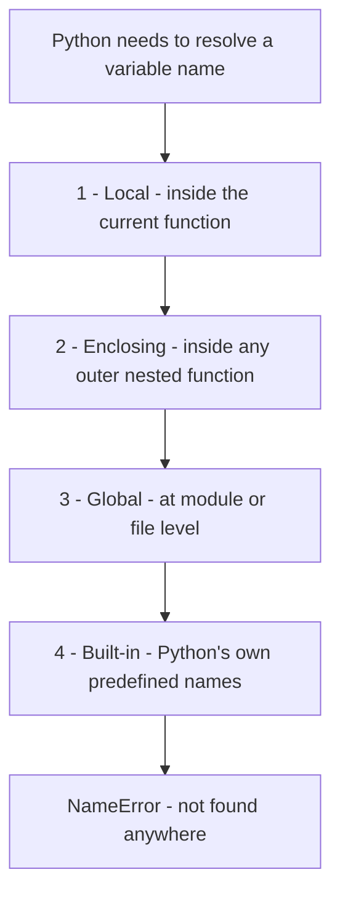

# Chapter 8.100 — Namespaces: `__dict__` and the LEGB Rule

## What this page covers

This page explains **namespaces** — the internal mechanism Python uses to keep track of which name refers to which piece of data. It covers two related ideas: first, `__dict__`, the actual dictionary where an individual object or class stores its own attributes (building directly on the earlier chapter page that used `dir()` to list an object's *methods* — `__dict__` is the equivalent for an object's *data*); and second, the **LEGB rule**, the specific order Python follows when it needs to figure out which `x` you meant, out of potentially several variables sharing that name in different parts of your program.

Both topics matter well beyond this one chapter — understanding `__dict__` explains how Python actually stores the attributes you've been setting with `self.name = name` since Chapter 7, and understanding LEGB explains a wide range of everyday bugs: accidentally shadowing a variable, `UnboundLocalError` surprises, and why `global`/`nonlocal` are sometimes necessary.

**A few terms used throughout, explained simply:**
- **Namespace** — a mapping from names (like `x`, `pet`, `speak`) to the actual objects they refer to. You can think of it as a dictionary, even though Python's internal implementation is a bit more specialized in some cases.
- **Scope** — the region of your code where a particular namespace is "active" and searchable.
- **Shadowing** — when a name defined in an inner scope temporarily hides a same-named variable from an outer scope, for as long as that inner scope is active.

---

## Part A: What is `__dict__`?

In Python, most objects store their attributes inside a special built-in attribute called `__dict__` — a **dictionary** where:

- **Attribute names** become the dictionary's **keys**
- **Attribute values** become the dictionary's **values**

In simple terms: **`__dict__` is the actual namespace dictionary belonging to an object.**

### The key idea

```text
object.attribute  ⇔  object.__dict__['attribute']
```

These two expressions refer to **exactly the same underlying data** — `object.attribute` is simply the more convenient, everyday syntax; `object.__dict__['attribute']` is the same lookup, spelled out explicitly.

---

### Example 1: An object's instance namespace

```python
class Pet:
    def __init__(self, name):
        self.name = name
        self.type = "Animal"

# Step 1: Every object automatically gets its own __dict__, populated
# with whatever attributes __init__ (or any other method) sets on it.
p = Pet("Dog")

print(p.__dict__)
# Output: {'name': 'Dog', 'type': 'Animal'}
# Every key here corresponds directly to a "self.something = ..." line
# inside __init__ -- __dict__ is simply where that data actually lives.
```

---

### Example 2: Class namespace vs. instance namespace

```python
# ============================================================
# A. CLASS DEFINITION
# ============================================================
class Dog:
    species = "Pet"   # A CLASS attribute -- lives in the CLASS's own __dict__.

    def __init__(self, name):
        self.name = name   # An INSTANCE attribute -- lives in the OBJECT's __dict__.


# ============================================================
# B. OBJECT CREATION
# ============================================================
d = Dog("Tommy")


# ============================================================
# C. NAMESPACE DISPLAY
# ============================================================
print("Class Namespace:->", Dog.__dict__)
# Output (abbreviated): {'__module__': '__main__', 'species': 'Pet', ...}
# Notice this includes 'species', plus several built-in entries Python
# adds automatically (like '__init__' itself, '__module__', etc.)

print("Instance Namespace:->", d.__dict__)
# Output: Instance Namespace:-> {'name': 'Tommy'}
# Notice this does NOT include 'species' -- species lives only on the
# CLASS, not on this specific object (see the earlier chapter page on
# class variables vs. instance variables for the full explanation).


# ============================================================
# D. ADDING A NEW ATTRIBUTE by directly editing __dict__
# ============================================================
d.__dict__["color"] = "Brown"
print("Added attribute 'color':->", d.color)
# Output: Added attribute 'color':-> Brown
# This line is functionally IDENTICAL to writing "d.color = 'Brown'" --
# both ultimately just insert a new key into the same dictionary.


# ============================================================
# E. MODIFYING AN EXISTING ATTRIBUTE via __dict__
# ============================================================
d.__dict__["name"] = "Bruno"
print("Modified name:->", d.name)
# Output: Modified name:-> Bruno
```


### What this confirms

- **Classes and their instances maintain separate `__dict__` namespaces.** `Dog.__dict__` holds class-level content (like `species` and the method definitions themselves); `d.__dict__` holds only what's specific to that one object (like `name`).
- **Attributes can be added or modified dynamically**, either through ordinary dot notation (`d.color = "Brown"`) or by editing `__dict__` directly — both do exactly the same thing under the hood.
- **The equivalence holds both ways:** `d.name` and `d.__dict__['name']` always refer to the same underlying value.

### Conclusion

`__dict__` is the internal storage mechanism Python actually uses to manage the attributes of both classes and objects. Being able to look at it directly — and even edit it directly, as shown above — makes visible something that's normally invisible: exactly where your `self.whatever = ...` assignments actually end up living.

---

## Part B: The LEGB Rule

### Names are references, not containers

Thinking of a namespace as "just a dictionary" is a useful mental model, but it's worth being precise about one detail: **Python doesn't store values directly inside names — it stores references to objects.** When you write `x = 10`, the name `x` doesn't literally *contain* the number 10; it *refers to* an object (with its own unique `id()`, as covered on the earlier chapter page about `self` and `id()`) that represents the integer 10. This distinction explains several important Python behaviours: multiple variables can refer to the exact same object, objects can be mutable or immutable independently of the names pointing at them, and Python can manage memory efficiently by sharing references rather than duplicating data.

Namespaces are also **dynamic** — entries can be added, changed, or removed while your program runs. That's exactly why Python provides `locals()` and `globals()`, functions that let you inspect these namespace mappings directly, at runtime (both are demonstrated in the script below).

### Why order matters: the LEGB rule

Although a namespace can be thought of as a simple name-to-object dictionary, Python doesn't search *every* namespace at once when it looks up a variable. Instead, it follows one specific, fixed search order, known as the **LEGB rule**:

**Local → Enclosing → Global → Built-in**

Whenever your code uses a variable name, Python checks these four scopes **step by step**, in exactly this order, and stops at the very first match it finds. If the same name exists in more than one of these scopes, the one found *first* (i.e., the innermost one) wins — this is called **shadowing**, and it's covered in detail in the script below.

One more important subtlety: **assignment behaves differently from access.** When you assign a value to a variable *inside* a function, Python's default behaviour is to create a brand-new **local** variable — even if a variable with the same name already exists at an outer scope — unless you explicitly say otherwise using the `global` or `nonlocal` keywords.

### LEGB, visualized



*(In reality Python stops at the FIRST match rather than always reaching the end — this diagram shows the full checking order, not a guaranteed full traversal.)*

---

### Summary table

| # | Feature | Local (L) | Enclosing (E) | Global (G) | Built-in (B) |
|---|---|---|---|---|---|
| 1 | Where defined? | Inside a function | Inside an outer (enclosing) function | At module (file) level | Inside Python itself (predefined) |
| 2 | Created when? | The function is called | The outer function is called | The script starts running | The Python interpreter starts |
| 3 | Scope visibility | Only within that function | Available to inner (nested) functions | Available everywhere in the module | Available everywhere |
| 4 | Access priority | 1st (highest) | 2nd | 3rd | 4th (lowest) |
| 5 | Lifetime | Until the function finishes running | Until the outer function finishes | The entire program's execution | The entire Python session |
| 6 | Stored in | Local namespace (`locals()`) | Enclosing namespace | Global namespace (`globals()`) | Built-in namespace (`__builtins__`) |
| 7 | Example (`pet`) | `pet = "Local Pet"` | `pet = "Enclosing Pet"` | `pet = "Global Pet"` | `len()`, `print()` (functions are objects too) |
| 8 | Accessed from an inner function? | Yes | Yes | Yes | Yes |
| 9 | Accessed from an outer function? | No | No | Yes | Yes |
| 10 | Can be modified directly (by plain assignment)? | Yes | No — needs `nonlocal` | No — needs `global` | No |
| 11 | Keyword required to modify | None needed | `nonlocal` | `global` | Not allowed |
| 12 | Common use | Temporary, short-lived variables | Closures, nested functions | Shared data/configuration | Standard, everyday functions |
| 13 | Shadowing possible? | Yes | Yes | Yes | Yes (and genuinely risky if it happens) |
| 14 | A common mistake | Assuming a local change affects the global scope too | Forgetting `nonlocal`, silently creating a new local variable instead | Forgetting `global`, causing an `UnboundLocalError` | Accidentally overriding a built-in name (e.g. `len = 100`) |
| 15 | What happens if not found here? | Python checks the next scope out | Python checks the next scope out | Python checks the next scope out | Python raises `NameError` |

---

### The script

```python
# ============================================================
# LEGB RULE DEMONSTRATION
# L -> Local, E -> Enclosing, G -> Global, B -> Built-in
# ============================================================

# --- (1) GLOBAL SCOPE ---
# Defined at the top level of the file -- accessible everywhere in
# this module, unless a more local scope shadows it.
pet = "Global Pet"


# --- (2) BUILT-IN SCOPE ---
# len() and print() are always available, without ever being defined
# anywhere in this file -- they live in Python's own built-in namespace.
print("Built-in len():", len([1, 2, 3]))   # -> Built-in len(): 3


# --- (3) ENCLOSING + LOCAL SCOPE ---
def outer_function():
    # Step 1: This 'pet' belongs to the ENCLOSING scope, as far as
    # inner_function() below is concerned.
    pet = "Enclosing Pet"

    def inner_function():
        # Step 2: This 'pet' belongs to the LOCAL scope of
        # inner_function() -- and it SHADOWS both the enclosing and
        # global 'pet' variables for as long as this function runs.
        pet = "Local Pet"
        # LEGB order: Python finds 'pet' in LOCAL first, and stops there.
        print("Inner (Local):", pet)   # -> Inner (Local): Local Pet

    inner_function()

    # Step 3: Back here, inner_function()'s local 'pet' no longer
    # exists -- so this print statement uses THIS function's own
    # (enclosing, from inner_function's point of view) 'pet' instead.
    print("Outer (Enclosing):", pet)   # -> Outer (Enclosing): Enclosing Pet

outer_function()


# --- (4) ACCESS PRIORITY (LEGB IN ACTION) ---
def check_legb():
    # Step 1: No local 'pet' is defined in THIS function, and there's
    # no enclosing function wrapping it either -- so Python continues
    # outward and finds the GLOBAL 'pet' instead.
    print("LEGB uses Global:", pet)

check_legb()   # -> LEGB uses Global: Global Pet


# --- (5) SHADOWING ---
pet = "Global Dog"   # Redefining the global 'pet' from earlier.

def shadow_test():
    # Step 1: This local 'pet' SHADOWS (temporarily hides) the global
    # one, only for the duration of this function call.
    pet = "Local Cat"
    print("Inside function (Local):", pet)   # -> Inside function (Local): Local Cat

shadow_test()

# Step 2: The global 'pet' was never touched -- shadowing only HIDES
# a variable from inside the shadowing scope; it doesn't modify it.
print("Outside function (Global):", pet)   # -> Outside function (Global): Global Dog


# --- (6) MODIFYING A GLOBAL VARIABLE ---
def modify_global():
    # Step 1: Without this line, "pet = ..." below would create a
    # NEW local variable instead of touching the global one.
    global pet
    pet = "Modified Global Pet"

modify_global()
print("After global modification:", pet)   # -> After global modification: Modified Global Pet


# --- (7) ERROR CASE: modifying a global without 'global' ---
# Uncomment the block below to see the error for yourself.
"""
def wrong_modify_global():
    # Because this function ASSIGNS to 'pet', Python treats 'pet' as
    # LOCAL to this function from the very start of the function --
    # but there's no local 'pet' defined yet at this point, so trying
    # to use it (even implicitly) raises an error.
    pet = "Modified Global Pet"

wrong_modify_global()
# Would raise: UnboundLocalError: local variable 'pet' referenced
# before assignment
"""


# --- (8) MODIFYING AN ENCLOSING VARIABLE ---
def outer_modify():
    pet = "Outer Pet"

    def inner_modify():
        # Step 1: 'nonlocal' tells Python: "don't create a new local
        # variable -- reach out and modify the ENCLOSING one instead."
        nonlocal pet
        pet = "Modified Enclosing Pet"

    inner_modify()
    print("After nonlocal modification:", pet)   # -> After nonlocal modification: Modified Enclosing Pet

outer_modify()


# --- (9) WITHOUT 'nonlocal': a new local variable is created instead ---
# Uncomment to see this behaviour for yourself.
"""
def wrong_enclosing():
    pet = "Outer Pet"

    def inner():
        pet = "New Value"   # Creates a NEW local variable -- does
                             # NOT modify the enclosing 'pet' at all.

    inner()
    print("Still Outer:", pet)   # Unchanged -- still "Outer Pet"

wrong_enclosing()
"""


# --- (10) BUILT-IN SHADOWING (genuinely risky) ---
len_backup = len   # Save the real len() function before overwriting it.

len = 100   # DANGEROUS: this shadows the built-in len() function.

# Uncomment the next line to see the resulting error:
# print(len([1, 2, 3]))
# Would raise: TypeError: 'int' object is not callable
# -- because 'len' now refers to the number 100, not a function.

len = len_backup   # Restore the real built-in before continuing.


# --- (11) NAME NOT FOUND ANYWHERE: NameError ---
def error_demo():
    try:
        print(unknown_variable)   # This name doesn't exist ANYWHERE
                                    # in Local, Enclosing, Global, or Built-in.
    except NameError as e:
        print("NameError occurred:", e)

error_demo()


# --- (12) locals() AND globals(): inspecting namespaces directly ---
def show_namespaces():
    local_var = "I am local"
    print("locals():", locals())   # Shows a real dictionary of this
                                    # function's own local variables.

show_namespaces()

print("Sample globals keys:", list(globals().keys())[:5])
# globals() returns a dictionary of everything currently defined at
# module level -- we only show the first 5 keys here to keep the
# output manageable.


# --- (13) THE BUILT-IN NAMESPACE ITSELF ---
print("Type of __builtins__:", type(__builtins__))
# Confirms that built-ins are stored in their own dedicated namespace
# object too, just like locals() and globals() are.


# --- (14) FULL LEGB CHAIN, ONE MORE TIME, ALL TOGETHER ---
pet = "Global Final"

def outer_final():
    pet = "Enclosing Final"

    def inner_final():
        pet = "Local Final"
        print("Local:", pet)       # -> Local: Local Final

    inner_final()
    print("Enclosing:", pet)       # -> Enclosing: Enclosing Final

outer_final()

print("Global:", pet)              # -> Global: Global Final
```

---

### Walking through what the script demonstrates

**1. Global and built-in scope.** The script begins with a global variable, `pet = "Global Pet"`, and shows that built-in names like `len()` and `print()` are always available without ever being explicitly defined anywhere in the file.

**2. Enclosing and local scope (nested functions).** `outer_function()` creates an enclosing scope; `inner_function()`, nested inside it, creates its own local scope. The same name, `pet`, exists at three different levels simultaneously — Local (`"Local Pet"`), Enclosing (`"Enclosing Pet"`), and Global (`"Global Pet"`) — and Python always picks the innermost one available at each point.

**3. LEGB search in action.** Inside `check_legb()`, there's no local or enclosing `pet` at all, so Python continues outward and finds the global one — a direct demonstration of "if a name isn't found here, move outward step by step."

**4. Shadowing.** Inside `shadow_test()`, a local `pet` hides the global one, but only for the duration of that function call — shadowing hides a variable, it never modifies it.

**5. Modifying global variables.** By default, assignment inside a function creates a *new local* variable. To actually modify a global variable, the function must explicitly say `global pet` first.

**6. `UnboundLocalError`.** If a function assigns to a name without declaring it `global` first, Python treats that name as local for the *entire* function body — including any line that tries to read it *before* the assignment — which is exactly what causes this particular error.

**7. Modifying enclosing variables.** The equivalent tool for enclosing (rather than global) scope is the `nonlocal` keyword, which lets an inner function modify a variable that belongs to its enclosing function.

**8. Without `nonlocal`.** Skipping it doesn't cause an error here — it simply creates a new local variable instead, leaving the enclosing variable completely untouched, which can be a subtle and confusing bug if you're not expecting it.

**9. Built-in shadowing.** The script demonstrates (safely, since it restores `len` immediately afterward) that built-in names like `len` genuinely can be overwritten — and doing so breaks `len()` everywhere else in your program until it's restored. This is why overwriting built-in names is considered bad practice.

**10. `NameError`.** If a variable genuinely isn't found in *any* of the four LEGB scopes, Python raises a `NameError` — the natural "end of the line" if the entire LEGB chain comes up empty.

**11. `locals()` and `globals()`.** Both functions return real, inspectable dictionaries — direct, live views into the namespaces this whole page has been describing conceptually.

**12. `__builtins__`.** Confirms that even the built-in namespace itself is a genuine, inspectable object, not just a conceptual idea.

**13. The full chain, together.** The final block re-demonstrates all three user-defined levels (Local, Enclosing, Global) in one place, printed in sequence, so the complete LEGB chain is visible end to end.

### A follow-up question worth exploring

The script demonstrates `global` and `nonlocal` separately, but never combines all three writable levels (local, enclosing, global) inside one deeply nested function. As a follow-up exercise: **write a three-level nested function** (an outer function, containing a middle function, containing an inner function) where the *innermost* function modifies variables at *all three* outer levels at once — you'll need `nonlocal` for the middle-level variable and `global` for the outermost one. Predict the final printed values at each level before running your code.

---

## Quick recap

- **`__dict__` is the real dictionary where an object's (or class's) attributes actually live** — `object.attribute` and `object.__dict__['attribute']` are two ways of reaching the exact same data, and classes and their instances always maintain separate `__dict__` namespaces.
- **The LEGB rule (Local → Enclosing → Global → Built-in)** is the fixed order Python searches through when resolving any variable name, stopping at the first match.
- **Assignment and access follow different rules**: reading a variable searches outward through LEGB automatically, but *assigning* to a variable inside a function creates a new local variable by default — `global` and `nonlocal` are the explicit tools needed to override that default and modify an outer-scope variable instead.
- **Shadowing hides, it doesn't destroy** — an inner-scope variable with the same name as an outer one only hides the outer one for as long as the inner scope is active; the outer variable is untouched underneath.
- **`locals()`, `globals()`, and `__builtins__`** let you directly inspect these namespaces as real, live dictionaries — turning a conceptual model into something you can print and examine yourself.


