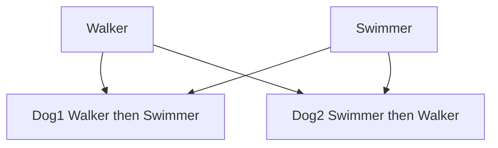
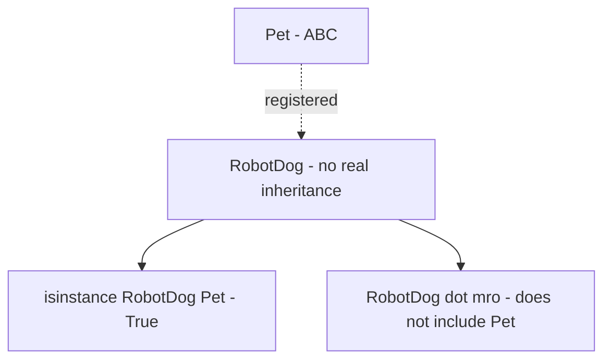

# Chapter 8.155 — 20 More Python Scripting Scenarios

## What this page covers

This page is a second set of twenty short scripting exercises, covering the same broad territory as the earlier "20 Programming Script Questions" page — inheritance patterns, MRO, abstraction, composition, namespaces, and a few new additions (virtual subclasses, class decorators, and enforcing `__eq__`/`__hash__` consistency). Working through both sets back to back is a good way to confirm that these ideas have become second nature, rather than something you can only recognize when reading about them.

The questions and code are fixed, exactly as printed in the book. The original write-up around them used quite dense, formal language (the kind of phrasing you'd find in a software architecture document rather than a beginner's guide) — the version below explains the same twenty scripts in plain, everyday language instead, with fuller step comments, expected output added wherever it was missing, and links back to the specific earlier chapter pages that cover each idea in full depth.

---

**1. Checking instance relationships using `isinstance()` for parent and child classes.**

```python
class Parent:
    pass

class Child(Parent):
    pass

p = Parent()
c = Child()

# Step 1: isinstance() checks whether an object belongs to a class,
# OR to any of that class's ancestors -- not just an exact match.
print(f"Is c a Child? {isinstance(c, Child)}")     # -> True
print(f"Is c a Parent? {isinstance(c, Parent)}")   # -> True (Child IS-A Parent)
print(f"Is p a Child? {isinstance(p, Child)}")     # -> False
# A Parent object is NOT automatically a Child -- inheritance only
# flows in one direction: children inherit from parents, never the
# other way around.
```

---

**2. Visualizing MRO using the `__mro__` attribute.**

```python
class A: pass
class B(A): pass
class C(B): pass

# Step 1: __mro__ shows the exact, predictable order Python would
# search through this hierarchy when looking for a method.
print(C.__mro__)
# Output: (<class '__main__.C'>, <class '__main__.B'>,
#          <class '__main__.A'>, <class 'object'>)
# Resolution path: C -> B -> A -> object (the root every class
# ultimately traces back to -- see the earlier "Implicit Inheritance
# from object" chapter page).
```

---

**3. Implementing a `super().__init__()` call to ensure parent attributes exist in the child.**

```python
class Pet:
    def __init__(self, name):
        self.name = name   # Set up in the PARENT's own constructor.

class Dog(Pet):
    def __init__(self, name, breed):
        # Step 1: Without this line, 'self.name' would never actually
        # get set on a Dog object -- Pet's constructor would simply
        # never run at all.
        super().__init__(name)
        self.breed = breed   # Step 2: Dog-specific data.

d = Dog("Buddy", "Golden Retriever")
print(f"{d.name} is a {d.breed}")   # -> Buddy is a Golden Retriever
```

---

**4. Demonstrating "Replacement Is-A" by overriding a method completely.**

```python
class Pet:
    def speak(self):
        print("Generic pet sound")

class Cat(Pet):
    def speak(self):
        # Step 1: This fully replaces Pet's version -- there's no
        # super().speak() call here, so Pet's message never runs at all.
        print("Meow!")

c = Cat()
c.speak()   # -> Meow!  (only the child's own logic ever executes)
```

---

**5. Demonstrating "Additive Is-A" by adding a unique method to a `Pet` subclass.**

```python
class Pet:
    def eat(self):
        print("Eating...")

class Dog(Pet):
    def fetch(self):
        # Step 1: A brand-new method that Pet never had -- Dog is
        # simply EXTENDING what Pet already offers, not replacing anything.
        print("Fetching the ball!")

d = Dog()
d.eat()     # -> Eating...          (inherited, unchanged)
d.fetch()   # -> Fetching the ball! (new, Dog-only behaviour)
```

---

**6. Demonstrating "Cooperative Is-A" where `super().method()` refines parent behaviour.**

```python
class Pet:
    def speak(self):
        print("...and makes a generic sound.")

class Dog(Pet):
    def speak(self):
        print("Dog barks...", end=" ")   # Step 1: Dog's own logic first.
        super().speak()                   # Step 2: THEN the parent's logic too.

d = Dog()
d.speak()   # -> Dog barks... ...and makes a generic sound.
# Notice both messages appear -- unlike Question 4, this COMBINES
# parent and child behaviour instead of replacing one with the other.
```

---

**7. Resolving method conflicts in Multiple Inheritance.**

```python
class Walker:
    def action(self):
        print("Walking...")

class Swimmer:
    def action(self):
        print("Swimming...")

# Step 1: The ORDER parents are listed directly determines which
# version of action() "wins" -- see the earlier "Diamond Problem"
# chapter page for the full explanation of why.
class Dog1(Walker, Swimmer): pass   # Walker listed first -> Walker's action() wins
class Dog2(Swimmer, Walker): pass   # Swimmer listed first -> Swimmer's action() wins

d1, d2 = Dog1(), Dog2()
d1.action()   # -> Walking...
d2.action()   # -> Swimming...
```



*(This diagram uses plain `graph TD` syntax with simple boxes and arrows only — no subgraphs, no styled/labeled edges, no special characters in labels — so it should paste cleanly into draw.io via Extras → Edit Diagram.)*

---

**8. Implementing a basic "Has-A" relationship (Composition) between a `Dog` and a `Collar`.**

See the earlier "Has-A Relationships" chapter page for the full comparison against the two weaker Has-A variants (Aggregation and Dependency).

```python
class Collar:
    def __init__(self, color):
        self.color = color

class Dog:
    def __init__(self, name, color):
        self.name = name
        # Step 1: The Collar object is created RIGHT HERE, inside
        # Dog's own constructor -- this is what makes it Composition
        # rather than Aggregation (see the earlier chapter page).
        self.collar = Collar(color)

d = Dog("Tommy", "Red")
print(f"{d.name} has a {d.collar.color} collar.")   # -> Tommy has a Red collar.
```

---

**9. Using `raise NotImplementedError` in a base class to enforce method implementation.**

```python
class Pet:
    def speak(self):
        # Step 1: An "informal" abstract method -- this only fails
        # when speak() is actually CALLED, not when Cat() is created.
        raise NotImplementedError("Subclasses must override speak()")

class Cat(Pet):
    pass   # Cat never actually implemented speak()!

c = Cat()
# c.speak()   # Uncommenting this line would raise:
              # NotImplementedError: Subclasses must override speak()
```

---

**10. Using the `abc` module to create a formal Abstract Base Class.**

Compare this directly against Question 9 — see the earlier "Robust Pet System" and "30 More Conceptual Questions" (Q21) pages for the full comparison.

```python
from abc import ABC, abstractmethod

class Pet(ABC):
    @abstractmethod
    def speak(self):
        pass

class Dog(Pet):
    def speak(self):
        print("Bark!")

# pet = Pet()   # Uncommenting this raises:
                 # TypeError: Can't instantiate abstract class Pet
                 # with abstract method speak
                 # Unlike Question 9, this failure happens IMMEDIATELY,
                 # at creation time -- not later, when speak() is called.
```

---

**11. Registering a virtual subclass and verifying its absence from the MRO.**

See the earlier "30 More Conceptual Questions" page, Q22–23, for the general idea of virtual subclasses.

```python
from abc import ABC

class Pet(ABC): pass

class RobotDog:
    def beep(self): print("Beep!")

# Step 1: Register RobotDog as a "logical" subclass of Pet, WITHOUT
# RobotDog actually inheriting from Pet in the code at all.
Pet.register(RobotDog)

r = RobotDog()
print(f"Is RobotDog a Pet? {isinstance(r, Pet)}")
# -> True, purely because of the register() call above.

print(f"RobotDog MRO: {RobotDog.__mro__}")
# Output: RobotDog MRO: (<class '__main__.RobotDog'>, <class 'object'>)
# Notice: Pet does NOT appear here at all. RobotDog inherits NO code
# from Pet -- isinstance() and issubclass() recognise the registration,
# but the actual method-lookup chain (__mro__) is completely unaffected by it.
```



---

**12. Creating a custom container using `__setitem__` and `__getitem__`.**

```python
class VehicleRegistry:
    def __init__(self, capacity):
        self._vehicles = [None] * capacity   # Step 1: Pre-fill with empty slots.

    def __setitem__(self, index, value):
        # Step 2: This is what makes "v[0] = 'Truck'" work at all.
        self._vehicles[index] = value

    def __getitem__(self, index):
        # Step 3: This is what makes "v[0]" (reading) work at all.
        return self._vehicles[index]

v = VehicleRegistry(2)
v[0] = "Truck"
print(v[0])   # -> Truck
```

---

**13. Accessing and modifying attributes through the `__dict__` namespace.**

```python
class Dog:
    def __init__(self, name):
        self.name = name

d = Dog("Bruno")

# Step 1: Adding a key directly to __dict__ is functionally identical
# to writing "d.breed = 'Boxer'" -- both insert the same key into the
# same underlying dictionary (see the earlier __dict__ chapter page).
d.__dict__["breed"] = "Boxer"
print(d.breed)   # -> Boxer
```

---

**14. Demonstrating variable shadowing and the LEGB lookup order.**

```python
scope = "Global"

def outer():
    scope = "Enclosing"
    def inner():
        # Step 1: This LOCAL 'scope' shadows both the enclosing and
        # global ones, but ONLY for as long as inner() is running.
        scope = "Local"
        print(f"Inner sees: {scope}")
    inner()

outer()   # -> Inner sees: Local
# LEGB finds the LOCAL variable first and stops looking -- see the
# earlier "Namespaces: __dict__ and the LEGB Rule" chapter page.
```

---

**15. Using the `nonlocal` keyword to modify an enclosing variable.**

```python
def tracker():
    count = 0
    def update():
        # Step 1: Without 'nonlocal', "count += 1" below would create
        # a brand-new LOCAL variable instead of modifying tracker()'s own 'count'.
        nonlocal count
        count += 1
        return count
    return update

my_tracker = tracker()
print(my_tracker())   # -> 1
print(my_tracker())   # -> 2 (count is genuinely being remembered and updated)
```

---

**16. Using the `global` keyword to modify a file-level variable.**

```python
system_status = "Offline"

def activate():
    # Step 1: Without this line, "system_status = 'Online'" below
    # would create a new LOCAL variable, leaving the real global
    # 'system_status' completely untouched.
    global system_status
    system_status = "Online"

activate()
print(system_status)   # -> Online
```

---

**17. Implementing `__repr__` for professional debugging.**

See the earlier "`str()` versus `repr()`" chapter page for the full picture of when each method is used.

```python
class Dog:
    def __init__(self, name, age):
        self.name, self.age = name, age

    def __repr__(self):
        # Step 1: Written so it LOOKS like real Python code that could
        # recreate this exact object -- the standard convention for a
        # good __repr__.
        return f"Dog(name='{self.name}', age={self.age})"

d = Dog("Rex", 5)
print(f"Debug log: {repr(d)}")   # -> Debug log: Dog(name='Rex', age=5)
```

---

**18. Enforcing consistency between `__eq__` and `__hash__`.**

See the earlier "30 More Conceptual Questions" page, Q4, for why this consistency rule matters.

```python
class IDCard:
    def __init__(self, uid):
        self.uid = uid

    def __eq__(self, other):
        # Step 1: Two IDCards are "equal" if they share the same uid --
        # NOT because they're literally the same object in memory.
        return isinstance(other, IDCard) and self.uid == other.uid

    def __hash__(self):
        # Step 2: MUST be consistent with __eq__ above: objects that
        # compare equal must produce the same hash, or sets/dicts
        # break in confusing ways.
        return hash(self.uid)

cards = {IDCard(101), IDCard(101)}
print(f"Unique cards in set: {len(cards)}")   # -> Unique cards in set: 1
# Correct behaviour: even though these are two SEPARATE IDCard
# objects in memory, the set correctly treats them as duplicates,
# because __eq__ and __hash__ agree with each other.
```

---

**19. Automating registration via a class decorator.**

This is a fourth approach to the class-registration problem, alongside the three covered on the earlier "Three Ways to Build a Pet Registration System" chapter page (manual, `@classmethod`-based decorator, and `__init_subclass__`) — here, a plain function is used as the decorator instead.

```python
registry = []

def register_pet(cls):
    # Step 1: A simple decorator function -- takes a class, adds it to
    # the shared registry list, and returns the SAME class unchanged.
    registry.append(cls)
    return cls

@register_pet
class Dog: pass

@register_pet
class Cat: pass

print(f"Registered pets: {[c.__name__ for c in registry]}")
# -> Registered pets: ['Dog', 'Cat']
```

---

**20. Demonstrating the instantiation guard of ABCs.**

```python
from abc import ABC, abstractmethod

class Base(ABC):
    @abstractmethod
    def run(self): pass

class Concrete(Base):
    def run(self): print("Running...")

try:
    # Step 1: Base still has an unimplemented abstract method, so
    # Python refuses to create an object from it at all.
    b = Base()
except TypeError as e:
    print(f"Guard triggered: {e}")
# Output: Guard triggered: Can't instantiate abstract class Base with
# abstract method run
```

---

## Quick recap

- These twenty scripts round out the practical side of this chapter's review material — covering the same core patterns as the earlier script-questions page, plus three genuinely new additions: **virtual subclasses** (Q11), **class decorators for registration** (Q19), and a direct demonstration of the **ABC instantiation guard** (Q20).
- **Question 7 and Question 11 are worth comparing side by side**: Q7 shows how parent *order* changes real method resolution in genuine multiple inheritance; Q11 shows a case where a class (`RobotDog`) passes an `isinstance()` check *without* being part of the MRO at all — two very different ways a class can be related to another.
- **Question 18 is a good one to run yourself and experiment with**: try removing the `__hash__` method entirely (or making it return a different value for equal objects) and see how the `len(cards)` result changes — a hands-on way to feel why the `__eq__`/`__hash__` consistency rule actually matters.
- As with the earlier review pages, every question above links back to the specific chapter page where that concept was originally introduced with full explanation — worth revisiting if any single script still feels unclear.

Working through all fifty items across the three review pages in this chapter (the two "Conceptual Questions" pages plus the two "Scripting" pages) is a solid, complete checkpoint on everything Chapters 7 and 8 have covered about Python's object-oriented programming model.


