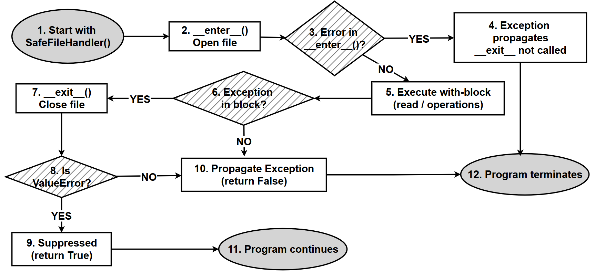

# Context Managers: `with`, `__enter__()`, and `__exit__()`

Earlier in this chapter you saw `try` / `except` / `finally` used to handle errors and guarantee cleanup code runs no matter what happens. A **context manager** is Python's more elegant, purpose-built tool for exactly that second job — making sure some resource (a file, a network connection, a lock, and so on) gets properly cleaned up, automatically, even if something goes wrong along the way. You've almost certainly already used one without necessarily naming it — every time you've written `with open("file.txt") as f:`, you were using a context manager. This section pulls back the curtain on how that actually works, and shows you how to build your own.

This matters for the exceptions chapter specifically because a context manager is, underneath, really just a very structured, reusable way of writing `try` / `finally` — so understanding it deepens your understanding of exception handling itself, not just files.

---

## Research Question

*(This is the original research question and its sub-questions from the printed book, kept exactly as written. A short set of optional follow-up questions has been added after the model answer.)*

> How does Python's `with` statement implement the context management protocol using `__enter__()` and `__exit__()` methods, and how does it ensure proper resource handling and exception management?

### Sub-Questions

Explore:

1. What is a **context manager**?
2. What is the **context management protocol**?
3. What is the role of:
   - `__enter__()`
   - `__exit__()`
4. What values does `__exit__()` receive?
5. How does `with` internally behave like `try`-`finally`?
6. What happens:
   - when **no exception occurs**
   - when **exception occurs**
7. What is the effect of returning:
   - `True`
   - `False` from `__exit__()`?
8. How does a context manager ensure **resource cleanup**?
9. Compare:
   - `with` vs. manual `try`-`finally`
10. Give **at least 2 real-life use cases**

### Expected Output

- Conceptual write-up (2–3 pages)
- Example scripts

---

## Answer

### Step 1: What is a context manager?

A **context manager** is any Python object that knows how to properly **set up** something before a block of code runs, and **clean it up** afterward — automatically, no matter how that block of code finishes (whether it completes normally, or raises an exception partway through). You use one with Python's `with` statement:

```python
with open("example.txt", "r") as f:
    content = f.read()
# by the time we reach here, the file has ALREADY been closed automatically
```

The "resource" being managed here is the open file — the context manager guarantees it gets closed, even if `f.read()` were to raise an exception.

### Step 2: What is the context management protocol?

The **context management protocol** is simply the agreed-upon set of two methods an object must define to work with `with`:

- **`__enter__()`** — runs at the *start* of the `with` block
- **`__exit__()`** — runs at the *end* of the `with` block, unconditionally

> **New term — "protocol":** in Python, a "protocol" just means a specific set of method names an object needs to implement in order to work with a particular built-in feature. It's less a formal rule and more of an informal contract — if your class defines both `__enter__()` and `__exit__()` correctly, Python's `with` statement will happily work with it, regardless of what the class actually does internally. You can read more in the [official Python docs on the context management protocol](https://docs.python.org/3/reference/datamodel.html#context-managers).

### Step 3: The role of `__enter__()` and `__exit__()`

| Method | When It Runs | Typical Job |
| --- | --- | --- |
| `__enter__(self)` | At the very start of the `with` block | Acquire/set up the resource (e.g. open the file), and return the value that gets assigned to the variable after `as` |
| `__exit__(self, exc_type, exc_value, traceback)` | At the very end of the `with` block — **always**, whether it finished normally or raised an exception | Release/clean up the resource (e.g. close the file), and optionally decide whether to suppress an exception |

### Step 4: What values does `__exit__()` receive?

`__exit__()` is always called with **three arguments**, describing whatever exception (if any) occurred inside the `with` block:

```python
def __exit__(self, exc_type, exc_value, traceback):
    ...
```

| Parameter | Meaning |
| --- | --- |
| `exc_type` | The *type* (class) of the exception that occurred — e.g. `ValueError` |
| `exc_value` | The actual exception *object* itself, containing details like its error message |
| `traceback` | A traceback object describing exactly *where* in the code the exception occurred |

**If no exception occurred, all three of these are simply `None`** — this is exactly how `__exit__()` can tell whether something went wrong.

### Step 5: How `with` behaves like `try`-`finally` internally

Under the hood, Python essentially translates:

```python
with SomeContextManager() as x:
    do_something(x)
```

into logic equivalent to:

```python
manager = SomeContextManager()
x = manager.__enter__()
try:
    do_something(x)
except Exception as e:
    # manager.__exit__() decides whether to re-raise this exception
    if not manager.__exit__(type(e), e, e.__traceback__):
        raise
else:
    manager.__exit__(None, None, None)
```

The key guarantee is the same one `finally` gives you: **`__exit__()` is called no matter what happens inside the block** — this is precisely why context managers are often described as "`try`-`finally`, packaged into a reusable object."

### Step 6: What happens with and without an exception

| Scenario | What Happens |
| --- | --- |
| **No exception occurs** | `__enter__()` runs → the block runs to completion → `__exit__(None, None, None)` runs |
| **An exception occurs** | `__enter__()` runs → the block raises partway through → `__exit__(exc_type, exc_value, traceback)` runs *with the exception details filled in* → `__exit__()`'s return value then decides what happens next (see Step 7) |

### Step 7: The effect of `__exit__()`'s return value

This is the single most important design decision in any context manager:

- **`return False`** (or return nothing at all, which defaults to `None`/falsy) → the exception **propagates** normally, exactly as if the context manager weren't there at all. The program continues to unwind and crash (or gets caught by an outer `except`), just like normal.
- **`return True`** → the exception is **suppressed** — Python treats it as *handled*, and execution continues immediately after the `with` block, as though nothing went wrong.

> **A word of caution:** silently suppressing exceptions can hide real bugs. `return True` should be used deliberately, only for exception types you specifically expect and know how to safely ignore — not as a blanket "make errors disappear" switch.

### Step 8: How cleanup is guaranteed

Because `__exit__()` is called by the `with` statement's own internal machinery — not by your code choosing to call it — it runs **even if the code inside the block crashes with an exception**, exactly like a `finally` block would. This is what makes context managers reliable for resource cleanup: you don't have to remember to add a `finally` yourself, and you can't accidentally forget to close the resource on some code path.

### Step 9: `with` vs. manual `try`-`finally`

| | Manual `try`-`finally` | `with` + context manager |
| --- | --- | --- |
| Code required at every use site | A full `try`/`finally` block, every time | A single `with ... as ...:` line |
| Risk of forgetting cleanup | Higher — easy to forget the `finally` block | Lower — the cleanup logic lives once, inside the class, and can't be skipped |
| Reusability | Cleanup logic must be copy-pasted everywhere it's needed | Cleanup logic is written once and reused everywhere via the class |
| Readability at the call site | More boilerplate visible every time | Very clean — intent is obvious at a glance |

```python
# Manual try-finally: works, but the cleanup logic has to be
# rewritten (or copy-pasted) at every single place a file is opened.
f = open("example.txt", "r")
try:
    content = f.read()
finally:
    f.close()

# With a context manager: the exact same guarantee, in one line --
# and the cleanup logic lives in exactly one place (inside open()'s
# own context manager implementation), not copy-pasted everywhere.
with open("example.txt", "r") as f:
    content = f.read()
```

### Step 10: Real-life use cases

1. **File handling** — `open()` (as shown throughout this section) guarantees a file is closed, even if reading or writing it raises an exception partway through.
2. **Database connections** — opening a connection to a database is expensive, and forgetting to close it can leave the connection "hanging," eventually exhausting a server's available connections. A context manager guarantees `connection.close()` always runs.
3. **Locks in multi-threaded programs** — a `threading.Lock` is commonly used as a context manager (`with lock:`) to guarantee the lock is always released, even if the code inside raises an exception — forgetting to release a lock can otherwise freeze an entire program.
4. **Network connections** — similar to database connections, network sockets should always be closed, and a context manager guarantees this even when a request fails.

---

## Research Question — Optional Follow-Up Questions

*(Additional questions, not part of the original printed book, for readers who want to explore this topic further.)*

1. Python's `contextlib` module offers a shortcut, `@contextmanager`, that lets you write a context manager as a single generator function instead of a full class. Look up an example, and compare it to the `SafeFileHandler` class in Part 3 below.
2. What happens if `__enter__()` itself raises an exception — does `__exit__()` still get called? (Step 6 in the Explanatory Notes below addresses this directly — see if you can predict the answer before checking.)
3. Can a single object be used in more than one `with` statement, one after another? Try reusing a `SafeFileHandler` instance for two separate `with` blocks and observe what happens.

---

## Part 2: Project / Coding Task

*(Original project task from the printed book.)*

> Design a custom context manager class named `SafeFileHandler` that:
>
> 1. Opens a file in `__enter__()`
> 2. Closes the file in `__exit__()`
> 3. Demonstrates behavior for:
>    - Normal execution
>    - Exception during file operation
> 4. Demonstrates how exceptions:
>    - propagate
>    - can optionally be suppressed
>
> Write test cases to clearly show all execution paths.

---

## Part 3: Answer — Custom Context Manager

```python
# Custom Context Manager: SafeFileHandler
#
# This class manually implements the context management protocol,
# so it can be used with Python's 'with' statement exactly like
# the built-in open() function.

class SafeFileHandler:
    def __init__(self, filename, mode):
        # Step 1: just store the settings we'll need later --
        # nothing is opened yet at this point.
        self.filename = filename
        self.mode = mode
        self.file = None

    def __enter__(self):
        # Step 2: this runs automatically at the START of the
        # 'with' block. It's responsible for ACQUIRING the resource --
        # here, that means opening the file.
        print("1. __enter__(): Opening file")
        self.file = open(self.filename, self.mode)

        # Whatever we return here becomes the value assigned
        # after 'as' in the with statement (e.g. the 'f' in
        # "with SafeFileHandler(...) as f:").
        return self.file

    def __exit__(self, exc_type, exc_value, traceback):
        # Step 3: this runs automatically at the END of the 'with'
        # block, WHETHER OR NOT an exception occurred -- it's
        # responsible for RELEASING the resource (closing the file).
        print("3. __exit__(): Closing file")

        if self.file:
            self.file.close()

        # Step 4: check whether an exception happened inside the
        # with block. If exc_type is not None, something went wrong.
        if exc_type:
            print("Exception occurred:", exc_type.__name__)

            # Step 5: as an example policy, we choose to SUPPRESS
            # only ValueError -- treating it as "expected and handled"
            # -- while letting every other exception type propagate.
            if exc_type == ValueError:
                print("ValueError handled inside __exit__")
                return True   # True = suppress the exception

        # Step 6: for every other case (no exception, or an exception
        # that isn't ValueError), returning False lets Python's
        # normal exception behaviour continue as usual.
        return False


# ---------------- Example usage ----------------

fileName = r"example.txt"   # make sure this file exists before running

with SafeFileHandler(fileName, "r") as f:
    content = f.read()
    print(content)

    # Uncomment ONE of the following lines at a time to explore
    # the different execution paths described in the table below.

    # raise ValueError("Simulated ValueError")
    # -> caught, printed, and SUPPRESSED by __exit__ (program continues)

    # raise KeyError("Simulated KeyError")
    # -> caught and printed by __exit__, but NOT suppressed --
    #    it propagates upward and may stop the program
```

---

## Explanatory Notes for the Script

### 1. Purpose of the script

This script demonstrates:

- How a **custom context manager** works, from the inside.
- How `with` calls `__enter__()` to acquire a resource, and `__exit__()` to release it.
- How exceptions raised inside a `with` block can be selectively **handled and suppressed**, or left to **propagate** normally.

### 2. Role of `__enter__()`

The `__enter__()` method:

- Is called **automatically** the moment the `with` statement begins.
- Opens the file using `open()`.
- Returns the file object, which becomes available inside the `with` block.

```python
with SafeFileHandler(fileName, "r") as f:
```

Here, `f` receives whatever value `__enter__()` returned — in this case, the open file object.

### 3. Role of `__exit__()`

The `__exit__()` method:

- Is called **automatically** when the `with` block ends.
- Runs **even if an exception occurred** inside the block.
- Closes the file — this is the cleanup step.

### 4. Parameters of `__exit__()`

```python
def __exit__(self, exc_type, exc_value, traceback):
```

| Parameter | Meaning |
| --- | --- |
| `exc_type` | The exception's type, e.g. `ValueError` |
| `exc_value` | The actual exception object |
| `traceback` | Details of exactly where the error occurred |

If **no exception occurs**, all three parameters are `None`.

### 5. Exception handling in this script

If an exception occurs inside the `with` block, `__exit__()` receives its details through the three parameters above, and the exception's type name is printed.

**Special handling for `ValueError`:**

```python
if exc_type == ValueError:
    return True
```

This means a `ValueError` specifically is treated as *handled* — it's suppressed, and the program does not crash.

**All other exceptions:**

```python
return False
```

Any exception type *other than* `ValueError` is **not** suppressed — it propagates upward and may terminate the program, exactly as it would without a context manager involved at all.

### 6. Important limitation

> A context manager can only handle exceptions that occur **inside the `with` block** — not exceptions that occur while `__enter__()` itself is still running.

So, specifically:

```python
self.file = open(self.filename, self.mode)
```

If the given file doesn't exist, `FileNotFoundError` is raised **during `__enter__()`** itself. In that case, `__exit__()` is **never called at all** — there's no resource to clean up yet, since the `with` block's body never actually started.

### 7. Flow of execution

**Case 1 — No exception:**

```
__enter__() -> read file -> __exit__() -> program continues normally
```

**Case 2 — `ValueError` raised inside the block:**

```
__enter__() -> error raised -> __exit__() -> ValueError suppressed -> program continues
```

**Case 3 — Any other error (e.g. `KeyError`) raised inside the block:**

```
__enter__() -> error raised -> __exit__() -> error is NOT suppressed -> program may stop
```

The same three cases, as a flowchart (plain Mermaid `flowchart TD` syntax, which should import cleanly into [draw.io](https://app.diagrams.net/)):


### 8. Key learning points

| Point | Summary |
| --- | --- |
| Automatic cleanup | `with` guarantees `__exit__()` runs, so resources are always released |
| `__exit__()` always runs | ...as long as `__enter__()` itself succeeded |
| Suppressing exceptions | `return True` from `__exit__()` |
| Propagating exceptions | `return False` (or nothing) from `__exit__()` |
| Bigger picture | Context managers improve code safety, readability, and structure compared to writing manual `try`/`finally` blocks everywhere |

---

## Original Flowchart

The following flowchart (from the printed book) shows the same flow of execution for the script above:



---

## Conclusion

A context manager uses `__enter__()` to acquire a resource and `__exit__()` to release it, while also providing controlled, deliberate handling of exceptions that occur inside the `with` block. It packages the same guarantee a `try`/`finally` block gives you — cleanup always happens — into a reusable, self-contained object, which is exactly why so much of Python's standard library (file handling, threading locks, database connections, and more) is built around this same protocol.


