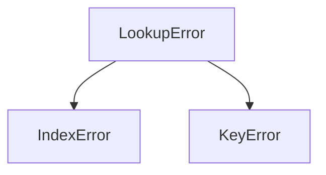

# Chapter 9: Conceptual Question Bank — Exceptions

This is a deep-dive companion to the main exceptions chapter — forty short-answer questions covering everything from "what actually is an exception?" up to newer, more advanced features like exception groups and exception chaining. Where the earlier parts of the chapter focused on *writing* `try`/`except` code, this question bank is about understanding the *reasoning* behind Python's exception system: why it's designed the way it is, what's really happening underneath a `try` block, and the conventions experienced Python developers follow and why.

The questions themselves are from the printed book. 
The answers — each one is now broken into logical steps, includes a short runnable example wherever it helps, defines any technical term the first time it's used (with a link to further reading, mostly the [official Python documentation](https://docs.python.org/3/library/exceptions.html)), and — for the handful of questions that are really about a *process* rather than a single fact — includes a simple flowchart. Work through these at whatever pace suits you; they're meant to deepen your understanding.

---

### 1. How does Python distinguish between a syntax error and an exception in terms of the program's lifecycle?

**Answer**

The key difference is **timing** — *when*, in a program's life, each kind of error is detected.

1. **Before the program runs at all**, Python's parser reads through your code and converts it into something the interpreter can execute. If anything is structurally wrong at this stage — a missing colon, incorrect indentation, an unclosed bracket — Python can't even finish this step. This is a **syntax error**, and it means the program never starts running in the first place.
2. **While the program is already running**, individual operations are carried out one at a time. If one of those operations fails for some reason — dividing by zero, opening a file that doesn't exist — Python raises an **exception**. At this point, the code was perfectly valid Python; the *problem* only appeared because of what happened when that particular line actually ran.

| | Syntax Error | Exception |
| --- | --- | --- |
| Detected when? | Before execution (parsing stage) | During execution (runtime) |
| Nature of the problem | Structural — the code isn't valid Python | Operational — a specific action failed |
| Can it be caught with `try`/`except`? | No — the program never starts | Yes |

**In short:** a syntax error means "this isn't valid Python at all." An exception means "this is valid Python, but something went wrong when it actually ran."

---

### 2. Explain why the `try` block is often referred to as a "suspicious" or "risky" block of code.

**Answer**

1. Certain operations depend on things outside your program's direct control — a file might not exist, a network connection might drop, a user might type something unexpected.
2. Because these operations *might* fail, even though the code itself is written correctly, they're considered "risky."
3. Wrapping this risky code inside a `try` block tells Python: *"watch this section closely — if something goes wrong here, don't crash immediately; instead, let me handle it."*
4. If a failure does occur, Python creates an exception object and hands control over to a matching `except` block, rather than stopping the whole program.

```python
try:
    # "risky" -- depends on the file actually existing
    with open("data.txt") as f:
        content = f.read()
except FileNotFoundError:
    print("The file wasn't found -- using default data instead.")
```

Think of the `try` block as a protective container: it isolates the parts of your code most likely to fail, so a single unexpected problem doesn't take down the entire program.

---

### 3. What is the specific functional purpose of the `else` clause in a `try`–`except`–`else`–`finally` structure?

**Answer**

1. The `else` block runs **only if the `try` block completes with no exception at all**.
2. Its purpose is to separate "code that might fail" (which belongs in `try`) from "code that should only run once we know the risky part succeeded" (which belongs in `else`).
3. This keeps the `try` block small and focused, which makes your error handling far more precise — see Question 39 for why a small `try` block matters.

```python
try:
    f = open("data.txt")          # the risky operation
except FileNotFoundError:
    print("File not found.")
else:
    content = f.read()             # only runs if open() succeeded
    print(content)
    f.close()
```

**Why this matters:** if the file-*processing* logic (in `else`) also lived inside the `try` block, an error while processing (say, a `TypeError`) could get mixed up with — or accidentally hidden by — the `except FileNotFoundError` block meant only for the *opening* step. Separating them keeps each `except` block honestly matched to the operation it's meant to guard.

---

### 4. Describe the "Exception Propagation" process that occurs when an exception is raised but not caught in the current function.

**Answer**

1. An exception is raised (either by Python itself, or by your own `raise` statement).
2. Python looks for a matching `except` block *in the current function*.
3. If none is found, the current function's execution is abandoned, and the exception is passed up to whichever function *called* it.
4. This "bubbling up" repeats, one level at a time, until either a matching handler is found somewhere in the chain of calls, or the very top of the program is reached.
5. If it reaches the top without ever being caught, Python's own default handler takes over: it prints a traceback and stops the program.


> **New term — "bubbling up" / "propagation":** this is just the everyday name for an exception moving outward through the chain of function calls, level by level, until something catches it. See the [official Python docs on the exception-handling statement](https://docs.python.org/3/reference/compound_stmts.html#the-try-statement) for the formal description of this process.

**Why this design is useful:** it lets you decide, deliberately, *where* in your program's structure an error should actually be dealt with — often a much higher-level function is in a far better position to decide "what should we do about this" than the low-level function where the error technically occurred.

---

### 5. Why is it considered a violation of best practices to use a "bare" `except:` clause or `except Exception as e:` as a primary handling strategy?

**Answer**

1. A bare `except:` catches **absolutely everything** — including things you almost certainly didn't intend to catch, like `KeyboardInterrupt` (raised when the user presses Ctrl+C to stop the program) and `SystemExit`.
2. This means a user might not even be able to stop your program by pressing Ctrl+C, since your bare `except:` would silently swallow that signal too.
3. It also hides genuine bugs — a simple typo causing a `NameError` gets caught and hidden just as readily as an error you actually expected and know how to handle.
4. The result is what's sometimes called **silent failure** (covered in more depth in Question 35): the program *looks* like it's working, but it's actually failing quietly, with no clue left behind about what went wrong.

```python
# Risky: catches EVERYTHING, including Ctrl+C and typos
try:
    do_something()
except:
    pass   # the error just vanishes -- very hard to debug later

# Better: catch only what you actually expect and know how to handle
try:
    do_something()
except ValueError:
    print("Invalid value provided.")
```

**The rule of thumb:** only catch exceptions you genuinely know how to recover from. Let everything else propagate — that's what surfaces real bugs during development, instead of hiding them until it's much harder to trace the cause.

---

### 6. Compare and contrast the `finally` block with the `else` block in terms of execution certainty.

**Answer**

| | `else` | `finally` |
| --- | --- | --- |
| Runs when? | Only if the `try` block succeeds with no exception | **Always** — success, failure, or even a `return` in progress |
| Typical use | "Happy path" logic that depends on the risky step succeeding | Cleanup that must happen no matter what (closing files, releasing locks) |

The crucial distinction: **`else` is conditional, `finally` is mandatory.** Even if a `return` statement is reached inside `try` or `except`, Python holds onto that return value, runs the `finally` block first, and *only then* actually returns from the function.

```python
def demo():
    try:
        return "try result"
    finally:
        print("finally always runs, even before the return above completes")

print(demo())
# Output:
# finally always runs, even before the return above completes
# try result
```

> **A trap worth knowing about:** if the `finally` block *itself* contains a `return` or `raise`, it will silently override whatever the `try`/`except` block was about to do — swallowing the original return value or exception entirely. This is almost always a bug, not something you'd want deliberately.

---

### 7. In the context of Object-Oriented Programming, what does it mean to say that "exceptions are classes"?

**Answer**

1. In Python 3, every exception you encounter is an **object**, created from a **class** — the same way `"hello"` is an object created from the `str` class.
2. When an error occurs, Python is really calling that exception class's `__init__()` method, and storing relevant details (like an error message) inside the resulting object.
3. Because exceptions are classes, they support **inheritance** — meaning some exception classes are built as more specific versions of other, more general ones.
4. This lets a single `except` block catch an entire *family* of related exceptions at once, just by naming the shared parent class.

```python
# ZeroDivisionError and OverflowError are BOTH subclasses of ArithmeticError,
# so this one except block catches either of them.
try:
    result = 10 / 0
except ArithmeticError:
    print("Some kind of math error occurred.")
```

> **New term — "class" / "inheritance":** if these are new ideas, the book's Object-Oriented Programming chapter covers them properly — but the short version is that a class is a blueprint for creating objects, and inheritance lets one class be defined as "a more specific version of" another. See the [official Python OOP tutorial](https://docs.python.org/3/tutorial/classes.html) for more.

This is exactly why organizing exceptions into a hierarchy (parent/child relationships) is such a powerful idea — see Questions 11 and 23 for more on this.

---

### 8. How does the `with` statement implement the "Context Management Protocol" to improve resource safety?

**Answer**

1. The `with` statement relies on two special methods (called "dunder," short for "double underscore," methods): `__enter__` and `__exit__`.
2. When the `with` block **starts**, Python calls `__enter__` — this is where the resource (e.g. a file) is set up, and its return value is what gets assigned to the variable after `as`.
3. When the `with` block **ends** — whether it finished normally *or* an exception occurred — Python automatically calls `__exit__`, which handles cleanup (e.g. closing the file).
4. Because `__exit__` is called unconditionally, resources are guaranteed to be released, even if something inside the block crashes.

```python
with open("data.txt") as f:   # __enter__ opens the file
    content = f.read()
# __exit__ has ALREADY closed the file by this point, automatically
```

This section of the book has an entire chapter dedicated to this topic if you'd like to go deeper — see *Context Managers: `with`, `__enter__()`, and `__exit__()`* elsewhere in this chapter for a full breakdown, including how to build your own.

---

### 9. Why must custom exceptions be derived from the `Exception` class rather than the `BaseException` class?

**Answer**

1. `BaseException` sits at the very top of Python's exception hierarchy — but its direct children include things that are *not* ordinary program errors, like `KeyboardInterrupt` (Ctrl+C) and `SystemExit` (raised when the program is deliberately closing).
2. If a custom exception were built directly on `BaseException`, a broad `except BaseException:` written somewhere else in the program could accidentally catch these system-level signals too — for example, silently swallowing the user's Ctrl+C press.
3. `Exception` is a subclass of `BaseException` that specifically groups together ordinary, application-level errors — the kind you actually want caught by typical error-handling code.
4. Building your own exceptions on top of `Exception` keeps them safely inside that "ordinary application error" category, without any risk of interfering with these system-level signals.

```python
# Correct: inherits from Exception
class InsufficientBalanceError(Exception):
    pass

# Risky: inherits from BaseException, and could get accidentally
# caught by (or interfere with) system-level exception handling
class RiskyCustomError(BaseException):
    pass
```

---

### 10. What is the role of the `__str__` method in a user-defined exception class?

**Answer**

1. `__str__` defines what gets shown when the exception object is printed, or converted to text with `str(e)`.
2. Python calls this method automatically whenever you write `print(e)` inside an `except` block.
3. In a custom exception, overriding `__str__` lets you return a clear, formatted message built from whatever data the exception is carrying — rather than a generic default message.

```python
class InsufficientBalanceError(Exception):
    def __init__(self, balance, withdraw_amount):
        self.balance = balance
        self.withdraw_amount = withdraw_amount
        super().__init__()   # still call the parent's __init__

    def __str__(self):
        return (f"Error: Attempted to withdraw {self.withdraw_amount} "
                f"but balance is only {self.balance}")


try:
    raise InsufficientBalanceError(balance=100, withdraw_amount=500)
except InsufficientBalanceError as e:
    print(e)
    # Error: Attempted to withdraw 500 but balance is only 100
```

---

### 11. Discuss the implications of the "Catch Parent before Child" mistake in an `except` block sequence.

**Answer**

1. Python checks `except` blocks **in the order they're written**, from top to bottom.
2. It stops at the very *first* block whose exception type matches — including matches through inheritance (a child exception "is-a" version of its parent, so a parent's `except` block will happily catch a child exception too).
3. If a *parent* exception's `except` block is listed **before** its child's, the parent block will catch the exception first — meaning the more specific child block underneath it is now **unreachable code**, and will never run.

```python
# WRONG ORDER: ArithmeticError (the parent) is listed first, so it
# silently catches ZeroDivisionError too -- the block below it
# is unreachable and will NEVER execute.
try:
    result = 10 / 0
except ArithmeticError:
    print("General math error")
except ZeroDivisionError:
    print("Specifically division by zero")   # unreachable!

# CORRECT ORDER: most specific (child) first, most general (parent) last
try:
    result = 10 / 0
except ZeroDivisionError:
    print("Specifically division by zero")
except ArithmeticError:
    print("General math error")
```

**The rule:** always order `except` blocks from **most specific to most general**.

---

### 12. Explain how the `as` keyword creates an alias for the exception object and what data can be extracted from it.

**Answer**

1. `except ValueError as e:` binds the exception object that was just caught to a local variable name — conventionally `e`.
2. This variable exists only for the duration of the `except` block, and it's a full object, not just a message — so you can inspect it in several ways:

| Expression | Gives You |
| --- | --- |
| `e.args` | A tuple of the raw arguments the exception was created with |
| `type(e)` | The exception's class (e.g. `<class 'ValueError'>`) |
| `str(e)` | A readable message (calls `__str__` — see Question 10) |
| Any custom attribute | Whatever extra data a custom exception class stores, e.g. `e.balance` |

```python
try:
    raise ValueError("bad input", 42)
except ValueError as e:
    print(e.args)     # ('bad input', 42)
    print(type(e))    # <class 'ValueError'>
    print(str(e))      # ('bad input', 42)  -- str() of a multi-arg exception
```

3. Once the `except` block finishes, Python automatically deletes this variable — a deliberate safety measure to avoid circular references that could otherwise prevent memory from being cleaned up properly.

---

### 13. How does the `raise` statement allow for "re-raising" an exception, and why would a programmer do this?

**Answer**

1. Writing a bare `raise` (with no exception specified) **inside** an `except` block re-raises the exact exception that was just caught.
2. This is useful when you want to do something locally in response to the error — like logging it, or doing partial cleanup — but you still want the calling code further up the chain to know that a failure happened.

```python
def process_file(path):
    try:
        with open(path) as f:
            return f.read()
    except FileNotFoundError:
        print(f"Logging: could not find {path}")   # local side effect
        raise    # re-raise the SAME exception, so the caller still sees it
```

This creates a **layered** response to errors: the low-level function handles what it can (logging), while the decision of whether the whole program should continue or stop is left to a higher-level function that's in a better position to make that call.

---

### 14. Distinguish between `IndexError` and `KeyError` in terms of the data structures they apply to.

**Answer**

Both are subclasses of `LookupError` (see Question 23), but they apply to different kinds of collections:

| | `IndexError` | `KeyError` |
| --- | --- | --- |
| Applies to | Sequences — `list`, `tuple`, `str` | Mappings — `dict` |
| Triggered by | An integer position that's out of range | A key that doesn't exist in the dictionary |
| Access style | Position-based | Label-based |

```python
my_list = [1, 2, 3]
my_dict = {"name": "Alice"}

try:
    print(my_list[10])       # IndexError: list index out of range
except IndexError:
    print("That position doesn't exist in the list.")

try:
    print(my_dict["age"])    # KeyError: 'age'
except KeyError:
    print("That key doesn't exist in the dictionary.")
```

---

### 15. Describe a scenario where `TypeError` and `ValueError` might both be relevant to the same function.

**Answer**

Consider a function that calculates a square root:

1. If the input is the **wrong type entirely** — say, a string like `"hello"` — Python can't even attempt the mathematical operation, and raises `TypeError`.
2. If the input is the **right type, but an inappropriate value** — say, a negative number, which has no real-number square root — Python raises `ValueError`.

```python
import math

def safe_sqrt(x):
    try:
        return math.sqrt(x)
    except TypeError:
        print("Please enter a number.")            # wrong TYPE
    except ValueError:
        print("Please enter a non-negative value.")  # wrong VALUE

safe_sqrt("hello")   # Please enter a number.
safe_sqrt(-9)          # Please enter a non-negative value.
```

**The distinction to remember:** `TypeError` means "this isn't even the right *kind* of thing"; `ValueError` means "this is the right kind of thing, but not an acceptable value of it."

---

### 16. Why is the `finally` block considered the "guaranteed" block even in the presence of a `return` statement?

**Answer**

1. If a `return` statement is reached inside `try` or `except`, Python doesn't exit the function immediately.
2. Instead, it holds onto that return value, and runs the `finally` block first.
3. Only *after* `finally` finishes does the function actually hand the value back to the caller.

This guarantees that cleanup code (closing a socket, releasing a lock, etc.) is never skipped, no matter how the function is exiting.

> **The trap to watch for (repeated from Question 6, since it's easy to trip over):** if `finally` itself contains a `return` or `raise`, that **overwrites** the original return value or exception entirely — usually unintentionally. Avoid putting `return`/`raise` inside a `finally` block unless you specifically mean to override whatever came before it.

---

### 17. How does the use of `OSError` help in handling various file-related issues in a unified way?

**Answer**

1. `OSError` is a **base class** for many operating-system-related exceptions, including `FileNotFoundError`, `PermissionError`, and `TimeoutError`.
2. When the exact *reason* for a failure doesn't actually change how your program should respond, catching the shared parent class (`OSError`) lets you handle every variant with one block of code, instead of writing out each one separately.

```python
try:
    with open("config.txt") as f:
        settings = f.read()
except OSError:
    # Covers FileNotFoundError, PermissionError, and more --
    # here, ANY file-related problem leads to the same fallback.
    print("Couldn't read config file -- using default settings.")
    settings = "default"
```

This strikes a balance: it's more specific (and safer) than catching the very broad `Exception`, but still concise enough to avoid writing a separate `except` block for every possible file-related failure. See the [official Python docs on `OSError`](https://docs.python.org/3/library/exceptions.html#OSError) for the full list of its subclasses.

---

### 18. Explain the difference between `ModuleNotFoundError` and `ImportError`.

**Answer**

1. `ModuleNotFoundError` is a **subclass** of `ImportError`, introduced in Python 3.6 specifically to separate two different situations.
2. `ModuleNotFoundError` occurs when the module itself simply **can't be found** at all.
3. `ImportError` (the broader/older category) covers cases where the module *is* found, but something goes wrong while loading it — most commonly, trying to import a specific name that doesn't exist inside it.

```python
import non_existent_library
# ModuleNotFoundError: No module named 'non_existent_library'

from math import non_existent_function
# ImportError: cannot import name 'non_existent_function' from 'math'
```

Separating these lets you write more precise handlers — for example, only attempting an automatic package installation if the module is *completely* missing (`ModuleNotFoundError`), rather than for every kind of import failure.

---

### 19. What happens if an exception is raised during the execution of an `except` block?

**Answer**

1. If a *new* exception occurs while Python is already inside an `except` block handling an earlier one, the original exception isn't simply discarded — Python puts it "on hold" and starts handling the new one instead.
2. In modern Python (3.x), the new exception automatically stores a reference to the original one in a special attribute called `__context__`.
3. If this new exception is never caught, the traceback that's eventually printed shows **both** errors, joined by the message: *"During handling of the above exception, another exception occurred."*

```python
try:
    result = 10 / 0
except ZeroDivisionError:
    print(undefined_variable)   # this itself raises a NEW NameError
```

This behavior prevents the *original* problem's context from being silently lost — it makes it clear to whoever's debugging that the error-handling code itself ran into a second, separate failure, rather than making it look like an unrelated crash out of nowhere.

---

### 20. Why does Python 3.x no longer allow strings to be used as exceptions?

**Answer**

1. In Python 2, it used to be possible to write something like `raise "Error Message"` directly.
2. Plain strings can't support inheritance, can't be organized into a hierarchy, and can't carry extra structured data — everything this entire question bank has been built around (Questions 7, 9, 11, 23, and more) simply wouldn't be possible.
3. Python 3 requires every exception to be a proper class instance instead, which guarantees every exception has a traceback, fits into the exception hierarchy, and can carry as much extra data as needed (like `e.args`, or custom attributes).

This change made Python's error-handling system fully consistent with the rest of the language's object-oriented design — an exception is treated exactly the same way any other kind of object is.

---

### 21. In the `process_numbers` example from the document, why does the `TypeError` go unhandled in Case 3?

**Answer**

1. The script in question only defines an `except ZeroDivisionError:` block.
2. Calling `process_numbers("10", 2)` attempts `"10" / 2` — dividing a string by an integer — which Python cannot do, and raises `TypeError`, not `ZeroDivisionError`.
3. Since there's no `except TypeError:` block, and no broader `except Exception:` fallback either, this exception simply **doesn't match any of the available handlers**.
4. The `finally` block still runs (as it always does — see Questions 6 and 16), but afterward the exception continues propagating (see Question 4), and the program terminates with a standard unhandled-exception traceback.

```python
def process_numbers(number, divisor):
    try:
        return number / divisor
    except ZeroDivisionError:
        print("Cannot divide by zero.")
    finally:
        print("Attempted the division.")

process_numbers("10", 2)
# Attempted the division.
# TypeError: unsupported operand type(s) for /: 'str' and 'int'
```

**The lesson:** an `except` block only catches the *specific* exception types it names (or their subclasses) — it's not a safety net for every possible thing that could go wrong.

---

### 22. How can the `args` attribute of an exception object be utilized in a script?

**Answer**

1. `args` is a tuple holding the raw values the exception was created with.
2. For most built-in exceptions, this is just a single-item tuple containing the error message, like `('division by zero',)`.
3. For custom exceptions that are passed multiple values, `args` gives you a quick way to retrieve that raw data without needing to define separate custom attributes for each one.

```python
try:
    10 / 0
except ZeroDivisionError as e:
    print(e.args)   # ('division by zero',)

try:
    raise Exception("low balance", 100, 500)
except Exception as e:
    print(e.args)   # ('low balance', 100, 500)
```

In practice, printing the whole exception object (`print(e)`) or its string form (`str(e)`) is usually more convenient for everyday debugging — but `args` is useful when you need the *raw*, individual values back, for logging or for building your own error messages programmatically.

---

### 23. Explain the relationship between `LookupError`, `IndexError`, and `KeyError`.

**Answer**

1. `LookupError` is a shared **base class** for exceptions caused by looking something up with an invalid position or key.
2. `IndexError` (invalid position in a sequence) and `KeyError` (invalid key in a dictionary) are both **subclasses** of `LookupError`.
3. This means a single `except LookupError:` block can catch either problem — useful when your code doesn't care *which specific kind* of "not found" occurred, just that a lookup failed.



```python
def get_item(data, key_or_index):
    try:
        return data[key_or_index]
    except LookupError:
        # Catches EITHER an out-of-range list index
        # OR a missing dictionary key, with one block.
        return "Not found"

print(get_item([1, 2, 3], 10))          # Not found  (IndexError)
print(get_item({"a": 1}, "missing"))     # Not found  (KeyError)
```

This is a good example of writing code that works the same way for two different kinds of collections — often described as **polymorphic** error handling.

---

### 24. Why is `IndentationError` considered a "Parsing Error" rather than a "Runtime Error"?

**Answer**

1. Python reads and converts your source code into runnable instructions *before* any of it actually executes — this step is called **parsing**.
2. Since indentation in Python defines the structure of the code itself (which lines belong to which block), incorrect indentation makes it impossible for the parser to even determine what the program's structure *is*.
3. Because this failure happens before execution begins, `IndentationError` is technically a subclass of `SyntaxError` — the same category discussed in Question 1.
4. This is why you **cannot** catch an `IndentationError` with a `try`/`except` inside the very same file — the interpreter never successfully finishes loading the file to begin with, so no code (including your `try` block) ever gets a chance to run.

---

### 25. How does the use of user-defined exceptions improve the "Expressiveness" of code?

**Answer**

1. Built-in exceptions like `ValueError` are intentionally broad — they could represent hundreds of unrelated problems across totally different programs.
2. A custom exception, like `InsufficientBalanceError`, immediately tells a reader exactly what went wrong, in the specific context of *your* application — no guessing required.
3. This makes the code **self-documenting**: the exception's name alone explains the business rule that was violated.
4. It also lets you cleanly separate two very different categories of failure:

| Category | Example | What it usually means |
| --- | --- | --- |
| System error | A database connection fails | Something *outside* your application's logic went wrong |
| Business logic error | `InsufficientBalanceError` | The application's own rules were violated, even though everything technically "worked" |

```python
class InsufficientBalanceError(Exception):
    """Raised when a withdrawal exceeds the available balance."""
    pass
```

---

### 26. What is the significance of the `as` keyword not creating a new object?

**Answer**

1. `except Exception as e:` doesn't create a brand-new copy of the exception — `e` is simply a **reference** (a name pointing to) the exact same object that was already created the moment the error occurred.
2. This matters for efficiency: no large traceback or error data ever needs to be copied, just referenced.
3. Since `e` points to the *original* object, any attributes that were set on it earlier — for example, inside a custom exception's `__init__` — remain fully accessible through `e`.
4. This also reflects Python's broader philosophy: **variables are names attached to objects, not containers that hold data directly.** `e` isn't "a box containing the error" — it's a label pointing at the one error object that exists.

> **New term — "reference":** if you'd like a deeper look at how Python variables actually work under the hood (as names pointing to objects, rather than boxes holding values), see the [official Python docs on the data model](https://docs.python.org/3/reference/datamodel.html).

---

### 27. Describe a situation where using the `raise` keyword manually is beneficial even if an error hasn't occurred.

**Answer**

1. Python itself is perfectly happy to store a value like `-5` or `200` in a variable — technically, nothing about that is a Python-level error.
2. But your program's *business logic* might consider those values impossible or nonsensical — for instance, a negative age, or an age of 200.
3. Manually raising an exception (a **sanity check** / **pre-condition** check) forces the calling code to notice and correct the problem immediately, rather than letting an unrealistic value quietly propagate through the rest of the program and cause confusing failures much later.

```python
def set_age(age):
    if age < 0 or age > 150:
        raise ValueError(f"Age {age} is not realistic")
    return age

set_age(200)   # raises ValueError immediately, instead of silently accepting it
```

This is a direct application of the "Fail-Fast" principle covered in Question 30.

---

### 28. How does a `finally` block help in preventing "Resource Leaks"?

**Answer**

1. A **resource leak** happens when a program acquires something limited — an open file, a network connection, a database session — but never properly releases it, usually because an error interrupted the normal flow before the cleanup code was reached.
2. Placing the cleanup step (like `.close()`) inside a `finally` block guarantees it runs **no matter what** — whether the surrounding code succeeds, raises an exception, or even exits early via `return` (see Question 6).

```python
f = open("data.txt")
try:
    risky_processing(f)
finally:
    f.close()   # ALWAYS runs, even if risky_processing() raises an exception
```

> Note: `with open(...) as f:` (covered in Question 8) does this same job automatically, and is generally preferred over manually writing `try`/`finally` yourself — but understanding the manual version is exactly what makes it clear *why* `with` is so useful in the first place.

---

### 29. Why is `ZeroDivisionError` categorized under `ArithmeticError`?

**Answer**

1. `ArithmeticError` is a shared base class covering exceptions that occur during mathematical operations — this includes `ZeroDivisionError`, `OverflowError`, and `FloatingPointError`.
2. Grouping them this way lets a high-level handler catch "any kind of math problem" with one block, without needing to enumerate every specific type.

```python
def calculator(a, b, operation):
    try:
        if operation == "/":
            return a / b
        # ... other operations ...
    except ArithmeticError:
        return "Math Error"   # covers ZeroDivisionError, OverflowError, etc.
```

This mirrors the same idea already covered for `LookupError` (Question 23) and `OSError` (Question 17): Python's exception hierarchy consistently groups related failures under sensible shared parents.

---

### 30. What is the "Fail-Fast" principle and how do exceptions support it?

**Answer**

1. The **Fail-Fast principle** says a program should report a problem as soon as it's detected, rather than trying to carry on in a state that might already be broken.
2. Exceptions are Python's main tool for this: instead of quietly returning a placeholder value like `-1` or `None` (which a caller might forget to check for), a failed operation **stops execution immediately** and forces the problem to be addressed.
3. This prevents a subtle, much harder category of bug: a program that keeps running with silently incorrect data, only failing (confusingly) much later, far from where the real problem actually started.

```python
# Fails silently -- caller might forget to check for None,
# and the bug surfaces somewhere completely unrelated, much later.
def find_user(users, name):
    for u in users:
        if u["name"] == name:
            return u
    return None

# Fails FAST -- the problem is impossible to ignore or forget about.
def find_user_strict(users, name):
    for u in users:
        if u["name"] == name:
            return u
    raise ValueError(f"No user named {name}")
```

---

### 31. What is "Exception Chaining" using the `raise ... from` syntax?

**Answer**

1. Exception chaining lets you catch a low-level error, and raise a different, more meaningful error in its place — while still preserving a link back to the *original* problem.
2. The syntax `raise NewError("message") from original_exception` stores `original_exception` in the new exception's `__cause__` attribute.
3. This is especially useful when "wrapping" technical, low-level failures into clearer, higher-level application errors, without losing the original debugging trail.

```python
class ConfigLoadError(Exception):
    pass

try:
    with open("config.json") as f:
        pass
except FileNotFoundError as e:
    raise ConfigLoadError("Could not load application configuration") from e
```

When this goes unhandled, the printed traceback shows **both** exceptions, with a clear message explaining that the second was raised while handling the first — giving a complete picture of the failure, from the original technical cause up to the final application-level error.

---

### 32. Explain the "EAFP" (Easier to Ask for Forgiveness than Permission) coding style preferred in Python.

**Answer**

1. **EAFP** means: attempt the operation directly inside a `try` block, and handle the failure in `except` if it doesn't work out.
2. This is contrasted with **LBYL** ("Look Before You Leap"): checking conditions with `if` statements *before* attempting the operation.

```python
import os

# LBYL style
if os.path.exists("data.txt"):
    with open("data.txt") as f:
        content = f.read()
else:
    content = ""

# EAFP style (generally preferred in Python)
try:
    with open("data.txt") as f:
        content = f.read()
except FileNotFoundError:
    content = ""
```

3. EAFP is usually preferred in Python for two reasons: it avoids the overhead of a separate check that then gets thrown away, and — more importantly — it avoids a subtle bug called a **race condition**, where the situation could change in the tiny gap of time between the "check" and the "action" (for example, if the file gets deleted by another program in between the `os.path.exists()` check and the `open()` call).

> **New term — "race condition":** a bug that only occurs because of unlucky timing between two separate operations. See the [Wikipedia article on race conditions](https://en.wikipedia.org/wiki/Race_condition) for a broader explanation beyond this specific Python example.

---

### 33. What are "Exception Groups" (introduced in Python 3.11), and how do they change error handling?

**Answer**

1. Normally, only *one* exception can be "in flight" at a time. But in concurrent or asynchronous code, several independent tasks might fail **simultaneously**, each with its own, unrelated error.
2. Python 3.11 introduced `ExceptionGroup`, a special exception type that can bundle several unrelated exceptions together into one object, plus the new `except*` syntax to handle them.
3. Instead of being forced to report just one failure and discard the rest, `except*` lets you catch and process specific exception types *from within* the bundle, ensuring every individual failure gets acknowledged.

```python
try:
    raise ExceptionGroup(
        "multiple failures",
        [ValueError("bad value"), TypeError("bad type")]
    )
except* ValueError as eg:
    print("Handled the ValueError(s):", eg.exceptions)
except* TypeError as eg:
    print("Handled the TypeError(s):", eg.exceptions)
```

> See the [official Python docs on exception groups](https://docs.python.org/3/library/exceptions.html#exception-groups) for the full details — this is a more advanced, newer feature, most relevant once you're working with concurrent or asynchronous code (typically covered later in an intermediate-to-advanced Python course).

---

### 34. Discuss the use of the `add_note()` method added to exceptions in Python 3.11.

**Answer**

1. `add_note()` lets you attach extra descriptive text to an exception **after** it has already been created and caught — without altering its original message.
2. Notes are stored in a list on the exception, called `__notes__`, and are appended to the end of the traceback when it's eventually printed.
3. This is useful for adding context as an error travels through different layers of a program — for example, noting *which* user or *which* loop iteration was active when the error occurred.

```python
try:
    raise ValueError("invalid data")
except ValueError as e:
    e.add_note("Occurred while processing user_id=482")
    raise
```

The original error message stays clean and specific, while the added note gives a "breadcrumb trail" that helps trace exactly where and why the failure happened — without needing to build a custom exception class just to carry that extra detail.

---

### 35. What is "Silent Failure," and why is it considered a dangerous anti-pattern?

**Answer**

1. **Silent failure** happens when an exception is caught by an overly broad `except:` block that does nothing useful with it — often just `pass`, or a return with no logging at all.
2. From the outside, everything *looks* like it worked — but internally, the program's state may now be wrong or incomplete.
3. This kind of bug is especially dangerous because the actual failure and its eventual, visible symptom can be separated by a large distance in the code (and in time), making the root cause extremely difficult to trace back.

```python
# DANGEROUS: the error is thrown away completely
try:
    update_database(record)
except Exception:
    pass   # looks like it worked, but the database was never actually updated

# BETTER: at minimum, log or report the failure
try:
    update_database(record)
except Exception as e:
    print(f"Failed to update database: {e}")
    raise   # still let it propagate, unless you have a real recovery plan
```

This directly echoes a principle from *[The Zen of Python](https://peps.python.org/pep-0020/)* (also covered in this book's chapter on the `this` module): **"Errors should never pass silently."**

---

### 36. Explain the performance cost associated with the `try`–`except` block in Python.

**Answer**

1. In modern Python, simply *having* a `try` block costs virtually nothing, as long as no exception actually occurs — there's no meaningful slowdown from wrapping code in `try` "just in case."
2. The real cost only appears **when an exception is actually raised**: Python has to create the exception object, capture the current stack information, and search for a matching handler.
3. This makes `try`/`except` an efficient tool for genuinely *exceptional* situations — things that happen rarely.
4. It's a poor fit, however, for **normal control flow** that runs constantly — for example, using exceptions to check "does this key exist?" thousands of times per second in a hot loop will noticeably slow a program down, compared to a plain conditional check.

**Rule of thumb:** exceptions are for handling things that go wrong occasionally, not for routine decision-making that happens on every iteration of a busy loop.

---

### 37. How should "User-Facing" error messages differ from "Internal" exception data?

**Answer**

1. Internal exception data — full tracebacks, file paths, memory details — is valuable for developers, but should generally **never be shown directly to an end user**, since it can leak sensitive information about how the system is built (a real security concern for anything user-facing).
2. Instead, this detailed information should be logged somewhere developers can access it later.
3. What the *user* sees should be a short, friendly, non-technical explanation of what happened and what they can do about it.

```python
try:
    process_upload(file)
except Exception as e:
    log_error_internally(str(e))                 # full detail, for developers
    print("Sorry, something went wrong with your upload. Please try again.")
    # -- NOT the raw exception message shown to the user
```

**A good general pattern:** catch the technical exception, log the full detail internally, then present (or raise) a separate, simplified message meant specifically for the person using the program.

---

### 38. What is the `traceback` module, and how can it be used for advanced logging?

**Answer**

1. The `traceback` module provides tools to extract, format, and print a program's stack trace **programmatically** — rather than letting Python simply print it to the screen and stop.
2. `traceback.format_exc()` captures the entire error history as a plain string, which can then be sent anywhere your program needs — written to a log file, stored in a database, or emailed to an administrator.
3. This enables **unattended error monitoring**: a way for developers to learn about crashes happening on users' machines, without needing the user to manually report anything.

```python
import traceback

try:
    risky_operation()
except Exception:
    error_details = traceback.format_exc()
    # send error_details to a log file, database, or monitoring service
    print("An unexpected error occurred. Our team has been notified.")
```

This section of the book covers `traceback` — along with `sys.exc_info()` and the modern `e.__traceback__` attribute — in much greater depth in the two chapters specifically dedicated to it.

---

### 39. Why is it a best practice to keep the `try` block as small as possible?

**Answer**

1. A `try` block should ideally contain **only** the specific lines that are actually expected to fail.
2. If a `try` block contains twenty unrelated lines and a `ValueError` occurs, it's genuinely difficult to know *which* of those twenty lines was actually responsible.
3. Keeping the block small and "tight" ensures your `except` blocks are handling exactly the error you intended — no more, no less.
4. Logic that doesn't actually need error monitoring belongs either in the `else` block (see Question 3) or entirely outside the `try`/`except` structure.

```python
# Too broad: if ANY of these three lines fails, it's unclear which one did
try:
    data = fetch_data()
    processed = transform(data)
    save(processed)
except Exception as e:
    print("Something went wrong:", e)   # which step? we can't tell

# Tight and specific: only the genuinely risky step is inside try
data = fetch_data()
try:
    processed = transform(data)   # this is the step we expect might fail
except ValueError:
    print("Transform failed due to invalid data")
    processed = None
save(processed)
```

This principle is sometimes called **"Error Specificity"** — the more narrowly your `try` block is scoped, the more precisely your error handling can actually respond.

---

### 40. Describe the concept of "Exception Safety" in software design.

**Answer**

1. **Exception safety** is a guarantee about what state your program is left in *after* an exception occurs — ideally, a valid and consistent one, not a half-finished, broken one.
2. There are different recognized levels of this guarantee:

| Level | Guarantee |
| --- | --- |
| Basic safety | No resources are leaked (memory, open files, etc.) — but partial changes to data may remain |
| Strong safety ("rollback guarantee") | If an operation fails partway through, the program's state is restored to exactly what it was *before* the operation began — as if it had never been attempted |

3. Achieving strong safety typically involves careful use of **context managers** (Question 8) and **`finally`** blocks (Questions 6, 16, 28), specifically designed so that if a multi-step process fails partway through, any partial changes already made are deliberately undone.

```python
def transfer_funds(account_a, account_b, amount):
    account_a.balance -= amount
    try:
        account_b.balance += amount
    except Exception:
        # "Rollback": undo the FIRST step, so the overall operation
        # leaves the system exactly as it was before we started --
        # this is what "strong" exception safety looks like.
        account_a.balance += amount
        raise
```

Exception safety is ultimately about designing your code so that a failure partway through a complex operation never leaves your data in a confusing, inconsistent, half-updated state.


