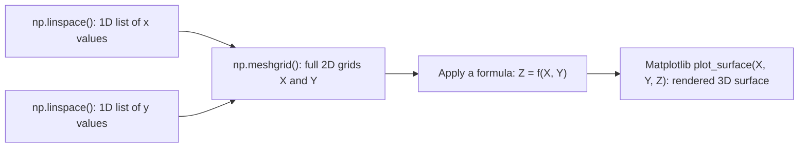

# Chapter 11 — Project: Visualizing Surfaces using NumPy and Matplotlib

## About this chapter

This project connects two ideas you've already met — `np.linspace()` and
`np.meshgrid()` — to a genuinely visual payoff: drawing a full 3D surface.
Up to now, `meshgrid()` may have felt a little abstract (why do I need two
2D grids instead of two 1D lists?). Plotting an actual surface is where
that question gets a satisfying, visual answer: a 3D surface needs a
height value at *every point on a grid*, and `meshgrid()` is precisely the
tool that builds that grid for you.

By the end of this project you should be able to explain, in your own
words, how four things fit together: an evenly-spaced list of numbers
(`linspace()`), a full coordinate grid built from two such lists
(`meshgrid()`), a mathematical function applied to that grid
(`Z = f(X, Y)`), and finally, a rendered 3D picture (Matplotlib).

> **Quick glossary, before we start**
> - **`linspace()`** — creates a fixed *number* of evenly spaced values
>   between a start and stop point. See
>   [NumPy's `linspace()` documentation](https://numpy.org/doc/stable/reference/generated/numpy.linspace.html).
> - **`meshgrid()`** — takes two 1D arrays (representing x and y positions)
>   and expands them into two full 2D grids, so that every possible (x, y)
>   pairing on the grid is represented.
> - **Surface plot** — a 3D chart where height (`Z`) is shown at every
>   point of an `(X, Y)` grid, producing a shape like a sheet, hill, or
>   bowl. See
>   [Matplotlib's own 3D surface plotting tutorial](https://matplotlib.org/stable/gallery/mplot3d/surface3d.html).
> - **`Z = f(X, Y)`** — mathematical shorthand for "the height `Z` at
>   position `(X, Y)` is calculated by some function `f`." In this project,
>   `f` is first a simple addition, then a square-root formula.

---

## Objective

Understand how:

- `linspace()` creates values
- `meshgrid()` creates coordinate grids
- functions $Z = f(X, Y)$ create surfaces
- Matplotlib visualizes them




---

## PART A — Conceptual Study


### Study the following:

1. What does `np.linspace()` do?
2. How does `np.meshgrid()` convert 1D arrays into 2D grids?
3. What does each of these represent:
   - X → x-coordinates
   - Y → y-coordinates
   - Z → height (function output)

### Suggested answers, for a beginner working through this alone

**1. What does `np.linspace()` do?**

`np.linspace(start, stop, num)` produces exactly `num` values, evenly
spaced between `start` and `stop` (including both endpoints). For example,
`np.linspace(-5, 5, 50)` gives 50 evenly spaced numbers from `-5` up to and
including `5` — this becomes the set of x-positions (and separately, the
set of y-positions) our grid will be built from.

**2. How does `np.meshgrid()` convert 1D arrays into 2D grids?**

Given a 1D array of x-values and a 1D array of y-values, `np.meshgrid()`
produces **two** 2D arrays, `X` and `Y`, both the same shape, such that
every position `(i, j)` in those arrays holds one valid `(x, y)` pairing
from the grid. In other words: instead of two separate lists of
coordinates, you get two grids that, read together position by position,
give you *every combination* of x and y across the whole surface.

**Step-by-step, for a tiny example:**

```python
x = np.array([1, 2])
y = np.array([10, 20])
X, Y = np.meshgrid(x, y)

# X:
# [[1 2]
#  [1 2]]
#
# Y:
# [[10 10]
#  [20 20]]
```

Reading `X` and `Y` together at position `[0, 1]` gives the pair
`(2, 10)`; at `[1, 0]` gives `(1, 20)` — every combination of the original
x and y values is represented, one per grid position.

**3. What does each of X, Y, and Z represent?**

| Symbol | Represents | Shape |
| --- | --- | --- |
| `X` | The x-coordinate at every grid position | Same shape as `Y` and `Z` |
| `Y` | The y-coordinate at every grid position | Same shape as `X` and `Z` |
| `Z` | The **height** of the surface at that `(X, Y)` position — the *output* of your function `f(X, Y)` | Same shape as `X` and `Y` |

**Beginner tip:** the requirement that `X`, `Y`, and `Z` all share the same
shape isn't a coincidence — it's exactly what lets Matplotlib read
`X[i,j]`, `Y[i,j]`, and `Z[i,j]` together as one single 3D point on the
surface, for every `(i, j)` in the grid.

---

### Study these Matplotlib functions

| Function | Purpose |
| --- | --- |
| `plt.figure()` | Create a figure (a blank canvas to draw on) |
| `add_subplot(projection='3d')` | Enable 3D plotting on that canvas |
| `plot_surface(X, Y, Z)` | Plot the surface itself |
| `set_xlabel()`, `set_ylabel()`, `set_zlabel()` | Label the three axes |
| `set_title()` | Add a title |
| `plt.show()` | Display the finished plot |

<details>
<summary>Matplotlib Functions Used (Explained Simply — click to expand)</summary>

### Matplotlib Functions Used (Explained Simply)

---

#### 1. `plt.figure()`

**Role:** Creates a new drawing canvas (called a *figure*).

**Purpose:** To start a new plot. Without it, plots may overlap or reuse
old figures.

**Common input parameters:**
- `figsize=(width, height)` → optional size of the figure

**Output:** Returns a figure object (typically stored as `fig`).

**Example:**
```python
fig = plt.figure()
```

**Key idea:** think of this as opening a blank page for drawing.

---

#### 2. `fig.add_subplot(projection='3d')`

**Role:** Adds a plotting area (axes) inside the figure.

**Purpose:** Enables **3D plotting** — without `projection='3d'`, you'd
only get a normal flat 2D plotting area.

**Input parameters:**
- `projection='3d'` → required for 3D plots

**Output:** Returns an axes object (typically stored as `ax`).

**Example:**
```python
ax = fig.add_subplot(projection='3d')
```

**Key idea:** converts the blank page into a 3D coordinate system.

---

#### 3. `ax.plot_surface(X, Y, Z)`

**Role:** Plots a 3D surface.

**Purpose:** To visualize a function `Z = f(X, Y)`.

**Input parameters:**
- `X, Y, Z` → NumPy arrays, all the **same shape**

**Output:** Draws a surface on the axes.

**Example:**
```python
ax.plot_surface(X, Y, Z)
```

**Key idea:** uses the grid points `(X, Y)` and their heights `Z` to draw a
continuous surface.

---

#### 4. `ax.set_xlabel()`, `set_ylabel()`, `set_zlabel()`

**Role:** Labels the axes.

**Purpose:** To make the plot understandable to anyone viewing it.

**Input:** A string (the label text).

**Output:** Updates the axis labels.

**Example:**
```python
ax.set_xlabel("X")
ax.set_ylabel("Y")
ax.set_zlabel("Z")
```

**Key idea:** always label your axes — an unlabelled 3D plot is very hard
to interpret correctly.

---

#### 5. `ax.set_title()`

**Role:** Adds a title to the plot.

**Purpose:** To describe what the plot represents.

**Input:** A string.

**Output:** Displays a title above the plot.

**Example:**
```python
ax.set_title("Z = X + Y")
```

---

#### 6. `plt.show()`

**Role:** Displays the plot window.

**Purpose:** To render all figures that have been created.

**Input:** None.

**Output:** Shows the final plot(s) on screen.

**Example:**
```python
plt.show()
```

**Key idea:** without this call, your plots may never actually appear.

| Function | Role | Input | Output |
| --- | --- | --- | --- |
| `figure()` | Create canvas | optional size | figure object |
| `add_subplot()` | Create axes | `projection` | axes object |
| `plot_surface()` | Draw surface | `X, Y, Z` arrays | 3D surface plot |
| `set_xlabel()` etc. | Label axes | string | labelled axes |
| `set_title()` | Add title | string | titled plot |
| `show()` | Display plot | none | visible output |

</details>

---

## Part B — Task


Write a program that:

1. Creates a grid using `linspace()` and `meshgrid()`
2. Plots two surfaces:

### Surface 1 (Plane)

$$Z = X + Y$$

### Surface 2 (Cone-like surface)

$$Z = \sqrt{X^2 + Y^2}$$

Derived from $Z^2 = X^2 + Y^2$

### Hints

- Use the same `X` and `Y` for both surfaces
- `Z` must have the same shape as `X` and `Y`
- Use two different figures
- Keep the grid symmetric (e.g., `-5` to `5`)

### Flowchart of the process


---

## Script

Every stage of the script below is labelled with a `# Step N -` comment,
matching the task's requirements, with extra explanation added wherever a
beginner is likely to pause and ask "wait, why that choice?"

```python
# Project: Visualizing surfaces using NumPy and Matplotlib
import numpy as np
import matplotlib.pyplot as plt

# ---------------------------------------------------
# Step 1 - Create the x and y coordinate VALUES (still just 1D lists).
# 50 points gives a reasonably smooth-looking surface; fewer points
# would look noticeably "blocky" once plotted.
# ---------------------------------------------------
x = np.linspace(-5, 5, 50)   # 50 evenly spaced values from -5 to 5
y = np.linspace(-5, 5, 50)   # 50 evenly spaced values from -5 to 5


# ---------------------------------------------------
# Step 2 - Turn those two 1D lists into a full 2D GRID.
# meshgrid() produces two 2D arrays, X and Y, of the same shape.
# Reading X[i,j] and Y[i,j] TOGETHER gives one (x, y) coordinate pair —
# this is exactly the input plot_surface() will need later.
# ---------------------------------------------------
X, Y = np.meshgrid(x, y)


# ---------------------------------------------------
# Step 3 - Define each surface's height, Z, as a formula applied to
# the WHOLE grid at once (this is vectorization — no loop needed).
# ---------------------------------------------------

# Surface 1: a flat, slanted plane. Z increases as X and/or Y increase.
Z1 = X + Y

# Surface 2: a cone-like surface (an upward-opening cone from the origin).
# Z increases with distance from the origin, regardless of direction —
# this is exactly the distance formula, since sqrt(x^2 + y^2) is the
# straight-line distance from (0, 0) to (x, y).
Z2 = np.sqrt(X**2 + Y**2)


# ---------------------------------------------------
# Step 4 - Plot Surface 1 (the plane), in its OWN figure window.
# ---------------------------------------------------
fig1 = plt.figure()                       # a separate blank canvas for this surface
ax1 = fig1.add_subplot(projection='3d')   # enable 3D plotting on this canvas
ax1.plot_surface(X, Y, Z1)                # draw the surface using the grid + heights
ax1.set_title("Z = X + Y (Plane)")
ax1.set_xlabel("X")
ax1.set_ylabel("Y")
ax1.set_zlabel("Z")


# ---------------------------------------------------
# Step 5 - Plot Surface 2 (the cone), in a SECOND, separate figure window.
# Using a second np.figure() call keeps this plot fully independent of
# the first one — they won't overlap or interfere with each other.
# ---------------------------------------------------
fig2 = plt.figure()
ax2 = fig2.add_subplot(projection='3d')
ax2.plot_surface(X, Y, Z2)
ax2.set_title("Z = sqrt(X^2 + Y^2) (Cone)")
ax2.set_xlabel("X")
ax2.set_ylabel("Y")
ax2.set_zlabel("Z")


# ---------------------------------------------------
# Step 6 - Render both figures on screen at once.
# plt.show() displays every figure created since the script started —
# in this case, both the plane and the cone, each in its own window.
# ---------------------------------------------------
plt.show()

# Key ideas to remember:
# X, Y -> the coordinates on the grid (where you are)
# Z    -> the height of the surface at that coordinate (how high you are)
```

### Output Figure (Plane)


### Output Figure (Cone)


---

## Summary

| Piece | Role |
| --- | --- |
| `np.linspace()` | Builds the raw list of evenly spaced x (or y) values |
| `np.meshgrid()` | Expands two 1D lists into two full 2D coordinate grids |
| `Z = f(X, Y)` | A formula applied to the whole grid at once, producing a height at every point |
| `ax.plot_surface(X, Y, Z)` | Draws the actual 3D surface from the grid and its heights |
| Two separate figures | Keeps the plane and the cone as two independent, non-overlapping plots |

---

## Follow-up questions for practice

*(These are additional, optional questions for self-testing — they don't
replace or change the original task above.)*

1. What would happen to the plotted surface's *smoothness* if you changed
   `np.linspace(-5, 5, 50)` to `np.linspace(-5, 5, 5)`? Try it and compare
   the two plane plots side by side.
2. Write a third surface, `Z3 = X**2 - Y**2` (a "saddle" shape), reusing
   the same `X` and `Y` grid. What do you expect this surface to look like
   before you plot it?
3. In Step 2, what would happen if you accidentally used two *differently
   sized* `linspace()` calls for `x` and `y` (e.g. 50 points for `x` but
   30 for `y`)? Would `meshgrid()` still work? Would `plot_surface()`?
4. The hint says to "keep the grid symmetric (e.g., -5 to 5)." For
   Surface 2 specifically (the cone), what visual difference would you
   expect if the grid ran from `0` to `10` instead of `-5` to `5`?


