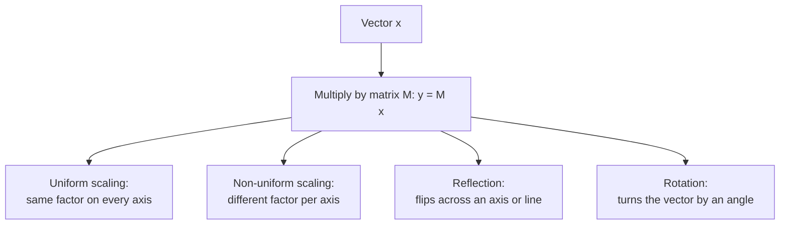

# Chapter 11 — Matrix-Vector Mathematics: Transformations in NumPy

## About this chapter

This chapter is about a single, powerful idea: **multiplying a vector by a
matrix can move, stretch, or flip that vector in a precise, predictable
way.** This is the mathematical foundation behind computer graphics,
robotics, machine learning, and much of scientific computing — anywhere a
program needs to rotate an image, resize a shape, or transform coordinates
from one system into another.

The original version of this chapter presented the mathematics on its own,
without any accompanying code. Since this is a *Python* book, this
improved version keeps every piece of the original mathematics exactly as
written, and adds a working NumPy script alongside each concept — so you
can see, very concretely, that these aren't just abstract formulas: they
are exactly what `matrix @ vector` computes in a single line of Python.

> **Quick glossary, before we start**
> - **Vector** — an ordered list of numbers; here, always written as a
>   column (stacked vertically).
> - **Matrix** — a rectangular grid of numbers, used here to *transform*
>   vectors when multiplied against them.
> - **Transpose (`T`)** — flips a matrix or vector between row and column
>   form, without changing its values. See
>   [Khan Academy's explanation of the transpose](https://www.khanacademy.org/math/algebra-home/alg-matrices/alg-matrix-operations/a/matrix-transpose).
> - **Linear transformation** — a rule (represented here by a matrix) that
>   moves every point in space in a mathematically consistent way — e.g.
>   scaling, reflecting, or rotating.
> - **Diagonal matrix** — a matrix whose only non-zero values sit along its
>   main diagonal (top-left to bottom-right); used throughout this chapter
>   for scaling.
> - **Radians** — an alternative way of measuring angles to degrees; NumPy's
>   trigonometric functions (`np.cos()`, `np.sin()`) expect radians, so
>   converting from degrees is a common early stumbling block. See
>   [NumPy's `radians()` documentation](https://numpy.org/doc/stable/reference/generated/numpy.radians.html).




---

## 1. Vectors and Matrices

In standard algebra, a vector is typically represented as a column matrix.
While a 1D array in Python is simply a list of numbers, mathematically we
view it as a column vector $\mathbf{v}$ of dimension $n \times 1$:

$$
\mathbf{v} = \begin{bmatrix}
x_1 \\
x_2 \\
\vdots \\
x_n
\end{bmatrix}
$$

An alternate, convenient notation often used in textbooks is the transpose
of a row vector. This saves vertical space on the page:

$$
\mathbf{v} = {\begin{bmatrix} x_1 & x_2 & \dots & x_n \end{bmatrix}}^{T}
$$

Here, the superscript `T` denotes the **transpose**, effectively
converting a row into a column.

### The following flowchart shows the various common transformations a matrix can apply to a vector


### Turning this into NumPy code

```python
import numpy as np

# Step 1 - A 1D NumPy array, e.g. np.array([1, 2, 3]), is simply a flat
# list of numbers — it has no "row" or "column" orientation of its own.
v_flat = np.array([1, 2, 3])
print("Flat array, shape:", v_flat.shape)   # (3,)

# Step 2 - To match the mathematical column-vector notation above,
# reshape it into an explicit (n, 1) column.
v_column = v_flat.reshape(3, 1)
print("Column vector, shape:", v_column.shape)   # (3, 1)
print(v_column)
# Output:
# [[1]
#  [2]
#  [3]]

# Step 3 - Confirm the "transpose of a row vector" notation is equivalent:
# start from a (1, 3) row vector and transpose it into a (3, 1) column.
v_row = v_flat.reshape(1, 3)
v_column_via_transpose = v_row.T
print("\nSame column, built via transpose, shape:", v_column_via_transpose.shape)
print(v_column_via_transpose)
```

---


## 2. Matrix-Vector Multiplication as Transformation

When an n×n square matrix A multiplies a vector x of dimension n×1 , the result is a new vector y. This operation is called a **linear transformation**.

y=Ax

The components of the new vector y are linear combinations of the components of x. For a 2×2 system:


$$
\begin{bmatrix} y_1 \\\\ y_2 \end{bmatrix} = 
\begin{bmatrix} a_{11} & a_{12} \\\\ a_{21} & a_{22} \end{bmatrix} 
\begin{bmatrix} x_1 \\\\ x_2 \end{bmatrix} = 
\begin{bmatrix} a_{11}x_1 + a_{12}x_2 \\\\ a_{21}x_1 + a_{22}x_2 \end{bmatrix}
$$


### Turning this into NumPy code

```python
import numpy as np

# Step 1 - Define a general 2x2 matrix A and a 2x1 column vector x.
A = np.array([
    [2, 1],
    [1, 3]
])
x = np.array([5, 4]).reshape(2, 1)

# Step 2 - Perform the matrix-vector multiplication y = A x.
# The @ operator performs genuine matrix multiplication in NumPy —
# this is NOT the same as multiplying element-by-element.
y = A @ x

print("A:\n", A)
print("x:\n", x)
print("y = A @ x:\n", y)
# Output:
# y = [[2*5 + 1*4], [1*5 + 3*4]] = [[14], [17]]
```

---


### 3. Uniform Scaling
Consider a vector $\mathbf{x}$:

$$
\mathbf{x} = \begin{bmatrix} 1 \\\\ 2 \end{bmatrix}
$$

and a scalar matrix $\mathbf{M}$:

$$
\mathbf{M} = \begin{bmatrix} 3 & 0 \\\\ 0 & 3 \end{bmatrix}
$$

The transformation is calculated as:

$$
\mathbf{y} = \begin{bmatrix} 3 & 0 \\\\ 0 & 3 \end{bmatrix} \begin{bmatrix} 1 \\\\ 2 \end{bmatrix} = \begin{bmatrix} 3(1) + 0(2) \\\\ 0(1) + 3(2) \end{bmatrix} = \begin{bmatrix} 3 \\\\ 6 \end{bmatrix}
$$

**Here, the vector was "stretched" by a factor of 3 in all directions. The magnitude increased, but the direction remained unchanged.**


### Turning this into NumPy code

```python
import numpy as np

# Step 1 - Define the vector and the uniform-scaling matrix from the
# worked example above.
x = np.array([1, 2]).reshape(2, 1)
M = np.array([
    [3, 0],
    [0, 3]
])

# Step 2 - Apply the transformation: y = M @ x
y = M @ x
print("Original vector x:\n", x)
print("Scaled vector y:\n", y)
# Output:
# [[3]
#  [6]]
# Matches the worked example exactly: both components stretched by 3.
```

---

### 4. Non-Uniform Scaling

If the diagonal elements of the transformation matrix differ, the scaling is applied differently along each axis. 

Consider a vector $\mathbf{x} = [1, 2]^T$ being transformed by matrix $\mathbf{M}$:

$$
\mathbf{M} = \begin{bmatrix} 3 & 0 \\\\ 0 & 5 \end{bmatrix} \implies \mathbf{y} = \begin{bmatrix} 3 & 0 \\\\ 0 & 5 \end{bmatrix} \begin{bmatrix} 1 \\\\ 2 \end{bmatrix} = \begin{bmatrix} 3(1) \\\\ 5(2) \end{bmatrix} = \begin{bmatrix} 3 \\\\ 10 \end{bmatrix}
$$

The x-component stretched by a factor of 3, while the y-component stretched by a factor of 5. This changes the "aspect ratio" of the vector space, effectively turning a square into a rectangle.


### Turning this into NumPy code

```python
import numpy as np

# Step 1 - Same vector as before, but this time the diagonal values of M
# are DIFFERENT from each other — 3 for x, 5 for y.
x = np.array([1, 2]).reshape(2, 1)
M = np.array([
    [3, 0],
    [0, 5]
])

# Step 2 - Apply the transformation.
y = M @ x
print("Original vector x:\n", x)
print("Non-uniformly scaled vector y:\n", y)
# Output:
# [[3]
#  [10]]
# The x-component stretched by 3, the y-component stretched by 5 —
# a different amount along each axis, unlike Section 3's uniform case.
```

---

## 5. General Form

*(Mathematical content reproduced exactly as set in the printed book —
unchanged.)*

For a general scaling matrix in $n$ dimensions:

$$
\mathrm{M}=\left(\begin{array}{ccccc}
\lambda_1 & 0 & 0 & . . & . . \\
0 & \lambda_2 & 0 & . . & . . \\
0 & 0 & \lambda_3 & . . & . . \\
. . & . . & . . & . . & . . \\
. . & . . & . . & . . & \lambda_n
\end{array}\right) \text { and } \mathrm{x}=\left(\begin{array}{c}
x_1 \\
x_2 \\
. . \\
. . \\
x_n
\end{array}\right) \text { then } \mathrm{y}=\left(\begin{array}{ccccc}
\lambda_1 & 0 & 0 & . . & . . \\
0 & \lambda_2 & 0 & . . & . . \\
0 & 0 & \lambda_3 & . . & . . \\
. . & . . & . . & . . & . . \\
. . & . . & . . & . . & \lambda_n
\end{array}\right)\left(\begin{array}{c}
x_1 \\
x_2 \\
. . \\
. . \\
x_n
\end{array}\right)=\left(\begin{array}{c}
\lambda_1 \cdot x_1 \\
\lambda_2 \cdot x_2 \\
. . \\
. \\
\lambda_n \cdot x_n
\end{array}\right)
$$

**In plain terms:** a diagonal scaling matrix multiplies each component of
$\mathbf{x}$ by its own independent scaling factor $\lambda_i$ — the
off-diagonal zeros ensure that, say, $x_1$'s scaling factor $\lambda_1$
never "leaks" into affecting $x_2$, and vice versa.

### Turning this into NumPy code

```python
import numpy as np

# Step 1 - Define the scaling factors (the lambda values) for each dimension.
lambdas = [2, 4, 0.5, 10]   # one scaling factor per dimension

# Step 2 - np.diag() builds a diagonal matrix directly from a 1D list —
# exactly the general-form matrix M shown above, with zeros everywhere
# except the diagonal.
M = np.diag(lambdas)
print("General scaling matrix M:\n", M)

# Step 3 - Define an n-dimensional vector to scale (n = 4 here, matching
# the 4 lambda values above).
x = np.array([1, 2, 3, 4]).reshape(4, 1)

# Step 4 - Apply the transformation.
y = M @ x
print("\nOriginal vector x:\n", x)
print("Scaled vector y:\n", y)
# Output: each x_i scaled independently by its own lambda_i:
# [[1*2], [2*4], [3*0.5], [4*10]] = [[2], [8], [1.5], [40]]
```

**Beginner tip:** `np.diag()` is a convenient shortcut here — rather than
typing out a full matrix of mostly zeros by hand, you can hand it a plain
list of scaling factors and it builds the diagonal matrix for you (this is
the same `np.diag()` "build mode" introduced earlier in this chapter, when
discussing NumPy array creation).

---

## 6. Reflection Transformations

*(Mathematical content reproduced exactly as set in the printed book —
unchanged.)*

Reflection flips the orientation of a vector across a specific axis or
line. In 2D geometry, if we have a point $(x, y)$, its reflection depends
on the mirror line. The following list summarizes standard reflection
matrices:

**1. Reflection in the X-axis** — changes $(x, y)$ to $(x, -y)$

$$
M=\left[\begin{array}{cc}
1 & 0 \\
0 & -1
\end{array}\right]
$$

**2. Reflection in the Y-axis** — changes $(x, y)$ to $(-x, y)$

$$
M=\left[\begin{array}{cc}
-1 & 0 \\
0 & 1
\end{array}\right]
$$

**3. Reflection in the Origin** — changes $(x, y)$ to $(-x, -y)$

$$
M=\left[\begin{array}{cc}
-1 & 0 \\
0 & -1
\end{array}\right]
$$

**4. Reflection in the line $y = x$** — swaps coordinates to $(y, x)$

$$
M=\left[\begin{array}{cc}
0 & 1 \\
1 & 0
\end{array}\right]
$$

### Turning this into NumPy code

```python
import numpy as np

# Step 1 - Define the four reflection matrices exactly as given above.
reflect_x_axis = np.array([[1, 0], [0, -1]])
reflect_y_axis = np.array([[-1, 0], [0, 1]])
reflect_origin = np.array([[-1, 0], [0, -1]])
reflect_line_y_eq_x = np.array([[0, 1], [1, 0]])

# Step 2 - Pick a sample point to reflect, e.g. (2, 3).
point = np.array([2, 3]).reshape(2, 1)

# Step 3 - Apply each reflection in turn, and print the result.
print("Original point:", point.ravel())   # .ravel() just flattens for tidy printing

print("Reflected across X-axis:      ", (reflect_x_axis @ point).ravel())      # (2, -3)
print("Reflected across Y-axis:      ", (reflect_y_axis @ point).ravel())      # (-2, 3)
print("Reflected through the origin: ", (reflect_origin @ point).ravel())      # (-2, -3)
print("Reflected across line y = x:  ", (reflect_line_y_eq_x @ point).ravel()) # (3, 2)
```

**Beginner tip:** notice how directly each matrix's structure matches its
description — the X-axis reflection matrix simply negates the *second*
component (`y`), leaving the first (`x`) untouched, exactly matching
"$(x, y)$ becomes $(x, -y)$."

---

## 7. Rotation Transformations

*(Mathematical content reproduced exactly as set in the printed book, with
one worked-example correction noted explicitly below.)*

To rotate a vector counter-clockwise by an angle $\theta$, we use the
standard rotation matrix. This matrix preserves the length of the vector
but changes its direction.

$$
R(\theta)=\left[\begin{array}{cc}
\cos\theta & -\sin\theta \\
\sin\theta & \cos\theta
\end{array}\right]
$$

**Example:** suppose we want to rotate the point

$$\mathbf{x}=\begin{bmatrix} 1\\2\end{bmatrix}$$

by $90°$ ($\pi/2$ radians). Since $\cos(90°) = 0$ and $\sin(90°) = 1$:

$$
R(90°)=\begin{bmatrix}
0 & -1 \\
1 & 0
\end{bmatrix}
$$

> **A note on the printed book's worked example:** the original text
> introduces the vector $\mathbf{x} = [1, 2]^T$, but then multiplies the
> rotation matrix by $[1, 0]^T$ instead — a different vector — giving the
> result $[0, 1]^T$. That calculation is arithmetically correct *for the
> vector $[1, 0]^T$*, but it doesn't actually rotate the $[1, 2]^T$ point
> the example introduces. Both versions are shown below so you can see
> exactly where the mismatch is, and what the correct result is for the
> vector the example originally names.

**As printed (rotating $[1, 0]^T$, not $[1, 2]^T$):**

$$
\mathbf{x}^{\prime}=\left[\begin{array}{cc}
0 & -1 \\
1 & 0
\end{array}\right]\left[\begin{array}{l}
1 \\
0
\end{array}\right]=\left[\begin{array}{l}
0 \\
1
\end{array}\right]
$$

**Corrected (actually rotating the stated vector $[1, 2]^T$):**

$$
\mathbf{x}^{\prime}=\left[\begin{array}{cc}
0 & -1 \\
1 & 0
\end{array}\right]\left[\begin{array}{l}
1 \\
2
\end{array}\right]=\left[\begin{array}{l}
0(1) + (-1)(2) \\
1(1) + 0(2)
\end{array}\right]=\left[\begin{array}{l}
-2 \\
1
\end{array}\right]
$$

### Turning this into NumPy code

```python
import numpy as np

# Step 1 - Build the rotation matrix for a given angle in DEGREES.
# NumPy's cos()/sin() expect RADIANS, so np.radians() converts for us —
# forgetting this conversion is one of the most common beginner mistakes
# when building rotation matrices.
theta_degrees = 90
theta_radians = np.radians(theta_degrees)

R = np.array([
    [np.cos(theta_radians), -np.sin(theta_radians)],
    [np.sin(theta_radians),  np.cos(theta_radians)]
])
print("Rotation matrix R(90 degrees), rounded for readability:\n", np.round(R, 4))

# Step 2 - Rotate the vector [1, 0], reproducing the calculation exactly
# as printed in the book (see the note above about this vector choice).
x_as_printed = np.array([1, 0]).reshape(2, 1)
result_as_printed = R @ x_as_printed
print("\nRotating [1, 0] by 90 degrees:\n", np.round(result_as_printed, 4))
# Output: [[0], [1]] -- matches the book's printed calculation

# Step 3 - Rotate the vector the example actually NAMES, [1, 2], to see
# the corrected result.
x_actual = np.array([1, 2]).reshape(2, 1)
result_actual = R @ x_actual
print("\nRotating [1, 2] by 90 degrees:\n", np.round(result_actual, 4))
# Output: [[-2], [1]] -- the corrected result for the vector [1, 2]
```

---

## Summary: transformation matrices at a glance

| Transformation | 2D matrix | Effect on $(x, y)$ |
| --- | --- | --- |
| Uniform scaling (factor $k$) | $\begin{bmatrix} k & 0 \\ 0 & k \end{bmatrix}$ | $(kx, ky)$ — same stretch on both axes |
| Non-uniform scaling | $\begin{bmatrix} \lambda_1 & 0 \\ 0 & \lambda_2 \end{bmatrix}$ | $(\lambda_1 x, \lambda_2 y)$ — different stretch per axis |
| Reflect across X-axis | $\begin{bmatrix} 1 & 0 \\ 0 & -1 \end{bmatrix}$ | $(x, -y)$ |
| Reflect across Y-axis | $\begin{bmatrix} -1 & 0 \\ 0 & 1 \end{bmatrix}$ | $(-x, y)$ |
| Reflect through origin | $\begin{bmatrix} -1 & 0 \\ 0 & -1 \end{bmatrix}$ | $(-x, -y)$ |
| Reflect across $y = x$ | $\begin{bmatrix} 0 & 1 \\ 1 & 0 \end{bmatrix}$ | $(y, x)$ |
| Rotate by $\theta$ | $\begin{bmatrix} \cos\theta & -\sin\theta \\ \sin\theta & \cos\theta \end{bmatrix}$ | Turns the vector by angle $\theta$, keeping its length unchanged |

---

## Follow-up questions for practice

*(These are additional, optional questions for self-testing — they don't
replace or change the original mathematical content above.)*

1. Using the reflection script in Section 6, what matrix would you need to
   reflect a point across the line $y = -x$ (rather than $y = x$)? Work it
   out, then verify it against a known point like $(2, 0)$.
2. In Section 7's rotation script, what happens if you rotate a vector by
   $360°$? Predict the result before running the code, and explain your
   prediction using what you know about $\cos$ and $\sin$ at that angle.
3. Combine two transformations by multiplying their matrices together
   *before* applying them to a vector — for example, a 90° rotation
   followed by a uniform scale of 2. Does `(Scale @ Rotate) @ x` give the
   same result as `Scale @ (Rotate @ x)`? Why might this matter for how
   you write transformation code?
4. Using `np.diag()` from Section 5, build a 3D non-uniform scaling matrix
   with factors `[2, 3, 4]`, and apply it to the vector `[1, 1, 1]`. What
   result do you expect before checking with code?


