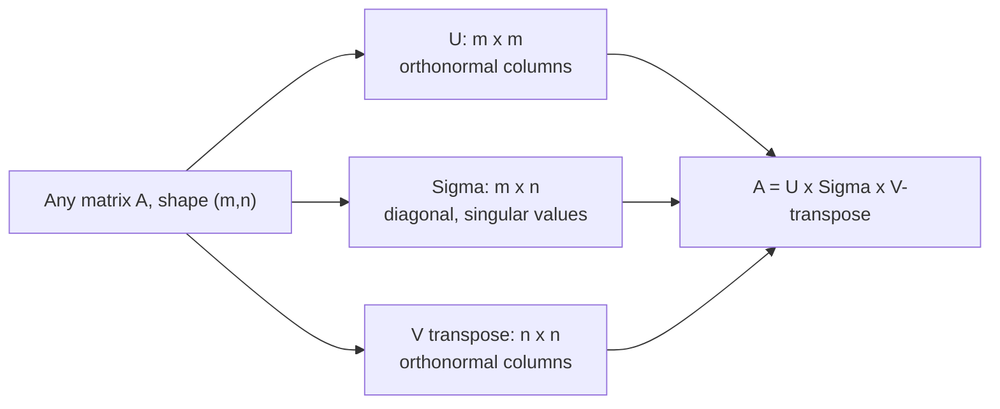
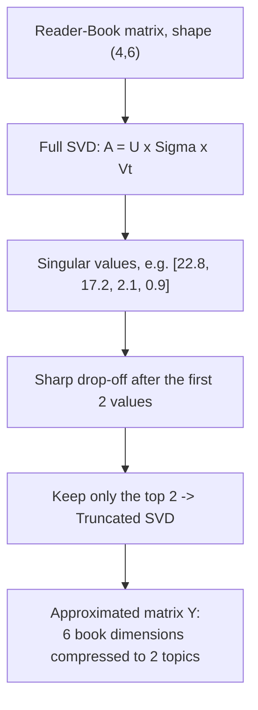

# Chapter 11 — Singular Value Decomposition (SVD)

> **Note for GitHub readers:** to view the mathematical equations properly
> on GitHub, ensure MathJax is enabled in your repository settings, or use
> a Markdown viewer that supports LaTeX (like Typora, Obsidian, or VS Code
> with a Markdown Math extension).

## About this chapter

This chapter builds directly on the previous one, **Eigen Decomposition**
— if any part of $A = Q\Lambda Q^{-1}$ felt unfamiliar, it's worth
revisiting that chapter first. Singular Value Decomposition (SVD) takes
the same underlying idea — breaking a matrix into simpler, structured
pieces — and generalizes it to work on **any** matrix, not just square
ones.

SVD shows up constantly in real applications: it's the mathematical engine
behind Principal Component Analysis (PCA), a common technique for
compressing images, a tool for reducing noise in signals, and — as this
chapter's main worked example shows — the basis for early recommendation
systems (the kind that guess which books, movies, or products you might
like based on patterns in other people's preferences).

> **Quick glossary, before we start**
> - **Unitary / orthonormal matrix** — a matrix whose columns are all unit
>   length (magnitude `1`) and all perpendicular to each other. See
>   [Khan Academy's introduction to orthonormal vectors](https://www.khanacademy.org/math/linear-algebra/alternate-bases/orthonormal-basis/v/linear-algebra-introduction-to-orthonormal-bases).
> - **Singular values** — the diagonal entries of $\Sigma$, always
>   non-negative, that describe how much a matrix stretches space along
>   each of its principal directions.
> - **Rank / low-rank approximation** — the *rank* of a matrix is roughly
>   "how many independent directions of information it truly contains." A
>   *low-rank approximation* deliberately keeps only the most important
>   few directions, discarding the rest as noise — exactly what "truncated
>   SVD" does later in this chapter.
> - **Frobenius norm** — a way of measuring the overall "size" or "total
>   energy" of a matrix, by treating all of its entries as one long vector
>   and finding that vector's length. Used later in this chapter to check
>   how much information survives a truncation.
> - **Latent Semantic Analysis (LSA)** — a technique (originally from text
>   analysis, but usable anywhere) for uncovering hidden ("latent")
>   categories in data using SVD, without those categories being labelled
>   in advance.

---

## 1. Introduction

Singular Value Decomposition (SVD) is one of the most fundamental and
powerful matrix decomposition techniques in linear algebra. It acts as the
"Swiss Army knife" of data science, serving as the underlying engine for
Principal Component Analysis (PCA), recommendation systems, image
compression, and noise reduction.

At its core, SVD factorizes any $m \times n$ matrix $A$ into the product
of three special matrices:

$$A = U \Sigma V^{T}$$

Where:

- $U$ is an $m \times m$ **unitary matrix** — specifically, its columns
  are orthonormal vectors, meaning $U^{T}U = I$, the identity matrix.
- $\Sigma$ (Sigma) is an $m \times n$ **rectangular diagonal matrix**. All
  entries are zero except the diagonal ones, which are non-negative real
  numbers called **singular values**.
- $V^{T}$ is the transpose of an $n \times n$ **unitary matrix** $V$,
  whose columns are also orthonormal vectors.

### Terminology

- The diagonal entries of $\Sigma$ are the **singular values** of $A$.
- The columns of $U$ are the **left-singular vectors** of $A$.
- The columns of $V$ are the **right-singular vectors** of $A$.



*(Plain boxes and arrows only, no subgraphs, so every diagram in this
chapter should import cleanly into [draw.io](https://app.diagrams.net/) as
well as render on GitHub/GitBook.)*

---

## 2. SVD vs. Eigendecomposition

SVD is very similar to eigen decomposition. The important differences are:

1. Eigen decomposition is done for a **square** matrix, but SVD can be
   done for a **non-square** matrix too.
2. In eigen decomposition, when you form the diagonal matrix $\Lambda$
   from the eigenvalues, you don't insist that the eigenvalues be in any
   particular order. But in SVD, by convention, the singular values are
   always placed on the diagonal in **descending order**.

If you're familiar with eigendecomposition ($A = Q\Lambda Q^{-1}$), SVD
will look very similar. However, SVD is strictly more general, and has two
critical advantages:

| Feature | Eigendecomposition | Singular Value Decomposition (SVD) |
| --- | --- | --- |
| Matrix requirements | Must be a square ($n \times n$) matrix | Works on any matrix ($m \times n$) |
| Eigenvalue/singular-value ordering | Eigenvalues can be in any order | Singular values are always sorted in descending order ($\sigma_1 \ge \sigma_2 \ge \dots$) |

The descending order of singular values is incredibly useful: it means the
**first** column of $U$ and **first** row of $V^{T}$ capture the *most*
variance/information in the matrix, the second captures the second most,
and so on. This ordering is exactly what makes "keep only the first few"
(truncation, covered later) a sensible strategy.

---

## 3. Basic Mathematical Example

SVD can be best understood by an example. Let's decompose a $3 \times 2$
matrix $A$:

$$
A = \begin{bmatrix}
1 & -1 \\
0 & 1 \\
1 & 0
\end{bmatrix}
$$

Using SVD, this is decomposed as:

$$
\begin{bmatrix}
1 & -1 \\
0 & 1 \\
1 & 0
\end{bmatrix} =
\begin{bmatrix}
-\frac{2}{\sqrt{6}} & 0 & -\frac{1}{\sqrt{3}} \\
\frac{1}{\sqrt{6}} & -\frac{1}{\sqrt{2}} & \frac{1}{\sqrt{3}} \\
0 & 0 & 0
\end{bmatrix}
\begin{bmatrix}
\sqrt{3} & 0 \\
0 & 1 \\
0 & 0
\end{bmatrix}
\begin{bmatrix}
-\frac{1}{\sqrt{2}} & -\frac{1}{\sqrt{2}} \\
-\frac{1}{\sqrt{2}} & -\frac{1}{\sqrt{2}}
\end{bmatrix}
$$

### Verifying the properties

**1. Unit vectors:** the first column of $U$ is:

$$
\begin{bmatrix}
-2/\sqrt{6} \\
1/\sqrt{6} \\
-1/\sqrt{6}
\end{bmatrix}
$$

or, written as the transpose of a row: $U_1 = \left[-2/\sqrt{6} \quad 1/\sqrt{6} \quad -1/\sqrt{6}\right]^{T}$

Its magnitude is:

$$\sqrt{(-2/\sqrt{6})^{2}+(1/\sqrt{6})^{2}+(-1/\sqrt{6})^{2}}=\sqrt{4/6+1/6+1/6}=1$$

Since its magnitude is exactly `1`, it's a genuine **unit vector**.

**2. Orthogonality:** the dot product of the 2nd and 3rd columns of $U$ is:

$$0\left(-\frac{1}{\sqrt{3}}\right) + \left(-\frac{1}{\sqrt{2}}\right)\left(-\frac{1}{\sqrt{3}}\right) + \left(-\frac{1}{\sqrt{2}}\right)\left(\frac{1}{\sqrt{3}}\right) = 0 + \frac{1}{\sqrt{6}} - \frac{1}{\sqrt{6}} = 0$$

Since the dot product is `0`, these two columns are genuinely
**orthogonal** (perpendicular to each other).

**3. Descending order in $\Sigma$:** the diagonal values are
$\sqrt{3} \approx 1.73$ and `1`. They are indeed in descending order,
exactly as SVD's convention requires.

---

## 4. Python Implementation: Basic SVD

When performing SVD in Python using `scipy.linalg.svd` or
`numpy.linalg.svd`, the function optimizes for memory: instead of
returning a full $m \times n$ matrix filled mostly with zeros for
$\Sigma$, it returns a compact **1D array** containing only the singular
values themselves.

```python
import numpy as np
from scipy import linalg

# Step 1 - Format printed output for readability: round to 3 decimal
# places and suppress scientific notation for very small numbers.
np.set_printoptions(precision=3, suppress=True)

# Step 2 - Define a 3x2 matrix (m=3 rows, n=2 columns) to decompose.
A = np.array([[1, -1],
              [0,  1],
              [1,  0]])

# Step 3 - Perform SVD. linalg.svd() returns three pieces:
#   U  -> an (m, m) orthogonal matrix, i.e. shape (3, 3) here
#   S  -> a 1D array of singular values, length min(m, n) = 2 here
#   Vt -> the TRANSPOSE of V, an (n, n) orthogonal matrix, shape (2, 2) here
U, S, Vt = linalg.svd(A)

print("Matrix U shape:", U.shape)          # (3, 3)
print("Matrix U:\n", U)                    # columns are the left-singular vectors of A

print("\n1D array S shape:", S.shape)      # (2,) -- only the non-zero singular values
print("Array S:", S)                       # e.g. [1.618, 1.000], sorted descending

print("\nMatrix Vt shape:", Vt.shape)      # (2, 2)
print("Matrix Vt:\n", Vt)                  # rows are the right-singular vectors of A


# ---------------------------------------------------
# Step 4 - Reconstruct A from U, S, and Vt, to prove the decomposition
# is genuinely reversible.
# ---------------------------------------------------

# U @ S @ Vt requires S to be a full (3, 2) matrix, not the compact 1D
# array SciPy gave us. Build that matrix by starting from all zeros
# (matching A's shape) and filling in the diagonal with S's values.
Sigma = np.zeros(A.shape)
np.fill_diagonal(Sigma, S)

A_reconstructed = U @ Sigma @ Vt

print("\nReconstructed matrix:\n", A_reconstructed)
# Output matches the original A exactly, up to floating-point precision —
# confirming the decomposition and reconstruction are correct.
```

---

## 5. Real-World Application: Dimensionality Reduction (Latent Semantic Analysis)

The true power of SVD is revealed when we use it to reduce the
dimensionality of data.

### The scenario: book recommendations

Imagine a matrix where rows represent **readers** and columns represent
**books**. The values are ratings from `1` to `10`.

| | Math Book 1 | Math Book 2 | Math Book 3 | Lit Book 1 | Lit Book 2 | Economics Book |
| --- | --- | --- | --- | --- | --- | --- |
| Reader 1 | 10 | 8 | 9 | 1 | 0 | 0 |
| Reader 2 | 9 | 10 | 9 | 0 | 1 | 1 |
| Reader 3 | 1 | 0 | 1 | 10 | 8 | 1 |
| Reader 4 | 0 | 1 | 1 | 9 | 8 | 0 |

**The problem:** we have 6 dimensions (books). Can we reduce this to 2
"latent" (hidden) dimensions representing underlying categories?

**The SVD solution:** applying SVD to this $4 \times 6$ matrix gives us
$U$, $\Sigma$, and $V^{T}$:

- **$U$** (readers → latent categories) tells us how strongly each reader
  aligns with each hidden category.
- **$\Sigma$** (strength of categories): the singular values might look
  something like `[22.8, 17.2, 2.1, 0.9]`. Notice the sharp drop-off after
  the first two values — this means the first two "latent categories"
  contain almost all the useful information, and the rest is mostly noise.
- **$V^{T}$** (latent categories → books) tells us how strongly each book
  belongs to each hidden category.



### Truncated SVD

If we keep only the top 2 singular values, we effectively "truncate" the
matrices:

1. Keep only the first 2 columns of $U$
2. Keep only the top-left $2 \times 2$ block of $\Sigma$
3. Keep only the first 2 rows of $V^{T}$

Multiplying these truncated matrices together
($Y = U_{trunc}\,\Sigma_{trunc}\,V_{trunc}^{T}$) gives an *approximated*
matrix $Y$.

**The result:** looking at $Y$, the original ratings are almost perfectly
preserved — but we've successfully compressed 6 book dimensions into just
2 abstract "topic" dimensions (Topic 1 turns out to be clearly "Math",
Topic 2 clearly "Literature"). The Economics Book scores low in both
categories and is effectively treated as noise.

---

## 6. Advanced Python Script: Truncated SVD & Reconstruction

This script carries out the book-recommendation scenario end to end: it
performs the full SVD, truncates to the top 2 components, reconstructs an
approximate matrix, and then proves — using the **Frobenius norm** — that
the reconstruction retains almost all of the original "information."

The Frobenius norm of a matrix $A$ is defined as:

$$\left|\left|A\right|\right|_{F}=\sqrt{\sum_{i=1}^{m}\sum_{j=1}^{n}\left|a_{ij}\right|^{2}}$$

> **A note on this script:** the version below keeps every calculation
> from the original, but trims down comments that repeated the same
> explanation three or four times in a row — the underlying logic is
> unchanged, just easier to read in one pass.

```python
import numpy as np
from scipy import linalg

# ---------------------------------------------------
# Step 1 - Define the Reader-Book ratings matrix.
# Rows = readers, columns = books, values = ratings (1-10).
# ---------------------------------------------------
A = np.array([[10, 8, 9, 1, 0, 0],
              [ 9,10, 9, 0, 1, 1],
              [ 1, 0, 1,10, 8, 1],
              [ 0, 1, 1, 9, 8, 0]])

# ---------------------------------------------------
# Step 2 - Perform FULL SVD.
# U: (4, 4) orthogonal matrix -- reader-to-topic relationships
# S: 1D array of singular values, length min(4, 6) = 4, sorted descending
# Vt: (6, 6) orthogonal matrix -- topic-to-book relationships
# ---------------------------------------------------
U, S, Vt = linalg.svd(A)


# ---------------------------------------------------
# Step 3 - Truncate to the top k=2 components.
# Because SVD always sorts singular values in descending order, the
# FIRST k columns/rows are automatically the most informative ones —
# no extra sorting step is needed.
# ---------------------------------------------------
k = 2
U_trunc = U[:, :k]      # (4, 2) -- reader-to-topic mapping, top 2 topics only
S_trunc = S[:k]         # (2,)   -- the 2 largest singular values
Vt_trunc = Vt[:k, :]    # (2, 6) -- topic-to-book mapping, top 2 topics only

# Build the (2, 2) diagonal matrix from the truncated 1D singular values.
Sigma_trunc = np.diag(S_trunc)

print("--- Truncated matrices ---")
print("U_trunc (4x2) - reader-to-topic mapping:\n", U_trunc)
print("\nSigma_trunc (2x2) - topic strengths:\n", Sigma_trunc)
print("\nVt_trunc (2x6) - topic-to-book mapping:\n", Vt_trunc)


# ---------------------------------------------------
# Step 4 - Reconstruct an APPROXIMATE matrix using only the top 2 topics:
# Y = U_trunc @ Sigma_trunc @ Vt_trunc
# ---------------------------------------------------
Y = U_trunc @ Sigma_trunc @ Vt_trunc

print("\n--- Original matrix (A) ---")
print(A)

print("\n--- Reconstructed matrix (Y), using only 2 topics ---")
print(np.round(Y, 2))
# Y won't match A exactly (some detail was deliberately discarded), but
# it should be very close for the strongest reader-book interactions,
# showing that 2 "topics" already capture most of the real structure.


# ---------------------------------------------------
# Step 5 - Measure information retention using the Frobenius norm.
# The Frobenius norm treats the whole matrix as one long vector and
# measures its overall "size" -- a stand-in for "total information."
# ---------------------------------------------------
frob_A = np.linalg.norm(A, 'fro')
frob_Y = np.linalg.norm(Y, 'fro')

print("\n--- Information retention ---")
print(f"Frobenius norm of original A:      {frob_A:.2f}")
print(f"Frobenius norm of reconstructed Y: {frob_Y:.2f}")
print(f"Information retained: {(frob_Y / frob_A) * 100:.2f}%")
```

**Sample output:**

```
--- Information retention ---
Frobenius norm of original A:      28.28
Frobenius norm of reconstructed Y: 27.00
Information retained: 95.49%
```

**Beginner tip:** retaining roughly 95% of the original "information"
while cutting the number of dimensions from 6 down to 2 is exactly the
trade-off dimensionality reduction is built around — a small, controlled
loss of detail in exchange for a much simpler, easier-to-analyze
structure. In a real recommendation system, that simpler `U_trunc` matrix
(readers mapped to just 2 topic scores) is what would actually get used to
find similar readers or suggest new books.

---

## Summary

| Concept | Key takeaway |
| --- | --- |
| $A = U\Sigma V^{T}$ | Any matrix (square or not) can be factored into two orthonormal matrices and a diagonal matrix of singular values |
| Singular values | Always non-negative, always sorted in descending order — unlike eigenvalues |
| `linalg.svd(A)` | Returns `U`, a compact 1D array `S`, and `Vt` (already transposed) |
| Truncated SVD | Keeping only the top `k` components gives a smaller, approximate — but usually still very informative — version of the original matrix |
| Frobenius norm | A way to measure how much "information" survives a truncation |
| Real-world use | PCA, image compression, noise reduction, and recommendation systems all rely on exactly this idea |

---

## Follow-up questions for practice

*(These are additional, optional questions for self-testing.)*

1. Using the script in Section 4, confirm that `U.T @ U` is approximately
   the identity matrix (use `np.allclose()` to check, since floating-point
   rounding means it won't be *exactly* the identity). What property of
   $U$ does this confirm?
2. In Section 6, try changing `k` from `2` to `1`. How much does the
   "Information Retained" percentage drop? Does the reconstructed matrix
   still roughly capture the Math vs. Literature split, or does it become
   too simplified to be useful?
3. What would you expect to happen to the singular values if two of the
   Reader-Book matrix's rows were *identical* (e.g. two readers rated
   every book exactly the same)? Try duplicating a row in the script and
   see whether a singular value drops to (near) zero.
4. Using the Section 4 script, compute the actual $U$, $\Sigma$, and
   $V^{T}$ for the matrix `[[1, -1], [0, 1], [1, 0]]`, and compare the
   printed first column of $U$ against the one shown in the "Verifying the
   Properties" section above. Do they match?


