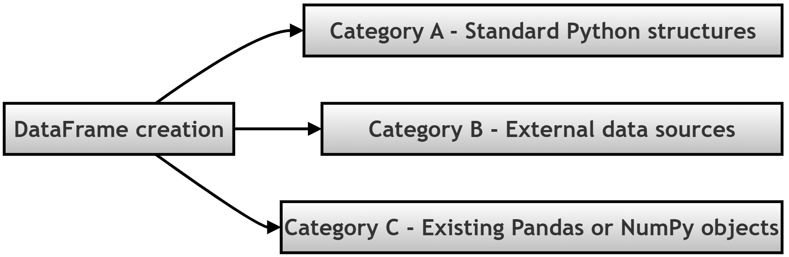

# Chapter 12.20 — How DataFrames Are Created

## What this page covers

This page shows practical ways to create a Pandas `DataFrame`.
`DataFrame` as you know is the two-dimensional, table-like structure that sits at the center of almost all Pandas work (think of it as a spreadsheet: rows and columns, with labels on both). 

Building on the previous chapter page's coverage of `Series` (a single column), this page shows how those columns come together into a full table, and covers the three broad categories every creation method falls into: 
-  typing data directly in Python,
-  loading it from an external source (CSV, Excel, JSON),
-  or building it from Pandas/NumPy objects you already have in memory.

Knowing all three categories matters because real projects use different ones at different stages: you might type out a small `DataFrame` by hand while testing an idea, then switch to loading a genuine CSV file once you're working with real data, and later combine several `Series` you've already cleaned individually into one final table.

**A few terms used throughout, explained simply:**
- **`DataFrame`** — a two-dimensional, labeled data structure — rows and columns, similar to a spreadsheet or a SQL table. ([Pandas docs: `DataFrame`](https://pandas.pydata.org/docs/reference/api/pandas.DataFrame.html))
- **CSV (Comma-Separated Values)** — a simple, widely-used plain-text format for storing tabular data, where each line is a row and commas separate the columns.
- **JSON (JavaScript Object Notation)** — a common, human-readable text format for structured data, widely used by web APIs. ([json.org](https://www.json.org/json-en.html))
- **In-memory file simulation** (`io.StringIO`/`io.BytesIO`) — covered in its own dedicated section below, since it's genuinely useful to understand but easy to find confusing at first glance.

---

## The three categories, at a glance



---

## Category A: From Standard Python Structures

**When you'd use this:** typing out data manually, for learning, testing small logic, or building a quick lookup table — not typically how real, large datasets get loaded.

```python
import pandas as pd

# ------------------------------------------------------------
# Method 1: From a Dictionary of Lists
# USE CASE: The most common manual method. Dictionary KEYS
# automatically become the DataFrame's COLUMN NAMES.
# ------------------------------------------------------------
data_dict = {
    'Name': ['Alice', 'Bob', 'Charlie'],   # 'Name' and 'Age' become column names
    'Age': [25, 30, 35]
}
df1 = pd.DataFrame(data_dict)
print("1. From Dict of Lists:\n", df1)

# ------------------------------------------------------------
# Method 2: From a List of Dictionaries
# USE CASE: Great when your data arrives as individual RECORDS
# (this is exactly the shape data from a JSON API often comes in).
# ------------------------------------------------------------
data_list = [
    {'Name': 'Alice', 'Age': 25},
    {'Name': 'Bob', 'Age': 30},
    {'Name': 'Charlie', 'Age': 35}
]
df2 = pd.DataFrame(data_list)
print("\n2. From List of Dicts:\n", df2)

# ------------------------------------------------------------
# Method 3: From a List of Lists (with explicit column names)
# IMPORTANT: with a plain list of lists, Pandas has no way to know
# what to call the columns -- without the 'columns' argument, it
# would default to plain numbers (0, 1, 2...), which is rarely
# what you actually want.
# ------------------------------------------------------------
matrix_data = [
    ['Alice', 25],
    ['Bob', 30],
    ['Charlie', 35]
]
df3 = pd.DataFrame(matrix_data, columns=['Name', 'Age'])   # Column names supplied explicitly
print("\n3. From List of Lists:\n", df3)
```

---

## Category B: From External Data Sources (I/O)

**When you'd use this:** loading data that already exists *outside* Python — a CSV file, an Excel spreadsheet, a database export, or a web API's response. This is how the overwhelming majority of real-world data analysis actually begins.

### Understanding `io.StringIO` and `io.BytesIO` first

Before looking at the script, it helps to understand a small trick it uses. Normally, a function like `pd.read_csv()` expects to read a real, physical file sitting on your computer's hard drive: writing `pd.read_csv('data.csv')` makes Python stop, search your hard drive for a file named `data.csv`, and open it — raising `FileNotFoundError` if it isn't there.

The `io` module (part of Python's standard library) provides two tools that let you skip needing a real file on disk at all: they take a plain Python string or bytes value and wrap it up so it *behaves* exactly like a real file, entirely inside your computer's memory (RAM).

- **`io.StringIO`** — used for plain text data (like a CSV), since it works directly with regular Python strings.
- **`io.BytesIO`** — used for more complex, binary formats (like `.xlsx` Excel files), since Excel files aren't plain text at all — they're actually compressed archives containing multiple internal files. `BytesIO` simulates the raw binary data such a file would contain.

**A practical note:** in real projects, you will almost always use genuine file paths rather than these in-memory tools — they're used here purely so this script can be copied, pasted, and run immediately, without you needing to first create any actual files on your own computer.


### The script

```python
import pandas as pd
import io

# ------------------------------------------------------------
# Method 4: From a CSV (Comma-Separated Values) File
# USE CASE: The single most common way to load data across the
# entire data-analysis industry.
# ------------------------------------------------------------
csv_data = "Name,Age\nAlice,25\nBob,30"

# Step 1: io.StringIO wraps the plain string above so read_csv()
# can treat it exactly as if it were reading a real .csv file.
df4 = pd.read_csv(io.StringIO(csv_data))
print("4. From CSV (.read_csv):\n", df4)

# ------------------------------------------------------------
# Method 5: From an Excel File
# USE CASE: Extremely common in corporate/business environments.
# NOTE: reading .xlsx files requires the 'openpyxl' library --
# install it via: pip install openpyxl
# ------------------------------------------------------------
print("\n5. From Excel (.read_excel):")
try:
    # Step A: Build a genuine, valid Excel file, but entirely in
    # memory rather than on disk, using io.BytesIO as the "container."
    excel_buffer = io.BytesIO()
    temp_df = pd.DataFrame({'Name': ['Alice', 'Bob'], 'Age': [25, 30]})
    temp_df.to_excel(excel_buffer, index=False, engine='openpyxl')

    # Step B: Move the buffer's internal cursor back to the very
    # beginning -- writing to it moved the cursor to the END, and
    # reading needs to start from position 0 (see the earlier
    # chapter page on seek() for the general idea behind this).
    excel_buffer.seek(0)

    # Step C: Read the "file" back, exactly as if it were a real
    # .xlsx file on disk.
    df5 = pd.read_excel(excel_buffer, engine='openpyxl')
    print(df5)
except ImportError:
    print("  [Skipped] Please install openpyxl to run this: pip install openpyxl")

# ------------------------------------------------------------
# Method 6: From JSON Data
# USE CASE: The standard format for web APIs and many NoSQL
# databases (like MongoDB).
# ------------------------------------------------------------
json_data = '[{"Name": "Alice", "Age": 25}, {"Name": "Bob", "Age": 30}]'
df6 = pd.read_json(json_data)
print("\n6. From JSON (.read_json):\n", df6)
```

---

## Category C: From Existing Pandas/NumPy Objects

**When you'd use this:** you're building a `DataFrame` from pieces you've already constructed within Python — separate `Series` you've cleaned individually, a NumPy array from some numerical processing, or growing a table row by row inside a loop.

```python
import pandas as pd
import numpy as np

# ------------------------------------------------------------
# Method 7: From a Dictionary of Series
# USE CASE: When you've already cleaned separate columns
# individually (each as its own Series) and now want to combine
# them into a single table.
# ------------------------------------------------------------
names = pd.Series(['Alice', 'Bob', 'Charlie'])
ages = pd.Series([25, 30, 35])
df7 = pd.DataFrame({'Name': names, 'Age': ages})
print("7. From Dict of Series:\n", df7)

# ------------------------------------------------------------
# Method 8: From a 2D NumPy Array
# USE CASE: Common after heavy mathematical or machine-learning
# preprocessing, before converting the result over to Pandas for
# further analysis or display.
# ------------------------------------------------------------
numpy_matrix = np.array([[1, 2, 3], [4, 5, 6], [7, 8, 9]])
df8 = pd.DataFrame(numpy_matrix, columns=['Col_A', 'Col_B', 'Col_C'])
print("\n8. From NumPy Array:\n", df8)

# ------------------------------------------------------------
# Method 9: Creating an Empty DataFrame, then Adding Rows Later
# USE CASE: When you know the STRUCTURE you'll eventually need,
# but plan to fill it in row by row -- for example, inside a loop.
# ------------------------------------------------------------
df9 = pd.DataFrame(columns=['Name', 'Score'])

# Step 1: pd.concat() joins two DataFrames together -- here, the
# (currently empty) df9 with a brand-new one-row DataFrame.
# Step 2: ignore_index=True prevents index-numbering conflicts
# between the two pieces being joined.
df9 = pd.concat([df9, pd.DataFrame([{'Name': 'Alice', 'Score': 95}])], ignore_index=True)
print("\n9. Empty DF + Appending:\n", df9)
```

---

## The complete combined script (all nine methods)

```python
import pandas as pd
import numpy as np
import io

# ============================================================
# CATEGORY A: FROM STANDARD PYTHON STRUCTURES
# ============================================================
print("CATEGORY A: FROM STANDARD PYTHON STRUCTURES")

data_dict = {'Name': ['Alice', 'Bob', 'Charlie'], 'Age': [25, 30, 35]}
df1 = pd.DataFrame(data_dict)
print("1. From Dict of Lists:\n", df1)

data_list = [
    {'Name': 'Alice', 'Age': 25},
    {'Name': 'Bob', 'Age': 30},
    {'Name': 'Charlie', 'Age': 35}
]
df2 = pd.DataFrame(data_list)
print("\n2. From List of Dicts:\n", df2)

matrix_data = [['Alice', 25], ['Bob', 30], ['Charlie', 35]]
df3 = pd.DataFrame(matrix_data, columns=['Name', 'Age'])
print("\n3. From List of Lists:\n", df3)


# ============================================================
# CATEGORY B: FROM EXTERNAL DATA SOURCES (I/O)
# ============================================================
print("\n" + "="*60)
print("CATEGORY B: FROM EXTERNAL DATA SOURCES (I/O)")
print("="*60)

csv_data = "Name,Age\nAlice,25\nBob,30"
df4 = pd.read_csv(io.StringIO(csv_data))
print("4. From CSV (.read_csv):\n", df4)

print("\n5. From Excel (.read_excel):")
try:
    excel_buffer = io.BytesIO()
    temp_df = pd.DataFrame({'Name': ['Alice', 'Bob'], 'Age': [25, 30]})
    temp_df.to_excel(excel_buffer, index=False, engine='openpyxl')
    excel_buffer.seek(0)
    df5 = pd.read_excel(excel_buffer, engine='openpyxl')
    print(df5)
except ImportError:
    print("  [Skipped] Please install openpyxl to run this: pip install openpyxl")

json_data = '[{"Name": "Alice", "Age": 25}, {"Name": "Bob", "Age": 30}]'
df6 = pd.read_json(json_data)
print("\n6. From JSON (.read_json):\n", df6)


# ============================================================
# CATEGORY C: FROM EXISTING PANDAS / NUMPY OBJECTS
# ============================================================
print("\n" + "="*60)
print("CATEGORY C: FROM EXISTING PANDAS / NUMPY OBJECTS")
print("="*60)

names = pd.Series(['Alice', 'Bob', 'Charlie'])
ages = pd.Series([25, 30, 35])
df7 = pd.DataFrame({'Name': names, 'Age': ages})
print("7. From Dict of Series:\n", df7)

numpy_matrix = np.array([[1, 2, 3], [4, 5, 6], [7, 8, 9]])
df8 = pd.DataFrame(numpy_matrix, columns=['Col_A', 'Col_B', 'Col_C'])
print("\n8. From NumPy Array:\n", df8)

df9 = pd.DataFrame(columns=['Name', 'Score'])
df9 = pd.concat([df9, pd.DataFrame([{'Name': 'Alice', 'Score': 95}])], ignore_index=True)
print("\n9. Empty DF + Appending:\n", df9)
```

---

## Choosing the right method

| If your data is... | Use... |
|---|---|
| Small, hand-typed for testing/learning | Category A — dictionary of lists, list of dicts, or list of lists |
| Coming from a CSV file | `pd.read_csv()` |
| Coming from an Excel spreadsheet | `pd.read_excel()` (requires `openpyxl`) |
| Coming from a web API or NoSQL source | `pd.read_json()` |
| Already split across several cleaned `Series` | Category C — dictionary of Series |
| The result of NumPy calculations | Category C — directly from a NumPy array |
| Going to be built up incrementally, row by row | Category C — start empty, then `pd.concat()` new rows in |

## Quick recap

- Every way of creating a `DataFrame` falls into one of three categories: **typed directly in Python**, **loaded from an external source**, or **built from existing Pandas/NumPy objects**.
- **`io.StringIO` and `io.BytesIO`** let you simulate a real file entirely in memory — genuinely useful for runnable examples and quick tests, but something you'll rarely need in a real project, where you'll typically pass a genuine file path instead.
- **Dictionary keys become column names** (Method 1) — one of the most common and intuitive ways to build a small `DataFrame` by hand.
- **A list of lists needs explicit column names** (Method 3) — without the `columns` argument, Pandas has no way to know what to call each column, and will default to plain numbers instead.
- **`pd.read_csv()`, `pd.read_excel()`, and `pd.read_json()`** are the three workhorse functions for real-world data loading — of these, `read_csv()` is by far the most commonly used across the industry.


