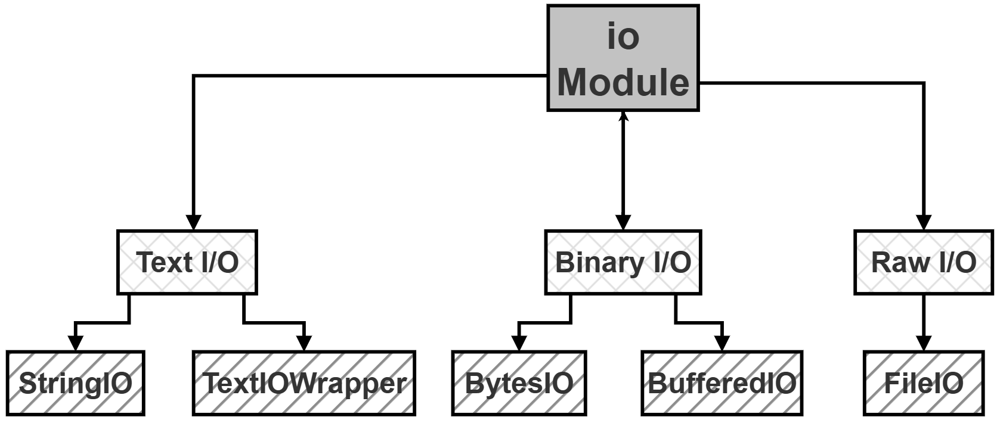
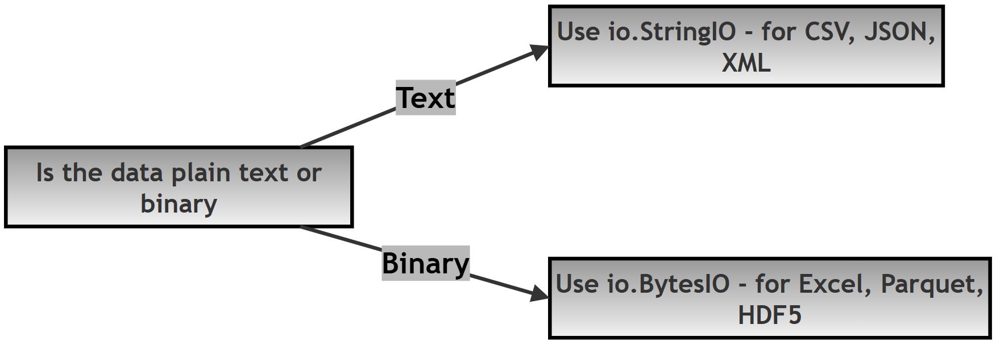
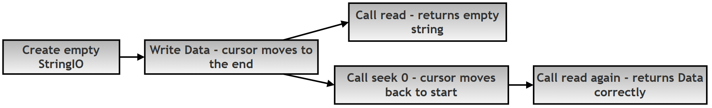

# Chapter 12.30 — Research Topic: Memory-Based I/O in Python Data Analysis

## What this page covers

This page is a research-level deep dive into the exact mechanism briefly introduced on the previous chapter page: how `io.StringIO` and `io.BytesIO` let Pandas read data that only exists in your computer's memory, without ever touching a real file on disk. 

Where the previous page used these tools as a convenient shortcut for runnable examples, this page investigates them properly — the difference between the two classes, their key methods, and a specific, genuinely common bug (the "initialization trap," covered in Section 6) that catches many people the first time they use these tools for real.


**A few terms used throughout, explained simply:**
- **File-like object** — something that isn't a real file on disk, but behaves like one as far as Python's reading/writing functions are concerned — you can `.read()` from it, `.write()` to it, and move its cursor around, exactly like a real file. ([Python docs: `io` module](https://docs.python.org/3/library/io.html))
- **Buffer** — a temporary holding area for data. Here, it specifically refers to the in-memory "container" that `StringIO`/`BytesIO` provide.
- **Cursor / pointer** — the current read/write position inside a file (or file-like object) — covered in more depth in the earlier chapter page on `seek()`.

---

## Research Question


> How does Python's `io` module facilitate the transformation of raw data streams into Pandas DataFrames without physical file storage, and what are the performance implications of this memory-resident approach in modern data pipelines?

### A follow-up question worth exploring

Section 6 below demonstrates a specific bug — reading an empty result because the cursor wasn't reset. As a follow-up exercise: **write a small function that takes a `StringIO` buffer and safely reads it back, regardless of where the buffer's cursor currently happens to be** (hint: call `.seek(0)` unconditionally at the start of your function, before reading). Then test it by passing in both a freshly-created buffer and one that's already been written to and left with its cursor at the end. This turns the "always remember to seek(0)" rule from a habit you have to remember everywhere into a single, reusable, foolproof helper.

---

## 1. Overview of the `io` Module

The `io` module is Python's built-in toolkit for handling input and output — reading and writing data, generally. Most beginners think of "I/O" purely in terms of real files sitting on a hard drive, but the `io` module also lets you treat an ordinary string or a chunk of bytes as if it were a file, entirely in memory. This turns out to be genuinely useful in data work, especially when data arrives from a web API, or is generated dynamically by your own program, rather than starting out as a file on disk.

**Visual hierarchy of the `io` module:**



---

## 2. Core Comparison: `StringIO` vs. `BytesIO`

When working with Pandas, picking the right one of these two matters: `pd.read_csv()` generally expects text, while `pd.read_excel()` or `pd.read_parquet()` need binary data instead.

| Feature | `io.StringIO` | `io.BytesIO` |
|---|---|---|
| Data type | Text (a regular Python string) | Binary (a `bytes` object) |
| Common formats | CSV, JSON, XML | Excel (`.xlsx`), Parquet, HDF5 |
| What it expects | A `str` | A `bytes` object (written with a `b` prefix, e.g. `b'...'`) |
| Typical use case | Parsing a small CSV snippet, or a text-based API response | Processing a compressed or specially-formatted binary file |



---

## 3. `io.StringIO`

`io.StringIO` is a text-based buffer — it stores data as a regular Python string, which makes it a natural fit for `pd.read_csv()` and `pd.read_json()`.

### A. Looking at its signature

```python
# Simplified signature:
class io.StringIO(initial_value='', newline='\n')
```

| Parameter | Type | What it does |
|---|---|---|
| `initial_value` | `str` | Sets the buffer's starting content. If you provide a value here, the cursor is automatically placed at the very beginning of that string. |
| `newline` | `str` | Controls how line endings are handled — genuinely useful when working with data created on different operating systems (Windows uses `\r\n`; Linux/macOS use `\n`). |

### B. How the cursor behaves

Once a `StringIO` object is created with some starting text, it behaves like a file that's just been freshly opened:

- **Writing** to it moves the cursor forward, past whatever you just wrote.
- **Reading** (e.g. when Pandas calls `.read()`) consumes data starting from wherever the cursor currently is, all the way to the end.

---

## 4. `io.BytesIO`

`io.BytesIO` handles binary data instead of text. In Pandas, this is the required format for more complex file types — Excel (`.xlsx`), Parquet, or zipped archives.

### A. Looking at its signature

```python
# Simplified signature:
class io.BytesIO(initial_bytes=b'')
```

| Parameter | Type | What it does |
|---|---|---|
| `initial_bytes` | `bytes` | Sets the buffer's starting binary content. Notice the `b` prefix (e.g. `b'data'`) — unlike text, raw binary data has no "encoding" involved at this level; it's simply a stream of numbers. |

### B. Why `.read()` matters here specifically

While `StringIO` has a convenient `.getvalue()` method (see Section 5), `BytesIO` is often handed off to more complex parsing engines — like the `openpyxl` engine Pandas uses for Excel files. These engines typically don't want the *entire* value all at once; they want to read the file piece by piece, which is exactly what `.read()` (called repeatedly, or with a specific size) is designed for — this approach uses less memory at any one moment than grabbing everything at once.

---

## 5. Comparing the key access methods

Beginners often mix up `.getvalue()` and `.read()` — this single distinction is genuinely the most common source of bugs in memory-based data pipelines.

| Method | What it does | Effect on the cursor |
|---|---|---|
| `.getvalue()` | Returns the *entire* content of the buffer, no matter where the cursor currently is | Does **not** move the cursor at all |
| `.read(size)` | Returns data starting from the cursor's *current* position | Moves the cursor forward, to the end of whatever was just read |
| `.seek(0)` | Resets the cursor back to the very beginning of the buffer | Essential before handing an already-used buffer to a new function |

---

## 6. The Initialization "Trap"

There's a specific, genuinely easy-to-hit bug worth understanding clearly.

**Case 1 — initialized WITH data:**

```python
import io

buf = io.StringIO("Data")
print(buf.read())   # -> "Data"
# The cursor started at index 0 (the very beginning), because the
# text was supplied directly when the buffer was created.
```

**Case 2 — initialized EMPTY, then written to:**

```python
import io

buf = io.StringIO()
buf.write("Data")

# The cursor is now at the END of the buffer (index 4, right after
# the 4 characters of "Data") -- NOT at the beginning.
print(repr(buf.read()))   # -> '' (an empty string!)
# read() starts from the CURRENT cursor position and reads to the
# end -- but the cursor is already AT the end, so there's nothing
# left to read.
```

**The fix:**

```python
import io

buf = io.StringIO()
buf.write("Data")

buf.seek(0)   # Reset the cursor back to the beginning...
print(buf.read())   # -> "Data"  (...now this works correctly)
```




**Rule to remember:** always call `.seek(0)` on a buffer you've just written to, before handing it to a Pandas reading function — otherwise, Pandas will see what looks like an empty file.

---

## 7. Summary Table

| Step | Pandas task | Recommended class | Cursor action required |
|---|---|---|---|
| 1 | Load CSV from a string received from an API | `StringIO(data)` | None needed — the cursor starts at 0 |
| 2 | Create a CSV string from a DataFrame | `StringIO()` | Use `.getvalue()` instead of `.read()` — cursor position doesn't matter for `.getvalue()` |
| 3 | Load Excel data from a binary stream | `BytesIO(data)` | None needed — the cursor starts at 0 |
| 4 | Re-read the same buffer a second time | Either | `.seek(0)` is required between reads |

---

## Script

```python
import pandas as pd
import io

# Step 1: Create an in-memory text buffer -- a "virtual file" that
# only ever exists in memory, never written to disk at all.
buffer = io.StringIO()

# Step 2: Populate the buffer with some CSV-formatted text. This is a
# multi-line string simulating what a real .csv file's contents would
# look like: the first line holds the column headers, the rest are rows.
my_csv = """id,name
101,Alice
102,Bob
103,Charlie"""

buffer.write(my_csv)
# IMPORTANT: after this line, the cursor sits at the very END of the
# buffer -- exactly the "initialization trap" described in Section 6.

# Step 3: THE FIX -- rewind the cursor back to the beginning.
# Without this line, pd.read_csv() would see what looks like an
# EMPTY file, since it reads starting from wherever the cursor is.
buffer.seek(0)   # Comment this out to see an EmptyDataError, or an empty DataFrame.

# Step 4: Load the buffer into Pandas, wrapped in a try/except in
# case the buffer genuinely turns out to be empty (e.g. if Step 3
# were skipped, or the original data was empty to begin with).
try:
    df = pd.read_csv(buffer)   # Reads from the CURRENT cursor position.
    print("Successfully read from memory:")
    print(df)
except pd.errors.EmptyDataError:
    print("Error: The buffer was empty or the pointer was at the end!")
```

---

## Quick recap

- The `io` module lets you treat a plain string or a chunk of bytes as if it were a real file — genuinely useful for API responses and dynamically-generated data, without ever needing to save anything to disk first.
- **`StringIO` is for text** (CSV, JSON, XML); **`BytesIO` is for binary data** (Excel, Parquet, and other non-text formats) — matching the right one to the right Pandas function (`read_csv` vs. `read_excel`) matters.
- **`.getvalue()` never moves the cursor and always returns everything**; **`.read()`** starts from wherever the cursor currently is, and moves it forward as it goes — mixing these two up, or forgetting where the cursor is, is the single most common source of memory-buffer bugs.
- **The initialization trap is genuinely easy to hit**: writing to a freshly-created buffer leaves its cursor at the *end*, not the beginning — always call `.seek(0)` before reading a buffer you've just written to.
- As the follow-up question suggests, wrapping the "seek before reading" rule inside a small, reusable helper function is a good habit — it turns a rule you have to remember everywhere into something you only need to get right once.


