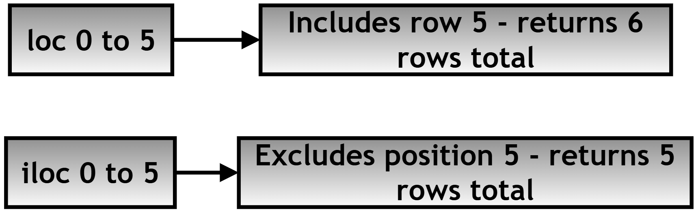
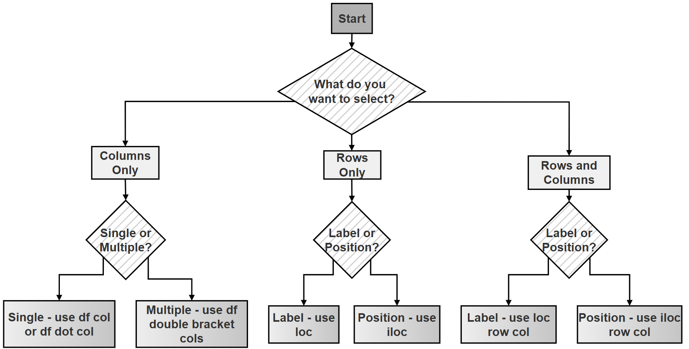

# Chapter 12.40 — Research Project: Indexing and Selection in Pandas Using the Palmer Penguins Dataset

## What this page covers

This page is a research project that puts everything from the last three chapter pages into practice on a real, genuine dataset — the **Palmer Penguins dataset**, a well-known, freely available collection of measurements from real penguins, commonly used to teach data analysis. The focus here is **indexing and selection**: the different ways Pandas lets you pull out exactly the rows and columns you actually want from a `DataFrame` — bracket notation, dot notation, `.loc[]`, and `.iloc[]` — and, crucially, when each one is the right tool for the job.

Getting comfortable with these four approaches is genuinely foundational — almost every piece of real data analysis work involves selecting some subset of a larger table before doing anything else with it, and choosing the wrong indexing method for a given situation is one of the most common sources of confusing bugs for people newer to Pandas.

**A few terms used throughout, explained simply:**
- **Label-based indexing** — selecting data using the actual index/column *names* (e.g. the row labeled `0`, or the column named `'species'`).
- **Position-based indexing** — selecting data using plain integer *positions*, counting from 0, regardless of what the labels actually are.
- **Slicing** — selecting a continuous range (e.g. "rows 10 through 20"), rather than one single item.

---

## Research Question

*(Kept exactly as set in the assignment.)*

> How can different indexing and selection techniques in Pandas (`[]`, `.`, `.loc[]`, `.iloc[]`, and slicing) be used to efficiently extract, filter, and manipulate structured data, and what are their comparative advantages, limitations, and appropriate use cases when working with real-world datasets such as the Palmer Penguins dataset?

### Task / Project Brief

You are required to:
1. Load and explore the Palmer Penguins dataset
2. Perform column selection using bracket `[]` and dot `.` notation
3. Perform row selection using `.loc[]` (label-based) and `.iloc[]` (position-based)
4. Perform combined slicing of rows and columns
5. Compare all methods in terms of syntax, flexibility, and limitations
6. Handle possible errors/exceptions
7. Document your findings with tables, code with comments, and flowcharts

### A follow-up question worth exploring

The comparison table in Step 3 notes that dot notation "may conflict with `pd.DataFrame` methods." As a follow-up exercise: **imagine a penguins dataset that had a column literally named `count` or `mean`** (both of which are also real `DataFrame` *methods*, as covered on the earlier "Methods of Series" chapter page). Try to predict what `df.count` would actually give you in that situation — the real method, or the column? (Hint: it would be the *method*, not your column — this is exactly the kind of silent, confusing bug dot notation can cause, and why the earlier comparison table marks it as "Risky in some cases.") This is a strong practical reason to prefer bracket notation, `df['count']`, whenever there's any doubt.

---

## Model Solution

### Step 1: Import Libraries and Load the Dataset

```python
import pandas as pd
import seaborn as sns

# Step 1: Load the Palmer Penguins dataset. Seaborn conveniently
# bundles several well-known example datasets, including this one,
# so no separate download or file is needed.
df = sns.load_dataset("penguins")
```

### Step 2: Understanding the Data Structure

Before selecting anything, it's worth getting a feel for the shape and health of the data first.

**2(A) — `df.info()`: a structural summary**

```python
# df.info() gives a concise summary: how many non-missing entries
# each column has, each column's data type, and total memory usage.
# This is the first thing worth checking on any new dataset, since it
# immediately reveals missing values and unexpected data types.
print("df.info():->", df.info())
```
**Output**

```text
<class 'pandas.core.frame.DataFrame'>
RangeIndex: 344 entries, 0 to 343
Data columns (total 7 columns):
 #   Column             Non-Null Count  Dtype
---  ------             --------------  -----
 0   species            344 non-null    object
 1   island             344 non-null    object
 2   bill_length_mm     342 non-null    float64
 3   bill_depth_mm      342 non-null    float64
 4   flipper_length_mm  342 non-null    float64
 5   body_mass_g        342 non-null    float64
 6   sex                333 non-null    object
dtypes: float64(4), object(3)
memory usage: 18.9+ KB
```

Notice the pattern immediately: several numeric columns show `342 non-null` out of `344` total rows — meaning 2 rows are missing those measurements — and `sex` is missing even more (`333` out of `344`). This is exactly the kind of thing `.info()` is designed to surface at a glance. (One small detail worth knowing: `.info()` *prints* its summary directly and returns `None` — that's why the code above shows `None` printed right after the summary table.)

**2(B) — `df.describe()`: a statistical summary**

```python
# df.describe() calculates count, mean, standard deviation, min, max,
# and the quartiles for every NUMERIC column, all in one call --
# see the earlier "Methods of Series" chapter page for what each of
# these statistics individually means.
print("df.describe():->\n", df.describe())
```
**Output**

```text
       bill_length_mm  bill_depth_mm  flipper_length_mm  body_mass_g
count      342.000000     342.000000         342.000000    342.000000
mean        43.921930      17.151754         200.915205   4201.754386
std          5.459584       1.974603          14.061714    801.954380
min         32.100000      13.100000         172.000000   2700.000000
25%         39.225000      15.600000         190.000000   3550.000000
50%         44.450000      17.300000         197.000000   4050.000000
75%         48.100000      18.700000         213.000000   4750.000000
max         59.600000      21.500000         231.000000   6300.000000
```

**2(C) and 2(D) — column names and row labels**

```python
print("df.columns:->", df.columns)
# -> Index(['species', 'island', 'bill_length_mm', 'bill_depth_mm',
#           'flipper_length_mm', 'body_mass_g', 'sex'], dtype='object')

print("df.index:->", df.index)
# -> RangeIndex(start=0, stop=344, step=1)
# This tells us the rows are labeled with simple, sequential integers
# (0, 1, 2, ... 343) -- this matters later, since it means .loc[] and
# .iloc[] will happen to behave very similarly on THIS particular
# dataset (though not necessarily on datasets with different, custom
# row labels).
```

---

### Step 3: Selecting Columns — Bracket `[]` vs. Dot `.` Notation

**3(A) — Bracket `[]` notation**

```python
# Bracket notation selects one or more columns using square brackets.
# A single column returns a Series; a LIST of column names returns a
# smaller DataFrame containing just those columns.

# Step 1: Select a single column.
species = df['species']
print("species.head()->\n", species.head())
```
**Output**

```text
species.head()->
0    Adelie
1    Adelie
2    Adelie
3    Adelie
4    Adelie
Name: species, dtype: object
```

```python
# Step 2: Select multiple columns at once, using a LIST inside the brackets.
subset = df[['species', 'bill_length_mm', 'body_mass_g']]
print("subset.head()->\n", subset.head())
```
**Output**

```text
subset.head()->
  species  bill_length_mm  body_mass_g
0  Adelie            39.1       3750.0
1  Adelie            39.5       3800.0
2  Adelie            40.3       3250.0
3  Adelie             NaN          NaN
4  Adelie            36.7       3450.0
```

Notice row 3 shows `NaN` (missing data) for both numeric columns — a real, genuine gap in the dataset, exactly the kind of thing `.info()` in Step 2(A) warned us about in advance.

**Advantages of bracket notation:**
- Works with *any* column name, even ones containing spaces or special characters
- Flexible — handles both single and multiple column selection

**3(B) — Dot `.` notation**

```python
# Dot notation accesses a column as if it were an ATTRIBUTE of the
# DataFrame -- but only works if the column name is a valid Python
# identifier: no spaces, no special characters, and it can't start
# with a number.
species_dot = df.species
print("species_dot.head()->\n", species_dot.head())
```
**Output**

```text
species_dot.head()->
0    Adelie
1    Adelie
2    Adelie
3    Adelie
4    Adelie
Name: species, dtype: object
```

**Advantages of dot notation:** more concise and easier to read for simple, valid column names.

**Limitations of dot notation:**
- The column name must be a valid Python identifier
- Cannot be used to select multiple columns at once
- Can silently conflict with genuine `DataFrame` methods that happen to share a column's name (see the follow-up question above)

**Comparison table: `[]` vs. `.`**

| Feature | `[]` Notation | `.` Notation |
|---|---|---|
| Multiple columns | Yes | No |
| Special characters/spaces in names | Supported | Not supported |
| Safe usage | Recommended | Risky in some cases |
| Readability | Moderate | High (for simple names) |

---

### Step 4: Selecting Rows — `.loc[]` vs. `.iloc[]`

**4(A) — `.loc[]` (label-based indexing)**

`.loc[]` selects rows and columns using their actual *labels* — `df.loc[row_label, column_label]`.

```python
# Step 1: Select a single row by its index label.
row_0 = df.loc[0]
print("row_0->\n", row_0)
```
**Output**

```text
row_0->
species                 Adelie
island               Torgersen
bill_length_mm            39.1
bill_depth_mm             18.7
flipper_length_mm        181.0
body_mass_g             3750.0
sex                       Male
Name: 0, dtype: object
```

```python
# Step 2: Select a RANGE of rows by label. IMPORTANT: with .loc[],
# slicing INCLUDES the end label -- 0:5 gives you rows 0, 1, 2, 3, 4, AND 5.
rows_0_5 = df.loc[0:5]
print("rows_0_5->\n", rows_0_5)
```
**Output**

```text
rows_0_5->
  species     island  bill_length_mm  bill_depth_mm  flipper_length_mm  body_mass_g     sex
0  Adelie  Torgersen            39.1           18.7              181.0       3750.0    Male
1  Adelie  Torgersen            39.5           17.4              186.0       3800.0  Female
2  Adelie  Torgersen            40.3           18.0              195.0       3250.0  Female
3  Adelie  Torgersen             NaN            NaN                NaN          NaN     NaN
4  Adelie  Torgersen            36.7           19.3              193.0       3450.0  Female
5  Adelie  Torgersen            39.3           20.6              190.0       3650.0    Male
```

```python
# Step 3: Combine row AND column selection in one call.
subset_loc = df.loc[0:5, ['species', 'body_mass_g']]
print("subset_loc->\n", subset_loc)
```
**Output**

```text
subset_loc->
  species  body_mass_g
0  Adelie       3750.0
1  Adelie       3800.0
2  Adelie       3250.0
3  Adelie          NaN
4  Adelie       3450.0
5  Adelie       3650.0
```

**4(B) — `.iloc[]` (position-based indexing)**

`.iloc[]` selects rows and columns using plain integer *positions*, starting from 0 — completely independent of whatever the actual labels happen to be.

```python
# Step 1: Select the first row, by POSITION (not by label).
row_0_iloc = df.iloc[0]
print("row_0_iloc->\n", row_0_iloc)
```
**Output**

```text
row_0_iloc->
species                 Adelie
island               Torgersen
bill_length_mm            39.1
bill_depth_mm             18.7
flipper_length_mm        181.0
body_mass_g             3750.0
sex                       Male
Name: 0, dtype: object
```

```python
# Step 2: Select a range of rows by POSITION. IMPORTANT: with .iloc[],
# slicing EXCLUDES the end position -- 0:5 gives you positions 0
# through 4 ONLY (five rows total), not position 5.
rows_iloc = df.iloc[0:5]
print("rows_iloc->\n", rows_iloc)
```
**Output**

```text
rows_iloc->
  species     island  bill_length_mm  bill_depth_mm  flipper_length_mm  body_mass_g     sex
0  Adelie  Torgersen            39.1           18.7              181.0       3750.0    Male
1  Adelie  Torgersen            39.5           17.4              186.0       3800.0  Female
2  Adelie  Torgersen            40.3           18.0              195.0       3250.0  Female
3  Adelie  Torgersen             NaN            NaN                NaN          NaN     NaN
4  Adelie  Torgersen            36.7           19.3              193.0       3450.0  Female
```

```python
# Step 3: Combine row AND column selection, both by POSITION.
subset_iloc = df.iloc[0:5, 0:3]
print("subset_iloc->\n", subset_iloc)
```
**Output**

```text
subset_iloc->
  species     island  bill_length_mm
0  Adelie  Torgersen            39.1
1  Adelie  Torgersen            39.5
2  Adelie  Torgersen            40.3
3  Adelie  Torgersen             NaN
4  Adelie  Torgersen            36.7
```

**The single most important thing to notice across Steps 4(A) and 4(B):** `df.loc[0:5]` returned **6** rows (0 through 5, inclusive), while `df.iloc[0:5]` returned only **5** rows (0 through 4). This is *the* core practical difference between the two — and a very common source of off-by-one confusion for anyone new to Pandas.





**Comparison table: `.loc[]` vs. `.iloc[]`**

| Feature | `.loc[]` | `.iloc[]` |
|---|---|---|
| Basis | Labels (index names) | Integer positions |
| End of a slice | Included | Excluded |
| Flexibility | High | High |
| Boolean indexing (filtering with a condition) | Supported directly | Not directly supported |

---

### Step 5: Slicing Rows and Columns Simultaneously

**5(A) — Using `.loc[]` for slicing by labels**

```python
slice_loc = df.loc[10:20, ['species', 'island', 'body_mass_g']]
print("slice_loc->\n", slice_loc)
```
**Output**

```text
slice_loc->
   species     island  body_mass_g
10  Adelie  Torgersen       3750.0
11  Adelie  Torgersen       3800.0
12  Adelie  Torgersen       3250.0
13  Adelie  Torgersen          NaN
14  Adelie  Torgersen       3450.0
15  Adelie  Torgersen       3650.0
16  Adelie  Torgersen       3800.0
17  Adelie  Torgersen       3700.0
18  Adelie  Torgersen       3600.0
19  Adelie  Torgersen       3500.0
20  Adelie  Torgersen       3400.0
```
Notice this correctly includes row 20, since `.loc[]` slicing is inclusive of the end label.

**5(B) — Using `.iloc[]` for slicing by integer position**

```python
slice_iloc = df.iloc[10:20, 0:3]   # Rows at positions 10-19, columns at positions 0-2
print("slice_iloc->\n", slice_iloc)
```
**Output**

```text
slice_iloc->
    species     island  bill_length_mm
10  Adelie  Torgersen            37.8
11  Adelie  Torgersen            37.8
12  Adelie  Torgersen            41.1
13  Adelie  Torgersen            38.6
14  Adelie  Torgersen            34.6
15  Adelie  Torgersen            36.6
16  Adelie  Torgersen            38.7
17  Adelie  Torgersen            42.5
18  Adelie  Torgersen            34.4
19  Adelie  Torgersen            46.0
```
Notice this correctly stops at row 19 (position 20 is excluded), and only 3 columns appear (positions 0, 1, 2), since `.iloc[]` column slicing follows the same "end excluded" rule as row slicing.

---

## Choosing the right approach


**Table: When to use what**

| Scenario | Recommended method |
|---|---|
| Selecting one column | `df['col']` |
| Selecting multiple columns | `df[['col1', 'col2']]` |
| Filtering by row labels | `.loc[]` |
| Filtering by integer position | `.iloc[]` |
| Complex, combined row-and-column slicing | `.loc[]` / `.iloc[]` |
| Safe, production-level code | `[]` for columns, `.loc[]` for label-based row access |

### Flowchart

The following diagram illustrates the overall indexing decision process:



---

## Quick recap

- **`df.info()` and `df.describe()`** are the right first calls on any new dataset — they immediately surface missing values, data types, and basic statistics, before you select or filter anything.
- **Bracket notation (`df['col']`, `df[['col1', 'col2']]`) is the safest, most flexible way to select columns** — it works with any column name and supports selecting multiple columns at once; dot notation is more concise but comes with real limitations and risks, as the follow-up question above demonstrates.
- **`.loc[]` uses labels and includes the end of a slice; `.iloc[]` uses integer positions and excludes the end of a slice** — this single distinction (demonstrated directly in Step 4 with `df.loc[0:5]` returning 6 rows vs. `df.iloc[0:5]` returning 5) is the most important thing to internalize from this whole page.
- **Both `.loc[]` and `.iloc[]` support combining row and column selection in one call** — `df.loc[rows, columns]` and `df.iloc[rows, columns]` — making them the right tool whenever you need more than a simple column selection.
- On a dataset like this one, where the row labels happen to just be sequential integers (`0, 1, 2, ...`), `.loc[]` and `.iloc[]` can look deceptively similar in places — but they follow genuinely different rules (label vs. position, inclusive vs. exclusive), and that difference becomes very visible the moment a dataset has custom, non-sequential row labels.


