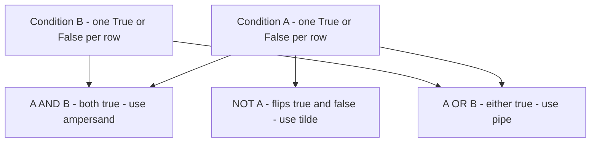
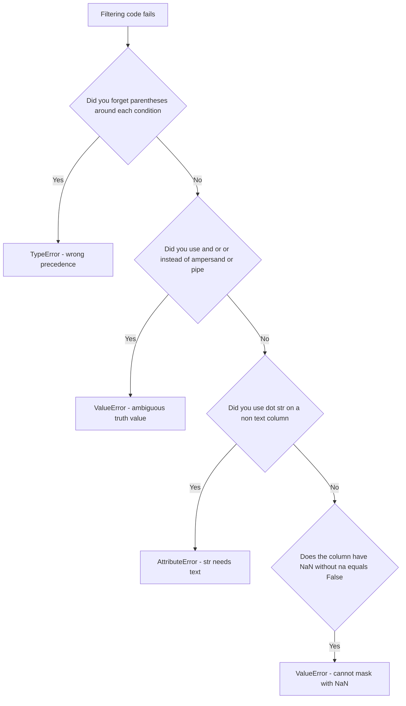
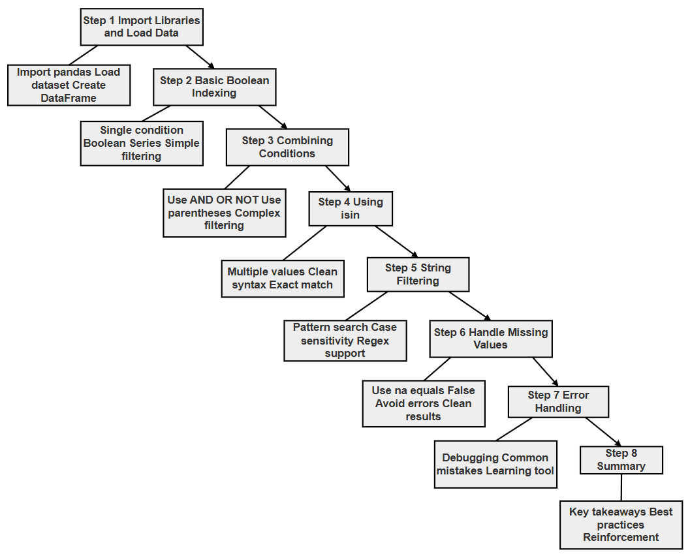

# Chapter 12.50 — Project: Conditional Filtering in Pandas

## What this page covers

This page builds directly on the previous chapter page's coverage of indexing and selection, moving from "pick specific rows/columns by label or position" to a different, equally important question: **how do you pick rows based on the actual *values* they contain?** This is called **conditional filtering**, and it's arguably the single most-used skill in everyday data analysis — "show me only the penguins heavier than 4kg," "show me only rows from a certain island," "show me only male penguins" — all of these are conditional filters.

This page covers four separate filtering tools, in increasing order of specialization: basic Boolean indexing, combining multiple conditions with logical operators, `.isin()` for checking membership in a list of values, and `.str.contains()` for text-pattern filtering — plus a dedicated look at the errors each one can cause, since these are genuinely some of the most common early Pandas mistakes.

**A few terms used throughout, explained simply:**
- **Boolean indexing** — using a `True`/`False` value for every row to decide whether that row is kept or dropped.
- **Vectorized operator** — an operator (like `&`, `|`, `~`) that works on an *entire column at once*, comparing every row simultaneously, rather than one value at a time. This is why Pandas requires `&`/`|`/`~` instead of Python's ordinary `and`/`or`/`not` for this purpose (explained further in Step 2 below).
- **Regex (regular expression)** — a specialized mini-language for describing text patterns, usable with `.str.contains()` for more advanced matching than a plain substring search. ([Python docs: `re` — Regular expression operations](https://docs.python.org/3/library/re.html))

---

## Research Question


> How can conditional filtering techniques in Pandas (Boolean indexing, logical operators, `.isin()`, and string-based filtering using `.str.contains()`) be used to efficiently extract meaningful subsets of data from a real-world dataset such as the Palmer Penguins dataset, and what are their comparative advantages, limitations, and common sources of error?

### Project Objective

Using the Palmer Penguins dataset, demonstrate: Boolean indexing; logical operators (`&`, `|`, `~`); the `.isin()` method; `.str.contains()` for string filtering; and common errors and how to handle them.

### Task / Project Description

You are required to: load and explore the Palmer Penguins dataset; apply basic Boolean filtering; combine multiple conditions using `&` (AND), `|` (OR), and `~` (NOT); use `.isin()` for filtering multiple values; use `.str.contains()` for string-based filtering; identify and handle common errors; and present your findings using tables, commented code, and flowcharts.

### A follow-up question worth exploring

Step 6 below lists four common errors, each triggered by a different mistake. As a follow-up exercise: **before reading Step 6's explanations, try to predict which of the four errors would happen first if you accidentally made *two* of these mistakes in the same line of code** — for example, using `and` instead of `&`, *and* forgetting parentheses, in the same filter. Python and Pandas process an expression in a specific order (parentheses and operator precedence first, then the actual filtering), so one of the two mistakes will always surface before the other gets a chance to. This is a good way to build intuition for *why* the recommended best practices (always parenthesize, always use `&`/`|`/`~`) exist together as a pair, not as two unrelated rules.

---

## Solution

### Step 0: Import Libraries and Load the Dataset

**Why:** this step sets up the working environment — nothing else can happen without the data loaded first.

**How:** import `pandas` and `seaborn`, then load the dataset.

```python
print("\n STEP 0. IMPORT LIBRARIES AND LOAD DATASET")
import pandas as pd
import seaborn as sns

# Step 1: Load the Palmer Penguins dataset via seaborn's built-in
# example datasets -- no separate file or download needed.
df = sns.load_dataset("penguins")

print("\n--- FIRST 5 ROWS ---")
print("df.head()->", df.head())   # A quick first look at the data's shape and columns
```
```text
 STEP 0. IMPORT LIBRARIES AND LOAD DATASET

--- FIRST 5 ROWS ---
df.head()->   species     island  bill_length_mm  bill_depth_mm  flipper_length_mm  body_mass_g     sex
0  Adelie  Torgersen            39.1           18.7              181.0       3750.0    Male
1  Adelie  Torgersen            39.5           17.4              186.0       3800.0  Female
2  Adelie  Torgersen            40.3           18.0              195.0       3250.0  Female
3  Adelie  Torgersen             NaN            NaN                NaN          NaN     NaN
4  Adelie  Torgersen            36.7           19.3              193.0       3450.0  Female
```

**Good practice:** use the standard aliases (`pd`, `sns`); avoid reloading the dataset repeatedly or modifying the original `df` unintentionally.

---

### Step 1: Basic Boolean Indexing

**Why:** Boolean indexing is the foundation every other filtering technique on this page builds on.

**How:** applying a condition to a column produces a `True`/`False` value for every row; wrapping that inside `df[...]` keeps only the `True` rows.

```python
print("\n STEP 1. BASIC BOOLEAN FILTERING")

# Step 1: df['body_mass_g'] > 4000 produces a Series of True/False
# values, one per row. Step 2: wrapping it in df[...] keeps only the
# rows where that value is True.
heavy_penguins = df[df['body_mass_g'] > 4000]

print("\nPenguins with body_mass_g > 4000:")
print("heavy_penguins.head()->", heavy_penguins.head())
```
```text
 STEP 1. BASIC BOOLEAN FILTERING

Penguins with body_mass_g > 4000:
heavy_penguins.head()->    species     island  bill_length_mm  bill_depth_mm  flipper_length_mm  body_mass_g   sex
7   Adelie  Torgersen            39.2           19.6              195.0       4675.0  Male
9   Adelie  Torgersen            42.0           20.2              190.0       4250.0   NaN
14  Adelie  Torgersen            34.6           21.1              198.0       4400.0  Male
17  Adelie  Torgersen            42.5           20.7              197.0       4500.0  Male
19  Adelie  Torgersen            46.0           21.5              194.0       4200.0  Male
```

**Limitation:** on its own, basic Boolean indexing can't combine multiple conditions — that's what Step 2 is for.

---

### Step 2: Combining Conditions

**Why:** real filtering almost always needs more than one condition at once — "heavy AND Adelie," "Adelie OR Chinstrap," "NOT Adelie."

**How:** using `&` for AND, `|` for OR, and `~` for NOT — each individual condition wrapped in its own parentheses.

```python
print("\n STEP 2. COMBINING CONDITIONS")

# AND: both conditions must be true.
cond_and = df[(df['body_mass_g'] > 4000) & (df['species'] == 'Adelie')]
print("\nAdelie penguins with body_mass_g > 4000:")
print("cond_and.head()->", cond_and.head())

# OR: at least one condition must be true.
cond_or = df[(df['species'] == 'Adelie') | (df['species'] == 'Chinstrap')]
print("\nAdelie OR Chinstrap penguins:")
print("cond_or.head()->", cond_or.head())

# NOT: flips True/False -- keeps everything that does NOT match.
cond_not = df[~(df['species'] == 'Adelie')]
print("\nPenguins that are NOT Adelie:")
print("cond_not.head()->", cond_not.head())
```
```text
 STEP 2. COMBINING CONDITIONS

Adelie penguins with body_mass_g > 4000:
cond_and.head()->    species     island  bill_length_mm  bill_depth_mm  flipper_length_mm  body_mass_g   sex
7   Adelie  Torgersen            39.2           19.6              195.0       4675.0  Male
9   Adelie  Torgersen            42.0           20.2              190.0       4250.0   NaN
14  Adelie  Torgersen            34.6           21.1              198.0       4400.0  Male
17  Adelie  Torgersen            42.5           20.7              197.0       4500.0  Male
19  Adelie  Torgersen            46.0           21.5              194.0       4200.0  Male

Adelie OR Chinstrap penguins:
cond_or.head()->   species     island  bill_length_mm  bill_depth_mm  flipper_length_mm  body_mass_g     sex
0  Adelie  Torgersen            39.1           18.7              181.0       3750.0    Male
1  Adelie  Torgersen            39.5           17.4              186.0       3800.0  Female
2  Adelie  Torgersen            40.3           18.0              195.0       3250.0  Female
3  Adelie  Torgersen             NaN            NaN                NaN          NaN     NaN
4  Adelie  Torgersen            36.7           19.3              193.0       3450.0  Female

Penguins that are NOT Adelie:
cond_not.head()->        species island  bill_length_mm  bill_depth_mm  flipper_length_mm  body_mass_g     sex
152  Chinstrap  Dream            46.5           17.9              192.0       3500.0  Female
153  Chinstrap  Dream            50.0           19.5              196.0       3900.0    Male
154  Chinstrap  Dream            51.3           19.2              193.0       3650.0    Male
155  Chinstrap  Dream            45.4           18.7              188.0       3525.0  Female
156  Chinstrap  Dream            52.7           19.8              197.0       3725.0    Male
```

**Why `&`/`|`/`~` instead of `and`/`or`/`not`?** Python's built-in `and`/`or`/`not` expect a *single* `True` or `False` value — but `df['species'] == 'Adelie'` produces an entire *Series* of hundreds of `True`/`False` values, one per row, not just one. Pandas's `&`, `|`, and `~` are specifically designed to compare two Series *element by element* (a "vectorized" operation, mentioned in the glossary above), which is exactly what's needed here.



*(This diagram uses plain `graph TD` syntax with simple boxes and arrows only — no subgraphs, no styled/labeled edges, no special characters in labels — so it should paste cleanly into draw.io via Extras → Edit Diagram.)*

**Important:** always wrap each individual condition in its own parentheses — skipping this is one of the most common sources of errors, covered directly in Step 6.

---

### Step 3: Using `.isin()`

**Why:** filtering against several specific values (e.g. "Adelie or Chinstrap") using repeated `|` conditions gets clunky fast — `.isin()` is the clean, readable alternative.

**How:** `df['column'].isin(list_of_values)`.

```python
print("\n STEP 3. USING .isin() ================")

# .isin() checks, for every row, whether that row's value appears
# ANYWHERE in the given list -- much cleaner than chaining several
# '==' conditions together with '|'.
species_filter = df[df['species'].isin(['Adelie', 'Chinstrap'])]

print("\nPenguins belonging to Adelie or Chinstrap:")
print("species_filter.head()->", species_filter.head())
```
```text
 STEP 3. USING .isin() ================

Penguins belonging to Adelie or Chinstrap:
species_filter.head()->   species     island  bill_length_mm  bill_depth_mm  flipper_length_mm  body_mass_g     sex
0  Adelie  Torgersen            39.1           18.7              181.0       3750.0    Male
1  Adelie  Torgersen            39.5           17.4              186.0       3800.0  Female
2  Adelie  Torgersen            40.3           18.0              195.0       3250.0  Female
3  Adelie  Torgersen             NaN            NaN                NaN          NaN     NaN
4  Adelie  Torgersen            36.7           19.3              193.0       3450.0  Female
```

**Limitation:** `.isin()` only checks for *exact* matches — it can't do partial or pattern-based matching (that's what Step 4 is for).

---

### Step 4: String Filtering Using `.str.contains()`

**Why:** sometimes you need to filter based on text *patterns* — a substring appearing somewhere inside a value — rather than an exact match.

**How:** `df['column'].str.contains(pattern)`, going through the `.str` accessor (see the earlier "Methods of Series" chapter page for why this accessor is required).

```python
print("\n STEP 4. STRING FILTERING ================")

# Step 1: Basic substring search -- case-SENSITIVE by default.
dream_island = df[df['island'].str.contains('Dream')]
print("\nPenguins from Dream island:")
print("dream_island.head()->", dream_island.head())

# Step 2: case=False makes the search case-INSENSITIVE, matching
# 'Dream', 'dream', 'DREAM', etc. all the same way.
dream_case_insensitive = df[df['island'].str.contains('dream', case=False)]
print("\nCase-insensitive filtering:")
print("dream_case_insensitive.head()->", dream_case_insensitive.head())
```

**Key features:** supports full regex patterns (not just plain substrings), and is case-sensitive by default. **Limitation:** it can genuinely fail on columns containing missing values, unless handled explicitly — covered next, in Step 5.

---

### Step 5: Handling Missing Values in String Operations

**Why:** real datasets contain missing values, and `.str.contains()` can break — or behave unexpectedly — if they're not accounted for.

**How:** pass `na=False` to `.str.contains()`, explicitly telling it to treat any missing value as "does not match," rather than leaving it ambiguous.

```python
print("\n STEP 5. HANDLING NaN IN STRING FILTERING")

# na=False means: "if a row's value is missing (NaN), treat this
# condition as False for that row" -- i.e., exclude it cleanly,
# rather than leaving an ambiguous NaN in the resulting mask.
safe_filter = df[df['sex'].str.contains('male', case=False, na=False)]

print("\nFiltering 'male' safely (ignoring NaN):")
print("safe_filter.head()->", safe_filter.head())
```
```text
 STEP 5. HANDLING NaN IN STRING FILTERING

Filtering 'male' safely (ignoring NaN):
safe_filter.head()->   species     island  bill_length_mm  bill_depth_mm  flipper_length_mm  body_mass_g     sex
0  Adelie  Torgersen            39.1           18.7              181.0       3750.0    Male
1  Adelie  Torgersen            39.5           17.4              186.0       3800.0  Female
2  Adelie  Torgersen            40.3           18.0              195.0       3250.0  Female
4  Adelie  Torgersen            36.7           19.3              193.0       3450.0  Female
5  Adelie  Torgersen            39.3           20.6              190.0       3650.0    Male
```

Notice row 3 (which had a missing `sex` value, as seen back in Step 0's output) is correctly and cleanly excluded here, rather than causing an error.

---

### Step 6: Understanding Common Errors

**Why:** recognizing these specific mistakes in your own code is far faster than debugging them from scratch each time.

```python
# ERROR 1: Missing parentheses around each individual condition.
# df[df['body_mass_g'] > 4000 & df['species'] == 'Adelie']
#
# Because Python evaluates '&' BEFORE '>' and '==' (an operator
# precedence rule), this doesn't even compare what you think it's
# comparing -- Python tries to compute "4000 & df['species']" FIRST,
# which raises a TypeError, since a plain number and a text column
# can't be combined with '&' at all.

# ERROR 2: Using 'and' instead of '&'.
# df[(df['body_mass_g'] > 4000) and (df['species'] == 'Adelie')]
#
# Python's built-in 'and' expects a single True/False value, but each
# side here is an entire Series of many True/False values -- Pandas
# raises: ValueError: The truth value of a Series is ambiguous.

# ERROR 3: .str.contains() on a column that isn't text.
# df[df['body_mass_g'].str.contains('4000')]
#
# 'body_mass_g' holds numbers, not strings -- the .str accessor
# requires genuine text data, so this raises: AttributeError:
# Can only use .str accessor with string values!

# ERROR 4: Missing na=False when the column contains NaN.
# df[df['sex'].str.contains('male')]
#
# Without na=False, rows with a missing 'sex' value produce NaN
# (rather than True or False) in the result -- and Pandas cannot use
# a mask containing NaN to filter rows, raising: ValueError: Cannot
# mask with non-boolean array containing NA / NaN values.
```

**Corrected error-type summary:**

| # | Mistake | What actually goes wrong | Error raised |
|---|---|---|---|
| 1 | Missing parentheses around conditions | Operator precedence makes Python compute the wrong thing first | `TypeError` |
| 2 | Using `and`/`or` instead of `&`/`\|` | Python's `and`/`or` can't handle an entire Series at once | `ValueError` |
| 3 | Using `.str.contains()` on a non-text column | The `.str` accessor requires genuine text data | `AttributeError` |
| 4 | Forgetting `na=False` on a column with missing values | A `NaN` in the filtering mask can't be interpreted as True/False | `ValueError` |



---

### Step 7: Summary

```python
print("""
KEY LEARNINGS:

1. Boolean indexing filters rows using True/False conditions
2. Use & (AND), | (OR), ~ (NOT) for combining conditions
3. Use .isin() for filtering multiple values
4. Use .str.contains() for string filtering
5. Handle missing values using na=False
6. Always use parentheses in conditions

BEST PRACTICE:
Use clear and well-structured conditions for readability and correctness
""")
```

---

## Flowchart

The following diagram (from the book's own resources) shows the full sequence of steps in this project:



---

## Quick recap

- **Boolean indexing (`df[condition]`) is the foundation of all filtering in Pandas** — every technique on this page ultimately produces (or is built on top of) a Series of `True`/`False` values, one per row.
- **`&`, `|`, and `~` are required instead of `and`, `or`, `not`** specifically because Pandas conditions operate on entire columns of many values at once, not a single value — Python's built-in logical keywords simply aren't built for that.
- **`.isin()` is the clean way to check against several exact values**; **`.str.contains()` is for text *patterns*, including partial matches and full regex** — pick based on whether you need an exact match or a pattern match.
- **Always pair `.str.contains()` with `na=False`** whenever the column might contain missing values, to avoid the `ValueError` that comes from trying to filter using a mask containing `NaN`.
- **The four errors in Step 6 each come from a specific, recognizable mistake** — missing parentheses, using `and`/`or`, using `.str` on non-text data, or forgetting `na=False` — learning to recognize each one's distinctive error message will make debugging your own filtering code much faster.


