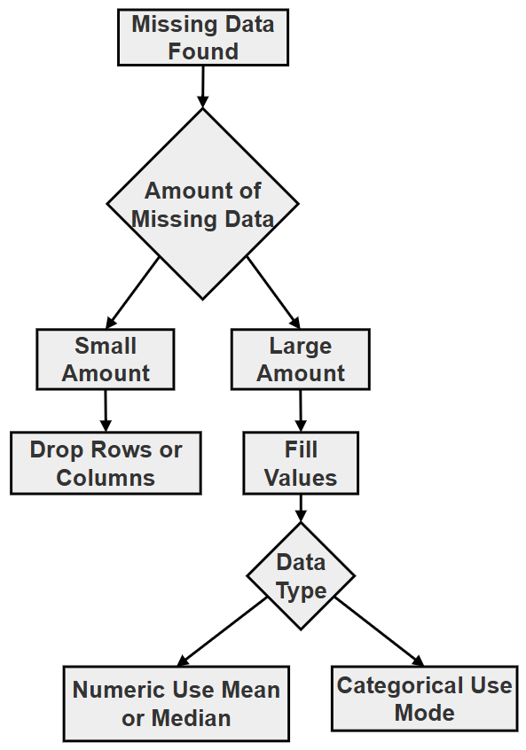
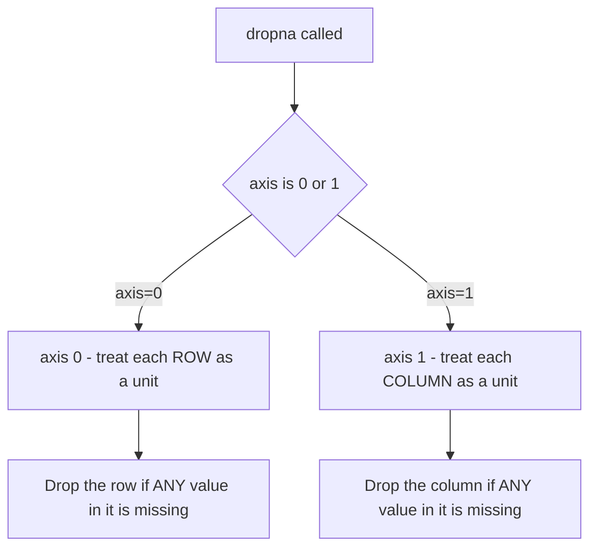
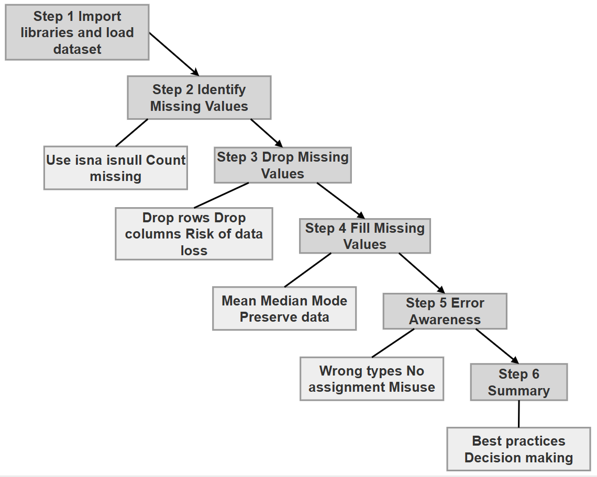
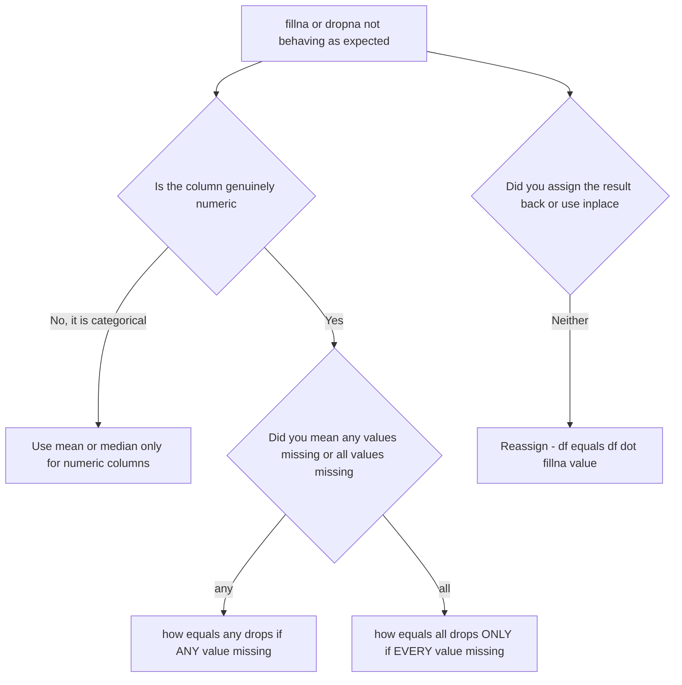

# Chapter 12.60 — Project: Handling Missing Values in Pandas Using the Palmer Penguins Dataset

## What this page covers

This page tackles one of the most universal problems in real-world data work: **missing values**. The previous two chapter pages assumed the Palmer Penguins data was ready to select and filter — this page steps back and asks how to actually detect, understand, and deal with the gaps that are already sitting in that same dataset (you may have noticed row 3 showing `NaN` values throughout the earlier pages — this page explains exactly how to handle rows like that properly).

There are really only two fundamental choices once you've found missing data: **drop it**, or **fill it in with something reasonable** (called *imputation*). Neither choice is free of consequences — dropping data can introduce bias or throw away useful information, and filling data in means putting in a value that wasn't actually observed. This page walks through both approaches, plus the specific mistakes beginners most commonly make with each. Every step below follows the same structure — **why** the step matters, **how** it's done, what **to do** and **not to do**, the relevant **methods and their signatures**, the step's **limitations**, and its overall **role** in the project — so you can follow the same logical checklist for any data-cleaning task you tackle in the future, not just this one.

**A few terms used throughout, explained simply:**
- **`NaN`** — "Not a Number," Pandas's standard placeholder for a missing or unknown value.
- **Imputation** — filling in a missing value with an estimated one (like the average of the rest of the column), rather than leaving it blank or removing it entirely. ([Wikipedia: Imputation (statistics)](https://en.wikipedia.org/wiki/Imputation_(statistics)))
- **Bias** — a systematic skew in your results, caused (in this context) by which rows happened to get dropped or how missing values were filled in, rather than reflecting the real underlying data.
- **Method chaining** — calling one method directly on the result of another, in a single line (e.g. `df.isna().sum()`), rather than storing an intermediate result in its own variable first.

---

## Research Question

> How can missing data in a real-world dataset such as the Palmer Penguins dataset be identified, analyzed, and handled using Pandas techniques like `.isna()`, `.dropna()`, and `.fillna()`, and what are the conceptual and practical trade-offs between dropping and imputing missing values?

### Task / Project Description

You are required to: identify missing values in the dataset; quantify and analyze missing data; apply strategies to handle it (dropping, and filling/imputing); compare different filling strategies (mean, median, mode); understand when to use each method; and document your findings with code, comments, tables, and flowcharts.

### How to handle missing data, conceptually

Real-world data is never perfect. When you encounter missing or incorrect values, you generally have two options:

- **Drop** the row or column containing the missing/wrong data.
- **Fill** the missing data with some value — what you fill in with depends on the data itself: the **mean** for numeric data without extreme outliers, the **median** for numeric data that's skewed, or the **mode** for categorical (text/category) data.

Dropping data has real consequences: dropping *columns* reduces the number of "features" available in your dataset; dropping *rows* can introduce **bias**, if the rows you happen to lose aren't a fair, random sample of the whole dataset.



### A follow-up question worth exploring

Step 3(B) below shows that dropping *columns* with any missing value removes `bill_length_mm`, `bill_depth_mm`, `flipper_length_mm`, `body_mass_g`, and `sex` — leaving only `species` and `island`. As a follow-up exercise: **is this actually a good idea for the Palmer Penguins dataset?** Given that only 2–11 rows out of 344 are affected per column (see Step 2(B)'s counts), consider: would dropping the *rows* (Step 3(A), losing only 11 rows out of 344) have been a far less damaging choice than dropping the *columns* (Step 3(B), losing 5 of your 7 total columns, including almost every numeric measurement in the dataset)? This is exactly the kind of judgment call the "small vs. large" flowchart above is meant to guide.

---

## 1. Important Methods, at a Glance

| Method | What it does | Returns |
|---|---|---|
| `.isna()` | Detects missing values | A Boolean DataFrame (`True` = missing) |
| `.isnull()` | Identical to `.isna()` | A Boolean DataFrame |
| `.dropna(axis=0)` | Drops **rows** containing any missing value | A new DataFrame |
| `.dropna(axis=1)` | Drops **columns** containing any missing value | A new DataFrame |
| `.fillna(value)` | Replaces missing values with a given value | A new DataFrame/Series |

### Understanding `.dropna(axis=0)` — dropping rows

Running `df.dropna()` with no arguments is exactly the same as `df.dropna(axis=0, how='any')`:
- `axis=0` → operate on **rows**
- `how='any'` → if **any** column in a given row is missing, that *entire* row is dropped

The row is treated as a single unit — if any part of it is incomplete, the whole thing goes. In a real dataset like Palmer Penguins, many rows have at least one missing value, so it's worth being deliberate about using this rather than reaching for it automatically.

### Understanding `.dropna(axis=1)` — dropping columns

Running `df.dropna(axis=1)` is equivalent to `df.dropna(axis=1, how='any')`:
- `axis=1` → operate on **columns**
- `how='any'` → if **any** row in a given column is missing, that *entire* column is dropped

This is genuinely risky on a dataset like this one: since almost every column has *at least one* missing value somewhere, using this without thinking can remove most of your dataset's actual content — as Step 3(B) below demonstrates directly.



*(This diagram uses plain `graph TD` syntax with simple boxes and arrows only — no subgraphs, no styled/labeled edges, no special characters in labels — so it should paste cleanly into draw.io via Extras → Edit Diagram.)*

---

## 2. Conceptual Understanding

**Identifying missing values:**

| Method | Description | Output |
|---|---|---|
| `.isna()` | Detect missing values | Boolean DataFrame |
| `.isnull()` | Identical to `.isna()` | Boolean DataFrame |
| `.sum()` | Count missing values (usually chained after `.isna()`) | Series |

**Dropping vs. filling:**

| Aspect | Dropping (`dropna`) | Filling (`fillna`) |
|---|---|---|
| Data loss | High | Low |
| Simplicity | Easy | Moderate |
| Bias risk | Can be low, if the missing values are genuinely random | Possible, if the fill value doesn't reflect reality well |
| Good fit for | A small number of missing values | A larger number of missing values, where dropping would lose too much |

**Imputation techniques:**

| Method | Suitable for | Advantage | Limitation |
|---|---|---|---|
| Mean | Numeric data | Simple to compute | Distorted by outliers (extreme values) |
| Median | Numeric data | Robust to outliers | Ignores the overall shape of the distribution |
| Mode | Categorical data | Works for text/category values | There can be more than one equally common value |

---

## The Script, in Six Steps

The full six-step flow is shown below (from the book's own resources):



---

### STEP 1: Import Libraries and Load the Dataset

#### Why this step is done

This step prepares the environment for data analysis. Before performing any operation on data, the required libraries must be loaded and the dataset must be brought into a Pandas DataFrame. Without this step, no further data inspection, cleaning, or analysis is possible.

#### How it is done

- The `pandas` library is imported for data manipulation.
- The `seaborn` library is used to load the Palmer Penguins dataset.
- The dataset is stored in a DataFrame (`df`).

#### What to do

- Use standard aliases: `import pandas as pd` and `import seaborn as sns`.
- Load the dataset once and reuse it — don't reload it inside a loop or repeatedly further down the script.
- Display initial rows using `.head()`.
- Check the overall size using `.shape` before doing anything else.

#### What not to do

- Avoid reloading the dataset multiple times.
- Avoid modifying the original dataset without creating a `.copy()` first (this becomes especially important starting in Step 4).
- Avoid skipping the initial inspection — jumping straight into cleaning without first looking at `.shape` and `.head()` is how missing-data problems get discovered too late.

#### Important Features / Sub-steps

- Import libraries
- Load the dataset
- Store it in a DataFrame
- Perform an initial inspection (`.head()`, `.shape`)

#### Methods / Attributes

**`sns.load_dataset(name)`**
```python
df = sns.load_dataset("penguins")
```
- **Input:** Dataset name (string)
- **Output:** Pandas DataFrame
- **Use:** Loads one of Seaborn's built-in example datasets

**`df.head(n=5)`**
```python
df.head()
```
- **Input:** Number of rows (optional, defaults to 5)
- **Output:** The first `n` rows
- **Use:** A quick visual sanity check of the data

**`df.shape`**
```python
df.shape
```
- **Output:** A tuple `(rows, columns)`
- **Use:** Understanding the overall size of the dataset at a glance

#### Limitations

- `sns.load_dataset()` may require internet access in some environments (it downloads the dataset the first time it's used).
- `.head()` shows only a small sample — it can easily miss problems that only appear elsewhere in the data.
- This initial inspection alone doesn't reveal deeper issues like missing values — that's exactly what Step 2 is for.

#### Role of Step 1

> "The first step in any data analysis task is to load the dataset and understand its basic structure, as this forms the foundation for all subsequent operations."

#### Script for Step 1

```python
print("\n STEP 1. IMPORT LIBRARIES AND LOAD DATASET")

import pandas as pd
import seaborn as sns

# Step 1: Load the Palmer Penguins dataset -- species, island, bill
# length/depth, flipper length, body mass, and sex for 344 penguins.
df = sns.load_dataset("penguins")

print("\n--- FIRST 5 ROWS OF ORIGINAL DATAFRAME ---")
print(df.shape)          # Step 2: check the overall size FIRST.
print("df.head()->", df.head())   # Step 3: a quick visual sanity check.
```
```text
STEP 1. IMPORT LIBRARIES AND LOAD DATASET

--- FIRST 5 ROWS OF ORIGINAL DATAFRAME ---
(344, 7)
df.head()->   species     island  bill_length_mm  bill_depth_mm  flipper_length_mm  body_mass_g     sex
0  Adelie  Torgersen            39.1           18.7              181.0       3750.0    Male
1  Adelie  Torgersen            39.5           17.4              186.0       3800.0  Female
2  Adelie  Torgersen            40.3           18.0              195.0       3250.0  Female
3  Adelie  Torgersen             NaN            NaN                NaN          NaN     NaN
4  Adelie  Torgersen            36.7           19.3              193.0       3450.0  Female
```

Notice `df.shape` returns `(344, 7)`: 344 rows and 7 columns — and row 3 already shows several `NaN` values, which is exactly what Step 2 investigates properly.

---

### STEP 2: Identifying Missing Values

#### Why this step is done

Before cleaning data, it is essential to **detect and quantify** missing values. Without this step, any cleaning strategy would be uninformed, and potentially harmful — you can't make a good decision about dropping vs. filling if you don't yet know how much data is actually missing, or where.

#### How it is done

- `.isna()` (or its identical twin, `.isnull()`) scans the whole DataFrame and marks every cell as `True` (missing) or `False` (present).
- Chaining `.sum()` onto that result adds up the `True` values in each column, giving an exact count of missing values per column in a single line.

#### What to do

- Use `.head()` after `.isna()` to avoid flooding your screen with a full Boolean DataFrame on large datasets.
- Always run `.isna().sum()` before deciding on a drop/fill strategy — get the exact numbers first.
- Treat `.isna()` and `.isnull()` as fully interchangeable; use whichever reads more naturally to you.

#### What not to do

- Avoid printing the full, un-chained `.isna()` output for large datasets — it's rarely useful on its own without `.sum()` to summarize it.
- Don't assume "no missing values visible in `.head()`" means the whole dataset is clean — always check `.isna().sum()` across every column, not just the first few rows.

#### Important Features / Sub-steps

- Detect missing values with `.isna()` / `.isnull()`
- Count them per column via method chaining with `.sum()`
- Confirm `.isna()` and `.isnull()` give identical results

#### Methods / Attributes

**`DataFrame.isna()`**
- **Input:** None
- **Output:** A Boolean DataFrame, same shape as the original
- **Limitation:** Doesn't give counts directly — needs `.sum()` chained on for that

**`DataFrame.sum(axis=0)`**
- **Parameter:** `axis`, defaulting to `axis=0`
- **`axis=0`** → sums *down* each column (column-wise) — this is the default, used throughout this project
- **`axis=1`** → sums *across* each row (row-wise)

| Parameter | Meaning |
|---|---|
| `axis=0` (default) | Sum down each column |
| `axis=1` | Sum across each row |

#### Limitations

- Works column-wise by default — you'd need to explicitly pass `axis=1` to get row-wise totals instead.
- Relies on understanding that Boolean values behave like numbers in Pandas (`True` = 1, `False` = 0) — this isn't obvious the first time you see it.

#### Role of Step 2

> "Before any cleaning decision can be made responsibly, the exact scale and location of missing data must be measured — guessing is not an acceptable substitute for counting."

#### Script for Step 2

**2(A) — `.isna()`: detecting missing values**

```python
print("\n STEP 2. IDENTIFYING MISSING VALUES")

# Step 1: .isna() returns a DataFrame the SAME SHAPE as df, but every
# cell is now True (missing) or False (present).
print("\nMissing values (True/False):->")
print("df.isna().head()->", df.isna().head())
```
```text
Missing values (True/False):->
df.isna().head()->    species  island  bill_length_mm  bill_depth_mm  flipper_length_mm  body_mass_g    sex
0    False   False           False          False              False        False  False
1    False   False           False          False              False        False  False
2    False   False           False          False              False        False  False
3    False   False            True           True               True         True   True
4    False   False           False          False              False        False  False
```

**2(B) — `.isna().sum()`: counting missing values per column**

```python
# Step 1: Chaining .sum() directly onto .isna() adds up the True
# values in each column -- since True counts as 1 and False as 0,
# this gives an exact count of missing values per column, in one line.
print("\nMissing values count per column:->")
print("df.isna().sum()->", df.isna().sum())
```
```text
Missing values count per column:->
df.isna().sum()-> species               0
island                0
bill_length_mm        2
bill_depth_mm         2
flipper_length_mm     2
body_mass_g           2
sex                  11
dtype: int64
```

**2(C) — `.isnull()`: an identical alternative**

```python
# .isnull() and .isna() are simply two names for the exact same thing.
print("\nUsing isnull():->")
print("df.isnull().sum()->", df.isnull().sum())
```
```text
Using isnull():->
df.isnull().sum()-> species               0
island                0
bill_length_mm        2
bill_depth_mm         2
flipper_length_mm     2
body_mass_g           2
sex                  11
dtype: int64
```

---

### STEP 3: Dropping Missing Values

#### Why this step is done

Dropping is the simplest option when missing data is small and unlikely to bias your results — it removes incomplete data entirely, so you never need to worry about the quality of a "made-up" value.

#### How it is done

- `.dropna(axis=0)` (rows) or `.dropna(axis=1)` (columns) removes the row or column entirely if it contains **any** missing value.
- The choice of `axis` fundamentally changes what's treated as the "unit" that gets thrown away — an entire row, or an entire column — so this parameter deserves careful attention every time you use it.

#### What to do

- Always check `.shape` **before and after** calling `.dropna()`, so you know exactly how much data you actually lost.
- Decide `axis=0` vs. `axis=1` deliberately, based on which one actually matches your intention — don't just copy whichever one you saw last.
- Consider `how='all'` (see Step 5(B)) if you only want to remove rows/columns that are *entirely* empty, rather than partially incomplete.

#### What not to do

- Avoid blind, default usage of `.dropna()` without first checking how many values are actually missing (Step 2) — on a dataset like this one, it can be far more destructive than it looks.
- Don't assume dropping rows and dropping columns are interchangeable choices with similar consequences — as the results below show, they can differ dramatically in how much data is lost.

#### Important Features / Sub-steps

- 3(A): Drop rows with `.dropna(axis=0)`
- 3(B): Drop columns with `.dropna(axis=1)`
- Compare `.shape` before and after each

#### Methods / Attributes

**`DataFrame.dropna(axis=0, how='any', subset=None)`**
- **`axis=0`** → operate on rows (the default)
- **`axis=1`** → operate on columns
- **`how='any'`** → default; drop if *any* value is missing in that row/column
- **`how='all'`** → drop only if *every* value is missing
- **Output:** A new DataFrame

#### Limitations

- Can remove a large amount of data, especially with `axis=1` on a dataset where missing values are spread across many columns.
- May introduce **bias**, if the dropped rows/columns aren't representative of the dataset as a whole.

#### Role of Step 3

> "Dropping is the most direct way to guarantee a fully complete dataset, but that guarantee comes at the cost of data that may have been perfectly usable — the axis you choose determines whether that cost is paid in rows or in entire columns."

#### Script for Step 3

**3(A) — Dropping rows: `.dropna(axis=0)`**

```python
print("\n STEP 3. DROPPING MISSING VALUES")

# axis=0 drops any ROW that has at least one missing value ANYWHERE in it.
df_drop_rows = df.dropna(axis=0)

print("\nAfter dropping rows with missing values:")
print("df_drop_rows.shape->", df_drop_rows.shape)
print("df_drop_rows.head()->", df_drop_rows.head())
```
```text
After dropping rows with missing values:
df_drop_rows.shape-> (333, 7)
df_drop_rows.head()->   species     island  bill_length_mm  bill_depth_mm  flipper_length_mm  body_mass_g     sex
0  Adelie  Torgersen            39.1           18.7              181.0       3750.0    Male
1  Adelie  Torgersen            39.5           17.4              186.0       3800.0  Female
2  Adelie  Torgersen            40.3           18.0              195.0       3250.0  Female
4  Adelie  Torgersen            36.7           19.3              193.0       3450.0  Female
5  Adelie  Torgersen            39.3           20.6              190.0       3650.0    Male
```

The shape went from `(344, 7)` to `(333, 7)` — exactly **11 rows** were dropped (matching the `sex` column's 11 missing values from Step 2(B), since every row missing a numeric measurement also happens to be missing `sex` in this particular dataset).

**3(B) — Dropping columns: `.dropna(axis=1)`**

```python
# axis=1 drops any COLUMN that has at least one missing value ANYWHERE in it.
df_drop_cols = df.dropna(axis=1)

print("\nAfter dropping columns with missing values:")
print("df_drop_cols.shape->", df_drop_cols.shape)
print("df_drop_cols.head()->", df_drop_cols.head())
print("df_drop_cols.columns->", df_drop_cols.columns)
```
```text
After dropping columns with missing values:
df_drop_cols.shape-> (344, 2)
df_drop_cols.head()->   species     island
0  Adelie  Torgersen
1  Adelie  Torgersen
2  Adelie  Torgersen
3  Adelie  Torgersen
4  Adelie  Torgersen
df_drop_cols.columns-> Index(['species', 'island'], dtype='object')
```

This is a dramatic result: **5 of the original 7 columns are gone**, leaving only `species` and `island` — every single numeric measurement and the `sex` column have been removed, because *each one* had at least one missing value somewhere. This is precisely the risk flagged in Section 1 above, and exactly what the follow-up question at the top of this page asks you to reflect on.

A gentler alternative worth knowing: `df.dropna(axis=1, how='all')` only drops a column if *every single value* in it is missing — a much less aggressive condition than the default `how='any'`.

---

### STEP 4: Filling Missing Values (Imputation)

#### Why this step is done

Filling in missing values **preserves your data**, rather than losing entire rows or columns just to get rid of a small number of gaps — this is often the more sensible choice on real datasets like this one, where dropping (especially dropping columns) can be far more destructive than the missing data itself.

#### How it is done

- A summary statistic — the **mean**, **median**, or **mode** of the column — is calculated first.
- `.fillna(value)` is then called, replacing every `NaN` in that column with the chosen value, while leaving every already-present value untouched.
- The result is reassigned back into the DataFrame (or `inplace=True` is used) — see Step 5(C) for why this matters.

#### What to do

- Always work on a `.copy()` of the original DataFrame before filling, so you can compare different strategies (mean vs. median vs. mode) side by side without them interfering with each other.
- Match the fill strategy to the *kind* of data: mean/median for numeric columns, mode for categorical (text) columns.
- Check `.isna().sum()` both **before and after** `fillna()`, so you have direct proof the fill actually worked — see the note under Step 4(A) below.

#### What not to do

- Don't apply `.mean()` or `.median()` to categorical (text) columns — see the error demonstrated in Step 5(A).
- Don't assume `.fillna()` changes the original DataFrame automatically — see Step 5(C).
- Avoid picking mean vs. median arbitrarily — if a numeric column has extreme outliers, the median is usually the safer, more representative choice.

#### Important Features / Sub-steps

- 4(A): Mean imputation, for typical numeric data
- 4(B): Median imputation, for numeric data with outliers or skew
- 4(C): Mode imputation, for categorical data

#### Methods / Attributes

**`DataFrame.fillna(value)` / `Series.fillna(value)`**
- **Input:** A scalar value, a `Series`, or a dictionary of column-to-value mappings
- **Output:** A new object (see the "Important Concept" note below)
- **Limitation:** Whatever value you choose may not perfectly represent the true (unknown) missing value — this is an *estimate*, not a recovery of the original data.

**Important Concept:** `fillna()` does **not** modify the original DataFrame unless you assign the result back to it (or use `inplace=True`).

#### Limitations

- **Mean** is simple, but distorted by outliers — a single extremely large or small value can pull the mean well away from what's "typical."
- **Median** is robust to outliers, but ignores the shape of the rest of the distribution.
- **Mode** works for categorical data, but can be ambiguous if there's a tie for the most common value.

#### Role of Step 4

> "Imputation trades a small, deliberate amount of estimation error for the ability to keep the rest of a row or column's data intact — the right choice of mean, median, or mode depends entirely on understanding the data being filled."

#### Script for Step 4

**4(A) — Mean imputation**

```python
print("\n STEP 4. FILLING MISSING VALUES (IMPUTATION)")

df_mean = df.copy()   # Always work on a COPY, to leave the original df untouched.
mean_value = df_mean['body_mass_g'].mean()
print("\nMean of body_mass_g:->", mean_value)

# BEFORE filling: check how many NaNs currently exist in this column.
print("Missing BEFORE fillna:->", df_mean['body_mass_g'].isna().sum())   # -> 2

df_mean['body_mass_g'] = df_mean['body_mass_g'].fillna(mean_value)

print("\nFilled with mean:")
print("df_mean['body_mass_g'].isna().sum()->", df_mean['body_mass_g'].isna().sum())
```
```text
Mean of body_mass_g:-> 4201.754385964912
Missing BEFORE fillna:-> 2

Filled with mean:
df_mean['body_mass_g'].isna().sum()-> 0
```

**A note on reading that final `0` correctly:** it's easy to glance at `isna().sum() -> 0` and worry that *nothing* got filled in. It's actually the opposite — **`0` means the fill was completely successful.** Here's the exact sequence:

1. Before `fillna()` runs, `body_mass_g` has **2** missing values (as confirmed by Step 2(B), and by the "BEFORE" check added above).
2. `fillna(mean_value)` replaces *every* `NaN` it finds with `4201.75...`, and leaves every already-present value untouched. The result is reassigned back into `df_mean['body_mass_g']`, replacing the old, incomplete column.
3. `.isna().sum()` afterward is simply asking, "how many values are *still* missing?" Since both original `NaN`s were just replaced with real numbers, the honest answer is **0 remaining** — not "0 filled."

In short: **the count you're checking before and after `fillna()` measures how many gaps are *left*, not how many were filled.** Going from `2` (before) to `0` (after) is exactly the proof that both missing values were successfully filled in.

**4(B) — Median imputation**

```python
df_median = df.copy()
median_value = df_median['body_mass_g'].median()
print("\nMedian of body_mass_g:->", median_value)

df_median['body_mass_g'] = df_median['body_mass_g'].fillna(median_value)

print("\nFilled with median:")
print("df_median['body_mass_g'].isna().sum()->", df_median['body_mass_g'].isna().sum())
```
```text
Median of body_mass_g:-> 4050.0

Filled with median:
df_median['body_mass_g'].isna().sum()-> 0
```

**4(C) — Mode imputation (for categorical data)**

```python
df_mode = df.copy()
# .mode() can technically return MULTIPLE values if there's a tie for
# most common -- [0] takes the first one, which is the standard
# convention when a single fill value is needed.
mode_value = df_mode['sex'].mode()[0]
print("\nMode of sex:->", mode_value)

df_mode['sex'] = df_mode['sex'].fillna(mode_value)

print("\nFilled with mode:")
print("df_mode['sex'].isna().sum()->", df_mode['sex'].isna().sum())
```
```text
Mode of sex:-> Male

Filled with mode:
df_mode['sex'].isna().sum()-> 0
```

---

### STEP 5: Understanding Common Errors

#### Why this step is done

Recognizing these specific mistakes ahead of time is far faster than debugging them from scratch each time you happen to hit one — this step is about learning **what not to do**, and building stronger debugging instincts for the rest of your Pandas work.

#### How it is done

Three realistic mistakes are shown, each deliberately left as a comment so the script itself keeps running — but each is explained in full, including exactly what error it would raise (or, more subtly, what it would silently fail to do) if actually executed.

#### What to do

- Read each of the three examples below and make sure you understand *why* it's wrong, not just *that* it's wrong.
- Get in the habit of checking a column's data type (numeric vs. categorical) before choosing mean/median vs. mode.
- Get in the habit of checking whether a Pandas method actually modifies your DataFrame in place, or returns a new one — this varies by method, and `.fillna()`/`.dropna()` both default to returning a new object.

#### What not to do

- Don't apply `.mean()`/`.median()` to a categorical column (5(A)).
- Don't assume `how='all'` behaves the same as `how='any'` (5(B)).
- Don't call a method like `.fillna()` or `.dropna()` and expect the original DataFrame to have changed, unless you've reassigned the result or used `inplace=True` (5(C)).

#### Important Features / Sub-steps

- 5(A): Wrong imputation type — mean of a text column
- 5(B): Logical misunderstanding of `how='all'`
- 5(C): Forgetting to assign the result back

#### Methods / Attributes

No new methods are introduced in this step — it revisits `.mean()`, `.dropna(how=...)`, and `.fillna()` from Steps 3 and 4, specifically to show how each one fails or misbehaves when misused.

#### Limitations

This step only covers three common mistakes — it isn't an exhaustive list of everything that can go wrong with missing-data handling, but these three are, in practice, the ones beginners run into most often.

#### Role of Step 5

> "Understanding a tool's failure modes is just as important as understanding its correct use — these three examples exist so the mistakes are recognized quickly in your own work, rather than discovered the hard way."

#### Script for Step 5

**5(A) — Wrong imputation type: applying `.mean()` to text data**

```python
print("\n STEP 5. ERROR DEMONSTRATIONS (COMMENTED OUT)")

# 5(A) ERROR 1: Filling a STRING column with mean -- raises TypeError.
# df['sex'].fillna(df['sex'].mean())
```

`sex` is a **categorical** column (values like `'Male'`/`'Female'`), and a mean requires genuinely numeric data — internally, Pandas would try to add up text values and divide, which simply isn't a valid operation on strings. This raises a `TypeError`. The correct fix is to use the **mode** instead, as shown in Step 4(C).

**5(B) — Logical misunderstanding of `how='all'`**

```python
# 5(B) ERROR 2: Misunderstanding how='all' -- drops almost nothing,
# not "all columns with any missing values" as beginners often expect.
# df.dropna(axis=1, how='all')
```

A common misconception is believing this "drops all columns that have missing values." **It doesn't.** It only drops a column if *every single value* in it is missing:

| Example column | Values | Dropped? |
|---|---|---|
| A | `[1, 2, 3]` | Kept |
| B | `[NaN, NaN, NaN]` | Dropped |
| C | `[1, NaN, 3]` | Kept |

| Parameter | Meaning |
|---|---|
| `how='any'` | Drop if **any** value is missing |
| `how='all'` | Drop if **all** values are missing |

If your actual intention is "remove any column with missing values," you want the default `df.dropna(axis=1)` (equivalent to `how='any'`) from Step 3(B) — writing `how='all'` instead will typically remove almost nothing.

**5(C) — Not assigning the result**

```python
# 5(C) ERROR 3: Not assigning the result back -- .fillna() returns a
# NEW object; without reassigning it (or using inplace=True), df
# itself never actually changes.
# df.fillna(0)
```

Most Pandas methods, `.fillna()` included, **do not modify the original DataFrame** — they return a brand-new one, which is silently thrown away here since nothing captures it. The two correct fixes:

```python
df = df.fillna(0)          # Option 1: reassign the result back to df
df.fillna(0, inplace=True) # Option 2: use inplace=True to modify df directly
```



---

### STEP 6: Summary

#### Why this step is done

Ending with a summary reinforces the core concepts, the recommended best practices, and the decision-making process this whole page walked through — a short recap that's meant to stick in memory long after the details of the exact code are forgotten.

#### How it is done

A single formatted block of text lists the key learnings and the single most important best practice, printed directly to the screen as the final action of the script.

#### What to do

- Re-read this summary after finishing the six steps above, and check that each line makes sense to you *in your own words* — if one doesn't, that's a good signal for which section above to revisit.

#### What not to do

- Don't treat this summary as a substitute for actually running and experimenting with the code above — it's a recap, not a shortcut past the material.

#### Important Features / Sub-steps

- A plain, multi-line `print()` statement listing six key learnings and one best-practice statement.

#### Methods / Attributes

No new methods — this step is purely a printed summary of everything demonstrated in Steps 1 through 5.

#### Limitations

A summary this short can only remind you of concepts you've already worked through — it isn't a substitute for the detailed reasoning given in each step above.

#### Role of Step 6

> "A good analysis ends by restating, briefly, what was learned and what should guide similar decisions next time — turning a one-off script into a repeatable habit."

#### Script for Step 6

```python
print("\n STEP 6. SUMMARY")

print("""
KEY LEARNINGS:

1. Use isna() or isnull() to detect missing values
2. dropna() removes missing data
3. fillna() replaces missing data
4. Mean/Median for numeric data
5. Mode for categorical data
6. Always analyze before choosing method

BEST PRACTICE:
Understand the data before cleaning it
""")
```

---

## The Complete Script in a Single Block

For convenience, here is the entire six-step script combined into one runnable file, followed by its complete output.

```python
"""
PROJECT: Handling Missing Values in Pandas
DATASET: Palmer Penguins

OBJECTIVE:
1. Identify missing values
2. Drop missing values
3. Fill missing values (mean, median, mode)
4. Compare strategies

NOTE:
This script is written with detailed comments for teaching purposes.
"""

# STEP 1: IMPORT LIBRARIES AND LOAD DATASET
print("\n STEP 1. IMPORT LIBRARIES AND LOAD DATASET")

import pandas as pd
import seaborn as sns

# Step 1: Load the Palmer Penguins dataset -- species, island, bill
# length/depth, flipper length, body mass, and sex for 344 penguins.
df = sns.load_dataset("penguins")

print("\n--- FIRST 5 ROWS OF ORIGINAL DATAFRAME ---")
print(df.shape)                    # Step 2: check overall size FIRST.
print("df.head()->", df.head())    # Step 3: a quick visual sanity check.


# STEP 2: IDENTIFYING MISSING VALUES
print("\n STEP 2. IDENTIFYING MISSING VALUES")

# 2(A) .isna() returns a DataFrame the SAME SHAPE as df, but every
# cell is now True (missing) or False (present).
print("\nMissing values (True/False):->")
print("df.isna().head()->", df.isna().head())

# 2(B) Chaining .sum() directly onto .isna() adds up the True values
# in each column, giving an exact missing-value count per column.
print("\nMissing values count per column:->")
print("df.isna().sum()->", df.isna().sum())

# 2(C) .isnull() and .isna() are simply two names for the same thing.
print("\nUsing isnull():->")
print("df.isnull().sum()->", df.isnull().sum())


# STEP 3: DROPPING MISSING VALUES
print("\n STEP 3. DROPPING MISSING VALUES")

# 3(A) axis=0 drops any ROW with at least one missing value anywhere in it.
df_drop_rows = df.dropna(axis=0)

print("\nAfter dropping rows with missing values:")
print("df_drop_rows.shape->", df_drop_rows.shape)
print("df_drop_rows.head()->", df_drop_rows.head())

# 3(B) axis=1 drops any COLUMN with at least one missing value anywhere in it.
df_drop_cols = df.dropna(axis=1)

print("\nAfter dropping columns with missing values:")
print("df_drop_cols.shape->", df_drop_cols.shape)
print("df_drop_cols.head()->", df_drop_cols.head())
print("df_drop_cols.columns->", df_drop_cols.columns)


# STEP 4: FILLING MISSING VALUES (IMPUTATION)
print("\n STEP 4. FILLING MISSING VALUES (IMPUTATION)")

# 4(A) Fill a numeric column with its MEAN.
df_mean = df.copy()   # Always work on a COPY, to leave the original df untouched.
mean_value = df_mean['body_mass_g'].mean()
print("\nMean of body_mass_g:->", mean_value)

# Check missing count BEFORE filling, so the "after" result below is
# meaningful -- this column has 2 NaNs at this point (see Step 2(B)).
print("Missing BEFORE fillna:->", df_mean['body_mass_g'].isna().sum())

df_mean['body_mass_g'] = df_mean['body_mass_g'].fillna(mean_value)

print("\nFilled with mean:")
# IMPORTANT: this counts how many values are STILL missing, not how
# many were filled. Since it drops from 2 (above) to 0 (below), that
# confirms BOTH missing values were successfully replaced by the mean.
print("df_mean['body_mass_g'].isna().sum()->", df_mean['body_mass_g'].isna().sum())

# 4(B) Fill a numeric column with its MEDIAN.
df_median = df.copy()
median_value = df_median['body_mass_g'].median()
print("\nMedian of body_mass_g:->", median_value)
df_median['body_mass_g'] = df_median['body_mass_g'].fillna(median_value)

print("\nFilled with median:")
print("df_median['body_mass_g'].isna().sum()->", df_median['body_mass_g'].isna().sum())

# 4(C) Fill a categorical column with its MODE.
df_mode = df.copy()
# .mode() can technically return MULTIPLE values if there's a tie for
# most common -- [0] takes the first one, the standard convention
# when a single fill value is needed.
mode_value = df_mode['sex'].mode()[0]
print("\nMode of sex:->", mode_value)
df_mode['sex'] = df_mode['sex'].fillna(mode_value)

print("\nFilled with mode:")
print("df_mode['sex'].isna().sum()->", df_mode['sex'].isna().sum())


# STEP 5: ERROR DEMONSTRATIONS (COMMENTED OUT)
print("\n STEP 5. ERROR DEMONSTRATIONS (COMMENTED OUT)")

# 5(A) Filling a STRING column with mean -- raises TypeError.
# df['sex'].fillna(df['sex'].mean())

# 5(B) Misunderstanding how='all' -- drops almost nothing, not
# "all columns with any missing values" as beginners often expect.
# df.dropna(axis=1, how='all')

# 5(C) Not assigning the result back -- .fillna() returns a NEW
# object; without reassigning it (or using inplace=True), df itself
# never actually changes.
# df.fillna(0)


# STEP 6: SUMMARY
print("\n STEP 6. SUMMARY")

print("""
KEY LEARNINGS:

1. Use isna() or isnull() to detect missing values
2. dropna() removes missing data
3. fillna() replaces missing data
4. Mean/Median for numeric data
5. Mode for categorical data
6. Always analyze before choosing method

BEST PRACTICE:
Understand the data before cleaning it
""")
```

### Complete output

```text
 STEP 1. IMPORT LIBRARIES AND LOAD DATASET

--- FIRST 5 ROWS OF ORIGINAL DATAFRAME ---
(344, 7)
df.head()->   species     island  bill_length_mm  bill_depth_mm  flipper_length_mm  body_mass_g     sex
0  Adelie  Torgersen            39.1           18.7              181.0       3750.0    Male
1  Adelie  Torgersen            39.5           17.4              186.0       3800.0  Female
2  Adelie  Torgersen            40.3           18.0              195.0       3250.0  Female
3  Adelie  Torgersen             NaN            NaN                NaN          NaN     NaN
4  Adelie  Torgersen            36.7           19.3              193.0       3450.0  Female

 STEP 2. IDENTIFYING MISSING VALUES

Missing values (True/False):->
df.isna().head()->    species  island  bill_length_mm  bill_depth_mm  flipper_length_mm  body_mass_g    sex
0    False   False           False          False              False        False  False
1    False   False           False          False              False        False  False
2    False   False           False          False              False        False  False
3    False   False            True           True               True         True   True
4    False   False           False          False              False        False  False

Missing values count per column:->
df.isna().sum()-> species               0
island                0
bill_length_mm        2
bill_depth_mm         2
flipper_length_mm     2
body_mass_g           2
sex                  11
dtype: int64

Using isnull():->
df.isnull().sum()-> species               0
island                0
bill_length_mm        2
bill_depth_mm         2
flipper_length_mm     2
body_mass_g           2
sex                  11
dtype: int64

 STEP 3. DROPPING MISSING VALUES

After dropping rows with missing values:
df_drop_rows.shape-> (333, 7)
df_drop_rows.head()->   species     island  bill_length_mm  bill_depth_mm  flipper_length_mm  body_mass_g     sex
0  Adelie  Torgersen            39.1           18.7              181.0       3750.0    Male
1  Adelie  Torgersen            39.5           17.4              186.0       3800.0  Female
2  Adelie  Torgersen            40.3           18.0              195.0       3250.0  Female
4  Adelie  Torgersen            36.7           19.3              193.0       3450.0  Female
5  Adelie  Torgersen            39.3           20.6              190.0       3650.0    Male

After dropping columns with missing values:
df_drop_cols.shape-> (344, 2)
df_drop_cols.head()->   species     island
0  Adelie  Torgersen
1  Adelie  Torgersen
2  Adelie  Torgersen
3  Adelie  Torgersen
4  Adelie  Torgersen
df_drop_cols.columns-> Index(['species', 'island'], dtype='object')

 STEP 4. FILLING MISSING VALUES (IMPUTATION)

Mean of body_mass_g:-> 4201.754385964912
Missing BEFORE fillna:-> 2

Filled with mean:
df_mean['body_mass_g'].isna().sum()-> 0

Median of body_mass_g:-> 4050.0

Filled with median:
df_median['body_mass_g'].isna().sum()-> 0

Mode of sex:-> Male

Filled with mode:
df_mode['sex'].isna().sum()-> 0

 STEP 5. ERROR DEMONSTRATIONS (COMMENTED OUT)

 STEP 6. SUMMARY

KEY LEARNINGS:

1. Use isna() or isnull() to detect missing values
2. dropna() removes missing data
3. fillna() replaces missing data
4. Mean/Median for numeric data
5. Mode for categorical data
6. Always analyze before choosing method

BEST PRACTICE:
Understand the data before cleaning it
```

Notice `df_drop_rows.shape` correctly shows `(333, 7)` here — **11 rows dropped**, consistent with the `sex` column's 11 missing values from Step 2(B).

---

## Quick recap

- **`.isna()`/`.isnull()` (identical to each other) detect missing values; `.isna().sum()` counts them per column** — always do this before deciding on a cleaning strategy.
- **`dropna(axis=0)` drops rows; `dropna(axis=1)` drops columns** — and on this dataset, dropping columns is drastically more destructive (losing 5 of 7 columns) than dropping rows (losing only 11 of 344), exactly the trade-off explored in the follow-up question above.
- **Mean, median, and mode are the three standard fill values** — mean for typical numeric data, median when outliers are a concern, and mode for categorical/text data.
- **`.fillna()` and `.dropna()` return new objects by default** — always reassign the result (`df = df.fillna(...)`) or pass `inplace=True`, or your change silently does nothing at all.
- **After calling `.fillna()`, `isna().sum()` tells you how many values are *still* missing, not how many were filled** — seeing it drop to `0` (as in Step 4(A)) means the fill was fully successful, not that nothing happened. Comparing the count immediately before and after `fillna()` is a simple, reliable way to confirm this for yourself.
- **`how='any'` vs. `how='all'` is a common source of confusion**: `'any'` is aggressive (drops on a single missing value), `'all'` is gentle (drops only if every value is missing) — mixing these up leads to either losing far more data than intended, or far less.


