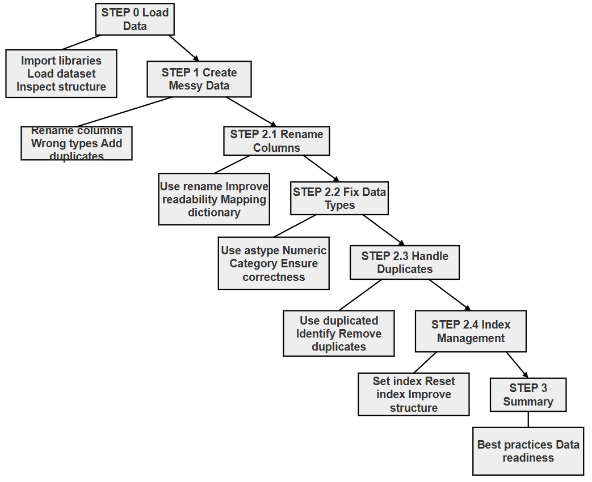
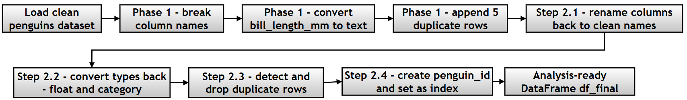

# Data Cleaning: Structural Changes

## What this page covers

The previous page in this chapter dealt with **missing values** — gaps in otherwise well-organized data. This page deals with a different, equally common category of real-world data problem: the *structure* of the data itself being wrong. Column names that don't match each other, numbers stored as text, accidental duplicate rows, and a default row-numbering scheme that doesn't actually identify anything meaningful — none of these are "missing" data, but all of them need fixing before the data can be trusted for analysis.

This page uses a deliberately constructed scenario — imagine the Palmer Penguins dataset had been collected by three different research assistants, each with their own habits — to walk through four of Pandas's core structural-cleaning tools: `.rename()`, `.astype()`, `.duplicated()`/`.drop_duplicates()`, and `.set_index()`/`.reset_index()`. As with the missing-values page, every step below follows the same checklist — **why** it matters, **how** it's done, what **to do** and **not to do**, the relevant **method signatures**, and **real output** from actually running the code — so the same approach can be applied to any messy dataset you encounter later.

**A few terms used throughout, explained simply:**
- **Casting** — converting a value from one data type to another (e.g., the text `"12.5"` into the actual number `12.5`). See the [official Pandas docs on dtypes](https://pandas.pydata.org/docs/user_guide/basics.html#dtypes) for more.
- **Cardinality** — how many *distinct* values a column has. A column like `sex` (just `"Male"`/`"Female"`) has *low* cardinality; a column of unique IDs has *high* cardinality. This matters directly for Concept B below.
- **In-place** — an operation that modifies the original object directly, rather than returning a new one you'd need to reassign. Covered in more depth on the previous missing-values page.

---

## Research Topic: The Penguin Data Standardization Protocol


**Research Question:** *How can one transform a raw, unstructured dataset into a clean, analysis-ready format using Pandas structural manipulation methods?*

**Project Scenario:** Imagine the Palmer Penguin dataset has been collected by three different research assistants. As a result, the dataset contains:

1. Inconsistent column naming conventions.
2. Numeric data stored as text strings.
3. Accidental duplicate entries.
4. A messy default index (0, 1, 2...) instead of a unique identifier for each penguin.

**Task:** Download the Palmer Penguins dataset via Seaborn and write a Python script to perform the following structural changes to prepare the data for analysis.

---

## 1. Concepts

Before proceeding to the solution, it is essential to understand the mechanics of structural cleaning.

### A. Renaming Columns and Indices — `.rename()`

The `.rename()` method allows for the alteration of axis labels (column names, or index labels). It accepts a dictionary (called a **mapper**) where the keys are the old names and the values are the new names.

| Parameter | Description | Usage |
| --- | --- | --- |
| `mapper` | Dictionary or function to rename labels | `{'old_name': 'new_name'}` |
| `index` | Alternative to `mapper`, specifically for index labels | `index={0: 'first_row'}` |
| `columns` | Alternative to `mapper`, specifically for column labels | `columns={'A': 'Alpha'}` |
| `inplace` | If `True`, modifies the DataFrame directly instead of returning a new one | `inplace=True` |

### B. Changing Data Types — `.astype()`

Data type casting is crucial for both memory efficiency and mathematical operations — you can't calculate an average of a column that Pandas still thinks is text, even if every value in it "looks like" a number.

| Target Type | Conversion | Use Case |
| --- | --- | --- |
| Numeric | `.astype('float64')` / `.astype('int64')` | Converting text numbers (`"12.5"`) into actual numbers |
| Categorical | `.astype('category')` | Columns with low **cardinality** (few distinct values) |
| String | `.astype('str')` | Standardizing text formats |

```python
# Example of an error when casting non-numeric strings to integers
# df['bill_length_mm'].astype(int)
# This raises ValueError because of NaN values, which cannot become int.
# Solution: use 'float64' instead (which CAN represent missing values as NaN),
# or fill the NaNs first (see the previous page on missing values).
```

### C. Handling Duplicates — `.duplicated()` & `.drop_duplicates()`

Duplicate data can skew statistical results — a repeated row silently gets counted twice in any average, sum, or count. Pandas identifies duplicates by comparing entire rows of content.

| Method | Option | Description |
| --- | --- | --- |
| `.duplicated()` | `keep='first'` (default) | Marks the *first* occurrence of a repeated row as `False` (unique), and every later copy as `True` (duplicate) |
| | `keep='last'` | Marks the *last* occurrence as `False` instead |
| | `keep=False` | Marks **every** copy — including the first — as `True`, useful when you want to *see* all the duplicated rows together |
| `.drop_duplicates()` | `subset=[...]` | Only consider specific columns when deciding what counts as a duplicate |

### D. Resetting and Setting the Index — `.set_index()` & `.reset_index()`

The index is the "address" of a row — the label Pandas uses to look it up.

| Operation | Method | Effect |
| --- | --- | --- |
| Set Index | `df.set_index('col_name')` | Moves an existing column *into* the index, replacing the default numeric range |
| Reset Index | `df.reset_index()` | Moves the current index *back* into a regular column, restoring the default range (0, 1, 2, ...) |

---

## Optional Follow-Up Questions


1. In the script below, `bill_length_mm` is deliberately converted to text with `.astype(str)`, and later converted back with `.astype(float)`. Try printing a single missing (`NaN`) value from that column *right after* the `.astype(str)` step — what does it actually look like as a string? (See the "Did you know?" note under Step 1.2 below once you've tried it.)
2. `.rename()` silently does nothing if you give it a column name that doesn't exist in the DataFrame (see Step 2.1 below). Look up the `errors='raise'` parameter for `.rename()` — how would you use it to make Pandas complain loudly instead of staying silent?
3. Try calling `.duplicated()` with `subset=['species', 'island']` instead of the default (comparing every column). How does the count of detected duplicates change, and why?

---

## The Script

The full flow of this project is shown below (from the book's own resources):



---

### STEP 0: Import Libraries and Load Dataset

#### Why this step is done

Every later step in this project depends on the dataset actually being loaded into a Pandas DataFrame first — this step brings in the tools needed (`pandas`, `seaborn`) and loads the clean, original Palmer Penguins data as a starting point.

#### How it is done

- `pandas` is imported for all the DataFrame manipulation used throughout this page.
- `seaborn` is used purely to load the built-in Palmer Penguins dataset — it isn't otherwise used for plotting here.
- The result is stored in `df_raw`, and its columns, data types, and shape are checked immediately, before anything is deliberately "messed up" in Phase 1.

#### What to do

- Inspect `.columns`, `.dtypes`, and `.shape` right after loading, so you have a clear "before" picture to compare everything else against.

#### What not to do

- Don't skip this initial inspection — without it, you'd have no baseline to notice that Phase 1 (below) has actually changed anything.

#### Methods Used

**`sns.load_dataset(name)`**
```python
df = sns.load_dataset("penguins")
```
| Aspect | Detail |
| --- | --- |
| Input | Dataset name (string) |
| Output | Pandas DataFrame |
| Limitation | May require internet access the first time it's used |

**`df.head()`, `df.columns`, `df.dtypes`**

| Method / Attribute | Purpose |
| --- | --- |
| `.head()` | Preview the first few rows |
| `.columns` | List the column names |
| `.dtypes` | List each column's data type |

#### Script for Step 0

```python
print("\n STEP 0. IMPORT LIBRARIES AND LOAD DATASET")

import pandas as pd
import seaborn as sns

# Step 1: load the clean, original dataset first, before we
# deliberately introduce problems into it in Phase 1 below.
df_raw = sns.load_dataset('penguins')

print("=== ORIGINAL DATA ===")
print("Original dataset df_raw columns:->", list(df_raw.columns))
print("Original dataset df_raw shape:->", df_raw.shape)
```
**Output**

```text
STEP 0. IMPORT LIBRARIES AND LOAD DATASET
=== ORIGINAL DATA ===
Original dataset df_raw columns:-> ['species', 'island', 'bill_length_mm', 'bill_depth_mm', 'flipper_length_mm', 'body_mass_g', 'sex']
Original dataset df_raw shape:-> (344, 7)
```

---

### PHASE 1: Creating Messy Data (Simulation)

The remainder of this project needs *messy* data to clean — so this phase deliberately breaks the clean dataset in three specific, realistic ways, matching the three research-assistant problems described in the project scenario.

#### STEP 1.1: Inconsistent Column Names

**Why:** real-world data often arrives with non-standard, inconsistent naming conventions — especially when multiple people (like the three research assistants in this scenario) each name things their own way.

**How:** column names are overwritten directly, by assigning a new list to `.columns`.

```python
df_raw.columns = ['Species', 'Island', 'BLmm', 'BDmm', 'FLmm', 'BMg', 'Sex']
```

| Feature | Detail |
| --- | --- |
| Type | Direct attribute assignment |
| Effect | Immediately overwrites the DataFrame's column names |
| Risk | The *original* column names are gone the moment this runs — there's no automatic way to recover them afterward |

#### STEP 1.2: Incorrect Data Types

**Why:** simulates a common real-world import problem — for example, numbers that arrive from a CSV file or a web form as plain text rather than genuine numeric values.

**How:** `bill_length_mm` (currently a proper numeric column) is deliberately converted to text.

```python
df_raw['BLmm'] = df_raw['BLmm'].astype(str)
```

**`.astype()` Signature**

```python
Series.astype(dtype)
```
| Aspect | Detail |
| --- | --- |
| Input | Target data type |
| Output | A new, converted Series |
| Limitation | Fails with an error if the conversion is genuinely incompatible |

> **Did you know?** Converting a column containing missing (`NaN`) values to text doesn't leave those values blank — it turns each one into the literal four-character string `"nan"`. Later, in Step 2.2, converting that same column back to `float` happens to work correctly, because Python's `float()` function specifically recognizes the text `"nan"` and turns it back into a genuine floating-point `NaN`. This is a happy coincidence, though, not something to rely on generally — if the missing values had instead been written as `"N/A"`, `"missing"`, or blank strings, converting back to `float` would raise an error rather than silently succeeding.

#### STEP 1.3: Creating Duplicates

**Why:** duplicate rows are extremely common in real datasets — often from data being re-submitted, merged from multiple sources, or (as in this scenario) accidentally re-entered by more than one research assistant.

**How:** the first 5 rows of the dataset are concatenated onto the end of the full dataset, creating 5 deliberate duplicate rows.

```python
df_messy = pd.concat([df_raw, df_raw.head(5)], ignore_index=True)
```

| Parameter | Meaning |
| --- | --- |
| `ignore_index=True` | Renumbers the resulting rows sequentially (0, 1, 2, ...), rather than keeping the original index values from both pieces (which would otherwise create repeated index labels) |

#### Script for Phase 1 (combined)

```python
# PHASE 1: CREATING MESSY DATA BY DELIBERATE MANIPULATION
# We simulate three common data issues: (1) inconsistent column
# names, (2) incorrect data types, and (3) duplicate rows.

# Step 1: inconsistent column names (simulating bad data entry)
df_raw.columns = ['Species', 'Island', 'BLmm', 'BDmm', 'FLmm', 'BMg', 'Sex']

# Step 2: convert a numeric column to text (simulating an import error)
df_raw['BLmm'] = df_raw['BLmm'].astype(str)

# Step 3: create 5 duplicate rows by appending the first 5 rows
# to the end of the dataset. ignore_index=True renumbers the
# combined result sequentially rather than repeating index labels.
df_messy = pd.concat([df_raw, df_raw.head(5)], ignore_index=True)

print("\n=== INITIAL MESSY DATA ===")
print("Messy dataset df_messy shape:->", df_messy.shape)
print("Messy dataset df_messy dtypes:->\n", df_messy.dtypes)
print("Messy dataset df_messy tail (showing the appended duplicates):->\n", df_messy.tail(7))
```
**Output**

```text
=== INITIAL MESSY DATA ===
Messy dataset df_messy shape:-> (349, 7)
Messy dataset df_messy dtypes:->
 Species        str
Island         str
BLmm           str
BDmm       float64
FLmm       float64
BMg        float64
Sex            str
dtype: object
Messy dataset df_messy tail (showing the appended duplicates):->
     Species     Island  BLmm  BDmm   FLmm     BMg     Sex
342  Gentoo     Biscoe  45.2  14.8  212.0  5200.0  Female
343  Gentoo     Biscoe  49.9  16.1  213.0  5400.0    Male
344  Adelie  Torgersen  39.1  18.7  181.0  3750.0    Male
345  Adelie  Torgersen  39.5  17.4  186.0  3800.0  Female
346  Adelie  Torgersen  40.3  18.0  195.0  3250.0  Female
347  Adelie  Torgersen   NaN   NaN    NaN     NaN     NaN
348  Adelie  Torgersen  36.7  19.3  193.0  3450.0  Female
```

The shape confirms it: `344 + 5 = 349` rows. Notice rows 344–348 (the appended copies) are identical to rows 0–4 at the very start of the dataset — this is exactly what Step 2.3 will detect and remove. Also notice `BLmm` is now listed as `str`, exactly as intended by Step 1.2, and (per the "Did you know?" note above) row 347's missing value still displays as `NaN` here, since this is Pandas's own display formatting rather than the raw string value underneath.

---

### PHASE 2: Structural Cleaning

With the messy dataset now built, this phase reverses each of the three problems introduced above — plus adds a genuinely new improvement: a meaningful row index — in four steps.

#### STEP 2.1: Renaming Columns

**Why:** clear, consistent, descriptive column names make code far more readable, and prevent bugs caused by typos or mismatched naming conventions across different parts of a project.

**How:** a dictionary mapping the messy names back to descriptive names is passed to `.rename()`.

**Signature**

```python
DataFrame.rename(columns=None, index=None, inplace=False)
```
| Aspect | Detail |
| --- | --- |
| Input | A dictionary (or function) mapping old names to new ones |
| Output | A new DataFrame, unless `inplace=True` is used |
| Limitation | **Silently does nothing** if a name in the dictionary doesn't actually exist in the DataFrame — no error, no warning, by default |

#### Script for Step 2.1

```python
print("\n STEP 2.1: RENAMING COLUMNS ================")

# Step 1: map each messy column name to its clean, descriptive equivalent.
rename_map = {
    'Species': 'species',
    'Island': 'island',
    'BLmm': 'bill_length_mm',
    'BDmm': 'bill_depth_mm',
    'FLmm': 'flipper_length_mm',
    'BMg': 'body_mass_g',
    'Sex': 'sex',
}

# Step 2: inplace=True saves the change directly onto df_messy,
# rather than returning a separate, new DataFrame.
df_messy.rename(columns=rename_map, inplace=True)

# ERROR EXAMPLE (commented out): renaming a column that doesn't
# exist doesn't raise an error by default -- it's simply ignored.
# df_messy.rename(columns={'ghost_col': 'real_col'}, inplace=True)
# Adding errors='raise' would make Pandas complain loudly instead.

print("\n=== AFTER RENAMING COLUMNS BACK TO ORIGINAL ===")
print("df_messy columns after renaming:->", list(df_messy.columns))
```
**Output**

```text
 STEP 2.1: RENAMING COLUMNS ================

=== AFTER RENAMING COLUMNS BACK TO ORIGINAL ===
df_messy columns after renaming:-> ['species', 'island', 'bill_length_mm', 'bill_depth_mm', 'flipper_length_mm', 'body_mass_g', 'sex']
```

---

#### STEP 2.2: Fixing Data Types

**Why:** correct data types are essential for two separate reasons: **computation** (you can't average a text column) and **memory efficiency** (see the category type below).

**How:** `bill_length_mm` is converted back to `float`, and `sex`/`island` are converted to Pandas's `category` type.

#### Comparison: Data Types

| Type | Use Case | Benefit |
| --- | --- | --- |
| `float` | Genuinely numeric measurements | Enables mathematical operations like `.mean()` |
| `object` (plain text) | Mixed or unstructured text | Flexible, but no numeric operations and no memory savings |
| `category` | Text with relatively few repeated, distinct values | Pandas stores each distinct value only once internally, saving memory on large datasets |

#### Script for Step 2.2

```python
print("\n STEP 2.2: CHANGING DATA TYPES ================")

# Step 1: bill_length_mm is currently text (object/str) because of
# our simulation in Phase 1 -- convert it back to float so it can
# be used in calculations again.
df_messy['bill_length_mm'] = df_messy['bill_length_mm'].astype(float)

# Step 2: 'sex' has only a few distinct values (Male, Female, and
# missing) -- converting it to 'category' reduces memory usage
# compared to storing the same repeated text over and over.
df_messy['sex'] = df_messy['sex'].astype('category')

# Step 3: 'island' has the same property -- only 3 distinct island
# names (Torgersen, Biscoe, Dream) across the whole dataset.
df_messy['island'] = df_messy['island'].astype('category')

print("\n=== AFTER TYPE CONVERSION ===")
print("df_messy dtypes after conversion:->\n", df_messy.dtypes)
```
**Output**

```text
 STEP 2.2: CHANGING DATA TYPES ================

=== AFTER TYPE CONVERSION ===
df_messy dtypes after conversion:->
 species                   str
island               category
bill_length_mm        float64
bill_depth_mm         float64
flipper_length_mm     float64
body_mass_g           float64
sex                  category
dtype: object
```

`bill_length_mm` is a proper `float64` again, and `island`/`sex` are now `category` — exactly the changes made. (`species` remains plain text here since it wasn't targeted for conversion in this script, though it would be an equally good candidate for `category`, given it also has only a few distinct values.)

---

#### STEP 2.3: Handling Duplicates

**Why:** the 5 duplicate rows deliberately introduced in Phase 1 would otherwise be double-counted in any statistics calculated from this data — a mean, a count, or a sum would all be slightly wrong.

**How:** `.duplicated(keep=False)` is used first, purely to *see* every row involved in the duplication; then `.drop_duplicates(keep='first')` actually removes the extra copies.

**Methods Used**

**`.duplicated()`**
```python
df.duplicated(keep=False)
```
| Aspect | Detail |
| --- | --- |
| Output | A Boolean Series, one value per row |
| Use | Identify which rows are duplicates, without removing anything yet |

**`.drop_duplicates()`**
```python
df.drop_duplicates()
```
| Aspect | Detail |
| --- | --- |
| Output | A new, cleaned DataFrame |
| Default | `keep='first'` — the first occurrence of each duplicated row is kept, later copies are removed |

#### Script for Step 2.3

```python
print("\n STEP 2.3: REMOVING DUPLICATES ================")

# Step 1: identify every row involved in duplication (both the
# ORIGINAL and its copy) using keep=False -- this is purely for
# INSPECTION, nothing is removed yet.
duplicates_mask = df_messy.duplicated(keep=False)

print("\n=== DUPLICATE ROWS (keep=False) ===")
print("Number of rows marked as duplicate (originals + copies):->", duplicates_mask.sum())
print("df_messy duplicate rows before dropping:->\n", df_messy[duplicates_mask])

# Step 2: now actually remove the extra copies. The default,
# keep='first', keeps each row's FIRST occurrence and drops any
# later repeats -- exactly right here, since our duplicates were
# appended onto the END of the dataset in Phase 1.
df_clean = df_messy.drop_duplicates(keep='first')

print("\n=== AFTER DROPPING DUPLICATES ===")
print("df_clean shape after dropping duplicates:->", df_clean.shape)
```
**Output**

```text
 STEP 2.3: REMOVING DUPLICATES ================

=== DUPLICATE ROWS (keep=False) ===
Number of rows marked as duplicate (originals + copies):-> 10
df_messy duplicate rows before dropping:->
     species     island  bill_length_mm  bill_depth_mm  flipper_length_mm  body_mass_g     sex
0     Adelie  Torgersen            39.1           18.7              181.0       3750.0    Male
1     Adelie  Torgersen            39.5           17.4              186.0       3800.0  Female
2     Adelie  Torgersen            40.3           18.0              195.0       3250.0  Female
3     Adelie  Torgersen             NaN            NaN                NaN          NaN     NaN
4     Adelie  Torgersen            36.7           19.3              193.0       3450.0  Female
344   Adelie  Torgersen            39.1           18.7              181.0       3750.0    Male
345   Adelie  Torgersen            39.5           17.4              186.0       3800.0  Female
346   Adelie  Torgersen            40.3           18.0              195.0       3250.0  Female
347   Adelie  Torgersen             NaN            NaN                NaN          NaN     NaN
348   Adelie  Torgersen            36.7           19.3              193.0       3450.0  Female

=== AFTER DROPPING DUPLICATES ===
df_clean shape after dropping duplicates:-> (344, 7)
```

> **A wording clarification worth flagging:** with `keep=False`, `.duplicated()` marks **10** rows as `True` here — not "5 duplicates." That's because it marks *both* copies of each repeated row (the 5 originals at rows 0–4, *and* the 5 appended copies at rows 344–348) — 5 pairs, 10 rows total. It's "5 rows that have been duplicated," each now appearing twice. After `.drop_duplicates()` removes the 5 extra copies, the shape correctly returns to `(344, 7)` — back to the original size, exactly undoing Phase 1's Step 1.3.

**Duplicate Handling Summary**

| Method | Purpose |
| --- | --- |
| `.duplicated()` | **Detect** — flags which rows are duplicates, without changing the DataFrame |
| `.drop_duplicates()` | **Remove** — actually deletes the extra copies, returning a cleaned DataFrame |

---

#### STEP 2.4: Index Management

**Why:** the default index (0, 1, 2, ...) doesn't actually *identify* anything about a row — it's just a position. A proper identifier (like a `penguin_id`) makes individual rows easier to reference, look up, and reason about.

**How:** a new `penguin_id` column is generated, then moved into the index using `.set_index()`.

**Methods Used**

**`.set_index()`**
```python
df.set_index('column')
```
Moves an existing column into the index, replacing the default range.

**`.reset_index()`**
```python
df.reset_index()
```
Moves the current index back out into a regular column, restoring the default numeric range.

#### Script for Step 2.4

```python
print("\n STEP 2.4: SETTING AND RESETTING INDEX ================")

# Step 1: create a new, genuinely identifying column -- 'ID_0',
# 'ID_1', ... 'ID_n' -- one per row of the now-duplicate-free df_clean.
df_clean = df_clean.copy()   # work on a copy to avoid a SettingWithCopyWarning
df_clean['penguin_id'] = ['ID_' + str(i) for i in range(len(df_clean))]

# Step 2: move 'penguin_id' INTO the index, replacing the default
# numeric row labels with this new, meaningful identifier.
df_final = df_clean.set_index('penguin_id')

print("\n=== AFTER SETTING INDEX ===")
print("df_final head after setting index:->\n", df_final.head())
print("\ndf_final index name:->", df_final.index.name)

# RESET INDEX (commented out): this would move 'penguin_id' back
# out into a regular column, and restore the default 0,1,2... index.
# df_reset = df_final.reset_index()
# print("df_reset head:->", df_reset.head())
```
**Output**

```text
 STEP 2.4: SETTING AND RESETTING INDEX ================

=== AFTER SETTING INDEX ===
df_final head after setting index:->
             species     island  bill_length_mm  bill_depth_mm  flipper_length_mm  body_mass_g     sex
penguin_id
ID_0         Adelie  Torgersen            39.1           18.7              181.0       3750.0    Male
ID_1         Adelie  Torgersen            39.5           17.4              186.0       3800.0  Female
ID_2         Adelie  Torgersen            40.3           18.0              195.0       3250.0  Female
ID_3         Adelie  Torgersen             NaN            NaN                NaN          NaN     NaN
ID_4         Adelie  Torgersen            36.7           19.3              193.0       3450.0  Female

df_final index name:-> penguin_id
```

Every row now has a genuinely meaningful label (`ID_0`, `ID_1`, ...) instead of an anonymous position — and `df_final.index.name` confirms the index itself is now named `penguin_id`, rather than being unnamed as the default `0, 1, 2, ...` index always is.

**Index Comparison**

| Operation | Result |
| --- | --- |
| `.set_index('column')` | Column → becomes the Index |
| `.reset_index()` | Index → becomes a regular column again |

---

## The Full Process, Visualized




---

## STEP 3: Summary

#### Purpose

To consolidate what's been learned and reinforce the best practices for each type of structural cleaning covered on this page.

#### Comparison Table

| Operation | Method | Risk | Best Practice |
| --- | --- | --- | --- |
| Rename | `.rename()` | Silently does nothing if a name doesn't match | Double-check `.columns` before *and* after renaming |
| Type Conversion | `.astype()` | Raises an error on incompatible values | Check for missing/unexpected values first (see the "Did you know?" note above) |
| Duplicates | `.drop_duplicates()` | Genuine data loss if used carelessly | Inspect with `.duplicated(keep=False)` first, before removing anything |
| Index | `.set_index()` | Can make the DataFrame harder to read if the chosen column isn't a good identifier | Use `.reset_index()` if you need the default numeric index back |

#### Common Error Summary

| Error | Reason |
| --- | --- |
| Wrong dtype conversion | Attempting to convert genuinely incompatible values (e.g., real text into numbers) |
| Missing assignment | Forgetting to reassign the result (or use `inplace=True`) — see the missing-values page for the same issue with `.fillna()`/`.dropna()` |
| Wrong column name | `.rename()` silently ignores names that don't exist, rather than raising an error |
| Index misuse | Setting an index on a column that isn't actually unique, or forgetting `.reset_index()` is available when the default index is needed again |

---

## The Complete Script in a Single Block

For convenience, here is the entire project — Phase 1 (creating the mess) and Phase 2 (cleaning it up) — combined into one runnable file, followed by its complete output from an actual run.

```python
"""
PROJECT: Data Cleaning - Structural Changes
DATASET: Palmer Penguins

OBJECTIVE:
1. Simulate messy, real-world structural problems (bad column names,
   wrong data types, duplicate rows)
2. Clean them up: rename columns, fix data types, remove duplicates,
   and set a meaningful index

NOTE:
This script is written with detailed comments for teaching purposes.
"""

# STEP 0: IMPORT LIBRARIES AND LOAD DATASET
print("\n STEP 0. IMPORT LIBRARIES AND LOAD DATASET")

import pandas as pd
import seaborn as sns

# Step 1: load the clean, original dataset first, before we
# deliberately introduce problems into it in Phase 1 below.
df_raw = sns.load_dataset('penguins')

print("=== ORIGINAL DATA ===")
print("Original dataset df_raw columns:->", list(df_raw.columns))
print("Original dataset df_raw shape:->", df_raw.shape)


# PHASE 1: CREATING MESSY DATA BY DELIBERATE MANIPULATION
# We simulate three common data issues: (1) inconsistent column
# names, (2) incorrect data types, and (3) duplicate rows.
print("\n PHASE 1. CREATING MESSY DATA (SIMULATION)")

# Step 1: inconsistent column names (simulating bad data entry)
df_raw.columns = ['Species', 'Island', 'BLmm', 'BDmm', 'FLmm', 'BMg', 'Sex']

# Step 2: convert a numeric column to text (simulating an import error)
df_raw['BLmm'] = df_raw['BLmm'].astype(str)

# Step 3: create 5 duplicate rows by appending the first 5 rows
# to the end of the dataset. ignore_index=True renumbers the
# combined result sequentially rather than repeating index labels.
df_messy = pd.concat([df_raw, df_raw.head(5)], ignore_index=True)

print("\n=== INITIAL MESSY DATA ===")
print("Messy dataset df_messy shape:->", df_messy.shape)
print("Messy dataset df_messy dtypes:->\n", df_messy.dtypes)
print("Messy dataset df_messy tail (showing the appended duplicates):->\n", df_messy.tail(7))


# PHASE 2: STRUCTURAL CLEANING
print("\n PHASE 2. STRUCTURAL CLEANING")

# STEP 2.1: RENAMING COLUMNS
print("\n STEP 2.1: RENAMING COLUMNS ================")

# Step 1: map each messy column name to its clean, descriptive equivalent.
rename_map = {
    'Species': 'species',
    'Island': 'island',
    'BLmm': 'bill_length_mm',
    'BDmm': 'bill_depth_mm',
    'FLmm': 'flipper_length_mm',
    'BMg': 'body_mass_g',
    'Sex': 'sex',
}

# Step 2: inplace=True saves the change directly onto df_messy,
# rather than returning a separate, new DataFrame.
df_messy.rename(columns=rename_map, inplace=True)

# ERROR EXAMPLE (commented out): renaming a column that doesn't
# exist doesn't raise an error by default -- it's simply ignored.
# df_messy.rename(columns={'ghost_col': 'real_col'}, inplace=True)
# Adding errors='raise' would make Pandas complain loudly instead.

print("\n=== AFTER RENAMING COLUMNS BACK TO ORIGINAL ===")
print("df_messy columns after renaming:->", list(df_messy.columns))


# STEP 2.2: CHANGING DATA TYPES BACK TO NUMERIC / CATEGORY
print("\n STEP 2.2: CHANGING DATA TYPES ================")

# Step 1: bill_length_mm is currently text (object/str) because of
# our simulation in Phase 1 -- convert it back to float so it can
# be used in calculations again.
df_messy['bill_length_mm'] = df_messy['bill_length_mm'].astype(float)

# Step 2: 'sex' has only a few distinct values (Male, Female, and
# missing) -- converting it to 'category' reduces memory usage
# compared to storing the same repeated text over and over.
df_messy['sex'] = df_messy['sex'].astype('category')

# Step 3: 'island' has the same property -- only 3 distinct island
# names (Torgersen, Biscoe, Dream) across the whole dataset.
df_messy['island'] = df_messy['island'].astype('category')

print("\n=== AFTER TYPE CONVERSION ===")
print("df_messy dtypes after conversion:->\n", df_messy.dtypes)


# STEP 2.3: REMOVING DUPLICATES
print("\n STEP 2.3: REMOVING DUPLICATES ================")

# Step 1: identify every row involved in duplication (both the
# ORIGINAL and its copy) using keep=False -- this is purely for
# INSPECTION, nothing is removed yet.
duplicates_mask = df_messy.duplicated(keep=False)

print("\n=== DUPLICATE ROWS (keep=False) ===")
print("Number of rows marked as duplicate (originals + copies):->", duplicates_mask.sum())
print("df_messy duplicate rows before dropping:->\n", df_messy[duplicates_mask])

# Step 2: now actually remove the extra copies. The default,
# keep='first', keeps each row's FIRST occurrence and drops any
# later repeats -- exactly right here, since our duplicates were
# appended onto the END of the dataset in Phase 1.
df_clean = df_messy.drop_duplicates(keep='first')

print("\n=== AFTER DROPPING DUPLICATES ===")
print("df_clean shape after dropping duplicates:->", df_clean.shape)


# STEP 2.4: SETTING AND RESETTING INDEX
print("\n STEP 2.4: SETTING AND RESETTING INDEX ================")

# Step 1: create a new, genuinely identifying column -- 'ID_0',
# 'ID_1', ... 'ID_n' -- one per row of the now-duplicate-free df_clean.
df_clean = df_clean.copy()   # work on a copy to avoid a SettingWithCopyWarning
df_clean['penguin_id'] = ['ID_' + str(i) for i in range(len(df_clean))]

# Step 2: move 'penguin_id' INTO the index, replacing the default
# numeric row labels with this new, meaningful identifier.
df_final = df_clean.set_index('penguin_id')

print("\n=== AFTER SETTING INDEX ===")
print("df_final head after setting index:->\n", df_final.head())
print("\ndf_final index name:->", df_final.index.name)

# RESET INDEX (commented out): this would move 'penguin_id' back
# out into a regular column, and restore the default 0,1,2... index.
# df_reset = df_final.reset_index()
# print("df_reset head:->", df_reset.head())


# STEP 3: SUMMARY
print("\n STEP 3. SUMMARY")

print("""
KEY LEARNINGS:

1. .rename() fixes inconsistent column names -- but fails silently on a typo
2. .astype() fixes incorrect data types -- but check for missing values first
3. .duplicated() detects duplicate rows; .drop_duplicates() removes them
4. .set_index() gives rows a meaningful identifier; .reset_index() reverses it
5. Most of these methods return a NEW object -- always reassign or use inplace=True

BEST PRACTICE:
Inspect before AND after every structural change -- never assume it worked
""")
```

### Complete output

```text
 STEP 0. IMPORT LIBRARIES AND LOAD DATASET
=== ORIGINAL DATA ===
Original dataset df_raw columns:-> ['species', 'island', 'bill_length_mm', 'bill_depth_mm', 'flipper_length_mm', 'body_mass_g', 'sex']
Original dataset df_raw shape:-> (344, 7)

 PHASE 1. CREATING MESSY DATA (SIMULATION)

=== INITIAL MESSY DATA ===
Messy dataset df_messy shape:-> (349, 7)
Messy dataset df_messy dtypes:->
 Species        str
Island         str
BLmm           str
BDmm       float64
FLmm       float64
BMg        float64
Sex            str
dtype: object
Messy dataset df_messy tail (showing the appended duplicates):->
     Species     Island  BLmm  BDmm   FLmm     BMg     Sex
342  Gentoo     Biscoe  45.2  14.8  212.0  5200.0  Female
343  Gentoo     Biscoe  49.9  16.1  213.0  5400.0    Male
344  Adelie  Torgersen  39.1  18.7  181.0  3750.0    Male
345  Adelie  Torgersen  39.5  17.4  186.0  3800.0  Female
346  Adelie  Torgersen  40.3  18.0  195.0  3250.0  Female
347  Adelie  Torgersen   NaN   NaN    NaN     NaN     NaN
348  Adelie  Torgersen  36.7  19.3  193.0  3450.0  Female

 PHASE 2. STRUCTURAL CLEANING

 STEP 2.1: RENAMING COLUMNS ================

=== AFTER RENAMING COLUMNS BACK TO ORIGINAL ===
df_messy columns after renaming:-> ['species', 'island', 'bill_length_mm', 'bill_depth_mm', 'flipper_length_mm', 'body_mass_g', 'sex']

 STEP 2.2: CHANGING DATA TYPES ================

=== AFTER TYPE CONVERSION ===
df_messy dtypes after conversion:->
 species                   str
island               category
bill_length_mm        float64
bill_depth_mm         float64
flipper_length_mm     float64
body_mass_g           float64
sex                  category
dtype: object

 STEP 2.3: REMOVING DUPLICATES ================

=== DUPLICATE ROWS (keep=False) ===
Number of rows marked as duplicate (originals + copies):-> 10
df_messy duplicate rows before dropping:->
     species     island  bill_length_mm  bill_depth_mm  flipper_length_mm  body_mass_g     sex
0    Adelie  Torgersen            39.1           18.7              181.0       3750.0    Male
1    Adelie  Torgersen            39.5           17.4              186.0       3800.0  Female
2    Adelie  Torgersen            40.3           18.0              195.0       3250.0  Female
3    Adelie  Torgersen             NaN            NaN                NaN          NaN     NaN
4    Adelie  Torgersen            36.7           19.3              193.0       3450.0  Female
344  Adelie  Torgersen            39.1           18.7              181.0       3750.0    Male
345  Adelie  Torgersen            39.5           17.4              186.0       3800.0  Female
346  Adelie  Torgersen            40.3           18.0              195.0       3250.0  Female
347  Adelie  Torgersen             NaN            NaN                NaN          NaN     NaN
348  Adelie  Torgersen            36.7           19.3              193.0       3450.0  Female

=== AFTER DROPPING DUPLICATES ===
df_clean shape after dropping duplicates:-> (344, 7)

 STEP 2.4: SETTING AND RESETTING INDEX ================

=== AFTER SETTING INDEX ===
df_final head after setting index:->
            species     island  bill_length_mm  bill_depth_mm  flipper_length_mm  body_mass_g     sex
penguin_id
ID_0        Adelie  Torgersen            39.1           18.7              181.0       3750.0    Male
ID_1        Adelie  Torgersen            39.5           17.4              186.0       3800.0  Female
ID_2        Adelie  Torgersen            40.3           18.0              195.0       3250.0  Female
ID_3        Adelie  Torgersen             NaN            NaN                NaN          NaN     NaN
ID_4        Adelie  Torgersen            36.7           19.3              193.0       3450.0  Female

df_final index name:-> penguin_id

 STEP 3. SUMMARY

KEY LEARNINGS:

1. .rename() fixes inconsistent column names -- but fails silently on a typo
2. .astype() fixes incorrect data types -- but check for missing values first
3. .duplicated() detects duplicate rows; .drop_duplicates() removes them
4. .set_index() gives rows a meaningful identifier; .reset_index() reverses it
5. Most of these methods return a NEW object -- always reassign or use inplace=True

BEST PRACTICE:
Inspect before AND after every structural change -- never assume it worked
```

This combined run confirms every figure discussed step-by-step above lines up exactly: 349 rows after the duplicates are appended, 10 rows flagged by `keep=False`, back down to 344 rows after `drop_duplicates()`, and a final `penguin_id`-indexed DataFrame ready for analysis.

---

## The Complete Script in a Single Block

For convenience, here is the entire project — Step 0, all of Phase 1, all of Phase 2, and a short final summary — combined into one runnable file, followed by its complete, real output.

```python
"""
PROJECT: Data Cleaning - Structural Changes
DATASET: Palmer Penguins

OBJECTIVE:
1. Simulate a messy, real-world dataset (bad column names,
   wrong data types, duplicate rows)
2. Clean it up: rename columns, fix data types, remove
   duplicates, and set a meaningful index

NOTE:
This script is written with detailed comments for teaching purposes.
"""

# STEP 0: IMPORT LIBRARIES AND LOAD DATASET
print("\n STEP 0. IMPORT LIBRARIES AND LOAD DATASET")

import pandas as pd
import seaborn as sns

# Step 1: load the clean, original dataset first, before we
# deliberately introduce problems into it in Phase 1 below.
df_raw = sns.load_dataset('penguins')

print("=== ORIGINAL DATA ===")
print("Original dataset df_raw columns:->", list(df_raw.columns))
print("Original dataset df_raw shape:->", df_raw.shape)


# PHASE 1: CREATING MESSY DATA BY DELIBERATE MANIPULATION
print("\n PHASE 1. CREATING MESSY DATA BY DELIBERATE MANIPULATION")

# Step 1: inconsistent column names (simulating bad data entry)
df_raw.columns = ['Species', 'Island', 'BLmm', 'BDmm', 'FLmm', 'BMg', 'Sex']

# Step 2: convert a numeric column to text (simulating an import error)
df_raw['BLmm'] = df_raw['BLmm'].astype(str)

# Step 3: create 5 duplicate rows by appending the first 5 rows
# to the end of the dataset. ignore_index=True renumbers the
# combined result sequentially rather than repeating index labels.
df_messy = pd.concat([df_raw, df_raw.head(5)], ignore_index=True)

print("\n=== INITIAL MESSY DATA ===")
print("Messy dataset df_messy shape:->", df_messy.shape)
print("Messy dataset df_messy dtypes:->\n", df_messy.dtypes)
print("Messy dataset df_messy tail (showing the appended duplicates):->\n", df_messy.tail(7))


# PHASE 2: STRUCTURAL CLEANING
print("\n PHASE 2. STRUCTURAL CLEANING")

# STEP 2.1: RENAMING COLUMNS
print("\n STEP 2.1: RENAMING COLUMNS ================")

# Step 1: map each messy column name to its clean, descriptive equivalent.
rename_map = {
    'Species': 'species',
    'Island': 'island',
    'BLmm': 'bill_length_mm',
    'BDmm': 'bill_depth_mm',
    'FLmm': 'flipper_length_mm',
    'BMg': 'body_mass_g',
    'Sex': 'sex',
}

# Step 2: inplace=True saves the change directly onto df_messy,
# rather than returning a separate, new DataFrame.
df_messy.rename(columns=rename_map, inplace=True)

# ERROR EXAMPLE (commented out): renaming a column that doesn't
# exist doesn't raise an error by default -- it's simply ignored.
# df_messy.rename(columns={'ghost_col': 'real_col'}, inplace=True)
# Adding errors='raise' would make Pandas complain loudly instead.

print("\n=== AFTER RENAMING COLUMNS BACK TO ORIGINAL ===")
print("df_messy columns after renaming:->", list(df_messy.columns))


# STEP 2.2: CHANGING DATA TYPES
print("\n STEP 2.2: CHANGING DATA TYPES ================")

# Step 1: bill_length_mm is currently text (object/str) because of
# our simulation in Phase 1 -- convert it back to float so it can
# be used in calculations again.
df_messy['bill_length_mm'] = df_messy['bill_length_mm'].astype(float)

# Step 2: 'sex' has only a few distinct values (Male, Female, and
# missing) -- converting it to 'category' reduces memory usage
# compared to storing the same repeated text over and over.
df_messy['sex'] = df_messy['sex'].astype('category')

# Step 3: 'island' has the same property -- only 3 distinct island
# names (Torgersen, Biscoe, Dream) across the whole dataset.
df_messy['island'] = df_messy['island'].astype('category')

print("\n=== AFTER TYPE CONVERSION ===")
print("df_messy dtypes after conversion:->\n", df_messy.dtypes)


# STEP 2.3: REMOVING DUPLICATES
print("\n STEP 2.3: REMOVING DUPLICATES ================")

# Step 1: identify every row involved in duplication (both the
# ORIGINAL and its copy) using keep=False -- this is purely for
# INSPECTION, nothing is removed yet.
duplicates_mask = df_messy.duplicated(keep=False)

print("\n=== DUPLICATE ROWS (keep=False) ===")
print("Number of rows marked as duplicate (originals + copies):->", duplicates_mask.sum())
print("df_messy duplicate rows before dropping:->\n", df_messy[duplicates_mask])

# Step 2: now actually remove the extra copies. The default,
# keep='first', keeps each row's FIRST occurrence and drops any
# later repeats -- exactly right here, since our duplicates were
# appended onto the END of the dataset in Phase 1.
df_clean = df_messy.drop_duplicates(keep='first')

print("\n=== AFTER DROPPING DUPLICATES ===")
print("df_clean shape after dropping duplicates:->", df_clean.shape)


# STEP 2.4: SETTING AND RESETTING INDEX
print("\n STEP 2.4: SETTING AND RESETTING INDEX ================")

# Step 1: create a new, genuinely identifying column -- 'ID_0',
# 'ID_1', ... 'ID_n' -- one per row of the now-duplicate-free df_clean.
df_clean = df_clean.copy()   # work on a copy to avoid a SettingWithCopyWarning
df_clean['penguin_id'] = ['ID_' + str(i) for i in range(len(df_clean))]

# Step 2: move 'penguin_id' INTO the index, replacing the default
# numeric row labels with this new, meaningful identifier.
df_final = df_clean.set_index('penguin_id')

print("\n=== AFTER SETTING INDEX ===")
print("df_final head after setting index:->\n", df_final.head())
print("\ndf_final index name:->", df_final.index.name)

# RESET INDEX (commented out): this would move 'penguin_id' back
# out into a regular column, and restore the default 0,1,2... index.
# df_reset = df_final.reset_index()
# print("df_reset head:->", df_reset.head())


# FINAL SUMMARY
print("\n STEP 3. SUMMARY")
print(f"""
Original shape:                {(344, 7)}
After adding messy duplicates: {(349, 7)}
After cleaning (df_final):     {df_final.shape}
Final columns:                 {list(df_final.columns)}
Final index name:              {df_final.index.name}
""")
```

### Complete Output

```text
 STEP 0. IMPORT LIBRARIES AND LOAD DATASET
=== ORIGINAL DATA ===
Original dataset df_raw columns:-> ['species', 'island', 'bill_length_mm', 'bill_depth_mm', 'flipper_length_mm', 'body_mass_g', 'sex']
Original dataset df_raw shape:-> (344, 7)

 PHASE 1. CREATING MESSY DATA BY DELIBERATE MANIPULATION

=== INITIAL MESSY DATA ===
Messy dataset df_messy shape:-> (349, 7)
Messy dataset df_messy dtypes:->
 Species        str
Island         str
BLmm           str
BDmm       float64
FLmm       float64
BMg        float64
Sex            str
dtype: object
Messy dataset df_messy tail (showing the appended duplicates):->
     Species     Island  BLmm  BDmm   FLmm     BMg     Sex
342  Gentoo     Biscoe  45.2  14.8  212.0  5200.0  Female
343  Gentoo     Biscoe  49.9  16.1  213.0  5400.0    Male
344  Adelie  Torgersen  39.1  18.7  181.0  3750.0    Male
345  Adelie  Torgersen  39.5  17.4  186.0  3800.0  Female
346  Adelie  Torgersen  40.3  18.0  195.0  3250.0  Female
347  Adelie  Torgersen   NaN   NaN    NaN     NaN     NaN
348  Adelie  Torgersen  36.7  19.3  193.0  3450.0  Female

 PHASE 2. STRUCTURAL CLEANING

 STEP 2.1: RENAMING COLUMNS ================

=== AFTER RENAMING COLUMNS BACK TO ORIGINAL ===
df_messy columns after renaming:-> ['species', 'island', 'bill_length_mm', 'bill_depth_mm', 'flipper_length_mm', 'body_mass_g', 'sex']

 STEP 2.2: CHANGING DATA TYPES ================

=== AFTER TYPE CONVERSION ===
df_messy dtypes after conversion:->
 species                   str
island               category
bill_length_mm        float64
bill_depth_mm         float64
flipper_length_mm     float64
body_mass_g           float64
sex                  category
dtype: object

 STEP 2.3: REMOVING DUPLICATES ================

=== DUPLICATE ROWS (keep=False) ===
Number of rows marked as duplicate (originals + copies):-> 10
df_messy duplicate rows before dropping:->
     species     island  bill_length_mm  bill_depth_mm  flipper_length_mm  body_mass_g     sex
0    Adelie  Torgersen            39.1           18.7              181.0       3750.0    Male
1    Adelie  Torgersen            39.5           17.4              186.0       3800.0  Female
2    Adelie  Torgersen            40.3           18.0              195.0       3250.0  Female
3    Adelie  Torgersen             NaN            NaN                NaN          NaN     NaN
4    Adelie  Torgersen            36.7           19.3              193.0       3450.0  Female
344  Adelie  Torgersen            39.1           18.7              181.0       3750.0    Male
345  Adelie  Torgersen            39.5           17.4              186.0       3800.0  Female
346  Adelie  Torgersen            40.3           18.0              195.0       3250.0  Female
347  Adelie  Torgersen             NaN            NaN                NaN          NaN     NaN
348  Adelie  Torgersen            36.7           19.3              193.0       3450.0  Female

=== AFTER DROPPING DUPLICATES ===
df_clean shape after dropping duplicates:-> (344, 7)

 STEP 2.4: SETTING AND RESETTING INDEX ================

=== AFTER SETTING INDEX ===
df_final head after setting index:->
             species     island  bill_length_mm  bill_depth_mm  flipper_length_mm  body_mass_g     sex
penguin_id
ID_0         Adelie  Torgersen            39.1           18.7              181.0       3750.0    Male
ID_1         Adelie  Torgersen            39.5           17.4              186.0       3800.0  Female
ID_2         Adelie  Torgersen            40.3           18.0              195.0       3250.0  Female
ID_3         Adelie  Torgersen             NaN            NaN                NaN          NaN     NaN
ID_4         Adelie  Torgersen            36.7           19.3              193.0       3450.0  Female

df_final index name:-> penguin_id

 STEP 3. SUMMARY

Original shape:                (344, 7)
After adding messy duplicates: (349, 7)
After cleaning (df_final):     (344, 7)
Final columns:                 ['species', 'island', 'bill_length_mm', 'bill_depth_mm', 'flipper_length_mm', 'body_mass_g', 'sex']
Final index name:              penguin_id
```

This confirms the full round trip: the clean dataset starts at `(344, 7)`, Phase 1 deliberately grows it to `(349, 7)` by injecting 5 duplicate rows, and Phase 2 brings it back to a fully clean `(344, 7)` — with correct column names, correct data types, no duplicates, and a genuinely meaningful `penguin_id` index throughout.

---

## Quick Recap

- **`.rename(columns={...})`** fixes inconsistent naming — but fails *silently* on a typo, so always verify `.columns` before and after.
- **`.astype(dtype)`** fixes incorrect data types — but converting to text and back to numbers isn't always as safe as it looks (see the "Did you know?" note on how missing values survive a round trip through `str`).
- **`.duplicated(keep=False)`** lets you *see* every row involved in duplication before you remove anything; **`.drop_duplicates()`** (default `keep='first'`) then actually removes the extra copies.
- **`.set_index()`** replaces the default row-position numbering with a genuinely meaningful identifier; **`.reset_index()`** reverses that whenever you need the plain numeric index back.
- Every one of these methods returns a **new** object by default — remember to reassign the result, or pass `inplace=True`, exactly as with `.fillna()`/`.dropna()` on the previous page.


