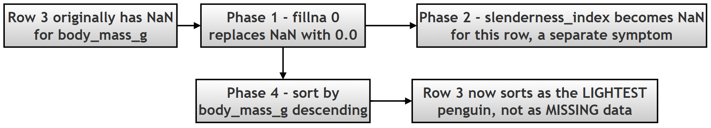

# Basic Data Manipulations: Deriving Metrics, Removing Columns, and Sorting

## What this page covers

The two previous pages in this chapter dealt with *fixing problems* in data — missing values on one page, structural mess (bad names, wrong types, duplicates) on the other. This page is about something more constructive: actively **shaping** a clean dataset to answer a real question. Specifically, it covers three everyday Pandas skills that go together naturally in almost any analysis:

1. **Deriving a new column** from existing ones — turning two raw measurements into a single, more meaningful metric.
2. **Removing columns** you no longer need — and understanding the real, practical differences between the three ways Pandas lets you do this.
3. **Sorting** a dataset — by one column, or by several at once — to surface the rows that matter most for a particular question.

Along the way, this page also digs into one of the most important — and most often glossed-over — ideas in Pandas: the difference between an operation that returns a **new** object and one that changes the **original** object directly (`inplace=True`). Getting this wrong is one of the most common sources of "my code ran with no errors, but nothing changed" bugs in real Pandas code, so it's worth understanding thoroughly, not just memorizing.

**A few terms used throughout, explained simply:**
- **Vectorized operation** — performing a calculation on an *entire column at once*, without writing an explicit loop over each row. This is one of the main reasons Pandas (and its foundation, NumPy) is so much faster than plain Python loops for this kind of work. See the [NumPy documentation on vectorization](https://numpy.org/doc/stable/reference/generated/numpy.vectorize.html) for the underlying concept.
- **Feature engineering** — creating a new, more useful column out of existing data, specifically because it captures something the raw columns don't show on their own (the `slenderness_index` in this project is a simple example). ([Wikipedia: Feature engineering](https://en.wikipedia.org/wiki/Feature_engineering))
- **`inf`** — Pandas/Python's representation of mathematical infinity, which shows up when you divide a non-zero number by zero.
- **`KeyError`** — the specific error Python raises when you try to access a dictionary key, or a Pandas column, that doesn't actually exist.

---

## Research Topic: Deriving Metrics and Organizing Penguin Morphology

*(This is the original research question and project scenario from the book. A short set of optional follow-up questions has been added after the Conceptual Deep Dive.)*

**Research Question:** *How can derived metrics be constructed from existing data, irrelevant data be removed, and the resulting dataset be sorted to facilitate comparative biological analysis?*

**Project Scenario:** A marine biologist hypothesizes that the ratio of bill length to bill depth (the "Slenderness Index") varies significantly between species. To test this, the dataset must be manipulated to:

1. Calculate a new column: `slenderness_index` (Bill Length / Bill Depth).
2. Remove non-essential categorical data (`sex`, `island`) to focus purely on physical morphology.
3. Sort the dataset to identify penguins with the most extreme body structures.

**Task:** Using the Palmer Penguins dataset, write a script to generate the new metric, clean the dataframe using both `inplace` and reassignment methods, and sort the results by species and body mass.

---

## 1. Conceptual Deep Dive

Before execution, one must understand the mechanics of vectorization, deletion strategies, and sorting algorithms in Pandas.

### A. Adding New Columns

Pandas allows for **vectorized operations**, meaning one can perform math on entire columns without writing loops — you write the calculation once, and Pandas applies it to every row automatically and efficiently.

| Syntax | Description | Example |
| --- | --- | --- |
| `df['new'] = df['a'] + df['b']` | Element-wise addition (or any math) | `df['total'] = df['x'] + df['y']` |
| `df['new'] = df['col'].str.upper()` | String manipulation, applied to every row's text at once | `df['name'] = df['name'].str.upper()` |

```python
# ERROR EXAMPLE: Mismatched lengths
# df['new_col'] = [1, 2, 3]
# ValueError: Length of values (3) does not match length of index (344)
```

This last example matters conceptually: a new column has to line up, row for row, with the DataFrame it's being added to — Pandas won't guess how a shorter list should be matched up against a longer DataFrame, so it refuses outright rather than silently doing something ambiguous.

### B. Deleting Columns

There are two primary ways to remove data, with genuinely different behavior — this distinction is explored in full detail in Phase 3 of the script below, but the short version is captured here first.

| Method | Syntax | Behavior |
| --- | --- | --- |
| `.drop()` | `df.drop('col', axis=1)` | Returns a **new** DataFrame. The original remains unchanged unless `inplace=True` is passed. Flexible — can drop rows too, via `axis=0`. |
| `del` | `del df['col']` | Directly deletes the column from the **original** DataFrame, immediately. Returns nothing at all. |

### C. Inplace vs. Reassignment

This is a fundamental concept in Python data science — one that comes up constantly, well beyond just column deletion.

| Parameter | Mode | Explanation |
| --- | --- | --- |
| `inplace=True` | In-place | The operation modifies the object itself, directly. No value is returned (technically, it returns `None`). |
| `inplace=False` (the default) | Copy | The operation creates a new copy of the data, modifies *that* copy, and returns it. The original object is left completely untouched. |

> **Why this distinction matters so much in practice:** if you call a method with `inplace=False` (the default for most Pandas methods) and forget to capture its return value in a variable, your change is silently thrown away — the code runs without any error at all, which makes this a notoriously easy mistake to miss. This exact scenario is demonstrated directly in Phase 3, Step 3.1 below.

### D. Sorting Data

The `.sort_values()` method arranges rows based on the values in one or more columns.

| Parameter | Option | Effect |
| --- | --- | --- |
| `by` | A string, or a list of strings | Determines which column(s) to sort by |
| `ascending` | A boolean, or a list of booleans | `True` = low to high, `False` = high to low. Can be set *differently for each column* when sorting by more than one |
| `na_position` | `'first'` or `'last'` | Where missing values (`NaN`) should appear in the sorted result |

---

## Optional Follow-Up Questions

*(Additional questions, for readers who want to explore this topic further.)*

1. Step 2.1 below shows that `0.0 / 0.0` produces `NaN`, not `inf`. Try calculating `5.0 / 0.0` in a small test DataFrame instead — what do you get, and how is it different from `0.0 / 0.0`? (The "Important Observation" note under Phase 4 explains the underlying reason, if you'd like to check your answer.)
2. `.sort_values()` has a close relative, `.sort_index()`, which sorts by the row **labels** instead of by column values. After Step 2.4 of the previous chapter page set a `penguin_id` index, what do you think `.sort_index()` would do to that DataFrame?
3. Try adding `na_position='first'` to one of the `.sort_values()` calls in Step 4.1 below. How does the position of the row with the missing (now zero-filled) `body_mass_g` value change in the output?

---

## The Script

---

### STEP 0: Import Libraries and Load Dataset

#### Purpose

To initialize the working environment and load the dataset into a Pandas DataFrame — the necessary starting point before any of the manipulations covered on this page can happen.

#### Methods Used

**`sns.load_dataset()`**
```python
df = sns.load_dataset('penguins')
```

**Signature**
```python
seaborn.load_dataset(name)
```
| Aspect | Explanation |
| --- | --- |
| Input | Dataset name (string) |
| Output | Pandas DataFrame |
| Dependency | May require internet access the first time it's used |

**`df.head()`**
```python
df.head()
```
| Aspect | Explanation |
| --- | --- |
| Purpose | Preview the first 5 rows |
| Output | A DataFrame subset |

**`df.dtypes`**
- Purpose → Shows the data type of each column
- Output → A `Series`

**`df.shape`**
- Purpose → Shows the overall dimensions
- Output → A tuple `(rows, columns)`

#### Script for STEP 0

```python
# ==========================================================
# STEP 0: IMPORT LIBRARIES AND LOAD DATASET
# ==========================================================

print("\nSTEP 0: IMPORT LIBRARIES AND LOAD DATASET")

import pandas as pd
import seaborn as sns

# Step 1: load the Palmer Penguins dataset -- our starting point
# for everything else on this page.
df = sns.load_dataset('penguins')

print("\nInitial Data Overview:")
print(df.head())  # Display the first 5 rows to understand the structure and columns of the dataset.
print("Data types:\n", df.dtypes)  # Show the data types of each column to identify any potential issues for calculations or sorting.
print("Shape:", df.shape)  # Show the number of rows and columns in the dataset to understand its size and dimensionality.
```

#### Output for STEP 0

```text
STEP 0: IMPORT LIBRARIES AND LOAD DATASET

Initial Data Overview:
  species     island  bill_length_mm  bill_depth_mm  flipper_length_mm  body_mass_g     sex
0  Adelie  Torgersen            39.1           18.7              181.0       3750.0    Male
1  Adelie  Torgersen            39.5           17.4              186.0       3800.0  Female
2  Adelie  Torgersen            40.3           18.0              195.0       3250.0  Female
3  Adelie  Torgersen             NaN            NaN                NaN          NaN     NaN
4  Adelie  Torgersen            36.7           19.3              193.0       3450.0  Female
Data types:
 species               object
island                object
bill_length_mm       float64
bill_depth_mm        float64
flipper_length_mm    float64
body_mass_g          float64
sex                   object
dtype: object
Shape: (344, 7)
```

#### Output Explanation

- The first 5 rows show the dataset's structure — columns like `species`, `bill_length_mm`, and so on.
- `dtypes` identifies which columns are numeric (`float64`) versus categorical text (`object`) — this matters directly for Phase 2, since the `slenderness_index` calculation only makes sense on the numeric columns.
- `shape` confirms the dataset's size: `(344, 7)` — 344 penguins, 7 columns of data about each one.

---

### PHASE 1: Data Preparation

#### STEP 1.1: Handling Missing Values

**Purpose:** to ensure that later operations — specifically, the division used to calculate `slenderness_index` in Phase 2 — don't fail outright because of missing values.

**Method Used**

```python
df = df.fillna(0)
```
**Signature**
```python
DataFrame.fillna(value, axis=None, inplace=False)
```

**Do's and Don'ts**

- Useful for a quick, teaching-focused fix, or in situations where `0` is a genuinely meaningful "no data" value for every column involved.
- Avoid blindly replacing every `NaN` in an entire DataFrame with `0` in real analysis — it can badly distort statistical results, and (as Phase 4 demonstrates directly) can make a *missing* measurement look like the *smallest possible* real measurement, which is a very different, and misleading, thing.

#### Script for Phase 1

```python
# ==========================================================
# PHASE 1: DATA PREPARATION
# ==========================================================

print("\nPHASE 1: DATA PREPARATION")

# ----------------------------------------------------------
# STEP 1.1: Handling Missing Values (Basic Strategy)
# ----------------------------------------------------------
print("\nSTEP 1.1: Handling Missing Values")

# NOTE:
# Filling all missing values with 0 is simple but NOT always ideal.
# It is done here only to avoid division errors in a teaching context.

df = df.fillna(0)  # This replaces all NaN values in the DataFrame with 0.
print("Missing values handled using fillna(0)")

# Better practice (not used here for simplicity):
# df['bill_length_mm'].fillna(df['bill_length_mm'].mean())
```

#### Output for Phase 1

```text
PHASE 1: DATA PREPARATION

STEP 1.1: Handling Missing Values
Missing values handled using fillna(0)
```

#### Output Explanation

Every `NaN` value across the entire DataFrame has now been replaced with `0` — quietly, and without any error, since `0` is a perfectly valid float value as far as Pandas is concerned. This sets up the "Common Issue" flagged below.

#### Common Issue to Watch For

```python
df['bill_length_mm'] / df['bill_depth_mm']
```

> If the denominator is `0` → this normally produces **`inf`** (infinity) values, since dividing a non-zero number by zero is mathematically undefined in the "grows without bound" sense. Phase 2 below shows a related but distinct case worth understanding carefully.

---

### PHASE 2: Adding Calculated Columns

#### STEP 2.1: Create Slenderness Index

**Purpose:** to derive a brand-new feature (this is exactly what **feature engineering** means) — a single number that captures the *shape* of a penguin's bill, rather than its length and depth as two separate, harder-to-compare figures.

**Operation Used**

```python
df['new_col'] = df['col1'] / df['col2']
```

| Column | Meaning |
| --- | --- |
| `bill_length_mm` | How long the bill is |
| `bill_depth_mm` | How deep (thick) the bill is |
| `slenderness_index` | The ratio between the two — a higher value means a proportionally longer, thinner bill |

#### Script for Phase 2

```python
# ==========================================================
# PHASE 2: ADDING CALCULATED COLUMNS
# ==========================================================

print("\nPHASE 2: ADDING CALCULATED COLUMNS")

# ----------------------------------------------------------
# STEP 2.1: Create Slenderness Index
# ----------------------------------------------------------
print("\nSTEP 2.1: Creating 'slenderness_index'")

# Formula:
# slenderness_index = bill_length_mm / bill_depth_mm
# This new column gives us an idea of how slender the penguin's bill is.
# Potential issue: since we filled missing values with 0 in Phase 1,
# some rows now have bill_depth_mm = 0.0 -- see the output explanation
# below for exactly what happens to those rows.
df['slenderness_index'] = df['bill_length_mm'] / df['bill_depth_mm']

# In a real analysis, we would want to handle this more carefully --
# for example, by filling missing values with the column's mean or
# median instead of 0 (see the previous chapter page on missing
# values), rather than accepting whatever this calculation produces
# for rows that were originally incomplete.

# ERROR EXAMPLE: creating a new column from a non-existent column
# raises a KeyError, since Pandas has no 'unknown_column' to read from.
# df['new_col'] = df['unknown_column'] * 2

print("\nNew column preview:")
print(df[['bill_length_mm', 'bill_depth_mm', 'slenderness_index']].head())
# Shows the original bill_length_mm and bill_depth_mm alongside the
# new slenderness_index, for the first 5 rows.
```

#### Output for Phase 2

```text
PHASE 2: ADDING CALCULATED COLUMNS

STEP 2.1: Creating 'slenderness_index'

New column preview:
   bill_length_mm  bill_depth_mm  slenderness_index
0            39.1           18.7           2.090909
1            39.5           17.4           2.270115
2            40.3           18.0           2.238889
3             0.0            0.0                NaN
4            36.7           19.3           1.901554
```

#### Output Explanation

The script is working correctly. For example, row 0 gives `39.1 / 18.7 = 2.090909` — a real, meaningful slenderness value. But look closely at row 3: it shows `0.0 / 0.0 = NaN`, **not** `inf`.

This is a subtle but important mathematical distinction, worth spelling out clearly:

| Calculation | Result | Why |
| --- | --- | --- |
| `5.0 / 0.0` | `inf` | A non-zero number divided by zero "blows up" toward infinity |
| `0.0 / 0.0` | `NaN` | This is mathematically **undefined**, not infinite — there's no consistent value it could be, so Pandas/NumPy represents it as "Not a Number" instead |

Row 3 in this dataset was originally an entirely missing row — both `bill_length_mm` and `bill_depth_mm` were `NaN` before Phase 1's `fillna(0)` turned them both into `0.0`. So dividing `0.0 / 0.0` here isn't really "a slenderness index of undefined" in any meaningful biological sense — it's a direct, visible symptom of the fact that this row never had real data to begin with, quietly carried forward from Phase 1's blunt fix. Keep this in mind as you read the "Important Hidden Lesson" further down this page, in Phase 4.

---

### PHASE 3: Deleting Columns

#### STEP 3.1: Using `.drop()` with Reassignment

**Purpose:** to remove columns *safely*, without touching the original DataFrame at all.

**Method**
```python
df.drop(columns=['col'])
```
**Signature**
```python
DataFrame.drop(labels=None, axis=0, columns=None, inplace=False)
```

Since `inplace` defaults to `False`, this call returns a **brand-new** DataFrame with the column removed — the original `df` is left completely untouched unless you explicitly reassign the result back to a variable.

#### STEP 3.2: Using `del`

**Purpose:** to remove a column permanently, directly from the object you're calling it on — no separate reassignment step involved at all.

**Method**
```python
del df['col']
```

| Feature | Result |
| --- | --- |
| Returns | Nothing at all |
| Effect | Immediate and permanent — there's no `inplace` parameter to consider, because `del` is *always* in-place by its very nature |

#### STEP 3.3: Using `.drop(inplace=True)`

**Purpose:** to modify a DataFrame directly using `.drop()`, without needing a separate reassignment step — a middle ground between Steps 3.1 and 3.2.

**Method**
```python
df.drop(columns=['col'], inplace=True)
```

#### Comparison of All Three Approaches

| Approach | Safe (leaves original untouched)? | Generally Recommended? |
| --- | --- | --- |
| `.drop()` + reassignment | Yes — the original object is never touched | **Preferred** — the intent is explicit and visible right there in the code |
| `del` | No — modifies the object directly and immediately | Use sparingly; there's no way to "undo" or "preview" it |
| `.drop(inplace=True)` | No — modifies the object directly | Avoid where possible — see the caution below |

> **A word of caution on `inplace=True`, expanded:** because it modifies an object silently and returns nothing, code using `inplace=True` can be genuinely harder to read and debug later — a reader scanning the code has to specifically notice the `inplace=True` keyword argument to realize the DataFrame changed at that line at all, rather than seeing an obvious reassignment like `df = df.drop(...)`. Many experienced Pandas users therefore prefer reassignment even when it means typing a few more characters, purely for this readability benefit — this is exactly why the Best Practice note in the Summary at the end of this page recommends it.

**Error to be aware of:**
```python
df.drop(columns=['col'])  # No assignment -> genuinely no effect at all
```
This is precisely the silent-failure trap described in Concept C above — the call runs successfully, computes the new DataFrame correctly, and then throws that result away because nothing captured it.

#### Script for Phase 3

```python
# ==========================================================
# PHASE 3: DELETING COLUMNS
# ==========================================================

print("\nPHASE 3: DELETING COLUMNS")

# ----------------------------------------------------------
# STEP 3.1: Using drop() with Reassignment
# ----------------------------------------------------------
print("\nSTEP 3.1: Using drop() with reassignment")

cols_to_remove = ['sex']  # We will only remove 'sex' here, leaving 'island' for the next step.

# drop() returns a NEW DataFrame with the specified columns removed,
# so we must assign it back to a variable to actually keep the result.
df_reassigned = df.drop(columns=cols_to_remove)

print(f"Does Original df have column for 'sex'?->: {'sex' in df.columns}")  # True, because we haven't modified the original df yet.
print(f"Does df_reassigned have column for 'sex'?->: {'sex' in df_reassigned.columns}")  # False, because we dropped 'sex' in df_reassigned.


# ----------------------------------------------------------
# STEP 3.2: Using del (In-place Deletion)
# ----------------------------------------------------------
print("\nSTEP 3.2: Using del")

# 'del' permanently modifies the DataFrame it's applied to -- here,
# that's df_reassigned, NOT the original df.
del df_reassigned['island']  # This removes 'island' from df_reassigned permanently.

print(f"Has column 'island' been removed using del? -> {'island' not in df_reassigned.columns}")  # True.

# ERROR EXAMPLE: using del on a column that doesn't exist raises a KeyError.
# del df['non_existing_column']


# ----------------------------------------------------------
# STEP 3.3: Using drop() with inplace=True
# ----------------------------------------------------------
print("\nSTEP 3.3: Using drop() with inplace=True")

# inplace=True modifies df_reassigned DIRECTLY -- so, unlike Step 3.1,
# we do NOT need to assign the result back to a variable here.
df_reassigned.drop(columns=['species'], inplace=True)

print(f"Has column 'species' been removed using inplace? -> {'species' not in df_reassigned.columns}")  # True.

# ERROR EXAMPLE: calling drop() without EITHER assignment or
# inplace=True has NO EFFECT AT ALL -- the computed result is
# thrown away, and the original DataFrame is left unchanged.
# df.drop(columns=['col'])  # No assignment -> no effect
```

#### Output for Phase 3

```text
PHASE 3: DELETING COLUMNS

STEP 3.1: Using drop() with reassignment
Does Original df have column for 'sex'?->: True
Does df_reassigned have column for 'sex'?->: False

STEP 3.2: Using del
Has column 'island' been removed using del? -> True

STEP 3.3: Using drop() with inplace=True
Has column 'species' been removed using inplace? -> True
```

#### Explanation of Output

- **STEP 3.1** — `.drop()` does **not** modify the original `df` at all — it creates and returns a separate, new DataFrame (`df_reassigned`). This is exactly why `df` still has `sex`, while `df_reassigned` no longer does.
- **STEP 3.2** — `'island'` is removed directly from `df_reassigned`, permanently — there's no "new object" involved at all here; the same object is simply changed.
- **STEP 3.3** — `.drop(inplace=True)` directly modifies `df_reassigned` once again — no new object is created, and (unlike Step 3.1) nothing needs to be reassigned for the change to take effect.

By the end of Phase 3, `df_reassigned` has had `sex`, `island`, and `species` all removed — through three genuinely different mechanisms — while the original `df` retains every one of its columns, completely unaffected by any of it.

---

### PHASE 4: Sorting Data

#### STEP 4.1: Single Column Sorting

**Purpose:** to rank the data by a single measurement — here, finding the heaviest penguins.

**Method**
```python
df.sort_values(by='column', ascending=False)
```
**Signature**
```python
DataFrame.sort_values(by, ascending=True)
```

#### STEP 4.2: Multi-Column Sorting

**Purpose:** to perform **hierarchical sorting** — sorting by more than one column at once, where the second column only matters for breaking ties within groups defined by the first.

**Method**
```python
df.sort_values(by=[col1, col2], ascending=[True, False])
```

**Logic, spelled out step by step:**
1. First, sort by `species`, alphabetically (A → Z).
2. *Within* each species group, sort by `body_mass_g`, from heaviest to lightest.

**Filtering** (a reminder of syntax covered earlier in the book, used here to isolate one species after sorting):
```python
df[df['species'] == 'Adelie']
```

**Error to be aware of:**
```python
df.sort_values(by='wrong_column')  # raises a KeyError
```

> Note: since sorting is performed on the original `df` (not on `df_reassigned` from Phase 3), all the original columns — including `island`, used in Step 4.2's final display — are still fully available here.

#### Script for Phase 4

```python
# ==========================================================
# PHASE 4: SORTING DATA
# ==========================================================

print("\nPHASE 4: SORTING DATA")

# NOTE:
# Sorting is performed on the ORIGINAL df (not df_reassigned from
# Phase 3), specifically so every column -- including 'island',
# used further down -- is still available to us here.


# ----------------------------------------------------------
# STEP 4.1: Single Column Sorting
# ----------------------------------------------------------
print("\nSTEP 4.1: Sorting by single column")

# Sort by body mass, descending -- heaviest penguins appear first.
df_heaviest = df.sort_values(by='body_mass_g', ascending=False)

print("\nTop 3 heaviest penguins:")
# .head(3) on the SORTED DataFrame gives us the 3 heaviest
# penguins in the entire dataset.
print(df_heaviest[['species', 'body_mass_g']].head(3))


# ----------------------------------------------------------
# STEP 4.2: Multi-Column Sorting
# ----------------------------------------------------------
print("\nSTEP 4.2: Sorting by multiple columns")

# Sort by species (ascending, A-Z) and THEN, within each species
# group, by body mass (descending, heaviest to lightest).
sort_criteria = ['species', 'body_mass_g']
ascending_rules = [True, False]  # True for species (A-Z), False for body mass (heaviest first)

df_sorted_complex = df.sort_values(by=sort_criteria, ascending=ascending_rules)

# Filter down to just the Adelie species, AFTER the sort above --
# this preserves the heaviest-to-lightest ordering within the group.
adelies = df_sorted_complex[df_sorted_complex['species'] == 'Adelie']

print("\nLast 3 Adelie penguins (sorted by mass):")
# Since Adelie rows are sorted heaviest-first, the LAST 3 rows of
# this filtered group are the 3 LIGHTEST Adelie penguins.
print(adelies[['species', 'body_mass_g', 'island']].tail(3))

# ERROR EXAMPLE: sorting by a column that doesn't exist raises a KeyError.
# df.sort_values(by='non_existing_column')
```

#### Output for Phase 4

```text
PHASE 4: SORTING DATA

STEP 4.1: Sorting by single column

Top 3 heaviest penguins:
    species  body_mass_g
237  Gentoo       6300.0
253  Gentoo       6050.0
297  Gentoo       6000.0

STEP 4.2: Sorting by multiple columns

Last 3 Adelie penguins (sorted by mass):
   species  body_mass_g     island
58  Adelie       2850.0     Biscoe
64  Adelie       2850.0     Biscoe
3   Adelie          0.0  Torgersen
```

#### Explanation of Output

- **STEP 4.1: Single Column Sorting.** Sorted by `body_mass_g`, descending — the top rows are genuinely the heaviest penguins in the whole dataset, and (worth noting as a small biological aside) all three are Gentoo penguins, the largest of the three species here.
- **STEP 4.2: Multi-Column Sorting.** The DataFrame is sorted first by `species` (A → Z), then — within each species — by `body_mass_g` (heaviest → lightest).
  - **Sub-step 4.2.2 — Filtering:** selects only the `Adelie` rows out of the fully sorted DataFrame.
  - **Sub-step 4.2.3 — `.tail(3)`:** since Adelie rows are already ordered heaviest-first, the *last* 3 rows of that filtered group are the 3 *lightest* Adelie penguins.

#### Important Observation

Look carefully at the very last row: `body_mass_g = 0.0`. This isn't a real penguin that happened to weigh nothing — it comes directly from Phase 1's `fillna(0)`. So what actually happened here is: **an originally missing value has, by the end of this pipeline, been sorted in as if it were the single lightest penguin in the entire dataset.**




#### Important Hidden Lesson

Filling missing values with `0` can genuinely mislead an analysis — not through some obscure edge case, but through exactly the ordinary, expected behavior of every method used in this script.

> **Example directly from this page's own output:** a `0.0` body mass appears at the very bottom of the sorted Adelie penguins, looking exactly like a real, lightweight penguin — when it's actually just a missing measurement that got quietly converted into a number early in Phase 1, and then carried that disguise through every step afterward. Nothing in the code raised an error or a warning anywhere along the way; the only way to catch this is to already know it might be there and go looking for it, which is precisely the value of understanding — rather than just running — a script like this one.

This connects directly back to the previous chapter page's coverage of `.fillna()`: choosing a fill value isn't just a technical formality, it's a decision that can actively shape — and in this case, actively mislead — the conclusions drawn from a sort, a mean, or any other calculation performed afterward.

---

## The Complete Script in a Single Block

For convenience, here is the entire project — Step 0 through Phase 4 and the final summary — combined into one runnable file, followed by its complete, real output.

```python
"""
PROJECT: Basic Data Manipulations in Pandas
DATASET: Palmer Penguins

OBJECTIVE:
1. Add calculated columns
2. Delete columns using different methods
3. Understand inplace vs reassignment
4. Sort data

NOTE:
This script is structured for teaching with detailed explanations.
"""

# ==========================================================
# STEP 0: IMPORT LIBRARIES AND LOAD DATASET
# ==========================================================

print("\nSTEP 0: IMPORT LIBRARIES AND LOAD DATASET")

import pandas as pd
import seaborn as sns

df = sns.load_dataset('penguins')

print("\nInitial Data Overview:")
print(df.head())  # Display the first 5 rows to understand the structure and columns of the dataset.
print("Data types:\n", df.dtypes)  # Show the data types of each column to identify any potential issues for calculations or sorting.
print("Shape:", df.shape)  # Show the number of rows and columns in the dataset to understand its size and dimensionality.


# ==========================================================
# PHASE 1: DATA PREPARATION
# ==========================================================

print("\nPHASE 1: DATA PREPARATION")

# ----------------------------------------------------------
# STEP 1.1: Handling Missing Values (Basic Strategy)
# ----------------------------------------------------------
print("\nSTEP 1.1: Handling Missing Values")

# NOTE:
# Filling all missing values with 0 is simple but NOT always ideal.
# It is done here only to avoid division errors in a teaching context.

df = df.fillna(0)  # This replaces all NaN values in the DataFrame with 0.
print("Missing values handled using fillna(0)")

# Better practice (not used here for simplicity):
# df['bill_length_mm'].fillna(df['bill_length_mm'].mean())


# ==========================================================
# PHASE 2: ADDING CALCULATED COLUMNS
# ==========================================================

print("\nPHASE 2: ADDING CALCULATED COLUMNS")

# ----------------------------------------------------------
# STEP 2.1: Create Slenderness Index
# ----------------------------------------------------------
print("\nSTEP 2.1: Creating 'slenderness_index'")

# Formula:
# slenderness_index = bill_length_mm / bill_depth_mm
# This new column gives us an idea of how slender the penguin's bill is.
# Potential issue: since we filled missing values with 0 in Phase 1,
# some rows now have bill_depth_mm = 0.0.
df['slenderness_index'] = df['bill_length_mm'] / df['bill_depth_mm']

# In a real analysis, we would want to handle this more carefully
# (e.g. filling missing values with the column's mean or median
# instead of 0, rather than accepting whatever this division
# produces for originally-incomplete rows).

# ERROR EXAMPLE: creating a new column based on a non-existing
# column raises a KeyError.
# df['new_col'] = df['unknown_column'] * 2

print("\nNew column preview:")
print(df[['bill_length_mm', 'bill_depth_mm', 'slenderness_index']].head())
# Shows the original bill_length_mm and bill_depth_mm along with the
# new slenderness_index for the first 5 rows.


# ==========================================================
# PHASE 3: DELETING COLUMNS
# ==========================================================

print("\nPHASE 3: DELETING COLUMNS")

# ----------------------------------------------------------
# STEP 3.1: Using drop() with Reassignment
# ----------------------------------------------------------
print("\nSTEP 3.1: Using drop() with reassignment")

cols_to_remove = ['sex']  # We will only remove 'sex' here, leaving 'island' for the next step.

# drop() returns a new DataFrame with the specified columns removed,
# so we need to assign it back to a variable.
df_reassigned = df.drop(columns=cols_to_remove)

print(f"Does Original df have column for 'sex'?->: {'sex' in df.columns}")  # True, because we haven't modified the original df yet.
print(f"Does df_reassigned have column for 'sex'?->: {'sex' in df_reassigned.columns}")  # False, because we dropped 'sex' in df_reassigned.


# ----------------------------------------------------------
# STEP 3.2: Using del (In-place Deletion)
# ----------------------------------------------------------
print("\nSTEP 3.2: Using del")

# 'del' permanently modifies the DataFrame
del df_reassigned['island']  # This will remove the 'island' column from df_reassigned permanently.

print(f"Has column 'island' been removed using del? -> {'island' not in df_reassigned.columns}")  # True, because 'island' has been deleted from df_reassigned.

# ERROR EXAMPLE: Using del on a non-existing column will raise a KeyError.
# del df['non_existing_column']


# ----------------------------------------------------------
# STEP 3.3: Using drop() with inplace=True
# ----------------------------------------------------------
print("\nSTEP 3.3: Using drop() with inplace=True")
# inplace=True modifies the DataFrame directly, so we don't need to assign it back to df_reassigned.
df_reassigned.drop(columns=['species'], inplace=True)

print(f"Has column 'species' been removed using inplace? -> {'species' not in df_reassigned.columns}")  # True, because 'species' has been deleted from df_reassigned.

# ERROR EXAMPLE: Using drop() without assignment or inplace=True will have no effect.
# df.drop(columns=['col'])  # No assignment -> no effect


# ==========================================================
# PHASE 4: SORTING DATA
# ==========================================================

print("\nPHASE 4: SORTING DATA")

# NOTE:
# Sorting is performed on original df to preserve all columns


# ----------------------------------------------------------
# STEP 4.1: Single Column Sorting
# ----------------------------------------------------------
print("\nSTEP 4.1: Sorting by single column")

# Sort by body mass (descending)
df_heaviest = df.sort_values(by='body_mass_g', ascending=False)

print("\nTop 3 heaviest penguins:")
# This will show the top 3 rows of the DataFrame sorted by body mass in descending order,
# which corresponds to the 3 heaviest penguins.
print(df_heaviest[['species', 'body_mass_g']].head(3))


# ----------------------------------------------------------
# STEP 4.2: Multi-Column Sorting
# ----------------------------------------------------------
print("\nSTEP 4.2: Sorting by multiple columns")

# Sort by species (ascending) and then by body mass (descending)
# This will sort the DataFrame first by 'species' in alphabetical order, and then within each species,
# it will sort by 'body_mass_g' from heaviest to lightest.
sort_criteria = ['species', 'body_mass_g']
ascending_rules = [True, False]  # True for species (A-Z), False for body mass (heaviest to lightest)

df_sorted_complex = df.sort_values(by=sort_criteria, ascending=ascending_rules)

# Filter Adelie penguins
# After sorting, we filter the DataFrame to only include rows where the 'species' column is 'Adelie'.
adelies = df_sorted_complex[df_sorted_complex['species'] == 'Adelie']

print("\nLast 3 Adelie penguins (sorted by mass):")
# This will show the last 3 rows of the filtered DataFrame, which corresponds to the
# 3 lightest Adelie penguins due to the sorting order because we had earlier sorted by body mass in descending order.
# So lightest Adelie penguins will be at the end of the Adelie group in the sorted DataFrame.
print(adelies[['species', 'body_mass_g', 'island']].tail(3))

# ERROR EXAMPLE: Sorting by a non-existing column will raise a KeyError.
# df.sort_values(by='non_existing_column')


# ==========================================================
# STEP 5: SUMMARY
# ==========================================================

print("\nSTEP 5: SUMMARY")

print("""
KEY LEARNINGS:

1. New columns can be derived using arithmetic operations
2. Columns can be deleted using drop() or del
3. inplace=True modifies the DataFrame directly
4. Sorting helps organize and analyze data efficiently

BEST PRACTICE:

- Prefer reassignment over inplace for clarity
- Always check column names before operations
- Handle missing values thoughtfully (avoid blind fillna(0))
""")
```

### Complete Output

```text
STEP 0: IMPORT LIBRARIES AND LOAD DATASET

Initial Data Overview:
  species     island  bill_length_mm  bill_depth_mm  flipper_length_mm  body_mass_g     sex
0  Adelie  Torgersen            39.1           18.7              181.0       3750.0    Male
1  Adelie  Torgersen            39.5           17.4              186.0       3800.0  Female
2  Adelie  Torgersen            40.3           18.0              195.0       3250.0  Female
3  Adelie  Torgersen             NaN            NaN                NaN          NaN     NaN
4  Adelie  Torgersen            36.7           19.3              193.0       3450.0  Female
Data types:
 species               object
island                object
bill_length_mm       float64
bill_depth_mm        float64
flipper_length_mm    float64
body_mass_g          float64
sex                   object
dtype: object
Shape: (344, 7)

PHASE 1: DATA PREPARATION

STEP 1.1: Handling Missing Values
Missing values handled using fillna(0)

PHASE 2: ADDING CALCULATED COLUMNS

STEP 2.1: Creating 'slenderness_index'

New column preview:
   bill_length_mm  bill_depth_mm  slenderness_index
0            39.1           18.7           2.090909
1            39.5           17.4           2.270115
2            40.3           18.0           2.238889
3             0.0            0.0                NaN
4            36.7           19.3           1.901554

PHASE 3: DELETING COLUMNS

STEP 3.1: Using drop() with reassignment
Does Original df have column for 'sex'?->: True
Does df_reassigned have column for 'sex'?->: False

STEP 3.2: Using del
Has column 'island' been removed using del? -> True

STEP 3.3: Using drop() with inplace=True
Has column 'species' been removed using inplace? -> True

PHASE 4: SORTING DATA

STEP 4.1: Sorting by single column

Top 3 heaviest penguins:
    species  body_mass_g
237  Gentoo       6300.0
253  Gentoo       6050.0
297  Gentoo       6000.0

STEP 4.2: Sorting by multiple columns

Last 3 Adelie penguins (sorted by mass):
   species  body_mass_g     island
58  Adelie       2850.0     Biscoe
64  Adelie       2850.0     Biscoe
3   Adelie          0.0  Torgersen

STEP 5: SUMMARY

KEY LEARNINGS:

1. New columns can be derived using arithmetic operations
2. Columns can be deleted using drop() or del
3. inplace=True modifies the DataFrame directly
4. Sorting helps organize and analyze data efficiently

BEST PRACTICE:

- Prefer reassignment over inplace for clarity
- Always check column names before operations
- Handle missing values thoughtfully (avoid blind fillna(0))
```

This confirms the full pipeline end to end: the dataset is loaded at `(344, 7)`, a new `slenderness_index` column is added, three different column-removal techniques are demonstrated on a separate copy (`df_reassigned`) without ever touching the original `df`, and the final sorts correctly surface both the heaviest real penguins (all Gentoo) and — as the "Important Hidden Lesson" above discusses — one row that only *looks* like the lightest Adelie penguin, but is really just missing data in disguise.

---

## STEP 5: Summary

### Purpose

To reinforce the key concepts covered on this page, and the best practices that follow directly from them.

### Master Comparison Table

| Operation | Method | Returns New Object? | Main Risk |
| --- | --- | --- | --- |
| Add Column | `df['new'] = ...` | No — modifies `df` directly | Division errors (`inf`/`NaN`), or mismatched lengths |
| Drop (reassigned) | `.drop()` | Yes | Forgetting to capture the result → no effect at all |
| Delete | `del df['col']` | No | Permanent and immediate — no preview or undo |
| Drop (inplace) | `.drop(inplace=True)` | No | Can be harder to read/debug later, per the caution above |
| Sort | `.sort_values()` | Yes | Sorting by a mistyped or non-existent column name |

### Common Errors Summary

| Error | Cause |
| --- | --- |
| `KeyError` | Referencing a column name that doesn't actually exist (in a new-column formula, a `drop()`, or a `sort_values()` call) |
| No change occurred | A method that defaults to returning a new object was called without reassignment, and without `inplace=True` |
| `inf` / `NaN` values | Dividing by zero — `inf` for a non-zero numerator, `NaN` specifically for `0.0 / 0.0` |
| Misleading sorted output | A filled-in placeholder value (like `fillna(0)`) being sorted as though it were real data |

### Script for Step 5

```python
# ==========================================================
# STEP 5: SUMMARY
# ==========================================================

print("\nSTEP 5: SUMMARY")

print("""
KEY LEARNINGS:

1. New columns can be derived using arithmetic operations
2. Columns can be deleted using drop() or del
3. inplace=True modifies the DataFrame directly
4. Sorting helps organize and analyze data efficiently

BEST PRACTICE:

- Prefer reassignment over inplace for clarity
- Always check column names before operations
- Handle missing values thoughtfully (avoid blind fillna(0))
""")
```

### Output for Step 5

```text
STEP 5: SUMMARY

KEY LEARNINGS:

1. New columns can be derived using arithmetic operations
2. Columns can be deleted using drop() or del
3. inplace=True modifies the DataFrame directly
4. Sorting helps organize and analyze data efficiently

BEST PRACTICE:

- Prefer reassignment over inplace for clarity
- Always check column names before operations
- Handle missing values thoughtfully (avoid blind fillna(0))
```

---

## Quick Recap

- **New columns are created with plain arithmetic** on existing columns (`df['new'] = df['a'] / df['b']`) — thanks to vectorization, this applies to every row at once, with no explicit loop needed.
- **`0.0 / 0.0` gives `NaN`, not `inf`** — only a genuinely non-zero number divided by zero produces infinity; dividing zero by zero is undefined, and Pandas represents that with `NaN` instead.
- **There are three ways to delete a column** — `.drop()` + reassignment (safest, most explicit), `del` (immediate and permanent), and `.drop(inplace=True)` (a middle ground, generally best avoided for readability).
- **`inplace=True` vs. reassignment is a recurring theme across Pandas** — forgetting to reassign the result of a method that defaults to `inplace=False` is one of the most common "my code ran fine but nothing changed" bugs a beginner will hit.
- **`.sort_values(by=[...], ascending=[...])`** supports sorting by multiple columns at once, each with its own independent ascending/descending direction.
- **A blunt fix like `fillna(0)` can quietly distort later results** — as this page's own Adelie sorting example shows directly, a filled-in placeholder can end up looking exactly like real, meaningful data once it's been sorted, filtered, or otherwise processed further downstream.


