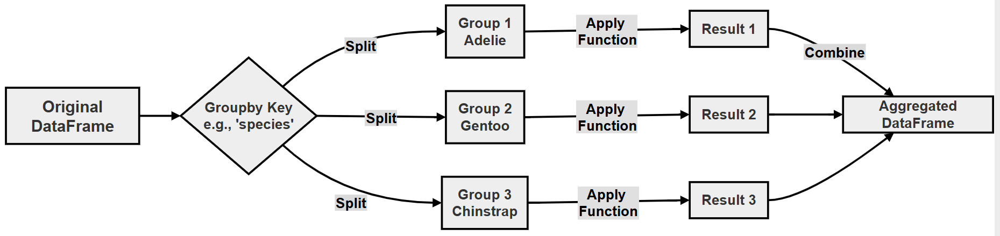

# Chapter 12 (Supplement): Grouping and Aggregation in Pandas

## Split–Apply–Combine: Analyzing Palmer Penguins

> **GitHub source:** [90-ch12-grouping-aggregate.md](https://github.com/ag999git/001-Python-book-2026/blob/main/12andas/90-ch12-grouping-aggregate.md?plain=1)

---

## Introduction — What This Chapter Contains and Why It Matters

In real data analysis, you almost never ask a question about *one row* of data. You ask questions like:

- *"What is the average body mass of each penguin species?"*
- *"Which island has the heaviest penguins?"*
- *"Are there islands with too few observations to be trusted?"*

All of these require **grouping** (splitting data into categories) and **aggregation** (summarizing each category with a number). This is the heart of the **Split–Apply–Combine** strategy, popularized by Hadley Wickham ([original paper here](https://www.jstatsoft.org/article/view/v040i01)).

**In this chapter you will learn:**

| # | Topic | Why it matters |
|---|-------|----------------|
| 1 | `groupby()` — splitting data into groups | The foundation of all summary analysis |
| 2 | `.agg()` — computing one or many statistics per group | Produces reports and summary tables |
| 3 | `.transform()` — group-level values back onto every row | Needed for feature engineering |
| 4 | `.filter()` — keeping or dropping whole groups | Data quality control |
| 5 | Multi-column grouping and MultiIndex | Real datasets are grouped by several keys at once |

> **Note on technical terms:** Words shown in *italics* are briefly explained where they appear, and some include links (like the one above) if you want to go deeper.

---

## Research Topic: Comparative Morphology and Population Stability

**Research Question:** _How can the "Split-Apply-Combine" philosophy be utilized to analyze biological differences between penguin species and filter environmental variables based on population significance?_

**Project Scenario:** A research team requires a statistical breakdown of the Palmer Penguins data to support a hypothesis. Specifically, they need:

1. **Descriptive Statistics:** Average bill length and flipper length per species.
2. **Complex Metrics:** A simultaneous calculation of the mean and maximum body mass for each island.
3. **Data Quality Control:** Filtering out islands that have fewer than 100 observations to ensure statistical significance (islands with too few samples are considered outliers or insufficient for the study).

**Follow-up sub-questions (for practice):**

- (a) After filtering islands with fewer than 100 observations, does any species disappear entirely? Why or why not?
- (b) Which island would you remove, and how many rows are lost?
- (c) If you used `.transform()` instead of `.agg()` for the mean body mass per species, how would the output shape differ, and what could that column be used for?
- (d) What happens to groups containing `NaN` (missing) values if `dropna=False` is set in `groupby()`?

---

## 1. Conceptual Deep Dive — The Split–Apply–Combine Strategy

**Grouping and aggregation** is the core of data analysis. Think of it like grading exam papers:

1. **Split** — Sort the papers into piles by class section.
2. **Apply** — Compute the average score for each pile.
3. **Combine** — Write three averages into one summary table.

The DataFrame is not actually copied into separate variables; it is **virtually partitioned** (that is, Pandas only *remembers* which rows belong to which group — no new data is created until you apply a function).


**Flowchart of Grouping:**



### The Three Stages in a Table

| Stage | Meaning | Penguin example |
|-------|---------|-----------------|
| **Split** | Divide data into groups | Group penguins by species |
| **Apply** | Perform an operation on each group | Compute mean body mass |
|Combine** | Merge results into one output | Return a summary table |

---

## 2. What is `.groupby()`?

### Definition

`groupby()` is a Pandas method used to **split a DataFrame into groups based on one or more keys**, so that operations can be applied **independently to each group**.

>  A **DataFrame** is Pandas' table object (rows and columns); a **Series** is a single column.

### Method Signature

```python
DataFrame.groupby(
    by=None,        # what to group by
    axis=0,         # group along rows (0) or columns (1)
    level=None,     # for MultiIndex grouping
    as_index=True,  # group labels become the index?
    sort=True,      # sort group?
    group_keys=True,# include keys when applying functions
    observed=False, # only observed categories (categorical data)
    dropna=True     # drop groups whose key is NaN?
)
```

### Parameter Explanation Table

| Parameter | Type | Default | Description | Example |
|-----------|------|---------|-------------|---------|
| `by` | label / list / function | `None` | Column(s) used for grouping | `'species'`, `['species','island']` |
| `axis` | 0 or 1 | `0` | Group along rows (0) or columns (1) | Usually `0` |
| `level` | int / name | `None` | For MultiIndex grouping | `level=0` |
| `as_index` | bool | `True` | Group labels become the index. `False` → regular columns | `as_index=False` |
| `sort` | bool | `True` | Sort group keys (faster if `False`) | `sort=False` |
| `group_keys` | bool `True` | Include keys in output when applying | Used with `.apply()` |
| `observed` | bool | `False` | Only show observed categories | For categorical data |
| `dropna` | bool | `True` | Drop NA group keys | `False` → include NaN groups |

### Return Type

`groupby()` returns a **`DataFrameGroupBy`** or **`SeriesGroupBy`** object.

>  **Important Insight:** `groupby()` **does NOT compute anything immediately.** It returns a **lazy object** — a set of *instructions* about how to split the data. No math happens until you call something like `.mean()`, `.agg()`, `.filter()`, or `.transform()`.

### Example

```python
grouped = df.groupby("species")
print(type(grouped))
```

```text
<class 'pandas.core.groupby.generic.DataFrameGroupBy'>
```

---

## 3. Typical Usage Patterns (with expected outputs)

### A. Simple Aggregation → `Series`

```python
df.groupby("species")["body_mass_g"].mean()
```

```text
species
Adelie       3700.66
Chinstrap    3733.09
Gentoo       5076.02
Name: body_mass_g, dtype: float64
```

### B. Multiple Aggregations → `DataFrame` (MultiIndex columns)

```python
df.groupby("species").agg(["mean", "max"])
```

### C. Multi-column Grouping → MultiIndex

```python
df.groupby(["species", "island"]).mean()
```

### D. Filtering Groups → Filtered `DataFrame`

```python
df.groupby("species").filter(lambda x: x["body_mass_g"].mean() > 4000)
```

### E. Transformation (Same-Shape Output)

```python
df["mean_mass"] = df.groupby("species")["body_mass_g"].transform("mean")
```

---

## 4. The Three Key Methods: `.agg()`, `.transform()`, `.filter()`

### 4.1 `.agg()` (Aggregation) — "Give me one (or a few) values per group"

Applies one or more functions to each group and **returns a reduced summary** — one row per group.

```python
df.groupby("species")["body_mass_g"].agg(["mean", "max"])
```

**Typical use cases:** summary statistics, reporting (group-wise KPIs), data reduction.

| Parameter | Description |
|-----------|-------------|
| `func` | Function or list of functions (`'mean'`, `['mean','sum']`, or a dict) |
| `**kwargs` | Named aggregations, e.g. `avg_mass=("body_mass_g","mean")` |

### 4.2 `.transform()` (Same-Shape Transformation) — "Compute per group, but keep all rows"

Applies a function to each group and returns output of the **same size as the original data**.

```python
df["mean_mass"] = df.groupby("species")["body_mass_g"].transform("mean")
```

**Typical use cases:** feature engineering (adding a group-mean column), normalization (z-score within a group), comparing a row to its group average.

### 4.3 `.filter()` (Group Filtering) — "Keep or remove entire groups"

Filters entire groups based on a condition and returns a **subset of the original rows**.

```python
df.groupby("species").filter(lambda x: x["body_mass_g"].mean() > 4000)
```

>  **Common error:** `filter()` expects a *function*, not a string:
> ```python
> df.groupby("species").filter("body_mass_g > 4000")  # TypeError!
> ```

**Typical use cases:** removing weak groups, data cleaning (small groups), threshold-based conditional selection.

| Parameter | Description |
|-----------|-------------|
| `func` | Function that returns `True` (keep group) or `False` (drop group) |
| `dropna` | Whether to keep NaN groups |

### 4.4 Comparison Table — Which Method When?

| Method | Syntax | Returns | Output Shape | Use Case | Affects Original? | Common Pitfall |
|--------|--------|---------|--------------|----------|-------------------|----------------|
| `.agg()` | `.agg(['mean','sum'])` | DataFrame / Series | Reduced (one row per group) | Multiple summary statistics | No | Invalid function names (e.g., `'avg'` instead of `'mean'`) |
| `.transform()` | `.transform('mean')` | Series / DataFrame | Same as original data | Add group-level values to each row | No | Expecting a reduced output (it does NOT summarize) |
| `.filter()` | `.filter(func)` DataFrame | Subset of original rows | Remove entire groups by condition | No | Writing a string condition instead of a function |

### 4.5 A Memory Aid

```text
.agg()      → SHRINKS  the data (many rows → one row per group)
.transform()→ KEEPS    the size (group value copied to every row)
.filter()   → REMOVES  whole groups (subset of original rows)
```

---

## 5. The Dataset — Palmer Penguins

We use the **Palmer Penguins** dataset, built into the **seaborn** library ([seaborn docs](https://seaborn.pydata.org/)). It contains measurements of 344 penguins from three species on three islands.

| Column | Meaning |
|--------||
| `species` | Adelie, Chinstrap, or Gentoo |
| `island` | Biscoe, Dream, or Torgersen |
| `bill_length_mm` | Beak length |
| `bill_depth_mm` | Beak depth |
| `flipper_length_mm` | Flipper length |
| `body_mass_g` | Body weight in grams |
| `sex` | Male / Female |

>  The dataset contains **missing values (NaN)** in a few rows. Aggregation functions like `.mean()` automatically skip them, but `.count()` counts non-missing values, so counts may vary slightly between columns. This is why we use `.size()` (total rows per group) when counting observations for quality control.

---

## 6. Solution Script — Step by Step

### STEP 0 — Setup: Import libraries and load the dataset

```python
# Step 0: Import libraries and load the Palmer Penguins dataset
import pandas as pd
import seaborn as sns

df = sns.load_dataset("penguins")

print("--- FIRST 5 ROWS ---")
print(df.head())
print("\n--- SHAPE OF DATA ---")
print("Shape:", df.shape)
```

**Output**


```text
--- FIRST 5 ROWS ---
  species     island  bill_length_mm  ...  body_mass_g     sex
0  Adelie  Torgersen            39.1  ...       3750.0  MALE
1  Adelie  Torgersen            39.5  ...       3800.0  FEMALE
2  Adelie  Torgersen            40.3  ...       3250.0  FEMALE
3  Adelie orgersen             NaN  ...          NaN  NaN
4  Adelie  Torgersen            36.7  ...       3450.0  FEMALE

--- SHAPE OF DATA ---
Shape: (344, 7)
```

**What happened?**
- Step 0a: Loaded 344 rows × 7 columns.
- Notice row 3 has `NaN` (missing) values — this is why quality control matters.

---

### STEP 1 — Research Task 1: Descriptive statistics per species

The team needs average **bill length** and **flipper length** per species.

```python
# Step 1: Average bill length and flipper length per species

# Step 1a: SPLIT — create a lazy GroupBy object (nothing computed yet)
grouped_species = df.groupby("species")

# Step 1b: APPLY + COMBINE — compute means; NaN values are skipped automatically
species_means = grouped_species[["bill_length_mm", "flipper_length_mm"]].mean()

print("--- AVERAGE BILL LENGTH AND FLIPPER LENGTH PER SPECIES ---")
print(species_means.round(2))
```
**Output**


```text
--- AVERAGE BILL LENGTH AND FLIPPER LENGTH PER SPECIES ---
           bill_length_mm  flipper_length_mm
species
Adelie              38.79             189.95
Chinstrap           48.83             195.82
Gentoo              47.50             217.19
```

**Interpretation:** Gentoo penguins have clearly longer flippers (~217 mm vs ~190 mm). Chinstraps have the longest bills. This is exactly the kind of biological difference the research question asks about.

>  A quick sanity check that `groupby()` is lazy:
> ```python
> print(type(grouped_species))
> # <class 'pandas.core.groupby.generic.DataFrameGroupBy'>
> ```
> No computation happens at the `groupby()` line itself — only when `.mean()` is called.

---

### STEP 2 — Research Task 2: Mean AND maximum body mass per island

A *simultaneous* calculation of two statistics — this is where `.agg()` shines.

```python
# Step 2: Mean and max body mass for each island (simultaneously)

# Step 2a: SPLIT by island, APPLY two functions at once, COMBINE into a table
island_stats = df.groupby("island")["body_mass_g"].agg(
    mean_mass="mean",    # named aggregation: result column name = "mean_mass"
    max_mass="max"       # result column name = "max_mass"
)

print("--- MEAN AND MAX BODY MASS PER ISLAND ---")
print(island_stats.round(2))
```
**Output**


```text
--- MEAN AND MAX BODY MASS PER ISLAND ---
           mean_mass  max_mass
island
Biscoe      4716.02    6300.0
Dream       3712.90    4800.0
Torgersen   3706.37    4700.0
```

**Interpretation:** Biscoe Island stands out — its heaviest penguin (6300 g) is over 1.5 kg heavier than the heaviest on any other island. (Biscoe is home to most Gentoo penguins, the heaviest species.)

**Alternative (dictionary) style** — both are valid; the named style above gives cleaner column names:

```python
# Alternative style using a dictionary {column: [functions]}
alt_style = df.groupby("island").agg({"body_mass_g": ["mean", "max"]})
print(alt_style)
```
**Output**


```text
          body_mass_g            
                 mean     max
island                       
Biscoe     4716.017442  6300.0
Dream      3712.900000  4800.0
Torgersen  3706.372549  4700.0
```

Note the **MultiIndex columns** (two levels: column name on top, function name below) in the dictionary version.

---

### STEP 3 — Research Task 3: Data Quality Control — filter small islands

Islands with **fewer than 100 observations** are considered statistically insufficient. We count rows per island, identify the weak ones, and remove them with `.filter()`.

```python
# Step 3: Remove islands with fewer than 100 observations

# Step 3a: First, inspect group sizes using .size() (counts ALL rows, NaN included)
island_counts = df.groupby("island").size()
print("--- OBSERVATIONS PER ISLAND ---")
print(island_counts)

# Step 3b: APPLY a True/False test to each group:
#   True  → keep the group's rows
#   False → drop the whole group
df_qc = df.groupby("island").filter(lambda x: len(x) >= 100)

print("\n--- SHAPE BEFORE AND AFTER QUALITY CONTROL ---")
print("Before filtering:", df.shape)
print("After filtering :", df_qc.shape)
print("\nIslands remaining:", df_qc["island"].unique())
```
**Output**


```text
--- OBSERVATIONS PER ISLAND ---
island
Biscoe       168
Dream        124
Torgersen     52
dtype: int64

--- SHAPE BEFORE AND AFTER QUALITY CONTROL ---
Before filtering: (344, 7)
After filtering : (292, 7)
Islands remaining: ['Biscoe' 'Dream']
```

**Interpretation:** Torgersen Island has only 52 observations (below the 100 threshold), so all 52 of its rows are removed — the group is dropped *as a whole*, not row by row. This is the key difference between `.filter()` and ordinary boolean filtering:

| Method | Unit of removal | Example |
|--------|-----------------|---------|
| `df[df["island"] != "Torgersen"]` | Individual rows (you must name them) | Row-level |
| `groupby("island").filter(...)` | Entire groups (based on a group-level rule) | Group-level |

---

### STEP 4 — Bonus: `.transform()` — group means back onto every row

To compare each penguin against its own species' average, use `.transform()`. The output has the **same length** as the original data.

```python
# Step 4: Add a column with each penguin's species-average body mass

# .transform("mean") computes the mean PER GROUP but returns one value PER ROW
df["species_mean_mass"] = df.groupby("species")["body_mass_g"].transform("mean")

# Bonus metric: how much each penguin deviates from its species average
df["deviation_from_mean"] = df["body_mass_g"] - df["species_mean_mass"]

print("--- ROW-LEVEL COMPARISON (first 5 valid rows) ---")
print(
    df[["species", "body_mass_g", "species_mean_mass", "deviation_from_mean"]]
    .dropna()
    .head()
    .round(2)
)
```

**Output**


```text
--- ROW-LEVEL COMPARISON (first 5 valid rows) ---
  species  body_mass_g  species_mean_mass  deviation_from_mean
0  Adelie       3750.0            3700.66                49.34
1  Adelie       3800.0            3700.66                99.34
2  Adelie       3250.0            3700.66              -450.66
4  Adelie       3450.0            3700.66              -250.66
5  Adelie       3650.0            3700.66               -50.66
```

**Interpretation:** Every row now carries its species average — a classic feature-engineering trick. A negative deviation means the penguin is lighter than average for its species.

---

### STEP 5 — Bonus: Multi-column grouping with `as_index=False`

Grouping by **two keys at once** creates a MultiIndex by default. Setting `as_index=False` keeps the keys as ordinary columns — often easier for beginners to read and for further processing.

```python
# Step 5: Group by TWO columns (species + island) at once

multi = df.groupby(["species", "island"], as_index=False)["body_mass_g"].mean()

print("--- MEAN MASS BY SPECIES AND ISLAND (flat table) ---")
print(multi.round(2))
```

**Output**


```text
--- MEAN MASS BY SPECIES AND ISLAND (flat table) ---
     species     island  body_mass_g
0     Adelie     Biscoe      3709.66
1     Adelie      Dream      3688.39
2     Adelie  Torgersen      3706.37
3  Chinstrap      Dream      3733.09
4     Gentoo     Biscoe      5076.02
```

**Interpretation:** Each (species, island) combination is a separate group. Notice Chinstrap penguins live *only* on Dream Island, and Gentoo *only* on Biscoe — useful ecological insight.

---

### STEP 6 — Common Errors (learn from these!)

```python
# Error 1: Grouping by a column that doesn't exist → KeyError
# df.groupby("wrong_column")

# Error 2: Invalid function name in .agg() → error
# df.groupby("species").agg({"body_mass_g": "average"})   # 'average' is not valid; use 'mean'

# Error 3: filter() requires a FUNCTION, not a string → TypeError
# df.groupby("species").filter("body_mass_g > 4000")      # WRONG
# Correct:
# df.groupby("species").filter(lambda x: x["body_mass_g"].mean() > 4000)
```

---

### STEP 7 — Full Combined Script

Here is the entire solution as one runnable block:

```python
"""
PROJECT: Grouping and Aggregation in Pandas
DATASET: Palmer Penguins (via seaborn)

OBJECTIVES:
1. Descriptive statistics: mean bill length and flipper length per species
2. Complex metrics: mean AND max body mass per island (via .agg())
3. Data quality control: remove islands with fewer than 100 observations (.filter())
4. Bonus: .transform() for row-level group features; multi-column grouping

NOTE:
This script is written for teaching purposes.
Each step includes a short comment describing what it does.
"""

# Step 0: Import libraries and load the dataset
import pandas as pd
import seaborn as sns

df = sns.load_dataset("penguins")

print("--- FIRST 5 ROWS ---")
print(df.head())
print("\n--- SHAPE OF DATA ---")
printShape:", df.shape)

# Step 1: Descriptive statistics — mean bill and flipper length per species
grouped_species = df.groupby("species")          # Step 1a: SPLIT (lazy — nothing computed yet)
species_means = grouped_species[["bill_length_mm", "flipper_length_mm"]].mean()  # APPLY + COMBINE

print("\n--- AVERAGE BILL LENGTH AND FLIPPER LENGTH PER SPECIES ---")
print(species_means.round(2))

# Step 2: Complex metrics — mean AND max body mass per island (named aggregation)
island_stats = df.groupby("island")["body_mass_g"].agg(
    mean_mass="mean",
    max_mass="max"
)

print("\n--- MEAN AND MAX BODY MASS PER ISLAND ---")
print(is_stats.round(2))

# Step 2 (alternative): dictionary style — produces MultiIndex columns
alt_style = df.groupby("island").agg({"body_mass_g": ["mean", "max"]})
print("\n--- ALTERNATIVE DICTIONARY STYLE (MultiIndex columns) ---")
print(alt_style.round(2))

# Step 3: Data quality control — keep only islands with >= 100 observations
island_counts = df.groupby("island").size()      # Step 3a: count rows per group
print("\n--- OBSERVATIONS PER ISLAND ---")
print(island_counts)

df_qc = df.groupby("island").filter(lambda x: len(x) >= 100)  # Step 3b: drop small groups

print("\n--- SHAPE BEFORE AND AFTER QUALITY CONTROL ---")
print("Before filtering:", df.shape)
print("After filtering :", df_qc.shape)
print("Islands remaining:", df_qc["island"].unique())

# Step 4: Bonus — .transform() adds group averages back to every row
df["species_mean_mass"] = df.groupby("species")["body_mass_g"].transform("mean")
df["deviation_from_mean"] = df["body_mass_g"] - df["species_mean"]

print("\n--- ROW-LEVEL COMPARISON (first 5 valid rows) ---")
print(
    df[["species", "body_mass_g", "species_mean_mass", "deviation_from_mean"]]
    .dropna()
    .head()
    .round(2)
)

# Step 5: Bonus — multi-column grouping, kept as flat columns via as_index=False
multi = df.groupby(["species", "island"], as_index=False)["body_mass_g"].mean()

print("\n--- MEAN MASS BY SPECIES AND ISLAND (flat table) ---")
print(multi.round(2))

# Step 6: Summary of key learnings
print("""
KEY LEARNINGS:

1. groupby() implements Split-Apply-Combine (and is LAZY — nothing computes until you apply a function)
2. .agg() computes one or many statistics per group and SHRINKS the data (one row per group)
3. .transform() keeps the original shape — group values copied to every row
4. .filter() removes or keeps ENTIRE groups based on a True/False test
5. Multi-column grouping creates a MultiIndex (or flat columns with as_index=False)
6. Use .size() (not .count()) to count rows per group when data has NaN values

IMPORTANT DIFFERENCES:
- groupby().agg()      -> REDUCES data (summary)
- groupby().transform() -> PRESERVES shape (row-level feature)
- groupby().filter()    -> FILTERS rows (whole groups)

COMMON PITFALLS:
- Invalid function names ('average' is wrong; 'mean' is right)
- filter() needs a function, not a string
- Non-existent column names in groupby() raise KeyError
""")
```

### Full expected output:

```text
--- FIRST 5 ROWS ---
  species     island  bill_length_mm  ...  body_mass_g     sex
0  Adelie  Torgersen            39.1  ...       3750.0  MALE
1  Adelie  Torgersen            39.5  ...       3800.0  FEMALE
2  Adelie  Torgersen            40.3  ...       3250.0  FEMALE
3  Adelie  Torgersen             NaN  ...          NaN  NaN
4  Adelie  Torgersen            36.7  ...       3450.0  FEMALE

--- SHAPE OF DATA ---
Shape: (344, 7)

--- AVERAGE BILL LENGTH AND FLIPPER LENGTH PER SPECIES ---
           bill_length_mm  flipper_length_mm
species
Adelie              38.79             189.95
Chinstrap           48.83             195.82
Gentoo              47.50             217.19

--- MEAN AND MAX BODY MASS PER ISLAND ---
           mean_mass  max_mass
land
Biscoe      4716.02    6300.0
Dream       3712.90    4800.0
Torgersen   3706.37    4700.0

--- ALTERNATIVE DICTIONARY STYLE (MultiIndex columns) ---
          body_mass_g            
                 mean     max
island                       
Biscoe     4716.    6300.0
Dream      3712.90    4800.0
Torgersen  3706.37    40.0

--- OBSERVATIONS PER ISLAND ---
island
Biscoe       168
Dream        124
Torgersen     52
dtype: int64

--- SHAPE BEFORE AND AFTER QUALITY CONTROL ---
Before filtering: (344, 7)
After filtering : (292, 7)
Islands remaining: ['Biscoe' 'Dream']

--- ROW-LEVEL COMPARISON (first 5 valid rows) ---
  species  body_mass_g  species_mean_mass  deviation_from_mean
0  Adelie       3750.0            3700.66                49.34
1  Adelie       3800.0            3700.66                99.34
2  Adelie       3250.0            3700.66              -450.66
4  Adelie       3450.0            3700.66              -250.66
5  Adelie       3650.0            3700.66               -50.66

--- MEAN MASS BY SPECIES AND ISLAND (flat table) ---
     species     island  body_mass_g
0     Adelie     Biscoe      3709.66
1     Adelie      Dream      3688.39
2     Adelie  Torgersen      3706.37
3  Chinstrap      Dream      3733.09
4     Gentoo     Biscoe      507.02
```

---

## 7. Chapter Summary

```text
SPLIT  ->  df.groupby("key")            (lazy — no computation yet)
APPLY  ->  .agg() / .transform() / .filter()
COMBINE->  reduced table / same-shape column / subset of rows
```

| You want to... | Use |
|----------------|-----|
| Summarize each group (mean, max, count...) | `.agg()` |
| Add a group-level value to every row | `.transform()` |
| Keep/drop entire groups by a rule | `.filter()` |
| Group by several keys at once | `groupby(["col1", "col2"])` |

**Answering the Research Question:** The Split–Apply–Combine philosophy let us (1) compare species biology through per-species means, (2) compute compound metrics (mean + max) per island with a single `.agg()` call, and (3) enforce population significance by removing whole island groups with `.filter()` — all in a few readable lines of Pandas.

---

*Next steps: try repeating Steps 2–4 grouping by `sex` instead of `island`, and consider what threshold (other than 100) would be defensible for a "statistically significant" group size. You may also enjoy the [Pandas GroupBy user guide](https://pandas.pydata.org/docs/user_guide/groupby.html) for deeper detail.*


