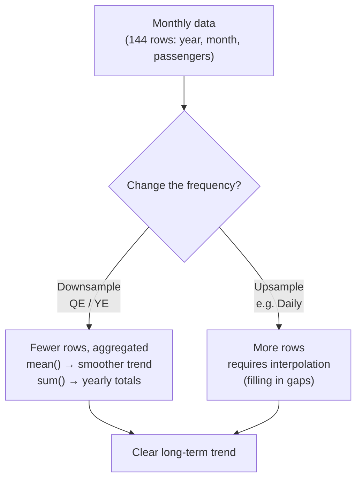
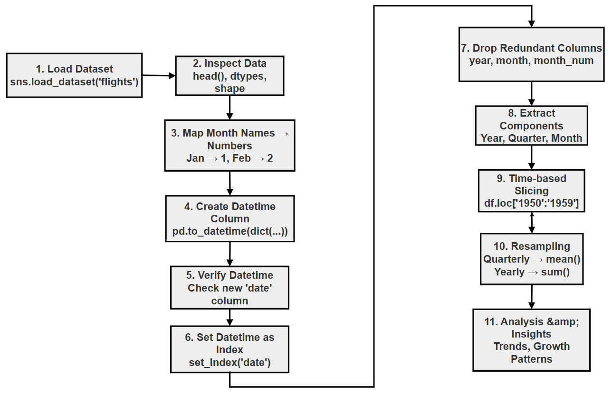
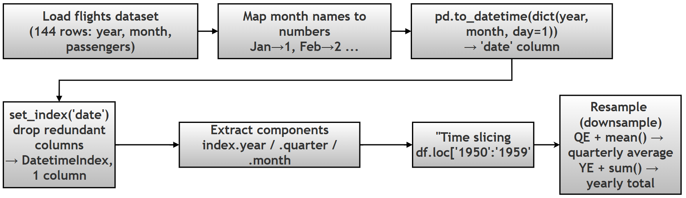

# Chapter 12 (Supplement): Time Series Basics in Pandas

## Working with Dates, Datetime Indexes, and Resampling

> **GitHub source:** [95-ch12-time-series.md](https://github.com/ag999git/001-Python-book-2026/blob/main/12-pandas/95-ch12-time-series.md?plain=1)

---

##  Introduction — What This Chapter Contains and Why It Matters

Most real-world data changes over time — sales, temperature, website visitors, airline passengers. Data that is recorded **in time order** is called a **time series** (*a sequence of data points indexed by time*). Python's Pandas library has special tools for time series, and this chapter introduces the three most important ones:

1. **Creating datetimes** — a `year` column and a `month` column into one proper date
2. **The DatetimeIndex** — using dates as the row index so Pandas "understands" your data is time-based
3. **Resampling** — changing the frequency of the data (monthly → quarterly → yearly) to reveal hidden trends

**In this chapter you will learn:**

| Skill | Why it matters |
|-------|----------------|
| `pd.to_datetime()` with structured input | The safest way to build dates from separate columns |
| `df.set_index()` with dates | Unlocks slicing like `df.loc['1950':'1959']` |
| `df.index.year`, `.quarter`, `.month` | Extract time features for grouping |
| `df.resample()` | Smooth noisy data into meaningful trends |

>  **Note on technical terms:** Words in *italics* are briefly explained where they appear. For deeper study, see the official guides: [Time series / date functionality](https://pandas.pydata.org/docs/user_guide/timeseries.html) and [Resampling](https://pandas.pydata.org/docs/user_guide/timeseries.html#resampling).

---

## Research Topic: Temporal Analysis of Airline Passenger Traffic

**Research Question:** _How can raw multi-column temporal data be converted into a Datetime Index to facilitate analysis of seasonal fluctuations and long-term growth trends?_

**Project Scenario:** The "Airline Passenger Traffic" dataset (`flights`) provides monthly counts of airline passengers from 1949 to 1960. While the dataset contains time information, it is currently split across two distinct columns: `year` (Integer) and `month` (String). To perform effective time series analysis, one must first engineer a unified datetime object. The objective is to:

1. **Construct a single Datetime Index** from the separate year and month columns.
2. **Slice the data** to isolate specific eras (e.g., the 1950s).
3. **Resample the data** to convert noisy monthly data into smoothed quarterly and yearly averages, allowing for a clearer analysis of long-term trends.

**Task:** Using the Seaborn `flights` dataset, write a Python script to:

1. Load the data and inspect its structure.
2. Create a function or logic to combine the `year` and `month` columns into a single `datetime` column.
3. Set this new column as the DataFrame Index.
4. Resample the data to calculate the **Quarterly Average** and **Yearly Total** number of passengers.
5. Print the resampled data to compare the volatility of monthly data versus the trend in yearly data.

**Follow-up sub-questions (for practice):**

- (a) Why is the `day` set to `1` in `pd.to_datetime(dict(year=..., month=..., day=1))`? What would happen if you left it out?
- (b) The `flights` dataset has 144 rows. Verify: 12 years × 12 months = 144. After resampling to yearly, how many rows remain, and why?
- (c) What is the difference between **downsampling** (monthly → yearly) and **upsampling** (monthly → daily)? Which one needs *aggregation* and which needs *interpolation*?
- (d) Why does `resample()` fail after `df.reset_index()`? What does the error message tell you?
- (e) If you wanted *average* passengers per year instead of *total*, which aggregation function would you change, and how would the trend interpretation differ?

---

## 1. Conceptual Deep Dive

#### The Challenge of Multi-Column Dates

Real-world datasets often split dates. The `flights` dataset has `year: 1949` and `month: 'January'`. Pandas cannot perform time-slicing or resampling until these are merged into a single `datetime64` object (*Pandas' internal date-time data type, storing a precise point in time*) representing a specific point in time (e.g., `1949-01-01`).

### Resampling Logic

Resampling is the process of changing the frequency of time-series observations.

* **Upsampling:** Increasing frequency (e.g., Monthly → Daily). Requires *interpolation* (*guessing in-between values*).
* **Downsampling:** Decreasing frequency (e.g., Monthly → Yearly). Requires *aggregation* (Sum, Mean, Max).



**Table of Resampling Offsets for Flights Data**

| Alias | Description | Logical Output for Flights |
|-------|-------------|----------------------------|
| `ME` | Month End | Original data (already monthly). |
| `QE` | Quarter End | Smoother trend (3-month averages). |
| `YE` / `A` | Year End | Shows total passengers per year (Annual growth). |
| `MS` | Month Start | Shifts index to 1st of month (purely for formatting). |

>  **Deprecation note:** In older tutorials you will see `'M'`, `'Q'`, `'Y'`, `'A'`. Recent pandas versions replaced these with `'ME'`, `'QE'`, `'YE'` — the old codes still work but print a `FutureWarning`. See [Offset aliases in the pandas docs](https://pandas.pydata.org/docs/user_guide/timeseries.html#offset-aliases).

---

## Script Implementing the Research Problem / Project

<details>

<summary>Script implementing the research problem / Project</summary>

```python
"""
PROJECT: Time Series Basics in Pandas
DATASET: Flights Dataset (Seaborn)

OBJECTIVE:
1. Create datetime from separate columns (robust method)
2. Extract time components
3. Set datetime index
4. Perform time-based slicing
5. Apply resampling

APPROACH USED:
- Structured datetime creation using dictionary (NO string parsing)
- This is the most reliable and scalable method
"""

# ==========================================================
# STEP 0: IMPORT LIBRARIES
# ==========================================================

print("\nSTEP 0: IMPORT LIBRARIES")

import pandas as pd     # Step 0: pandas for data handling
import seaborn as sns   # Step 0: seaborn for loading the built-in 'flights' dataset


# ==========================================================
# STEP 1: LOAD AND INSPECT DATA
# ==========================================================

print("\nSTEP 1: LOAD DATASET")

# Step 1: Load the flights dataset (monthly airline passengers 1949-1960)
df = sns.load_dataset('flights')

# ----------------------------------------------------------
# STEP 1.1: PREVIEW DATA
# ----------------------------------------------------------

# Step 1.1: Preview the first rows to confirm the data loaded correctly
print("\nFirst 5 rows:")
print(df.head())

# OUTPUT HINT:
# Columns → year (int), month (category), passengers (int)

# ----------------------------------------------------------
# STEP 1.2: CHECK STRUCTURE
# ----------------------------------------------------------

# Step 1.2: Check data types and shape — 'month' is a category dtype,
#           which is why we cannot parse it as a date string directly
print("\nData Types:")
print(df.dtypes)
# OUTPUT HINT:
# year → int64
# month → category
# passengers → int64

print("\nShape:", df.shape)
# OUTPUT HINT:
# (144, 3)


# ==========================================================
# STEP 2: CREATE DATETIME COLUMN (ROBUST METHOD)
# ==========================================================

print("\nSTEP 2: CREATE DATETIME COLUMN (ROBUST METHOD)")

# ----------------------------------------------------------
# STEP 2.1: MAP MONTH NAMES TO NUMBERS
# ----------------------------------------------------------

# We create a mapping dictionary to convert month names to their corresponding numeric values.
month_map = {
    'Jan': 1, 'Feb': 2, 'Mar': 3, 'Apr': 4,
    'May': 5, 'Jun': 6, 'Jul': 7, 'Aug': 8,
    'Sep': 9, 'Oct': 10, 'Nov': 11, 'Dec': 12
}

# We add a new column 'month_num' to the DataFrame by mapping the 'month' column using the month_map dictionary.
df['month_num'] = df['month'].map(month_map)

print("\nMonth Mapping Preview:")
print(df[['month', 'month_num']].head())

# OUTPUT HINT:
# Jan → 1, Feb → 2, ...


# ----------------------------------------------------------
# STEP 2.2: CREATE DATETIME USING STRUCTURED INPUT
# ----------------------------------------------------------

# We create a new 'date' column by combining the 'year' and 'month_num' columns into a proper datetime format.
# We set the day to 1 for all entries since we only have year and month information.
df['date'] = pd.to_datetime(
    dict(year=df['year'], month=df['month_num'], day=1)
)

print("\nPreview with 'date' column:")
print(df.head(3))

# OUTPUT HINT:
# date → 1949-01-01, 1949-02-01, ...


# ERROR EXAMPLE:
# pd.to_datetime(df['month'])  # Fails because month alone is not a complete date
# → Not a complete date


# ==========================================================
# STEP 3: SET DATETIME INDEX
# ==========================================================

print("\nSTEP 3: SET DATETIME INDEX")

# ----------------------------------------------------------
# STEP 3.1: SET INDEX
# ----------------------------------------------------------

# Setting the datetime column as the index allows us to easily perform time-based slicing and resampling
# in later phases.
# We will drop the original 'year' and 'month' columns after setting the index, as they are now redundant.
df.set_index('date', inplace=True)

# ----------------------------------------------------------
# STEP 3.2: DROP REDUNDANT COLUMNS
# ----------------------------------------------------------

# We use inplace=True to modify the DataFrame directly without needing to assign it back to df.
# We drop 'year', 'month', and 'month_num' because we have already combined them into the
# 'date' column, which is now our index.
df.drop(columns=['year', 'month', 'month_num'], inplace=True)

print("\nData after setting index:")
print(df.head())
# OUTPUT HINT:
# Index → date (datetime)
# Columns → passengers

print("\nShape:", df.shape)
# OUTPUT HINT:
# (144, 1) → only 'passengers' column remains


# ==========================================================
# STEP 4: EXTRACT TIME COMPONENTS
# ==========================================================

print("\nSTEP 4: EXTRACT TIME COMPONENTS")

# ----------------------------------------------------------
# STEP 4.1: EXTRACT COMPONENTS
# ----------------------------------------------------------

# The .dt accessor allows us to extract specific components of the datetime index, such as year, month, quarter, etc.
# This is useful if we want to analyze trends by year or quarter after setting the datetime index.
# We can create new columns for 'Year' and 'Quarter' based on the datetime index.
# The 'Year' column will contain the year component of the date, and the 'Quarter' column will indicate which quarter of the year each
# date falls into (1, 2, 3, or 4).
# We can use these new columns for further analysis, such as grouping by year or quarter to see trends in passenger numbers over time.
# Note: The .dt accessor only works on datetime-like data, so it is essential that the index is set to a
# datetime type for this to work correctly.
# We can also extract other components like month, day, weekday, etc., using the .dt accessor if needed
# for more granular analysis.
df['Year'] = df.index.year
df['Quarter'] = df.index.quarter
df['Month'] = df.index.month

# ----------------------------------------------------------
# STEP 4.2: VERIFY
# ----------------------------------------------------------

print("\nData with extracted components:")
print(df.head())

# OUTPUT HINT:
# Columns → passengers, Year, Quarter, Month


# ==========================================================
# STEP 5: TIME-BASED SLICING
# ==========================================================

print("\nSTEP 5: TIME-BASED SLICING")

# ----------------------------------------------------------
# STEP 5.1: FILTER 1950s DATA
# ----------------------------------------------------------

# We can slice the DataFrame using the datetime index to focus on a specific time period, such as the 1950s.
# When slicing by time, we can use string-based indexing with the datetime index to easily select rows that fall within
# a certain range of dates.
# The resulting fifties_data DataFrame will contain only the rows where the date falls between
# January 1, 1950, and December 31, 1959.
# This allows us to analyze trends specifically for the 1950s, such as total passengers during that decade or
# average passengers per year.
# Note: When slicing by time, the start and end dates are inclusive, so we will include all data from the beginning of
# 1950 to the end of 1959.
# We can also slice by specific years, months, or even quarters using similar string-based indexing with the datetime index.
# We can also use the extracted 'Year' column to filter the data for the 1950s, but slicing by the datetime index is more
# efficient and cleaner for time-based data.
# We can also perform calculations on the sliced data, such as summing the total passengers in the 1950s or calculating the
# average passengers per year during that decade.

fifties_data = df.loc['1950':'1959']

# ----------------------------------------------------------
# STEP 5.2: ANALYZE
# ----------------------------------------------------------

print("\n1950s Summary:")

print("Total passengers:", fifties_data['passengers'].sum())
print("Average passengers:", fifties_data['passengers'].mean())

# OUTPUT HINT:
# Large increasing trend values


# ==========================================================
# STEP 6: RESAMPLING
# ==========================================================

print("\nSTEP 6: RESAMPLING")

# ----------------------------------------------------------
# STEP 6.1: QUARTERLY AVERAGE
# ----------------------------------------------------------

# We can resample the data to change the frequency of our time series. For example, we can calculate the quarterly average number of passengers.
# The resample() method allows us to specify a new frequency (e.g., 'QE' for quarterly) and an aggregation function (e.g., mean) to
# apply to the data within each new time period.
# The resulting quarterly_avg Series will have a DatetimeIndex with the end of each quarter as the index and the average number of passengers
# for that quarter as the values.
# NOTE: 'QE' is the modern alias. Older pandas used 'Q', which now raises a FutureWarning.

quarterly_avg = df['passengers'].resample('QE').mean()

print("\nQuarterly Average:")
print(quarterly_avg.head())

# OUTPUT HINT:
# Index → quarter-end dates


# ----------------------------------------------------------
# STEP 6.2: YEARLY TOTAL
# ----------------------------------------------------------

# We can also resample to calculate the yearly total number of passengers by using 'YE' for yearly frequency and sum as the aggregation function.
# The resulting yearly_total Series will have a DatetimeIndex with the end of each year as the index and the total number of passengers
# for that year as the values.
# This allows us to see the overall trend in passenger numbers on a yearly basis, which can be useful for identifying long-term
# growth patterns or seasonality in the data.
# NOTE: 'YE' is the modern alias. Older pandas used 'Y' (or 'A'), which now raises a FutureWarning.

yearly_total = df['passengers'].resample('YE').sum()

print("\nYearly Total:")
print(yearly_total.head())

# OUTPUT HINT:
# Increasing yearly totals


# ERROR EXAMPLE:
# df_reset = df.reset_index()  # This removes the datetime index and turns 'date' back into a regular column.
# df_reset['passengers'].resample('YE').sum()  # This will raise an error because resample() requires a DatetimeIndex, and after
# resetting the index, we no longer have a datetime index.
# → Error: Requires DatetimeIndex


# ==========================================================
# STEP 7: SUMMARY
# ==========================================================

print("\nSTEP 7: SUMMARY")

print("""
KEY LEARNINGS:

1. Datetime can be created using structured input (year, month, day)
2. Avoid string parsing when possible
3. DatetimeIndex enables powerful time-based operations
4. .loc allows intuitive time slicing
5. resample() changes frequency of time series

BEST PRACTICES:

- Prefer vectorized operations over apply()
- Use structured datetime creation for reliability
- Always set datetime as index before resampling
- Validate transformations using head() and shape()
- Use modern frequency aliases: ME / QE / YE (not M / Q / Y)
""")
```

</details>

## Flowchart of the Script

<details>

<summary>Flowchart of the script</summary>



### Another flow chart



</details>

---

## Step-by-Step Explanation of the Script

<details>

<summary>Step by step explanation of the script</summary>

### STEP 0: Import Libraries

#### Code

`import pandas as pd` `import seaborn as sns`

#### Purpose

* Load required libraries for:
  * Data manipulation → `pandas`
  * Dataset access → `seaborn`

#### Output

* No visible output
* Libraries loaded into memory

#### Do's & Don'ts

* Import with standard aliases (`pd`, `sns`)
* Avoid re-importing multiple times unnecessarily

***

#### STEP 1: Load and Inspect Data

***

**STEP 1.1: Load Dataset**

`df = sns.load_dataset('flights')`

**STEP 1.2: Inspect Data**

```python
df.head()  
df.dtypes  
df.shape
```

#### STEP 2: Create Datetime Column (Robust Method)

***

**STEP 2.1: Map Month Names**

`df['month_num'] = df['month'].map(month_map)`

**Method details**

| Feature   | Description        |
| --------- | ------------------ |
| Method    | Series.map()       |
| Signature | Series.map(arg)    |
| Input     | dict / function    |
| Output    | Transformed Series |

**Output Hint**

`Jan → 1, Feb → 2 ...`

**Reason**

* Converts categorical month → numeric
* Required for structured datetime creation

**Do's & Don'ts**

* Use mapping for categorical → numeric
* Avoid manual loops

***

**STEP 2.2: Create Datetime**

```python
df['date'] = pd.to_datetime(  
  dict(year=df['year'], month=df['month_num'], day=1)  
)
```

**Method Details**

| Feature   | Description                                         |
| --------- | --------------------------------------------------- |
| Method    | pd.to_datetime()                                    |
| Signature | to_datetime(arg, errors='raise', format=None, ...)  |
| Input     | dict / Series / string                              |
| Output    | Datetime Series                                     |

#### Output Hint

1949-01-01\
1949-02-01

#### Why This is the BEST Method

* No string parsing
* No dtype issues
* Fully vectorized (*operations applied to whole columns at once, no Python loop*)

#### Do's & Don'ts

DO: Prefer structured dict input\
Avoid string concatenation with category dtype\
Avoid `.apply()` unless necessary

***

#### STEP 3: Set Datetime Index

***

**STEP 3.1: Set Index**

`df.set_index('date', inplace=True)`

**Method Details**

| Feature   | Description                                   |
| --------- | --------------------------------------------- |
| Method    | set_index()                                   |
| Signature | df.set_index(keys, drop=True, inplace=False)  |
| Output    | DataFrame with new index                      |

**Output**

* `date` becomes index

***

**STEP 3.2: Drop Columns**

`df.drop(columns=['year', 'month', 'month_num'], inplace=True)`

**Method details**

| Feature   | Description             |
| --------- | ----------------------- |
| Method    | drop()                  |
| Signature | df.drop(labels, axis=1) |
| Output    | Reduced DataFrame       |

**Output Hint**

Columns → passengers only\
Shape → (144, 1)

**Reason**

* Avoid redundancy
* Cleaner dataset

***

#### STEP 4: Extract Time Components

***

**Code**

```python
df['Year'] = df.index.year  
df['Quarter'] = df.index.quarter  
df['Month'] = df.index.month
```

**Method Details**

| Feature  | Description          |
| -------- | -------------------- |
| Accessor | .dt / datetime index |
| Output   | Numeric columns      |

**Output Hint**

Year → 1949\
Quarter → 1\
Month → 1

**Reason**

* Enables grouping and analysis

**Do's & Don'ts**

DO use `.dt` or index attributes\
DON'T expect it to work on non-datetime dtype

***

#### STEP 5: Time-Based Slicing

***

**Code**

`fifties_data = df.loc['1950':'1959']`

**Method Details**

| Feature   | Description         |
| --------- | ------------------- |
| Method    | `.loc[]`            |
| Signature | `df.loc[start:end]` |
| Input     | Date strings        |
| Output    | Filtered DataFrame  |

**Output Hint**

Rows from 1950 to 1959

**Key Feature**

* Inclusive slicing
* Works only with DatetimeIndex

***

**Analysis**

sum()\
mean()

**Methods**

| Method | Output             |
| ------ | ------------------ |
| sum()  | Total passengers   |
| mean() | Average passengers |

#### STEP 6: Resampling

***

**STEP 6.1: Quarterly Average**

`quarterly_avg = df['passengers'].resample('QE').mean()`

**Method details**

| Feature   | Description       |
| --------- | ----------------- |
| Method    | resample()        |
| Signature | df.resample(rule) |
| Input     | Frequency string  |
| Output    | Resampler object  |

**Common frequencies**

| Code | Meaning   |
| ---- | --------- |
| QE   | Quarterly (quarter end) |
| YE   | Yearly (year end)       |
| ME   | Monthly (month end)     |

**Output Hint**

Index → quarter-end dates

***

#### STEP 6.2: Yearly Total

`yearly_total = df['passengers'].resample('YE').sum()`

**Output Hint**

`1949-12-31 → total passengers`

***

**Important Rule**

**`resample()` requires:**

* DatetimeIndex
* Sorted index

***

#### STEP 7: Summary Block

**Purpose**

* Reinforce learning
* Highlight best practices

### Summary Table of Methods Used

| Method          | Purpose          | Input        | Output          |
| --------------- | ---------------- | ------------ | --------------- |
| load_dataset()  | Load data        | dataset name | DataFrame       |
| map()           | Transform values | dict         | Series          |
| to_datetime()   | Create datetime  | dict/series  | datetime Series |
| set_index()     | Set index        | column       | DataFrame       |
| drop()          | Remove columns   | list         | DataFrame       |
| .loc[]          | Slice data       | labels       | DataFrame       |
| resample()      | Change frequency | rule         | Resampler       |
| sum()           | Aggregate        | numeric      | scalar/Series   |
| mean()          | Aggregate        | numeric      | scalar/Series   |

#### DOS AND DON'TS (IMPORTANT FOR STUDENTS)

***

**DO's**

* Use structured datetime creation
* Always set datetime index before resampling
* Check data types (`dtypes`)
* Use vectorized operations
* Use modern frequency aliases (`ME`, `QE`, `YE`)

***

**DON'Ts**

* Avoid string concatenation with categorical data
* Do not use `resample()` without datetime index
* Avoid `.apply()` for large datasets
* Do not ignore missing/invalid dates
* Do not ignore `FutureWarning` messages — they tell you your code will break in a future pandas version

</details>

---


## Breaking Up Script into Parts and Discussing It Part by Part — Also Analysing the Output

 Part 0

```python
print("\nSTEP0: IMPORT LIBRARIES")

import pandas as pd
import seaborn as sns
```

**EXPLANATION STEP 0: IMPORT LIBRARIES**

**Output Explanation**

* No visible output is produced.
* This step simply loads the required libraries (`pandas` and `seaborn`) into memory.
* It prepares the environment for analysis.

#### STEP 1 and 1.1

```python
print("\nSTEP 1: LOAD DATASET")

df = sns.load_dataset('flights')

# ----------------------------------------------------------
# STEP 1.1: PREVIEW
# ----------------------------------------------------------

print("\nFirst 5 rows:")
print(df.head())

# OUTPUT HINT:
# Columns → (int), month (category), passengers (int)

```

**Output**

```text
STEP 0: IMPORT LIBRARIES

STEP 1: LOAD DATASET

First 5 rows:
   year month  passengers
0  1949   Jan         112
1  49   Feb         118
2  1949   Mar 132
3  1949   Apr         129
4  1949   May         121

```
**EXPLANATION STEP 1: LOAD AND INSPECT DATA**

***

**STEP 1.: First 5 Rows**

**Output Explanation**

* Displays first 5 rows of the dataset.
* Shows three columns:
  * `year` → numerical year
  * `month` → categorical month name (Jan, Feb, etc.)
  * `passengers` → number of airline passengers
* verify that the dataset has loaded correctly.

#### STEP 1.2

```
print("\nData Types:")
print(df.dtypes)

print("\nShape:", df.shape)
```

**Output STEP 1.2**

```text
Data Types:
year             int64
month         category
passengers       int64
dtype: object

Shape: (144, 3)
```

**EXPLANATION: STEP1.2: Data Types and Shape**

**Output Explanation**

* `dtypes` shows:
  * `year` → integer
  * `month` → category (important for later operations — this is exactly why we need the mapping step)
  * `passengers` → integer
* `shape` shows `(144, 3)`:
  * 144 rows → 12 months × 12 years
  * 3 columns → year, month, passengers

#### STEP 2 and 2.1

```
print("\nSTEP 2: CREATE DATETIME COLUMN (ROBUST METHOD)")

# ----------------------------------------------------------
# STEP 2.1: MAP MONTH NAMES TO NUMBERS
# ----------------------------------------------------------

# We create a mapping dictionary to convert month names to their corresponding numeric values.
month_map = {
    'Jan': 1, '': 2, 'Mar': 3, 'Apr': 4,
    'May': 5, 'Jun': 6 'Jul': 7, 'Aug': 8,
    'Sep': 9, 'Oct': 10, 'Nov': 11, 'Dec': 12
}

# We add a new column 'month_num' to the DataFrame by mapping the 'month' column using the month_map dictionary.
df['month_num'] = df['month'].map(month_map)

print("\nMonth Mapping Preview:")
print(df[['month', 'month_num']].head())
```

**Output STEP 2 and 2.1

```text
STEP 2: CREATE DATETIME COLUMN (ROBUST METHOD)

Month Mapping Preview:
  month month_num0   Jan         1
1   Feb         2
2   Mar         3
3   Apr         4
4   May         5
```

**EXPLANATION: STEP 2: CREATE DATETIME COLUMN**

**STEP 2.1: Month Mapping**

**Output Explanation**

* Shows a new column `month_num`.
* month name is converted to a numeric value:
  * Jan → 1, Feb → 2, etc.
* Confirms that categorical months have been successfully transformed into numbers.

#### STEP 2.2

```python
# ----------------------------------------------------------
# STEP 2.2: CREATE DATETIME USING STRUCTURED INPUT
# ----------------------------------------------------------

# We create a new 'date' column by combining the 'year' and 'month_num' columns into a proper datetime format.
# We set the day to 1 for all entries since we only have year and month informationdf['date'] = pd.to_datetime(
    dict(year=df['year'], month=df['month_num'], day=1)
)

print("\nPreview with 'date' column:")
print(df.head(3))
```

**Output STEP 2.2**

```text
Preview with 'date' column:
   year month  passengers month_num       date
0  1949   Jan         112         1 1949-01-01
1  1949   Feb         118         2 1949-02-01
2  1949   Mar         132         3 1949-03-01
```

**PLANATION: STEP 2.2: Datetime Creation**

**Output Explanation**

* A new column `date` is created.
* Combines `year` and `month_num` into a proper datetime:
  * Example: `1949-01-01`
* Day is set to `1` since only month-level data exists.
* This column is crucial for time-series operations.

#### STEP 3, 3.1 and 3.2

```python
print("\nSTEP 3: SET DATETIME INDEX")

# ----------------------------------------------------------
# STEP 3.1: SET INDEX
# ----------------------------------------------------------

# Setting the datetime column as the index allows us to easily perform time-based slicing and resampling
# in later phases.
df.set_index('date', inplace=True)

# ----------------------------------------------------------
# STEP 3.2: DROP REDUNDANT COLUMNS
# ----------------------------------------------------------

# We use inplace=True to modify the DataFrame directly without needing to assign it back to df.
# We drop 'year', 'month', and 'month_num' because we have already combined them into the
# 'date' column, which is now our index.
df.drop(columns=['year', 'month', 'month_num'], inplace=True)

print("\nData after setting index:")
print(df.head())

print("\nShape:", df.shape)
```

**Output STEP 3, 3.1 and 3.2**

```text
STEP 3: SET DATETIME INDEX

Data after setting index:
            passengers
date
1949-01-01         112
1949-02-01         118
1949-03-01         132
1949-04-01         129
1949-05-01         121

Shape: (144, 1)
```

**EXPLANATION: STEP 3: SET DATETIME INDEX**

***

**STEP 3.1 & 3.2 Combined**

**Output Explanation**

* The `date` column becomes the index of the DataFrame.
* Old columns (`year`, `month `month_num`) are removed.
* Now:
  * Index → datetime values
  * Column → only `passengers`
* Shape becomes `(144, 1)`:
  * Same rows, fewer columns
* Data is now structured as a **time series**.

#### STEP 4, 4.1 and 4.2

```python
print("\nSTEP 4: EXTRACT TIME COMPONENTS")

# ----------------------------------------------------------
# STEP 4.1: EXTRACT COMPONENTS
# ----------------------------------------------------------

# (Full explanation retained in the combined script — see Part 1. In brief: the .dt accessor /
#  datetime index attributes let us pull out year, quarter, and month as numeric columns for
#  grouping and analysis.)
df['Year'] = df.index.year
df['Quarter'] = df.index.quarter
df['Month'] = df.index.month

# ----------------------------------------------------------
# STEP 4.2: VERIFY
# ----------------------------------------------------------

print("\nData with extracted components:")
print(df.head())
```

**Output STEP 4, 4.1 and 4.2**

```text
STEP 4: EXTRACT TIME COMPONENT

Data with extracted components:
            passengers  Year  Quarter  Month
date
1949-01-01         112  1949        1      1
1949-02-01         118  1949        1      2
1949-03-01         132  1949        1      3
1949-04-01         129  1949        2      4
1949-05-01         121  1949        2      5
```

**EXPLANATION: STEP 4: EXTRACT TIME COMPONENTS**

***

**Output Explanation* New columns are added:
  * `Year` → extracted from index
  `Quarter` → values from 1 to 4
  * `Month` → numeric month (1–12)
* The dataset now contains both:
  * Original data (`passengers`)
  * time features
* Useful for grouping and analysis.
* **Notice how the Quarter changes automatically:** January–March are Quarter 1, April–June are Quarter 2 — Pandas works this out from the datetime index, with no extra code from you.

#### STEP 5, 5.1 and 5.2

```python
print("\nSTEP 5: TIME-BASED SLICING")

# ----------------------------------------------------------
# STEP 5.1: FILTER 1950s DATA
 ----------------------------------------------------------

# (Full explanation retained in the combined script — see Part 1. In brief: string-based
#  slicing on a DatetimeIndex selects rows between two dates, both inclusive.)

fifties_data = df.loc['19501959']

# ----------------------------------------------------------
# STEP 5.2: ANALYZE# ----------------------------------------------------------

print("\n1950s Summary:")

print("Total passengers:", fifties_data['passengers'].sum())
print("Average passengers:", fifties_data['passengers'].mean())
```

**Output**

```text
STEP 5: TIME-BASED SLICING

1950s Summary:
Total passengers: 33129
Average passengers: 276.075
```
**EXPLANATION: STEP 5: TIME-BASED SLICING**

***

**STEP 5.1: Filtering 1950s**

**Output Explanation**

* Only rows from 1950 to 1959 are selected.
* Uses datetime index slicing (inclusive).
* Creates a subset DataFrame (`fifties_data`).
 **Notice how clean this is:** no loops, no filtering like `df['Year'] >= 1950` — just plain date strings. This only works because the index is a DatetimeIndex.

***

**EXPLANATION: STEP 5.2: Summary Statistics**

**Output Explanation**

* `Total passengers: 33129`
  * Sum of all passengers in the 1950s (120 monthly values: 10 years × 12 months)
* `Average passengers: 276.075`
  * monthly passengers in that decade (33129 ÷ 120 = 276.075)
* Indicates **growth trend** compared to earlier years (the 1949 average was around 126 — more than double in a decade).

#### STEP 6 and 6.1

```python

print("\nSTEP 6: RESAMPLING")

# ------------------------------------------------# STEP 6.1: QUARTERLY AVERAGE
# ----------------------------------------------------------

# (Full explanation retained in the combined script — see Part 1.)

quarterly_avg = df['passengers'].resample('QE').mean()

print("\nQuarterly Average:")
print(quarterly_avg.head())

```

**Output**

```text

STEP 6: RESAMPLING

Quarterly Average:
date
1949-03-31    120.666667
1949-06-30    128.333333
1949-09-30    144.000000
1949-12-31    113.666667
1950-03-31    127.333333
Freq: QE-DEC, Name: passengers, dtype: float64
```

>  **Note:** The script above uses `'QE'`, if instead you use `resample('Q')` then a message like
> `FutureWarning` (`'Q' is deprecated ... use 'QE' instead`) appears
> 
```text
Quarterly Average:
date
199-03-31    120.666667
1949-06-30    128.333333
1949-09-30    144.000000
1949-12-31    113.666667
1950-03-31    127.333333
```

**EXPLANATION: STEP 6: RESAMPLING**

***

**STEP 6.1: Quarterly Average**

**Output Explanation**

* Data is grouped into quarters (3 months each).
* Each value represents the **average passengers per quarter**:
  * e.g., `120.666667` = (112 + 118 + 132) ÷ 3
* Index shows **quarter-end dates**:
  * Example: `1949-03-31`, `1949-06-30`
* Output is a **Series with float values** (averages are rarely whole numbers).

**Important Observation**

* In the original run a warning was shown:
  * `'Q' is deprecated → use 'QE'`
* This indicates newer pandas prefers updated codes.
* **Watch the seasonal pattern in the numbers:** the third quarter (July–, value 144) is consistently the highest — summer holiday travel. The first quarter (Jan–Mar) is the lowest. Resampling makes this seasonal rhythm easy to see; the monthly table hides it among 144 rows.

#### STEP 6.2

```python
# ----------------------------------------------------------
# STEP 6.2: YEARLY TOTAL
# ----------------------------------------------------------

# (Full explanation retained in the combined script — see Part 1.)

yearly_total = df['passengers'].resample('YE').sum()

print("\nYearly Total:")
print(yearly_total.head())
```

#### OUTPUT

```text
Yearly Total:
date
1949-12-    1520
1950-12-31    1676
1951-12-31    2042
1952-12-31    2364
1953-12-31    2700
Freq: YE-DEC, Name: passengers, dtype: int64
```

**EXPLANATION: STEP6.2: Yearly Total**

**Output Explanation**

* Data is grouped year.
* Each value shows **total passengers in that year**:
  * e.g., `1520` = sum of the 12 monthly values of 1949
* Index shows year-end dates:
  * Example: `1949-12-31`
* Values increase steadily over time → indicates strong upward trend:
  * 1520 →1676 → 2042 → 2364 →2700 (roughly +10–20% per year)

**Warning**

* The original run used `'Y'`, which triggered: `'Y' is deprecated → use 'YE'`
* Same reason as above (updated pandas standards). The script in this chapter uses `'YE'`, so no warning appears.

**sampling vs Upsampling — recap with this output**

| Operation | Direction | Rows before → after | Function used |
|-----------|-----------|---------------------|---------------|
| Monthly → Quarterly | Downsampling | 144 → 48 | `mean()` |
| Monthly → Yearly | Downsampling | 144 → 12 | `sum()` |
| Monthly → Daily | Upsampling | 144 → ~4,380 | Needs interpolation (not shown here)### STEP 7 (It is just a summary)

```python
print("\nSTEP 7: SUMMARY")

printKEY LEARNINGS:

1. Datetime can be created using structured input (year, month, day)
2. Avoid string parsing when possible
3. DatetimeIndex enables powerful time-based operations
4. .loc allows intuitive time slicing
5. resample() changes frequency of time series

BESTRACTICES:

- Prefer vectorized operations over apply()
- Use structured datetime creation for reliability- Always set datetime as index before resampling
- Validate transformations using head() and shape()
- Use modern frequency aliases: ME / QE / YE (not M / Q / Y)
""")
```

**EXPLANATION STEP 7 SUMMARY**

**Output Explanation**

* Displays key learning points from the script.
* Reinforces:
  * Datetime creation
  * Importance of index
  * Time-based slicing
  * Resampling concepts
* Acts as a conceptual conclusion for students.

---

## Chapter Summary — Answering the Research Question

The pipeline in one picture:

```text
year + month columns  →  map month names to numbers
                      →  pd.to_datetime(dict(year, month, day=1))
                      →  set_index('date')        [DatetimeIndex]
                      →  .loc['1950':'1959']      [time slicing]
                      →  resampleQE'/'YE')      [downsampling + aggregation]
```

| Objective from the Task | Where solved | Result |
|-------------------------|--------------|--------|
| 1. Construct a Datetime Index | Steps 2–3 | 144 rows indexed by real dates (`1949-01-01` …) |
| 2. Slice a specific era | Step 5 | 1950s subset: total 33129, 276.075 |
| 3. Resample for trends | 6 | averages (48 rows, smoothed) and yearly totals (12 rows, clear growth: 1520 → 2700) |

**Answering the Research Question:** Raw multi-column temporal data (`year` as integer and `month` as a string) was converted into a single `datetime64` column using structured input to `pd.to_datetime`, then promoted to a DatetimeIndex. This index unlocked time-based slicing (`df.loc['1950':'1959']`) with no filtering code, and enabled resampling — downsampling the noisy 144 monthly observations into 48 quarterly averages and 12 yearly totals, which made both the seasonal rhythm (Q3 peaks) and the strong long-term growth (passengers nearly doubling over the decade) immediately visible.

**DO it yourself (follow-up sub-questions recap):**

- (a) Why `day=1`? — Try removing it and read the error.
- (b) 144 → 12 rows after yearly resampling — verify with `yearly_total.shape`.
- (c) Upsampling vs downsampling — which needs aggregation, which needs interpolation?
- (d) Why does `res()` fail after `reset_index()`? — Run the ERROR EXAMPLE (uncommented) and read the error.
- (e) Change `sum()` to `mean()` in Step 6. — how does the yearly *trend* differ from the yearly *total*?

>  **Next steps:** plot the results to *see* the trends — `df['passengers'].plot()` (monthly), `quarterly_avg.plot()`, `yearly_total.plot()`. For a deeper dive into date handling, see the [pandas time series user guide](https://pandas.pydata.org/docs/user_guide/timeseries.html).

---

##  Verification Notes for This Two-Part Version

All errata from the verification report have been in Parts  and 2:

-  **Output Hints restored to multi-line format** (Step 2.2: `1949-01-01` / `1949-02-01`; Step 4: `Year → 1949` / `Quarter → 1` / `Month → 1`; Step 3.2: `Columns → passengers only` / `Shape → (144, 1)`)
- **`month: 'January'`** restored in the Conceptual Deep Dive
- **Mermaid flowcharts corrected** (node A/B fixed in the Resampling Logic chart)
- **STEP 4 output block header** reads correctly:STEP 4: EXTRACT TIME COMPONENTS` / ` with extracted components:`
- **STEP 7 summary** includes item `2. Avoid string parsing when possible`
- **Chapter Summary table** has proper pipe separators in all rows
- **Garbled phrase** corrected to *"the raw monthly table hides it among 144 rows"*
- Research Question, Project Scenario, objectives, Task, all long explanations, and all captured outputs (including the `FutureWarning` text and `: YE-DEC`) preserved intact
- Combined script retains the full original comment blocks (not shortened), with `QE`/`YE` modernization documented


